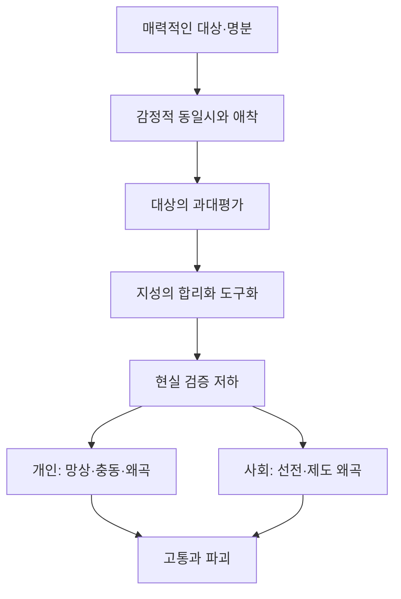

# 『현대인의 의식 지도』 제7장  
## 「무엇이 ‘진짜’인가?」―도입부·「하나의 해석으로서의 실재」·「실재를 분간하는 능력」

**제7장 진행 1**

이 발췌는 제7장 전체의 인식론적 토대를 세웁니다. 핵심은 단순히 “사람마다 관점이 다르다”는 데 있지 않습니다. 호킨스 박사님께서는 한층 더 근본적으로, **인간이 ‘진짜’라고 느끼는 감각 자체가 어떻게 구성되며, 왜 그 감각만으로는 진실을 보증할 수 없는가**를 설명하십니다. fileciteturn1file0

---

# ① 핵심 명제

## 핵심 명제

> 인간은 자신이 경험하는 현실을 곧 실재 자체라고 믿지만, 실제로 그 현실 감각은 의식 수준·감정·기억·교육·문화·신념이 함께 구성한 주관적 해석이다.

그리고 인간 정신에는 그 해석이 진실인지 독립적으로 확인할 내부 기준이 없습니다.

따라서 진실을 분간하려면 다음 두 가지가 필요합니다.

1. 자신의 지각이 잠정적인 해석임을 인정하는 겸손  
2. 개인적 정신 바깥에서 참조할 수 있는 독립적인 진실의 기준

---

## 쉽게 말하면

사람은 보통 다음과 같이 생각합니다.

> “내가 분명히 보고 느꼈으므로 이것은 사실이다.”

그러나 호킨스 박사님의 설명은 다음과 같습니다.

> “분명하게 느껴진다는 사실은 그 경험이 강하다는 뜻이지, 그 해석이 진실이라는 뜻은 아니다.”

꿈속에서도 사건은 진짜처럼 느껴집니다. 분노할 때에는 상대가 악의적으로 보이고, 두려울 때에는 세계 전체가 위험하게 보이며, 자부심에 빠지면 자신이 옳다는 감각이 의심할 수 없을 만큼 확실하게 느껴집니다.

그러므로 구별해야 할 것은 다음입니다.

| 구분 | 의미 |
|---|---|
| 주관적 확실성 | 나에게 틀림없이 진짜처럼 느껴지는 정도 |
| 진실성 | 개인의 감정이나 믿음과 무관하게 실제로 참인 정도 |
| 지각 | 정신이 선택하고 해석한 외관 |
| 실재 | 지각이나 의견에 좌우되지 않는 본질 |
| 현실 감각 | 여러 내외적 요소가 합쳐져 만들어진 경험적 초점 |

이 장은 **주관적 확실성과 진실성은 같은 것이 아니다**라는 명제에서 시작합니다.

---

# ② 전체 전개 지도

이번 발췌의 논리는 여덟 단계로 진행됩니다.

### 1. 인간은 자기 지각을 진실이라고 자동적으로 추정한다

사람은 자신의 견해가 단순한 견해라고 느끼지 않습니다. 그것을 사실·진실·올바름으로 경험합니다.

### 2. ‘옳음’은 에고의 정체성과 결합한다

자신의 의견이 틀렸다는 사실은 단순한 정보 수정으로 끝나지 않습니다. 자존감·자부심·도덕적 우월성이 위협받는 것처럼 느껴집니다.

### 3. 정신은 가정과 유추로 현실 모형을 만든다

정신은 모든 것을 직접 알 수 없으므로 제한된 정보로 잠정적인 세계 모형을 구성합니다.

### 4. 감정이 정보의 중요도와 우선순위를 결정한다

똑같은 정보라도 두려움·분노·욕망·자부심 가운데 어느 장이 지배하느냐에 따라 전혀 다르게 해석됩니다.

### 5. 의식 수준이 전체 처리 구조를 지배한다

나이·교육·지능·경험도 중요하지만, 그 모든 요소를 어떤 맥락에서 통합하는지는 전반적인 의식 수준에 좌우됩니다.

### 6. 따라서 체험되는 현실은 실재 자체가 아니라 해석이다

현실 감각은 생활에 유용하지만, 그 자체로 입증된 진실은 아닙니다.

### 7. 에고는 자기 내부에서 자신을 검증할 수 없다

에고는 자신이 만든 자료를 자신이 만든 기준으로 판정합니다. 그러므로 자체 오류를 스스로 확인할 독립적 기준이 없습니다.

### 8. 외부의 절대적 참고 기준이 필요하다

호킨스 박사님께서는 이를 나침반·별·GPS에 비유하시며, 의식 척도를 진실을 확인하기 위한 참고 좌표로 제시하십니다. fileciteturn1file1

---

# ③ 소주제별 상세 분석

## 1. 인간은 왜 자신의 관점을 ‘진짜’라고 믿는가

### 핵심 명제

인간 정신은 자신의 지각이 하나의 해석이라는 사실을 보지 못하고, 그것을 실재 그 자체라고 자동적으로 전제합니다.

사람에게는 보통 다음과 같은 구별이 없습니다.

> “나는 이렇게 보고 있다.”

와

> “실제로 세계가 이러하다.”

첫 번째는 지각에 대한 진술입니다.  
두 번째는 실재에 대한 진술입니다.

그러나 에고는 두 문장을 하나로 합쳐 버립니다.

> “내가 이렇게 보고 있으므로 실제로도 그러하다.”

이것이 인간 갈등의 가장 깊은 뿌리입니다. 양쪽 모두 자신의 관점을 의견이 아니라 ‘사실’로 경험하기 때문에, 상대의 다른 관점은 단순한 차이가 아니라 오류·무지·편견·부도덕으로 보입니다.

---

### 용어 해석: ‘진짜라는 감각’

여기서 ‘진짜라는 감각’은 객관적 진실을 뜻하지 않습니다.

그것은 정신이 어떤 내용을 받아들일 때 동반되는 **주관적 실재감**입니다.

예를 들어 다음의 상태들도 각각 강한 실재감을 가질 수 있습니다.

- 꿈
- 최면
- 환각
- 정치적 열광
- 집단적 공포
- 분노에 찬 확신
- 종교적 광신
- 피해의식
- 자부심에 근거한 도덕적 우월감

정신은 내용이 참이어서 실재감을 느끼는 것이 아니라, **자신의 처리 체계 안에서 그 내용이 지배적인 위치를 차지했기 때문에** 실재감을 느낄 수 있습니다.

따라서 다음 공식이 성립합니다.

> 강한 확신 ≠ 높은 진실성

---

## 2. ‘옳음’에 대한 에고의 기득권

### 핵심 명제

에고에게 ‘옳음’은 지식의 문제가 아니라 생존과 정체성의 문제입니다.

호킨스 박사님께서는 에고의 나르시시즘적 핵심이 스스로 옳다는 데 특별한 권리를 주장한다고 설명하십니다.

에고의 구조는 대략 다음과 같습니다.

> 내가 옳다  
> → 내 판단은 가치 있다  
> → 나는 중요한 사람이다  
> → 내 위치는 보호되어야 한다  
> → 나를 반박하는 사람은 위협이다

그러므로 어떤 사람의 신념을 반박하면, 그는 정보가 수정되는 것으로 받아들이지 않고 자신이 공격받는 것으로 경험할 수 있습니다.

---

### ‘옳음’과 자부심

의식 지도에서 자부심은 175입니다. 자부심의 특징은 자신이 옳다는 위치를 통해 정체성과 가치를 유지하는 것입니다.

자부심의 장에서는 다음과 같은 태도가 나타납니다.

- 자신의 견해를 자신과 동일시함
- 틀렸다는 사실을 굴욕으로 받아들임
- 의견 수정이 패배처럼 느껴짐
- 반대자를 열등하거나 무지하다고 규정함
- 사실보다 체면과 지위를 지키려 함
- 도덕적 우월성을 권력으로 사용함

이 때문에 국내외 정치 투쟁에서는 단순히 정책의 효용성만 다투는 것이 아니라, 어느 편이 ‘도덕적으로 옳은 편’인가를 차지하려는 경쟁이 벌어집니다.

도덕적 우위는 에고에 다음과 같은 보상을 제공합니다.

> “나는 단순히 이익을 추구하는 사람이 아니라 정의를 대표한다.”

이 위치를 차지하면 자신의 공격성·증오·권력욕까지 정의의 이름으로 정당화할 수 있습니다.

---

## 3. 신념 체계가 행동과 생존을 결정하는 방식

### 핵심 명제

신념은 머릿속에만 존재하는 추상적 의견이 아닙니다. 신념은 감정·행동·충성·선택을 조직하는 내부 운영 체계입니다.

정신의 처리 과정은 대략 다음 순서를 따릅니다.

> 정보  
> → 유추와 가정  
> → 감정적 가치 부여  
> → 중요도 계층화  
> → 믿음 또는 불신  
> → 확실성 또는 의심  
> → 충성·헌신·행동

즉 사람은 정보를 있는 그대로 저장하지 않습니다.

각 정보에 다음과 같은 표지를 붙입니다.

- 중요하다 / 중요하지 않다
- 안전하다 / 위험하다
- 나에게 유리하다 / 불리하다
- 우리 편이다 / 적이다
- 옳다 / 틀리다
- 선하다 / 악하다

그 결과 세계는 중립적인 정보의 집합이 아니라, 이미 감정적으로 분류된 의미의 체계로 경험됩니다.

---

### 감정적 계층화

예를 들어 동일한 사회적 사건을 보아도 의식 장에 따라 다음과 같이 달라질 수 있습니다.

| 지배적 장 | 사건의 해석 |
|---|---|
| 두려움 | “이것은 나의 안전을 위협한다.” |
| 욕망 | “이것으로 무엇을 얻을 수 있는가?” |
| 분노 | “누군가 책임지고 처벌받아야 한다.” |
| 자부심 | “이 사건은 내가 옳다는 것을 증명한다.” |
| 용기 | “사실을 확인하고 대응할 수 있다.” |
| 수용 | “전체 조건과 나의 책임을 함께 보아야 한다.” |
| 이성 | “자료·원인·구조를 분석해야 한다.” |
| 사랑 | “전체 생명에 가장 이로운 방향은 무엇인가?” |

사건이 의식 장을 만드는 것이 아니라, 상당 부분은 **의식 장이 사건의 의미를 선택합니다.**

---

## 4. 현실 감각을 구성하는 수백만 개의 요소

### 핵심 명제

한순간의 현실 경험조차 단일한 감각 자료에서 직접 생기는 것이 아닙니다. 수많은 내부·외부 조건이 동시에 결합한 결과입니다.

본문이 제시하는 주요 요소는 다음과 같습니다.

- 나이와 성별
- 교육과 언어 능력
- 지능
- 뇌 생리학
- 과거 경험과 경력
- 훈련
- 심리적·지적 전문성
- 문화적 전제
- 정치적 환경
- 사회가 자명하다고 받아들이는 공리
- 의도
- 헌신
- 내면화된 목표
- 주의를 두는 방식
- 전반적인 의식 수준

여기에서 가장 중요한 점은 의식 수준이 다른 요인 하나와 나란히 놓이는 변수가 아니라는 사실입니다.

> 의식 수준은 다른 모든 요소가 어떻게 선택되고, 배열되고, 해석되는지를 지배하는 상위 맥락입니다.

지능이 높아도 의식 수준이 낮다면 지능은 합리화·조작·궤변에 사용될 수 있습니다. 교육을 많이 받아도 자부심이나 적대감이 지배하면 지식은 기존 위치를 방어하는 무기가 됩니다.

반대로 의식 수준이 높아지면 제한된 정보 속에서도 겸손·정직·유연성·맥락 이해가 나타납니다.

---

## 5. 사회적 공리와 보이지 않는 프로그램

### 핵심 명제

개인은 자신이 독립적으로 사고한다고 느끼지만, 실제 현실 감각에는 사회가 당연하다고 전제하는 수많은 공리가 들어 있습니다.

공리란 증명하지 않고도 자명하다고 받아들이는 기본 전제입니다.

예를 들면 한 사회는 다음과 같은 내용을 당연하게 받아들일 수 있습니다.

- 인간은 본래 경쟁적이다.
- 행복은 소유에서 온다.
- 성공은 지위로 측정된다.
- 다수의 의견은 진실에 가깝다.
- 전문가의 견해는 객관적이다.
- 과학으로 측정되지 않는 것은 존재하지 않는다.
- 모든 진실은 문화가 만든 것이다.
- 피해자가 도덕적으로 우월하다.
- 강한 감정은 진정성의 증거다.

이러한 전제는 대개 의식적으로 검토되지 않습니다. 문화 안에서 반복되기 때문에 현실 그 자체처럼 느껴집니다.

따라서 개인의 ‘현실’에는 개인적 기억뿐 아니라 집단적 프로그램도 포함됩니다.

---

# ④ 「하나의 해석으로서의 실재」

## 1. 현실 감각은 유용하지만 입증되지는 않는다

호킨스 박사님께서는 일상적인 현실 감각을 완전히 무가치하다고 말씀하시는 것이 아닙니다.

선형적 세계에서 살아가려면 사물·시간·거리·원인·개인을 구별해야 합니다. 이러한 현실 모형은 기능적으로 필요합니다.

그러나 다음 두 명제는 다릅니다.

> 이 해석은 생활에 유용하다.

> 이 해석은 궁극적으로 참이다.

지도는 길을 찾는 데 유용하지만 실제 영토 자체는 아닙니다. 마찬가지로 정신의 현실 모형은 세상을 다루는 데 유용하지만 실재 전체와 동일하지 않습니다.

『나의 눈』에서도 호킨스 박사님께서는 지각된 세계가 정신의 선택과 투사를 통해 구성되며, 현존의 상태에서는 평상시의 분리·시간·행위자라는 구조가 절대적 실재가 아니었음이 드러난다고 설명하십니다. fileciteturn0file6

---

## 2. 모든 정신적 명제는 잠정적이다

정신은 언제나 제한된 자료를 이용합니다.

- 모든 사실을 알지 못합니다.
- 미래의 정보를 알 수 없습니다.
- 자신의 무의식적 동기를 전부 보지 못합니다.
- 다른 사람의 내면을 직접 알 수 없습니다.
- 전체 맥락을 완전히 파악하지 못합니다.
- 자신의 의식 수준 바깥을 충분히 이해하지 못합니다.

따라서 정신이 내린 결론은 최종적 진실이라기보다 현재 자료를 이용한 잠정적 모형입니다.

이 한계를 인정하는 것이 본문에서 말하는 지혜입니다. fileciteturn1file7

---

## 3. 지혜의 본질: 겸손과 유연성

여기서 겸손은 자신을 낮추거나 무능하다고 여기는 것이 아닙니다.

겸손은 다음과 같은 인식입니다.

> “내가 아는 것은 전체의 일부이다.”

> “현재의 이해는 새로운 정보에 따라 수정될 수 있다.”

> “강한 확신이 반드시 진실을 뜻하지는 않는다.”

> “내 의식 수준이 내가 볼 수 있는 범위를 제한할 수 있다.”

유연성 역시 아무 의견도 갖지 않는 태도가 아닙니다. 현재 가장 타당한 결론을 사용하되, 그것을 에고의 정체성으로 만들지 않는 능력입니다.

따라서 지혜로운 정신은 확신을 갖더라도 경직되지 않습니다.

---

# ⑤ 「실재를 분간하는 능력」

## 1. 인간 정신은 믿음에 기초한다

호킨스 박사님께서는 믿음을 종교에만 한정하지 않으십니다.

인간의 모든 정신 작용은 믿음을 전제로 합니다.

- 감각이 외부 세계를 정확하게 반영한다고 믿습니다.
- 기억이 과거를 정확히 보존한다고 믿습니다.
- 논리가 올바르게 작동한다고 믿습니다.
- 언어가 의미를 정확히 전달한다고 믿습니다.
- 자신의 판단이 합리적이라고 믿습니다.
- 다른 사람에게도 세계가 비슷하게 보인다고 믿습니다.

그러므로 믿음이 없는 정신은 작동할 수 없습니다.

문제는 믿음의 존재가 아니라, **믿고 있으면서도 자신에게 믿음이 없다고 생각하는 것**입니다.

---

## 2. 회의주의가 지닌 자기모순

본문에서 회의주의는 160으로 제시됩니다.

회의주의자는 흔히 자신이 믿음을 거부하고 오직 의심과 검증만을 따른다고 생각합니다. 그러나 호킨스 박사님께서는 회의주의 또한 특정 신념 체계라고 설명하십니다.

회의주의자는 대개 다음을 믿습니다.

- 의심하는 태도가 믿는 태도보다 우월하다.
- 감각적으로 입증되지 않는 것은 의심해야 한다.
- 높은 영적 실재는 존재하지 않거나 알 수 없다.
- 의미와 맥락보다 관찰 가능한 내용이 우선한다.
- 자신의 회의적 기준은 객관적이다.

그러나 회의주의는 자신의 회의주의 자체를 다시 의심하지 않습니다.

> “모든 것을 의심해야 한다.”

라고 주장하면서,

> “모든 것을 의심해야 한다는 이 명제도 의심해야 하는가?”

라는 질문은 적용하지 않는 것입니다.

따라서 회의주의는 믿음이 없는 상태가 아니라 **의심을 절대화한 믿음**입니다. fileciteturn1file1

---

## 3. 에고의 폐회로 구조

### 핵심 명제

에고는 자기 내부의 자료만으로 작동하기 때문에, 자신이 만든 오류를 독립적으로 검사할 수 없습니다.

구조는 다음과 같습니다.

> 에고가 경험을 해석함  
> → 그 해석을 사실로 저장함  
> → 저장된 사실을 기준으로 새 경험을 해석함  
> → 기존 믿음과 일치하는 정보를 선택함  
> → 기존 믿음이 더욱 확실해짐

예를 들어 “사람은 믿을 수 없다”는 믿음이 생기면 다음과 같은 폐회로가 만들어집니다.

> 의심스러운 행동에만 주목함  
> → 중립적인 행동도 의심스럽게 해석함  
> → 방어적으로 관계함  
> → 상대가 거리를 둠  
> → “역시 사람은 믿을 수 없다”는 결론을 얻음

에고는 자신의 믿음이 결과를 만드는 데 참여했다는 사실을 보지 못하고, 결과가 믿음을 입증했다고 생각합니다.

---

### 에고의 ‘순진무구함’

호킨스 박사님께서 에고를 순진무구하다고 표현하시는 것은 에고의 행동이 모두 선하다는 뜻이 아닙니다.

그 의미는 다음과 같습니다.

> 에고는 자신이 믿는 내용을 진실로 오인하면서도, 자신이 오인하고 있다는 사실을 알 수 없다.

에고는 거짓을 선택하면서 “나는 거짓을 선택한다”고 생각하지 않습니다.

언제나 자신이 생각하는 선·안전·행복·정의를 추구합니다. 다만 본질과 외관을 구별하지 못하여 환상적인 선을 실제 선으로 오인합니다.

이것이 『의식혁명』과 『현대인의 의식 지도』 전체에서 반복되는 인간 딜레마입니다. fileciteturn0file3

---

## 4. 해상 선박과 GPS의 비유

본문의 가장 중요한 비유입니다.

### 방향을 알 수 없는 선박

선박 안에서 아무리 정교하게 계산해도, 외부의 고정된 참조점이 없다면 실제 방향이 맞는지 확인할 수 없습니다.

배가 북쪽으로 가고 있다고 내부적으로 확신하더라도, 조류와 바람으로 방향이 틀어졌을 수 있습니다.

### 인간 정신

인간 정신도 동일합니다.

- 논리가 정교할 수 있습니다.
- 자료가 많을 수 있습니다.
- 내부적으로 일관될 수 있습니다.
- 많은 사람이 동의할 수 있습니다.

그러나 그 모든 것이 하나의 잘못된 전제 위에서 작동할 수 있습니다.

따라서 내부적 일관성은 진실의 충분조건이 아닙니다.

### 외부 참고점

별·나침반·GPS는 선박 내부의 추측과 무관하게 방향을 알려 줍니다.

마찬가지로 진실을 판별하려면 개인의 호불호·신념·집단적 동의와 무관한 참조 기준이 필요합니다.

호킨스 박사님께서는 의식 연구와 의식 척도를 이 참조 기준으로 제시하십니다.

---

# ⑥ 절대주의 650과 절대자 1000

이 부분에서는 두 용어를 구별하는 것이 중요합니다.

## 절대주의—650

절대주의는 절대적 진실의 실재를 인식하는 의식의 패러다임입니다.

이는 흔히 말하는 독단주의나 권위주의와 다릅니다. 여기서 절대주의란 개인적 의견을 절대화하는 태도가 아니라 다음의 인식입니다.

> 개인의 지각과 무관하게 진실 자체가 존재한다.

즉 진실은 개인이나 문화가 만들어 내는 것이 아니라, 인간의 동의 여부와 관계없이 실재합니다.

## 절대자—1000

절대자는 절대적 진실에 관한 철학적 견해가 아니라, 모든 상대적 수준의 궁극적 근원이자 기준입니다.

따라서 둘의 관계는 다음과 같습니다.

| 용어 | 의미 |
|---|---|
| 절대주의 650 | 절대적 진실의 존재를 인식하는 의식의 패러다임 |
| 절대자 1000 | 모든 상대적 측정의 궁극적 기준인 실재 자체 |

650은 절대자에 대한 매우 높은 인식의 장이고, 1000은 인간 영역에서 드러나는 궁극적 기준점입니다.

---

# ⑦ 의식 수준 200의 의미

본문은 의식 수준 200 이하를 거짓의 영역, 200 이상을 점진적으로 진실한 영역으로 설명합니다.

이것은 사람을 선인과 악인으로 단순 분류하는 도덕적 낙인이 아닙니다.

핵심은 **에너지 장의 방향성**입니다.

## 200 이하

- 감정이 지각을 지배함
- 외부를 탓하는 경향
- 본질보다 외관에 반응함
- 자기 이익을 진실보다 우선함
- 거짓을 스스로 교정하기 어려움
- 생명을 약화하는 방향으로 움직임

## 200 이상

- 책임을 받아들일 수 있음
- 사실을 인정할 수 있음
- 자기 견해를 수정할 수 있음
- 진실을 체면보다 우선할 수 있음
- 생명을 지지하는 방향으로 움직임
- 점차 본질과 맥락을 분간함

200은 모든 것을 완전히 아는 수준이 아니라, **진실을 받아들이고 오류를 수정할 수 있는 방향 전환점**입니다.

---

# ⑧ 상대주의가 스스로를 무효화하는 구조

본문에서 상대주의는 모든 진리가 사회적·언어적 구성물이라고 주장합니다.

그 주장을 논리적으로 적용하면 다음과 같습니다.

> 모든 진술은 언어적으로 만들어진 상대적 구성물이다.

그렇다면 이 문장 역시 언어적으로 만들어진 상대적 구성물이어야 합니다.

따라서 상대주의는 다음 두 선택 중 하나를 해야 합니다.

### 첫 번째

“모든 진술은 상대적이다”라는 문장도 상대적이라고 인정합니다.

그러면 그 문장은 보편적으로 참이라고 주장할 수 없습니다.

### 두 번째

“모든 진술은 상대적이다”라는 문장만은 절대적으로 참이라고 주장합니다.

그러면 적어도 하나의 절대적 진실을 인정하게 되므로 자신의 전제와 충돌합니다.

이 때문에 호킨스 박사님께서는 상대주의가 자기 기준에 따라 스스로 허위가 된다고 설명하십니다. fileciteturn1file0

---

# ⑨ 타 저서와의 연결

## 『의식혁명』

『의식혁명』의 중심 발견은 인간 정신이 독자적으로 진실과 거짓을 분간하지 못하며, 200이 생명을 약화하는 낮은 힘과 생명을 지지하는 힘을 나누는 임계점이라는 것입니다. 제7장은 그 발견을 인간의 현실 감각 형성 과정에 적용합니다. fileciteturn0file3

## 『나의 눈』

『나의 눈』에서는 평상시의 지각 세계가 실재 전체가 아니라 정신의 제한된 구성임이 현존의 관점에서 드러납니다. 제7장은 이 고차원적 명제를 일반적인 인식 과정의 언어로 풀어 설명합니다. fileciteturn0file6

## 『신의 현존의 발견』

이 저서에서는 언어와 정신화가 실재를 지시할 수는 있지만 실재 자체가 될 수 없다고 설명됩니다. 언어적 구성물을 실재로 오인하는 것이 바로 상대주의와 정신적 위치성의 한계입니다. fileciteturn1file19

## 『의식수준을 넘어서』

각 의식 수준은 단순한 감정이 아니라 고유한 세계관·신관·자기관을 형성합니다. 따라서 사람은 하나의 공통된 세계를 중립적으로 본 뒤 다른 의견을 갖는 것이 아니라, 의식 장에 따라 서로 다른 ‘현실’을 경험합니다. fileciteturn0file1

---

# ⑩ 의식 수준 반영

이번 발췌에서 명시되거나 구조적으로 연결되는 주요 수준은 다음과 같습니다.

| 의식 수준 | 발췌에서의 의미 |
|---:|---|
| 160 | 회의주의. 의심 자체를 절대화하며 더 높은 맥락을 거부함 |
| 175 | ‘내가 옳다’는 자부심과 도덕적 우월성의 배경 |
| 200 | 진실을 받아들이고 자기 오류를 수정할 수 있는 전환점 |
| 400대 | 자료·논리·분석을 통해 지식을 조직하는 이성의 영역 |
| 650 | 절대적 진실이 존재한다는 패러다임적 인식 |
| 1000 | 모든 상대적 수준의 궁극적 기준인 절대자 |

여기서 상승이 의미하는 것은 정보량이 많아진다는 뜻만이 아닙니다.

> 의식이 높아질수록 정신은 자신의 지각과 실재를 구별할 수 있고, 내용만이 아니라 맥락을 이해하며, 옳음에 대한 에고의 집착보다 진실 자체를 우선하게 됩니다.

---

# ⑪ 구조 관계 정리

이 발췌의 전체 구조는 다음 하나의 연쇄로 압축할 수 있습니다.

> 에고의 나르시시즘  
> → 자신이 옳다는 전제  
> → 지각을 사실로 오인  
> → 감정에 따른 정보 계층화  
> → 신념 체계 형성  
> → 선택적 지각과 자기확증  
> → 현실 감각의 고착  
> → 타인의 다른 현실과 충돌  
> → 도덕적·정치적 투쟁  
> → 독립적 진실 기준의 필요성

해결의 방향은 반대 순서입니다.

> 독립적 진실 기준  
> → 지각과 본질의 구별  
> → 신념의 잠정성 인정  
> → 겸손과 유연성  
> → 자기 교정 가능성  
> → 맥락의 확장  
> → 실재를 분간하는 능력의 성장

---

# ⑫ 전체 통합 정리

이 발췌에서 호킨스 박사님께서 말씀하시는 가장 근본적인 사실은 다음과 같습니다.

> 인간의 문제는 단순히 진실을 충분히 배우지 못한 데 있는 것이 아니라, 자신이 믿고 있는 것을 이미 진실이라고 느끼도록 정신이 구성되어 있다는 데 있습니다.

에고는 자신의 지각을 실재라고 믿고, 그 실재를 통해 다시 자신의 지각을 검증합니다. 그러므로 내부적으로 일관되면서도 전체적으로는 잘못된 세계관이 얼마든지 만들어질 수 있습니다.

‘내가 옳다’는 감각은 자존감과 도덕적 지위에 결합하여 쉽게 수정되지 않습니다. 그 결과 진실의 탐구는 어느 순간 에고의 위치를 지키기 위한 투쟁으로 바뀝니다.

지혜는 많은 것을 확신하는 데서 시작하지 않습니다.

> 자신의 정신적 결론이 잠정적 해석임을 인정하는 데서 시작합니다.

그러나 박사님께서는 모든 지식이 잠정적이라는 사실을 다시 상대주의로 연결하지 않으십니다. 인간의 해석은 상대적일 수 있지만, **해석의 상대성이 진실 자체의 부재를 뜻하지는 않기 때문입니다.**

따라서 이번 발췌의 최종 구별은 다음과 같습니다.

> 지각은 상대적이지만 실재는 상대적이지 않습니다.  
> 정신의 모형은 잠정적이지만 진실 자체는 존재합니다.  
> 개인적 확신은 오류일 수 있지만, 입증 가능한 진실의 기준은 존재합니다.

이것이 제7장 「무엇이 ‘진짜’인가?」가 출발하는 자리입니다.

---

# 『현대인의 의식 지도』 제7장 「무엇이 ‘진짜’인가?」
## 「진실과 실재의 진보적 본성」·「영적인 것은 ‘진짜’인가?」

## 1. 핵심 명제

이 발췌의 중심 명제는 다음과 같습니다.

> **진실과 실재 자체가 시간에 따라 변하는 것이 아니라, 인간 의식이 그것을 파악하고 설명하는 능력이 진화하면서 진실이 점진적으로 더 분명하게 드러납니다.**

따라서 호킨스 박사님께서 말씀하시는 **‘진보적 본성’**은 진실 자체의 변화가 아닙니다. 그것은 다음의 변화입니다.

- 정보의 축적
- 검증 기준의 정교화
- 패러다임의 확장
- 맥락의 심화
- 의식 수준의 상승
- 진실에 대한 인간 이해의 정확도 증가

쉽게 말하면, **실재는 그대로 있지만 인간이 그것을 보는 창은 계속 넓어지는 것**입니다.

---

# 2. 전체 전개 지도

이 발췌는 일곱 단계로 전개됩니다.

### ① 인간의 정보 처리는 진화한다
지식은 처음부터 완전하게 주어지는 것이 아니라 시간 속에서 축적되고 교정됩니다.

### ② 사실과 사실의 의미는 구별된다
사건 자체가 변하지 않더라도 그 사건의 의미와 중요성은 더 큰 맥락이 발견되면서 달라집니다.

### ③ 인간의 모든 정보와 신념은 잠정적이다
정신이 만든 설명은 제한된 시대·문화·교육·감정·패러다임에 의존하기 때문입니다.

### ④ 진실에 대한 이해는 사람마다 다르다
같은 대상을 두고도 ‘안다’, ‘생각한다’, ‘믿는다’, ‘느낀다’, ‘직관한다’는 서로 다른 인식 방식이 작동합니다.

### ⑤ 진실과 실재 자체는 객관적이다
인간의 이해가 가변적인 것과 진실 자체가 상대적이라는 것은 전혀 다른 주장입니다.

### ⑥ 영적 실재는 선형 과학의 대상과 성질이 다르다
영적 실재는 분리된 사물이나 사건이 아니라 전체 맥락, 의미, 현존, 주관적 앎에 관련됩니다.

### ⑦ 의식 연구는 주관적 영적 실재와 객관적 확인을 연결한다
영적 상태는 경험적으로 알려지는 동시에 의식 수준의 척도를 통해 확인 가능한 것으로 제시됩니다.

---

# 3. 가장 중요한 구조: 무엇이 변하고 무엇이 변하지 않는가

이 발췌를 정확히 이해하려면 네 층을 구별해야 합니다.

| 층위 | 성격 | 변화 여부 |
|---|---|---|
| **실재 Reality** | 존재하는 것의 본질 | 변하지 않음 |
| **진실 Truth** | 실재와 완전히 일치하는 앎 | 본질적으로 변하지 않음 |
| **정보·사실 진술** | 실재를 언어와 개념으로 기술한 것 | 수정될 수 있음 |
| **해석·신념·의미 부여** | 개인과 사회가 정보를 이해하는 방식 | 지속적으로 변함 |

호킨스 박사님께서 “모든 신념과 정보는 잠정적이다”라고 하시는 것은 **진실 자체가 잠정적이라는 뜻이 아닙니다.**

잠정적인 것은 다음과 같습니다.

- 인간이 가진 자료
- 자료의 분류 방식
- 자료를 해석하는 이론
- 현재의 검증 기준
- 언어로 표현된 설명
- 관찰자의 이해 수준

반면 진실은 실재와의 일치이므로 관찰자의 견해에 의해 만들어지지 않습니다. 호킨스 박사님께서는 진실 수준 척도를 개인의 견해와 무관한 객관적이고 비개인적인 기준으로 제시하십니다. fileciteturn1file0

---

# 4. 소주제별 상세 분석

## 4-1. 정보 처리는 왜 ‘진화적’인가

인간 정신은 한 번에 전체를 인식하지 못합니다. 먼저 일부 자료를 확보하고, 그것을 기존 개념에 맞추어 해석합니다. 이후 새로운 자료가 나타나면 기존 설명을 수정합니다.

그 과정은 다음과 같습니다.

> 관찰  
> → 가설  
> → 임시 설명  
> → 추가 정보  
> → 기존 설명의 한계 발견  
> → 더 큰 패러다임  
> → 재맥락화

여기서 **재맥락화**가 핵심입니다.

새로운 지식은 단순히 옛 정보 위에 정보 하나를 더하는 것이 아니라, 기존 정보 전체가 놓인 맥락을 바꿉니다. 같은 사실도 더 큰 맥락 안에 배치되면 의미가 달라집니다.

예를 들어 뉴턴 물리학의 법칙은 거짓이 되어 폐기된 것이 아닙니다. 그것이 유효한 범위가 더 큰 물리학적 패러다임 안에서 다시 규정되었습니다. 뉴턴 역학은 일정한 조건에서는 여전히 유효하지만, 실재 전체를 설명하는 최종 패러다임은 아니게 된 것입니다.

따라서 지식의 진보는 흔히 다음처럼 진행됩니다.

> 이전 지식의 완전한 부정이 아니라  
> **적용 범위와 맥락의 재규정**

입니다.

---

## 4-2. 사실은 같아도 의미는 달라질 수 있다

호킨스 박사님께서는 사실과 의미를 구별하십니다.

- 사실은 관찰된 내용입니다.
- 의미는 그 사실이 전체 안에서 차지하는 위치입니다.
- 중요성은 그 사실이 다른 것과 어떤 관계를 갖는가에 달려 있습니다.

가령 역사적 사건은 이미 일어났으므로 사건 자체가 바뀌지는 않습니다. 그러나 새로운 기록이나 배경이 발견되면 다음이 달라질 수 있습니다.

- 사건의 원인에 대한 이해
- 참여자들의 의도
- 장기적 영향
- 사건이 문명 전체에서 차지하는 위치
- 당시에는 보이지 않았던 맥락

따라서 **사실의 고정성**과 **해석의 가변성**은 동시에 성립합니다.

이 구별이 없으면 두 가지 오류가 발생합니다.

### 첫 번째 오류
현재의 설명을 최종 진실로 절대화합니다.

### 두 번째 오류
설명이 바뀐다는 이유로 진실 자체도 존재하지 않는다고 결론 내립니다.

호킨스 박사님의 설명은 양쪽을 모두 넘어갑니다.

> 현재의 지식은 제한되어 있지만,  
> 그 제한 너머에는 객관적인 진실과 실재가 존재합니다.

---

## 4-3. “모든 신념과 정보는 잠정적이다”의 정확한 의미

여기서 **잠정적**이라는 말은 거짓이라는 뜻이 아닙니다.

잠정적이라는 것은 현재의 정보가 다음 조건에 제한되어 있다는 뜻입니다.

- 현재 이용 가능한 자료
- 현재의 과학 기술
- 현재의 언어
- 현재의 검증 기준
- 현재의 문화적 패러다임
- 이해하는 사람의 의식 수준

따라서 어떤 정보는 상당히 정확할 수 있지만 여전히 전체 실재를 완전히 포함하지는 못합니다.

이것은 지도와 실제 영역의 차이와 같습니다.

- 지도는 유용할 수 있습니다.
- 지도는 정확할 수도 있습니다.
- 그러나 지도는 실제 영역 전체가 아닙니다.
- 더 정밀한 지도가 나오면 이전 지도의 한계가 드러납니다.

마찬가지로 신념 체계는 인간이 살아가기 위해 사용하는 **잠정적 실재 모델**입니다. 인간 정신은 유추와 가정을 계층화하여 믿음과 행동을 위한 모델을 구성한다고 호킨스 박사님께서는 설명하십니다. fileciteturn1file5

---

## 4-4. 주관적 이해가 서로 다른 이유

진실을 접하는 방식은 사람마다 다릅니다.

발췌에서 제시된 표현들은 단순한 말투의 차이가 아니라 서로 다른 인식 양식을 나타냅니다.

| 표현 | 중심 기능 |
|---|---|
| “나는 안다” | 직접적 확신 또는 앎 |
| “나는 생각한다” | 개념·논리·추론 |
| “나는 느낀다” | 정서적 반응 |
| “나는 믿는다” | 신념과 동의 |
| “나는 신뢰한다” | 권위·관계·경험에 대한 의탁 |
| “나는 직관한다” | 비선형적이고 즉각적인 파악 |
| “나는 깨닫는다” | 전체 맥락의 갑작스러운 인식 |

사람은 대상을 순수하게 보는 것이 아니라 다음을 통하여 봅니다.

- 교육
- 전문 지식
- 지능
- 재능
- 가족 문화
- 사회적 가치
- 정서 상태
- 도덕적 훈련
- 편견
- 과거 경험
- 의식 수준

따라서 동일한 정보도 각자의 의식 장 안에서 선택되고 해석됩니다.

여기서 호킨스 박사님의 중요한 원리는 다음과 같습니다.

> 사람은 실재를 그대로 보는 것이 아니라  
> 자신의 의식 수준에서 볼 수 있는 실재를 봅니다.

---

## 4-5. ‘명시되지 않은 패러다임에 대한 충성’

대부분의 사람은 자신이 어떤 패러다임에 속해 있는지 의식하지 못합니다.

패러다임은 단순한 의견이 아니라 다음을 미리 결정하는 전체 틀입니다.

- 무엇을 실재라고 인정할 것인가
- 무엇을 증거라고 부를 것인가
- 어떤 질문이 합리적인가
- 어떤 답이 가능한가
- 무엇을 처음부터 배제할 것인가

예를 들어 물질주의적 패러다임에서는 측정 가능한 물리적 현상만을 실재로 인정합니다. 그러면 사랑, 의미, 아름다움, 신성, 현존과 같은 것은 실재라기보다 뇌의 부산물이나 개인적 감정으로 환원됩니다.

반대로 비선형적 영적 패러다임에서는 물질적 현상이 실재의 전부가 아니라 더 큰 의식 장 안에서 나타나는 내용으로 이해됩니다.

이때 패러다임에 대한 충성은 무언의 형태로 나타납니다.

> “측정되지 않으면 존재하지 않는다.”  
> “내가 경험하지 못했으므로 진짜가 아니다.”  
> “과학적 언어로 표현할 수 없으므로 의미가 없다.”

그러나 이러한 진술 자체도 특정 패러다임의 가정일 뿐입니다.

---

## 4-6. 진실과 실재의 등가성

호킨스 박사님의 용어 체계에서 **진실은 실재에 대한 의견이 아니라 실재와의 일치**입니다.

따라서 진실과 실재가 동일하다는 것은 다음을 뜻합니다.

> 진실한 앎에서는  
> 알려진 것과 실제로 존재하는 것 사이에 분리가 없습니다.

낮은 의식 상태에서는 실재와 정신의 표상이 뒤섞입니다.

- 지각을 실재라고 여깁니다.
- 감정을 사실이라고 여깁니다.
- 신념을 진실이라고 여깁니다.
- 해석을 사건 자체라고 여깁니다.

의식이 상승하면서 다음 구별이 가능해집니다.

> 지각 ≠ 본질  
> 견해 ≠ 진실  
> 설명 ≠ 실재  
> 정신의 내용 ≠ 의식 그 자체

궁극적인 수준에서는 진실이 외부의 대상에 관한 지식으로 남아 있지 않고, **실재 자체로서 주관적으로 알려지는 상태**가 됩니다.

『신의 현존의 발견』에서도 호킨스 박사님께서는 궁극적 진실이 근본적으로 주관적이면서 동시에 의식 연구를 통해 확인 가능하다고 설명하십니다. 영적 실상은 ‘내부의 경험적 주관성’과 ‘외부의 확인 가능성’ 양쪽에서 접근됩니다. fileciteturn2file1

---

## 4-7. 진실 진술에 반드시 맥락이 필요한 이유

발췌에서 가장 강조되는 문장은 사실상 이것입니다.

> 추정된 진실을 진술하려면 반드시 맥락을 자세히 설명해야 합니다.

내용만 따로 떼어 놓으면 같은 문장도 완전히 다른 의미가 될 수 있습니다.

맥락에는 다음이 포함됩니다.

- 누가 말했는가
- 무엇을 대상으로 말했는가
- 어떤 조건에서 성립하는가
- 어느 추상 수준의 진술인가
- 의도는 무엇인가
- 적용되는 범위는 어디까지인가
- 선형적 사실인가, 비선형적 의미인가

호킨스 박사님께서는 과학이 주로 **내용과 사실**을 다루는 반면, 영적 진실은 **맥락과 의미·가치·중요성**을 다룬다고 설명하십니다. 사실은 선형적이고 관찰 가능하지만, 진실은 비선형적이며 확인 가능한 것으로 구별됩니다. fileciteturn1file4

따라서 맥락 없는 진술은 일부 사실을 포함하더라도 전체로서는 왜곡될 수 있습니다.

---

# 5. 「영적인 것은 ‘진짜’인가?」 분석

## 5-1. 뉴턴 물리학의 사례가 제시되는 이유

뉴턴 역학은 한때 물리적 세계를 완전히 설명하는 최종 체계처럼 여겨졌습니다. 그러나 입자물리학, 상대성 이론, 양자 이론, 비선형 역학이 등장하면서 뉴턴적 설명은 더 큰 맥락 안에 배치되었습니다.

호킨스 박사님께서는 이를 통해 다음 원리를 보여 주십니다.

> 어떤 패러다임이 매우 성공적이라는 사실이  
> 그것이 실재 전체를 포함한다는 뜻은 아닙니다.

뉴턴 패러다임은 다음에 강합니다.

- 분리된 물체
- 위치
- 질량
- 운동
- 시간적 순서
- 원인과 결과
- 반복 가능한 측정

그러나 영적 실재는 이와 다른 성질을 가집니다.

- 비국소적
- 비선형적
- 비분리적
- 시간에 제한되지 않음
- 주관적으로 알려짐
- 내용보다 맥락에 관련됨
- 의미와 가치의 근원이 됨

따라서 물리적 대상에 적합한 방법으로 영적 실재를 재단하면 처음부터 범주를 혼동하게 됩니다.

---

## 5-2. 영적 실재가 ‘묘사하기 어려운’ 이유

영적 실재는 하나의 대상처럼 정신 앞에 놓여 있지 않습니다.

대상은 다음 구조를 가집니다.

> 관찰자 — 관찰 행위 — 관찰 대상

그러나 앞선 영적 상태에서는 이 분리가 약화되거나 사라집니다.

- 아는 자와 알려지는 것이 분리되지 않습니다.
- 경험자와 경험의 경계가 사라집니다.
- 현존은 특정 위치에 있지 않습니다.
- 전체 맥락이 한꺼번에 알려집니다.
- 언어 이전의 직접적인 앎이 나타납니다.

따라서 영적 실재는 개념으로 완전히 포착되지 않습니다. 언어는 본래 사물을 나누고 구별하며 순차적으로 기술하기 때문입니다.

W. 제임스가 제시한 여러 표현—형언 불가능함, 영원성, 신성함, 거룩함, 편재성—은 영적 실재의 정의라기보다 **비선형적 경험이 인간 언어로 번역될 때 나타나는 묘사들**입니다.

---

## 5-3. 내용이 아니라 맥락이라는 의미

영적 실재는 특정한 이미지나 환상, 감각적 현상을 가리키는 것이 아닙니다.

호킨스 박사님의 관점에서 영적 실재의 핵심은 다음과 같은 전체 조건입니다.

- 존재 자체의 신성
- 모든 생명의 하나임
- 현존
- 사랑
- 무시간성
- 비개인성
- 참나
- 의식의 장
- 실재의 주관성

즉 영적 실재는 ‘무엇을 보았는가’보다 **어떤 의식 상태에서 전체 실재가 알려졌는가**에 관련됩니다.

이 때문에 영적 진실에 ‘관하여’ 많은 정보를 아는 것과 영적 진실을 직접 아는 것은 다릅니다. 『신의 현존의 발견』에서는 지적 정보의 축적이 영적 에고가 될 수 있으며, 진실에 관하여 아는 것은 진실을 아는 것, 더 나아가 그것이 되는 것과 다르다고 설명됩니다. fileciteturn1file17

---

## 5-4. 여러 시대의 영적 스승들이 같은 실재를 묘사했다는 의미

종교와 전통의 외형은 서로 다릅니다.

- 언어가 다릅니다.
- 상징이 다릅니다.
- 의례가 다릅니다.
- 신학적 표현이 다릅니다.
- 문화적 배경이 다릅니다.

그러나 호킨스 박사님께서는 위대한 화신·성인·현자들의 핵심적 증언이 공통된 비선형적 실재를 가리킨다고 보십니다.

공통되는 핵심은 다음과 같습니다.

- 개인적 에고를 넘어선 정체성
- 하나임
- 무조건적 사랑
- 현존
- 영원성
- 신성
- 생각을 넘어선 앎
- 존재와 의식의 동일성

따라서 종교적 표현의 차이는 주로 **내용과 문화적 형식의 차이**이며, 그 배후의 영적 실재는 공통된 **맥락**으로 파악됩니다.

---

# 6. 의식 수준에 따른 영적 실재의 점진적 드러남

발췌에서는 영적 실재가 200부터 나타나기 시작해 500대와 600대를 거쳐 1000에 이른다고 설명합니다.

이는 영적 실재가 여러 개라는 뜻이 아닙니다. **동일한 실재가 의식의 수용 능력에 따라 서로 다른 정도로 드러난다는 뜻**입니다.

| 의식 수준 | 영적 실재가 드러나는 방식 |
|---|---|
| **200** | 진실·정직·책임·온전성의 문턱 |
| **300대** | 수용, 자발성, 의미 있는 참여 |
| **400대** | 이성, 학문, 개념적 이해, 체계화 |
| **500** | 사랑이 존재 방식으로 출현 |
| **540 이상** | 무조건적 사랑, 기쁨, 감사 |
| **570대** | 성인적 의식, 깊은 헌신과 신성의 인식 |
| **600대** | 침묵, 평화, 빛 비춤, 비이원적 상태의 개시 |
| **700대** | 참나 각성, 존재로서의 ‘나’ |
| **800대 이상** | 매우 미세한 이원성과 위치성의 초월 |
| **1000** | 인간계에서 가능한 완전한 깨달음, 위대한 화신의 수준 |

『호모 스피리투스』에서도 깨달음은 하나의 단일 상태가 아니라 600에서 1000까지의 점진적인 층위를 가지며, 각 수준이 서로 다른 앎과 영적 상태를 나타낸다고 설명됩니다. fileciteturn1file19

중요한 것은 수치 자체보다 **진실을 수용하는 의식의 역량이 점진적으로 확장된다**는 점입니다.

---

# 7. 주관적 영적 경험과 객관적 확인의 결합

보통은 다음과 같은 이분법이 설정됩니다.

### 과학
객관적이지만 영적 경험을 다루지 못합니다.

### 종교·영성
주관적 경험을 다루지만 외부에서 확인하기 어렵다고 여겨집니다.

호킨스 박사님께서는 의식 연구를 양자를 잇는 새로운 차원으로 제시하십니다.

> 영적 실재는 주관적으로 경험됩니다.  
> 그러나 그 진실 수준과 의식 수준은 비개인적으로 확인될 수 있습니다.

따라서 ‘주관적’이라는 말은 임의적이거나 허구적이라는 뜻이 아닙니다.

여기서 주관성은 오히려 다음을 뜻합니다.

- 존재는 오직 의식 안에서 알려집니다.
- 모든 경험은 주관성을 전제로 합니다.
- 사랑·의미·아름다움·신성은 일인칭으로 알려집니다.
- 궁극적 실재는 외부 대상이 아니라 존재의 본질로 알려집니다.

호킨스 박사님의 체계에서는 과학적 객관성과 영적 주관성이 서로 배타적이지 않습니다. 각각 다른 차원의 실재에 적합한 접근이며, 의식 연구가 두 영역을 더 큰 맥락 안에서 통합합니다.

---

# 8. 이 발췌의 핵심 논리식

전체 내용을 하나의 흐름으로 표현하면 다음과 같습니다.

> **실재는 불변한다.**  
> ↓  
> 인간의 의식과 정보는 제한되어 있다.  
> ↓  
> 인간은 실재의 일부만을 지각하고 개념화한다.  
> ↓  
> 시간이 흐르면서 정보와 방법론이 확장된다.  
> ↓  
> 기존 사실의 의미와 중요성이 재맥락화된다.  
> ↓  
> 진실 자체가 바뀌는 것이 아니라 진실과의 일치도가 높아진다.  
> ↓  
> 의식 수준이 상승할수록 선형적 내용에서 비선형적 맥락으로 이해가 확장된다.  
> ↓  
> 궁극적으로 진실과 실재는 분리되지 않은 하나로 알려진다.

---

# 9. 다른 저서와의 구조적 연결

## 『현대인의 의식 지도』 앞부분과의 연결
앞선 「실재의 패러다임」에서는 과학이 내용과 사실을 다루고, 영성이 맥락·의미·가치를 다룬다고 설명했습니다. 이번 발췌는 그 구분을 ‘진실의 점진적 드러남’에 적용합니다. fileciteturn1file9

## 『신의 현존의 발견』과의 연결
진실은 시대를 초월하여 진실이어야 하며, 영적 상태의 실상은 내부의 주관적 경험과 외부의 확인 양쪽에서 접근할 수 있다고 설명됩니다. fileciteturn2file1

## 『호모 스피리투스』와의 연결
깨달음을 단일 상태로 보지 않고 600에서 1000까지의 점진적 의식 층위로 구분합니다. fileciteturn1file10

## 『의식수준을 넘어서』와의 연결
600은 빛 비춤과 깨달음의 개시이며, 700대는 참나 각성, 800대 이후에는 더욱 미세한 맥락적 한계의 초월이 중심이 됩니다. fileciteturn1file12

---

# 10. 통합 결론

이 발췌에서 호킨스 박사님께서는 두 종류의 상대성을 명확히 구별하십니다.

### 인간적 상대성
정보, 신념, 해석, 언어, 패러다임은 의식 수준과 시대적 조건에 따라 달라집니다.

### 진실의 객관성
실재와 진실 자체는 개인의 견해나 시대의 유행에 의존하지 않습니다.

따라서 지식의 진보는 진실이 변하는 과정이 아니라,

> **의식이 제한된 해석을 넘어  
> 실재와 점점 더 정확하게 일치해 가는 과정**

입니다.

물리적 세계에서는 이것이 과학 패러다임의 확장으로 나타나고, 영적 영역에서는 의식 수준의 상승과 더 깊은 주관적 앎으로 나타납니다.

최종적으로 이 발췌가 제시하는 방향은 다음과 같습니다.

> 사실에서 의미로,  
> 내용에서 맥락으로,  
> 개념적 지식에서 직접적 앎으로,  
> 개인적 견해에서 비개인적 진실로,  
> 분리된 관찰자에서 실재와 하나인 참나로 나아가는 것이  
> 진실과 실재가 점진적으로 드러나는 과정입니다.

---

# 『현대인의 의식 지도』 제7장 「무엇이 ‘진짜’인가?」
## 「영적 실재 대 영적 환상」 분석 정리 — 1/1

## 1. 발췌의 핵심 명제

이 발췌에서 호킨스 박사님께서 밝히시는 핵심은 다음과 같습니다.

> **어떤 내용이 ‘영적’이라는 명칭을 사용한다고 해서 영적 진실이 되는 것은 아닙니다. 영적 실재를 분별하려면 문자적 사실, 상징적 의미, 주관적인 진짜 느낌, 그리고 본질의 진실 수준을 서로 구별해야 합니다.**

인간 정신은 스스로 느끼는 ‘진짜 같음’을 곧바로 진실로 간주하는 경향이 있습니다. 그러나 강렬하게 체험되고 오래 믿어진다고 해서 그 내용이 본질적으로 참인 것은 아닙니다.

따라서 이 장에서 말하는 ‘진짜’에는 적어도 네 층위가 있습니다.

| 구분 | 의미 |
|---|---|
| **주관적 진짜임** | 개인에게 실제처럼 느껴지는 정도 |
| **사실적 실재** | 다수가 감각과 자료를 통해 확인할 수 있는 것 |
| **상징적 진실** | 문자 그대로 사실은 아니지만 추상적 의미를 전달하는 것 |
| **본질의 진실** | 지각이나 해석과 무관하게 그 자체로 존재하는 진실 |

호킨스 박사님께서는 이 네 가지를 혼동할 때 영적 환상, 문자주의, 상대주의, 정치적·종교적 갈등이 발생한다고 설명하십니다. fileciteturn0file7

---

# 2. 전체 전개 지도

이 발췌의 논리는 다음과 같이 전개됩니다.

1. 영적 영역에도 거짓과 환상이 대량으로 존재한다.
2. 그러나 모든 신화와 이야기가 무가치한 것은 아니다.
3. 문자적 사실성과 상징적 진실은 서로 다른 차원이다.
4. 영적 진실은 선형적 내용보다 비선형적 맥락에 속한다.
5. 낮은 이해는 상징을 문자 그대로 받아들이거나 상징을 전부 거짓으로 폐기한다.
6. 높은 이해는 사실·상징·의미·본질을 구분한다.
7. 인간이 느끼는 ‘진짜임’은 지각과 의식 수준에 따라 달라진다.
8. 본질은 지각에 따라 변하지 않으므로 진실 수준의 식별이 필요하다.
9. 성숙한 정신은 자신의 오류 가능성을 인정한다.
10. 참다운 도덕적 권위는 지위가 아니라 진실 수준에서 나온다.
11. 진실과 거짓을 구별하지 못하는 문제는 생존과 문명의 존속에 직결된다.

---

# 3. 영적 영역 안에도 거짓이 존재한다

## 핵심 명제

> **영적이라는 표지와 진실은 동일하지 않습니다.**

박사님께서 제시하신 도표에는 뉴에이지 운동, UFO 종교, 외계인과의 교신, 채널링, 종말 예언, 점술, 특정 영적 저작, 음모론, 유령, 외계인 납치 등 다양한 항목이 포함됩니다.

이 목록이 보여 주는 것은 단순히 특정 신념들을 나열하는 데 있지 않습니다. 더 근본적으로는 다음 사실을 드러냅니다.

- 종교적 언어를 사용해도 거짓일 수 있습니다.
- 초자연적이라고 주장해도 영적 실재는 아닐 수 있습니다.
- 강렬한 체험이 있어도 본질적 진실은 아닐 수 있습니다.
- 많은 사람이 믿어도 진실 수준이 높아지는 것은 아닙니다.
- 고대부터 전해져도 자동으로 진실이 되는 것은 아닙니다.
- 과학적 외관을 갖추어도 의도와 맥락이 왜곡되어 있으면 거짓일 수 있습니다.

『의식혁명』에서도 인간 정신은 구조적으로 진실과 거짓을 스스로 판별하지 못하며, 의식 수준 200이 진실과 거짓을 가르는 임계점으로 제시됩니다. fileciteturn0file3

## 영적 환상이 매력적인 이유

영적 환상은 보통 평범한 허구보다 강한 흡인력을 갖습니다. 그 이유는 그것이 에고의 특별성을 강화하기 때문입니다.

예를 들면 다음과 같은 형태입니다.

- 나는 선택된 존재다.
- 나는 다른 차원에서 왔다.
- 나는 특별한 계시를 받았다.
- 세상은 곧 종말을 맞지만 나는 비밀을 알고 있다.
- 보통 사람들은 이해하지 못하는 숨은 진실을 나는 안다.
- 외부의 보이지 않는 존재가 내 삶을 특별히 지도하고 있다.

따라서 영적 환상은 단순한 정보 오류가 아니라 **에고의 특별성·선민의식·두려움·욕망을 영적 언어로 포장한 구조**가 될 수 있습니다.

---

# 4. 신화와 거짓은 같은 것이 아니다

이 발췌에서 가장 중요한 구별 가운데 하나입니다.

박사님께서는 한편으로 영적 신화와 허구를 경계하시지만, 다른 한편으로 신화·알레고리·우화·동화·전설의 교육적 가치를 인정하십니다.

이는 모순이 아닙니다.

## 두 종류의 신화

### ① 문자적 사실로 주장되는 신화

실제로 발생한 물리적 사건이라고 주장하면서 검증 가능한 사실의 지위를 요구하는 경우입니다.

이 경우에는 사실 여부가 중요합니다.

### ② 추상적 진실을 전달하는 상징적 신화

문자 그대로의 역사 기록이 아니라, 인간과 삶에 대한 깊은 원리를 이야기와 이미지로 표현하는 경우입니다.

이 경우에는 물리적 사실성보다 **상징이 전달하는 의미**가 중요합니다.

산타클로스가 대표적인 예입니다.

산타클로스가 실제로 사슴이 끄는 썰매를 타고 굴뚝으로 들어온다는 것은 문자적 사실이 아닙니다. 그러나 산타클로스 이야기는 어린아이에게 다음의 의미를 구체적으로 전달합니다.

- 베풂
- 기쁨
- 선의
- 사랑
- 축복
- 아무 대가 없는 선물

따라서 산타클로스 이야기는 역사적 사실로는 비문자적이지만, 크리스마스의 정신을 전달하는 상징으로서는 의미가 있습니다.

---

# 5. 문자적 진실과 추상적 진실

## 문자적 진실

문자적 진실은 다음과 같은 질문에 답합니다.

- 실제로 그 사건이 일어났는가?
- 시공간 안에서 확인할 수 있는가?
- 감각이나 기록으로 입증할 수 있는가?
- 다른 사람도 같은 사실을 확인할 수 있는가?

문자적 진실은 주로 선형적 영역에 속합니다.

## 추상적 진실

추상적 진실은 다음과 같은 질문에 답합니다.

- 이 이야기가 전달하는 본질은 무엇인가?
- 어떤 인간적·영적 원리를 상징하는가?
- 전체 맥락에서 어떤 의미를 갖는가?
- 존재와 삶에 대해 무엇을 드러내는가?

추상적 진실은 비선형적 맥락과 관련됩니다.

## 용의 사례

용은 문자 그대로 존재하는 동물로 확인되지 않습니다. 그러나 용의 상징은 여러 문화에서 다음과 같은 원형적 의미를 전달할 수 있습니다.

- 압도적인 힘
- 혼돈
- 원초적 두려움
- 수호
- 탐욕
- 초월해야 할 장애
- 내면의 파괴적 힘

따라서 “용은 존재하지 않는다”는 사실적 진술과 “용의 상징에는 의미가 있다”는 해석은 동시에 성립할 수 있습니다.

---

# 6. 문자주의의 한계

박사님께서 말하는 문자주의의 문제는 상징을 상징으로 읽지 못하는 데 있습니다.

문자주의는 대체로 두 방향으로 나타납니다.

### 종교적 문자주의

> 경전의 모든 표현은 물리적·역사적으로 정확한 사실이어야 한다.

### 세속적 문자주의

> 물리적·역사적 사실이 아니라면 아무런 진실도 포함하지 않는다.

표면적으로는 서로 반대처럼 보이지만, 두 태도 모두 **문자적 사실과 추상적 의미를 분리하지 못한다는 동일한 한계**를 갖습니다.

첫 번째는 상징을 사실로 축소하고, 두 번째는 상징이 사실이 아니라는 이유로 의미까지 폐기합니다.

높은 이해는 다음과 같이 구별합니다.

> “이 이야기는 문자 그대로의 역사 기록은 아니지만, 인간 존재에 관한 추상적 진실을 전달할 수 있다.”

---

# 7. 법률 조문과 법률 정신

박사님께서는 문자적 진실과 추상적 진실의 관계를 ‘법률 조문’과 ‘법률 정신’의 차이로 설명하십니다.

- **법률 조문**은 문장에 기록된 구체적 내용입니다.
- **법률 정신**은 그 법이 보호하려는 가치와 근본 의도입니다.

문구만 고립시켜 공격하면 전체 법의 목적이 왜곡될 수 있습니다. 마찬가지로 경전의 특정 문장이나 이야기만 전체 맥락에서 분리하면, 그 가르침의 본래 의미가 사라질 수 있습니다.

박사님께서 말씀하시는 ‘집중적 오독’은 단순한 이해력 부족만을 뜻하지 않습니다. 때로는 에고가 이미 원하는 결론을 정해 놓고, 관련 없는 세부사항을 과장하여 전체 의미를 왜곡하는 방식입니다.

구조는 다음과 같습니다.

> 결론을 먼저 선택함  
> → 전체 맥락을 무시함  
> → 특정 문구를 분리함  
> → 세부사항에 과도한 중요성을 부여함  
> → 자신의 위치를 진실처럼 제시함  
> → 논쟁과 갈등이 확대됨

즉 많은 논쟁은 진실을 찾는 과정이 아니라 **자신이 옳다는 위치를 유지하기 위한 선택적 해석**입니다.

---

# 8. 해석학과 의식 수준

해석학은 문장 자체만이 아니라 그 문장이 놓인 전체 맥락과 의미를 연구합니다.

해석에는 다음 요소들이 포함됩니다.

- 당시의 역사적 상황
- 사용된 언어의 특성
- 문화적 배경
- 발화자의 의도
- 상징과 은유
- 전체 문헌과의 관계
- 직접 의미와 함축 의미
- 문자적 차원과 추상적 차원

의식 수준이 높아질수록 한 문장을 단일한 문자적 의미로 고정하지 않고, 그 문장이 포함된 더 넓은 맥락을 인식할 수 있습니다.

이는 모든 해석이 똑같이 옳다는 상대주의와는 다릅니다.

> 맥락이 다양하다는 것과 진실 수준이 존재하지 않는다는 것은 전혀 다른 주장입니다.

박사님의 체계에서는 다양한 관점이 존재하더라도, 그 관점들이 드러내는 진실의 정도는 동일하지 않습니다.

---

# 9. 평등이라는 추상적 진실

“모든 인간은 평등하게 창조되었다”는 말은 문자적으로 보면 곧바로 반론에 부딪힐 수 있습니다.

사람은 실제로 다음과 같은 면에서 서로 다릅니다.

- 신체적 능력
- 지적 재능
- 성격
- 재산
- 성장 환경
- 사회적 기회
- 건강 상태
- 교육 수준

그러므로 평등을 외형적 동일성으로 해석하면 현실과 맞지 않습니다.

그러나 이 문장이 말하는 것은 능력과 조건이 동일하다는 뜻이 아니라, **인간 존재의 근원적 가치와 권리가 동일하다**는 추상적 진실입니다.

### 문자적 동일성

> 모든 사람의 능력과 조건은 같다.

### 본질적 평등

> 능력과 조건의 차이에도 불구하고 인간 존재의 신성한 근원과 본질적 가치는 훼손되지 않는다.

이 차이를 이해하지 못하면 평등이라는 고차원적 원리는 단순한 경험적 사실 주장으로 축소됩니다.

---

# 10. 인권의 근원

박사님께서는 인권의 안정성이 그 근원을 어디에 두느냐에 따라 달라진다고 설명하십니다.

## 신성에서 비롯된 권리

인권이 인간 존재의 신성한 근원에서 나온다면 권리는 다음과 같습니다.

- 천부적입니다.
- 인간이 만들어 낸 것이 아닙니다.
- 정부가 임의로 부여한 것이 아닙니다.
- 다수결로 폐지할 수 없습니다.
- 정치적 편의에 따라 거래할 수 없습니다.
- 인간 존재 자체에 내재합니다.

## 세속적 합의에서만 비롯된 권리

인권이 단지 시대적·정치적 합의의 산물이라면 다음과 같이 됩니다.

- 권리는 잠정적입니다.
- 법률 변경으로 사라질 수 있습니다.
- 정치적 힘에 종속됩니다.
- 다수의 선호에 따라 박탈될 수 있습니다.
- 협상의 대상이 됩니다.

박사님의 논지는 인권의 불가침성을 유지하려면 그 권리의 근원이 일시적인 인간 제도보다 높은 차원에 놓여야 한다는 것입니다.

---

# 11. ‘진짜임’과 본질은 다르다

## 진짜임(realness)

‘진짜임’은 어떤 것이 실제라고 느껴지는 주관적 감각입니다.

이 감각은 다음 요소들의 영향을 받습니다.

- 감각 정보
- 기억
- 신념
- 감정
- 문화적 프로그램
- 반복 노출
- 기대
- 두려움
- 욕망
- 의식 수준

따라서 꿈속의 사건도 꿈을 꾸는 동안에는 진짜처럼 느껴집니다. 망상 역시 당사자에게는 강력한 현실성을 가질 수 있습니다.

그러나 주관적으로 진짜처럼 느껴진다는 것과 본질적으로 참이라는 것은 다릅니다.

## 본질(Essence)

본질은 관찰자의 견해와 관계없이 그 자체로 존재하는 정체성입니다.

> 사람들이 다르게 보더라도 본질 자체가 바뀌는 것은 아닙니다.

예를 들어 어떤 물체를 한 사람은 아름답다고 보고 다른 사람은 추하다고 볼 수 있습니다. 아름다움에 대한 평가는 달라지지만, 그 물체의 존재 자체가 평가에 따라 달라지는 것은 아닙니다.

박사님께서 “실재는 묘사가 아니라 독자적 정체성”이라고 하시는 이유가 여기에 있습니다.

---

# 12. 외관·지각·견해와 본질

프로타고라스의 명제는 각자에게 보이는 것이 각자의 실재가 된다는 입장을 나타냅니다.

이 말은 지각의 주관성을 설명하는 데에는 유효하지만, 본질 자체까지 주관적으로 변한다는 뜻으로 확대될 경우 상대주의가 됩니다.

구조를 나누면 다음과 같습니다.

| 층위 | 내용 |
|---|---|
| 외관 | 감각에 나타나는 모습 |
| 지각 | 정신이 외관을 처리한 결과 |
| 견해 | 지각에 의미와 판단을 부여한 것 |
| 본질 | 견해와 무관하게 존재하는 정체성 |

사람은 흔히 자신의 견해를 본질과 동일시합니다.

> “내가 그렇게 보았다.”  
> → “그러므로 실제로도 그렇다.”  
> → “다르게 보는 사람은 틀렸다.”

이러한 전환이 에고의 확신을 만듭니다.

하지만 자신의 지각이 제한적이라는 사실을 인정하지 않으면, 외관을 본질로 오인하게 됩니다.

---

# 13. 주관적 실재와 공통 실재

박사님께서는 순전히 주관적인 실재도 인정하십니다.

- 꿈
- 상상
- 이미지
- 기억
- 감정
- 내적 체험

이들은 개인에게 실제로 경험된다는 의미에서는 실재합니다. 그러나 다른 사람이 같은 방식으로 직접 확인할 수는 없습니다.

반면 공통 실재는 여러 사람이 검증할 가능성을 포함합니다.

그러나 객관적 데이터가 존재한다고 해도, 그 데이터의 의미와 중요성은 다시 주관적 처리 과정을 거칩니다.

예를 들어 동일한 사건을 두 사람이 보더라도 다음과 같이 다르게 처리할 수 있습니다.

- 한 사람은 과장합니다.
- 한 사람은 축소합니다.
- 한 사람은 위협으로 봅니다.
- 한 사람은 기회로 봅니다.
- 한 사람은 핵심을 봅니다.
- 한 사람은 사소한 부분에 집착합니다.

따라서 데이터의 존재만으로 올바른 이해가 자동 보장되지는 않습니다.

---

# 14. 정신이 허구를 진짜로 만드는 과정

망상적 지각의 문제는 사실이 전혀 없다는 데 있지 않습니다.

실제 사실들이 일부 존재하더라도, 그 사실들을 연결하고 해석하는 방식이 왜곡될 수 있습니다.

그 과정은 대체로 다음과 같습니다.

1. 에고가 원하는 결론이나 정체성이 존재합니다.
2. 그 결론에 맞는 사실만 선택합니다.
3. 반대되는 정보는 무시합니다.
4. 사소한 정보에 과도한 의미를 부여합니다.
5. 선택된 정보들을 하나의 이야기로 연결합니다.
6. 반복을 통해 그 이야기가 진짜처럼 느껴집니다.
7. 주관적 확신이 객관적 증거를 대신합니다.

기저에는 흔히 에고의 나르시시즘적 의도가 있습니다.

- 자신이 옳다는 것을 유지하려는 욕구
- 자신이 특별하다는 느낌
- 피해자로 남으려는 위치
- 타인을 악으로 규정하려는 욕구
- 선악의 심판자 역할
- 책임을 외부로 돌리려는 경향

이렇게 되면 허구는 단순한 잘못된 생각이 아니라 자기 정체성을 보호하는 심리적 구조가 됩니다.

---

# 15. 성숙한 정신과 겸손

박사님께서 제시하시는 성숙함의 핵심은 많은 정보를 보유하는 것이 아니라 **자신이 틀릴 수 있음을 아는 능력**입니다.

성숙한 정신은 다음을 인식합니다.

- 지각은 선택적일 수 있습니다.
- 기억은 변형될 수 있습니다.
- 감정은 사실 판단을 물들일 수 있습니다.
- 확신의 강도와 진실의 정도는 다릅니다.
- 반복된 정보도 거짓일 수 있습니다.
- 자신의 의도가 해석을 왜곡할 수 있습니다.
- 현재의 이해는 더 높은 맥락에서 수정될 수 있습니다.

따라서 겸손은 자기비하가 아닙니다.

> **겸손은 정신의 구조적 한계를 정확히 아는 지적·영적 정직성입니다.**

『신의 현존의 발견』에서도 진실은 시대를 초월하여 확인 가능해야 하며, 주관적 경험과 객관적 확증이 함께 이루어져야 한다고 설명됩니다. fileciteturn0file0

---

# 16. 의식 수준에 따른 ‘진짜’의 차이

이 발췌에서 ‘진짜’는 고정된 정신 작용이 아니라 의식 수준에 따라 다르게 처리되는 결과입니다.

## 200 이하

이 영역에서는 다음 경향이 우세합니다.

- 감정이 사실을 지배합니다.
- 외관과 본질을 혼동합니다.
- 자신에게 유리한 정보를 선택합니다.
- 확신을 진실로 간주합니다.
- 상징을 문자적으로 받아들이기 쉽습니다.
- 음모론·종말론·특별성의 환상에 끌릴 수 있습니다.
- 반대 정보를 위협으로 인식합니다.
- 진실보다 자신의 위치를 보호합니다.

## 200 — 용기와 온전성의 임계점

200에서는 자신의 견해를 절대시하지 않고 검토할 수 있는 능력이 열립니다.

- 사실을 사실로 보려는 의지가 생깁니다.
- 책임을 외부에만 두지 않습니다.
- 오류를 인정할 수 있습니다.
- 증거와 현실을 받아들일 수 있습니다.
- 진실이 자존심보다 중요해지기 시작합니다.

『의식수준을 넘어서』에서도 200은 낮은 힘의 의존에서 온전성과 생명 지지의 방향으로 전환되는 결정적 수준으로 설명됩니다. fileciteturn0file1

## 300대

이 영역에서는 맥락이 확장됩니다.

- 여러 관점을 동시에 볼 수 있습니다.
- 문자와 의미를 구별합니다.
- 책임과 이해를 함께 유지합니다.
- 복잡성을 견딜 수 있습니다.
- 하나의 사건을 전체 인생과 동일시하지 않습니다.

## 400대

이성·논리·과학·분석 능력이 크게 발달합니다.

그러나 이 수준은 선형적으로 증명 가능한 것에 집중하기 때문에 다음 한계를 가질 수 있습니다.

- 의미를 데이터로만 환원함
- 주관성을 비실재로 간주함
- 비선형적 맥락을 포착하지 못함
- 측정할 수 없는 것을 존재하지 않는다고 결론 내림

## 500 이상

사랑과 영적 실재의 영역에서는 다음이 가능해집니다.

- 내용보다 맥락을 봅니다.
- 외관 뒤의 본질을 인식합니다.
- 상징적 의미를 직관적으로 이해합니다.
- 생명과 존재의 내재적 가치를 압니다.
- 진실을 소유물이 아니라 존재의 성질로 이해합니다.

『치유와 회복』에서는 학문이 주로 400대에, 영적 실재는 500 이상에 놓인다고 설명됩니다. fileciteturn0file4

---

# 17. 의미는 왜 과학적으로 입증하기 어려운가

의미는 대상 안에 물질처럼 들어 있는 것이 아닙니다. 의미는 대상과 의식의 관계 속에서 드러납니다.

예를 들어 같은 음악을 듣더라도 사람에 따라 다음처럼 반응할 수 있습니다.

- 한 사람은 장엄함을 느낍니다.
- 한 사람은 슬픔을 느낍니다.
- 한 사람은 아무 감흥이 없습니다.
- 한 사람은 과거의 기억을 떠올립니다.

음파는 측정할 수 있지만, 음악이 한 사람에게 지니는 의미를 같은 방식으로 측정하기는 어렵습니다.

그렇다고 의미가 존재하지 않는 것은 아닙니다.

> **측정하기 어렵다는 것과 비실재라는 것은 다릅니다.**

미술·시·유머·음악·상징은 언어적 논리를 우회하여 의미를 전달합니다. 패러독스나 은유가 영적 가르침에서 자주 사용되는 이유도 비선형적 내용을 선형적 언어로 직접 표현하기 어렵기 때문입니다.

---

# 18. 참다운 도덕적 권위

이 발췌의 후반부에서 박사님께서는 현대사회의 핵심 질문을 제시하십니다.

> “참다운 도덕적 권위는 어디에 있는가?”

박사님의 답은 분명합니다.

> **참다운 권위는 직위·명성·다수의 지지·학력·정치적 권력이 아니라 진실 수준에서 나옵니다.**

따라서 권위에는 두 종류가 있습니다.

### 제도적 권위

- 직책
- 법적 권한
- 사회적 지위
- 명성
- 대중적 영향력

### 본질적 권위

- 진실
- 온전성
- 생명을 지지하는 힘
- 높은 의식 수준
- 비개인적 원리에 대한 일치

제도적 권위는 강제로 복종을 얻을 수 있지만, 본질적 권위는 그 자체의 진실성으로 영향력을 발휘합니다.

---

# 19. 척도 1000의 의미

박사님께서 의식 척도의 기준점을 1000에 두시는 이유는, 상대적 견해를 또 다른 상대적 견해와 비교하는 일을 피하기 위해서입니다.

온도계가 일정한 기준점을 통해 온도를 측정하듯이, 의식 척도는 절대자를 나타내는 1000을 공통 기준으로 삼아 다른 모든 상태를 상대적으로 측정합니다.

이 구조에서 중요한 점은 의식 지도가 선과 악이라는 두 개의 독립적 실체를 설정하는 것이 아니라는 사실입니다.

박사님의 강의에서는 다음과 같이 설명됩니다.

- 빛과 어둠이라는 두 개의 실체가 있는 것이 아닙니다.
- 빛이 많거나 적거나 부재할 뿐입니다.
- 어둠은 빛과 대등한 실체가 아니라 빛의 부재입니다.
- 의식 척도에서도 핵심 변수는 사랑의 정도입니다.
- 낮은 수준은 독립적인 악의 힘이라기보다 진실·사랑·생명 지지의 부재에 가깝습니다. fileciteturn0file8

따라서 척도는 단순한 등급표가 아니라 **신성한 진실과 사랑이 어느 정도 드러나고 있는지를 나타내는 연속적 스펙트럼**입니다.

---

# 20. 상대주의에 대한 직접적 답변

상대주의는 대체로 다음과 같이 주장합니다.

> 실재는 언어와 지각이 구성한 것이며, 그 바깥에 독립된 본질은 없다.

박사님께서는 이에 대해 지각과 본질을 구별하십니다.

- 지각은 관찰자에 따라 달라집니다.
- 언어적 명칭도 문화에 따라 달라집니다.
- 의미 해석도 의식 수준에 따라 달라집니다.
- 그러나 본질 자체는 관찰자의 견해에 따라 생겨나거나 사라지지 않습니다.

따라서 상대적인 것은 **본질이 아니라 본질에 대한 인간의 지각과 설명**입니다.

> 묘사가 다양하다고 해서 묘사되는 본질까지 존재하지 않는 것은 아닙니다.

지도는 실제 영역이 아니지만, 지도들이 서로 다르다는 이유로 실제 영역이 없다고 결론 내릴 수는 없습니다.

---

# 21. 영적 실재와 영적 환상의 결정적 차이

| 영적 실재 | 영적 환상 |
|---|---|
| 본질과 일치합니다. | 에고의 욕망과 두려움을 강화합니다. |
| 비개인적입니다. | 개인의 특별성을 강조합니다. |
| 겸손을 가져옵니다. | 선민의식과 우월감을 강화합니다. |
| 사랑과 생명을 지지합니다. | 공포·적대·분리를 조장합니다. |
| 시간이 지나도 진실성이 유지됩니다. | 예언 실패와 해석 변경을 반복합니다. |
| 검증을 두려워하지 않습니다. | 반증을 음모의 증거로 재해석합니다. |
| 외관과 본질을 구별합니다. | 느낌과 본질을 동일시합니다. |
| 자아의 위치를 약화합니다. | ‘나는 안다’는 위치를 강화합니다. |
| 전체 맥락을 확장합니다. | 선택된 세부사항에 집착합니다. |
| 평화와 명료함을 향합니다. | 흥분·공포·혼란을 지속시킵니다. |

영적 환상은 반드시 기괴하거나 비상식적인 모습으로만 나타나지 않습니다. 지적으로 정교하고 종교적으로 장엄하며 과학적인 어휘를 사용해도, 그 기저 의도가 자만·공포·통제·특별성이라면 본질은 달라지지 않습니다.

---

# 22. 생존과 연결되는 이유

이 장의 결론은 단순히 종교적 교리를 올바르게 해석하자는 데 머물지 않습니다.

박사님께서는 진실과 거짓의 식별을 생존의 문제로 보십니다.

거짓이 개인적 차원에 머물면 다음과 같은 결과가 생깁니다.

- 잘못된 선택
- 관계의 파괴
- 두려움과 망상
- 자기기만
- 정신적 혼란

거짓이 집단적 차원으로 확대되면 다음과 같이 됩니다.

- 선전
- 이데올로기적 집단 최면
- 적대 집단의 악마화
- 폭력의 정당화
- 독재
- 전쟁
- 대량 희생

특히 의식 수준 30으로 제시된 ‘구세주를 자처하는 사악한 나르시시즘’은 자신을 인류나 민족을 구원할 특별한 존재로 규정합니다.

그 구조는 다음과 같습니다.

> 자신만이 진실을 안다고 확신함  
> → 자신에게 반대하는 자를 악으로 규정함  
> → 폭력을 선한 목적의 수단으로 정당화함  
> → 현실의 결과보다 이념을 우선함  
> → 파괴를 구원이라고 부름

따라서 영적 환상을 식별하는 문제는 개인적 취향이 아니라 문명 전체의 안전과 관계됩니다.

---

# 23. 이 발췌의 구조적 결론

이 발췌의 전체 내용을 하나로 연결하면 다음과 같습니다.

### 첫째, 인간은 ‘진짜처럼 느껴지는 것’을 진실로 오인합니다.

강렬한 감정, 반복된 신념, 집단적 합의, 종교적 권위는 주관적 현실감을 강화하지만 본질적 진실을 자동으로 보장하지 않습니다.

### 둘째, 비문자적인 것이 모두 거짓은 아닙니다.

신화·우화·알레고리·예술은 문자적으로 사실이 아니어도 추상적 진실을 전달할 수 있습니다.

### 셋째, 문자적 사실과 상징적 의미를 구분해야 합니다.

낮은 이해는 상징을 사실로 고정하거나 사실이 아니라는 이유로 의미를 폐기합니다. 확장된 이해는 두 차원을 동시에 봅니다.

### 넷째, 의미는 비선형적 맥락에 속합니다.

내용은 관찰 가능하지만 의미는 전체 맥락과 의식 수준을 통해 드러납니다.

### 다섯째, 지각과 본질은 다릅니다.

사람마다 실재에 대한 견해는 달라질 수 있지만, 본질 자체가 견해에 따라 변하는 것은 아닙니다.

### 여섯째, 오류 가능성을 인정하는 겸손이 필요합니다.

자만과 자기고양은 진실 인식을 제한하며, 진실에 대한 존중은 외관과 본질을 구별하는 능력을 높입니다.

### 일곱째, 도덕적 권위는 진실 수준에서 나옵니다.

직위나 다수의 지지가 아니라 생명을 지지하는 본질적 진실이 참다운 권위의 근원입니다.

---

# 24. 핵심 공식

이 발췌를 가장 압축적으로 표현하면 다음과 같습니다.

> **주관적 확신 ≠ 사실적 실재 ≠ 상징적 의미 ≠ 본질적 진실**

그리고 이 네 차원을 정확히 구분할수록 다음이 가능해집니다.

> 외관과 본질의 구별  
> → 문자와 의미의 구별  
> → 신화와 영적 환상의 구별  
> → 견해와 진실의 구별  
> → 제도적 권위와 본질적 권위의 구별  
> → 영적 실재에 대한 명료한 이해

결국 박사님께서 말씀하시는 영적 성숙은 더 많은 신비한 정보를 소유하는 것이 아닙니다.

> **자신의 정신이 만들어 내는 ‘진짜 같음’을 절대시하지 않고, 내용·맥락·의도·상징·본질을 구별할 수 있는 의식의 정교함입니다.**

---

# 『현대인의 의식 지도』 제7장  
## 「이성과 진실의 탈선: 열정」·「현실 검증과 뇌 기능: 정신 장애」

---

# 1. 전체 핵심 명제

이 두 소주제는 공통적으로 다음 구조를 설명합니다.

> **인간에게 이성적 능력이 존재하더라도, 감정적 에너지와 손상된 현실 검증이 그 능력을 지배하면 이성은 진실을 분별하는 기능이 아니라 감정과 이데올로기를 합리화하는 도구로 전락한다.**

첫 번째 소주제는 **개인 내부에서 감정이 이성을 장악하는 과정**을 다룹니다.

두 번째 소주제는 그러한 탈선이 **정신 장애·미디어·이데올로기·법률·사회 제도 전체로 확장되는 과정**을 보여 줍니다.

따라서 전체 전개는 다음과 같습니다.

> 감정적 애착  
> → 대상의 과대평가  
> → 이성의 종속  
> → 현실 검증의 약화  
> → 거창한 명분의 출현  
> → 거짓의 집단적 확산  
> → 사회적 안전과 문명의 쇠퇴

이는 『현대인의 의식 지도』 전체에서 반복되는 **내용보다 맥락이 지배적이라는 원리**, 그리고 **의식 수준 200이 진실과 거짓을 가르는 임계점이라는 원리**의 사회적 적용입니다. fileciteturn0file7

---

# 2. 쉬운 설명

사람은 흔히 다음과 같이 생각합니다.

> “나는 이성적으로 판단한 뒤 열정을 품었다.”

그러나 호킨스 박사님께서 설명하시는 실제 구조는 흔히 그 반대입니다.

> 먼저 어떤 대상에 강하게 끌리고,  
> 그다음 정신이 그 애착을 정당화할 논리를 만들어 낸다.

즉 열정에 사로잡힌 정신은 진실을 탐구하지 않습니다.

자신이 이미 좋아하거나 믿기로 한 것을 보호하기 위해 이성을 이용합니다.

이때 논리와 언어는 정교해질 수 있지만, 그 근원은 여전히 감정적이고 나르시시즘적입니다. 그래서 낮은 의식 수준에서도 매우 지적이고 설득력 있어 보이는 주장이나 운동이 생겨날 수 있습니다.

두 번째 소주제에서는 이 구조가 사회적으로 확대됩니다.

정신 장애나 현실 판단의 왜곡을 사실 그대로 인정하고 다루는 대신, 감정적으로 호소력 있는 이념이 문제 전체를 다음과 같은 단순한 구도로 바꿉니다.

- 피해자 대 가해자
- 억압받는 자 대 억압하는 제도
- 자유 대 통제
- 진보 대 낡은 질서

이러한 이분법이 대중의 감정을 자극하면, 실제 결과보다 **명분의 매력**이 우선됩니다.

그 결과 해로운 정책이나 거짓 정보까지도 ‘자유’, ‘인권’, ‘진보’, ‘정의’ 같은 긍정적인 이름 아래 보호받게 됩니다.

---

# 3. 전개 지도

## 1단계. 인간은 이성의 생물인 동시에 동물적 감정의 생물이다

인간의 전두엽 피질은 의식 수준 200으로 제시됩니다. 이는 합리성, 현실 판단, 결과 예측, 자기 통제와 연결됩니다.

반면 변연계는 120으로 측정되며 다음과 관련됩니다.

- 욕망
- 두려움
- 공격성
- 애착
- 흥분
- 생존 본능

따라서 인간 내부에는 서로 다른 진화 단계의 기능이 함께 존재합니다.

---

## 2단계. 감정이 강해지면 이성이 사라지는 것이 아니라 감정에 복무한다

감정이 이성을 압도할 때 지적 능력 자체가 없어지는 것은 아닙니다.

오히려 지성이 감정의 대변자가 됩니다.

> “내가 이 대상을 좋아한다.”  
> → “그러므로 이 대상은 위대하다.”  
> → “이 대상에 반대하는 사람은 무지하거나 악하다.”

이때 이성은 분별 기능을 잃고 **합리화 장치**가 됩니다.

---

## 3단계. 열정은 대상을 실제보다 크게 만든다

열정에는 강한 애착이 포함되어 있습니다.

애착이 생기면 정신은 대상의 장점만 확대하고 결점과 위험은 축소합니다.

따라서 열정은 대상 자체에 관한 객관적인 정보라기보다, 그 대상을 바라보는 사람의 감정적 상태를 반영합니다.

---

## 4단계. 감정적 과잉은 나르시시즘과 결합한다

열정은 흔히 다음과 같은 에고의 보상을 제공합니다.

- 자신이 특별한 사람이라는 느낌
- 위대한 운동에 참여한다는 느낌
- 옳은 편에 서 있다는 도덕적 우월감
- 공동의 적을 공격할 명분
- 개인적 불만을 집단적 정의로 포장할 기회
- 자신의 존재가 중요하다는 흥분

따라서 열정은 단순히 에너지가 많은 상태가 아니라 **자기중심적 정서가 확대된 상태**가 될 수 있습니다.

---

## 5단계. ‘거창한 명분’은 현실 검증을 대신한다

명분이 감정적으로 매력적일수록 사람들은 실제 결과를 확인하지 않습니다.

정책이나 운동의 진실성은 그 명칭이나 의도만으로 판단됩니다.

> 자유를 내세웠으므로 좋은 것이다.  
> 인권을 말하므로 정의롭다.  
> 진보를 주장하므로 발전이다.

그러나 호킨스 박사님의 관점에서 명분의 이름과 실제 에너지 장은 일치하지 않을 수 있습니다.

---

## 6단계. 거짓은 제도와 미디어를 통해 정상화된다

감정적 이념이 사회 제도와 결합하면 거짓은 개인적 의견에 머물지 않습니다.

- 영화와 대중문화
- 언론
- 인터넷
- 법률
- 정치적 구호
- 교육
- 사회운동

이 매체들이 같은 서사를 반복하면, 대중은 반복된 내용을 현실로 받아들입니다.

---

## 7단계. 진실과 거짓의 경계가 무너지면 사회적 안전도 약화된다

표현의 자유가 사실과 거짓을 구별하지 않는 방식으로 해석되면, 진실한 정보와 조작된 정보가 동일한 보호를 받습니다.

그 결과 다음이 확산됩니다.

- 중상모략
- 명예훼손
- 허위 주장
- 책임 회피
- 피해자 역할의 악용
- 악의적 선동
- 사생활 침해

사회는 더 이상 사실을 중심으로 질서를 유지하지 못하고, 감정적 압력과 이미지에 따라 움직이게 됩니다.

---

# 4. 소주제 ① 이성과 진실의 탈선: 열정

## 핵심 명제

> **열정은 진실을 드러내는 힘이 아니라, 애착 대상에 대한 판단을 왜곡할 수 있는 감정적 에너지다.**

열정의 강도는 대상의 진실성이나 가치와 반드시 일치하지 않습니다.

오히려 진실성이 낮은 운동일수록 강한 감정과 집단적 흥분을 필요로 할 수 있습니다.

---

## 4-1. 전두엽 피질과 변연계

본문은 인간 뇌를 의식 진화의 층위로 설명합니다.

### 전두엽 피질 — 200

- 이성
- 합리성
- 논리
- 결과 예측
- 충동 조절
- 현실 판단
- 도덕적 책임

### 변연계 — 120

- 욕망
- 두려움
- 소유욕
- 공격성
- 흥분
- 집단 본능
- 생존 반응

이 둘의 관계에서 중요한 점은, 높은 기능이 존재한다고 해서 자동적으로 낮은 기능을 지배하는 것은 아니라는 사실입니다.

감정 에너지가 강해지면 전두엽의 이성은 변연계적 충동을 제어하지 못합니다.

더 나아가 이성 자체가 충동의 목적을 달성하는 데 이용됩니다.

---

## 4-2. 열정과 욕망 125

열정은 의식 지도에서 욕망의 장과 밀접합니다.

욕망은 대상에 다음과 같은 가치를 부여합니다.

> “저것을 얻거나 지켜야 내가 완전해진다.”

따라서 열정은 단순한 관심이 아니라 행복과 정체성의 근원을 외부 대상에 두는 애착입니다.

대상은 다음처럼 다양할 수 있습니다.

- 연인
- 정치 지도자
- 정당
- 민족
- 종교 집단
- 사회운동
- 이념
- 유명인
- 자기 이론
- 영적 체험

열정의 대상은 다르지만 구조는 같습니다.

> 대상에 매혹됨  
> → 대상과 자신을 동일시함  
> → 대상에 대한 비판을 자신에 대한 공격으로 느낌  
> → 방어와 공격이 강화됨

---

## 4-3. 열정과 분노 150

열정이 방해받으면 분노가 나타납니다.

애착 대상이 인정받지 못하거나 위협받을 때 열정은 쉽게 공격성으로 변합니다.

따라서 광신은 흔히 다음의 결합입니다.

> 욕망 125 + 분노 150 + 자부심 175

- 욕망은 대상을 원합니다.
- 분노는 방해자를 공격합니다.
- 자부심은 자신이 옳다고 선언합니다.

이 세 장이 결합하면 이념적 광신이나 집단적 폭력이 나타날 수 있습니다.

---

## 4-4. 열정과 자부심 175

열정은 자신이 특별한 진실을 발견했다는 감각을 제공합니다.

그러므로 열정적인 사람은 다음과 같이 느낄 수 있습니다.

- 나는 깨어 있다.
- 나는 정의로운 편이다.
- 나는 진실을 안다.
- 나와 같은 사람만 선하다.
- 반대자는 무지하거나 악하다.

이때 열정은 대상에 대한 사랑이 아니라, 그 대상을 통해 강화되는 **자기 중요성**이 됩니다.

호킨스 박사님께서 이를 나르시시즘적 정서라고 설명하시는 이유가 여기에 있습니다.

---

## 4-5. 열정의 정성적 성질

본문에서 열정은 단순히 양이 많은 감정이 아니라 **정성적인 요소**라고 설명됩니다.

이는 열정의 강도를 높이거나 낮추는 문제보다, 열정이 어느 의식 장에서 나오는가가 중요하다는 뜻입니다.

### 낮은 장의 열정

- 대상 소유
- 적대자 제거
- 자기 정당화
- 집단적 우월성
- 감정적 흥분
- 인정 욕구

### 높은 장에서의 헌신

- 진실에 대한 충실성
- 겸손
- 비개인성
- 결과에 대한 집착의 감소
- 분별력
- 신성에 대한 봉헌

따라서 겉으로 같은 강렬함처럼 보여도 그 내적 성질은 전혀 다를 수 있습니다.

---

## 4-6. 표현의 자유와 감정 분출의 구별

호킨스 박사님께서는 표현의 자유를 다음과 같이 제한하여 정의하십니다.

> 생각하고 관점을 표현할 자유

그러나 이것은 다음을 자동으로 포함하지 않습니다.

- 충동의 무제한 분출
- 모욕
- 폭력적 위협
- 허위 사실
- 유치한 과시
- 감정적 난동
- 타인의 권리 침해

즉 자유는 의식적 책임을 포함합니다.

자유가 책임과 분리되면 그것은 높은 의식의 자유가 아니라, 낮은 충동이 제약을 거부하는 상태가 됩니다.

---

## 4-7. 거리 두기의 의미

깨달음을 향한 길에서 거리 두기는 대상이나 세상을 냉담하게 거부하는 것이 아닙니다.

거리 두기는 다음의 분리를 뜻합니다.

- 대상과 자신의 정체성 분리
- 감정과 진실의 분리
- 흥분과 가치의 분리
- 애착과 사랑의 분리
- 선호와 실재의 분리

열정에 사로잡힌 의식은 다음과 같이 말합니다.

> “내가 강하게 느끼므로 이것은 진실이다.”

거리 두기가 있는 의식은 다음과 같이 봅니다.

> “내가 강하게 느끼고 있다는 사실과 대상의 진실성은 별개의 문제다.”

이 차이가 바로 현실 검증의 회복입니다.

---

## 4-8. “오직 신에게만 열정을 다하라”

이 격언은 감정적 에너지를 억압하라는 의미가 아닙니다.

그 에너지의 최종 방향을 유한한 대상이 아닌 신성에 두라는 의미입니다.

유한한 대상은 언제나 변합니다.

- 사람은 변합니다.
- 이념은 변합니다.
- 제도는 쇠퇴합니다.
- 영웅은 실망을 줍니다.
- 감정은 사라집니다.
- 성취는 일시적입니다.

따라서 유한한 대상을 절대화하면 필연적으로 애착·두려움·분노가 발생합니다.

반면 신성에 대한 헌신은 대상을 소유하려 하지 않으며, 개인적 에고를 확대하기보다 감소시킵니다.

---

# 5. 소주제 ② 현실 검증과 뇌 기능: 정신 장애

## 핵심 명제

> **현실 검증의 손상은 개인적 정신 장애에만 머물지 않으며, 이념·미디어·법률·사회 제도를 통해 집단적 현실 왜곡으로 확대될 수 있다.**

이 소주제에서 정신 장애는 임상적 문제인 동시에, 사회 전체가 진실을 다루는 방식을 보여 주는 사례로 제시됩니다.

---

## 5-1. 현실 검증이란 무엇인가

현실 검증은 내부의 감정·상상·믿음과 외부의 사실을 구분하는 능력입니다.

건전한 현실 검증은 다음을 구별합니다.

- 사실과 해석
- 느낌과 외부 사건
- 의도와 결과
- 가능성과 실제
- 의심과 증거
- 상징과 문자적 사실
- 개인적 신념과 객관적 조건

현실 검증이 약화되면 사람은 자신이 느끼는 것을 곧 현실이라고 믿습니다.

> 두렵다 → 실제로 위험하다.  
> 의심스럽다 → 상대가 음모를 꾸민다.  
> 모욕감을 느꼈다 → 상대가 악하다.  
> 위대하다고 느낀다 → 자신은 특별한 사명을 받았다.

---

## 5-2. 뇌 기능 장애와 정신 장애

호킨스 박사님께서는 심각한 정신 장애와 인격 장애의 중요한 기반으로 유전적·생화학적 뇌 기능 장애를 제시하십니다.

이는 정신 장애를 단순히 사회가 만든 낙인이나 정치적 신화로 보는 관점을 거부합니다.

정신 장애에는 다음과 같은 실제적 기능 손상이 있을 수 있습니다.

- 충동 통제 저하
- 판단력 손상
- 망상
- 환각
- 공격성
- 감정 조절 장애
- 결과 예측 능력의 결여
- 타인의 권리에 대한 인식 부족

따라서 정신 장애를 인정하지 않는 것은 환자를 존중하는 일이 아니라, 필요한 보호와 치료를 박탈하는 결과를 가져올 수 있습니다.

---

## 5-3. 정신 병원 폐쇄의 이념적 구조

본문에서 정신 병원 제도의 붕괴는 단순한 행정 정책이 아니라, 감정적 이미지와 이데올로기의 결합으로 설명됩니다.

전개는 다음과 같습니다.

> 정신 병원의 일부 부정적 이미지  
> → 영화와 대중문화의 감정적 확대  
> → 환자 대 억압적 제도라는 이분법  
> → 정신질환 자체를 사회적 낙인으로 재해석  
> → 병원 폐쇄를 해방과 진보로 선전  
> → 보호와 치료 체계의 붕괴

여기서 핵심은 **내용의 일부 문제를 전체 맥락으로 일반화했다는 것**입니다.

시설에 결함이 있었다면 결함을 교정해야 하지만, 감정적 이념은 시설의 존재 자체를 악으로 규정했습니다.

---

## 5-4. 마르크스적 변증법과 피해자-가해자 구조

본문에서 언급되는 마르크스적 변증법은 복잡한 현실을 두 범주로 환원하는 구조입니다.

- 환자 = 피해자
- 병원과 사회 = 가해자
- 격리와 치료 = 억압
- 제도 폐쇄 = 해방

이 구도에서는 다음의 사실이 사라집니다.

- 환자 자신의 안전
- 가족의 안전
- 사회의 안전
- 판단 능력의 손상
- 치료의 필요성
- 장기적 보호
- 범죄와 착취에 노출될 가능성

감정적으로는 피해자를 해방하는 것처럼 보이지만, 실제 결과는 가장 취약한 사람을 보호 체계 밖에 방치하는 것이 될 수 있습니다.

---

## 5-5. 거창한 명분과 실제 결과의 분리

호킨스 박사님께서 반복해서 지적하시는 핵심은 **의도의 선함이 결과의 선함을 보장하지 않는다**는 것입니다.

거창한 명분은 대개 다음과 같이 작동합니다.

1. 긍정적인 단어를 선택합니다.
2. 감정적 이미지를 제시합니다.
3. 반대자를 비도덕적인 사람으로 규정합니다.
4. 정책의 실제 결과를 검토하지 못하게 합니다.
5. 실패가 드러나면 책임을 외부로 돌립니다.

따라서 ‘진보’, ‘해방’, ‘인권’, ‘자유’라는 이름은 그 자체로 진실의 증거가 아닙니다.

진실성은 명칭이 아니라 그 장의 방향과 실제 결과로 드러납니다.

---

## 5-6. 거리로 방치된 정신질환자의 이중 피해

본문의 맥락에서 정신 병원 폐쇄는 환자에게 자유를 준 것이 아니라, 다음 위험에 노출시켰습니다.

- 노숙
- 가난
- 약물
- 범죄 조직
- 매춘
- 폭력
- 체포와 수감
- 반복되는 응급 입원
- 타인과 자신에 대한 위해

즉 보호 시설에서 거리와 교도소로 이동한 것이며, 명목상의 자유가 실제로는 더 큰 속박으로 바뀐 것입니다.

이는 호킨스 박사님의 **외관과 본질의 구별**을 보여 주는 사례입니다.

### 외관

> 강제 입원에서 풀려났다.

### 본질

> 치료와 보호가 없는 상태로 방치되었다.

---

# 6. 미디어와 집단적 현실 검증의 붕괴

## 6-1. 미디어는 사건보다 사건의 의미를 전달한다

사람들은 미디어를 통해 사건 자체를 직접 경험하지 않습니다.

다음의 과정을 거친 해석을 접합니다.

- 무엇을 보도할지 선택
- 어떤 장면을 사용할지 선택
- 제목과 표현 선택
- 원인과 책임 설정
- 피해자와 가해자 설정
- 반복 횟수 결정
- 감정적 이미지 배치

따라서 미디어는 단순한 정보 전달자가 아니라 **맥락을 제작하는 기관**이 됩니다.

---

## 6-2. 왜곡된 기사는 감정 장을 만든다

한 번의 거짓 정보보다 더 강력한 것은 지속적으로 반복되는 왜곡입니다.

반복된 정보는 친숙해지고, 친숙함은 진실처럼 느껴집니다.

전개 구조는 다음과 같습니다.

> 반복  
> → 익숙함  
> → 감정적 확신  
> → 집단적 동조  
> → 반대 정보의 배제  
> → 거짓의 사회적 정상화

인간 정신은 반복되는 것을 사실로 받아들이기 쉬우므로, 미디어의 지속적 포화는 현실 검증을 대체할 수 있습니다.

---

## 6-3. 사건과 의미의 오독

본문에서는 사건 자체의 왜곡뿐 아니라 **사건의 의미에 대한 오독**을 더 중요하게 다룹니다.

동일한 사건도 맥락에 따라 전혀 다른 의미를 가질 수 있습니다.

예를 들어 제도의 통제는 다음 두 가지로 해석될 수 있습니다.

- 인간을 억압하는 통제
- 자신과 타인을 보호하는 필요한 제한

어느 쪽인지는 감정적 구호가 아니라 전체 맥락과 결과를 통해 분별해야 합니다.

그러나 이념은 맥락을 제거하고 모든 제한을 억압으로 규정합니다.

---

# 7. 표현의 자유가 거짓의 보호막으로 변하는 과정

표현의 자유는 진실을 탐구하고 견해를 교환할 수 있도록 보호하는 원리입니다.

그러나 그것이 절대화되면 다음까지 동일한 권리로 보호될 수 있습니다.

- 의도적 허위
- 악의적 왜곡
- 명예훼손
- 선동
- 조작
- 사생활 침해
- 중상모략

본문의 “양의 탈을 쓴 표현의 자유”라는 표현은 바로 이 구조를 가리킵니다.

> 높은 원리의 이름을 사용하지만, 실제 내용은 그 원리와 반대되는 경우

이는 『진실 대 거짓』에서 반복되는 **거짓은 스스로의 이름으로 등장하지 않고 선함의 외관을 빌린다**는 원리와 연결됩니다.

---

# 8. 임의적으로 조준된 악

개인적·사회적 안전성이 약화되면 평범한 사람도 언제든 공격 대상으로 선택될 수 있습니다.

이때 공격은 물리적 폭력만을 뜻하지 않습니다.

- 거짓 고발
- 온라인 집단 공격
- 평판 파괴
- 맥락을 제거한 발언 인용
- 사생활 폭로
- 왜곡된 기사
- 사회적 낙인
- 법률 절차의 악용

이러한 공격이 가능한 이유는 거짓을 만들어 내는 비용은 낮고, 그것을 해명하는 비용은 매우 크기 때문입니다.

거짓은 짧은 문장이나 이미지 하나로 퍼질 수 있지만, 진실을 복원하려면 방대한 설명과 증거가 필요합니다.

---

# 9. 법적 보호와 도덕적 진실의 분리

본문은 합법성과 진실성이 동일하지 않다는 점을 강조합니다.

어떤 표현이 법률적으로 허용된다고 해서 다음이 보장되지는 않습니다.

- 진실함
- 도덕성
- 책임감
- 생명 지지성
- 사회적 유익
- 품위

법은 사회가 허용할 수 있는 최소선을 정할 뿐입니다.

그러나 전통적 윤리와 품위가 약화되면 사람들은 법에 의해 금지되지 않은 모든 행동을 정당한 것으로 여기게 됩니다.

> 불법이 아니므로 괜찮다.  
> 처벌받지 않으므로 해도 된다.  
> 표현의 자유이므로 책임이 없다.

이 상태에서는 내적 양심이 외적 규제보다 약해집니다.

---

# 10. 전통적 윤리·도덕·예의·품위의 지질구조판

호킨스 박사님께서는 사회 질서의 기반을 지질구조판에 비유하십니다.

사회가 유지되는 것은 법률만의 힘이 아닙니다.

그 밑에는 눈에 잘 보이지 않는 다음의 기반이 있습니다.

- 진실을 말해야 한다는 양심
- 약자를 보호해야 한다는 책임감
- 타인의 사생활을 존중하는 태도
- 수치심을 느낄 수 있는 능력
- 예의
- 품위
- 자제
- 약속의 신뢰성
- 공동체에 대한 충실성

이 기반이 유지될 때 법률은 최소한으로도 기능할 수 있습니다.

그러나 기반이 무너지면 모든 관계를 계약·감시·처벌로 통제해야 하며, 결국 사회적 비용과 불신이 폭증합니다.

---

# 11. 의식 수준 매핑

| 구조 | 관련 수준 | 본문에서의 표현 |
|---|---:|---|
| 변연계적 본능 | 120 | 욕망·애착·생존 반응 |
| 열정적 집착 | 125 전후 | 대상의 과대평가와 강한 애착 |
| 공격적 열광 | 150 | 반대자에 대한 분노와 공격 |
| 이념적 우월감 | 175 | 자신이 옳다는 나르시시즘 |
| 현실 검증과 책임 | 200 | 이성·합리성·분별의 출발 |
| 지적 분석 | 400대 | 논리·과학·개념적 이해 |
| 비애착적 사랑 | 500대 | 조건 없는 존중과 포용 |
| 거리 두기와 평화 | 600 전후 | 위치성과 감정적 동일시의 초월 |

이 표에서 중요한 것은 지성이 높다고 반드시 의식 수준이 높은 것은 아니라는 점입니다.

400대의 지적 능력도 200 이하의 감정과 결합하면 다음에 동원될 수 있습니다.

- 이념 합리화
- 조작적 선전
- 정교한 거짓말
- 법률적 궤변
- 지적 오만
- 감정적 운동의 이론화

따라서 진실의 조건은 지능만이 아니라 **의도와 맥락의 온전성**입니다.

---

# 12. 두 소주제의 구조적 관계

## 「열정」은 개인 내부의 출발점입니다

> 감정적 애착이 이성을 장악한다.

## 「정신 장애」는 현실 검증의 임상적 붕괴를 보여 줍니다

> 내부의 상상과 외부 사실을 구별하지 못한다.

## 미디어와 이데올로기는 집단적 확대 장치입니다

> 개인적 왜곡이 사회 전체의 서사로 확산된다.

## 법과 제도는 거짓을 고정할 수 있습니다

> 왜곡된 서사가 권리와 정책의 형태를 얻는다.

## 문명 쇠퇴는 최종 결과입니다

> 진실을 분별하는 기준 자체가 사라진다.

이를 하나의 문장으로 묶으면 다음과 같습니다.

> **개인의 감정적 열정이 현실 검증을 약화시키고, 그 왜곡이 이념과 미디어를 통해 집단화되며, 법과 제도가 이를 보호할 때 사회 전체가 진실과 거짓을 구별하는 능력을 잃는다.**

---

# 13. 다른 저서와의 연결

## 『의식 수준을 넘어서』

의식 수준 200 이하의 감정은 단순한 기분이 아니라 세계를 해석하는 전체 장입니다.

욕망은 세계를 획득 대상으로 보고, 분노는 적대적인 것으로 보며, 자부심은 자신의 위치를 우월한 것으로 봅니다. 열정은 이 장들이 특정 대상에 집중된 형태입니다. fileciteturn0file1

---

## 『의식 혁명』

낮은 힘은 외부 압력·선동·통제·감정적 자극에 의존합니다.

반면 진실에 근거한 힘은 과장이나 강요 없이도 지속됩니다.

광신적 열정이 끊임없는 선전과 적의 존재를 필요로 하는 이유는 그 자체의 내적 힘이 부족하기 때문입니다. fileciteturn0file3

---

## 『치유와 회복』

낮은 감정 장은 뇌 기능과 신체 생리에도 영향을 미칩니다.

감정은 단순히 정신 속에 머무는 것이 아니라 신경계와 행동을 조직합니다. 따라서 현실 검증과 감정 조절은 몸·마음·의식의 상호 작용 속에서 이해됩니다. fileciteturn0file4

---

## 『내 안의 참나를 만나다』

깨달음의 길은 참나의 광휘를 새로 획득하는 것이 아니라, 그것을 가리는 위치성과 감정적 애착을 내려놓는 과정으로 설명됩니다.

따라서 이 소주제에서 강조되는 거리 두기는 냉담함이 아니라, 진실을 가리는 에고의 동일시가 약화되는 과정입니다. fileciteturn0file0

---

# 14. 최종 통합

이 발췌에서 호킨스 박사님께서는 인간 문명의 위기를 지식 부족의 문제로 보지 않으십니다.

현대인은 이미 막대한 정보와 고도의 지적 능력을 갖고 있습니다.

문제는 그 지성이 어떤 의식 장에 봉사하는가입니다.

- 감정에 봉사하면 합리화가 됩니다.
- 나르시시즘에 봉사하면 이념이 됩니다.
- 집단적 분노에 봉사하면 선동이 됩니다.
- 권력에 봉사하면 조작이 됩니다.
- 진실에 봉사하면 분별과 지혜가 됩니다.

따라서 이성과 진실을 지키는 결정적 조건은 단순히 더 많이 아는 것이 아닙니다.

> **감정적 애착으로부터 거리를 두고, 명분보다 결과를 보며, 자유와 책임을 함께 인식하고, 사실과 지각을 분별할 수 있는 의식 수준에 머무는 것**입니다.

이 두 소주제는 결국 같은 결론으로 모입니다.

> **이성이 진실을 섬기려면 먼저 감정과 에고의 지배에서 벗어나야 하며, 사회가 진실을 보존하려면 자유와 더불어 현실 검증·책임·도덕적 분별을 유지해야 합니다.**

---

# 『현대인의 의식 지도』 제7장 「무엇이 ‘진짜’인가?」
## 「현실 검증과 뇌 기능: 정신 장애」 분석

## 1. 핵심 명제

> **개인의 뇌 기능이 손상되면 현실 검증 능력이 무너지고, 사회가 진실을 판별하는 기준을 잃으면 사회 전체의 현실 검증 능력이 무너집니다.**

호킨스 박사님께서는 이 발췌에서 정신 장애만을 설명하시는 것이 아닙니다. 논의는 다음 두 차원을 연속선상에 놓습니다.

- **개인적 차원:** 유전적·생화학적 뇌 기능 장애로 인한 현실 검증 능력의 손상
- **사회적 차원:** 이데올로기·미디어·법률 체계가 거짓을 진실처럼 유통하면서 일어나는 집단적 현실 검증 능력의 손상

따라서 이 소주제의 숨은 중심은 ‘정신 장애’ 자체보다 **현실을 판별하는 기능이 개인과 사회에서 어떻게 붕괴하는가**에 있습니다. fileciteturn1file11

### 쉽게 말하면

중증 정신 장애가 있는 사람이 자신의 지각과 실제 사건을 구별하지 못할 수 있듯이, 사회도 감정적인 명분과 이데올로기에 사로잡히면 다음을 구별하지 못하게 됩니다.

- 연민과 방임
- 자유와 무책임
- 보호와 억압
- 개혁과 파괴
- 사실과 선전
- 정치적 진보와 사회적 재앙

박사님께서 마지막에 말씀하신 **‘나침반’**은 바로 이 구별을 가능하게 하는 진실의 기준을 뜻합니다.

---

# 2. 전체 전개 지도

이 발췌는 다음과 같은 7단계로 전개됩니다.

### ① 정신 장애의 생물학적 기반

심각한 정신 장애와 인격 장애에는 유전적·생화학적 뇌 기능 이상이 존재합니다.

↓

### ② 보호 체계의 이데올로기적 재해석

정신 병원이 치료와 보호를 제공하는 시설이 아니라, 피해자를 격리하고 낙인찍는 억압 체계로 묘사됩니다.

↓

### ③ 감정적 명분에 의한 제도 해체

영화와 정치적 이데올로기가 감정적 에너지를 공급하면서 정신 병원 체계의 폐쇄가 ‘진보’로 선전됩니다.

↓

### ④ 현실의 결과 발생

치료와 보호가 필요한 사람들이 거리로 나오고, 노숙·범죄·착취·폭력 등의 사회적 결과가 증가합니다.

↓

### ⑤ 미디어 차원의 현실 검증 붕괴

왜곡된 기사, 위조된 사실, 사건 의미의 오독이 반복 유통되면서 대중의 지각이 프로그램됩니다.

↓

### ⑥ 법률·윤리적 식별력의 약화

진실과 중상모략, 책임 있는 표현과 해로운 거짓이 형식상 동등한 보호를 받으면서 시민의 안전과 사생활이 약화됩니다.

↓

### ⑦ 진보와 재앙을 구별할 기준의 상실

사회가 절대적인 진실의 기준을 잃으면, 파괴적인 변화를 진보라고 부르게 됩니다.

---

# 3. 소주제별 상세 분석

## 3-1. 정신 장애를 ‘사회적 신화’가 아니라 뇌 기능 장애로 보는 관점

발췌의 출발점은 다음과 같습니다.

> 심각한 정신 장애는 단순히 사회가 만들어 낸 낙인이나 권력 관계의 산물이 아니라, 유전적·생화학적인 뇌 기능 장애와 관련되어 있다.

여기서 **뇌 기능**은 현실을 정확하게 처리하고 판단하기 위한 선형적 도구입니다.

뇌는 다음과 같은 기능을 담당합니다.

- 감각 정보의 정리
- 충동 억제
- 결과 예측
- 사실과 상상의 구별
- 사회적 규칙의 이해
- 자신의 행동에 대한 판단
- 타인의 의도에 대한 해석

이러한 기능이 크게 손상되면 사람은 자신의 내적 지각과 외부의 객관적 상황을 구별하기 어려워집니다. 이것이 정신의학에서 말하는 현실 검증 능력의 약화입니다.

호킨스 박사님의 의식 체계에서 전전두피질은 인간이 동물적 충동을 넘어 지성·책임·협력으로 이동하게 하는 진화적 기반입니다. 그러나 전전두피질의 능력이 존재하더라도 낮은 감정과 본능이 지성을 지배하면, 지성은 진실을 섬기지 않고 동물적 욕구를 합리화하는 도구가 될 수 있습니다. fileciteturn1file4

### 핵심 구별

박사님께서는 이 대목에서 다음을 구별하십니다.

- **정신 장애를 가진 사람의 본질**
- **그 사람의 손상된 뇌 기능**
- **그 손상으로 발생하는 행동**
- **그 행동으로부터 사회를 보호해야 할 필요성**

질병을 인정하는 것은 사람의 본질을 부정하는 일이 아닙니다. 오히려 질병을 부정할 때 필요한 치료와 보호도 함께 사라집니다.

---

## 3-2. 정신 병원의 두 가지 보호 기능

박사님께서는 과거의 공공·국립 정신 병원이 양쪽을 동시에 보호했다고 설명하십니다.

### 환자에 대한 보호

- 안정된 주거
- 지속적인 관찰
- 약물과 임상 치료
- 자해와 착취로부터의 보호
- 충동적 행동을 막는 구조
- 생활 관리

### 사회에 대한 보호

- 예측하기 어려운 폭력의 예방
- 취약한 아동과 시민의 보호
- 범죄와 노숙의 감소
- 공공장소의 안전 유지
- 치료받지 않은 중증 환자의 방치 방지

따라서 정신 병원의 핵심 기능은 단순한 ‘격리’가 아니라 **치료 능력이 심하게 손상된 사람을 구조 안에 두는 보호적 맥락**입니다.

그런데 이 맥락이 제거되고 ‘격리’라는 외형적 내용만 강조되면, 보호 체계가 억압 체계로 재해석됩니다.

이는 박사님께서 반복적으로 설명하시는 **내용과 맥락의 혼동**입니다.

- 내용: 사람이 시설 안에 있다.
- 제한된 해석: 자유를 빼앗겼다.
- 더 큰 맥락: 현실 판단 능력이 손상된 사람과 사회를 함께 보호한다.

맥락을 제거하면 같은 현상도 정반대의 의미로 보이게 됩니다.

---

## 3-3. 영화가 제공한 것은 임상적 정보가 아니라 감정적 에너지

박사님께서 「스네이크 피트」와 「뻐꾸기 둥지 위로 날아간 새」를 언급하신 이유는 단순한 영화 평가가 아닙니다.

영화는 복잡한 임상 문제를 다음과 같은 감정적 서사로 바꾸었습니다.

> 무고한 개인  
> 대  
> 비인간적이고 억압적인 제도

이 구도에서는 환자의 실제 뇌 기능, 판단 능력, 치료 필요성, 가족과 사회가 감당해야 하는 위험은 배경에서 사라집니다.

대신 다음과 같은 감정이 전면에 나옵니다.

- 억압받는 사람에 대한 동정
- 제도에 대한 분노
- 권위에 대한 반감
- 해방에 대한 열광
- 기존 질서의 해체에서 얻는 도덕적 만족

바로 앞 소주제인 「이성과 진실의 탈선: 열정」에서 박사님께서는 의식 수준 200 이하의 감정이 이성과 합리성을 빠르게 압도할 수 있다고 설명하셨습니다. 열정은 대상을 과대평가하고, 지성의 현실 분별 능력을 약화시킵니다. fileciteturn1file0

따라서 두 소주제는 직접 연결됩니다.

> **열정이 개인의 이성을 마비시키는 과정이, 이 대목에서는 영화와 이데올로기를 통해 사회 제도를 해체하는 과정으로 확대됩니다.**

---

## 3-4. ‘피해자 대 가해자’의 이원적 도식

박사님께서 말씀하시는 마르크스적 변증법은 모든 복잡한 현실을 다음 두 위치로 단순화하는 방식입니다.

- 피해자
- 가해자

이 구도에서는 중간 맥락이 사라집니다.

정신 병원 문제에 적용하면 다음과 같이 됩니다.

| 이원적 해석 | 제거되는 맥락 |
|---|---|
| 환자는 피해자다 | 환자의 뇌 기능과 현실 판단 능력 |
| 병원은 가해자다 | 치료·보호·안전 기능 |
| 퇴원은 해방이다 | 퇴원 이후의 주거·치료·관리 능력 |
| 시설 폐쇄는 진보다 | 폐쇄가 낳는 장기적 사회 결과 |
| 통제는 억압이다 | 책임과 위험에 따른 정당한 제한 |

이러한 도식의 문제는 선과 악을 쉽게 지정할 수 있다는 데 있습니다.

에고는 복잡한 사실을 면밀히 살피는 것보다 다음을 선호합니다.

- 누가 옳은가
- 누가 나쁜가
- 누구를 비난할 것인가
- 어느 편에 서야 도덕적으로 우월한가

그래서 이원적 정치 서사는 사실을 밝히는 체계라기보다, 자부심·분노·죄책감·두려움의 에너지를 조직하는 체계가 됩니다.

---

## 3-5. ‘거창한 명분’의 구조

이 발췌에서 중요한 호킨스 용어는 **거창한 명분**입니다.

거창한 명분은 표면적으로 다음과 같이 들립니다.

- 자유
- 평등
- 해방
- 인권
- 차별 철폐
- 진보
- 사회 정의

이 단어들 자체가 거짓이라는 뜻은 아닙니다. 핵심은 높은 가치를 나타내는 언어가 낮은 의식장의 동기와 결과를 가릴 수 있다는 점입니다.

### 거창한 명분의 전형적 구조

1. 도덕적으로 매력적인 추상어를 제시합니다.
2. 감정적 동조를 이끌어 냅니다.
3. 반대 의견을 비도덕적인 것으로 규정합니다.
4. 구체적인 결과 검토를 차단합니다.
5. 제도를 급격히 해체합니다.
6. 부정적인 결과가 나타나도 책임을 인정하지 않습니다.
7. 실패를 더 많은 이념적 개입의 근거로 사용합니다.

호킨스 박사님의 관점에서 진실한 명제는 **말의 아름다움**이 아니라 그 말이 정렬된 의도와 실제 결과로 판별됩니다.

의식 수준 200 이하는 책임을 외부로 돌리고 결과보다 명분을 중시합니다. 200 이상에서는 자신의 결정과 그 결과 사이의 관계를 인정하기 시작합니다.

---

## 3-6. 제도 폐쇄가 ‘장족의 발전’으로 해석된 이유

이데올로기주의자들에게 정신 병원 폐쇄는 다음과 같이 보였습니다.

> 억압적 시설의 철폐  
> → 인간의 자유 회복  
> → 사회적 진보

그러나 박사님께서는 실제 전개를 다음과 같이 보십니다.

> 보호 시설의 해체  
> → 치료의 연속성 단절  
> → 중증 환자의 거리 유입  
> → 노숙·빈곤·범죄·착취 증가  
> → 환자와 시민 모두의 고통 증가

여기서 중요한 것은 **의도와 결과의 분리**입니다.

어떤 정책이 선한 의도로 시작되었다고 해서 그 결과까지 선한 것은 아닙니다. 또한 ‘좋은 사람’이 추진했다고 해서 정책 자체가 진실해지는 것도 아닙니다.

박사님의 기준에서 사회 제도를 평가하는 핵심 질문은 다음과 같은 구조를 갖습니다.

> 그것이 무엇이라고 불리는가가 아니라,  
> 실제로 생명을 지지하는가 아니면 파괴하는가?

이것이 의식 수준 200을 기준으로 한 판별입니다.

---

## 3-7. 극단적 범죄와 의식 수준 5

발췌에는 교우 살해와 극단적으로 잔인한 범죄를 저지르는 살인자가 의식 수준 5로 측정된다는 언급이 있습니다.

의식 수준 5는 의식 지도에서도 거의 최저점에 가까운 상태입니다. 여기서는 생명에 대한 존중과 타인에 대한 동일시가 극도로 희박합니다.

### 의식 수준 5에서 나타나는 구조

- 타인을 살아 있는 주체로 인식하는 능력의 심각한 결여
- 생명에 대한 무감각
- 고통에 대한 공감의 부재
- 파괴 충동
- 존재 자체에 대한 적대
- 거의 완전한 어둠과 단절

다만 발췌의 논리에서 이 측정값은 **모든 정신질환자에게 적용되는 것이 아닙니다.**

박사님께서 연결하시는 것은 다음입니다.

- 일부 심각한 뇌 기능 장애
- 치료와 보호 체계의 부재
- 극도로 낮은 의식 상태
- 통제되지 않은 충동
- 잔혹한 결과

따라서 정신 장애, 의식 수준, 도덕적 책임, 범죄 행동은 서로 관련될 수 있지만 완전히 동일한 개념은 아닙니다.

---

# 4. 개인의 정신 장애에서 사회의 정신 장애로

## 4-1. 발췌의 결정적 전환

앞부분에서는 중증 정신질환자가 거리로 나와 발생시키는 눈에 보이는 문제를 다룹니다.

그런데 박사님께서는 곧바로 더 중요한 전환을 제시하십니다.

> 눈에 띄는 범죄보다 덜 극적이지만, 더 광범위하고 파괴적인 것이 미디어를 통한 현실 왜곡이다.

이 전환으로 ‘정신 장애’라는 주제는 개인의 임상 상태를 넘어 사회의 정보 처리 상태로 확장됩니다.

### 개인의 현실 검증 장애

- 환각을 사실로 믿습니다.
- 망상을 객관적 현실로 확신합니다.
- 자신의 내적 두려움을 외부의 공격으로 해석합니다.
- 상징과 사실을 혼동합니다.

### 사회적 현실 검증 장애

- 반복되는 주장을 사실로 믿습니다.
- 감정적으로 매력적인 서사를 증거보다 우선합니다.
- 사건과 사건의 의미를 혼동합니다.
- 편집된 정보만으로 전체 현실을 판단합니다.
- 거짓이 반복되면 대중적 합의가 진실을 대신합니다.

따라서 개인의 정신병적 지각과 사회적 선전은 구조적으로 비슷합니다.

> **내면의 투사를 외부 현실로 오인한다는 점**입니다.

---

## 4-2. 왜곡된 기사·관점·위조된 사실

박사님께서는 미디어의 오류를 세 층으로 구분하십니다.

### ① 사실 자체의 왜곡

- 존재하지 않은 내용을 만들어 냅니다.
- 일부 자료를 조작합니다.
- 중요한 정보를 누락합니다.
- 확인되지 않은 내용을 사실처럼 제시합니다.

### ② 관점의 왜곡

사실 일부는 맞더라도, 선택과 배열을 통해 전혀 다른 그림을 만듭니다.

예를 들어 백 개의 사건 중 특정한 유형의 다섯 개만 반복적으로 보여 주면, 대중은 그것이 전체 사회의 일반적 모습이라고 믿게 됩니다.

### ③ 의미의 왜곡

사건 자체보다 더 중요한 문제입니다.

같은 사건도 다음처럼 상반되게 해석될 수 있습니다.

- 보호인가, 억압인가
- 책임인가, 차별인가
- 질서인가, 권위주의인가
- 방임인가, 자유인가
- 해체인가, 진보인가

박사님께서는 인간 정신이 본질적으로 순진하고 쉽게 프로그램되며, 외관과 본질을 스스로 구별하지 못한다고 설명하십니다. 거짓이 반복되면 친숙함이 진실의 감각을 대신합니다. fileciteturn2file2

---

## 4-3. ‘거짓 포화 세례’와 세뇌

세뇌의 핵심은 한 번의 강한 주장보다 **지속적 반복**입니다.

반복되는 정보는 다음 과정을 거칩니다.

1. 처음에는 낯설게 느껴집니다.
2. 반복되면서 익숙해집니다.
3. 익숙함이 정상성으로 느껴집니다.
4. 정상성이 사회적 합의로 인식됩니다.
5. 사회적 합의가 진실처럼 받아들여집니다.
6. 반대 정보는 비정상적이거나 위험한 것으로 느껴집니다.

이때 사람은 자신이 세뇌되었다고 느끼지 않습니다. 오히려 자신이 독립적으로 사고한 결과라고 믿습니다.

호킨스 박사님의 관점에서 인간 정신은 정보를 저장하고 재생할 수는 있지만, 그 정보가 진실인지 거짓인지 스스로 보증하지 못합니다.

즉 정신은 **자료 처리 장치**이지, 자동적인 진실 판별 장치가 아닙니다.

---

# 5. ‘표현의 자유’라는 양의 탈

## 5-1. 원리와 사용 방식의 구별

표현의 자유는 높은 원리일 수 있습니다. 그러나 높은 원리를 사용하는 사람의 의도와 내용까지 자동으로 높아지는 것은 아닙니다.

박사님께서는 이 점을 ‘양의 탈’이라고 표현하십니다.

### 원래 원리

- 권력의 부당한 검열을 막습니다.
- 다양한 견해의 표현을 보장합니다.
- 진실 탐구를 가능하게 합니다.
- 개인의 양심과 사상을 보호합니다.

### 왜곡된 사용

- 중상모략의 면허
- 거짓 정보의 무제한 유통
- 책임 회피
- 선동과 증오의 합리화
- 타인의 사생활 파괴
- 감정적 공격의 권리화

따라서 표현의 자유가 진실과 책임에서 분리되면, 자유는 거짓이 사회를 지배하는 통로가 됩니다.

박사님께서는 앞 소주제에서도 표현의 자유가 감정과 유치한 행동의 무제한 표출을 의미하지 않는다고 분명히 구별하셨습니다. fileciteturn1file0

---

## 5-2. 자유에는 현실 검증 능력이 전제된다

자유가 온전하게 기능하려면 최소한 다음 능력이 필요합니다.

- 사실과 의견의 구별
- 권리와 책임의 연결
- 행동 결과의 예측
- 충동을 제한하는 능력
- 타인의 권리 인정
- 잘못을 교정할 수 있는 겸손

이러한 능력은 의식 수준 200에서 본격적으로 나타나는 온전성과 연결됩니다.

200 이하에서는 자유가 다음처럼 해석되기 쉽습니다.

> “내가 느끼는 대로 말하고 행동할 권리가 있다.”

200 이상에서는 자유의 의미가 달라집니다.

> “나는 선택할 수 있으며, 그 선택의 결과에도 책임이 있다.”

따라서 진실과 책임이 없는 자유는 자유라기보다 충동의 제도화에 가까워집니다.

---

# 6. 법률적 동등성과 진실의 동등성은 다르다

발췌는 중상모략·명예훼손·발뺌·변명이 법률적 보호를 받으면서 시민의 사생활과 안전이 약화된다고 말합니다.

여기서 핵심은 **형식적인 동등성**과 **실질적인 진실성**의 차이입니다.

법적 절차에서는 서로 다른 주장에 발언 기회가 주어질 수 있습니다. 그러나 이것이 두 주장의 진실 수준이 동일하다는 뜻은 아닙니다.

- 사실과 거짓은 동등하지 않습니다.
- 증거와 추측은 동등하지 않습니다.
- 정직한 오류와 의도적 조작은 동등하지 않습니다.
- 공익적 비판과 악의적 모략은 동등하지 않습니다.

그럼에도 상대주의적 사회에서는 “모든 사람에게 자기만의 진실이 있다”는 말로 차이가 제거됩니다.

결국 진실과 거짓을 구별하는 행위 자체가 차별이나 억압으로 비치게 됩니다.

이러한 상태에서는 법이 진실을 보호하는 방패가 아니라, 거짓이 책임을 피하는 방패가 될 수 있습니다.

---

# 7. 윤리·도덕·예의라는 ‘지질구조판’

호킨스 박사님께서는 전통적 윤리와 도덕, 평범한 예의와 품위를 사회의 **지질구조판**에 비유하십니다.

이 비유는 매우 중요합니다.

지질구조판은 평소에는 눈에 보이지 않지만 지표 전체를 지탱합니다. 마찬가지로 사회의 기본적인 신뢰도 법률 조문만으로 유지되는 것이 아닙니다.

사회는 다음과 같은 묵시적 전제 위에서 작동합니다.

- 사람은 대체로 사실을 말한다.
- 약속은 지켜야 한다.
- 약자를 함부로 해쳐서는 안 된다.
- 자신의 행동에는 책임이 따른다.
- 타인의 사생활을 존중해야 한다.
- 공적 지위는 사적 욕망보다 책임을 우선한다.
- 잘못이 밝혀지면 인정하고 교정한다.

이 기반이 유지될 때는 수많은 인간관계와 제도가 적은 통제만으로도 작동합니다.

그러나 기반이 깨지면 모든 관계를 법률·감시·강제력으로 관리해야 합니다. 그 결과 사회의 비용과 갈등이 폭발적으로 증가합니다.

### 지질구조판 붕괴의 연쇄

> 정직의 약화  
> → 신뢰의 약화  
> → 감시와 규제 증가  
> → 상호 적대 증가  
> → 법적 분쟁 증가  
> → 제도 피로 증가  
> → 사회 전체의 통제력 저하

따라서 예의와 품위는 피상적인 형식이 아니라 사회 질서를 가능하게 하는 깊은 에너지 구조입니다.

---

# 8. 의식 수준에 따른 해석

## 8-1. 200 이하: 감정과 명분이 현실을 대신함

200 이하의 장에서는 다음이 나타납니다.

- 사실보다 감정적 확신을 중시합니다.
- 자신의 의도를 선하다고 여기면 결과를 무시합니다.
- 책임을 외부 체계나 상대에게 돌립니다.
- 피해자 위치를 도덕적 권력으로 사용합니다.
- 반대자를 가해자로 규정합니다.
- 높은 가치의 언어로 낮은 동기를 감춥니다.
- 거짓이 드러나도 체면을 지키기 위해 부인합니다.

이 수준에서 ‘진보’는 실제 발전이라기보다 기존 질서에 대한 파괴나 해방감으로 경험될 수 있습니다.

---

## 8-2. 200: 현실과 책임의 임계점

의식 수준 200에서는 중요한 전환이 일어납니다.

- 사실을 있는 그대로 볼 용기가 생깁니다.
- 행동과 결과의 관계를 인정합니다.
- 자신의 판단이 틀릴 가능성을 받아들입니다.
- 감정과 사실을 구별하기 시작합니다.
- 권리와 책임을 함께 봅니다.
- 보호적 제한의 필요성을 이해합니다.
- 좋은 의도만으로 충분하지 않다는 점을 인정합니다.

따라서 현실 검증의 사회적 토대는 단순한 지능보다 **온전성**입니다.

지성이 높아도 정직성이 없으면, 지성은 거짓을 정교하게 합리화하는 데 사용될 수 있습니다.

---

## 8-3. 400대: 분석 능력의 발달

400대의 이성은 복잡한 현상을 분석하고 다음을 구별할 수 있습니다.

- 원인과 상관관계
- 단기 결과와 장기 결과
- 개인 사례와 전체 통계
- 의도와 실제 효과
- 감정적 서사와 임상 자료

그러나 박사님께서 강조하시듯, 이성은 그 자체만으로 완전하지 않습니다.

이성이 200 이하의 자부심·욕망·분노에 종속되면, 지성은 이미 결정된 이념을 방어하는 변호사가 됩니다.

즉 중요한 것은 지능의 크기보다 **지성이 어느 의식장에 봉사하는가**입니다.

---

## 8-4. 500대: 환자와 사회를 함께 보는 사랑

사랑의 장에서는 환자에 대한 연민과 사회에 대한 보호가 서로 충돌하지 않습니다.

낮은 감정적 동정은 다음 중 하나만을 선택합니다.

- 환자의 자유
- 시민의 안전

그러나 더 높은 사랑은 전체 맥락을 봅니다.

- 환자의 본질적 존엄
- 환자의 치료 필요성
- 가족의 부담
- 취약한 시민의 안전
- 의료진의 책임
- 사회 질서의 유지

따라서 진정한 연민은 무조건적인 방임이 아니라, 전체에 가장 이로운 구조를 마련하는 방향으로 작용합니다.

---

# 9. 앞 소주제 「열정」과의 구조적 연결

두 소주제는 다음과 같이 이어집니다.

## 「이성과 진실의 탈선: 열정」

> 감정이 개인의 전두엽 기능과 이성을 압도합니다.

## 「현실 검증과 뇌 기능: 정신 장애」

> 감정에 지배된 이데올로기가 제도·미디어·법률을 장악하여 사회의 현실 검증 기능을 압도합니다.

즉 첫 소주제가 **개인 내부의 탈선**을 다룬다면, 이번 소주제는 그 탈선이 **사회 구조로 외재화되는 과정**을 보여 줍니다.

### 전체 연결식

> 정서적 과잉  
> → 이성 약화  
> → 대상 과대평가  
> → 이원적 정치 서사  
> → 거창한 명분  
> → 제도 해체  
> → 부정적 결과  
> → 결과 부인  
> → 미디어를 통한 추가 왜곡  
> → 집단적 현실 검증 약화

---

# 10. ‘나침반’의 의미

발췌의 마지막 문장이 전체 내용을 집약합니다.

> “나침반이 없다면 인간 사회는 하물며 정치적 진보와 사회적 재앙을 구별할 수조차 없다.”

나침반은 다수결이나 유행, 감정적 호감이 아닙니다.

- 많은 사람이 믿는다고 진실이 되지는 않습니다.
- 유명한 인물이 말한다고 진실이 되지는 않습니다.
- 피해자를 위한다는 명분만으로 진실이 되지는 않습니다.
- 자유라는 단어를 사용한다고 생명을 지지하는 것은 아닙니다.
- 법적으로 허용된다고 온전한 것은 아닙니다.

호킨스 박사님의 체계에서 나침반은 **진실과 거짓, 생명을 지지하는 방향과 생명에 반하는 방향을 식별하는 절대적 참고 기준**입니다.

박사님께서는 인간 정신을 외부 기준 없이는 스스로 방향을 수정할 수 없는 선박에 비유하십니다. 기준이 없으면 정신은 자신의 지각과 신념을 진실로 여기며, 사회 역시 자신이 선택한 방향을 자동으로 ‘진보’라고 부르게 됩니다. fileciteturn1file3

---

# 11. 전체 통합

이 발췌에서 박사님께서 보여 주시는 가장 중요한 구조는 다음과 같습니다.

## 개인 차원

> 뇌 기능 장애  
> → 현실 검증 능력 손상  
> → 지각과 실제의 혼동  
> → 판단과 행동의 장애

## 사회 차원

> 진실 기준의 약화  
> → 감정적 명분의 우세  
> → 이데올로기적 현실 해석  
> → 보호 제도의 해체  
> → 부정적 결과 확산  
> → 미디어에 의한 결과 왜곡  
> → 법률과 윤리의 식별력 약화  
> → 집단적 현실 검증 붕괴

따라서 이 대목에서 ‘정신 장애’는 두 가지 의미를 가집니다.

1. **임상적인 뇌 기능 장애**
2. **사회가 거짓과 현실을 구별하지 못하는 집단적 기능 장애**

박사님의 최종 메시지는 단순합니다.

> 사회를 파괴하는 것은 언제나 노골적인 악만이 아닙니다.  
> 선하고 진보적인 것처럼 보이는 명분이 사실·책임·결과 검증에서 분리될 때, 그 명분은 오히려 더욱 광범위한 파괴를 일으킬 수 있습니다.

그러므로 현실 검증의 기준은 감정적 선의가 아니라 다음 세 요소의 일치입니다.

> **진실한 의도  
> + 사실에 맞는 인식  
> + 생명을 지지하는 결과**

이 세 요소가 분리되지 않을 때에만 사회는 정치적 진보와 사회적 재앙을 구별할 수 있습니다.

**진행: 「현실 검증과 뇌 기능: 정신 장애」 1/1 완료**

---

# 『현대인의 의식 지도』 제7장 「무엇이 ‘진짜’인가?」  
## 1. 현실 감각은 어떻게 만들어지는가

## 핵심 명제

**인간은 실재를 있는 그대로 보는 것이 아니라, 의식수준·감정·기억·교육·문화적 전제에 따라 선택되고 배열된 하나의 ‘현실 해석’을 경험합니다.**

이 발췌에서 호킨스 박사님께서는 단순히 “사람마다 관점이 다르다”고 말씀하시는 것이 아닙니다. 더 근본적으로, 사람이 확신하는 현실 자체가 이미 수많은 요소를 선별하고 위계화한 결과이며, 그 전체 선별 과정을 지배하는 가장 큰 맥락이 **의식의 진화 수준**이라고 밝히십니다. fileciteturn2file10 fileciteturn2file14

---

## 쉬운 설명

사람은 흔히 다음과 같이 생각합니다.

> “내가 직접 보았고, 충분히 생각했으며, 확실하게 느꼈으므로 이것은 사실이다.”

그러나 이 문장에서 실제로 확실한 것은 **그 사람이 그렇게 경험했다는 사실**뿐입니다. 그 경험을 통해 내린 해석까지 객관적 진실이라고 보장되지는 않습니다.

같은 사건을 보아도 어떤 사람은 모욕으로 받아들이고, 다른 사람은 단순한 실수로 보며, 또 다른 사람은 아무 의미도 부여하지 않습니다. 사건은 하나이지만 각 정신이 중요하다고 선택한 요소, 과거 기억과 연결한 방식, 감정적 반응, 사회적으로 학습한 의미가 다르기 때문입니다.

그러므로 호킨스 박사님께서 말씀하시는 현실 감각은 외부 세계의 단순한 복사본이 아닙니다. 그것은 외부 자극과 내적 조건이 결합되어 만들어 낸 **주관적 초점**입니다.

---

# 전개 지도

이 발췌는 다음과 같은 순서로 전개됩니다.

1. 사람은 자신의 지각을 진실이라고 자동적으로 추정한다.
2. 에고는 자신의 ‘옳음’을 자존감과 결합한다.
3. 견해의 차이는 정보 차이가 아니라 정체성의 위협으로 경험된다.
4. 정신은 생존과 행동을 위해 잠정적인 현실 모형을 만든다.
5. 수백만 개의 요소 가운데 일부가 중요도에 따라 선택된다.
6. 그 선택과 배열을 지배하는 상위 맥락이 의식수준이다.
7. 개인의 현실 해석은 다시 문화적 공리와 집단적 전제의 영향을 받는다.

따라서 이 글의 중심은 **‘무엇이 사실인가?’보다 먼저 ‘사실이라고 확신하는 정신은 어떻게 구성되는가?’를 살펴보아야 한다**는 데 있습니다.

---

# 1. 자신의 지각을 ‘진짜’라고 믿는 자동적 성향

## 핵심 의미

사람은 대체로 자신의 지각이 하나의 해석이라고 느끼지 않습니다. 그것을 곧바로 현실 자체로 받아들입니다.

이때 다음 네 가지가 거의 구별되지 않은 채 합쳐집니다.

- 내가 그렇게 보았다.
- 내가 그렇게 느꼈다.
- 나는 그렇게 이해한다.
- 그러므로 그것이 사실이며 나는 옳다.

그러나 호킨스 박사님의 체계에서는 이 네 단계가 동일하지 않습니다. **경험의 발생**, **경험에 대한 해석**, **해석에 대한 믿음**, **그 믿음의 진실성**은 서로 구분되어야 합니다.

예를 들어 누군가의 표정을 보고 “저 사람이 나를 무시한다”고 느낄 수 있습니다. 표정을 보았다는 것은 경험이지만, 무시한다는 결론은 해석입니다. 그 해석이 매우 생생하거나 감정적으로 강하더라도 그것이 곧 진실임을 뜻하지는 않습니다.

## 무엇을 뜻하지 않는가

이 설명은 인간의 모든 지각이 무가치하거나 아무것도 알 수 없다는 뜻이 아닙니다. 오히려 반대입니다. 지각과 실재를 구별해야 더 정확한 이해가 가능하다는 뜻입니다.

호킨스 박사님께서는 상대주의처럼 “모든 견해가 똑같이 진실하다”고 말씀하시는 것이 아니라, **견해의 확실성과 그 견해의 진실 수준은 별개**라고 밝히십니다.

---

# 2. 에고에게 ‘옳음’은 정보가 아니라 자기 가치다

## 핵심 의미

에고가 자신의 의견을 쉽게 바꾸지 못하는 까닭은 단순히 논리력이 부족하기 때문만은 아닙니다. 자신의 견해가 자존감, 자부심, 사회적 지위와 결합되어 있기 때문입니다.

에고의 내부에서는 다음과 같은 연결이 형성됩니다.

> 내 의견이 옳다  
> → 나는 제대로 알고 있다  
> → 나는 우월하거나 중요한 사람이다  
> → 그러므로 내 의견을 지켜야 한다

이 구조가 형성되면 의견을 수정하는 일은 단순한 정보 갱신이 아닙니다. 에고는 그것을 패배, 수치, 지위 하락, 자기 가치의 손상으로 느낍니다.

그래서 상대의 설명이 합리적이어도 받아들이지 못할 수 있습니다. 방어되는 것은 명제가 아니라 그 명제에 결합된 **자기상**이기 때문입니다.

『파워 대 포스』에서도 사람은 자신의 진실 수준에서 행동하며 자신의 판단을 정당한 것으로 여긴다고 설명됩니다. 위험성은 단순히 틀린 견해에 있는 것이 아니라, 그 견해가 ‘나는 옳다’는 도덕적 확신과 결합할 때 커집니다. fileciteturn2file7

---

# 3. 도덕적 우위를 향한 경쟁

## 핵심 의미

정치적·사회적 갈등에서는 각 진영이 단순히 정책의 효과를 논의하지 않습니다. 자신이 더 정의롭고 더 선하며 더 도덕적이라는 위치를 차지하려 합니다.

도덕적 우위가 중요한 이유는 그것이 공격과 비난에 정당성을 부여하기 때문입니다.

구조를 단순화하면 다음과 같습니다.

> 우리는 선하다  
> → 상대는 악하거나 무지하다  
> → 상대를 억압하거나 제거하는 것은 정당하다

이때 에고는 자신이 공격적이라는 사실을 보지 못합니다. 자신을 정의의 집행자로 해석하기 때문입니다. 실제 동기는 지배욕이나 증오일 수 있지만, 정신은 그것을 정의·책임·공익이라는 언어로 재포장합니다.

호킨스 박사님의 강연에서도 사회적·정치적 충돌은 흔히 누가 도덕적 우위를 차지하느냐를 둘러싼 경쟁으로 나타나며, 그 우위가 각자의 행동을 정당화하는 도구가 된다고 설명됩니다. fileciteturn2file12

## 더 깊은 의미

낮은 의식의 장에서는 ‘진실을 알고 싶다’보다 ‘내가 옳다는 것을 증명하고 싶다’는 동기가 더 강합니다.

따라서 말의 내용만 보아서는 동기를 알기 어렵습니다. 똑같이 정의, 평등, 신앙, 자유를 말해도 그 밑바탕이 사랑일 수도 있고, 증오·복수·지배욕일 수도 있습니다. 호킨스 박사님의 체계에서는 명분보다 **의도와 에너지 장**이 더 근본적입니다.

---

# 4. 신념 체계는 현실을 설명하는 동시에 행동을 지휘한다

## 핵심 의미

신념은 머릿속에 보관된 정적인 생각이 아닙니다. 감정과 행동을 조직하는 작동 모형입니다.

가령 다음과 같은 신념을 가진 사람이 있다고 하겠습니다.

> “세상은 위험하며 사람은 믿을 수 없다.”

이 신념은 이후의 정보 처리를 지배합니다.

- 친절은 숨은 의도로 해석됩니다.
- 모호한 표정은 적대감으로 읽힙니다.
- 실수는 고의로 해석됩니다.
- 우연한 불편도 자신을 향한 공격으로 느껴집니다.
- 방어적 행동이 늘어납니다.
- 그 행동 때문에 관계가 악화됩니다.
- 악화된 관계는 다시 원래 신념의 증거가 됩니다.

이렇게 신념은 단지 현실을 설명하는 데 그치지 않고, 자신이 믿는 현실과 비슷한 경험을 계속 만들어 냅니다.

『Letting Go』에서도 생각과 신념이 지각을 채색하며, 마음속에 유지되는 믿음이 감정적·신체적 반응과 경험 양식에 영향을 준다고 설명됩니다. fileciteturn2file1

## 성공·행복·생존과의 관계

호킨스 박사님께서 신념 체계를 성공과 행복뿐 아니라 생존에까지 연결하신 이유는, 사람이 실제 조건보다 자신이 해석한 조건에 따라 행동하기 때문입니다.

위험을 과소평가하면 생존에 불리하고, 위험을 과대평가해도 삶이 지나치게 위축됩니다. 따라서 현실 감각의 질은 단순한 철학적 문제가 아니라 삶의 선택 전체에 영향을 줍니다.

---

# 5. 정신은 유추와 가정으로 잠정적 현실 모형을 만든다

## 핵심 의미

인간은 모든 정보를 완전하게 확인한 뒤 행동할 수 없습니다. 따라서 정신은 제한된 정보로 추론하고, 과거 사례를 현재에 적용하며, 앞으로 일어날 일을 예상합니다.

이것이 발췌에서 말하는 **유추와 가정**입니다.

예를 들어 연기가 보이면 불이 있다고 추정합니다. 낯선 사람이 빠르게 다가오면 위험 가능성을 계산합니다. 이전에 비슷한 상황에서 실패했다면 이번에도 실패할 수 있다고 예상합니다.

이런 기능은 그 자체로 오류가 아닙니다. 생존에 필수적입니다. 문제는 정신이 만든 잠정적 모형을 실재 그 자체로 착각할 때 생깁니다.

## 정신의 처리 순서

발췌문의 구조를 풀면 다음과 같습니다.

1. 외부와 내부에서 정보가 들어옵니다.
2. 과거 경험에 따라 의미가 부여됩니다.
3. 감정적 중요도가 매겨집니다.
4. 동의할 것과 거부할 것이 분류됩니다.
5. 하나의 잠정적 현실 모형이 만들어집니다.
6. 그 모형을 토대로 행동이 선택됩니다.
7. 결과에 따라 확신이나 의심이 강화됩니다.
8. 반복되면 충성·헌신·정체성의 일부가 됩니다.

처음에는 가벼운 추정이었던 생각이 반복과 감정적 에너지를 통해 확고한 신념 체계가 되는 것입니다.

---

# 6. 현실 감각은 ‘수백만 요소의 위계화’다

## 핵심 의미

한순간의 경험에는 우리가 의식적으로 알아차리는 것보다 훨씬 많은 요소가 관여합니다.

예를 들어 한 사람과 대화할 때에도 다음 요소들이 동시에 작동합니다.

- 상대의 말과 억양
- 표정과 몸짓
- 주변 환경
- 이전 관계
- 자신의 피로와 기분
- 기대와 두려움
- 사회적 지위
- 과거의 유사 경험
- 언어 습관
- 자신이 중요하게 여기는 가치
- 문화적으로 학습한 규범

하지만 정신은 이 모든 것을 동등하게 다루지 않습니다. 일부를 전면에 놓고 나머지는 배경으로 밀어냅니다. 무엇이 전면에 놓이는지는 이미 가지고 있는 관심, 두려움, 욕망, 신념에 따라 달라집니다.

따라서 현실 감각은 외부 정보의 양보다 **무엇을 중요하게 선택했는가**에 의해 결정됩니다.

호킨스 박사님의 강연 자료에서도 사건은 단일 원인이 만들어 내는 것이 아니라, 수많은 기여 요소가 일정한 문턱을 넘을 때 하나의 현상으로 출현한다고 설명됩니다. fileciteturn2file13

---

# 7. ‘주의 자세’는 무엇을 현실로 경험할지 결정한다

## 핵심 의미

‘주의 자세’는 단순히 집중력이 좋거나 나쁘다는 뜻이 아닙니다. 정신이 무엇을 찾도록 미리 설정되어 있는가를 가리킵니다.

두 사람이 같은 거리를 걸어도 한 사람은 위험 요소만 보고, 다른 사람은 아름다운 풍경을 봅니다. 또 다른 사람은 상업적 기회를 찾고, 다른 사람은 도움이 필요한 사람을 발견합니다.

거리 자체가 달라진 것이 아니라 주의의 방향이 다릅니다.

주의 자세는 다음의 영향을 받습니다.

- 의도
- 내면화된 목표
- 헌신하는 가치
- 욕망과 두려움
- 과거의 감정적 기억
- 반복적으로 접한 정보
- 의식수준

즉 사람은 자신이 찾고 있는 것을 더 많이 발견하게 됩니다. 적대감을 찾는 정신은 적대적 단서를 확대하고, 진실을 찾는 정신은 자신의 오류를 수정할 정보에도 개방됩니다.

---

# 8. 의식수준은 개별 요인들을 지배하는 상위 맥락이다

## 핵심 의미

발췌문에서 가장 중요한 문장은 교육·경험·지능·전문 지식 등 여러 요소를 **전반적인 의식 진화 수준이 지배한다**는 부분입니다. fileciteturn2file14

지능이 높다고 반드시 진실을 더 잘 인식하는 것은 아닙니다. 높은 지능은 진실을 밝히는 데 사용될 수도 있지만, 욕망과 이데올로기를 정교하게 합리화하는 데 사용될 수도 있습니다.

교육 역시 마찬가지입니다. 교육은 정보를 늘리지만, 그 정보가 어떤 목적에 사용되는지는 의도와 의식의 장에 달려 있습니다.

따라서 의식수준은 지식의 양을 뜻하지 않습니다. **현실을 바라보고 해석하는 전체 방식**을 뜻합니다.

---

## 의식수준에 따른 ‘옳음’의 변화

### 200 이하의 장

‘옳음’이 생존·지배·복수·자기 보호와 결합되기 쉽습니다.

- 틀림을 인정하기 어렵습니다.
- 반대 의견을 위협으로 느낍니다.
- 명분을 이용해 공격성을 정당화합니다.
- 사실보다 집단 충성이 중요해집니다.
- 책임을 외부에 돌리는 경향이 강합니다.

이 단계에서 확신은 강할 수 있지만, 강한 확신이 높은 진실성을 뜻하지는 않습니다.

### 200대의 장

자신의 오류를 인정해도 존재 가치가 무너지지 않는 힘이 나타납니다.

- 문제를 직접 바라볼 수 있습니다.
- 새로운 정보를 받아들일 수 있습니다.
- 책임을 인정할 수 있습니다.
- 기존 관점을 수정할 수 있습니다.

『Letting Go』에서는 용기의 수준에서 문제와 결함을 인정하더라도 자기 가치가 감소하지 않으며, 전체 의미와 패러다임을 다시 검토할 수 있다고 설명됩니다. fileciteturn0file9

### 300대의 장

의지, 성실성, 이해하려는 태도가 커집니다. ‘누가 옳은가’보다 ‘어떻게 해결할 수 있는가’가 중요해집니다.

### 400대의 장

논리·증거·정의·분석을 통해 현실 모형을 정교하게 검토합니다. 그러나 이성도 자신이 모든 실재를 포괄할 수 있다고 믿으면 패러다임의 한계에 갇힐 수 있습니다.

### 500대의 장

‘옳음’보다 이해와 사랑이 우세해집니다. 상대가 왜 그렇게 볼 수밖에 없는지를 더 큰 맥락에서 보게 됩니다.

이것은 사실의 차이를 무시한다는 뜻이 아닙니다. 사실을 식별하면서도 상대를 악한 존재로 만들어야 할 필요가 줄어든다는 뜻입니다.

### 600 이상의 장

관찰자·해석자·경험자의 위치성 자체가 약화되고, 실재는 개념으로 구성되기보다 자명하게 알려집니다.

---

# 9. 문화적 공리는 보이지 않는 현실의 틀이다

## 핵심 의미

개인의 현실 감각은 개인 내부에서만 만들어지지 않습니다. 사회가 자명하다고 여기는 전제들도 깊이 개입합니다.

공리란 별도의 검증 없이 당연한 것으로 받아들여지는 원리입니다.

예를 들면 한 문화에서는 개인의 독립성이 최고의 가치로 여겨지고, 다른 문화에서는 가족이나 집단에 대한 의무가 더 근본적인 가치로 받아들여질 수 있습니다. 구성원들은 이를 하나의 선택 가능한 관점으로 느끼지 않고, 현실의 자연스러운 질서로 경험합니다.

그 결과 문화적 전제는 다음을 결정합니다.

- 무엇이 정상인가
- 무엇이 성공인가
- 무엇이 수치스러운가
- 무엇이 정의로운가
- 누구를 신뢰해야 하는가
- 어떤 증거를 받아들일 것인가

문화적 프로그램이 강할수록 사람은 자신이 영향을 받고 있다는 사실을 알아차리기 어렵습니다. 그것이 외부의 사상으로 느껴지는 것이 아니라 ‘상식’으로 느껴지기 때문입니다.

---

# 주요 개념 구분

## 1. 사실과 해석

**사실**은 확인 가능한 사건이나 조건입니다.  
**해석**은 그 사실이 무엇을 의미하는지에 관한 정신의 설명입니다.

“상대가 말을 하지 않았다”는 사실일 수 있지만, “나를 무시해서 말을 하지 않았다”는 해석입니다.

## 2. 지각과 실재

**지각**은 실재가 감각과 정신을 거쳐 나타난 모습입니다.  
**실재**는 개인의 해석 여부와 무관하게 있는 것입니다.

지각은 실재에 대한 접근 수단이지만 실재 전체와 동일하지 않습니다.

## 3. 확신과 진실

**확신**은 정신이 얼마나 강하게 믿는지를 나타냅니다.  
**진실**은 그 믿음이 실재와 얼마나 일치하는지를 나타냅니다.

낮은 진실 수준의 신념도 매우 강한 확신을 동반할 수 있습니다.

## 4. 옳음과 온전함

**옳음**은 흔히 다른 사람의 틀림을 전제로 합니다.  
**온전함**은 진실·책임·선의와 정렬되어 있는 상태입니다.

에고는 옳음을 통해 우월감을 얻지만, 온전함은 오류를 발견하면 기꺼이 관점을 수정합니다.

## 5. 의식수준과 지능

**지능**은 정보를 처리하는 능력입니다.  
**의식수준**은 그 능력이 어떤 맥락과 목적 아래 사용되는지를 지배합니다.

높은 지능은 진실에 기여할 수도 있고, 거짓을 더 정교하게 만드는 데 사용될 수도 있습니다.

---

# 다른 저서와의 연결

## 『파워 대 포스』

각 사람은 자신의 의식 장에서 세계를 해석하고 자신의 행위를 정당하다고 느낍니다. 따라서 갈등의 근원은 단순한 정보 부족보다 서로 다른 끌개장과 현실 패러다임에 있습니다. fileciteturn2file7

## 『Letting Go』

신념과 감정은 지각을 채색하며, 마음에 유지되는 내용은 행동과 신체적 반응에까지 영향을 줍니다. 또한 200의 용기는 기존 신념을 검토하고 오류를 인정할 수 있는 전환점으로 나타납니다. fileciteturn2file1 fileciteturn0file10

## 『신의 현존의 발견』

에고는 통제권과 주도권을 지키기 위해 논쟁과 방어를 만들어 냅니다. 따라서 문제는 단순히 잘못된 생각을 하나씩 교정하는 데 있지 않고, 그 생각을 ‘내 것’으로 소유하고 지배하려는 위치성을 알아보는 데 있습니다. fileciteturn2file5

## 본서 전체와의 연결

본서 서두에서는 인류의 근본적 곤경이 진실과 거짓, 실재와 환상, 본질과 지각을 구별하지 못하는 데 있다고 제시됩니다. 제7장은 그 곤경이 개인의 정신 안에서 구체적으로 어떻게 작동하는지를 밝히는 장입니다. fileciteturn1file0

---

# 오해하기 쉬운 부분

## “현실은 주관적이다”라는 뜻인가

그렇지 않습니다. 주관적인 것은 **현실 감각과 해석 과정**입니다. 실재 자체가 개인의 견해에 따라 임의로 바뀐다는 뜻은 아닙니다.

호킨스 박사님께서는 모든 견해가 똑같이 진실하다고 보지 않으십니다. 오히려 견해와 실재를 구분할 객관적 기준의 필요성을 강조하십니다.

## 감정은 모두 잘못된 것인가

그렇지 않습니다. 감정은 현재의 신념과 지각 구조를 보여 주는 중요한 신호입니다. 다만 감정의 강도가 외부 해석의 정확성을 증명하지는 않습니다.

## 교육이나 지능이 중요하지 않다는 뜻인가

그렇지 않습니다. 교육과 지능은 중요한 도구입니다. 다만 도구를 사용하는 목적과 방향을 결정하는 더 큰 맥락이 의식수준이라는 뜻입니다.

## 자신의 판단을 믿지 말아야 한다는 뜻인가

판단 능력을 버리라는 의미가 아닙니다. 판단을 절대화하지 않고, 그것이 잠정적 모형일 수 있음을 인정하라는 의미입니다. 성숙한 정신은 판단하면서도 새로운 정보에 따라 수정될 여지를 남깁니다.

---

# 더 깊은 의미

이 발췌의 가장 깊은 가르침은 **인간이 현실을 왜곡한다는 비난**이 아닙니다. 인간 정신이 본래 제한된 정보 안에서 생존해야 했기 때문에 유추, 가정, 분류, 우선순위화라는 방식으로 작동한다는 설명입니다.

문제는 이 기능이 존재한다는 데 있지 않습니다. 에고가 그 기능의 산물을 절대화하고, 자신의 해석을 자기 가치와 결합하는 데 있습니다.

따라서 진실을 가로막는 가장 큰 장애물은 무지가 아니라 다음과 같은 은밀한 동일시입니다.

> “내가 믿는 것이 틀리면, 나 자신이 무가치해진다.”

이 동일시가 약해질수록 사람은 오류를 발견해도 위협받지 않습니다. 견해를 변경하는 일이 패배가 아니라 현실과 더 가까워지는 과정이 됩니다.

여기서 의식의 성장은 더 많은 의견을 축적하는 것이 아니라, **의견을 소유한 에고의 위치성보다 진실을 더 중요하게 여기는 방향으로 현실 해석의 맥락이 바뀌는 것**입니다.

---

# 발췌 전체의 통합 해설

이 대목은 제7장 전체를 여는 인식론적 토대입니다. 인간은 외부 세계를 직접적이고 완전하게 받아들이지 않습니다. 수많은 자극 가운데 일부를 선택하고, 과거 경험과 감정에 따라 의미를 붙이며, 그것을 하나의 현실 모형으로 조직합니다. 이 모형은 행동과 관계, 행복과 생존을 결정하기 때문에 에고는 그것을 강하게 보호합니다.

특히 자신의 견해가 자존감과 결합하면, 다른 관점은 단순한 정보가 아니라 자기 존재에 대한 도전으로 느껴집니다. 이때 논쟁은 진실 탐색이 아니라 옳음과 도덕적 우위를 차지하려는 투쟁으로 변합니다.

그러나 인간의 현실 해석을 지배하는 가장 깊은 요인은 개별 지식이나 지능이 아니라 의식의 장입니다. 의식수준이 달라지면 같은 사실을 선택하고 배열하고 의미화하는 방식 자체가 달라집니다. 그러므로 의식수준은 사람에게 붙는 고정 등급이 아니라, **무엇을 현실로 보고 어떻게 해석하며 어떤 의미를 부여하는가를 결정하는 지배적 관점**입니다.

이 발췌가 이끄는 결론은 분명합니다.

> 사람이 ‘진짜’라고 확신하는 것은 대개 실재 자체가 아니라, 자신의 의식 장이 선택하고 배열한 현실의 해석입니다. 진실에 가까워지려면 견해의 확신을 강화하기보다, 그 견해를 만들어 낸 에고의 이해관계·감정·전제·문화적 프로그램·의식의 맥락을 먼저 알아보아야 합니다.

**진행: 제7장 1부 — 현실 감각의 형성 완료**

---

# 『현대인의 의식 지도』 제4장  
## 「하나의 해석으로서의 실재」·「실재를 분간하는 능력」 해설

## 1. 핵심 명제

이 발췌문의 중심은 다음과 같습니다.

> **인간이 ‘현실’이라고 느끼는 것은 실재 자체가 아니라, 정신이 감각 자료와 기억·언어·신념을 통해 구성한 하나의 해석이다.**

이 말은 외부 세계가 존재하지 않는다거나 일상적 현실이 무의미하다는 뜻이 아닙니다. 우리가 경험하는 현실감이 **외부 세계를 있는 그대로 복제한 것**이 아니라, 정신이 생존과 활동에 적합하도록 편집한 결과라는 뜻입니다.

따라서 호킨스 박사님께서는 세 가지를 구분하십니다.

| 구분 | 뜻 |
|---|---|
| **현실 감각** | 정신이 구성한 주관적 세계상 |
| **실재** | 개인의 견해와 해석에 좌우되지 않는 본질 |
| **진실** | 어떤 진술이 실재와 일치하는 정도 |
| **절대자** | 모든 상대적 진실을 판단하게 하는 궁극적 기준 |

이 구분을 바탕으로 발췌문은 다음 문제를 다룹니다.

1. 인간의 지식은 왜 잠정적일 수밖에 없는가  
2. 정신은 왜 자기 신념을 스스로 검증하지 못하는가  
3. 회의주의조차 왜 하나의 신념 체계인가  
4. 진실을 분간하려면 왜 독립적인 기준이 필요한가  
5. 상대적 진실과 상대주의는 어떻게 다른가  

---

# 2. 전체 전개 지도

발췌문의 논리는 일곱 단계로 이어집니다.

### ① 인간의 현실 감각은 정신이 만든 해석이다
감각과 정신은 세계를 선형적인 사물·사건·인과관계로 구성합니다.

### ② 그러므로 정신이 만든 모든 명제는 잠정적이다
새로운 정보와 더 넓은 맥락이 나타나면 기존 해석은 수정될 수 있습니다.

### ③ 자신의 한계를 인정하는 태도가 지혜다
지혜는 많은 정보를 소유하는 것이 아니라, 자신의 앎이 부분적임을 아는 겸손과 유연성입니다.

### ④ 정신은 자신이 만든 해석을 자동으로 믿는다
정신은 자기 경험을 곧 현실이라고 간주하며, 그 기본 작동 원리가 ‘믿음’입니다.

### ⑤ 에고는 폐쇄된 자기검증 체계다
에고는 자신이 만든 자료를 자신이 만든 기준으로 판단하므로 자기 오류를 근본적으로 교정하지 못합니다.

### ⑥ 진실을 분간하려면 독립적인 기준이 필요하다
배가 나침반이나 별 없이 방향을 확인할 수 없듯, 정신도 자기 바깥의 기준 없이는 오류를 바로잡을 수 없습니다.

### ⑦ 절대적 기준을 부정하는 상대주의는 자기모순에 빠진다
“절대적 진실은 없다”는 문장 자체가 절대적으로 참이라고 주장되기 때문입니다.

---

# 3. 현실은 ‘하나의 해석’이라는 뜻

## 3-1. 우리는 세계 자체가 아니라 정신이 만든 세계상을 경험합니다

사람은 외부 세계를 직접 받아들이는 것처럼 느낍니다. 그러나 실제 경험에는 이미 여러 단계의 처리가 들어가 있습니다.

- 감각기관이 일부 자극을 선택합니다.
- 뇌가 그 자극을 익숙한 형태로 조직합니다.
- 기억이 현재 경험에 의미를 붙입니다.
- 언어가 경험을 특정 범주로 나눕니다.
- 욕망과 두려움이 중요도를 결정합니다.
- 기존 신념이 최종적인 해석을 만듭니다.

따라서 사람이 경험하는 것은 단순한 외부 사실이 아니라,

> **외부 자극 + 감각적 선택 + 기억 + 감정 + 신념 + 의미 부여**

가 결합된 결과입니다.

예를 들어 같은 침묵을 보면서도 한 사람은 평화라고 느끼고, 다른 사람은 냉대라고 느낄 수 있습니다. 침묵이라는 내용은 같지만, 정신이 그것을 배치하는 맥락이 다르기 때문입니다.

호킨스 박사님의 관점에서 지각은 실재를 그대로 보여 주는 투명한 창이 아니라, 실재 위에 해석을 덧씌우는 정신적 장치입니다. 『의식수준을 넘어서』에서도 감정에 물든 지각과 있는 그대로의 외부 세계를 구별하지 못하는 정신의 한계가 설명됩니다. fileciteturn2file1

---

## 3-2. “현실 감각은 주관적이다”가 뜻하지 않는 것

이 문장을 “아무것도 실제가 아니다”라고 이해해서는 안 됩니다.

호킨스 박사님께서 부정하시는 것은 **실재의 존재**가 아니라, 인간 정신이 실재를 완전하게 포착한다는 가정입니다.

즉,

- 사물은 존재할 수 있습니다.
- 사건도 실제로 발생합니다.
- 물리 법칙도 기능합니다.
- 사회적 약속도 현실적인 효력을 가집니다.

그러나 정신이 그것들을 바라보는 방식은 언제나 제한적이고 선택적입니다.

따라서 선형적 세계관은 **기능적으로는 유용하지만 궁극적으로는 불완전합니다.**

지도는 길을 찾는 데 유용하지만 땅 자체는 아닙니다. 사진은 사람을 알아보는 데 유용하지만 그 사람 전체는 아닙니다. 마찬가지로 정신이 구성한 현실은 삶을 운영하는 데 유용하지만 실재의 전체와 동일하지는 않습니다.

---

# 4. 모든 정신적 명제가 잠정적이라는 의미

호킨스 박사님께서는 “정신의 모든 명제는 기껏해야 잠정적”이라고 말씀하십니다.

여기서 잠정적이라는 것은 모든 지식이 틀렸다는 뜻이 아닙니다. 인간이 언어와 개념으로 표현한 지식은 언제든 더 넓은 맥락 안에서 수정되거나 재정의될 수 있다는 뜻입니다.

예를 들어 뉴턴 역학은 거짓이 되어 폐기된 것이 아닙니다. 일상적인 규모에서는 여전히 정확하고 유용합니다. 다만 상대성이론과 양자역학이 등장하면서 적용 범위와 맥락이 더 명확해졌습니다.

따라서 지식의 발전은 흔히 다음과 같이 이루어집니다.

> 기존 지식의 부정  
> 가 아니라  
> **기존 지식이 들어갈 더 넓은 맥락의 발견**

입니다.

### 내용만 보면

“뉴턴 역학은 맞다”와 “뉴턴 역학은 불완전하다”가 충돌하는 것처럼 보입니다.

### 맥락을 보면

- 특정 속도와 규모에서는 맞고
- 더 넓은 우주적 조건에서는 제한적이라는 사실이 함께 성립합니다.

호킨스 박사님께서 강조하시는 지혜는 바로 이러한 맥락적 수용 능력입니다.

---

# 5. 지혜는 지식의 양이 아니라 한계에 대한 인식입니다

발췌문에서 지혜는 세 가지 자질로 설명됩니다.

## 5-1. 겸손함

겸손은 자신을 낮게 평가하는 태도가 아닙니다. 자신이 보는 것이 전체가 아니라는 사실을 인정하는 능력입니다.

에고는 “내가 본 것이 현실이다”라고 말합니다.

지혜는 이렇게 봅니다.

> “내가 보고 있는 것은 현재의 조건과 의식 상태에서 가능한 하나의 관점이다.”

---

## 5-2. 유연함

유연함은 아무 견해도 갖지 않는 태도가 아닙니다. 더 높은 진실이 드러났을 때 이전의 해석을 수정할 수 있는 능력입니다.

경직된 정신은 새로운 정보를 위협으로 받아들입니다. 왜냐하면 신념이 단순한 생각이 아니라 자기 정체성의 일부가 되었기 때문입니다.

반면 지혜는 진실에 대한 충성을 자기 견해에 대한 충성보다 우선합니다.

---

## 5-3. 조심스러움

조심스러움은 우유부단함과 다릅니다. 현재의 정보가 완전하지 않을 수 있음을 감안하여 성급하게 절대화하지 않는 태도입니다.

그래서 지혜로운 사회는 다음과 같이 생각합니다.

- 현재의 과학 이론은 더 확장될 수 있습니다.
- 현재의 법률 해석도 더 높은 윤리적 맥락에서 수정될 수 있습니다.
- 현재의 사회적 가치도 장기적 결과에 따라 재평가될 수 있습니다.
- 개인의 판단 또한 새로운 사실에 따라 바뀔 수 있습니다.

이러한 잠정성은 진실을 약화시키는 것이 아니라, 오히려 인간적 오만이 진실을 가리는 것을 막아 줍니다.

---

# 6. “입증 가능한 진실이 최근에 등장했다”는 뜻

이 문장은 진실 자체가 최근에 생겼다는 뜻이 아닙니다.

호킨스 박사님의 뜻은 다음과 같습니다.

> 진실은 언제나 존재했지만, 인간이 진실과 거짓을 체계적으로 분간할 수 있는 객관적 참고 척도는 최근까지 마련되지 못했다.

과거에도 현자와 성인들은 진실을 인식했습니다. 그러나 그 진실은 주로 계시, 직관, 주관적 각성, 경전의 권위 등을 통해 전달되었습니다.

문제는 그것을 받아들이는 사람마다 해석이 달랐다는 데 있습니다.

- 어느 가르침이 본래의 진실을 보존했는가
- 어느 부분이 후대에 변형되었는가
- 무엇이 본질이고 무엇이 문화적 형식인가
- 어떤 교사가 진정한 앎에서 말하는가

이를 독립적으로 확인할 보편적 기준이 없었습니다.

호킨스 박사님께서는 의식 연구가 그 공백을 메우는 참고 척도를 제공한다고 설명하십니다. 『현대인의 의식 지도』의 도입부에서도 선형적 내용과 비선형적 맥락을 함께 고려해야 진실을 입증 가능하게 정의할 수 있다고 밝히십니다. fileciteturn1file0

---

# 7. 정신은 왜 자신의 주관적 경험을 믿는가

## 7-1. 믿음은 정신의 기본 작동 조건입니다

사람은 흔히 믿음을 종교적인 것이라고 생각하지만, 이 발췌문에서 믿음은 훨씬 넓은 의미입니다.

정신은 매 순간 다음을 믿습니다.

- 감각이 보여 주는 것이 실제라고 믿습니다.
- 기억이 과거를 정확히 보존했다고 믿습니다.
- 자신의 해석이 합리적이라고 믿습니다.
- 자신이 옳고 상대가 틀릴 수 있다고 믿습니다.
- 언어가 실재를 적절히 표현한다고 믿습니다.
- 자신이 결정을 내리는 독립적인 행위자라고 믿습니다.

이러한 기본적인 신뢰가 전혀 없다면 정신은 일상적으로 작동하기 어렵습니다.

따라서 믿음은 정신에 우연히 붙은 결함이 아니라 정신의 작동을 가능하게 하는 근본 조건입니다.

문제는 믿음 자체가 아니라,

> **무엇을 믿는가, 어느 정도로 믿는가, 그 믿음을 절대화하는가**

입니다.

---

## 7-2. 정신은 경험과 진실을 자동으로 동일시합니다

“내가 분명히 보았다”, “내가 직접 겪었다”는 말은 매우 강한 확신을 동반합니다.

그러나 직접 경험했다는 사실은 경험의 존재를 증명할 뿐, 그 경험에 붙인 해석까지 증명하지는 않습니다.

예를 들어 누군가 자신을 무시했다고 느낄 수 있습니다.

확실한 것은 다음입니다.

> “무시당했다고 느끼는 경험이 일어났다.”

그러나 다음은 추가적인 해석입니다.

> “상대방은 실제로 나를 무시하려는 의도를 가지고 있었다.”

정신은 이 두 층위를 쉽게 합칩니다.

- 내 감정이 존재한다.
- 그러므로 내 해석도 사실이다.

호킨스 박사님께서는 이 혼동을 에고의 중심적 오류로 보십니다.

---

# 8. 회의주의는 왜 자기 자신을 회의하지 못하는가

발췌문에서 매우 중요한 부분입니다.

회의주의자는 믿음을 비판하면서 자신은 아무것도 믿지 않는다고 생각할 수 있습니다. 그러나 호킨스 박사님께서는 회의주의 역시 하나의 강한 신념이라고 설명하십니다.

회의주의자는 대개 다음과 같은 전제를 믿습니다.

- 감각적으로 관찰할 수 없는 것은 신뢰할 수 없다.
- 물리적으로 측정되지 않는 것은 실재하지 않는다.
- 주관적 영적 경험은 객관적 가치가 없다.
- 이성으로 설명할 수 없는 것은 받아들일 수 없다.
- 더 높은 의식 상태라는 것은 허구이거나 자기기만이다.

이것들은 증명 없이도 받아들여지는 기본 전제입니다.

따라서 회의주의는 믿음의 부재가 아니라,

> **회의주의적 전제에 대한 강한 믿음**

입니다.

## 핵심적인 자기예외

회의주의는 다른 모든 신념을 의심하지만, 자신이 사용하는 의심의 기준은 의심하지 않습니다.

- 종교적 신념은 검증을 요구합니다.
- 영적 경험도 검증을 요구합니다.
- 전통적 가치도 검증을 요구합니다.
- 그러나 “모든 것은 의심해야 한다”는 전제는 검증 대상에서 제외합니다.

이때 회의주의는 탐구의 도구를 넘어 폐쇄된 신념 체계가 됩니다.

호킨스 박사님께서 지적하시는 것은 진실한 지적 검토가 아니라, **자기 전제만은 면제하는 나르시시즘적 회의주의**입니다.

---

# 9. 에고는 왜 스스로를 교정할 수 없는가

## 9-1. 에고는 폐쇄회로처럼 작동합니다

발췌문에서 에고의 근본 한계는 데이터가 내부 처리 체계에 한정된다는 점입니다.

에고의 구조를 단순화하면 다음과 같습니다.

> 신념 → 선택적 지각 → 해석 → 감정 → 신념의 강화

예를 들어 “사람은 믿을 수 없다”는 신념을 가진 사람은 다음과 같이 움직일 수 있습니다.

1. 타인의 친절보다 실수를 더 잘 발견합니다.
2. 애매한 행동을 부정적으로 해석합니다.
3. 불신과 긴장을 느낍니다.
4. 방어적으로 행동합니다.
5. 상대도 거리감을 보입니다.
6. 그 결과를 보고 “역시 사람은 믿을 수 없다”고 결론 내립니다.

신념이 지각을 만들고, 지각이 신념을 증명하는 자료로 되돌아옵니다.

이 체계 안에서는 신념이 사실이기 때문에 유지되는지, 신념이 경험을 특정 방식으로 편집하기 때문에 유지되는지를 구별하기 어렵습니다.

---

## 9-2. 에고의 ‘순진무구함’

호킨스 박사님께서는 에고를 단순히 악의적인 존재로 설명하지 않으십니다. 에고는 본질적으로 **자신이 틀릴 수 있다는 사실을 알지 못하는 순진한 구조**입니다.

에고는 자신이 만든 프로그램을 다음과 같이 받아들입니다.

- 이것이 나다.
- 이것이 현실이다.
- 이것이 옳다.
- 이것이 안전하다.
- 이것을 잃으면 내가 위협받는다.

따라서 에고가 신념을 방어하는 것은 단지 의견을 지키는 행동이 아닙니다. 자신의 생존과 정체성을 지키는 일처럼 느껴집니다.

『진실 대 거짓』에서도 인간 정신은 본질적으로 순진하며 외관을 본질로 오인하기 쉽다고 설명됩니다. 인간은 진짜 선과 환상적 선을 분간하지 못하기 때문에 오류를 선택하게 됩니다. fileciteturn1file1

---

# 10. 배와 나침반의 비유

호킨스 박사님께서는 정신을 해상 선박에 비유하십니다.

배 안에서 확인할 수 있는 것은 다음과 같습니다.

- 엔진이 작동하는가
- 속도가 얼마인가
- 선체가 어느 방향을 향하는가
- 연료가 얼마나 남았는가

그러나 배가 목적지 쪽으로 가고 있는지는 배 내부의 정보만으로 알 수 없습니다.

항로를 확인하려면 다음과 같은 독립적 기준이 필요합니다.

- 나침반
- 별
- 해도
- 등대
- 위성항법장치

정신도 마찬가지입니다.

정신은 자기 내부에서 생각이 논리적으로 일관되는지는 판단할 수 있습니다. 하지만 그 생각의 기본 전제가 실재와 일치하는지는 내부 논리만으로 확인할 수 없습니다.

완전히 잘못된 전제로도 정교하고 논리적인 체계를 만들 수 있기 때문입니다.

> **논리적 일관성은 진실의 충분조건이 아닙니다.**

논리는 전제로부터 결론을 만들어 냅니다. 그러나 전제 자체가 참인지 여부를 보증하지는 않습니다.

---

# 11. ‘외부 참고 지점’의 정확한 의미

여기서 외부란 단순히 물리적으로 정신 밖에 있다는 뜻이 아닙니다.

호킨스 박사님의 용어에서 외부 참고 지점은 보다 정확히 말하면,

> **개인의 에고·의견·기억·욕망에 좌우되지 않는 비개인적 기준**

을 뜻합니다.

그 기준은 개인의 선호에 따라 달라져서는 안 됩니다.

- 믿는 사람이 측정해도 같아야 합니다.
- 믿지 않는 사람이 측정해도 같아야 합니다.
- 시대와 문화가 달라도 같아야 합니다.
- 질문자의 개인적 이득과 무관해야 합니다.

호킨스 박사님께서는 의식의 비선형적 장과 의식 측정 척도를 이러한 기준으로 제시하십니다.

『진실 대 거짓』은 바로 이 문제를 “나침반 없이 바다에 나간 선원”에 비유하며, 진실을 절대 상수에 대한 상대적 변수로 설명합니다. fileciteturn1file1

---

# 12. 의식 척도에서 200과 1000의 의미

호킨스 박사님의 체계에서는 의식 수준 200이 진실성과 힘의 임계점입니다.

## 12-1. 200 이하

200 이하에서는 지각이 주로 다음에 의해 지배됩니다.

- 생존적 이해관계
- 감정적 반응
- 자기방어
- 비난과 투사
- 욕망
- 두려움
- 집단적 동일시
- 정당화

이 상태에서는 사람이 일부러 거짓말하지 않더라도 자신의 감정적 지각을 사실로 믿기 쉽습니다.

## 12-2. 200 이상

200을 넘으면 책임감, 정직성, 현실 대응력, 합리성 등이 점차 나타납니다.

이것은 모든 판단이 완벽해진다는 뜻이 아닙니다. 자신의 오류를 인정하고 수정할 수 있는 능력이 본격적으로 생긴다는 뜻에 가깝습니다.

## 12-3. 1000

1000은 인간 영역에서 절대적 기준을 나타냅니다. 다른 모든 측정치는 1000이라는 고정 기준에 대한 상대적 위치로 이해됩니다.

여기서 의식 수준은 사람에게 붙는 영구적인 신분이나 고정 등급이 아닙니다. 현실을 인식하고 해석하는 지배적 방식과, 그 방식이 정렬된 에너지장의 수준을 나타냅니다.

같은 사람도 상황·의도·욕망·두려움에 따라 서로 다른 수준의 판단을 보일 수 있습니다.

---

# 13. 절대주의 650과 절대자 1000의 구분

본문에는 다음 구분이 나옵니다.

- 절대주의: 650
- 절대자: 1000

이 문맥에서 ‘절대주의’는 정치적 권위주의나 완고한 독단을 뜻하지 않습니다. **상대적 현상들을 가능하게 하는 절대적 실재가 존재한다는 인식**을 가리킵니다.

반면 절대자는 하나의 철학적 주장이나 신념이 아닙니다. 모든 존재와 진실의 궁극적 근원 자체를 가리킵니다.

즉,

| 절대주의 | 절대자 |
|---|---|
| 절대적 진실이 존재한다는 인식 | 절대적 진실 자체 |
| 의식의 한 관점 또는 각성 수준 | 존재의 궁극적 근원 |
| 절대자를 인식하는 의식 | 인식되는 궁극적 실재 |

개념으로서 절대를 이해하는 것과 절대적 실재 자체는 동일하지 않습니다.

---

# 14. 상대적 진실과 상대주의의 결정적 차이

이 대목을 구분하지 않으면 발췌문 전체가 모순처럼 보일 수 있습니다.

호킨스 박사님께서는 인간의 모든 지식이 잠정적이고 상대적이라고 말씀하시면서 동시에 상대주의를 부정하십니다.

두 문장은 충돌하지 않습니다.

## 상대적 진실

상대적 진실은 절대적 기준에 대한 **일치 정도**가 서로 다르다는 뜻입니다.

예를 들면 온도는 절대영도를 기준으로 상대적 값을 가집니다. 각각의 온도는 서로 다르지만 완전히 임의적인 것은 아닙니다.

마찬가지로 진실의 표현은 수준과 맥락에 따라 상대적일 수 있지만, 절대적 진실에 가까운 정도를 비교할 수 있습니다.

## 상대주의

상대주의는 독립적인 기준 자체를 부정합니다.

- 진실은 관점에 따라 달라진다.
- 모든 가치는 사회적으로 구성된다.
- 보편적 진실은 없다.
- 한 해석이 다른 해석보다 본질적으로 더 참될 수 없다.

두 입장의 차이는 다음과 같습니다.

| 상대적 진실 | 상대주의 |
|---|---|
| 절대적 기준이 존재함 | 절대적 기준을 부정함 |
| 진실에는 정도가 있음 | 진실은 관점의 산물임 |
| 오류와 진실을 비교할 수 있음 | 모든 해석이 원칙상 구성물임 |
| 맥락에 따라 표현이 달라짐 | 맥락 자체도 임의적 구성물로 봄 |
| 다양성을 질서 안에 배치함 | 다양성을 판단 불가능성으로 연결함 |

『진실 대 거짓』에서도 진실은 절대 상수에 대한 상대적 변수로 설명됩니다. 즉 상대적이라는 말은 기준이 없다는 뜻이 아니라, 고정된 기준과의 관계 속에서 정도가 달라진다는 뜻입니다. fileciteturn1file1

---

# 15. 상대주의가 자기모순에 빠지는 구조

상대주의의 대표적 명제는 다음과 같습니다.

> “절대적 진실은 없다.”

그러나 이 문장은 두 가지 방식 중 하나로만 이해될 수 있습니다.

### 첫 번째: 이 문장이 절대적으로 참이라면

적어도 하나의 절대적 진실이 존재합니다.

> “절대적 진실은 없다”는 것이 절대적으로 참이기 때문입니다.

그러므로 문장의 내용과 주장 방식이 충돌합니다.

### 두 번째: 이 문장도 상대적인 의견이라면

다른 사람에게는 절대적 진실이 존재할 수도 있습니다.

그렇다면 상대주의자는 절대적 진실을 부정할 근거를 잃습니다.

따라서 상대주의는 어느 쪽을 선택해도 자기 전제를 보존하기 어렵습니다.

이것이 본문에서 말하는 “그 자체 기준에 의해 허위로 판명된다”는 뜻입니다.

---

# 16. 상대주의는 지각만 보고 본질을 보지 못합니다

호킨스 박사님께서는 상대주의가 지각과 언어적 구성에만 주목한다고 설명하십니다.

상대주의는 다음 사실을 잘 발견했습니다.

- 인간은 언어를 통해 세계를 해석합니다.
- 문화에 따라 의미가 달라집니다.
- 사회적 권력이 언어에 영향을 줍니다.
- 하나의 사건에도 여러 해석이 가능합니다.

그러나 여기서 더 나아가 다음과 같이 결론 내립니다.

> “그러므로 해석 너머의 본질적 진실은 없다.”

호킨스 박사님의 관점에서 이는 추론의 비약입니다.

사람들이 산을 서로 다르게 묘사한다고 해서 산이 존재하지 않는 것은 아닙니다. 언어가 물을 여러 이름으로 부른다고 해서 물의 본질이 언어에 의해 만들어지는 것도 아닙니다.

지각은 다양하지만, 지각되는 본질까지 임의적인 것은 아닙니다.

---

# 17. 내용과 맥락의 관점에서 본 상대주의

상대주의는 주로 ‘내용’에 초점을 맞춥니다.

- 누가 어떤 말을 했는가
- 어떤 단어를 사용했는가
- 어떤 문화에서 말했는가
- 어떤 권력관계가 작동했는가
- 어떤 해석이 사회적으로 우세한가

이것들은 모두 중요한 내용입니다.

그러나 호킨스 박사님께서 말씀하시는 맥락은 그보다 더 넓습니다.

- 발언자의 의도는 무엇인가
- 그 주장이 생명을 지지하는가
- 장기적으로 어떤 결과를 낳는가
- 진실성과 온전성에 정렬되어 있는가
- 부분적 사실이 전체 안에서 어떤 의미를 갖는가
- 그 진술이 어느 의식의 장에서 나오는가

내용만 보면 동일한 문장도 맥락에 따라 완전히 다른 의미를 가질 수 있습니다.

예를 들어 “나는 당신을 돕겠다”는 말은 내용상 동일하지만,

- 사랑에서 나올 수도 있고
- 상대를 통제하려는 욕망에서 나올 수도 있고
- 자신의 우월함을 과시하려는 의도에서 나올 수도 있습니다.

말의 표면만으로는 그 진실성을 충분히 판단할 수 없습니다.

호킨스 박사님의 강연에서도 내용은 구체적이고 선형적인 반면, 의미는 내용이 놓인 비선형적 맥락에서 나온다고 설명됩니다. 『신의 현존의 발견』에서는 영적 진화를 내용과의 동일시에서 맥락과의 동일시로 이동하는 과정으로 밝히십니다. fileciteturn2file0

---

# 18. “모든 지식은 잠정적”과 “절대적 진실이 있다”는 어떻게 함께 성립하는가

이 발췌문에서 가장 깊은 구분입니다.

## 잠정적인 것

- 인간의 개념
- 언어적 설명
- 과학 이론
- 철학적 체계
- 종교적 교리의 문장
- 실재에 대한 정신적 표상

## 잠정적이지 않은 것

- 실재 자체
- 존재 자체
- 절대적 진실
- 모든 현상을 가능하게 하는 의식의 장

즉, 절대적 진실이 변하는 것이 아니라 **절대적 진실에 대한 인간의 설명이 변합니다.**

손가락이 달을 가리킬 때 손가락의 위치와 표현은 달라질 수 있습니다. 그러나 가리켜지는 달 자체가 손가락의 변화에 따라 생겼다가 사라지는 것은 아닙니다.

따라서 지혜는 두 극단을 피합니다.

### 독단

“내가 가진 설명이 곧 절대적 진실이다.”

### 상대주의

“설명이 다양하므로 절대적 진실은 없다.”

호킨스 박사님의 입장은 다음과 같습니다.

> **절대적 진실은 존재하지만, 에고가 만들어 낸 개념은 그것을 부분적으로만 표현한다.**

---

# 19. 의식 수준에 따른 현실 인식의 차이

의식 수준은 현실을 해석하는 방식의 차이로 이해해야 합니다.

같은 사건도 의식의 장에 따라 전혀 다르게 경험됩니다.

### 낮은 수준의 인식

- 사건을 위협으로 봅니다.
- 타인을 적이나 경쟁자로 봅니다.
- 책임을 외부에 돌립니다.
- 감정적 반응을 사실로 간주합니다.
- 단기적인 이득을 중심으로 판단합니다.
- 맥락보다 자극적인 세부사항에 끌립니다.

### 더 높은 수준의 인식

- 사건을 배움과 성장의 맥락에서 봅니다.
- 자기 반응에 대한 책임을 인식합니다.
- 사실과 해석을 구분합니다.
- 장기적 결과를 고려합니다.
- 내용뿐 아니라 의도와 전체 조건을 봅니다.
- 자기 관점이 부분적일 수 있음을 인정합니다.

따라서 의식 수준이 높아진다는 것은 단순히 지식을 많이 갖는다는 뜻이 아닙니다.

> **같은 현실을 더 넓은 맥락에서 해석할 수 있게 되는 것**

입니다.

『현대인의 의식 지도』의 이어지는 부분에서도 실재를 인식하는 능력은 의식 수준과 그에 상응하는 정보 처리 방식에 따라 달라지며, 수준이 높아질수록 본질과 외관을 더 잘 구별한다고 설명됩니다. fileciteturn1file0

---

# 20. 다른 저서와의 연결

## 『진실 대 거짓』

이 발췌문의 직접적인 이론적 토대를 제공합니다.

- 인간 정신은 진실과 거짓을 자체적으로 분간하지 못합니다.
- 외관은 본질과 일치하지 않을 수 있습니다.
- 정신은 순진하며 쉽게 프로그래밍됩니다.
- 진실은 절대 상수에 대한 상대적 변수입니다.
- 의식 척도는 방향을 알려 주는 나침반 역할을 합니다. fileciteturn1file1

## 『의식수준을 넘어서』

개인의 지각이 의식 수준에 따라 어떻게 달라지는지 설명합니다.

- 200 이하에서는 감정적 지각과 외부 현실이 혼동됩니다.
- 에고는 자신이 투사한 의미의 피해자가 됩니다.
- 의식 수준이 높아질수록 자기교정 능력과 현실 대응력이 커집니다. fileciteturn2file1

## 『신의 현존의 발견』

‘내용에서 맥락으로’라는 이동을 영적 진화의 핵심으로 설명합니다.

- 선형적 마음은 내용과 형태에 집중합니다.
- 비선형적 앎은 전체 맥락을 통해 의미를 인식합니다.
- 실재는 개념을 축적해서 만들어지는 것이 아니라, 지각의 제한이 걷힐 때 드러납니다. fileciteturn2file0

## 『호모 스피리투스』

내용과 맥락은 실제로 분리된 두 세계라기보다 정신이 초점을 어디에 두느냐에 따라 생기는 구분이라고 설명합니다.

어떤 대상을 내용으로 선택하면 나머지가 맥락이 되고, 초점이 바뀌면 이전의 내용이 다시 맥락의 일부가 됩니다. 이 설명은 부분적 관점만으로 전체 실재를 확정할 수 없다는 본문의 명제를 더욱 분명하게 해 줍니다. fileciteturn0file10

---

# 21. 더 깊은 의미

이 발췌문은 단순한 철학적 상대주의 비판을 넘어, **에고가 현실을 만드는 방식 자체**를 밝히고 있습니다.

에고의 근본 문제는 정보가 부족하다는 데만 있지 않습니다. 더 많은 정보를 얻어도 그 정보를 기존 프로그램으로 해석한다면 같은 결론이 반복될 수 있습니다.

따라서 변화의 핵심은 단순한 정보 축적이 아니라 다음과 같은 방향 전환입니다.

> 내용의 증가 → 맥락의 확장  
> 확신의 강화 → 겸손의 증가  
> 자기 견해의 방어 → 진실에 대한 충성  
> 지각과의 동일시 → 지각을 바라보는 인식  
> 내부 논리의 반복 → 독립적 기준과의 정렬  

이 때문에 호킨스 박사님께서는 지혜를 높은 지능이나 방대한 학식보다 겸손함과 유연성으로 설명하십니다.

에고는 “얼마나 많이 아는가”를 중요하게 여기지만, 지혜는 “내가 아는 것이 어느 맥락 안에서만 유효한가”를 봅니다.

---

# 22. 최종 통합

이 두 소주제는 인간의 현실 인식에 관한 하나의 완결된 구조를 제시합니다.

인간은 실재를 직접 경험한다고 생각하지만, 실제로는 정신이 감각·기억·감정·언어·신념을 통해 구성한 현실상을 경험합니다. 이 현실상은 일상생활에 유용하지만 실재 자체와 동일하지는 않습니다.

정신은 자신이 만든 현실상을 자동으로 믿으며, 그 믿음에 따라 새로운 정보를 선택하고 해석합니다. 그 결과 에고는 자신의 전제를 자신의 경험으로 증명하는 폐쇄회로가 됩니다. 회의주의도 이 구조에서 벗어나지 못합니다. 다른 모든 믿음을 의심하면서 자신의 회의주의적 전제만은 당연한 것으로 받아들이기 때문입니다.

따라서 정신이 오류를 교정하려면 자기 내부의 논리만으로는 부족합니다. 배가 나침반과 별을 필요로 하듯, 정신도 개인적 견해와 무관한 기준을 필요로 합니다. 호킨스 박사님께서는 그 기준을 절대적 진실과 의식 척도에서 찾으십니다.

이때 인간이 표현하는 진실은 절대적 기준에 대한 상대적 일치 정도를 가집니다. 그러나 이것은 모든 진실이 임의적이라는 상대주의와 전혀 다릅니다. 상대적 진실에는 고정된 기준이 있지만, 상대주의는 기준 자체를 부정합니다.

결국 이 발췌문의 가장 중요한 가르침은 다음과 같이 정리할 수 있습니다.

> **지혜는 자신의 해석을 실재 자체라고 절대화하지 않으면서도, 실재와 진실 자체가 존재한다는 사실을 잃지 않는 의식의 균형입니다.**

낮은 정신은 자신의 관점을 현실이라고 믿습니다.  
지성은 여러 관점을 비교합니다.  
지혜는 관점의 한계를 압니다.  
더 높은 앎은 모든 관점이 나타나는 맥락을 인식합니다.

---

# 「내용 대 맥락」·「사회적 산물로서의 실재」 해설

## 1. 전체 핵심

이 발췌문의 중심 명제는 다음과 같습니다.

> **사람들이 ‘현실’이라고 믿는 것은 사건 자체만으로 형성되지 않습니다. 사건이 선택되고, 해석되고, 배열되고, 감정적으로 포장되는 과정 전체가 현실 인식에 개입합니다.**

호킨스 박사님께서는 여기서 두 층위를 구분하십니다.

- **실재 자체**
- 인간 정신과 사회적 전달 과정을 거쳐 만들어진 **실재에 대한 그림**

특히 미디어는 현실을 있는 그대로 복사하는 단순한 창구가 아닙니다. 무엇을 보여 주고 무엇을 제외할지, 어떤 순서로 제시할지, 어떤 영상과 음악을 결합할지를 결정하면서 하나의 ‘맥락’을 구성합니다.

따라서 거짓된 현실은 반드시 완전한 날조로만 만들어지는 것이 아닙니다. 사실을 일부만 선택하거나, 배경을 제거하거나, 감정적 분위기를 덧입히는 것만으로도 충분히 형성될 수 있습니다.

---

## 2. 전개 구조

이 글의 논리는 다음 순서로 진행됩니다.

1. 모든 진술은 일정한 조건과 상황 속에서 의미를 갖습니다.
2. 사건이 어떻게 보이는지는 관찰 위치와 시점에 따라 달라집니다.
3. 관찰과 해석의 정확성은 관찰자의 의식 수준, 의도, 동기에 영향을 받습니다.
4. 미디어는 현실 전체가 아니라 선택된 일부를 전달합니다.
5. 선택된 자료에 영상, 음악, 배열, 논평이 추가되면서 새로운 맥락이 만들어집니다.
6. 관찰자는 서로 다른 진실 수준의 자료를 모두 ‘동일한 현실’처럼 받아들일 수 있습니다.
7. 그 결과 사회적으로 공유되는 ‘가상 실재’ 또는 ‘대체된 실재’가 형성됩니다.
8. 맥락을 읽는 능력이 낮을수록 이 인공적 현실을 사실 자체로 믿기 쉽습니다.
9. 반복된 거짓은 친숙함을 얻고, 친숙함은 사실이라는 인상을 만들어 냅니다.

---

# 3. 내용과 맥락

## 내용은 보이는 부분이고, 맥락은 그것을 의미 있게 만드는 전체 조건입니다

호킨스 박사님의 용어에서 **내용content**은 눈앞에 드러난 사건·문장·수치·행동·장면을 뜻합니다. 반면 **맥락context**은 그것이 발생한 배경, 목적, 조건, 관계, 의도, 시간적 흐름을 포함하는 더 큰 장입니다.

| 구분 | 내용 | 맥락 |
|---|---|---|
| 초점 | 개별 사실과 장면 | 사실을 둘러싼 전체 조건 |
| 질문 | 무엇이 일어났는가 | 왜, 어떤 조건에서, 어떤 의미로 일어났는가 |
| 범위 | 부분적 | 포괄적 |
| 오류 가능성 | 부분은 맞아도 전체 의미가 틀릴 수 있음 | 더 넓은 범위를 포함하므로 본질에 가까워짐 |
| 미디어 적용 | 한 장면, 한 발언, 한 수치 | 앞뒤 사정, 선정 이유, 편집 의도, 사회적 배경 |

예를 들어 어떤 사람이 목소리를 높이는 장면만 보면 공격적으로 보일 수 있습니다. 그러나 그 장면이 위험을 경고하는 상황이었는지, 연기였는지, 앞뒤 대화가 잘렸는지에 따라 의미는 완전히 달라집니다.

장면이라는 **내용**은 실제일 수 있습니다. 그러나 그것이 전달하는 인상은 **맥락의 누락** 때문에 거짓일 수 있습니다.

따라서 내용이 사실이라는 것과, 그 내용이 만들어 내는 전체 해석이 진실하다는 것은 같은 말이 아닙니다.

---

## “모든 진술이 조건에 좌우된다”는 말은 상대주의가 아닙니다

이 문장을 “모든 진실은 사람마다 다르다”는 뜻으로 이해해서는 안 됩니다.

호킨스 박사님께서 말씀하시는 요점은 진실이 임의로 변한다는 것이 아니라, 인간이 진실을 인식할 때 언제나 제한된 조건 속에서 바라본다는 것입니다.

즉,

- 진실 자체가 관찰 위치에 따라 바뀌는 것이 아니라
- 관찰자가 파악할 수 있는 **진실의 범위**가 관찰 위치에 따라 달라집니다.

산의 동쪽을 본 사람과 서쪽을 본 사람은 서로 다른 모습을 묘사할 수 있습니다. 두 설명이 각각 부분적으로 맞더라도 산 전체를 설명한 것은 아닙니다.

이때 더 높은 맥락은 두 관찰을 부정하지 않고 모두 포함합니다.

> **맥락은 내용을 폐기하는 것이 아니라, 내용이 차지하는 올바른 위치를 밝혀 줍니다.**

---

# 4. 관찰은 단순히 눈으로 보는 행위가 아닙니다

발췌문은 관찰 능력과 관찰의 해석을 구분합니다.

어떤 대상을 눈으로 보거나 소리를 듣는 것은 감각 기능입니다. 그러나 그것이 무엇을 의미하는지 판단하는 과정에는 다음 요소들이 개입합니다.

- 뇌의 정보 처리
- 기억과 선입견
- 감정 상태
- 의도
- 동기
- 지적 훈련
- 의식 수준
- 현실을 검증하는 능력

따라서 동일한 장면을 보더라도 사람마다 다른 현실을 경험할 수 있습니다.

한 사람은 자료를 검토하면서 사실관계를 분별하려 하고, 다른 사람은 자신이 이미 믿는 주장을 확인하는 증거만 찾을 수 있습니다. 또 다른 사람은 처음부터 특정 효과를 만들기 위해 자료를 의도적으로 배열할 수도 있습니다.

호킨스 박사님께서는 이 차이를 단순한 지능 차이로 설명하지 않으십니다. 핵심은 **의식의 지향성**입니다.

---

## 전문적 식별과 왜곡된 해석의 차이

발췌문은 관찰자의 범위를 양극으로 제시합니다.

### 정교한 관찰

잘 훈련된 관찰자는 개인적 이해관계를 잠시 내려놓고 자료의 본질을 파악하려 합니다.

여기에는 다음 성질이 포함됩니다.

- 사심 없음
- 정확성
- 인내
- 전체 맥락을 고려하는 능력
- 자신의 선입견을 수정할 수 있는 개방성
- 사실과 해석을 구분하는 능력

### 왜곡된 관찰

반대로 감정적 집착이나 정치적 목적에 사로잡히면 관찰은 사실 탐색이 아니라 결론을 정당화하는 수단이 됩니다.

그 경우에는 다음과 같은 현상이 나타납니다.

- 보고 싶은 것만 봄
- 불리한 사실을 제외함
- 의미를 과장함
- 상대의 동기를 임의로 추정함
- 감정적 표현으로 판단을 유도함
- 사실보다 수사적 효과를 우선함

여기서 언급된 **수사 180**은 말의 아름다움 자체를 가리키는 것이 아닙니다. 진실을 밝히기보다 감정적 반응을 자극하고, 집단적 입장을 강화하며, 논란을 확대하는 언어 작용을 가리킵니다.

말은 사실을 전달하는 도구가 아니라 사람의 지각을 지배하는 도구로 바뀝니다.

---

# 5. “사회적 산물로서의 실재”의 정확한 의미

이 표현은 물리적 실재 자체가 사회에서 창조된다는 뜻이 아닙니다.

호킨스 박사님께서 다루시는 것은 **사회적으로 공유되는 현실상**입니다.

즉, 사회 구성원들이 무엇을 중요하다고 여기고, 무엇이 위협이며, 누가 선하고 악한지, 어떤 사건이 시대를 대표한다고 믿는지는 사회적 정보 전달 구조에 큰 영향을 받습니다.

다음 세 가지를 구분해야 합니다.

| 층위 | 의미 |
|---|---|
| 실재 자체 | 실제로 존재하거나 발생한 것 |
| 개인이 인식한 실재 | 개인의 감각·기억·해석을 통과한 현실 |
| 사회적으로 구성된 실재상 | 미디어·교육·문화·집단 서사를 통해 공유되는 현실 그림 |

사람들은 흔히 세 번째 층위를 첫 번째 층위와 동일시합니다.

그러나 미디어가 보여 주는 세계는 세계 전체가 아니라, 선택되고 편집된 세계입니다.

---

# 6. 미디어의 첫 번째 권력: 선택

미디어의 가장 근본적인 영향력은 거짓 정보를 만드는 데 있지 않습니다. 그보다 먼저 작동하는 것은 **취사선택의 권한**입니다.

> A를 보여 주고 B를 보여 주지 않는 것 자체가 이미 현실의 구조를 바꿉니다.

하루 동안 수많은 사건이 발생하지만 미디어는 극히 일부만 전달할 수 있습니다. 이 선택은 불가피합니다. 그러나 무엇을 선택하느냐에 따라 시청자가 경험하는 세계의 성격이 달라집니다.

범죄만 반복해서 보여 주면 실제 범죄율과 관계없이 사회 전체가 극도로 위험하다는 느낌이 형성될 수 있습니다. 반대로 특정 문제를 거의 다루지 않으면 실제로 중대한 사안도 존재하지 않는 것처럼 느껴질 수 있습니다.

따라서 왜곡은 두 방식으로 나타납니다.

1. 존재하지 않는 것을 존재한다고 제시하는 방식
2. 존재하는 것을 보이지 않게 만드는 방식

두 번째 방식은 눈에 잘 띄지 않기 때문에 더욱 강력할 수 있습니다.

---

# 7. 미디어의 두 번째 권력: 정서적 맥락 부여

텔레비전과 영상 매체는 단순한 문자보다 훨씬 강한 정서적 효과를 가집니다.

동일한 사건도 어떤 음악, 화면, 표정, 자막, 반복 장면을 사용하는지에 따라 전혀 다르게 느껴집니다.

예를 들어 한 인물의 평범한 걸음 장면에 불안한 음악을 넣으면 위험한 사람처럼 보일 수 있습니다. 반대로 밝고 웅장한 음악을 넣으면 영웅적 인물처럼 보일 수 있습니다.

정보의 사실성은 그대로인데 감정적 의미가 바뀐 것입니다.

호킨스 박사님의 관점에서 이것은 매우 중요합니다. 인간 정신은 자신이 사실을 판단한다고 생각하지만, 실제로는 먼저 정서적 분위기에 영향을 받고 이후 그 느낌에 맞는 설명을 만들어 내는 경우가 많기 때문입니다.

---

## 편집 순서는 인과관계처럼 느껴집니다

편집은 단지 영상을 짧게 만드는 기술이 아닙니다. 장면의 순서는 의미를 만듭니다.

- 장면 A 다음에 장면 B가 나오면
- 시청자는 A가 B의 원인이거나
- A와 B가 의미상 연결되어 있다고 추정합니다.

실제로 두 사건 사이에 직접적인 관계가 없어도 연속적으로 배열하면 관계가 있는 것처럼 느껴질 수 있습니다.

이것이 편집이 맥락을 구성하는 방식입니다.

미디어는 사건을 전달하는 데 그치지 않고, 사건들 사이의 관계까지 암묵적으로 제시합니다.

---

# 8. 진실 수준이 다른 자료가 동일한 형식으로 제시되는 문제

발췌문에서는 미디어 자료가 의식 수준 10에서 570까지 폭넓게 측정된다고 설명합니다.

이 말은 미디어라는 전달 방식 자체가 본질적으로 거짓이라는 뜻이 아닙니다. 미디어를 통해 전달되는 내용은 극단적으로 파괴적인 것부터 매우 높은 진실성과 사랑을 담은 것까지 다양할 수 있습니다.

문제는 수용자의 정신이 그 차이를 자동으로 분별하지 못한다는 점입니다.

화면에 등장하고, 전문적인 자막이 붙고, 진지한 목소리로 설명되면 정신은 그것을 일단 ‘현실에 관한 정보’로 받아들입니다.

따라서 다음과 같은 것들이 동일한 화면 형식 안에서 나란히 제시될 수 있습니다.

- 사실 확인이 이루어진 보도
- 추측
- 선전
- 광고
- 연출된 장면
- 정치적 수사
- 감정적 논평
- 의도적으로 편집된 이미지

형식이 비슷하기 때문에 내용의 진실성도 비슷하다고 느끼기 쉽습니다.

그러나 호킨스 박사님께서는 **표현의 정교함과 진실 수준은 별개의 문제**라고 보십니다.

거짓도 기술적으로 세련되고, 논리적으로 보이며, 감정적으로 설득력 있게 표현될 수 있습니다.

---

# 9. 가상 실재

이 글에서 말하는 **가상 실재virtual reality**는 단순히 컴퓨터로 만든 가상 공간을 뜻하지 않습니다.

여기서는 인간의 정신 안에 형성된, 실제 세계를 대신하는 **인공적 현실상**을 가리킵니다.

가상 실재는 다음과 같이 형성됩니다.

> 사건 일부의 선택  
> → 맥락의 삭제  
> → 감정적 장치의 추가  
> → 반복 노출  
> → 익숙함 형성  
> → 사실처럼 수용  
> → 세계관으로 고착

가상 실재 안에 사는 사람은 자신이 속고 있다고 느끼지 않습니다. 오히려 자신이 현실을 정확히 알고 있다고 확신합니다.

바로 이 점 때문에 단순한 오류보다 더 깊은 문제가 됩니다.

---

# 10. “대체된 실재”란 무엇인가

발췌문에서 의식 수준이 낮은 사람들이 허구를 진실로 믿고 ‘대체된 실재’ 속에 살아간다고 설명합니다.

**대체된 실재**란 실제 경험과 직접 확인을 대신하여 외부에서 주입된 설명 체계가 현실의 자리를 차지한 상태입니다.

사람은 더 이상 사건 자체를 보지 않고, 사건에 붙여진 명칭과 해석을 봅니다.

예를 들어 어떤 인물이나 집단에 대해 특정 이미지가 반복적으로 주입되면, 이후 그 사람이 무엇을 하더라도 이미 형성된 이미지 안에서 해석됩니다.

- 긍정적 행동은 위선으로 보이고
- 침묵은 죄책감으로 보이며
- 해명은 변명으로 보이고
- 반박은 공격성으로 보일 수 있습니다.

이 단계에서는 새로운 정보가 기존 믿음을 수정하지 못합니다. 오히려 모든 정보가 기존 믿음을 강화하는 방향으로 재해석됩니다.

즉, 정신은 현실을 검증하는 대신 자신이 만든 현실을 방어하게 됩니다.

---

# 11. 의식 수준과 맥락 인식

호킨스 박사님의 의식 수준은 사람에게 붙이는 고정된 신분이나 계급이 아닙니다. 현실을 인식하고 해석하는 지배적 방식의 차이를 나타냅니다.

## 낮은 의식 상태의 지각 방식

낮은 수준에서는 정신이 주로 다음과 같이 작동합니다.

- 즉각적인 감정 반응
- 흑백 구분
- 선과 악의 단순한 편 가르기
- 위협과 적대감에 대한 과민 반응
- 집단적 믿음에 대한 의존
- 내용에 집착하고 맥락을 놓침
- 자신의 감정을 사실로 간주함

이 상태에서는 “내가 강하게 느낀다”는 것이 “그러므로 사실이다”로 바뀌기 쉽습니다.

## 더 높은 의식 상태의 지각 방식

의식 수준이 상승할수록 정신은 더 넓은 맥락을 포함할 수 있습니다.

- 여러 원인을 동시에 고려함
- 감정과 사실을 구분함
- 부분적 사실을 전체 진실로 확대하지 않음
- 불확실성을 견딤
- 자신이 틀릴 가능성을 인정함
- 인물보다 원리와 구조를 봄
- 사건의 장기적 결과를 고려함

따라서 의식 수준의 상승은 단순히 지식이 많아지는 것이 아닙니다. **현실을 포괄하는 맥락의 범위가 넓어지는 것**입니다.

---

# 12. 200 이하 인구 비율에 관한 대목

발췌문에 제시된 인터넷 블로그 50퍼센트, 미국 인구 55퍼센트, 세계 인구 85퍼센트 등의 수치는 **2007년 당시 호킨스 박사님의 의식 연구 결과를 설명하는 대목**입니다.

이 수치들이 의미하는 핵심은 단순한 인구 통계가 아닙니다.

호킨스 박사님께서는 의식 수준 200을 진실성과 책임성, 정직성이 안정적으로 작동하기 시작하는 중요한 경계로 설명하십니다.

200 이하에서는 현실을 있는 그대로 보려는 힘보다 다음과 같은 에고의 동력이 더 강하게 작동할 수 있습니다.

- 두려움
- 욕망
- 분노
- 자존심
- 집단적 충성
- 자기 정당화
- 책임 회피

그 결과 거짓을 분별하지 못하는 것뿐 아니라, 자신이 속한 집단에 유리한 거짓을 적극적으로 받아들이는 현상도 발생합니다.

즉, 문제는 지식의 부족만이 아닙니다. 진실보다 감정적 만족이나 집단 소속을 우선하는 의도 자체가 현실 검증을 방해합니다.

---

# 13. 반복된 거짓이 사실처럼 느껴지는 이유

“거짓말도 자주 하면 사실처럼 믿게 된다”는 대목은 반복의 심리적 효과를 설명합니다.

정신은 반복적으로 접한 정보를 다음과 같이 처리하기 쉽습니다.

1. 처음에는 낯선 주장으로 받아들입니다.
2. 반복되면서 익숙해집니다.
3. 익숙함이 불편함을 감소시킵니다.
4. 불편함이 줄어들면 그 주장을 덜 의심하게 됩니다.
5. 출처는 잊히지만 내용은 기억에 남습니다.
6. 기억에 쉽게 떠오르는 내용은 사실처럼 느껴집니다.

따라서 반복은 진실성을 높이지 않지만, **진실처럼 느껴지는 정도**를 높일 수 있습니다.

호킨스 박사님의 관점에서는 여기서 힘power과 강제력force의 차이가 드러납니다.

- 진실은 그 자체의 일관성과 내재적 힘으로 서 있습니다.
- 거짓은 반복, 압력, 감정 자극, 집단적 동조를 통해 유지되어야 합니다.

거짓은 스스로 설 수 없기 때문에 계속해서 강화되고 재주입되어야 합니다.

---

# 14. 이 글이 말하는 왜곡의 여러 단계

이 발췌문은 거짓을 단순히 “사실이 아닌 문장”으로 한정하지 않습니다.

왜곡에는 여러 층위가 있습니다.

### 1단계: 사실의 직접적 위조

일어나지 않은 일을 일어났다고 주장합니다.

### 2단계: 선택적 제시

사실이지만 전체 중 일부만 보여 줍니다.

### 3단계: 맥락 제거

앞뒤 사정을 삭제하여 다른 의미를 만들어 냅니다.

### 4단계: 정서적 각색

음악, 영상, 자막, 표현을 이용하여 특정 감정을 유도합니다.

### 5단계: 해석의 선점

시청자가 스스로 판단하기 전에 사건의 의미를 미리 규정합니다.

### 6단계: 반복을 통한 고착

같은 해석을 계속 노출하여 사회적 상식처럼 만듭니다.

### 7단계: 대체 현실 형성

사람들이 직접 확인한 현실보다 매체가 제시한 현실을 더 강하게 믿게 됩니다.

이 구조를 보면 가장 강력한 왜곡은 노골적인 거짓말이 아닐 수 있습니다. 사실을 사용하면서도 전체 의미를 바꾸는 방식이 더 알아보기 어렵기 때문입니다.

---

# 15. 앞선 「내용과 맥락」과의 연결

앞선 부분에서 호킨스 박사님께서는 맥락을 특정 현상을 포괄하는 총체적 장으로 설명하셨습니다. 이번 발췌문에서는 그 원리를 인간의 관찰과 사회적 정보 전달에 적용하십니다.

앞선 논의가 다음과 같았다면,

> 동일한 생물학적 현상도 지배적인 장의 조건에 따라 달라진다.

이번 논의는 다음으로 확장됩니다.

> 동일한 사회적 사건도 어떤 정보의 장 안에 놓이는가에 따라 전혀 다른 의미로 경험된다.

즉, 맥락은 자연현상뿐 아니라 인간의 인식, 판단, 사회적 현실에도 작용합니다.

미디어는 단순히 맥락을 전달하는 것이 아니라 하나의 맥락을 생산하는 장치가 될 수 있습니다.

---

# 16. 더 깊은 의미: 현실을 통제하는 가장 강력한 방식

사람의 행동을 직접 강제하는 것보다 더 강력한 것은 그 사람이 현실을 어떻게 보게 할지를 결정하는 것입니다.

현실에 대한 정의를 장악하면 이후의 판단과 행동은 상당 부분 자동으로 따라옵니다.

어떤 상황을 ‘위기’라고 규정하면 두려움이 생기고, ‘불의’라고 규정하면 분노가 생기며, ‘피해’라고 규정하면 원망이 생깁니다.

이때 사람은 자신이 자유롭게 반응한다고 느끼지만, 실제로는 이미 주어진 맥락 안에서 반응하고 있을 수 있습니다.

따라서 이 글에서 다루는 핵심 문제는 정보의 양이 아닙니다.

> **누가 현실의 이름을 붙이고, 어떤 맥락 속에 배치하며, 어떤 감정을 결합하는가의 문제입니다.**

---

# 17. 핵심 개념 구분

## 사실과 진실

- **사실**은 개별적으로 확인 가능한 내용입니다.
- **진실**은 사실이 전체 맥락 안에서 갖는 본질적 의미까지 포함합니다.

사실을 말하면서도 거짓된 인상을 만들 수 있습니다.

## 관찰과 해석

- 관찰은 무엇이 보였는지를 다룹니다.
- 해석은 그것이 무엇을 의미한다고 판단하는지를 다룹니다.

두 과정은 쉽게 혼합됩니다.

## 실재와 실재상

- 실재는 존재하는 그대로의 것입니다.
- 실재상은 정신이 실재에 대해 형성한 그림입니다.

사람은 대개 실재가 아니라 자신의 실재상을 경험합니다.

## 정보와 맥락

- 정보는 개별 자료입니다.
- 맥락은 그 자료를 어떤 의미로 읽게 하는 전체 구조입니다.

정보가 같아도 맥락이 달라지면 의미가 달라집니다.

---

# 18. 최종 통합

이 발췌문에서 호킨스 박사님께서는 인간이 현실을 직접 보고 있다고 믿지만, 실제로는 선택·해석·정서·의도·사회적 전달 구조를 거친 현실을 보고 있음을 밝히십니다.

그 핵심 흐름은 다음과 같습니다.

> **실재**  
> → 관찰자의 제한된 지각  
> → 의도와 동기에 따른 해석  
> → 미디어의 선택과 배제  
> → 영상·음악·순서에 의한 정서적 맥락  
> → 반복 노출  
> → 사회적으로 공유되는 가상 실재  
> → 대체된 현실 속에서 이루어지는 판단

따라서 진실을 분별한다는 것은 단순히 개별 문장이 사실인지 확인하는 데 그치지 않습니다.

더 넓은 맥락에서 다음을 함께 보아야 합니다.

- 무엇이 제시되었는가
- 무엇이 제외되었는가
- 누가 제시했는가
- 어떤 의도와 동기가 개입했는가
- 어떤 정서가 유도되었는가
- 개별 내용이 전체 장 안에서 어떤 위치를 차지하는가

이 글의 가장 중요한 뜻은 다음과 같이 정리할 수 있습니다.

> **내용만 보는 정신은 제시된 현실을 받아들이지만, 맥락을 보는 의식은 그 현실이 어떻게 구성되었는지를 알아봅니다.**

---

# 「진실과 실재의 진보적 본성」·「영적인 것은 ‘진짜’인가?」 해설

## 1. 발췌문의 중심 뜻

이 부분에서 호킨스 박사님께서 구분하시는 것은 다음 두 가지입니다.

> **진실 자체가 변하는 것**과  
> **진실을 이해하고 표현하는 인간의 능력이 변하는 것**은 다릅니다.

진실과 실재의 본질은 인간의 견해에 따라 바뀌지 않습니다. 그러나 인간이 수집한 정보, 해석의 틀, 과학적 방법, 언어, 문화적 전제는 계속 달라집니다. 따라서 인간이 어느 시대에 “진실”이라고 부르는 것은 대부분 **진실 자체가 아니라, 그 시대가 진실에 관해 구성한 이해**입니다.

이것이 제목의 ‘진보적 본성’이 뜻하는 핵심입니다. **진실이 진화하는 것이 아니라, 진실을 알아보는 의식과 지식의 맥락이 점진적으로 확장되는 것**입니다.

---

## 2. 전체 전개 지도

이 발췌문은 다음 순서로 전개됩니다.

**정보와 지식은 시간에 따라 수정된다**  
→ 사실 자체와 사실의 의미를 구별해야 한다  
→ 사람마다 정보를 처리하는 방식이 다르다  
→ 그러므로 인간의 진실 이해는 주관적이고 잠정적이다  
→ 그러나 이것이 진실 자체도 상대적이라는 뜻은 아니다  
→ 진실을 말하려면 반드시 전체 맥락을 밝혀야 한다  
→ 물질적 세계만 실재라고 보는 기존 패러다임에는 한계가 있다  
→ 영적 실재는 물체가 아니라 비선형적 맥락에 속한다  
→ 따라서 물리적 대상과 다른 방식으로 확인되어야 한다  
→ 영적 체험의 누적과 의식 연구가 그 확인 통로가 된다

앞부분은 **인간 지식의 한계**를 설명하고, 뒷부분은 그 한계를 넘어 **영적 실재를 어떻게 이해할 것인가**로 이동합니다.

---

# 3. 진실이 변하는 것이 아니라 ‘진실에 대한 설명’이 변한다

호킨스 박사님께서는 인간 지식의 모든 분야가 수정된다는 사실에서 출발하십니다. 과학 이론도 바뀌고, 역사 해석도 새로운 문서와 방법론에 따라 달라집니다.

여기서 중요한 구분은 세 가지입니다.

| 구분 | 뜻 |
|---|---|
| 사건 또는 사실 | 실제로 일어난 것 |
| 사실에 관한 정보 | 인간이 관찰하고 기록한 내용 |
| 사실의 의미 | 그 정보가 전체 맥락에서 갖는 중요성 |

예를 들어 어떤 고대 문서가 발견되었다고 하겠습니다. 과거의 사건 자체가 바뀐 것은 아닙니다. 그러나 그 문서 때문에 사건의 원인, 인물의 역할, 역사적 중요성에 대한 이해는 달라질 수 있습니다.

따라서 “모든 신념과 정보는 잠정적이다”라는 말은 **아무런 진실도 존재하지 않는다**는 뜻이 아닙니다. 인간이 진실이라고 생각하는 **정신적 설명과 해석은 언제든 더 넓은 정보에 의해 수정될 수 있다**는 뜻입니다.

### 무엇을 뜻하지 않는가

이 문장은 “모든 견해가 똑같이 옳다”는 상대주의를 뜻하지 않습니다.

- 인간의 설명은 잠정적일 수 있습니다.
- 인간의 해석에는 오류가 있을 수 있습니다.
- 그러나 그 설명이 가리키는 본질까지 인간의 견해에 따라 변하는 것은 아닙니다.

즉, **지도는 계속 수정될 수 있지만 실제 지형이 지도에 맞추어 변하는 것은 아닙니다.**

---

# 4. 사실의 의미는 왜 시간에 따라 달라지는가

같은 사실이라도 더 큰 맥락이 밝혀지면 그 의미가 달라집니다.

어떤 약물이 특정 증상을 줄였다는 사실만 보면 그것은 효과적인 치료처럼 보일 수 있습니다. 그러나 장기간의 부작용이나 다른 원인이 밝혀지면 그 사실이 갖는 전체적 의미가 달라집니다. 처음의 관찰이 완전히 거짓이었다기보다 **불완전한 맥락 안에서 제한적으로 참이었던 것**입니다.

호킨스 박사님의 체계에서는 하나의 진술이 참인지 판단할 때 다음이 함께 고려되어야 합니다.

- 어떤 조건에서 성립하는가
- 어느 시간대와 장소에 해당하는가
- 어떤 의도에서 제시되었는가
- 관찰자가 무엇을 포함하거나 제외했는가
- 그 진술이 구체적 사실을 말하는가, 추상적 의미를 말하는가
- 어느 의식 수준의 이해에서 나온 것인가

이 때문에 맥락이 빠진 진술은 문법적으로 정확해도 실제로는 오해를 낳을 수 있습니다.

『의식 혁명』에서 호킨스 박사님께서 설명하시듯, 어떤 답은 그 답이 속한 수준에서는 맞지만 다른 수준에 옮겨 놓으면 유효하지 않을 수 있습니다. 음 하나가 정확하게 연주되었어도 악보의 엉뚱한 위치에 놓이면 전체 곡에서는 틀리는 것과 같습니다.

---

# 5. 사람마다 “안다”는 방식이 다르다

발췌문은 다음 표현들을 구별합니다.

- 나는 안다.
- 나는 생각한다.
- 나는 느낀다.
- 나는 믿는다.
- 나는 신뢰한다.
- 나는 직관한다.
- 나는 깨닫는다.
- 나는 이해한다.

일상에서는 이런 표현들이 혼용되지만, 실제로는 서로 다른 인식 방식입니다.

## ‘생각한다’

개념, 논리, 추론을 통해 결론을 구성하는 방식입니다. 주로 선형적인 정신 작용에 해당합니다.

## ‘느낀다’

감정이나 신체적 감각이 어떤 판단의 근거가 되는 경우입니다. 느낌은 당사자에게 강력하게 실제적일 수 있지만, 그 느낌의 강도가 곧 내용의 진실성을 보장하지는 않습니다.

## ‘믿는다’

직접 확인하지 않았더라도 어떤 진술이나 권위를 받아들이는 방식입니다. 호킨스 박사님께서 보시기에 믿음은 정신의 기본 기능입니다. 회의론자도 자신의 회의론이 타당하다고 믿습니다.

## ‘직관한다’

세부적인 추론을 거치지 않고 전체적 패턴이나 의미를 한꺼번에 알아차리는 방식입니다.

## ‘깨닫는다’

대상을 외부에서 생각해 내는 것이 아니라, 그것의 진실성이 주관적 경험 안에서 직접 명백해지는 상태를 뜻합니다.

이 차이는 단순한 어휘 문제가 아닙니다. 사람은 자신이 실제로는 “느끼는 것”을 “아는 것”이라고 표현하거나, 자신이 “믿는 것”을 객관적 사실이라고 생각할 수 있습니다. 그 결과 주관적 확신과 진실이 혼동됩니다.

---

# 6. 명시되지 않은 패러다임에 대한 충성

사람은 대개 자신이 어떤 전제에서 생각하는지 의식하지 못합니다. 예를 들어 다음과 같은 전제가 암묵적으로 작동할 수 있습니다.

- 감각기관으로 확인되지 않으면 존재하지 않는다.
- 과학으로 측정되지 않으면 의미가 없다.
- 다수가 믿으면 사실일 가능성이 크다.
- 전통이 오래되었으면 반드시 참이다.
- 내가 강하게 느끼면 진실이다.
- 논리적으로 설명되면 실제로 존재한다.

이러한 전제는 개별 주장보다 더 깊은 **맥락적 틀**입니다. 사람은 표면적으로는 여러 정보를 검토하는 것처럼 보이지만, 실제로는 자신이 이미 충성하는 패러다임에 맞는 정보만 받아들일 수 있습니다.

따라서 진실을 인식하는 능력은 정보량만으로 결정되지 않습니다. 교육 수준이 높더라도 그 지성이 특정한 위치성, 자부심, 감정적 의도에 종속되면 전체 맥락을 보지 못할 수 있습니다.

호킨스 박사님께서 말씀하시는 낮은 정신과 높은 정신의 차이도 여기에 연결됩니다.

| 낮은 정신 | 높은 정신 |
|---|---|
| 세부 내용에 고정됨 | 내용과 전체 장을 함께 봄 |
| 정보를 축적함 | 의미를 성찰함 |
| 자신의 입장을 강화함 | 본질을 분별함 |
| 외관을 사실로 받아들임 | 외관과 본질을 구분함 |
| 과거의 자료를 반복함 | 더 넓은 맥락으로 재구성함 |

이는 사람을 고정된 등급으로 나누는 표현이 아니라, **현실을 처리하는 방식의 차이**입니다.

---

# 7. 진실과 실재가 동일하다는 뜻

발췌문에서 진실과 실재는 등가적이라고 설명됩니다.

- **실재**는 실제로 그러한 것, 존재하는 본질입니다.
- **진실**은 그 실재와 일치하는 진술 또는 앎입니다.

따라서 진술이 실재와 정확히 일치할수록 진실합니다. 반대로 진술이 인간의 투사, 감정, 편견, 위치성에 의해 실재에서 멀어질수록 거짓에 가까워집니다.

이 관계를 간단히 나타내면 다음과 같습니다.

> **진실 = 정신이 만들어 낸 그럴듯한 설명이 아니라, 실재와의 일치 정도**

호킨스 박사님께서 진실 수준 척도를 중요하게 여기시는 이유도 여기에 있습니다. 인간의 견해가 아니라 진술과 실재의 일치 정도를 비개인적으로 확인하는 공통 기준을 제시하기 때문입니다.

---

# 8. 왜 맥락을 밝혀야 하는가

“이것은 진실이다”라는 문장만으로는 충분하지 않습니다. 무엇에 관해, 어떤 범위에서, 어떤 조건 아래에서 참인지가 밝혀져야 합니다.

예를 들어 “물은 100도에서 끓는다”는 말은 일반적으로 맞지만, 기압이라는 맥락이 빠져 있습니다. 고도가 달라지면 끓는점도 달라집니다. 이처럼 내용은 맞아 보이지만, 전체 조건을 생략하면 절대적인 진술로 오해됩니다.

영적 진술에서는 맥락의 중요성이 더 커집니다. “신은 사랑이다”, “모든 것은 하나다”, “세계는 환상이다” 같은 문장은 그것이 나온 의식 수준과 전체 가르침을 제외하면 전혀 다른 뜻으로 오독될 수 있습니다.

따라서 맥락을 설명한다는 것은 말을 장황하게 늘리는 것이 아니라, **그 진술이 어느 차원에서 어떤 뜻으로 참인지를 밝히는 것**입니다.

---

# 9. “영적인 것은 진짜인가?”라는 질문의 숨은 전제

이 질문은 겉으로는 영적 실재의 존재 여부를 묻지만, 실제로는 다음과 같은 전제를 품고 있습니다.

> “물리적이고 감각적으로 측정 가능한 것만 진짜라고 할 수 있는가?”

뉴턴식 패러다임에서는 세계를 분리된 물체와 물체 사이의 인과관계로 이해합니다. 이 방식은 물질적 현상을 설명하는 데 강력하지만, 모든 실재를 그 틀 안에 넣으려 하면 한계가 생깁니다.

양자역학과 비선형 역학의 등장은 기존 과학이 전부 틀렸다는 뜻이 아니라, 뉴턴적 설명이 **특정 범위에서는 유효하지만 궁극적이고 완전한 설명은 아니었다**는 사실을 보여 주었습니다.

호킨스 박사님께서 이 사례를 드시는 목적은 “양자역학이 곧 영성을 증명한다”는 단순한 주장을 하시려는 것이 아닙니다. 핵심은 다음과 같습니다.

> 하나의 패러다임으로 설명할 수 없다는 이유만으로, 그 패러다임 밖의 실재까지 존재하지 않는다고 결론 내릴 수는 없습니다.

현미경으로 소리를 볼 수 없다고 해서 소리가 존재하지 않는 것은 아닙니다. 측정 도구와 대상의 성질이 맞지 않는 것입니다. 마찬가지로 영적 실재를 물질적 대상과 똑같은 방식으로 찾으려는 것은 범주가 맞지 않는 접근입니다.

---

# 10. 영적 실재는 ‘내용’이 아니라 ‘맥락’이다

영적 실재가 구체적이지 않고 분리되지 않는다는 것은, 그것이 개별적인 물체처럼 존재하지 않는다는 뜻입니다.

예를 들어 사랑을 생각해 볼 수 있습니다. 사랑은 책상이나 돌처럼 특정 위치에서 분리된 물체로 발견되지 않습니다. 그러나 사랑이 존재하지 않는다고 말할 수는 없습니다. 사랑은 한 사람의 지각, 관계, 의미, 선택 전체를 변화시키는 장으로 작용합니다.

영적 실재도 이와 비슷하게 이해할 수 있습니다.

| 선형적 내용 | 비선형적 맥락 |
|---|---|
| 사물, 사건, 생각 | 그 모든 것을 포괄하는 장 |
| 분리된 대상 | 분리 이전의 전체성 |
| 위치와 시간에 제한됨 | 위치와 시간으로 완전히 한정되지 않음 |
| 언어로 비교적 묘사 가능 | 언어로 완전히 옮길 수 없음 |
| 관찰되는 것 | 관찰과 경험이 가능하게 되는 근원적 조건 |

따라서 영적 실재는 다른 사물들과 나란히 놓인 또 하나의 보이지 않는 사물이 아닙니다. 그것은 존재, 의식, 의미, 생명, 사랑, 신성 같은 **전체적 맥락의 차원**입니다.

---

# 11. 주관적이라는 말은 ‘마음대로’라는 뜻이 아니다

영적 실재가 경험에 근거하여 주관적이라는 표현은 오해하기 쉽습니다. 여기서 주관적이라는 말은 각자가 원하는 대로 만들어 낸다는 뜻이 아닙니다.

통증도 직접적으로는 주관적으로 경험됩니다. 다른 사람은 당사자의 통증 자체를 볼 수 없지만, 그렇다고 통증이 허구인 것은 아닙니다. 마찬가지로 평화, 사랑, 신성의 현존, 자아 경계의 소멸 같은 영적 상태도 직접 경험되는 영역에 속합니다.

호킨스 박사님께서는 영적 실재를 단지 개인적 체험으로만 남겨 두지 않으십니다. 두 확인 방식이 함께 제시됩니다.

1. **내적 확인**  
   의식 안에서 직접적이고 경험적으로 명백해지는 것

2. **외적 확인**  
   시대와 문화를 넘어 반복되는 영적 증언과 의식 연구를 통한 검증

따라서 영적 실재는 “개인적으로 그렇게 느꼈다”는 수준에만 머무르지 않고, **경험적 주관성과 비개인적 확인이 만나는 영역**으로 설명됩니다.

---

# 12. 위대한 영적 스승들의 증언이 갖는 의미

호킨스 박사님께서는 여러 시대와 문화의 위대한 화신, 성인, 현자들의 증언이 핵심적인 부분에서 일치한다고 보십니다.

표현은 서로 다를 수 있습니다.

- 신
- 절대자
- 참나
- 공
- 전부임
- 순수 의식
- 신성한 현존
- 궁극적 실재

그러나 언어 아래의 경험적 핵심에는 반복되는 공통점이 있습니다.

- 분리된 개인 자아가 궁극적 정체성이 아니라는 인식
- 모든 생명과 존재의 근원적 일체성
- 조건 없는 사랑과 평화
- 시간과 공간을 넘어선 실재
- 앎의 주체와 알려지는 대상 사이의 분리 소멸
- 신성이 외부의 대상만이 아니라 존재의 근원이라는 깨달음

이 반복성은 단순한 문화적 우연이 아니라, 서로 다른 사람들이 동일한 실재의 여러 측면을 경험하고 각자의 언어로 묘사한 결과로 이해됩니다.

---

# 13. 의식 수준에 따른 영적 실재의 점진적 드러남

발췌문은 영적 실재가 의식 수준 200부터 나타나기 시작하여 500대, 600대를 거쳐 1000에 이른다고 설명합니다.

이것은 사람에게 고정된 신분표를 붙이는 것이 아니라, 현실을 인식하는 맥락이 어떻게 달라지는지를 나타냅니다.

## 200 이상: 온전성의 문턱

진실, 책임, 정직, 용기가 실제 가치로 인식되기 시작합니다. 개인적 이익만이 아니라 사실과 원칙을 존중할 수 있게 됩니다. 영적 실재를 받아들일 기본적인 분별력이 형성됩니다.

## 400대: 이성과 이해

논리, 과학, 철학, 체계적 사고가 발달합니다. 복잡한 선형적 관계를 파악할 수 있지만, 영적 실재를 개념과 설명으로만 이해하려는 경향이 남아 있습니다.

## 500대: 사랑의 맥락

실재를 분리와 경쟁의 관점보다 사랑, 포용, 생명의 가치라는 맥락에서 인식합니다. 영적 개념이 단순한 이론이 아니라 삶의 경험적 의미로 나타나기 시작합니다.

## 600대: 평화와 비이원성

관찰자와 관찰 대상의 분리가 약화되고, 존재 자체의 평화와 고요가 우세해집니다. 진실은 추론해야 하는 결론이라기보다 자명하게 드러나는 실재가 됩니다.

## 1000: 깨달음의 완성점

개별적 자아의 위치성이 완전히 사라지고 신성한 실재와의 동일성이 드러나는 인간 영역의 최고점으로 설명됩니다.

이 단계들은 새로운 정보를 더 많이 축적하는 과정이라기보다, **실재를 가리던 제한된 맥락이 점차 사라지는 과정**입니다.

---

# 14. 의식 연구가 추가하는 새로운 차원

전통적으로 영적 실재는 주로 다음 두 방식으로 전달되었습니다.

- 위대한 스승들의 증언
- 그 가르침을 따르는 이들의 직접적 깨달음

그러나 문제는 진정한 영적 가르침과 상상, 신화, 심령적 현상, 왜곡된 교리를 객관적으로 구분하기 어려웠다는 점입니다.

호킨스 박사님께서는 의식 측정 연구가 여기에 제3의 확인 방식을 더한다고 설명하십니다.

> 개인이 강하게 믿는가가 아니라, 그 진술이 실제 진실과 어느 정도 일치하는지를 확인하는 방식입니다.

따라서 “영적이다”라는 명칭만으로 진실성이 보장되는 것은 아닙니다. 영적 분야 안에도 높은 진실과 낮은 환상이 함께 존재할 수 있습니다. 바로 다음 소주제인 「영적 실재 대 영적 환상」이 이 구분을 이어받습니다.

---

# 15. 다른 저서와의 자동 연결

## 『의식 혁명』

이 발췌문은 “모든 관찰은 특정 의식 수준의 반영이며 그 수준 안에서만 유효하다”는 설명과 연결됩니다. 오류는 단순히 자료가 부족해서 생기는 것이 아니라, **서로 다른 수준의 진실을 같은 평면에 놓을 때** 발생합니다.

## 『의식 수준을 넘어서』

낮은 정신은 선형적 사실과 세부 내용에 집중하지만, 높은 정신은 전체 맥락과 의미를 함께 파악합니다. 특히 200 이하에서는 사실을 자신의 입장을 강화하는 데 사용할 수 있지만, 그 사실이 가리키는 비선형적 진실까지는 식별하지 못할 수 있습니다.

## 『신의 현존의 발견』

영적 진화는 선형적 마음의 내용과 동일시하던 상태에서 비선형적 맥락과의 동일시로 이동하는 것으로 설명됩니다. 즉 생각의 내용이 더 화려해지는 것이 아니라, 생각을 포괄하는 의식의 장이 전면에 드러납니다.

## 『진실 대 거짓』

검증 가능한 진실은 내용만의 산물이 아니라 **내용과 맥락이 함께 이루는 결과**입니다. 같은 문장도 의도, 전체 상황, 추상 수준이 달라지면 진실성과 의미가 달라질 수 있습니다.

---

# 16. 가장 오해하기 쉬운 구분

## “모든 정보는 잠정적이다”와 “진실은 객관적이다”

서로 모순되지 않습니다.

- 잠정적인 것은 인간이 가진 정보와 해석입니다.
- 객관적인 것은 그 정보가 가리키는 본질적 실재입니다.

## “영적 실재는 주관적이다”와 “영적 실재는 실제다”

서로 모순되지 않습니다.

- 주관적이라는 것은 의식 안에서 직접 경험된다는 뜻입니다.
- 실제라는 것은 그 경험이 단순한 상상이나 자의적 구성이 아니라 실재의 한 차원을 드러낸다는 뜻입니다.

## “영적 실재는 형언할 수 없다”와 “스승들이 영적 실재를 가르친다”

스승님들의 말씀은 실재 그 자체가 아니라 실재를 향한 안내입니다. 언어는 직접적인 깨달음을 대신하지 못하지만, 잘못된 동일시를 제거하고 올바른 방향을 가리킬 수 있습니다.

## “진실은 점진적이다”와 “진실은 변하지 않는다”

점진적인 것은 진실의 존재가 아니라 **의식 안에서 진실이 드러나는 정도**입니다. 태양은 그대로 있지만 안개가 걷히는 정도에 따라 밝기가 달라 보이는 것과 같습니다.

---

# 17. 더 깊은 의미

이 발췌문은 단순히 “영적인 것도 존재한다”는 주장을 넘어서, 인간이 진실을 확인하는 방식 자체를 재정의합니다.

낮은 관점에서는 진실을 하나의 정보로 생각합니다.

> “정확한 문장을 알고 있으면 진실을 안다.”

그러나 더 넓은 관점에서는 진실이 내용만이 아니라 **의식, 의도, 맥락, 의미, 본질과의 일치**를 포함합니다. 따라서 어떤 사람이 영적 문장을 정확히 암기하고 있어도, 그 문장이 가리키는 실재를 경험적으로 알지 못할 수 있습니다.

반대로 말로 충분히 설명하지 못하더라도 깊은 사랑, 평화, 신성의 현존을 직접 깨달은 사람은 그 실재를 개념 이상의 방식으로 압니다.

호킨스 박사님의 체계에서 의식의 진화는 더 많은 생각을 소유하는 방향이라기보다 다음과 같이 진행됩니다.

> **정보의 축적 → 의미의 이해 → 맥락의 인식 → 본질의 깨달음**

그래서 궁극적으로는 정신이 실재를 완전히 설명하는 것이 아니라, 정신의 제한이 조용해지면서 **실재가 스스로 명백해지는 것**이 영적 앎의 완성에 가깝습니다.

---

## 통합 결론

「진실과 실재의 진보적 본성」은 진실이 시대마다 달라진다고 말하는 부분이 아닙니다. 인간의 지식과 해석이 제한적이므로, 진실에 대한 설명은 더 큰 맥락이 나타날 때마다 수정되어야 한다는 뜻입니다.

「영적인 것은 ‘진짜’인가?」는 영적 실재를 물리적 사물과 같은 기준으로 찾으려는 오류를 바로잡습니다. 영적 실재는 분리된 내용이 아니라 존재와 경험을 포괄하는 비선형적 맥락이므로, 주관적 깨달음과 시대를 초월한 영적 증언, 그리고 의식 연구를 통해 확인됩니다.

두 소주제를 관통하는 하나의 문장은 다음과 같습니다.

> **진실은 인간의 생각에 따라 변하지 않지만, 인간이 진실을 알아보고 받아들이는 범위는 의식의 진화에 따라 점진적으로 확장됩니다.**

---

# 「영적 실재 대 영적 환상」 해설

## 1. 핵심 뜻

이 대목의 중심은 다음과 같습니다.

> **‘영적’이라는 명칭이 붙었다고 해서 그 내용이 곧 영적 진실이 되는 것은 아니다.**

호킨스 박사님께서 말씀하시는 **영적 실재**는 외계인, 예언, 비밀 암호, 특별한 혈통처럼 정신이 붙잡을 수 있는 기이한 ‘내용’이 아닙니다. 영적 실재는 사랑, 평화, 하나임, 거룩함, 무시간성, 신성의 현존처럼 **경험 전체를 포괄하는 비선형적 맥락**입니다. 그래서 본질적으로 형언하기 어렵고, 하나의 사물이나 사건처럼 떼어 내어 보여 줄 수도 없습니다. fileciteturn2file4

반면 **영적 환상**은 정신이 영적 실재를 직접 알지 못하면서, 그 자리를 장대한 이야기와 신비한 이미지로 채운 것입니다.

- 곧 지구의 차원이 상승한다.
- 특별한 아이들이 인류를 구원한다.
- 외계 존재가 인류의 기원을 알려 준다.
- 어떤 예언서에 종말의 날짜가 암호화되어 있다.
- 특정 인물만이 붓다나 구원자의 화신이다.
- 영매가 보이지 않는 세계의 확실한 정보를 전달한다.

이러한 주장은 평범한 일상보다 신비롭게 보이지만, **신비로움과 진실성은 같은 것이 아닙니다.**

---

## 2. 전체 전개 구조

이 발췌는 세 단계로 구성됩니다.

| 단계 | 내용 | 역할 |
|---|---|---|
| 1 | 영적 환상 목록 | ‘영적’이라는 외관에 속지 말라는 경고 |
| 2 | 신화의 기능 설명 | 문자적 사실이 아닌 것이 반드시 무가치한 것은 아님을 밝힘 |
| 3 | 스콥스 재판과 종교 표현 | 문자와 의미를 혼동할 때 생기는 사회적 갈등을 보여 줌 |

첫 부분만 읽으면 호킨스 박사님께서 모든 신화와 종교 이야기를 배척하시는 것처럼 보일 수 있습니다. 그러나 바로 뒤에서 신화, 알레고리, 동화, 우화, 전설이 **추상적 진실을 전달하는 교사 역할**을 할 수 있다고 설명하십니다.

따라서 이 절은 신화를 없애려는 것이 아니라 다음 세 가지를 구별하려는 것입니다.

1. 문자적으로 사실인 것  
2. 사실은 아니지만 진실한 의미를 상징하는 것  
3. 사실이 아닌데도 객관적 사실이나 계시로 주장되는 것  

문제는 주로 세 번째에서 발생합니다.

---

# 3. 영적 실재와 영적 환상의 차이

| 구분 | 영적 실재 | 영적 환상 |
|---|---|---|
| 중심 | 신성의 현존과 진실 | 특별하고 극적인 이야기 |
| 차원 | 비선형적 맥락 | 선형적 내용 |
| 인식 방식 | 내적 확인, 존재의 변형 | 믿음, 상상, 기대, 해석 |
| 정서적 성질 | 평화, 사랑, 경외, 겸손 | 두려움, 흥분, 특별함, 호기심 |
| 시간관 | 현재적이고 무시간적 | 미래의 대사건을 기다림 |
| 권위의 근거 | 진실 자체의 힘 | 예언자, 영매, 비밀 문서, 선택된 집단 |
| 자기 이해 | 자아의 중심성이 약해짐 | 자신이 선택된 사람이라는 정체성이 강해짐 |
| 관심 방향 | 신성에 대한 정렬 | 현상과 이야기의 추적 |

영적 환상은 흔히 **영적 진화 대신 영적 사건을 추구하게 만듭니다.**

자신의 허영, 두려움, 욕망, 분노를 바라보는 것보다 “인류가 곧 5차원으로 진입한다”는 이야기가 훨씬 매혹적입니다. 영적 환상은 바로 이 지점에서 에고와 결합합니다. 에고는 변화되기보다, 자신을 우주적 드라마의 중요한 등장인물로 만들기를 좋아하기 때문입니다.

---

# 4. ‘200 이하의 거짓’이 뜻하는 것

호킨스 박사님의 의식 지도에서 200은 진실과 거짓, 힘과 낮은 힘이 갈리는 중요한 경계입니다. 그러나 여기서 ‘거짓’을 일반적인 도덕적 비난으로 이해해서는 안 됩니다.

거짓은 반드시 다음을 뜻하지 않습니다.

- 그것을 믿는 사람이 악하다는 뜻
- 모든 문장과 요소가 100퍼센트 틀렸다는 뜻
- 문화적·문학적 가치가 전혀 없다는 뜻
- 그것을 강제로 억압해야 한다는 뜻
- 그것과 관련된 모든 현상이 불가능하다는 뜻

호킨스 박사님의 용어에서 거짓은 더 근본적으로 **진실의 부재**, 즉 주장된 내용이 실재와 정렬되지 않는다는 의미입니다. 빛과 어둠이 대등한 두 세력이 아니라 어둠이 빛의 부재인 것처럼, 거짓도 독립적인 실재성을 지닌 힘이라기보다 진실이 결여된 상태입니다. fileciteturn1file1

따라서 환상과 싸우고 공격하는 것이 중심이 아닙니다. **그것에 진실성·권위·신성함을 부여하지 않는 것**이 중요합니다.

---

# 5. 목록에 포함된 항목들의 유형

표에는 서로 성격이 전혀 다른 항목들이 섞여 있습니다. 이를 그대로 한 묶음으로 보면 혼란스럽지만, 작동 원리에 따라 분류하면 명확해집니다.

## 5.1 종말과 집단 구원 서사

- 5차원 진입
- 묵시론적 예언
- 마야 달력 예언
- 지구 종말 예언
- 물병자리 숭배집단
- 계시록의 종말론적 해석

이 유형의 공통점은 **현재의 내적 변화보다 미래에 일어날 거대한 사건에 구원을 맡긴다**는 점입니다.

현재의 자아 중심성은 그대로 둔 채, 지구가 변화하거나 선택된 사람들이 상승하거나 악한 세력이 제거되면 모든 것이 해결된다고 기대합니다. 이때 구원은 신성에 대한 정렬이 아니라 **시간 속에서 벌어질 특별한 사건**으로 바뀝니다.

『호모 스피리투스』에서 호킨스 박사님께서는 종말론이 두려움뿐 아니라 “우리는 선택된 소수”라는 특별함을 자극한다고 설명하십니다. 종말론적 드라마는 집단적 죄책감과 공포를 건드리는 동시에, 자신이 구원받을 특별한 집단이라는 자부심도 제공합니다. fileciteturn2file0

### 이것이 뜻하지 않는 것

세상의 위기나 문명의 변화가 없다는 말이 아닙니다. 문제는 역사적 변화 가능성을 말하는 것이 아니라, 그러한 사건에 **우주적 구원과 영적 권위를 투사하는 것**입니다.

---

## 5.2 외계 존재와 우주적 기원 서사

- UFO 종교
- 라엘파
- 외계인에 의한 납치
- 외계인의 UFO
- 제51구역 음모론
- 크롭 서클
- 스타시드 아이들
- 크리스털 아이들

이 유형은 인간의 기원과 운명을 외계 존재의 개입으로 설명합니다.

겉으로는 과학적이고 우주적인 이야기처럼 보이지만, 구조적으로는 고대 신화와 비슷합니다.

| 전통적 신화 | 현대적 우주 신화 |
|---|---|
| 하늘에서 신들이 내려옴 | 외계인이 우주선으로 내려옴 |
| 신이 인간을 창조함 | 외계인이 유전공학으로 인간을 만듦 |
| 예언자가 신의 메시지를 받음 | 채널러가 외계 존재의 정보를 받음 |
| 선택된 민족 | 스타시드·특별한 영혼 집단 |
| 하늘로 승천 | 차원 상승·우주선 구조 |

말과 이미지가 종교적 언어에서 과학소설적 언어로 바뀌었을 뿐, 에고가 원하는 구조는 그대로입니다.

- 나는 평범한 인간이 아니다.
- 나는 특별한 기원을 지녔다.
- 다른 사람들은 알지 못하는 비밀을 안다.
- 곧 나의 특별함이 공개적으로 증명될 것이다.

따라서 문제의 핵심은 외계 생명체의 가능성 그 자체가 아니라, **검증되지 않은 이야기를 영적 정체성과 구원의 근거로 삼는 것**입니다.

---

## 5.3 영매·채널링·점술

- 심령 영매
- 영적 세계와의 교신
- 점술
- 점성술 종교
- 유령

여기서는 ‘보이지 않는 정보를 접했다’는 사실이 곧 높은 영적 진실을 보증하지 않는다는 점이 중요합니다.

호킨스 박사님의 체계에서는 비물질적 현상과 신성은 같은 범주가 아닙니다. 물질적 감각으로 포착되지 않는다고 해서 모두 높은 영적 영역에 속하는 것은 아닙니다. 아스트럴한 현상, 심령적 이미지, 환영, 직관적 인상도 진실성과 수준에서 큰 차이가 날 수 있습니다.

『진실 대 거짓』에서는 여러 뉴에이지 현상이 엄밀한 의미에서 영적이라기보다 **아스트럴적 관심사**에 가깝다고 설명됩니다. 외계인, 안내령, 수호 존재, 재난 예언, 비밀 암호 등에 대한 매혹이 대표적입니다. fileciteturn2file3

### 중요한 구분

- **초감각적이다** ≠ 신성하다  
- **설명하기 어렵다** ≠ 진실하다  
- **강렬하게 체험했다** ≠ 객관적으로 실재한다  
- **정확하게 맞힌 것이 있다** ≠ 전체 가르침이 진실하다  

정신은 강렬한 체험에 쉽게 권위를 부여합니다. 그러나 강렬함은 진실 수준을 판별하는 기준이 아닙니다.

---

## 5.4 비밀 암호와 숨겨진 지식

- 『바이블 코드』
- 하느님 유전자
- 유전자 코드
- 『다빈치 코드』
- 특정 그림·문헌·유물에 숨은 비밀
- 토리노의 수의에 대한 특정 주장

이 유형은 신성한 진실이 모든 사람에게 열려 있는 것이 아니라, 특정 코드나 물질 속에 감춰졌다고 봅니다.

이때 영적 탐구는 사랑, 겸손, 성실성에서 벗어나 다음과 같은 탐정 작업으로 변합니다.

- 문자의 숫자값을 계산한다.
- 유전자 배열에서 신의 흔적을 찾는다.
- 고대 문서의 숨은 암호를 해독한다.
- 특정 유물의 진위를 통해 신앙을 증명하려 한다.

하지만 호킨스 박사님의 가르침에서 신성은 암호로 숨어 있는 대상이 아닙니다. 신성은 존재 자체를 가능하게 하는 **보편적 맥락**입니다. 비밀을 해독해야만 접근할 수 있다면, 그것은 이미 특정 내용과 지적 특권에 묶여 있습니다.

---

## 5.5 화신·구원자·특별한 인물 주장

- 미륵불
- 붓다의 화신이라고 주장된 인물
- 하이다칸 바바지
- 특정 인물을 절대적 구원자로 내세우는 주장

이 목록은 위대한 스승이나 화신이라는 개념 전체를 부정하는 것이 아닙니다. 호킨스 박사님께서는 실제로 예수님, 부처님, 크리슈나와 위대한 성인들의 높은 의식 수준을 인정하십니다.

문제는 **특정 인물을 화신이라고 선언하는 개별 주장**입니다.

특히 다음과 같은 요소가 결합할 때 영적 환상이 되기 쉽습니다.

- 자기 선언만 있고 확증이 없음
- 외모나 기이한 행동을 깨달음의 증거로 삼음
- 추종자들이 기적과 전설을 계속 덧붙임
- 비판이나 질문을 영적 결함으로 간주함
- 인물의 가르침보다 인물의 신비성에 집중함

참된 영적 스승의 중심은 인격적 특별함이 아니라 **신성·진실·사랑을 가리키는 투명성**입니다. 거짓 스승은 신을 가리키기보다 자신에게 시선을 고정시킵니다.

---

# 6. 표의 항목을 지나치게 넓게 읽어서는 안 되는 이유

표에는 ‘외계인’, ‘자연 치유’, ‘유전자 코드’처럼 그 자체로는 지나치게 포괄적인 표현도 있습니다.

이것을 문자 그대로 확대하면 다음과 같은 오독이 생깁니다.

- 우주에 다른 생명체가 존재할 가능성까지 부정한다.
- 인체의 자연 회복 능력을 부정한다.
- 실제 유전자 암호의 존재를 부정한다.
- 모든 점성술적 상징이나 모든 종교적 미래관을 하나로 취급한다.

그러나 호킨스 박사님의 방법론에서는 **질문의 문구, 지시 대상, 맥락이 정확해야 합니다.** 따라서 표의 짧은 명칭은 당시 유통되던 특정한 영적 주장이나 신념 체계를 가리키는 표제어로 읽어야 합니다.

예를 들어 ‘유전자 코드’가 거짓이라는 것은 생물학적 유전 암호가 없다는 말이 아니라, **유전자 속에 신의 비밀 메시지나 영적 운명이 암호화되어 있다는 종류의 주장**을 가리키는 것으로 이해해야 자연스럽습니다.

마찬가지로 ‘자연 치유’도 신체의 자연 회복을 부정한다기보다, 자연적이라는 이유만으로 특정 치료법에 절대적·영적 권위를 부여하는 주장을 가리킨다고 보는 것이 적절합니다.

---

# 7. 왜 신화는 거짓이면서도 의미를 전달할 수 있는가

이 대목에서 가장 중요한 미묘한 구분입니다.

호킨스 박사님께서는 신화를 두 가지 차원에서 보십니다.

## 문자적 차원

- 실제로 그런 사건이 일어났는가?
- 역사적으로 확인되는가?
- 물리적 사실로 입증되는가?

이 차원에서는 신화가 사실이 아닐 수 있습니다.

## 상징적 차원

- 인간의 어떤 보편적 조건을 표현하는가?
- 사랑, 희생, 용기, 유혹, 죽음과 재생을 어떻게 보여 주는가?
- 추상적인 진실을 어떤 이미지로 전달하는가?

이 차원에서는 신화가 깊은 의미를 전달할 수 있습니다.

본문 뒤의 「실재와 의미」에서도 호킨스 박사님께서는 문자적 진실과 추상적 진실을 구별하십니다. 용은 실제 동물로 존재하지 않더라도, 원형적 상징으로서는 보편적인 의미를 전달할 수 있습니다. 알레고리는 상징적 이미지로 함축성과 의미를 전하는 표현 방식입니다. fileciteturn2file13

따라서 다음 두 문장은 동시에 성립할 수 있습니다.

> “이 이야기는 역사적 사실이 아니다.”

> “이 이야기는 인간의 삶에 관한 진실한 의미를 전달한다.”

두 문장이 모순되는 것이 아닙니다. 첫째는 **내용의 사실성**, 둘째는 **맥락의 의미**를 말하기 때문입니다.

---

# 8. 산타클로스 사례의 정확한 의미

산타클로스는 실제로 순록을 타고 하늘을 날거나 굴뚝으로 내려오지 않습니다. 따라서 문자적으로는 사실이 아닙니다.

그러나 산타클로스 이야기는 어린아이에게 다음을 구체적으로 보여 줍니다.

- 조건 없이 선물을 주는 기쁨
- 사랑과 호의
- 축복과 관대함
- 크리스마스의 따뜻한 분위기
- 자신을 넘어 타인을 기쁘게 하는 마음

즉, 산타클로스는 **사실을 알려 주는 역사 교사**가 아니라 **의미를 보여 주는 상징적 교사**입니다.

문제는 산타클로스 이야기를 사용하는 데 있지 않습니다. 문제는 상징을 문자적 사실로 주장하거나, 반대로 문자적 사실이 아니라는 이유만으로 그 상징이 전달하는 의미까지 조롱하는 데 있습니다.

---

# 9. 스콥스 재판이 등장하는 이유

스콥스 재판은 단순한 역사적 예시가 아닙니다. 이 절의 핵심인 **내용과 맥락의 혼동**을 사회적으로 보여 줍니다.

성경의 신화적·비유적 표현을 모두 문자적 과학 진술로 취급하면 과학과 충돌합니다. 반대로 그 표현이 과학적 사실이 아니라는 이유로 종교의 영적 의미 전체를 부정하면, 역시 범주를 혼동하게 됩니다.

호킨스 박사님께서 이를 “법률 조문과 법률 정신”의 차이에 비유하신 이유도 여기에 있습니다.

- 법률 조문은 표현된 문장입니다.
- 법률 정신은 그 문장이 보호하려는 근본 원리입니다.
- 종교 이야기는 표현 형식입니다.
- 영적 진실은 그 형식이 가리키는 근본 맥락입니다.

문자만 붙들면 의미를 잃고, 의미만 주장하면서 사실성을 무시하면 환상이 됩니다.

따라서 성숙한 이해는 둘을 분리하면서도 관계를 봅니다.

---

# 10. 계시록 항목을 어떻게 이해해야 하는가

표에서 특히 눈에 띄는 것은 신약성경의 「계시록」입니다.

이것은 신약성경 전체나 기독교 전체를 부정한다는 뜻이 아닙니다. 호킨스 박사님의 측정표에서도 신약성경의 여러 복음서와 기독교의 핵심 교리는 높은 수준으로 제시됩니다. 반면 종말론적 공포와 심판의 드라마를 중심으로 하는 계시록은 별도로 구별됩니다. fileciteturn2file15

호킨스 박사님께서 계시록적 서사에서 보시는 문제는 다음과 같습니다.

1. 신을 사랑보다 심판과 파괴의 존재로 묘사함  
2. 공포를 통해 신앙을 유지함  
3. 세상을 선민과 저주받은 자들로 나눔  
4. 미래의 대재앙에 정신을 고정함  
5. 자신이 구원받는 특별한 집단이라는 자부심을 강화함  

여기서 핵심은 특정 문서의 문학성을 논하는 것이 아니라, 그 문서를 통해 형성되는 **두려움·배타성·특별함의 장**입니다.

---

# 11. 왜 영적 환상은 매혹적인가

영적 환상은 단순히 지식이 부족해서 생기지 않습니다. 에고의 여러 욕구를 동시에 만족시키기 때문에 강한 매력을 갖습니다.

## 특별함

“나는 평범한 사람이 아니라 선택된 사람이다.”

## 확실성

“복잡한 세계의 모든 비밀을 나는 알고 있다.”

## 미래의 구원

“지금 자신을 바꿀 필요 없이 곧 거대한 사건이 나를 구해 줄 것이다.”

## 소속감

“진실을 아는 우리와 모르는 대중은 다르다.”

## 두려움의 흥분

“큰 재앙이 다가오지만 나는 미리 알고 대비하고 있다.”

## 권위 대행

“보이지 않는 존재가 나를 통해 말한다.”

이러한 구조 때문에 영적 환상은 평범한 허구보다 강한 영향력을 가집니다. 단순한 이야기에 그치지 않고 개인의 정체성, 구원, 운명, 집단 소속을 모두 제공하기 때문입니다.

---

# 12. 의식 수준의 관점

이 절에서 의식 수준은 사람을 고정적으로 등급화하는 숫자가 아니라, **현실을 인식하는 방식의 차이**를 보여 줍니다.

## 200 이하의 인식

- 외관과 본질을 혼동하기 쉽습니다.
- 강렬한 감정을 진실의 증거로 여깁니다.
- 특별한 이야기에 매혹됩니다.
- 두려움과 기대가 판단을 지배합니다.
- 집단의 확신을 객관적 확증으로 받아들입니다.
- 문자적 서사를 절대화합니다.

## 200 이상의 인식

- 사실과 의미를 구별할 수 있습니다.
- 상징을 상징으로 이해합니다.
- 주장과 근거를 분리해서 봅니다.
- 신비한 외관보다 성실성과 진실성을 중시합니다.
- 알지 못하는 것을 알지 못한다고 인정할 수 있습니다.

## 400대의 인식

- 문헌, 역사, 논리, 증거를 분석합니다.
- 문자적 사실과 비유를 구분합니다.
- 주장에 내부적 모순이 있는지 살펴봅니다.

## 500대 이상의 인식

- 영적 진실을 단순한 개념이 아니라 사랑과 현존의 맥락으로 이해합니다.
- 신성은 멀리 있는 우주적 사건이 아니라 지금 존재를 가능하게 하는 근원으로 드러납니다.
- 특별한 정보보다 겸손, 사랑, 감사, 경외가 중요해집니다.

따라서 의식이 높아진다는 것은 더 기이한 것을 보거나 더 많은 비밀을 아는 것이 아닙니다. 오히려 **기이한 내용에 대한 집착이 줄고, 단순한 진실의 맥락을 알아보는 능력이 커지는 것**입니다.

---

# 13. 이 발췌에서 가장 오해하기 쉬운 부분

## “신화는 모두 거짓이고 버려야 한다”는 뜻이 아닙니다

신화는 역사적 사실이 아닐 수 있지만, 상징적 의미를 전달할 수 있습니다.

## “보이지 않는 세계는 모두 존재하지 않는다”는 뜻이 아닙니다

비선형적 실재와 아스트럴한 현상은 같은 것이 아닙니다. 보이지 않는다는 공통점만으로 동일한 수준에 놓을 수 없습니다.

## “200 이하의 사람은 어떤 진실도 알 수 없다”는 뜻이 아닙니다

의식 수준은 개인의 고정된 신분이 아니라 특정한 태도와 인식 방식이 정렬된 장을 나타냅니다.

## “종교 경전은 문자 그대로 모두 사실이어야 한다”는 뜻이 아닙니다

경전에는 역사, 신화, 알레고리, 교훈, 계시, 문화적 요소가 함께 들어갈 수 있습니다. 각각을 같은 독법으로 읽으면 오류가 생깁니다.

## “상징이 유익하면 사실로 믿어도 된다”는 뜻도 아닙니다

상징적 유익함과 객관적 사실성은 별개의 차원입니다. 의미가 있다고 해서 역사적 사실이 되는 것은 아닙니다.

---

# 14. 더 깊은 의미

이 절의 더 깊은 주제는 단순히 “어떤 주장이 틀렸는가”가 아닙니다. 진정한 주제는 **에고가 영성을 어떻게 자기 목적에 이용하는가**입니다.

에고는 세속적 욕망을 버리는 대신, 그것을 영적 형태로 바꿀 수 있습니다.

| 세속적 에고 | 영적 형태로 바뀐 에고 |
|---|---|
| 남보다 뛰어나고 싶다 | 선택된 영혼이 되고 싶다 |
| 미래에 성공하고 싶다 | 차원 상승 때 구원받고 싶다 |
| 남을 통제하고 싶다 | 영적 권위로 추종자를 통제한다 |
| 비밀 정보를 독점하고 싶다 | 채널링과 예언을 독점한다 |
| 불안을 피하고 싶다 | 종말의 정확한 시나리오를 믿는다 |
| 자신의 정체성을 강화한다 | 화신·스타시드·특별한 사명을 자처한다 |

따라서 ‘영적’이라는 외관은 에고의 소멸을 보증하지 않습니다. 오히려 에고가 우주적이고 신성한 모습으로 확대될 수도 있습니다.

호킨스 박사님께서 강조하시는 분별은 종교와 비종교를 가르는 일이 아니라, **진실에 대한 정렬과 에고의 매혹을 가르는 능력**입니다.

---

# 전체 결론

「영적 실재 대 영적 환상」은 다음의 다섯 가지 구분으로 압축됩니다.

1. **영적 실재는 기이한 현상이 아니라 신성의 비선형적 맥락입니다.**
2. **신비로운 주장과 강렬한 체험은 그 자체로 진실을 보증하지 않습니다.**
3. **신화는 문자적으로 사실이 아니어도 추상적 진실을 전달할 수 있습니다.**
4. **상징을 사실로 주장하는 것과, 사실이 아니라는 이유로 의미까지 부정하는 것은 모두 범주 혼동입니다.**
5. **영적 성숙은 비밀 지식을 많이 아는 것이 아니라, 내용과 맥락·외관과 본질·상징과 사실을 분별하는 능력이 깊어지는 것입니다.**

결국 호킨스 박사님께서 가리키시는 영적 진실은 화려한 우주 이야기 속에 있지 않습니다. 그것은 특별함을 키우기보다 약화시키고, 미래의 대사건에 몰두시키기보다 현재의 신성에 눈뜨게 하며, 두려움과 흥분을 부추기기보다 사랑·평화·겸손의 맥락으로 이끕니다.

---

## 『현대인의 의식 지도』 제7장 「무엇이 ‘진짜’인가?」  
### 「실재와 의미」 해설

## 1. 이 글의 핵심

이 발췌문의 중심 주장은 다음과 같습니다.

> **사실은 감각과 측정으로 확인되지만, 의미는 그 사실이 놓인 전체 맥락에서 드러난다.**

따라서 어떤 대상을 제대로 이해하려면 두 가지를 구분해야 합니다.

- **무엇이 실제로 일어났는가**
- **그 일이 무엇을 뜻하는가**

첫 번째는 선형적 사실의 영역입니다. 두 번째는 비선형적 맥락의 영역입니다. 호킨스 박사님께서는 인간의 갈등과 오해 상당수가 이 두 영역을 혼동하면서 생긴다고 설명하십니다.

---

## 2. 전체 전개 지도

이 글은 다음 순서로 전개됩니다.

**영적 진실은 비선형적이다**  
→ 언어만으로 완전히 표현하기 어렵다  
→ 그래서 상징·신화·예술·알레고리가 필요하다  
→ 그러나 문자를 사실 그 자체로만 읽으면 의미를 놓친다  
→ 의미를 파악하려면 내용보다 맥락을 보아야 한다  
→ 인간의 지각은 언제나 해석을 포함하므로 오류가 생길 수 있다  
→ 본질은 관찰자의 해석과 무관하게 존재한다  
→ 그러므로 성숙한 정신은 자기 해석의 잠정성을 인정한다  
→ 여기에서 겸손함이 진실을 인식하는 핵심 자질이 된다

즉, 글의 종착점은 단순히 “사람마다 생각이 다르다”가 아닙니다. 오히려 그 반대입니다.

> **사람마다 묘사는 달라질 수 있지만, 묘사되는 본질까지 사람마다 달라지는 것은 아니다.**

---

# 3. 사실과 의미는 서로 다른 차원이다

예를 들어 결혼반지를 생각해 볼 수 있습니다.

결혼반지를 사실적으로 묘사하면 다음과 같습니다.

- 금속으로 만들어졌다.
- 무게가 몇 그램이다.
- 가격이 얼마이다.
- 특정한 원형 구조를 가진다.

이것이 반지의 **내용**입니다. 과학적 측정이나 감각적 관찰로 확인할 수 있습니다.

하지만 그 반지가 어떤 사람에게 배우자와의 약속, 사랑, 신뢰, 함께 살아온 세월을 뜻한다면, 이것은 반지의 **의미**입니다. 그 의미는 저울이나 현미경으로 찾아낼 수 없습니다.

반지를 녹여 금속 성분을 분석한다고 해서 사랑이나 약속이 검출되지는 않습니다. 그렇다고 사랑과 약속이 존재하지 않는다는 뜻도 아닙니다. 단지 그것들이 물질적 측정과는 다른 차원에 있다는 뜻입니다.

호킨스 박사님께서 말씀하시는 비선형적 맥락이 바로 이것입니다.

| 구분 | 내용 | 맥락 |
|---|---|---|
| 결혼반지 | 금속, 무게, 가격 | 사랑, 약속, 관계 |
| 국기 | 천, 색상, 도형 | 국가, 역사, 공동체 |
| 법률 문장 | 기록된 조항 | 정의, 보호하려는 가치 |
| 종교적 상징 | 그림이나 물체 | 신성, 헌신, 초월적 의미 |
| 말 한마디 | 음성과 문장 | 의도, 관계, 상황 |

내용은 눈앞에 드러난 것이고, 맥락은 그 내용이 무엇을 뜻하게 하는 전체적인 장입니다.

---

# 4. “의미는 입증할 수 없다”는 말의 정확한 뜻

이 문장은 의미가 임의적이거나 거짓이라는 뜻이 아닙니다.

호킨스 박사님께서 말씀하시는 요점은, **의미는 물리적 사실과 같은 방식으로 입증되지 않는다**는 것입니다.

음악을 예로 들면 분명해집니다. 음악은 음파의 주파수, 진폭, 길이로 측정할 수 있습니다. 하지만 음악이 주는 장엄함, 슬픔, 위로, 경외감은 숫자로 환원되지 않습니다.

두 사람이 같은 음악을 들어도 그 영향은 다를 수 있습니다.

- 한 사람은 깊은 평화를 느낍니다.
- 다른 사람은 특별한 감흥을 느끼지 못합니다.
- 또 다른 사람은 과거의 기억을 떠올립니다.

음악이라는 대상은 동일하지만, 그것이 의식 안에서 드러내는 의미는 서로 다릅니다. 의미의 작용이 주관적이라는 말은 바로 이 점을 가리킵니다.

그러나 여기서 **주관적이라는 말은 곧 거짓이라는 뜻이 아닙니다.** 사랑, 아름다움, 존엄, 신뢰, 충성, 신성함은 주관적으로 인식되지만 인간의 삶을 움직이는 매우 강력한 힘입니다.

---

# 5. 문자적 진실과 추상적 진실

## 문자적 진실

문장이 직접 가리키는 사건이나 대상이 사실인가를 묻습니다.

예를 들면 다음과 같습니다.

- 실제로 용이라는 동물이 존재하는가?
- 산타클로스가 실제로 굴뚝을 타고 내려오는가?
- 이야기 속 사건이 역사적으로 일어났는가?

## 추상적 진실

그 이미지나 이야기가 어떤 보편적 의미를 전달하는지를 묻습니다.

- 용은 통제되지 않은 힘, 위험, 탐욕, 혼돈을 상징할 수 있습니다.
- 용을 물리치는 영웅은 두려움을 넘어서는 용기를 나타낼 수 있습니다.
- 산타클로스는 조건 없이 베푸는 기쁨과 관대함을 어린이가 이해할 수 있는 모습으로 표현합니다.

따라서 “용은 실제로 존재하지 않으므로 용 이야기는 전부 거짓이다”라고 말하면, 문자적 사실만 보고 상징적 의미를 놓치게 됩니다.

반대로 용의 상징적 의미가 강력하다고 해서 “그러므로 용은 생물학적으로 존재한다”라고 말해도 범주를 혼동한 것입니다.

호킨스 박사님의 구분은 다음과 같습니다.

> **상징은 사실을 대신하는 거짓말이 아니라, 추상적 진실을 형상으로 전달하는 언어입니다.**

---

# 6. 예술과 신화가 필요한 이유

비선형적인 것은 하나의 문장으로 완전히 포착하기 어렵습니다. 사랑, 신성, 죽음, 용기, 희생, 은총 같은 개념은 사전적 정의만으로는 충분히 전달되지 않습니다.

그래서 인간은 다음과 같은 표현 방식을 사용합니다.

- 신화
- 우화
- 시
- 음악
- 회화
- 종교적 상징
- 비유와 알레고리

예를 들어 “욕망은 인간을 속박한다”라는 추상적 명제를 말로 설명할 수 있습니다. 그러나 욕망에 사로잡혀 모든 것을 잃는 왕의 이야기를 들려주면, 그 원리가 하나의 구체적 장면으로 드러납니다.

이야기는 추상적인 것을 축소하는 것이 아니라, 정신이 이해할 수 있는 형상으로 변환합니다. 독자는 사건을 따라가면서 그 안에 담긴 의미를 직관적으로 파악합니다.

따라서 신화와 종교적 이야기를 이해할 때에는 “이 사건이 물리적으로 일어났는가?”만이 아니라 “이 이야기가 어떤 본질을 드러내는가?”도 함께 보아야 합니다.

---

# 7. 법률 조문과 법률 정신

호킨스 박사님께서는 문자와 의미의 차이를 “법률 조문과 법률 정신”으로 설명하십니다.

어떤 사람이 응급환자를 병원으로 이송하기 위해 제한속도를 넘었다고 가정해 보겠습니다.

문자만 보면 그는 교통법규를 위반했습니다. 그러나 법의 근본 목적은 사람의 생명과 안전을 보호하는 것입니다. 따라서 행위의 의미를 파악하려면 다음을 함께 보아야 합니다.

- 어떤 상황이었는가
- 행위자의 의도는 무엇이었는가
- 그 행동으로 무엇을 보호하려 했는가
- 다른 선택이 가능했는가

문자만 붙잡으면 “속도위반은 언제나 동일하다”가 됩니다. 맥락을 보면 외관상 같은 행위도 의미가 전혀 달라질 수 있습니다.

- 쾌감을 위해 난폭운전을 한 것
- 생명이 위급한 사람을 이송한 것

두 경우 모두 계기판에는 같은 속도가 표시될 수 있습니다. 그러나 행위의 의도와 의미는 동일하지 않습니다.

이것이 곧 **내용은 같아도 맥락이 다르면 의미가 달라진다**는 원리입니다.

---

# 8. 집중적 오독은 어떻게 생기는가

호킨스 박사님께서는 많은 논쟁이 단순한 이해 부족보다 **의도적으로 맥락을 제거하는 과정**에서 발생한다고 설명하십니다.

그 방식은 대체로 다음과 같습니다.

1. 전체 문맥에서 한 문장을 떼어 냅니다.
2. 특정 단어나 표현만 문자적으로 강조합니다.
3. 원래의 의도와 목적을 제외합니다.
4. 주변적인 세부사항을 핵심인 것처럼 확대합니다.
5. 자신이 이미 가진 입장을 정당화합니다.

예를 들어 누군가 긴 연설에서 “우리는 두려워해야 합니다”라고 말했다고 가정하겠습니다. 전체 문장은 사실 다음과 같을 수 있습니다.

> “우리는 진실을 말하는 것을 두려워해서는 안 됩니다.”

그런데 앞뒤를 제거하고 “우리는 두려워해야 합니다”만 제시하면 의미가 정반대로 바뀝니다. 단어는 원문에 있었으므로 표면적으로는 사실처럼 보입니다. 그러나 맥락을 제거했으므로 전체적으로는 거짓된 인상을 만듭니다.

이런 왜곡은 완전히 허구인 정보를 만드는 것보다 더 교묘합니다. 사실의 일부를 사용하면서 본래 의미를 뒤집기 때문입니다.

---

# 9. “모든 인간은 평등하다”의 의미

이 문장은 문자적 동일성을 뜻하지 않습니다.

사람마다 다음 조건은 다릅니다.

- 신체 능력
- 지적 재능
- 경제적 환경
- 교육 조건
- 사회적 지위
- 타고난 기질

따라서 모든 사람이 모든 면에서 동일하다는 뜻으로 읽으면 현실과 맞지 않습니다.

호킨스 박사님께서 말씀하시는 평등은 **본질적 가치와 신성한 근원에서의 평등**입니다.

즉, 사람들의 기능과 조건은 다르지만 존재 자체의 근원적 가치는 돈, 능력, 신분에 따라 결정되지 않는다는 뜻입니다.

이를 구분하면 다음과 같습니다.

| 평등이 뜻하는 것 | 평등이 뜻하지 않는 것 |
|---|---|
| 본질적 인간 가치의 동등성 | 재능과 능력의 동일성 |
| 존엄을 침해할 수 없음 | 모든 성취가 동일함 |
| 권리가 권력자의 허가에서 나오지 않음 | 사회적 역할의 차이가 없음 |
| 존재의 근원이 신성함 | 모든 판단과 행동이 똑같이 타당함 |

평등은 관찰 가능한 속성들의 동일성이 아니라, **존재의 본질적 가치에 관한 추상적 진실**입니다.

---

# 10. 인권의 토대가 중요한 이유

호킨스 박사님께서는 인권의 토대를 두 가지 방식으로 대비하십니다.

### 신성한 근원에 토대를 둔 인권

인간의 존엄과 권리가 인간보다 높은 근원에서 비롯된다면, 국가는 그 권리를 만들어 주는 기관이 아닙니다. 국가는 이미 존재하는 권리를 인정하고 보호해야 합니다.

이 경우 인권은 다음과 같이 이해됩니다.

- 천부적입니다.
- 불가침적입니다.
- 다수결로 제거할 수 없습니다.
- 정치권력보다 우선합니다.

### 세속적 합의에만 토대를 둔 인권

권리가 오직 법률이나 사회적 합의로 만들어진 것이라면, 그것을 만든 권력이 다시 변경하거나 폐지할 수도 있습니다.

이때 권리는 다음과 같이 변하기 쉽습니다.

- 시대에 따라 달라집니다.
- 다수의 이해관계에 좌우됩니다.
- 권력과 협상의 대상이 됩니다.
- 법률이 보호하지 않으면 사라질 수 있습니다.

여기서 중요한 것은 종교적 표현 자체보다 **권리의 존재론적 토대**입니다. 권리가 단지 정부가 허락한 편의인지, 아니면 정부도 침해할 수 없는 본래적 가치인지가 달라지는 것입니다.

---

# 11. 지각과 본질의 차이

프로타고라스의 명제는 각 사람에게 보이는 것이 그 사람의 현실이라는 뜻입니다. 이는 인간이 경험하는 **지각된 현실**을 잘 설명합니다.

예를 들어 비가 오는 날을 생각해 볼 수 있습니다.

- 농부에게는 반가운 비일 수 있습니다.
- 야외 행사를 준비한 사람에게는 방해가 될 수 있습니다.
- 홍수 피해 지역 주민에게는 위협이 될 수 있습니다.
- 어린아이에게는 장화를 신고 노는 기회가 될 수 있습니다.

비는 하나이지만 그것이 사람들에게 갖는 의미는 다릅니다.

그러나 사람들이 비를 좋아하거나 싫어한다고 해서 비 자체의 물리적 성질이 바뀌지는 않습니다. 강수량, 온도, 물의 성질은 개인의 견해와 독립되어 있습니다.

호킨스 박사님의 구분으로 말하면 다음과 같습니다.

- **지각**: 비가 나에게 어떻게 보이는가
- **의미**: 비가 나의 상황에서 무엇을 뜻하는가
- **본질**: 비가 그 자체로 무엇인가

지각과 의미는 관찰자의 조건에 따라 변하지만, 본질은 관찰자의 호불호로 만들어지지 않습니다.

---

# 12. “실재는 묘사가 아니라 독자적 정체성이다”

이 문장이 발췌문의 철학적 중심입니다.

사람들은 흔히 자신이 대상을 설명한 방식과 대상 자체를 동일시합니다. 그러나 설명은 대상이 아닙니다.

- 지도는 지역 자체가 아닙니다.
- 이름은 사물 자체가 아닙니다.
- 진단명은 사람 자체가 아닙니다.
- 뉴스 보도는 사건 자체가 아닙니다.
- 기억은 과거 사건 자체가 아닙니다.
- 신에 대한 개념은 신성 자체가 아닙니다.

묘사는 언제나 선택과 편집을 포함합니다. 어떤 특징은 포함하고 다른 특징은 제외합니다. 따라서 모든 묘사는 본질의 일부만을 드러냅니다.

“실재는 묘사가 아니라 독자적 정체성이다”라는 말은 다음을 뜻합니다.

> 어떤 존재가 실제로 무엇인지는, 사람들이 그것을 어떻게 부르고 평가하고 해석하는가에 의해 창조되지 않는다.

사람들이 다이아몬드를 돌멩이라고 부른다고 해서 다이아몬드의 구조가 변하지 않습니다. 반대로 평범한 유리를 보석이라고 믿는다고 해서 유리가 다이아몬드가 되지도 않습니다.

에고는 자신이 붙인 이름과 판단을 실재 자체로 여기지만, 성숙한 이해는 이름·판단·인식과 대상의 본질을 구분합니다.

---

# 13. 주관적 실재도 강력한 영향력을 가진다

꿈, 기억, 상상, 심상은 다른 사람이 직접 확인하기 어렵습니다. 그러나 그것들이 개인에게 미치는 영향은 매우 클 수 있습니다.

예를 들어 실제 위험이 없는 상황에서도 과거의 기억이 떠오르면 두려움이 생길 수 있습니다. 외부에서 일어나는 사건은 없지만 신체와 감정은 실제로 반응합니다.

이때 구분해야 할 것은 다음과 같습니다.

- 그 기억이 현재 외부에서 일어나는 사건인가
- 그 기억이 현재 개인에게 실제 영향을 미치고 있는가

첫 번째는 아닐 수 있지만 두 번째는 맞을 수 있습니다.

따라서 “주관적이므로 아무것도 아니다”라고 말하는 것도 정확하지 않고, “강하게 느껴지므로 외부의 객관적 사실이다”라고 말하는 것도 정확하지 않습니다.

주관적 경험의 **영향력**과 객관적 사건의 **사실성**은 서로 다른 기준으로 살펴보아야 합니다.

---

# 14. 데이터는 정신을 통과하면서 해석된다

인간은 데이터를 있는 그대로 받아들이지 않습니다. 정신은 자동으로 다음 작업을 수행합니다.

- 선택
- 강조
- 생략
- 비교
- 평가
- 명명
- 의미 부여
- 과거 경험과 연결

같은 식당을 다녀온 두 사람이 이렇게 말할 수 있습니다.

- “손님이 몇 명 없어서 조용하고 좋았습니다.”
- “손님이 거의 없을 정도로 장사가 안되는 곳이었습니다.”

관찰한 장면은 비슷하지만 의미 부여는 다릅니다. 첫 번째 사람은 평온함을 보았고, 두 번째 사람은 실패의 징후를 보았습니다.

여기에는 각자의 기대, 기분, 목적, 선입견이 개입합니다.

그래서 데이터가 존재한다는 사실만으로 해석까지 자동으로 진실해지는 것은 아닙니다. 데이터는 정확할 수 있지만, 데이터에 부여한 중요성과 결론은 틀릴 수 있습니다.

---

# 15. 망상과 나르시시즘적 의도

호킨스 박사님께서 말씀하시는 망상의 핵심은 단순히 정보를 잘못 아는 데 있지 않습니다. 더 깊은 문제는 **신념이 사실보다 에고의 목적을 위해 사용되는 것**입니다.

에고는 다음과 같은 감각을 유지하려 할 수 있습니다.

- 나는 옳다.
- 나는 특별하다.
- 나는 피해자다.
- 나는 남보다 우월하다.
- 내 실패는 전적으로 타인의 탓이다.
- 세상은 반드시 내 해석과 일치해야 한다.

이때 정신은 사실을 확인하기보다 이미 가진 결론을 지키기 위해 데이터를 편집합니다.

자신의 믿음을 지지하는 정보는 크게 받아들이고, 반대되는 정보는 사소한 것으로 축소합니다. 그러면 허구가 심리적으로는 매우 강한 ‘진짜’가 됩니다.

여기서 허구의 힘은 진실성에서 나오지 않습니다. 에고가 그 신념에 투자한 정서적 에너지에서 나옵니다.

따라서 강한 확신은 진실의 증거가 아닙니다. 사람은 틀린 믿음에도 대단히 확신할 수 있습니다.

---

# 16. 의식 수준에 따른 이해 방식

이 발췌문에서 의식 수준은 사람에게 붙이는 고정된 계급이 아니라, **현실을 처리하는 방식의 차이**를 나타냅니다.

### 낮은 수준의 처리

- 세부사항 하나에 집착합니다.
- 문자와 의미를 구분하지 못합니다.
- 감정적으로 원하는 결론을 사실로 여깁니다.
- 반대 정보를 위협으로 받아들입니다.
- 맥락을 제거하고 선악의 대립으로 단순화합니다.
- 자신이 틀릴 가능성을 거의 고려하지 않습니다.

### 이성의 수준

- 사실과 의견을 구분합니다.
- 논리와 증거를 검토합니다.
- 여러 관점을 비교합니다.
- 문장과 맥락을 함께 봅니다.
- 지식이 잠정적일 수 있음을 인정합니다.

### 더 높은 이해

- 내용과 맥락을 동시에 파악합니다.
- 말보다 의도와 본질을 알아봅니다.
- 상징이 전달하는 추상적 의미를 이해합니다.
- 겉으로 대립하는 표현 속에서 공통된 원리를 발견합니다.
- 의미와 가치가 전체적인 장에서 나온다는 것을 압니다.

의식이 높아진다는 것은 정보를 더 많이 보유하는 것만을 뜻하지 않습니다. **정보를 더 넓은 맥락에 배치하고, 외관과 본질을 더 정확히 구분하는 능력이 커지는 것**입니다.

---

# 17. 성숙한 정신과 겸손함

마지막 문장의 요점은 “아무것도 알 수 없다”는 회의주의가 아닙니다.

성숙한 정신은 다음 두 가지를 함께 인정합니다.

1. 진실과 본질은 존재합니다.
2. 자신의 현재 해석이 그것을 완전히 담고 있다고 보장할 수는 없습니다.

이 두 가지가 함께 있을 때 겸손함이 생깁니다.

겸손함은 진실을 포기하는 태도가 아니라, 자신의 관점과 진실 자체를 동일시하지 않는 태도입니다. 그래서 새로운 정보가 나타났을 때 자신의 생각을 수정할 수 있습니다.

반대로 나르시시즘적 정신은 다음과 같이 작동합니다.

> “내가 그렇게 보았으므로 그것이 곧 실재다.”

성숙한 정신은 이렇게 인식합니다.

> “지금은 그렇게 보이지만, 내가 놓친 맥락이 있을 수 있다.”

이는 우유부단함이 아니라 더 정교한 현실 검증 능력입니다.

---

## 18. 이 발췌문의 더 깊은 의미

이 글은 단순한 해석론을 넘어, 인간의 정체성 문제와도 연결됩니다.

사람은 자신을 흔히 다음 내용으로 묘사합니다.

- 직업
- 재산
- 기억
- 감정
- 신체
- 사회적 평가
- 성공과 실패의 이력

그러나 이러한 것은 모두 시간에 따라 변하는 **내용**입니다.

호킨스 박사님의 가르침에서 참된 ‘나’는 변하는 내용물보다 그것들을 알아차리는 **의식의 맥락**에 가깝습니다. 『나의 눈』에서 말씀하시는 “진짜 ‘나’는 맥락이지 내용이 아니다”라는 원리와 직접 연결됩니다.

따라서 “실재는 묘사가 아니라 독자적 정체성이다”라는 문장은 대상에 대한 인식론적 설명인 동시에, 자기 자신에 대한 영적 설명이기도 합니다.

> 나는 나에 관한 생각이나 설명만으로 한정되지 않습니다.  
> 생각과 설명이 나타나고 사라지는 것을 아는 의식이 그보다 근원적입니다.

---

## 전체 통합 정리

「실재와 의미」는 현실을 네 층위로 구분합니다.

### 1. 내용

감각적으로 관찰하고 측정할 수 있는 세부사항입니다.

### 2. 지각

내용이 관찰자에게 어떻게 보이는가입니다. 개인의 경험, 감정, 기대, 의식 수준이 개입합니다.

### 3. 의미

그 내용이 전체 맥락 안에서 무엇을 뜻하는가입니다. 의도, 가치, 관계, 역사적 배경이 포함됩니다.

### 4. 본질

묘사와 관찰자의 견해를 넘어, 그 존재가 실제로 무엇인가입니다.

이 네 층위를 혼동하면 다음 오류가 생깁니다.

- 문자적 사실만 보고 상징적 의미를 부정합니다.
- 강한 주관적 느낌을 객관적 사실로 착각합니다.
- 자신의 해석을 대상의 본질과 동일시합니다.
- 세부사항을 과장하여 전체 의미를 왜곡합니다.
- 법률 조문을 이용해 법률 정신을 훼손합니다.
- 신념을 진실보다 에고의 자기확인에 이용합니다.

반대로 의식이 성숙할수록 사람은 내용과 맥락, 외관과 본질, 사실과 의미를 구분하게 됩니다. 그리고 자신의 지각이 언제든 불완전할 수 있음을 인정합니다.

따라서 이 글에서 겸손함은 단순한 도덕적 미덕이 아닙니다.

> **겸손함은 인간의 지각과 해석이 가진 한계를 인정함으로써, 본질에 더 가까이 다가가게 하는 인식 능력입니다.**

마지막으로 이 발췌문의 핵심을 한 문장으로 압축하면 다음과 같습니다.

> **우리가 보는 것은 실재에 대한 하나의 묘사이며, 그 묘사의 의미는 맥락에서 생기지만, 본질 자체는 우리의 묘사와 견해를 넘어 독립적으로 존재합니다.**

---

## 전체 흐름

이 발췌문은 서로 다른 두 주제를 나열하는 것처럼 보이지만, 실제로는 하나의 연속된 구조를 설명합니다.

> **감정적 매혹이 현실 검증을 약화시키고 → 약해진 현실 검증이 거창한 명분과 이데올로기를 받아들이며 → 그것이 제도와 미디어를 통해 집단적으로 확산되면 → 사회가 진보와 쇠퇴를 구별할 나침반을 잃는다.**

앞부분의 핵심은 **개인 안에서 이성이 탈선하는 과정**이고, 뒷부분의 핵심은 그것이 **사회적 규모로 확대된 결과**입니다.

---

# 1. 이성과 진실의 탈선으로서의 열정

## 1.1 이성은 존재한다고 해서 자동으로 작동하지 않는다

호킨스 박사님께서는 전두엽 피질을 의식 수준 200과 연결하십니다. 여기서 200은 단순한 지능의 수치가 아니라, 충동을 억제하고 사실을 검토하며 결과에 책임질 수 있는 **현실 지향적 의식의 문턱**을 뜻합니다.

인간은 생물학적으로 고도로 발달한 이성 능력을 갖고 있지만, 그 능력이 항상 지배적인 것은 아닙니다. 강한 분노, 공포, 욕망, 집단적 흥분이 일어나면 사고의 중심이 전두엽적 검토에서 변연계적 반응으로 내려갑니다.

이때 사람은 생각하지 않는 것이 아닙니다. 오히려 매우 많은 생각을 할 수도 있습니다. 다만 그 생각이 진실을 확인하기 위한 것이 아니라, 이미 감정적으로 선택한 결론을 정당화하는 데 사용됩니다.

즉,

- 이성이 감정을 검토하는 상태가 아니라
- 감정이 이성을 고용하여 자신을 변호하는 상태가 됩니다.

이것이 이 발췌문에서 말하는 **이성의 탈선**입니다.

---

## 1.2 열정의 핵심은 에너지의 크기가 아니라 애착의 성질이다

이 글에서 말하는 열정은 단순히 활기차거나 적극적인 태도를 뜻하지 않습니다. 호킨스 박사님께서 문제 삼으시는 것은 **대상과 자신을 감정적으로 결합시키는 열정**입니다.

그 구조는 다음과 같습니다.

> 끌림 → 애착 → 동일시 → 과대평가 → 현실 검증 약화

어떤 사람, 사상, 정치적 운동, 종교적 집단, 국가, 지도자에게 강하게 끌리면 그 대상은 더 이상 냉정하게 검토할 수 있는 대상이 아닙니다. 그것을 비판하는 말은 정보가 아니라 자신을 공격하는 말처럼 느껴집니다.

왜냐하면 대상이 단지 ‘내가 좋아하는 것’에 머물지 않고, 점차 다음과 같이 바뀌기 때문입니다.

- 내가 믿는 것
- 내가 속한 것
- 나를 정의하는 것
- 나의 선함을 증명하는 것

이렇게 되면 대상의 가치가 실제보다 부풀려집니다. 반대로 그 대상의 결함이나 위험을 보여 주는 정보는 축소되거나 부정됩니다.

호킨스 박사님께서 열정을 정량적이라기보다 **정성적 요소**라고 하신 것은 바로 이 때문입니다. 감정이 얼마나 강한지만으로 판단할 수 없고, 그 감정이 무엇과 결합되어 있으며 어떤 방향으로 정신을 움직이는지를 보아야 합니다.

---

# 2. 긍정적인 열의와 탈선한 열정의 차이

호킨스 박사님의 여러 저작에서는 ‘열정’에 가까운 말이 서로 다른 의미로 사용됩니다. 이를 구분하지 않으면 모순처럼 보일 수 있습니다.

| 구분 | 탈선한 열정 | 온전한 열의 |
|---|---|---|
| 중심 | 대상에 대한 애착 | 목적에 대한 성실한 몰두 |
| 작동 방식 | 흥분, 소유, 동일시 | 자발성, 끈기, 책임 |
| 정보 처리 | 보고 싶은 것만 봄 | 결과에 따라 수정함 |
| 대상 평가 | 과대평가 | 장점과 한계를 함께 인식 |
| 반대 의견 | 모욕이나 적대처럼 느낌 | 검토 가능한 정보로 받아들임 |
| 지속성 | 상승과 추락을 반복 | 조용하고 오래 지속됨 |
| 의식적 성질 | 대체로 200 이하의 매혹 | 300대의 자발성·선의와 연결 가능 |

따라서 열의 자체를 부정하는 것이 아닙니다. 호킨스 박사님께서 경고하시는 것은 **진실보다 대상에 대한 감정적 충성을 앞세우는 상태**입니다.

온전한 열의는 진실과 책임에 종속되어 있습니다. 반면 탈선한 열정은 진실을 자기편으로 끌어오려 합니다.

---

# 3. 열정이 나르시시즘과 결합하는 방식

열정은 흔히 자신이 대상을 사랑하기 때문에 생긴다고 느껴집니다. 그러나 호킨스 박사님의 관점에서 자세히 보면, 그 밑에는 에고의 보상이 숨어 있을 수 있습니다.

예를 들어 어떤 대의에 격렬하게 몰두할 때 에고는 다음과 같은 보상을 얻습니다.

- 나는 옳다는 확신
- 나는 특별한 사람이라는 느낌
- 나는 선한 편에 속한다는 만족
- 적을 비난할 자격
- 집단에 소속되었다는 안정감
- 삶에 목적이 생겼다는 흥분

이때 대의의 내용보다 더 강력한 것은 **그 대의를 믿는 나 자신에 대한 도취**입니다.

그래서 열정적인 사람은 자신의 입장을 포기하지 못하는 것이 아니라, 그 입장이 제공하는 정체성과 도덕적 우월감을 잃지 못하는 경우가 많습니다.

이것이 “제어되지 않은 나르시시즘적 정서”라는 표현의 핵심입니다. 단순히 자기애가 많다는 뜻이 아니라, 자신의 감정적 확신을 실재의 기준으로 삼는 것입니다.

---

# 4. 나치·KKK·테러리즘의 공통 구조

호킨스 박사님께서 나치, KKK, 테러리즘을 언급하신 이유는 특정 역사적 집단을 단순히 나열하기 위해서가 아닙니다. 서로 다른 집단이 동일한 심리 구조를 가질 수 있음을 보여 주기 위해서입니다.

그 공통 구조는 다음과 같습니다.

1. 거대한 위기나 부당함을 선언합니다.
2. 자신들을 선하거나 선택된 집단으로 규정합니다.
3. 특정 집단을 악의 원인으로 지목합니다.
4. 감정적 흥분을 도덕적 확신으로 해석합니다.
5. 반대 의견을 악에 대한 협력으로 간주합니다.
6. 폭력과 강압을 고귀한 목적의 수단으로 정당화합니다.

이 구조에서는 목적이 수단을 정당화합니다. 그러나 호킨스 박사님의 가르침에서 **진실한 목적은 거짓되고 잔인한 수단으로 표현되지 않습니다.**

열정이 크다는 사실은 진실의 증거가 아닙니다. 많은 사람이 믿는다는 사실도 진실의 증거가 아닙니다. 희생자가 많다는 사실조차 그 운동의 진실성을 보증하지 않습니다.

오히려 거짓된 운동일수록 감정적 동력을 필요로 합니다. 진실 자체의 힘이 부족하기 때문에 분노, 공포, 적개심, 영웅주의, 집단적 흥분을 끊임없이 공급해야 하기 때문입니다.

---

# 5. “표현의 자유”에 대한 구분

발췌문에서 중요한 문장은 다음과 같습니다.

> 표현의 자유는 생각과 관점을 표현할 자유이지, 감정과 유치한 행동의 과잉을 뜻하지 않는다.

여기서 호킨스 박사님께서는 표현의 자유를 부정하시는 것이 아닙니다. 오히려 자유라는 높은 원리가 감정적 무절제를 정당화하는 명목으로 바뀌는 것을 구분하십니다.

반드시 나누어야 할 것이 있습니다.

- 말할 권리가 있다는 것
- 그 말이 사실이라는 것
- 그 말이 지혜롭다는 것
- 그 말이 사회적으로 유익하다는 것

이 네 가지는 동일하지 않습니다.

표현이 허용된다고 해서 그 내용이 진실이 되는 것은 아닙니다. 법적 보호를 받는다고 해서 도덕적 온전성이 보증되는 것도 아닙니다.

따라서 자유는 **진실성 심사를 면제해 주는 허가증**이 아닙니다. 호킨스 박사님께서 경고하시는 것은 자유의 본래 의미가 “무엇을 말하든 모두 동등하게 참되다”라는 상대주의로 변질되는 현상입니다.

---

# 6. 거리 두기는 무관심을 뜻하지 않는다

깨달음을 향한 탐색에서 필요하다는 ‘거리 두기’는 사람이나 세상을 냉담하게 대하라는 뜻이 아닙니다. 감정이 사라져야 한다는 말도 아닙니다.

거리 두기란 다음과 같은 내적 구분입니다.

> “나는 이 대상을 강하게 좋아하지만, 내가 좋아한다는 사실이 이 대상의 진실성을 증명하지는 않는다.”

또는,

> “나는 이 주장에 감동했지만, 감동과 사실은 별도로 확인해야 한다.”

감정이 존재하더라도 감정과 하나가 되지 않는 것입니다. 감정을 정보의 일부로 보되, 판결자로 임명하지 않는 태도입니다.

거리 두기의 반대는 사랑이 아니라 **동일시**입니다. 동일시가 강해지면 대상의 운명과 자기 정체성이 결합됩니다. 그래서 대상에 대한 비판을 자신의 존재에 대한 공격처럼 받아들입니다.

---

# 7. “오직 신에게만 열정을 다하라”의 뜻

이 문장은 종교적 흥분을 극대화하라는 뜻이 아닙니다. 특정 교리나 종교 집단을 광적으로 추종하라는 말은 더더욱 아닙니다.

호킨스 박사님의 용어 안에서 ‘신’은 궁극적 진실, 사랑, 생명, 존재의 근원, 그리고 비선형적 실재를 가리킵니다. 그러므로 이 문장은 다음과 같은 뜻에 가깝습니다.

> 유한한 대상에 절대적 가치를 부여하지 말고, 모든 대상을 넘어서는 진실 자체에 최우선적 충성을 두라.

세속적 대상은 모두 변합니다.

- 사람은 변합니다.
- 조직은 타락할 수 있습니다.
- 이론은 수정됩니다.
- 지도자는 실수합니다.
- 시대의 유행은 사라집니다.
- 정치적 명분은 반대 결과를 낳을 수 있습니다.

유한한 대상에 절대적 열정을 쏟으면, 그 대상이 흔들릴 때 자기 정체성도 함께 무너집니다. 그러나 신성, 진실, 사랑에 대한 봉헌은 특정 대상에 대한 소유욕이 아니므로 외부 조건에 따라 쉽게 뒤집히지 않습니다.

따라서 이 격언은 감정의 강도를 높이라는 말이 아니라 **충성의 방향을 바로잡으라는 가르침**입니다.

---

# 8. 현실 검증과 뇌 기능: 왜 바로 다음에 정신 장애가 나오는가

두 번째 소제목은 앞부분과 동떨어진 주제가 아닙니다.

첫 번째 부분은 정상적인 사람도 감정적 열정 때문에 현실 검증력을 잃을 수 있다고 설명합니다. 두 번째 부분은 현실 검증의 손상이 뇌 기능 장애, 이데올로기, 제도적 실패와 결합하면 얼마나 심각한 결과를 낳는지를 보여 줍니다.

여기서 **현실 검증**이란 단순히 눈앞의 사물을 알아보는 능력이 아닙니다. 다음을 구분하는 종합적 능력입니다.

- 사실과 상상
- 사건과 사건의 해석
- 느낌과 객관적 상황
- 의도와 실제 결과
- 명분과 본질
- 주장과 증거
- 외관과 진실

정신 장애에서는 개인적 현실 검증이 손상될 수 있습니다. 그런데 호킨스 박사님께서는 사회 전체도 이와 유사한 기능 장애를 나타낼 수 있다고 보십니다.

개인이 망상에 사로잡히면 자신의 믿음을 사실로 받아들입니다. 집단이 이데올로기에 사로잡히면 공유된 믿음을 진실로 받아들입니다. 규모만 다를 뿐, **믿음이 현실 검증보다 우위에 선다**는 구조는 같습니다.

---

# 9. 정신병원 제도 사례가 보여 주는 핵심

호킨스 박사님께서 정신병원 시스템의 붕괴를 언급하신 핵심은 단순한 의료 정책 논의가 아닙니다.

중심 주제는 이것입니다.

> **감동적인 서사가 실제 결과에 대한 검토를 대체했다.**

‘격리와 낙인으로부터 환자를 해방한다’는 명분은 감정적으로 매력적입니다. 피해자와 가해자라는 단순한 구도도 이해하기 쉽습니다.

그러나 호킨스 박사님께서는 정책을 평가할 때 명분보다 실제 결과를 보아야 한다고 말씀하십니다.

- 환자가 적절한 보호를 받았는가
- 치료가 지속되었는가
- 가족과 사회가 감당할 수 있었는가
- 노숙과 범죄가 감소했는가
- 취약한 사람들의 안전이 향상되었는가

명분이 아름답다는 사실과 결과가 유익하다는 사실은 서로 다릅니다. 의도는 선해 보이지만 현실에서는 더 큰 피해가 발생할 수 있습니다.

이것이 호킨스 박사님께서 반복해서 구분하시는 **선의와 지혜의 차이**입니다.

선의는 좋은 결과를 원합니다. 지혜는 실제로 무엇이 좋은 결과를 낳는지 분간합니다.

---

# 10. ‘거창한 명분’의 작동 방식

거창한 명분은 낮은 동기를 높은 언어로 포장합니다.

예를 들면 다음과 같은 말들이 사용될 수 있습니다.

- 자유
- 평등
- 정의
- 해방
- 인권
- 평화
- 피해자 보호
- 진보

이 단어들 자체는 높은 가치를 가리킬 수 있습니다. 문제는 그 단어가 사용되었다고 해서 그 운동이나 정책의 본질까지 자동으로 높아지는 것은 아니라는 점입니다.

호킨스 박사님의 내용과 맥락 구분을 적용하면 다음과 같습니다.

- **내용:** 자유, 정의, 보호라는 말
- **맥락:** 실제 동기, 사용 방식, 결과, 숨은 보상
- **본질:** 그것이 실제로 생명과 진실을 지지하는가

거짓은 흔히 노골적으로 거짓의 모습으로 나타나지 않습니다. 선한 가치의 언어를 빌려 나타납니다. 이것이 ‘양의 탈’의 구조입니다.

---

# 11. 미디어는 집단적 현실 검증을 대신하는 기관이다

개인은 세상의 모든 사건을 직접 확인할 수 없습니다. 따라서 미디어는 사회의 감각기관과 유사한 역할을 합니다.

대중은 미디어를 통해 다음을 판단합니다.

- 무엇이 일어났는가
- 무엇이 중요한가
- 누가 책임자인가
- 무엇을 두려워해야 하는가
- 무엇을 지지해야 하는가

그러므로 미디어가 사건과 해석을 뒤섞으면 대중의 현실 검증도 함께 흔들립니다.

사건 자체보다 그 사건에 붙은 의미가 반복될 때, 사람들은 어느 순간 해석을 사실로 기억합니다.

예를 들어 구조는 다음과 같습니다.

1. 실제 사건이 발생합니다.
2. 사건의 일부만 선택됩니다.
3. 특정한 감정적 언어가 붙습니다.
4. 반복 보도로 중요성이 확대됩니다.
5. 반대 정보는 무시되거나 의심받습니다.
6. 대중은 편집된 맥락을 전체 현실로 받아들입니다.

이때 거짓은 반드시 완전히 꾸며낸 허위일 필요가 없습니다. 실제 사실의 일부를 선택하고, 중요성을 과장하거나 맥락을 제거하는 것만으로도 전체 의미는 뒤집힐 수 있습니다.

---

# 12. 반복이 만드는 집단적 최면

발췌문의 “끊임없는 거짓 포화 세례”라는 표현은 단순한 과장이 아닙니다. 호킨스 박사님의 비선형적 관점에서는 반복이 인간의 지각 구조를 변화시킵니다.

처음에는 낯설었던 주장도 계속 접하면 친숙해집니다. 정신은 친숙함을 신뢰성과 혼동하기 쉽습니다.

그 과정은 다음과 같습니다.

> 반복 → 친숙함 → 저항 감소 → 정상화 → 집단적 합의 → 사실처럼 인식

사람들은 “많이 들었으니 사실일 것”이라고 느끼고, “많은 사람이 말하니 객관적일 것”이라고 추정합니다.

그러나 대중성은 진실의 기준이 아닙니다. 집단적 합의는 하나의 사회적 현실을 만들 수 있지만, 본질의 진실을 바꾸지는 못합니다.

---

# 13. ‘양의 탈을 쓴 표현의 자유’

이 표현은 발췌문의 가장 중요한 대목 가운데 하나입니다.

표현의 자유는 진실한 원리입니다. 그러나 그 원리가 다음과 같이 바뀔 수 있습니다.

> “말할 자유가 있다”  
> → “내 말은 비판받지 않아야 한다”  
> → “모든 견해는 동등하게 타당하다”  
> → “거짓도 진실과 같은 자격을 갖는다”

이것은 자유가 아니라 자유 개념의 왜곡입니다.

표현의 자유가 보장해야 하는 것은 말할 가능성이지, 모든 말의 진실성을 보증하는 것이 아닙니다. 자유로운 사회일수록 오히려 더 높은 분별력이 필요합니다. 정보가 억제되지 않는 만큼 거짓도 함께 유통될 수 있기 때문입니다.

따라서 자유와 분별력은 반대가 아닙니다.

- 자유만 있고 분별력이 없으면 혼란이 됩니다.
- 분별력을 명목으로 자유를 제거하면 강압이 됩니다.
- 온전한 질서는 자유와 책임, 진실성과 결과 검토가 함께 작동하는 상태입니다.

---

# 14. 법적 보호와 진실의 혼동

발췌문은 중상모략, 명예훼손, 발뺌과 변명이 법률 아래 보호될 수 있는 상황을 언급합니다.

여기서 핵심은 법률이 거짓을 진실로 만든다는 뜻이 아닙니다. 법률적 절차가 모든 도덕적·영적 진실을 완전히 판별할 수 없다는 뜻입니다.

법률은 주로 다음을 다룹니다.

- 증거 요건
- 절차
- 권리
- 책임 범위
- 처벌 가능성

그러나 법적으로 처벌할 수 없다는 사실이 곧 온전하다는 뜻은 아닙니다. 마찬가지로 법적으로 발언할 수 있다는 사실이 그 발언의 본질을 높이지도 않습니다.

따라서 사회가 법적 허용 범위를 도덕적 진실의 기준으로 착각하면, “금지되지 않았으므로 옳다”는 낮은 기준으로 내려갑니다.

---

# 15. 윤리와 품위를 ‘지질구조판’에 비유한 이유

호킨스 박사님께서는 윤리, 도덕, 예의, 품위를 사회의 표면적 장식으로 보지 않으십니다. 그것들은 사회 전체를 떠받치는 보이지 않는 기반입니다.

예의와 품위는 사소해 보이지만 다음을 억제합니다.

- 충동적 공격
- 공개적 모욕
- 거짓말의 정상화
- 약자에 대한 잔인함
- 권력의 무절제
- 사생활 침해
- 집단적 증오

이 기반이 유지될 때 사람들은 모든 상황을 법과 강제력으로 통제하지 않아도 됩니다. 내면화된 규범이 사회적 마찰을 줄이기 때문입니다.

그러나 이 기반이 무너지면 사소한 갈등까지 외부 통제에 의존해야 합니다. 법률, 감시, 처벌, 검열, 경찰력의 필요가 증가합니다.

따라서 윤리와 예의의 붕괴는 단순한 문화 취향의 변화가 아니라 **사회적 자기조절 능력의 손실**입니다.

---

# 16. 정치적 진보와 사회적 재앙을 구분하는 기준

마지막 문장의 ‘나침반’은 의식 수준과 진실 분별력을 뜻합니다.

정책이나 운동이 진보라는 이름을 사용한다고 해서 실제로 진보인 것은 아닙니다. 호킨스 박사님의 관점에서는 결과를 다음과 같은 방향에서 보아야 합니다.

- 생명을 지지하는가
- 진실성을 높이는가
- 책임 능력을 강화하는가
- 자유와 질서를 함께 보존하는가
- 사람을 성숙하게 하는가
- 장기적으로 안전성과 신뢰를 높이는가
- 증오와 분열이 아니라 협력 가능성을 넓히는가

반대로 사회적 재앙은 처음부터 재앙이라는 이름으로 등장하지 않습니다. 대개 구원, 개혁, 해방, 정의라는 언어로 등장합니다.

그래서 진보와 쇠퇴의 차이는 명칭이나 감정적 호소가 아니라 **본질과 결과의 방향**에서 드러납니다.

---

# 17. 의식 수준으로 본 전체 구조

## 120: 변연계적 감정과 생존 반응

이 수준에서는 공포, 욕망, 집단 본능, 공격과 방어가 중심이 됩니다. 대상을 세밀하게 이해하기보다 나에게 유리한가, 위협적인가로 판단합니다.

‘양의 탈을 쓴 늑대’가 120으로 언급되는 이유도 여기에 있습니다. 겉으로는 선한 명분을 내세우지만, 실제 동력은 생존 본능, 공격성, 지배 욕구일 수 있습니다.

## 200: 현실 검증과 책임의 문턱

200에서는 감정이 사라지는 것이 아니라, 감정을 넘어 사실과 결과를 볼 수 있는 능력이 등장합니다. 잘못을 인정하고 수정하며 책임을 질 수 있습니다.

이 발췌문에서 전두엽 피질이 200과 연결되는 까닭입니다.

## 300대: 자발성, 열의, 건설적 참여

이 수준에서는 활력과 선의가 나타납니다. 다만 선의가 충분한 분별력과 결합하지 않으면 거창한 명분에 이용될 수 있습니다.

즉, 좋은 의도가 언제나 좋은 결과를 보증하지는 않습니다.

## 400대: 이성과 체계적 검증

이성은 사실, 논리, 인과관계, 자료를 검토합니다. 감정적 열정을 교정하는 중요한 균형추입니다.

그러나 호킨스 박사님의 전체 가르침에서 이성도 궁극적 진실은 아닙니다. 이성은 진실을 향해 가는 강력한 도구이지만, 선형적 한계를 갖습니다.

## 500 이상: 사랑과 비소유적 관계

사랑은 열정처럼 대상을 소유하거나 통제하려 하지 않습니다. 대상이 자신의 욕망을 채워 주어야 한다는 요구도 약합니다.

열정은 “너는 나를 만족시켜야 한다”는 조건을 품을 수 있지만, 사랑은 존재 자체를 존중합니다.

---

# 18. 이 발췌문의 가장 깊은 의미

이 글의 가장 깊은 가르침은 단순히 “감정적이지 말라”는 것이 아닙니다.

핵심은 다음과 같습니다.

> **인간은 진실을 잃은 뒤에 열정적으로 되는 것이 아니라, 열정 때문에 진실을 잃을 수 있다.**

거짓을 믿는 사람도 진지할 수 있습니다.  
파괴적인 운동에 참여하는 사람도 선의를 느낄 수 있습니다.  
잘못된 정책을 추진하는 사람도 자신이 사람들을 돕는다고 확신할 수 있습니다.

따라서 진정성, 선의, 열정, 희생은 그 자체로 진실의 증거가 아닙니다.

호킨스 박사님께서 요구하시는 것은 감정의 제거가 아니라 **감정보다 진실을 우선하는 내적 질서**입니다.

그 질서에서는 다음과 같은 변화가 일어납니다.

- 좋아하는 것과 참된 것을 구분합니다.
- 선한 의도와 실제 결과를 구분합니다.
- 말할 권리와 말의 진실성을 구분합니다.
- 대중성과 본질을 구분합니다.
- 감동과 영적 진실을 구분합니다.
- 자유와 무책임을 구분합니다.
- 정치적 명칭과 실제 의식의 방향을 구분합니다.

결국 이 발췌문은 **열정의 억제가 아니라 열정의 정화**를 말합니다. 유한한 대상에 대한 감정적 집착은 줄어들고, 진실·사랑·신성에 대한 조용하고 지속적인 봉헌으로 방향이 바뀌는 것입니다.

---

# 『현대인의 의식 지도』 제7장  
## 「이성과 진실의 탈선: 열정」·「현실 검증과 뇌 기능: 정신 장애」 상세 해설

## 1. 발췌문의 핵심

이 두 절의 중심 명제는 하나로 연결됩니다.

> 인간에게 이성적 능력이 있어도, 애착을 품은 감정이 지성을 점령하면 지성은 진실을 분별하는 기능이 아니라 이미 믿고 싶은 것을 정당화하는 기능으로 변한다.

첫 절은 이 과정이 개인의 마음속에서 어떻게 일어나는지를 설명합니다. 두 번째 절은 동일한 과정이 이데올로기·미디어·법률·사회제도를 통해 집단적으로 확대되는 모습을 보여 줍니다.

---

# 2. 이성과 진실의 탈선: 열정

## 2.1 전두엽 피질 200과 이성 400은 무엇이 다른가

본문에서는 전두엽 피질이 의식 수준 200으로 측정된다고 하면서, 다른 저서에서는 이성 자체를 400대로 설명합니다. 두 수치는 서로 다른 층위를 가리킵니다.

- **200**은 충동을 억제하고, 책임을 받아들이며, 사실과 정서적 수사를 구별할 수 있게 되는 온전성의 문턱입니다.
- **400대**는 논리·과학·추상화·복잡한 자료 처리가 삶의 주된 패러다임으로 자리 잡은 이성의 수준입니다.

따라서 전두엽을 가졌다는 것은 이성을 사용할 생물학적 능력이 있다는 뜻이지, 언제나 이성적으로 판단한다는 뜻은 아닙니다. 자동차에 브레이크가 달려 있는 것과 실제로 적시에 브레이크를 밟는 것은 다른 문제인 셈입니다.

의식 수준 200 이하의 감정이 강해지면 오래된 생존 체계가 전면에 나섭니다. 즉각적인 욕구 충족, 위협에 대한 반응, 집단에 대한 충성, 적대 대상의 제거가 증거 검토와 장기적 귀결보다 중요해집니다. 이때 전두엽의 기능이 없어지는 것은 아니지만, 그 기능이 감정을 교정하기보다 감정의 요구를 변호하는 데 동원됩니다.

## 2.2 감정이 지성을 없앤다는 말의 정확한 의미

호킨스 박사님께서 모든 감정을 부정적으로 보신다는 뜻은 아닙니다. 여기서 문제 삼으시는 것은 주로 200 이하의 부정적 감정성입니다.

- 두려움은 위협만 골라 보게 합니다.
- 욕망은 원하는 대상의 가치만 부풀립니다.
- 분노는 공격을 정당하게 보이게 합니다.
- 자부심은 자신의 견해를 곧 자기 존재와 동일시하게 합니다.

반면 사랑·기쁨·평화는 더 높은 의식장의 성질입니다. 그러므로 핵심 구분은 ‘감정 대 무감정’이 아니라 다음과 같습니다.

> 진실을 비추는 더 높은 성질인가, 아니면 에고의 위치성을 보호하기 위해 지각을 왜곡하는 반응성인가?

『놓아 버림』에서 호킨스 박사님께서는 생각이 감정을 일으키기보다, 축적된 감정이 수많은 생각을 만들어 내는 경우가 많다고 설명하십니다. 그러므로 겉으로는 논리적인 생각이 이어지고 있어도, 그 배후에서는 분노·두려움·욕망이 논리의 방향을 이미 결정했을 수 있습니다.

## 2.3 열정이 대상을 과대평가하는 과정

열정의 핵심 위험은 단순히 감정이 강하다는 데 있지 않습니다. 열정이 대상과의 동일시를 일으킨다는 데 있습니다.

1. 어떤 사람·사상·집단·목표에 강한 매력을 느낍니다.
2. 그 대상이 ‘내 것’, ‘우리 것’, ‘나를 나타내는 것’이 됩니다.
3. 대상의 가치가 객관적 범위를 넘어 부풀려집니다.
4. 대상에 대한 비판이 곧 자신에 대한 공격처럼 느껴집니다.
5. 반대 증거는 검토 대상이 아니라 제거해야 할 위협이 됩니다.
6. 지성은 사실을 조사하지 않고 충성을 정당화하기 시작합니다.

이 단계에 이르면 이성은 재판관이 아니라 변호인이 됩니다. 결론을 먼저 정해 놓고, 그 결론을 지지하는 자료만 수집하는 것입니다.

그래서 광신자는 자기 행동이 극단적일수록 오히려 자신이 더 진실하고 충성스럽다고 느낍니다. 열정의 강도가 진실의 증거로 잘못 바뀌기 때문입니다.

## 2.4 열정은 왜 ‘정량적’이 아니라 ‘정성적’인가

열정은 강도가 세다고 해서 높거나 낮은 것이 아닙니다. 무엇을 향하며, 어떤 동기에서 나오고, 무엇을 낳는지가 그 성질을 결정합니다.

| 판별 요소 | 낮은 열정 | 높은 방향의 봉헌 |
|---|---|---|
| 중심 | 나와 내 집단 | 진실·신성·공동선 |
| 대상과의 관계 | 소유·동일시·집착 | 존중·봉사·정렬 |
| 반대 증거 | 억압하거나 공격함 | 겸손하게 검토함 |
| 지성의 역할 | 감정의 합리화 | 진실의 분별 |
| 귀결 | 분열·강압·파괴 | 성장·조화·유익 |
| 자기 인식 | “내가 옳다” | “내가 잘못 볼 수도 있다” |

호킨스 박사님의 다른 저서에서는 300대에도 열의와 자발성이 나타난다고 설명됩니다. 따라서 열정 자체가 반드시 200 이하라는 뜻은 아닙니다. 열정은 생존·학습·성취를 추진하는 유용한 에너지가 될 수 있습니다.

다만 열정의 강도는 진실성을 보증하지 않습니다. 온전성의 더 정확한 지표는 열정보다 **봉헌과 겸손함**입니다. 봉헌은 개인적 흥분을 키우는 것이 아니라 자신보다 높은 원리와 지속적으로 정렬하는 성질입니다.

## 2.5 ‘표현의 자유’와 감정적 행동화의 차이

본문에서 호킨스 박사님께서는 표현의 자유를 부정하시는 것이 아닙니다. 오히려 자유가 무엇인지를 정확히 구별하십니다.

- 생각할 자유
- 관점을 말하고 글로 나타낼 자유
- 진실을 탐구하고 의견을 교환할 자유

이것은 타인에게 부정적 감정을 쏟아붓거나, 위협·폭력·비방·파괴를 벌이는 행위까지 자동으로 정당화한다는 뜻이 아닙니다.

『진실 대 거짓』에서도 표현을 평가하려면 말의 내용뿐 아니라 동기, 의도, 사회적 영향과 책임까지 보아야 한다고 설명됩니다. ‘표현’이라는 높은 가치의 이름을 붙였다고 해서 모든 행동이 표현의 자유가 되는 것은 아닙니다.

『놓아 버림』과 연결하면 이 구분은 더욱 분명해집니다.

- 감정을 **억압**하면 감정 에너지가 무의식에 남습니다.
- 감정을 무제한으로 **분출**하면 그 감정이 반복되어 더욱 강해질 수 있습니다.
- 감정을 인정하면서 그 에너지와 애착을 **내려놓으면**, 감정이 생각과 행동을 지배하는 힘이 약해집니다.

따라서 거리 두기는 억압도 아니고 감정적 분출도 아닙니다.

## 2.6 깨달음에 필요한 ‘거리 두기’

여기서 거리 두기란 냉담함, 무관심, 회피, 심리적 해리를 뜻하지 않습니다. 대상에게 투사했던 과도한 가치와 자기 동일시를 거두어들이는 것을 뜻합니다.

가령 어떤 사상을 소중하게 여길 수는 있지만, 그 사상이 곧 ‘나’는 아닙니다. 어떤 사람을 사랑할 수는 있지만, 그 사람이 자신의 존재 가치와 행복의 근원은 아닙니다. 세속적 성공을 누릴 수도 있지만, 그것을 자기 존재의 증명으로 삼지 않을 수 있습니다.

거리 두기가 이루어지면 대상은 사라지는 것이 아니라 제자리로 돌아갑니다. 그제야 사람·사건·사상을 과장하거나 축소하지 않고 바라볼 여지가 생깁니다.

## 2.7 “오직 신에게만 열정을 다하라”

이 말씀은 종교적 신념 체계에 광적으로 집착하라는 뜻이 아닙니다. 『호모 스피리투스』에서 호킨스 박사님께서는 신념 체계가 아니라 신을 향해 열정을 두라고 더욱 분명하게 설명하십니다.

유한한 대상은 언제나 부분적이며 변화합니다. 유한한 대상을 절대화하면 그 대상은 우상이 되고, 그 대상을 지키기 위해 진실을 희생하게 됩니다. 반면 신을 향한다는 것은 궁극적 진실·사랑·온전성 자체를 최우선 가치로 둔다는 뜻입니다.

따라서 이 말씀의 의미는 다음과 같습니다.

> 특정한 생각을 끝까지 지키는 데 열정을 쏟지 말고, 그 생각마저 내려놓을 수 있을 만큼 진실 자체를 더 사랑하라.

---

# 3. 현실 검증과 뇌 기능: 정신 장애

## 3.1 현실 검증이란 무엇인가

현실 검증은 자신의 생각·감정·상상·신념과 외부의 사실을 구별하고, 새로운 증거와 맥락에 따라 판단을 수정할 수 있는 능력입니다.

현실 검증이 온전하면 다음과 같은 구분이 가능합니다.

- “내가 그렇게 느낀다”와 “실제로 그렇다”
- “내가 믿는다”와 “입증되었다”
- “좋은 의도다”와 “좋은 귀결을 낳는다”
- “감동적인 이야기다”와 “사실에 부합한다”

현실 검증이 손상되면 느낌이 사실을 대신합니다. 어떤 믿음이 강렬하다는 이유만으로 그것을 진실이라고 확신하게 됩니다.

## 3.2 뇌 기능과 의식 수준은 같은 개념이 아니다

이 절에는 두 축이 함께 등장합니다.

1. **뇌의 생물학적 기능**  
   유전, 신경전달물질, 생화학적 균형, 전두엽 기능 등이 현실 검증과 충동 조절 능력에 영향을 줍니다.

2. **의식의 방향과 의도**  
   정직성, 나르시시즘, 진실에 대한 충성, 자기 이익에 대한 집착이 뇌의 능력이 어떻게 사용되는지를 결정합니다.

따라서 지능이 높다고 온전성이 높은 것은 아닙니다. 뛰어난 지적 능력이 낮은 의도를 위해 사용되면 오히려 더 정교한 선전·궤변·조작이 만들어질 수 있습니다. 호킨스 박사님께서 능력과 의도를 서로 다른 축으로 구분하시는 이유가 여기에 있습니다.

반대로 심각한 정신 장애로 뇌 기능이 손상된 사람을 단순히 도덕적 결함만으로 설명해서도 안 됩니다. 이 절에서 호킨스 박사님께서 강조하시는 것은 질환의 생물학적 실재를 인정하고, 환자에게 치료와 보호 환경을 제공해야 한다는 점입니다.

## 3.3 정신질환을 ‘사회가 만든 신화’라고 본 데서 생긴 오류

호킨스 박사님의 관점에서 정신질환을 단순한 낙인이나 사회적 구성물로만 해석하면 실제 질병과 치료의 필요성이 지워집니다.

영화가 제공한 정서적 서사는 다음과 같은 구도로 단순화되었습니다.

- 정신병원 = 억압자
- 환자 = 무고한 피해자
- 입원과 보호 = 자유 침해
- 시설 폐쇄 = 해방과 진보

이 구도는 감정적으로는 강력하지만 전체 맥락을 삭제합니다. 심각한 질환, 자해 위험, 충동 조절 장애, 지속적인 약물 치료, 주거와 생계, 보호 감독, 가족과 지역사회의 안전 같은 조건들이 이야기에서 빠진 것입니다.

호킨스 박사님께서 지적하시는 실패는 연민 그 자체가 아니라, **진실과 맥락을 잃은 감상주의가 연민을 대신한 것**입니다. 보호체계의 결함을 고치는 대신 보호 기능 자체를 제거하면서 환자와 사회가 함께 더 취약해졌다는 설명입니다.

이것은 ‘내용과 맥락’의 전형적인 사례이기도 합니다.

- 내용: 일부 시설의 억압과 부작용
- 맥락: 중증 질환자에게 필요한 치료·거주·감독·보호의 전체 체계

열정은 특정 내용만 확대하고 전체 맥락을 지워 버렸습니다.

## 3.4 ‘거창한 명분’의 작동 방식

거창한 명분은 실제 본질보다 더 높은 이름을 빌려옵니다.

- 자유
- 평등
- 인권
- 연민
- 진보
- 정의
- 표현의 자유

이 단어들은 그 자체로 높은 가치를 나타낼 수 있습니다. 그러나 그 이름 아래 숨은 동기와 귀결까지 자동으로 높아지는 것은 아닙니다. 낮은 의도가 높은 명칭을 차용할 때 그것이 바로 ‘양의 탈’입니다.

거창한 명분의 전형적 진행은 다음과 같습니다.

1. 복잡한 현실을 피해자와 가해자로 단순화합니다.
2. 감정적으로 강한 사례를 전체 현실의 대표로 만듭니다.
3. 반대 의견을 비인간적이거나 억압적인 것으로 규정합니다.
4. 사실 검토보다 도덕적 흥분을 우선합니다.
5. 기존의 교정·보호 장치를 해체합니다.
6. 해로운 귀결이 나타나도 원래 명분을 의심하지 않습니다.
7. 실패의 책임을 다시 외부의 적에게 돌립니다.

이렇게 되면 명분은 현실을 개선하기 위한 수단이 아니라 자기 보존적인 신념 체계가 됩니다.

## 3.5 미디어는 어떻게 집단의 현실 검증을 약화시키는가

호킨스 박사님께서는 미디어의 문제를 단순한 오보보다 더 깊게 다루십니다. 중요한 것은 사건 자체뿐 아니라 사건의 **의미를 계속해서 잘못 읽도록 만드는 것**입니다.

미디어는 다음 요소들을 통해 대체된 현실을 만들 수 있습니다.

- 어떤 사실은 반복하고 다른 사실은 생략함
- 자극적인 사례를 전체 현상처럼 제시함
- 영상·음악·언어로 감정적 반응을 먼저 일으킴
- 원인과 결과를 뒤바꿈
- 견해를 사실의 형식으로 제시함
- 같은 주장을 반복하여 친숙함을 진실성처럼 느끼게 함

이 과정이 지속되면 임상적인 정신 장애가 없는 사람도 집단적으로 현실 검증 능력을 잃을 수 있습니다. 개인의 망상과 동일한 진단이라는 뜻이 아니라, **내적 믿음이 외부 사실보다 우선한다는 구조가 집단 차원에서 재현된다**는 뜻입니다.

## 3.6 표현의 자유가 거짓을 보호하는 방패가 될 때

첫 절과 두 번째 절은 ‘표현의 자유’를 매개로 직접 연결됩니다.

첫 절에서는 감정적 행동화를 표현의 자유와 혼동하는 문제를 다루고, 두 번째 절에서는 중상모략·명예훼손·위조된 사실이 같은 이름 아래 보호될 때 나타나는 결과를 다룹니다.

자유가 책임과 분리되면 다음과 같은 역전이 일어납니다.

- 진실을 말할 자유가 거짓을 퍼뜨릴 면허로 바뀝니다.
- 권력 비판이 임의의 개인을 공격하는 정당화로 바뀝니다.
- 사생활 보호보다 공격자의 자기표현이 우선됩니다.
- 피해를 일으킨 쪽이 오히려 자신의 권리를 주장합니다.

자유라는 높은 원리가 에고의 충동과 결합하면서 자유의 본래 목적을 파괴하게 되는 것입니다.

## 3.7 윤리·도덕·예의가 ‘지질구조판’인 이유

윤리와 예의는 눈에 잘 띄지 않지만 사회 전체를 받치는 맥락입니다. 사람들은 대개 법적 강제 때문에만 정직하게 행동하지 않습니다. 거짓말, 모욕, 배신, 폭력을 부끄럽게 여기는 내면화된 기준이 일상적 질서를 유지합니다.

그 기반이 부서지면 모든 관계를 법과 감시로 통제해야 하지만, 그렇게 하는 것은 불가능합니다. 결과적으로 다음 기능들이 함께 약해집니다.

- 자기 절제
- 상호 신뢰
- 약속의 효력
- 공적 언어의 신뢰성
- 사회적 교정 능력
- 미래를 예측할 수 있는 안정성

본문의 ‘나침반’은 단순한 의견이나 다수결이 아니라, 진실 수준과 영적 원리를 통해 본질과 외관을 구별하는 기준을 가리킵니다. 나침반이 없으면 ‘진보’라는 이름만 보고 방향을 판단하게 됩니다. 그 결과 사회적 해체가 발전으로 오인될 수 있습니다.

---

# 4. 두 절을 하나로 연결하면

| 개인 내부의 과정 | 집단·사회적 과정 |
|---|---|
| 매력적인 대상 | 거창한 명분 |
| 정서적 애착 | 집단 정체성과 이데올로기 |
| 대상의 과대평가 | 지도자·운동·정책의 미화 |
| 반대 증거 거부 | 검열·낙인·선택적 보도 |
| 합리화 | 궤변·선전·정치화 |
| 현실 검증 저하 | 대체된 집단 현실 |
| 충동적 행동 | 제도 해체와 사회적 재앙 |

두 과정의 공통 뿌리는 나르시시즘입니다.

> “진실이 무엇인가?”보다 “내가 옳다는 사실을 어떻게 지킬 것인가?”가 더 중요해지는 순간 탈선이 시작됩니다.

개인에게서는 이것이 애착과 합리화로 나타나고, 집단에서는 이데올로기와 선전으로 나타납니다. 개인적 열정이 미디어와 정치권력을 얻으면 하나의 제도화된 현실이 됩니다.

---

# 5. 의식 수준에 따른 흐름

의식 수준은 사람에게 붙는 고정 등급이 아니라, 현실을 인식하고 처리하는 방식의 차이를 나타냅니다.

| 의식 범위 | 현실을 처리하는 방식 | 열정의 모습 |
|---|---|---|
| 약 120 | 생존·위협·욕구 중심의 변연계적 반응 | 매혹, 충동, 집단 추종 |
| 125~175 | 욕망·분노·자부심과 위치성 | 소유, 독선, 의분, 광신 |
| 200 | 책임·온전성·충동 조절과 현실 검증의 문턱 | 감정을 교정할 수 있음 |
| 300대 | 자발성·성취·열의·봉사 | 건설적인 열의로 전환 가능 |
| 400대 | 논리·과학·추상적 이해 | 진실 검토가 우세하나 지적 자만의 한계가 남음 |
| 500 이상 | 사랑·봉헌·포용·비소유적 관심 | 유한한 대상에 대한 집착이 신과 진실에 대한 정렬로 변형됨 |

---

# 6. 관련 저서 자동 연결

| 관련 저서 | 이번 발췌와 연결되는 내용 |
|---|---|
| 『의식 혁명』 | 감정주의를 넘어서야 이성 400이 전면에 나오며, 높은 지적 능력도 궁극적 진실 자체를 보증하지는 않습니다. |
| 『진실 대 거짓』 | 신념의 열정과 성실함은 진실의 지표가 아니며, 낮은 마음은 이성을 감정적 위치성의 합리화로 사용합니다. 표현은 내용뿐 아니라 동기·의도·영향까지 포함해 보아야 합니다. |
| 『의식 수준을 넘어서』 | 200에서 자기애적 왜곡을 대신해 현실 검증이 나타나며, 감정에 물든 수사와 검증 가능한 타당성을 구별하기 시작합니다. |
| 『신의 현존의 발견』 | 감정성과 사회적 프로그래밍은 기본적인 이성의 보호조차 압도할 수 있습니다. 참된 거리 두기는 세상을 버리는 것이 아니라 세상에 투사한 과대가치를 거두는 것입니다. |
| 『놓아 버림』 | 축적된 감정이 수많은 생각을 조직합니다. 감정의 억압이나 무제한적 분출이 아니라, 감정과 애착의 에너지를 내려놓을 때 생각의 합리화도 약해집니다. |
| 『나의 눈』 | 세속적 욕망과 열정은 선택적 지각을 낳으며, 광적인 열성이나 다수의 믿음은 진실을 대신하지 못합니다. |
| 『호모 스피리투스』 | 신념 체계가 아니라 신을 향해 열정을 두어야 하며, 열정보다 봉헌이 온전성을 더 정확하게 드러냅니다. |

---

# 7. 전체 통합 정리

이 발췌는 감정을 없애거나 이성만을 숭배하라는 가르침이 아닙니다. 호킨스 박사님께서는 다음과 같은 질서를 밝히십니다.

1. 생존 감정은 유용하지만 진실의 판정자가 될 수 없습니다.
2. 이성은 감정을 검토하고 조절해야 하지만, 애착에 사로잡히면 합리화로 전락합니다.
3. 열정의 강도는 진실의 증거가 아니며, 그 방향·동기·맥락·귀결이 중요합니다.
4. 거리 두기는 감정을 억누르는 것이 아니라 대상과의 자기애적 동일시를 내려놓는 것입니다.
5. 개인의 현실 검증 상실은 집단의 선전과 이데올로기를 통해 사회제도의 현실 검증 상실로 확대될 수 있습니다.
6. 자유·진보·인권 같은 높은 명칭도 진실과 책임에서 분리되면 낮은 충동을 가리는 ‘양의 탈’이 될 수 있습니다.
7. 궁극적인 교정은 특정 신념을 열정적으로 방어하는 것이 아니라, 그 신념까지 놓을 수 있을 만큼 신과 진실 자체를 더 중시하는 데 있습니다.

결국 이 두 절에서 말하는 진정한 탈선은 단순히 감정이 강해지는 일이 아닙니다. **자신이 옳다는 감정이 진실보다 중요해지는 것**입니다. 반대로 이성과 진실이 회복되는 출발점은 감정을 부정하는 것이 아니라, 감정과 동일시하지 않고 겸손하게 본질과 맥락을 다시 바라보는 것입니다.

---

# 『현대인의 의식 지도』 제7장 「무엇이 ‘진짜’인가?」||「정신병」·「극단주의」

## 1. 핵심 뜻

이 대목에서 호킨스 박사님께서 밝히시는 핵심은 다음과 같습니다.

> **극단주의적 집단폭력은 갑자기 생겨나는 것이 아니라, 현실 검증을 잃은 망상적 신념이 수사·반복·권위·집단 동조를 통해 정당화된 최종 결과입니다.**

「정신병」은 **거짓이 현실처럼 받아들여지는 인식 단계**를 다루고, 「극단주의」는 그렇게 왜곡된 인식이 **집단적 잔인성과 파괴 행위로 표출되는 단계**를 다룹니다.

따라서 두 소제목은 별개의 주제가 아니라 하나의 연속된 과정입니다.

| 진행 단계 | 일어나는 변화 |
|---|---|
| 1. 현실 검증의 약화 | 사실보다 감정·의심·이념이 우선합니다. |
| 2. 망상의 합리화 | 망상이 논리, 증거, 정의의 언어로 포장됩니다. |
| 3. 반복과 밈 | 같은 주장이 되풀이되며 익숙함이 진실처럼 느껴집니다. |
| 4. 사회적 승인 | 대학·언론·정치·종교 등의 권위가 신념을 보호합니다. |
| 5. 집단 동일시 | 개인의 판단보다 집단의 구호와 감정이 우세해집니다. |
| 6. 억압된 충동의 방출 | 증오, 공격성, 잔인함이 도덕적으로 허용됩니다. |
| 7. 극단주의 | 살상과 파괴가 선·정의·구원으로 미화됩니다. |
| 8. 진실의 역전 | 생명을 파괴하는 행위가 오히려 거룩하거나 영웅적인 것으로 제시됩니다. |

이러한 순서 때문에 본문에서도 「현실 검증의 상실」 다음에 「정신병」과 「극단주의」가 나오고, 그 뒤에 「진실의 역전」이 이어집니다. fileciteturn1file0

---

# 2. 「정신병」의 의미

## 2.1 여기서 말하는 정신병은 무엇인가

이 문맥에서 ‘정신병’은 모든 정신질환을 포괄적으로 가리키는 말이 아닙니다. 호킨스 박사님께서 집중하시는 것은 특히 다음과 같은 상태입니다.

- 객관적 사실과 개인적 확신을 구분하지 못함
- 반대 증거가 나타나도 신념을 수정하지 못함
- 자신의 믿음을 현실보다 우위에 둠
- 의심과 적대감을 거대한 설명 체계로 조직함
- 개인의 과대감을 세계적 사명이나 구원자의 역할로 확대함

핵심은 단순히 이상한 생각을 갖는 것이 아니라, **생각을 현실과 대조하여 수정하는 기능이 무너진 상태**입니다.

건강한 정신은 자신의 생각을 다음과 같이 다룰 수 있습니다.

> “내가 그렇게 생각하지만, 사실과 다를 수도 있다.”

반면 망상적 정신은 다음과 같이 작동합니다.

> “내가 확신하므로 그것은 사실이다. 반대 증거는 오히려 음모의 증거다.”

두 상태를 가르는 것은 지식의 양이 아니라 **자기 확신을 수정할 수 있는 능력과 겸손함**입니다.

---

## 2.2 가장 위험한 것은 ‘노골적인 광기’가 아니다

호킨스 박사님께서는 망상이 정치적 수사, 학술적 개념, 가짜 증거로 치장될수록 알아보기 어려워진다고 지적하십니다.

노골적으로 비현실적인 주장은 쉽게 의심받습니다. 그러나 같은 주장이 다음과 같은 언어를 입으면 지적인 견해처럼 보일 수 있습니다.

- 정의
- 해방
- 저항
- 피해자 보호
- 표현의 자유
- 학문의 자유
- 역사적 필연
- 민족 또는 종교의 구원

이때 논리는 진실을 발견하는 도구가 아니라, 이미 결론 내려진 망상을 방어하는 도구가 됩니다. 먼저 증오하거나 의심하고, 그다음 그 감정을 정당화할 자료와 논리를 수집하는 것입니다.

호킨스 박사님의 용어로 보면 이것은 **이성이 감정을 다스리는 상태가 아니라, 감정이 이성을 고용한 상태**입니다.

---

## 2.3 밈과 반복: 익숙함이 진실로 오인되는 과정

본문에서 밈은 단순히 유행하는 표현이 아니라, **정신에서 정신으로 복제되는 신념 단위**를 뜻합니다.

망상적 밈은 대개 다음과 같이 작동합니다.

1. 복잡한 현실을 짧은 구호로 압축합니다.
2. 선한 집단과 악한 집단으로 세상을 나눕니다.
3. 불안과 분노를 자극합니다.
4. 같은 말을 계속 반복합니다.
5. 반복으로 생긴 친숙함을 사실성으로 오인하게 만듭니다.
6. 의심하는 사람을 무지하거나 악한 사람으로 규정합니다.

중요한 점은 **반복이 증거를 만들어 내지는 않지만, 믿고 싶은 마음을 강화한다는 것**입니다.

사람은 자주 들은 말을 사실로 느끼기 쉽습니다. 더욱이 주변 사람들이 같은 말을 되풀이하면 개인은 “이렇게 많은 사람이 믿으니 근거가 있겠지”라고 추정합니다. 이때 집단 합의가 현실 검증을 대신하게 됩니다.

그러므로 망상의 사회적 확산에는 반드시 거짓말을 의식적으로 만들어 내는 중심인물만 필요한 것이 아닙니다. 선의를 가진 사람들도 반복과 집단 동조를 통해 망상을 전달할 수 있습니다.

---

## 2.4 대학과 비즈니스 세계의 대비

호킨스 박사님께서 대학과 비즈니스 세계를 대비시키시는 이유는 경제 활동을 영적으로 높이 평가하기 위해서가 아닙니다. 여기서 강조되는 것은 **현실의 결과가 판단을 교정하는 정도의 차이**입니다.

기업이나 금융기관에서는 판단이 잘못되면 비교적 빠르게 결과가 나타납니다.

- 투자 손실
- 계약 실패
- 고객 이탈
- 생산 차질
- 법적 책임
- 조직의 붕괴

이 때문에 아무리 매력적인 이론이라도 현실에서 계속 실패하면 유지되기 어렵습니다.

반면 일부 이념적 환경에서는 주장이 현실과 맞지 않아도 ‘해석의 문제’, ‘사회 구조의 문제’, ‘반대 세력의 방해’로 돌릴 수 있습니다. 이론이 실패할수록 오히려 이론이 옳다는 추가 설명을 만들어 낼 수도 있습니다.

따라서 본문의 대비는 다음과 같습니다.

> **결과에 의해 교정되는 체계와, 결과로부터 스스로를 보호하는 폐쇄적 신념 체계의 차이입니다.**

이는 모든 기업인이 온전하고 모든 학자가 망상적이라는 뜻이 아닙니다. 호킨스 박사님께서는 현실 결과가 직접 작용하는 환경에서는 최소한의 현실 검증이 유지될 가능성이 더 높다는 점을 드시는 것입니다.

---

# 3. 악성 구세주 나르시시즘

## 3.1 일반적 나르시시즘과의 차이

보통의 나르시시즘은 자신을 특별하고 중요하며 옳은 존재로 느끼려는 성향입니다. 악성 구세주 나르시시즘은 이것이 정치적·종교적·역사적 차원으로 팽창한 상태입니다.

그 사람은 단순히 “내가 뛰어나다”고 생각하는 데 그치지 않습니다.

- 자신만이 민족을 구할 수 있다고 믿습니다.
- 자신이 역사의 유일한 해답이라고 여깁니다.
- 자신에게 반대하는 사람을 단순한 반대자가 아니라 악의 세력으로 규정합니다.
- 자신의 사명이 너무 중요하므로 일반적 도덕 기준을 넘어설 수 있다고 생각합니다.
- 자신의 권력 욕망을 인류·국가·종교를 위한 헌신으로 해석합니다.

이 구조에서 지도자는 자신을 ‘나’로 경험하지 않고, **운명·역사·민족·신의 대리자**로 경험합니다.

그 결과 자신의 판단을 제한하는 법률, 도덕, 전통, 조언, 객관적 증거를 모두 하찮게 여깁니다. 자신에게 반대하는 것은 곧 국가, 민족, 신 또는 역사를 거스르는 행위가 되기 때문입니다.

호킨스 박사님께서는 이러한 구세주적 망상이 독재자들에게 거의 보편적으로 나타나며, 독재자의 의식 수준을 90으로 제시하십니다. fileciteturn2file0

---

## 3.2 추종자는 왜 구세주를 받아들이는가

구세주적 지도자가 혼자 존재한다고 대규모 재앙이 발생하는 것은 아닙니다. 그에게 집단의 기대와 두려움이 투사되어야 합니다.

혼란과 불안이 커지면 사람들은 복잡한 현실을 견디기 어려워합니다. 이때 다음과 같은 지도자가 매력적으로 보입니다.

- 모든 문제의 원인을 하나의 적으로 설명하는 사람
- 복잡한 문제에 즉각적인 해결책을 제시하는 사람
- 강한 확신을 보이는 사람
- 집단의 수치심을 자부심으로 바꾸어 주는 사람
- 개인의 분노를 정의로운 분노로 승인해 주는 사람

지도자는 추종자들에게 이렇게 말하는 것과 같습니다.

> “당신의 고통은 당신의 책임이 아닙니다. 저들이 원인입니다. 나를 따르면 모든 것이 바로잡힙니다.”

따라서 지도자와 추종자는 서로의 나르시시즘을 강화합니다.

- 지도자는 추종자들의 숭배를 통해 자신의 위대함을 확신합니다.
- 추종자들은 지도자의 위대함을 통해 자신들이 특별한 집단이라고 확신합니다.

이 상호 강화가 집단적 망상을 안정된 사회적 체계로 만듭니다.

---

# 4. 「극단주의」의 의미

## 4.1 강한 의견과 극단주의는 다르다

극단주의는 단순히 강한 신념이나 단호한 태도를 의미하지 않습니다.

호킨스 박사님의 문맥에서 극단주의는 다음 특성을 가집니다.

- 세상을 절대적인 선과 악으로 분할함
- 상대방의 인간성을 부정함
- 목적을 위해 어떤 수단도 허용함
- 타인의 고통에 공감하지 못함
- 집단의 승리를 생명보다 중요하게 여김
- 파괴를 정화·정의·해방·구원이라고 부름
- 타협과 대화를 배신으로 간주함

따라서 극단주의의 본질은 견해가 강하다는 데 있지 않고, **생명과 진실보다 이념적 위치성을 우선한다는 데** 있습니다.

책에 실린 측정 목록에서는 극단주의 일반이 140으로 제시됩니다. 그러나 극단주의가 증오, 살상, 종말론적 파괴로 구체화되면 90, 70 또는 그보다 더 낮은 영역으로 내려갈 수 있습니다. fileciteturn0file6

의식 수준은 사람에게 붙이는 고정된 신분표가 아닙니다. 여기서는 현실을 지각하고 선택하는 장의 차이를 나타냅니다. 동일한 사람도 특정 영역에서는 비교적 합리적일 수 있지만, 특정 이념이나 집단 정체성이 작동하면 훨씬 낮은 방식으로 반응할 수 있습니다.

---

## 4.2 프로이트의 이드와 융의 그림자

호킨스 박사님께서는 극단주의에서 표출되는 잔인한 충동을 프로이트의 ‘이드’와 융의 ‘그림자’에 연결하십니다.

### 이드

이드는 즉각적인 충동 충족을 요구하는 원초적 본능을 가리킵니다.

- 공격
- 성적 충동
- 지배
- 소유
- 복수
- 쾌락
- 파괴

이드에는 도덕, 책임, 장기적 결과에 대한 고려가 없습니다. 오직 “원한다”, “싫다”, “제거하고 싶다”라는 충동이 있을 뿐입니다.

### 그림자

그림자는 자신이 인정하지 않거나 받아들이지 못해 무의식으로 밀어 넣은 성향을 뜻합니다.

사람은 자신을 선하고 정의롭다고 생각하면서도 내면에는 분노, 질투, 공격 욕구, 우월감, 복수심을 품을 수 있습니다. 이런 성향을 자기 안에서 인정하지 않으면 외부 집단에 투사됩니다.

> “내게 공격성이 있는 것이 아니라 저들이 악하다.”  
> “내가 잔인한 것이 아니라 저들이 잔인하므로 처벌할 뿐이다.”  
> “내가 지배하려는 것이 아니라 정의를 세우려는 것이다.”

이렇게 자신의 어둠을 적에게 투사하면, 적을 공격하는 행위가 자기 안의 악을 제거하는 성스러운 행위처럼 느껴집니다.

호킨스 박사님의 다른 설명에서도 에고가 원시적 본능을 조절하지 못할 때 그 충동이 타인에게 투사되어 비난·편집증·분노의 폭발로 나타난다고 해설됩니다. fileciteturn0file9

다만 그림자라는 말이 무의식 전체가 악하다는 뜻은 아닙니다. 이 문맥에서는 특히 **부정되고 억압된 공격성과 잔인성**을 가리킵니다.

---

# 5. 개인의 어둠이 집단폭력으로 바뀌는 원리

개인은 평상시에는 자신의 공격성을 억제합니다. 법, 양심, 평판, 가족, 사회적 관계가 이를 제어하기 때문입니다.

그러나 집단 안에서는 다음 변화가 발생합니다.

## 5.1 책임이 분산됩니다

혼자서는 하지 못할 행동도 “모두가 한다”는 이유로 가능해집니다.

> “내가 한 것이 아니라 명령을 따른 것이다.”  
> “우리 편 모두가 동의했다.”  
> “역사가 요구한 일이었다.”

개인적 책임이 집단과 권위로 이전됩니다.

## 5.2 익명성이 생깁니다

개인은 군중 속에서 자신의 독립된 정체성을 잃습니다. 이름을 가진 한 사람이 아니라 집단의 일부가 됩니다.

그 결과 평소의 수치심, 양심, 자기통제가 약해집니다.

## 5.3 적의 인간성이 제거됩니다

극단주의는 사람을 사람으로 보지 않고 표지로 봅니다.

- 반역자
- 이단자
- 해충
- 악마
- 계급의 적
- 민족의 적
- 신의 적

상대방이 하나의 인간이 아니라 제거해야 할 범주가 되면, 살상에 따르는 내적 저항이 크게 줄어듭니다.

## 5.4 권위가 잔인함을 승인합니다

개인은 자신의 공격 욕구를 악하다고 느끼지만, 권위가 그것을 정의롭다고 승인하면 양심의 부담에서 벗어납니다.

> “이것은 내 개인적 복수가 아니라 의무다.”  
> “내가 죽이는 것이 아니라 법·신·민족이 처벌하는 것이다.”

호킨스 박사님께서 밀그램 실험과 짐바르도의 죄수·간수 연구를 언급하신 까닭도 여기에 있습니다. 평범한 사람도 권위, 역할, 집단 상황이 결합하면 평소와 전혀 다른 잔인성을 드러낼 수 있다는 것입니다.

---

# 6. 루시퍼적 오류에서 사탄적 오류로

두 소제목을 가장 명료하게 이어 주는 개념은 호킨스 박사님의 **루시퍼적 오류와 사탄적 오류의 구분**입니다.

## 6.1 루시퍼적 오류

루시퍼적 오류는 주로 정신과 관념의 차원에서 일어납니다.

- 자부심
- 지적 오만
- 권력과 통제 욕망
- 진실의 왜곡
- 거짓의 세련된 합리화
- 자신을 선과 진실의 최종 판정자로 세움

겉모습은 지적이고 이상적이며 고상할 수 있습니다. 바로 이 때문에 위험합니다.

## 6.2 사탄적 오류

사탄적 오류는 잔인함과 파괴의 차원에서 나타납니다.

- 고문
- 굴욕
- 강간
- 살상
- 고통을 즐김
- 생명의 파괴
- 무고한 사람의 희생

호킨스 박사님께서는 **루시퍼적 오류가 사탄적 오류에 문을 열어 준다**고 설명하십니다. 먼저 언어와 이론으로 거짓을 정당화하고, 그다음 정당화된 거짓이 잔인한 충동을 해방한다는 것입니다. fileciteturn2file3

이를 본문의 구조에 대응시키면 다음과 같습니다.

| 「정신병」 | 「극단주의」 |
|---|---|
| 현실 검증 상실 | 잔인한 행동의 표출 |
| 망상적 세계관 | 집단적 살상 |
| 수사와 가짜 증거 | 폭력과 고문 |
| 악성 구세주 나르시시즘 | 독재와 대량 파괴 |
| 루시퍼적 왜곡 | 사탄적 잔인성 |

즉, **정신병적 망상은 극단주의의 관념적 토대이고, 극단주의는 망상이 행동으로 구현된 모습**입니다.

『의식수준을 넘어서』에서도 과도하게 투사된 초자아가 적을 ‘죽어 마땅한 존재’로 만들고, 문화적 선전과 권위가 보복을 정당화한다고 설명합니다. 이때 진실 왜곡과 잔인성의 결합이 인류 최악의 파괴를 낳습니다. fileciteturn2file1

---

# 7. 종말론이 특별히 위험한 이유

종말론적 승리주의는 세상의 대대적인 파괴를 더 나은 세계로 가는 필수 과정이라고 봅니다.

그 논리는 대체로 다음과 같습니다.

1. 현재 세계는 완전히 타락했습니다.
2. 보통의 개선으로는 회복될 수 없습니다.
3. 거대한 파괴가 필요합니다.
4. 선택받은 집단만 살아남거나 구원받습니다.
5. 파괴 이후 완전한 세계가 옵니다.

이 구조에서는 재앙이 실패가 아니라 성공의 조건이 됩니다. 전쟁, 학살, 혼란이 커질수록 예언이 실현되고 있다고 해석할 수 있습니다.

따라서 현실의 고통이 종말론을 반증하지 못합니다. 오히려 더 많은 고통이 신념을 강화합니다. 이것이 종말론적 체계가 스스로를 교정하기 어려운 이유입니다.

호킨스 박사님께서 모든 종말론을 70으로 제시하시는 것은, 종말론이 두려움·절망·증오·파괴 충동을 구원이라는 이름으로 결합하기 때문입니다. 『진실 대 거짓』에서도 종말론적 환영은 취약한 추종자들을 피해망상, 고립, 집단 자살로 이끌 수 있다고 설명됩니다. fileciteturn0file19

종말론이 단순히 세상의 종말을 상상한다는 데 문제가 있는 것이 아닙니다. 핵심은 **현재 존재하는 생명을 파괴해 미래의 완전함을 만들 수 있다고 믿는 구조**입니다.

---

# 8. 종교와 영성의 구분

본문은 여러 종교의 역사적 폭력을 언급하지만, 이것은 영성 자체를 폭력과 동일시하는 설명이 아닙니다.

호킨스 박사님께서는 오히려 종교적 언어가 에고에 의해 강탈될 때, 인간의 공격성이 신의 권위로 정당화된다고 보십니다.

구분은 명확합니다.

| 참다운 영적 방향 | 에고가 강탈한 종교적 극단주의 |
|---|---|
| 사랑 | 증오 |
| 용서 | 복수 |
| 평화 | 전쟁 |
| 겸손함 | 선택받았다는 우월감 |
| 생명의 존중 | 교리를 위한 생명의 희생 |
| 자발성 | 강압과 통제 |
| 내적 변화 | 외부 적의 제거 |
| 일치 | 분열과 배제 |

『나의 눈』에서도 참다운 영적 가르침은 사랑, 용서, 평화, 감사, 연민, 자비를 가져오며, 통제와 세속적 권력을 필요로 하지 않는다고 설명됩니다. 폭력과 강압이 나타난다면 그것은 영적 본질이 아니라 에고가 빚어낸 변형입니다. fileciteturn2file19

따라서 “신의 이름으로 행해졌다”는 외관은 그 행위가 영적인지 판단하는 기준이 될 수 없습니다. 호킨스 박사님께서는 그 결과가 생명 존중, 평화, 진실, 온전성과 일치하는지를 보십니다.

---

# 9. 의식 수준으로 본 전체 구조

## 200이라는 경계

호킨스 박사님의 의식 지도에서 200은 중요한 경계입니다.

### 200 이하

- 외부를 적과 위협으로 봄
- 책임을 타인에게 돌림
- 감정이 이성을 지배함
- 목적을 위해 수단을 희생함
- 개인과 집단의 이익을 진실보다 우선함
- 상대방의 생명과 권리를 조건부로 인정함

### 200 이상

- 현실의 결과를 받아들임
- 자신의 오류 가능성을 인정함
- 개인적 책임을 수용함
- 감정과 사실을 구분함
- 수단과 목적의 일치를 중시함
- 상대방도 독립된 인간임을 인정함

따라서 모든 망상 장애가 200 이하라는 설명은, 단순히 증상이 심하다는 뜻만이 아닙니다. **현실과 진실이 개인의 나르시시즘적 위치성을 교정하지 못하는 장**이라는 뜻입니다.

## 수준별 의미

| 측정 수준 | 본문에서의 표현 | 의미 |
|---:|---|---|
| 200 미만 | 망상 장애 전반 | 현실 검증과 자기교정의 심각한 약화 |
| 140 | 극단주의 일반 | 적대적 위치성, 감정적 확신, 양극화 |
| 90 | 독재자·잔인한 표현 | 생명보다 지배와 파괴를 우선함 |
| 70 | 종말론 | 두려움과 파괴를 구원으로 해석함 |

수치가 낮을수록 단순히 ‘더 나쁜 사람’이라는 뜻이 아니라, 현실을 보는 범위가 좁아지고 생명·책임·진실을 인식하는 능력이 약화된다는 뜻입니다.

---

# 10. 오해하기 쉬운 부분

## 10.1 반대 의견을 가지면 정신병이라는 뜻이 아닙니다

호킨스 박사님의 기준은 특정한 정치적 견해 자체가 아니라 **현실 검증의 존재 여부**입니다.

건강한 이견은 다음이 가능합니다.

- 근거를 제시함
- 반대 증거를 검토함
- 자신의 오류 가능성을 인정함
- 사실이 바뀌면 견해를 수정함
- 상대방의 인간성과 권리를 인정함

망상적 위치성은 이러한 수정 가능성을 차단합니다.

---

## 10.2 모든 정신질환이 극단주의로 이어진다는 뜻이 아닙니다

불안, 우울, 강박, 외상 등의 정신적 어려움을 겪는 사람을 폭력적 극단주의와 동일시하는 내용이 아닙니다.

본문에서 다루는 것은 특히 다음의 결합입니다.

> 망상적 확신 + 나르시시즘 + 적대적 투사 + 권력 + 집단 승인

개인적 고통을 겪는 것과 타인을 파괴하는 이념을 조직하는 것은 전혀 다른 문제입니다.

---

## 10.3 억압된 충동이 있다고 모두 잔인해지는 것은 아닙니다

이드와 그림자는 인간 조건에 포함되어 있습니다. 중요한 차이는 충동의 존재 자체가 아니라 그것을 어떻게 인식하고 다루느냐입니다.

성숙한 의식은 공격 충동을 인식하되 그것과 자신을 동일시하지 않습니다. 반면 극단주의는 그 충동을 적에게 투사하고 정의로운 의무로 바꿉니다.

---

## 10.4 표현의 자유 자체를 부정하는 내용이 아닙니다

본문의 초점은 자유가 진실과 책임에서 분리될 때 발생하는 왜곡입니다.

자유는 거짓을 진실로 만들지 않으며, 학문의 자유는 현실 검증을 면제해 주지 않습니다. 어떤 주장을 말할 자유가 있다는 것과 그 주장이 사실이라는 것은 별개의 문제입니다.

---

## 10.5 기업 세계가 영적으로 우월하다는 뜻이 아닙니다

비즈니스의 예시는 제한된 범위에서 사용됩니다. 현실적 결과가 빠르게 나타나는 환경에서는 망상적 판단이 오래 유지되기 어렵다는 뜻입니다.

수익성이 진실이나 도덕성을 보장하지는 않습니다. 다만 구체적 업무 능력에서는 최소한의 현실 검증이 강제된다는 것입니다.

---

# 11. 더 깊은 의미

## 11.1 인간은 악을 악의 모습으로 선택하지 않는다

사람들은 대개 자신이 악을 행한다고 생각하면서 악을 행하지 않습니다. 자신의 행동을 다음과 같이 해석합니다.

- 정의를 세운다.
- 피해자를 구한다.
- 국가를 지킨다.
- 신의 뜻을 따른다.
- 역사를 진보시킨다.
- 불순한 세력을 제거한다.

그러므로 가장 위험한 거짓은 사악하게 보이는 거짓이 아니라 **선을 가장한 거짓**입니다.

---

## 11.2 잔인함은 이론이 허락해 줄 때 폭발한다

억압된 공격성만으로 대규모 학살이 일어나는 것은 아닙니다. 공격성을 정당화하는 관념이 필요합니다.

> “저들은 인간이 아니다.”  
> “저들이 먼저 시작했다.”  
> “더 큰 선을 위해 불가피하다.”  
> “역사가 우리를 심판할 것이다.”  
> “신이 명령했다.”

이론은 잔인함을 만들기보다, 이미 잠재된 잔인함이 밖으로 나올 수 있도록 **허가증을 발급합니다.**

---

## 11.3 집단은 개인의 양심을 대신할 수 없다

개인은 집단에 속함으로써 안정감과 의미를 얻지만, 자신의 판단까지 집단에 넘기면 위험해집니다.

집단의 확신은 진실의 증거가 아닙니다. 수백만 명이 같은 오류를 믿을 수 있으며, 긴 역사와 높은 권위를 가진 제도도 집단적 망상에 빠질 수 있습니다.

결국 호킨스 박사님께서 강조하시는 것은 외부 권위를 전부 부정하라는 것이 아니라, **권위의 외관과 진실한 권위를 분별해야 한다는 것**입니다.

---

# 12. 전체 통합 해설

「정신병」과 「극단주의」는 인간 무의식의 잔인성이 사회적 재앙으로 변하는 전 과정을 보여 줍니다.

처음에는 현실과 맞지 않는 믿음이 생깁니다. 그 믿음은 개인적 망상으로 머물 수도 있지만, 정치적 수사와 학술적 개념, 종교적 권위, 가짜 증거를 얻으면 공적인 신념 체계로 성장합니다. 반복되는 밈은 사람들에게 친숙함을 주고, 친숙함은 사실성으로 오인됩니다.

이후 지도자의 나르시시즘과 추종자의 불안이 결합합니다. 지도자는 자신을 구세주로 여기고, 추종자는 자신의 두려움과 분노를 해결해 줄 절대적 권위를 찾습니다. 지도자와 추종자는 서로를 통해 자신들이 특별하고 정의롭다는 확신을 강화합니다.

이 집단적 확신은 적을 인간이 아닌 악의 상징으로 바꿉니다. 적의 인간성이 제거되면 공격성과 잔인함을 억제하던 양심이 약해집니다. 권위의 명령, 집단의 동조, 이념의 정당화가 결합하면서 평범한 사람도 평상시에는 상상하지 못할 행동을 하게 됩니다.

호킨스 박사님의 관점에서 이 과정은 **루시퍼적 진실 왜곡이 사탄적 잔인성의 문을 여는 과정**입니다. 먼저 정신이 거짓을 선으로 바꾸고, 그다음 그 거짓이 파괴 행위를 정의와 구원으로 바꿉니다.

그러므로 극단주의의 가장 깊은 원인은 의견이 지나치게 강하다는 데 있지 않습니다. 그것은 에고가 자신의 한계를 인정하지 않고, 자신의 감정·신념·집단 정체성을 진실보다 위에 놓는 데 있습니다.

이 대목이 최종적으로 가리키는 분별은 명료합니다.

> **진실한 것은 인간의 현실 검증 능력을 회복시키고, 책임·겸손함·생명 존중을 강화합니다. 거짓된 것은 현실 검증을 약화시키고, 적을 만들어 내며, 잔인함을 정의로운 것으로 바꿉니다.**

---

# 『현대인의 의식 지도』 제11장 「신념, 신뢰 그리고 신뢰도」||「정신병」·「극단주의」

## 1. 이 대목이 제11장에 놓인 이유

제11장의 제목은 「신념, 신뢰 그리고 신뢰도」입니다. 호킨스 박사님께서는 이 세 가지를 서로 다른 것으로 구분하십니다.

- **신념**은 어떤 내용을 참이라고 받아들이는 정신의 상태입니다.
- **신뢰**는 사람·집단·제도·교리 등에 자신의 판단을 맡기는 태도입니다.
- **신뢰도**는 그 믿음이나 정보가 실제 진실과 어느 정도 일치하는가를 가리킵니다.

따라서 어떤 신념이 매우 강하고, 많은 사람이 그것을 신뢰한다고 해도, 그 신념의 **신뢰도까지 높다는 뜻은 아닙니다.**

오히려 망상은 확신의 강도가 대단히 높을 수 있습니다. 극단주의 집단 역시 자신의 신념을 의심하지 않습니다. 문제는 확신이 부족한 데 있지 않고, **확신을 현실과 대조하여 수정하는 능력이 사라졌다는 데** 있습니다.

이 대목 전체를 한 문장으로 압축하면 다음과 같습니다.

> **현실과 단절된 신념이 반복·권위·집단 동조를 통해 신뢰를 얻으면, 낮은 신뢰도의 망상이 사회적 이념으로 성장하고 마침내 잔인한 행동을 정당화할 수 있습니다.**

---

# 2. 전체 전개 구조

「정신병」과 「극단주의」는 별개의 주제가 아니라 하나의 연속 과정입니다.

| 단계 | 신념에 일어나는 변화 |
|---|---|
| 개인적 왜곡 | 감정과 확신이 사실보다 우선합니다. |
| 망상 형성 | 현실과 어긋난 믿음이 수정 불가능한 확신이 됩니다. |
| 합리화 | 수사, 이론, 가짜 증거가 망상을 보호합니다. |
| 반복 | 같은 주장이 밈과 소문을 통해 확산됩니다. |
| 권위의 승인 | 대학·정치·종교·언론 등의 외관이 신뢰성을 부여합니다. |
| 집단 동일시 | 개인 판단보다 집단의 믿음이 중요해집니다. |
| 적의 악마화 | 반대자는 의견이 다른 사람이 아니라 제거해야 할 악이 됩니다. |
| 충동의 방출 | 억압돼 있던 공격성과 잔인성이 정당화됩니다. |
| 극단주의 | 살상과 파괴가 정의·구원·승리로 미화됩니다. |

「정신병」은 주로 **현실을 왜곡하는 정신의 과정**을 다루고, 「극단주의」는 그 왜곡된 정신이 **집단적 행동으로 외화되는 과정**을 다룹니다.

---

# 3. 「정신병」: 확신과 현실이 분리된 상태

## 3.1 여기서 말하는 핵심은 현실 검증 능력입니다

호킨스 박사님께서 이 대목에서 주목하시는 것은 정신질환 전체가 아니라 특히 **망상적 신념 체계**입니다.

망상적 상태에서는 자기 생각과 객관적 현실의 차이가 희미해집니다. 보통의 사람은 강한 의견을 가지고 있어도 다음과 같이 생각할 수 있습니다.

> “내가 옳다고 생각하지만, 새로운 사실이 나오면 판단을 바꿀 수도 있다.”

그러나 망상적 신념은 반대 증거를 받아들이지 않습니다.

- 반대 증거를 조작이라고 봅니다.
- 반대자를 음모의 일부로 봅니다.
- 예측이 틀려도 신념을 수정하지 않습니다.
- 실패를 오히려 적의 방해를 입증하는 증거로 해석합니다.
- 자신의 확신을 사실 그 자체로 여깁니다.

따라서 망상의 핵심은 단순한 오류가 아닙니다. 누구나 틀릴 수 있습니다. 망상적 구조의 핵심은 **틀렸을 가능성을 검토하는 통로가 폐쇄되어 있다는 것**입니다.

---

## 3.2 반대 의견이나 특이한 생각을 뜻하는 것은 아닙니다

본문을 “주류와 다른 주장을 하면 정신병이다”라는 뜻으로 이해해서는 안 됩니다.

새롭고 비범한 생각도 현실과의 대조를 견딜 수 있습니다. 진실한 탐구는 반론과 자료를 검토하고, 잘못된 부분을 수정하며, 자신의 한계를 인정합니다.

반면 망상적 신념은 다음과 같은 특징을 보입니다.

| 진실을 탐구하는 신념 | 망상적 신념 |
|---|---|
| 사실을 통해 수정됩니다. | 사실을 자기 이론에 맞게 왜곡합니다. |
| 불확실성을 인정합니다. | 절대적 확신을 요구합니다. |
| 질문을 허용합니다. | 질문을 배신이나 공격으로 봅니다. |
| 반대자의 인간성을 인정합니다. | 반대자를 악하거나 열등하다고 봅니다. |
| 결론보다 진실을 우선합니다. | 미리 정한 결론을 보호합니다. |

따라서 분별의 기준은 주장의 새로움이나 인기 여부가 아니라 **현실과 접촉하고 있는가, 자기교정이 가능한가**입니다.

---

# 4. 정치적 수사와 가짜 증거의 역할

## 4.1 망상은 지적인 외관을 입을 수 있습니다

노골적으로 비현실적인 주장은 알아보기 쉽습니다. 그러나 망상이 학술 용어, 정치적 구호, 도덕적 명분, 역사적 해석으로 포장되면 훨씬 식별하기 어려워집니다.

예를 들어 실제 동기가 증오와 복수라 하더라도 다음과 같은 이름이 붙을 수 있습니다.

- 정의
- 해방
- 저항
- 평등
- 민족의 부흥
- 종교적 의무
- 역사적 사명
- 피해자 보호

이때 언어는 현실을 밝히는 기능을 잃고, 이미 존재하는 감정과 결론을 방어하는 도구가 됩니다.

호킨스 박사님의 관점에서 이는 **이성이 감정을 교정하는 것이 아니라, 감정이 이성을 고용하는 상태**입니다. 먼저 증오하거나 의심하고, 나중에 그 감정을 뒷받침할 논리와 자료를 선택합니다.

겉으로는 논쟁과 추론의 형식을 갖추지만, 실제로는 결론을 검증하지 않습니다. 결론은 처음부터 정해져 있으며 추론은 그것을 장식할 뿐입니다.

---

## 4.2 가짜 증거가 효과를 발휘하는 이유

가짜 증거는 반드시 완전히 조작된 문서만을 뜻하지 않습니다. 실제 사실의 일부를 떼어 내어 전체 맥락과 다른 의미를 부여하는 것도 포함됩니다.

그 과정은 대체로 다음과 같습니다.

1. 복잡한 사건에서 자극적인 일부 사실만 선택합니다.
2. 서로 무관한 사건들을 하나의 의도 아래 연결합니다.
3. 확인되지 않은 추정을 사실처럼 말합니다.
4. 반복을 통해 익숙하게 만듭니다.
5. 반대 자료는 은폐나 음모라고 주장합니다.
6. 결국 신념 체계 자체가 반증 불가능해집니다.

망상적 체계는 증거가 많아서 강한 것이 아니라, **어떤 증거도 자기 신념을 위협하지 못하도록 해석 구조를 닫아 놓았기 때문에 강합니다.**

---

# 5. 밈과 반복: 신뢰도가 아니라 친숙함을 만드는 장치

호킨스 박사님께서 밈을 언급하시는 이유는 신념이 개인의 머릿속에만 머무르지 않고, 문화적으로 복제되기 때문입니다.

밈은 짧고 반복하기 쉬운 형태로 복잡한 현실을 압축합니다.

- 간단한 구호
- 적을 지목하는 명칭
- 감정을 자극하는 이야기
- 피해자와 가해자를 단순하게 나누는 서사
- 모든 사건을 설명하는 하나의 원인

사람은 같은 말을 계속 들으면 그것을 검증된 사실처럼 느끼기 쉽습니다. 그러나 반복이 만들어 내는 것은 진실이 아니라 **익숙함**입니다.

익숙함은 다음과 같은 착각을 일으킵니다.

> “어디선가 여러 번 들었으니 사실일 것이다.”  
> “많은 사람이 말하니 근거가 있을 것이다.”  
> “유명한 사람이 말했으니 믿을 만할 것이다.”

이때 사람은 신뢰도를 직접 확인하지 않고, 다음 요소들을 신뢰도의 대용물로 사용합니다.

- 반복 횟수
- 지지자의 수
- 발언자의 명성
- 소속 기관의 권위
- 표현의 세련됨
- 감정적 설득력

그러나 호킨스 박사님의 설명에서 진실은 인기·반복·권위에 의해 결정되지 않습니다. 수백만 명이 믿어도 거짓일 수 있고, 사회적으로 존경받는 기관도 집단적 망상에 빠질 수 있습니다.

---

# 6. 대학과 비즈니스 세계의 대비

## 6.1 호킨스 박사님께서 강조하시는 것은 현실의 교정력입니다

본문에서는 일부 대학 환경과 비즈니스 세계가 대비됩니다. 이는 모든 대학이 비현실적이고 모든 기업이 건전하다는 뜻이 아닙니다.

핵심은 **그 환경에 현실 결과가 얼마나 직접적으로 되돌아오는가**입니다.

기업과 금융기관에서는 잘못된 판단이 비교적 명백한 결과를 낳습니다.

- 손실이 발생합니다.
- 계약이 실패합니다.
- 고객이 떠납니다.
- 생산이 중단됩니다.
- 조직이 파산할 수 있습니다.
- 판단을 내린 사람이 책임을 집니다.

그 때문에 아무리 매력적인 이론이라도 실제 업무에서 계속 실패하면 오래 유지되기 어렵습니다. 현실이 신념을 강제로 교정합니다.

반면 폐쇄적인 이념 환경에서는 실패조차 이론을 강화하는 방향으로 해석될 수 있습니다.

> “정책이 실패한 것은 이론이 잘못되어서가 아니라 충분히 강하게 추진하지 않았기 때문이다.”  
> “예측이 빗나간 것은 반대 세력이 방해했기 때문이다.”  
> “사람들이 동의하지 않는 것은 그들이 세뇌되었기 때문이다.”

이렇게 되면 현실은 더 이상 신념을 교정하지 못합니다. 어떤 결과가 나와도 신념이 옳다는 결론으로 돌아오기 때문입니다.

---

## 6.2 ‘거실에 있는 코끼리’의 의미

‘거실에 있는 코끼리’는 모두가 분명히 알고 있지만 불편해서 언급하지 않는 거대한 문제를 뜻합니다.

호킨스 박사님께서는 제도적 명분이 망상적 사고를 가려 줄 수 있다고 보십니다. 표현의 자유나 학문의 자유는 귀중한 원칙이지만, 그러한 자유가 어떤 주장의 사실성을 보증하지는 않습니다.

여기서 중요한 구분은 다음과 같습니다.

> **말할 자유가 있다는 것과 그 말이 진실이라는 것은 서로 다른 문제입니다.**

자유는 검증을 면제하는 특권이 아닙니다. 오히려 참다운 학문적 자유는 자료, 논리, 공개 검토, 자기교정을 포함합니다. 현실 검증이 사라진 상태에서 자유라는 명칭만 사용하면, 자유가 거짓을 보호하는 방패로 변할 수 있습니다.

---

# 7. 모든 망상 장애가 200 이하라는 의미

호킨스 박사님의 의식 지도에서 200은 매우 중요한 전환점입니다.

200 아래에서는 개인이나 집단의 위치성이 진실보다 우세합니다. 감정·욕망·두려움·자부심이 현실 해석을 지배하고, 자신의 오류를 인정하는 능력이 약해집니다.

### 200 이하의 인식 방식

- 외부 세계를 위협과 적의 관점에서 봅니다.
- 책임을 외부로 돌립니다.
- 감정적 확신을 사실과 동일시합니다.
- 목적이 수단을 정당화한다고 여깁니다.
- 자신의 집단에 유리한 사실만 선택합니다.
- 반대자를 악하거나 무가치한 존재로 봅니다.

### 200 이상에서 나타나는 변화

- 현실 결과를 받아들입니다.
- 자신의 판단이 틀릴 수 있음을 인정합니다.
- 감정과 사실을 구분합니다.
- 책임을 외부에만 전가하지 않습니다.
- 목적과 수단이 모두 온전해야 함을 인식합니다.
- 상대방의 인간적 가치도 인정합니다.

따라서 “모든 망상 장애는 200 이하”라는 설명은 사람을 고정된 등급으로 낙인찍는 말이 아닙니다. **현실을 해석하는 장이 자기중심적 확신에 지배되고 있다는 뜻**입니다.

---

# 8. 악성 구세주 나르시시즘

## 8.1 ‘내가 특별하다’에서 ‘나만이 세상을 구할 수 있다’로

일반적인 나르시시즘은 자신의 중요성과 우월성을 과장합니다. 악성 구세주 나르시시즘에서는 이것이 역사적·정치적·종교적 사명으로 확대됩니다.

그 사람은 다음과 같이 믿습니다.

- 자신만이 국가나 민족을 구할 수 있습니다.
- 자신은 보통의 도덕과 법을 초월합니다.
- 자신의 판단은 역사나 신의 뜻과 같습니다.
- 자신에게 반대하는 사람은 단순한 반대자가 아니라 악의 세력입니다.
- 대규모 희생도 자신의 위대한 목적을 위해 정당화될 수 있습니다.

이때 개인적 권력욕은 ‘국가를 위한 헌신’으로 바뀌고, 복수심은 ‘정의’로 바뀌며, 과대감은 ‘역사적 사명’으로 바뀝니다.

따라서 구세주적 독재자는 자신이 권력을 탐한다고 느끼지 않을 수 있습니다. 오히려 자신이 인류를 위해 희생하고 있다고 확신할 수 있습니다. 바로 이 확신 때문에 외부의 충고와 제한을 받아들이지 않습니다.

---

## 8.2 독재자의 의식 수준 90

호킨스 박사님께서 독재자들을 90으로 제시하시는 것은 단순히 권위주의적 성격을 가리키는 것이 아닙니다.

이 수준에서는 다음 특성이 두드러집니다.

- 지배 욕구
- 잔인함
- 생명에 대한 무관심
- 두려움을 이용한 통제
- 적대적 편집증
- 자신과 국가 또는 신념의 동일시
- 반대자 제거의 정당화

지도자의 개인적 망상이 국가 권력과 결합하면, 개인의 병리가 수백만 명의 현실을 결정하게 됩니다.

보통 사람의 망상은 가까운 주변에 피해를 줄 수 있지만, 통치자의 망상은 군대·경찰·선전·법률·무기를 통해 대규모 현실로 구현됩니다. 호킨스 박사님께서 악성 구세주 나르시시즘을 단순한 성격 문제가 아니라 인류의 생존 문제로 다루시는 이유입니다.

---

## 8.3 지도자와 추종자의 상호 강화

구세주적 지도자가 혼자 존재한다고 독재 체제가 완성되는 것은 아닙니다. 추종자 집단이 지도자에게 자신의 두려움과 희망을 투사해야 합니다.

혼란스러운 시대에 사람들은 복잡한 현실보다 단순하고 확실한 설명을 원합니다.

구세주적 지도자는 다음을 제공합니다.

- 모든 문제의 단일한 원인
- 분명한 적
- 선택받은 집단이라는 자부심
- 과거의 영광을 되찾겠다는 약속
- 즉각적이고 강력한 해결책
- 개인의 분노를 정당화할 언어

지도자는 추종자의 숭배를 통해 자신의 위대함을 확인하고, 추종자는 지도자의 위대함을 통해 자신의 집단이 특별하다고 느낍니다.

즉, 지도자의 나르시시즘과 집단의 나르시시즘이 서로를 먹여 살립니다.

---

# 9. 「극단주의」: 망상이 행동으로 바뀐 단계

## 9.1 극단주의는 단순히 강한 신념이 아닙니다

어떤 원칙을 강하게 지지하거나 단호한 의견을 가지는 것 자체가 극단주의는 아닙니다.

호킨스 박사님의 문맥에서 극단주의는 다음과 같은 상태입니다.

- 세상을 절대적 선과 악으로 나눕니다.
- 타협을 배신으로 여깁니다.
- 반대자의 인간성을 부정합니다.
- 목적을 위해 모든 수단을 허용합니다.
- 집단의 승리를 개별 생명보다 중요하게 봅니다.
- 폭력을 정화·해방·구원으로 미화합니다.
- 타인의 고통에 공감하지 못합니다.

극단주의의 본질은 견해의 강도가 아니라, **이념적 위치성이 생명·진실·책임보다 우위에 놓이는 것**입니다.

---

# 10. 프로이트의 ‘이드’와 융의 ‘그림자’

## 10.1 이드: 즉각적 충동의 영역

프로이트가 말한 이드는 문명적 통제 이전의 원초적 충동을 가리킵니다.

- 공격
- 지배
- 복수
- 성적 충동
- 소유
- 파괴
- 즉각적인 쾌락

이드는 도덕이나 장기적 결과를 고려하지 않습니다. 단지 원하는 것을 얻고, 방해하는 것을 제거하려 합니다.

일상에서는 법, 양심, 교육, 관계, 사회적 책임이 이러한 충동을 억제합니다. 그러나 극단주의 집단은 억제된 충동을 해방할 명분을 제공합니다.

> “저들은 악하므로 공격해도 된다.”  
> “이것은 개인적 복수가 아니라 정의다.”  
> “적을 제거하는 것은 의무다.”

이념은 본능을 제거하는 것이 아니라, 본능이 밖으로 나올 수 있도록 도덕적 허가를 내립니다.

---

## 10.2 그림자: 자신에게서 부정한 성향

융의 그림자는 자신이 인정하기 싫어 무의식으로 밀어 넣은 성향을 뜻합니다.

사람은 자신을 선하고 정의롭다고 생각하면서도 다음과 같은 감정을 품을 수 있습니다.

- 증오
- 질투
- 우월감
- 복수심
- 가학성
- 지배욕
- 굴욕을 주고 싶은 욕구

이것을 자기 안에서 인정하지 않으면 다른 사람이나 집단에 투사합니다.

> “내가 증오하는 것이 아니라 저들이 증오스럽다.”  
> “내가 공격적인 것이 아니라 저들이 위험하기 때문에 공격한다.”  
> “내가 권력을 원하는 것이 아니라 질서를 회복하려는 것이다.”

이처럼 자기 안의 어둠을 적에게 투사하면, 적을 공격하는 행위가 자기 안의 악을 제거하는 정화 행위처럼 느껴집니다.

여기서 그림자는 인간 무의식 전체가 악하다는 뜻이 아닙니다. 이 대목에서는 특히 **부정되고 억압된 공격성과 잔인성**을 가리킵니다.

---

# 11. 평범한 사람이 잔인해지는 집단적 조건

호킨스 박사님께서 밀그램 연구와 죄수·간수 연구를 언급하시는 까닭은, 잔인성이 특수한 악인에게만 존재하지 않는다는 점을 밝히기 위해서입니다.

평범한 사람도 특정한 조건에서는 자기 양심보다 권위와 역할에 따를 수 있습니다.

## 11.1 권위가 책임을 대신합니다

권위자가 명령하면 사람은 자신의 행동을 개인적 선택으로 느끼지 않을 수 있습니다.

> “내가 결정한 것이 아니다.”  
> “명령을 따랐을 뿐이다.”  
> “규칙에 따라 행동했다.”

책임감이 자기 자신에서 권위자로 옮겨갑니다.

---

## 11.2 집단이 개인의 양심을 약화시킵니다

혼자서는 하지 못할 일도 다수가 함께하면 가능해집니다.

- 다른 사람들도 하고 있습니다.
- 집단이 행동을 칭찬합니다.
- 거부하면 배신자로 취급됩니다.
- 공격성이 용기와 충성심으로 평가됩니다.

개인은 점차 자신의 양심보다 집단의 반응을 기준으로 삼습니다.

---

## 11.3 역할이 사람을 삼킵니다

간수, 군인, 혁명가, 심판자, 처벌자 같은 역할을 부여받으면 개인은 자신의 고유한 인격보다 역할의 기대에 맞추어 행동할 수 있습니다.

그 사람은 “내가 잔인한 행동을 한다”고 느끼기보다 “나는 간수로서 해야 할 일을 한다”고 느낍니다.

역할이 양심을 대신하면 평범한 사람도 잔인한 체계의 기능자가 될 수 있습니다.

---

## 11.4 피해자의 인간성이 제거됩니다

대규모 폭력 이전에는 흔히 언어적 비인간화가 먼저 나타납니다.

피해자는 더 이상 이름과 가족과 감정을 가진 사람이 아니라 다음과 같은 범주가 됩니다.

- 반역자
- 이단자
- 해충
- 민족의 적
- 계급의 적
- 신의 적
- 사회의 오염물

상대를 인간으로 보지 않으면 고통에 대한 공감이 약해지고, 살상은 사람을 해치는 행위가 아니라 문제를 제거하는 작업처럼 느껴집니다.

---

# 12. 잔인함이 집단적으로 증폭되는 방식

본문의 역사적 사례들은 시대와 문화가 서로 다르지만 동일한 구조를 보여 줍니다.

1. 집단이 자신을 선하고 특별한 존재로 규정합니다.
2. 외부 집단을 위험하거나 악한 존재로 규정합니다.
3. 공격을 방어·정의·정화라고 부릅니다.
4. 권위가 폭력을 승인합니다.
5. 개인의 책임이 집단 속에 분산됩니다.
6. 잔인함을 보이는 사람이 영웅으로 칭송됩니다.
7. 폭력이 다시 집단의 결속을 강화합니다.

처음에는 적에 대한 말이 거칠어지고, 다음에는 권리를 제한하며, 그다음에는 폭력과 살상이 허용됩니다.

따라서 집단학살은 갑자기 발생하는 단일 사건이 아니라, **언어·신념·권위·역할·비인간화가 축적된 결과**입니다.

---

# 13. 종말론적 승리주의

## 13.1 파괴를 구원의 조건으로 보는 체계

종말론적 승리주의는 현재 세계가 완전히 타락했으며, 거대한 파괴를 거쳐야만 완전한 세계가 등장한다고 믿습니다.

그 기본 구조는 다음과 같습니다.

1. 현재 세계는 악에 지배되어 있습니다.
2. 정상적인 개선으로는 고칠 수 없습니다.
3. 파국적 사건이 필요합니다.
4. 선택받은 집단이 승리합니다.
5. 파괴 이후 이상적 세계가 등장합니다.

이 신념 체계에서는 전쟁과 재앙이 막아야 할 비극이 아니라, 오히려 예언의 성취를 앞당기는 수단이 될 수 있습니다.

따라서 현실의 고통이 종말론을 반증하지 못합니다. 고통이 커질수록 “예언이 실현되고 있다”는 확신이 강해질 수 있습니다.

---

## 13.2 모든 종말론이 70으로 측정된다는 의미

호킨스 박사님께서 종말론을 최저 70으로 제시하시는 까닭은, 그 체계가 다음 요소들을 결합하기 때문입니다.

- 극단적 두려움
- 절망
- 증오
- 파괴 충동
- 선택받았다는 자부심
- 생명의 대량 희생
- 미래의 이상향을 위한 현재의 파괴

70이라는 수준은 삶이 근본적으로 절망적이고 파괴되어야 한다는 세계관을 나타냅니다.

여기서는 생명이 신성한 현실로 존중되지 않고, 미래의 관념을 위해 희생할 수 있는 수단으로 취급됩니다. 살아 있는 인간보다 교리와 예언이 더 중요해집니다.

---

# 14. ‘사탄의 행위’라는 표현의 의미

호킨스 박사님께서 고전적 표현인 ‘사탄의’를 사용하시는 것은 특정한 외형이나 초자연적 이미지를 설명하기 위해서가 아닙니다.

이 문맥에서 ‘사탄적’이라는 말은 다음의 결합을 가리킵니다.

- 의도적인 잔인함
- 타인의 고통을 즐김
- 생명을 파괴함
- 무고한 사람을 희생시킴
- 거짓을 선으로 위장함
- 파괴 행위를 정의나 구원으로 바꿈

단순한 실수나 무지와는 다릅니다. 사탄적 성향에는 고통을 가하거나 파괴하는 데서 힘과 쾌감을 얻는 요소가 포함됩니다.

---

# 15. 루시퍼적 왜곡과 사탄적 잔인성의 연결

이 대목을 더욱 깊이 이해하려면 호킨스 박사님의 루시퍼적 오류와 사탄적 오류의 구분이 중요합니다.

## 루시퍼적 오류

루시퍼적 오류는 주로 정신과 관념의 차원에서 나타납니다.

- 지적 자부심
- 자기 신격화
- 진실 왜곡
- 권력과 통제 욕망
- 거짓의 세련된 합리화
- 자신의 정신을 진실의 최종 기준으로 삼음

겉으로는 고상하고 이상적이며 지적으로 보일 수 있습니다.

## 사탄적 오류

사탄적 오류는 파괴와 잔인성의 차원에서 나타납니다.

- 고문
- 살상
- 굴욕
- 강간
- 공포 조성
- 생명의 파괴
- 타인의 고통을 즐김

두 오류는 다음과 같이 연결됩니다.

> **루시퍼적 정신이 거짓을 선으로 합리화하면, 사탄적 잔인성이 정의로운 행동처럼 풀려납니다.**

먼저 정신이 “저들은 악하다”, “우리의 목적은 절대적으로 선하다”, “어떤 수단도 허용된다”고 선언합니다. 그다음 잔인한 충동이 그 이론의 허가를 받아 행동으로 나타납니다.

| 「정신병」의 영역 | 「극단주의」의 영역 |
|---|---|
| 현실 검증 상실 | 파괴 행동 |
| 망상적 세계관 | 집단폭력 |
| 가짜 증거와 합리화 | 고문과 살상 |
| 구세주적 나르시시즘 | 독재와 대량 희생 |
| 루시퍼적 진실 왜곡 | 사탄적 잔인성 |

---

# 16. 종교적 언어와 영적 진실의 구분

본문에는 이슬람과 기독교의 종말론적 경전 및 종교적 폭력이 언급됩니다. 여기서 호킨스 박사님께서 밝히시는 핵심은 종교 자체가 폭력적이라는 것이 아닙니다.

오히려 인간의 원초적 잔인성이 먼저 존재했고, 이후 그 잔인성이 종교적 언어와 교리에 결합되었다는 설명입니다.

즉, 폭력이 영성에서 나온 것이 아니라, 에고의 공격성이 종교의 권위를 이용한 것입니다.

| 참다운 영적 방향 | 에고가 강탈한 종교적 극단주의 |
|---|---|
| 사랑 | 증오 |
| 용서 | 복수 |
| 평화 | 전쟁 |
| 겸손함 | 선택받았다는 우월감 |
| 생명 존중 | 교리를 위한 생명 희생 |
| 내적 정화 | 외부의 적 제거 |
| 자발성 | 강압 |
| 일치 | 배제 |

따라서 종교적 명칭이나 경전 인용만으로 그 내용이 영적인지는 판별할 수 없습니다. 결과가 사랑·자비·평화·생명 존중을 드러내는지, 아니면 증오·통제·공포·파괴를 드러내는지를 보아야 합니다.

---

# 17. 의식 수준의 흐름

본문에 제시된 수치는 하나의 하강 구조를 보여 줍니다.

| 의식 수준 | 본문의 대상 | 작동 방식 |
|---:|---|---|
| 200 미만 | 망상 장애 전반 | 현실 검증과 자기교정의 상실 |
| 90 | 독재자, 잔혹한 표현물 | 지배·공포·잔인함·생명 경시 |
| 70 | 종말론 | 파괴와 죽음을 구원의 조건으로 봄 |

수치가 낮아질수록 현실을 보는 범위가 좁아집니다.

- 자신과 집단의 관점만 보입니다.
- 타인의 내면과 고통을 느끼지 못합니다.
- 장기적 결과를 고려하지 못합니다.
- 생명을 관념의 수단으로 취급합니다.
- 모든 사건을 적대와 음모의 관점에서 해석합니다.

의식 수준은 사람의 변하지 않는 신분이 아니라, 현실을 지각하고 해석하는 지배적 방식입니다. 한 사람이 일상생활에서는 합리적이어도 특정한 이념·집단·원한과 동일시하면 훨씬 낮은 인식 방식에 끌려갈 수 있습니다.

---

# 18. 오해하기 쉬운 부분

## 정신적 어려움을 겪는 모든 사람이 폭력적이라는 뜻이 아닙니다

불안, 우울, 외상, 강박 같은 정신적 고통과 극단주의적 망상은 같은 것이 아닙니다.

본문에서 위험한 결합은 다음과 같습니다.

> **망상적 확신 + 악성 나르시시즘 + 적대적 투사 + 집단 승인 + 권력**

개인이 정신적 고통을 겪는 것과, 자신의 왜곡된 신념을 타인에게 강요하며 파괴를 정당화하는 것은 분명히 구분되어야 합니다.

---

## 무의식에 공격성이 있다고 모두 잔인해지는 것은 아닙니다

이드와 그림자는 인간 조건의 일부입니다. 문제는 공격 충동이 존재한다는 사실 자체가 아니라 그것을 어떻게 대하는가입니다.

성숙한 사람은 분노와 공격성을 알아차리면서도 그것을 절대적 진실이나 도덕적 명령으로 바꾸지 않습니다.

극단주의는 자신의 충동을 외부 적에게 투사하고, 그 적을 공격함으로써 자신이 선하다고 느끼게 만듭니다.

---

## 다수가 믿는다고 진실이 되는 것은 아닙니다

집단적 동의는 사회적 영향력을 만들 수 있지만, 진실성을 보장하지 않습니다.

- 오래된 믿음도 거짓일 수 있습니다.
- 유명한 사람이 말해도 거짓일 수 있습니다.
- 대학이나 국가가 승인해도 거짓일 수 있습니다.
- 종교적 언어를 사용해도 거짓일 수 있습니다.
- 많은 사람이 희생해도 그 신념이 참이라는 뜻은 아닙니다.

호킨스 박사님의 관점에서 진실은 사람의 수, 확신의 강도, 사회적 명성에 의존하지 않습니다.

---

# 19. 더 깊은 의미

## 19.1 인간은 악을 대개 선의 이름으로 행합니다

사람들은 자신이 악을 선택한다고 생각하면서 잔인한 행동을 하는 경우가 드뭅니다. 대개 자신의 행동을 선한 것으로 해석합니다.

- 정의를 세운다.
- 민족을 지킨다.
- 피해자를 구한다.
- 신의 명령을 따른다.
- 역사를 발전시킨다.
- 악을 제거한다.

따라서 가장 위험한 거짓은 흉측한 모습으로 나타나는 거짓이 아니라, **선을 가장한 거짓**입니다.

---

## 19.2 이념은 잔인성을 만들어 내기보다 허용합니다

인간 무의식에는 억압된 공격성과 복수심이 존재할 수 있습니다. 그러나 일상적 양심과 사회적 규범은 이를 억제합니다.

이념은 그 충동을 직접 만들기보다 다음과 같은 허가를 제공합니다.

> “이번에는 미워해도 된다.”  
> “저들에게는 자비를 보일 필요가 없다.”  
> “큰 목적을 위해 희생은 불가피하다.”  
> “이것은 잔인함이 아니라 정의다.”

그러므로 이념이 위험해지는 지점은 잘못된 생각을 제공하는 데만 있지 않습니다. **평소에는 억제되던 잔인함에 도덕적 면허를 부여한다는 데** 있습니다.

---

## 19.3 극단주의의 중심에는 진실보다 정체성이 있습니다

극단주의자는 신념을 하나의 의견으로 소유하지 않습니다. 신념과 자신을 동일시합니다.

따라서 신념에 대한 비판은 자료에 대한 토론이 아니라 자기 존재에 대한 공격처럼 느껴집니다. 신념을 포기하는 것은 생각 하나를 바꾸는 일이 아니라, 자신의 정체성과 집단 소속을 잃는 일처럼 느껴집니다.

이 때문에 반대 증거가 아무리 많아도 신념을 지키려 합니다. 진실보다 심리적 생존이 우선되기 때문입니다.

---

# 20. 전체 통합 해설

「정신병」에서 시작되는 문제는 한 개인이 비현실적인 생각을 갖는 것에 그치지 않습니다. 그 신념이 정치적 수사와 학술적 용어, 종교적 권위, 가짜 증거에 의해 보호받으면 사회적 신념 체계로 성장할 수 있습니다.

반복되는 밈은 친숙함을 만들고, 친숙함은 진실처럼 느껴집니다. 집단과 기관의 승인은 신뢰를 더하지만, 그것이 신뢰도를 높이는 것은 아닙니다. 이처럼 낮은 신뢰도의 신념이 높은 사회적 신뢰를 획득하면 집단적 망상이 형성됩니다.

그다음 악성 구세주 나르시시즘을 가진 지도자가 등장합니다. 그는 자신의 권력욕을 역사적 사명으로 해석하고, 추종자들은 그에게 두려움과 희망을 투사합니다. 지도자와 추종자는 서로를 통해 자신들이 특별하고 정의롭다는 확신을 강화합니다.

이 집단적 확신은 적을 인간이 아닌 악의 상징으로 바꿉니다. 적의 인간성이 제거되면 양심의 저항이 약해집니다. 권위의 명령, 집단의 동조, 역할의 압력, 이념적 정당화가 결합하면서 평범한 사람도 잔인한 행동에 참여하게 됩니다.

종말론적 승리주의에서는 이 과정이 극단에 도달합니다. 현재의 생명은 미래의 완전한 세계를 위한 희생물이 되고, 파괴와 죽음조차 구원의 수단으로 뒤집힙니다.

호킨스 박사님의 설명에서 이는 **거짓이 단순히 사실을 왜곡하는 데서 끝나지 않고, 인간의 양심과 생명에 대한 지각까지 뒤집는 과정**입니다.

결국 이 대목의 중심 분별은 다음과 같습니다.

> **진실한 신념은 현실 검증, 책임, 겸손함, 생명 존중을 강화합니다. 망상적 신념은 자기교정을 차단하고 적을 만들어 내며, 마침내 잔인함을 정의와 구원의 이름으로 정당화합니다.**

따라서 신념의 가치는 그 확신의 강도나 지지자의 수가 아니라, 그것이 현실·진실·생명과 얼마나 일치하는가에 의해 결정됩니다.
