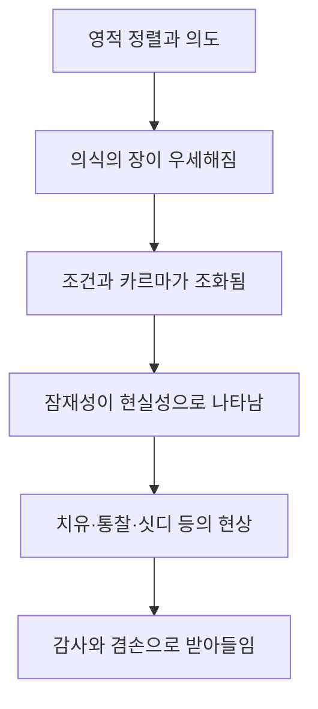

# 『현대인의 의식 지도』 제10장 분석 ①  
## 「경험적 요소 대 개념적 요소」·「누가 앎의 주체인가?」

## 1. 장 전체에서의 위치

제9장 「믿음」은 인간이 무엇을 진실이라고 받아들이고 신뢰하게 되는지를 다루었습니다. 제10장은 그다음 단계로 나아가 다음을 묻습니다.

> 믿고 있는 내용은 어떻게 실제적인 앎으로 확인되는가?  
> 그리고 그 앎을 얻는 주체는 과연 누구인가?

따라서 제10장은 **믿음에서 앎으로**, **개념에서 존재로**, **에고의 탐구에서 참나의 자기 인식으로** 이동하는 장입니다.

호킨스 박사님께서는 여기서 영적 앎을 단순한 정보 축적이나 교리 이해로 보지 않으십니다. 영적 진실은 처음에는 정신이 이해하는 개념으로 들어오지만, 시간이 지나면서 삶의 경험과 의식의 변화로 확인되고, 마침내 아는 자와 알려지는 진실이 통합되는 방향으로 나아갑니다. fileciteturn1file18

---

# 2. 핵심 명제

이 발췌의 핵심은 다음과 같습니다.

> **진정한 영적 앎은 어떤 대상에 ‘대해’ 많이 아는 것이 아니라, 그 진실과 존재적으로 하나가 됨으로써 확증되는 앎입니다.**

이를 조금 더 풀면 다음과 같습니다.

- 개념적 앎은 정신이 대상을 관찰하고 설명합니다.
- 경험적 앎은 진실이 삶과 의식 안에서 확인됩니다.
- 더 깊은 앎에서는 아는 자와 알려지는 대상의 분리가 약해집니다.
- 궁극적으로 참나는 진실을 외부 대상으로 알지 않고, 진실과의 동일성에 의해 압니다.

『의식수준을 넘어서』에서도 참나는 신성과의 동일성으로 말미암아 알며, 어떤 것에 ‘대하여’ 아는 것이 아니라 그 자체 본질의 완성으로서 안다고 설명됩니다. fileciteturn1file16

---

# 3. 쉬운 설명

## 개념적 앎

“꿀은 달다.”라는 설명을 읽고 기억하는 것입니다.

- 꿀의 성분을 공부할 수 있습니다.
- 단맛의 원리를 설명할 수 있습니다.
- 꿀에 관한 논문을 쓸 수도 있습니다.

그러나 아직 꿀의 단맛 자체를 아는 것은 아닙니다.

## 경험적 앎

직접 맛봄으로써 “달다”가 확실해지는 것입니다.

이때 단맛은 추론이나 신념이 아니라 직접 확인된 사실이 됩니다.

## 영적 앎

영적 영역에서는 한 단계가 더 나아갑니다.

사랑을 개념적으로 정의하는 것과 사랑의 존재 상태가 되는 것은 다릅니다. 평화를 연구하는 것과 평화가 의식의 기본 상태가 되는 것도 다릅니다.

따라서 호킨스 박사님께서 말하는 최종적 앎은 다음 구조를 가집니다.

> 설명을 안다  
> → 경험으로 확인한다  
> → 삶의 존재 방식이 된다  
> → 그것과의 동일성으로 안다

---

# 4. 전개 지도

이 발췌의 논리는 다음 순서로 진행됩니다.

### 1단계. ‘안다’라는 말의 다층성

‘안다’는 말에는 여러 수준이 섞여 있습니다.

- 들어 보았다.
- 배웠다.
- 친숙하다.
- 공부했다.
- 전문 지식이 있다.
- 사실이라고 믿는다.
- 경험으로 확신한다.
- 그것과 하나가 되어 안다.

즉 같은 “안다”라는 표현이라도 실제 의식의 깊이는 크게 다릅니다.

### 2단계. 개념적 정보와 경험적 확실성의 구분

정신이 만들어 낸 설명은 잠정적이고 가설적일 수 있습니다.

반면 경험적으로 확인된 앎은 단순한 가능성이 아니라 확실성으로 변합니다.

### 3단계. 선형적 검증과 비선형적 확인의 구분

물리적 세계에서는 관찰, 측정, 반복 실험을 통해 비교적 쉽게 검증할 수 있습니다.

그러나 영적 실재는 단순한 사고나 감정이 아니라 **존재의 양상**과 관련되므로, 선형적 도구만으로는 충분하지 않습니다.

### 4단계. ‘아는 자’에 대한 의문

정신은 자신이 정보를 모으고 진실을 판단하는 주체라고 믿습니다.

그러나 호킨스 박사님께서는 이것을 에고의 순진한 추정으로 보십니다.

### 5단계. 영적 동기의 발생

단순한 호기심이 의미·진실·영성을 향한 열망으로 심화됩니다.

이때 사람은 여러 가르침의 외형보다 그 안에 있는 진실을 확인하고자 합니다.

### 6단계. 성숙함과 헌신의 형성

진지한 의도, 의식의 진화, 생물학적 준비, 경험적 학습에 대한 열망이 함께 모이면서 영적 성숙함이 형성됩니다.

### 7단계. ‘알고 있음’에서 ‘되어 감’으로

영적 정보가 삶과 의식에 점차 통합되면서, 개념은 경험적 현실이 됩니다.

### 8단계. 직관·내면의 인도·자발적 계시

진보가 깊어질수록 배움은 논리적 추론에만 의존하지 않습니다.

진실이 직관과 계시의 형태로 저절로 알려지기 시작합니다.

### 9단계. 에고 학습자의 해체

마침내 “내가 진실을 획득한다”는 구조 자체가 약해집니다.

에고가 진실의 소유자가 되는 것이 아니라, 참나의 앎이 드러나면서 에고적 학습자가 물러납니다.

---

# 5. 소주제 ① 경험적 요소 대 개념적 요소

## 5.1 ‘안다’는 하나의 상태가 아니라 연속선이다

호킨스 박사님께서는 앎을 이분법적으로 나누지 않으십니다.

즉 “알거나 모른다”가 아니라 다음과 같은 연속선으로 봅니다.

| 앎의 단계 | 성격 |
|---|---|
| 들음 | 외부에서 정보를 접함 |
| 학습 | 개념과 설명을 이해함 |
| 친숙함 | 반복으로 낯설지 않게 됨 |
| 지적 숙련 | 체계적으로 설명할 수 있음 |
| 신념 | 사실이라고 받아들임 |
| 경험적 확인 | 실제 경험을 통해 확증됨 |
| 확실성 | 의심보다 자명성이 강해짐 |
| 동일성에 의한 앎 | 아는 자와 진실의 분리가 사라짐 |

이 구분이 중요한 이유는 **지식의 양이 곧 앎의 깊이를 뜻하지 않기 때문**입니다.

수많은 영적 용어를 정확히 설명해도 그 용어가 가리키는 의식 상태가 삶에 나타나지 않을 수 있습니다. 반대로 개념적 표현은 서툴러도 그 진실을 존재 방식으로 살아가는 경우가 있습니다.

---

## 5.2 ‘-에 대해 안다’는 구조

“무엇에 대해 안다”에는 기본적으로 세 요소가 있습니다.

1. 아는 주체  
2. 알려지는 대상  
3. 대상을 설명하는 개념

예를 들면 다음과 같습니다.

> 내가 사랑에 대해 안다.

여기에는 ‘나’와 ‘사랑’이 분리되어 있습니다. 사랑은 관찰하고 정의하고 분석하는 대상입니다.

이것은 선형적 정신 작용의 구조입니다.

- 대상을 구분합니다.
- 이름을 붙입니다.
- 특성을 나열합니다.
- 다른 개념과 비교합니다.
- 인과관계를 설명합니다.
- 기억 속에 저장합니다.

이 능력은 매우 유용하지만, 대상의 본질과 동일하지는 않습니다.

---

## 5.3 경험적으로 안다는 것

경험적 앎에서는 정보가 단순한 설명으로 머물지 않습니다.

예를 들어 “원망은 내면의 평화를 가린다”는 문장을 읽으면 처음에는 하나의 개념입니다. 그러나 시간이 지나면서 원망이 약해질 때 평화가 자연스럽게 드러나는 것이 확인되면, 그 문장은 경험적 진실로 바뀝니다.

그때 사람은 더 이상 단지 다음과 같이 말하지 않습니다.

> “호킨스 박사님의 책에 그렇게 쓰여 있습니다.”

대신 내면에서 다음과 같이 확신하게 됩니다.

> “그것이 실제로 그러하다는 것을 압니다.”

『Letting Go』에서도 사고가 점차 ‘앎’으로 대체되며, 그 앎은 추론으로 만들어지는 것이 아니라 이미 현존하여 인식되기를 기다리는 것처럼 나타난다고 설명됩니다. fileciteturn1file13

---

## 5.4 “이다/된다”라는 표현의 의미

발췌에서 중요한 표현은 다음입니다.

> 대상을 진짜 안다는 것은 최종 단계에서 ‘이다/된다’로 변한다.

이는 두 방향을 포함합니다.

### ‘된다’ — becoming

배운 진실이 성격, 태도, 가치, 선택, 지각 방식 안으로 점차 통합되는 과정입니다.

예를 들어 겸손을 공부하는 단계에서 겸손한 존재 방식으로 변화합니다.

### ‘이다’ — being

진실을 어떤 소유물이나 성취로 보는 구조가 사라지고, 그 진실이 존재의 본질로 자명해지는 상태입니다.

예를 들어 “나는 평화를 얻었다”가 아니라, 사적 자아의 소음이 약해짐에 따라 평화가 본래의 상태로 드러나는 것입니다.

---

## 5.5 경험적 앎은 감정적 확신과 다르다

경험적 앎을 강한 느낌이나 열광과 혼동해서는 안 됩니다.

감정적 확신은 다음과 같이 나타날 수 있습니다.

- 강하게 믿는다.
- 감동을 받았다.
- 특별한 느낌이 들었다.
- 어떤 생각이 매우 매력적으로 느껴진다.
- 집단 분위기 속에서 확신하게 된다.

그러나 이러한 상태에는 여전히 감정, 기대, 투사, 희망, 욕망이 개입할 수 있습니다.

호킨스 박사님께서 말씀하시는 경험적 앎은 감정의 강도가 아니라 다음 자질과 가깝습니다.

- 자명함
- 명료함
- 내적 일관성
- 평화
- 비강요성
- 지속성
- 존재 방식의 변화
- 삶 전체와의 조화

즉 경험적 앎은 “매우 강하게 느껴진다”가 아니라 “그것이 그러함이 분명하다”에 가깝습니다.

---

## 5.6 선형적 영역에서의 입증

선형적 세계의 지식은 대체로 다음 방식으로 확인됩니다.

- 관찰
- 측정
- 비교
- 반복
- 논리적 추론
- 통계
- 재현
- 물리적 결과

이 영역에서는 주체와 대상이 분리되어 있어야 합니다. 관찰자는 대상을 일정한 거리를 두고 측정합니다.

이것이 이성과 과학의 고유 영역이며, 호킨스 박사님의 의식 지도에서는 대체로 400대의 지성과 관련됩니다. 『현대인의 의식 지도』은 과학의 선형적 내용과 영적 실재의 비선형적 맥락을 구분하면서도, 두 영역을 더 큰 의식의 패러다임 안에서 통합합니다. fileciteturn2file0

---

## 5.7 영적 영역에서의 확인

영적 실재는 단순한 외부 대상이 아닙니다.

사랑, 평화, 현존, 참나, 하나임은 자와 눈금으로 측정하는 물체처럼 존재하지 않습니다. 이들은 의식의 질적 상태이며 존재 방식입니다.

따라서 영적 진실은 다음을 통해 점진적으로 확인됩니다.

- 지각의 변화
- 의미의 변화
- 가치의 재정렬
- 내적 갈등의 감소
- 평화의 증가
- 에고적 요구의 약화
- 직관적 이해의 확대
- 참나에 대한 인식

영적 정렬과 헌신이 깊어지면 삶의 경험 자체가 질적으로 변하며, 호킨스 박사님께서는 이를 개인적 의지가 직접 만들어 내는 결과라기보다 의식장의 영향으로 설명하십니다. fileciteturn1file19

---

## 5.8 ‘양상’이라는 말의 중요성

발췌에서는 영적 앎에 사고·감정·정신적 구성물 외에도 사물의 **존재 방식**, 즉 ‘양상’이 포함된다고 말합니다.

이것은 매우 중요한 구분입니다.

### 내용

무엇을 생각하는가.

### 감정

그것에 대해 어떻게 느끼는가.

### 양상

어떤 의식 상태에서 존재하는가.

예를 들어 동일하게 “사랑한다”고 말해도 그 말이 나오는 의식의 양상은 다를 수 있습니다.

- 소유욕에서 나오는 사랑
- 의존에서 나오는 사랑
- 상대의 보답을 요구하는 사랑
- 보호하고 배려하는 사랑
- 조건 없이 존재 가치를 알아보는 사랑

말의 내용은 같지만 존재 양상은 전혀 다릅니다.

따라서 영적 진실의 확인은 말이나 생각의 표면만이 아니라, 그것이 나오는 **의식의 장**을 포함합니다.

---

# 6. 소주제 ② 누가 앎의 주체인가?

## 6.1 정신의 기본 추정

정신은 다음을 당연하다고 생각합니다.

> 내가 생각한다.  
> 내가 선택한다.  
> 내가 탐구한다.  
> 내가 이해한다.  
> 내가 진실을 발견한다.

여기서 ‘나’는 에고/자아입니다.

정신은 에고가 다음의 유일한 저자라고 여깁니다.

- 생각의 저자
- 의도의 저자
- 행동의 저자
- 선택의 저자
- 이해의 저자
- 영적 진보의 저자

그러나 호킨스 박사님께서는 이 저자성 자체가 에고의 근본적 환상이라고 설명하십니다.

---

## 6.2 에고가 ‘아는 자’를 자처하는 이유

에고는 생존을 위해 정보를 모으고 판단하는 기능으로 진화했습니다.

그러므로 에고에게 앎은 단순한 진실 탐구만이 아닙니다.

- 안전을 확보하는 수단
- 통제력을 얻는 수단
- 남보다 우월해지는 수단
- 미래를 예측하는 수단
- 자신의 정체성을 강화하는 수단
- 옳음을 증명하는 수단

이 때문에 영적 정보도 에고의 소유물이 될 수 있습니다.

> “나는 많이 안다.”  
> “나는 특별한 가르침을 안다.”  
> “나는 다른 사람보다 높은 진실을 안다.”

이 경우 정보는 늘어났지만, 아는 자로서의 에고는 오히려 더 강화됩니다.

---

## 6.3 호기심과 영적 동기의 차이

발췌에서는 앎의 동기를 두 층으로 나눕니다.

### 단순한 호기심과 욕망

- 신기해서 알아봅니다.
- 특별한 능력을 원합니다.
- 고통을 즉시 없애고 싶습니다.
- 미래를 통제하고 싶습니다.
- 남보다 더 높은 사람이 되고 싶습니다.

### 영적 동기

- 진실 그 자체를 알고자 합니다.
- 의미와 본질을 찾습니다.
- 교리의 외형보다 내재된 진실을 확인하고자 합니다.
- 자신의 위치성을 넘어 더 큰 맥락을 받아들이려 합니다.
- 세속적 이득보다 신성과의 정렬을 중시합니다.

처음에는 두 동기가 섞여 있을 수 있습니다. 그러나 영적 성숙이 진행되면서 이득을 얻으려는 동기보다 진실 자체에 대한 헌신이 중심이 됩니다.

---

# 7. ‘성숙함’의 정확한 의미

호킨스 박사님께서 설명하시는 영적 성숙함은 단순히 나이가 많거나 책을 많이 읽은 상태가 아닙니다.

여기에는 여러 조건이 함께 작용합니다.

## 7.1 진지하고 성실한 의도

가벼운 흥미가 아니라 진실을 우선하겠다는 내적 방향입니다.

## 7.2 생물학적 성장

뇌와 신경계, 정서적 수용력, 추상적 이해 능력의 발달이 포함됩니다.

## 7.3 의식의 진화

더 큰 맥락과 의미를 이해할 수 있는 의식적 준비가 형성됩니다.

## 7.4 경험적으로 배우려는 열망

단순히 정보를 소유하려는 것이 아니라, 배운 진실이 삶과 의식 안에서 확인되기를 원합니다.

## 7.5 여러 조건의 ‘우연 같은 결합’

이 조건들은 에고가 기계적으로 조립하는 것이 아니라, 삶의 경험·고통·준비·가르침과의 만남이 결합하면서 나타납니다.

따라서 성숙함은 다음처럼 정의할 수 있습니다.

> **진실을 받아들이고, 그 진실에 의해 변화될 준비가 된 의식 상태**

---

# 8. 호기심에서 헌신으로의 변화

발췌에는 영적 동기의 성숙 과정이 매우 정확하게 제시됩니다.

## 8.1 가벼운 호기심

처음에는 흥미로운 정보로 접근합니다.

## 8.2 중요성의 인식

영적 가르침이 단순한 지식이 아니라 삶 전체의 방향과 관련된다는 것을 알아봅니다.

## 8.3 열정

더 많이 읽고 배우며 집중하게 됩니다.

## 8.4 헌신

흥미의 대상이던 영성이 삶의 우선 가치로 자리 잡습니다.

## 8.5 가치의 교체

세속적 자아가 추구하던 명성·통제·우월성·소유보다 진실·사랑·평화·신성과의 정렬이 중요해집니다.

## 8.6 경험적 확인

가르침이 내면의 변화와 지혜로 확인됩니다.

## 8.7 확신

진실이 단지 믿는 내용이 아니라 삶에서 반복적으로 확인되는 현실이 됩니다.

이 흐름을 압축하면 다음과 같습니다.

> 호기심  
> → 관심  
> → 중요성의 인식  
> → 열정  
> → 헌신  
> → 가치의 재정렬  
> → 경험적 확인  
> → 확신

---

# 9. ‘알고 있는 것’에서 ‘되어 가기’로

## 9.1 정보는 처음에는 외부에서 들어온다

처음에는 책, 강의, 스승, 전통을 통해 배웁니다.

> “사랑이 두려움보다 강하다.”  
> “에고는 지각을 투사한다.”  
> “참나는 개인적 자아와 다르다.”

이 단계에서 가르침은 아직 외부 정보입니다.

## 9.2 정보가 내적 관찰의 기준이 된다

점차 자신의 생각과 감정을 가르침의 맥락에서 이해하게 됩니다.

> “지금 내가 보는 것은 사실 자체가 아니라 두려움에 물든 지각일 수 있다.”

## 9.3 정보가 경험으로 확인된다

두려움이 약해질 때 지각이 바뀌고, 지각이 바뀔 때 세계가 다르게 보인다는 것을 알아봅니다.

## 9.4 존재 방식이 변한다

이제 가르침은 기억해야 하는 문장이 아니라 자연스러운 태도가 됩니다.

## 9.5 아는 자와 진실의 거리가 줄어든다

사랑을 설명하는 사람이 사랑의 장 안에서 존재하게 되고, 평화를 추구하던 사람이 평화가 본래 현존하고 있었음을 알아봅니다.

이것이 ‘knowing about’에서 ‘becoming’을 거쳐 ‘knowing’으로 이동하는 구조입니다.

---

# 10. 진보란 무엇인가?

발췌에서는 진보를 단순한 지식 증가나 노력을 통한 성취로 정의하지 않습니다.

> 진보는 흔히 직관, 내면의 인도, 깨달음, 자발적 계시의 형태로 나타납니다.

## 10.1 직관

논리적 추론을 모두 거치지 않아도 전체적 의미가 한꺼번에 파악됩니다.

## 10.2 내면의 인도

어떤 방향이 진실과 더 잘 정렬되어 있는지가 조용히 알려집니다.

## 10.3 깨달음

이전에 분리되어 있던 정보들이 하나의 더 큰 맥락에서 연결됩니다.

## 10.4 자발적 계시

의도적으로 답을 만들어 내지 않았는데도 진실이 저절로 드러납니다.

여기서 중요한 점은 진보가 에고의 업적이 아니라는 것입니다.

에고는 조건을 준비하고 방향을 선택할 수 있지만, 진실의 드러남 자체를 강제할 수는 없습니다.

---

# 11. 영적 인도자의 의미

발췌에서는 많은 사람이 영적 인도자를 경험적 실재로 말한다고 설명합니다.

이는 영적 인도자를 단지 외부의 인물로만 한정하지 않습니다.

영적 인도는 다음 형태로 나타날 수 있습니다.

- 스승의 가르침
- 경전의 한 문장
- 직관적 확신
- 내면에서 일어나는 방향 감각
- 우연처럼 나타나는 의미 있는 연결
- 진실한 가르침의 에너지 장
- 참나의 조용한 앎

중요한 것은 인도가 에고의 욕망을 만족시키는 명령이 아니라, 에고의 위치성을 넘어 더 높은 진실로 정렬시키는 방향이라는 점입니다.

---

# 12. 에고의 학습과 참나의 앎

## 에고의 학습

- 정보를 수집합니다.
- 기억합니다.
- 비교합니다.
- 분류합니다.
- 분석합니다.
- 결론을 내립니다.
- 자신이 지식의 소유자라고 생각합니다.
- 앎을 개인적 성취로 봅니다.

## 참나의 앎

- 전체가 즉시 파악됩니다.
- 진실이 자명하게 드러납니다.
- 아는 자와 알려지는 대상의 경계가 약합니다.
- 앎이 소유물이 아닙니다.
- 저자라는 개인적 감각이 없습니다.
- 현존 자체가 앎입니다.
- 진실과의 동일성에 의해 압니다.

『Book of Slides』에서는 진실이 그것에 ‘대해’ 아는 것으로 검증되는 것이 아니라, 그것과의 동일성으로 확인된다고 정리합니다. 참나는 신성과의 동일성으로 말미암아 알며, 그 현존 자체가 ‘아는 자’로 알려집니다. fileciteturn1file17

---

# 13. “자아가 해체되어 참나 안으로 통합된다”의 의미

이 문장은 자아가 폭력적으로 파괴되거나 일상 기능이 사라진다는 의미가 아닙니다.

여기서 해체되는 것은 다음과 같은 에고의 주장입니다.

- 내가 모든 생각을 만든다.
- 내가 삶을 통제한다.
- 내가 진실을 소유한다.
- 내가 영적 상태를 획득한다.
- 내가 독립된 행위자다.
- 내 관점이 실재를 결정한다.

에고의 기능은 삶을 운영하는 도구로 남을 수 있습니다.

- 언어를 사용합니다.
- 약속을 기억합니다.
- 업무를 처리합니다.
- 논리적으로 판단합니다.
- 위험을 구분합니다.

그러나 에고가 더 이상 존재와 앎의 궁극적 근원으로 간주되지 않습니다.

따라서 통합은 다음과 같은 위계 변화입니다.

> 에고가 주인이고 참나가 관념인 상태  
> → 참나가 근원이고 에고가 기능적 도구인 상태

---

# 14. 호킨스 용어 자동 매핑

| 발췌의 표현 | 호킨스 박사님의 대응 개념 | 의미 |
|---|---|---|
| ‘-에 대해 안다’ | 선형적 정신 작용 | 주체와 대상을 분리하여 개념으로 이해함 |
| 경험적으로 안다 | 주관적 확인 | 진실이 의식과 삶에서 직접 확인됨 |
| 잠정적·가설적 앎 | 정신적 구성물 | 추론과 설명으로 만들어진 지식 |
| 확실성·명쾌함 | Knowingness | 진실이 자명하게 알려지는 상태 |
| 사물의 존재 방식 | 양상·맥락 | 내용보다 그것이 나오는 의식의 질 |
| 앎의 주체 | knower | 처음에는 에고로 추정되나 궁극적으로 참나 |
| 저자성 | authorship | 에고가 생각과 행동의 유일한 원인이라고 믿는 구조 |
| 성숙함 | ripeness | 영적 진실에 의해 변화될 준비가 된 상태 |
| 되어 가기 | becoming | 배운 진실이 존재 방식으로 통합되는 과정 |
| 자발적 계시 | revelation | 정신이 만들어 내지 않은 진실의 드러남 |
| 참나 | Self | 앎과 현존의 비개인적 근원 |
| 통합 | identity | 아는 자와 알려지는 진실의 분리가 약해짐 |

---

# 15. 의식 수준을 반영한 이해

이 발췌는 특정 숫자를 하나의 문단 전체에 부여하기보다, 앎의 진화가 의식 수준에 따라 어떻게 달라지는지를 보여 줍니다.

## 400대 — 이성·학문·개념적 숙련

- 정식 학습
- 전문 지식
- 논리
- 분석
- 정의
- 이론
- 객관적 검증

이 수준은 매우 중요합니다. 개념의 정확성을 확보하고 오류를 구별하는 능력을 제공합니다.

그러나 정신은 여전히 관찰자와 대상을 분리합니다.

## 500대 — 의미·사랑·경험적 이해

- 진실에 대한 사랑
- 헌신
- 가치의 재정렬
- 삶의 질적 변화
- 의미의 직관적 파악
- 진실이 존재 방식으로 통합됨

이 단계부터 앎은 단순한 사고보다 의식의 질과 관련됩니다.

## 540 이상 — 헌신과 비개인적 사랑의 심화

- 세속적 자아의 목적이 약해짐
- 신성과 진실 자체가 중심이 됨
- 평화와 감사가 앎의 배경이 됨
- 내면의 인도가 더욱 분명해짐

## 600 이상 — 주체와 대상의 분리 약화

- 관찰자와 관찰되는 것의 경계가 약해짐
- 존재가 자명한 실재로 드러남
- 정신적 설명보다 침묵과 현존이 우세해짐
- 앎이 생각 이전의 상태로 나타남

## 700 이상 — 동일성에 의한 앎

- 참나가 실재의 근원으로 알려짐
- 진실을 외부 대상으로 알지 않음
- 참나와 신성의 동일성으로 인해 앎이 자명함
- ‘아는 개인’이라는 구조가 사라짐

『의식수준을 넘어서』에서는 앞선 수준의 인식이 참나의 현존에서 나오며, 참나는 무엇에 관하여 아는 것이 아니라 신성과의 동일성으로 안다고 설명됩니다. fileciteturn1file16

---

# 16. 이 발췌에서 가장 중요한 역전

일반적인 관점에서는 다음과 같이 생각합니다.

> 내가 공부한다.  
> 내가 이해한다.  
> 내가 진실을 얻는다.  
> 내가 영적으로 발전한다.  
> 마침내 내가 깨닫는다.

그러나 호킨스 박사님의 설명은 구조를 뒤집습니다.

> 에고는 진실을 획득하는 주인이 아니라,  
> 진실이 드러나는 과정에서 점차 투명해지는 도구입니다.

진보가 깊어질수록 “내가 안다”는 감각은 약해지고, 대신 다음이 분명해집니다.

> 앎은 이미 현존하며, 정신이 조용해질 때 그것이 저절로 인식됩니다.

『Letting Go』의 표현처럼, 앎은 정신이 생산하는 결론이라기보다 이미 그 자리에 있어 인식되기를 기다리는 것처럼 나타납니다. fileciteturn1file13

---

# 17. 두 소주제의 구조적 관계

「경험적 요소 대 개념적 요소」는 **앎의 종류**를 구분합니다.

「누가 앎의 주체인가?」는 **앎의 주체**를 재검토합니다.

두 주제는 다음과 같이 연결됩니다.

| 첫 번째 소주제 | 두 번째 소주제 |
|---|---|
| 무엇을 진짜 안다는 것은 무엇인가 | 그 진실을 아는 자는 누구인가 |
| 개념과 경험의 차이 | 에고와 참나의 차이 |
| 설명과 존재의 차이 | 저자성과 현존의 차이 |
| 대상에 대한 지식 | 동일성에 의한 앎 |
| knowing about | Knowingness |
| 정신의 정보 | 참나의 자기 인식 |

따라서 첫 번째 소주제만 읽으면 “경험을 많이 해야 한다”는 정도로 이해할 수 있습니다.

그러나 두 번째 소주제가 추가되면서 더 깊은 결론이 나옵니다.

> 영적 앎의 최종 목적은 에고가 더 많은 경험을 소유하는 것이 아니라,  
> 에고가 ‘유일한 아는 자’라는 추정이 해체되는 것입니다.

---

# 18. 전체 통합 정리

이 발췌에서 호킨스 박사님께서는 앎의 진화를 다음과 같이 설명하십니다.

> **정보 → 이해 → 신념 → 경험적 확인 → 확신 → 되어 감 → 동일성 → 참나의 앎**

처음에는 정신이 영적 진실을 하나의 개념으로 받아들입니다. 정신은 그 내용을 분석하고 비교하며 기억합니다. 그러나 이것만으로는 아직 진실을 직접 안다고 할 수 없습니다.

진실한 의도와 성숙함이 형성되면 영적 정보는 삶과 의식 안에서 시험받고 확인됩니다. 가르침이 실제로 지각과 가치와 존재 방식을 변화시키면서 믿음은 확신으로 바뀝니다.

그 과정이 깊어지면 사람은 진실에 ‘대해’ 아는 단계를 넘어, 그 진실의 성질을 점차 존재 방식으로 드러냅니다. 사랑에 대해 아는 사람이 사랑하는 존재로, 평화에 대해 아는 사람이 평화의 장 안에 존재하는 사람으로 변합니다.

마지막에는 “내가 진실을 획득했다”는 에고의 저자성 자체가 약해집니다. 참나는 외부의 진실을 관찰하는 별도의 주체가 아닙니다. 참나는 신성과 진실과의 동일성으로 인해 스스로를 압니다.

그러므로 이 발췌의 가장 압축된 결론은 다음과 같습니다.

> **개념적 앎은 진실을 대상으로 삼지만, 경험적 앎은 진실을 삶에서 확인하며, 참나의 앎은 진실과의 동일성으로 자명합니다.**

---

# 『현대인의 의식 지도』 제10장 「경험적 요소 대 개념적 요소」
## 「통치권」·「영적 의도」 발췌 분석

## 1. 전체 핵심 명제

이 발췌는 영적 전환의 중심을 **개인적 에고가 생명과 경험의 주권자라는 환상에서 벗어나, 참나와 더 높은 힘의 영향력을 인정하는 것**으로 설명합니다.

에고는 다음과 같이 주장합니다.

> “내가 생각하고, 내가 결정하며, 내가 삶을 움직인다.”

그러나 영적 의도가 깊어질수록 관점이 바뀝니다.

> “내가 삶의 근원이라고 생각했지만, 실제로는 생명과 의식이 이미 작동하고 있으며 개인적 자아는 그 안에서 제한적으로 기능하고 있었다.”

따라서 여기서 말하는 **통치권의 이양**은 외부의 권위자에게 복종한다는 뜻이 아닙니다. 개인적 자아가 자신을 존재·앎·행위의 절대적 근원으로 주장하던 위치성을 내려놓는 것입니다.

발췌의 전개는 다음과 같습니다.

> 나르시시즘적 자기중심성  
> → 영적 의도의 활성화  
> → 참나의 영향력 증대  
> → 위치성의 약화  
> → 모름을 받아들이는 겸손  
> → 저항을 넘어서는 인내와 결단  
> → 믿음과 내적 확신의 성장  
> → 에고의 통치권 환상 약화  
> → 더 높은 힘의 영향력에 개방됨  
> → 위기 속에서 두려움의 저항이 해제됨  
> → 의식 수준 600의 평화가 드러남

호킨스 박사님께서는 이 과정을 에고가 강제로 파괴되는 과정이 아니라, 참나가 점차 지배적인 맥락이 되면서 에고의 주장이 자연스럽게 물러나는 과정으로 제시하십니다. fileciteturn1file0

---

# 2. 「통치권」

## 2-1. 여기서 ‘통치권’이 의미하는 것

통치권은 정치적 지배권이 아니라 **경험의 근원과 삶의 운영권을 자신이 소유하고 있다는 에고의 주장**입니다.

에고는 암묵적으로 다음을 전제합니다.

- 생각을 만들어 내는 자가 ‘나’다.
- 생명을 유지하는 자가 ‘나’다.
- 행동의 궁극적 원인이 ‘나’다.
- 진실과 거짓을 판정하는 기준이 ‘나’다.
- 사건을 통제해야 안전할 수 있다.
- 내가 통제하지 않으면 삶이 무너진다.

이것은 단순한 자신감과 다릅니다. 자신감은 특정 능력에 대한 현실적 신뢰이지만, 통치권 환상은 **개인적 자아를 존재 전체의 중심에 두는 근원적 위치성**입니다.

에고가 원하는 것은 단순히 선택할 자유가 아닙니다. 에고는 자신이 삶과 경험의 **저자·원인·소유자**로 인정받기를 원합니다.

---

## 2-2. 나르시시즘적 핵심과 ‘경험적 실재의 근원’

발췌에서 에고의 나르시시즘은 자신이 “경험적 실재의 근원으로 인정받고 싶어 한다”고 설명됩니다.

이는 에고가 다음과 같이 작동한다는 뜻입니다.

> “내가 보았으므로 그것이 진실이다.”  
> “내가 느꼈으므로 외부가 실제로 그러하다.”  
> “내가 생각했으므로 그 생각에는 독립적인 진실성이 있다.”  
> “내가 이해할 수 없으면 그것은 존재하지 않는다.”

에고는 경험의 **내용**을 경험을 가능하게 하는 **의식의 근원**과 혼동합니다.

예를 들어 생각이 떠오르면 에고는 “내가 생각했다”고 말합니다. 그러나 세밀하게 관찰하면 생각은 이미 나타난 뒤에야 알아차려집니다. 감정, 충동, 기억도 마찬가지입니다. 개인적 자아는 그것들이 나타나는 것을 목격하면서도 사후에 자신을 그 발생의 저자로 선언합니다.

통치권 환상은 바로 이 **사후적 소유권 주장**입니다.

---

## 2-3. 영적 과정이 겸손과 감사를 불러오는 이유

영적 과정이 깊어질수록 에고가 약해지는 가장 중요한 표지는 자기비하가 아니라 **겸손**입니다.

여기서 겸손은 다음과 같습니다.

- 자신의 지각이 전체가 아님을 인정합니다.
- 마음이 진실을 자동으로 판별하지 못함을 압니다.
- 생명이 개인적 의지보다 훨씬 큰 질서 안에서 움직임을 알아봅니다.
- 자신의 능력과 기회조차 독립적으로 만들어 낸 소유물이 아님을 인식합니다.
- 이해할 수 없는 것을 즉시 부정하지 않습니다.

이 겸손이 깊어지면 감사가 나타납니다.

에고의 관점에서는 모든 것을 얻어 내고 지켜야 합니다. 반면 참나의 영향력이 커지면 생명 자체, 의식, 존재, 배움의 기회가 이미 주어져 있다는 사실이 더 선명해집니다.

그러므로 감사는 예의상의 감정이 아니라, **개인적 자아가 존재의 원인이 아니라 수혜자임을 알아보는 의식의 변화**입니다.

---

## 2-4. 참나가 ‘활성화된다’는 의미

참나가 활성화된다는 표현은 참나가 이전에는 존재하지 않았다가 새로 생긴다는 뜻이 아닙니다.

참나는 항상 현존하지만, 에고의 위치성과 감정적 소음 때문에 인식되지 않습니다.

따라서 활성화란 다음의 변화입니다.

> 참나가 새로 창조됨  
> ×

> 참나의 영향력을 가리던 에고의 독점적 주장이 약화됨  
> ○

이때 나타나는 표지는 다음과 같습니다.

- 직관이 더욱 분명해집니다.
- 억지로 결론을 만들려는 압박이 줄어듭니다.
- 자신이 옳아야 한다는 욕구가 약해집니다.
- 결과를 완전히 통제하지 않아도 된다는 신뢰가 생깁니다.
- 생각보다 침묵과 내적 앎을 중시하게 됩니다.
- 사건에 즉각 반응하기보다 더 큰 맥락이 드러나기를 기다릴 수 있습니다.

『신의 현존의 발견』에서도 호킨스 박사님께서는 획득과 통제를 통해 생존하려는 자기중심적 에고의 방향이 200 이하를 지배하며, 200에서 타인의 가치와 더 큰 맥락을 인식하는 앎이 출현한다고 설명하십니다. fileciteturn1file11

---

## 2-5. 위치성이 약해진다는 것

위치성은 어떤 관점을 잠정적 견해가 아니라 **자기 정체성과 결합된 절대적 입장**으로 붙잡는 것입니다.

예를 들면 다음과 같습니다.

- 나는 옳고 상대는 틀렸다.
- 이 일은 반드시 내가 원하는 방식으로 끝나야 한다.
- 이것을 잃으면 나는 불행해질 수밖에 없다.
- 이 설명만이 유일한 진실이다.
- 내가 이해할 수 없는 것은 받아들일 수 없다.
- 내가 통제하지 못하면 위험하다.

위치성이 강하면 정보가 바뀌어도 입장이 바뀌지 않습니다. 에고에게 입장을 바꾸는 것은 단순한 판단 수정이 아니라 자기 존재가 패배하는 것처럼 느껴지기 때문입니다.

영적 의도가 참나를 향할수록 다음과 같은 여지가 생깁니다.

> “현재의 이해는 제한적일 수 있다.”  
> “내가 보지 못하는 맥락이 있을 수 있다.”  
> “진실이 내 선호와 다르더라도 진실을 선택하겠다.”

이것이 발췌에서 말하는 “알고 있다고 추정한 것”보다 “아직 알지 못하는 것”에 더 관심을 두게 되는 변화입니다.

---

## 2-6. ‘모름’으로의 이동은 지성의 포기가 아니다

모름을 받아들이는 것은 반지성주의나 무조건적 믿음을 뜻하지 않습니다.

오히려 이는 지성의 정확한 한계를 인정하는 것입니다.

### 에고적 지성

> 모든 것을 개념화하고 설명할 수 있어야 한다.  
> 설명할 수 없으면 존재하지 않는 것이다.

### 영적으로 정렬된 지성

> 논리와 이성은 매우 중요하지만, 그것들이 다룰 수 있는 영역에는 한계가 있다.  
> 경험적·비선형적 실재는 개념으로 완전히 대체될 수 없다.

따라서 발췌는 이성을 제거하는 것이 아니라 이성을 **더 큰 의식의 맥락 안에 배치**합니다.

이성은 영적 진실의 적이 아니라 도구입니다. 문제는 도구가 자신을 전체의 통치자로 선언할 때 발생합니다.

---

## 2-7. 인내와 결단력이 뒤따르는 이유

통치권 환상이 약해지는 과정에는 저항이 나타납니다.

에고는 자신의 위치성이 사라지는 것을 다음과 같이 받아들일 수 있습니다.

- 통제력의 상실
- 정체성의 상실
- 안전의 상실
- 존재 자체의 소멸
- 패배나 무력함

따라서 단순한 지적 이해만으로는 충분하지 않습니다. 호킨스 박사님께서 언급하시는 인내와 결단력은 에고를 공격하기 위한 의지력이 아니라, **진실에 대한 방향을 유지하는 힘**입니다.

이 과정에서 강인함이 커지는 이유는 역설적입니다.

에고는 통제권을 붙잡을수록 불안해집니다. 모든 결과를 자신이 책임져야 하기 때문입니다. 반면 더 높은 힘에 대한 신뢰가 깊어지면 개인적 자아가 모든 것을 통제해야 한다는 부담이 줄어듭니다.

그러므로 강인함은 통제를 더 많이 확보한 결과가 아니라, **통제가 없어도 존재의 근원은 흔들리지 않는다는 신뢰**에서 나옵니다.

---

## 2-8. 통치권의 환상이 물러난 뒤 나타나는 것

에고가 통치권의 주장을 약화하면 공백이나 무기력이 오는 것이 아닙니다.

오히려 다음이 나타납니다.

- 필요한 행동은 계속됩니다.
- 지성은 더욱 정확하게 기능합니다.
- 선택은 이루어집니다.
- 책임도 사라지지 않습니다.
- 일상의 역할도 계속됩니다.

달라지는 것은 행위의 내적 근원에 대한 해석입니다.

### 이전

> “개인적 내가 모든 것을 움직인다.”

### 이후

> “행위는 전체 상황과 의식의 장 안에서 나타나며, 개인적 자아는 그 흐름의 제한된 표현이다.”

따라서 통치권을 내려놓는 것은 수동성이 아니라 **개인적 의지를 더 큰 질서에 정렬시키는 변화**입니다.

---

# 3. 「영적 의도」

## 3-1. 영적 의도는 단순한 소망이 아니다

호킨스 박사님의 용어에서 의도는 단순히 “좋은 사람이 되고 싶다”거나 “높은 상태를 경험하고 싶다”는 희망이 아닙니다.

영적 의도는 의식의 방향을 정하는 근본적 선택입니다.

> 진실을 편안함보다 우선하겠다.  
> 신성을 개인적 이익보다 우선하겠다.  
> 자신의 위치성을 지키기보다 더 큰 맥락을 받아들이겠다.

의도는 당장 어떤 특별한 경험을 만들어 내지는 않더라도, 의식이 어떤 장과 정렬될지를 결정합니다.

의식 지도에서 자발성 310의 핵심 과정이 ‘의도’로 제시되는 것도 이 때문입니다. 의도는 낮은 감정에 맞서 싸우는 힘이 아니라, 더 높은 방향으로 지속적으로 동의하는 에너지입니다. fileciteturn1file10

---

## 3-2. 종교적 전통의 역할

발췌는 대부분의 사람이 가족과 문화에 속한 종교 전통을 통해 최초의 영적 정보를 얻는다고 설명합니다.

호킨스 박사님의 관점에서 전통 종교의 핵심 기능은 다음과 같습니다.

- 신성의 존재를 알려 줍니다.
- 인간보다 높은 질서가 있음을 가르칩니다.
- 이기적 욕망을 절대화하지 않도록 합니다.
- 기도·헌신·감사·용서의 방향을 제공합니다.
- 삶과 죽음을 더 큰 맥락에서 바라보게 합니다.
- 영적 진실이 세대를 넘어 전달되는 그릇이 됩니다.

따라서 성숙함과 기꺼이 받아들이는 태도가 있다면 하나의 온전한 전통만으로도 영적 진실의 핵심에 접근할 수 있습니다.

여기서 중요한 것은 여러 전통을 많이 수집하는 것이 아니라, **어떤 전통을 통하든 그 안의 본질과 정렬되는가**입니다.

---

## 3-3. 전통의 형식과 영적 핵심의 구별

발췌에서는 전통적 교리 안의 영적 진실이 특정 시대와 문화에 맞춰진 설명 형식과 구별되어 직관적으로 인식된다고 말합니다.

이를 다음처럼 나눌 수 있습니다.

### 시대적 형식

- 고대의 언어
- 특정 민족의 관습
- 역사적 세계관
- 당시의 사회 구조
- 상징과 우화
- 교단의 제도적 규칙

### 영적 핵심

- 신성에 대한 경외
- 사랑과 자비
- 겸손
- 정직
- 용서
- 개인적 자아보다 높은 질서에 대한 신뢰
- 생명의 신성함
- 인간 존재의 궁극적 근원에 대한 탐구

현대인이 전통 종교에 의문을 느끼는 이유는 영적 핵심 자체가 반드시 거짓이어서가 아니라, **핵심과 시대적 포장이 구별되지 않은 채 전달되기 때문**일 수 있습니다.

---

## 3-4. 현대인의 회의가 생기는 구조

현대인은 교육을 통해 다음을 체화합니다.

- 경험적 검증
- 논리적 일관성
- 과학적 설명
- 역사적 비평
- 언어와 문화의 상대성
- 권위에 대한 검토

따라서 문자적 교리와 과학적 사실이 충돌하는 것처럼 보이면 의문이 발생합니다.

발췌가 제시하는 해법은 어느 한쪽을 제거하는 것이 아닙니다.

> 믿음만 남기고 이성을 버리는 것  
> ×

> 이성만 남기고 영적 실재를 부정하는 것  
> ×

> 믿음·영적 전통·과학적 사실·논리·이성을 더 넓은 맥락에서 통합하는 것  
> ○

이 통합은 서로 다른 추상 수준을 구별함으로써 가능합니다.

과학은 현상이 **어떻게 작동하는가**를 탐구하고, 영성은 존재가 **무엇이며 어떤 의미를 갖는가**를 다룹니다. 두 영역을 동일한 방식으로 다루면 충돌하지만, 더 큰 맥락에서 보면 서로 다른 차원의 진실을 다룹니다.

---

## 3-5. 어린 시절의 종교와 일상 경험

종교가 어린 시절에 깊이 받아들여지려면 단순한 교리 교육만이 아니라 일상의 경험과 결합되어야 합니다.

예를 들면 다음과 같은 경험적 맥락입니다.

- 가족의 기도
- 감사의 분위기
- 용서와 화해
- 죽음과 상실을 대하는 태도
- 타인을 대하는 자비
- 예배와 성스러운 음악
- 공동체의 보호와 돌봄
- 삶에 대한 경외

이런 맥락이 없으면 종교는 살아 있는 실재가 아니라 외워야 하는 관념 체계가 되기 쉽습니다.

현대사회에서는 가정과 직장의 요구가 커지면서 종교가 일상 경험과 분리됩니다. 그 결과 종교적 언어는 남아 있어도, 그것이 가리키는 내적 실재는 경험되지 않을 수 있습니다.

---

## 3-6. 성숙과 필멸성의 자각

젊은 시기에는 에고가 삶을 무한히 계속될 것처럼 느낄 수 있습니다.

- 앞으로 시간이 많이 남아 있다고 생각합니다.
- 성공과 관계와 성취가 궁극적 만족을 줄 것처럼 보입니다.
- 죽음은 먼 미래의 추상적 사건으로 느껴집니다.
- 육체적 정체성이 확고하게 유지됩니다.

그러나 나이가 들고 상실과 한계를 경험하면 필멸성이 점차 실제적인 사실로 다가옵니다.

이때 질문이 바뀝니다.

> “어떻게 더 많이 얻을 것인가?”

에서

> “삶이 끝난다면 나는 실제로 무엇인가?”  
> “죽음 이후에도 사라지지 않는 것은 무엇인가?”  
> “지금까지 믿어 온 것은 실제로 진실인가?”

로 이동합니다.

따라서 종교와 영성을 다시 살펴보는 것은 단순한 불안의 후퇴가 아니라, 삶의 유한성이 에고의 통상적 목표를 재맥락화하는 과정입니다.

---

# 4. 재앙과 신성의 발견

## 4-1. 재앙이 통치권 환상을 붕괴시키는 방식

심각한 질병, 죽음, 자연재해, 전쟁, 사고 같은 사건은 개인적 통제의 한계를 직접 드러냅니다.

평상시 에고는 다음의 연결을 유지합니다.

> 계획  
> → 노력  
> → 통제  
> → 안전

그러나 재앙에서는 이 연결이 갑자기 무너집니다.

- 계획이 작동하지 않습니다.
- 지식이 충분하지 않습니다.
- 신체적 능력으로 벗어날 수 없습니다.
- 미래를 예측할 수 없습니다.
- 외부 도움을 기대하기 어렵습니다.
- 죽음을 피할 수 있다는 확신이 사라집니다.

이때 에고가 가졌다고 믿던 통치권이 사실상 제한적이었다는 점이 분명해집니다.

---

## 4-2. 기도의 본질

발췌에서 재난 생존자들의 기도는 단순히 원하는 결과를 얻기 위한 주문으로 제시되지 않습니다.

그 기도의 깊은 구조는 다음과 같습니다.

> “나는 더 이상 이 상황을 통제할 수 없다.”  
> “개인적 능력만으로는 충분하지 않다.”  
> “생명과 결과를 더 높은 힘에 맡긴다.”

이 순간 기도는 언어적 요청을 넘어, 에고의 통치권 주장이 멈추는 내적 사건이 됩니다.

따라서 기도의 힘은 특정 문장을 얼마나 정확하게 말했는가보다, **개인적 의지의 저항이 얼마나 완전히 멈추었는가**와 연결됩니다.

---

## 4-3. 두려움이 신성을 발견하게 한 것이 아니다

발췌의 가장 중요한 구별은 이것입니다.

> 재앙의 두려움 때문에 신성을 발견한 것이 아니라,  
> 두려움에 대한 저항을 완전히 내려놓았을 때 신성이 드러났다.

두려움 자체는 의식 수준 100의 장입니다. 이 장에서는 세계가 위험하게 보이고, 신은 처벌적이거나 두려운 존재로 지각될 수 있습니다.

두려움이 극심할 때 마음은 다음에 집착합니다.

- 살아남아야 한다.
- 도망쳐야 한다.
- 이 상황이 즉시 끝나야 한다.
- 나는 죽어서는 안 된다.
- 미래를 알아야 한다.
- 통제권을 회복해야 한다.

이 저항이 계속되는 동안 의식은 위협과 생존에 완전히 고정됩니다.

그러나 저항이 소진되면 역설적으로 두려움의 기층에 있던 고요가 드러날 수 있습니다. 호킨스 박사님께서는 재앙 속에서 나타나는 심오한 평화가 두려움의 산물이 아니라 두려움을 완전히 내려놓은 결과라고 명시하십니다. fileciteturn1file2

---

## 4-4. ‘참호 종교’라는 해석의 한계

회의적 시각은 위기 속의 기도를 단순한 공포 반응이나 심리적 위안으로 해석합니다.

그러나 호킨스 박사님의 설명에서는 두 상태가 분명히 구별됩니다.

### 공포에 붙잡힌 상태

- 마음이 빠르게 움직입니다.
- 생존을 위한 사고가 반복됩니다.
- 신체가 긴장합니다.
- 미래의 결과에 매달립니다.
- 위험에서 벗어나려는 욕구가 지배합니다.

### 저항이 완전히 멈춘 뒤의 평화

- 사고가 침묵합니다.
- 시간감각이 약화되거나 사라집니다.
- 결과에 대한 집착이 멈춥니다.
- 죽음의 공포가 사라집니다.
- 말로 설명하기 어려운 고요가 나타납니다.
- 이후 삶 전체가 변화합니다.

두 번째 상태는 두려움이 강화된 상태가 아니라, 두려움을 구성하던 저항과 동일시가 사라진 상태입니다.

---

## 4-5. 토네이도 중심의 고요가 상징하는 것

발췌의 토네이도 경험은 외부와 내부의 극적인 대조를 보여 줍니다.

### 외부

- 파괴
- 소음
- 회전
- 예측 불가능성
- 신체적 위험
- 죽음의 가능성

### 내부

- 멎어 있음
- 침묵
- 시간의 부재
- 깊은 평화
- 죽음에 대한 두려움의 부재
- 현존의 직접적 인식

이는 평화가 반드시 외적 조건이 안정될 때만 나타나는 것이 아님을 보여 줍니다.

에고는 평화를 다음과 같이 이해합니다.

> 외부가 안전해지면 나는 평화로울 것이다.

그러나 발췌가 가리키는 평화는 다음과 같습니다.

> 외부 상황과 자신을 동일시하던 위치성이 사라지면, 상황을 넘어선 평화가 드러난다.

---

# 5. 의식 수준 600의 의미

호킨스 박사님의 의식 지도에서 600은 고전적 의미의 깨달음이 시작되는 수준이며, 평화·침묵·멎어 있음이 지배적인 상태로 설명됩니다. 500대 후반의 지복이 600에서는 무한한 평화로 전환됩니다. fileciteturn1file15turn1file16

이 발췌에서 600의 평화는 다음과 같은 특징을 가집니다.

- 논리적 추론으로 만들어지지 않습니다.
- 자기최면이나 긍정적 사고의 산물이 아닙니다.
- 외부 위험이 제거되어 생긴 안도감과 다릅니다.
- 시간과 개인적 정체성의 통상적 감각이 약화됩니다.
- 죽음에 대한 근본적 공포가 사라집니다.
- 경험 이후 삶의 전체 맥락이 달라집니다.
- 그 상태의 광채가 이후에도 사람의 존재 방식에 남습니다.

따라서 600의 평화는 감정적으로 편안한 상태보다 훨씬 근본적입니다.

감정적 평온은 조건이 바뀌면 사라질 수 있지만, 600의 평화는 개인적 자아가 삶의 소유자라는 동일시가 약화되면서 나타나는 **존재적 평화**입니다.

---

# 6. 의식 수준에 따른 발췌의 이동

| 단계 | 에고의 상태 | 신과 삶에 대한 관점 | 발췌에서의 의미 |
|---|---|---|---|
| 두려움 100 | 생존과 통제에 집착 | 삶은 위험하고 신은 두렵거나 멀게 느껴짐 | 재앙 앞에서 통치권을 잃을까 두려워함 |
| 자부심 175 | 자신의 판단과 통제력을 절대화 | 자신이 옳다는 위치를 지킴 | 에고가 경험적 실재의 근원임을 주장함 |
| 용기 200 | 자신의 한계를 직면함 | 진실을 받아들일 가능성이 열림 | 모름을 인정하고 더 높은 방향을 선택함 |
| 자발성 310 | 의도와 헌신이 활성화됨 | 삶을 배움과 성장의 장으로 봄 | 인내와 결단을 통해 영적 방향을 유지함 |
| 수용 350 | 책임과 맥락을 받아들임 | 삶이 조화로운 질서 안에 있음을 신뢰함 | 개인적 위치성을 점차 내려놓음 |
| 사랑 500 | 참나와 신성에 대한 헌신 | 신을 사랑과 생명의 근원으로 인식함 | 감사·겸손·믿음이 깊어짐 |
| 기쁨 540 | 내적 광채와 신뢰 | 신성의 은총을 직접적으로 느낌 | 더 높은 힘의 영향력이 지배적으로 됨 |
| 평화 600 | 개인적 통치자의 동일시가 중지됨 | 신성과 존재가 직접적으로 알려짐 | 재앙 한복판에서도 무한한 고요가 드러남 |

이 이동은 낮은 수준을 억압하여 높은 수준을 만들어 내는 과정이 아닙니다. 통치권을 붙잡고 있던 위치성과 저항이 약해질수록 이미 내재한 더 높은 장이 드러나는 구조입니다.

---

# 7. 두 소주제의 구조적 관계

## 「통치권」이 설명하는 것

「통치권」은 영적 과정의 **내부 구조**를 설명합니다.

- 에고가 무엇을 주장하는가
- 위치성이 어떻게 약해지는가
- 겸손과 감사가 왜 나타나는가
- 참나가 어떻게 더 지배적인 맥락이 되는가
- 개인적 자아가 통치권 환상에서 어떻게 물러나는가

## 「영적 의도」가 설명하는 것

「영적 의도」는 그 내부 구조가 **종교·이성·현대사회·죽음·재앙 속에서 어떻게 드러나는가**를 설명합니다.

- 영적 정보가 처음 어떻게 전달되는가
- 현대인이 왜 전통 교리에 의문을 갖는가
- 믿음과 이성이 어떻게 통합되어야 하는가
- 필멸성의 자각이 영적 질문을 어떻게 되살리는가
- 위기 속에서 통치권 환상이 어떻게 무너지는가
- 저항이 사라졌을 때 평화가 어떻게 드러나는가

따라서 두 소주제는 다음과 같이 이어집니다.

> 평상시에는 영적 의도가 에고의 통치권을 서서히 약화시키고,  
> 극한 상황에서는 통치권을 유지할 수 없게 되면서 같은 진실이 갑작스럽게 드러날 수 있다.

---

# 8. 다른 저서와의 연결

## 『신의 현존의 발견』

이 책에서는 깨달음이 새로 얻어지는 것이 아니라, 참나의 광휘를 가리던 에고의 위치성과 감정이 제거될 때 드러나는 것으로 설명됩니다.

현재 발췌의 “참나가 점차 지배적 상태가 된다”는 문장은 바로 이 구조와 연결됩니다. 통치권을 내세우는 개인적 자아가 약해질수록, 이전부터 현존하던 참나의 영향력이 분명해집니다. fileciteturn0file0

## 『의식 수준을 넘어서』

각 의식 수준에는 고유한 감정·지각·세계관·신관이 있습니다. 두려움의 장에서는 신성조차 위험과 처벌의 렌즈로 보이지만, 사랑과 평화의 장에서는 신이 자비·현존·완전성으로 알려집니다.

따라서 신에 대한 견해가 달라지는 것은 단순한 교리 변경이 아니라 의식 장의 변화입니다.

## 『Letting Go』

이 책의 기본 원리는 감정과 저항을 억누르거나 분석으로 제거하는 것이 아니라, 그것을 붙잡고 통제하려는 내적 압력을 놓는 것입니다.

현재 발췌에서는 이 원리가 가장 근본적인 수준까지 확장됩니다.

- 감정의 통제
- 사건의 통제
- 미래의 통제
- 생명의 통제
- 개인적 정체성의 통제
- 삶의 통치권

평화는 통제를 완성한 보상이 아니라, 통제해야 한다는 강박이 사라질 때 본래부터 있었음이 드러나는 상태입니다. 『Letting Go』에서도 평화를 경험하면 세계의 피해자라는 동일시가 약해지고, 외부의 위협이나 조작에 흔들리지 않는 내적 강인함이 나타난다고 설명됩니다. fileciteturn1file8

## 『호모 스피리투스』

『호모 스피리투스』는 의식 수준 600을 깨달음이 시작되는 지점으로 설명하고, 그 상태에서 지복이 무한한 평화·침묵·멎어 있음으로 대체된다고 밝힙니다. 현재 발췌의 재앙 속 평화는 바로 이 600의 전형적 성질과 연결됩니다. fileciteturn1file15turn1file16

---

# 9. 핵심 용어 정리

| 용어 | 발췌에서의 의미 |
|---|---|
| 통치권 | 개인적 자아가 생명·앎·행위·경험의 궁극적 원인이라고 주장하는 소유권 |
| 나르시시즘 | 자신의 지각과 의지를 실재의 중심으로 놓는 에고의 자기중심적 구조 |
| 영적 의도 | 편안함이나 자기이익보다 진실·신성·참나와의 정렬을 선택하는 근본 방향 |
| 참나 | 개인적 생각과 감정을 넘어 그것들을 알아차리게 하는 비개인적 의식의 근원 |
| 위치성 | 특정 견해·욕망·결과를 자기 정체성과 결합하여 절대화한 입장 |
| 겸손 | 자신이 실재의 근원이나 최종 판정자가 아님을 인정하는 명료함 |
| 감사 | 생명과 의식이 개인적 자아가 만든 소유물이 아니라 주어진 것임을 알아보는 반응 |
| 믿음 | 개념적 주장에 대한 맹목적 동의가 아니라 더 높은 힘에 대한 점진적 신뢰 |
| 재앙 | 통치권 환상이 유지될 수 없음을 극적으로 드러내는 상황 |
| 평화 600 | 개인적 통제와 생존 저항이 멈춘 뒤 드러나는 비이원적 고요와 침묵 |

---

# 10. 최종 통합

이 발췌에서 통치권의 문제는 단순히 “내 뜻대로 하려는 성격”의 문제가 아닙니다. 그것은 에고가 자신을 생명의 주인, 생각의 저자, 경험의 중심, 진실의 최종 판정자로 간주하는 근원적 오류입니다.

영적 의도는 이 오류를 직접 공격하지 않습니다. 진실에 대한 헌신, 모름을 인정하는 겸손, 인내, 감사, 더 높은 힘에 대한 믿음을 통해 참나의 영향력을 점차 강화합니다. 참나가 지배적인 맥락이 될수록 개인적 위치성은 자연스럽게 약화되고, 에고는 자신이 실제로 소유하지 않았던 통치권에서 물러납니다.

재앙은 이 과정을 극적으로 압축합니다. 외부 상황을 통제할 모든 수단이 사라지면 에고는 극심한 두려움을 경험합니다. 그러나 그 두려움을 계속 붙잡는 저항마저 완전히 놓이면, 공포의 반대편에서 만들어 낸 평온이 아니라 공포 이전부터 존재했던 무한한 평화가 드러납니다.

그러므로 발췌의 결정적 명제는 다음과 같습니다.

> 신성을 발견하게 하는 것은 두려움이 아닙니다.  
> 두려움과 통제권을 붙잡고 있던 에고의 저항이 사라질 때, 신성의 평화가 이미 현존하고 있었음이 알려집니다.

그리고 의식 수준 600의 평화는 바로 이 사실이 관념이 아니라 **경험적 실재**로 드러난 상태입니다.

---

# 『현대인의 의식 지도』 「영적 실재의 확인」 분석

이 발췌에서 호킨스 박사님께서는 **현대의 영적 구도자가 진실한 가르침과 거짓된 영적 영향력을 어떻게 분별할 수 있는가**를 설명하십니다. 핵심은 교리의 명성, 전통의 오래됨, 조직의 규모, 지도자의 카리스마가 아니라, 그 가르침이 발산하는 **전체 에너지 장의 온전성**을 확인하는 데 있습니다. fileciteturn0file7

---

## 1. 핵심 명제

> 영적 진실은 강압하거나 선전하거나 배타적으로 소유되지 않으며, 자유·평화·보편성·비이원성·청렴성으로 드러납니다.

이 명제는 세 가지 층위로 전개됩니다.

1. 현대인의 정신은 에고 자체의 한계에 더해 사회적 프로그래밍의 영향을 받습니다.
2. 그러므로 개인의 이성이나 느낌만으로 영적 진실을 판별하기가 더욱 어려워졌습니다.
3. 따라서 지적 겸손을 바탕으로 스승·가르침·단체의 전체적 성질과 진실 수준을 확인해야 합니다.

---

# 2. 전체 전개 지도

## ① 위대한 영적 진실을 받아들이는 인간의 기본 능력

호킨스 박사님께서는 대부분의 사람이 예수 그리스도, 붓다, 크리슈나를 비롯한 위대한 영적 스승들의 진실을 받아들일 수 있는 잠재력을 갖고 있다고 보십니다.

문제는 진실이 지나치게 어렵거나 감춰져 있기 때문이 아니라, 그것을 받아들이는 정신이 다음과 같은 영향에 노출되어 있다는 데 있습니다.

- 미디어의 반복적 영향
- 회의론과 세속주의
- 전통적 가치의 훼손
- 상대주의적 교육
- 정치적 이데올로기
- 지적 오만과 자기도취

따라서 현대인의 장애는 단순한 무지가 아니라 **프로그램된 무지**입니다.

---

## ② 에고의 구조적 한계에 사회적 프로그래밍이 추가됨

과거의 인간은 주로 에고와 정신의 선천적 한계 때문에 진실과 거짓을 혼동했습니다.

현대에는 여기에 한 요소가 더해집니다.

> 이미 혼동하기 쉬운 정신이 조직적이고 반복적인 교육과 문화적 영향에 의해 특정한 관점을 진실로 받아들이도록 길들여집니다.

이것이 중요한 이유는 프로그래밍이 노골적인 거짓의 형태로만 나타나지 않기 때문입니다. 흔히 다음과 같은 외관을 취합니다.

- 이상주의
- 진보성
- 자유
- 평등
- 지적 세련됨
- 권위에 대한 저항
- 기존 질서의 해체

그러나 호킨스 박사님께서는 외관보다 **그것이 실제로 인간의 나르시시즘을 강화하는가, 겸손과 진실을 향하게 하는가**를 보십니다.

---

## ③ 상대주의와 의식 수준 160~190

발췌에서 상대주의적 철학은 대략 의식 수준 160~180, 당시 학계의 지적 경향은 180~190으로 제시됩니다.

이 구간은 자부심 175와 용기 200 사이에 위치합니다.

### 이 수준의 핵심 특징

- 논리와 수사를 능숙하게 사용합니다.
- 지적 자신감이 강합니다.
- 기존 권위를 비판합니다.
- 자신이 속임을 당할 수 있다는 가능성은 거의 인정하지 않습니다.
- 사실보다 이념적 일관성을 우선할 수 있습니다.
- 진실을 찾기보다 자신이 옳다는 것을 입증하려 합니다.

즉 지성이 부족한 상태가 아니라, **지성이 에고의 자기확증을 위해 사용되는 상태**입니다.

의식 수준 200 아래에서는 지성이 아무리 정교해도 그 방향은 전체적으로 분리·적대·통제·자기과시 쪽으로 기울 수 있습니다.

---

## ④ 반복과 집단적 의식 장

호킨스 박사님께서는 작은 자극이라도 반복되면 집단 의식에 큰 변화를 일으킬 수 있다고 설명하십니다.

반복되는 메시지는 처음에는 단순한 의견처럼 보이지만 점차 다음 과정을 거칩니다.

> 반복 노출  
> → 친숙함  
> → 친숙함을 진실로 오인  
> → 사회적 승인  
> → 반대 견해를 비정상으로 규정  
> → 문화적 전제로 고착

이 과정에서 개인은 자신의 생각이라고 믿지만, 실제로는 집단적 에너지 장과 반복된 프로그램의 내용을 재생할 수 있습니다.

따라서 영적 분별은 단순히 “나는 무엇을 믿는가?”가 아니라 다음 문제를 포함합니다.

> 이 믿음은 어디에서 들어왔으며, 어떤 에너지 장을 강화하는가?

---

## ⑤ 영적 조사의 출발점은 지적 겸손

호킨스 박사님께서는 성공적인 영적 노력의 첫 조건으로 **지적 겸손**을 제시하십니다.

지적 겸손은 자신을 무능하거나 열등하다고 생각하는 태도가 아닙니다.

그것은 다음의 인정입니다.

- 인간 정신은 스스로 진실과 거짓을 완전히 구분하지 못합니다.
- 지식이 많다고 해서 지각의 왜곡에서 자유로운 것은 아닙니다.
- 강한 확신이 반드시 높은 진실성을 의미하지는 않습니다.
- 선한 의도만으로 올바른 결과가 보장되지 않습니다.
- 자신의 견해도 검토되고 수정될 수 있습니다.

지적 겸손은 에고의 지위를 낮추는 것이 아니라, **진실을 자신의 견해보다 우위에 두는 태도**입니다.

의식 수준상으로 보면 자부심 175에서 용기 200으로 넘어가는 결정적인 변화와 연결됩니다.

### 자부심 175

> “나는 이미 옳다.”

### 용기 200 이상

> “내가 틀릴 가능성도 정직하게 살펴볼 수 있다.”

바로 이 변화에서 현실 검증 능력이 열립니다.

---

# 3. 온전한 영적 가르침의 40개 특성

40개 항목은 각각 분리된 규칙이라기보다, 하나의 온전한 영적 장이 다양한 방향에서 표현된 것입니다. 크게 여섯 개의 주제군으로 묶을 수 있습니다.

---

## I. 보편성과 개방성

해당 항목:

- 보편성
- 반배타성
- 접근가능성
- 반종파주의
- 필요조건이나 요구사항의 부재
- 교육성
- 독립성

### 핵심 의미

진실은 특정 문화·민족·집단·회원만의 소유물이 아닙니다.

진실이 보편적이라는 것은 모든 종교가 외형적으로 동일하다는 뜻이 아니라, 영적 진실의 본질이 시간과 장소를 초월한다는 뜻입니다.

온전한 가르침에는 다음과 같은 구조가 없습니다.

- 선택받은 사람들만 아는 비밀
- 돈을 내야 공개되는 구원의 공식
- 지도자만 해독할 수 있는 계시
- 회원에게만 적용되는 특별한 신의 은총
- 집단을 떠나면 구원을 잃는다는 위협

진실에는 숨겨서 희소가치를 높일 내용이 없습니다. 진실은 본질상 이미 모든 사람의 참나와 연결되어 있기 때문입니다.

---

## II. 자유와 비통제성

해당 항목:

- 비통제성
- 위력이나 위협에서 자유로움
- 반제약성
- 자유
- 반권위주의
- 초대함
- 비폭력성

### 핵심 의미

영적 순수성은 사람의 삶을 지배하지 않습니다.

온전한 스승은 구도자의 다음 영역을 소유하려 하지 않습니다.

- 사생활
- 가족관계
- 재정
- 의복
- 성생활
- 식사
- 거주 형태
- 인간관계
- 직업
- 정치적 선택

가르침이 개인의 삶 전체를 통제하려 한다면, 그 중심에는 진실보다 권력의 욕망이 있을 가능성이 큽니다.

진실은 강요할 필요가 없습니다. 진실 자체의 에너지가 사람을 끌어당기기 때문입니다.

### 위력의 방식

- 공포를 자극합니다.
- 복종을 요구합니다.
- 떠날 경우 벌을 경고합니다.
- 지도자에게 특별한 충성을 요구합니다.
- 개인의 경계를 침범합니다.

### 힘의 방식

- 자유롭게 제시합니다.
- 선택을 존중합니다.
- 떠날 자유를 허용합니다.
- 사람을 지도자에게 의존시키지 않습니다.
- 내면의 분별력과 자립성을 강화합니다.

---

## III. 에고의 자기확대가 없음

해당 항목:

- 평범함
- 반물질주의
- 자기 충족성
- 이기적이지 않음
- 자립성
- 청렴성과 정직
- 합목적성

### 핵심 의미

온전한 스승은 특별한 외관을 통해 자신의 영적 지위를 과시할 필요가 없습니다.

외적 장식이 반드시 거짓이라는 뜻은 아닙니다. 핵심은 그것이 다음 목적을 위해 사용되는가입니다.

- 숭배받기 위해
- 복종을 얻기 위해
- 돈과 권력을 축적하기 위해
- 다른 사람보다 특별한 존재로 인정받기 위해
- 개인적인 찬사를 계속 공급받기 위해

온전한 가르침은 이미 자기 충족적입니다. 따라서 지지자의 숫자로 진실성을 입증하려 하지 않습니다.

진실은 선거처럼 다수표를 필요로 하지 않으며, 시장 상품처럼 홍보량에 따라 가치가 결정되지도 않습니다.

---

## IV. 위치성과 적대성의 부재

해당 항목:

- 위치성 부재
- 온건함
- 초연함
- 비의도성
- 고요와 평화
- 평등
- 비감상주의

### 핵심 의미

진실은 무엇인가에 반대함으로써 존재하지 않습니다.

거짓은 진실과 맞서는 독립적 실체가 아니라 진실의 부재로 이해됩니다. 이는 빛과 어둠의 관계와 같습니다.

- 빛은 실제로 존재합니다.
- 어둠은 빛과 대등한 힘이 아닙니다.
- 어둠은 빛이 부족한 상태입니다.

따라서 온전한 영적 장은 적을 필요로 하지 않습니다.

적이 있어야 결속되는 집단, 외부의 위협이 있어야 지도자의 권위가 유지되는 집단, 다른 종교를 공격함으로써 자신의 정당성을 얻는 집단은 위치성에 의존합니다.

반대로 진실은 자신의 존재만으로 충분합니다.

---

## V. 비이원성과 비선형성

해당 항목:

- 견해와 무관함
- 비이원성
- 증거를 넘어섬
- 형언 불가능성
- 단언성
- 비활동성
- 반예측성
- 비의도성

### 핵심 의미

영적 실재는 정신이 만든 개념으로 완전히 포착되지 않습니다.

이성은 대상을 다음과 같이 분류합니다.

- 주체와 객체
- 원인과 결과
- 과거와 미래
- 안과 밖
- 나와 세계
- 신과 인간

그러나 비이원적 실재에서는 이러한 구분 자체가 정신의 형식으로 이해됩니다.

진실이 “증거를 넘어선다”는 말은 아무 주장이나 믿어도 된다는 의미가 아닙니다. 선형적 증명은 형상과 개념을 다루지만, 영적 실재는 존재의 직접적 주관성으로 알려진다는 뜻입니다.

예를 들어 사랑의 화학적 현상을 연구할 수는 있지만, 화학적 설명이 사랑 자체의 주관적 실재를 대신하지는 못합니다.

---

## VI. 신비성·자연성·단순성

해당 항목:

- 신비적임
- 형언 불가능함
- 단순성
- 자연스러움
- 비감상주의
- 영감을 줌

### 핵심 의미

진실은 복잡한 비밀 장치에 의존하지 않습니다.

호킨스 박사님께서 부정하시는 것은 다음과 같은 형태입니다.

- 암호 속에 숨겨진 신의 비밀
- 피라미드나 숫자 배열에 감춰진 구원의 공식
- 특정 자세나 호흡법만으로 얻는 초월적 지위
- 외부 독립체를 조작하여 힘을 얻는 방식
- 의도적으로 유발된 변형 의식 상태를 깨달음으로 오인하는 것

신성은 언제 어디서나 현현하므로 특별한 형상 속에만 감춰져 있을 수 없습니다.

영적 실재의 단순성은 지적 빈곤이 아니라, 정신의 복잡한 구조가 사라진 뒤 드러나는 **직접성과 자명성**입니다.

---

# 4. 진실한 영적 장과 통제적 영적 장의 구조적 차이

| 온전한 영적 장 | 통제적·거짓된 장 |
|---|---|
| 보편적입니다. | 배타적입니다. |
| 자유롭게 접근할 수 있습니다. | 비밀과 자격 조건을 내세웁니다. |
| 질문을 허용합니다. | 의심을 불충으로 규정합니다. |
| 떠날 자유가 있습니다. | 탈퇴를 배신이나 죄로 취급합니다. |
| 지도자는 평범함을 유지합니다. | 지도자의 특별성을 과장합니다. |
| 개인의 사생활을 존중합니다. | 삶의 세부를 통제합니다. |
| 공포를 이용하지 않습니다. | 처벌·재앙·저주를 경고합니다. |
| 적을 만들지 않습니다. | 외부의 적을 통해 결속합니다. |
| 재정적 투명성과 절제가 있습니다. | 돈과 권력이 중심이 됩니다. |
| 사람을 자립하게 합니다. | 지도자와 조직에 의존시킵니다. |
| 선전보다 존재의 질로 전달됩니다. | 반복·연출·과장으로 설득합니다. |
| 평화와 온건함을 발산합니다. | 긴장·열광·적대감을 증폭합니다. |

이 대비의 핵심은 교리의 문구보다 **전체적으로 무엇을 발산하는가**입니다.

사랑을 말하면서 두려움을 조장할 수 있고, 자유를 말하면서 구성원을 통제할 수 있으며, 겸손을 말하면서 지도자를 신격화할 수도 있습니다.

그러므로 말의 내용과 실제 에너지 장은 구별해서 보아야 합니다.

---

# 5. 영적 가르침의 측정표가 의미하는 것

발췌에 제시된 수치는 경전이나 가르침의 문학성, 역사적 영향력, 신자의 도덕성을 평가한 것이 아닙니다.

호킨스 박사님의 체계에서는 그 문헌이 전달하는 **진실의 에너지 장과 영적 순수성의 정도**를 나타냅니다.

---

## ① 900 이상: 근원적 계시와 매우 높은 비이원적 진실

대표적으로 제시된 문헌:

- 베다 970
- 우파니샤드 970
- 삼위일체 개념 945
- 바가바드기타 910
- 조하르 905

이 영역은 단순한 철학적 지혜를 넘어, 존재와 신성의 근원에 대한 매우 높은 비선형적 진실을 전달하는 장으로 이해할 수 있습니다.

---

## ② 700~899: 높은 영적 순수성과 깨달음의 가르침

대표적으로 제시된 문헌:

- 황벽선사의 『전심법요』 850
- 『다마파다』 840
- 달마 선종 795
- 『반야심경』 780
- 『법화경』 780
- 파탄잘리의 『요가경』 740
- 『금강경』 700

이 영역의 가르침은 에고의 환상, 무아, 비이원성, 참나, 깨달음과 직접 연결됩니다.

---

## ③ 500~699: 상당히 높은 진실을 포함한 영적 가르침

대표적으로 제시된 문헌:

- 루카 복음서 699
- 미드라드 665
- 토마스 복음서 660
- 창세기 람사판 660
- 아비나굽타 655
- 시편 람사판 650
- 신약성경 킹 제임스판 640
- 비즈나나 바이라바 635
- 노자의 『도덕경』 610
- 카발라 605
- 『기적 수업』 워크북 600
- 베단타 595
- 탈무드 595
- 티베트 사자의 서 575

이 구간은 사랑·헌신·이성적 이해·신비주의·영적 변형을 강하게 지지하지만, 역사적·문화적 형상이나 개념적 구조가 일부 포함될 수 있는 영역입니다.

---

## ④ 200~499: 진실을 포함하지만 혼합된 수준

이 영역의 문헌은 전적으로 거짓이라기보다 다음 요소가 섞여 있을 수 있습니다.

- 역사적 편집
- 시대적 문화
- 정치적 영향
- 번역의 변형
- 후대의 교리
- 상징과 문자적 사실의 혼동

따라서 전체를 동일한 수준으로 받아들이기보다 각 부분의 진실성을 분별할 필요가 있습니다.

---

## ⑤ 200 이하: 영적 진실을 지지하지 않는 장

200 아래는 호킨스 박사님의 의식 지도에서 온전성의 임계점 아래입니다.

이 수준의 가르침은 다음 성향을 보일 수 있습니다.

- 두려움
- 적대성
- 배타주의
- 폭력 정당화
- 지도자 숭배
- 강압
- 비밀주의
- 선택받은 집단이라는 우월감
- 외부의 적에 대한 증오

중요한 것은 종교적 용어나 신성한 외관이 이러한 낮은 장을 자동으로 높은 장으로 바꾸어 주지 않는다는 점입니다.

---

# 6. “신성한 부류와 함께하라”의 의미

호킨스 박사님께서는 영적 가르침의 영향이 말이나 교리의 내용에만 한정되지 않는다고 설명하십니다.

스승이나 단체는 하나의 전체 에너지 장을 형성하며, 그 장은 구성원에게 미묘하게 영향을 미칩니다.

이 영향은 다음과 같이 나타날 수 있습니다.

- 어떤 집단에서는 평화와 겸손이 자연스럽게 증가합니다.
- 어떤 집단에서는 두려움과 우월감이 증가합니다.
- 어떤 스승 가까이에서는 자립성과 내적 명료함이 커집니다.
- 어떤 지도자 가까이에서는 의존성과 자기의심이 커집니다.
- 어떤 가르침은 타인을 더욱 사랑하게 합니다.
- 어떤 가르침은 세상을 적과 아군으로 나누게 합니다.

따라서 “신성한 부류와 함께하라”는 말은 단순한 인간관계 조언이 아닙니다.

> 자신이 어떤 의식 장에 반복적으로 노출되는가가 영적 방향에 영향을 미친다는 의미입니다.

---

# 7. 다른 저서와의 연결

## 『의식 혁명』

이 발췌의 기본 토대인 200의 임계점을 제공합니다.

- 200 아래: 위력, 두려움, 통제, 분리
- 200 이상: 힘, 정직, 책임, 생명 지지

영적 단체의 순수성을 판단하는 기준 역시 이 구분에 기반합니다.

---

## 『진실 대 거짓』

40개의 영적 진실 판별 특성과 경전 측정표의 직접적인 출처입니다.

이 책에서는 외적 명성이나 사회적 승인보다 가르침의 진실 수준을 확인하는 일이 강조됩니다.

---

## 『의식 수준을 넘어서』

상대주의와 학계에 대한 분석은 자부심 175, 용기 200, 이성 400대의 관계와 연결됩니다.

이성은 매우 중요한 능력이지만, 자부심의 장에 종속되면 궤변과 자기정당화에 사용될 수 있습니다.

---

## 『내 안의 참나를 만나다』

영적 진실은 시대와 문화에 관계없이 보편적이어야 하며, 내면의 주관적 각성과 의식 연구 양쪽에서 확인될 수 있다는 관점과 연결됩니다.

---

## 『나의 눈』과 『호모 스피리투스』

40개 특성 가운데 다음 항목들이 이 저서들의 중심 내용입니다.

- 비이원성
- 비활동성
- 형언 불가능성
- 위치성 부재
- 실재는 증명을 필요로 하지 않음
- 참나는 획득되는 대상이 아님
- 사적인 행위자라는 환상의 소멸

---

# 8. 의식 수준에 따른 영적 진실의 인식 변화

## 160~190

- 영적 진실을 미신이나 억압으로 해석할 수 있습니다.
- 지적 세련됨을 진실성과 혼동합니다.
- 기존 질서의 해체 자체를 진보로 여길 수 있습니다.
- 겸손을 지적 열등함으로 오해할 수 있습니다.

## 200

- 자신이 틀릴 수 있음을 인정합니다.
- 사실과 수사를 구별하려 합니다.
- 감정적 선동보다 온전성을 우선합니다.
- 진실을 자신의 이익보다 높게 둡니다.

## 300대

- 종교적·문화적 차이를 수용할 수 있습니다.
- 책임감과 자발성이 커집니다.
- 강압보다 협력과 조화를 선호합니다.
- 교리의 문자보다 전체 맥락을 봅니다.

## 400대

- 교리와 철학을 논리적으로 분석합니다.
- 역사·번역·개념 체계를 구분합니다.
- 그러나 비선형적 실재를 개념으로만 이해하려는 한계가 남아 있습니다.

## 500대

- 사랑과 자애를 통해 영적 진실을 알아봅니다.
- 배타성과 적대성이 자연스럽게 약해집니다.
- 가르침을 지식보다 존재의 질로 이해합니다.
- 타인의 생명과 자유를 존중합니다.

## 600 이상

- 영적 진실은 개념이 아니라 직접적 실재로 알려집니다.
- 주체와 객체의 구분이 약화됩니다.
- 진실을 소유하거나 전파하는 개인이라는 위치성이 사라집니다.
- 고요와 평화 자체가 가르침이 됩니다.

---

# 9. 이 발췌의 중심 구조

이 발췌는 단순히 “어느 종교가 높은가”를 말하려는 것이 아닙니다.

호킨스 박사님께서 전달하시는 더 깊은 구조는 다음과 같습니다.

> 현대인은 진실을 찾는다고 생각하면서도, 실제로는 자신의 나르시시즘을 만족시키는 가르침을 선택할 수 있습니다.

따라서 영적 분별의 핵심은 가르침이 얼마나 흥미롭고 신비하며 강렬한가가 아닙니다.

다음 방향이 중요합니다.

- 자유를 확대하는가
- 겸손을 깊게 하는가
- 사람을 자립하게 하는가
- 적대성을 줄이는가
- 모든 생명에 대한 경외를 증가시키는가
- 지도자보다 진실을 중심에 두는가
- 두려움이 아니라 평화를 발산하는가
- 배타적 특별함이 아니라 보편성을 드러내는가

---

# 10. 최종 통합

「영적 실재의 확인」은 영적 진실을 단순한 믿음의 대상으로 남겨 두지 않고, 그 **본질적 징표를 체계적으로 밝히는 부분**입니다.

호킨스 박사님의 가르침에서 진실한 영성은 다음과 같이 드러납니다.

> 진실은 강요하지 않습니다.  
> 진실은 비밀을 팔지 않습니다.  
> 진실은 지도자를 신격화하지 않습니다.  
> 진실은 적을 필요로 하지 않습니다.  
> 진실은 개인의 삶을 지배하지 않습니다.  
> 진실은 자유와 평화와 겸손을 증가시킵니다.  
> 진실은 말보다 그 존재의 장으로 알려집니다.

결국 영적 실재를 확인하는 가장 중요한 기준은 화려한 주장이나 초자연적 현상이 아닙니다.

> 그 가르침이 에고를 확대하는가, 아니면 에고의 위치성을 약화시키고 참나의 자유·평화·사랑이 드러나게 하는가입니다.

---

# 『현대인의 의식 지도』 제10장 「경험적 요소 대 개념적 요소」
## 「경험적 확인」·「저항」 분석

## 1. 전체 핵심 명제

> 영적 진실은 머리로 동의하는 개념에 머무르지 않고, 정렬·의도·헌신이 의식의 장을 변화시킴으로써 삶의 질과 내적 경험에서 확인됩니다. 그러나 에고는 변화의 공로와 통제권을 자신이 차지하려 하며, 바로 그 저자권과 통치권의 주장이 영적 진화를 가로막는 근본 저항이 됩니다.

두 소주제는 서로 분리되어 있지 않습니다.

- **「경험적 확인」**은 영적 정렬이 어떤 변화를 가져오는지를 설명합니다.
- **「저항」**은 그 변화가 진행될 때 에고가 왜 방해하는지를 설명합니다.

즉 첫 번째는 **참나의 영향력이 커지는 현상**, 두 번째는 **에고가 그 영향력에 맞서 자신의 지배권을 유지하려는 현상**입니다. fileciteturn1file5

---

# 2. 쉬운 설명

사람이 진실·사랑·신성에 진심으로 정렬하면, 처음에는 자신이 의지를 발휘하여 삶을 바꾸는 것처럼 느껴집니다.

그러나 호킨스 박사님의 설명에서 실제 변화의 구조는 다음과 같습니다.

> 개인이 결과를 직접 만들어 내는 것이 아니라,  
> 의도와 정렬이 의식의 장을 바꾸고,  
> 달라진 장 안에서 삶의 잠재성들이 다른 방식으로 펼쳐집니다.

따라서 영적 변화는 에고가 목표를 세우고 성과를 생산하는 일반적인 자기계발 구조와 다릅니다.

에고는 다음과 같이 생각합니다.

> “내가 노력했으므로 내가 변화를 만들었다.”  
> “영성을 이용하면 원하는 것을 얻을 수 있다.”  
> “더 높은 힘을 활용하여 삶을 통제할 수 있다.”

그러나 이 생각은 영적 정렬을 다시 에고의 이득과 통제를 위한 도구로 바꿉니다. 그 순간 영적 의도의 순수성이 훼손됩니다.

반대로 영적 가치를 그 자체로 존중할 때, 변화는 개인적 공로가 아니라 **장 효과**로 자연스럽게 나타납니다.

---

# 3. 전체 전개 지도

## 1단계. 영적 가치와의 정렬

진실·사랑·신성·참나를 삶의 중심 가치로 받아들입니다.

## 2단계. 의도와 헌신의 결합

단순한 관심이나 지적 동의를 넘어, 존재의 방향 전체가 영적 가치 쪽으로 기울어집니다.

## 3단계. 의식의 장이 달라짐

개인이 외부 사건을 억지로 조작하는 것이 아니라, 내적 에너지 장의 우선순위와 끌림이 변합니다.

## 4단계. 삶의 질적 변화

같은 사건도 다르게 이해되며, 이전과 다른 관계·선택·의미가 자연스럽게 나타납니다.

## 5단계. 내적 앎의 출현

평화·충족감·신뢰와 함께 자신이 참나의 방향으로 이끌리고 있다는 미묘한 확신이 생깁니다.

## 6단계. 에고의 저항

에고는 변화의 공로와 지배권을 자신이 차지하려 하며, 이득·통제·자만·시기·분개가 다시 나타납니다.

## 7단계. 저항의 재맥락화

이러한 원시적 패턴을 개인적 악이나 도덕적 실패로 규정하지 않고, 진화 과정에서 물려받은 에고의 프로그램으로 이해합니다.

## 8단계. 자아 중심에서 참나 중심으로 이동

패턴을 정직하게 인정하되 자신과 동일시하지 않으면, 에고의 요구는 점차 약해지고 참나의 영향력이 커집니다.

---

# 4. 「경험적 확인」

## 4.1 핵심 명제

> 참다운 영적 정렬은 생각이나 신념의 변화로만 확인되는 것이 아니라, 삶의 경험 전체가 점진적으로 달라지는 것을 통해 확인됩니다.

여기서 ‘경험적’이라는 말은 단순히 눈에 보이는 외적 성공을 뜻하지 않습니다.

그보다 다음과 같은 질적 변화가 중심입니다.

- 평화의 증가
- 내적 갈등의 감소
- 의미와 가치의 재배열
- 참나에 대한 인식 확대
- 결과를 통제하려는 강박의 약화
- 영적 방향에 대한 내적 확신
- 자기중심적 이득보다 진실 자체를 중시하는 변화

따라서 경험적 확인은 “영성이 효과가 있는가?”를 외적 성과로 증명하는 일이 아니라, **의식의 중심이 어디로 이동하고 있는가를 삶의 질을 통해 아는 것**입니다.

---

## 4.2 영적 정렬

정렬은 어떤 교리를 믿는다는 뜻에 한정되지 않습니다.

정렬은 자신의 의도·가치·선호·판단이 점차 진실과 조화를 이루는 방향으로 재편되는 것입니다.

『의식수준을 넘어서』에서 호킨스 박사님께서는 영적 몰두와 정렬, 봉헌이 비선형적 과정을 활성화하며, 그 뒤 삶이 이전과 다른 층위에서 펼쳐진다고 설명하십니다. 영적 의도는 지각·기억·가치 해석에 영향을 주고, 과거에 우선되던 이기적 욕구를 영적 가치에 대한 봉사로 재배열합니다. fileciteturn1file3

즉 정렬이 바꾸는 것은 먼저 **외부 환경**이 아니라 **경험을 구성하는 맥락**입니다.

---

## 4.3 의도와 헌신

### 의도

의도는 의식이 향하는 방향입니다.

> “나는 무엇을 얻고 싶은가?”가 아니라  
> “나는 무엇과 하나가 되기를 선택하는가?”에 가깝습니다.

### 헌신

헌신은 그 방향을 일시적인 관심이 아니라 삶의 중심 가치로 받아들이는 것입니다.

의도만 있고 헌신이 없으면, 영적 관심은 상황에 따라 쉽게 변할 수 있습니다. 헌신이 더해지면 영적 가치가 다른 욕구와 경쟁하는 하나의 선택지가 아니라, 다른 선택들을 판단하는 상위 맥락이 됩니다.

---

## 4.4 장 효과

발췌에서 가장 중요한 개념 중 하나입니다.

장 효과는 다음과 같은 구조입니다.

> 정렬과 의도가 의식의 장을 변화시킴  
> → 장 안의 가능성과 선택 확률이 달라짐  
> → 삶의 경험과 지각이 달라짐  
> → 외부에서는 개인이 만든 결과처럼 보임  
> → 실제로는 달라진 맥락에서 잠재성이 현실화된 것임

호킨스 박사님께서는 다른 강의에서 이를 기압의 변화에 비유하셨습니다. 기압이 날씨의 개별 사건을 직접 ‘만드는 원인’이라기보다, 어떤 날씨가 나타날 수 있는 전체 조건을 바꾸듯이, 영적 의도는 삶의 장을 변화시킵니다. fileciteturn1file13

따라서 장 효과는 일반적인 선형적 인과관계와 다릅니다.

### 선형적 사고

> 내가 영적 노력을 했다.  
> 그러므로 내가 좋은 결과를 만들었다.

### 장의 관점

> 의도와 헌신으로 정렬이 달라졌다.  
> 달라진 장에서 이전과 다른 잠재성이 현실로 나타났다.

---

## 4.5 영적 가치는 그 자체를 위해 선택되어야 한다

발췌는 영적 가치가 다음 목적을 위한 수단이 되어서는 안 된다고 강조합니다.

- 돈을 더 많이 얻기 위해
- 특별한 능력을 얻기 위해
- 타인보다 우월해지기 위해
- 불확실한 삶을 통제하기 위해
- 영적 인물이라는 자기상을 얻기 위해
- 고통이나 책임을 피하기 위해

이러한 목적이 앞서면 영성은 에고의 욕망을 충족시키는 새로운 방식이 됩니다.

겉으로는 신성·사랑·진실을 말하지만, 실제 중심 의도는 여전히 다음과 같습니다.

> “이것이 나에게 무엇을 줄 것인가?”

그러므로 영적 가치의 순수한 결합은 다음과 같습니다.

> 진실은 진실이기 때문에 선택합니다.  
> 사랑은 사랑이기 때문에 존중합니다.  
> 신성은 이용할 대상이 아니라 그 자체로 목적입니다.

이때 영적 정렬은 거래가 아니라 봉헌이 됩니다.

---

## 4.6 미묘한 내적 쾌락

호킨스 박사님께서 말씀하시는 내적 쾌락은 감각적 흥분이나 에고의 승리감과 다릅니다.

그것은 다음과 같은 조용한 자질입니다.

- 마음이 올바른 방향을 향하고 있다는 느낌
- 내면의 분열이 줄어드는 평안
- 진실과의 일치에서 오는 충족감
- 억지로 증명하지 않아도 되는 확신
- 결과와 무관하게 이미 충분하다는 느낌

이 기쁨은 “내가 성취했다”는 자만심보다 “올바른 방향으로 인도되고 있다”는 감사에 가깝습니다.

---

## 4.7 ‘본향으로 향하게 되어 있음’의 의미

여기서 본향은 공간상의 장소를 의미하지 않습니다.

본향은 참나라는 근원적 정체성을 가리킵니다.

### 자아의 세계

- 나는 몸과 마음이다.
- 나는 내가 가진 것이다.
- 나는 내가 성취한 것이다.
- 나는 타인의 평가에 의해 결정된다.
- 내가 모든 것을 관리하고 통제해야 한다.

### 참나의 인식

- 존재의 근원은 개인적 에고보다 깊습니다.
- 생명은 개인적 저자권의 산물이 아닙니다.
- 진실과 사랑은 만들어 내는 것이 아니라 드러나는 것입니다.
- 삶은 사적인 통제만으로 유지되는 것이 아닙니다.

‘본향으로 향하게 되어 있음’이라는 앎은, 사적인 자아가 자신의 근원인 참나 쪽으로 되돌아가고 있다는 내적 확신입니다.

---

## 4.8 죄책감으로부터의 자유

발췌에는 서로 다른 두 종류의 죄책감이 암시되어 있습니다.

### ① 영적 태만에 따른 죄책감

내면에서 진실의 방향을 알고 있으면서도 계속 외면할 때 생기는 불일치입니다.

### ② 영성을 에고의 이득에 이용할 때 생기는 죄책감

겉으로는 영적 목표를 말하지만 실제로는 인정·권력·통제·특별함을 추구할 때 나타나는 내적 모순입니다.

영적 정렬이 깊어지면 이 두 갈등에서 점차 벗어납니다.

이는 자신을 처벌하여 죄책감을 제거한다는 의미가 아닙니다. 의도와 행동의 방향이 일치하면서 **죄책감을 일으키던 내면의 분열 자체가 줄어드는 것**입니다.

---

# 5. 「저항」

## 5.1 핵심 명제

> 영적 변화에 대한 가장 깊은 저항은 외부 환경이 아니라, 자신의 존재와 삶에 대한 저자권·결정권·통치권을 소유하고 있다고 주장하는 에고의 나르시시즘적 핵심에서 나옵니다.

에고는 단순히 욕심을 부리는 생각 몇 개가 아닙니다.

에고의 근본 주장은 다음과 같습니다.

> “내가 경험의 중심이다.”  
> “내가 삶을 만들어 낸다.”  
> “내가 행동의 행위자다.”  
> “내가 선택하고 결정한다.”  
> “결과의 공로는 나에게 있다.”  
> “통제권을 잃으면 나는 사라진다.”

그러므로 영적 과정이 깊어질수록 에고는 단순히 습관 하나를 잃는 것이 아니라, 자신이 실재의 주인이라는 지위를 잃는 것처럼 느낍니다.

---

## 5.2 나르시시즘적 핵심

여기서 나르시시즘은 단순히 외모를 좋아하거나 자랑을 많이 한다는 뜻이 아닙니다.

호킨스 박사님의 용어에서 나르시시즘적 핵심은 에고가 자신을 모든 경험의 중심이자 특별한 저자로 간주하는 구조입니다.

그 핵심에는 다음의 전제가 있습니다.

- 나의 관점이 곧 실재다.
- 나의 욕구가 우선이다.
- 나의 생존과 이득이 최고의 기준이다.
- 나의 판단이 옳다.
- 나를 방해하는 것은 부당하다.
- 내가 인정받아야 한다.
- 변화의 공로는 나의 것이다.

영적 진화는 이 중심성을 점차 약화시키므로, 에고는 본능적으로 저항합니다.

---

## 5.3 통치권

통치권은 에고가 삶 전체에 대해 행사한다고 믿는 주권입니다.

> “나는 내 삶의 절대적인 지배자다.”

물론 인간에게 선택과 책임은 있습니다. 그러나 에고는 제한된 선택 능력을 넘어, 존재·생명·결과·현실 전체의 근원까지 자신이 소유한다고 주장합니다.

앞선 소주제인 「통치권」에서 호킨스 박사님께서는 영적 의도가 참나를 활성화하며, 에고가 자신에게 있다고 믿었던 통치권의 환상을 점차 내려놓게 된다고 설명하십니다. 이 과정은 더 깊은 겸손과 감사로 이어집니다. fileciteturn1file15

따라서 통치권의 약화는 무기력해지는 것이 아닙니다.

- 책임은 남습니다.
- 분별은 남습니다.
- 선택은 남습니다.
- 기능은 계속됩니다.

사라지는 것은 **“내가 존재 전체의 독립적인 근원이다”라는 환상**입니다.

---

## 5.4 저자권

저자권은 “이 행동과 결과를 만들어 낸 자는 나다”라는 주장입니다.

### 에고의 저자권

> 내가 생각했다.  
> 내가 결정했다.  
> 내가 행동했다.  
> 내가 성공했다.  
> 내가 영적으로 성장했다.

### 더 깊은 관점

> 생각과 선택과 행동은 의식의 전체 장 안에서 나타났습니다.  
> 개인은 그 과정에 참여했지만, 그 과정 전체의 독립적 창조자는 아닙니다.

호킨스 박사님의 가르침에서 참나의 광휘와 의식의 장은 개인적 에고보다 선행합니다. 『신의 현존의 발견』에서도 영적 의도와 헌신이 의식 수준의 상승을 활성화하면, 장 자체가 에고 지배의 약화를 뒷받침한다고 설명됩니다. fileciteturn1file8

---

## 5.5 이득과 통제의 욕망은 계속 나타날 수 있다

진지한 영적 방향을 선택했다고 해서 에고의 프로그램이 즉시 사라지는 것은 아닙니다.

오히려 에고는 영적인 영역까지 자신의 욕구에 편입하려 합니다.

- 높은 의식 수준을 자랑하고 싶음
- 특별한 사람으로 인정받고 싶음
- 다른 사람보다 더 많이 안다고 느끼고 싶음
- 신성한 힘을 이용하고 싶음
- 미래를 완벽히 통제하고 싶음
- 영적 성취의 소유자가 되고 싶음

따라서 겉으로는 매우 고차원적으로 보이는 목표도 에고의 저자권과 결합할 수 있습니다.

발췌가 강조하는 것은 이러한 욕망이 다시 나타나지 않게 억지로 제거하라는 뜻이 아닙니다.

> 나타나는 것을 알아보고,  
> 그것이 에고의 오래된 성향임을 인정하며,  
> 그것을 자신의 본질로 동일시하지 않는 것입니다.

---

## 5.6 자만·탐욕·증오·분개·시기는 개인적 악이 아니라 진화적 프로그램이다

이 대목은 「저항」의 핵심적인 재맥락화입니다.

에고의 원시적 속성은 개인이 의도적으로 발명한 것이 아닙니다.

그것은 생존을 위해 형성된 오랜 진화적 유산입니다.

- 자만은 자신을 팽창시켜 위협을 막습니다.
- 탐욕은 자원을 최대한 확보하려 합니다.
- 증오는 적을 제거하려 합니다.
- 분개는 좌절된 욕망을 정당화합니다.
- 시기는 타인의 자원과 지위를 경쟁 대상으로 봅니다.
- 통제욕은 불확실성을 위험으로 간주합니다.

이 성질들은 초기 생존에는 도움이 되었지만, 참나에 대한 인식이 확대될 때에는 장애가 됩니다.

따라서 발췌는 에고를 미워하라고 하지 않습니다.

> 에고는 생존에 기여했던 오래된 프로그램이지만,  
> 이제는 더 높은 의식의 방향에 맞지 않으므로  
> 그 지배력이 끝나야 한다고 설명합니다.

---

## 5.7 단순히 받아들이면 왜 패턴이 희미해지는가

에고의 부정적 성질을 부정하거나 억압하면, 오히려 그것과의 동일시가 강화될 수 있습니다.

### 부정

> “나는 절대로 시기하지 않는다.”

### 억압

> “이런 감정은 나타나서는 안 된다.”

### 자기정죄

> “이 감정이 나타났으므로 나는 영적으로 잘못된 사람이다.”

세 반응 모두 그 감정에 많은 에너지를 제공합니다.

반대로 다음과 같이 재맥락화하면 패턴의 힘이 약해집니다.

> “이것은 인간 에고가 물려받은 오래된 프로그램입니다.”  
> “나타났지만 이것이 참나는 아닙니다.”  
> “죄책감을 더한다고 프로그램이 사라지는 것은 아닙니다.”

이 수용은 욕망을 따르거나 정당화하는 것이 아닙니다. **패턴을 본질적 정체성에서 분리하는 것**입니다.

---

## 5.8 왜 죄책감을 느낄 필요가 없는가

원시적 감정이 나타나는 것은 영적 실패의 증거가 아닙니다.

오히려 의식이 더 밝아짐에 따라 이전에는 보이지 않던 에고의 성향이 더 선명하게 인식될 수 있습니다.

따라서 다음과 같은 오해를 피해야 합니다.

> “분노가 나타났으므로 나는 퇴보했다.”  
> “시기가 나타났으므로 내 영적 방향은 거짓이다.”  
> “통제욕이 남아 있으므로 나는 변하지 않았다.”

발췌의 관점은 다음과 같습니다.

> 원시적 프로그램의 출현은 인간 조건의 일부입니다.  
> 중요한 것은 그것의 출현 자체가 아니라,  
> 그것을 자신의 본질과 동일시하고 계속 에너지를 주는가의 문제입니다.

죄책감은 에고를 해체하기보다 새로운 에고 정체성을 만들 수 있습니다.

> “나는 영적으로 부족한 사람이다.”

이 또한 에고가 자신을 중심에 두는 방식입니다.

---

# 6. 두 소주제의 구조적 연결

| 「경험적 확인」 | 「저항」 |
|---|---|
| 영적 의도가 의식의 장을 변화시킵니다. | 에고는 변화의 원인이 자신이라고 주장합니다. |
| 변화는 자동적인 장 효과로 나타납니다. | 에고는 공로와 저자권을 차지하려 합니다. |
| 영적 가치는 그 자체를 위해 선택됩니다. | 에고는 영성을 이득과 통제의 수단으로 만들려 합니다. |
| 참나에 대한 인식이 확대됩니다. | 에고는 통치권을 잃는다고 느낍니다. |
| 평화와 내적 앎이 증가합니다. | 자만·탐욕·분개·시기 등이 반발합니다. |
| 본향으로 향한다는 확신이 생깁니다. | 사적인 자아는 자신의 소멸을 두려워합니다. |
| 내적 분열과 죄책감이 감소합니다. | 에고의 패턴을 정죄하면 새로운 죄책감이 생깁니다. |
| 변화의 근원은 참나와 의식의 장입니다. | 저항의 근원은 에고의 나르시시즘적 저자권입니다. |

전체적으로 보면 다음과 같습니다.

> 정렬이 깊어질수록 참나의 영향력은 커지고,  
> 참나의 영향력이 커질수록 에고의 저자권은 위협받으며,  
> 에고의 저항을 개인적 악이 아닌 진화적 프로그램으로 이해할수록  
> 그 저항은 점차 힘을 잃습니다.

---

# 7. 핵심 용어 정리

## 경험적 확인

영적 진실이 단순한 생각이 아니라 삶의 질과 내적 앎의 변화로 알려지는 것.

## 장 효과

개별적인 선형적 원인이 아니라, 전체 의식의 맥락이 달라짐으로써 가능성들이 다른 방식으로 현실화되는 현상.

## 정렬

의도·가치·선택이 진실·사랑·신성과 조화를 이루는 방향으로 향하는 것.

## 헌신

영적 가치를 부차적인 관심사가 아니라 삶의 중심 방향으로 받아들이는 것.

## 저자권

에고가 생각·행동·성과·삶의 독립적 창조자라고 주장하는 것.

## 통치권

에고가 자신을 경험과 현실 전체의 절대적인 지배자로 간주하는 것.

## 나르시시즘적 핵심

자신의 관점·욕구·판단·존재를 실재의 중심으로 놓는 에고의 근본 구조.

## 자아의 이익

생존·인정·통제·우월성·소유·개인적 성취를 중심으로 하는 관심.

## 참나의 이익

진실·사랑·신성·전체성·의식의 진화를 중심으로 하는 방향.

---

# 8. 의식 수준과의 연결

이 발췌는 특정한 하나의 측정 수준을 직접 제시하지는 않습니다. 다만 그 안의 변화 구조는 의식 지도에서 다음과 같이 연결할 수 있습니다.

## 200 이하

- 이득과 통제에 대한 집착
- 자만과 특별함
- 탐욕과 시기
- 좌절에 대한 분개
- 영성을 욕망 충족의 수단으로 이용함
- 자신의 관점을 절대적 실재로 간주함

특히 욕망 125, 분노 150, 자부심 175의 에고 프로그램이 저항의 형태로 나타날 수 있습니다.

## 용기 200

자신 안의 에고 성향을 정직하게 인정할 수 있는 전환점입니다.

> “이런 성향이 존재하지만, 인정한다고 내가 파괴되는 것은 아니다.”

## 중립 250

원시적 감정이 나타나더라도 그것을 지나치게 정죄하거나 방어하지 않습니다. 『의식수준을 넘어서』에서 중립은 인간의 동물적 욕구까지 정상적인 인간 조건으로 받아들이며, 죄책감과 방어적 위치성에서 자유로워지는 수준으로 설명됩니다. fileciteturn1file0

## 수용 350

자신의 경험과 반응에 책임을 지면서도 자기정죄에 빠지지 않습니다.

> “에고의 프로그램은 물려받았지만, 그것에 계속 권한을 줄 필요는 없다.”

## 이성 400대

장 효과·에고·저자권의 구조를 개념적으로 이해할 수 있습니다. 그러나 이해가 머리에만 머무르면 아직 ‘경험적 확인’은 아닙니다.

호킨스 박사님께서는 400대의 이성이 영적 실재를 설명할 수는 있어도, 주관적이고 경험적인 500대의 영역으로 넘어가려면 패러다임 전환이 필요하다고 설명하십니다. fileciteturn1file17

## 사랑 500 이상

진실과 영적 가치를 이득을 위해서가 아니라 그 자체를 위해 선택합니다.

- 감사
- 겸손
- 신뢰
- 헌신
- 참나 중심성
- 통제보다 신성과의 일치

이 단계에서 영적 변화는 “내가 무엇을 얻는가”보다 “나는 무엇과 정렬되어 있는가”의 문제가 됩니다.

---

# 9. 타 저서와의 연결

## 『의식수준을 넘어서』

이 발췌의 장 효과는 영적 몰두·정렬·봉헌이 삶 전체를 다른 맥락으로 이끌며, 이후 모든 경험이 영적 앎의 전개에 의미를 갖게 된다는 설명과 직접 연결됩니다. fileciteturn1file3

또한 사랑과의 정렬 및 영적 봉헌이 참나에서 흘러나오는 영적 에너지의 유입을 촉진하며, 사적인 이득의 추구를 내려놓는 것이 그 흐름을 강화한다고 설명됩니다. fileciteturn1file19

## 『신의 현존의 발견』

영적 의도와 헌신으로 의식의 수준이 상승하면, 에고의 모든 신념을 하나씩 논리적으로 제거하지 않아도 장 자체가 에고 지배의 약화를 뒷받침한다고 설명됩니다. fileciteturn1file8

이는 본 발췌의 다음 구조와 같습니다.

> 에고가 에고를 완전히 고치는 것이 아니라,  
> 정렬된 의식의 더 큰 힘 안에서 에고의 지배력이 약해집니다.

## 「통치권」

바로 앞 소주제에서는 영적 의도가 참나를 활성화하고, 에고가 자신에게 있다고 믿은 통치권을 점차 내려놓는 과정이 설명됩니다. 「저항」은 그 통치권이 쉽게 물러나지 않고 어떻게 반발하는지를 이어서 밝힙니다. fileciteturn1file15

---

# 10. 가장 중요한 구별

## 영적 변화와 에고의 성취

영적 변화는 에고가 획득한 훈장이나 소유물이 아닙니다.

## 책임과 저자권

사람에게 선택의 책임은 있지만, 존재와 생명 전체의 독립적 창조자라는 에고의 주장은 환상입니다.

## 수용과 정당화

에고의 원시적 성향을 인정하는 것은 그것을 옳다고 승인하는 것이 아닙니다.

## 죄책감과 정직성

죄책감은 패턴을 고착시킬 수 있지만, 정직한 인식은 패턴과 정체성의 결합을 약화시킵니다.

## 내적 앎과 개념적 믿음

개념적 믿음은 “그렇다고 배웠다”는 것이고, 내적 앎은 삶의 질과 의식의 변화 속에서 직접 알려지는 것입니다.

---

# 11. 전체 통합 결론

「경험적 확인」은 영적 진실이 개념을 넘어 삶에서 어떻게 알려지는지를 설명합니다.

영적 정렬과 의도, 헌신은 의식의 장을 변화시키고, 달라진 장 안에서 경험과 가치와 선택은 점차 다른 방향으로 펼쳐집니다. 그 결과 평화와 충족감, 참나에 대한 미묘한 앎이 생기며 자신이 본향을 향하고 있다는 확신이 깊어집니다.

그러나 에고는 이 변화조차 자신의 성취로 소유하려 합니다. 에고는 저자권·결정권·통치권을 주장하고, 영적 가치를 이득·특별함·통제를 위한 수단으로 바꾸려 합니다. 이것이 「저항」의 핵심입니다.

호킨스 박사님께서는 이러한 저항을 개인의 악한 본질로 규정하지 않으십니다. 자만·탐욕·증오·시기·분개는 생존의 긴 진화 과정에서 형성된 원시적 에고 프로그램입니다. 그러므로 그것이 나타날 때 자기정죄에 빠질 필요가 없습니다.

> 에고의 성향을 정직하게 인정하되 참나와 동일시하지 않을 때,  
> 에고의 저자권은 약해지고,  
> 삶의 중심은 자아의 이익에서 참나의 방향으로 이동합니다.

이 두 소주제를 한 문장으로 압축하면 다음과 같습니다.

> **영적 진화는 개인적 에고가 결과를 만들어 내는 과정이 아니라, 진실에 대한 정렬로 의식의 장이 달라지고, 그 장의 힘 안에서 에고의 통치권이 점차 소멸하는 과정입니다.**

---

# 『현대인의 의식 지도』 제10장  
## 「경험적 요소 대 개념적 요소」―「영적 발전」 분석

이 소주제에서 호킨스 박사님께서는 영적 발전을 **개인이 무엇인가를 획득하고 소유해 가는 과정**으로 설명하지 않으십니다. 오히려 의식의 장이 변화하면서 진실이 점차 주관적으로 확인되고, 그 과정에서 개인적 저자권이 약화되어 **은총·감사·겸손이 중심이 되는 변화**로 설명하십니다. fileciteturn1file0

---

# 1. 핵심 명제

> **영적 발전은 개인적 노력으로 특별한 능력이나 성과를 취득하는 과정이 아니라, 영적 정렬과 헌신을 통해 장애가 약화되면서 신성한 잠재성이 자연스럽게 현실화되는 과정입니다.**

따라서 영적 발전이 깊어질수록 다음과 같은 변화가 나타납니다.

- 개념적 지식보다 경험적 확신이 커집니다.
- 개인적 저자권보다 은총의 작용이 중심이 됩니다.
- 특별한 현상보다 그 현상을 대하는 겸손이 중요해집니다.
- 외부적 성과보다 내면의 평화와 충족이 기준이 됩니다.
- 현상에 대한 소유욕이 감사로 바뀝니다.
- 세상을 고치려는 지배 욕구보다 신성한 질서에 대한 신뢰가 깊어집니다.

---

# 2. 전체 전개 지도

이 발췌의 논리는 다음 아홉 단계로 진행됩니다.

### ① 영적 진실은 경험적으로 확인됩니다
정보를 많이 아는 것과 진실을 직접 아는 것은 다릅니다.

### ② 인식이 내용에서 맥락으로 확장됩니다
개별 사건보다 그 사건이 일어나는 의식의 장이 보이기 시작합니다.

### ③ 발전은 개인적 성취보다 은총으로 이해됩니다
“내가 얻었다”가 아니라 “허락되었다”는 인식이 생깁니다.

### ④ 특별한 현상과 함께 영적 에고의 위험이 등장합니다
싯디가 나타나면 에고는 그것을 자신의 능력으로 주장하려 합니다.

### ⑤ 싯디는 개인이 만들어 낸 능력이 아닙니다
쿤달리니·영적 에너지 장의 자동적 작용으로 설명됩니다.

### ⑥ 가짜 싯디는 권력과 이익을 위해 모방됩니다
기적을 내세워 영향력을 강화하는 현상과 진정한 싯디가 구별됩니다.

### ⑦ 기적은 잠재성의 현실화입니다
의식의 장이 조건을 제공하면 잠재된 가능성이 현상으로 드러납니다.

### ⑧ 높은 의식 수준은 삶 전반을 변화시킵니다
신경계, 지각, 건강, 관계, 사회적 능력, 행복 수준이 함께 변화합니다.

### ⑨ 최종 기준은 특별함이 아니라 겸손과 감사입니다
영적 혜택조차 이익을 목적으로 추구해서는 안 됩니다.

---

# 3. 영적 진실의 입증: 정보가 아니라 경험

## 3.1 “안다”는 것의 변화

이 발췌에서 말하는 입증은 논리적 논증만을 의미하지 않습니다. 영적 진실은 다음과 같은 방식으로 확인됩니다.

- 자발적 발견
- 미묘한 계시
- 확대된 인식
- 내면의 평화
- 설명하기 어려운 확신
- 삶을 바라보는 맥락의 변화

처음에는 영적 가르침을 하나의 **내용**으로 접합니다.

> “신에게 의탁해야 한다.”  
> “감사해야 한다.”  
> “개인적 자아는 근원이 아니다.”

그러나 의식이 변화하면 이것들은 기억된 문장이 아니라 직접적인 앎이 됩니다.

> “삶이 개인의 통제로 유지되는 것이 아니었다.”  
> “혜택은 내가 만들어 낸 것이 아니었다.”  
> “평화는 외부 조건에서 온 것이 아니었다.”

『신의 현존의 발견』에서도 호킨스 박사님께서는 영적 진실을 단순한 철학이나 신학이 아니라, 진행되는 길에서 점차 식별되고 경험적으로 이해되는 영적 실상의 정제라고 설명하십니다. fileciteturn2file2

---

## 3.2 내용에서 맥락으로

### 내용의 인식

내용은 개별적으로 보이는 사건과 현상입니다.

- 병이 나았습니다.
- 예기치 않은 도움이 나타났습니다.
- 직관이 정확했습니다.
- 필요한 일이 우연히 이루어졌습니다.
- 내면에서 강한 에너지가 느껴졌습니다.

내용에만 집중하면 에고는 다음과 같이 해석하기 쉽습니다.

> “내 능력이 강해졌다.”  
> “내가 특별해졌다.”  
> “내가 이 일을 일으켰다.”

### 맥락의 인식

맥락은 그러한 현상이 나타날 수 있게 한 전체 의식의 장입니다.

- 영적 의도
- 헌신
- 신에 대한 의탁
- 카르마적 조건
- 의식 수준
- 쿤달리니 에너지
- 신성한 은총
- 잠재성이 현실화되는 전체 조건

따라서 영적 발전은 현상의 증가보다 **현상을 해석하는 기준의 변화**입니다.

> 낮은 해석: “내가 일으켰다.”  
> 높은 해석: “그것이 일어나는 것이 허락되었다.”

---

# 4. 은총: 획득이 아니라 허락

이 발췌의 중심 문장은 다음 의미로 정리할 수 있습니다.

> 영적 이익은 개인이 취하는 것이 아니라, 의식의 준비가 갖추어질 때 허락되는 것입니다.

## 4.1 에고의 획득 구조

에고는 세상의 모든 일을 다음 구조로 이해합니다.

> 노력 → 획득 → 소유 → 저자권 → 자랑

이 구조가 영성에 적용되면 영적 에고가 생깁니다.

- 더 높은 상태를 얻으려 합니다.
- 특별한 체험을 소유하려 합니다.
- 다른 사람보다 앞서 있다고 생각합니다.
- 영적 현상을 자기 정체성으로 삼습니다.
- 자신이 영향력의 근원이라고 주장합니다.

## 4.2 은총의 구조

은총의 인식은 반대 방향으로 움직입니다.

> 헌신 → 의탁 → 장애의 약화 → 허락된 드러남 → 감사

『호모 스피리투스』에서는 에고에 바쳤던 충성과 충실함을 신의 궁극적 실상으로 돌릴 때 틈이 생기고, 그 틈으로 성령으로 나타나는 신의 은총이 흘러든다고 설명됩니다. fileciteturn1file18

따라서 내면의 성장은 “내가 나를 크게 만들었다”는 증거가 아니라, **개인적 자아의 지배가 줄어들었다는 증거**입니다.

---

# 5. 영적 에고의 발생

## 5.1 영적 에고란 무엇인가

영적 에고는 세속적 욕망이 영적 언어로 모습을 바꾼 것입니다.

일반 에고는 다음을 원합니다.

- 돈
- 지위
- 권력
- 인정
- 통제
- 특별함

영적 에고는 다음을 원합니다.

- 높은 의식 수준이라는 지위
- 신비한 체험
- 치유 능력
- 예언 능력
- 추종자
- 영적 권위
- 선택받았다는 정체성

대상만 바뀌었을 뿐 중심에는 동일한 주인의식이 남아 있습니다.

> “이것은 나의 능력이다.”  
> “내가 다른 사람에게 영향을 준다.”  
> “내가 특별한 존재임을 이 현상이 증명한다.”

---

## 5.2 싯디가 위험한 이유

싯디 자체가 위험한 것이 아니라, 싯디를 **자아의 소유물로 해석하는 것**이 위험합니다.

호킨스 박사님께서는 진정한 싯디를 다음과 같이 설명하십니다.

- 의도하지 않습니다.
- 개인 의지에 따르지 않습니다.
- 자연발생적입니다.
- 자율적으로 나타납니다.
- 배워서 얻는 기술이 아닙니다.
- 판매하거나 교습할 수 없습니다.
- 신성한 선물로 이해해야 합니다. fileciteturn1file3

따라서 핵심 구별은 “현상이 있는가”보다 다음 질문에 있습니다.

> 그 현상에 대해 누가 저자권을 주장하는가?

에고가 저자권을 주장하면 영적 현상이 자만의 근거가 됩니다. 겸손이 유지되면 현상은 의식의 장에서 일어나는 비개인적 사건으로 인식됩니다.

---

# 6. 싯디와 의식 수준

## 6.1 540: 무조건적인 사랑

발췌에 따르면 싯디는 일반적으로 의식 수준 540의 에너지 장에서 나타납니다.

540은 무조건적인 사랑의 장입니다.

이 수준에서는 개인적 욕망과 의지가 약해지고 다음의 성질이 우세해집니다.

- 자비
- 감사
- 헌신
- 기쁨
- 비개인적 사랑
- 생명에 대한 존중
- 신성에 대한 경외

싯디가 540과 연결되는 이유는, 이 수준에서 개인 의지보다 **의식의 장 자체가 더 강력하게 작용하기 시작하기 때문**입니다.

---

## 6.2 570: 기쁨과 성스러움

570 이상에서는 싯디가 더욱 분명해진다고 설명됩니다.

570의 기쁨은 단순히 기분이 좋은 상태가 아닙니다. 그것은 존재의 근원과 조응하면서 나타나는 지속적이고 비개인적인 기쁨입니다.

이 수준에서는 다음 변화가 더욱 뚜렷해집니다.

- 시간과 인과관계에 대한 감각 변화
- 공시성의 증가
- 강한 직관
- 자연발생적 치유
- 존재 전체에 대한 사랑
- 비개인적 에너지의 방사
- 개인적 행위자 감각의 약화

그러나 이때조차 현상은 목적이 아닙니다. 현상을 추구하는 순간, 관심이 신성에서 다시 에고의 특별함으로 이동할 수 있기 때문입니다.

---

# 7. 싯디의 올바른 위치

싯디의 구조를 간단히 표현하면 다음과 같습니다.

> **원인도 아니고 목표도 아니라, 의식의 장이 변화할 때 수반될 수 있는 부수적 현상입니다.**

## 싯디를 목표로 삼을 때

- 특별함에 대한 욕망이 생깁니다.
- 현상을 반복하려는 통제욕이 생깁니다.
- 다른 사람에게 증명하려 합니다.
- 능력을 정체성으로 삼습니다.
- 영적 방향이 신에서 자기 자신으로 바뀝니다.

## 싯디를 선물로 이해할 때

- 저자권을 주장하지 않습니다.
- 나타나든 사라지든 받아들입니다.
- 현상을 이용해 권위를 세우지 않습니다.
- 신성한 질서에 맡깁니다.
- 감사와 겸손이 깊어집니다.

따라서 싯디의 영적 가치는 기적적인 성질에 있지 않습니다.

> **싯디 앞에서도 개인적 저자권을 주장하지 않는 겸손에 있습니다.**

---

# 8. “주인의식”과 “저자권”의 함정

## 8.1 주인의식

주인의식은 현상을 소유하려는 태도입니다.

> “나의 능력”  
> “나의 에너지”  
> “나의 치유력”  
> “나의 깨달음”

## 8.2 저자권

저자권은 현상의 원인이 자신이라고 믿는 태도입니다.

> “내가 치유했다.”  
> “내가 기적을 일으켰다.”  
> “내 힘으로 결과를 만들었다.”

호킨스 박사님의 체계에서 잠재성이 현실성으로 드러나는 것은 단일한 개인 원인 때문이 아니라, 전체 장과 조건의 결과입니다. 『현대인의 의식 지도』의 다른 부분에서도 자아가 참나 안으로 약화될수록 순차적 인과관계에 대한 믿음이 사라지고, 잠재성이 현실성으로 발현되는 창조의 펼쳐짐이 목격된다고 설명됩니다. fileciteturn1file13

따라서 에고는 실제로 다음과 같은 오류를 범합니다.

> 현상이 자신을 통하여 나타났다는 사실을  
> 현상이 자신 때문에 나타났다는 의미로 바꿉니다.

---

# 9. 진짜 싯디와 모방된 현상

## 9.1 진짜 싯디

진짜 싯디는 다음 특성을 갖습니다.

- 자연발생적
- 비의도적
- 비개인적
- 통제 불가능
- 정확성과 확증 가능성을 가질 수 있음
- 일정 기간 나타났다가 자연스럽게 사라질 수 있음
- 개인의 자유의지와 무관함
- 감사로 받아들여짐

## 9.2 모방된 현상

모방된 현상은 대개 다음 요소를 동반합니다.

- 극적 연출
- 암시
- 최면적 영향
- 추종자 확보
- 권위 강화
- 금전적 이익
- 개인 숭배
- 능력에 대한 과장

이 차이는 겉으로 보이는 현상만으로 항상 드러나지 않습니다. 핵심은 **의도와 맥락**입니다.

> 진짜 현상은 비개인적 장의 표현입니다.  
> 모방된 현상은 에고의 이익을 위한 도구입니다.

호킨스 박사님께서는 싯디를 교습 가능한 상업적 기술로 내세우는 경우를 온전하지 못한 의도와 연결하시며, 싯디는 인위적으로 취득하는 기술이 아니라 신성한 선물이라고 분명히 구별하십니다. fileciteturn1file3

---

# 10. 기적의 구조: 잠재성에서 현실성으로

이 발췌에서 기적은 자연법칙이 깨지는 사건으로 설명되지 않습니다.

> **기적은 이미 존재하던 잠재성이 높은 의식의 장을 통해 현실성으로 활성화된 결과입니다.**

## 10.1 선형적 인과관계

선형적 마음은 다음과 같이 봅니다.

> A가 B를 일으켰다.  
> 누군가가 치유를 만들어 냈다.  
> 특정 행동이 기적의 원인이 되었다.

## 10.2 장의 관점

장의 관점에서는 여러 조건이 동시에 존재합니다.

- 생물학적 잠재성
- 의식 수준
- 영적 의도
- 믿음과 헌신
- 카르마적 조건
- 쿤달리니 에너지
- 전체 상황의 맥락
- 신성한 허용

이 조건들이 적절하게 정렬되면 잠재성이 현실화됩니다.

따라서 기적은 “불가능한 일이 가능해진 것”이라기보다 다음에 가깝습니다.

> 평소에는 활성화되지 않던 가능성이 더 강력한 장 안에서 드러난 것입니다.

---

# 11. 쿤달리니의 의미

발췌에서 쿤달리니는 개인이 조작하는 신비한 능력이 아니라 **영적 에너지의 전통적 명칭**으로 사용됩니다.

이 에너지는 다음과 같이 설명됩니다.

- 내면의 에너지 체계를 따라 흐릅니다.
- 더 높은 영적 에너지 몸체를 활성화합니다.
- 열기와 빛의 경험을 동반할 수 있습니다.
- 뇌 우세성과 신경전달물질에 변화를 줍니다.
- 정보 처리와 지각을 변화시킵니다.
- 삶 전체의 경험 방식을 바꿉니다.

중요한 점은 에너지 자체보다 그 에너지를 해석하는 태도입니다.

### 에고의 해석

> “내 에너지가 깨어났다.”

### 더 넓은 해석

> “영적 에너지가 의식의 장 안에서 자연스럽게 활성화되었다.”

---

# 12. 의식 수준 200의 전환

발췌에서는 영적 에너지가 의식 수준 200부터 모습을 드러내기 시작한다고 설명합니다.

200은 호킨스 박사님의 의식 지도에서 결정적인 경계입니다.

## 200 이하

- 외부를 원인으로 봅니다.
- 생존과 이득이 중심입니다.
- 삶을 통제하려 합니다.
- 책임보다 피해의식이 우세합니다.
- 감정이 지성과 지각을 지배합니다.
- 힘을 외부에서 빼앗으려 합니다.

## 200 이상

- 책임을 받아들입니다.
- 진실을 가치 있게 여깁니다.
- 생명을 지지하는 방향이 열립니다.
- 의지와 결단력이 생깁니다.
- 뇌 기능의 우세성이 변화하기 시작합니다.
- 장의 긍정적 영향에 반응할 수 있게 됩니다.

따라서 200은 기적적 현상이 본격적으로 나타나는 수준이라기보다, **영적 에너지에 의식적으로 조응할 수 있는 토대가 열리는 수준**입니다.

---

# 13. 뇌와 지각의 변화

호킨스 박사님께서는 높은 의식 수준을 단순한 신념의 변화로 한정하지 않으십니다.

의식의 장이 변하면 다음 영역이 함께 달라진다고 설명하십니다.

- 뇌 우세성
- 신경전달물질
- 엔도르핀 방출
- 정보 처리 방식
- 지각의 선택
- 감정 반응
- 신체적 건강
- 관계의 질
- 행복의 정도

즉 영적 발전은 머릿속 생각만 달라지는 것이 아닙니다.

> 인간이라는 전체 체계가 더 높은 장에 맞도록 재조직되는 과정입니다.

『의식수준을 넘어서』에서도 의식의 발전은 경험적·주관적 장애를 넘어 점진적 영적 앎과 더 높은 상태들로 나아가는 과정으로 설명됩니다. fileciteturn2file1

---

# 14. 자연 치유의 의미

발췌에서는 자연 치유를 싯디와 동일한 원리로 설명합니다.

## 일반적 해석

> 병이 저절로 나았다.  
> 원인을 알 수 없다.  
> 우연한 회복이다.

## 의식 장의 해석

> 생명체 안에는 회복의 잠재성이 이미 존재했습니다.  
> 높은 의식의 장이 그 잠재성을 현실화할 조건을 제공했습니다.

따라서 치유의 근원은 개인의 의지적 통제보다 더 큰 맥락에 있습니다.

- 생명의 내재적 지성
- 의식의 장
- 신성한 에너지
- 영적 정렬
- 카르마적 허용
- 생물학적 가능성

이것은 “내가 병을 고쳤다”는 주장과 정반대입니다.

> 치유는 개인의 자랑거리가 아니라 생명의 신성한 잠재성이 드러난 사건입니다.

---

# 15. 『기적수업』과의 연결

발췌에서는 높은 의식의 장에서 잠재성이 현실화된다는 원리와 『기적수업』이라는 명칭을 연결합니다.

여기서 기적은 단순히 외부 사건을 마음대로 바꾸는 능력이 아닙니다.

호킨스 박사님의 맥락에서 더 근본적인 기적은 다음과 같습니다.

- 공포가 사랑으로 재맥락화됩니다.
- 분리감이 하나임의 인식으로 바뀝니다.
- 죄책감이 용서로 변화합니다.
- 외부 원인에 대한 집착이 약화됩니다.
- 지각의 오류가 교정됩니다.
- 참나의 현존이 전면에 드러납니다.

외부적 치유나 공시성은 이러한 의식 변화에 동반될 수 있지만, 중심은 언제나 **지각과 정체성의 변형**입니다.

---

# 16. 의식 수준과 행복의 관계

발췌의 행복도 표는 매우 중요한 역할을 합니다. 영적 발전의 결과를 신비한 체험의 횟수가 아니라 **삶의 주관적 질**로 보여 주기 때문입니다.

| 의식 수준 | 대표 상태 | 행복 비율 |
|---|---:|---:|
| 수치심 | 20 | 1% |
| 죄책감 | 30 | 4% |
| 무관심·증오 | 50 | 5% |
| 비탄 | 75 | 9% |
| 공포 | 100 | 10% |
| 욕망 | 125 | 10% |
| 분노 | 150 | 12% |
| 오만 | 175 | 22% |
| 용기 | 200 | 55% |
| 중용 | 250 | 60% |
| 자발성 | 310 | 68% |
| 수용 | 350 | 71% |
| 이성 | 400 | 79% |
| 사랑 | 500 | 89% |
| 무조건적인 사랑 | 540 | 96% |
| 기쁨 | 570 | 99% |
| 평화 | 600 | 100% |
| 깨달음 | 700–1000 | 100% |

---

## 16.1 200에서의 급격한 변화

오만 175의 행복도는 22퍼센트인데, 용기 200에서는 55퍼센트로 크게 올라갑니다.

이는 200이 단순히 한 단계 높은 숫자가 아니라, 삶을 경험하는 방향이 바뀌는 경계임을 보여 줍니다.

### 200 이하

> 행복의 근원이 외부에 있습니다.

### 200 이상

> 행복에 대한 책임과 힘의 근원이 내면으로 이동하기 시작합니다.

---

## 16.2 500대의 특징

사랑 500에서는 행복도가 89퍼센트, 무조건적인 사랑 540에서는 96퍼센트, 기쁨 570에서는 99퍼센트입니다.

이 수준에서 행복은 원하는 것을 얻었기 때문에 생기는 보상이 아닙니다.

> 존재 자체의 성질로서 방사되는 행복입니다.

따라서 싯디가 나타날 수 있는 540 이상의 핵심적 표지는 기적이 아니라 다음과 같습니다.

- 무조건적인 사랑
- 비개인적 기쁨
- 겸손
- 감사
- 내적 충족
- 타인과 생명에 대한 자비

---

# 17. 높은 장이 긍정적 조건을 끌어당긴다는 의미

발췌에서는 낮은 에너지 장이 부정성과 연관된 것을 끌어당기고, 높은 장은 삶을 지탱하는 것을 끌어당긴다고 설명합니다.

이것은 단순한 소원 성취의 의미가 아닙니다.

의식의 장이 달라지면 다음이 변화합니다.

- 무엇을 주목하는가
- 누구와 관계하는가
- 어떤 선택을 하는가
- 위기를 어떻게 해석하는가
- 기회를 알아볼 수 있는가
- 타인의 반응을 어떻게 불러오는가
- 삶에 어떤 방향성을 제공하는가

예를 들어 공포의 장에서는 중립적인 사건도 위협으로 보입니다. 사랑의 장에서는 같은 사건 속에서도 이해·협력·배려의 가능성을 발견합니다.

따라서 높은 장이 긍정적인 것을 끌어당긴다는 말은, 의식이 마술적으로 외부를 조종한다는 뜻이 아니라 다음을 포함합니다.

> 의식의 장에 맞는 지각·선택·관계·가능성이 자연스럽게 활성화됩니다.

---

# 18. 혜택을 목표로 삼으면 안 되는 이유

영적 노력에는 많은 혜택이 뒤따를 수 있습니다.

- 건강 개선
- 관계 개선
- 사회적 능력의 향상
- 행복 증가
- 직관의 확장
- 공시성
- 창조성
- 치유
- 가계에 축적되는 긍정적 행동 양식

그러나 이런 혜택을 주된 목적으로 삼으면 영적 방향이 다시 에고의 획득 구조로 돌아갑니다.

### 에고의 거래

> “내가 영적으로 노력하면 무엇을 얻을 수 있는가?”

### 헌신의 방향

> “그 자체가 진실이고 신성하기 때문에 신에게 정렬한다.”

혜택은 목적이 아니라 귀결입니다.

> 열매를 얻기 위해 신을 이용하는 것이 아니라,  
> 신에게 정렬한 결과로 열매가 허락되는 것입니다.

---

# 19. 겸손의 정확한 의미

이 발췌에서 겸손은 자신을 낮추거나 무가치하게 보는 태도가 아닙니다.

겸손은 **개인적 자아가 실제 근원이 아님을 정확하게 인식하는 것**입니다.

## 겸손이 아닌 것

- 자기비하
- 무기력
- 능력 부정
- 책임 회피
- 소극성
- 자신을 나쁜 존재로 규정하는 태도

## 호킨스 박사님께서 말씀하시는 겸손

- 저자권을 주장하지 않습니다.
- 결과를 소유하지 않습니다.
- 알지 못함을 인정합니다.
- 신성한 도움에 열려 있습니다.
- 혜택을 선물로 받아들입니다.
- 공로보다 감사를 우선합니다.
- 현상이 사라져도 방향을 잃지 않습니다.

겸손은 영적 에너지를 약화시키는 것이 아니라, 오히려 영적 에너지가 에고에 의해 왜곡되지 않도록 보호합니다.

---

# 20. 감사의 역할

감사는 단순한 예절이나 긍정적 감정이 아닙니다.

이 발췌에서 감사는 영적 발전에 대한 올바른 인식입니다.

> “내가 만들어 냈다”가 사라진 자리에  
> “허락되었다”는 감사가 자리 잡습니다.

감사는 다음의 변화를 뜻합니다.

- 소유에서 수용으로
- 통제에서 신뢰로
- 자랑에서 경외로
- 특별함에서 봉사로
- 권리의식에서 선물의 인식으로
- 개인적 공로에서 은총의 인식으로

따라서 감사는 영적 현상에 덧붙이는 부차적 태도가 아니라, **그 현상을 바르게 맥락화하는 의식의 상태**입니다.

---

# 21. 의도와 욕망의 구별

발췌 마지막에서는 신을 섬기거나 깨달음에 도달하려는 의도와 욕망이 강력한 촉매제가 된다고 설명합니다.

여기서 욕망은 일반적 갈망 125와 동일한 의미로 읽어서는 안 됩니다.

## 에고적 욕망

- 무엇인가를 소유하려 합니다.
- 결핍에서 출발합니다.
- 결과를 통제하려 합니다.
- 특별한 자기상을 강화합니다.
- 얻지 못하면 좌절하거나 분노합니다.

## 영적 열망

- 진실 자체를 향합니다.
- 신성에 자신을 드립니다.
- 결과보다 방향을 중시합니다.
- 개인적 저자권을 약화시킵니다.
- 은총을 초대합니다.

따라서 영적 열망은 “나를 특별하게 만들어 달라”는 욕구가 아닙니다.

> “진실이 아닌 것은 사라지고, 신성한 진실만이 드러나게 하소서”라는 방향성입니다.

---

# 22. “세상은 완벽하다”의 의미

발췌의 마지막 문장은 이 소주제 전체를 가장 높은 맥락으로 끌어올립니다.

> 가장 높은 차원에서 세상은 있는 그대로 완벽합니다.  
> 세상이 영적 진화에 필요한 최대한의 기회를 제공하기 때문입니다.

이 말은 세상의 모든 행동이 도덕적으로 옳다는 뜻이 아닙니다.

완벽하다는 것은 다음 의미입니다.

- 모든 사건은 현재 가능한 조건들의 총체적 결과입니다.
- 각 상황은 자신의 의식 장을 드러냅니다.
- 갈등은 숨은 위치성을 보여 줍니다.
- 고통은 에고의 집착과 동일시를 드러낼 수 있습니다.
- 선택의 순간은 의식이 어느 방향에 정렬되는지 보여 줍니다.
- 세상은 의식의 진화를 위한 지속적 장을 제공합니다.

호킨스 박사님의 강의에서도 우주는 하나의 카르마적 단일체이며, 모든 순간 잠재성이 가능한 방식으로 펼쳐지고 있기 때문에 그 순간의 전체 조건 안에서는 완벽하다고 설명됩니다. fileciteturn1file19

따라서 “완벽하다”는 말은 모든 현상을 좋아하거나 승인해야 한다는 뜻이 아닙니다.

> 전체 맥락에서 불필요한 사건은 없으며,  
> 모든 사건이 의식의 위치를 드러내고 더 높은 선택의 가능성을 제공한다는 뜻입니다.

---

# 23. 이 발췌의 핵심 대비 구조

| 에고 중심 | 영적 발전 |
|---|---|
| 내가 얻었습니다 | 허락되었습니다 |
| 내가 일으켰습니다 | 장을 통해 나타났습니다 |
| 나의 능력입니다 | 영의 선물입니다 |
| 현상을 반복하고 싶습니다 | 나타남과 사라짐을 맡깁니다 |
| 특별함을 증명합니다 | 감사로 받아들입니다 |
| 결과를 통제합니다 | 신성한 질서를 신뢰합니다 |
| 혜택을 목적으로 삼습니다 | 진실 자체를 목적으로 삼습니다 |
| 주인의식과 저자권 | 겸손과 경외 |
| 내용에 집착합니다 | 맥락을 인식합니다 |
| 개인적 성취 | 은총의 드러남 |

---

# 24. 타 저서 연결

## 『의식수준을 넘어서』

싯디는 의도하거나 배우는 기술이 아니며, 특별함을 위해 추구하는 것은 영적 에고의 징후라고 설명됩니다. 이 책은 본 발췌의 싯디 경고를 가장 직접적으로 확장합니다. fileciteturn1file3

## 『신의 현존의 발견』

깨달음은 획득하거나 강제하는 것이 아니라, 참나의 광휘를 가리는 에고 위치성이 약화될 때 드러나는 것으로 설명됩니다. 본 발췌의 “취하는 것이 아니라 허락받는 것”이라는 명제를 더 높은 비이원적 맥락에서 전개합니다. fileciteturn2file2

## 『호모 스피리투스』

에고에 대한 충성을 신의 실상으로 돌릴 때 성령으로서의 은총이 흘러든다는 설명이 나옵니다. 본 발췌의 “신에게 의탁함은 신의 축복을 초대한다”는 내용을 구체화합니다. fileciteturn1file18

## 『의식혁명』

개인적 힘과 비개인적 힘의 차이를 설명하는 기본 토대입니다. 위력은 외부를 통제하려 하지만, 진실의 힘은 그 현존 자체로 영향을 줍니다.

## 『치유와 회복』

치유를 선형적 치료의 결과로만 보지 않고, 생물학적 잠재성과 영적 맥락이 함께 현실화된 결과로 설명합니다. 본 발췌의 자연 치유와 의식 장의 관계를 임상적 방향으로 확장합니다.

---

# 25. 의식 수준별 재배치

## 200 ― 용기

- 영적 에너지에 대한 기본적 개방
- 책임의 수용
- 정직한 자기 관찰
- 생명을 지지하는 방향으로의 전환

## 310 ― 자발성

- 배우려는 태도
- 영적 정보에 대한 개방성
- 변화에 협조하는 의지

## 350 ― 수용

- 외부 통제의 한계를 인정
- 삶의 조건을 더 큰 맥락에서 이해
- 개인적 책임과 신성한 질서의 조화

## 400 ― 이성

- 의식·뇌·에너지·지각의 관계를 이해
- 현상을 개념적으로 분석
- 그러나 주관적 영적 실재 자체는 아직 완전히 포괄하지 못함

## 500 ― 사랑

- 존재의 근본적 가치를 인식
- 경쟁보다 협력
- 저자권보다 감사
- 생명에 대한 존중

## 540 ― 무조건적인 사랑

- 싯디가 나타날 수 있는 에너지 장
- 개인 의지의 약화
- 비개인적 사랑과 자비
- 높은 행복도

## 570 ― 기쁨

- 싯디가 더욱 확실해질 수 있음
- 공시성과 직관의 증가
- 신성한 질서에 대한 직접적 확신
- 99퍼센트의 행복도

## 600 이상 ― 평화와 깨달음

- 개인적 행위자 감각의 소멸
- 잠재성의 현실화를 목격
- 시간과 인과관계의 초월
- 세상의 완벽성에 대한 직접적 인식

---

# 26. 최종 통합

「영적 발전」에서 호킨스 박사님께서 제시하시는 중심 구조는 다음과 같습니다.

> **영적 발전은 자아가 더 강력해지는 과정이 아니라, 자아가 자신을 근원으로 주장하는 오류가 점차 약해지는 과정입니다.**

영적 진실은 처음에는 책과 가르침의 내용으로 다가옵니다. 그러나 의식이 변화하면 그 진실은 주관적 앎으로 확인됩니다. 그 과정에서 삶은 개인의 의지와 통제만으로 움직이는 것이 아니라, 의식의 장과 카르마적 조건, 신성한 은총 안에서 잠재성이 현실화되는 펼쳐짐으로 인식됩니다.

싯디와 치유와 공시성 같은 현상은 이러한 장의 변화에 수반될 수 있습니다. 그러나 그 현상은 영적 발전의 목적도, 개인의 소유물도 아닙니다. 오히려 특별한 현상이 나타날수록 더 중요한 것은 그것을 자신의 능력으로 주장하지 않는 겸손입니다.

결국 영적 발전의 가장 신뢰할 만한 표지는 외부의 기적이 아닙니다.

- 감사가 깊어지는가
- 개인적 저자권이 약화되는가
- 사랑과 행복이 조건에 덜 의존하는가
- 통제보다 신뢰가 커지는가
- 특별함보다 신성에 대한 봉헌이 중심이 되는가
- 세상을 적대적 사건들의 집합이 아니라 의식 진화의 장으로 볼 수 있는가

이 발췌의 결론은 다음 한 문장으로 압축할 수 있습니다.

> **영적 발전은 신성한 힘을 개인이 소유하는 일이 아니라, 개인적 소유와 저자권이 사라질수록 이미 현존하던 신성한 힘이 더욱 분명하게 드러나는 과정입니다.**

---

# 『현대인의 의식 지도』 제10장 「경험적 요소 대 개념적 요소」||「누가 앎의 주체인가?」

## 1. 이 발췌문의 중심 뜻

호킨스 박사님께서 여기서 구분하시는 것은 단순히 **지식이 많으냐 적으냐**가 아닙니다. 더 근본적으로는 다음 세 가지가 서로 다르다는 점입니다.

| 단계 | 앎의 형태 | 특징 |
|---|---|---|
| 1 | 어떤 것에 **대해 아는 것** | 정보, 설명, 이론, 개념을 정신이 소유함 |
| 2 | 어떤 것을 **경험적으로 아는 것** | 자신의 의식 안에서 그것의 실재성을 확인함 |
| 3 | 그것과 **하나가 되어 아는 것** | 아는 주체와 알려지는 대상 사이의 거리가 사라짐 |

보통 사람은 “신에 대해 안다”, “사랑을 안다”, “평화를 안다”라고 말할 때, 실제로는 그 주제에 관한 설명이나 기억을 가지고 있다는 뜻으로 말합니다. 그러나 호킨스 박사님께서 말씀하시는 영적 앎은 **정보의 축적이 아니라 존재 방식의 변화**입니다.

사랑에 관한 책을 많이 읽는 것과 실제로 사랑의 상태에서 세상을 바라보는 것은 다릅니다. 평화의 정의를 정확하게 설명하는 것과 분노가 일어난 순간에도 내면의 평온을 잃지 않는 것도 다릅니다. 전자는 정신이 개념을 다루는 것이고, 후자는 의식의 상태 자체가 달라진 것입니다.

---

## 2. ‘알고 있다’라는 말에 포함된 여러 층위

우리는 일상적으로 매우 다른 종류의 앎을 모두 “안다”라는 한 단어로 표현합니다.

예를 들어 어떤 사람이 바다에 대해 다음과 같이 말할 수 있습니다.

- 바다에 관한 이야기를 들었다.
- 바다의 염도와 조류를 공부했다.
- 항해학을 전공했다.
- 실제로 바다에 나가 보았다.
- 오랜 세월 바다에서 생활하여 바다의 변화가 몸으로 느껴진다.

이것들은 모두 바다를 “아는 것”이지만 동일한 앎은 아닙니다.

호킨스 박사님께서는 영적 진실에도 이와 같은 차이가 있다고 설명하십니다. 신성, 사랑, 용서, 평화, 참나에 관한 내용을 공부한 사람은 그것들에 관한 **정확한 개념**을 가질 수 있습니다. 하지만 그 개념이 아직 자신의 의식 안에서 살아 있는 현실로 확인되지 않았다면, 그것은 여전히 ‘그것에 대해 아는 것’입니다.

따라서 개념적 지식은 거짓이거나 무가치한 것이 아닙니다. 그것은 길을 알려 주는 지도와 같습니다. 다만 지도는 실제 장소가 아니며, 영적 진실에 관한 설명 역시 그 진실 자체는 아닙니다.

---

## 3. ‘-에 대해 아는 것’과 ‘실제로 아는 것’

### 개념적 앎

개념적 앎에서는 주체와 대상이 분리되어 있습니다.

> “나는 사랑에 관하여 알고 있다.”

여기에는 ‘나’라는 관찰자와 ‘사랑’이라는 대상이 있습니다. 정신은 사랑의 정의, 원리, 특징, 효과를 분석합니다. 이때 앎은 주로 기억, 논리, 비교, 언어에 의존합니다.

### 경험적 앎

경험적 앎에서는 개념이 실제 내면 경험으로 확인됩니다.

> “사랑은 실제로 이러한 상태라는 것을 알겠다.”

사랑이 단순한 감정적 흥분이나 특정 인물에 대한 집착이 아니라, 비난과 소유욕이 약해질 때 드러나는 포괄적인 상태라는 사실이 경험으로 분명해집니다.

### 존재적 앎

존재적 앎에서는 “내가 사랑을 경험한다”는 거리마저 약해집니다.

> “사랑이 내가 존재하는 방식이 된다.”

이때 사랑은 내가 소유한 성질이나 특정 순간에 느끼는 감정이 아닙니다. 의식 자체의 자연스러운 방사로 나타납니다. 호킨스 박사님께서 “‘이다’ 혹은 ‘된다’로 변한다”고 표현하신 까닭이 여기에 있습니다.

---

## 4. “푸딩의 증거는 먹는 행위 자체에 있다”

이 비유는 경험적 앎의 성격을 매우 간단하게 보여 줍니다.

푸딩의 맛을 화학적으로 분석할 수 있고, 재료와 조리법을 설명할 수도 있습니다. 그러나 실제 맛은 먹기 전에는 완전히 알 수 없습니다. 아무리 정교한 설명이라도 맛 자체를 대신하지는 못합니다.

영적 진실도 이와 비슷합니다.

- 평온의 정의는 평온 그 자체가 아닙니다.
- 용서에 관한 이론은 용서가 일어날 때의 자유로움 그 자체가 아닙니다.
- 신성에 관한 신학적 개념은 신성의 현존을 직접 아는 상태와 같지 않습니다.
- 참나에 관한 설명은 참나로서 존재하는 것과 같지 않습니다.

그렇다고 해서 영적 경험이 단순히 강렬한 감정이라는 뜻은 아닙니다. 감정적 황홀, 흥분, 확신감도 얼마든지 에고에서 생길 수 있습니다. 호킨스 박사님께서 말하시는 경험적 확인은 일시적 감정의 강도가 아니라 **의식의 질이 실제로 달라지는 것**을 가리킵니다.

---

## 5. 왜 영적 실재는 일반적인 방식으로 입증하기 어려운가

선형적 세계에서는 대상이 관찰자 바깥에 있습니다. 무게, 길이, 속도, 온도처럼 측정 가능한 조건을 반복하여 확인할 수 있습니다. 따라서 객관적 자료를 수집하고 비교하는 방식이 효과적입니다.

그러나 영적 실재는 단순한 외부 대상이 아닙니다. 그것은 **대상을 바라보는 의식의 상태**와 분리되지 않습니다.

예를 들어 원망으로 가득한 상태에서는 용서가 약함이나 패배처럼 보일 수 있습니다. 그러나 의식의 관점이 달라지면 용서는 상대방을 위한 행위가 아니라 자신을 구속하던 내적 집착에서 벗어나는 것으로 이해됩니다. 같은 단어를 사용하더라도 그것이 뜻하는 현실은 의식 상태에 따라 완전히 달라집니다.

따라서 영적 진실의 확인 과정에서는 관찰 대상만 달라지는 것이 아니라 **관찰자 자신도 변화합니다.**

과학자가 물체를 측정한다고 해서 그 물체와 하나가 될 필요는 없습니다. 반면 사랑, 평화, 참나, 신성 같은 영적 실재를 깊이 알기 위해서는 그것에 반대되는 내적 장애가 약해져야 합니다. 이 때문에 영적 앎은 단순한 정보 습득보다 더 미묘합니다.

---

## 6. 영적 앎은 이성을 거부하는 것이 아니다

이 대목은 “이론은 필요 없고 개인적 체험만 중요하다”는 의미가 아닙니다.

호킨스 박사님의 설명에서 이성과 개념은 중요한 준비 기능을 합니다. 진실한 가르침은 정신이 잘못된 믿음과 혼동을 분별하도록 돕습니다. 문제는 이성이 아니라, 이성이 자신을 최종적인 앎의 주체라고 오해하는 데 있습니다.

개념은 방향을 제시할 수 있지만, 그 방향으로 의식이 변화하는 일을 대신할 수는 없습니다.

예컨대 분노가 투사와 왜곡을 일으킨다는 사실을 지적으로 이해할 수 있습니다. 그러나 실제 분노가 일어났을 때 그것을 정당화하지 않고 관찰하며 놓아 주는 과정에서만, 분노가 어떻게 지각을 바꾸는지가 경험적으로 드러납니다. 이때 책에서 읽은 내용이 자신의 현실로 확인됩니다.

그러므로 개념적 앎과 경험적 앎은 서로 적대적인 것이 아닙니다. 개념적 앎은 경험적 확인을 안내하지만, 경험적 확인이 개념을 넘어섭니다.

---

## 7. “누가 앎의 주체인가?”라는 질문

정신은 당연히 다음과 같이 생각합니다.

> “내가 진실을 찾고 있다.”  
> “내가 영적 지식을 얻고 있다.”  
> “내가 깨달음을 향해 나아가고 있다.”

여기서 ‘나’는 대개 에고/자아를 가리킵니다. 에고는 자신을 생각과 행동의 저자이며, 선택과 의도의 주인이라고 간주합니다. 따라서 진실 역시 자신이 노력해서 획득하고 소유할 수 있는 대상이라고 생각합니다.

그러나 호킨스 박사님의 관점에서는 이것이 영적 탐구 초기에 나타나는 자연스러운 착각입니다.

에고는 진실을 하나의 소유물로 만들려고 합니다. 지식을 쌓고, 자신이 다른 사람보다 더 많이 안다고 느끼고, 특별한 지위나 정체성을 얻으려 할 수 있습니다. 이때 영적 지식은 에고를 약화시키는 것이 아니라 오히려 에고의 장식물이 될 수 있습니다.

영적 앎이 깊어지면 반대 현상이 일어납니다. 아는 사람이 더욱 중요해지는 것이 아니라, **개인적인 앎의 주장을 하는 ‘나’가 점차 투명해집니다.**

---

## 8. 에고는 앎을 소유하지만, 참나는 앎 자체이다

에고의 앎에는 언제나 소유 관계가 있습니다.

- 내가 이 정보를 가지고 있다.
- 내가 이 진리를 이해했다.
- 내가 특별한 경험을 했다.
- 내가 다른 사람보다 더 높은 단계에 있다.

참나의 앎은 이런 소유 관계와 다릅니다. 참나는 진실을 외부에서 취득하지 않습니다. 진실이 가려져 있던 장애가 약해질 때, 이미 존재하던 앎이 스스로 드러납니다.

따라서 영적 발견은 무엇인가를 새로 만들어 내는 과정이라기보다, 잘못된 동일시가 벗겨지는 과정에 가깝습니다.

에고는 “내가 의식하고 있다”고 말하지만, 더 깊이 관찰하면 생각과 감정과 감각을 알고 있는 의식은 생각과 감정 그 자체가 아닙니다. 생각은 나타났다가 사라지지만, 그것을 알아차리는 능력은 계속 존재합니다.

호킨스 박사님께서 말씀하시는 참나는 바로 이 근원적인 알아차림과 관련됩니다. 참나는 개인적 정신이 습득한 지식의 총합이 아니라, 모든 경험이 나타나는 의식의 바탕입니다.

---

## 9. 에고가 해체된다는 것의 정확한 의미

에고가 해체된다는 말은 일상 기능이 사라진다는 뜻이 아닙니다.

이름을 기억하고, 일을 계획하고, 계산하고, 약속을 지키는 정신 기능은 계속 필요합니다. 약해지는 것은 정신 기능 자체가 아니라, 그 기능이 독립적인 행위의 최종 저자라는 믿음입니다.

변화는 다음과 같이 나타납니다.

- “내가 생각을 만들어 낸다”에서 “생각이 의식 안에 나타난다”로 달라집니다.
- “내가 모든 것을 통제해야 한다”에서 “상황에 맞는 응답이 자연스럽게 드러난다”로 옮겨갑니다.
- “진실은 내가 획득해야 한다”에서 “진실을 가리는 장애가 사라지면 진실은 저절로 분명해진다”로 바뀝니다.

따라서 참나 안으로의 통합은 인격의 소멸이라기보다, 인격을 궁극적인 자기 자신으로 오인하던 동일시가 약해지는 것입니다.

---

## 10. 영적 ‘성숙함’이란 무엇인가

호킨스 박사님께서 말씀하시는 성숙함은 나이나 학력, 종교 생활의 기간을 뜻하지 않습니다. 그것은 영적 진실을 받아들일 수 있는 여러 조건이 무르익은 상태입니다.

여기에는 다음과 같은 요소들이 결합됩니다.

- 진실을 알고자 하는 진지한 의도
- 자신의 오류를 인정할 수 있는 정직성
- 삶의 경험을 통해 세속적 성취의 한계를 인식한 상태
- 더 깊은 의미를 향한 내적 끌림
- 의식의 진화적 준비
- 영적 가르침을 단순한 정보가 아니라 삶의 중심 가치로 받아들이는 태도

처음에는 호기심에서 출발할 수 있습니다. 그러나 점차 그 관심은 단순한 지적 흥미를 넘어섭니다. 영적 진실이 삶의 부차적인 분야가 아니라, 삶 전체의 의미를 결정하는 중심 문제로 인식되기 시작합니다.

이때 영적 관심은 취미에서 헌신으로 변합니다.

---

## 11. 호기심에서 헌신으로

발췌문은 영적 관심이 깊어지는 과정을 다음과 같이 보여 줍니다.

### ① 가벼운 호기심

처음에는 새로운 개념이나 특별한 경험에 대한 관심일 수 있습니다. 이 단계에서는 영성이 삶의 여러 관심사 가운데 하나입니다.

### ② 중요성의 인식

가르침을 접하면서 자신의 고통, 관계, 두려움, 욕망, 정체성에 대한 이해가 달라집니다. 영적 정보가 단지 흥미로운 이야기가 아니라 삶의 구조를 설명한다는 사실이 느껴집니다.

### ③ 열정적 관심

더 많이 배우고 알고 싶어집니다. 그러나 이 단계에는 아직 강한 감정적 열정이나 성취 욕구가 섞일 수 있습니다.

### ④ 헌신

관심의 중심이 “내가 무엇을 얻을 수 있는가”에서 “무엇이 진실인가”로 바뀝니다. 개인적 욕망보다 진실 자체를 더 중요하게 여기게 됩니다.

### ⑤ 가치의 재배열

세속적 자아가 중요하게 여기던 인정, 우월감, 통제, 승리, 소유가 점차 중심에서 밀려납니다. 대신 진실, 사랑, 성실성, 내적 자유가 우선적인 가치가 됩니다.

이러한 변화는 외부 행동을 억지로 바꾸는 것이 아니라, 무엇이 중요하게 느껴지는지가 달라지는 과정입니다.

---

## 12. ‘되어 가기’를 통해 아는 것

호킨스 박사님께서는 “어떤 것에 대해 아는 것”이 경험의 축적을 거쳐 “되어 가기”로 변한다고 설명하십니다.

이 말은 영적 개념이 성격과 지각 방식 안으로 흡수된다는 뜻입니다.

예를 들어 용서에 관해 공부할 때에는 다음과 같이 생각할 수 있습니다.

> “용서는 좋은 것이다.”  
> “원망은 나에게 해롭다.”  
> “상대방을 이해해야 한다.”

하지만 실제로 원망을 놓아 주면서 내면의 긴장이 사라지는 경험을 하면, 용서는 더 이상 도덕적 명령이 아닙니다. 그것은 자유가 어떻게 생기는지를 직접 아는 일이 됩니다.

처음에는 ‘용서를 해야 한다’고 생각하지만, 나중에는 원망을 붙드는 것이 자신의 본성에 맞지 않게 느껴집니다. 이때 용서는 행동 규칙에서 존재의 성질로 바뀝니다.

이것이 ‘아는 것’에서 ‘되어 가기’로의 전환입니다.

---

## 13. 직관과 내면의 인도

호킨스 박사님께서는 영적 진전을 직관, 내면의 인도, 자발적 깨달음과 연결하십니다.

여기서 직관은 단순히 기분이 좋거나 강하게 확신하는 것을 뜻하지 않습니다. 개인적 욕망과 두려움도 매우 강한 내적 목소리처럼 느껴질 수 있기 때문입니다.

영적 직관은 대체로 다음과 같은 성격을 띱니다.

- 강요하거나 위협하지 않습니다.
- 개인적 우월감을 부추기지 않습니다.
- 복수나 공격을 정당화하지 않습니다.
- 과장된 흥분보다 조용한 명료함으로 나타납니다.
- 결과에 대한 집착을 줄입니다.
- 진실성과 책임감을 높입니다.
- 타인과 자신을 함께 포괄하는 방향으로 움직입니다.

따라서 직관은 정신이 만들어 낸 모든 생각을 믿는 것이 아닙니다. 오히려 개인적인 욕망과 감정이 가라앉을수록 더 분명하게 드러나는 비개인적 앎에 가깝습니다.

---

## 14. 영적 인도자의 의미

많은 사람이 영적 인도자를 경험적 실재로 말한다는 대목 역시 단순히 외부의 초자연적 존재에 관한 주장으로만 이해할 필요는 없습니다.

호킨스 박사님의 문맥에서 영적 인도는 여러 방식으로 나타날 수 있습니다.

- 특정 가르침이 필요한 시기에 반복해서 나타남
- 복잡했던 문제가 갑자기 명확해짐
- 이전에는 보이지 않던 자신의 동기가 분명히 인식됨
- 어떤 선택이 진실한 방향인지 조용히 알게 됨
- 삶의 사건들이 내적 성장과 연결되어 보이기 시작함

중요한 것은 이를 에고가 자신의 특별함을 증명하는 자료로 사용하는지, 아니면 더 깊은 겸손과 진실성으로 이끄는지입니다.

진정한 영적 인도는 “나는 선택받은 특별한 사람이다”라는 정체성을 강화하기보다, 개인적 자만과 통제 욕구를 약화시키는 방향으로 작용합니다.

---

## 15. 의식수준에 따른 앎의 변화

의식수준은 사람의 고정된 신분이 아니라, 현실을 인식하고 해석하는 방식의 차이를 나타냅니다.

### 200 이하: 앎을 생존과 자기방어에 사용

이 범위에서는 정보가 주로 욕망의 충족, 통제, 우월감, 책임 회피에 이용됩니다. 진실보다 자신이 옳다는 느낌이 더 중요할 수 있습니다.

앎은 자기 정당화의 도구가 되기 쉽습니다.

### 200대: 정직성과 책임성

자신의 오류를 인정할 수 있는 힘이 나타납니다. 진실이 자아상보다 중요해지기 시작합니다. 영적 학습에서도 맹목적인 믿음이나 반발을 넘어, 성실하게 확인하려는 태도가 가능해집니다.

### 300대: 수용과 성장

삶의 경험을 적으로만 보지 않고 배움의 맥락으로 받아들입니다. 영적 개념을 자신의 내면과 연결하여 이해하려는 능력이 커집니다.

### 400대: 정교한 개념적 이해

논리, 분석, 철학, 신학적 체계가 발달합니다. 영적 가르침을 매우 정확하게 설명할 수 있습니다.

그러나 이 수준에는 지도를 실제 영역으로 착각하는 한계가 남을 수 있습니다. 설명을 완성하는 것이 진실에 도달한 것처럼 느껴질 수 있기 때문입니다.

### 500대: 사랑을 통한 직접적 이해

진실은 논리적 결론만이 아니라 사랑, 감사, 용서, 헌신의 상태를 통해 직접적으로 알려집니다. 주체와 대상의 분리가 약해지고, 영적 진실이 삶의 실제 현실로 변합니다.

### 600 이상: 앎과 존재의 통합

관찰하는 개인적 자아와 관찰되는 실재 사이의 구분이 근본적으로 약화됩니다. 진실은 정신이 파악하는 대상이 아니라, 의식 자체의 자명한 성질로 드러납니다.

---

## 16. 오해하기 쉬운 부분

### 경험이 있으면 모두 진실한가

그렇지 않습니다. 꿈, 환상, 감정적 황홀, 강렬한 확신도 경험입니다. 경험적이라는 말 자체가 자동으로 진실을 보장하지는 않습니다.

호킨스 박사님께서 말씀하시는 경험적 앎은 의식의 질을 높이고, 에고의 과장과 분리를 줄이며, 장기적으로 사랑과 평화와 진실성을 강화하는 방향을 가리킵니다.

### 영적 공부는 불필요한가

그렇지 않습니다. 올바른 가르침은 정신의 오류를 바로잡고 방향을 제시합니다. 다만 공부만으로 최종적인 앎이 완성되지는 않습니다.

### 에고는 악한 것인가

에고는 인간의 생존과 사회생활에 필요한 발달 단계입니다. 문제는 에고의 존재가 아니라 그것을 궁극적인 자기 자신이라고 동일시하는 것입니다.

### 참나 안으로 통합되면 개인성이 사라지는가

개인의 기능과 특성은 계속 존재할 수 있습니다. 다만 그것을 독립적이고 절대적인 ‘나’로 주장하는 집착이 약해집니다.

### 내면의 목소리는 모두 영적 인도인가

그렇지 않습니다. 욕망, 두려움, 죄책감, 분노도 내면에서 목소리처럼 나타날 수 있습니다. 영적 인도는 대체로 자만과 공격성을 줄이고, 명료함과 책임과 평화를 높이는 방향으로 구별됩니다.

---

## 17. 이 발췌문의 더 깊은 의미

이 글에서 가장 중요한 역설은 **에고가 진실을 찾기 시작하지만, 진실이 드러날수록 에고가 중심에서 물러난다**는 것입니다.

처음에는 개인적 자아가 말합니다.

> “내가 진실을 찾겠다.”

그러나 탐구가 깊어지면 다음과 같은 사실이 드러납니다.

> 진실은 에고가 소유할 수 있는 대상이 아니다.  
> 진실을 알기 위해서는 진실을 가리고 있던 에고의 동일시가 약해져야 한다.

따라서 영적 탐구의 최종 결과는 에고가 가장 위대한 지식을 소유하는 것이 아닙니다. 오히려 “내가 안다”라고 주장하던 중심이 조용해지고, 앎 자체가 스스로 분명해지는 것입니다.

정신은 진실을 설명할 수 있지만, 참나는 진실을 **살아 있는 현실로서 압니다.**  
정신은 사랑을 개념화하지만, 참나는 사랑으로 존재합니다.  
정신은 신성에 대해 질문하지만, 참나는 신성의 현존 안에서 그 질문 이전의 확실성을 압니다.

이것이 호킨스 박사님께서 말씀하시는 **개념적 요소에서 경험적 요소로, 그리고 경험적 요소에서 존재적 통합으로의 이동**입니다.

---

# 『현대인의 의식 지도』 제10장 「경험적 요소 대 개념적 요소」||「통치권」·「영적 의도」

## 1. 이 대목의 핵심 뜻

이 발췌문에서 호킨스 박사님께서 설명하시는 중심 변화는 **‘내가 삶과 앎의 주인이다’라는 에고의 확신이 약해지고, 삶을 가능하게 하는 더 큰 근원에 대한 인식이 앞자리에 서는 과정**입니다.

여기서 ‘통치권’은 외부의 정치적 권력이나 생활상의 결정권을 뜻하지 않습니다. 그것은 에고가 내면에서 주장하는 다음과 같은 권리입니다.

> 내가 생각의 저자다.  
> 내가 행동을 일으킨다.  
> 내가 진실을 판단한다.  
> 내가 삶을 통제한다.  
> 내가 영적 진보를 만들어 낸다.

호킨스 박사님께서는 이러한 주장을 에고의 나르시시즘적 핵심으로 보십니다. 에고는 경험이 일어나는 것을 보면서, 그 경험의 근원과 공로를 자신에게 돌립니다. 그러나 영적 성숙이 깊어지면, 개인은 자신이 의식과 생명의 창조자가 아니라 **그것을 경험하고 목격하는 존재**라는 사실을 점차 알아차리게 됩니다.

따라서 이 대목은 단순히 종교를 믿으라는 설명이 아닙니다. 제10장의 전체 주제인 **‘개념적으로 아는 것’에서 ‘경험적으로 아는 것’으로의 전환**을 구체적으로 설명하는 부분입니다. fileciteturn1file0

---

## 2. ‘통치권’이란 무엇인가

### 에고는 자신을 경험의 근원으로 생각합니다

생각이 떠오르면 에고는 “내가 생각했다”고 말합니다.  
결정이 이루어지면 “내가 결정했다”고 말합니다.  
좋은 결과가 생기면 “내가 해냈다”고 말합니다.

이처럼 에고는 일어난 모든 것에 대해 저자권과 소유권을 주장합니다. 이것이 내면의 통치권입니다.

그러나 자세히 관찰해 보면 생각은 의도적으로 제작되기보다 저절로 떠오르는 경우가 훨씬 많습니다. 감정, 기억, 직관, 이해 역시 명령한다고 즉시 나타나는 것이 아닙니다. 때로는 오랫동안 고민해도 알 수 없던 답이 어느 순간 갑자기 명확해집니다.

호킨스 박사님의 관점에서 이러한 현상은 **앎이 개인적 에고에 의해 생산되는 것이 아니라, 의식이라는 더 큰 장을 통해 드러난다는 사실**을 보여 줍니다.

### 통치권을 내려놓는다고 기능을 잃는 것은 아닙니다

이 부분은 오해하기 쉽습니다. 에고가 통치권의 환상을 내려놓는다는 것은 다음을 뜻하지 않습니다.

- 판단력을 없애는 것
- 생활상의 책임을 포기하는 것
- 아무 결정도 하지 않는 것
- 수동적이고 무기력해지는 것
- 다른 사람의 명령에 무조건 복종하는 것

에고의 기능은 계속 필요합니다. 시간표를 짜고, 돈을 계산하고, 위험을 피하고, 언어를 사용하고, 일을 처리하는 기능은 그대로 유지됩니다.

달라지는 것은 **에고의 지위**입니다. 에고가 삶의 절대적 주인에서 유용한 도구로 바뀝니다. 운전대 전체를 움켜쥔 지배자가 아니라, 더 깊은 방향성에 협력하는 기능적 정신이 되는 것입니다.

---

## 3. 나르시시즘과 통치권의 관계

여기서 나르시시즘은 단순히 자신을 좋아하거나 외모를 자랑하는 성향을 뜻하지 않습니다. 호킨스 박사님의 용어에서 더 근본적인 의미는 **모든 것의 중심을 개인적 ‘나’에게 귀속시키려는 에고의 구조적 성향**입니다.

에고는 다음과 같은 생각을 통해 자신을 유지합니다.

- 내가 옳아야 한다.
- 내가 이해해야 한다.
- 내가 통제해야 한다.
- 결과가 내 뜻대로 되어야 한다.
- 내가 공로를 인정받아야 한다.
- 내가 경험의 의미를 최종적으로 규정해야 한다.

이러한 성향은 단순한 허영심을 넘어섭니다. 에고에게는 자신의 존재를 유지하는 방식입니다. 자신이 저자도 아니고 통치자도 아니라는 사실을 받아들이면, 에고는 자신의 중심적 지위가 무너지는 것처럼 느끼기 때문입니다.

그러므로 통치권의 환상은 단번에 없어지기보다 서서히 약해집니다. 호킨스 박사님께서는 그 과정에서 겸손과 감사가 자연스럽게 커진다고 설명하십니다.

‘내가 이루었다’는 관점이 약해질수록 다음과 같은 인식이 나타납니다.

> 이 능력은 어디에서 왔는가?  
> 이 생명은 내가 만든 것이 아니다.  
> 이 이해가 일어난 것 자체가 은혜가 아닌가?  
> 내가 통제할 수 없는 수많은 조건이 나를 돕고 있지 않은가?

따라서 감사는 도덕적으로 억지로 만들어 내는 태도가 아닙니다. **개인적 저자권이 약해질 때 자연스럽게 드러나는 현실 인식**입니다.

---

## 4. ‘참나가 활성화된다’는 뜻

호킨스 박사님께서는 영적 의도가 참나를 활성화하여 점차 지배적인 상태로 만든다고 말씀하십니다.

이 표현은 참나가 없던 상태에서 새로 만들어진다는 뜻이 아닙니다. 참나는 본래 존재하지만, 평소에는 에고의 생각·감정·욕망·두려움에 가려져 있습니다.

이를 태양과 구름의 관계로 이해할 수 있습니다.

- 태양은 새로 만들어지지 않습니다.
- 구름이 걷히면 이미 있던 태양이 드러납니다.
- 태양이 강해졌다기보다 가림이 줄어든 것입니다.

마찬가지로 영적 의도는 참나를 제작하는 힘이 아니라, **주의와 삶의 방향을 참나에 맞추는 정렬**입니다. 에고의 통제 욕구, 이득 추구, 고집스러운 입장이 약해질수록 참나의 자질인 평화, 직관, 포용, 감사가 더 분명하게 나타납니다.

---

## 5. 위치성을 내려놓는다는 것

‘위치성’은 이 발췌문의 중요한 핵심 용어입니다.

위치성은 단순히 어떤 의견을 가지고 있다는 뜻이 아닙니다. 의견, 판단, 신념, 욕망에 자아의 정체성을 결합하는 것을 뜻합니다.

예를 들면 다음과 같습니다.

- “나는 이것이 옳다고 생각한다”는 하나의 견해입니다.
- “이것이 옳지 않다면 나는 무너진다”는 위치성입니다.

또한,

- “나는 이 결과를 원한다”는 선호입니다.
- “반드시 이 결과가 나와야 한다”는 위치성입니다.

위치성이 강해지면 현실을 있는 그대로 보기 어려워집니다. 정신은 진실을 찾기보다 이미 선택한 입장을 방어하기 위해 정보를 골라냅니다. 반대되는 정보는 위협처럼 느끼고, 동의하는 정보는 과대평가합니다.

따라서 위치성을 내려놓는 것은 생각을 없애는 것이 아니라, 생각과 자신을 동일시하지 않는 것입니다.

> “이것이 현재 내가 이해한 바다. 그러나 더 큰 맥락은 아직 모를 수 있다.”

이 태도에서 정신은 방어적 체계가 아니라 배울 수 있는 도구가 됩니다.

---

## 6. ‘알고 있다고 추정한 것’에서 ‘알지 못하는 것’으로

호킨스 박사님께서는 영적 과정이 깊어지면, 이미 알고 있다고 추정한 것보다 아직 알지 못하는 것에 더 큰 관심을 두게 된다고 설명하십니다.

이것은 지식의 가치를 낮추는 말이 아닙니다. 오히려 진정한 학습이 시작되는 조건을 밝히는 말입니다.

에고는 모른다는 사실을 불편하게 여깁니다. 모름은 자신의 권위와 통치권을 약화시키기 때문입니다. 그래서 불완전한 정보만으로도 성급하게 결론을 내리고, 그 결론을 현실 자체로 여깁니다.

반면 합리적 겸손은 다음을 인정합니다.

- 내가 아는 것은 전체 중 일부다.
- 개념적 이해와 직접적인 앎은 다르다.
- 어떤 진실은 논리만으로 소유할 수 없다.
- 더 깊은 이해가 드러날 여지를 남겨 두어야 한다.

이러한 ‘모름’은 무지나 혼란이 아닙니다. **성급한 확신을 비워 놓은 열린 인식 상태**입니다. 비워진 자리에서 직관적 이해와 새로운 맥락이 들어올 수 있습니다.

---

## 7. 영적 의도는 어떻게 작동하는가

호킨스 박사님께서 말씀하시는 영적 의도는 단순한 소원이나 희망이 아닙니다. 그것은 **삶에서 무엇을 최우선 가치로 삼을 것인가를 결정하는 근본적 방향 설정**입니다.

영적 의도가 세워지면 주의의 우선순위가 바뀝니다.

| 에고 중심의 관심 | 영적 의도에 따른 관심 |
|---|---|
| 무엇을 얻을 것인가 | 무엇이 진실한가 |
| 누가 옳은가 | 더 큰 맥락은 무엇인가 |
| 어떻게 통제할 것인가 | 무엇을 내려놓아야 명확해지는가 |
| 어떻게 인정받을 것인가 | 어떻게 진실과 정렬할 것인가 |
| 결과를 어떻게 보장할 것인가 | 현재 무엇을 신뢰할 것인가 |

중요한 점은, 영적 의도가 외부 사건을 원하는 대로 조작하는 기술이 아니라는 것입니다. 영적 의도는 먼저 **경험하는 사람의 내적 조건**을 변화시킵니다.

같은 사건을 겪더라도 의식의 정렬이 달라지면 사건의 의미와 반응이 달라집니다. 이전에는 모욕으로 보였던 일이 배움의 기회로 보이고, 실패로 보였던 일이 집착을 발견하게 하는 계기로 바뀔 수 있습니다.

따라서 변화는 외부의 모든 조건을 통제해서 오는 것이 아니라, 현실과 맺는 관계가 달라짐으로써 옵니다.

---

## 8. 전통 종교와 영적 진실의 핵심

호킨스 박사님께서는 대부분의 사람이 가족과 문화가 물려준 종교를 통해 처음 영적 정보를 접한다고 설명하십니다.

전통 종교는 하나의 **그릇** 역할을 합니다. 그 안에는 다음 요소들이 함께 들어 있습니다.

- 영적 진실의 핵심
- 역사적 시대의 언어
- 특정 문화의 상징과 의례
- 인간이 덧붙인 해석
- 교리와 제도

전통 종교의 형식에 한계가 있다고 해서 그 안의 영적 핵심까지 부정되는 것은 아닙니다. 반대로 영적 핵심이 진실하다고 해서 모든 역사적 설명을 문자 그대로 받아들여야 하는 것도 아닙니다.

호킨스 박사님께서 강조하시는 것은 **본질과 형식을 구분하는 능력**입니다.

현대인은 과학과 이성의 교육을 받았기 때문에 고대의 우주관이나 문자적 교리를 그대로 받아들이기 어렵습니다. 이것은 반드시 영성을 거부한다는 뜻은 아닙니다. 오히려 더 넓은 맥락에서 종교의 본질을 다시 이해해야 할 단계에 이르렀다는 뜻입니다.

---

## 9. 믿음과 이성의 통합

이 발췌문에서 호킨스 박사님께서는 현대인이 스콥스 재판의 양측을 동시에 거부하면서 동시에 수용한다고 표현하십니다.

이는 현대인이 다음 두 극단 모두에 만족하지 못한다는 뜻입니다.

1. 과학과 이성만을 인정하여 모든 영적 실재를 배제하는 입장  
2. 고전 교리를 문자 그대로 받아들이기 위해 과학과 이성을 배제하는 입장

박사님께서 제시하시는 해법은 어느 한쪽을 희생시키는 타협이 아닙니다. 서로 다른 영역을 더 큰 맥락에서 통합하는 것입니다.

- 과학은 선형적 현상의 구조와 작동을 설명합니다.
- 이성은 정보의 논리성과 일관성을 검토합니다.
- 종교는 인간 삶의 궁극적 의미와 신성과의 관계를 다룹니다.
- 영적 경험은 개념을 넘어선 직접적 확실성을 제공합니다.

따라서 이성과 믿음은 서로를 제거해야 하는 경쟁자가 아닙니다. 이성은 맹목적 믿음이 오류로 빠지는 것을 막고, 영적 맥락은 이성이 자신의 패러다임을 절대화하는 것을 막습니다.

---

## 10. 왜 나이가 들거나 위기를 겪으면 영적 관심이 되살아나는가

평상시에는 에고의 통치권이 비교적 그럴듯하게 유지됩니다.

- 계획하면 어느 정도 결과가 나옵니다.
- 노력하면 문제를 해결할 수 있습니다.
- 돈, 지위, 관계, 건강이 안정감을 제공합니다.
- 죽음은 먼 미래의 일처럼 느껴집니다.

그러나 중병, 죽음, 재난, 상실처럼 개인의 통제 능력을 넘어서는 사건이 발생하면 에고의 한계가 분명해집니다. 그때까지 삶을 지탱하던 전제들이 흔들립니다.

> 나는 모든 상황을 관리할 수 있다.  
> 노력하면 모든 것을 막을 수 있다.  
> 내 몸과 생명은 내 소유다.  
> 죽음은 나와 관계없는 일이다.

이러한 전제가 무너지면 사람은 단순한 정보가 아니라 **존재 전체를 지탱할 수 있는 근원**을 찾게 됩니다. 종교나 영적 가르침을 다시 바라보게 되는 이유는 지적 호기심보다 더 깊습니다. 삶과 죽음을 포함할 수 있는 의미의 맥락이 필요해지기 때문입니다.

---

## 11. 재앙 속에서 발견되는 평화

발췌문의 후반부에서 가장 중요한 구분은 다음과 같습니다.

> 신성의 실재를 인식하게 하는 것은 두려움 자체가 아니라, 두려움에 대한 저항이 사라진 상태입니다.

두려움이 극심할 때 에고는 가능한 모든 방법으로 상황을 통제하려 합니다. 그러나 통제할 수 있는 수단이 완전히 사라지면, 어느 순간 저항 자체가 멈출 수 있습니다.

이때 일어나는 변화는 다음과 같습니다.

1. 에고가 상황을 통제하려 합니다.  
2. 통제가 불가능하다는 사실이 명백해집니다.  
3. 두려움이 극점에 도달합니다.  
4. 더 이상 붙잡고 저항할 힘이 없어집니다.  
5. 개인적 통제권의 주장이 멈춥니다.  
6. 그 아래에 항상 존재하던 깊은 고요가 드러납니다.

따라서 평화가 두려움으로부터 만들어진 것이 아닙니다. 두려움과 저항이 가리고 있던 평화가 드러난 것입니다.

이는 먹구름이 태양을 생산하는 것이 아니라, 먹구름이 걷히면서 태양이 보이는 것과 같습니다.

---

## 12. ‘참호 종교’라는 해석과 박사님의 설명

회의적인 관점에서는 재난에 처한 사람이 신을 찾는 현상을 단순한 공포 반응으로 해석할 수 있습니다. 그러나 호킨스 박사님께서는 경험의 실제 순서가 그와 다르다고 설명하십니다.

공포가 심한 동안에는 정신이 생존, 탈출, 통제에 몰두합니다. 이 상태에서는 오히려 신성의 평화가 가려집니다. 심오한 평화는 공포가 강해져서 생기는 것이 아니라, **공포를 붙잡고 있던 저항과 개인적 통제 욕구가 해제될 때** 나타납니다.

따라서 재앙은 신성을 만들어 내는 원인이 아닙니다. 재앙은 에고가 의지하던 통제 체계를 무너뜨려, 평소 가려져 있던 더 깊은 의식의 장이 드러날 가능성을 열어 놓습니다.

“인간의 재앙은 신의 기회”라는 표현도 재난 자체를 좋은 것으로 평가한다는 뜻이 아닙니다. 인간적 수단이 소진된 자리에서 개인이 더 큰 근원에 열릴 수 있다는 뜻입니다.

---

## 13. 의식 수준 600의 의미

호킨스 박사님께서는 재앙의 한복판에서 경험되는 무한한 평화의 상태를 의식 수준 600과 연결하십니다.

600은 의식 지도에서 **평화, 고요, 비이원적 인식의 문턱**을 나타냅니다. 이 수준의 경험에서는 다음과 같은 특징이 나타날 수 있습니다.

- 시간이 멈춘 듯한 느낌
- 사건과 자신 사이의 분리가 약화됨
- 설명할 수 없는 안전감
- 죽음에 대한 공포의 소멸
- 모든 것이 완전한 고요 안에서 일어난다는 인식
- 논리적 설명을 넘어서는 확실성
- 경험 이후 삶의 가치체계가 근본적으로 달라짐

여기서 주의할 점은, 한 사람이 잠시 600의 상태를 경험했다고 해서 그 사람의 전체적인 의식 수준이 언제나 600으로 고정된다는 뜻은 아니라는 것입니다.

호킨스 박사님의 체계에서는 **일시적으로 경험한 상태와 개인의 우세한 의식 수준을 구분**해야 합니다. 다만 경험이 매우 심오하면 죽음과 삶에 대한 이해가 바뀌고, 그 효과가 오랫동안 지속될 수 있습니다.

---

## 14. 왜 그 경험 뒤에 ‘광채’가 나타나는가

본문에서 말하는 광채는 반드시 눈에 보이는 물리적 빛을 뜻하지 않습니다. 존재의 분위기와 인상이 달라진다는 의미에 가깝습니다.

죽음의 공포가 약해진 사람은 이전과 같은 방식으로 세상에 매달리지 않습니다.

- 인정에 대한 욕구가 줄어듭니다.
- 사소한 갈등의 중요성이 약해집니다.
- 생존에 대한 강박이 줄어듭니다.
- 타인을 통제하려는 욕구가 완화됩니다.
- 존재 자체에 대한 감사가 깊어집니다.

그 결과 사람의 표정, 말투, 행동, 주변에 미치는 영향이 달라집니다. 타인은 그 사람에게서 특별한 안정감이나 평화를 느낄 수 있습니다. 이것이 본문에서 말하는 광채의 의미입니다.

---

## 15. 「통치권」과 「영적 의도」의 연결 구조

두 소제목은 별개의 주제가 아니라 하나의 연속된 변화입니다.

### 첫 단계: 에고의 통치권

에고는 자신이 삶과 경험의 주인이라고 믿습니다.

### 둘째 단계: 영적 의도의 출현

진실, 신성, 참나를 향한 관심이 세속적 이득보다 중요해집니다.

### 셋째 단계: 위치성의 약화

자신의 생각과 욕망을 절대적 현실로 여기지 않게 됩니다.

### 넷째 단계: 모름을 받아들이는 겸손

개념적 확신을 내려놓고 더 깊은 이해가 드러날 자리를 마련합니다.

### 다섯째 단계: 내면의 저항 감소

모든 결과를 통제하려는 압박이 약해집니다.

### 여섯째 단계: 더 높은 힘의 영향

직관, 평화, 감사, 신뢰가 에고의 계산보다 우세해집니다.

### 일곱째 단계: 경험적 확증

신성은 더 이상 외부에서 들은 교리만이 아니라, 직접적으로 확실한 실재가 됩니다.

---

## 16. 이 대목이 말하지 않는 것

### 이성을 버리라는 뜻이 아닙니다

오히려 이성과 논리를 영적 진실과 통합해야 한다는 설명입니다.

### 재앙을 영적으로 유익하다고 미화하는 뜻이 아닙니다

재앙 자체가 아니라, 통제권이 무너지는 상황에서 나타날 수 있는 의식의 변화를 설명합니다.

### 두려움을 억누르라는 뜻이 아닙니다

두려움을 부정하거나 강제로 제거하는 것이 아니라, 두려움에 대한 내적 저항과 통제 욕구가 풀릴 때 더 깊은 평화가 드러난다는 뜻입니다.

### 전통 종교의 모든 교리를 문자 그대로 받아들이라는 뜻이 아닙니다

역사적·문화적 형식과 영적 진실의 핵심을 분별해야 한다는 설명입니다.

### 개인적 의지를 완전히 없애라는 뜻이 아닙니다

개인적 의지는 영적 방향을 선택하는 데 사용됩니다. 다만 그 의지가 결과의 저자와 근원이라고 주장하지 않게 되는 것입니다.

---

## 전체 해설

이 발췌문은 인간이 **‘내가 안다’에서 ‘나는 아직 모른다’로, ‘내가 통제한다’에서 ‘더 큰 근원에 의해 삶이 가능하다’로, ‘신에 관한 개념’에서 ‘신성의 경험적 확실성’으로 이동하는 과정**을 설명합니다.

에고는 처음에는 통치권을 잃는 것을 소멸처럼 느낍니다. 그러나 실제로 약해지는 것은 존재 자체가 아니라, 존재를 개인적으로 소유하고 지배한다고 믿었던 환상입니다.

그 환상이 약해질수록 삶은 무질서해지는 것이 아니라 오히려 더 깊은 질서 안에 놓입니다. 개인은 모든 것을 통제해야 한다는 부담에서 벗어나며, 이성과 책임감을 유지하면서도 결과의 궁극적 근원을 자신에게 귀속시키지 않게 됩니다.

그때 겸손은 자기비하가 아니라 현실에 대한 정확한 인식이 되고, 감사는 의무가 아니라 자연스러운 반응이 됩니다. 믿음도 개념을 억지로 받아들이는 행위가 아니라, 삶의 더 큰 질서가 실제로 존재한다는 경험적 신뢰로 바뀝니다.

결국 ‘통치권을 내려놓는다’는 것은 자신의 힘을 잃는 과정이 아닙니다. **개인적 통제라는 제한된 힘에서 벗어나, 참나와 신성의 더 큰 힘에 의해 살아가고 있음을 알아가는 과정**입니다.

---

# 『현대인의 의식 지도』 제10장 「경험적 요소 대 개념적 요소」||「영적 실재의 확인」

## 핵심 뜻

이 절에서 호킨스 박사님께서는 현대인이 영적 진실을 받아들이지 못하는 이유를 단순한 지식 부족에서 찾지 않으십니다. 더 큰 문제는 정신이 이미 미디어, 교육, 이데올로기, 반복되는 수사에 의해 특정한 방식으로 조건화되어 있다는 데 있습니다.

따라서 영적 실재로 나아가는 순서는 다음과 같습니다.

1. 자기 정신이 진실의 최종 심판자가 아니라는 사실을 인정합니다.
2. 스승·교리·단체가 지닌 진실 수준과 전체 장을 식별합니다.
3. 온전한 가르침과의 정렬을 통해 진실을 주관적으로 확인합니다.
4. 마침내 ‘진실에 관해 아는 것’이 ‘진실을 아는 것’, 더 나아가 ‘그 진실로 존재하는 것’으로 바뀝니다.

이 절은 단순히 종교별 점수를 나열하는 부분이 아닙니다. 제10장 전체가 다루는 핵심 질문, 곧 **개념적 지식이 어떻게 경험적 앎으로 전환되는가**에 대한 중간 다리입니다.

---

## 1. 장 전체에서 이 절이 차지하는 위치

제10장의 앞부분에서 호킨스 박사님께서는 에고가 다음과 같이 생각한다고 설명하십니다.

> “내가 판단하고, 내가 이해하며, 내가 무엇이 진실인지 결정한다.”

이를 박사님께서는 에고의 ‘통치권’과 ‘저자권’이라고 부르십니다. 정신은 자신을 앎의 근원이자 실재의 최종 결정자로 간주합니다.

그러나 영적 진전이 일어나면 이 관계가 뒤집힙니다.

- 처음에는 정신이 진실을 판단합니다.
- 다음에는 정신이 자기 판단의 한계를 인정합니다.
- 그다음에는 진실이 정신의 오류를 비추어 줍니다.
- 마지막에는 앎의 근원이 개인적 정신이 아니라 참나임이 드러납니다.

「영적 실재의 확인」은 바로 두 번째와 세 번째 단계 사이에 놓여 있습니다. 먼저 잘못된 가르침을 식별할 수 있어야 온전한 장과 정렬할 수 있고, 그래야 이어지는 「경험적 확인」에서 삶과 지각의 질적 변화가 나타날 수 있기 때문입니다.

| 확인의 층위 | 확인 대상 | 주된 방식 | 도달하는 결과 |
|---|---|---|---|
| 선형적 사실 확인 | 사건·문장·자료 | 논리, 증거, 비교 | 개념적 타당성 |
| 의식수준 측정 | 교리·스승·단체의 전체 장 | 비개인적 의식 연구 | 진실의 정도 |
| 경험적 확인 | 영적 실재 자체 | 정렬, 헌신, 직접적 앎 | ‘앎’에서 ‘되어 있음’으로의 변화 |

여기서 중요한 구분이 생깁니다. **영적 실재 자체는 선형적으로 증명할 수 없지만, 영적 가르침이 지닌 진실 수준은 확인할 수 있습니다.** 그리고 영적 실재의 최종 확증은 주관적인 깨달음으로 이루어집니다.

---

## 2. 현대인의 문제는 ‘무지’에 ‘프로그래밍’이 더해졌다는 것

호킨스 박사님께서는 과거와 현대의 무지를 구분하십니다.

### 과거의 무지

과거에도 인간 정신은 본질과 외관, 진실과 거짓을 스스로 정확히 분간하지 못했습니다. 이것은 에고/정신의 선천적 한계였습니다.

### 현대의 무지

현대에는 여기에 한 가지 층위가 더해졌습니다.

- 미디어가 같은 관점을 되풀이합니다.
- 대학과 지식인이 그것에 권위를 부여합니다.
- 사회적 합의가 진실의 대용품이 됩니다.
- 매력적인 도덕적 언어가 숨은 의도를 가립니다.
- 결국 학습된 전제를 ‘내가 독립적으로 판단한 결론’이라고 생각하게 됩니다.

따라서 현대인은 단순히 모르는 것이 아니라, **프로그래밍된 사실을 알지 못한 채 자신은 이미 알고 있다고 확신하는 상태**에 빠지기 쉽습니다.

---

## 3. 상대주의가 현실 검증을 손상시키는 방식

호킨스 박사님의 체계에서 상대주의의 근본 문제는 단지 “사람마다 의견이 다르다”는 말에 있지 않습니다. 상대주의는 한 걸음 더 나아가 다음과 같은 전제를 세웁니다.

- 보편적인 진실은 없다.
- 모든 진술은 관점이나 권력의 산물이다.
- 무엇이 진실인지는 사회적 합의가 정한다.
- 도덕적 가치도 시대와 집단에 따라 만들어진다.

이 전제를 받아들이면 진실과 거짓을 가르는 객관적 기준 자체가 사라집니다. 남는 것은 설득력, 인기, 집단적 승인, 정치적 유용성입니다. 그러므로 말을 얼마나 그럴듯하게 하느냐가 그 말이 참이냐보다 중요해집니다.

호킨스 박사님께서 말씀하시는 ‘수사’란 바로 이것입니다. 수사는 말솜씨 자체가 아니라, **감정과 도덕적 이미지를 이용하여 내용의 진실 여부를 가리는 언어적 외관**입니다.

### ‘이상주의의 망토’가 뜻하는 것

겉으로 내세우는 내용은 정의, 평등, 해방, 진보, 연민일 수 있습니다. 그러나 그 이면의 맥락은 다음과 같을 수 있습니다.

- 자신이 남보다 도덕적으로 우월하다는 만족
- 반대자를 악으로 규정하는 쾌감
- 집단 소속을 통한 특별함
- 사회를 통제하고 싶은 욕망
- 분노와 원한의 정당화

호킨스 박사님께서는 진실 수준을 판단할 때 표면의 구호보다 **그 구호를 움직이는 의도와 전체 맥락**을 보십니다. 높은 가치를 말한다고 해서 그 말의 에너지 장까지 높은 것은 아닙니다.

---

## 4. 여기서 말하는 나르시시즘

이 절의 ‘나르시시즘’은 단순한 허영이나 임상적 진단명만을 뜻하지 않습니다. 에고의 구조적 핵심을 가리킵니다.

> “내가 보는 것이 곧 실재이며, 내 견해가 옳고, 내 판단이 진실의 기준이다.”

이 자기중심성은 지적 영역에서는 다음처럼 나타납니다.

- 지식을 많이 가진 자신을 진실의 근원으로 여깁니다.
- 무엇을 아는가보다 ‘나는 올바른 편에 속한다’는 정체성을 중시합니다.
- 견해가 반박되면 정보가 아니라 자기 존재가 공격받았다고 느낍니다.
- 진실을 찾기보다 자신의 우월성을 확인하려 합니다.

따라서 지적 겸손은 단순히 자신을 낮게 평가하는 태도가 아닙니다. **정신의 한계를 인정하고, 자신이 좋아하는 견해도 진실 여부에 따라 내려놓을 수 있는 개방성**입니다.

맹목적 믿음도 아니고 이성을 버리는 것도 아닙니다. 오히려 이성을 에고의 변호사 역할에서 해방하여 진실을 섬기게 하는 태도입니다.

---

## 5. ‘반복’이 문화를 바꾸는 원리

여기서 반복은 같은 주장이 여러 번 등장한다는 단순한 뜻보다 깊습니다. 비선형적 역학에서 작은 자극이 계속 누적되면 어느 순간 전체 체계가 다른 상태로 넘어갑니다.

사회적으로는 다음과 같이 작동합니다.

1. 처음에는 낯설거나 극단적으로 보이던 주장이 제시됩니다.
2. 미디어·교육·대중문화에서 반복됩니다.
3. 익숙함이 타당성으로 오인됩니다.
4. 그 주장이 더 이상 검토 대상이 아니라 당연한 전제가 됩니다.
5. 마침내 반대 견해가 비정상적인 것으로 취급됩니다.

각각의 작은 메시지는 별 영향이 없어 보이지만, 누적되면 문화 전체의 기본 맥락을 바꿉니다. 호킨스 박사님께서 학계와 미디어를 중요하게 다루시는 이유도 이들이 개별 정보만 전달하는 것이 아니라, **무엇을 당연하게 여길 것인가를 결정하는 반복의 장**을 형성하기 때문입니다.

---

## 6. 미국 421과 학계 190은 어떻게 동시에 가능한가

이 수치는 사람들의 지능이나 학력 평균을 뜻하지 않습니다.

- 미국 421은 당시 미국 사회 전체가 유지하던 지배적 의식 장을 가리킵니다.
- 학계 190은 당시 학계에서 우세했던 이데올로기적 지적 경향을 가리킵니다.
- 모든 교수나 학생이 190이라는 뜻도 아닙니다.
- 의식 척도는 단순한 산술 척도가 아니라 비선형적·로그적인 척도입니다.

따라서 상대적으로 적은 수의 높은 의식 장이 사회 전체를 크게 지탱할 수 있는 반면, 영향력 있는 특정 하위문화는 200 이하의 장에 지배될 수 있습니다.

무엇보다 호킨스 박사님께서는 이성 자체를 낮게 평가하지 않으십니다. 온전한 이성은 400대에 속합니다. 이 절이 지적하는 것은 이성이 아니라, **이성의 외관을 이용하면서 실제로는 분노·오만·권력욕에 봉사하는 이데올로기화된 지성**입니다.

---

## 7. 40가지 기준은 하나의 원리로 통합된다

40개 항목은 서로 분리된 규칙집이 아닙니다. 모두 『의식 혁명』의 핵심 구분인 **힘(power)과 위력(force)**으로 통합됩니다.

| 진실의 힘 | 위력에 의존하는 가르침 |
|---|---|
| 존재 자체로 빛을 냅니다. | 외부 압박으로 유지됩니다. |
| 초대하고 정보를 제공합니다. | 설득하고 개종시키려 합니다. |
| 참여자의 자유를 보존합니다. | 규칙·두려움·탈퇴의 대가로 묶습니다. |
| 스승 개인보다 진실을 향하게 합니다. | 지도자의 특별함과 숭배를 강조합니다. |
| 비밀이 없고 누구에게나 열려 있습니다. | 비전·암호·선택받은 집단을 내세웁니다. |
| 반대자를 필요로 하지 않습니다. | 적과 투쟁해야 정체성이 유지됩니다. |
| 그 자체로 충족되어 있습니다. | 돈·명성·추종자·영향력을 필요로 합니다. |
| 평화와 자유를 확장합니다. | 공포·의존·분열을 강화합니다. |

즉, 진실은 자신을 방어하기 위해 인간의 도움을 필요로 하지 않습니다. 진실은 논쟁에서 승리해서 진실이 되는 것이 아니라, 이미 진실이기 때문에 그 자체의 장으로 영향을 미칩니다.

---

## 8. 40가지 기준의 여섯 가지 묶음

| 큰 범주 | 해당 항목 | 중심 의미 |
|---|---:|---|
| 보편성과 자족성 | 1–7, 28, 35, 37 | 진실은 문화·시대·다수 의견·외부 권위에 의존하지 않습니다. |
| 자유와 비강압성 | 8–12, 33, 40 | 영적 권위를 이용해 사생활·회원자격·서약·공포로 사람을 통제하지 않습니다. |
| 비개인성과 청렴성 | 13–16, 34, 36, 39 | 스승의 특별함, 돈, 명성, 장식, 추종자 수가 진실의 증거가 되지 않습니다. |
| 비위치성과 평화 | 17–22, 29, 30, 32 | 적을 만들지 않고, 선전보다 존재의 장을 통해 영향을 줍니다. |
| 경험적·신비적 본질 | 23–27 | 실재는 시간·언어·개념을 넘어 직접적인 주관적 앎으로 드러납니다. |
| 비밀과 인위성의 부재 | 31, 38 | 암호·예언·인위적 변성 상태·특수 기법을 신성의 근원으로 내세우지 않습니다. |

### 보편성과 접근가능성

진실이 보편적이라는 것은 모든 종교의 문장이 똑같다는 뜻이 아닙니다. 문화적 표현은 달라도 궁극적 실재를 직접 깨달은 스승들이 묘사하는 본질이 일치한다는 뜻입니다.

접근가능하다는 말도 깊은 가르침이 즉시 이해된다는 뜻은 아닙니다. 이해에는 성숙함이 필요할 수 있지만, 진실 자체를 누군가가 독점하거나 돈을 받고 비밀로 판매하지는 않는다는 뜻입니다.

### 요구사항과 통제가 없다는 것

이것은 영적 헌신이나 내면의 규율이 필요 없다는 뜻이 아닙니다. 구분해야 하는 것은 다음 두 가지입니다.

- 스스로 선택한 헌신과 책임
- 외부 조직이 공포와 권위를 이용해 강제하는 복종

또한 기능적 역할이나 행정적 책임까지 없다는 뜻도 아닙니다. 제12항은 공동체 운영에 필요한 역할을 자발적으로 맡는 것은 인정합니다. 배제되는 것은 역할을 영적 우월성으로 바꾸는 수직적 권력입니다.

### 물질주의가 없다는 것

돈이 조금이라도 오가면 거짓이라는 의미는 아닙니다. 서적 출판, 장소 운영, 행정에는 실제 비용이 필요할 수 있습니다. 문제는 돈과 명성, 호화로움, 지도자의 이익이 가르침의 숨은 목적이 되는 경우입니다.

진실은 돈을 사용할 수 있지만, 돈을 얻기 위해 진실을 이용하지 않습니다.

### 초연함은 무관심이 아니다

초연함은 세상의 고통을 외면하는 냉담함이 아닙니다. 사건에 감정적으로 빨려 들어가 증오와 편파성의 일부가 되지 않는다는 뜻입니다.

해로운 것을 식별하되 그것을 증오하여 동일한 에너지 장에 묶이지 않습니다. 박사님께서 “반대하기보다 피한다”고 표현하신 이유입니다. 연민은 해로움의 진실을 흐리지 않으면서도 사람의 본질적 생명성을 존중합니다.

### ‘증거를 넘어선다’와 ‘확인할 수 있다’의 관계

표면적으로 제24항과 제28항은 모순처럼 보일 수 있습니다.

- 실재 자체는 선형적 대상이 아니므로 논리적 증명의 대상이 될 수 없습니다.
- 그러나 진술·교리·스승이 지닌 진실의 정도는 의식 연구로 확인할 수 있습니다.
- 실재의 최종 확증은 주관적인 깨달음으로 이루어집니다.

사랑을 물리적 물체처럼 실험실에 올려놓을 수는 없지만 사랑의 존재를 직접 알 수 있는 것과 비슷합니다. 영적 실재는 개념에 동의해서 얻는 결론이 아니라, 개념적 위치성이 사라질 때 스스로 드러나는 조건입니다.

### 비활동성

“진실은 아무것도 행하지 않는다”는 말은 진실에 아무런 효과가 없다는 뜻이 아닙니다. 진실은 선형적 행위자가 되어 무엇을 밀어붙이지 않습니다. **존재하는 그대로 장을 형성하고, 그 장 안에서 잠재성이 현실성으로 나타나게 합니다.**

이는 호킨스 박사님의 비선형적 인과관계를 압축한 표현입니다.

### 자연스러움

자세, 호흡, 식이법, 명상 기법이 모두 무가치하다는 뜻은 아닙니다. 보조 수단은 일정한 도움을 줄 수 있습니다. 그러나 인위적으로 유도된 변성 상태를 깨달음과 동일시하거나, 특정 기법이 신성을 만들어 낸다고 주장하는 것은 잘못된 동일시입니다.

영적 실재는 기법이 생산하는 상태가 아니라, 장애가 걷힐 때 자연스럽게 드러나는 본래의 실재입니다.

---

## 9. 교리별 측정표를 읽는 핵심 원칙

### 1) 종교 전체를 하나의 숫자로 단순화한 표가 아닙니다

표의 측정 대상은 매우 구체적입니다.

- 특정 경전
- 특정 판본
- 특정 번역
- 특정 부분
- 특정 교리 개념
- 특정 시대의 해석

같은 종교 안에서도 수치가 크게 달라지는 이유입니다.

예를 들어 성경 관련 항목만 보아도 니케아 신조, 삼위일체 개념, 신약성경의 판본, 람사 성경의 부분별 측정 수준이 서로 다릅니다. 이는 ‘기독교’라는 이름 하나로 모든 내용을 동일하게 판단할 수 없다는 뜻입니다.

### 2) 스승과 기록된 문헌은 동일한 수준일 필요가 없습니다

예수 그리스도, 붓다, 크리슈나는 의식수준 1000으로 제시되지만, 그분들의 가르침이 문자로 기록되고 번역되고 편집된 문헌은 더 낮게 측정될 수 있습니다.

그 이유는 다음과 같습니다.

> 직접적인 실현 → 말로 표현된 가르침 → 기록 → 번역 → 편집과 정경화 → 제도적 해석

비선형적 실재가 선형적 언어로 옮겨지는 각 단계에서 원래의 전체 맥락이 줄어들거나 다른 내용이 섞일 가능성이 생깁니다. 그러므로 스승, 경전, 번역본, 종교기관, 후대 이데올로기는 각각 별도로 확인해야 합니다.

### 3) 높은 경전들이 서로 다른 문화권에 분포한다는 점이 중요합니다

베다·우파니샤드, 바가바드기타, 조하르, 니케아 신조, 삼위일체 개념 등 서로 다른 종교 전통의 문헌들이 높은 수준으로 제시됩니다.

이는 진실이 어느 한 종파의 소유물이 아니라는 1번 ‘보편성’과 2번 ‘반배타성’을 뒷받침합니다. 문화·언어·상징은 다르지만 궁극적 실재에 가까워질수록 본질적인 일치가 커집니다.

### 4) 수치는 난이도·문학성·역사적 중요도를 뜻하지 않습니다

의식수준은 다음을 평가하는 점수가 아닙니다.

- 문장이 얼마나 아름다운가
- 철학적으로 얼마나 복잡한가
- 역사적으로 얼마나 유명한가
- 추종자가 얼마나 많은가
- 독자가 얼마나 쉽게 이해하는가

그 수치는 해당 문헌이나 교리가 방사하는 **진실의 정도와 에너지 장**을 나타냅니다.

### 5) 의식수준 200이 분기점입니다

| 의식 범위 | 이 절에서의 의미 |
|---|---|
| 200 미만 | 거짓, 분열, 자기중심적 위치성이 지배하는 장 |
| 200 | 진실성과 용기가 시작되는 분기점 |
| 400대 | 이성, 지적 통합성, 원리 이해 |
| 500대 | 사랑, 헌신, 영적 맥락의 우세 |
| 600대 | 평화, 신비적 인식, 이원성의 약화 |
| 700–1000 | 깨달음과 비이원적 실현 |

이 척도는 사람을 영구적인 계급으로 나누는 표가 아닙니다. 현실을 인식하고 해석하는 장의 차이를 나타냅니다.

---

## 10. “신성한 부류와 함께 하라”의 의미

이 말은 사회적으로 높은 사람들과 어울리라는 의미가 아닙니다. **자신의 주의와 믿음을 어떤 에너지 장에 계속 연결할 것인가**에 관한 가르침입니다.

영적 가르침은 말의 내용만 전달하지 않습니다. 스승·문헌·단체가 지닌 전체 맥락이 접촉하는 사람에게 미묘하게 영향을 줍니다. 그러므로 영적 선택은 단순한 취향의 문제가 아니라, 자기 의식이 장기간 어떤 끌개장에 정렬될지를 정하는 책임의 문제입니다.

이 때문에 호킨스 박사님께서는 다음 요소들을 경계하십니다.

- 카리스마와 극적 연출
- 대중성과 추종자 수
- 비밀 가르침과 특별한 지위
- 지도자에 대한 개인 숭배
- 공포를 이용한 결속
- 영적 언어로 포장된 금전적·권력적 목적

반대로 온전한 스승은 자신에게 사람을 묶어 두지 않고, 진실 자체를 향하게 합니다. 스승의 인격적 특별함이 아니라 그분을 통해 방사되는 장이 핵심입니다.

---

## 프로젝트 전체에서의 연결

이 40가지 기준은 이 책에서 일회적으로 등장한 목록이 아닙니다.

- 『진실 대 거짓』 제17장 「영적 진실」에서는 유사 영성과 온전한 가르침을 구분하는 기준으로 제시됩니다.
- 『신의 현존의 발견』 제11장 「여러 스승과 가르침들」에서는 스승의 의사소통, 비개인성, 장의 전달과 연결됩니다.
- 강의 자료에서는 진실이 ‘선전이 아니라 끌어당김으로 봉사한다’는 원리로 해설됩니다.
- 『현대인의 의식 지도』에서는 현대의 프로그래밍과 상대주의 속에서 왜 이 기준들이 특별히 필요해졌는지를 설명합니다.

따라서 40개 항목 전체를 관통하는 문장은 다음과 같이 압축할 수 있습니다.

> **거짓은 자신에게 없는 힘을 사람·돈·비밀·권위·위협에서 빌리지만, 진실은 이미 완전하기 때문에 아무것도 강요할 필요가 없습니다.**

## 전체 통합 해설

이 절에서 호킨스 박사님께서 말씀하시는 현대의 위기는 이성이 지나치게 발달했다는 것이 아닙니다. 오히려 이성이 진실과 분리되어 에고와 이데올로기의 도구가 된 것이 문제입니다.

그 해결도 맹목적으로 종교로 돌아가는 데 있지 않습니다. 필요한 것은 다음의 결합입니다.

- 지적 겸손
- 온전한 이성
- 의식 연구를 통한 식별
- 진실한 스승과 가르침의 장
- 경험을 통한 내면의 확증

진실한 가르침은 사람을 자기 생각에 가두지 않고 더 자유롭게 합니다. 스승에게 의존시키지 않고 참나를 향하게 합니다. 적을 만들어 결속하지 않고 모든 생명의 본질을 존중하게 합니다. 겉으로 화려해지기보다 단순하고 평범해지며, 설득하기보다 초대하고, 통제하기보다 스스로 물러납니다.

그러므로 이 절의 최종 목적은 “어느 종교가 더 높은가”를 결정하는 데 있지 않습니다. **진실이 인간 세계에 나타날 때 어떤 모습으로 나타나는가를 식별하고, 개념적 신앙을 직접적인 앎으로 전환할 수 있는 온전한 장을 선택하게 하는 것**입니다.

---

# 『현대인의 의식 지도』 제10장 「경험적 요소 대 개념적 요소」||「경험적 확인」·「저항」·「영적 발전」

## 핵심 뜻

호킨스 박사님께서 말씀하시는 영적 진실의 가장 깊은 확인은 특별한 현상을 보거나 교리를 논리적으로 입증하는 데 있지 않습니다. **자신과 세상을 경험하는 방식이 실제로 달라지는 것**이 경험적 확인입니다.

그 변화가 깊어질수록 다음과 같은 방향성이 나타납니다.

| 변화의 축 | 이전 | 이후 |
|---|---|---|
| 정체성 | 분리된 개인적 자아 | 확대된 참나의 인식 |
| 행위 감각 | “내가 만들었다” | 장과 은총을 통해 일어났다 |
| 동기 | 이득·통제·특별함 | 진실 자체·신에 대한 헌신 |
| 내면 상태 | 부족감·죄책감·갈등 | 평화·충족·감사 |
| 인식 방식 | 개별 내용에 매임 | 전체 맥락을 알아봄 |
| 영적 결과 | 개인적 성취로 소유 | 선물로 받아들임 |

따라서 이 대목 전체를 관통하는 기준은 다음과 같습니다.

> **참된 영적 발전의 표지는 ‘내가 무엇을 얻었는가’가 아니라, ‘나라는 저자와 소유자의 주장이 얼마나 약해졌는가’입니다.**

---

## 1. ‘경험적 확인’은 무엇을 뜻하는가

여기서 ‘경험적’이라는 말은 단지 눈으로 보고 감각으로 확인한다는 뜻이 아닙니다. 제10장 전체의 구분에 따르면 앎에는 세 단계가 있습니다.

1. 어떤 진리에 **관하여 아는 것**
2. 그 진리가 자신의 경험 속에서 **사실임을 직접 확인하는 것**
3. 그 진리와 하나가 되어 그것을 **삶으로 존재하는 것**

예를 들어 사랑에 관한 책을 많이 읽는 것은 사랑에 ‘관하여’ 아는 것입니다. 그러나 판단하려는 충동이 줄어들고, 타인의 존재 자체를 귀하게 느끼며, 사랑이 외부에서 얻는 감정이 아니라 내면에서 방사되는 상태가 되면 그 앎은 경험적 앎으로 바뀝니다.

그러므로 ‘주관적 입증’은 개인이 원하는 대로 믿는 주관적 견해와 다릅니다. 호킨스 박사님의 용어에서 주관성이란 **의식 안에서 직접 알려지는 확실성**입니다. 그것은 논증으로 만들어 낸 결론보다 앞서 있으며, 삶의 경험 전체가 달라짐으로써 스스로 확인됩니다.

---

## 2. 장 효과와 개인적 의지의 관계

박사님께서는 삶의 질적 변화가 개인적 의지의 직접적인 산물이 아니라 **장 효과**로 자동적으로 일어난다고 설명하십니다. 그렇다고 개인의 의도와 노력이 아무 의미가 없다는 뜻은 아닙니다.

이 관계는 창문과 햇빛에 비유할 수 있습니다.

- 창문을 여는 행위가 햇빛을 만들어 내지는 않습니다.
- 그러나 창문이 닫혀 있으면 햇빛이 방 안으로 들어오기 어렵습니다.
- 영적 정렬과 헌신은 창문을 여는 것과 같습니다.
- 실제로 빛을 밝히는 힘은 개인적 자아가 아니라 장과 신의 은총에 속합니다.

따라서 두 종류의 의지가 구별됩니다.

| 의지의 형태 | 작동 방식 |
|---|---|
| 에고적 의지 | 결과를 만들고, 통제하고, 소유하려 함 |
| 영적 의지 | 진실에 동의하고 자신을 열어 결과를 신에게 맡김 |

개인은 방향을 선택하고 저항을 내려놓을 수 있지만, 변화의 구체적인 시기·형태·결과까지 지배할 수는 없습니다. 이것이 “노력은 필요하지만 저자권은 개인에게 있지 않다”는 의미입니다.

---

## 3. 왜 이득을 바라면 오히려 방해가 되는가

영적 가치가 건강, 성공, 능력, 평안 같은 이득을 얻기 위한 수단이 되면 중심에는 여전히 에고가 남아 있습니다. 외형상으로는 영적인 것을 추구하더라도 내면의 구조는 다음과 같이 유지됩니다.

> “내가 영적인 방법을 이용하여 내가 원하는 결과를 얻겠다.”

이때 신과 진실은 목적이 아니라 에고의 도구가 됩니다. 영적 방향성이 에고의 지배력을 강화하는 방향으로 뒤집히는 것입니다.

반면 진실을 그 자체로 사랑하면, 그 결과로 평화·건강·사회적 능력·행복 같은 혜택이 따라올 수 있습니다. 그러나 그것들은 목표물이 아니라 **정렬된 장의 부수적인 열매**입니다. 얻으려고 움켜쥐면 멀어지고, 소유권을 주장하지 않을 때 허락되는 역설이 여기에 있습니다.

마지막 문단에서 말하는 “깨달음에 도달하려는 의도와 욕망”도 에고적 욕망과는 다릅니다.

- 에고적 욕망은 무엇인가를 **나의 소유물로 만들려는 갈망**입니다.
- 영적 열망은 진실을 위해 **통제권과 특별함까지 내놓으려는 방향성**입니다.

같은 ‘욕망’이라는 단어를 사용하더라도 그 내적 방향은 정반대입니다.

---

## 4. 미묘한 내적 쾌락과 ‘본향’

참다운 영적 노력에 따른 내적 쾌락은 흥분, 황홀감, 감각적 즐거움과 다릅니다. 그것은 조용한 충족감에 가깝습니다.

- 이유 없이 편안해지는 평화
- 무엇인가 부족하다는 압박의 감소
- 삶의 방향이 옳다는 말 없는 앎
- 자신이 근원에서 완전히 분리된 존재가 아니라는 친숙함

“본향으로 향하게 되어 있음을 안다”는 말도 특정 장소로 이동한다는 뜻보다는 **정체성의 귀환**을 가리킵니다. 개인적 자아가 참나를 새로 만들어 내는 것이 아니라, 원래의 근원과 본성을 점차 다시 알아보는 것입니다.

이 앎이 깊어지면 내면의 분열도 줄어듭니다. 한편으로는 영적 진실을 알면서도 다른 한편으로는 에고의 이득만 좇을 때 생기는 불일치가 완화되기 때문입니다. 죄책감이 사라지는 것은 도덕적 감각이 없어져서가 아니라, 진실과 반대되는 방향으로 자신을 끌고 가는 내적 갈등이 줄어들기 때문입니다.

---

## 5. 저항의 근본: 에고의 나르시시즘

여기서 나르시시즘은 흔히 말하는 외모에 대한 허영이나 자기 자랑만을 뜻하지 않습니다. 더 근본적으로는 다음과 같은 에고의 중심 주장입니다.

> “내가 독립적으로 존재하며, 내가 생각하고, 결정하고, 행동하고, 결과를 만들어 낸다.”

박사님께서는 이것을 통치권·저자권·주인의식이라고 부르십니다.

| 에고의 주장 | 구체적 의미 |
|---|---|
| 통치권 | 삶을 내가 지배해야 한다 |
| 저자권 | 결과를 내가 만들어 냈다 |
| 결정권 | 모든 선택의 독립적 근원은 나다 |
| 주인의식 | 능력과 성과와 경험은 내 소유다 |

여기서 ‘저자권’은 문학 작품의 저작권이 아니라, **자신을 모든 생각과 행동의 궁극적인 행위자로 여기는 감각**입니다.

영적 방향성은 이 개인적 행위자 감각을 약화시키므로 에고에는 생존 위협처럼 느껴집니다. 에고가 이득, 통제, 인정, 특별함을 끊임없이 요구하는 까닭도 자기 존재를 재확인하기 위해서입니다.

---

## 6. 에고의 어두운 성질을 인정하면 왜 약해지는가

자만, 탐욕, 증오, 분개, 질투 같은 성향을 인정한다는 것은 그것을 자신의 본질로 받아들이거나 정당화한다는 뜻이 아닙니다. 오히려 다음과 같이 보는 것입니다.

> “이것은 생명의 오랜 진화 과정에서 형성된 생존 프로그램이며, 참나 그 자체는 아니다.”

이렇게 바라보면 두 가지 변화가 생깁니다.

첫째, 감정과 정체성 사이에 공간이 생깁니다. 분노가 일어났다는 사실과 “나는 분노 그 자체다”라는 동일시는 서로 다른 것이 됩니다.

둘째, 죄책감으로 감정을 더욱 단단하게 붙잡지 않게 됩니다. 에고의 성질이 나타난 것을 두고 자신을 악한 존재로 규정하면, 오히려 에고가 자기 비난이라는 새로운 형태로 계속 중심에 남습니다.

죄책감을 느낄 필요가 없다는 말은 책임도 없다는 뜻이 아닙니다. 원시적인 충동이 나타나는 것 자체는 오랜 조건화의 결과이지만, 그것에 동의하고 행동으로 옮길 것인지는 또 다른 문제입니다. 박사님께서 강조하시는 것은 **자기 비난보다 정직한 인식이 에고의 패턴을 더 효과적으로 약화시킨다**는 점입니다.

‘자아의 이익에서 참나의 이익으로 넘어간다’는 것도 참나가 개인적 이득을 챙긴다는 뜻이 아닙니다. 여기서 참나의 이익은 진실, 사랑, 생명, 전체성에 부합하는 방향을 의미합니다.

---

## 7. 내용에서 맥락으로 이동한다는 뜻

영적 발전은 새로운 정보를 많이 축적하는 것보다 **동일한 사건을 바라보는 전체적 위치가 달라지는 것**입니다.

| 내용의 인식 | 맥락의 인식 |
|---|---|
| 무슨 일이 일어났는가 | 어떤 의식의 장에서 경험되는가 |
| 누가 옳고 그른가 | 어떤 두려움·욕망·위치성이 작동하는가 |
| 내가 무엇을 얻었는가 | 이 경험이 의식의 성장에 어떤 의미가 있는가 |
| 개별 사건에 몰입 | 사건을 포함하는 전체 조건을 인식 |
| 원인과 비난을 찾음 | 패턴과 잠재성의 펼쳐짐을 알아봄 |

가령 비난을 들었을 때 내용에만 매이면 “저 사람이 나를 공격했다”는 사건이 세계 전체가 됩니다. 맥락이 넓어지면 상대방의 두려움, 자신의 자존심, 반응을 선택할 여지, 용서의 가능성까지 함께 보입니다. 사건이 없어지는 것이 아니라 사건을 포함하는 의식의 공간이 넓어지는 것입니다.

이처럼 영적 진실은 새로운 개념을 덧붙여서 생기는 것이 아니라, **개념이 나타나는 장 자체를 알아보면서 확인**됩니다.

---

## 8. 신의 은총은 ‘획득’이 아니라 ‘허락됨’이다

“이익은 취하는 것이 아니라 허락받아야 한다”는 문장은 영적 발전의 비개인성을 압축합니다.

에고는 진보를 소유 가능한 성취로 해석합니다.

- 내가 노력했다.
- 내가 높은 상태에 도달했다.
- 내가 특별한 능력을 얻었다.
- 그러므로 내가 다른 사람보다 앞선다.

반면 내맡김과 의탁이 깊어지면 모든 변화가 자신의 공적이라기보다 선물로 인식됩니다. 이때 자연스럽게 감사가 생깁니다. 감사는 단순한 예의가 아니라, **개인적 저자권이 약해졌다는 표시**입니다.

영적 발전이 예측 불가능한 것도 같은 이유입니다. 의도는 중요한 조건이지만 카르마적 경향, 준비 정도, 알 수 없는 전체 조건이 함께 작용합니다. 그러므로 누구의 변화 속도가 빠르거나 느리다는 이유만으로 영적 가치를 비교할 수 없습니다. 의식 수준도 사람에게 영구적으로 붙어 있는 등급이 아니라, 현재 우세한 현실 인식의 장을 나타냅니다.

---

## 9. 싯디의 의미와 영적 에고의 함정

싯디는 영적 발전의 목표가 아니라 높은 에너지 장에서 나타날 수 있는 **자연발생적 부수 현상**입니다. 박사님의 설명을 정리하면 다음과 같습니다.

- 약 540부터 나타날 수 있습니다.
- 570 이상에서 더욱 현저해집니다.
- 개인이 의도하거나 일정에 맞춰 일으킬 수 없습니다.
- 몇 주·몇 달·몇 년간 나타나다가 사라질 수 있습니다.
- 치유, 예지, 투시, 텔레파시 같은 형태를 취할 수 있습니다.
- 현상을 일으키는 ‘개인’이 있는 것이 아니라 장의 힘이 작동합니다.

그래서 싯디가 나타났을 때 가장 위험한 해석은 “내가 이 능력을 만들었다”는 주장입니다. 현상 자체보다 그것을 소유하려는 에고의 반응이 더 중요한 시험이 됩니다.

| 참다운 싯디에 대한 태도 | 영적 에고의 반응 |
|---|---|
| 자연발생적 현상으로 봄 | 개인 능력으로 주장함 |
| 통제할 수 없음을 인정 | 반복적으로 재현하려 함 |
| 감사하며 목격함 | 특별한 지위의 증거로 이용 |
| 이득을 구하지 않음 | 돈·명성·권력에 연결 |
| 나타나고 사라짐을 허용 | 현상을 붙잡고 과시함 |

따라서 기적의 크기가 영적 진실성을 결정하는 것이 아닙니다. **현상 앞에서 저자권을 주장하지 않는 겸손**이 더 본질적인 표시입니다.

본문의 “그 현상은 통제되지도 않지만 단순하게 목격되지도 않는다”는 문장은 앞뒤 맥락과 박사님의 다른 설명을 종합하면, **“통제되는 것이 아니라 그저 목격된다”**로 읽는 것이 자연스럽습니다. 다른 대목에서도 싯디는 자율적으로 발생하며 개인은 그것을 목격한다고 일관되게 설명됩니다.

---

## 10. 진짜 현상과 모방을 가르는 기준

진실하지 못한 단체가 기적을 모방하는 이유는 현상의 극적인 성질이 사람의 호기심과 특별함에 대한 욕망을 자극하기 때문입니다. 최면적 암시나 연극적 연출에서도 실제로 일시적인 신체·정서 반응이 나타날 수 있으므로, 겉으로 보이는 결과만으로는 영적 근원을 판단할 수 없습니다.

박사님께서 제시하시는 구분 기준은 현상의 화려함이 아니라 **전체 맥락과 의도**입니다.

- 현상을 개인의 권력으로 선전하는가
- 추종자와 금전적 이익을 얻으려 하는가
- 지도자의 특별함을 강화하는가
- 타인을 통제하거나 의존하게 만드는가
- 아니면 개인적 소유권 없이 자연스럽게 나타나는가

진실한 것은 자신을 광고할 필요가 없습니다. 반대로 끊임없이 자신의 능력을 입증하려는 행위는 이미 내면에 개인적 저자권이 개입했음을 드러냅니다.

---

## 11. 잠재성이 현실성으로 활성화된다는 것

박사님의 비선형적 설명에서는 기적을 개인이 원인이 되어 만들어 낸 사건으로 보지 않습니다.

> 적절한 조건이 갖추어지면 이미 존재하던 잠재성이 현실로 나타납니다.

씨앗이 꽃을 피우는 것과 비슷합니다. 사람이 꽃을 직접 제작하는 것이 아니라 햇빛·수분·토양·계절이라는 조건이 갖추어지면 씨앗에 내재된 잠재성이 저절로 펼쳐집니다.

싯디나 자연 치유도 같은 구조로 설명됩니다.

여기서 영적 에너지 또는 쿤달리니는 잠재성을 현실로 촉진하는 장의 에너지적 표현입니다. 개인이 소유하거나 마음대로 조작하는 도구가 아닙니다.

---

## 12. 의식 수준 200과 뇌의 변화

본문에서는 영적 에너지가 200에서 모습을 드러내기 시작하며, 뇌 우세성과 신경전달물질 및 정보 처리방식에 변화를 일으킨다고 설명합니다.

200은 박사님의 의식 지도에서 매우 중요한 문턱입니다.

- 200 이하에서는 두려움, 욕망, 분노, 오만 같은 반응이 지각을 지배합니다.
- 200에서는 진실성, 책임감, 용기, 건설적인 선택 능력이 출현합니다.
- 뇌는 외부 자극에 수동적으로 반응하는 방식에서 벗어나 더 넓은 선택 가능성을 처리하기 시작합니다.

뇌의 변화는 영적 실재를 단순한 신경화학 반응으로 축소한다는 뜻이 아닙니다. 박사님의 설명에서는 의식의 장이 우선하며, 뇌와 신경계의 변화는 그것이 선형적 육체 수준에 반영된 결과입니다.

기적적 치유의 가능성도 개인이 의지로 질병을 억지로 없앨 수 있다는 뜻이 아닙니다. 치유의 잠재성이 현실화될 수 있음을 뜻하며, 그 시기와 형태는 개인이 명령하거나 보장할 수 없는 전체 조건에 달려 있습니다.

---

## 13. 행복 도표가 보여 주는 가장 중요한 변화

행복 비율은 200을 경계로 급격히 높아집니다.

| 의식 범위 | 행복 비율 | 경험 세계의 중심 |
|---|---:|---|
| 20~175 | 1~22% | 결핍·위협·반응·대립 |
| 200 | 55% | 용기·정직·책임 |
| 250~400 | 60~79% | 유연성·수용·이해 |
| 500~570 | 89~99% | 사랑·충족·기쁨 |
| 600 이상 | 100% | 평화·비이원적 완전성 |

175의 오만에서 행복 비율은 22%지만, 200의 용기에서는 55%로 크게 뛰어오릅니다. 이 변화는 외부 재산이나 지위가 갑자기 늘어나서가 아닙니다. 삶을 적대적인 것으로 지각하던 방식에서, 책임지고 대응할 수 있는 기회의 장으로 인식하는 방식으로 전환되기 때문입니다.

500 이상에서는 행복의 근원이 더욱 내면화됩니다.

- 사랑은 외부에서 받아야 하는 보상이 아니라 존재의 방식이 됩니다.
- 기쁨은 특정 사건에 대한 흥분이 아니라 생명 자체에 대한 감사가 됩니다.
- 평화는 문제가 전혀 없는 조건이 아니라 내면의 대립이 사라진 상태입니다.

따라서 높은 의식 수준이 긍정적인 것을 끌어당긴다는 말은 단순히 원하는 것을 상상하면 얻는다는 뜻이 아닙니다. 존재 방식이 달라지면서 지각, 선택, 인간관계, 행동 양식, 장의 영향이 함께 달라지고, 그와 조화를 이루는 삶의 패턴이 우세해진다는 뜻입니다.

---

## 14. “사람은 지각한 대로 세상을 경험한다”

마지막 결론은 이 장 전체를 다시 처음으로 연결합니다. 사람은 세상 자체를 아무런 매개 없이 경험하는 것이 아니라, 자신의 의식 수준에 따라 선택되고 해석된 세상을 경험합니다.

같은 사건도 의식의 장에 따라 전혀 다르게 나타납니다.

- 공포에는 위협으로 보입니다.
- 분노에는 공격해야 할 대상으로 보입니다.
- 오만에는 자기 우월성을 확인하는 자료가 됩니다.
- 용기에는 해결 가능한 과제로 보입니다.
- 수용에는 성장의 조건으로 보입니다.
- 사랑에는 이해와 용서의 기회로 보입니다.
- 평화에는 전체성 안에서 일어나는 완전한 펼쳐짐으로 보입니다.

“외부 사건과 무관하다”는 표현은 물리적 사건이 중요하지 않다는 뜻이 아닙니다. **주관적 경험의 질을 결정하는 궁극적 근원이 외부 사건 자체가 아니라 그것을 받아들이는 의식의 장**이라는 뜻입니다.

---

## 15. 세상이 ‘있는 그대로 완벽하다’는 말의 깊은 의미

가장 높은 차원에서 세상이 완벽하다는 것은 세상의 모든 행동이 선하거나 모든 고통이 바람직하다는 뜻이 아닙니다. 내용 수준에서는 여전히 진실과 거짓, 유익함과 해로움, 사랑과 잔혹함을 분별해야 합니다.

여기서 완벽함은 **맥락적 완전성**을 뜻합니다.

- 모든 사람은 자신의 현재 의식 수준에 맞는 세상을 경험합니다.
- 각각의 경험은 다음 단계로 나아갈 가능성을 품고 있습니다.
- 세상은 에고의 한계를 드러내는 동시에 그것을 넘어설 기회를 제공합니다.
- 아무리 고통스러운 경험도 더 높은 이해와 신에 대한 의탁으로 전환될 잠재성을 지닙니다.

그러므로 세상의 완벽함은 세상이 언제나 즐겁다는 말이 아니라, **영적 진화에 필요한 가능성이 빠짐없이 제공되는 장이라는 뜻**입니다.

## 전체 통합 정리

「경험적 확인」에서는 영적 진실이 삶의 질적 변화로 직접 알려진다고 설명합니다. 「저항」에서는 그 변화를 가로막는 핵심이 “내가 행위자이며 결과의 저자”라고 주장하는 에고임을 밝힙니다. 「영적 발전」에서는 개인적 저자권이 약해질수록 변화가 성취물이 아니라 신의 은총과 장의 선물로 인식되고, 그 결과 감사와 겸손이 자리 잡는다고 설명합니다.

싯디는 이 원리를 극단적으로 보여 주는 사례입니다. 아무리 놀라운 현상도 개인이 소유할 수 없으며, 그것을 자신의 능력으로 주장하는 순간 영적 에고가 개입합니다. 따라서 싯디보다 더 신뢰할 만한 변화는 평화, 내적 충족, 판단의 감소, 감사, 저자권의 약화입니다.

결국 박사님께서 제시하시는 경험적 확인은 다음과 같이 압축됩니다.

> **영적 진실은 에고가 획득하여 증명하는 대상이 아니라, 에고의 통제와 소유 주장이 약해질 때 삶 전체를 통해 스스로 드러나는 실재입니다.**
