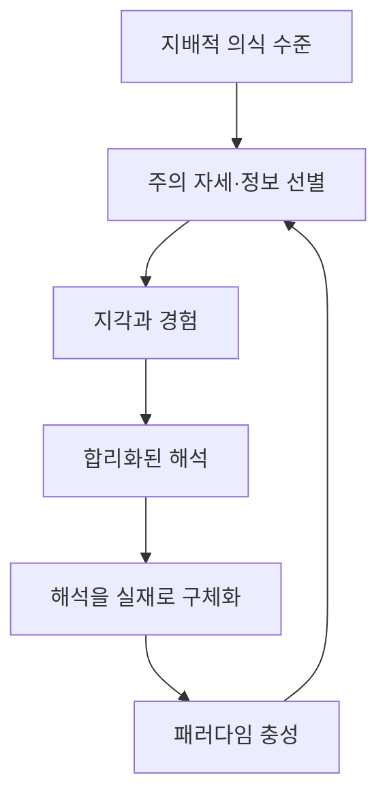

# 『현대인의 의식 지도』 제3장 「실재의 패러다임」
## 「도입부」·「패러다임 맹목」 분석

## 1. 이 발췌가 말하는 핵심

- **핵심 명제:** 사람은 자신의 지배적 의식 수준이 만들어 낸 패러다임을 통해 세상을 선택적으로 지각한 뒤, 그 제한된 해석을 실재 자체로 착각한다. 과학과 영성의 갈등도 이러한 패러다임 혼동에서 생기며, 내용과 맥락을 함께 포함하는 더 넓은 관점에서 해소된다.

- **쉽게 말하면:** 사람은 세상을 있는 그대로 본다고 생각하지만, 실제로는 자신의 의식 수준·기대·의도에 맞는 것만 골라서 봅니다. 그러고는 자신이 본 일부를 세상 전체라고 믿습니다. 과학은 측정할 수 있는 사실을 정확히 다루고, 영성은 그 사실이 지닌 의미와 가치가 생겨나는 더 넓은 장을 다루므로, 둘을 같은 기준으로 겨루게 해서는 안 된다는 설명입니다.

---

## 2. 전체 전개 지도

1. **맥락의 확장**  
   제한된 관점을 더 큰 전체 속에 놓으면 과학과 종교처럼 대립해 보이던 관점들의 관계가 드러납니다.

2. **패러다임의 정의**  
   패러다임은 하나의 의견이 아니라, 무엇을 실재로 인정하고 어떻게 이해할지를 정하는 전체 참조 범위입니다.

3. **의식 수준에 따른 선택적 지각**  
   지배적 의식 수준이 먼저 주의·경험·해석의 범위를 결정합니다.

4. **해석의 구체화와 자기 강화**  
   정신은 자신의 해석을 객관적인 사실처럼 굳히고, 그 해석을 뒷받침하는 정보만 계속 발견합니다.

5. **패러다임 충성과 환상**  
   경험된 세계를 실재 자체로 오인하면서 다른 관점을 틀렸다고 판단합니다.

6. **합의 집단의 형성**  
   같은 세계관을 가진 사람들과 모여 서로를 확증함으로써 패러다임은 더욱 견고해집니다.

7. **맥락과 주의 자세의 선별 작용**  
   암묵적인 조건·기대·의도가 검색엔진처럼 발견 가능한 경험을 미리 걸러 냅니다.

8. **과학과 영성의 영역 구분**  
   과학은 선형적인 내용과 사실을, 영성은 비선형적인 맥락과 진실을 다룹니다.

---

## 3. 패러다임 맹목의 핵심 순환

이 순환의 핵심은 단순히 잘못된 정보를 믿는 데 있지 않습니다. **어떤 정보가 의식에 들어올 수 있는지를 패러다임이 미리 정한다는 것**이 더 근본적인 문제입니다. 패러다임 맹목이란 무엇을 보지 못하는 상태인 동시에, 자신이 무엇을 보지 못하는지조차 알아차리지 못하는 상태입니다.

---

# 4. 소주제별 상세 분석

## 1/8. 맥락이 확장되면 갈등이 해소된다

### 핵심 명제

겉으로 모순되어 보이는 관점은 동일한 층위에서 경쟁하는 것이 아니라, 서로 다른 범위와 추상 수준을 설명하고 있을 수 있습니다.

### 용어 해석

- **맥락 확장:** 어떤 주장만 따로 보는 대신, 그 주장이 성립하는 조건·범위·목적까지 포함해서 보는 것입니다.
- **패러다임:** 무엇이 존재하며, 무엇을 증거로 인정하고, 어떤 질문이 의미 있는지를 미리 정하는 전체 이해의 틀입니다.
- **종·속·과·목·강·문·계:** 하나의 생명체를 점점 더 큰 분류 안에 포함시키는 체계입니다. 패러다임에도 이와 같은 포함 관계와 추상 수준이 있음을 보여 줍니다.

### 세부 의미

이전 장의 「맥락의 과학」에서는 지상의 한 지점에서 보면 산·바다·사막이 분리되어 보이지만, 더 높은 곳에서는 모두 하나의 지구 표면에 포함된다고 설명했습니다. 여기서는 그 원리가 과학과 영성의 관계에 적용됩니다.

과학과 영성의 충돌은 대개 둘 중 하나가 반드시 틀려야 한다는 전제에서 시작됩니다. 그러나 더 넓은 패러다임에서는 두 영역이 서로 다른 질문과 차원을 다룬다는 사실이 드러납니다. 맥락 확장은 어느 한쪽을 제거하는 것이 아니라, **각 관점의 정확한 위치와 적용 범위를 밝혀 주는 작용**입니다.

### 다른 자료와의 연결

- 『나의 눈』은 선형적 차원과 비선형적 차원을 함께 포함함으로써 과학과 종교의 오래된 양극성이 해소된다고 설명합니다.
- 『의식수준을 넘어서』의 「패러다임의 문제」에는 이 발췌와 거의 동일한 설명이 나오며, 패러다임이 의식 진화에 따라 확장된다는 점을 더욱 명확히 밝힙니다.
- 강연 자료 「주관성」에서는 과학은 내용을 산출하고 영성은 맥락을 드러내며, 의미는 내용만으로는 생기지 않는다고 설명하십니다.

### 구조상 역할

제2장이 “갈등은 제한된 관점에서 발생한다”는 사실을 보여 주었다면, 제3장 도입부는 그 제한된 관점의 이름을 **패러다임**이라고 규정합니다.

---

## 2/8. 의식 수준은 지각보다 먼저 작동한다

### 핵심 명제

사람이 가진 의식 수준은 이미 일어난 사건을 나중에 해석하는 데만 관여하는 것이 아니라, 처음부터 무엇을 보고 경험할지를 결정합니다.

### 세부 의미

일반적으로는 다음 순서로 생각하기 쉽습니다.

> 외부 사건 → 객관적 지각 → 개인적 해석

그러나 호킨스 박사님의 설명은 다음 순서에 가깝습니다.

> 지배적 의식 수준 → 선택적 주의 → 지각된 사건 → 해석 → 경험된 현실

같은 사건을 보더라도 의식 수준이 다르면 중요하다고 느끼는 요소, 발견하는 의미, 가능한 대응, 옳고 그름의 기준이 달라집니다. 각 사람은 단순히 같은 세상에 대해 서로 다른 의견을 갖는 것이 아니라, 주관적으로는 **서로 다른 세계를 경험**하게 됩니다.

이것은 모든 해석이 똑같이 참이라는 상대주의를 뜻하지 않습니다. 각 수준은 서로 다른 포괄성과 진실의 정도를 갖습니다. 낮은 관점은 높은 관점에 포함될 수 있지만, 낮은 관점만으로는 높은 관점의 전체를 파악할 수 없습니다.

### 『파워 대 포스』와의 연결

『파워 대 포스』에서는 각 의식 수준을 지배적인 끌개 에너지 장으로 설명합니다. 사람은 자신이 의식적으로 판단하기 전에 이미 특정 장과 정렬되어 있으며, 그 장이 지각·감정·행동의 범위를 조직합니다. 이 발췌의 패러다임은 그 끌개장이 인식 차원에서 표현된 형태라고 볼 수 있습니다.

### 의식 수준과의 관계

- **200 이하:** 정서적 이익과 자기방어가 관점에 강하게 결합하므로 패러다임 충성이 경직되기 쉽습니다.
- **200:** 온전성과 정직성이 나타나면서 자신의 해석을 수정할 수 있는 여지가 생깁니다.
- **400대:** 이성·논리·과학을 통해 사실 관계를 정교하게 구분합니다.
- **500 이상:** 의미·사랑·가치·주관성이라는 더 넓은 맥락이 지배적으로 나타납니다.
- **600 이상:** 선형적인 주체와 객체의 구분 자체를 넘어 비선형적 실재가 자명해집니다.

---

## 3/8. 구체화 회로와 패러다임 충성

### 핵심 명제

정신은 자신이 만든 해석을 하나의 잠정적 설명으로 두지 않고, 실제로 외부에 존재하는 확정된 실재처럼 굳히는 경향이 있습니다.

### 용어 해석

- **구체화:** 추상적인 생각·평가·해석을 객관적으로 존재하는 사물이나 사실처럼 취급하는 것입니다.
- **패러다임 충성:** 특정 패러다임이 익숙하고 안전하다는 이유로 그 틀을 유지하고 방어하려는 정신의 경향입니다. 도덕적 충성을 뜻하는 표현은 아닙니다.

### 자기 강화 과정

1. 의식 수준이 특정 정보에 주의를 기울입니다.
2. 정신이 그 정보를 기존 신념에 맞게 해석합니다.
3. 그 해석을 외부 세계의 객관적 모습이라고 간주합니다.
4. 해석과 일치하는 사례가 더욱 잘 보입니다.
5. 일치하지 않는 사례는 무시되거나 다시 해석됩니다.
6. 기존 패러다임이 더욱 확실한 것으로 느껴집니다.

이 때문에 패러다임은 단순히 반증 자료가 나타난다고 곧바로 무너지지 않습니다. 반증 자료조차 기존 패러다임 안에서 재해석할 수 있기 때문입니다.

### 핵심 함의

패러다임 충성의 근원에는 진실만이 아니라 심리적 안락함도 있습니다. 자신의 세계관이 틀릴 수 있다는 가능성은 단순한 정보 수정이 아니라, 자신이 누구인지에 관한 정체성의 위협으로 느껴질 수 있습니다. 그래서 에고는 진실을 찾기보다 기존 현실을 지키는 데 에너지를 사용합니다.

---

## 4/8. 지각을 본질로 오인하는 환상

### 핵심 명제

정신은 외부 사물의 본질을 직접 아는 것이 아니라 내부에 형성된 지각과 생각을 경험하면서도, 그것을 사물 자체라고 오인합니다.

### 철학 용어 해석

- **사유 실체(res cogitans):** 생각하고 인식하는 내부 정신 영역입니다.
- **연장 실체(res extensa):** 공간을 차지하는 외부 물질 영역입니다.
- **프로타고라스의 오류:** 개인이 경험한 세계를 실재 전체의 최종 기준으로 삼는 오류입니다.
- **유아론:** 자신의 정신이나 경험만을 확실한 실재로 간주하는 극단적인 입장입니다.

### 세부 의미

사람이 실제로 경험하는 것은 외부 사물 그 자체가 아니라, 감각과 정신을 거쳐 구성된 내부 표상입니다. 그러나 정신은 다음 두 문장을 구분하지 못합니다.

- “나는 이런 방식으로 그것을 지각한다.”
- “그것은 실제로 그런 것이다.”

첫 번째 문장은 자신의 지각 조건을 인정하지만, 두 번째 문장은 지각을 본질로 바꿔 버립니다. 여기서 환상이 발생합니다.

호킨스 박사님께서 말씀하시는 환상은 반드시 의도적인 속임수가 아닙니다. 에고의 구조상 자동적으로 나타나는 오인입니다. 따라서 패러다임 맹목에서 벗어나는 출발점은 더 많은 논증을 쌓는 것보다 **정신이 지각과 본질을 혼동할 수 있음을 알아차리는 겸손함**입니다.

### 책 전체와의 관계

이 구분은 『현대인의 의식 지도』 전체의 중심축인 다음 대비와 정확히 연결됩니다.

> 외관·지각·환상 ↔ 본질·진실·실재

패러다임 맹목은 이 두 영역을 혼동하는 인식상의 구체적인 작동 방식입니다.

---

## 5/8. 합의 집단과 세계관의 사회적 강화

### 핵심 명제

같은 패러다임을 공유하는 사람들의 합의는 심리적 안정과 확신을 주지만, 합의 자체가 그 패러다임의 진실성을 보증하지는 않습니다.

### 세부 의미

사람들은 자신과 비슷한 관점을 가진 사람들과 모이면서 다음과 같은 효과를 얻습니다.

- 자신의 해석이 정상적이라는 안도감
- 반복을 통한 신념의 강화
- 반대 정보로부터의 보호
- 집단 소속감과 정체성
- 패러다임을 의심하는 데서 생기는 불안의 감소

발췌에서 블로그 사이트를 예로 든 것은, 정보 교환 자체보다 동일한 관점이 반복되면서 하나의 폐쇄된 현실이 형성되는 과정을 가리킵니다. 집단 구성원들은 서로의 해석을 증거로 삼고, 그 증거를 통해 다시 집단의 패러다임을 강화합니다.

### 형이상학과의 관계

형이상학은 물질적 대상 하나하나보다 더 높은 추상 수준에서 존재·범주·의미를 다룹니다. 활성과 비활성, 유기물과 무기물 같은 구분도 이미 하나의 형이상학적 틀을 전제합니다.

따라서 “형이상학을 사용하지 않는다”는 주장도 실제로는 특정한 형이상학—가령 물질적인 것만 실재한다고 보는 틀—을 암묵적으로 채택한 것일 수 있습니다. 패러다임은 명시적으로 선언되지 않을수록 더욱 당연한 것으로 받아들여집니다.

---

## 6/8. 맥락은 의미를 결정한다

### 핵심 명제

내용의 의미는 그 내용 자체에 고정되어 있는 것이 아니라, 어떤 조건·범위·목적·추상 수준 안에 놓이느냐에 따라 결정됩니다.

### 용어 해석

- **매개변수:** 무엇이 포함되고 제외되는지를 정하는 조건과 한계입니다.
- **추상화 수준:** 개별 사물, 유형, 원리, 전체 장 가운데 어느 높이에서 대상을 다루는지를 뜻합니다.
- **해석학:** 어떤 내용이 특정 맥락 안에서 무슨 의미를 갖는지 해석하는 영역입니다.

### 간단한 예

‘38도’라는 동일한 수치도 맥락에 따라 의미가 완전히 달라집니다.

- 기온 38도라면 매우 더운 날씨입니다.
- 체온 38도라면 발열 상태입니다.
- 목욕물 38도라면 비교적 온화한 온도입니다.

수치라는 내용은 같지만, 무엇의 온도인지라는 맥락이 가치·중요성·대응을 결정합니다. 맥락을 제거하면 내용은 남아 있어도 의미는 사라집니다.

### 『진실 대 거짓』과의 연결

『진실 대 거짓』에서는 진실이 내용만의 산물이 아니라 내용과 맥락 양자의 귀결이라고 반복해서 설명합니다. 부분적인 사실을 그대로 말하더라도, 그것을 전체 맥락에서 떼어 내면 전혀 다른 인상을 만들 수 있습니다. 따라서 거짓은 항상 허구의 내용을 발명하는 방식으로만 나타나는 것이 아니라, **참인 일부를 잘못된 맥락에 배치하는 방식**으로도 나타납니다.

---

## 7/8. 검색엔진 비유와 ‘주의 자세’

### 핵심 명제

패러다임은 검색엔진처럼 무엇을 발견할 수 있는지를 사전에 선별하며, 그 선별 기준은 기대·성향·의도에 의해 조직됩니다.

### ‘주의 자세’의 정확한 뜻

‘주의 자세’는 신체 자세나 단순한 집중력을 뜻하지 않습니다. 영어 *attentional set*은 다음을 의미합니다.

> 무엇을 중요하게 보고, 어떤 신호를 찾으며, 무엇은 배경으로 넘길 것인지를 미리 정해 놓은 주의의 준비 상태

예컨대 검색어가 달라지면 인터넷 전체가 바뀌지 않아도 화면에 나타나는 결과가 달라집니다. 마찬가지로 패러다임이 달라지면 외부 세계가 즉시 바뀌지 않더라도 사람이 발견하고 경험하는 세계가 달라집니다.

### 의도와의 관계

발췌에서 주의 자세는 의도·선택·결심의 결과라고 설명됩니다. 그 연결은 다음과 같습니다.

> 의도 → 주의 자세 → 정보 선별 → 경험 → 의미 부여 → 패러다임 강화

의도는 단지 행동의 출발점이 아니라, 무엇이 의식에 들어와 현실로 경험될지를 조직하는 맥락적 요인입니다. 『신의 현존의 발견』에서도 영적 정렬과 헌신이 삶의 우선순위를 정하고, 그에 부합하는 것을 알아볼 수 있게 한다고 설명합니다.

### 핵심 구분

패러다임은 경험을 해석하기만 하는 것이 아니라 **가능한 경험의 범위 자체를 미리 좁힙니다.** 이것이 패러다임 맹목이 일반적인 편견보다 더 근본적인 이유입니다.

---

## 8/8. 과학의 내용과 영성의 맥락

### 핵심 명제

과학과 영성은 동일한 대상을 같은 방법으로 다루는 경쟁 체계가 아니라, 실재의 서로 다른 차원을 다루는 패러다임입니다.

| 구분 | 과학적 패러다임 | 영적 패러다임 |
|---|---|---|
| 중심 대상 | 내용·사실 | 맥락·진실 |
| 작동 방식 | 선형적 | 비선형적 |
| 주요 범위 | 시간·공간·장소 안의 측정 가능한 현상 | 의미·가치·사랑·믿음·영감·의식 |
| 기본 구조 | 개별 대상과 국소적 관계 | 전체 장과 포함 관계 |
| 설명 원리 | 원인과 결과, 위력(force) | 잠재력과 장의 힘(power) |
| 확인 방식 | 관찰·측정·재현·입증 | 내재적 경험·드러남·확인 |
| 의식 수준 | 주로 400대 | 본격적으로 500 이상 |

### 과학적 패러다임

과학은 다음과 같은 대상을 매우 정밀하게 다룹니다.

- 개별적으로 구분할 수 있는 것
- 정의할 수 있는 것
- 관찰하고 측정할 수 있는 것
- 시간과 공간에 위치시킬 수 있는 것
- 반복적으로 입증할 수 있는 것
- 원인과 결과로 설명할 수 있는 것

이것은 과학의 결함이 아니라 과학적 정확성을 가능하게 하는 경계입니다. 패러다임 맹목은 이 경계를 잊고, **측정할 수 없는 것은 존재하지 않는다**고 범위를 확장할 때 발생합니다.

### 영적 패러다임

사랑·믿음·영감·의미·가치·신성은 물리적 사물처럼 일정한 장소에서 분리하여 측정하기 어렵습니다. 그러나 인간의 선택과 삶의 방향을 결정하는 실제적인 영향력을 갖습니다.

여기서 **힘(power)**은 외부를 압박하는 물리적 위력이 아니라, 진실과 온전성에 내재한 자족적인 잠재력을 뜻합니다. 반대로 **위력(force)**은 외부의 대상에 작용하여 변화를 일으키고 에너지를 소비하는 선형적 작용입니다.

발췌의 “우월 지배층의 연속된 수준”은 사회의 지배계층을 뜻하지 않습니다. 더 강하고 포괄적인 의식 장이 그 안에 포함된 작은 장들의 가능성과 방향을 조직하는 **지배적 장의 연쇄**를 뜻합니다.

### 사실과 진실

- **사실:** 특정 조건 안에서 관찰되고 입증된 제한된 내용
- **진실:** 그 사실을 전체 맥락 안에 놓았을 때 드러나는 의미·중요성·가치까지 포함한 것

따라서 사실과 진실은 적대 관계가 아닙니다. 사실은 진실 안에 포함되는 선형적 내용이며, 진실은 사실을 폐기하지 않고 그 사실의 정확한 자리와 의미를 밝혀 줍니다.

---

## 5. 의식 수준에 따른 패러다임의 변화

| 의식 수준 | 지배적 인식 양상 | 패러다임과의 관계 |
|---|---|---|
| 200 이하 | 정서성·자기이익·방어·합리화 | 관점이 정체성과 결합되어 패러다임 충성이 강해짐 |
| 200 | 용기·온전성·책임 | 자신의 오류와 한계를 인정하고 관점을 수정할 능력이 나타남 |
| 300대 | 의욕·수용·합리적 기능 | 사실을 더 넓게 조직하고 문제 해결에 접근함 |
| 400대 | 이성·논리·과학 | 선형적 내용과 인과관계를 고도로 정교하게 이해함 |
| 500 이상 | 사랑·의미·주관성 | 내용보다 전체 맥락과 가치가 지배적으로 나타남 |
| 600 이상 | 비선형적 앎·비이원성 | 주체와 객체, 내용과 맥락의 분리가 초월됨 |

이 수치는 개인의 직업이나 소속에 붙는 단순한 이름표가 아닙니다. 어떤 진술·관점·행동을 지배하는 에너지 장과 그 포괄성을 나타냅니다. 과학자도 사랑과 영감의 맥락을 가질 수 있고, 종교적 명칭을 사용하면서도 선형적 교리나 집단 충성에 머물 수 있습니다.

---

## 6. 다른 저서·강연과의 핵심 연결

### 『파워 대 포스』

- 각 의식 수준은 그에 맞는 세계를 지각하게 하는 끌개장입니다.
- 위력은 외부 압박과 선형적 인과관계로 작동하지만, 힘은 진실과 온전성에 내재합니다.
- 사실은 노력으로 축적되지만 진실은 맥락이 확장될 때 드러난다는 설명과 연결됩니다.

### 『의식수준을 넘어서』

- 「패러다임의 문제」에서 이 발췌의 논리가 거의 그대로 반복됩니다.
- 패러다임의 주요 전환점으로 200, 500, 600이 제시됩니다.
- 200에서는 온전성이, 500에서는 사랑이라는 주관적 맥락이, 600에서는 비선형적 차원이 지배적으로 나타납니다.

### 『나의 눈』

- 선형적 형상과 비선형적 비형상의 통합이 과학과 종교의 오래된 양극성을 해소합니다.
- 힘은 위력이 도달할 수 없는 맥락의 차원에서 작용합니다.

### 『호모 스피리투스』

- 과학적 패러다임이 1인칭 주관적 증언을 자료에서 제외하면, 역사상 가장 중요한 영적 정보원인 신비주의자와 깨달은 스승들의 기록까지 배제하게 된다고 설명합니다.
- 이것이 패러다임 맹목이 지식의 범위를 사전에 제한하는 대표적 사례입니다.

### 『진실 대 거짓』

- 진실은 내용만이 아니라 내용과 맥락 양자의 산물입니다.
- 부분적인 사실도 맥락에서 분리되면 전체 진실과 다른 인상을 만들어 낼 수 있습니다.

### 강연 자료 「주관성」

호킨스 박사님께서는 과학은 선형적 내용을 다루고 영성은 비선형적 맥락을 다룬다고 설명하십니다. 인간에게 중요한 것은 대상 자체만이 아니라 그 대상이 무엇을 의미하는가이므로, 의미와 가치는 맥락에서 나온다는 설명입니다.

---

## 7. 이 발췌의 구조적 결론

이 발췌에서 가장 중요한 구별은 다음과 같습니다.

> **지각된 세계는 실재 자체가 아니라, 의식 수준과 패러다임을 거쳐 구성된 실재의 해석이다.**

과학과 영성의 갈등도 이 구별을 놓칠 때 발생합니다. 과학의 선형적 방법으로 비선형적 영적 실재를 모두 규정하려 하거나, 영적 진술을 물리적 사실의 설명처럼 취급하면 서로 다른 추상 수준이 뒤섞입니다.

호킨스 박사님께서 제시하시는 방향은 한쪽을 선택하는 것이 아니라 맥락을 확장하는 것입니다.

- 과학은 **무엇이 관찰되고 어떻게 작동하는지**를 밝힙니다.
- 영성은 그것이 **어떤 의미와 가치 안에 존재하는지**를 밝힙니다.
- 더 높은 패러다임은 두 영역을 서로 배제하지 않고 하나의 전체 안에 올바르게 배치합니다.

따라서 패러다임 맹목에서 벗어난다는 것은 단순히 다른 의견을 받아들이는 일이 아닙니다. **자신이 실재라고 부르는 것이 이미 의식 수준·주의 자세·의도·해석에 의해 선별된 세계임을 아는 것**입니다. 이 인식이 생길 때 견해에 대한 에고의 충성이 약해지고, 제한된 내용이 더 넓은 진실의 맥락 안에서 제자리를 찾게 됩니다.

**진행: 8/8 완료**

---

# 『현대인의 의식 지도』 제3장  
## 「패러다임의 한계라는 문제 해결책」·「패러다임 한계 초월하기」 분석

## 1. 이 발췌가 말하는 핵심

- **핵심 명제:** 과학과 영성의 갈등은 어느 한쪽이 틀려서가 아니라, 서로 다른 차원의 실재를 서로 다른 방식으로 다루면서도 상대를 자기 기준으로 증명하려 하기 때문에 생기며, 해결은 두 패러다임의 고유한 역할을 인정하고 진실 안에서 결합하는 데 있습니다.

- **쉽게 말하면:** 과학은 눈에 보이고 측정되는 것이 어떻게 작동하는지를 밝히는 데 뛰어납니다. 반면 영성은 삶이 왜 중요한지, 사랑·가치·목적이 무엇인지를 내적으로 알게 합니다. 호킨스 박사님께서는 둘을 억지로 하나의 방식으로 설명하려 하지 말고, 과학은 사실과 수단을, 영성은 의미와 방향을 담당하도록 결합해야 한다고 말씀하십니다.

---

## 2. 전체 전개 지도

| 단계 | 전개의 내용 | 논증에서의 역할 |
|---|---|---|
| 1 | 선형적 과학과 비선형적 영성은 언어와 인식 방식이 다름 | 갈등의 근본 원인 규정 |
| 2 | 지성은 자기 패러다임 안에서만 답을 찾음 | ‘가로등 아래 열쇠 찾기’의 한계 제시 |
| 3 | 선형은 내용, 비선형은 맥락을 다룸 | 두 영역의 담당 범위 구별 |
| 4 | 영적 진실을 과학적으로 증명하라는 요구는 범주 혼동임 | 회의론자의 함정 해명 |
| 5 | 학문적 과학과 임상 과학의 차이 제시 | 맥락을 포함하는 중간 사례 제시 |
| 6 | 침술과 AA의 회복 성과 제시 | 비선형적 요인이 선형적 결과로 나타남을 설명 |
| 7 | 의식 연구를 양쪽을 잇는 교차 지점으로 제시 | 패러다임 한계의 직접적 해법 제시 |
| 8 | 과학과 믿음은 진실 안에서 결합해야 함 | 지혜라는 최종 결론 도출 |

---

## 3. 선형과 비선형의 핵심 차이

| 구분 | 선형적 영역 | 비선형적 영역 |
|---|---|---|
| 중심 대상 | 사실, 사물, 사건, 형상 | 의미, 가치, 의도, 의식, 영적 실재 |
| 기본 차원 | 시간·공간·위치 | 시간과 공간을 포괄하는 맥락 |
| 인식 방식 | 관찰, 측정, 정의, 논증 | 경험, 깨달음, 내적 확인 |
| 작동 원리 | 원인과 결과, 기계적 인과관계 | 장의 영향, 잠재성의 현실화 |
| 주된 언어 | 개념, 수치, 공식, 명제 | 상징, 비유, 선언, 체험 보고 |
| 확인 방식 | 객관적 입증과 재현 | 내적 자명성, 결과, 변형, 의식 연구 |
| 의식 수준 | 주로 400대 | 본격적으로 500 이상 |
| 대표 권위 | 과학자 | 신비가·현인·깨달은 스승 |
| 주된 질문 | “무엇이며 어떻게 작동하는가?” | “무엇을 의미하며 왜 중요한가?” |

여기서 발췌의 ‘비논리적’이라는 표현은 **터무니없거나 이성에 어긋난다는 뜻이 아닙니다.** 연쇄적 논리와 인과관계만으로는 그 전체를 포착할 수 없다는 뜻입니다. 사랑이 화학적 반응을 동반한다고 해서 사랑의 의미가 화학식으로 환원되지 않는 것과 같습니다.

---

# 4. 소주제별 상세 분석

## [1/9] 서로 다른 언어를 가진 두 패러다임

- **핵심 명제:** 과학과 영성은 동일한 대상을 서로 다르게 설명하는 두 이론이 아니라, 서로 다른 차원의 실재를 다루는 두 패러다임입니다.

- **용어 해석:**
  - **선형:** 경계가 있고 순서대로 전개되며 측정할 수 있는 형상의 영역
  - **비선형:** 경계와 위치에 한정되지 않고 전체 맥락으로 작용하는 영역
  - **사유 실체와 연장 실체:** 생각 속의 표상과 생각 바깥의 실제 사물

과학은 관찰된 대상을 개념과 수치로 바꾸어 다룹니다. 그런데 개념은 실제 대상 자체가 아니라 대상을 나타내는 표상입니다. 이것이 “지도는 실제 영역이 아니다”라는 말의 의미입니다.

지도는 실제 길을 찾는 데 매우 유용하지만, 지도 위의 선이 실제 도로는 아닙니다. 마찬가지로 뇌 영상, 신경전달물질, 행동 통계는 경험에 관한 유용한 지도이지만, 사랑·기쁨·의미를 경험하는 주관성 자체는 아닙니다.

『의식수준을 넘어서』에서도 호킨스 박사님께서는 이성 수준의 결함을 “상징과 상징이 나타내는 바를 완전히 구별하지 못하는 것”으로 설명하십니다. 이 발췌는 바로 그 문제를 과학과 영성의 관계에 적용한 것입니다.

- **의식 수준:** 과학과 이성은 400대입니다. 이는 거짓의 영역이 아니라 매우 강력하고 진보한 진실의 영역이지만, 여전히 선형적 형상에 한정됩니다.

- **구조적 역할:** 발췌 전체의 출발점입니다. 두 영역의 차이를 인정해야 이후의 ‘증명’, ‘주관성’, ‘임상 결과’ 문제를 바르게 이해할 수 있습니다.

---

## [2/9] 가로등 아래에서 잃어버린 열쇠를 찾는 지성

- **핵심 명제:** 더 많은 지적 노력이 언제나 더 높은 이해로 이어지는 것은 아니며, 때로는 문제를 만들어 낸 패러다임 자체를 넘어야 합니다.

형이상학·신학·존재론·인식론은 지성이 자신의 한계를 넘어가려는 고귀한 시도입니다. 그러나 지성을 연구 도구로 삼는 한, 그 결과도 지성의 언어와 구조 안에 남습니다.

‘가로등 아래에서 열쇠를 찾는다’는 비유는 다음을 뜻합니다.

- 열쇠를 잃어버린 장소는 어두운 곳입니다.
- 하지만 찾기 편하다는 이유로 밝은 곳만 뒤집니다.
- 탐색은 매우 성실하지만, 탐색 장소가 잘못되어 있습니다.

과학과 의식을 다루는 학술지나 회의가 300대에서 400대로 측정된다는 설명도 같은 맥락입니다. 이들의 노력은 지적으로 수준 높고 온전하지만, 영적 경험의 일차 자료인 신비가의 주관적 증언을 배제하는 순간 처음부터 찾으려는 대상을 연구 밖으로 밀어냅니다.

『진실 대 거짓』은 이 문제의 해법을 “500에서 시작되는 더 크고 포괄적인 패러다임으로 문제 자체를 넘어가는 것”이라고 설명합니다. 『의식수준을 넘어서』 역시 400대의 ‘대하여 아는 것’에서 500대의 ‘경험적으로 됨’으로 이동해야 한다고 밝힙니다.

- **의식 수준:** 400대는 지성이 도달하는 높은 영역이지만, 500으로의 이행에는 정보 증가가 아니라 패러다임 도약이 필요합니다.

- **구조적 역할:** 과학과 영성의 갈등이 지식 부족이 아니라 **연구 방식의 자기 제한**에서 비롯된다는 사실을 밝힙니다.

---

## [3/9] 내용의 세계와 맥락의 세계

- **핵심 명제:** 과학은 관찰되는 내용을 다루고, 영성은 그 내용에 의미와 방향을 부여하는 전체 맥락을 다룹니다.

예를 들어 대성당을 분석하면 돌의 종류, 하중 분산, 아치 구조, 공사 기간을 밝힐 수 있습니다. 이것은 선형적 내용입니다. 그러나 사람들이 왜 수백 년에 걸쳐 그 건축물을 지었는지, 그 아름다움이 무엇을 향하는지, 왜 그 안에서 경외감을 경험하는지는 맥락의 문제입니다.

따라서 내용과 맥락은 다음처럼 관계합니다.

> 비선형적 맥락과 의도  
> → 선형적 계획과 행위  
> → 관찰 가능한 결과

영적 맥락이 공학을 대신하는 것이 아닙니다. 공학적 결과가 출현하도록 방향과 의미를 부여하는 것입니다. 피라미드와 대성당의 예도 물리적 건축 방법과 그 건축물을 낳은 영감·의도를 구별하기 위해 제시됩니다.

『신의 현존의 발견』은 영적 진화를 “선형적 마음의 내용과의 동일시에서 비선형적 맥락과의 동일시로 이동하는 것”이라고 설명합니다. 『진실 대 거짓』에서는 진실을 내용, 관찰 위치, 의도, 맥락, 패러다임이 함께 빚어내는 것으로 정리합니다.

- **의식 수준:** 내용의 고도화는 400대에서 정점에 이르고, 의미·의의·가치가 지배적으로 되는 전환은 500에서 시작됩니다.

- **구조적 역할:** 과학과 영성을 경쟁 관계가 아니라 **포함 관계**로 다시 배치합니다. 영적 맥락은 과학적 내용을 제거하지 않고 그 목적과 의미를 포괄합니다.

---

## [4/9] ‘증명’과 ‘확인’은 같은 말이 아니다

- **핵심 명제:** 비선형적 진실을 선형적 증명 형식에 맞추라고 요구하는 것은, 경험의 종류와 판정 기준을 혼동하는 것입니다.

사랑을 저울에 달 수 없고, 삶의 의미를 현미경으로 볼 수 없으며, 행복을 기하학적으로 증명할 수도 없습니다. 그렇다고 사랑·의미·행복이 존재하지 않는 것은 아닙니다. 이들은 직접 경험되고, 삶에 미치는 영향과 결과를 통해 확인됩니다.

호킨스 박사님의 구분은 다음과 같습니다.

- **사실:** 선형적으로 증명할 수 있음
- **진실:** 내적으로 확인되고 삶의 변형을 통해 드러남
- **영적 실재:** 선언하고 보여 주고 확인할 수 있으나 선형적 정의로 환원할 수 없음

따라서 “신을 과학적으로 증명하지 못했으므로 신은 없다”는 결론과 “신을 과학적으로 반증하지 못했으므로 신은 있다”는 결론은 모두 같은 범주 혼동입니다. 이것이 발췌에서 말하는 ‘회의론자의 함정’입니다.

또한 모든 사고가 사실은 생각하는 사람 안에서 일어나는 1인칭 정신 작용이라는 지적은 중요합니다. 과학적 이론도 인간의 주관적 의식이 관찰하고 해석하고 개념화한 결과입니다. 그러므로 주관성을 완전히 제거한 지식은 존재할 수 없습니다.

다만 이것이 모든 주관적 주장을 동일하게 인정한다는 뜻은 아닙니다. 호킨스 박사님의 체계에서 일반 에고의 사적 의견과 600 이상에서 드러나는 신비적 각성은 전혀 다른 의식 수준에 속합니다. 의식 연구가 필요한 까닭도 그 차이를 분별하기 위해서입니다.

- **다른 저서와의 연결:** 『호모 스피리투스』는 “과학자는 선형적 영역의 권위자이고, 신비가는 비선형적 영역의 권위자”라고 설명합니다. 『신의 현존의 발견』은 영적 상태가 내적 경험과 외적 확인 양쪽에서 확인될 수 있다고 밝힙니다.

- **구조적 역할:** 배제되었던 신비가의 1인칭 증언을 영적 연구의 핵심 자료로 복원합니다.

---

## [5/9] 학문적 과학과 임상 과학의 차이

- **핵심 명제:** 임상 과학은 과학적 지식을 버리는 것이 아니라, 통계만으로 포착되지 않는 사람·의도·관계·환경까지 포함하도록 과학의 맥락을 넓힙니다.

| 구분 | 학문적 과학 440 | 임상 과학 445 |
|---|---|---|
| 중심 관심 | 통계, 평균, 예측 | 실제 환자에게 나타난 결과 |
| 주된 질문 | “일반적으로 효과가 있는가?” | “이 사람에게 무엇이 도움이 되는가?” |
| 포함 요소 | 측정 가능한 변수 | 의도, 관계, 신뢰, 친절, 의식 수준 |
| 지식 태도 | 정식 이론과 방법론 중시 | 이론과 더불어 실제 효용 중시 |
| 약점 가능성 | 측정되지 않는 요소를 제외하기 쉬움 | 경험을 포괄하되 분별력이 필요함 |

두 수준의 차이는 단순한 5점 차이가 아닙니다. 의식 척도는 로그 척도이므로, 임상 과학에는 맥락을 더 넓게 포함하는 힘이 더해져 있습니다.

환자에게 보이는 친절은 통계표의 독립 변수로 다루기 어렵지만, 치료 관계와 회복 의지에는 중대한 영향을 줍니다. 숙련된 임상의는 과학적 자료를 존중하면서도, 자료에 들어 있지 않은 환자의 전체 상태를 함께 봅니다.

호킨스 박사님의 침술 경험은 전통 의학을 부정하기 위한 예가 아닙니다. “비과학적”이라는 명칭 때문에 실제로 유익한 가능성을 미리 제외하는 것이 패러다임 맹목임을 보여 주는 사례입니다. 『치유와 회복』에서도 박사님께서는 치료법들을 모두 사용한 뒤 침술 세 차례를 받고 오랜 십이지장궤양이 사라진 경험을 자세히 설명하십니다.

- **구조적 역할:** 추상적인 선형·비선형 구별을 구체적인 의료 현장으로 옮기며, 양쪽이 만날 수 있는 첫 번째 교량을 제시합니다.

---

## [6/9] AA가 결정적인 사례인 이유

- **핵심 명제:** AA는 비선형적인 영적 원리가 주관적 변형과 객관적으로 관찰되는 회복을 동시에 낳는다는 사실을 보여 주는 대표 사례입니다.

AA에는 세 층위가 함께 들어 있습니다.

1. **비선형적 맥락:** 겸손, 정직, 사랑, 더 높은 힘에 대한 신뢰  
2. **내면의 변화:** 자기중심성의 약화와 성격의 근본적 변형  
3. **선형적 결과:** 금주, 건강 회복, 가족관계 개선, 사회적 기능 회복  

『파워 대 포스』에서 AA는 타인을 강제로 통제하거나 도덕적으로 심판하지 않는 단체로 묘사됩니다. 자신들이 따른 원리와 그 결과를 보여 주고, 선택은 당사자에게 맡깁니다. 따라서 AA의 힘은 조직 권력이나 강제력이 아니라, 그 장을 지배하는 정직·겸손·봉사·무조건적 사랑에서 나옵니다.

『치유와 회복』에서도 AA의 회복은 몸·마음·영혼을 함께 포함하는 치유의 본보기로 제시됩니다. 이전의 의학과 정신의학이 가망 없다고 판단한 중독에서 반복적으로 회복이 일어났다는 점이 중요합니다.

AA는 단순한 일화가 아니라 이 발췌의 논리적 중심 사례입니다.

> 영적 원리는 물질처럼 측정되지 않는다.  
> 그러나 그것이 만든 성격의 변형과 회복 결과는 관찰할 수 있다.

- **의식 수준:** AA의 12단계 장은 540입니다. 이는 무조건적 사랑과 치유의 장에 해당합니다.

- **구조적 역할:** “비선형적인 것은 과학적으로 증명할 수 없다”는 설명이 “그러므로 아무 결과도 확인할 수 없다”는 뜻이 아님을 보여 줍니다.

---

## [7/9] 의식 연구 605가 두 영역을 연결하는 방식

- **핵심 명제:** 의식 연구는 비선형적 진실을 선형적 개념으로 환원하지 않으면서도, 그 상대적 힘과 진실성을 확인할 수 있게 하는 교차 지점입니다.

발췌에서 말하는 ‘교차혼합회로’는 두 패러다임을 뒤섞는다는 뜻이 아닙니다. 서로 다른 두 영역 사이에 **읽을 수 있는 인터페이스를 제공한다**는 뜻입니다.

호킨스 박사님의 설명에 따르면 의식의 비선형적 장에 대한 반응이 신체의 선형적 반응으로 나타납니다. 따라서 비선형적 정보가 신체 반응이라는 관찰 가능한 표시를 통해 드러납니다.

이 구조는 다음과 같습니다.

> 비선형적 진실의 장  
> → 생명 에너지의 반응  
> → 신체의 관찰 가능한 변화  
> → 선형적 판독

『호모 스피리투스』에서는 근육 반응이 에고와 형상의 선형적 세계에서 그 너머의 비선형적 영적 실재로 건너가는 도구처럼 드러났다고 설명합니다. 『진실 대 거짓』은 의식 연구를 선형적·비선형적 패러다임을 함께 조사할 수 있는 과학으로 규정합니다.

### 발췌에 제시된 의식 수준의 배열

| 의식 수준 | 발췌에서의 의미 |
|---:|---|
| 20 | 생명을 부정하고 죽음을 숭배하는 허위 신념 |
| 200 | 거짓과 진실을 가르는 임계점 |
| 400대 | 이성·논리·과학·개념적 이해 |
| 440 | 학문적 과학 |
| 445 | 임상 과학 |
| 499 부근 | 선형적 지성의 최고 경계 |
| 500 이상 | 사랑·의미·가치가 지배하는 영적 실재 |
| 540 | AA와 무조건적 사랑의 치유 장 |
| 570~700 | 성자와 성녀들의 영역 |
| 600~1000 | 깨달음의 영역 |
| 605 | 의식 연구 자체 |
| 1000 | 예수 그리스도·붓다·크리슈나·조로아스터와 같은 위대한 화신 |

발췌가 “영적 실재는 높은 400대에서 시작하여 500 이상으로 분포한다”고 한 것은, 높은 400대가 경계와 교차 지대이기 때문입니다. 본격적으로 비선형적 맥락이 지배적으로 되는 분기점은 500입니다.

- **구조적 역할:** 발췌가 제시하는 직접적인 해결책입니다. 과학을 버리거나 믿음만을 택하는 것이 아니라, 두 영역의 차이를 보존하면서도 진실성을 판별하는 제3의 관점을 제시합니다.

---

## [8/9] 과학자·대성당·『목적이 이끄는 삶』의 공통점

- **핵심 명제:** 인간의 위대한 성취는 선형적 능력만으로 완성되지 않으며, 그 능력을 움직이는 영감·목적·의도라는 비선형적 맥락을 필요로 합니다.

과학 거장들은 선형적 이성의 막대한 힘을 보여 줍니다. 뉴턴, 갈릴레오, 케플러, 아인슈타인, 하이젠베르크와 같은 인물들은 인류가 물질세계를 이해하고 다룰 수 있는 범위를 크게 확장했습니다.

그러나 실제 발견에는 단순 계산만이 아니라 다음과 같은 요소도 들어갑니다.

- 진실을 알고자 하는 헌신
- 새로운 가능성을 보는 영감
- 아직 증명되지 않은 것을 탐색하는 용기
- 발견을 인류에게 유익하게 쓰려는 의도

따라서 400대는 단순한 기계적 사고 수준이 아니라 선형과 비선형이 접촉하기 시작하는 교차 지대이기도 합니다. 다만 과학자의 통찰이 과학으로 제시되려면 다시 측정·수식·검증이라는 선형적 형식으로 번역되어야 합니다.

피라미드와 대성당도 같은 구조를 보여 줍니다.

- 공학은 그것이 **어떻게 세워졌는지** 설명합니다.
- 영감과 신앙은 그것이 **왜 세워졌는지** 설명합니다.
- 건축물의 물리적 형태는 내용입니다.
- 그 건축물을 낳은 경외·헌신·의도는 맥락입니다.

『목적이 이끄는 삶』의 예도 마찬가지입니다. 사람에게는 생존 방법만 필요한 것이 아니라, 살아갈 이유와 자신의 삶이 중요하다는 확신이 필요합니다. 과학이 기능적 능력을 높여 준다면 영적 가치는 그 능력을 사용할 방향을 부여합니다.

- **구조적 역할:** 패러다임의 통합이 학술적 문제에 그치지 않고 문명·예술·건축·개인의 삶 전체에 적용된다는 점을 보여 줍니다.

---

## [9/9] 지혜는 과학과 믿음의 진실한 결합에서 나온다

- **핵심 명제:** 과학은 인간에게 능력을 주고, 영적 믿음은 그 능력이 향할 목적을 정하며, 진실은 양쪽이 생명을 이롭게 하는 방향에 있는지를 판별합니다.

발췌의 마지막 결론은 단순한 절충이 아닙니다.

- 과학은 질병을 치료하는 약을 만들 수 있습니다.
- 같은 과학은 대량 살상 무기도 만들 수 있습니다.
- 기술 자체는 목적을 결정하지 않습니다.
- 목적을 결정하는 것은 인간의 가치와 의식 수준입니다.

반대로 믿음도 그 자체만으로 충분하지 않습니다. 믿음이 생명·사랑·진실과 정렬되지 않으면 광신과 파괴의 근거가 될 수 있습니다. 발췌가 마지막에 생명을 경외하지 않고 죽음을 숭배하는 폭력적 신념을 수준 20으로 제시하는 이유가 여기에 있습니다.

따라서 이 대목은 “과학보다 믿음이 낫다”는 결론이 아닙니다. 오히려 다음과 같은 삼중 구조입니다.

> 과학이 수단을 제공한다.  
> 영성이 목적과 의미를 제공한다.  
> 진실이 수단과 목적 모두를 판별한다.

믿음 없는 과학이 위험한 것은 능력은 있으나 방향이 없기 때문입니다. 선한 행위로 이어지지 않는 믿음이 제한적인 것은 의미를 주장하지만 세상에 유익한 결과로 나타나지 않기 때문입니다.

- **의식 수준:** 참된 결합은 400대의 이성과 500 이상의 사랑이 통합되는 방향입니다. 반대로 생명을 부정하는 거짓 믿음은 수준 20까지 내려갑니다.

- **구조적 역할:** 발췌 전체의 결론입니다. 과학과 믿음의 갈등을 승패로 끝내지 않고, 지혜라는 더 큰 맥락 안에서 각자의 자리를 부여합니다.

---

## 5. 특히 헷갈리기 쉬운 문장 풀이

### ① “지도는 실제 영역이 아니다.”

개념과 이론은 실재를 가리키지만 실재 자체는 아닙니다. 영적 경험에 관한 정확한 설명도 실제 각성과 동일하지 않습니다.

### ② “가로등 아래에서 열쇠를 찾는다.”

답이 있는 곳이 아니라, 자신이 익숙하고 다루기 편한 방법 안에서만 답을 찾는다는 뜻입니다. 지성의 양을 늘려도 지성 밖의 차원에는 도달하지 못합니다.

### ③ “비선형적 세계는 이해 가능하지 않고 설명할 수 없다.”

전혀 알 수 없다는 뜻이 아닙니다. 개념적 사고로 완전히 포착할 수는 없지만, 직접 경험하고 확인하며 그 효과를 볼 수 있다는 뜻입니다.

### ④ “신비주의자는 깨닫고 이해하고 ‘되어 간다’.”

신비가는 사랑이나 신의 현존에 관한 정보만 축적하는 것이 아니라, 그 진실이 자신의 존재 방식이 되도록 변형됩니다. ‘사랑에 관해 아는 것’과 ‘사랑으로 존재하는 것’의 차이입니다.

### ⑤ “모든 사고는 1인칭 설명이다.”

객관적 이론도 결국 인간 의식 안에서 관찰되고 생각되고 진술됩니다. 그러므로 주관성을 완전히 제거했다고 주장하는 것 자체가 주관적 정신 작용입니다.

### ⑥ “지혜는 신앙과 과학의 결합에서 나온다.”

과학적 정확성과 영적 가치가 서로의 영역을 침범한다는 뜻이 아닙니다. 사실을 정확히 알고, 그 사실을 생명과 선을 위해 사용하는 통합을 뜻합니다.

---

## 6. 다른 저서·강연과의 연결

| 자료 | 직접 연결되는 내용 |
|---|---|
| 『파워 대 포스』 | AA가 강제나 심판 없이 정직·겸손·사랑의 원리로 회복을 일으키는 540의 장이라는 설명 |
| 『진실 대 거짓』 | 내용－장－맥락의 구별, 가로등 비유, 500 이상의 패러다임으로 문제를 넘어야 한다는 설명 |
| 『의식수준을 넘어서』 | 400대의 ‘대하여 아는 것’에서 500대의 경험적 주관성으로 넘어가는 패러다임 도약 |
| 『호모 스피리투스』 | 과학자는 선형 영역의 권위자이고 신비가는 비선형 영역의 권위자라는 구별 |
| 『치유와 회복』 | 치유는 의학적 치료뿐 아니라 의도와 영적 맥락의 영향을 함께 받으며, 침술과 AA가 그 사례라는 설명 |
| 『신의 현존의 발견』 | 영적 진실은 내적 경험과 외적 확인 양쪽에서 확인되며, 내용에서 맥락으로 정체성이 이동한다는 설명 |
| 2007년 2월 강의 「God vs. Science: Limits of the Mind」 | 과학 대 신의 갈등은 서로 다른 패러다임의 규칙을 뒤섞은 ‘수준 혼동’이라는 직접적인 해설 |
| 2007년 12월 강의 「Experiential Reality: The Mystic」 | 선형 언어로 비선형 실재를 표현하는 어려움과 신비가의 비개념적 앎에 관한 해설 |

---

# 7. 전체 통합 정리

이 발췌에서 말하는 ‘패러다임 한계의 초월’은 과학을 포기하거나 지성을 무시하는 것이 아닙니다. 과학과 지성이 매우 강력하지만 적용 범위가 한정되어 있음을 정확히 아는 것입니다.

과학은 형상·사실·기제·수단을 다룹니다. 영성은 의미·가치·목적·의식의 맥락을 다룹니다. 과학이 영성을 자기 방식으로 증명하려 하거나, 믿음이 과학적 사실을 대신하려 하면 모두 수준 혼동이 생깁니다.

학문적 과학에서 임상 과학으로의 확장은 사람·관계·의도·결과를 포함하는 첫 번째 전환입니다. AA는 한 걸음 더 나아가 영적 겸손과 사랑의 장이 성격의 변형과 관찰 가능한 회복을 낳는다는 사실을 보여 줍니다. 의식 연구는 이러한 선형적 결과와 비선형적 근원을 함께 판별하는 연결 지점으로 제시됩니다.

따라서 최종적인 해법은 다음과 같습니다.

> **과학은 사실을 정확히 밝히고, 영성은 그 사실을 사용할 의미와 방향을 부여하며, 의식 연구는 양쪽이 진실과 정렬되어 있는지를 분별합니다. 과학의 능력과 영적 가치가 생명 존중 안에서 결합될 때 그것이 지혜가 됩니다.**

**진행 완료: 9/9**

---

# 『현대인의 의식 지도』 제3장 「실재의 패러다임」
## 「내용과 맥락」·「양자 실재: 의식 연구」 분석

## 1. 이 발췌가 말하는 핵심

- **핵심 명제:** 눈에 보이는 사건은 단일한 원인이 만들어 낸 결과가 아니라, 국소적 조건·의도·의지·카르마적 경향·의식 수준을 포함하는 전체 맥락 속에서 잠재성이 현실성으로 드러난 것이며, 진실한 질문은 그 비선형적 장에 이미 존재하는 답을 구체적인 앎으로 나타나게 합니다.

- **쉽게 말하면:** 사람은 대개 눈앞에 드러난 결과만 보지만, 그 결과가 나타나게 한 보이지 않는 전체 조건은 훨씬 더 넓습니다. 어떤 가능성이 실제 사건이 되느냐는 그 가능성을 둘러싼 장의 힘과 의도에 달려 있으며, 의식 연구는 질문자의 의식과 진실에 대한 정렬을 통해 그 장에 담긴 정보를 확인하는 방법입니다.

---

## 2. 전체 전개 지도

1. **내용과 맥락을 구별합니다.**  
   내용은 눈에 보이는 세부사항이고, 맥락은 그 세부사항을 둘러싼 전체 조건입니다.

2. **맥락의 영향이 자연과 생명 전체에 작용함을 보여 줍니다.**  
   계절, 중력, 달, 생물학적 환경, 높은 영적 에너지 장이 생명 현상의 양상을 바꿉니다.

3. **의도가 보이지 않는 결정 요인임을 밝힙니다.**  
   겉으로 같은 행동이라도 어떤 의도로 이루어졌느냐에 따라 그 의미와 결과가 달라집니다.

4. **선형적 인과관계를 장 효과로 확장합니다.**  
   사건은 하나의 원인이 밀어서 생기는 것이 아니라, 전체 조건이 갖추어질 때 잠재성이 현실로 나타나는 것입니다.

5. **인간의 의지와 카르마를 이 구조 안에 배치합니다.**  
   카르마는 가능한 선택의 범위를 형성하고, 자유의지는 그 범위 안에서 방향을 선택하며 장을 변화시킵니다.

6. **에고의 소망보다 높은 참나의 목적을 제시합니다.**  
   어떤 사건은 당장의 개인적 바람과 다르더라도 영혼의 더 높은 목적에 기여할 수 있습니다.

7. **모든 생명과 사건의 궁극적 맥락을 신성한 은총으로 밝힙니다.**  
   은총은 간헐적으로 개입하는 힘이 아니라, 잠재성이 존재로 나타날 수 있게 하는 근원적 힘입니다.

8. **이 원리를 의식 연구에 연결합니다.**  
   진실한 질문과 질문자의 의식 수준이 비선형적 장의 정보를 구체적인 답으로 드러내는 조건이 됩니다.

---

## 3. 먼저 구별해야 할 네 층

| 층 | 뜻 | 발췌의 사례 | 핵심 질문 |
|---|---|---|---|
| **내용** | 실제로 관찰되는 세부사항과 결과 | 수정, 치유, 동물의 이동, 근육 반응 | 무엇이 나타났는가? |
| **가까운 장** | 시간·장소·환경·생물학적 조건 | 계절, 무중력, 달, 수온 | 어떤 조건에서 나타났는가? |
| **전체 맥락** | 의도·의식 수준·카르마·신성한 은총을 포함하는 총체적 장 | 치유의 장, 의지, 참나의 목적 | 무엇이 그 출현을 가능하게 했는가? |
| **관찰자** | 사건을 묻고 해석하는 의식 | 질문자의 의식 수준과 질문의 순수성 | 어느 수준에서 보고 있는가? |

핵심은 맥락이 단순한 ‘배경’이 아니라는 점입니다. 호킨스 박사님의 체계에서 맥락은 내용의 의미뿐 아니라, 어떤 내용이 실제로 나타날 가능성까지 좌우하는 능동적인 장입니다.

---

# 4. 소주제별 상세 분석

## [1/8] 내용은 부분이고 맥락은 부분을 낳는 전체입니다

### 핵심 명제

내용은 눈에 보이는 한정된 형상이고, 맥락은 그 형상이 어떤 의미와 결과를 갖게 되는지를 결정하는 전체 조건입니다.

### 용어 해석

- **내용(content):** 특정한 사건, 사실, 대상, 행동, 생각처럼 구별할 수 있는 세부사항입니다.
- **맥락(context):** 그 내용을 둘러싼 시대, 장소, 환경, 의도, 문화, 의식 수준을 모두 포괄하는 전체 장입니다.
- **장(field):** 개별 대상들이 어떤 방향으로 배열되고 나타날지를 좌우하는 보이지 않는 지배 조건입니다.

### 세부 의미

같은 내용도 맥락이 달라지면 전혀 다른 의미를 갖습니다. 식물의 생장이라는 동일한 내용도 봄과 겨울에는 다르게 나타나며, 수정이라는 동일한 생물학적 과정도 중력 조건이 바뀌면 다른 양상을 보입니다.

따라서 사건을 제대로 이해하려면 “무슨 일이 일어났는가?”만으로는 부족합니다. “어떤 전체 조건 속에서 그 일이 나타났는가?”까지 보아야 합니다.

『진실 대 거짓』에서는 이를 더 세밀하게 나누어 다음과 같이 설명합니다.

> 내용 → 가까운 장 → 전체 맥락 → 관찰자의 의식

이 때문에 한 사건을 고립시켜 설명하는 것은 이미 전체에서 일부를 잘라 낸 것입니다. 내용은 독립적으로 존재하는 것이 아니라 맥락이 특정한 형상으로 표출된 것입니다.

### 다른 저서와의 연결

- **『진실 대 거짓』:** 내용·가까운 장·무한한 맥락을 함께 보아야 진실을 식별할 수 있다고 설명합니다.
- **『나의 눈』:** “자아는 내용이고 참나는 맥락이다.”라는 더욱 근본적인 구별로 확장됩니다.
- **『신의 현존의 발견』:** 영적 정렬은 특정 내용의 선택보다 어떤 전체 장과 정렬하느냐의 문제라고 설명합니다.

### 의식 수준과의 관계

400대의 이성은 내용을 정교하게 분석할 수 있지만, 여전히 선형적 인과관계에 머물기 쉽습니다. 500대로 가까워질수록 분리된 사실보다 전체의 의미·동기·연결성이 더 뚜렷하게 인식됩니다.

### 구조상 역할

이 부분은 앞선 「패러다임의 한계」에서 제기된 문제에 대한 구체적인 해답입니다. 제한된 패러다임을 넘어선다는 것은 정보를 더 많이 모으는 것이 아니라, 내용을 포함하는 맥락까지 시야를 확장하는 것입니다.

---

## [2/8] 자연과 치유는 장의 지배력을 보여 줍니다

### 핵심 명제

생명 현상은 개체 내부의 기계적 작용만으로 이루어지는 것이 아니라, 개체를 포함하는 더 큰 장의 영향을 받습니다.

### 세부 의미

발췌에 제시된 사례들은 모두 동일한 원리를 보여 줍니다.

- 식물은 계절의 장에 따라 생장 상태가 달라집니다.
- 수정 과정은 중력이라는 배경 조건에 따라 달라집니다.
- 동물의 이동은 지구·기후·자기장 등의 영향을 받습니다.
- 심해 생물의 활동은 달의 주기와 연결됩니다.
- 치유 가능성은 높은 영적 에너지 장에서 커집니다.

여기서 개체는 장과 분리된 독립적 존재가 아닙니다. 개체의 행동은 그 개체가 속한 더 큰 장의 표현입니다. 한 생명체의 국소적 조건도 더 큰 생태계의 내용이며, 생태계 역시 지구적 장의 내용입니다.

### 치유와 기적의 의미

호킨스 박사님의 설명에서 치유자가 개인적 힘으로 질병을 ‘일으켜 없애는’ 것이 아닙니다. 높은 의식의 장이 제한적인 신념과 부정적인 장애를 약화시키면, 본래 존재하던 회복의 잠재성이 현실로 나타날 가능성이 커집니다.

『나의 눈』의 대응 설명에서는 무조건적 사랑의 수준인 **540 이상**을 치유의 장과 연결합니다. 『신의 현존의 발견』에서도 기적적 현상은 개인이 만들어 낸 업적이 아니라, 높은 맥락의 장에서 카르마적 경향과 국소 조건이 맞아 잠재성이 자연발생적으로 드러난 것이라고 설명합니다.

### 「블루 플래닛」 480의 의미

480은 다큐멘터리를 가리키는 측정치이지 심해 갑각류의 의식 수준이 아닙니다. 480은 고도로 발전한 이성·과학적 통합·미적 통찰을 나타냅니다.

이 다큐멘터리가 단순한 생존 경쟁만 보여 주는 것이 아니라, 진화를 창조의 정교함과 아름다움으로 보게 한다는 점에서 500의 사랑에 가까워지는 400대 후반의 시각을 나타냅니다.

### 구조상 역할

이 사례들은 ‘맥락’이 철학적 개념에 그치지 않고 생물학·생태·치유에서 실제로 우세한 조건으로 작용한다는 것을 보여 주는 증거 역할을 합니다.

---

## [3/8] 의도는 보이지 않지만 결과를 판가름합니다

### 핵심 명제

행동의 외형보다 그 행동을 움직이는 의도가 더 근원적인 맥락이며, 의도는 결과가 나타나는 방향과 확률을 바꿉니다.

### 용어 해석

- **의도(intention):** 무엇을 얻고 싶다는 표면적 욕망이 아니라, 의식이 실제로 정렬하고 있는 목적과 방향입니다.
- **믿음:** 의도가 머물 수 있는 내적 맥락을 형성합니다.
- **위치성:** 에고가 미리 원하는 결론을 정해 놓고 그것을 옳다고 증명하려는 집착입니다.

### 세부 의미

겉으로 같은 행동도 의도가 다르면 전혀 다른 에너지적 의미를 갖습니다. 어떤 행동이 사랑·진실·봉사에서 나왔는지, 아니면 통제·인정 욕구·개인적 이득에서 나왔는지가 결과의 장을 결정합니다.

그래서 본문은 “미덕은 그 자체가 자신의 보상”이라고 말합니다. 온전한 의도는 외부에서 보상을 받기 전에 이미 더 높은 힘의 장과 정렬되어 있습니다. 그 결과 낮은 힘으로 억지로 밀어붙이는 것보다 적은 노력으로도 더 이로운 결과가 나타날 수 있습니다.

“마음에 품고 있던 것이 밖으로 드러난다.”는 말도 단순한 긍정 사고가 아닙니다. 『Book of Slides』에서는 다음 구조로 설명됩니다.

> 마음에 유지된 목표  
> + 의도  
> + 카르마적 경향  
> + 유리한 조건  
> → 현실화 가능성의 증가

의식 수준이 높을수록 개인적 이득보다 ‘지고의 선’과 정렬되므로, 마음에 유지된 것이 실제로 나타날 개연성도 커집니다.

### 의식 수준과의 관계

- **200 이하:** 개인적 이득, 두려움, 욕망, 위치성이 의도를 쉽게 오염시킵니다.
- **200 이상:** 정직성과 온전성이 확립되어 진실한 탐구가 가능해집니다.
- **500 이상:** 의도가 개인적 획득에서 사랑과 전체의 이로움으로 이동합니다.
- **540 이상:** 의도가 치유와 무조건적 사랑의 장을 형성합니다.

### 구조상 역할

의도는 ‘맥락의 장’과 ‘잠재성의 현실화’를 이어 주는 연결 고리입니다. 맥락이 전체 조건이라면, 의도는 그 조건에 방향과 에너지를 부여하는 요소입니다.

---

## [4/8] 창조는 잠재성이 현실성으로 계속 나타나는 과정입니다

### 핵심 명제

모든 창조는 이미 내재해 있던 잠재성이 조건과 장의 힘에 따라 현실로 드러나는 지속적인 과정입니다.

### 핵심 용어 구별

| 용어 | 의미 |
|---|---|
| **잠재성(potentiality)** | 아직 형상으로 나타나지 않았지만 창조의 장 안에 내재한 가능 능력 |
| **가능성(possibility)** | 어떤 일이 일어날 수 있는 열린 상태 |
| **개연성(probability)** | 장의 지원이 강해져 실제로 일어날 확률이 높아진 상태 |
| **현실성(actuality)** | 잠재된 것이 구체적인 존재나 사건으로 나타난 상태 |
| **확실성(certainty)** | 무한한 힘의 장에서 잠재성이 반드시 현실화되는 상태 |

### 전개 구조

> 잠재성  
> → 약한 장에서는 가능성  
> → 강한 장에서는 개연성  
> → 조건이 충분해지면 현실성  
> → 무한한 신적 장에서는 확실성

이것은 단순한 시간 순서라기보다, 장이 잠재성을 얼마나 강하게 뒷받침하는지를 나타내는 단계입니다.

### 선형적 인과관계와의 차이

선형적 마음은 “A가 B를 일으켰다.”고 설명합니다. 그러나 호킨스 박사님의 장 이론에서는 A도 B도 수많은 보이지 않는 조건의 최종 표출입니다.

『진실 대 거짓』에서는 방 안에 떠 있는 먼지 한 톨의 위치조차 공기 흐름, 습도, 온도, 건물, 지역, 행성, 우주의 역사까지 무한한 조건의 결과라고 설명합니다. 어느 한 요인을 ‘유일한 원인’이라고 부르는 것은 전체에서 임의로 한 부분을 잘라 낸 것입니다.

따라서 사건은 외부의 원인이 강제로 밀어 만든 것이 아니라, 조건이 임계점에 도달했을 때 장 전체가 응축되어 나타난 결과입니다. 구름이 온도·습도·기압이 맞을 때 자연스럽게 출현하는 것과 같습니다.

### 다른 저서와의 연결

- **『진실 대 거짓』:** 모든 사건을 ‘장 효과’로 설명합니다.
- **『신의 현존의 발견』:** 조건이 유리하면 잠재성이 현실로 나타나고, 그 현실은 다시 새로운 잠재 상태가 된다고 설명합니다.
- **『나의 눈』:** 진화는 무한한 잠재성의 영역에서 먼저 일어나고, 창조로서 가시화된다고 밝힙니다.

### 구조상 역할

여기서 논의는 단순한 인식론을 넘어 존재론으로 이동합니다. 이제 맥락은 사건을 이해하는 배경만이 아니라, 창조가 실제로 드러나는 근본 구조가 됩니다.

---

## [5/8] 자유의지는 카르마의 장 안에서 방향을 선택합니다

### 핵심 명제

카르마는 가능한 사건과 선택의 범위를 형성하고, 자유의지는 그 안에서 어느 잠재성과 정렬할지를 선택함으로써 이후의 장을 변화시킵니다.

### 용어 해석

- **의지(will):** 의도에 힘을 부여하고 선택한 방향을 유지하는 능력입니다.
- **자유의지:** 주어진 가능성들 가운데 어느 방향과 정렬할지를 선택하는 본원적 능력입니다.
- **카르마:** 외부에서 내려지는 처벌이 아니라, 과거의 선택들이 남긴 경향과 가능한 선택 범위의 장입니다.

### 카르마와 예정론의 차이

카르마는 모든 세부 결과가 고정되어 있다는 뜻이 아닙니다. 『나의 눈』에서는 카르마를 다음 두 요소로 설명합니다.

1. 과거 선택들이 남긴 결과의 장  
2. 현재 성립 가능한 선택지들의 장

따라서 카르마는 출발 조건과 경향을 제공하지만, 의지는 선택을 통해 카르마의 방향을 바꿀 수 있습니다. 자유의지는 아무것도 없는 데서 새로운 가능성을 만드는 것이 아니라, 이미 존재하는 잠재성 가운데 무엇에 에너지를 줄지를 선택합니다.

### 재앙 속에서도 자유의지가 언급되는 이유

본문에서 말하는 자유의지는 에고가 의식적으로 재난을 원했다는 뜻이 아닙니다. 표면적 자아가 알지 못하는 영혼 차원의 성향과 동의가 전체 사건의 장에 포함되어 있다는 뜻입니다.

따라서 층위를 구별해야 합니다.

- 에고는 눈앞의 편안함과 이익을 원합니다.
- 영혼은 오랜 기간의 진화와 카르마적 완성을 향합니다.
- 자유의지는 이 더 깊은 층에서도 작용합니다.

### 의식 수준과의 관계

200 이하에서는 반응적 충동과 프로그램이 의지를 지배하기 쉽습니다. 200 이상에서는 책임·정직성·선택 능력이 뚜렷해집니다. 더 높은 수준에서는 의지가 개인적 통제보다 신성한 의지와의 정렬로 이동합니다.

### 구조상 역할

이 부분은 장 이론이 인간을 수동적인 존재로 만들지 않는다는 점을 보여 줍니다. 인간은 전체 장과 분리된 독립적 원인은 아니지만, 의지와 선택을 통해 그 장에 참여합니다.

---

## [6/8] 참나의 목적과 신성한 은총은 가장 높은 맥락입니다

### 핵심 명제

삶의 사건은 에고의 당장 원하는 결과보다 더 넓은 참나의 목적에 기여할 수 있으며, 그 모든 사건과 생명을 가능하게 하는 궁극적 힘은 신성한 은총입니다.

### 에고의 소망과 참나의 목적

에고는 사건을 다음 기준으로 판단합니다.

- 편안한가, 불편한가
- 얻었는가, 잃었는가
- 뜻대로 되었는가, 실패했는가

그러나 참나는 의식의 진화와 영혼의 더 장기적인 목적을 기준으로 사건을 포괄합니다. 따라서 에고에게는 좌절로 보이는 사건이 참나의 관점에서는 더 높은 목적을 돕는 조건일 수 있습니다.

이는 **재맥락화**, 곧 같은 사건을 더 큰 전체 목적 안에서 다시 이해하는 것입니다.

### 감압 변압기 비유

본문의 변압기 비유는 사건이 여러 층의 장을 거쳐 최종 형상으로 나타난다는 뜻입니다.

> 신성한 근원  
> → 영혼과 카르마의 장  
> → 인류의 집단적 장  
> → 개인의 의도와 의지  
> → 국소적 환경  
> → 눈에 보이는 사건

우리가 보는 사건은 마지막 단자에서 나타난 출력과 같습니다. 따라서 마지막에 보인 사람이나 조건 하나만을 유일한 원인으로 지목할 수 없습니다.

### 신성한 은총의 의미

“신성한 은총이 없다면 생명은 완전히 정지한다.”는 진술이 1000으로 측정되는 이유는, 은총을 여러 원인 중 하나로 말하지 않기 때문입니다.

은총은 다음과 같은 궁극적 맥락입니다.

- 존재가 존재할 수 있게 하는 힘
- 잠재성이 현실성으로 나타날 수 있게 하는 힘
- 생명이 계속 생명으로 유지되게 하는 힘
- 의식이 알 수 있게 하는 근원

따라서 기적만 은총의 결과인 것이 아닙니다. 일상적으로 생명이 지속되는 것 자체가 은총의 계속되는 표현입니다. 기적은 평소보다 은총이 더 많이 개입한 사건이 아니라, 장애가 줄어들어 본래의 잠재성이 드물고 놀라운 형태로 나타난 사건입니다.

### 다른 저서와의 연결

『신의 현존의 발견』에서는 생존이 에고의 노력 때문이 아니라 참나의 귀결이라고 설명합니다. 『나의 눈』에서도 신성의 현존이 잠재성이 현실로 발전하는 과정에 힘을 부여한다고 밝힙니다.

### 구조상 역할

이 대목에서 논의는 생물학적 조건과 인간 의지를 넘어 궁극적 신학적 맥락에 도달합니다. 모든 하위 장을 포함하고 지탱하는 최종 장이 신성한 은총입니다.

---

## [7/8] 양자 실재는 뉴턴적 인과관계에서 무한한 의식장으로 건너가는 다리입니다

### 핵심 명제

양자적 관점은 관찰자와 무관하게 고정된 사건이라는 뉴턴적 가정을 넘어, 가능성·관찰·장·현실화의 관계를 이해하게 하는 중간 다리입니다.

### 세 가지 패러다임

| 패러다임 | 사건을 보는 방식 |
|---|---|
| **뉴턴적 차원** | 분리된 물체가 시간 순서에 따라 서로 원인이 됨 |
| **양자적 차원** | 관찰과 조건에 따라 가능 상태가 특정 현실로 나타남 |
| **의식의 무한한 장** | 시간·공간·주체·대상의 분리 없이 모든 정보가 이미 현존함 |

호킨스 박사님께서 양자 용어를 사용하시는 핵심은 물리학의 세부 공식을 설명하는 데 있지 않습니다. 관찰자와 무관하게 완성된 독립적 세계가 있다는 고전적 패러다임에서, 관찰과 의식도 전체 사건의 조건에 포함된다는 확장으로 이동시키는 데 있습니다.

### ‘여기와 저기’, ‘그때와 지금’이 없다는 뜻

무한한 의식의 장에서는 정보가 물리적인 장소에 저장되지 않습니다. 따라서 과거에 존재한 것과 현재 존재하는 것이 의식의 장에서는 거리나 시간에 의해 분리되지 않습니다.

이 때문에 그 장은 다음과 같이 묘사됩니다.

- 비국소적입니다.
- 시간에 매이지 않습니다.
- 존재했던 모든 것을 포함합니다.
- 질문과 답이 순차적으로 만들어지는 것이 아니라 동시에 현존합니다.

### 질문과 답이 동시에 있다는 말

여기에는 두 층이 있습니다.

1. **장 안에서는 답이 이미 잠재적으로 현존합니다.**
2. **정확한 질문이 제기될 때 그 답이 특정한 내용으로 현실화됩니다.**

따라서 질문자가 답을 새로 창조하는 것이 아닙니다. 무한한 정보 가운데 어느 정보가 구체적인 답으로 드러날지를 질문이 특정하는 것입니다.

### 2007년 강의와의 연결

2007년 「What Is Truth? The Absolute」 강의의 복습 구조에서도 호킨스 박사님께서는 다음 순서로 설명하십니다.

> 내용과 맥락 → 양자역학 → 하이젠베르크 원리 → 의식과 뇌 생리

이는 현재 발췌의 두 절이 서로 분리된 주제가 아님을 보여 줍니다. 「내용과 맥락」이 장의 구조를 설명한다면, 「양자 실재」는 그 장에서 정보가 어떻게 확인 가능한 답으로 나타나는지를 설명합니다.

### 의식 수준과의 관계

- **400대:** 뉴턴적 과학, 논리, 증명, 선형적 인과관계
- **500대:** 의미·전체성·주관적 앎이 열리는 전환
- **600 이상:** 선형성과 비선형성의 경계가 넘어가며 시간·공간의 분리가 약화됨

『나의 눈』에서는 의식 측정이 선형과 비선형의 접점인 600 수준에서 작용한다고 설명합니다.

---

## [8/8] 진실한 질문과 질문자의 의식 수준이 정확성을 좌우합니다

### 핵심 명제

의식의 장에 정보가 무한히 존재하더라도, 그 정보가 정확한 답으로 나타나려면 질문의 정밀성·의도의 온전성·질문자의 의식 수준이 적절한 조건을 이루어야 합니다.

### 이슬점 비유

이슬은 아무것도 없는 데서 갑자기 생기는 것이 아닙니다. 공기 중에 이미 수분이 존재하며, 온도와 습도가 임계점에 도달하면 눈에 보이는 이슬로 응축됩니다.

의식 연구도 같은 구조로 설명됩니다.

| 이슬의 형성 | 의식 연구 |
|---|---|
| 공기 중 수분 | 의식장에 이미 존재하는 정보 |
| 습도와 온도 | 질문의 맥락과 질문자의 의식 수준 |
| 이슬점 | 진실이 드러날 수 있는 임계 조건 |
| 눈에 보이는 이슬 | 구체적으로 확인된 답 |

질문은 없는 답을 만드는 힘이 아니라, 이미 존재하는 정보가 특정한 형태로 응축되게 하는 조건입니다.

### ‘진실한 질문’의 의미

진실한 질문은 단지 문법적으로 정확한 질문이 아닙니다.

- 개인적으로 원하는 결론을 미리 정하지 않습니다.
- 무엇인가를 증명하려는 위치성이 없습니다.
- 질문의 범위와 맥락이 분명합니다.
- 진실 자체를 알고자 하는 의도가 우선합니다.
- 개인적 이득보다 지고의 선과 정렬합니다.

이 조건들이 갖추어지면 질문은 단순한 문장이 아니라, 잠재된 정보를 현실화하는 에너지적 형식이 됩니다.

### 왜 질문자의 의식 수준이 중요한가

질문자의 의식 수준이 낮을수록 두려움·욕망·편견·위치성이 질문에 섞이기 쉽습니다. 이 경우 질문은 진실을 열기보다 미리 원하는 답을 강요합니다.

반대로 의식 수준이 높아질수록 다음 변화가 생깁니다.

- 개인적 이득이 줄어듭니다.
- 진실 자체에 대한 정렬이 강해집니다.
- 질문의 맥락을 더 정확히 규정합니다.
- 내용과 전체 장을 동시에 파악합니다.
- 에고의 개입이 줄어들어 장의 정보가 더 선명하게 드러납니다.

### 200의 의미

200은 진실과 거짓, 힘과 낮은 힘을 가르는 임계점입니다. 관련 자료에서는 피험자뿐 아니라 질문의 의도와 전체 측정 장이 200 이상이어야 정확한 결과가 가능하다고 설명합니다.

그러나 200은 완전한 정확성을 보장하는 수준이 아니라 최소한의 온전성 조건입니다. 그 이후에는 질문자의 의식 수준, 질문의 구체성, 개인적 위치성의 부재에 따라 정확성이 계속 높아집니다.

### 구조상 역할

이 마지막 부분은 앞의 형이상학을 연구 방법론으로 전환합니다.

- 맥락은 장을 형성합니다.
- 의도는 장에 방향을 부여합니다.
- 질문은 잠재된 정보를 특정합니다.
- 의식 수준은 정보가 왜곡 없이 드러나는 정도를 결정합니다.
- 근육 반응은 드러난 정보의 선형적 표시가 됩니다.

---

# 5. 겉보기에 모순되는 문장들의 해소

| 겉보기의 모순 | 통합된 해석 |
|---|---|
| 답은 이미 존재하지만 질문할 때 비로소 존재한다 | 정보는 장 안에 잠재적으로 현존하고, 질문할 때 특정한 답이라는 내용으로 현실화됩니다. |
| 카르마가 작용하지만 자유의지도 있다 | 카르마는 선택 범위와 경향을 형성하고, 자유의지는 그 안에서 방향을 선택하여 이후의 장을 바꿉니다. |
| 치유자는 높은 회복률을 보이지만 개인이 원인은 아니다 | 치유자는 높은 장이 형성되도록 돕는 국소적 조건이며, 회복 잠재성을 현실화하는 근원적 힘은 전체 장에 있습니다. |
| 에고가 원하는 결과와 참나에 이로운 결과가 다르다 | 에고는 단기적 편안함을 보고, 참나는 영혼의 장기적인 진화를 포괄합니다. |
| 의도가 결과를 바꾸지만 신성한 은총이 궁극적 힘이다 | 의도는 인간이 장에 참여하는 방식이고, 은총은 의도와 장과 생명 자체가 존재할 수 있게 하는 최종 맥락입니다. |

---

# 6. 전체 통합 정리

| 차원 | 중심 질문 | 발췌의 대답 |
|---|---|---|
| **인식론** | 사건의 의미는 어떻게 결정되는가? | 내용이 아니라 내용을 포괄하는 맥락이 의미를 결정합니다. |
| **존재론** | 사건은 어떻게 발생하는가? | 장의 조건이 갖추어질 때 잠재성이 현실성으로 나타납니다. |
| **인간론** | 인간은 이 과정에서 어떤 역할을 하는가? | 의도와 자유의지를 통해 어느 잠재성과 정렬할지를 선택합니다. |
| **카르마론** | 보이지 않는 과거 경향은 어떻게 작용하는가? | 과거 선택의 결과가 현재 가능한 선택과 사건의 범위를 패턴화합니다. |
| **신학** | 생명과 창조를 가능하게 하는 궁극적 힘은 무엇인가? | 모든 존재를 계속 지탱하는 신성한 은총입니다. |
| **의식 연구** | 무한한 장의 정보는 어떻게 확인되는가? | 진실한 질문과 질문자의 의식 수준을 통해 잠재된 답이 확인 가능한 형태로 나타납니다. |

## 최종 결론

「내용과 맥락」은 눈에 보이는 사건을 전체 장의 최종 표출로 다시 이해하게 하고, 「양자 실재: 의식 연구」는 그 장에 이미 존재하는 정보가 질문과 의식을 통해 어떻게 구체적인 답으로 드러나는지를 설명합니다.

따라서 이 두 절을 관통하는 하나의 원리는 다음과 같습니다.

> **모든 사건과 앎은 분리된 원인이 만들어 낸 것이 아니라, 신성한 은총이라는 무한한 맥락 안에서 의도·의지·카르마·국소 조건이 정렬될 때 잠재성이 현실성으로 드러난 것입니다.**

---

# 『현대인의 의식 지도』 제3장 「실재의 패러다임」
## 「패러다임 맹목」

## 1. 핵심 명제

이 발췌의 핵심은 다음과 같습니다.

> 사람은 실재 전체를 직접 보는 것이 아니라, 자신의 지배적 의식 수준과 이미 형성된 패러다임을 통해 선별된 세계를 봅니다.

따라서 인간의 갈등은 단순히 서로 다른 정보를 가졌기 때문에 생기는 것이 아닙니다. **무엇을 사실로 인정할 것인지, 어떤 설명을 타당하다고 볼 것인지, 무엇에 의미와 가치를 부여할 것인지 결정하는 전체 틀이 다르기 때문에** 생깁니다.

호킨스 박사님께서 제시하시는 해결은 한쪽 패러다임이 다른 쪽을 제거하는 것이 아닙니다. 양쪽을 포함할 수 있도록 **맥락을 확장하는 것**입니다. 과학과 영성, 이성과 믿음은 동일한 차원에서 경쟁하는 두 이론이 아니라, 실재의 서로 다른 차원을 다루는 인식 방식이라는 뜻입니다.

---

## 2. 쉬운 해설

과학은 어떤 일이 **언제, 어디서, 어떻게 일어났는가**를 정밀하게 밝힙니다. 반면 영적 이해는 그 일이 **무엇을 의미하며, 어떤 가치와 방향성을 갖는가**를 다룹니다.

예를 들어 누군가 다른 사람에게 음식을 건넸다고 하겠습니다.

과학적·선형적 관찰은 음식의 양, 전달 시간, 신체적 효과, 행동의 원인 등을 확인할 수 있습니다. 그러나 그것이 사랑에서 나온 것인지, 의무감에서 나온 것인지, 계산된 환심에서 나온 것인지는 행동의 외형만으로 완전히 설명되지 않습니다.

동일한 행동이라도 그것을 둘러싼 **의도와 관계와 의미의 장**에 따라 전혀 다른 것이 됩니다. 이때 행동은 ‘내용’이고, 행동의 의미를 결정하는 전체 조건은 ‘맥락’입니다.

호킨스 박사님께서는 과학을 부정하시는 것이 아니라, 과학이 다루는 내용의 영역을 **더 큰 맥락 안에 올바르게 배치**하십니다.

---

## 3. 전개 지도

본문은 다음 순서로 논리를 전개합니다.

1. 패러다임은 단순한 의견이 아니라 인식이 작동하는 전체 범위입니다.
2. 사람은 자신의 의식 수준에 맞추어 현실을 지각하고 해석합니다.
3. 정신은 자신의 해석과 실재 자체를 구분하지 못하는 경향이 있습니다.
4. 해석은 반복과 사회적 합의를 통해 더욱 굳어집니다.
5. 패러다임은 무엇을 발견하고 무엇을 보지 못할지 미리 결정합니다.
6. 과학은 선형적 내용과 사실을, 영성은 비선형적 맥락과 진실을 주로 다룹니다.
7. 양쪽의 갈등은 어느 한쪽의 제거가 아니라 더 큰 패러다임에서 해소됩니다.

---

# 4. 패러다임은 ‘생각 하나’가 아니라 인식의 전체 영역입니다

일반적으로 패러다임은 하나의 이론이나 관점 정도로 이해됩니다. 그러나 이 발췌에서 패러다임은 훨씬 넓은 의미를 갖습니다.

패러다임은 다음을 결정하는 전체 인식 체계입니다.

- 무엇이 존재한다고 인정되는가
- 무엇이 증거로 받아들여지는가
- 어떤 질문을 물을 수 있는가
- 어떤 답이 합리적이라고 여겨지는가
- 무엇을 중요하거나 무의미하다고 평가하는가

따라서 패러다임 안에서는 특정한 답만 나오는 것이 아니라, **질문 자체가 이미 특정한 방식으로 구성**됩니다.

선형적 패러다임에서는 “이 사건의 원인이 무엇인가?”라고 묻습니다. 그러나 비선형적 맥락에서는 “어떤 전체 조건과 에너지 장 안에서 이 사건이 현실화되었는가?”라고 봅니다.

첫 번째 질문은 개별 원인을 찾고, 두 번째 관점은 사건을 가능하게 한 전체 장을 봅니다.

---

# 5. 패러다임 맹목의 본질

## 5.1 보지 못한다는 사실조차 보지 못하는 상태

패러다임 맹목은 단순히 지식이 부족하다는 뜻이 아닙니다. 자신이 사용하는 인식 틀의 한계를 **인식하지 못하는 상태**입니다.

사람은 흔히 다음과 같이 생각합니다.

> “나는 세상을 있는 그대로 보고 있다.”

그러나 호킨스 박사님의 설명에 따르면, 사람은 이미 형성된 의식의 장을 통해 현실을 선택적으로 경험합니다. 무엇을 주목하고, 무엇을 무시하며, 무엇을 위험하게 여기고, 무엇을 가치 있게 보는지가 사전에 조직되어 있습니다.

패러다임은 눈앞에 있는 사물을 가리는 장막이라기보다, **어떤 것이 눈앞에 나타날 수 있는지를 결정하는 렌즈**에 가깝습니다.

---

## 5.2 패러다임 맹목은 지능 부족과 같지 않습니다

높은 지적 능력을 가진 사람도 자신이 속한 패러다임의 한계를 보지 못할 수 있습니다. 오히려 지성이 발달할수록 기존 관점을 더 정교하게 논증하고 방어할 수도 있습니다.

이성은 주어진 전제에서 결론을 도출하는 능력입니다. 그러나 전제 자체가 제한되어 있다면, 논리가 아무리 정교해도 그 패러다임 바깥으로 나가지는 못합니다.

즉 오류는 추론 과정에만 있는 것이 아니라, 추론을 시작하기 전에 이미 설정된 다음 요소에 있을 수 있습니다.

- 무엇을 실재라고 규정했는가
- 무엇을 증거에서 제외했는가
- 어떤 질문은 애초에 무의미하다고 간주했는가
- 주관적 경험을 어떤 지위에 놓았는가

호킨스 박사님께서는 『의식혁명』에서도 인간 사고의 주요 결함 가운데 하나로 **용어와 기본 설계 안에 숨어 있는 맥락의 한계를 무시하는 것**을 밝히십니다.

---

# 6. 패러다임 충성의 자기 강화 구조

## 6.1 의식 수준이 지각을 조직합니다

각 의식 수준은 단순한 기분이나 일시적 감정이 아니라, 현실을 인식하고 해석하는 방식과 연결됩니다.

예를 들어 두려움이 지배적인 인식에서는 세상이 위험과 위협의 장소로 보이기 쉽습니다. 욕망이 지배적인 인식에서는 세상이 얻어야 할 대상들로 구성됩니다. 분노가 지배적이면 세상은 적과 부당함으로 가득해 보입니다. 이성의 영역에서는 세상이 분석하고 분류하며 설명할 수 있는 체계로 나타납니다. 사랑의 영역에서는 분리된 대상들보다 관계와 조화, 생명의 본질이 더욱 분명하게 인식됩니다.

이는 사람이 하나의 고정된 등급으로 규정된다는 뜻이 아닙니다. **어떤 의식의 장이 지배적이냐에 따라 동일한 현실을 받아들이는 방식이 달라진다**는 뜻입니다.

---

## 6.2 해석이 다시 패러다임을 강화합니다

본문의 작동 구조를 간단히 나타내면 다음과 같습니다.

**지배적 의식 수준  
→ 특정 대상에 주의가 집중됨  
→ 선택된 정보만 중요하게 인식됨  
→ 기존 관점에 맞추어 해석됨  
→ 해석이 사실처럼 느껴짐  
→ 기존 패러다임이 더욱 강화됨**

예컨대 세상은 근본적으로 적대적이라고 믿는 사람은 친절한 행동을 보더라도 숨은 목적이나 약점을 찾을 수 있습니다. 그렇게 해석된 결과는 다시 “역시 사람은 믿을 수 없다”는 기존 관점을 강화합니다.

여기서 중요한 것은, 그 사람이 일부러 거짓말을 하고 있는 것이 아니라는 점입니다. 자신의 패러다임 안에서는 실제로 그렇게 보이고 경험됩니다.

---

## 6.3 견해가 실재로 굳어지는 과정

정신은 자신이 구성한 해석을 단순한 해석으로 유지하지 않습니다. 반복되면 다음과 같이 변합니다.

**관점 → 해석 → 확신 → 정체성 → 세계관**

처음에는 “나는 이렇게 생각한다”였던 것이 점차 “세상은 본래 이렇다”로 바뀝니다. 그 뒤에는 세계관에 대한 의문이 단순한 의견 차이가 아니라, 자신의 정체성과 안전을 위협하는 일처럼 느껴집니다.

이 때문에 패러다임을 둘러싼 갈등은 정보만 추가한다고 쉽게 해결되지 않습니다. 상대가 다른 정보를 모르는 것이 아니라, 그 정보를 해석할 수 있는 **맥락 자체가 다르기 때문**입니다.

---

# 7. 정신은 지각과 본질을 혼동합니다

## 7.1 경험했다는 사실과 본질을 안다는 것은 다릅니다

본문에서 정신은 “경험했으므로 실재를 안다”고 추정한다고 설명됩니다.

그러나 경험은 언제나 다음 요소를 거쳐 구성됩니다.

- 감각기관이 받아들인 제한된 정보
- 과거의 기억
- 기대와 두려움
- 언어와 문화
- 개인적 신념
- 현재의 감정 상태
- 지배적 의식 수준

따라서 경험은 거짓이라는 뜻이 아니라, **경험에 대한 해석이 본질 전체와 동일하지 않다**는 뜻입니다.

비가 내린다는 사실은 동일하지만, 농부에게는 생명의 공급으로, 야외 행사를 준비한 사람에게는 방해로, 가뭄 지역에서는 축복으로 경험될 수 있습니다. 비 자체와 비에 부여된 의미는 서로 구별됩니다.

---

## 7.2 에고가 만드는 환상

호킨스 박사님의 용어에서 환상은 아무것도 없는 것을 보는 단순한 착각만을 뜻하지 않습니다. **정신이 만든 표상과 개념을 실재 자체라고 믿는 것**도 환상에 포함됩니다.

정신은 현실에 이름을 붙이고, 분류하고, 비교하고, 판단합니다. 이러한 기능은 일상생활에 필수적입니다. 문제는 이름과 분류가 편의를 위한 지도라는 사실을 잊고, 그 지도를 실제 영역과 동일시할 때 생깁니다.

‘성공’, ‘실패’, ‘친구’, ‘적’, ‘정상’, ‘비정상’ 같은 명칭도 객관적 사물처럼 보이지만, 실제로는 특정 맥락 안에서 정신이 설정한 분류입니다.

따라서 환상을 벗어난다는 것은 생각을 전부 없애는 것이 아니라, **생각이 실재를 표시하는 기호이지 실재 그 자체는 아님을 분명히 아는 것**입니다.

---

# 8. 사회적 합의와 집단 패러다임

사람이 자신과 비슷한 세계관을 가진 사람들을 찾는 이유는 단순한 취향 때문만이 아닙니다. 합의는 개인의 패러다임에 안정감과 현실감을 부여합니다.

많은 사람이 같은 견해를 반복하면 다음과 같은 감각이 형성됩니다.

> “이렇게 많은 사람이 동의하므로 이것이 현실일 것이다.”

그러나 합의는 믿음의 사회적 강도를 높일 수는 있어도, 그 믿음의 진실성을 자동으로 보장하지는 않습니다.

본문에서 블로그 사이트가 언급되는 이유도 여기에 있습니다. 동일한 견해를 가진 사람들이 모이면 각자의 해석이 서로에게 증거로 기능합니다. 다른 정보는 무지하거나 악의적인 것으로 처리되고, 집단의 믿음과 일치하는 정보는 과도하게 강조됩니다.

이는 오늘날 검색 알고리즘이나 추천 체계와도 같은 구조입니다. 이미 관심을 보인 정보가 더 많이 제시되고, 그 결과 사용자는 세상 전체가 자신의 관심과 판단에 부합하는 것처럼 느끼기 쉽습니다.

---

# 9. 맥락은 단순한 ‘배경 정보’가 아닙니다

## 9.1 맥락은 의미를 결정하는 총체적 장입니다

일반적으로 맥락은 문장 앞뒤의 설명이나 사건의 배경 정도로 이해됩니다. 그러나 호킨스 박사님의 가르침에서 맥락은 내용을 포괄하고 조직하는 **전체 장**입니다.

맥락은 다음을 결정합니다.

- 어떤 내용이 중요한가
- 그 내용이 무엇을 의미하는가
- 요소들이 서로 어떤 관계를 맺는가
- 어떤 가능성이 현실화되기 쉬운가
- 동일한 행동이 건설적인가 파괴적인가

칼은 수술실에서는 생명을 살리는 도구가 되고, 범죄 현장에서는 해치는 도구가 됩니다. 칼이라는 물질적 내용만으로는 그 사건의 진실을 알 수 없습니다. 의도, 관계, 목적, 상황이라는 맥락이 의미를 결정합니다.

---

## 9.2 맥락은 내용보다 넓습니다

맥락과 내용의 관계는 다음과 같이 정리할 수 있습니다.

| 구분 | 내용 | 맥락 |
|---|---|---|
| 초점 | 개별 요소와 사건 | 요소를 포함하는 전체 장 |
| 질문 | 무엇이 일어났는가 | 그것은 무엇을 의미하는가 |
| 형식 | 측정·분류·묘사 | 관계·의도·가치·중요성 |
| 성질 | 선형적 | 비선형적 |
| 범위 | 한정된 사실 | 사실을 조직하는 진실 |
| 작동 | 직접적인 원인과 결과 | 가능성과 의미를 지배하는 영향력 |

내용은 맥락과 대립하는 것이 아닙니다. **맥락 안에 포함됩니다.** 따라서 더 큰 맥락은 사실을 폐기하지 않고, 사실이 차지하는 올바른 위치와 의미를 밝혀 줍니다.

---

# 10. 검색엔진 비유의 의미

본문은 패러다임을 검색엔진의 사전 선별 기능에 비유합니다.

검색엔진에 같은 단어를 입력하더라도 과거의 검색 기록, 관심사, 위치, 사용 성향에 따라 다른 결과가 나타날 수 있습니다. 사용자는 검색된 결과가 전체 자료 가운데 이미 선택된 일부라는 사실을 잊기 쉽습니다.

인간의 정신도 비슷하게 작동합니다.

1. 기존 신념이 주의 대상을 결정합니다.
2. 주의가 특정 정보만 선별합니다.
3. 선별된 정보가 기존 믿음을 뒷받침합니다.
4. 일치하지 않는 정보는 무시되거나 재해석됩니다.
5. 개인은 자신의 세계관이 객관적으로 증명되었다고 느낍니다.

따라서 패러다임은 경험을 사후에 해석하기만 하는 것이 아니라, **어떤 경험이 의식에 들어올 수 있는지를 사전에 결정**합니다.

이것이 ‘주의 자세’의 역할입니다. 주의 자세는 단순히 집중력을 뜻하지 않습니다. 의도와 선택, 결심에 따라 의식이 무엇을 중요하게 포착하도록 조직되어 있는지를 뜻합니다.

---

# 11. 선형적 과학 패러다임

과학은 다음과 같은 요소를 중심으로 작동합니다.

- 개별적으로 구분 가능한 대상
- 시간과 공간 안에서의 위치
- 수량화와 측정
- 반복 가능한 관찰
- 원인과 결과
- 가설과 검증
- 외부에서 확인 가능한 증거

이는 물질세계와 기술, 의학, 공학을 이해하는 데 필수적인 패러다임입니다. 호킨스 박사님께서 말씀하시는 한계는 과학이 잘못되었다는 의미가 아닙니다. **과학적 방법이 적용되는 범위를 실재 전체와 동일시할 때** 패러다임 맹목이 발생한다는 뜻입니다.

자와 저울로 측정할 수 없는 것은 길이나 무게가 없다는 뜻이지, 존재하지 않는다는 뜻은 아닙니다. 같은 방식으로 물리적 장비로 사랑이나 의미를 직접 측정하기 어렵다고 해서 사랑과 의미가 비실재가 되는 것은 아닙니다.

과학의 정확성은 자신의 영역 안에서 나옵니다. 그러나 그 정확성을 근거로 자신의 방법으로 다룰 수 없는 영역까지 없다고 선언하면, 방법론적 한계가 존재론적 결론으로 바뀝니다.

---

# 12. 비선형적 영적 패러다임

비선형적이라는 말은 비논리적이거나 무질서하다는 뜻이 아닙니다. 사건이 단순한 연쇄적 인과관계만으로 설명되지 않고, 전체 장의 영향력과 잠재성에 의해 조직된다는 뜻입니다.

비선형적 영역에는 다음과 같은 요소가 속합니다.

- 사랑
- 의미
- 가치
- 영감
- 믿음
- 의도
- 아름다움
- 생명의 본질
- 신성의 현존

사랑은 물질적 대상처럼 한 장소에 고정되어 있지 않습니다. 그러나 사랑이 존재할 때 행동, 판단, 관계, 신체 상태, 삶의 방향이 모두 달라질 수 있습니다.

이처럼 비선형적 힘은 물체를 직접 밀어 움직이는 위력과 달리, **전체 조건을 변화시켜 내용이 다른 방식으로 전개되게 합니다.**

---

# 13. 위력과 힘의 구별

이 발췌는 『의식혁명』의 중심 구분인 위력과 힘을 패러다임의 차원으로 확장합니다.

## 위력

위력은 외부에서 압력을 가하여 결과를 일으킵니다.

- 강제
- 통제
- 압박
- 대립
- 소모
- 원인과 결과의 직접적 연결

위력은 결과를 얻기 위해 계속 에너지를 투입해야 합니다. 압력이 사라지면 결과도 유지되기 어렵습니다.

## 힘

힘은 존재의 정렬과 진실성에서 나오는 영향력입니다.

- 자발적 끌림
- 신뢰
- 영감
- 조화
- 의미
- 잠재성의 현실화

힘은 대상을 밀어붙이는 것이 아니라, 전체 장을 변화시킵니다. 진실한 지도자나 영적 스승이 사람들을 물리적으로 강제하지 않아도 오랜 세월 영향을 미치는 이유가 여기에 있습니다.

따라서 본문의 과학과 영성 구분은 단순히 학문과 종교의 분류가 아닙니다. **실재가 작동하는 두 양상**, 즉 직접적 인과의 위력과 장의 잠재력인 힘을 구별하는 것입니다.

---

# 14. 사실과 진실

## 14.1 사실은 거짓의 반대이고, 진실은 더 큰 맥락입니다

본문에서 사실과 진실은 같은 뜻으로 사용되지 않습니다.

사실은 관찰되고 확인된 개별 내용입니다. 진실은 그 사실들이 전체 안에서 갖는 의미와 가치, 중요성을 포함합니다.

예를 들어 어떤 사람이 일정 금액을 기부했다는 것은 사실입니다. 그러나 그것이 연민에서 비롯되었는지, 명성을 얻기 위한 계산인지, 압력 때문에 이루어진 것인지는 맥락의 문제입니다.

기부 사실만으로는 행위 전체의 진실을 알 수 없습니다.

---

## 14.2 진실은 사실을 무시하지 않습니다

진실이 비선형적이라고 해서 사실과 무관하거나, 사실을 원하는 대로 해석할 수 있다는 뜻은 아닙니다.

오히려 진실은 사실을 더 넓은 전체 속에 정확하게 배치합니다. 사실과 어긋나는 영적 주장은 온전한 맥락이라고 할 수 없습니다. 반대로 사실만 모아 놓고 그 의미와 의도를 제외하면 전체 진실이 드러나지 않습니다.

따라서 관계는 다음과 같습니다.

> 사실 없는 진실 주장은 공허해질 수 있고, 맥락 없는 사실은 의미를 잃거나 오용될 수 있습니다.

호킨스 박사님께서 지향하시는 것은 사실과 진실 중 하나를 선택하는 것이 아니라, **선형적 내용과 비선형적 맥락의 통합**입니다.

---

# 15. 과학과 믿음의 갈등은 왜 생기는가

과학과 영성의 충돌은 양쪽이 동일한 대상을 동일한 방식으로 설명하려 해서 생기는 것이 아닙니다. 서로 다른 패러다임의 언어를 상대에게 그대로 적용할 때 발생합니다.

과학은 영적 실재에 대해 다음을 요구할 수 있습니다.

- 물리적 위치는 어디인가
- 어떤 장비로 측정할 수 있는가
- 직접 원인은 무엇인가
- 반복 실험으로 재현되는가

그러나 사랑과 의미, 신성의 현존은 물질적 대상처럼 시간과 공간 안에 분리되어 존재하지 않습니다.

반대로 종교적 언어를 물질 현상의 세부 설명에 그대로 적용하는 것도 영역 혼동이 됩니다. 영적 의미는 생명의 목적과 가치를 밝힐 수 있지만, 그것이 물리학이나 생물학의 구체적 설명을 대신하는 것은 아닙니다.

그러므로 갈등의 해소는 양쪽을 섞어 모호하게 만드는 것이 아니라, **각 패러다임이 다루는 추상화 수준을 정확하게 구별한 뒤 더 큰 전체 안에서 연결하는 것**입니다.

---

# 16. 의식 수준과 패러다임의 관계

이 발췌에서는 과학과 이성이 주로 의식 수준 400대의 영역에, 사랑과 영성이 500대 이상의 영역에 대응합니다.

이 구분은 사람을 고정된 계급으로 나누는 방식이 아닙니다. 각 수준에서 실재가 어떻게 다르게 드러나는지를 나타냅니다.

## 400대의 인식

- 분류하고 규정합니다.
- 논리적 일관성을 중시합니다.
- 원인과 결과를 탐구합니다.
- 객관성과 입증 가능성을 추구합니다.
- 개별 요소의 구조를 정확히 밝힙니다.

## 500대 이상의 인식

- 관계와 전체성을 인식합니다.
- 의미와 가치를 직접적으로 이해합니다.
- 사랑과 조화를 현실의 근본적 요소로 봅니다.
- 분리된 내용보다 그것을 포함하는 장을 봅니다.
- 앎이 개념적 설명에서 경험적 확증으로 깊어집니다.

400대는 잘못된 수준이 아니라 인간 이성의 위대한 성취입니다. 다만 이성이 자신의 범위를 실재 전체와 동일시할 때 한계가 생깁니다. 500대의 맥락은 이성을 폐기하지 않고, 이성을 더 넓은 의미와 지혜의 장 안에 포함합니다.

---

# 17. 다른 저서와의 연결

## 『의식혁명』

이 발췌의 위력과 힘 구분은 『의식혁명』의 중심 구조를 그대로 계승합니다. 『의식혁명』에서는 끌개장이 인간 행동의 내용과 의미와 가치를 조직한다고 설명합니다.

제3장에서는 이를 인식론의 문제로 확장하여, **의식의 장이 행동뿐 아니라 무엇을 실재로 보게 되는지까지 지배한다**고 설명합니다.

## 『진실 대 거짓』

『진실 대 거짓』에서는 인간 정신이 자신의 구조만으로 진실과 거짓을 안정적으로 식별하지 못한다고 밝힙니다. 정신은 입력된 프로그램을 작동시키는 장치와 같아서, 잘못된 정보도 내부적으로 일관되게 처리할 수 있습니다.

제3장의 패러다임 충성은 그 구조가 개인과 집단의 세계관으로 굳어지는 과정을 설명합니다.

## 『호모 스피리투스』

『호모 스피리투스』는 선형적 정신이 영적 진실의 비선형적 실재를 이해하기 어려운 이유를 집중적으로 다룹니다. 언어는 시간, 인과관계, 위치와 분리를 전제로 하지만, 비선형적 실재는 이러한 구분 이전의 전체성이기 때문입니다.

제3장은 두 영역 사이에 개념적 다리를 놓기 위한 준비 단계라고 볼 수 있습니다.

## 『의식 수준을 넘어서』

『의식 수준을 넘어서』에서는 의식을 비선형적이고 보편적인 에너지 장으로 설명하며, 선형적 세계가 그 장 안에서 지각된다고 밝힙니다.

따라서 비선형적 맥락은 선형적 내용 옆에 별도로 존재하는 두 번째 세계가 아닙니다. **선형적 내용이 나타나고 인식될 수 있게 하는 더 근본적인 장**입니다.

## 『신의 현존의 발견』

『신의 현존의 발견』에서는 깨달음을 선형적 에고의 장애가 걷히면서 내재한 신성의 광휘가 드러나는 것으로 설명합니다. 이는 제3장의 “내용에서 맥락으로의 이동”이 궁극적으로 어디를 향하는지를 보여 줍니다.

정신은 개별 생각과 사건에 붙잡히지만, 의식이 깊어질수록 사건을 포함하는 현존과 앎 자체가 중심으로 드러납니다.

---

# 18. 오해하기 쉬운 부분

## “모든 관점이 각자에게는 진실이다”라는 뜻이 아닙니다

본문은 각자가 자신의 패러다임에 따라 다른 세계를 경험한다고 말하지만, 모든 관점의 진실성이 동일하다고 말하지는 않습니다.

사람이 어떤 견해를 실제라고 강하게 경험하는 것과, 그 견해가 본질적으로 진실한 것은 구별됩니다. 패러다임 맹목은 바로 이 둘을 혼동하는 데서 생깁니다.

## “과학은 낮고 영성은 높으므로 과학이 필요 없다”는 뜻이 아닙니다

과학은 선형적 영역에서 대체할 수 없는 정확성과 가치를 갖습니다. 더 큰 맥락은 과학을 부정하지 않고, 과학이 인간과 생명을 위해 어떤 방향으로 사용되어야 하는지를 밝혀 줍니다.

## “비선형적이면 논리와 무관해도 된다”는 뜻이 아닙니다

비선형적 실재가 논리로 환원되지 않는다는 것과, 비합리적 주장이 정당하다는 것은 다릅니다. 온전한 영적 진실은 이성과 충돌하는 것이 아니라, 이성이 다룰 수 있는 범위를 초월하면서도 그 안의 진실을 포함합니다.

## “맥락은 개인이 마음대로 만드는 의미다”라는 뜻이 아닙니다

맥락은 주관적 취향만을 의미하지 않습니다. 의도, 의식 수준, 관계, 가치, 전체 조건처럼 실제로 내용의 의미와 결과에 영향을 주는 장을 뜻합니다.

---

# 19. 더 깊은 의미

이 발췌의 더 깊은 주제는 과학과 종교의 화해 자체가 아닙니다. **인간이 자신의 정신을 실재의 최종 판정자로 삼는 구조에서 벗어나는 것**입니다.

정신은 내용을 다루는 데 매우 뛰어나지만, 자신이 놓여 있는 전체 맥락을 동시에 대상으로 삼기는 어렵습니다. 눈이 모든 대상을 보면서도 직접 자신을 보지 못하는 것과 비슷합니다.

패러다임을 알아차린다는 것은 새로운 의견 하나를 채택하는 일이 아닙니다. 자신이 현실이라고 믿었던 것이 특정한 관점에서 구성된 해석임을 이해하는 것입니다.

그 이해가 깊어질수록 다음과 같은 변화가 일어납니다.

- 견해와 진실을 구별하게 됩니다.
- 정보량보다 정보가 놓인 맥락을 보게 됩니다.
- 상대의 말뿐 아니라 그 말을 가능하게 한 의식의 장을 이해하게 됩니다.
- 갈등을 어느 한쪽의 승패가 아니라 더 넓은 관점의 부족으로 보게 됩니다.
- 이성은 독립된 최종 권위가 아니라 지혜를 돕는 정밀한 도구가 됩니다.

---

# 20. 전체 통합 정리

「패러다임 맹목」은 인간이 왜 동일한 현실을 보면서도 전혀 다른 세계에 사는 것처럼 갈등하는지를 설명합니다.

사람은 먼저 사실을 보고 나서 세계관을 만드는 것이 아닙니다. 이미 형성된 의식의 장과 패러다임이 무엇을 사실로 볼 것인지부터 선별합니다. 정신은 그렇게 선택되고 해석된 경험을 실재 자체로 오인하고, 비슷한 세계관을 가진 집단과의 합의를 통해 그 확신을 강화합니다.

과학은 시간과 공간 안에서 분리된 내용, 측정 가능한 사실, 직접적 원인과 결과를 정밀하게 다룹니다. 영적 인식은 내용들을 포괄하는 맥락, 의미, 가치, 의도와 생명의 본질을 다룹니다. 이 둘은 서로를 제거해야 하는 경쟁자가 아니라, 서로 다른 추상화 수준에서 작동하는 인식 양식입니다.

따라서 갈등의 해결은 과학을 종교로 설명하거나 영성을 물리학으로 증명하는 데 있지 않습니다. **선형적 사실과 비선형적 진실을 모두 포함하는 확장된 패러다임으로 이동하는 데** 있습니다.

이 발췌에서 호킨스 박사님께서 밝히시는 결론은 분명합니다.

> 인간은 자신이 보고 있는 세계가 실재 전체라고 믿지만, 실제로는 자신의 의식 수준과 패러다임이 허용하는 범위만을 보고 있습니다. 지혜는 하나의 관점을 더욱 강하게 방어하는 데서가 아니라, 그 관점을 포함하고도 넘어서는 더 큰 맥락을 인식하는 데서 시작됩니다.

---

# 『현대인의 의식 지도』 제3장 「실재의 패러다임」
## 「패러다임의 한계라는 문제 해결책」·「패러다임 한계 초월하기」 통합 해설

## 1. 핵심 명제

이 발췌의 중심 명제는 다음과 같습니다.

> **선형적 과학과 비선형적 영적 실재는 같은 대상을 서로 다른 방식으로 설명하는 두 이론이 아니라, 애초에 언어·검증 방식·인식 주체·다루는 차원이 서로 다른 두 패러다임이다.**

따라서 과학으로 영적 실재를 증명하지 못한다고 해서 영적 실재가 부정되는 것이 아니며, 영적 경험이 과학적 측정으로 환원되지 않는다고 해서 과학이 잘못된 것도 아닙니다.

호킨스 박사님께서 제시하시는 해결은 어느 한쪽을 제거하거나 억지로 혼합하는 것이 아닙니다.

1. 과학이 다루는 선형적 **내용**의 영역을 인정하고,
2. 영성이 드러내는 비선형적 **맥락**의 영역을 인정하며,
3. 의식 연구를 통해 두 영역의 관계와 진실 수준을 식별하는 것입니다.

과학과 영성의 갈등은 실재 자체의 갈등이 아니라, 서로 다른 추상 수준을 하나의 기준으로 재단하면서 생긴 **패러다임 혼동**입니다.

---

## 2. 가장 쉽게 말하면

과학은 다음과 같은 질문에 강합니다.

- 무엇으로 이루어졌는가?
- 어떻게 작동하는가?
- 얼마나 크고 빠른가?
- 어떤 조건에서 반복되는가?
- 어떤 원인이 어떤 결과와 연관되는가?

그러나 인간이 실제로 살아가면서 가장 중요하게 여기는 질문은 이와 다릅니다.

- 이것은 나에게 무슨 의미인가?
- 왜 살아야 하는가?
- 무엇이 가치 있는가?
- 사랑은 왜 중요한가?
- 삶의 목적은 무엇인가?
- 선함과 진실은 어떻게 알아보는가?

첫 번째 부류는 주로 **내용과 구조**에 관한 질문이며, 두 번째 부류는 **의미와 맥락**에 관한 질문입니다.

예를 들어 돈은 선형적 영역에서는 숫자, 화폐, 구매력, 자산입니다. 그러나 같은 금액도 어떤 사람에게는 자유를 뜻하고, 다른 사람에게는 불안이나 책임을 뜻하며, 또 다른 사람에게는 타인을 돕는 가능성을 뜻합니다.

돈이라는 대상은 선형적이지만, 돈이 지니는 의미와 가치는 비선형적 맥락에서 생깁니다. 호킨스 박사님의 강의에서도 과학은 내용을 다루지만 의미와 의의는 맥락에서 나온다고 설명됩니다. fileciteturn2file2

---

# 3. 발췌의 전체 전개 지도

이 글의 논리는 여덟 단계로 진행됩니다.

### 1단계: 선형과 비선형은 언어부터 다르다

선형적 과학은 관찰, 정의, 수량화, 반복, 가설, 논리적 입증을 언어로 사용합니다.

비선형적 영적 실재는 현존, 의미, 가치, 사랑, 의도, 앎, 주관적 확인을 언어로 사용합니다.

둘은 같은 사전을 공유하지 않습니다.

### 2단계: 과학에는 구조적인 한계가 있다

과학은 관찰 가능한 것을 대상으로 삼습니다. 따라서 관찰자 자신인 의식, 의미를 경험하는 주체, 영적 현존을 외부 사물처럼 완전히 객관화하기 어렵습니다.

### 3단계: 지성은 자신의 도구만으로 한계를 넘으려 한다

형이상학, 인식론, 신학, 존재론이 나타났지만, 이것들도 대체로 개념과 논리를 사용합니다.

즉 선형적 정신이 선형적 도구를 더욱 정교하게 사용하여 비선형적 영역에 도달하려는 것입니다.

### 4단계: 패러다임 맹목이 발생한다

연구 방법이 포착할 수 없는 대상은 존재하지 않는 것처럼 간주됩니다.

그러나 실제로는 대상이 없는 것이 아니라, 사용한 방법이 그 대상을 감지하지 못하는 것입니다.

### 5단계: 주관적 경험의 진정성을 회복한다

영적 실재에 관한 직접 자료는 깨달은 분들의 1인칭 경험에서 나옵니다.

그런데 과학이 1인칭 자료를 처음부터 제외하면, 영적 실재를 조사하면서 영적 실재에 관한 유일한 직접 자료를 제거하는 모순이 생깁니다.

### 6단계: 학문적 과학보다 임상 과학이 더 넓은 맥락을 포함한다

학문적 과학은 통계와 일반화에 중점을 둡니다. 임상 과학은 실제 환자, 의사의 의도, 관계, 신뢰, 친절, 개별 조건과 결과를 함께 봅니다.

### 7단계: 의식 연구가 교차 지점을 제공한다

호킨스 박사님의 체계에서 의식 연구는 선형적 영역과 비선형적 영역을 모두 포괄하는 접점입니다.

### 8단계: 과학과 신앙의 결합에서 지혜가 나온다

과학은 능력을 제공하고, 영적 가치는 그 능력이 향할 방향을 제공합니다.

능력만 있고 방향이 없으면 파괴적일 수 있으며, 가치만 있고 현실적 효능이 없으면 사회적 기여가 제한됩니다.

---

# 4. 선형적 세계와 비선형적 세계

## 4.1 선형적 세계란 무엇인가

선형적 세계는 시간과 공간 안에서 규정할 수 있는 세계입니다.

그 특징은 다음과 같습니다.

| 선형적 영역 | 의미 |
|---|---|
| 관찰 가능성 | 감각이나 장비로 확인할 수 있음 |
| 규정 가능성 | 대상의 경계와 속성을 정의할 수 있음 |
| 수량화 | 크기·속도·빈도·양을 수치로 나타낼 수 있음 |
| 인과관계 | 앞선 사건과 뒤따른 사건의 관계를 분석함 |
| 반복 가능성 | 같은 조건에서 유사한 결과를 기대함 |
| 객관화 | 관찰자와 관찰 대상을 분리함 |
| 내용 중심 | 무엇이 존재하고 어떻게 작동하는지 다룸 |

여기에서 ‘선형’은 단순히 직선 모양이라는 뜻이 아닙니다. 사건을 구분하고, 순서화하고, 원인과 결과로 연결하며, 부분을 분석하여 전체를 이해하는 정신의 방식입니다.

과학, 공학, 기술, 통계, 법률적 증거, 논리학 등이 주로 이 패러다임에 속합니다.

---

## 4.2 비선형적 세계란 무엇인가

비선형적 영역은 시간과 공간 속의 한정된 대상으로 완전히 분리할 수 없는 영역입니다.

여기에는 다음이 포함됩니다.

- 의식
- 사랑
- 의미
- 가치
- 의도
- 영감
- 아름다움
- 중요성
- 신성
- 영적 현존
- 주관적으로 직접 알려지는 앎

사랑은 몸속 특정 위치에 놓인 물건이 아닙니다. 무게를 재거나 길이를 잴 수도 없습니다. 그러나 사랑이 실제 삶에 미치는 영향은 명백합니다.

의미도 마찬가지입니다. 한 문장의 단어 수나 음량은 측정할 수 있지만, 그 문장이 한 사람의 삶에서 지니는 중요성은 물리적 수치로 완전히 환원되지 않습니다.

따라서 비선형적이라는 말은 **무질서하다거나 비합리적이라는 뜻이 아닙니다.** 선형적 논리가 다룰 수 있는 방식으로 한정되지 않는다는 뜻입니다.

『의식수준을 넘어서』에서는 의식 자체가 본질적으로 비선형적인 보편적 장이며, 지각되는 선형적 세계는 그 장 안에서 드러난 표현이라고 설명합니다. fileciteturn1file1

---

# 5. 데카르트의 간극이 메워지지 않는 이유

발췌는 과학이 데카르트의 ‘생각하는 실체’와 ‘연장된 사물’ 사이의 간극을 메우지 못한다고 말합니다.

쉽게 말하면 다음의 문제입니다.

- 뇌의 활동을 관찰하는 것과 생각을 직접 경험하는 것은 같은가?
- 사랑할 때 나타나는 신경 반응과 사랑 자체는 같은가?
- 색을 처리하는 뇌 영역을 설명하면 ‘붉음을 보는 경험’까지 설명한 것인가?
- 의식에 나타나는 내용을 분석하면 의식 자체까지 설명한 것인가?

과학은 뇌파, 신경전달물질, 뇌 영역, 행동 반응을 조사할 수 있습니다. 그러나 그것들은 모두 **의식에 나타나는 현상의 외적 상관물**입니다.

‘내가 지금 경험하고 있다는 사실’ 자체는 관찰 대상이기 전에 모든 관찰을 가능하게 하는 조건입니다.

따라서 의식을 사물처럼 대상화하려 하면 역설이 생깁니다. 의식을 관찰하는 행위 자체가 이미 의식 안에서 일어나기 때문입니다.

호킨스 박사님께서는 의식을 사물 가운데 하나로 보지 않으십니다. 의식은 모든 사물, 생각, 감각, 연구 결과가 알려질 수 있게 하는 근본적인 장입니다.

---

# 6. “지도는 실제 영역이 아니다”

이 비유는 발췌 전체를 이해하는 핵심입니다.

지도는 실제 장소를 가리키지만 실제 장소 그 자체는 아닙니다.

같은 방식으로,

- 개념은 실재를 가리키지만 실재 자체가 아니며,
- 신학은 신에 관해 말하지만 신의 현존 자체가 아니고,
- 심리학은 경험을 설명하지만 경험 자체가 아니며,
- 과학 공식은 자연의 규칙성을 나타내지만 자연 전체가 아닙니다.

문제는 지도를 사용하는 데 있지 않습니다. 지도를 실제 영역과 동일시하는 데 있습니다.

지성은 실재에 관한 설명을 만들어 냅니다. 설명이 정교해질수록 정신은 자신이 실재 자체를 붙잡았다고 느끼기 쉽습니다.

그러나 호킨스 박사님의 구분에서 설명은 언제나 내용입니다. 영적 앎은 설명을 더 많이 축적하는 것이 아니라, 설명 이전의 현존과 실재가 직접 알려지는 것입니다.

그러므로 패러다임 한계의 초월은 더 복잡한 지도를 만드는 것만으로 완성되지 않습니다. 지도와 실제 영역의 차이를 알아차리는 인식의 전환이 필요합니다.

---

# 7. 가로등 아래에서 열쇠를 찾는 비유

잃어버린 열쇠가 어두운 곳에 있는데, 빛이 밝다는 이유로 가로등 아래만 찾는다면 열쇠를 찾을 수 없습니다.

여기서 가로등은 논리, 언어, 개념, 측정, 통계를 뜻합니다.

이 도구들은 명료하고 정교합니다. 그러나 밝게 볼 수 있다는 이유만으로 모든 진실이 그 도구가 비추는 범위 안에 있다고 가정해서는 안 됩니다.

과학과 영성을 연결하려는 많은 학문적 연구가 실패하는 이유도 여기에 있습니다.

연구자들은 비선형적 실재를 조사한다고 하면서도 다음 조건을 고수합니다.

- 객관화되어야 한다.
- 수량화되어야 한다.
- 제3자가 관찰할 수 있어야 한다.
- 언어로 정의되어야 한다.
- 논리적 명제로 환원되어야 한다.
- 반복 실험으로 증명되어야 한다.

하지만 이것은 비선형적 실재가 선형적 과학의 입장권을 제출해야만 존재를 인정하겠다는 것과 같습니다.

대상을 조사하기 전에 어떤 형태로 나타나야 하는지를 미리 결정해 버린 것입니다. 이것이 패러다임 맹목입니다.

『의식혁명』에서도 어떤 현상을 지칭할 맥락과 언어가 없으면 그 현상을 관찰하거나 인식하기 어려우며, 이것이 패러다임 맹목의 결과라고 설명됩니다. fileciteturn0file7

---

# 8. 패러다임 맹목의 정확한 의미

패러다임은 단순한 의견이 아닙니다.

패러다임은 다음을 사전에 결정하는 보이지 않는 틀입니다.

- 무엇을 실재로 인정할 것인가
- 무엇을 증거로 인정할 것인가
- 어떤 질문을 합리적이라고 볼 것인가
- 어떤 답을 가능한 것으로 볼 것인가
- 무엇을 연구 대상에서 제외할 것인가
- 관찰자와 관찰 대상의 관계를 어떻게 설정할 것인가

『의식수준을 넘어서』에서는 패러다임이 검색 엔진처럼 가능한 발견의 범위를 미리 선정한다고 설명합니다. 패러다임은 조사 결과만 결정하는 것이 아니라, 무엇이 발견될 수 있는지부터 제한합니다. fileciteturn2file9

그러므로 패러다임 맹목은 단순히 지식이 부족한 상태가 아닙니다.

> **자신이 사용하는 인식 틀이 현실 전체라고 믿기 때문에, 그 틀 밖의 가능성을 보지 못하는 상태입니다.**

선형적 정신은 비선형적 실재가 보이지 않으므로 존재하지 않는다고 판단합니다. 그러나 호킨스 박사님의 관점에서 이것은 실재의 부재가 아니라 감지 능력의 한계입니다.

---

# 9. ‘증명’과 ‘확인’의 구분

이 발췌에서 매우 중요한 구별은 다음과 같습니다.

## 선형적 영역

- 객관적으로 증명할 수 있음
- 외부 관찰이 가능함
- 정의하고 수량화할 수 있음
- 논리적 추론과 반복 검사가 가능함

## 비선형적 영역

- 직접 경험할 수 있음
- 그 존재가 스스로 드러날 수 있음
- 내재적으로 확인할 수 있음
- 다른 사람의 삶과 존재 양식을 통해 간접적으로 확인할 수 있음
- 선형적 논리로 완전히 증명할 수는 없음

이때 “증명할 수 없다”는 말은 “근거가 없다”는 뜻이 아닙니다.

예를 들어 행복을 수학 정리처럼 증명할 수는 없습니다. 그러나 행복을 경험한 사람은 그것을 압니다. 사랑도 실험실에서 독립된 물체로 제시할 수는 없지만, 사랑이 존재한다는 사실을 부정하기는 어렵습니다.

마찬가지로 영적 실재는 외부 사물로 제시되는 대상이 아니라, 의식의 변형을 통해 직접 알려지는 실재입니다.

호킨스 박사님의 체계에서 400대의 이성은 증명 가능한 영역을 다루지만, 500 이상의 비선형적 수준은 경험적 주관성과 의미·가치·사랑의 우세를 나타냅니다. fileciteturn2file5

---

# 10. 1인칭 주관성을 배제할 때 생기는 모순

과학은 일반적으로 1인칭 진술을 신뢰하기 어려운 자료로 봅니다.

예를 들어 다음과 같은 진술입니다.

- “나는 평화를 경험했습니다.”
- “신성한 현존이 알려졌습니다.”
- “개별적 자아감이 사라졌습니다.”
- “모든 존재가 하나로 드러났습니다.”

과학의 기준에서는 이런 경험이 제3자에게 그대로 관찰되지 않으므로 객관적 증거로 취급하기 어렵습니다.

그러나 영적 실재는 본질적으로 주관적으로 알려집니다. 그렇다면 1인칭 경험을 제거하는 순간, 영적 실재의 직접 자료는 전부 사라집니다.

그 뒤에 남는 것은 다음뿐입니다.

- 뇌 영상
- 행동 변화
- 설문 응답
- 생리적 반응
- 언어 보고의 통계
- 종교적 개념 분석

이것들은 영적 경험의 외적 흔적이지만 경험 자체는 아닙니다.

더구나 호킨스 박사님께서는 모든 사고와 과학적 추론도 결국 한 사람의 의식 안에서 일어나는 1인칭 정신 작용이라고 지적하십니다.

과학자는 자신의 생각을 통해 가설을 세우고, 자신의 지각을 통해 자료를 읽으며, 자신의 판단으로 결론을 내립니다. 그러므로 주관성을 완전히 제거했다는 생각 자체가 또 하나의 주관적 전제입니다.

---

# 11. 신비주의자는 ‘알고’, 과학자는 ‘생각한다’

이 대조는 지성의 가치를 낮추기 위한 것이 아닙니다. **앎의 양식이 다르다는 뜻**입니다.

## 과학자의 앎

과학자는 대체로 다음 과정을 거칩니다.

1. 관찰한다.
2. 자료를 수집한다.
3. 비교한다.
4. 가설을 세운다.
5. 논리적으로 추론한다.
6. 결론을 잠정적으로 채택한다.

이 앎은 매개된 앎입니다. 자료와 개념과 추론을 거쳐 도달합니다.

## 신비주의자의 앎

신비주의적 앎은 대상과 관찰자의 분리가 약해지거나 사라지는 가운데 직접적으로 드러납니다.

- 사랑에 대해 생각하는 것이 아니라 사랑의 장 자체가 우세해집니다.
- 신을 개념화하는 것이 아니라 신성의 현존이 직접 알려집니다.
- 하나임을 이론적으로 주장하는 것이 아니라 분리되지 않음이 자명해집니다.
- 참나를 정의하는 것이 아니라 참나가 스스로 드러납니다.

그래서 발췌에서 신비주의자는 깨닫고, 이해하고, ‘되어 간다’고 표현됩니다.

여기서 ‘되어 간다’는 것은 새로운 관념을 습득한다는 뜻이 아닙니다. 앎과 존재 양식이 분리되지 않는다는 뜻입니다.

진실을 아는 것과 그 진실에 의해 존재 전체가 변형되는 것이 하나가 됩니다.

---

# 12. 학문적 과학과 임상 과학

발췌에서는 학문적 과학을 440, 임상 과학을 445로 제시합니다.

이 차이는 단순히 점수 5의 차이가 아니라, **내용만 보는 접근과 맥락까지 포함하는 접근의 차이**를 보여 줍니다.

## 12.1 학문적 과학

학문적 과학은 일반적으로 다음에 중점을 둡니다.

- 모집단과 표본
- 통계적 유의성
- 평균적 결과
- 통제 조건
- 표준화
- 재현성
- 일반 법칙

이 방식은 매우 중요합니다. 개인적인 인상이나 우연한 사례를 보편적 사실로 오인하지 않도록 보호하기 때문입니다.

그러나 사람을 다루는 분야에서는 평균과 통계만으로 설명되지 않는 요소가 있습니다.

## 12.2 임상 과학

임상가는 실제로 눈앞에 있는 한 사람을 다룹니다.

같은 진단을 받은 두 환자라도 다음이 다를 수 있습니다.

- 회복하려는 의지
- 의사에 대한 신뢰
- 가족 관계
- 삶의 의미
- 두려움의 정도
- 치료자의 태도
- 치료 환경
- 영적 성향
- 약물에 대한 반응
- 과거 경험
- 무의식적 믿음

임상 과학은 이처럼 결과에 영향을 주는 전체 맥락을 고려합니다.

따라서 노련한 임상가는 이론적으로 인정된 기법만 고집하지 않고, 실제 환자에게 도움이 되는 모든 유익한 요소를 살핍니다.

이는 과학을 무시하는 태도가 아니라 과학을 더 넓은 맥락 안에서 사용하는 태도입니다.

---

# 13. 왜 ‘친절’이 임상적으로 중요한가

환자에게 베푸는 친절은 실험실 변수로 완전히 수량화하기 어렵습니다.

그러나 친절은 다음과 같은 변화를 만들 수 있습니다.

- 환자의 두려움을 낮춤
- 치료자에 대한 신뢰를 높임
- 치료 과정에 대한 협력을 높임
- 고립감과 절망을 완화함
- 자기 회복 가능성에 대한 믿음을 높임
- 치료 환경 전체의 정서적 장을 변화시킴

학문적 연구는 친절의 일부 효과를 설문이나 생리 지표로 측정할 수 있습니다. 그러나 친절의 전체 의미를 수치로 완전히 담기는 어렵습니다.

호킨스 박사님의 설명에서 친절은 단순한 장식적 태도가 아닙니다. 치료가 일어나는 맥락 자체에 영향을 미치는 비선형적 요소입니다.

약물이나 시술은 선형적 내용에 속하지만, 그것을 전달하는 사람의 의도와 환자와의 관계는 맥락에 속합니다.

즉 치료 결과는 ‘무엇을 했는가’만이 아니라 ‘어떤 장과 의도 안에서 이루어졌는가’와도 관련됩니다.

---

# 14. 침술 사례가 뜻하는 것

호킨스 박사님께서는 자신의 십이지장 궤양이 비전통적 치료인 침술을 통해 회복된 사례를 제시하십니다.

이 사례의 핵심은 “침술이 언제나 모든 질병을 고친다”는 일반 명제를 세우는 데 있지 않습니다.

핵심은 다음과 같습니다.

> **현재의 이론 체계가 설명하지 못한다는 이유만으로 실제 효과까지 부정해서는 안 된다.**

학문적 패러다임은 먼저 기전을 요구합니다.

- 어떤 생화학적 과정인가?
- 어떤 신경 경로가 작동하는가?
- 통계적으로 재현되는가?
- 대조군보다 효과가 높은가?

임상가는 이 질문을 존중하면서도 동시에 이렇게 묻습니다.

- 이 환자에게 실제로 도움이 되었는가?
- 환자의 상태가 호전되었는가?
- 다른 방법이 실패한 뒤 변화가 나타났는가?

따라서 임상적 겸손은 “현재 설명할 수 없다”와 “존재하지 않는다”를 구별합니다.

설명이 없다는 것은 지식의 한계를 뜻할 수 있으며, 현상 자체의 부재를 뜻하지는 않습니다.

---

# 15. AA가 중요한 사례로 제시되는 이유

‘익명의 알코올 중독자 협회’는 이 발췌에서 과학과 영성의 관계를 보여 주는 대표 사례입니다.

중독은 단순한 정보 부족이 아닙니다.

중독자는 술이 해롭다는 사실을 이미 알고 있을 수 있습니다. 건강 악화, 가족 붕괴, 직업 상실을 경험하면서도 행동을 멈추지 못합니다.

따라서 이성적 설명만으로는 충분하지 않습니다.

AA는 다음과 같은 맥락을 제공합니다.

- 자신의 통제 능력에 한계가 있음을 인정함
- 자기중심적 의지보다 더 큰 힘을 인정함
- 정직
- 겸손
- 공동체
- 책임
- 잘못에 대한 성찰
- 타인을 돕는 봉사
- 삶의 방향 변화

여기서 회복은 단지 술을 마시지 않는 행동 변화가 아닙니다. 사람 전체의 맥락이 변하는 것입니다.

중독을 유지하던 자만, 고립, 부정, 자기기만이 약해지고, 정직과 겸손, 연결, 의미가 우세해집니다.

호킨스 박사님의 체계에서 AA의 의식 수준이 540으로 제시되는 이유도, 그 핵심 원리가 무조건적 사랑과 영적 공동체의 장에 연결되기 때문입니다.

AA의 효과는 영적 전제가 단순한 관념이 아니라 실제 삶을 변화시키는 힘을 지닐 수 있음을 보여 줍니다.

---

# 16. 겸손은 왜 패러다임을 넘는 열쇠인가

이 글에서 겸손은 단순히 자신을 낮추는 예절이 아닙니다.

겸손은 인식론적 전환입니다.

선형적 정신은 다음과 같이 생각합니다.

- 내가 이해하지 못하면 존재하지 않는다.
- 내가 설명하지 못하면 타당하지 않다.
- 내가 통제할 수 없는 것은 신뢰할 수 없다.
- 내 논리로 증명되지 않으면 거짓이다.

겸손은 이 전제를 내려놓습니다.

- 정신에는 한계가 있을 수 있다.
- 실재는 내 개념보다 클 수 있다.
- 설명할 수 없어도 경험적으로 참일 수 있다.
- 현재의 과학이 알지 못하는 사실이 있을 수 있다.
- 앎에는 지적 추론과 다른 양식이 있을 수 있다.

그러므로 겸손은 지성을 포기하는 것이 아니라, 지성이 자기 범위를 정확히 아는 것입니다.

400대의 이성이 500대의 영적 실재로 넘어갈 때 필요한 변화도 바로 이것입니다. 지성이 패배하는 것이 아니라, 자신이 전체 실재의 최종 심판자가 아니라는 사실을 받아들이는 것입니다.

---

# 17. 의식 수준에 따른 패러다임 변화

호킨스 박사님의 의식 지도에서 패러다임은 사람의 고정된 등급이 아니라, 현실을 인식하고 해석하는 지배적 방식과 관련됩니다.

## 17.1 200 미만

현실이 주로 두려움, 욕망, 분노, 자존심, 적대감의 렌즈를 통해 해석됩니다.

진실보다 생존, 이익, 승리, 체면이 우세하기 쉽습니다.

## 17.2 200~399

책임, 용기, 의지, 수용, 합리적 협력이 등장합니다.

현실을 더 건설적으로 다룰 수 있게 됩니다.

## 17.3 400대

이성, 논리, 학문, 과학, 분석, 체계화가 우세합니다.

이 수준은 문명과 기술 발전에 막대한 기여를 합니다. 그러나 정신이 자신을 최고의 권위로 여기면 주지화와 패러다임 맹목이 나타날 수 있습니다.

## 17.4 500대

사랑, 의미, 가치, 헌신, 감사, 영감이라는 맥락이 우세해집니다.

사물의 객관적 속성보다 그것이 삶 전체에서 지니는 의미가 더욱 중요해집니다.

『의식수준을 넘어서』에서는 500에서 개념적이고 선형적인 내용 중심으로부터 비선형적 맥락 중심으로 중대한 전환이 일어난다고 설명합니다. fileciteturn2file5

## 17.5 600 이상

관찰자와 관찰 대상의 분리 자체가 초월되기 시작합니다.

실재는 생각을 통해 추론되는 것이 아니라 직접 자명하게 알려집니다.

호킨스 박사님의 체계에서 의식 연구가 600대 초반으로 제시되는 것은, 선형적 질문과 비선형적 의식장을 연결하는 접점으로 보기 때문입니다. 『진실 대 거짓』에서도 의식 측정 방법이 선형과 비선형의 경계에 위치한다고 설명됩니다. fileciteturn0file14

---

# 18. 의식 연구는 어떻게 가교가 되는가

전통적으로 두 영역은 분리되어 있었습니다.

| 과학 | 영성 |
|---|---|
| 객관적 | 주관적 |
| 측정 | 경험 |
| 외부 관찰 | 내적 앎 |
| 내용 | 맥락 |
| 이성 | 믿음 |
| 반복과 통계 | 계시와 직접적 확인 |
| 3인칭 | 1인칭 |

호킨스 박사님께서 제시하시는 의식 연구는 이 양쪽을 모두 포함하려는 방법입니다.

그 구조는 다음과 같습니다.

1. 질문은 언어로 구체화됩니다.  
   이는 선형적 영역입니다.

2. 질문의 진실 수준은 의식장과의 반응을 통해 식별됩니다.  
   이는 비선형적 영역과 연결됩니다.

3. 결과는 숫자나 예·아니요의 형태로 표현됩니다.  
   다시 선형적 정보로 나타납니다.

즉 선형적 질문이 비선형적 장과 접촉한 뒤 다시 선형적 결과로 번역되는 구조입니다.

이 때문에 발췌에서는 의식 연구를 두 패러다임 사이의 ‘교차혼합회로’로 표현합니다.

『현대인의 의식 지도』의 서두에서도 의식 연구가 선형적 내용과 비선형적 맥락을 함께 포함하는 확장된 패러다임을 제공한다고 설명합니다. fileciteturn1file0

---

# 19. 400대는 왜 경계 영역인가

400대는 선형적 정신의 최고 발전을 나타냅니다.

이 수준에서는 다음이 가능해집니다.

- 복잡한 추상 개념의 처리
- 과학 법칙의 발견
- 미래 예측
- 수학적 모델링
- 체계적 분류
- 높은 수준의 철학과 신학
- 서로 다른 자료의 통합
- 원리와 패턴의 인식

그러나 400대는 여전히 주체와 객체를 나눕니다.

- 내가 대상을 관찰한다.
- 내가 실재에 관해 생각한다.
- 내가 신의 존재를 논증한다.
- 내가 의식을 연구한다.

500 이상의 전환에서는 질문이 달라집니다.

- 사랑이란 무엇인가? → 사랑이 존재 양식으로 우세해짐
- 신은 존재하는가? → 신성의 현존이 직접 알려짐
- 참나는 무엇인가? → 개인적 자아보다 참나가 자명해짐
- 하나임이 논리적인가? → 분리되지 않음이 경험적으로 드러남

호킨스 박사님의 강의에서는 과학과 신학이 지성을 문 앞까지 데려갈 수 있지만, 그 문을 통과하는 데에는 다른 차원의 전환이 필요하다고 설명됩니다. fileciteturn2file15

---

# 20. 위대한 과학자들이 갖는 의미

발췌는 뉴턴, 아인슈타인, 하이젠베르크, 갈릴레오, 케플러, 에디슨, 슈타인메츠, 프로이트 등을 400대의 힘을 보여 주는 인물로 제시합니다.

이들은 단순히 기존 자료를 축적한 사람들이 아닙니다.

새로운 패턴과 원리를 직관적으로 포착하고, 그것을 수학·이론·발명이라는 선형적 형태로 표현했습니다.

여기에서 400대도 이미 비선형적 영감과 접촉할 수 있다는 점이 드러납니다.

지성의 산출물은 선형적이지만, 창조적 발견이 떠오르는 근원은 반드시 단계적 추론만은 아닙니다. 통찰은 때로 전체적인 형태로 갑자기 나타나며, 그 뒤에 지성이 이를 공식과 언어로 정리합니다.

따라서 400대는 단순한 선형성에만 갇힌 수준이 아니라, 비선형적 영감이 선형적 지식으로 번역되는 중요한 경계입니다.

다만 영감을 받는 것과 영적 실재가 존재 전체의 지배적 맥락이 되는 것은 다릅니다. 공식적으로 영적 실재가 우세해지는 전환은 500대에서 본격화됩니다.

---

# 21. 피라미드와 대성당의 비교

발췌는 피라미드와 유럽 대성당을 비교합니다.

피라미드와 대성당 모두 물질적 건축물입니다. 둘 다 공학, 노동, 기하학, 재료, 조직이 필요합니다.

그러나 호킨스 박사님께서는 건축물의 물질적 규모만 보지 않고, 그것을 만들어 낸 **의도와 영감의 장**을 봅니다.

## 피라미드

- 거대한 노동력
- 정교한 공학
- 정치적 권력
- 물리적 조직
- 선형적 성취

## 대성당

- 공학적 성취
- 아름다움
- 헌신
- 경외
- 신성에 대한 봉헌
- 공동체의 영적 지향
- 후대 사람들에게 전달되는 장

같은 돌과 구조물이라도 그것을 만든 목적과 의도에 따라 전체 의미가 달라집니다.

따라서 작품의 진정한 힘은 물리적 구성 요소만으로 설명되지 않습니다. 형태는 선형적이지만, 형태에 생명과 의미를 부여하는 것은 비선형적 맥락입니다.

---

# 22. 『목적이 이끄는 삶』의 예

이 책이 폭넓은 호응을 받은 이유를 호킨스 박사님께서는 단순한 문학적 인기에서 찾지 않으십니다.

사람들은 사실 정보만으로 살아가지 않습니다.

인간에게는 다음이 필요합니다.

- 내 삶이 우연한 사건의 집합이 아니라는 감각
- 나에게 의미가 있다는 확신
- 삶이 더 큰 목적과 연결되어 있다는 인식
- 고통과 노력에 방향을 부여하는 맥락
- 자신이 사회에 기여할 수 있다는 감각

과학은 인간의 수명을 늘리고 생활을 편리하게 할 수 있습니다. 그러나 “왜 살아야 하는가”라는 질문에 대한 의미를 자동으로 제공하지는 않습니다.

목적은 물리적 객체가 아니지만 사람의 선택, 인내, 관계, 직업, 건강, 삶의 방향 전체에 강력한 영향을 미칩니다.

이 사례는 비선형적 의미가 선형적 삶에 실제 효력을 발휘한다는 점을 보여 줍니다.

---

# 23. 과학과 신앙은 왜 함께 필요하나

발췌의 결론은 과학을 영성에 종속시키거나 영성을 과학에 종속시키는 것이 아닙니다.

둘은 서로 다른 기능을 담당합니다.

## 과학이 제공하는 것

- 질병 치료
- 기술
- 생산성
- 통신
- 교통
- 식량 생산
- 공학
- 재난 대응
- 물질세계에 대한 정확한 지식

## 영적 가치가 제공하는 것

- 무엇을 위해 기술을 사용할 것인가
- 인간 생명을 어떻게 대할 것인가
- 힘을 어디까지 행사해야 하는가
- 약자를 보호해야 하는 이유는 무엇인가
- 진실과 거짓을 어떤 기준으로 구분할 것인가
- 능력보다 선함을 우선해야 하는 이유는 무엇인가

과학은 원자력을 발견할 수 있지만, 그것을 발전에 쓸지 대량 살상에 쓸지는 결정하지 않습니다.

유전공학은 생명을 변경할 능력을 제공할 수 있지만, 무엇이 인간에게 유익하고 존엄한지는 과학적 능력만으로 결정되지 않습니다.

과학은 ‘할 수 있는가’를 답하지만, 영적·도덕적 맥락은 ‘해야 하는가’와 ‘무엇을 위해 해야 하는가’를 다룹니다.

따라서 지혜는 능력과 방향이 결합될 때 나타납니다.

---

# 24. “믿음 없는 과학”과 “선한 행위 없는 믿음”

## 믿음 없는 과학

여기서 믿음은 검증되지 않은 관념을 무조건 받아들이는 태도가 아닙니다.

진실, 생명의 가치, 선함, 책임, 인간 존엄, 더 높은 목적에 대한 신뢰를 뜻합니다.

이 맥락이 없는 과학은 능력은 크지만 방향이 없습니다. 그러면 과학은 다음에도 사용될 수 있습니다.

- 대량 살상 무기
- 선전 기술
- 인간 조작
- 감시 체계
- 고문 기술
- 생물학적 무기
- 자연 파괴

## 선한 행위가 뒤따르지 않는 믿음

반대로 믿음이 현실 세계에서 사랑, 봉사, 책임, 치유, 보호, 나눔으로 표현되지 않으면 사회적 효능이 제한됩니다.

믿음은 말이나 교리로 머물지 않고 삶의 맥락과 행위의 방향을 변화시켜야 합니다.

따라서 호킨스 박사님의 결론은 다음과 같습니다.

> **과학은 영적 가치에 의해 방향을 얻고, 영적 가치는 현실에서 유익한 결과로 표현되어야 한다.**

---

# 25. 오해하기 쉬운 부분

## 25.1 “비선형적”은 비합리적이라는 뜻이 아닙니다

비선형적 실재는 논리가 틀렸다는 뜻이 아닙니다. 논리의 적용 범위를 넘어선다는 뜻입니다.

논리는 모순을 검토하고 개념을 정리하는 데 필수적입니다. 그러나 사랑이나 신성을 논리적 명제만으로 완전히 소유할 수는 없습니다.

---

## 25.2 과학은 낮고 영성은 높으니 과학이 무가치하다는 뜻이 아닙니다

400대는 인류 문명의 위대한 성취를 가능하게 하는 강력한 수준입니다.

문제는 과학 자체가 아니라, 과학의 방법이 모든 실재의 최종 기준이라고 믿는 패러다임 독점입니다.

---

## 25.3 주관성은 개인적 기분이나 의견과 같지 않습니다

낮은 수준의 주관성은 편견, 감정, 욕망, 투사일 수 있습니다.

그러나 호킨스 박사님께서 말씀하시는 고차원적 주관성은 개인적 선호가 아니라, 에고의 개입이 줄어들면서 실재가 직접 드러나는 앎입니다.

따라서 “내가 그렇게 느낀다”와 신비주의적 직접 앎은 같은 것이 아닙니다.

---

## 25.4 영적 경험은 단순한 감정적 흥분이 아닙니다

감정적 고양, 황홀감, 집단 열광은 일시적일 수 있습니다.

고차원적 영적 인식은 대체로 다음과 연결됩니다.

- 평화
- 사랑
- 자비
- 비개인성
- 겸손
- 존재의 변화
- 장기적 통합성
- 두려움과 적대감의 감소

---

## 25.5 과학과 영성을 결합한다는 것은 방법을 뒤섞는다는 뜻이 아닙니다

실험실에서 계시를 통계 변수처럼 취급하거나, 의학적 문제를 영적 신념만으로 처리하라는 뜻이 아닙니다.

각 영역의 고유한 방법을 존중하면서 더 큰 맥락 안에서 관계를 이해하라는 뜻입니다.

“카이사르의 것은 카이사르에게, 신의 것은 신에게”라는 표현도 서로 다른 추상 수준을 혼동하지 말라는 의미로 제시됩니다. fileciteturn1file0

---

# 26. 다른 저서와의 연결

## 26.1 『의식혁명』

『의식혁명』에서는 선형적 인과관계만으로 설명하기 어려운 복잡한 현상을 비선형 동역학과 끌개장의 관점에서 설명합니다.

패러다임 맹목은 기존의 언어와 맥락이 허용하는 것만 보게 만드는 한계로 제시됩니다. fileciteturn0file6 fileciteturn0file7

이번 발췌는 그 논의를 과학과 영성의 관계에 적용한 것입니다.

---

## 26.2 『진실 대 거짓』

『진실 대 거짓』에서는 뉴턴적 과학의 유용성을 인정하면서도, 양자역학과 비선형적 접근이 기존 패러다임의 한계를 드러냈다고 설명합니다. fileciteturn0file9

또한 의식 측정은 관찰 대상뿐 아니라 관찰자와 의식장까지 포함한다는 점에서 선형과 비선형의 경계에 위치하는 것으로 설명됩니다. fileciteturn0file14

---

## 26.3 『의식수준을 넘어서』

이 저서에서는 400대에서 500대로의 전환을 ‘묘사적 내용에서 경험적 주관성으로의 패러다임 전환’으로 설명합니다.

이성은 대단히 유용하지만, 자기와 정신의 동일시가 강해지면 더 높은 앎을 가로막을 수 있습니다. fileciteturn2file0

이번 발췌에서 학술적 과학과 영적 실재의 간극을 설명하는 부분은 바로 이 전환을 사회적·학문적 차원으로 확장한 것입니다.

---

## 26.4 호킨스 박사님의 강의

강의에서는 과학이 선형적 내용을 다루고, 영성은 비선형적 맥락을 다루며, 인간이 살아가는 의미·의의·가치는 맥락에서 나온다고 거듭 설명됩니다. fileciteturn2file2

또한 과학과 신학은 지성을 매우 높은 수준까지 이끌 수 있지만, 지성 자체는 주체와 객체의 이원적 구조를 유지하기 때문에 영적 실재의 문턱을 홀로 넘어가지는 못한다고 설명됩니다. fileciteturn2file11

---

# 27. 더 깊은 의미

## 27.1 문제는 정보 부족이 아니라 앎의 방식이다

패러다임의 한계는 더 많은 책을 읽거나 더 복잡한 이론을 배우는 것만으로 해결되지 않습니다.

정보가 아무리 많아도 모든 정보를 처리하는 방식이 선형적 개념화에만 머물면 비선형적 실재는 계속 개념으로만 남습니다.

따라서 변화해야 하는 것은 정보의 양이 아니라 **아는 주체의 위치**입니다.

---

## 27.2 영성은 과학이 아직 설명하지 못한 또 하나의 대상이 아니다

영성을 과학이 언젠가 완전히 분석할 미지의 물질처럼 생각하면 영성을 다시 선형적 대상의 범주에 넣게 됩니다.

호킨스 박사님의 관점에서 영적 실재는 세계 속의 또 하나의 물건이 아닙니다.

그것은 세계와 자신과 모든 경험이 알려지는 궁극적 맥락입니다.

---

## 27.3 의식은 관찰 대상인 동시에 관찰의 조건이다

의식은 뇌, 생각, 감정처럼 관찰되는 현상과 동일하지 않습니다.

뇌에 관한 지식도, 생각도, 감정도 모두 의식 안에서 알려집니다.

따라서 의식을 단순한 객체로 다루려는 과학은 관찰이 가능하게 되는 근본 조건을 관찰 대상 가운데 하나로 축소하게 됩니다.

---

## 27.4 의미는 사실에 덧붙이는 장식이 아니다

인간은 사실만으로 움직이지 않습니다.

어떤 사실이 어떤 의미를 지니는가에 따라 행동이 달라집니다.

- 실패를 끝으로 보는가, 배움으로 보는가
- 질병을 저주로 보는가, 삶을 재정리하는 계기로 보는가
- 권력을 지배 수단으로 보는가, 책임으로 보는가
- 재산을 자기확대 수단으로 보는가, 기여의 가능성으로 보는가

내용은 같아도 맥락이 달라지면 경험과 선택 전체가 달라집니다.

따라서 맥락은 단순한 해석이 아니라 삶을 조직하는 에너지장입니다.

---

## 27.5 패러다임 초월은 정신의 자기중심성을 넘는 일이다

정신은 자신이 이해하는 것만을 실재로 인정하려 합니다.

이것은 지적 능력의 문제가 아니라 에고의 나르시시즘과 연결됩니다.

“내가 이해할 수 없다”는 사실을 “그것은 존재하지 않는다”로 바꾸는 순간, 정신은 자신의 한계를 우주의 한계로 확대합니다.

겸손은 이 확대를 거두는 태도입니다.

---

# 28. 전체 통합 정리

이 발췌에서 호킨스 박사님께서 해결하려는 문제는 단순히 ‘과학과 종교가 화해할 수 있는가’가 아닙니다.

더 근본적인 문제는 다음과 같습니다.

> **서로 다른 의식 수준과 패러다임에서 나온 앎을 하나의 검증 기준으로 판단할 수 있는가?**

호킨스 박사님의 답은 “그럴 수 없다”입니다.

과학은 선형적 내용의 영역에서 탁월합니다. 관찰, 측정, 기술, 공학, 의학, 예측을 통해 인간의 생존과 문명을 크게 향상시킵니다.

그러나 과학은 의미, 가치, 목적, 사랑, 신성, 주관적 현존을 외부 대상처럼 완전히 객관화할 수 없습니다. 이것은 과학의 실패가 아니라 과학이라는 방법의 구조적 범위입니다.

영적 실재는 비선형적 맥락에 속합니다. 그것은 생각을 통해 정의되는 것보다 의식의 변화 속에서 직접 알려집니다. 따라서 영적 실재를 선형적 논리로 증명하려는 시도는 범주가 다른 것을 같은 기준으로 재단하는 오류가 됩니다.

패러다임을 넘어서는 길은 이성을 폐기하는 것이 아닙니다. 이성이 자신의 경계를 정확히 인식하게 하는 것입니다.

이성은 문 앞까지 데려갈 수 있습니다. 그러나 문을 통과하는 것은 더 많은 논증이 아니라, 의미와 가치와 사랑이 우세해지는 의식의 전환입니다.

의식 연구는 호킨스 박사님의 체계 안에서 이 두 차원을 연결하는 가교로 제시됩니다. 선형적으로 질문하고, 비선형적 의식장과의 반응을 식별하며, 그 결과를 다시 선형적 정보로 나타냅니다.

결국 이 소주제가 도달하는 결론은 다음과 같습니다.

> **인간은 선형적 물질세계 안에서 살아가지만, 그 세계를 살아갈 이유와 방향은 비선형적 맥락에서 얻습니다. 과학은 인간에게 능력을 주고, 영적 진실은 그 능력이 봉사할 목적을 줍니다. 이 둘이 온전하게 결합될 때 지혜가 나타납니다.**

---

## 『현대인의 의식 지도』 제3장  
### 「패러다임의 한계라는 문제 해결책」·「패러다임 한계 초월하기」 통합 해설 — 1/1

## 1. 핵심 명제

이 대목의 중심은 과학과 영성 가운데 어느 한쪽을 선택하라는 데 있지 않습니다.

호킨스 박사님께서는 두 영역이 서로 다른 차원의 실재를 다루기 때문에, 한쪽의 도구로 다른 쪽을 판정하려는 시도 자체가 범주상의 오류라고 설명하십니다.

- 과학은 시간·공간 안에서 관찰되는 **내용과 사실**을 다룹니다.
- 영성은 그 사실에 의미·가치·목적을 부여하는 **맥락과 진실**을 다룹니다.
- 과학적 이성은 선형적 영역 안에서는 매우 강력하지만, 비선형적 실재를 자기 방식으로 입증하려 할 때 한계에 부딪힙니다.
- 해결책은 과학을 버리는 것도, 영성을 과학 용어로 환원하는 것도 아닙니다.
- 더 큰 비선형적 맥락 안에 선형적 과학을 포함함으로써 두 영역을 결합하는 것이 해결책입니다.

따라서 이 장의 최종 결론은 다음과 같습니다.

> 과학은 인간에게 능력을 제공하고, 영적 진실은 그 능력을 어디에 사용할 것인지 결정하는 방향과 맥락을 제공합니다.

---

## 2. 전체 전개 지도

1. **두 영역의 언어가 다르다.**  
   선형과 비선형은 동일한 전문용어와 판정 기준을 공유하지 않습니다.

2. **선형적 정신은 자기 범위 밖을 직접 다룰 수 없다.**  
   생각을 아무리 정교하게 쌓아도 그것은 여전히 생각이라는 ‘지도’에 머뭅니다.

3. **영적 실재는 제1인칭 주관성으로 알려진다.**  
   영적 실재는 외부 대상을 관찰하듯 파악되는 것이 아니라 직접적인 경험과 각성을 통해 알려집니다.

4. **학문적 과학은 주관성을 배제하면서 연구 대상을 함께 잃는다.**  
   영적 정보의 본래 출처인 신비주의자와 각성한 스승들의 증언을 배제하면, 영성 자체가 빠진 영성 연구가 됩니다.

5. **임상 과학은 맥락이 결과에 미치는 영향을 받아들인다.**  
   의도, 친절, 신뢰, 인간관계, 피험자의 의식 수준처럼 단순한 수치로 환원하기 어려운 요소까지 포함합니다.

6. **AA의 회복은 비선형적 원리가 선형적 결과로 나타나는 대표 사례다.**  
   겸손과 고차원적 힘에 대한 신뢰가 실제 회복과 삶의 변화로 표현됩니다.

7. **의식 연구는 두 영역의 접점을 제공한다.**  
   비선형적 진실의 장이 생명체의 선형적·생리적 반응으로 드러나는 교차 지점을 활용합니다.

8. **최종적으로 과학과 신앙은 지혜 안에서 결합한다.**  
   더 높은 맥락은 과학을 없애는 것이 아니라 과학의 기능과 사용 방향을 바로잡습니다.

---

## 3. 선형과 비선형의 정확한 구분

| 구분 | 선형적 영역 | 비선형적 영역 |
|---|---|---|
| 주요 대상 | 사물, 사건, 수량, 과정 | 의미, 가치, 의도, 사랑, 의식 |
| 기본 차원 | 시간·공간·위치 | 시간·공간을 포괄하는 장 |
| 앎의 방식 | 관찰, 분석, 추론, 입증 | 경험, 직관, 확인, 각성 |
| 언어 | 개념, 정의, 인과관계 | 상징, 비유, 침묵, 직접적 앎 |
| 중심 범주 | 내용과 사실 | 맥락과 진실 |
| 의식 수준 | 주로 400대 | 높은 400대에서 열리며 500 이상에서 우세 |
| 대표 영역 | 과학, 논리, 공학 | 사랑, 신비주의, 영적 실재 |
| 한계 | 전체 맥락을 내용으로 환원함 | 개념으로 완전히 규정할 수 없음 |

여기서 ‘비논리적’이라는 말은 모순되거나 터무니없다는 뜻이 아닙니다. **논리의 적용 대상이 아니라는 뜻**입니다. 사랑을 수학 공식으로 증명할 수 없다고 해서 사랑이 허위가 되는 것은 아닙니다. 의미, 아름다움, 중요성, 행복 역시 논리 밖에 있지만 인간에게는 분명한 실재입니다.

---

## 4. 왜 정신은 데카르트의 간극을 메울 수 없는가

데카르트가 구분한 것은 다음 두 영역입니다.

- **사유 실체**: 생각하고 경험하는 내부의 정신
- **연장 실체**: 공간을 차지하는 외부 사물

문제는 정신이 외부 세계를 직접 접하는 것이 아니라 감각 자료와 해석을 통해서만 안다는 데 있습니다. 정신이 만들어 내는 모든 이론은 외부 실재 그 자체가 아니라 외부 실재에 관한 정신적 표상입니다.

그래서 “지도는 실제 영역이 아니다”라는 말이 중요합니다.

지도는 실제 영역을 잘 나타낼 수 있고, 길을 찾는 데 매우 유용합니다. 그러나 아무리 정교한 지도를 만들어도 그 지도 자체가 산이나 강이 되지는 않습니다. 마찬가지로 신에 관한 신학적 개념, 의식에 관한 과학 이론, 사랑에 관한 심리학적 정의는 모두 유용한 지도지만 그 실재 자체는 아닙니다.

정신이 개념을 더 많이 쌓아서 이 간극을 건너려는 것은, 박사님의 비유처럼 열쇠를 잃어버린 곳이 아니라 불빛이 밝은 가로등 밑에서만 열쇠를 찾는 것과 같습니다. 측정하기 쉽다는 이유로 측정 가능한 곳만 탐색하는 것입니다.

따라서 문제는 지적 능력이 부족하다는 데 있지 않습니다. **사용하는 도구가 연구 대상과 맞지 않는다는 데 있습니다.**

---

## 5. 제1인칭 주관성의 중요성

영적 실재는 외부에서 구경하는 대상이 아니라 직접 알려지는 실재입니다. 신비주의자는 신성에 ‘관하여’ 추론하는 사람이 아니라, 신성의 현존을 직접 깨닫는 사람입니다.

호킨스 박사님의 구분을 따르면 다음과 같습니다.

- 과학자는 대상을 관찰하고 그것에 관해 생각합니다.
- 신비주의자는 아는 자와 알려지는 것의 분리가 사라지는 직접적 앎에 이릅니다.
- 과학적 지식은 “무엇에 관하여 안다”는 형식을 취합니다.
- 영적 각성은 “그것이 되어 안다”는 형식을 취합니다.

이 때문에 위대한 스승들의 가르침은 본질적으로 제1인칭 보고입니다. 그런데 학문적 과학이 주관적 증언이라는 이유로 이를 처음부터 제외하면, 영적 실재에 관한 유일한 일차 자료를 제거한 채 영성을 연구하게 됩니다.

더 깊은 역설은 과학자의 모든 생각과 판단 역시 과학자 자신의 의식 안에서 발생하는 제1인칭 정신 작용이라는 사실입니다. 객관성조차 주관적 의식이 규칙과 기준을 채택하고 동의함으로써 성립합니다.

이 말은 개인적 느낌을 모두 진실로 인정하자는 뜻이 아닙니다. 주관적 경험에는 환상과 투사가 섞일 수 있으므로 변별이 필요합니다. 호킨스 박사님께서는 바로 이 지점에서 의식 연구의 역할을 제시하십니다.

---

## 6. ‘입증’, ‘확인’, ‘각성’은 서로 다르다

| 구분 | 의미 |
|---|---|
| 입증 | 외부 대상이나 명제를 관찰·측정·재현하여 선형적으로 증명하는 것 |
| 확인 | 직접 경험, 일관된 증언, 결과와 효과를 통해 진정성을 알아보는 것 |
| 각성 | 아는 자와 알려지는 것의 분리가 사라져 실재가 스스로 명백해지는 것 |

신의 실재나 사랑 자체를 실험실에서 입증할 수는 없습니다. 그러나 사랑의 효과는 인간관계, 치유, 행동, 생리적 변화로 나타날 수 있습니다. 따라서 비선형적 실재 자체와 그것이 선형적 세계에 남기는 효과를 구분해야 합니다.

영적 실재는 선형적으로 증명되지 않지만 다음과 같이 알려질 수 있습니다.

- 직접 경험될 수 있습니다.
- 시대와 문화가 다른 각성한 분들의 증언에서 일치가 확인될 수 있습니다.
- 인간의 삶과 신체에 나타나는 결과를 통해 그 힘이 드러날 수 있습니다.
- 의식 연구를 통해 진실 수준이 변별될 수 있습니다.

‘증명할 수 없다’는 것은 ‘아무 주장이나 참으로 인정해도 된다’는 뜻이 아닙니다. 오히려 박사님께서는 거짓된 믿음을 분간하기 위해 선형적 증명과는 다른 확인 수단이 필요하다고 말씀하십니다.

---

## 7. 학문적 과학과 임상 과학

학문적 과학과 임상 과학의 차이는 과학과 비과학의 차이가 아니라 **맥락을 얼마나 포함하는가의 차이**입니다.

### 학문적 과학 — 의식 수준 440

학문적 과학은 통계, 일반화, 예측 가능성, 표준화된 조건에 초점을 맞춥니다. 변수들을 통제하고 동일한 조건에서 같은 결과가 나오는지를 살핍니다.

이 방식은 매우 강력하지만, 측정하기 어려운 요소는 연구 바깥으로 밀려나는 경향이 있습니다.

### 임상 과학 — 의식 수준 445

임상 과학은 실제 사람에게서 어떤 결과가 나타나는지를 봅니다. 따라서 다음과 같은 맥락도 중요하게 다룹니다.

- 환자의 의도와 신뢰
- 의료진과 환자의 관계
- 치료자의 친절과 인정
- 개인의 의식 수준
- 치료가 이루어지는 전체적 환경
- 통계상 예외로 분류되는 실제 회복

임상가는 이론적으로 설명되지 않더라도 실제로 도움이 되는 양상을 무시하지 않습니다. 박사님께서 자신의 십이지장 궤양과 침술 사례를 드신 것도 침술 하나를 절대화하려는 목적이 아니라, **기존 패러다임이 설명하지 못하는 결과를 결과 자체 때문에 배제해서는 안 된다**는 점을 보여 주기 위해서입니다.

친절도 같은 맥락에 속합니다. 친절은 약물처럼 밀리그램으로 측정하기 어렵지만, 환자가 치료를 받아들이는 태도와 회복 과정에 실제 영향을 줄 수 있습니다. 내용만 보는 연구에서는 빠지지만, 살아 있는 임상 장면에서는 중요한 요인입니다.

---

## 8. AA가 결정적인 사례인 이유

익명의 알코올 중독자 협회는 이 장에서 단순한 재활 단체 이상의 의미를 가집니다. AA는 비선형적 영적 원리가 선형적이고 관찰 가능한 결과로 나타난 대표적인 사례입니다.

AA의 핵심 조건은 다음과 같습니다.

- 개인적 의지의 한계를 정직하게 인정함
- 겸손
- 자신보다 높은 힘을 신뢰함
- 책임과 정직
- 다른 사람을 돕는 봉사
- 삶의 방향을 영적 원리에 맞춤

이것들은 약물처럼 물질적 성분을 분석할 수 있는 대상이 아닙니다. 그런데 그 결과는 금주, 인격 변화, 관계 회복, 사회 복귀처럼 관찰 가능한 형태로 나타납니다.

따라서 AA가 보여 주는 것은 다음 구조입니다.

> 비선형적 영적 맥락 → 의식과 태도의 변화 → 행동과 관계의 변화 → 측정 가능한 회복

『의식 혁명』에서 AA는 보이지 않는 끌개장이 개인과 집단의 삶을 조직하는 대표 사례로 제시됩니다. 『치유와 회복』에서는 AA의 가슴 중심 언어, 수용, 겸손, 사랑의 장이 회복을 가능하게 한다는 면이 더욱 자세히 설명됩니다.

AA의 의식 수준 540은 무조건적 사랑의 장을 나타냅니다. 이는 프로그램의 문구만을 가리키는 것이 아니라 그 모임 전체를 지배하는 의도, 정직성, 봉사, 수용의 맥락을 가리킵니다.

---

## 9. 의식 연구가 ‘교차혼합회로’인 이유

의식 연구는 선형과 비선형을 같은 것으로 만들지 않습니다. 서로 다른 두 영역이 만나는 **접점**을 제공합니다.

- 질문과 명제는 언어로 제시됩니다.
- 생명체의 근육 반응은 물리적으로 관찰됩니다.
- 그 반응은 비선형적 의식의 장과 진실 수준을 반영합니다.
- 따라서 비선형적 정보가 생리적 반응이라는 선형적 표시로 드러납니다.

이를 계기판에 비유할 수 있습니다. 계기판의 바늘이 전기 그 자체는 아니지만 보이지 않는 전기 상태를 눈에 보이는 수치로 나타내듯이, 생리적 반응은 비선형적 장 자체는 아니지만 그 장과의 정렬 상태를 선형적으로 표시합니다.

의식 연구가 605로 측정되는 까닭은 바로 이 접점 기능 때문입니다. 400대의 논리만으로 영성을 설명하는 것도 아니고, 주관적 믿음만으로 판단하는 것도 아닙니다. 생명체와 보편적 의식의 장 사이에 존재하는 반응을 이용하여 두 패러다임을 연결합니다.

---

## 10. 400대·500대·600대의 구조

본문에서 “영적 실재가 높은 400대에서 시작한다”는 말과 “공식적으로 500 이상에서 출발한다”는 말은 서로 모순되지 않습니다.

### 높은 400대

이성은 자신의 한계를 알아보기 시작합니다. 위대한 과학자들의 창조적 통찰과 영감도 이 경계에서 나타납니다. 그러나 지배적인 앎의 방식은 여전히 개념, 논리, 관찰입니다.

### 의식 수준 500 이상

사랑, 의미, 가치, 중요성이라는 맥락이 이성보다 우세해집니다. 『의식 수준을 넘어서』에서는 이를 “선형적 상징의 정신계에서 비선형적 주관성으로의 패러다임 도약”이라고 설명합니다.

이는 이성이 사라진다는 뜻이 아닙니다. 이성은 더 큰 맥락 안에 보존되지만 삶의 최종 판정자가 아니게 됩니다.

### 의식 수준 600 이상

주체와 객체의 분리가 크게 초월되고, 실재가 개념을 통하지 않고 직접적으로 명백해지는 깨달음의 영역입니다. 500대가 사랑과 영적 의미의 우세라면, 600 이상은 비이원적 각성의 출현입니다.

따라서 구조는 다음과 같습니다.

> 이성으로 이해함 → 사랑과 의미로 재맥락화함 → 존재와의 하나임으로 직접 앎

의식 수준은 사람의 고정된 신분이나 인간적 가치의 서열이 아닙니다. 현실을 주로 어떤 방식으로 인식하고 해석하는가를 나타내는 지배적 장입니다. 또한 200이라는 경계 역시 한 사람이 하는 모든 말이 자동으로 참이거나 거짓이라는 뜻이 아니라, 온전성과 생명 지향성이 우세해지는 임계점을 의미합니다.

---

## 11. 피라미드와 대성당의 예

피라미드와 대성당의 대비는 건축 기술의 우열을 말하는 것이 아닙니다.

- 돌, 구조 계산, 노동, 운반 기술은 선형적 내용입니다.
- 신앙, 헌신, 영감, 아름다움, 성스러운 목적은 비선형적 맥락입니다.

대성당 역시 공학 없이 세워질 수 없었습니다. 그러나 대성당을 단순한 돌의 집합 이상으로 만든 것은 그 안에 담긴 영감과 의도였습니다. 비선형적 맥락이 선형적 재료와 기술을 조직하여 하나의 형상으로 나타난 것입니다.

『의식 혁명』의 표현으로 바꾸면, 보이지 않는 끌개장이 가시적인 형상을 조직한 사례입니다. 『신의 현존의 발견』의 표현으로는 선형적인 것에 현실감과 의미를 부여하는 것은 그 안에 현존하는 비선형적 맥락입니다.

---

## 12. 『목적이 이끄는 삶』이 등장하는 이유

과학은 생명을 연장하고 질병을 치료하며 물질적 조건을 개선합니다. 하지만 “왜 살아야 하는가”, “삶은 무엇을 위해 존재하는가”, “무엇이 중요한가”라는 질문에는 과학적 수치만으로 충분히 답할 수 없습니다.

『목적이 이끄는 삶』의 대중적 인기는 인간이 단순히 오래 살기만을 원하는 것이 아니라, 삶에 의미와 방향이 있기를 바란다는 사실을 보여 줍니다.

이 사례는 종교 서적과 과학 서적의 경쟁을 말하려는 것이 아닙니다. 인간 삶이 다음 두 차원을 모두 필요로 한다는 뜻입니다.

- 과학: 생존과 기능을 가능하게 하는 수단
- 영성: 그 생존과 기능에 의미와 방향을 주는 맥락

---

## 13. 과학과 신앙의 결합이 뜻하는 것

호킨스 박사님께서 말씀하시는 결합은 두 영역을 절반씩 타협하는 것이 아닙니다. **더 높은 맥락이 더 낮은 영역의 유효한 기능을 포함하고 지도하는 것**입니다.

비선형적 맥락은 선형적 과학을 배척하지 않습니다. 오히려 과학이 인간 생명에 이바지하도록 목적과 방향을 부여합니다. 반대로 과학적 능력만 있고 영적 가치가 없다면, 동일한 지식이 의약품뿐 아니라 대량 살상 무기도 만들어 냅니다.

그러므로 다음 두 문장은 하나의 구조를 이룹니다.

- 과학이 없으면 사람들은 치료할 수 있는 질병으로 죽습니다.
- 영적 가치가 없으면 사람들은 과학이 만든 무기로 죽습니다.

과학은 “무엇을 할 수 있는가”를 확장하지만, 영적 진실은 “무엇을 해야 하는가”와 “그 능력을 무엇을 위해 사용할 것인가”를 결정합니다.

또한 믿음이라고 해서 모두 유익한 것은 아닙니다. 허위에 대한 믿음은 강력한 과학 기술과 결합할수록 더욱 위험해집니다. 따라서 박사님의 결론은 단순히 ‘과학에 믿음을 더하라’가 아니라 다음과 같습니다.

> 과학과 믿음 모두 진실에 정렬되어야 하며, 이성과 영성이 온전하게 결합될 때 비로소 지혜가 출현합니다.

---

## 14. 다른 저서와의 연결

| 저서 | 이 대목과의 연결 |
|---|---|
| 『의식 혁명』 | 비선형 끌개장이 가시적 형상과 행동을 조직한다는 기초, AA의 회복 사례, 이성 수준의 힘과 한계 |
| 『호모 스피리투스』 | 마음은 본질에 ‘관하여’ 알지만, 각성은 아는 자와 알려지는 것의 하나임으로 본질을 안다는 설명 |
| 『의식 수준을 넘어서』 | 400대에서 500대로의 이동을 선형적 상징 세계에서 비선형적 주관성으로의 도약으로 설명 |
| 『신의 현존의 발견』 | 내용과의 동일시에서 맥락과의 동일시로 이동하며, 보이지 않는 비선형의 현존이 선형적 세계에 현실감을 부여함 |
| 『진실 대 거짓』 | 진실은 논리적 명제에 한정되지 않으며, 의식 연구가 선형과 비선형의 접점에서 작용한다는 설명 |
| 『치유와 회복』 | 치료 기술뿐 아니라 사랑, 신뢰, 수용, 의도라는 장이 회복에 미치는 영향과 AA의 영적 회복 구조 |

---

## 15. 최종 통합

이 두 소주제에서 말하는 ‘패러다임의 한계 초월’은 더 복잡한 이론을 하나 추가하는 일이 아닙니다. **이론을 만드는 정신 자체가 전체 실재의 일부에 불과하다는 사실을 알아보는 것**입니다.

선형적 정신은 사실을 분석하고 세계를 조작하는 데 탁월하지만, 의미·가치·사랑·의식의 근원을 자기 언어 안에 완전히 담을 수 없습니다. 비선형적 실재는 이성을 부정하는 것이 아니라 이성을 낳고 포함하는 더 큰 맥락입니다.

따라서 호킨스 박사님의 해결 구조는 다음과 같이 정리됩니다.

> 과학을 그 정당한 영역에서 존중하고, 영적 실재를 그 고유한 앎의 방식으로 확인하며, 의식 연구를 통해 두 영역의 접점을 확보하고, 사랑과 진실이라는 더 큰 맥락 안에서 과학의 힘을 사용한다.

이것이 바로 이 장에서 말하는 지혜이며, 선형적 내용과 비선형적 맥락을 동시에 살아가는 현대인의 딜레마에 대한 해결입니다.

---

# 『현대인의 의식 지도』 제3장 「실재의 패러다임」
## 「내용과 맥락」

## 1. 핵심 명제

이 절의 중심은 다음과 같습니다.

> **눈에 보이는 사건은 ‘내용’이지만, 그 사건이 어떤 의미와 결과를 갖게 되는지는 그것을 둘러싼 전체적인 ‘맥락의 장’이 결정합니다.**

일반적인 사고는 사건을 개별적인 원인과 결과로 나누어 봅니다.

- 약을 투여했으므로 병이 나았다.
- 어떤 선택을 했으므로 성공했다.
- 특정 행동 때문에 사고가 일어났다.
- 어떤 말을 했으므로 상대방이 화를 냈다.

그러나 호킨스 박사님께서는 이 설명이 사건의 표면적인 연결만을 다룬다고 보십니다. 같은 행동이나 조건이라도 **그 사람의 의도, 의식 상태, 관계, 시대적 조건, 환경, 카르마적 경향, 영적인 장**이 달라지면 전혀 다른 결과가 나타날 수 있기 때문입니다.

따라서 진실을 이해하려면 개별 사실만 보는 것이 아니라, 그 사실이 출현한 **전체 장**을 함께 보아야 합니다. 호킨스 박사님의 강연에서도 진실은 내용과 맥락이 함께 제시될 때 비로소 제대로 이해될 수 있다고 설명됩니다. fileciteturn0file18

---

## 2. 전체 전개 지도

이 발췌문은 다음과 같은 순서로 전개됩니다.

1. **내용과 맥락을 구분합니다.**
2. 맥락은 눈에 잘 보이지 않지만 내용을 포괄하고 지배한다고 설명합니다.
3. 생물학적 현상과 치유를 통해 장의 영향을 보여 줍니다.
4. 인간의 의도 역시 결과를 바꾸는 보이지 않는 맥락이라고 밝힙니다.
5. 사건은 단순한 원인과 결과가 아니라 잠재성이 현실화된 것이라고 설명합니다.
6. 인간 차원에서는 의지와 자유의지가 현실화 과정에 참여합니다.
7. 개인의 소망보다 높은 참나의 목적이 사건을 이끌 수 있다고 말합니다.
8. 궁극적으로 모든 생명과 사건을 가능하게 하는 근원적 맥락을 **신성한 은총**으로 밝힙니다.

즉, 설명의 범위가 점차 넓어집니다.

> 개별 사건 → 환경의 장 → 의식과 의도 → 의지와 카르마 → 참나의 목적 → 신성한 은총

---

# 3. 내용과 맥락의 기본 구분

## 내용이란 무엇인가

내용은 의식 안에 나타나는 개별적이고 구체적인 것입니다.

- 하나의 생각
- 하나의 감정
- 특정 사건
- 한 사람의 행동
- 물리적 대상
- 관찰된 수치
- 질병의 증상
- 어떤 말이나 문장

내용은 구분하고 측정하고 명명할 수 있습니다. 그래서 선형적 정신과 과학은 주로 내용을 연구합니다.

예를 들어 식물이 자랐다는 사실, 환자가 회복되었다는 사실, 정자와 난자가 수정되었다는 사실은 모두 내용에 속합니다.

## 맥락이란 무엇인가

맥락은 그 내용이 출현하고 작동하는 **포괄적인 조건의 총체**입니다.

- 시간과 장소
- 생물학적 환경
- 중력과 기압
- 문화와 시대
- 관계의 성격
- 개인의 동기와 의도
- 지배적인 의식 수준
- 영적 에너지장
- 카르마적 경향
- 신성한 질서

맥락은 개별 대상처럼 손으로 가리키기 어렵습니다. 그러나 내용이 어떤 형태로 나타날지를 크게 좌우합니다.

| 내용 | 맥락 |
|---|---|
| 개별 사건 | 사건이 출현한 전체 조건 |
| 눈에 보이는 결과 | 결과를 가능하게 한 장 |
| 세부 사항 | 세부 사항의 의미를 정하는 총체 |
| 측정 가능한 대상 | 대상을 포괄하는 비선형적 조건 |
| 정신의 생각·감정 | 생각과 감정이 나타나는 의식 |
| 개인적 자아 | 자아를 포괄하는 참나와 현존 |

핵심은 **내용이 맥락 밖에서 독립적으로 존재하지 않는다는 것**입니다.

---

# 4. 계절의 비유가 의미하는 것

호킨스 박사님께서는 식물과 계절을 예로 드십니다.

식물 자체만 관찰하면 봄에 싹이 트고 여름에 자라며 가을에 시드는 현상을 식물 내부의 작용으로만 설명할 수 있습니다. 그러나 더 넓게 보면 식물의 변화는 다음 조건에 좌우됩니다.

- 일조량
- 온도
- 수분
- 토양
- 계절의 주기
- 주변 생태계

식물은 내용이고, 계절과 생태 조건은 맥락입니다.

이것은 인간에게도 그대로 적용됩니다. 한 사람의 생각이나 행동만 떼어 보면 그 사람이 모든 것을 독립적으로 결정한 것처럼 보입니다. 그러나 실제로는 수많은 조건이 이미 작용하고 있습니다.

- 성격
- 기억
- 신념
- 가족과 문화
- 현재의 감정
- 의식 수준
- 내면의 동기
- 과거 선택이 만든 경향

따라서 어떤 행동은 단 하나의 원인에서 나온 것이 아니라, 여러 조건이 모인 장에서 최종적으로 표출된 결과입니다.

---

# 5. 무중력 상태의 수정 사례

본문에서 무중력 상태의 수정을 언급하는 이유는 생물학 자체를 상세히 설명하려는 것이 아닙니다. 핵심은 다음과 같습니다.

> **당연히 동일할 것이라고 생각했던 현상도 맥락이 바뀌면 다르게 나타날 수 있습니다.**

난자와 정자는 내용에 해당합니다. 그러나 수정 과정에는 지구의 중력이라는 너무나 당연한 조건이 항상 포함되어 있었기 때문에, 사람들은 그것을 독립된 변수로 인식하지 못했습니다.

중력이 사라지고 나서야 중력이 단순한 배경이 아니라 생물학적 과정에 관여하는 맥락이었음을 발견하게 됩니다.

이 사례는 인간 정신의 대표적인 맹점을 보여 줍니다.

> 늘 존재하는 조건은 너무 익숙하기 때문에 오히려 보이지 않습니다.

공기가 눈에 보이지 않듯, 의식의 장도 모든 경험을 가능하게 하지만 보통은 하나의 독립된 현실로 인식되지 않습니다.

---

# 6. 치유자의 효과는 기술만으로 설명되지 않는다

일부 치료 전문가는 같은 지식과 치료법을 사용하는 다른 사람보다 높은 회복률을 보입니다. 선형적으로만 보면 그 차이를 다음과 같이 설명하려 할 것입니다.

- 기술이 더 뛰어나다.
- 경험이 더 많다.
- 진단이 정확하다.
- 치료법을 더 잘 선택했다.

호킨스 박사님의 설명은 여기에 한 차원을 더합니다.

> 치료자의 **존재 상태와 의식의 장**도 치료 과정의 맥락에 포함됩니다.

환자가 받는 것은 말이나 약이나 기술만이 아닙니다. 치료자의 태도, 평온, 확신, 사랑, 생명에 대한 존중도 보이지 않는 방식으로 전체 관계의 장에 참여합니다.

성인이나 높은 영적 존재의 현존에서 치유와 이례적인 변화가 나타나는 것도 같은 원리입니다. 『놓아버림』에서도 높은 평화의 상태가 언어나 논리와 무관하게 주변에 유익한 영향을 방사하며, 스승이나 성인의 현존 자체가 촉진 요소가 된다고 설명됩니다. fileciteturn0file8

이것은 치유자가 개인적인 힘으로 타인을 조종한다는 뜻이 아닙니다. 오히려 개인적 에고가 개입하지 않을수록 높은 장의 힘이 방해받지 않고 드러난다는 의미에 가깝습니다.

---

# 7. 「블루 플래닛」과 창조의 미학

심해 생물의 활동과 달의 주기는 직접적인 접촉이 없어 보입니다. 그러나 생물은 보이지 않는 더 큰 자연의 장에 맞추어 움직입니다.

이 사례는 생명체가 고립된 기계가 아니라 다음과 같은 더 큰 질서 안에 포함되어 있음을 보여 줍니다.

- 달의 주기
- 조석
- 수온
- 압력
- 빛
- 생태계
- 종 전체의 진화적 패턴

호킨스 박사님께서 「블루 플래닛」의 아름다움을 강조하시는 이유도 여기에 있습니다. 생명은 우연히 조립된 부품의 집합이 아니라, 보이지 않는 질서가 형상으로 드러나는 과정으로 보입니다.

따라서 아름다움은 단순한 장식이 아닙니다. 창조의 내재적 조화가 감각 가능한 형상으로 표현된 것입니다. 『호모 스피리투스』에서도 모든 존재에 완벽함과 아름다움이 본유적으로 내재하며, 정신적 분류가 조용해질수록 그것이 자명해진다고 설명됩니다. fileciteturn0file0

---

# 8. 의도는 보이지 않는 결정 요인이다

## 의도는 행동과 다르다

같은 행동도 의도가 다르면 전혀 다른 장을 형성합니다.

예를 들어 누군가에게 돈을 주는 행동은 외형상 동일할 수 있습니다. 그러나 의도는 다양할 수 있습니다.

- 진심으로 돕기 위해 줍니다.
- 칭찬받기 위해 줍니다.
- 상대방을 통제하기 위해 줍니다.
- 죄책감을 덜기 위해 줍니다.
- 거래상의 이익을 얻기 위해 줍니다.

행동은 내용이지만, 의도는 그 행동의 의미를 결정하는 맥락입니다.

그래서 호킨스 박사님의 체계에서는 외형적으로 ‘좋아 보이는 행동’보다 그 행동이 어느 의식장에서 나왔는지가 더 중요합니다.

## 진실을 원하는 의도와 옳음을 주장하려는 의도

진실을 탐구하는 것처럼 보이는 두 사람이 있다고 해도 내면의 방향은 다를 수 있습니다.

- 한 사람은 자신이 틀렸더라도 진실을 알고 싶어 합니다.
- 다른 사람은 자신이 옳다는 사실을 입증하고 싶어 합니다.

첫 번째는 진실을 향한 의도입니다. 두 번째는 에고의 위치성을 방어하려는 의도입니다.

두 사람은 같은 자료를 보더라도 다른 것을 발견합니다. 진실을 향한 사람은 기존 견해를 수정할 수 있지만, 자기 정당화를 원하는 사람은 자신의 의견을 강화하는 정보만 선택합니다.

따라서 의도는 단순한 심리적 부속물이 아닙니다. **무엇을 인식할 수 있는지를 좌우하는 장의 방향성**입니다.

---

# 9. 왜 200 이상의 장이 필요한가

본문에서 근육 테스트는 전반적으로 200 이상의 장에서 수행되어야 한다고 설명합니다. 여기서 200은 단순한 숫자 기준이라기보다 **진실성과 온전함의 문턱**을 가리킵니다.

200 아래의 장에서는 다음과 같은 방향이 우세할 수 있습니다.

- 원하는 답을 얻으려는 욕망
- 결과를 조작하려는 의도
- 두려움
- 자부심
- 적대감
- 자신의 견해를 증명하려는 욕구

이런 상태에서는 질문자가 이미 답을 정해 놓고 검사를 이용할 가능성이 커집니다.

200 이상에서는 적어도 다음과 같은 방향성이 시작됩니다.

- 결과를 받아들일 용기
- 정직성
- 진실에 대한 존중
- 자신의 오류를 수정할 의향
- 개인적 이익보다 사실을 우선하는 태도

따라서 중요한 것은 단순히 검사 기법을 정확하게 사용하는 것이 아니라, **검사가 이루어지는 의식의 맥락**입니다.

---

# 10. “미덕은 그 자체가 자신의 보상이다”

이 표현은 도덕적인 선행을 하면 나중에 보상을 받는다는 뜻에 머물지 않습니다.

호킨스 박사님의 관점에서 미덕은 그 자체로 더 높은 힘의 장과 정렬되는 것입니다.

- 진실성은 내적 갈등을 줄입니다.
- 정직은 거짓말을 유지하는 에너지를 필요로 하지 않습니다.
- 친절은 방어와 공격을 감소시킵니다.
- 용서는 과거의 기억을 계속 붙들기 위해 소비되던 힘을 해방합니다.
- 사랑은 통제와 강요 없이도 관계를 조화롭게 합니다.

이 때문에 더 적은 노력으로 더 유익한 결과가 나타날 수 있습니다.

이것이 『의식혁명』의 **힘과 힘의 대용물**의 구분과 연결됩니다.

- 힘의 대용물은 밀고, 압박하고, 강요해야 합니다.
- 참된 힘은 존재 상태에서 자연스럽게 영향을 미칩니다.

따라서 미덕의 보상은 미래의 외적 보상이 아니라, 미덕과 정렬되는 순간 이미 나타나는 **내적 자유와 에너지의 증가**입니다.

---

# 11. “마음에 늘 품은 것이 밖으로 드러난다”의 정확한 의미

이 문장은 흔히 “생각만 하면 무엇이든 생긴다”는 식으로 오해될 수 있습니다. 그러나 본문의 의미는 단순한 소원 성취가 아닙니다.

마음에 지속적으로 품고 있는 것은 다음을 변화시킵니다.

- 무엇에 주의를 기울이는가
- 어떤 기회를 알아보는가
- 사람을 어떻게 대하는가
- 어떤 선택을 반복하는가
- 실패를 어떻게 해석하는가
- 어떤 관계와 환경에 머무르는가
- 자신의 에너지를 어디에 사용하는가

그 결과 내면의 장이 점차 외부의 삶에 표현됩니다.

예를 들어 세상을 위험한 곳으로 계속 인식하면, 모든 사건에서 위협을 발견하고 방어적인 선택을 하게 됩니다. 반대로 삶을 성장의 장으로 보면 어려움 속에서도 의미와 새로운 가능성을 발견하게 됩니다.

따라서 마음에 품은 것이 밖으로 드러난다는 말은 **개인의 모든 소망이 문자 그대로 실현된다는 보장**이 아닙니다. 내면의 지배적인 장이 지각·선택·관계·행동의 방향을 통해 외적 삶에 반영된다는 뜻입니다.

---

# 12. 선형적 인과관계에서 개연성으로

## 선형적 인과관계

선형적 설명은 다음과 같습니다.

> A가 B를 일으켰다.

예를 들면 불을 붙였기 때문에 종이가 탔다는 설명입니다. 물리적 영역에서는 매우 유용합니다.

그러나 인간과 생명의 영역에서는 하나의 결과에 수많은 조건이 참여합니다.

- 유전적 조건
- 환경
- 심리 상태
- 믿음
- 의도
- 관계
- 문화
- 우연처럼 보이는 사건
- 과거 선택의 누적
- 영적 경향

따라서 인간사의 결과는 단일 원인보다 **조건 전체에서 어떤 가능성이 우세해졌는가**로 설명하는 편이 더 적합합니다.

## 개연성이란 무엇인가

개연성은 여러 잠재적 결과 가운데 특정 결과가 현실화될 가능성입니다.

사건이 일어나기 전에는 수많은 가능성이 존재합니다. 그러나 장의 조건이 달라지면서 일부 가능성은 약해지고 다른 가능성은 강해집니다.

예를 들어 씨앗 안에는 나무가 될 잠재성이 있습니다. 하지만 실제로 나무가 되려면 다음 조건이 필요합니다.

- 적합한 토양
- 물
- 햇빛
- 온도
- 시간
- 외부 손상으로부터의 보호

씨앗 하나만으로 나무가 ‘발생했다’고 말할 수 없습니다. 씨앗의 잠재성이 전체 조건의 장을 통해 나무라는 현실성으로 표출된 것입니다.

---

# 13. 잠재성에서 현실성으로

이 절의 핵심 형이상학적 구조는 다음 세 단계입니다.

| 단계 | 의미 |
|---|---|
| 잠재성 | 아직 형상으로 드러나지 않았지만 출현할 수 있는 가능성 |
| 개연성 | 장의 지지를 받아 현실화될 가능성이 높아진 상태 |
| 현실성 | 잠재해 있던 것이 실제 형상이나 사건으로 드러난 상태 |

호킨스 박사님께서는 창조를 무에서 갑자기 무엇이 만들어지는 사건으로만 보지 않으십니다.

> 창조는 이미 잠재해 있던 가능성이 지속적으로 형상화되는 과정입니다.

꽃은 갑자기 무에서 생기는 것이 아닙니다. 씨앗에 잠재해 있던 형태가 적절한 장에서 현실화됩니다.

인간의 능력, 인격, 영적 이해도 비슷합니다. 아직 드러나지 않았다고 해서 존재하지 않는 것이 아닙니다. 조건이 갖추어지지 않아 현실화되지 않았을 수 있습니다.

강연에서도 나타나지 않은 근원으로부터 잠재성이 나오고, 그것이 존재와 형상으로 드러난다는 구조가 설명됩니다. fileciteturn0file2

---

# 14. 가능성·개연성·확실성의 차이

본문은 장의 힘에 따라 현실화의 정도가 달라진다고 설명합니다.

### 약한 장: 가능성

어떤 일이 일어날 수도 있지만 이를 지지하는 에너지가 충분하지 않습니다.

### 더 강한 장: 개연성

여러 조건이 한 방향으로 모이면서 현실화될 가능성이 커집니다.

### 무한한 힘의 장: 확실성

신성의 차원에서는 잠재성과 현실성 사이의 간극이 사라집니다. 신의 의지는 인간의 소망처럼 불확실한 바람이 아니라, 창조 자체의 근원적 힘이기 때문입니다.

이를 간단히 표현하면 다음과 같습니다.

> 장의 힘이 강할수록 잠재성이 현실성으로 드러나는 데 필요한 저항과 지연이 줄어듭니다.

높은 의식 상태에서 동시성이나 이례적인 사건이 빈번해지는 것도 같은 원리로 설명됩니다. 에고의 저항과 상충하는 욕망이 줄어들면서, 의도와 사건 사이의 마찰이 감소하는 것입니다.

---

# 15. 의지와 자유의지

## 의지는 단순한 정신력이 아니다

본문에서 의지는 억지로 자신을 몰아붙이는 결심을 의미하지 않습니다.

호킨스 박사님의 용어에서 의지는 존재의 방향을 결정하는 깊은 선택입니다.

- 진실을 선택할 것인가
- 에고의 이득을 지킬 것인가
- 사랑을 우선할 것인가
- 두려움에 머무를 것인가
- 신성에 자신을 열 것인가
- 개인적 통제를 고집할 것인가

따라서 의지는 의도가 지속적으로 방향을 갖게 된 상태라고 볼 수 있습니다.

## 자유의지는 무엇을 바꾸는가

자유의지는 모든 외적 조건을 마음대로 통제한다는 뜻이 아닙니다. 주어진 조건 안에서 **어느 장과 정렬할 것인가를 선택할 수 있는 능력**입니다.

사람은 자신의 과거, 유전, 사회 전체를 임의로 바꿀 수 없습니다. 그러나 그 조건을 어떤 의미로 받아들이고 어떤 방향으로 응답할지는 선택할 수 있습니다.

이 선택이 반복되면 의식의 방향이 강화되고, 이전에는 불가능해 보였던 한계를 넘어설 수 있게 됩니다.

---

# 16. 카르마는 벌이 아니라 경향성이다

본문에서는 자유의지가 재앙과 재난 속에서도 작동하며, 그 배경에는 영혼에 내재한 카르마적 경향이 있다고 설명합니다.

여기서 카르마를 외부의 신이 부과하는 처벌로 이해하면 본뜻이 흐려집니다.

카르마는 과거의 선택과 의식 방향이 형성한 **내재적 경향성과 모멘텀**에 가깝습니다.

- 특정한 것을 쉽게 선택하는 성향
- 특정한 교훈과 반복해서 마주치는 경향
- 어떤 환경에서 성장하게 되는 조건
- 삶에서 우선적으로 해결되는 주제
- 특정한 영적 방향에 끌리는 성향

그러나 카르마가 모든 세부 사건을 기계적으로 결정한다는 뜻은 아닙니다. 카르마는 하나의 맥락이지만, 자유의지와 은총 역시 함께 작용합니다.

『현대인의 의식 지도』에서는 인간이 태어날 때부터 일정한 의식적 경향을 지니며, 지상에서의 선택이 이후의 영적 조건에 참여한다고 설명합니다. fileciteturn0file17

---

# 17. 에고의 소망과 높은 참나의 목적

본문에서 가장 중요한 구분 중 하나입니다.

> 높은 참나에 유익한 사건은 에고가 원하는 사건과 일치하지 않을 수 있습니다.

에고는 대체로 다음을 원합니다.

- 편안함
- 성공
- 인정
- 통제
- 안전
- 원하는 관계
- 손실 없는 삶
- 고통 없는 변화

그러나 높은 참나의 목적은 에고의 편안함보다 의식의 성숙과 진실의 드러남에 놓여 있습니다.

그래서 삶의 어떤 사건은 당시에는 실패나 상실처럼 보이지만, 시간이 지난 뒤 다음과 같은 역할을 한 것으로 이해될 수 있습니다.

- 거짓된 자기상을 무너뜨림
- 의존을 줄임
- 오만을 약화함
- 연민을 깊게 함
- 삶의 방향을 바꿈
- 내면의 신뢰를 일깨움
- 더 높은 가치로 관심을 이동시킴

이것은 모든 고통을 단순히 좋다고 미화한다는 뜻이 아닙니다. 사건의 최종 의미가 에고의 즉각적인 평가보다 훨씬 넓을 수 있다는 뜻입니다.

---

# 18. 감압 변압기의 비유

본문은 하나의 사건이 여러 장을 통과해 나타난 최종 결과라고 설명합니다.

변압기는 높은 전압을 여러 단계를 거쳐 사용할 수 있는 수준으로 낮춥니다. 이처럼 무한하고 비선형적인 잠재성도 여러 차원의 장을 거치면서 구체적인 사건으로 나타납니다.

개념적으로 정리하면 다음과 같습니다.

> 신성한 잠재성  
> → 보편적 의식의 장  
> → 집단적 조건  
> → 개인의 카르마적 경향  
> → 정신과 감정  
> → 의도와 선택  
> → 행동  
> → 외부 사건

우리는 마지막 단계인 사건만 봅니다. 그래서 개인의 행동이 모든 것의 최초 원인이라고 생각합니다.

그러나 호킨스 박사님의 설명에서는 개인적 행위자는 긴 과정의 최종 단자에 가깝습니다. 이것이 책임을 없앤다는 뜻은 아닙니다. 책임의 의미를 비난에서 **의식적인 선택과 정렬**로 바꾸는 것입니다.

---

# 19. “은총이 없다면 생명은 완전히 정지한다”

이 절은 마지막 문장에서 가장 높은 맥락으로 올라갑니다.

보통 은총은 다음과 같이 이해됩니다.

- 위기 때만 일어나는 특별한 도움
- 신이 특정 사람에게 주는 기적
- 노력에 대한 종교적 보상
- 운이 좋은 사건

그러나 호킨스 박사님의 의미는 훨씬 근원적입니다.

> **은총은 생명과 의식과 존재가 매 순간 지속되게 하는 신성의 현존입니다.**

사람은 자신이 숨을 쉬고 심장을 뛰게 하며 생각을 만들어 생명을 유지한다고 느낍니다. 그러나 실제로는 다음 과정 대부분이 개인적 의지와 무관하게 일어납니다.

- 심장 박동
- 호흡 조절
- 세포 재생
- 감각 작용
- 생각의 출현
- 기억의 회상
- 생명력의 지속

에고는 이미 진행 중인 생명 과정에 뒤늦게 나타나 “내가 하고 있다”고 주장합니다. 그러나 생명의 근원은 개인적 자아가 아닙니다.

따라서 은총이 없으면 생명이 정지한다는 말은 시적인 과장이 아니라 다음의 선언입니다.

> 생명은 스스로 분리되어 존재하는 개인의 소유물이 아니라, 신성한 현존이 매 순간 부여하고 유지하는 현실입니다.

마지막 진술이 의식 수준 1000으로 제시되는 까닭도 이것입니다. 그것은 단순한 철학적 설명이 아니라 **창조의 근원이 신성이라는 절대적 맥락**을 가리키기 때문입니다.

---

# 20. 의식 수준에 따른 내용과 맥락의 이해

의식 수준은 사람의 고정된 등급이라기보다 현실을 해석하는 방식의 차이로 볼 수 있습니다.

| 의식의 관점 | 내용과 맥락을 이해하는 방식 |
|---|---|
| 200 미만 | 사건을 개인적 이익·위협·비난의 대상으로 봄 |
| 200대 | 자신의 선택과 책임을 인정하기 시작함 |
| 300대 | 조건에 적응하고 장기적 가능성을 고려함 |
| 400대 | 내용과 조건을 논리적으로 분석함 |
| 500대 | 사랑·의도·관계의 장이 결과에 미치는 영향을 이해함 |
| 540 이상 | 존재 상태 자체가 주변에 유익한 영향을 준다는 것을 체험적으로 이해함 |
| 600대 | 사건과 행위자보다 사건이 출현하는 의식의 장이 중심이 됨 |
| 700 이상 | 참나가 내용이 아니라 모든 내용의 근원적 맥락임이 분명해짐 |
| 1000 | 모든 존재와 생명의 궁극적 맥락이 신성임이 완전히 드러남 |

400대의 이성은 맥락을 개념적으로 이해할 수 있습니다. 그러나 500대 이상에서는 맥락이 단순한 이론이 아니라 사랑과 현존의 직접적인 힘으로 경험되기 시작합니다.

600 이상에서는 자신이 생각과 감정이라는 내용이 아니라, 그것들이 나타나고 사라지는 의식의 장이라는 인식이 중심이 됩니다.

---

# 21. 에고/자아와 참나의 관계

내용과 맥락의 구분은 결국 자아와 참나의 구분으로 이어집니다.

| 에고/자아 | 참나 |
|---|---|
| 생각과 감정에 동일시함 | 생각과 감정을 알아차리는 의식 |
| 사건의 개인적 저자라고 주장함 | 사건의 출현을 비개인적으로 목격함 |
| 개별 내용 | 모든 내용을 포괄하는 맥락 |
| 통제하려 함 | 신성한 질서를 신뢰함 |
| 결과를 소유함 | 결과를 전체 장의 출현으로 봄 |
| 소망의 충족을 추구함 | 더 높은 목적과 정렬됨 |
| 생명을 자신의 것으로 여김 | 생명을 은총으로 인식함 |

따라서 이 절은 단순히 “배경을 고려해야 한다”는 독해상의 조언이 아닙니다.

궁극적으로는 다음을 밝히고 있습니다.

> 개인적 자아는 의식 안에 나타나는 하나의 내용이며, 참나는 자아를 포함한 모든 경험이 나타나는 근원적 맥락입니다.

---

# 22. 다른 저서와의 연결

## 『의식혁명』

‘힘’과 강제력의 차이를 통해 이 절의 원리를 설명합니다. 강제력은 외부에서 밀어붙이지만, 참된 힘은 장 자체가 결과를 이끌어 냅니다.

## 『나의 눈』

개인적 행위자가 모든 행동의 원인이라는 믿음이 약해지고, 사건과 기능이 의식 안에서 자율적으로 출현한다는 점이 드러납니다.

## 『호모 스피리투스』

나타난 형상은 나타나지 않은 무한한 잠재성에서 비롯됩니다. 참나는 장의 내용이 아니라 내용이 출현하는 장이라는 설명이 이 절과 직접 연결됩니다. fileciteturn0file2

## 『놓아버림』

높은 평화와 사랑의 상태가 주변으로 비개인적으로 방사되어 사람과 환경에 유익한 영향을 미친다는 설명이 치유의 장과 연결됩니다. fileciteturn0file8

## 『치유와 회복』

신념과 의식의 장이 몸의 생리와 회복 과정에 영향을 준다는 점에서, 질병이라는 내용보다 질병을 포괄하는 정신적·의식적 맥락을 함께 다룹니다.

## 『신의 현존의 발견』

개인적 에고의 목적을 넘어 높은 참나의 방향과 신성한 현존을 신뢰하는 것이 중심이 됩니다. 은총은 특별한 사건이라기보다 신성의 지속적인 현존으로 이해됩니다.

---

# 23. 오해하기 쉬운 부분

## 맥락은 단순한 배경이 아닙니다

맥락은 내용을 둘러싼 수동적인 무대가 아니라, 어떤 잠재성이 현실화될지를 좌우하는 능동적인 장입니다.

## 의도가 있다고 모든 소망이 이루어지는 것은 아닙니다

개인의 의도는 수많은 조건 가운데 하나입니다. 에고의 소망, 다른 사람의 자유의지, 집단적 조건, 카르마적 경향, 높은 참나의 목적도 함께 작용합니다.

## 높은 장은 개인적 초능력이 아닙니다

치유자나 성인의 장이 유익한 영향을 준다는 설명은 개인이 힘을 소유하고 행사한다는 뜻이 아닙니다. 오히려 개인성이 물러날수록 비개인적인 신성의 힘이 더 분명히 드러난다는 의미입니다.

## 자유의지는 전능한 통제력이 아닙니다

자유의지는 모든 사건을 마음대로 만드는 능력이 아니라, 주어진 조건 안에서 어느 방향과 어느 장을 선택할지를 결정하는 능력입니다.

## 카르마는 숙명론이 아닙니다

카르마는 현실화 경향을 형성하지만, 자유의지와 은총을 제거하지 않습니다. 오히려 현재의 선택이 미래의 경향을 변화시킬 수 있기 때문에 영적 책임이 성립합니다.

---

# 24. 더 깊은 의미

이 절의 더 깊은 의미는 **존재의 중심을 내용에서 맥락으로 옮기는 것**입니다.

보통 사람은 자신을 다음과 같은 내용으로 정의합니다.

- 자신의 몸
- 이름
- 직업
- 과거
- 감정
- 생각
- 사회적 관계
- 성공과 실패

그러나 이 모든 것은 변합니다. 변하는 것을 알아차리는 바탕은 변하는 내용과 동일할 수 없습니다.

생각은 바뀌지만 생각을 아는 의식은 계속 있습니다.  
감정은 오고 가지만 감정을 알아차리는 현존은 남아 있습니다.  
몸은 변하지만 몸의 변화를 목격하는 앎은 지속됩니다.

따라서 참된 정체성은 특정 내용이 아니라, 모든 내용을 포괄하는 **의식의 맥락**에 더 가깝습니다.

이것이 이 절의 형이상학적 결론입니다.

> 인간은 단순히 우주 안에 놓인 고립된 내용이 아닙니다.  
> 인간의 존재는 의식의 장 안에서 일어나며, 그 장은 다시 신성한 창조의 무한한 맥락 안에 있습니다.

---

# 25. 전체 통합 정리

「내용과 맥락」은 눈앞의 사건만을 현실로 여기는 선형적 세계관을 확장합니다.

개별 사건은 독립된 원인이 만들어 낸 고립된 결과가 아닙니다. 모든 사건은 생물학적 조건, 환경, 집단적 장, 개인의 의도, 자유의지, 카르마적 경향, 높은 참나의 목적 등 수많은 조건이 결합하여 잠재성을 현실성으로 표출한 것입니다.

의도는 보이지 않지만 결과의 방향을 결정합니다. 진실을 원하는 의도는 인식을 열지만, 에고의 옳음을 지키려는 의도는 인식을 제한합니다. 높은 의식의 장은 강요하거나 통제하지 않으면서도 치유와 조화가 나타날 가능성을 높입니다.

인간의 자유의지는 모든 것을 지배하는 능력이 아니라, 여러 장 가운데 어느 것과 정렬할 것인지 선택하는 능력입니다. 그 선택이 반복되면서 잠재성의 현실화 방향이 바뀝니다.

그러나 삶의 모든 사건이 에고의 소망을 충족시키는 것은 아닙니다. 때로는 외형상 원하지 않았던 사건이 더 높은 참나의 목적에 기여합니다. 에고가 사건을 성공과 실패로 평가하는 동안, 참나는 그 사건을 의식의 성장과 진실의 드러남이라는 더 넓은 맥락에서 사용합니다.

마지막으로 이 모든 장을 포괄하는 궁극의 맥락은 신성한 은총입니다. 은총은 삶에 가끔 개입하는 예외적인 도움이 아니라, 생명과 의식과 창조가 매 순간 존재하도록 하는 근원적인 힘입니다.

따라서 이 절의 최종 명제는 다음과 같이 정리할 수 있습니다.

> **내용은 나타난 것이며, 맥락은 그것을 나타나게 하는 장입니다. 개인적 자아는 내용이고, 참나는 그 내용을 포괄하는 의식입니다. 모든 잠재성을 현실성으로 드러내고 생명을 지속시키는 궁극적 맥락은 신성한 은총입니다.**

---

# 『현대인의 의식 지도』 제3장  
## 「양자 실재: 의식 연구」 해설

## 1. 핵심 명제

이 대목에서 호킨스 박사님께서 말씀하시는 핵심은 다음과 같습니다.

> **진실은 질문자가 만들어 내는 정보가 아니라, 이미 의식의 무한한 장 안에 존재하는 실재이며, 올바른 질문과 순수한 의도는 그 진실이 관찰 가능한 반응으로 나타나게 한다.**

따라서 의식 연구는 미지의 답을 논리적으로 추측하는 과정이 아닙니다. 무한한 의식의 장에 이미 포함된 진실이 특정 질문을 통해 **가능성에서 현실성으로 드러나는 과정**입니다.

이때 질문자는 단순한 외부 관찰자가 아닙니다. 질문자의 의도, 의식 수준, 선입견, 정서적 이해관계가 모두 측정 과정의 맥락에 들어갑니다. 그래서 질문자의 의식 수준이 높고 개인적 위치성이 적을수록 결과도 정확해집니다.

---

## 2. 전개 구조

이 발췌문의 논리는 다음 순서로 이어집니다.

**무한한 의식의 장**  
→ 모든 진실과 정보가 시간·공간을 초월하여 포함됨  
→ 질문이 특정한 잠재성을 선택함  
→ 질문자의 의도가 가능성에 방향을 부여함  
→ 파동함수의 붕괴에 비유되는 전환이 일어남  
→ 잠재적 정보가 생리적 반응이라는 현실성으로 나타남  
→ 질문자의 의식 수준에 따라 정확도가 달라짐

여기서 가장 중요한 연결고리는 **질문은 단순한 문장이 아니라 의도가 작용하는 선택 행위**라는 점입니다.

---

# 3. 뉴턴의 차원을 넘어선 의식의 장

호킨스 박사님께서 말씀하시는 ‘뉴턴의 차원’은 사물과 사건이 시간과 공간 안에서 순서대로 연결되는 선형적 세계입니다.

이 세계에서는 보통 다음과 같이 생각합니다.

- 원인이 먼저 있고 결과가 나중에 생긴다.
- 정보는 특정한 장소에 보관된다.
- 과거는 사라졌고 미래는 아직 존재하지 않는다.
- 관찰자는 대상과 분리되어 있다.

그러나 의식의 비선형적 장에서는 이러한 구분이 절대적인 것이 아닙니다. ‘여기’와 ‘저기’, ‘과거’와 ‘현재’는 인간 정신이 경험을 정리하기 위해 사용하는 지각적 구분입니다. 의식의 장 자체는 그러한 구분보다 더 포괄적입니다.

따라서 그 장이 ‘전지적’이라는 말은 어떤 거대한 정신이 모든 사실을 하나씩 기억하고 있다는 뜻이 아닙니다. **존재했던 모든 것이 의식 안에 그 존재의 흔적과 본질을 보존하고 있다**는 뜻입니다.

정보가 의식 밖의 저장소에 따로 놓여 있는 것이 아니라, 존재 자체가 이미 의식의 장 안에 있다는 것입니다.

---

# 4. “질문과 대답이 동시에 나온다”는 뜻

시간이 없는 장에서는 질문이 먼저 발생하고 몇 초 뒤에 답이 전달되는 식의 순차적 과정이 없습니다. 질문과 답은 하나의 전체적 관계 안에서 동시에 존재합니다.

다만 인간의 정신은 그것을 다음과 같은 순서로 경험합니다.

1. 질문을 구성합니다.
2. 반응을 기다립니다.
3. 답을 확인합니다.
4. 의미를 해석합니다.

그러나 이것은 인간이 경험하는 절차입니다. 의식의 장에서 답이 그 순간 새로 만들어졌다는 뜻은 아닙니다.

예를 들어 어떤 역사적 사건이 실제로 일어났다면, 그 사건의 실재성은 이미 의식의 장에 포함되어 있습니다. 질문은 그 실재성을 만들어 내는 것이 아니라, **그 실재성이 특정한 형식으로 드러날 통로를 형성합니다.**

따라서 ‘질문이 제기되는 순간 대답도 동시에 나온다’는 문장은 다음과 같이 이해할 수 있습니다.

> 질문은 답을 생산하는 것이 아니라, 이미 존재하는 답과 접촉할 수 있는 형식을 마련한다.

---

# 5. “질문이 제기될 때 비로소 존재한다”는 역설

호킨스 박사님께서는 한편으로는 “존재한 것만이 질문의 대상이 된다”고 말씀하시고, 다른 한편으로는 “질문이 제기될 때 비로소 그것이 존재한다”고 말씀하십니다.

두 문장은 서로 다른 차원을 가리킵니다.

### 존재론적 차원

진실이나 사건의 본질은 질문 이전에도 의식의 장 안에 존재합니다. 질문자가 물어보지 않았다고 해서 과거의 사건이 없어지는 것은 아닙니다.

### 현시적 차원

그러나 그 진실이 **특정한 질문에 대한 답**, **근육 반응**, **측정값**, **인식 가능한 정보**로 나타나는 것은 질문이 제기된 순간입니다.

즉, 질문 이전에는 답이 잠재적으로 존재하고, 질문 이후에는 관찰 가능한 현실성으로 존재합니다.

이를 간단히 표현하면 다음과 같습니다.

> 진실은 질문 이전에도 실재하지만, ‘이 질문에 대한 이 답’이라는 형식은 질문과 함께 나타난다.

---

# 6. 진실한 질문이란 무엇인가

여기서 ‘진실한 질문’은 문법적으로 정확한 질문이나 지적으로 영리한 질문을 뜻하지 않습니다.

호킨스 박사님의 가르침에서 진실한 질문은 다음 조건을 가집니다.

- 질문의 목적이 원하는 답을 얻는 데 있지 않습니다.
- 이미 가진 견해를 확인하려는 의도가 약합니다.
- 결과에 대한 정서적 이해관계가 적습니다.
- 답이 무엇이든 받아들일 수 있는 개방성이 있습니다.
- 개인적 이익보다 진실 자체를 우선합니다.
- 질문이 명확하고 한 가지 의미로 규정됩니다.

그러므로 질문의 힘은 말의 강도에서 나오지 않습니다. **실재와 일치하려는 의도의 순수성**에서 나옵니다.

겉으로는 같은 문장을 말하더라도 한 사람은 진실을 알고자 질문하고, 다른 사람은 자신의 견해를 입증하려고 질문할 수 있습니다. 문장의 내용은 같아도 질문이 놓인 맥락은 전혀 다릅니다.

---

# 7. 가능성에서 현실성으로

호킨스 박사님께서 사용하시는 세 개념은 구분해서 볼 필요가 있습니다.

### 잠재성·가능성

아직 특정한 현상으로 드러나지 않았지만 나타날 수 있는 상태입니다. 답은 의식의 장에 포함되어 있지만 아직 생리적 반응이나 측정값으로 표현되지 않았습니다.

### 개연성

특정 조건들이 갖추어지면서 그 잠재성이 나타날 가능성이 커진 상태입니다. 질문이 명확하고, 의도가 정직하며, 질문자의 의식 수준이 높을수록 개연성이 높아집니다.

### 현실성

잠재적 정보가 실제 반응으로 나타난 상태입니다. 의식 측정에서는 근육이 강해지거나 강해지지 않는 반응, 또는 특정 수치로 확인되는 단계에 해당합니다.

중요한 점은 의도가 아무것이나 현실로 만들어 내는 것이 아니라는 사실입니다. **실재의 근거를 가진 것만 현실성으로 드러날 수 있습니다.**

---

# 8. 이슬점 비유

이슬점 비유는 이 대목을 매우 정확하게 설명합니다.

공기 중에는 눈에 보이지 않는 수증기가 이미 존재합니다. 그러나 온도와 습도가 일정 조건에 도달하기 전까지는 물방울로 보이지 않습니다.

- 공기 중의 수증기: 잠재적 진실
- 습도와 주변 조건: 전체 맥락
- 온도가 이슬점을 통과함: 질문과 의도의 작용
- 나타난 이슬: 관찰 가능한 답

질문이 답을 무에서 창조하는 것이 아닙니다. 이슬이 생기기 전에도 수분은 이미 공기 중에 존재했습니다. 다만 조건이 임계점에 도달하면서 보이지 않던 수분이 물방울로 나타난 것입니다.

마찬가지로 의식 측정에서 질문은 존재하지 않던 진실을 만들어 내는 것이 아니라, 잠재해 있던 진실이 관찰 가능한 형식으로 드러나는 **임계조건**이 됩니다.

박사님께서 괄호 안에서 “이 과정은 습도에 좌우된다”고 덧붙이신 것도 중요합니다. 온도 하나만으로 이슬이 결정되지 않듯, 질문 문장 하나만으로 정확한 반응이 보장되지 않습니다. 질문자의 의도, 의식 수준, 피험자의 상태, 질문의 명료성, 개인적 위치성이라는 전체 맥락이 함께 작용합니다.

---

# 9. 파동함수의 붕괴가 뜻하는 것

호킨스 박사님께서는 양자역학의 용어를 의식 연구의 작동 원리를 설명하는 데 사용하십니다.

여기서 파동함수는 아직 하나의 결과로 확정되지 않은 가능성의 상태를 나타냅니다. ‘붕괴’란 그 가능성이 하나의 관찰 가능한 결과로 나타나는 전환입니다.

의식 측정에 대응시키면 다음과 같습니다.

- 질문 이전: 답이 의식의 장 안에 잠재함
- 질문과 의도: 잠재성 가운데 특정 진술을 선택함
- 관찰: 질문자와 대상이 하나의 기능적 관계를 형성함
- 파동함수의 붕괴: 잠재적 진실이 생리적 반응으로 나타남
- 결과: ‘그렇다’ 또는 ‘그렇지 않다’가 확인됨

호킨스 박사님의 설명에서 거짓은 진실과 대등한 반대 실체가 아닙니다. 진실은 실재의 기층을 갖지만, 거짓은 그에 대응하는 실재가 없습니다.

따라서 거짓이 어떤 부정적 힘을 발산하여 근육을 약하게 만드는 것이 아니라, **근육을 강하게 할 실재의 힘이 존재하지 않는 것**입니다.

그래서 박사님께서는 반응을 엄밀히 ‘예/아니요’보다 **‘그렇다/그렇지 않다’**, 곧 ‘Yes/Not Yes’로 설명하십니다.

---

# 10. 관찰자는 왜 결과에 포함되는가

뉴턴적 사고에서는 관찰자가 대상과 분리되어 있다고 가정합니다. 그러나 이 발췌문에서 관찰자는 측정 장치 바깥에 서 있는 사람이 아닙니다.

질문자는 다음 요소를 측정 과정 안으로 가져옵니다.

- 의도
- 기대
- 두려움
- 욕망
- 선입견
- 지적 결론
- 결과에 대한 이해관계
- 진실에 대한 헌신도

따라서 질문과 답 사이에는 단순히 ‘정보를 입력하고 결과를 출력하는’ 기계적 관계만 있는 것이 아닙니다. 질문자의 의식이 측정이 일어나는 전체 장의 일부가 됩니다.

이것이 바로 앞 소주제인 「내용과 맥락」과 연결되는 지점입니다.

- 질문 문장은 **내용**입니다.
- 질문자의 의도와 의식 수준은 **맥락**입니다.
- 결과는 내용만이 아니라 맥락 전체의 영향을 받습니다.

같은 질문도 맥락이 달라지면 정확성이 달라질 수 있습니다.

---

# 11. 의식 수준이 높을수록 정확도가 증가하는 이유

의식 수준은 사람의 고정된 신분이나 인간적 가치의 서열이 아니라, 현실을 인식하고 해석하는 방식의 차이를 나타냅니다.

낮은 의식 상태에서는 정신이 자신의 견해와 욕망을 진실보다 우선하기 쉽습니다. 질문을 하는 것처럼 보여도 실제로는 이미 정한 결론을 확인하려는 경우가 많습니다.

의식 수준이 높아지면 다음과 같은 변화가 생깁니다.

- 개인적 선호와 진실을 구분하기 쉬워집니다.
- 결과를 통제하려는 욕구가 줄어듭니다.
- 모른다는 상태를 견딜 수 있습니다.
- 모순된 정보도 즉시 배척하지 않고 살펴볼 수 있습니다.
- 특정 답에서 얻을 이익이나 손실에 덜 매입니다.
- 내용보다 전체 맥락을 파악하는 능력이 커집니다.

따라서 높은 의식 수준이 정확성을 높인다는 말은 초자연적 능력이 커진다는 뜻이 아닙니다. **진실의 신호를 왜곡하는 에고의 잡음이 줄어든다**는 뜻에 가깝습니다.

---

# 12. 의식 수준 200의 의미

호킨스 박사님의 체계에서 200은 온전성과 비온전성을 나누는 결정적인 문턱입니다.

200 아래에서는 질문이 개인적 욕망, 두려움, 적대감, 우월감, 인정 욕구 등에 의해 쉽게 오염됩니다. 진실을 찾는 것보다 자신이 옳다는 것을 증명하는 일이 더 중요해질 수 있습니다.

200을 넘어서면 비로소 진실을 자신의 위치성보다 우선할 수 있는 기본적인 정렬이 가능해집니다. 그러나 200을 넘었다고 해서 항상 정확한 것은 아닙니다. 개인적 선입견과 무의식적 기대가 여전히 남아 있을 수 있기 때문입니다.

박사님께서는 이 책의 뒤쪽에서 200 수준에서도 오류 가능성이 상당하며, 400대 이상의 사람이 더욱 신뢰도 높은 결과를 얻는다고 설명하십니다. 이는 단순히 지식이 많아서가 아니라, 이성적 명료성과 비개인적 관찰 능력이 강화되기 때문입니다.

---

# 13. 지능과 의식 수준은 같은 것이 아니다

정확성은 지능지수나 학력과 정비례하는 것이 아닙니다.

지적으로 뛰어난 사람도 자신의 명성, 이론, 정치적 견해, 종교적 입장에 강하게 매여 있다면 질문의 결과를 왜곡할 수 있습니다. 반대로 전문지식이 많지 않더라도 정직하고 결과에 대한 이해관계가 적다면 더욱 맑은 반응을 얻을 수 있습니다.

지능은 정보를 복잡하게 처리하는 능력입니다. 의식 수준은 그 정보를 어떤 맥락에서 바라보며 무엇을 우선하는가와 관계됩니다.

따라서 의식 측정에서 핵심은 많이 아는 것이 아니라, **알고 싶은 답보다 진실한 답을 우선할 수 있는가**입니다.

---

# 14. 무엇을 뜻하지 않는가

이 발췌문은 ‘생각하면 무엇이든 생긴다’는 뜻이 아닙니다. 개인적 욕망이 우주의 실재를 마음대로 창조한다는 설명도 아닙니다.

또한 질문자가 진실을 발명한다는 뜻도 아닙니다. 질문자는 이미 존재하는 실재가 드러날 조건에 참여할 뿐입니다.

관찰자의 영향 역시 원하는 결과를 강제로 만들어 낸다는 의미가 아닙니다. 오히려 개인적 의지가 강하게 개입할수록 측정은 왜곡될 수 있습니다. 여기서 중요한 것은 의지력의 강도가 아니라 **진실과 일치하려는 의도의 순수성**입니다.

마지막으로, 높은 의식 수준이 특정 개인의 모든 판단을 자동으로 무오류로 만든다는 뜻도 아닙니다. 질문이 불명확하거나, 허락되지 않은 영역을 묻거나, 개인적 위치성이 개입하면 오류가 생길 수 있습니다.

---

# 15. 다른 저서와의 연결

## 『의식 혁명』

지각은 외부 현실을 그대로 복사하는 것이 아니라, 관찰자의 의식 수준에 의해 선택되고 구성된다고 설명합니다. 사람은 자신이 보고 싶어 하는 것만 본다기보다, 자신의 의식장이 허용하는 범위 안에서만 의미를 인식합니다.

## 『나의 눈』

관찰자와 관찰되는 세계의 분리는 정신이 만들어 낸 이원적 구조로 설명됩니다. 더 깊은 수준에서는 경험자, 경험 대상, 경험 과정이 하나의 의식 안에서 나타납니다.

## 『신의 현존의 발견』

잠재성이 조건에 따라 현실성으로 자연스럽게 펼쳐진다는 설명이 반복됩니다. 여기서는 개인적 행위자가 모든 것을 만들어 낸다는 믿음보다, 의식의 장 안에서 창조가 스스로 펼쳐진다는 관점이 강조됩니다.

## 『진실 대 거짓』

진실은 실재의 힘을 가지고 있지만 거짓은 독립적인 실재성을 갖지 않는다는 원리가 확장됩니다. 거짓은 힘이 있는 반대 실체라기보다, 진실의 부재와 왜곡에 가깝습니다.

---

# 16. 더 깊은 의미

이 발췌문은 단순히 근육 반응의 원리를 설명하는 데 그치지 않습니다. 인간이 ‘안다’는 것이 무엇인지에 대한 관점을 바꿉니다.

일반적인 정신은 앎을 정보의 획득으로 생각합니다. 모르는 사람이 외부에서 정보를 받아 자기 정신 속에 저장한다고 봅니다.

그러나 호킨스 박사님의 관점에서는 더 깊은 앎은 획득이 아니라 **인식과 발견**입니다. 진실은 이미 의식의 장 안에 있으며, 정신은 조건이 갖추어질 때 그것을 알아봅니다.

따라서 질문은 무지에서 정보를 만들어 내는 행위가 아니라, 의식 안에 이미 존재하는 진실과 정렬되는 방식입니다.

이 관점에서 의식 연구의 본질은 다음과 같습니다.

> 인간의 정신이 진실을 판단하는 것이 아니라, 진실 자체가 의식과 신체를 통해 자신의 존재를 드러낸다.

---

## 17. 전체 통합

「양자 실재: 의식 연구」는 앞의 「내용과 맥락」을 의식 측정 방법론에 직접 연결하는 결론부입니다.

질문은 내용이지만, 결과를 결정하는 것은 질문자의 의도와 의식 수준을 포함한 전체 맥락입니다. 무한한 의식의 장에는 이미 모든 실재가 잠재적으로 포함되어 있으며, 진실한 질문은 그 잠재성이 생리적 반응이라는 현실성으로 나타날 조건을 형성합니다.

파동함수의 붕괴는 바로 이 전환을 설명합니다. 존재하지만 아직 드러나지 않은 진실이 질문과 관찰을 통해 특정한 답으로 현시됩니다. 이때 관찰자는 과정 밖에 있지 않으며, 자신의 의식 수준과 위치성을 통해 측정 장에 참여합니다.

그러므로 정확성을 높이는 가장 중요한 요소는 질문 기술 자체보다 **진실을 개인적 견해보다 우선하는 의식의 정렬**입니다. 높은 의식 수준이 정확성을 높이는 이유는 더 강한 개인적 의지가 작용하기 때문이 아니라, 진실의 출현을 방해하는 에고의 간섭이 줄어들기 때문입니다.

---

# 『현대인의 의식 지도』 제3장 「실재의 패러다임」

## 「내용과 맥락」·「양자 실재: 의식 연구」 통합 해설

### 1. 핵심 뜻부터

호킨스 박사님의 핵심 명제는 다음과 같습니다.

> 눈에 보이는 사건은 독립적으로 생기는 것이 아니라, 그것을 포괄하는 전체적인 의식의 장 안에서 잠재성이 현실성으로 드러난 결과다.

여기서 **내용**은 눈에 보이고 설명할 수 있는 세부 사건입니다. 반면 **맥락**은 그 사건의 의미·방향·발생 가능성을 좌우하는 전체 조건의 장입니다.

예를 들어 식물의 성장만 보면 햇빛, 물, 온도 같은 개별 조건을 나열할 수 있습니다. 그러나 어느 하나가 식물의 생명을 만들어 낸 단독 원인은 아닙니다. 씨앗에 이미 내재한 잠재성이 계절·토양·기후라는 전체 조건과 만나 현실로 나타난 것입니다.

따라서 박사님께서는 세계를 다음과 같이 보십니다.

| 선형적 관점 | 비선형적 관점 |
|---|---|
| 무엇이 무엇을 일으켰는가 | 어떤 전체 조건 속에서 잠재성이 나타났는가 |
| 개별 원인과 결과 | 장·경향·정렬·개연성 |
| 눈에 보이는 세부사항 | 의미와 가능성을 결정하는 전체 맥락 |
| 사건의 연쇄 | 창조가 계속 펼쳐지는 과정 |
| 내용 중심 | 맥락 중심 |

선형적 설명은 일상과 과학에서 유용합니다. 다만 그것이 사건의 궁극적인 근원까지 설명한다고 생각할 때 패러다임의 한계가 생깁니다.

---

## 2. 전체 전개 지도

이 발췌의 논리는 일곱 단계로 전개됩니다.

1. 내용은 언제나 그것을 포괄하는 맥락에 의존한다.
2. 같은 내용도 맥락이 바뀌면 작용과 결과가 달라진다.
3. 의도·믿음·의식수준도 보이지 않는 맥락의 일부다.
4. 사건은 단일 원인보다 전체 조건이 형성한 개연성으로 나타난다.
5. 장의 힘이 강해질수록 잠재성은 가능성에서 개연성으로, 다시 현실성으로 이동한다.
6. 인간의 의지와 자유의지는 잠재성의 방향을 선택하지만, 현실을 창조하는 최초의 근원은 아니다.
7. 의식 연구에서는 질문과 관찰자의 상태가 잠재적 정보를 구체적인 응답으로 드러내는 조건이 된다.

첫 부분인 「내용과 맥락」은 **세계에서 사건이 어떻게 나타나는가**를 설명하고, 「양자 실재: 의식 연구」는 그 원리를 **진실을 알아내는 과정에 어떻게 적용하는가**를 설명합니다.

---

# 3. 내용과 맥락

## 3-1. 맥락은 단순한 ‘배경 정보’가 아니다

일상적인 뜻에서 맥락은 앞뒤 사정이나 주변 환경 정도로 이해됩니다. 그러나 박사님께서 사용하시는 맥락은 훨씬 넓습니다.

맥락은 다음을 모두 포함합니다.

- 그 시대와 장소의 우세한 조건
- 개인과 집단의 의식수준
- 관찰자와 참여자의 의도
- 사회적·생물학적·환경적 조건
- 과거부터 축적된 카르마적 경향
- 그 상황을 지배하는 끌개 에너지장
- 사건에 의미와 중요성을 부여하는 전체 관점

따라서 맥락은 내용의 주변에 붙는 부가 설명이 아니라, **내용이 그런 모습으로 나타날 수 있게 하는 포괄적 장**입니다.

『호모 스피리투스』에서는 이를 더욱 압축하여 다음과 같이 설명합니다.

- 에고/자아는 내용이다.
- 참나는 맥락이다.
- 가시적 내용보다 진술되지 않은 맥락이 결과에 더 큰 영향을 주는 경우가 많다.

그러므로 내용과 맥락의 구별은 단순한 사고기법이 아니라, 자아와 참나의 차이를 이해하는 토대이기도 합니다.

---

## 3-2. 무중력 상태의 수정이 뜻하는 것

난자와 정자는 내용상 동일해 보여도 중력이라는 전체 조건이 달라지면 생물학적 작용 역시 달라집니다. 여기서 중요한 것은 무중력 자체에 관한 생물학적 지식보다 그 사례가 보여 주는 원리입니다.

> 어떤 대상도 그것이 놓인 장과 완전히 분리된 채 고정된 성질을 나타내지 않는다.

평소에는 중력이 너무나 보편적이어서 사람들은 그것을 하나의 조건으로조차 의식하지 않습니다. 맥락은 이처럼 늘 존재하기 때문에 오히려 보이지 않습니다. 물고기에게 물이 별도의 대상으로 인식되지 않는 것과 같습니다.

이 사례는 인간 정신의 일반적인 맹점을 보여 줍니다. 정신은 눈에 띄는 대상과 변화만 내용으로 포착하고, 그 모든 것을 떠받치는 우세한 조건은 당연한 것으로 간주합니다.

---

## 3-3. 동물의 이동과 달의 영향

동물의 이동 패턴과 심해 갑각류의 활동은 생명체의 움직임이 눈앞의 국소적 자극만으로 결정되지 않음을 보여 줍니다. 멀리 떨어진 천체의 주기, 계절, 해류, 지구적 환경이 하나의 통합된 장으로 작용합니다.

여기서 박사님께서 강조하시는 것은 다음과 같습니다.

- 멀리 있다고 해서 영향이 없는 것은 아니다.
- 보이지 않는다고 해서 비실재적인 것은 아니다.
- 개체의 행동은 개체 내부만의 산물이 아니다.
- 국소적 현상은 더 큰 전체의 리듬을 표현한다.

이는 인간의 행동과 삶의 사건에도 그대로 이어집니다. 개인의 선택은 개별적으로 보이지만, 실제로는 개인의 의식수준, 집단적 분위기, 카르마적 경향, 의도, 사회적 조건이 함께 작용한 최종 표현입니다.

---

## 3-4. 「블루 플래닛」의 의식 수준 480이 뜻하는 것

「블루 플래닛」은 단순히 자연 현상을 촬영한 과학 다큐멘터리이기 때문에 언급된 것이 아닙니다. 이 작품은 과학적 사실이라는 내용을 넘어, 생명의 조화·아름다움·창조적 진화를 드러냅니다.

480은 높은 이성의 범위에 속합니다. 이 수준에서는 사실의 수집을 넘어 다음과 같은 통합이 나타납니다.

- 생명 현상에 대한 과학적 이해
- 복잡한 생태적 관계의 통찰
- 아름다움에 대한 감상
- 진화를 기계적 우연만이 아니라 창조의 펼쳐짐으로 보는 시각

따라서 이 다큐멘터리는 내용인 ‘심해 갑각류’를 통해 맥락인 ‘창조의 미학’을 드러내는 사례입니다. 관찰 대상은 같아도 그것을 바라보는 의식의 맥락에 따라 단순한 생물 자료가 되기도 하고, 창조의 절묘함을 보여 주는 표현이 되기도 합니다.

---

# 4. 치유와 높은 에너지장

## 4-1. 치유자는 치료기술 이상의 맥락을 제공한다

치료 방법, 약물, 처치, 대화는 모두 내용에 속합니다. 그러나 치료가 이루어지는 전체 장에는 다음과 같은 비선형적 요인도 포함됩니다.

- 치료자의 의식수준
- 환자를 대하는 의도
- 사랑과 친절
- 신뢰와 희망
- 치료 관계의 질
- 회복이 가능하다는 믿음
- 그 공간을 지배하는 영적 에너지

따라서 같은 치료법을 사용하더라도 치료자에 따라 결과가 달라질 수 있습니다. 박사님께서 높은 회복률을 가진 치료 전문가를 언급하시는 까닭은, 그들의 존재와 의식 자체가 치료의 맥락에 포함되기 때문입니다.

높은 장은 결과를 기계적으로 강요하지 않습니다. 대신 회복이라는 잠재성이 현실로 나타날 개연성을 크게 높입니다.

---

## 4-2. 기적은 법칙의 파괴가 아니라 더 큰 맥락의 결과다

약한 장에서는 거의 일어나지 않을 것처럼 보이는 일이 높은 장에서는 개연성 있는 결과가 될 수 있습니다. 그러므로 기적은 무질서한 예외라기보다, 보통의 선형적 설명이 포함하지 못했던 더 강한 장의 작용입니다.

이를 세 단계로 볼 수 있습니다.

| 장의 상태 | 잠재성의 상태 | 외부에서 보이는 모습 |
|---|---|---|
| 약한 장 | 단지 가능함 | 거의 일어나지 않는 일 |
| 강한 장 | 개연성이 높아짐 | 뜻밖의 회복·조화로운 해결 |
| 매우 높은 영적 장 | 현실화가 강하게 촉진됨 | 기적적인 사건으로 인식됨 |

따라서 ‘기적’이라는 말은 원인이 전혀 없다는 뜻이 아닙니다. 선형적 정신이 인식할 수 있는 국소적 원인보다 훨씬 큰 맥락이 작용했다는 뜻입니다.

---

# 5. 의도는 어떻게 결과에 영향을 미치는가

## 5-1. 의도는 생각보다 깊은 방향성이다

의도는 단순히 무엇을 원한다고 머릿속으로 말하는 것이 아닙니다. 의도는 의식이 실제로 무엇과 정렬되어 있는지를 나타냅니다.

예를 들어 겉으로는 진실을 묻더라도 실제 목적이 자신의 견해를 입증하거나 상대를 이기거나 이익을 얻는 것이라면, 그 질문의 맥락은 진실과의 정렬이 아닙니다. 반대로 기존 믿음과 다른 결과도 받아들일 준비가 되어 있고 진실 자체를 우선한다면, 질문은 온전한 맥락을 갖습니다.

그러므로 박사님의 체계에서는 말의 표면적 내용보다 그 뒤에 있는 의도가 더 결정적입니다.

---

## 5-2. “미덕은 그 자체가 자신의 보상이다”

온전한 의도는 외부 보상을 얻기 전부터 이미 강한 장과 정렬됩니다. 진실성·친절·정직·사랑은 내적 갈등과 저항을 줄이고, 더 적은 위력으로도 이로운 결과가 나타날 수 있게 합니다.

이것이 힘(power)과 위력(force)의 차이입니다.

- 위력은 저항을 밀어붙이므로 지속적인 에너지 소모가 필요합니다.
- 힘은 전체 장을 정렬시키므로 결과가 비교적 자연스럽게 나타납니다.

따라서 미덕의 보상은 나중에 주어지는 외부 상만이 아닙니다. 미덕과 정렬된 순간, 이미 더 강하고 조화로운 맥락 안에 들어간다는 의미입니다.

---

## 5-3. “마음에 품은 것이 밖으로 드러난다”

이 말은 생각만 하면 원하는 물건이나 사건이 무조건 생긴다는 뜻이 아닙니다. 마음에 지속적으로 품은 것은 다음을 통해 외부 표현을 형성합니다.

- 지각의 초점
- 선택과 결정
- 관계를 대하는 태도
- 기회를 알아보는 능력
- 의식이 정렬되는 끌개장
- 카르마적 경향의 강화 또는 약화
- 결과가 나타날 수 있는 전체 개연성

즉, 내면의 내용은 반복될수록 하나의 맥락이 되고, 그 맥락은 어떤 잠재성이 현실화될지를 점차 좌우합니다.

---

# 6. 선형적 인과율에서 개연성으로

## 6-1. ‘원인’은 최종적으로 보이는 촉발점일 뿐이다

선형적 정신은 A 다음에 B가 일어나면 A가 B의 원인이라고 생각합니다. 그러나 박사님께서는 시간상 앞선 조건과 궁극적인 근원을 구분하십니다.

씨앗에 물을 주고 싹이 났다고 해서 물이 싹을 창조한 것은 아닙니다. 물은 씨앗에 내재한 잠재성이 드러날 조건을 제공했습니다. 햇빛·온도·토양·유전자·계절·생명의 장이 모두 함께 작용했습니다.

따라서 물은 중요한 조건이지만 최초의 창조적 근원은 아닙니다.

이와 마찬가지로 삶의 사건에서 마지막에 눈에 띈 촉발점만을 ‘원인’이라고 부르면 전체 장이 사라집니다. 박사님께서는 이를 단일 인과율이 아니라 **우세한 조건들이 형성하는 개연성**으로 설명하십니다.

---

## 6-2. 가능성·개연성·현실성의 정확한 구분

| 개념 | 호킨스 박사님의 의미 |
|---|---|
| 잠재성 | 아직 형상으로 나타나지 않았지만 본질에 내재한 능력 |
| 가능성 | 나타날 수는 있으나 장의 지원이 약한 상태 |
| 개연성 | 우세한 조건과 정렬되어 나타날 확률이 커진 상태 |
| 현실성 | 잠재성이 구체적인 사건·형상·존재로 표현된 상태 |
| 확실성 | 무한한 힘의 장에서 잠재성의 성취가 방해받지 않는 상태 |

이것은 반드시 시간순으로 진행되는 다섯 개의 독립 단계라기보다, 잠재성이 장에 의해 얼마나 강하게 에너지화되는지를 나타내는 구분입니다.

---

## 6-3. 창조는 과거에 끝난 사건이 아니다

박사님께서 말씀하시는 창조는 우주가 처음 생긴 한순간만을 뜻하지 않습니다.

> 창조란 잠재성이 계속 현실성으로 나타나는 현재진행형의 펼쳐짐이다.

꽃이 피고, 생명이 성장하고, 새로운 형태가 출현하며, 의식이 진화하는 모든 과정이 창조의 지속적 표현입니다. 이러한 관점에서는 창조와 진화가 대립하지 않습니다.

- 창조는 잠재성이 현실로 나타나는 근원적 과정입니다.
- 진화는 그 창조가 시간 속에서 펼쳐지는 모습입니다.

시간의 연속으로 보면 진화이고, 비선형적 전체성에서 보면 창조입니다.

---

# 7. 의지·자유의지·카르마·은총

이 네 개념은 서로 경쟁하는 설명이 아니라 서로 다른 차원의 역할을 나타냅니다.

| 개념 | 역할 |
|---|---|
| 의도 | 의식이 향하는 근본 방향을 설정함 |
| 의지 | 그 방향에 동의하고 선택을 지속하게 함 |
| 자유의지 | 어떤 장과 가치에 정렬할지를 선택함 |
| 카르마 | 이미 축적되어 있는 경향과 개연성의 무게를 형성함 |
| 은총 | 잠재성이 생명과 존재로 나타날 수 있게 하는 궁극적 힘 |

『의식수준을 넘어서』에서 박사님께서는 의지와 의도를 **방아쇠**라고 설명하십니다. 그것들은 잠재성의 출현을 촉발하지만 제일 원인은 아닙니다.

따라서 개인의 의지는 무한한 창조력을 가진 별개의 자아가 현실을 마음대로 제조한다는 뜻이 아닙니다. 개인은 이미 존재하는 잠재성들 가운데 무엇과 정렬할지를 선택합니다. 잠재성을 실제 존재로 전환하는 근원적 힘은 신성에서 옵니다.

---

## 7-1. 자유의지는 운명론과 반대된다

카르마적 경향이 존재한다고 해서 모든 결과가 고정되어 있는 것은 아닙니다. 카르마는 특정 방향의 개연성을 높이는 경향이지, 선택을 완전히 없애는 기계적 결정론이 아닙니다.

자유의지는 다음과 같은 지점에서 작용합니다.

- 어떤 의도에 동의하는가
- 어떤 가치와 정렬하는가
- 낮은 끌개장과 높은 끌개장 중 어느 쪽을 선택하는가
- 기존 경향을 계속 강화할 것인가
- 더 높은 목적에 자신을 맡길 것인가

개인의 선택은 혼자에게만 머물지 않고 집단적 장에도 기여합니다. 그래서 자유의지는 큰 재앙을 예방하는 방향으로도, 반대로 그 개연성을 높이는 방향으로도 작용할 수 있습니다.

---

## 7-2. 참나의 목적과 에고의 소망은 다를 수 있다

에고는 대체로 편안함, 통제, 성공, 인정, 예측 가능성을 원합니다. 그러나 참나의 목적은 의식의 진화와 진실의 드러남입니다.

따라서 어떤 사건은 에고가 원하는 결과와 일치하지 않으면서도 다음과 같은 더 높은 목적에 기여할 수 있습니다.

- 잘못된 동일시의 해체
- 제한된 방향에서 벗어나는 전환
- 더 깊은 의미의 발견
- 신뢰와 겸손의 성장
- 기존 카르마적 경향의 소진
- 참나와의 정렬 강화

이것은 에고가 불행을 일부러 원했다는 뜻이 아닙니다. 표면적 자아가 판단하는 이익과 참나의 더 넓은 목적이 같지 않을 수 있다는 의미입니다.

---

## 7-3. 감압 변압기 비유

무한한 비선형적 힘은 그대로는 한정된 물질적 사건으로 설명될 수 없습니다. 그것은 여러 층위의 장을 거치며 점차 특정한 형상으로 나타납니다.

신성한 힘 → 보편적 의식의 장 → 카르마적 경향 → 집단적·개인적 조건 → 의지와 의도 → 구체적 사건

그러나 이것은 실제로 차례차례 일어나는 기계적 연쇄라기보다, 이해를 돕기 위한 층위 구분입니다. 눈에 보이는 사건은 이 모든 장이 응축되어 나타난 최종 단자와 같습니다.

“은총이 없다면 생명은 정지한다”는 진술이 1000으로 측정된다는 것은, 생명이 물질 자체의 힘으로 자신을 창조하는 것이 아니라 신성의 지속적인 힘에 의존한다는 최고 맥락을 가리킵니다.

---

# 8. 양자 실재와 의식의 무한한 장

## 8-1. ‘여기와 저기’, ‘그때와 지금’이 없는 장

뉴턴적 세계에서는 정보와 사건이 장소와 시간에 나뉩니다. 어떤 일이 과거에 일어났다면 이미 사라졌다고 생각합니다. 그러나 의식의 무한한 장에서는 모든 생각·의도·감정·행위가 시공을 넘어 보존됩니다.

이 장은 개별 정보를 하나씩 저장한 거대한 물질적 창고가 아닙니다. 모든 정보가 전체 안에 동시에 포함되어 있는 비국소적 장입니다. 따라서 질문과 대답 사이에 물리적인 이동이나 시간 지연이 필요하지 않습니다.

---

## 8-2. 질문과 대답이 동시에 존재한다는 뜻

본문에는 겉보기에는 모순되는 두 진술이 함께 나옵니다.

- 의식의 장은 지금까지 존재했던 모든 것을 포함한다.
- 질문이 제기될 때에야 그것이 비로소 존재한다.

이 둘은 잠재성과 현실성의 구분으로 이해할 수 있습니다.

질문하기 전에도 정보는 전체 장 안에 잠재적으로 존재합니다. 그러나 아직 특정한 ‘대답’이라는 내용으로 분리되어 있지는 않습니다. 정확한 질문이 제기되면 전체 장에 포함되어 있던 정보가 그 질문에 대응하는 구체적인 대답으로 현실화됩니다.

따라서 질문은 진실을 새로 만들어 내는 것이 아니라, 전체 안에 잠재해 있던 정보를 명확한 형태로 드러내는 틀입니다.

---

## 8-3. 이슬점 비유

공기 중의 수분은 이슬이 생기기 전에도 이미 존재합니다. 다만 눈에 보이지 않습니다. 온도와 습도가 일정한 문턱에 도달하면 수증기가 물방울로 나타납니다.

의식 연구에서도 같은 구조가 적용됩니다.

| 이슬의 형성 | 의식 연구 |
|---|---|
| 공기 중의 보이지 않는 수분 | 의식의 장에 잠재한 정보 |
| 온도와 습도 | 질문의 정확성·의도·의식수준 |
| 이슬점이라는 문턱 | 정보가 특정 응답으로 드러날 조건 |
| 눈에 보이는 이슬 | 구체적인 예/아니오 응답 |

진실한 질문의 에너지가 현실성을 촉진한다는 것은, 질문이 임의의 진실을 만든다는 뜻이 아닙니다. 적합한 질문이 정보의 현시를 위한 조건을 완성한다는 의미입니다.

---

# 9. 파동함수의 붕괴와 관찰자의 의식수준

## 9-1. 여러 잠재적 응답에서 하나의 현실적 응답으로

박사님께서는 양자물리학의 표현을 의식 연구에 대응시켜 설명하십니다.

- 질문 이전에는 여러 잠재성이 열려 있습니다.
- 정확한 질문은 가능한 응답의 범위를 규정합니다.
- 의도와 의식수준이 그 질문의 맥락을 결정합니다.
- 잠재적 정보가 하나의 구체적인 응답으로 나타납니다.

이것이 의식 연구에서 말하는 ‘파동함수의 붕괴’에 해당합니다.

---

## 9-2. 의식수준이 높을수록 정확성이 증가하는 이유

의식수준이 높다는 것은 단순히 지식이 많거나 자신감이 강하다는 뜻이 아닙니다. 여기서는 다음과 같은 상태를 뜻합니다.

- 개인적 이익에 대한 집착이 적음
- 자신의 견해를 입증하려는 욕구가 약함
- 진실이 예상과 달라도 받아들일 수 있음
- 질문을 정확하게 맥락화할 수 있음
- 에고의 위치성이 정보에 끼어드는 정도가 낮음
- 진실 자체에 대한 헌신이 강함

진실은 변하지 않지만, 그것을 받아들이는 통로의 투명성은 질문자의 상태에 따라 달라집니다. 따라서 관찰자의 의식수준은 진실을 바꾸는 것이 아니라 **진실에 접근하는 정확성**을 좌우합니다.

---

## 9-3. 왜 200 이상이어야 하는가

200은 온전성과 진실성의 문턱입니다. 200 이하에서는 진실보다 에고의 이익, 두려움, 욕망, 분노, 견해가 우선하기 쉽습니다. 그러면 질문의 표면과 실제 의도가 달라지고, 측정의 전체 장이 왜곡됩니다.

정확한 의식 측정에는 다음 요소가 함께 200 이상이어야 합니다.

- 시험자
- 피험자
- 질문의 실제 의도
- 측정 목적
- 질문이 세워진 전체 맥락

따라서 근육 반응은 독립적인 기계장치가 아닙니다. 육체는 비선형적 의식의 정보를 선형적인 예/아니오 반응으로 나타내는 접점입니다. 기법보다 그것을 둘러싼 의식의 장이 우선합니다.

---

# 10. 의식수준과 내용·맥락의 관계

의식수준은 사람의 고정된 등급이 아니라 실재를 인식하고 해석하는 지배적 방식의 차이를 나타냅니다.

| 의식 범위 | 지배적인 인식 방식 |
|---|---|
| 200 이하 | 에고의 이익과 위치성이 맥락을 지배함 |
| 200 이상 | 온전성·책임·진실과의 정렬이 시작됨 |
| 400대 | 사실·논리·분석·선형적 인과관계를 정교하게 다룸 |
| 480 부근 | 과학적 이해와 통합적 미학이 결합됨 |
| 500 이상 | 의미·의도·사랑·전체 맥락이 내용보다 우세해짐 |
| 600 이상 | 주객 분리 이전의 의식의 장이 직접적으로 자명해짐 |
| 700~1000 | 참나가 내용이 아닌 무한한 맥락임이 온전히 드러남 |

『호모 스피리투스』에서 박사님께서는 **모든 내용이 맥락에 의존한다는 이해가 499에서 500으로 넘어가는 핵심**이라고 설명하십니다.

400대는 내용을 극도로 정교하게 이해할 수 있지만, 여전히 관찰자와 대상을 분리하고 원인과 결과를 찾습니다. 500 이상에서는 개별 사건보다 그것을 포괄하는 사랑·의도·의미·장 자체가 우선적으로 인식되기 시작합니다.

---

# 11. 오해하기 쉬운 부분

### 맥락을 중시한다는 것은 세부사항을 무시한다는 뜻이 아닙니다

과학적 사실과 선형적 조치는 해당 영역에서 필요합니다. 다만 그것만으로 전체 실재를 모두 설명할 수는 없다는 뜻입니다. 박사님께서 앞에서 과학과 신앙의 결합을 지혜라고 하신 이유도 여기에 있습니다.

### 인과율을 넘어선다는 것은 아무 관계도 없다는 뜻이 아닙니다

사건들 사이에는 조건·촉진·상관·경향·선행요소가 존재합니다. 다만 어느 하나를 떼어 내 궁극적인 창조 원인으로 간주하지 않는 것입니다.

### 의도가 중요하다는 것은 원하는 결과를 마음대로 만든다는 뜻이 아닙니다

의도는 잠재성의 방향을 선택하고 개연성에 영향을 미치지만, 의지와 의도는 방아쇠이지 존재의 최초 근원은 아닙니다.

### 카르마는 고정된 운명이나 처벌이 아닙니다

카르마는 과거의 선택과 의도가 축적되어 현재의 개연성에 영향을 주는 경향입니다. 자유의지는 그 경향과 계속 정렬할 수도 있고 더 높은 장을 선택할 수도 있습니다.

### 높은 의식수준은 지적 능력이나 확신의 강도가 아닙니다

지적 천재도 내용과 인과율의 패러다임에 머물 수 있습니다. 높은 의식수준은 진실에 대한 정렬, 에고 위치성의 감소, 맥락을 포괄하는 능력과 관계됩니다.

### 질문이 대답을 현실화한다는 것은 질문이 진실을 발명한다는 뜻이 아닙니다

진실은 의식의 장에 이미 잠재합니다. 질문은 그중 특정 정보를 명확한 응답으로 드러내는 조건을 제공합니다.

---

# 12. 다른 저서와의 연결

| 저서 | 이번 발췌와의 연결 |
|---|---|
| 『의식혁명』 | 개별 사건과 행동이 지배적 끌개 에너지장의 표현이라는 기본 모델 |
| 『나의 눈』 | “자아는 내용이고 참나는 맥락”이라는 정체성 차원의 설명 |
| 『진실 대 거짓』 | 시험자·피험자·의도가 200 이상이어야 하며 개인적 견해 입증은 정확성을 훼손한다는 방법론 |
| 『의식수준을 넘어서』 | 의지와 의도는 잠재성을 촉발하지만 최초 원인은 아니며, 400대에서 500대로의 이동은 선형에서 비선형으로의 도약이라는 설명 |
| 『신의 현존의 발견』 | 조건이 적합할 때 잠재성이 자연스럽게 현실로 나타나며, 실재는 내용이 아니라 맥락으로 드러난다는 설명 |
| 『호모 스피리투스』 | 단일 인과율의 한계, 모든 내용의 맥락 의존성, 499에서 500으로 넘어가는 핵심 통찰 |
| 『치유와 회복』 | 믿음과 의식의 장이 육체적 표현과 회복 가능성에 영향을 준다는 임상적 확장 |

---

# 13. 이 발췌의 가장 깊은 의미

이 글의 가장 깊은 초점은 외부 사건을 더 잘 예측하는 기술에 있지 않습니다. **자신을 무엇으로 알고 있는가**라는 문제에 있습니다.

에고는 생각·감정·기억·육체·행동이라는 내용과 자신을 동일시합니다. 그래서 자신이 생각을 만들고 행동을 일으키며 삶을 통제하는 독립된 원인이라고 믿습니다.

그러나 참나는 그 모든 내용이 나타나고 사라지는 의식의 맥락입니다. 생각은 변하지만 생각을 아는 의식은 남아 있고, 사건은 지나가지만 사건을 포괄하는 앎은 그대로입니다.

따라서 내용에서 맥락으로의 이동은 다음과 같은 정체성의 전환입니다.

> “나는 이 사건을 일으키고 통제하는 분리된 행위자다”  
> → “모든 사건은 의식의 장 안에서 잠재성이 펼쳐진 것이며, 나의 근원은 그 내용을 아는 참나다.”

「양자 실재: 의식 연구」는 바로 이 원리를 앎의 방법에까지 확장합니다. 관찰자는 세계 밖에 떨어져 있는 별개의 정신이 아닙니다. 관찰자·질문·의도·대답은 하나의 의식의 장 안에서 함께 작용합니다.

결국 두 소절을 하나로 압축하면 다음과 같습니다.

> 내용은 의식의 장 안에서 잠시 나타난 형상이고, 맥락은 그 형상을 가능하게 하는 전체성이다. 의도와 의지는 잠재성의 방향을 선택하며, 신성한 은총의 힘이 잠재성을 현실성으로 펼친다. 의식 연구는 바로 그 무한한 장이 진실을 스스로 드러내는 접점을 다룬다.
