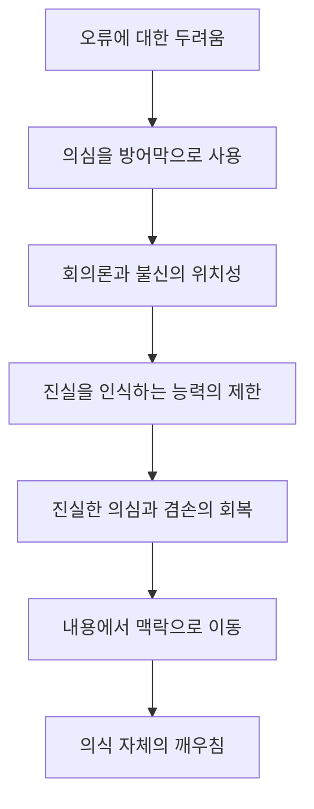

# 『현대인의 의식 지도』 제13장  
## 「의심, 회의론 그리고 불신」―「들어가며」 분석 정리  
**진행: 1/1**

---

## 1. 핵심 명제

> **의심은 본래 오류와 상처로부터 자신을 보호하기 위해 에고가 만들어 낸 방어 기능이지만, 성숙한 분별로 발전하지 못하면 회의론·불신·반항이라는 폐쇄적 세계관으로 굳어진다.**

호킨스 박사님께서는 이 도입부에서 **‘모든 의심이 잘못되었다’**고 말씀하시는 것이 아닙니다. 오히려 다음 세 가지를 분명히 구별하십니다.

1. 순진하게 무엇이든 믿는 상태  
2. 증거를 기다리며 잠정적으로 판단하는 성숙한 현실 검증  
3. 진실의 가능성 자체를 부정하는 방어적 회의론과 불신

도입부 전체는 두 번째 상태가 어떻게 형성되는지, 그리고 왜 세 번째 상태가 영적 실재를 이해하지 못하는지를 설명하기 위한 기초입니다. fileciteturn1file0

---

# 2. 쉬운 설명

사람은 잘못 믿었다가 속거나 상처받는 것을 두려워합니다. 그래서 마음은 다음과 같이 생각합니다.

> “처음부터 믿지 않으면 속지 않을 것이다.”  
> “모든 것을 의심하면 안전할 것이다.”

이것이 의심의 보호 기능입니다.

그러나 의심을 지나치게 강화하면 마음은 단지 거짓뿐 아니라 **진실까지 받아들이지 못하게 됩니다.** 문을 잠그면 침입자는 막을 수 있지만, 도움을 주러 온 사람까지 들어오지 못하는 것과 같습니다.

반대로 무조건 믿는 태도 역시 안전하지 않습니다. 따라서 성숙한 정신은 새로운 정보를 즉시 참이나 거짓으로 확정하지 않고 다음과 같이 다룹니다.

> “가능성은 인정하되, 증거와 경험을 통해 더 확인해 보겠다.”

호킨스 박사님께서 제시하시는 건강한 중간 지점은 **맹신도 아니고 부정적 회의론도 아닌 잠정적 신뢰와 분별**입니다.

---

# 3. 전개 지도

이 도입부의 논리는 다음 7단계로 전개됩니다.

### ① 인간 정신의 취약성

에고는 자신이 오류를 범할 수 있으며, 잘못된 판단이 고통을 가져올 수 있다는 사실을 알고 있습니다.

### ② 의심이라는 방어막 형성

에고는 의심과 회의론을 강화하면 속거나 상처받지 않을 것이라고 추정합니다.

### ③ 초기 관계가 신뢰 성향을 형성

사랑받고 보호받은 경험은 믿음과 신뢰를 강화하지만, 가혹함과 태만은 삶에 대한 부정적 태도를 형성합니다.

### ④ 현실 검증 능력의 성숙

경험이 축적되면서 정신은 무엇이든 즉시 믿거나 거부하지 않고, 새로운 정보를 잠정적으로 보유하는 능력을 발달시킵니다.

### ⑤ 감각과 선형적 정신의 한계

에고는 감각으로 확인되는 형상·이미지·개념을 중심으로 정보를 처리하기 때문에 비선형적 맥락을 파악하는 데 한계가 있습니다.

### ⑥ 좌뇌적 내용과 우뇌적 의미의 차이

좌뇌형 처리는 세부 정보와 선형적 내용을 찾고, 우뇌형 처리는 전체 맥락·의미·이해를 파악합니다.

### ⑦ 신뢰의 고차원적 기능

개인이 모든 것을 직접 확인할 수는 없으므로, 현명한 사람은 검증된 지식과 더 높은 이해를 가진 사람의 권위를 합리적으로 신뢰합니다.

---

# 4. 소주제별 분석

## 4-1. 의심은 에고가 만든 보호 장치다

### 핵심 명제

> 의심의 최초 목적은 진실 탐구가 아니라 에고의 취약성 보호입니다.

에고는 잘못 판단했다는 사실을 받아들이기 어려워합니다. 오류는 단순한 정보 수정에 그치지 않고 다음과 같은 불쾌감을 유발하기 때문입니다.

- 속았다는 수치심
- 판단력이 부족했다는 자책
- 통제력을 잃었다는 불안
- 상대에게 이용당했다는 분노
- 자신이 옳지 않았다는 자부심의 손상

따라서 의심은 처음부터 순수한 지적 기능만이 아닙니다. 그 밑에는 **다시는 상처받지 않으려는 정서적 동기**가 들어 있습니다.

### 구조적 의미

이 점이 제13장 전체를 이해하는 열쇠입니다.

겉으로 회의론은 이성적이고 객관적인 태도처럼 보이지만, 그 기저에는 다음과 같은 정서가 숨어 있을 수 있습니다.

> 두려움 → 방어 → 의심 → 불신 → 거부

즉 회의론은 반드시 지성의 우월함에서 나오는 것이 아니라, 취약성을 숨기려는 에고의 방어에서 나올 수도 있습니다.

---

## 4-2. 신뢰 능력은 초기의 사랑과 관계된다

### 핵심 명제

> 신뢰는 단순한 지적 결론이 아니라 사랑받고 보호받았다는 관계적 경험을 토대로 형성됩니다.

호킨스 박사님께서는 부모와 아이 사이의 상호작용을 신뢰 형성의 기초로 제시하십니다.

### 사랑과 보호가 충분한 경우

아이는 다음과 같은 기본적 세계관을 형성합니다.

- 삶은 대체로 안전하다.
- 타인은 나를 도울 수 있다.
- 모르는 것이 있어도 배울 수 있다.
- 권위가 반드시 위협적인 것은 아니다.
- 잘못해도 수정할 수 있다.

### 가혹함과 태만이 우세한 경우

반대의 세계관이 형성될 수 있습니다.

- 타인은 믿을 수 없다.
- 약점을 드러내면 이용당한다.
- 권위는 억압하려 한다.
- 먼저 공격하거나 거부해야 한다.
- 믿는 사람은 어리석다.

따라서 신뢰와 불신은 단순히 논리적 자료의 양으로만 결정되지 않습니다. 동일한 정보를 접하더라도 개인의 정서적·의식적 배경에 따라 전혀 다르게 해석됩니다.

---

## 4-3. ‘신뢰도라는 견적서’의 의미

이 표현은 정보를 접할 때 정신이 자동으로 수행하는 **신뢰성 평가**를 뜻합니다.

정신은 대략 다음을 판단합니다.

- 이 정보의 출처는 믿을 만한가?
- 말하는 사람에게 전문성이 있는가?
- 과거의 경험과 일치하는가?
- 다른 증거와도 부합하는가?
- 이 정보를 받아들였을 때 위험은 어느 정도인가?
- 말하는 사람에게 숨은 의도가 있는가?

그러나 이 평가 체계는 사람마다 크게 다릅니다.

한쪽 극단에는 쉽게 속는 순진성이 있고, 다른 극단에는 다음과 같은 태도가 있습니다.

- 적대적 반항
- 모든 관습과 권위의 부정
- 냉소
- 불신
- 특정 집단에 대한 적개심
- 타인을 일반화하여 판단하는 태도

따라서 문제는 신뢰 여부만이 아니라 **정신이 어떤 의식 장에서 신뢰도를 평가하는가**입니다.

---

## 4-4. 성숙한 정신은 판단을 유보할 수 있다

### 핵심 명제

> 현실 검증 능력은 즉각적인 믿음이나 거부가 아니라, 불확실성을 잠정적으로 견딜 수 있는 능력입니다.

미성숙한 정신은 대개 정보를 곧바로 양극화합니다.

- 전부 참이다.
- 전부 거짓이다.
- 완전히 믿을 수 있다.
- 절대로 믿을 수 없다.

반면 경험을 통해 성숙한 정신은 다음처럼 판단합니다.

> “현재로서는 가능성이 있다.”  
> “아직 충분히 확인되지 않았다.”  
> “새로운 증거가 나오면 판단을 수정할 수 있다.”

이 태도는 우유부단함이 아니라 **겸손한 지성**입니다. 자신의 현재 지식이 완전하지 않음을 인정하면서도 진실의 가능성을 닫지 않습니다.

### 맹신과 회의론 사이의 차이

| 정보 처리 유형 | 기본 태도 | 결과 |
|---|---|---|
| 순진성 | 확인 없이 믿음 | 속임수에 취약 |
| 성숙한 분별 | 잠정적으로 수용하고 확인 | 학습과 수정이 가능 |
| 방어적 회의론 | 확인 이전에 거부 | 진실까지 차단 |
| 적대적 불신 | 정보보다 출처와 권위를 공격 | 현실 검증이 손상 |

---

## 4-5. 감각 중심의 현실 검증에는 한계가 있다

에고는 우선 감각을 통해 세계를 확인합니다.

- 눈에 보이는 것
- 귀에 들리는 것
- 측정되는 것
- 형상으로 표현되는 것
- 이미지와 개념으로 재현되는 것

이 방식은 물질적 생존과 선형적 세계를 다루는 데 매우 유용합니다. 그러나 호킨스 박사님의 체계에서 영적 실재는 단순한 감각 자료가 아니라 **비선형적 맥락·의미·현존**에 속합니다.

따라서 감각으로 직접 확인되지 않는다는 이유만으로 비선형적 실재를 부정하면, 측정 도구가 다루지 못하는 영역을 존재하지 않는다고 선언하는 오류가 발생합니다.

> 감각으로 포착되지 않는 것과 존재하지 않는 것은 같은 뜻이 아닙니다.

이것이 뒤에 등장하는 회의론 비판의 패러다임적 기초입니다.

---

## 4-6. 좌뇌는 ‘내용’을, 우뇌는 ‘의미와 이해’를 찾는다

### 좌뇌형 처리

- 세부 사항
- 순서
- 언어
- 논리
- 형상
- 인과관계
- 분류
- 선형적 내용

### 우뇌형 처리

- 전체성
- 관계
- 의미
- 맥락
- 직관
- 패턴
- 비선형적 이해

호킨스 박사님께서는 동물적 본능이 지배하는 변연계 처리 체계를 의식 수준 **120**으로 제시하십니다. 이 수준의 정보 처리는 생존과 위험 회피에는 유용하지만, 영적 차원을 포함한 비선형적 맥락을 이해할 역량은 제한됩니다. fileciteturn1file0

『신의 현존의 발견』에서도 의식 수준 200 이하에서는 자극이 감정 중추로 빠르게 전달되어 투쟁·도주 반응이 우세하고, 의식이 높아질수록 전전두피질과 더 넓은 맥락을 거치는 처리 방식이 강화된다고 설명됩니다. fileciteturn1file10turn1file11

### 중요한 구별

도입부에 나온 **120**은 회의론 자체의 측정 수준을 뜻하는 것이 아닙니다.

- 본능적 변연계 정보 처리: **120**
- 제13장 뒤에서 제시되는 회의론: **160**
- 회의론의 기저로 연결되는 허무주의: **120**

회의론은 단순한 지적 신중함이 아니라, 낮은 정신의 선형적 내용 처리와 허무주의적 전제를 결합한 상태로 설명됩니다. fileciteturn1file4

---

## 4-7. 믿음은 이성의 반대가 아니라 지식의 위임이다

호킨스 박사님께서는 고등 양자이론을 예로 드십니다.

대부분의 사람은 복잡한 수학적 증명을 직접 이해하거나 검산할 능력이 없습니다. 그렇다고 양자이론을 무조건 거짓이라고 보지는 않습니다. 대신 다음을 신뢰합니다.

- 해당 분야의 전문 교육
- 반복된 연구
- 검증 절차
- 전문가 공동체
- 축적된 권위와 신뢰성

즉 현대인은 자신의 삶 대부분을 **정당한 권위에 대한 합리적 신뢰**를 통해 운영합니다.

- 환자는 의학적 전문가를 신뢰합니다.
- 승객은 항공기 설계자를 신뢰합니다.
- 건물 사용자는 구조공학자를 신뢰합니다.
- 대중은 자신이 이해하지 못하는 과학 이론도 검증된 전문성을 통해 받아들입니다.

따라서 영적 가르침만을 두고 “내가 직접 완전히 확인하지 못했으므로 거짓이다”라고 주장한다면, 일상에서 적용하는 지식의 기준과 모순됩니다.

---

# 5. 호킨스 용어 자동 매핑

| 발췌 표현 | 호킨스 박사님의 체계상 의미 |
|---|---|
| 에고/정신 | 생존을 위해 정보를 선별하고 통제하려는 선형적 처리 체계 |
| 취약함 | 오류·상처·통제력 상실에 대한 에고의 두려움 |
| 의심 | 오류로부터 자신을 보호하려는 방어적 유보 |
| 회의론 | 의심이 고정된 위치성과 세계관으로 굳어진 상태 |
| 불신 | 신뢰 가능성을 닫고 타인·권위·실재를 적대적으로 해석하는 태도 |
| 현실 검증 | 외관·견해·가설을 증거와 경험을 통해 확인하는 능력 |
| 잠정적 판단 | 결론을 서두르지 않고 수정 가능성을 남기는 지적 겸손 |
| 선형적 내용 | 감각·형상·개념·논리·순차적 인과관계 |
| 비선형적 맥락 | 의미·전체성·관계·의식의 장·영적 실재 |
| 좌뇌형 처리 | 세부 내용과 형상 중심의 분석 |
| 우뇌형 처리 | 전체 맥락과 의미의 이해 |
| 정당한 권위 | 해당 영역에서 더 높은 이해와 검증된 역량을 가진 근원 |
| 믿음 | 아직 직접 경험하지 못한 진실을 받아들일 수 있는 의식의 개방성 |
| 신뢰 | 검증된 정보원과 더 높은 이해에 자신을 합리적으로 맡길 수 있는 능력 |

---

# 6. 의식 수준 반영

## 120 부근: 본능적 방어와 허무주의적 기층

- 감정 중추와 생존 반응이 우세합니다.
- 위험·상처·배신을 중심으로 정보를 해석합니다.
- 보이지 않는 맥락보다 즉각적인 감각과 위협에 반응합니다.
- 신뢰보다 방어가 우선합니다.

## 160 부근: 회의론

- 지적 외형과 논증을 사용하지만 결론은 이미 부정 쪽으로 고정될 수 있습니다.
- 진실을 찾기보다 거짓임을 폭로하는 데 에너지를 둡니다.
- 선형적 내용의 한계를 전체 실재의 한계로 오인합니다.
- 높은 맥락을 파악할 도구가 없으면서 높은 맥락의 존재를 부정합니다.

## 200 이상: 용기와 현실 검증의 회복

- 자신이 틀릴 가능성을 견딜 수 있습니다.
- 새 정보를 검토하고 기존 판단을 수정할 수 있습니다.
- 신뢰와 분별을 함께 유지합니다.
- 권위를 무조건 복종하거나 무조건 거부하지 않고 신뢰성을 평가합니다.

## 400대: 이성과 고등 지식

- 체계적 논리와 증거를 존중합니다.
- 전문적 권위와 축적된 지식의 가치를 이해합니다.
- 그러나 선형적 이성을 최종 한계로 삼으면 비선형적 맥락을 놓칠 수 있습니다.

## 500대 이상: 비선형적 맥락의 인식

- 의미와 전체성이 내용보다 우선합니다.
- 믿음은 단순한 관념이 아니라 영적 실재에 대한 수용력으로 변합니다.
- 이해는 개념의 축적을 넘어 앎과 현존의 방향으로 이동합니다.

『신의 현존의 발견』에서는 영적 진화를 선형적 마음의 내용과의 동일시에서 비선형적 맥락과의 동일시로 이동하는 과정으로 설명합니다. fileciteturn1file12

---

# 7. 다른 저서와의 연결

## 『의식 수준을 넘어서』

이 도입부의 좌뇌적·본능적 처리와 높은 정신의 차이는 『의식 수준을 넘어서』의 다음 구분으로 확장됩니다.

- 낮은 정신: 세부 내용, 문자적 해석, 감정적 반응
- 높은 정신: 내용과 장의 관계, 원칙, 추상적 이해, 분별

제13장 뒤에서는 이를 각각 **낮은 정신 155**, **높은 정신 275**의 구조로 다시 제시합니다.

## 『신의 현존의 발견』

뇌 생리와 의식 수준의 관계가 보다 영적인 맥락에서 설명됩니다.

- 200 이하: 감정 중추와 동물적 반응 우세
- 200 이상: 전전두피질과 조화로운 처리 증가
- 더 높은 수준: 우뇌적·맥락적·비선형적 이해 활성화 fileciteturn1file10turn1file11

## 『의식혁명』

의식 지도 전체의 기본 구조와 연결됩니다.

- 200 이하: 생존, 위력, 방어, 감정적 반응
- 200 이상: 진실, 책임, 이성, 협력
- 400대: 이성의 정점
- 500대 이상: 사랑과 비선형적 실재

따라서 제13장의 논의는 단순한 성격 분석이 아니라 **의심과 신뢰가 어느 의식 장에서 작동하는가**를 밝히는 내용입니다.

---

# 8. 이 도입부가 제13장 전체에서 맡는 역할

이 도입부는 이후에 나올 회의론 비판을 위한 네 가지 전제를 세웁니다.

### 첫째, 의심에는 정서적 기원이 있다

회의론을 순수한 지적 태도로만 보아서는 그 전체 구조를 이해할 수 없습니다.

### 둘째, 합리적 검증과 회의론은 다르다

성숙한 검증은 판단을 잠정적으로 보류하지만, 회의론은 부정을 기본 결론으로 삼습니다.

### 셋째, 인식 능력은 의식 수준의 영향을 받는다

모든 사람이 같은 정보를 보더라도 동일한 맥락과 의미를 파악하는 것은 아닙니다.

### 넷째, 신뢰는 지적 결함이 아니라 고등 기능이다

정당한 권위를 알아보고 더 높은 이해를 받아들이는 것은 순진함이 아니라 지혜의 표현일 수 있습니다.

---

# 9. 전체 통합 결론

호킨스 박사님께서 이 도입부에서 밝히시는 핵심은 **의심을 제거하라는 것이 아니라 의심의 정체를 분별하라는 것**입니다.

의심은 처음에는 오류와 상처에서 자신을 보호하는 기능으로 생겨납니다. 그러나 그 기능이 두려움·반항·자부심과 결합하면, 정신은 더 이상 진실을 확인하려 하지 않고 진실의 가능성부터 부정하게 됩니다.

성숙한 지성은 다음 두 극단을 넘어섭니다.

> “무엇이든 믿는다.”  
> “아무것도 믿지 않는다.”

그 대신 다음 위치에 섭니다.

> **“확인할 수 있는 것은 확인하고, 아직 확인하지 못한 것은 잠정적으로 열어 두며, 나보다 높은 이해와 검증된 권위가 존재할 가능성을 겸손하게 인정한다.”**

따라서 이 장에서 신뢰는 맹목성이 아닙니다. 신뢰는 **자신의 선형적 정신이 실재 전체를 포괄하지 못한다는 사실을 인정하는 지적·영적 겸손**입니다. 반대로 고정된 회의론은 지성이 높은 상태라기보다, 제한된 정신이 자기 한계를 실재의 한계로 선언한 상태로 해석됩니다.

---

# 『현대인의 의식 지도』 제13장  
## 「의심, 회의론 그리고 불신」―「회의론자들」

호킨스 박사님께서는 이 대목에서 **회의론을 단순히 “의심하는 지적 태도”로 보지 않으십니다.** 회의론이 어떤 의식의 장에서 나오며, 무엇을 인식할 수 없게 만들고, 왜 스스로의 목적까지 좌절시키는지를 분석하십니다. fileciteturn0file7

---

# 1. 전체 핵심 명제

> **회의론은 진실을 찾는 방법처럼 보이지만, 고정된 위치성이 되면 진실을 인식할 가능성 자체를 부정한다.**

회의론자는 흔히 자신을 다음과 같이 생각합니다.

- 쉽게 속지 않는 사람
- 증거를 요구하는 합리적인 사람
- 권위에 굴복하지 않는 독립적인 사람
- 거짓을 폭로하는 사람

그러나 호킨스 박사님께서는 회의론의 외형보다 그 아래에 있는 **동기의 장**을 보십니다.

겉으로는 논리와 증거를 내세우더라도 실제 동기가 다음과 같을 수 있다는 것입니다.

- 냉소
- 오만
- 질투와 시기심
- 권위에 대한 적대감
- 자신이 옳음을 증명하려는 욕구
- 타인의 명성과 성취를 무너뜨리려는 욕구
- 어떤 결론도 받아들이지 않으려는 완고함

이 경우 회의론은 진실을 검토하는 수단이 아니라, **자신의 부정적 세계관을 유지하기 위한 방어 체계**가 됩니다.

---

# 2. 쉬운 설명

건전한 검토는 다음과 같이 묻습니다.

> “이 주장이 사실인지 알아보자.”

고정된 회의론은 다음과 같이 시작합니다.

> “이 주장은 틀렸을 것이다.  
> 그것이 틀렸다는 근거를 찾아보자.”

두 태도는 겉으로 보기에는 모두 증거를 찾는 것처럼 보이지만, 출발점이 다릅니다.

| 구분 | 건전한 검토 | 회의론적 위치성 |
|---|---|---|
| 출발점 | 모른다는 인정 | 이미 틀렸다는 전제 |
| 목적 | 진실 확인 | 부정의 정당화 |
| 증거에 대한 태도 | 결론을 수정함 | 불리한 증거를 배척함 |
| 정서적 바탕 | 겸손·호기심 | 냉소·오만·적대감 |
| 결과 | 이해의 확대 | 세계관의 폐쇄 |

따라서 문제가 되는 것은 질문이나 검증 자체가 아닙니다.

> **부정을 결론으로 미리 정해 놓고, 이성을 그 결론을 방어하는 도구로 사용하는 상태가 문제입니다.**

---

# 3. 글의 전개 지도

이 소주제는 다음의 흐름으로 전개됩니다.

1. 회의론의 심리적·지적 기원을 제시합니다.
2. 회의론 아래에 숨어 있는 동기의 장을 밝힙니다.
3. 전문 폭로꾼과 아인슈타인 비난 사례를 듭니다.
4. 논리로 망상을 방어하는 정신 병리적 구조를 설명합니다.
5. 고대 철학적 회의론과 인간 정신의 한계를 연결합니다.
6. 회의론의 제한적 효용과 역사적 실패를 대비합니다.
7. 회의론이 자가당착에 빠진다는 점을 드러냅니다.
8. 회의론의 측정 수준 160과 허무주의 120의 관계를 설명합니다.
9. 내용만 다루고 맥락을 인식하지 못하는 한계를 지적합니다.
10. 의식 연구가 회의론과 어떻게 다른지를 제시합니다.
11. 선형적 방법으로 비선형적 실재를 검증할 수 없음을 설명합니다.
12. 부정의 반복은 긍정적 지식을 만들지 못한다는 역설로 마무리합니다.

---

# 4. 회의론의 두 가지 기원

## 4.1 정서적·성격적 기원

호킨스 박사님께서는 회의론이 때로는 지성의 문제가 아니라 **반항적 성격 구조**에서 나올 수 있다고 설명하십니다.

본문에서는 다음과 같은 배경이 언급됩니다.

- 부모의 권위에 대한 반항
- 권위 자체를 적으로 보는 성향
- 프로이트가 말한 항문기적 완고함
- 상대의 말을 받아들이면 패배한다고 느끼는 태도
- 인정과 동의를 종속이나 굴욕으로 해석하는 성격

이 구조에서는 무엇을 말했는가보다 **누가 말했는가**가 더 중요해집니다.

권위 있는 사람이 말하면 그 내용을 검토하기 전에 먼저 부정하려 합니다. 그 권위를 인정하는 것이 자신의 독립성과 우월감을 훼손한다고 느끼기 때문입니다.

---

## 4.2 지적·패러다임적 기원

회의론이 반드시 정서적 장애에서만 발생하는 것은 아닙니다.

다른 경우에는 특정한 지식 체계가 허용하는 것만 실재로 인정하는 **패러다임 한계**에서 발생합니다.

예를 들어 선형적 과학 패러다임은 다음을 선호합니다.

- 외부에서 관찰할 수 있는 것
- 반복 가능한 것
- 수량화할 수 있는 것
- 기계적 도구로 측정할 수 있는 것
- 원인과 결과로 설명할 수 있는 것

그러나 주관적 경험, 의식, 의도, 의미, 영적 인식은 이러한 방법으로 전부 포착하기 어렵습니다.

회의론자는 여기서 다음과 같은 오류를 범합니다.

> “내가 사용하는 방법으로 측정되지 않는다.”  
> → “그러므로 존재하지 않는다.”

그러나 정확한 결론은 다음과 같습니다.

> “현재 사용하는 방법으로는 접근하지 못했다.”

방법의 한계를 대상의 부재로 바꾸는 것이 바로 **패러다임 맹목성**입니다.

---

# 5. ‘실험자 효과’가 의미하는 것

본문에서 찰스 아이젠스타인의 논의를 인용한 이유는, 관찰자가 완전히 중립적인 기계가 아니라는 점을 보여 주기 위해서입니다.

실험에는 실험자의 다음 요소가 개입할 수 있습니다.

- 기대
- 신념
- 의도
- 선택 기준
- 관찰 방식
- 자료 해석
- 어떤 결과를 중요하게 보는가
- 무엇을 오류로 제외하는가

호킨스 박사님의 체계에서 이는 단순한 심리적 편향을 넘어 **의식의 장과 맥락의 영향**을 나타냅니다.

> 관찰자는 관찰 대상과 완전히 분리되어 있지 않습니다.

따라서 “나는 오직 객관적인 증거만 따른다”고 주장하는 회의론자도 자신의 감정적 위치성, 기대, 세계관, 의식 수준에서 완전히 벗어나 있지는 않습니다.

---

# 6. 숨은 ‘동기의 장’

이 대목에서 가장 중요한 용어는 **동기의 장**입니다.

호킨스 박사님께서는 회의론의 논리적 주장만 보지 않고, 그 논리를 생산하는 에너지적·정서적 배경을 보십니다.

## 표면적 주장

> “나는 증거가 부족해서 인정하지 않는다.”

## 숨은 동기

> “나는 인정하고 싶지 않다.”  
> “저 사람이 위대하다는 사실을 받아들이고 싶지 않다.”  
> “내 세계관이 틀릴 가능성을 허용할 수 없다.”  
> “내가 폭로자로서 우월한 위치에 있고 싶다.”

이때 논리는 진실을 밝히는 기능을 잃고 **에고의 변호사**가 됩니다.

결론이 먼저 정해지고, 지성은 그 결론을 합리화하는 자료를 수집합니다.

---

# 7. 아인슈타인 비난 사례가 보여 주는 구조

본문의 전문 회의론자들은 수년간 아인슈타인을 다음과 같이 공격합니다.

- 가짜
- 사기꾼
- 벌거벗은 임금님

여기서 핵심은 아인슈타인이 실제로 옳았는지에 대한 과학사 논쟁이 아닙니다.

호킨스 박사님께서 지적하시는 것은 **반증이 제시되어도 자신의 입장을 수정하지 않는 구조**입니다.

정상적인 이성은 현실과 충돌하면 결론을 수정합니다.

하지만 회의론적 위치성은 다음과 같이 작동합니다.

1. 대상이 거짓이라고 미리 결론 내립니다.
2. 부정적 자료만 선택합니다.
3. 반대 증거는 조작이나 사기로 해석합니다.
4. 자신의 주장을 반박하는 사실도 음모의 증거로 바꿉니다.
5. 결국 어떤 사실도 기존 믿음을 수정할 수 없게 됩니다.

이 단계에 이르면 이론은 검증 가능한 가설이 아니라 **폐쇄된 신념 체계**가 됩니다.

---

# 8. ‘논리 증명형 망상 장애’

본문에서 제시되는 ‘논리 증명형 망상 장애’는 단순히 논리가 부족한 상태가 아닙니다.

오히려 당사자는 매우 많은 논리와 자료를 제시할 수 있습니다.

문제는 논리가 **현실 검증을 위해 사용되지 않고 망상을 보존하기 위해 사용된다**는 것입니다.

## 구조

> 망상적 결론  
> → 선택적 자료 수집  
> → 정교한 논리 구성  
> → 반대 증거의 재해석  
> → 망상적 결론 강화

이 체계 안에서는 반증이 불가능합니다.

예를 들어 반대 증거가 나오면 다음처럼 해석합니다.

> “그 증거가 조작되었다는 사실이 바로 음모가 크다는 증거다.”

이렇게 되면 모든 결과가 같은 결론을 지지하게 됩니다.

- 증거가 있으면 음모의 증거
- 증거가 없으면 은폐의 증거
- 반박하면 공모자의 증거
- 침묵하면 죄를 인정한 증거

이 구조는 논리적으로 보이지만 실제로는 현실과 접촉할 통로가 닫혀 있습니다.

---

# 9. 독선적 과대망상과 권위에 대한 적대감

호킨스 박사님께서는 이러한 망상적 회의론의 근원을 세 요소의 결합으로 설명하십니다.

## 9.1 뇌 기능의 결함

현실 검증, 통합적 사고, 자기 수정 능력이 약해진 상태입니다.

## 9.2 유아적 자기도취형 전능감

자신의 판단이 현실보다 우위에 있다고 느낍니다.

> “내가 납득하지 못하면 그것은 사실일 수 없다.”

## 9.3 권위적 인물에 대한 적대감

권위자의 존재 자체가 자신의 열등감과 시기심을 자극할 수 있습니다.

그 결과 상대의 업적을 이해하려 하기보다 무너뜨리려 합니다.

이 세 요소가 결합하면 회의론은 독립적 사고가 아니라 **과대망상적 자기 확신**으로 변합니다.

---

# 10. 고대 회의론의 철학적 문제

피론 학파의 회의론은 다음과 같이 주장합니다.

> 확실한 지식은 불가능하다.  
> 진실은 알 수 없다.

이 주장은 인간 정신의 한계를 정확히 지적하는 면이 있습니다.

데카르트가 설명했듯이 정신은 다음 두 가지를 스스로 확실히 구별하기 어렵습니다.

- 사물이 자신에게 어떻게 보이는가
- 사물이 본질적으로 무엇인가

호킨스 박사님의 용어로 바꾸면 다음과 같습니다.

| 철학적 용어 | 호킨스 박사님의 체계 |
|---|---|
| 외관 | 지각 |
| 정신에 나타난 모습 | 내용 |
| 본질적 실재 | 맥락과 본질 |
| 주관적 견해 | 위치성 |
| 확실한 앎 | 비선형적 인식 |

소크라테스의 설명도 같은 구조를 가집니다.

> 인간은 자신이 선이라고 생각하는 것을 선택하지만,  
> 외견상 선한 것과 실제로 선한 것을 구분하지 못한다.

따라서 인간의 문제는 선을 원하지 않는 데 있는 것이 아니라, **환상적 선을 진짜 선으로 오인하는 데** 있습니다.

---

# 11. 합리적 검토와 회의론적 위치성

호킨스 박사님께서는 모든 의심을 무가치하다고 말씀하시는 것이 아닙니다.

본문에서도 합리적 검토가 다음과 같은 기능을 할 수 있다고 인정하십니다.

- 틀린 주장 발견
- 오류 교정
- 사기 식별
- 성급한 결론 방지
- 검증되지 않은 믿음 점검

그러나 이러한 검토가 절대적인 세계관이 되면 문제가 발생합니다.

## 검토는 도구입니다

필요한 상황에서 사용하고, 충분한 증거가 확인되면 결론을 받아들입니다.

## 회의론은 정체성이 됩니다

> “나는 믿지 않는 사람이다.”  
> “부정하는 것이 지적인 우월성이다.”

이 경우 새로운 사실을 배우는 것보다 **회의론자로 남는 것**이 더 중요해집니다.

---

# 12. 역사적으로 새로운 발견을 거부한 회의론

본문에서는 회의론이 역사적으로 다음의 발견들을 공격했다고 설명합니다.

- 라이트 형제의 비행
- 라디오
- 현대 의학
- 새로운 물리학
- 양자론
- 비선형적 패러다임
- 영적 실재

새로운 발견은 기존 패러다임을 위협합니다.

회의론자는 흔히 다음과 같이 반응합니다.

1. 불가능하다고 선언합니다.
2. 발견자를 사기꾼이라고 부릅니다.
3. 기존 이론으로 설명되지 않는다는 이유로 거부합니다.
4. 실제 결과가 나타난 뒤에도 예외나 우연으로 축소합니다.
5. 결국 새 패러다임이 정착된 뒤에야 마지못해 받아들입니다.

이것은 새로운 진실이 부족해서가 아니라, **기존 정체성과 세계관을 보호하려는 에고의 저항**에서 발생할 수 있습니다.

---

# 13. 회의론의 자가당착

이 소주제의 가장 명료한 논리적 결론은 다음과 같습니다.

> “진실은 알 수 없다.”

이 문장이 참이라면, “진실은 알 수 없다”는 진술 자체도 진실이라고 확정할 수 없습니다.

즉 회의론은 다음과 같은 모순에 빠집니다.

1. 어떤 진실도 알 수 없다고 주장합니다.
2. 그러나 그 주장을 진실한 명제로 제시합니다.
3. 따라서 자신이 부정한 진실의 가능성을 몰래 사용합니다.

결국 철저한 회의론은 스스로를 무효화합니다.

> 모든 지식이 불확실하다는 사실조차 확실히 알 수 없다면,  
> 회의론도 확실한 입장이 될 수 없습니다.

---

# 14. 회의론의 의식 수준 160

호킨스 박사님께서는 회의론의 진실 수준을 약 **160**으로 제시하십니다.

160은 진실과 거짓의 임계점인 200 아래입니다.

이 수치는 회의론이 지적으로 복잡해 보이는 것과 실제 의식 수준이 높다는 것이 동일하지 않다는 점을 보여 줍니다.

## 160의 주요 특징

- 논쟁성
- 반대와 저항
- 냉소
- 지적 오만
- 권위에 대한 적대감
- 부정적 확신
- 선택적 논리
- 결론을 수정하지 않는 완고함

회의론은 논리적 언어를 사용하기 때문에 이성의 수준인 400대처럼 보일 수 있습니다.

그러나 호킨스 박사님의 체계에서는 의식 수준을 결정하는 것이 단순한 지적 능력이 아니라 다음의 전체 장입니다.

- 동기
- 의도
- 정서
- 진실에 대한 개방성
- 맥락을 수용하는 능력
- 생명을 지지하는 방향성

따라서 높은 지능을 사용하더라도 동기가 적대감·오만·시기심·부정에 있으면 전체 장은 200 아래에 머물 수 있습니다.

---

# 15. 허무주의 120의 변종

호킨스 박사님께서는 회의론 160을 **허무주의 120의 변종**으로 설명하십니다.

허무주의의 기본 구조는 다음과 같습니다.

- 확실한 진실은 없다.
- 본질적 의미는 없다.
- 궁극적 가치는 없다.
- 고차원적 실재는 없다.
- 인간은 실재에 도달할 수 없다.

회의론은 허무주의보다 더 지적이고 세련된 언어를 사용하지만, 최종적으로는 비슷한 결론에 도달합니다.

> “확실히 알 수 없으므로 인정하지 않겠다.”

이러한 태도는 진실을 향한 탐구를 시작하기도 전에, 진실에 도달할 가능성을 부정합니다.

## 허무주의 120과 회의론 160의 차이

| 허무주의 120 | 회의론 160 |
|---|---|
| 의미가 없다고 느낍니다 | 의미를 논리적으로 부정합니다 |
| 무기력과 공허가 강합니다 | 논쟁과 지적 활동이 강합니다 |
| 진실을 찾을 의욕이 약합니다 | 진실 탐구의 외형을 유지합니다 |
| 체념적입니다 | 공격적·비판적일 수 있습니다 |
| “아무 의미 없다” | “증명할 수 없으므로 거짓이다” |

회의론은 허무주의를 지성으로 포장한 형태가 될 수 있습니다.

---

# 16. 내용과 맥락의 혼동

회의론의 결정적 한계는 **내용만 다루고 맥락을 보지 못한다는 것**입니다.

## 내용

- 문장
- 수치
- 개별 사실
- 물리적 대상
- 사건
- 논리적 관계

## 맥락

- 의도
- 의미
- 동기
- 의식의 장
- 관찰자의 위치성
- 전체 조건
- 추상의 수준

같은 문장도 맥락에 따라 의미가 달라집니다.

예를 들어 “괜찮습니다”라는 말은 다음과 같이 사용될 수 있습니다.

- 진정한 수용
- 체념
- 분노를 숨기는 표현
- 상대를 안심시키는 배려
- 대화를 끝내려는 회피

문장이라는 내용은 같지만 맥락은 전혀 다릅니다.

회의론은 측정 가능한 내용만을 실재라고 간주하기 때문에, 의미를 결정하는 맥락의 힘을 놓칠 수 있습니다.

---

# 17. 500대·600대 실재에 접근하지 못하는 이유

호킨스 박사님께서는 회의론이 의식 수준 500대와 600대 이상의 실재를 탐색할 방법을 갖지 못한다고 설명하십니다.

## 400대의 영역

- 이성
- 논리
- 개념
- 분류
- 분석
- 이론
- 선형적 인과관계

## 500대 이상의 영역

- 사랑
- 전체성
- 직관적 앎
- 주관적 확실성
- 맥락의 직접적 인식
- 존재의 하나임
- 비선형적 실재

선형적 정신은 대상을 나누고 비교함으로써 이해합니다.

그러나 500대 이상의 실재는 분리된 대상에 관한 정보라기보다 **의식 상태 자체의 변화**로 알려집니다.

따라서 회의론자는 다음과 같이 말할 수 있습니다.

> “그 경험을 외부에서 객관적으로 보여 달라.”

그러나 주관적 의식 상태는 외부의 물체처럼 완전히 분리해서 전시할 수 없습니다.

이는 음악을 듣지 않는 사람에게 음표의 물리적 진동만으로 음악의 아름다움을 전부 증명하려는 것과 비슷합니다.

---

# 18. 의식 연구와 회의론의 차이

본문에서 호킨스 박사님께서는 의식 연구가 어떤 주장을 억지로 증명하거나 반박하려는 것이 아니라고 설명하십니다.

회의론은 대체로 다음과 같이 움직입니다.

> 주장 → 논쟁 → 반박 → 재반박 → 결론

의식 연구는 개념과 견해를 건너뛰어 진술의 측정 수준을 분별한다고 봅니다.

> 진술 제시 → 의식 장의 반응 → 수치 확인 → 의식 지도에서의 위치 확인

호킨스 박사님의 관점에서 의식 측정의 특징은 다음과 같습니다.

- 개인의 의견과 무관합니다.
- 찬반 논쟁을 요구하지 않습니다.
- 결과가 숫자로 나타납니다.
- 결과는 의식 지도라는 전체 맥락 안에서 해석됩니다.
- 정신의 논리적 추측이 접근하지 못하는 정보 장을 대상으로 합니다.

따라서 의식 연구는 회의론과 같은 논쟁의 장 안에서 승리하려는 것이 아니라, **논쟁을 발생시키는 정신의 수준을 넘어선 정보에 접근하려는 방법**으로 제시됩니다.

---

# 19. 선형적 방법으로 비선형적 실재를 판정하는 오류

본문의 양자역학 비유는 매우 중요합니다.

> 양자역학을 뉴턴 물리학만으로 증명하거나 반박할 수는 없습니다.

뉴턴 물리학은 일정한 범위에서는 정확하고 유용합니다.

그러나 양자 수준에서는 기존 개념만으로 설명되지 않는 현상이 나타납니다.

마찬가지로 선형적 이성도 자신의 범위 안에서는 유용하지만, 비선형적 의식의 실재 전체를 다룰 수는 없습니다.

## 추상의 수준이 다른 경우

| 낮은 추상 수준 | 더 높은 추상 수준 |
|---|---|
| 개별 사건 | 전체 장 |
| 물리적 원인 | 근원과 맥락 |
| 논리적 개념 | 직접적 앎 |
| 객관적 내용 | 주관성과 객관성을 포괄하는 의식 |
| 분리된 관찰자 | 관찰자와 관찰 대상의 상호 관계 |

낮은 차원의 도구로 높은 차원의 실재를 부정하면, 도구의 한계를 실재의 한계로 오인하게 됩니다.

---

# 20. 회의론의 자기모순적 구조

회의론자는 선형적 이성을 신뢰하면서 동시에 선형적 이성의 확실성을 의심합니다.

1. 모든 주장을 의심합니다.
2. 감각과 정신도 믿을 수 없다고 말합니다.
3. 논리도 오류를 범할 수 있다고 말합니다.
4. 그런데 자신의 회의론적 논증만은 신뢰합니다.

결국 회의론은 자신이 서 있는 바닥까지 제거합니다.

> 이성을 절대적으로 신뢰할 수 없다면,  
> 이성으로 구성한 회의론도 절대적으로 신뢰할 수 없습니다.

---

# 21. “부정을 부정해도 긍정은 나오지 않는다”

본문의 마지막 문장은 회의론의 생산적 한계를 압축합니다.

> **거짓을 제거하는 것과 진실을 발견하는 것은 동일하지 않습니다.**

예를 들어 다음을 모두 부정할 수 있습니다.

- 이것은 신이 아니다.
- 이것은 궁극적 진실이 아니다.
- 이것은 완전한 설명이 아니다.
- 이것은 확실한 지식이 아니다.

그러나 아무리 많은 것을 부정해도, 그것만으로 다음의 답은 나오지 않습니다.

- 그렇다면 진실은 무엇인가?
- 실재는 무엇인가?
- 의식은 무엇인가?
- 의미의 근원은 무엇인가?
- 인간은 어떻게 확증 가능한 앎에 도달하는가?

회의론은 오류를 제거할 수는 있어도, 스스로 긍정적인 인식 체계를 창출하지 못합니다.

---

# 22. 역설의 상자

상자 안에 다음 문장을 넣습니다.

> “이 상자 안의 모든 진술은 가짜다.”

이 문장이 참이라면, 상자 안의 모든 진술이 거짓이므로 이 문장도 거짓이어야 합니다.

이 문장이 거짓이라면, 상자 안의 모든 진술이 거짓이라는 주장이 틀렸으므로 적어도 하나는 참이어야 합니다.

이 역설은 절대적 부정이 자기 자신에게 적용될 때 무너진다는 점을 보여 줍니다.

회의론도 마찬가지입니다.

> “어떤 진술도 확실하게 참이라고 할 수 없다.”

이 말을 확실하게 참이라고 주장하는 순간, 그 주장은 스스로의 원칙을 위반합니다.

---

# 23. 의식 수준별 구조

| 의식 수준 | 이 대목과의 관계 |
|---:|---|
| 120 | 허무주의. 의미와 진실의 가능성을 부정합니다. |
| 150 | 분노와 적대감. 권위와 대상에 대한 공격성이 나타날 수 있습니다. |
| 160 | 회의론. 냉소와 지적 부정이 논리적 외형을 취합니다. |
| 175 | 자부심. 자신의 판단과 지적 우월성을 고집합니다. |
| 200 | 용기. 자신이 틀릴 수 있음을 인정하고 새로운 정보를 검토합니다. |
| 250 | 중용. 결론을 강제로 방어하지 않고 여러 가능성을 허용합니다. |
| 310 | 자발성. 새로운 패러다임과 자료를 배우려는 개방성이 커집니다. |
| 350 | 수용. 관찰자의 위치와 책임을 인정합니다. |
| 400대 | 이성. 논리·과학·분석을 높은 수준으로 운용합니다. |
| 500대 | 사랑과 전체성. 내용과 맥락이 통합됩니다. |
| 600대 이상 | 비선형적 실재가 직접적인 앎으로 드러납니다. |

회의론 160에서 200 이상으로 이동할 때 나타나는 가장 중요한 변화는 다음과 같습니다.

> “상대가 틀렸음을 증명하겠다.”

에서

> “진실이 무엇인지 알아보겠다.”

로 목적이 바뀝니다.

---

# 24. 다른 저서와의 연결

## 『의식혁명』

인간 정신은 외부의 도움이 없으면 진실과 거짓을 안정적으로 구분하지 못한다는 기본 명제와 연결됩니다. 지성이 높다는 사실이 곧 진실을 식별한다는 뜻은 아닙니다.

## 『진실 대 거짓』

의식 수준 200을 진실과 거짓, 힘과 낮은 힘의 임계점으로 다루는 구조와 연결됩니다. 회의론이 지적인 외형을 지니더라도 동기의 장이 200 아래라면 진실을 지지하지 못합니다.

## 『의식수준을 넘어서』

자부심, 부정, 분노, 냉소가 서로 결합하여 닫힌 세계관을 형성하는 과정과 연결됩니다. 자부심은 배우려 하지 않으며 자신의 위치를 방어합니다.

## 『신의 현존의 발견』

선형적 정신이 비선형적 참나와 현존의 실재를 개념으로 포착하려 할 때 생기는 한계와 연결됩니다. 직접적인 앎은 개념적 논쟁의 산물이 아닙니다.

## 『치유와 회복』

내용보다 맥락이 현상의 의미와 결과를 지배하며, 관찰자의 의도와 의식 장이 중요한 요소라는 설명과 연결됩니다.

---

# 25. 구조 관계

이 소주제의 전체 구조를 한 줄로 연결하면 다음과 같습니다.

> **권위에 대한 반항과 지적 자부심**  
> → **부정을 미리 전제함**  
> → **선택적 증거 수집**  
> → **논리로 기존 세계관을 방어함**  
> → **반증을 받아들이지 않음**  
> → **맥락과 비선형적 실재를 배제함**  
> → **진실을 알 수 없다고 선언함**  
> → **자기 주장까지 무효화하는 자가당착에 빠짐**

---

# 26. 최종 핵심

호킨스 박사님께서 이 대목에서 구별하시는 것은 **의심의 유무**가 아닙니다.

핵심은 의심을 사용하는 의도입니다.

### 진실을 향한 의심

> “내가 틀릴 수도 있으니 더 정확히 알아보자.”

### 에고를 보호하는 회의론

> “내가 옳기 때문에 상대가 틀렸다는 것을 입증하자.”

전자는 겸손과 개방성을 통해 200 이상의 방향으로 이동할 수 있습니다.

후자는 지성의 외형을 띠더라도 냉소·오만·적대감·허무주의의 장에 머물며, 결국 진실을 발견하는 능력보다 **진실을 부정하는 능력만 강화합니다.**

따라서 이 소주제의 결론은 다음과 같습니다.

> **회의론의 근본 오류는 의심하는 데 있는 것이 아니라, 부정을 진실의 자리에 올려놓는 데 있습니다.**

---

## 『현대인의 의식 지도』 제13장  
### 「진실을 깨닫지 못하는 것」 분석 정리 — 1/1

## 1. 핵심 명제

이 소주제에서 호킨스 박사님께서 밝히시는 핵심은 다음과 같습니다.

> 진실을 알아보지 못하는 것은 단순한 정보 부족이나 낮은 지능 때문이 아니라, 정보를 선택하고 해석하고 의미를 부여하는 의식의 끌개장이 다르기 때문이다.

낮은 정신도 사실을 기억하고 논리를 구사하며 많은 정보를 축적할 수 있습니다. 그러나 사실을 자기이익·감정·위치성을 지지하는 재료로 사용하기 때문에, 사실들의 배후에 있는 본질과 전체 맥락을 놓칩니다.

반면 높은 정신은 사실을 장·조건·의도·원칙 속에 놓아 봅니다. 그러므로 두 정신의 차이는 ‘얼마나 많이 아는가’보다 다음의 차이입니다.

- 낮은 정신: **사실은 보지만 진실을 분별하지 못함**
- 높은 정신: **사실을 맥락화하여 의미와 본질을 분별함**

---

## 2. 전체 전개 지도

1. 회의론은 선형적 내용만 다루므로 맥락의 실재를 놓칩니다.
2. 진실을 알아보지 못하는 데에는 정서적·심리적·성숙적·의식 진화적 원인이 있습니다.
3. 그중 가장 보편적인 원인은 개인을 지배하는 의식의 끌개장입니다.
4. 끌개장은 낮은 정신(155)과 높은 정신(275)이라는 서로 다른 정보처리 양식을 낳습니다.
5. 두 양식의 차이는 지능지수가 아니라 본질과 외관을 분별하는 능력에서 나타납니다.
6. 낮은 정신은 자기이익·부정적 정서·위력에 끌리고, 높은 정신은 책임·원칙·진실·힘에 정렬됩니다.
7. 이 차이가 개인적 의견 차원을 넘어 문화와 사회의 충돌하는 세계관을 형성합니다.
8. 다음 소주제 「진실에 대한 반박」에서는 이것이 ‘에고에 대한 충성’과 ‘진실에 대한 충성’의 대립으로 확장됩니다.

---

## 3. 진실을 알아보지 못하는 네 가지 원인

| 원인 | 호킨스 박사님의 의미 |
|---|---|
| 정서 장애 | 두려움·분노·증오·질투와 같은 정서가 지각을 먼저 물들이므로, 사실이 감정의 정당성을 뒷받침하는 방식으로 편집됩니다. |
| 심리학적 갈등 | 받아들이기 불편한 진실이 억압·부정·투사·합리화 같은 방어기제를 일으킵니다. 진실보다 심리적 균형을 보존하는 것이 우선됩니다. |
| 나르시시즘적 성숙 정지 | ‘내가 옳다’는 유아적 전능감이 유지됩니다. 오류를 인정하는 일이 단순한 정보 수정이 아니라 자기 존재의 패배처럼 느껴집니다. |
| 의식 진화 수준 | 가장 근본적이고 흔한 원인입니다. 의식 수준에 따라 무엇이 현실적으로 보이고 무엇이 거짓처럼 보이는지가 달라집니다. |

앞의 세 원인은 개인의 특정한 장애나 갈등을 설명하고, 네 번째 원인은 그 모든 것을 포괄하는 장의 수준을 설명합니다.

따라서 박사님의 설명은 “진실을 보여 주면 누구나 받아들일 것”이라는 가정을 부정합니다. 진실을 받아들이려면 먼저 그것을 알아볼 수 있는 의식적 수용 능력이 있어야 합니다.

---

## 4. 155·200·275의 구조

| 수준 | 구조적 의미 |
|---|---|
| 낮은 정신 155 | 생존, 감정적 쾌락, 개인적 이득, 자기이익을 중심으로 작동합니다. 200 이하의 위력 영역에 속합니다. |
| 임계점 200 | 거짓과 진실, 위력과 힘을 가르는 결정적 경계입니다. 책임과 온전성이 처음으로 안정적으로 출현합니다. |
| 높은 정신 275 | 중립 250과 자발성 310 사이에 위치합니다. 타인의 중요성을 인정하고 원칙·책임·추상·본질을 다룰 능력이 나타납니다. |
| 이성 400대 | 논리와 추상적 지성이 본격적으로 발달하는 수준입니다. 높은 정신 275와 동일한 수준은 아니지만, 높은 정신은 이미 이성과 원칙을 향해 정렬되어 있습니다. |

그러므로 ‘높은 정신 275’는 곧바로 400대 이성을 뜻하지 않습니다. 감정과 자기이익이 지성을 지배하던 상태에서, 책임·원칙·의미가 정신을 이끌기 시작하는 전환적 양식입니다.

---

## 5. 도표 원문 보정

두 한국어 번역에서 *Lower Mind/Higher Mind*는 각각 ‘낮은 정신/높은 정신’ 또는 ‘낮은 마음/높은 마음’으로 옮겨졌지만 같은 개념입니다.

또한 도표의 몇몇 항목은 다음과 같이 읽어야 정확합니다.

- ‘매우 확산된 세계관’의 원문은 *widely divergent worldviews*입니다. 따라서 **‘서로 크게 갈라진, 현격히 다른 세계관’**이라는 뜻입니다.
- ‘악/거부’의 원문은 *Malice/Rejection*이므로 **‘악의/거부’**입니다.
- ‘유리된’의 원문 *Detached*는 병리적 단절이라기보다 **감정적 반응에서 한 걸음 떨어져 관찰하는 상태**입니다.
- ‘수동적인/공격적인’은 낮은 정신이 무기력과 공격성 사이를 오가는 반면, 높은 정신은 생명을 **보호**한다는 대비입니다.

영문판의 정확한 도표와 이어지는 설명은 [원문 292~294쪽](https://dougdaller.com/Books/DavidHawkins/2008%20-%20Reality%2C%20Spirituality%20and%20Modern%20Man//Reality%2C%20Spirituality%20and%20Modern%20Man.pdf)에서 확인됩니다.

---

## 6. 도표 항목별 상세 해석

### A. 소유와 성장

| 낮은 정신 155 | 높은 정신 275 | 의미 |
|---|---|---|
| 축적 | 성장 | 정보·물건을 쌓는 데서 자기 존재와 능력 자체가 성숙하는 방향으로 이동합니다. |
| 습득하다 | 음미하다 | 소유하는 것보다 가치와 아름다움을 충분히 알아봅니다. |
| 기억하다 | 성찰하다 | 과거를 재생하는 데 그치지 않고 그 안의 의미와 배움을 발견합니다. |
| 유지하다 | 진화하다 | 기존 신념을 보존하기보다 더 큰 이해에 맞게 수정합니다. |
| 생각하다 | 처리하다 | 생각을 계속 생산하는 것과 정보를 종합·분별하는 것은 다릅니다. |
| 외연적 지시 | 유추 | 단어의 표면적 지시만 보는 데서 관계·함의·패턴을 알아보는 방향으로 이동합니다. |

낮은 정신에게 지식은 ‘내가 가진 것’이지만, 높은 정신에게 지식은 의식을 변화시키는 재료입니다.

### B. 시간·감정·책임

| 낮은 정신 155 | 높은 정신 275 | 의미 |
|---|---|---|
| 시간=제약 | 시간=기회 | 시간 압박과 손실에 매이는 대신 성장과 전개가 가능한 장으로 봅니다. |
| 현재·과거 중심 | 현재·미래 중심 | 과거의 원망과 반복보다 앞으로 펼쳐질 가능성을 봅니다. |
| 감정·원함에 지배 | 이성·영감에 지배 | 원하는 결론을 합리화하지 않고 원칙과 더 큰 의미에 따릅니다. |
| 비난 | 책임 | 원인을 외부에만 두지 않고 자신의 선택 가능성을 인정합니다. |
| 부주의 | 훈련됨 | 순간적 충동보다 일관성·주의력·자기조절이 우세합니다. |

여기서 책임은 자책이 아닙니다. 원인과 선택을 현실적으로 인정함으로써 대응 능력을 회복하는 것입니다.

### C. 내용에서 장과 맥락으로

| 낮은 정신 155 | 높은 정신 275 | 의미 |
|---|---|---|
| 내용·세부사항 | 내용+장·조건 | ‘무슨 일이 있었는가’와 함께 의도·환경·관계·전체 조건을 봅니다. |
| 구체적·문자 그대로 | 추상적·상상력 있는 | 문자적 진술을 넘어 상징·원리·가능성을 이해합니다. |
| 시간·공간에 제한 | 제한을 넘어선 관점 | 즉각적인 개인 상황을 넘어 장기적·집단적·비개인적 의미를 고려합니다. |
| 개인적 | 비개인적 | 모든 일을 ‘나에 대한 것’으로 해석하지 않습니다. |
| 형상·사실 | 중요성·의미 | 사실 자체보다 그것이 무엇을 뜻하는지를 분별합니다. |
| 세부사항 중심 | 일반성 | 나무 하나만이 아니라 숲과 반복되는 패턴을 봅니다. |
| 배타적 사례 | 유형 분류·포괄 | 선택한 사례 하나로 전체를 단정하지 않고 관련 사례들을 포괄하여 유형화합니다. |

이 부분이 도표 전체의 중심입니다.

> 낮은 정신은 내용을 자기 위치성에 끼워 맞추고, 높은 정신은 내용을 장과 맥락 속에서 재배치합니다.

### D. 반응에서 보호로

| 낮은 정신 155 | 높은 정신 275 | 의미 |
|---|---|---|
| 악의 | 거부 | 증오로 공격하는 대신 거짓이나 파괴성에 동조하지 않고 단호히 거절합니다. |
| 반응적 | 떨어져 관찰함 | 자극에 즉시 끌려가지 않고 전체 의미를 파악할 여지를 둡니다. |
| 수동적/공격적 | 보호적 | 무기력과 공격성의 양극단 대신 생명과 원칙을 지키는 대응을 선택합니다. |
| 사건 회고 | 중요성의 맥락화 | 사건을 반복 재생하기보다 그 사건의 위치와 의미를 이해합니다. |
| 계획 | 창조 | 기존 조건 안에서 계산하는 것을 넘어 새로운 가능성을 출현시킵니다. |

특히 ‘악의/거부’와 ‘수동적·공격적/보호적’은 뒤의 초식동물·육식동물 비유를 이해하는 열쇠입니다. 높은 정신은 공격적이지 않지만, 그렇다고 파괴성을 방치하지도 않습니다.

### E. 정의에서 본질과 원칙으로

| 낮은 정신 155 | 높은 정신 275 | 의미 |
|---|---|---|
| 정의 | 본질·의미 | 사전적 설명과 이름을 넘어 대상의 내재적 성질을 봅니다. |
| 특정화 | 일반화 | 고립된 사건에서 보편적으로 작동하는 패턴을 발견합니다. |
| 단조롭고 세속적 | 초월적 | 눈앞의 기능과 이익을 넘어 더 큰 의미를 인식합니다. |
| 동기 | 영감·의도 | 결핍과 보상에 의해 밀려가는 대신 높은 가치에 이끌립니다. |
| 도덕 | 윤리 | 외부 규칙과 처벌 중심에서 보편적 원칙과 책임 중심으로 이동합니다. |
| 사례 | 원칙 | ‘누가 무엇을 했는가’보다 모든 사례에 적용되는 기준을 찾습니다. |

‘도덕/윤리’의 대비는 도덕이 나쁘다는 뜻이 아닙니다. 낮은 정신은 도덕을 문자적 규칙과 타인 심판에 사용하기 쉽지만, 높은 정신은 규칙의 배후에 있는 생명 존중·공정성·책임이라는 원리를 봅니다.

### F. 생존에서 잠재성의 성취로

| 낮은 정신 155 | 높은 정신 275 | 의미 |
|---|---|---|
| 신체적·감정적 생존 | 지적 발달 | 위협 회피와 감정 만족을 넘어 이해력과 분별력이 성장합니다. |
| 쾌락과 만족 | 잠재성의 성취 | 즉각적 보상보다 자신의 더 큰 가능성이 펼쳐지는 데 가치를 둡니다. |
| 선형적 내용 | 본질·맥락 | 사실 배열에서 그 사실을 성립시키는 전체 장으로 이동합니다. |
| 종교적 극단주의 | 영적 균형 | 교리를 문자화하여 공격하는 대신 사랑·평화·용서라는 중심 원리를 보존합니다. |
| 회의론 | 지적인 연구 | 무조건 부정하지 않고 열린 상태로 조사하며 증거와 더 큰 패러다임을 기다립니다. |
| 순진함 | 정교한 분별 | 잘 믿는 상태와 무조건 의심하는 상태를 모두 넘어 세밀하게 분별합니다. |

높은 정신은 맹신의 반대편에 있는 냉소가 아닙니다. **순진함과 적대적 회의론을 모두 넘어선 지적인 탐구**입니다.

---

## 7. 왜 지능지수와 관계가 없는가

호킨스 박사님께서는 지능지수와 의식 수준을 분명히 구분하십니다.

- 지능지수는 상징·언어·논리를 조작하는 능력입니다.
- 의식 수준은 그 능력이 무엇에 봉사하는지를 결정합니다.
- 낮은 끌개장에서는 지성이 감정·욕망·자기이익을 정당화하는 도구가 됩니다.
- 높은 끌개장에서는 지성이 진실·책임·원칙을 밝히는 도구가 됩니다.

따라서 다음과 같이 압축할 수 있습니다.

> 높은 지능지수 + 낮은 끌개장 = 더욱 정교한 합리화  
> 지성 + 온전성 + 비개인적 맥락 = 진실을 향한 분별

낮은 정신은 반드시 지적으로 둔한 것이 아닙니다. 오히려 영리하고 언변이 뛰어나며 많은 사실을 인용할 수 있습니다. 문제는 그 사실들이 이미 원하는 결론을 지지하도록 선택·배열된다는 데 있습니다.

박사님께서 차이를 지능지수가 아니라 ‘본질과 외관을 분별하는 능력’과 ‘나르시시즘적 자아중심성의 정도’에서 찾으신 이유가 바로 이것입니다.

---

## 8. 뇌 정보처리와의 연결

『의식 수준을 넘어서』에서 박사님께서는 이를 뇌 생리의 차이로 설명하십니다.

### 낮은 정신의 흐름

**자극 → 감정·생존 중추의 즉각적 반응 → 두려움·분노·욕망 → 지성이 그 반응을 합리화 → 비난·공격·위력**

200 이하에서는 감정 반응이 먼저 일어나고 전전두피질의 정보가 뒤늦게 들어옵니다. 그러므로 이성은 감정을 수정하기보다 이미 일어난 반응을 정당화하는 데 이용되기 쉽습니다.

### 높은 정신의 흐름

**자극 → 전전두피질의 분별 → 전체 맥락과 의미 파악 → 감정의 온건화 → 책임·보호·힘**

높은 정신에서는 자극이 전체적 의미 속에서 먼저 맥락화됩니다. 그 결과 사실을 개인적 모욕이나 위협으로만 해석하지 않고, 원칙과 장기적 결과를 고려할 수 있습니다.

---

## 9. 위력과 힘

낮은 정신은 통제·강제·위협·공격이라는 위력에 의존합니다. 위력은 외부 저항을 억눌러야 하므로 지속적으로 에너지를 소모합니다.

높은 정신은 진실·이성·신뢰성·원칙의 힘으로 영향을 미칩니다. 힘은 상대를 억지로 굴복시키는 것이 아니라 진실성 자체로 지지를 불러옵니다.

| 낮은 정신 | 높은 정신 |
|---|---|
| 통제 | 영향 |
| 강제 | 설득력 |
| 증오 | 분별 |
| 공격 | 보호 |
| 거짓의 반복 | 진실의 명료화 |
| 상대의 패배 | 전체의 보존 |

---

## 10. 초식동물과 육식동물 비유의 정확한 의미

박사님의 비유는 높은 정신의 온화함이 무방비 상태로 변질될 수 있음을 경고합니다.

높은 정신은 다음을 혼동하지 않아야 합니다.

- 평화와 위험 부정
- 용서와 파괴성에 대한 동조
- 온화함과 무기력
- 공격하지 않는 태도와 방어하지 않는 태도
- 악의를 품지 않는 것과 사실을 말하지 않는 것

도표에서 높은 정신의 대응이 ‘수동성’이 아니라 **보호성**인 이유도 이것입니다. 높은 정신은 증오로 공격하지 않지만, 거짓과 파괴성을 정확히 지적하고 생명을 보호하기 위한 방어에는 나섭니다.

따라서 이 비유의 요지는 다음과 같습니다.

> 진실한 평화는 위협을 부정하는 데서 나오지 않고, 위협의 본질을 정확히 분별하면서도 증오에 지배되지 않는 데서 나옵니다.

---

## 11. 미국 55퍼센트·세계 85퍼센트의 의미

이 수치는 박사님께서 저술 당시 제시하신 의식 연구 결과입니다. 여기서 중요한 것은 인구의 단순한 지능 분포가 아니라, 낮은 정신의 정보처리 양식이 문화와 사회에서 얼마나 널리 지배적인가입니다.

이 수치로부터 다음이 도출됩니다.

1. 교육 수준이나 지능이 높아도 낮은 정신이 지배할 수 있습니다.
2. 동일한 사건을 보고도 서로 전혀 다른 세계를 경험할 수 있습니다.
3. 한쪽에는 명백한 진실이 다른 쪽에는 위협적 거짓처럼 보일 수 있습니다.
4. 정치·종교·사회 갈등은 단순한 정보 부족이 아니라 맥락화 수준의 충돌입니다.
5. 낮은 정신의 수적 우세가 곧 힘의 우세를 뜻하지는 않습니다. 박사님의 의식 척도는 로그 구조이기 때문에 높은 수준의 힘은 적은 수로도 광범위한 부정성을 상쇄합니다.

---

## 12. 다른 저서와의 자동 연결

| 저서 | 연결되는 가르침 |
|---|---|
| 『의식 수준을 넘어서』 | 낮은 정신 155·높은 정신 275의 원형 설명, 200 전후의 뇌 정보처리 변화, 내용에서 맥락으로의 이동 |
| 『의식혁명』 | 200을 경계로 위력과 힘이 나뉘며, 끌개장이 내용·가치·행동을 조직한다는 원리 |
| 『나의 눈』 | 인간 정신은 자체적으로 진실과 거짓을 분별할 능력이 없으며, 자아는 내용이고 참나는 맥락이라는 설명 |
| 『호모 스피리투스』 | 200 이하에서는 지성이 동물적 본능과 자기이익을 위한 도구가 되고, 200 이상에서 온전성과 책임이 출현한다는 설명 |
| 『진실 대 거짓』 | 내용과 맥락, 본질과 외관, 진실에 기반한 힘과 거짓에 기반한 위력의 사회적 전개 |
| 『현대인의 의식 지도』 제4장 | 정신이 입력을 약 1만분의 1초 안에 감정·기억·가치로 편집하므로, 지각된 현실이 본질 자체와 다르다는 설명 |

---

## 13. 이 소주제의 구조적 위치

이 부분은 제13장 전체에서 연결축 역할을 합니다.

- 앞의 「회의론자들」: 회의론이 내용만 다루고 맥락을 놓치는 현상을 설명
- 현재 「진실을 깨닫지 못하는 것」: 왜 어떤 정신은 맥락을 처리할 수 없는지 설명
- 다음 「진실에 대한 반박」: 그 차이가 에고에 대한 충성과 진실에 대한 충성의 대립으로 사회화되는 과정을 설명

즉, 회의론의 문제를 단순한 철학적 오류에서 끝내지 않고, 그 배후에 있는 의식 수준·나르시시즘·뇌 정보처리·끌개장까지 내려가 설명하는 부분입니다.

---

## 14. 최종 통합

이 소주제를 한 문장으로 압축하면 다음과 같습니다.

> 진실을 깨닫는 능력은 사실의 양이나 지능의 높이가 아니라, 자기이익과 감정을 넘어 사실을 전체 장·조건·의도·원칙 속에서 맥락화할 수 있는 의식의 진화 수준에 달려 있습니다.

가장 중요한 구분은 다음과 같습니다.

- 낮은 정신은 **사실을 자기 입장의 무기로 사용**합니다.
- 높은 정신은 **사실을 원칙과 본질을 밝히는 자료로 사용**합니다.
- 낮은 정신은 자신이 보고 느끼는 것을 곧 현실이라고 확신합니다.
- 높은 정신은 자신의 지각도 제한되고 편집될 수 있음을 인정합니다.
- 낮은 정신은 오류 인정에서 자기 패배를 느낍니다.
- 높은 정신은 오류 수정을 성장으로 받아들입니다.
- 낮은 정신은 평화를 수동성으로 만들거나 공격성으로 돌아섭니다.
- 높은 정신은 악의 없이 거부하고, 증오 없이 보호하며, 위력 대신 진실의 힘에 의지합니다.

결국 박사님께서 말씀하시는 진실 인식의 관문은 더 많은 정보가 아니라 **겸손함, 책임, 맥락화, 본질 분별, 그리고 진실에 대한 충성**입니다.

---

# 『현대인의 의식 지도』 제13장  
## 「진실에 대한 반박」 해설

### 1. 핵심 명제

호킨스 박사님께서 이 대목에서 밝히시는 핵심은 다음과 같습니다.

> 사람은 진실을 단순히 몰라서 거부하는 것이 아니라, 자신이 속한 의식의 끌개장과 에고의 이익을 지키기 위해 진실을 거짓으로 뒤집어 볼 수 있다.

따라서 여기서 말하는 ‘진실에 대한 반박’은 논리적인 검토를 거쳐 진실을 논박한다는 뜻이 아닙니다. 진실이 자신의 욕망·정체성·권력·원한을 위협하기 때문에, 그것을 억압적이거나 위험하거나 거짓된 것으로 지각하는 현상을 뜻합니다.

---

## 2. 전체 전개 지도

1. 영적 진화는 에고와 진실 중 어디에 충성하는가에 달려 있다.  
2. 의식 수준은 단순한 의견이 아니라 현실을 해석하는 끌개장을 반영한다.  
3. 낮은 끌개장에서는 높은 수준의 진실이 오히려 거짓처럼 보인다.  
4. 극단적으로 낮은 수준에서는 충동 통제·학습·양심·공감 기능이 약화된다.  
5. 이것이 정치 영역으로 확대되면 악성 메시아적 나르시시즘과 독재가 나타난다.  
6. 상대주의와 반응적 반권위주의는 진실과 거짓의 구별 자체를 무너뜨린다.  
7. 미디어의 반복적 선전은 이러한 지각의 역전을 집단적으로 강화한다.  
8. 올바른 태도는 악에 대한 증오도, 악과의 동조도 아닌 ‘연민을 지닌 분별’이다.

---

## 3. ‘에고에 대한 충성’과 ‘진실에 대한 충성’

여기서 ‘충성’은 의식적으로 맹세한다는 뜻이 아니라, 판단할 때 무엇을 최종 기준으로 삼느냐는 뜻입니다.

| 에고에 대한 충성 | 진실에 대한 충성 |
|---|---|
| 내가 원하는가 | 실제로 참된가 |
| 내 편에 유리한가 | 전체 맥락과 일치하는가 |
| 내 정체성을 보호하는가 | 사실과 원칙을 견딜 수 있는가 |
| 내가 옳다는 느낌을 주는가 | 자기 오류까지 인정할 수 있는가 |
| 감정적 만족을 주는가 | 장기적인 귀결이 온전한가 |

에고는 진실을 자신보다 높은 기준으로 받아들이기 어렵습니다. 진실을 받아들이면 자신의 과장된 권리, 원한, 피해자 위치, 권력욕, 특별함을 포기해야 할 수 있기 때문입니다. 그래서 에고는 진실의 내용을 검토하기보다 진실 자체의 권위를 공격합니다.

이것이 바로 “진실에 대한 반박”의 내적 구조입니다.

---

## 4. 왜 높은 세계관이 낮은 수준에서는 거짓으로 보이는가

호킨스 박사님께서는 400대 중반의 세계관이 170~195의 관점에서는 가짜처럼 보일 수 있다고 말씀하십니다.

400대 중반은 사실·논리·원칙·맥락·책임을 중시합니다. 반면 170~195에서는 자부심, 분노, 적대감, 이념적 위치성이 지각을 지배하기 쉽습니다. 이때 동일한 대상도 전혀 다르게 해석됩니다.

- 책임은 ‘억압’으로 보입니다.
- 도덕적 경계는 ‘차별’로 보입니다.
- 검증 요구는 ‘공격’으로 보입니다.
- 온전한 권위는 ‘지배’로 보입니다.
- 절제는 ‘자유의 박탈’로 보입니다.
- 사실에 근거한 구분은 ‘편견’으로 보입니다.

따라서 갈등의 핵심은 정보량의 차이만이 아닙니다. 같은 사실을 받아들이고 의미를 부여하는 의식장의 차이입니다. 낮은 장은 높은 장을 이해하지 못할 뿐 아니라, 자신의 생존을 위협하는 것으로 오인할 수 있습니다.

의식 수준은 사람에게 붙이는 고정된 신분표가 아닙니다. 여기서는 특정한 순간이나 영역에서 현실을 인식하고 선택하는 방식의 차이를 가리킵니다.

---

## 5. 범죄성과 유아적 에고의 연결

비행기 안의 어린아이 사례는 단순히 “말 안 듣는 아이는 범죄자가 된다”는 뜻이 아닙니다. 박사님께서 강조하시는 것은 다음과 같은 기능적 구조입니다.

> 충동 발생 → 제지와 부정적 결과 경험 → 경험에서 학습 → 자기 통제 형성

이 연결이 형성되지 않으면 욕망과 행동 사이에 숙고가 들어가지 못합니다. “원한다”가 곧 “행한다”가 되고, 결과를 겪어도 행동 양식이 수정되지 않습니다.

유아적 에고는 본래 자신을 전능한 중심으로 느낍니다. 정상적인 성장에서는 경계, 애정, 훈육, 결과 경험을 통해 다음 사실을 배웁니다.

- 타인도 독립된 존재다.
- 욕구가 곧 권리는 아니다.
- 행동에는 귀결이 따른다.
- 좌절을 견딜 수 있어야 한다.
- 선악의 구별은 생존과 공동체 유지에 필요하다.

박사님께서는 이러한 성숙이 심하게 멈춘 상태가 범죄적 성향이나 사이코패스형 성격에서는 성인기까지 지속된다고 설명하십니다. 독재자는 몸과 지능만 성인이 되었을 뿐, 권력 앞에서는 “내가 원하면 모든 것이 허용된다”는 유아적 전능성을 유지하는 것입니다.

---

## 6. 악성 메시아적 나르시시즘

‘구세주를 자처하는 사악한 나르시시즘’은 단순한 허영심보다 훨씬 심각한 상태입니다. 여기서는 개인의 에고가 국가·민족·종교·역사의 구원자라는 외피를 뒤집어씁니다.

그 구조는 다음과 같습니다.

1. 자신을 특별하고 선택받은 존재로 여깁니다.
2. 개인적 욕망을 공동체의 운명과 동일시합니다.
3. 자신에 대한 반대를 국가·민족·신에 대한 반역으로 바꿉니다.
4. 폭력을 ‘구원’이나 ‘정의’로 포장합니다.
5. 실패하면 자신을 돌아보지 않고 적과 배신자를 만들어 냅니다.
6. 추종자에게 맹목적 충성을 요구합니다.
7. 결국 자신이 구원한다고 주장한 사회를 희생시킵니다.

그래서 위험한 지도자의 긴 특성표는 서로 무관한 성격 목록이 아닙니다. 하나의 핵심에서 뻗어 나온 표현들입니다.

| 핵심 영역 | 나타나는 특성 |
|---|---|
| 진실과의 관계 | 상습적 거짓말, 사실 무시, 거짓 증언 |
| 인간과의 관계 | 공감·연민·존중의 부재, 약자 착취 |
| 권력과의 관계 | 지배, 통제, 정복, 무제한적 권력 추구 |
| 정서 구조 | 증오, 질투, 복수심, 가학성 |
| 자기 인식 | 과대망상, 무오류성, 실패의 외부 투사 |
| 대중 조작 | 애국심·종교·피해자 이미지를 도구화 |
| 양심과 귀결 | 죄책감·뉘우침·책임감의 부재 |

즉, 표 전체를 관통하는 중심은 ‘진실보다 에고의 승리를 우선하는 포식적 의식’입니다.

---

## 7. 반권위주의의 두 종류

이 대목에서 박사님께서 비판하시는 것은 모든 권위에 대한 의문이 아닙니다. 앞선 영적 진실의 특성에서는 참된 가르침이 강압적 명령이나 개인숭배에 의존하지 않는다는 의미에서 ‘반권위주의적’이라고 설명하십니다.

따라서 두 가지를 구별해야 합니다.

### 원칙에 기초한 자유

- 거짓 권위를 분별합니다.
- 사실과 진실을 더 높은 기준으로 삼습니다.
- 권력자의 직함과 진실을 동일시하지 않습니다.
- 검증 가능한 원칙을 존중합니다.

### 반응적 반항

- 권위라는 이유만으로 거부합니다.
- 부모의 통제에 대한 오래된 분노를 진실에 투사합니다.
- 모든 도덕적 경계를 억압으로 해석합니다.
- 자신이 반대한다는 사실만으로 자신의 입장이 옳다고 여깁니다.

박사님께서 지적하시는 역설은, 억압에 반대한다고 주장하는 사람이 증오와 강요에 사로잡히면 자신이 반대하던 전체주의와 같은 끌개장에 들어간다는 것입니다. 겉으로 내세운 이념은 반대이지만, 의식의 에너지와 행동 양식은 동일해질 수 있습니다.

---

## 8. 상대주의가 현실 검증을 손상시키는 방식

이 문맥에서 상대주의는 단순히 “여러 관점이 존재한다”는 온건한 뜻이 아닙니다. 박사님께서 문제 삼으시는 것은 진실과 거짓, 가해와 피해, 온전성과 파괴성의 실제 차이까지 언어로 지워 버리는 체계입니다.

그 과정은 대체로 다음과 같습니다.

- 모든 판단을 개인적 관점으로 축소합니다.
- 사실보다 화자의 정체성과 감정을 앞세웁니다.
- 가해의 맥락을 제거하고 가해자를 피해자로 재구성합니다.
- 연민과 찬성을 혼동합니다.
- 표현의 자유를 주장하면서 사실 검증은 억압으로 취급합니다.
- 결국 거짓도 진실과 동등한 자격이 있다고 주장합니다.

외과의사·투자 상담자·아이 돌봄 담당자의 예는 이 모순을 드러내기 위한 것입니다. 사람들은 추상적인 사회 이론에서는 모든 기준이 상대적이라고 말하면서도, 자신의 생명·재산·아이와 관련되면 즉시 능력·정직성·책임이라는 객관적 기준을 요구합니다.

박사님께서는 이를 통해 도덕성과 진실이 단순한 취향이 아니라 사회의 생존을 떠받치는 기능적 조건임을 보여 주십니다.

---

## 9. 연민과 동조의 결정적 구별

이 발췌문에서 가장 중요하게 읽어야 할 부분입니다.

> 범죄자가 지금의 상태에 이르게 된 한계를 이해하는 것과, 그 범죄자의 행동을 지지하는 것은 전혀 다른 일입니다.

호킨스 박사님의 가르침에서 연민은 분별력의 상실이 아닙니다. 『호모 스피리투스』에서도 연민과 용서는 찬성을 뜻하지 않으며, 비온전성과는 거리를 두어야 한다고 설명하십니다.

| 연민 | 동조 |
|---|---|
| 그 사람의 의식적 한계를 이해함 | 그의 행동을 정당화함 |
| 증오에 빠지지 않음 | 가해의 책임을 지움 |
| 인간과 행동을 구별함 | 인간에 대한 동정을 행동의 승인으로 바꿈 |
| 필요한 사회적 제한을 인정함 | 경계를 세우는 것을 잔인함으로 간주함 |
| 진실과 정렬된 채 온화함을 유지함 | 거짓의 끌개장에 함께 들어감 |

따라서 박사님의 결론은 ‘범죄자를 미워하라’도 아니고 ‘범죄자를 무조건 감싸라’도 아닙니다. 사람의 진화적 한계에는 연민을 지니되, 거짓과 파괴적 행동에는 분명한 경계를 유지하라는 뜻입니다.

---

## 10. 미디어 프로그래밍과 집단적 지각의 역전

미디어의 영향은 단순히 잘못된 정보를 전달하는 데 그치지 않습니다. 반복·선별·감정적 이미지·유행의 권위를 이용하여 무엇을 정상적으로 느낄 것인지까지 미리 구성합니다.

처음에는 낯설었던 관점도 계속 반복되면 다음과 같이 변합니다.

> 낯선 주장 → 자주 보이는 주장 → 사회적으로 인정된 주장 → 의심하면 안 되는 주장 → 진실처럼 느껴지는 주장

이 과정에서 사람은 스스로 판단한다고 느끼지만, 실제로는 이미 제공된 언어·감정·가해자와 피해자의 배치를 반복할 수 있습니다. 박사님께서 말씀하시는 ‘프로그래밍’은 정신이 외부의 수사를 자기 생각으로 오인하는 현상입니다.

---

## 11. 의식 수준별 구조

| 의식 수준 | 이 발췌문에서의 의미 |
|---:|---|
| 90 이하 | 범죄성, 충동성, 양심과 타인 배려의 심각한 결핍 |
| 130 | 적대적 선전과 왜곡된 학문적 수사가 나타날 수 있는 수준 |
| 160~190 | 포스트모던적 도덕 상대주의와 지적 자부심 |
| 170~195 | 높은 원칙과 영적 진실을 거짓으로 뒤집어 볼 수 있는 범위 |
| 200 | 진실과 거짓, 책임과 비난, 힘과 위력의 결정적 경계 |
| 275 | 맥락·원칙·성찰을 받아들이는 높은 정신 |
| 400대 중반 | 이성, 사실, 논리, 객관적 검증을 중시하는 세계관 |

200은 단순히 착한 사람과 나쁜 사람을 가르는 숫자가 아닙니다. 자기 욕망과 감정을 넘어 사실·책임·타인의 복지를 현실의 일부로 인정하기 시작하는 전환점입니다.

---

## 12. 다른 저서와의 연결

- 『진실 대 거짓』  
  위험한 정치 지도자의 특성표가 직접 옮겨졌습니다. 핵심은 지도자의 말이나 이미지가 아니라 진실성, 인간 생명에 대한 태도, 권력 사용 방식과 실제 귀결을 보아야 한다는 것입니다.

- 『의식 수준을 넘어서』  
  200에서는 비난과 피해자 위치를 벗어나 자기 선택에 대한 책임이 등장합니다. 또한 에고는 이해할 수 없는 높은 진실을 틀린 것으로 만들려는 성향이 있다고 설명됩니다.

- 『파워 대 포스』  
  200은 포식적 위력에서 건설적인 힘으로 넘어가는 임계점입니다. 위력은 강요와 공포에 의존하지만, 힘은 진실성과 원칙 자체에서 나옵니다.

- 『호모 스피리투스』  
  사람의 한계를 연민으로 이해하는 것과 그 사람의 파괴적 행동에 찬성하는 것은 다르다고 명확히 구분합니다. 이것이 현재 발췌문의 결론을 가장 정확하게 보완합니다.

---

## 13. 이 소주제의 최종 의미

「진실에 대한 반박」은 정치적 입장 자체보다 더 깊은 문제를 다룹니다. 핵심 문제는 인간 정신이 에고의 이익을 지키기 위해 진실의 의미를 뒤집을 수 있다는 사실입니다.

낮은 끌개장에서는 선이 억압으로, 책임이 차별로, 절제가 박탈로, 온전한 권위가 폭정으로 보일 수 있습니다. 동시에 거짓과 폭력은 자유·권리·정의·구원이라는 이름으로 꾸며질 수 있습니다.

따라서 영적 성숙의 기준은 자신이 얼마나 강하게 주장하는가가 아니라, 에고에 불리하더라도 진실을 우선할 수 있는가에 있습니다. 그리고 그 진실성은 증오로 표현되는 것이 아니라, 분별력·책임·연민·온전한 경계가 함께 유지되는 모습으로 드러납니다.

---

# 『현대인의 의식 지도』 제13장  
## 「진실을 깨닫지 못하는 것」 해설 — 1/1

## 1. 핵심 명제

호킨스 박사님께서 이 대목에서 밝히시는 핵심은 다음과 같습니다.

> **진실을 알아보는 능력은 단순한 지능이나 정보량의 문제가 아니라, 정신을 지배하는 의식의 장과 에고의 성숙 정도에 달려 있다.**

사람이 진실을 깨닫지 못하는 까닭은 반드시 지식이 부족해서가 아닙니다. 정서적 불안, 내면의 갈등, 나르시시즘적 자기중심성, 그리고 지배적인 의식 수준이 정신의 정보 처리 방식을 제한하기 때문입니다.

따라서 같은 사실을 접하더라도 어떤 정신은 사실을 자기 욕망과 감정에 맞게 해석하고, 다른 정신은 전체 맥락과 원칙 속에서 그 의미를 파악합니다.

---

## 2. 전체 전개 구조

이 발췌문의 논리는 다음 순서로 진행됩니다.

1. 진실을 깨닫지 못하는 네 가지 원인이 제시됩니다.
2. 정신의 기능은 개인 의지보다 끌개 에너지장의 영향을 받는다고 설명됩니다.
3. 낮은 정신 155와 높은 정신 275의 기능적 차이가 대비됩니다.
4. 두 정신의 차이는 지능지수보다 본질과 외관을 분별하는 능력에서 나타납니다.
5. 낮은 정신은 감정·비난·문자적 사고·정치적 합리화에 끌립니다.
6. 높은 정신은 책임·원칙·맥락·추상적 이해를 중시합니다.
7. 이 차이는 개인을 넘어 문화와 국가의 세계관 충돌로 확대됩니다.
8. 마지막에는 위력과 진실, 공격성과 방어성의 대비로 연결됩니다.

---

# 3. 진실을 깨닫지 못하는 네 가지 원인

## 3-1. 정서 장애

정서가 강하게 활성화되면 정신은 사실을 있는 그대로 보지 못하고, 감정에 맞는 정보만 선택하게 됩니다.

예를 들어 분노에 사로잡힌 정신은 상대의 행동 전체를 살펴보기보다, 분노를 정당화해 주는 세부 사항만 확대합니다. 두려움에 지배된 정신은 가능성보다 위험을 먼저 보고, 수치심에 지배된 정신은 모든 사건을 자기 결함의 증거로 해석합니다.

여기서 감정은 단순히 판단을 흐리는 부수적 요소가 아닙니다. 감정이 현실을 편집하는 기준이 됩니다.

## 3-2. 심리학적 갈등

사람은 자신의 믿음과 충돌하는 진실을 접하면 내적 불편을 느낍니다. 이때 진실을 받아들이는 대신, 진실을 부정하거나 왜곡하여 기존의 자기상을 지키려 할 수 있습니다.

따라서 진실을 깨닫지 못한다는 것은 때때로 “알 수 없는 상태”라기보다 “알게 되면 기존의 자아 구조가 흔들리기 때문에 받아들일 수 없는 상태”에 가깝습니다.

## 3-3. 나르시시즘적 지배 수준에서 성숙이 멈춤

나르시시즘적 정신은 자신이 옳다는 감각을 포기하지 못합니다. 이 정신에게 중요한 것은 진실 그 자체보다 다음과 같은 것들입니다.

- 내가 옳은가
- 내가 인정받는가
- 내가 이기는가
- 내 집단이 우월한가
- 나의 믿음이 보호되는가

따라서 사실이 자기 입장을 지지하면 진실로 받아들이고, 자기 입장을 위협하면 거짓이나 적대적 공격으로 간주합니다.

호킨스 박사님께서 말씀하시는 진실에 대한 장애는 정보 부족보다 **에고가 진실보다 자기 보존을 우선하는 구조**에서 발생합니다.

## 3-4. 의식 진화 수준

의식 수준은 사람에게 붙는 고정된 등급이라기보다, 현실을 인식하고 해석하는 지배적 방식입니다.

낮은 장에서는 정신이 생존, 감정, 소유, 승패, 비난, 욕망을 중심으로 움직입니다. 더 높은 장에서는 책임, 원칙, 이해, 의미, 전체 맥락을 중심으로 현실을 바라봅니다.

그러므로 진실은 모든 사람 앞에 동일하게 놓여 있어도, 그것이 동일하게 인식되는 것은 아닙니다.

---

# 4. 낮은 정신과 높은 정신의 본질적 차이

## 낮은 정신 155: 내용을 붙잡는 정신

낮은 정신은 눈앞에 드러난 정보, 사건, 문장, 인물, 세부 사항에 집중합니다.

이 정신은 다음과 같이 작동합니다.

> “무슨 일이 일어났는가?”  
> “누가 잘못했는가?”  
> “누가 이겼는가?”  
> “이것이 나에게 이로운가?”  
> “내가 원하는 것을 얻을 수 있는가?”

정보를 축적하고 기억하며 분류할 수는 있지만, 그것이 무엇을 의미하는지 전체 맥락 속에서 파악하는 능력은 제한됩니다.

## 높은 정신 275: 내용과 장을 함께 보는 정신

높은 정신은 사건 자체뿐 아니라 사건이 발생한 조건, 반복되는 유형, 배후의 원칙, 장기적 의미를 함께 봅니다.

이 정신은 다음과 같이 묻습니다.

> “이 사건은 어떤 조건에서 발생했는가?”  
> “여기에는 어떤 반복적 유형이 있는가?”  
> “어떤 원칙이 작동하고 있는가?”  
> “전체적으로 무엇을 의미하는가?”  
> “이 경험을 통해 무엇이 성장할 수 있는가?”

따라서 높은 정신은 세부 사항을 무시하는 정신이 아닙니다. 세부 사항을 더 넓은 맥락 안에 배치하는 정신입니다.

---

# 5. 표의 주요 항목별 해설

## 5-1. 축적 대 성장

낮은 정신은 지식을 쌓는 것을 중시합니다. 얼마나 많이 알고 있는지, 얼마나 많은 자료를 소유하고 있는지가 중요합니다.

높은 정신은 정보가 의식의 확장과 이해의 변화로 이어지는지를 봅니다.

많이 아는 것과 깊이 이해하는 것은 같지 않습니다. 지식이 늘어나도 세계관이 바뀌지 않을 수 있습니다. 반대로 하나의 원리를 깊이 이해하면 수많은 개별 사건을 새롭게 볼 수 있습니다.

---

## 5-2. 습득 대 음미·감상

습득은 대상을 자기 것으로 만드는 방향입니다. 정보, 자격, 지위, 경험을 확보하려 합니다.

음미와 감상은 대상의 가치를 있는 그대로 받아들이는 방향입니다. 소유보다 의미와 아름다움을 알아봅니다.

이는 에고가 “무엇을 얻을 수 있는가”라고 묻는 방식과, 높은 정신이 “무엇이 드러나고 있는가”라고 바라보는 방식의 차이입니다.

---

## 5-3. 기억 대 성찰

기억은 과거의 내용을 보존합니다. 성찰은 그 경험의 의미를 새롭게 이해합니다.

낮은 정신은 과거에 있었던 일을 반복해서 떠올리며 원망이나 자기 정당화의 근거로 사용할 수 있습니다. 높은 정신은 같은 사건을 보더라도 그 사건이 무엇을 가르쳐 주었으며 어떤 구조가 작동했는지를 살핍니다.

---

## 5-4. 유지 대 진화

낮은 정신은 기존의 자기상과 세계관을 보존하려 합니다. 변화는 위협으로 느껴질 수 있습니다.

높은 정신은 기존의 관점이 불완전했음을 인정하고 더 넓은 이해로 이동할 수 있습니다.

진실을 받아들이려면 때때로 과거의 자기 이해가 틀렸음을 인정해야 합니다. 낮은 정신은 이를 패배로 느끼지만, 높은 정신은 성장의 일부로 받아들입니다.

---

## 5-5. 생각하다 대 처리하다

여기서 ‘생각하다’는 머릿속에서 의견과 관념을 계속 만들어 내는 활동을 가리킵니다.

‘처리하다’는 정보와 경험을 소화하여 더 넓은 이해로 통합하는 기능입니다.

따라서 생각이 많다고 해서 반드시 이해가 깊은 것은 아닙니다. 낮은 정신은 끊임없이 생각하지만 기존 입장을 반복할 수 있고, 높은 정신은 정보를 재구성하여 새로운 의미를 발견합니다.

---

## 5-6. 외연적 지시 대 유추

낮은 정신은 단어가 가리키는 구체적인 대상에 머무릅니다. 높은 정신은 서로 다른 사건 속에서 공통된 구조를 알아봅니다.

예를 들어 낮은 정신은 특정한 한 사람의 행동에만 집중합니다. 높은 정신은 그 행동이 어떤 심리적 유형이나 사회적 구조를 보여 주는지 살펴봅니다.

유추는 표면적으로 다른 사건들 사이의 본질적 유사성을 발견하는 능력입니다.

---

## 5-7. 시간은 제약 대 시간은 기회

낮은 정신은 시간을 부족한 자원으로 경험합니다. 조급함, 압박감, 손실에 대한 두려움이 커집니다.

높은 정신은 시간을 변화와 성숙이 가능한 장으로 봅니다. 현재의 어려움도 장기적인 관점에서는 이해와 성장의 조건이 될 수 있습니다.

이는 단순히 낙관적인 태도를 뜻하지 않습니다. 사건을 즉각적 손익만으로 판단하지 않는다는 뜻입니다.

---

## 5-8. 감정과 원하는 것 대 이성과 영감

낮은 정신은 “내가 무엇을 원하는가”를 사실 판단의 기준으로 삼습니다.

원하는 결과가 나오면 옳다고 느끼고, 원하지 않는 결과가 나오면 부당하거나 거짓이라고 느낍니다.

높은 정신은 개인적 욕망과 사실을 구별합니다. 또한 단순한 계산을 넘어 원칙, 의미, 전체적 조화에서 오는 영감을 받아들입니다.

---

## 5-9. 비난 대 책임

비난은 원인을 외부에 두는 방식입니다.

> “저 사람 때문에 이렇게 되었다.”  
> “사회가 잘못되었다.”  
> “나는 피해자이므로 책임이 없다.”

책임은 모든 잘못을 자기 탓으로 돌리는 것이 아닙니다. 자신이 선택할 수 있는 부분과 대응할 수 있는 영역을 인정하는 태도입니다.

낮은 정신은 비난을 통해 에고의 무죄를 확보하려 하고, 높은 정신은 책임을 통해 변화 가능한 지점을 발견합니다.

---

## 5-10. 문자적 사고 대 추상적 사고

낮은 정신은 말을 문자 그대로 해석합니다. 비유, 상징, 맥락, 의도를 놓치기 쉽습니다.

높은 정신은 구체적인 표현 너머의 원리와 의미를 이해합니다.

영적 가르침을 문자 그대로만 받아들이면 형식주의나 극단주의로 변하기 쉽습니다. 반대로 상징과 맥락을 이해하면 서로 다른 표현 안에 담긴 공통된 진실을 알아볼 수 있습니다.

---

## 5-11. 개인적 대 비개인적

낮은 정신은 사건을 곧바로 자기와 연결합니다.

> “나를 무시했다.”  
> “나를 공격했다.”  
> “내 가치를 인정하지 않는다.”

높은 정신은 사건을 개인적 모욕으로만 해석하지 않고, 상대방의 조건과 상황, 인간 정신의 일반적 경향 속에서 바라봅니다.

비개인적이라는 것은 차갑거나 무관심하다는 뜻이 아닙니다. 에고의 자기중심적 해석에서 벗어나 더 넓은 맥락으로 보는 것입니다.

---

## 5-12. 형상과 사실 대 중요성과 의미

낮은 정신은 눈에 보이는 형상과 개별 사실을 진실의 전부로 여깁니다.

높은 정신은 사실의 존재뿐 아니라 그 사실이 전체 안에서 얼마나 중요하며 무엇을 의미하는지를 구분합니다.

모든 사실이 동일한 중요성을 갖는 것은 아닙니다. 사소한 사실을 과장하면 본질을 가릴 수 있고, 중요한 맥락을 생략하면 사실만 나열하고도 거짓된 인상을 만들 수 있습니다.

---

## 5-13. 세부 사항 대 일반성

낮은 정신은 하나의 사례를 전체의 증거로 사용할 수 있습니다.

어떤 집단의 한 사람이 잘못하면 집단 전체가 잘못되었다고 판단하거나, 한 번의 실패를 영원한 무능력의 증거로 해석합니다.

높은 정신은 개별 사례와 일반적 유형을 구별합니다. 예외와 원칙, 우연과 반복 패턴을 분리합니다.

---

## 5-14. 악 대 거부

이 항목은 낮은 정신이 반대편을 ‘악’으로 규정하는 경향과, 높은 정신이 해로운 것을 거부하되 상대를 절대적인 악으로 악마화하지 않는 차이를 보여 줍니다.

낮은 정신은 자신과 다른 입장을 도덕적으로 제거해야 할 대상으로 만들기 쉽습니다. 높은 정신은 어떤 행위나 원칙을 받아들이지 않더라도, 증오와 복수심으로 상대의 존재 전체를 부정하지 않습니다.

---

## 5-15. 반응 대 유리됨

낮은 정신은 자극이 들어오면 곧바로 반응합니다. 감정과 행동 사이에 거리가 거의 없습니다.

높은 정신의 ‘유리됨’은 현실을 회피하거나 무감각해지는 것이 아닙니다. 감정에 즉시 휩쓸리지 않고 사건을 관찰할 수 있는 내적 공간을 뜻합니다.

이 거리가 생겨야 자극에 끌려가기보다 적절한 대응이 가능해집니다.

---

## 5-16. 수동적·공격적 대 방어적

낮은 정신은 힘을 행사하지 못하면 수동적으로 눌려 있다가, 기회가 생기면 공격적으로 돌변할 수 있습니다.

높은 정신은 먼저 공격하려 하지 않지만, 필요한 경우 원칙과 생명을 보호하기 위해 방어합니다.

따라서 높은 정신의 평화 지향은 무조건적인 무저항이나 무기력을 뜻하지 않습니다. 공격을 즐기지 않되, 진실과 생명을 보호할 책임을 외면하지 않는 것입니다.

---

## 5-17. 계획 대 창조

계획은 이미 알려진 요소를 재배열하여 미래를 통제하려는 기능입니다.

창조는 더 넓은 장에서 새로운 가능성이 출현하도록 허용하는 기능입니다.

낮은 정신은 목표를 정하고 수단을 계산하지만, 높은 정신은 원칙과 영감에 정렬되어 기존에 없던 해결 방식이 나타날 수 있도록 합니다.

---

## 5-18. 정의 대 본질·의미

정의는 어떤 대상을 언어로 규정합니다. 그러나 정의가 대상을 완전히 담아내지는 못합니다.

예를 들어 ‘사랑’을 문장으로 정의할 수는 있지만, 사랑의 본질은 정의보다 훨씬 큽니다.

낮은 정신은 올바른 정의를 알고 있으면 실재를 안다고 생각합니다. 높은 정신은 개념과 실재가 다르다는 사실을 압니다.

---

## 5-19. 동기 대 영감·의도

동기는 보상이나 결과를 기대하며 움직이는 힘입니다.

영감과 의도는 외적 보상이 없어도 가치 있는 방향에 정렬되는 힘입니다.

동기는 “무엇을 얻을 것인가”에 집중하지만, 의도는 “무엇에 봉사할 것인가”에 집중합니다.

---

## 5-20. 도덕 대 윤리

도덕은 외부 규범과 명령에 의존하기 쉽습니다.

> “하면 안 된다.”  
> “규칙에 어긋난다.”  
> “벌을 받는다.”

윤리는 행위가 생명, 진실, 책임, 전체의 선에 어떤 영향을 주는지를 이해합니다.

낮은 정신은 규칙을 지키면서도 규칙의 정신을 위반할 수 있습니다. 높은 정신은 규칙이 생겨난 근본 원칙을 이해합니다.

---

## 5-21. 사례 대 원칙

낮은 정신은 개별 사례를 근거로 판단합니다. 높은 정신은 여러 사례를 관통하는 원칙을 발견합니다.

원칙을 이해하면 새로운 상황에서도 판단할 수 있습니다. 반면 사례만 기억하면 이전과 조금만 다른 상황이 나타나도 혼란에 빠질 수 있습니다.

---

## 5-22. 쾌락과 만족 대 잠재성의 성취

낮은 정신은 즉각적인 즐거움과 욕망의 충족을 중시합니다.

높은 정신은 자신에게 내재된 가능성이 얼마나 충실히 표현되고 있는지를 봅니다.

이는 즐거움을 부정한다는 뜻이 아니라, 순간의 만족을 삶의 궁극적인 기준으로 삼지 않는다는 뜻입니다.

---

## 5-23. 종교적 극단주의 대 영적 균형

종교적 극단주의는 형식, 교리, 집단 정체성을 절대화합니다. 자신의 해석을 신성 그 자체와 동일시하므로 다른 해석을 적으로 간주합니다.

영적 균형은 교리의 언어보다 그 안에 담긴 진실, 사랑, 겸손, 자비의 원리를 봅니다.

극단주의는 종교적 외형을 사용하지만 에고의 지배를 받습니다. 영적 균형은 특정 형식을 따르더라도 형식이 진실보다 앞서지 않습니다.

---

## 5-24. 회의론 대 지적 연구

회의론은 진실을 찾기 위해 의심하는 것이 아니라, 믿지 않기 위해 의심하는 상태가 될 수 있습니다.

지적 연구는 증거를 검토하고 자신의 기존 입장도 수정할 준비가 되어 있습니다.

겉으로는 둘 다 질문하고 검토하지만 방향이 다릅니다.

- 회의론은 결론을 미리 정하고 반박 자료를 찾습니다.
- 지적 연구는 결론을 열어 두고 사실을 살핍니다.

---

## 5-25. 순진함 대 정교화

순진함은 복잡한 현실을 단순한 구호나 선악 구도로 해석합니다.

정교화는 여러 조건, 동기, 결과, 맥락을 함께 고려합니다.

정교한 이해는 진실을 복잡하게 만드는 것이 아니라, 현실의 실제 복잡성을 견딜 수 있는 정신의 능력을 뜻합니다.

---

# 6. 지능지수와 무관하다는 의미

호킨스 박사님께서는 낮은 정신과 높은 정신의 차이가 지능지수에 직접 반영되지 않는다고 말씀하십니다.

매우 높은 지능을 가진 사람도 자신의 나르시시즘을 방어하는 데 지성을 사용할 수 있습니다. 이 경우 지성은 진실을 밝히는 도구가 아니라, 이미 정해 놓은 결론을 정교하게 합리화하는 도구가 됩니다.

따라서 중요한 차이는 다음과 같습니다.

- 얼마나 복잡하게 생각하는가가 아니라 무엇을 위해 생각하는가
- 얼마나 많은 사실을 아는가가 아니라 본질을 분별하는가
- 얼마나 논리적으로 말하는가가 아니라 전제가 진실한가
- 얼마나 설득력 있는가가 아니라 에고를 방어하는가, 진실을 따르는가

낮은 정신도 매우 세련된 언어와 논리를 사용할 수 있습니다. 그러나 그 논리는 진실을 발견하기보다 자기 입장과 욕망을 보호하는 방향으로 작동할 수 있습니다.

---

# 7. 낮은 정신의 ‘정치화된 합리화’

여기서 정치화되었다는 말은 단순히 정치에 관심이 있다는 뜻이 아닙니다.

모든 사실을 집단적 승패, 권력, 적과 동지, 피해자와 가해자의 구도로 재해석하는 정신 작용을 뜻합니다.

이 상태에서는 어떤 사실이 참인지보다 다음이 더 중요해집니다.

- 우리 편에 도움이 되는가
- 상대편에게 불리한가
- 우리의 명분을 강화하는가
- 분노와 증오를 정당화하는가

그 결과 같은 행위도 우리 편이 하면 정당화되고, 상대편이 하면 절대적인 악으로 규정됩니다. 이것이 진실보다 위치성과 집단 충성이 앞서는 상태입니다.

---

# 8. 낮은 정신과 부정적 정서

낮은 정신이 증오와 연결되는 이유는, 증오가 복잡한 현실을 단순하게 만들어 주기 때문입니다.

증오에 빠지면 모든 문제가 특정 인물이나 집단 때문이라고 느낄 수 있습니다. 자신의 책임, 내적 갈등, 현실의 복잡성을 살필 필요가 없어집니다.

증오는 에고에게 세 가지 보상을 줍니다.

1. 자신이 도덕적으로 우월하다는 감각
2. 문제의 원인을 외부에 둘 수 있는 편리함
3. 공격성을 정의로운 행동으로 느끼게 하는 정당화

반대로 높은 정신이 용서와 일치를 추구한다는 것은 잘못을 부인하거나 위험을 무시한다는 뜻이 아닙니다. 증오로 현실을 왜곡하지 않으면서도 잘못을 분명하게 인식하는 것입니다.

---

# 9. 위력과 진실의 대비

호킨스 박사님의 용어에서 위력(force)과 힘 또는 파워(power)는 구별됩니다.

## 위력

- 강압
- 위협
- 선전
- 공포
- 공격성
- 지배
- 감정적 압박

위력은 외부를 억지로 움직이려 합니다. 지속적인 압박이 필요하며 저항을 만들어 냅니다.

## 진실의 힘

- 원칙
- 일관성
- 책임
- 이성
- 온전성
- 의미
- 내재적 권위

진실은 억지로 강요하지 않아도 그 자체의 정합성과 실재성으로 영향을 미칩니다.

낮은 정신은 진실의 내재적 힘을 신뢰하지 못하기 때문에 강압과 공격을 사용하기 쉽습니다. 높은 정신은 원칙과 이성을 통해 영향을 주려 합니다.

---

# 10. 좌뇌·동물형 정보 처리의 의미

이 표현은 호킨스 박사님의 가르침 안에서 이해해야 합니다.

여기서 좌뇌는 단순히 뇌의 해부학적 한쪽만을 뜻하기보다 다음과 같은 선형적 처리 방식의 상징에 가깝습니다.

- 순차적
- 문자적
- 계산적
- 세부 중심적
- 생존 지향적
- 원인과 결과를 단선적으로 보는 방식

‘동물형 정보 처리’는 생존, 영역, 우열, 위협, 공격과 방어를 중심으로 정보를 판단하는 상태를 뜻합니다.

높은 정신은 이러한 기능을 없애는 것이 아니라, 더 넓은 맥락과 원칙 아래 통합합니다.

---

# 11. 육식동물과 초식동물의 비유

마지막 비유에서 육식동물은 위력, 공격성, 지배욕을 나타냅니다. 초식동물은 평화, 온화함, 방어적 성향을 나타냅니다.

호킨스 박사님께서는 평화를 추구하는 높은 정신이 때때로 공격성의 실재를 인정하지 않으려는 오류에 빠질 수 있음을 보여 주십니다.

여기서 중요한 구분은 다음과 같습니다.

> **평화는 위험을 부정하는 것이 아니며, 사랑은 분별력을 포기하는 것이 아니다.**

높은 정신은 먼저 공격하지 않지만, 생명과 진실을 보호할 필요가 있을 때 방어할 수 있어야 합니다.

‘육식동물의 심기를 건드리지 않기 위해 사실을 말하지 못하는 상태’는 평화가 아니라 두려움입니다. 또한 침묵을 사랑이나 관용으로 포장하면 공격적 위력에 공간을 내주게 됩니다.

따라서 높은 정신의 온화함에는 분별력과 책임이 함께 있어야 합니다.

---

# 12. 의식 수준에 따른 현실 인식의 차이

## 낮은 정신 155 부근

이 수준에서는 자부심, 집단 동일시, 경쟁, 인정 욕구, 자기 정당화가 강하게 작동합니다.

진실은 흔히 다음 기준에 따라 평가됩니다.

- 나를 높여 주는가
- 내 신념을 지지하는가
- 우리 집단에 유리한가
- 상대를 비난할 수 있게 하는가

## 높은 정신 275 부근

275는 중립성 250을 넘어 자발성 310으로 향하는 중간 범위에 해당합니다. 이 영역에서는 방어적 태도가 줄어들고, 배우려는 개방성, 책임감, 합리적 검토가 나타납니다.

진실은 다음 기준에 따라 탐구됩니다.

- 사실과 일치하는가
- 전체 맥락에서 타당한가
- 장기적으로 건설적인가
- 보편적 원칙에 부합하는가

이 차이는 사람의 영구적인 신분을 뜻하지 않습니다. 한 사람 안에서도 상황과 주제에 따라 낮은 정신과 높은 정신의 기능이 번갈아 나타날 수 있습니다.

---

# 13. 더 깊은 의미

이 발췌문의 가장 깊은 의미는 진실을 깨닫는 일이 단순한 정보 습득의 문제가 아니라는 점입니다.

진실을 알아보려면 정신이 다음과 같은 변화를 거쳐야 합니다.

- 자기중심적 해석에서 전체 맥락의 이해로
- 비난에서 책임으로
- 감정적 반응에서 분별 있는 대응으로
- 문자적 해석에서 원칙의 이해로
- 집단 충성에서 진실에 대한 충성으로
- 위력의 사용에서 진실의 내재적 힘에 대한 신뢰로

따라서 진실을 깨닫지 못하는 상태는 진실이 숨겨져 있기 때문만이 아닙니다. 진실이 드러나더라도 그것을 받아들일 수 있는 정신 구조가 아직 형성되지 않았기 때문일 수 있습니다.

---

# 14. 전체 통합

호킨스 박사님께서는 이 대목에서 낮은 정신과 높은 정신을 단순히 ‘나쁜 사람’과 ‘좋은 사람’으로 나누지 않으십니다. 두 정신은 현실을 처리하는 서로 다른 양식입니다.

낮은 정신은 세부 사항, 욕망, 감정, 생존, 비난, 집단적 동일시를 중심으로 현실을 봅니다. 높은 정신은 맥락, 의미, 원칙, 책임, 성장, 전체성을 중심으로 현실을 봅니다.

따라서 진실을 깨닫는 능력은 지능이나 교육 수준만으로 확보되지 않습니다. 지성이 아무리 뛰어나도 에고의 나르시시즘에 종속되면 정교한 합리화가 될 수 있습니다. 반대로 정신이 겸손과 책임, 원칙과 맥락에 열려 있으면 외관을 넘어 본질을 분별할 가능성이 커집니다.

이 발췌문이 밝히는 결론은 다음과 같습니다.

> **진실은 단지 올바른 정보를 소유하는 데서 발견되는 것이 아니라, 정보를 바라보는 의식의 장이 변화할 때 비로소 인식된다.**

---

## 『현대인의 의식 지도』 제13장  
### 「의심, 회의론 그리고 불신」―「사회적 생존」

### 1. 핵심 명제

문명은 단순히 다수의 의견으로 유지되는 것이 아니라, 진실·성실성·책임·연민과 정렬된 소수의 매우 강한 의식장이 전체 사회를 떠받침함으로써 유지됩니다.

호킨스 박사님께서 강조하시는 핵심은 다음과 같습니다.

> 사람의 수는 낮은 의식장이 더 많더라도, 실제로 사회를 유지하는 힘은 높은 의식장에서 더 크게 나온다.

---

### 2. 가장 쉬운 설명

이 발췌문은 사회를 하나의 거대한 건물처럼 바라봅니다. 건물을 이용하는 사람은 수없이 많지만, 건물의 하중을 실제로 떠받치는 핵심 기둥은 일부에 불과합니다. 기둥은 사람 수로는 적지만 구조적으로는 결정적입니다.

사회에서도 마찬가지입니다. 진실성 있는 지도자, 양심적인 전문가, 책임감 있는 시민, 영적 스승, 사심 없이 봉사하는 사람들은 수적으로 소수일 수 있습니다. 그러나 이들이 만들어 내는 신뢰·질서·지혜·선의가 사회 전체의 붕괴를 막습니다.

그러므로 이 대목의 ‘사회적 생존’은 단순히 국가가 물리적으로 존속한다는 뜻이 아닙니다. 문명이 다음 능력을 계속 보유한다는 뜻입니다.

- 진실과 거짓을 구분하는 능력
- 법과 제도를 온전하게 운영하는 능력
- 장기적 공동선을 선택하는 능력
- 파괴적 충동을 제한하는 능력
- 약한 사람을 돌보면서도 위험을 분별하는 능력

---

### 3. 논리 전개 지도

1. 미국 인구의 55퍼센트가 200 이하로 측정된다.
2. 그런데 미국이라는 국가의 전체 의식장은 421로 측정된다.
3. 이는 의식 지도가 단순한 산술평균이 아니라 로그 척도이기 때문이다.
4. 높은 수준의 힘은 낮은 수준의 수많은 부정성을 상쇄한다.
5. 따라서 높은 의식장의 소수는 문명을 지탱하는 핵심 자산이다.
6. 진실·도덕·진정성을 훼손하면 이 보이지 않는 자산이 고갈된다.
7. 사회는 낮은 수준의 사람들을 증오할 것이 아니라 연민으로 돕고 보완해야 한다.
8. 그러나 연민은 파괴적인 이념과 행동의 위험을 부인한다는 뜻이 아니다.

---

## 4. 소주제별 해설

### 4.1 미국 인구의 55퍼센트가 200 이하인데도 전체 수준이 421인 이유

여기서 421은 미국인 한 사람 한 사람의 평균적인 인격 수준을 뜻하지 않습니다. 미국이라는 집단적 의식장 안에서 실제로 지배력을 발휘하는 진실·이성·성실성·사회적 책임의 힘을 나타냅니다.

의식 지도는 로그 척도이므로 100명이 가진 낮은 힘과 한 사람이 가진 높은 힘을 단순히 인원수로 비교할 수 없습니다. 높은 수준으로 올라갈수록 그 사람이 방사하는 힘은 비선형적으로 커집니다.

따라서 다음 두 문장은 동시에 성립할 수 있습니다.

- 다수는 감정적 선동과 대중적 거짓에 취약하다.
- 사회 전체는 여전히 이성·법·과학·책임의 장에 의해 유지된다.

이는 민주적 투표에서 어느 쪽이 더 많은가를 말하는 것이 아니라, 어느 의식장이 사회 전체에 더 큰 에너지적 영향을 미치는가를 말합니다.

---

### 4.2 낮은 힘(force)과 힘(power)의 비대칭성

| 낮은 힘(force) | 힘(power) |
|---|---|
| 두려움·분노·욕망·자만심에 의존 | 진실·용기·성실성·사랑에서 나옴 |
| 강제·선전·위협이 필요 | 존재 자체에서 자연스럽게 방사됨 |
| 끊임없이 에너지를 공급해야 유지됨 | 다른 사람과 사회를 고양함 |
| 대상을 소모하고 갈등을 증폭함 | 질서와 생명력을 증가시킴 |
| 수적으로 많아도 전체적인 힘은 약함 | 소수라도 집단장을 크게 변화시킴 |

200 이하가 곧 ‘나쁜 사람’이라는 뜻은 아닙니다. 호킨스 박사님의 강의에서도 200을 선인과 악인을 가르는 도덕적 신분선으로 해석하지 않으십니다. 200에서는 현실을 대하는 에너지의 성질이 바뀝니다.

200 이하에서는 생존, 자기 이익, 감정적 반응, 강제가 우세해집니다. 200 이상에서는 정직성, 책임, 자제력, 협력과 건설성이 힘을 얻기 시작합니다.

---

### 4.3 최상위 100명과 1천 명의 의미

미국에서 최상위 100명을 제외하면 421에서 320으로, 1천 명을 제외하면 220으로 떨어진다는 설명은 높은 의식장의 비선형적 영향력을 보여 주기 위한 것입니다.

여기서 ‘최상위’는 반드시 정치 지도자, 부자, 유명인 또는 사회적 엘리트를 뜻하지 않습니다. 사회적으로 거의 알려지지 않았더라도 사랑·진실·신성에 깊이 정렬된 사람이 포함될 수 있습니다.

이들은 무엇을 적극적으로 주장하거나 많은 사람을 직접 지휘해서만 영향을 미치는 것이 아닙니다. 박사님의 강의에 따르면 그 사람의 존재 방식 자체가 집단 의식장에 방사됩니다. 그래서 한 사람의 내적 진화도 개인적인 성취에 머물지 않고 인류 전체에 기여합니다.

『신의 현존의 발견』에서도 영적으로 진화하는 한 사람이 낮은 의식 수준에 있는 수많은 사람의 부정적 효과를 상쇄한다고 설명됩니다.

---

### 4.4 진실을 훼손하면 왜 문명이 고갈되는가

진실·도덕·진정성은 개인적인 미덕에만 머물지 않습니다. 이것들은 문명을 운영하는 보이지 않는 기반입니다.

사람들이 약속을 지키고, 전문가가 양심에 따라 판단하며, 공직자가 책임을 받아들이고, 시민이 타인의 권리를 존중하면 사회는 비교적 적은 강제로도 운영됩니다.

반대로 진실성과 책임이 약화되면 다음과 같은 대체 수단이 필요해집니다.

- 더 많은 감시와 통제
- 더 복잡한 법률과 규정
- 더 많은 처벌과 강제력
- 계약 불이행에 대비한 비용
- 불신으로 인한 사회적 갈등

힘(power)이 사라진 자리를 낮은 힘(force)이 대신하면서 사회 전체가 점점 더 많은 에너지를 소비하게 됩니다. 이것이 박사님께서 말씀하시는 ‘문명의 고갈’입니다. 도덕은 문명 위에 올려놓는 장식이 아니라 문명을 낮은 비용으로 작동하게 하는 생명력입니다.

---

### 4.5 인류 전체가 204이고 상위 1천 명을 제외하면 198이 된다는 뜻

2007년 11월의 인류 의식 수준 204는 결정적 경계인 200을 겨우 넘어선 상태입니다. 이는 인류가 전체적으로 진실과 건설성의 방향에 들어섰지만 그 기반이 아직 매우 취약하다는 뜻입니다.

상위 1천 명이 제외될 때 198로 떨어진다는 설명은 다음 사실을 드러냅니다.

> 인류의 전체적 방향은 압도적 다수의 성숙으로 확보된 것이 아니라, 극소수의 높은 영적 힘에 의해 간신히 유지되고 있다.

그러므로 높은 의식장의 사람은 단순히 자기 자신만을 구하는 것이 아닙니다. 그 사람의 진실성, 사랑, 기도, 영적 헌신은 인류 전체의 장에 포함됩니다. 박사님의 강의 표현대로, 작은 내적 진전도 행동의 양보다 ‘그 사람이 존재하는 바’를 통해 인류에게 이익을 줍니다.

---

### 4.6 연민과 사회적 교정은 서로 반대되지 않는다

박사님께서는 낮은 의식 수준의 사람들을 증오하거나 경멸하라고 말씀하지 않으십니다. 오히려 이들을 진화 과정에서 아직 한계가 큰 사람들로 이해함으로써 동정심과 연민이 생긴다고 설명하십니다.

그러나 연민은 다음과 같은 태도가 아닙니다.

- 해로운 행동을 무조건 허용하는 것
- 위험한 이념의 실재를 부인하는 것
- 가해자의 행동을 피해자와 동일하게 취급하는 것
- 감상적인 동조로 책임을 없애는 것

참다운 연민은 사람의 내적 한계를 이해하면서도 행동의 현실적 결과를 정확하게 봅니다. 그래서 교육·치료·법·보호·교정 제도를 마련합니다. 목적은 복수나 증오가 아니라 사회를 보호하고, 제한된 능력을 보완하며, 더 온전한 기능을 가능하게 하는 것입니다.

『호모 스피리투스』의 설명과 연결하면, 사람 자체를 선악으로 단죄하는 대신 그 행동이 생명·진실·사랑에 기여하는지, 아니면 파괴적인 결과를 낳는지를 식별하는 것입니다.

---

### 4.7 이슬람 승리주의가 언급된 이유

이 대목의 대상은 이슬람 전체가 아니라 박사님께서 명시하신 ‘묵시론적 승리근본주의’라는 특정한 정치·종교적 이념장입니다.

그 사례를 제시하신 이유는 연민과 현실 인식을 분리하지 않기 위해서입니다. 사람들에게 연민을 품더라도 그들이 속한 이념이 대량 살상, 정복, 강제, 증오를 정당화한다면 그 파괴적 성질은 분명히 식별해야 합니다.

의식 수준 60이라는 측정은 개인 신자의 고정된 등급이 아니라, 그 특정 이념이 방사하는 극단적으로 생명 부정적인 에너지장의 성질을 가리킵니다. 따라서 핵심은 종교 명칭에 대한 판단이 아니라, 그 이념이 실제로 생명·자유·진실을 지지하는지 파괴하는지를 알아보는 데 있습니다.

---

## 5. 수치가 서로 다르게 등장하는 이유

관련 저작에는 미국의 200 이하 인구가 49퍼센트로, 세계 인구가 78퍼센트 또는 85퍼센트로 나오는 경우도 있습니다. 이는 서로 다른 측정 시점과 저작의 기록 시기가 반영된 것입니다.

이 발췌문에서는 명시된 시점을 기준으로 읽어야 합니다.

- 미국 전체: 2007년 421
- 인류 전체: 2007년 11월 204
- 이슬람 승리근본주의: 2007년 11월 60

수치가 달라져도 중심 원리는 동일합니다. 낮은 수준의 인구가 수적으로 많더라도, 높은 수준의 힘이 비선형적으로 더 강하기 때문에 전체 사회의 균형이 유지된다는 것입니다.

---

## 6. 전체 구조에서 이 대목의 위치

앞부분에서는 대중매체와 상대주의적 선전이 현실 검증을 손상시키고, 범죄나 파괴적 이념에까지 감상적으로 동조하게 만드는 과정을 설명했습니다.

「사회적 생존」은 그 문제에 대한 더 깊은 답입니다.

- 거짓이 대중적으로 우세해 보이는 이유: 낮은 의식 수준의 인구가 많기 때문
- 그런데 문명이 아직 유지되는 이유: 높은 의식장의 힘이 훨씬 강하기 때문
- 문명이 약화되는 이유: 진실·도덕·영적 실재를 지탱하는 장이 훼손되기 때문
- 바람직한 대응: 증오가 아니라 연민, 방임이 아니라 정확한 식별과 보호 제도

### 통합 결론

이 소주제에서 호킨스 박사님께서는 문명의 운명이 숫자가 많은 집단보다 진실과 사랑에 얼마나 강하게 정렬되어 있는가에 달려 있다고 설명하십니다. 높은 의식장의 사람은 눈에 띄는 사회적 권력을 갖지 않더라도 존재 자체로 집단의 부정성을 상쇄합니다. 그러므로 영적 진화는 사적인 구원에 머무는 일이 아니라, 인류 전체의 생존과 균형을 보이지 않는 곳에서 떠받치는 봉사입니다.

---

# 『현대인의 의식 지도』 제13장 6/6  
## 「무신론, 불가지론, 무신앙」

이 소주제는 제13장의 결론입니다. 호킨스 박사님께서는 무신론자를 종교적 논증으로 설득하려 하지 않으십니다. 오히려 진실한 의심을 끝까지 밀고 나가면 이성의 고유한 한계가 드러나고, 그 지점에서 신념 체계를 거치지 않고도 ‘의식 자체’를 탐구하는 길이 열린다고 설명하십니다.

따라서 무신앙은 반드시 영적 탐구의 종착점이 아닙니다. 적대감과 독선이 빠진 정직한 무신앙은 오히려 가장 직접적인 비이원적 탐구의 출발점이 될 수 있습니다.

## 1. 핵심 명제

- 진정한 지적 의심은 진실을 가볍게 여기지 않기 때문에 온전한 태도입니다.
- 인간은 아무것도 믿지 않고 살 수 없습니다. 문제는 믿음의 유무가 아니라 믿음을 정신·물질·권위·진실 가운데 어디에 두느냐입니다.
- 무신론은 정신이 입증하지 못하는 것을 곧바로 거짓이라고 단정하는 데서 한계를 드러냅니다.
- 불가지론은 “지성만으로는 알 수 없다”고 인정하므로 무신론보다 겸손하지만, 여전히 지성의 해답을 기다린다는 한계가 있습니다.
- 무신앙자에게 가장 오염되지 않은 길은 종교적 명제를 논하는 것이 아니라, 모든 경험을 알고 있는 ‘의식 자체가 무엇인가’를 탐구하는 것입니다.
- 이 탐구의 끝에서는 개념적 해답이 아니라 아는 자와 알려진 것이 하나라는 참나의 깨우침이 나타납니다.

쉽게 말하면, 박사님께서는 “신이 존재한다는 주장을 먼저 믿으라”고 하시는 것이 아닙니다. “믿거나 부정하기 전에, 그 믿음과 부정을 알아차리는 의식은 대체 무엇인가?”라는 더 근원적인 물음으로 안내하십니다.

## 2. 전개 지도

| 단계 | 전개 | 핵심 의미 |
|---|---|---|
| 1 | 진정한 의심 | 진실을 진지하게 대하기 때문에 쉽게 믿지 않음 |
| 2 | 이성의 성숙 | 논리와 가설을 다루면서 양면성과 불확실성을 견딤 |
| 3 | 이성의 한계 발견 | 정신만으로 모든 궁극적 질문에 답할 수 없음을 인정함 |
| 4 | 믿음의 위치 확인 | 믿음은 없어지는 것이 아니라 다른 대상에 놓임 |
| 5 | 무신론과 불가지론의 분기 | 부정의 단정과 정직한 ‘모름’이 갈라짐 |
| 6 | 내용에서 맥락으로 이동 | 신에 관한 명제보다 앎이 발생하는 전체 장을 탐구함 |
| 7 | 비신앙적 경로 발견 | 불교·우파니샤드·아드바이타를 통해 교리를 우회함 |
| 8 | 의식 자체의 깨우침 | 아는 자와 알려진 것이 참나 안에서 하나로 드러남 |

---

## 3. 진정한 지적 의심과 ‘믿음은 정신의 상수’

### 핵심 뜻

진정한 의심은 단순한 부정이나 냉소가 아닙니다. 그것은 자신의 선택과 신념을 중요하게 여기기 때문에 충분히 확인하려는 태도입니다. 그러므로 진정한 의심에는 진실에 대한 존중이 들어 있습니다.

이성은 자료를 비교하고, 유추하고, 가설을 세우며, 논리적 모순을 찾아내는 데 적합합니다. 성숙한 이성은 어느 한쪽을 즉시 제거하지 않고 모순처럼 보이는 두 가능성을 함께 품을 수도 있습니다. 그러나 이성이 더욱 성숙하면 마침내 자기 한계까지 발견합니다.

> “나는 생각할 수 있지만, 생각만으로 존재의 궁극적 근거까지 확정할 수는 없다.”

이 한계의 인정이 이성의 실패가 아니라 지혜의 시작입니다.

### 믿음이 정신의 상수라는 뜻

이 말은 모든 사람이 반드시 종교 교리를 믿는다는 뜻이 아닙니다. 인간의 정신은 언제나 어떤 전제에 의존하여 작동한다는 뜻입니다.

가령 종교를 믿지 않는 사람도 다음과 같은 것을 신뢰할 수 있습니다.

- 감각이 실재를 정확히 전달한다는 전제
- 논리가 모든 중요한 질문에 적용될 수 있다는 전제
- 물질적으로 관찰되는 것만 실제라는 전제
- 자신의 지성이 진실과 거짓을 판정할 수 있다는 전제

따라서 무신앙은 믿음의 완전한 소멸이 아니라 믿음의 대상이 종교적 권위에서 이성·감각·과학적 패러다임 등으로 옮겨간 상태일 수 있습니다. 박사님께서 제기하시는 핵심 질문은 “믿는가, 믿지 않는가?”가 아니라 “궁극적으로 무엇을 신뢰하고 있는가?”입니다.

---

## 4. 에고의 ‘올바름’과 진실을 향한 겸손

에고의 나르시시즘적 핵심은 자신을 ‘올바른 편’과 동일시합니다. 문제는 에고가 진실과 일치하여 올바를 수도 있지만, 진실을 거부하면서도 자신이 올바르다고 느낄 수도 있다는 점입니다.

그러므로 주관적으로 느끼는 확신만으로는 진실이 보장되지 않습니다. 높은 교육과 뛰어난 논리력도 이 딜레마를 자동으로 해결하지 못합니다. 지성은 자신의 전제 안에서 매우 정교하게 작동할 수 있지만, 그 전제 자체가 타당한지는 지성만으로 확인하기 어렵기 때문입니다.

박사님께서 말씀하시는 겸손은 지성을 포기하는 태도가 아닙니다. 지성이 적용될 수 있는 범위와 적용될 수 없는 범위를 정확히 인정하는 태도입니다.

이 점에서 진실의 확인에는 두 차원이 함께 필요합니다.

| 확인 방식 | 기능 |
|---|---|
| 객관적으로 입증 가능한 기준 | 개인의 희망·감정·선입견과 진실을 구분함 |
| 주관적·경험적 확인 | 진실이 삶과 의식 안에서 실제적 앎으로 드러남 |

여기서 주관적 확인은 순간적인 감정이나 상상을 진실로 간주한다는 뜻이 아닙니다. 의식의 변화와 더불어 진실이 내적으로 자명해지고, 그에 따른 평화와 확실성이 안정적으로 나타나는 것을 뜻합니다.

---

## 5. ‘의심의 장벽’은 어떻게 사라지는가

권위와 경전에 대한 믿음만으로 충분한 사람도 있지만, 탐구적 정신은 계속해서 “정말 그런가?”라고 묻습니다. 이 의문은 억누른다고 없어지지 않습니다. 반대 논리를 더 많이 수집해도 완전히 해결되지 않습니다.

박사님께서는 다음 세 요소의 결합을 말씀하십니다.

1. 의식의 내적 진화  
2. 의식 측정을 통한 객관적 확인  
3. 신을 향하는 길로서 진실 자체에 대한 헌신  

이 조합을 통해 의심은 논쟁에서 패배하여 사라지는 것이 아니라, 더 큰 실재가 드러남으로써 효력을 잃습니다. 자아는 언제나 어떤 대상을 바라보며 “이것이 참인가?”라고 묻지만, 참나의 실재가 드러나면 진실은 더 이상 외부에서 입증받아야 할 명제가 아닙니다.

『나의 눈』에서 박사님께서는 정신이 어떤 대상에 ‘관하여’ 알 수 있을 뿐, 그 대상 자체가 될 수는 없다고 설명하십니다. 참된 앎은 대상에 관한 정보가 아니라 그것과의 동일성에서 나타납니다. 따라서 의심의 장벽 반대편에 있는 것은 더 완벽한 논증이 아니라 직접적인 앎입니다.

---

## 6. 무신론 190과 불가지론 200

### 무신론 190

이 관점의 핵심적인 한계는 다음 추론에 있습니다.

> “정신이 입증하지 못했다. 그러므로 존재하지 않는다.”

박사님의 관점에서 이것은 정신이 자신의 적용 범위를 넘어선 결론을 내리는 것입니다. 정신이 궁극적 진실을 완전히 알 수 없다면, 같은 정신은 그 진실이 존재하지 않는다고 최종적으로 반박할 수도 없습니다.

무신론 190은 상당한 지적 능력과 자부심을 포함할 수 있지만, 진실과 거짓을 가르는 200 바로 아래에서 부정적 결론에 닫혀 있는 관점을 나타냅니다.

### 불가지론 200

불가지론은 다음과 같이 말합니다.

> “지성만으로는 신의 존재 여부를 해결할 수 없다.”

여기에는 무신론의 단정보다 더 큰 겸손과 개방성이 있습니다. 신이나 진실을 적대적으로 부정하지 않고, 자기 인식 능력의 한계를 인정하기 때문입니다. 이 ‘모름’의 인정이 의식 수준 200, 즉 온전성의 문턱과 연결됩니다.

그러나 불가지론의 한계도 분명합니다. 지성으로 해결할 수 없다고 인정하면서도 여전히 지성이 언젠가 만족스러운 해답을 내놓기를 기다립니다. 도구의 한계를 알면서도 계속 같은 도구만 사용하는 셈입니다.

### 『진실 대 거짓』과의 연결

『진실 대 거짓』에서 박사님께서는 무신론에도 넓은 범위가 있다고 설명하십니다. 정직하게 자신을 의심하고 진실을 묻는 무신론적 태도는 200으로 측정될 수 있지만, 신에 대한 분노와 적대감이 강해질수록 훨씬 낮아질 수 있습니다.

따라서 여기서 제시된 190은 모든 무신론자를 하나의 고정된 등급으로 규정한 것이 아닙니다. ‘신은 존재하지 않는다’고 닫아 버리는 일반적인 무신론적 위치성의 측정값입니다. 측정되는 것은 사람 전체가 아니라 그 순간 지배적인 관점과 진실에 대한 태도입니다.

| 관점 | 측정 수준 | 진실과의 관계 |
|---|---:|---|
| 적대적 회의론 | 160 | 부정적 전제를 먼저 세우고 비선형적 실재를 배제함 |
| 일반적 무신론 | 190 | 정신이 입증하지 못한 것을 존재하지 않는다고 단정함 |
| 정직하게 자기를 의심하는 무신론 | 200 | 결론보다 진실을 우선하며 열려 있음 |
| 불가지론 | 200 | 지성의 한계를 인정하지만 그 너머로는 아직 이동하지 않음 |
| 이성·지성 | 400대 | 선형적 영역을 정교하게 이해하지만 궁극적 실재를 직접 알지는 못함 |
| 비이원적 깨우침 | 600 이상 | 아는 자와 알려진 것의 분리가 사라짐 |

---

## 7. 역연령·정서적 성숙과 내용에서 맥락으로의 이동

무신론과 불가지론이 역연령과 일치할 수 있다는 말은, 이러한 관점이 특정한 지적·정서적 발달 국면과 맞물릴 수 있다는 뜻입니다. 어린 시절 받아들인 종교적 이미지가 지성의 성장과 함께 무너지면, 무신론이나 불가지론이 한동안 더 정직한 위치로 느껴질 수 있습니다.

그러나 삶을 통해 지혜가 깊어지면 단순한 찬반 판단보다 더 넓은 맥락을 보게 됩니다. 이것이 곧 내용에서 맥락으로의 이동입니다.

| 내용 중심 | 맥락 중심 |
|---|---|
| “이 종교 명제는 논리적으로 증명되는가?” | “논리와 경험과 앎은 어떤 의식의 장 안에서 나타나는가?” |
| 신에 관한 묘사를 검토함 | 모든 묘사를 가능하게 하는 의식을 탐구함 |
| 진실을 하나의 결론으로 찾음 | 진실이 스스로 드러날 조건을 알아봄 |
| 아는 자와 대상이 분리됨 | 아는 자와 대상의 공통 근원을 발견함 |

맥락은 내용을 무시하는 것이 아닙니다. 내용을 포함하면서 그 내용이 발생하고 의미를 갖는 더 큰 장을 보는 것입니다.

---

## 8. 의심은 의식 도약의 전조가 될 수 있다

박사님께서는 모든 의심을 영적 퇴보로 보지 않으십니다. 기존의 믿음 체계가 무너지는 과정은 때때로 더 깊은 진실을 향한 전환의 전조가 됩니다.

좌절·재앙·상실·성숙은 기존 세계관이 더 이상 삶 전체를 설명하지 못한다는 사실을 드러낼 수 있습니다. 이때 의심이 냉소로 굳어지면 불신에 머물지만, 진실을 향한 탐색으로 이어지면 의식의 큰 도약을 준비하는 공백이 됩니다.

이 대목은 호킨스 박사님의 생애와도 직접 연결됩니다. 『파워 대 포스』와 『신의 현존의 발견』에서 박사님께서는 전통적 종교의 언어가 의미를 잃으면서 불가지론과 무신론의 시기를 거치셨다고 밝히십니다. 그럼에도 진실 자체를 향한 탐구는 사라지지 않았습니다. ‘신’이라는 표현을 전면에 내세우지 않는 불교가 매력적으로 다가왔고, 결국 의식과 존재의 근원을 향한 내면의 탐구가 계속되었습니다.

따라서 이 소주제는 단순한 이론이 아니라 박사님께서 직접 통과하신 경로를 일반 원리로 설명한 부분이기도 합니다.

---

## 9. 무신앙자에게 열려 있는 세 가지 경로

### ① 불교와 팔정도

불교는 인격적 신에 대한 믿음을 선행 조건으로 요구하지 않습니다. 붓다의 팔정도는 신의 존재에 대한 형이상학적 결론보다 무지와 집착을 벗어나 깨달음에 이르는 길을 제시합니다.

그러므로 종교적 신 개념에 거부감이 있는 사람도 깨달음이라는 목표와 의식의 변형을 탐구할 수 있습니다.

### ② 『베다』와 『우파니샤드』

이 경전들은 궁극적 실재를 공간 어딘가에 있는 초인격적 존재로만 묘사하지 않습니다. 개념과 정신 작용을 초월하며 모든 현상의 바탕이 되는 무한한 의식의 장으로 설명합니다.

따라서 ‘신’이라는 명칭을 받아들이기 어려운 사람도 절대 원리·궁극적 실재·무한한 의식이라는 표현을 통해 동일한 방향에 접근할 수 있습니다.

### ③ 아드바이타와 의식 탐구

아드바이타는 신념을 더하는 길이라기보다 주체와 객체가 분리되어 있다는 근본 가정을 조사하는 길입니다.

다만 박사님께서는 베단타의 여러 학파와 철학적 논의에 지나치게 얽히면, 비이원성이 또 하나의 복잡한 신념 체계로 변할 수 있다고 경고하십니다. 문제는 베단타 자체가 아니라, 정신이 비이원성에 관한 개념을 축적하면서 자신이 이미 비이원성을 안다고 착각하는 데 있습니다.

그러므로 가장 순수한 핵심은 특정 인도 철학을 많이 아는 것이 아니라, 의식 자체의 본질을 탐구하는 것입니다.

---

## 10. 왜 의식 자체의 탐구가 가장 직접적인가

영적·종교적 진실을 언어로 묘사하는 순간 그것은 선형적 명제가 됩니다. 선형적 명제는 정의·해석·번역·역사적 사실을 놓고 반박될 수 있습니다.

그러나 의식은 모든 찬성과 반대가 나타나기 이전부터 현존합니다.

- 신을 믿는 생각도 의식 안에 나타납니다.
- 신을 부정하는 생각도 의식 안에 나타납니다.
- 의심과 확신도 의식에 의해 알려집니다.
- 논리와 감각과 기억도 의식이 있어야 경험됩니다.

따라서 의식의 존재 자체는 무신론이나 유신론 어느 쪽의 주장에도 의존하지 않습니다. 의식은 논쟁의 한쪽 당사자가 아니라 논쟁 전체가 나타나는 근원적 장입니다.

『나의 눈』에서는 의식의 본질을 이해하는 것이 모든 인간적 문제의 밑바탕으로 곧장 들어가는 길이라고 설명됩니다. 『신의 현존의 발견』에서도 비이원성의 길은 아드바이타·자나 요가·선불교와 연결되며, 궁극적 안내자는 외적 신념보다 내면의 참나라고 밝히십니다.

---

## 11. 빛비춤과 아는 자·알려진 것의 통합

‘빛비춤’은 지적으로 좋은 생각이 떠오르는 정도를 뜻하지 않습니다. 더 큰 맥락이 드러나면서 의식의 장 전체가 참나의 빛으로 밝혀지는 상태를 뜻합니다.

보통의 정신에는 다음과 같은 이원성이 있습니다.

> 나라는 인식 주체 → 바깥에 있는 인식 대상

이 구조가 유지되는 한, 정신은 대상에 관하여 알 뿐입니다. 그러나 깨우침에서는 아는 자와 알려진 것이 서로 분리된 두 실체가 아니었음이 드러납니다. 둘은 신의 편재라는 하나의 참나 안에서 나타난 동일한 실재입니다.

이때 확실성은 “나는 논리적으로 결론을 내렸다”는 확신이 아닙니다. 존재 자체로서 아는 앎입니다. 『진실 대 거짓』의 표현을 빌리면, 찾는 자와 찾는 대상이 하나가 되면서 의심이 소거됩니다.

그러므로 이 소주제의 최종 이동은 다음과 같습니다.

| 출발 | 중간 | 도착 |
|---|---|---|
| 신을 믿는가, 부정하는가 | 그 판단을 내리는 정신은 진실을 알 수 있는가 | 정신과 판단을 알아차리는 의식은 무엇인가 |
| 개념적 신 | 궁극적 실재 | 무한한 의식과 참나 |
| 믿음과 불신 | 진실한 탐구 | 직접적인 깨우침 |
| 아는 자와 대상의 분리 | 의식의 근원 조사 | 아는 자와 알려진 것의 하나됨 |

---

# 제13장 전체 통합 정리  
## 「의심, 회의론 그리고 불신」

제13장 전체의 핵심은 ‘의심 자체가 나쁜가’가 아닙니다. 의심이 진실을 향한 질문으로 작동하는지, 아니면 에고를 보호하는 방어막으로 굳어지는지를 구분하는 데 있습니다.

| 소주제 | 장 전체에서의 역할 |
|---|---|
| 들어가며 | 에고가 오류로 인한 상처를 피하려고 의심을 보호막으로 사용함 |
| 회의론자들 | 정서적 반항에서 나온 회의론과 진실한 지적 검토를 구분함 |
| 진실을 깨닫지 못하는 것 | 낮은 정신과 높은 정신이 현실을 처리하는 방식의 차이를 설명함 |
| 진실에 대한 반박 | 에고에 대한 충성이 진실에 대한 거부와 역전으로 발전하는 과정을 보여 줌 |
| 사회적 생존 | 높은 의식의 힘이 집단의 낮은 경향을 상쇄하며 문명을 지탱함 |
| 무신론·불가지론·무신앙 | 진실한 의심을 의식 자체의 탐구로 전환하는 출구를 제시함 |

제13장은 다음과 같은 하나의 큰 흐름을 이룹니다.

박사님께서 최종적으로 구분하시는 것은 신자와 비신자가 아닙니다. 진실보다 자신의 입장을 지키려는 태도와, 자신의 입장까지 내려놓고 진실을 찾으려는 태도입니다.

의심이 자아의 방패가 되면 회의론과 불신에 머뭅니다. 그러나 의심이 진실에 대한 헌신과 결합하면, 이성은 스스로의 한계를 인정하고 내용에서 맥락으로 이동합니다. 그 끝에서 발견되는 것은 더 강력한 종교적 주장이 아니라, 모든 믿음과 불신을 알아차리는 의식의 실재입니다.

따라서 제13장의 최종 결론은 다음과 같습니다.

> 진정한 의심은 진실을 거부하지 않습니다. 오히려 의심하는 자까지 탐구함으로써, 마침내 자아의 의심을 넘어 참나의 확실성에 도달합니다.

---

# 『현대인의 의식 지도』 제13장 「의심, 회의론 그리고 불신」||「들어가며」

## 1. 핵심 뜻

이 「들어가며」에서 호킨스 박사님은 **의심과 회의론이 언제나 지적인 탐구에서 시작되는 것은 아니다**라고 설명하십니다. 그보다 더 근원적인 출발점은 에고가 느끼는 **취약함**입니다.

사람은 자신이 잘못 믿거나 잘못 판단했을 때 고통을 겪을 수 있다는 사실을 압니다. 그래서 정신은 다음과 같은 방어 논리를 만들어 냅니다.

> “아무것도 쉽게 믿지 않으면 속지 않을 것이다.”

이때 의심은 진실을 찾기 위한 도구라기보다, 상처와 오류를 피하기 위한 **심리적 보호 장치**가 됩니다. 그러나 의심이 성숙하게 작동하면 새로운 정보를 무조건 거부하지 않고, 일단 잠정적으로 받아들인 뒤 증거와 경험을 기다리는 **현실 검증 능력**으로 발전합니다.

따라서 이 글의 핵심은 의심을 없애야 한다는 것이 아니라, 다음 두 상태를 구별하는 데 있습니다.

- 진실을 확인하기 위해 판단을 유보하는 성숙한 분별
- 취약함을 감추기 위해 모든 것을 거부하는 방어적 불신

---

## 2. 전체 전개 구조

본문의 논리는 다음과 같이 이어집니다.

**오류로 인한 고통에 대한 두려움**  
→ 의심과 회의론을 보호자로 삼음  
→ 어린 시절의 사랑과 신뢰 경험이 기본 태도를 형성함  
→ 사람마다 정보를 받아들이는 방식이 달라짐  
→ 생존을 위해 현실 검증 체계가 발달함  
→ 성숙한 정신은 정보를 잠정적으로 다룸  
→ 그러나 감각과 선형적 사고만으로는 비선형적 맥락을 이해하기 어려움  
→ 의식의 범위가 확장되면 직접 증명하지 못한 진실도 신뢰할 수 있음  
→ 현명한 권위에 대한 신뢰를 통해 개인의 인식 범위가 넓어짐

즉, 이 글은 단순히 “믿어야 하는가, 의심해야 하는가”를 논하는 것이 아닙니다. **인간이 무엇을 진실로 받아들이는 능력이 어떻게 형성되고 제한되는가**를 설명하고 있습니다.

---

## 3. 의심은 에고의 보호 장치다

에고는 자신이 불완전하다는 사실을 어느 정도 알고 있습니다. 기억은 부정확할 수 있고, 판단은 틀릴 수 있으며, 타인에게 속을 수도 있습니다. 이 사실은 에고에게 불안을 일으킵니다.

그 결과 에고는 의심을 일종의 경비원처럼 세웁니다.

- 먼저 믿지 않는다.
- 상대의 말을 의심한다.
- 감춰진 동기를 찾는다.
- 틀릴 가능성보다 속을 가능성을 먼저 본다.
- 신뢰하는 사람을 순진하다고 평가한다.

이러한 태도는 겉으로는 냉철해 보이지만, 그 바탕에는 종종 **진실에 대한 사랑보다 오류에 대한 두려움**이 놓여 있습니다.

여기서 중요한 점은 의심이 그 자체로 잘못된 것이 아니라는 사실입니다. 문제는 의심이 어떤 목적에 복무하느냐입니다.

진실을 확인하려는 의심은 열려 있습니다. 새로운 증거가 나타나면 판단을 수정합니다. 반면 방어적 의심은 이미 결론이 정해져 있습니다. 무엇이 제시되어도 믿지 않는 쪽으로 해석합니다.

---

## 4. 어린 시절의 신뢰 경험과 세계관

호킨스 박사님은 신뢰 능력의 뿌리를 부모와 아이의 초기 관계에서 찾으십니다.

아이에게 세상은 처음부터 객관적으로 주어지는 것이 아닙니다. 부모나 보호자의 태도를 통해 세상이 어떤 곳인지를 배웁니다.

사랑과 돌봄이 안정적으로 제공되면 아이는 다음과 같은 기본 전제를 형성하기 쉽습니다.

- 세상은 대체로 안전하다.
- 타인의 말은 어느 정도 믿을 수 있다.
- 도움을 요청하면 응답을 받을 수 있다.
- 실수하더라도 관계가 완전히 파괴되지는 않는다.

반대로 가혹함, 무관심, 기만, 태만을 반복적으로 경험하면 다른 전제가 형성될 수 있습니다.

- 사람은 믿을 수 없다.
- 약점을 보이면 이용당한다.
- 친절에는 숨겨진 의도가 있다.
- 먼저 공격하거나 거부해야 안전하다.

이러한 전제는 나중에 단순한 의견이 아니라 **정보를 선별하고 해석하는 기본 필터**가 됩니다.

따라서 같은 말을 들어도 어떤 사람은 사실 여부를 차분히 검토하지만, 다른 사람은 그 말 속에서 위협과 조종의 의도를 먼저 찾아낼 수 있습니다.

---

## 5. 순진함에서 적대적 불신까지

본문에서 언급되는 다양한 정보 처리 유형은 하나의 연속선상에 있습니다.

한쪽 극단에는 아무 말이나 믿어 버리는 순진함이 있고, 다른 쪽 극단에는 아무것도 믿지 않는 적대적 불신이 있습니다.

### 순진한 믿음

순진함은 신뢰가 많다는 뜻과 다릅니다. 신뢰도의 차이를 평가하는 능력이 충분히 발달하지 않은 상태입니다.

- 모든 주장에 비슷한 무게를 부여합니다.
- 말하는 사람의 자격과 동기를 구별하지 못합니다.
- 느낌이 좋으면 사실이라고 생각합니다.
- 반복해서 들은 내용을 검증된 진실로 받아들입니다.

### 적대적 불신

반대편에서는 의심 자체가 정체성이 됩니다.

- 권위를 무조건 억압으로 해석합니다.
- 전통을 낡은 것으로 간주합니다.
- 합의된 지식에도 숨은 음모가 있다고 봅니다.
- 믿는 행위 자체를 지적 열등성처럼 취급합니다.

이때 인습 타파는 진실을 위한 독립성이라기보다, 기존의 것을 거부함으로써 자신이 독립적이라고 느끼려는 반응이 될 수 있습니다.

본문에 등장하는 여성 혐오 또한 이 구조 안에서 이해할 수 있습니다. 그것은 특정 대상에 대한 단순한 의견이라기보다, 초기의 불신이나 상처가 한 집단 전체에 투사되어 굳어진 정보 처리 방식의 한 사례입니다.

---

## 6. 성숙한 현실 검증이란 무엇인가

호킨스 박사님이 설명하시는 성숙한 정신은 새로운 정보를 즉시 참이나 거짓으로 확정하지 않습니다. 우선 **잠정적인 상태**로 보관합니다.

예를 들어 새로운 주장을 들었을 때 성숙한 정신은 다음과 같이 반응합니다.

> “그럴 수도 있지만, 아직 확정할 만큼 충분한 정보는 없다.”

이것은 우유부단함이 아닙니다. 사실과 추정을 구분하는 능력입니다.

성숙한 현실 검증에는 세 가지 요소가 포함됩니다.

### 가능성의 평가

어떤 주장이 논리적으로 가능한지, 기존 경험과 얼마나 부합하는지를 살핍니다.

### 증거의 축적

한 번의 사례나 강렬한 인상만으로 결론을 내리지 않고, 추가 자료와 경험을 기다립니다.

### 수정 가능성

기존 판단에 애착을 두지 않고, 더 정확한 정보가 나타나면 결론을 바꿀 수 있습니다.

따라서 성숙한 분별은 “믿음”과 “의심” 중 하나를 고르는 것이 아닙니다. 믿음의 강도를 증거의 정도에 맞추는 능력입니다.

---

## 7. 감각에 의존하는 정신의 한계

에고는 현실을 확인할 때 우선 감각에 의존합니다. 보이고, 들리고, 만져지는 것이 실재라고 여깁니다.

감각은 물질적 생존에 매우 유용하지만, 감각이 포착할 수 있는 것은 대부분 **형상과 내용**입니다.

- 어떤 물체가 어디에 있는가
- 어떤 사건이 언제 일어났는가
- 무엇이 무엇을 움직였는가
- 어떤 말이 실제로 발언되었는가

그러나 인간의 삶에는 감각만으로 직접 측정할 수 없는 요소도 있습니다.

- 의미
- 가치
- 사랑
- 신뢰
- 의도
- 아름다움
- 영적 진실
- 전체적인 맥락

이것들은 물체처럼 눈앞에 놓이지 않지만, 인간의 삶을 결정적으로 움직입니다. 호킨스 박사님은 이러한 차원을 **비선형적 맥락**으로 설명하십니다.

---

## 8. 좌뇌의 내용과 우뇌의 맥락

본문에서 좌뇌와 우뇌는 단순한 해부학적 구분을 넘어 서로 다른 인식 방식을 상징합니다.

### 좌뇌적 처리

좌뇌는 구체적인 내용과 선형적 연결을 다룹니다.

- 분류
- 언어
- 순서
- 원인과 결과
- 논리적 연결
- 개별 사실

좌뇌는 “무슨 일이 일어났는가”를 묻습니다.

### 우뇌적 처리

우뇌는 전체적인 관계와 의미를 파악합니다.

- 맥락
- 전체성
- 직관적 이해
- 상징
- 의미
- 관계의 분위기

우뇌는 “그 일이 전체적으로 무엇을 의미하는가”를 묻습니다.

좌뇌는 나무를 세밀하게 관찰하고, 우뇌는 숲 전체의 형상을 파악한다고 비유할 수 있습니다.

호킨스 박사님께서 강조하시는 것은 어느 한쪽을 버려야 한다는 뜻이 아닙니다. 선형적 정보만으로는 비선형적 실재를 완전히 이해할 수 없다는 뜻입니다.

---

## 9. 의식 수준 120과 본능적 처리

본문에서는 본능적 대뇌 변연계 시스템이 의식 수준 120으로 측정된다고 제시됩니다.

이 수준의 정보 처리는 주로 생존과 위협을 중심으로 작동합니다.

- 안전한가, 위험한가
- 내 편인가, 적인가
- 나에게 이익인가, 손해인가
- 지배해야 하는가, 피해야 하는가

이러한 방식은 긴급한 생존 상황에서는 유용하지만, 영적 진실이나 전체적인 맥락을 이해하는 데에는 한계가 있습니다.

비선형적 진실은 단순히 “나에게 유리한가”라는 기준으로 파악되지 않기 때문입니다. 사랑, 자비, 진실성, 헌신과 같은 것은 생존상의 손익 계산만으로는 충분히 설명되지 않습니다.

따라서 낮은 수준의 불신은 정보의 진위를 평가하기 전에 먼저 위협 여부를 평가합니다. 그 결과, 자신이 이해하지 못하는 것을 위험하거나 거짓이라고 단정할 수 있습니다.

---

## 10. 믿음은 반드시 맹신을 뜻하지 않는다

본문에서 말하는 믿음은 아무 근거 없이 어떤 주장을 받아들이는 태도가 아닙니다. 여기서 믿음은 **직접 확인할 수 없는 진실을 신뢰 가능한 근거에 따라 받아들이는 능력**입니다.

현대인은 수많은 사실을 직접 증명하지 않고 살아갑니다.

대부분의 사람은 양자이론을 수학적으로 증명하지 못합니다. 의학 지식의 대부분을 직접 실험하지도 않습니다. 지구 내부의 구조나 먼 은하의 성질을 자신이 직접 관측하지도 않습니다.

그럼에도 해당 분야의 축적된 지식, 검증 과정, 전문가의 신뢰도를 평가하여 받아들입니다.

따라서 인간의 지식은 두 종류의 확인에 의존합니다.

- 자신이 직접 경험하거나 검증한 확인
- 신뢰할 만한 타인의 지식과 권위를 통한 간접 확인

모든 것을 자신이 직접 증명해야만 받아들이겠다는 태도는 엄격한 합리주의처럼 보이지만, 실제로는 인간이 사용할 수 있는 지식의 대부분을 차단하게 됩니다.

---

## 11. 참다운 권위에 대한 신뢰

호킨스 박사님은 현명한 사람이 자신보다 더 지혜롭고 전문적인 사람을 신뢰할 줄 안다고 설명하십니다.

이것은 자신의 판단력을 포기한다는 뜻이 아닙니다. 오히려 자신의 한계를 정확히 아는 지성적 겸손입니다.

예를 들어 전문적인 수술을 받아야 하는 사람이 의학 교과서를 며칠 읽었다고 해서 외과의사와 동일한 판단 능력을 갖게 되는 것은 아닙니다. 현명한 태도는 의사의 말을 무조건 믿거나 무조건 거부하는 것이 아니라, 그 사람의 전문성·경력·신뢰도·설명의 일관성을 평가한 뒤 합당한 권위를 인정하는 것입니다.

참다운 권위는 강요에서 나오지 않습니다. 다음과 같은 요소에서 나옵니다.

- 검증된 지식
- 지속적인 진실성
- 책임감
- 실제적인 성과
- 개인적 이익을 넘어선 헌신
- 더 넓은 맥락을 이해하는 능력

따라서 권위를 존중하는 것과 권위주의에 복종하는 것은 전혀 다릅니다. 참다운 권위는 인식의 범위를 넓히지만, 권위주의는 사고를 억압합니다.

---

## 12. 신뢰와 순진함의 결정적 차이

본문을 이해할 때 가장 중요한 구분 가운데 하나입니다.

| 순진함 | 성숙한 신뢰 |
|---|---|
| 누구의 말인지 구별하지 않음 | 말하는 사람의 신뢰도를 평가함 |
| 느낌이 좋으면 믿음 | 근거·경력·일관성을 살핌 |
| 검증 없이 확정함 | 잠정적으로 받아들일 수 있음 |
| 반대 증거를 무시함 | 새로운 증거에 따라 수정함 |
| 분별 능력이 약함 | 분별을 바탕으로 개방성을 유지함 |

성숙한 신뢰는 분별이 없는 상태가 아닙니다. **충분한 분별을 거친 뒤에도 마음을 닫지 않는 능력**입니다.

---

## 13. 의심과 회의론의 건강한 형태와 왜곡된 형태

### 건강한 의심

- 결론을 서두르지 않습니다.
- 증거를 기다립니다.
- 자신의 판단도 틀릴 수 있음을 인정합니다.
- 신뢰도의 차이를 구분합니다.
- 진실이 확인되면 받아들입니다.

### 방어적 회의론

- 믿지 않는 것을 지성의 증거로 여깁니다.
- 반대하는 데서 우월감을 얻습니다.
- 모든 권위의 동기를 의심합니다.
- 증거가 나타나도 새로운 의심을 만들어 냅니다.
- 진실의 발견보다 속지 않는 것을 더 중요하게 여깁니다.

건강한 의심은 진실에 도달하면 멈춥니다. 방어적 회의론은 진실이 나타나도 멈추지 않습니다. 그 목적이 진실의 확인이 아니라 취약함의 은폐이기 때문입니다.

---

## 14. 카르마적·생물학적 상속의 의미

본문에서 말하는 카르마적·생물학적 상속은 각 사람이 같은 인식 능력과 같은 출발 조건을 가지고 태어나지 않는다는 뜻입니다.

사람마다 다음과 같은 성향이 다르게 나타납니다.

- 신뢰에 대한 개방성
- 추상적 의미를 이해하는 능력
- 직관적 통찰력
- 감정적 안정성
- 위협에 대한 민감도
- 영적 내용에 대한 친화성

그러나 이것을 사람의 고정된 등급으로 이해해서는 안 됩니다. 의식 수준은 인간의 영구적인 신분이 아니라, 현실을 지각하고 해석하는 방식의 범위와 성향을 나타냅니다.

“유리한 상속”이라는 표현도 특정 사람이 인간적으로 더 가치 있다는 뜻이 아닙니다. 비선형적 의미와 영적 맥락을 받아들이는 데 필요한 내적 수용성이 상대적으로 더 발달했다는 뜻입니다.

---

## 15. 의식수준 관점에서 본 신뢰의 변화

본문의 흐름을 의식지도에 따라 읽으면, 신뢰와 의심은 대략 다음과 같이 변화합니다.

### 낮은 의식 범위

의심은 위협 회피와 자기보호를 위해 사용됩니다.

- 타인을 적대적으로 해석함
- 새로운 정보를 위험으로 봄
- 이해하지 못하는 것을 거짓으로 단정함
- 자기 입장을 지키기 위해 사실을 왜곡함

### 의식 수준 200 이상의 방향

정직성과 책임감이 나타나면서 자신의 오류 가능성을 인정할 수 있게 됩니다.

- 사실과 감정을 구분함
- 증거를 검토함
- 판단을 보류할 수 있음
- 잘못을 인정하고 견해를 바꿈

### 이성의 범위

정보의 논리적 일관성, 전문가의 자격, 증거의 질을 평가합니다.

- 확률적 사고
- 체계적 검토
- 전문 지식에 대한 합리적 신뢰
- 신뢰도에 따른 판단의 차등화

### 더 높은 영적 맥락

신뢰는 단순한 정보 동의가 아니라 존재의 개방성이 됩니다.

- 의미를 내용보다 우선적으로 이해함
- 전체 맥락을 감지함
- 진실한 권위와 가르침을 알아봄
- 직접적인 경험 이전에도 진실의 가능성을 받아들임

이때 신뢰는 맹목성이 아니라, 에고의 방어를 넘어선 수용 능력입니다.

---

## 16. 오해하기 쉬운 부분

### “의심하지 말라”는 뜻이 아닙니다

호킨스 박사님은 무조건 믿으라고 말씀하시는 것이 아닙니다. 의심이 진실을 확인하기 위한 것인지, 불안을 보호하기 위한 것인지를 살펴야 한다는 뜻입니다.

### “좌뇌는 나쁘고 우뇌는 좋다”는 뜻이 아닙니다

좌뇌적 사고는 물질세계와 일상생활에 필수적입니다. 다만 그것만으로는 의미와 영적 맥락 전체를 설명할 수 없다는 뜻입니다.

### “전문가라면 모두 믿어야 한다”는 뜻이 아닙니다

직함과 참다운 권위는 다릅니다. 신뢰는 권위의 진실성, 능력, 책임감, 일관성을 바탕으로 해야 합니다.

### “믿음은 증거의 반대”라는 뜻이 아닙니다

본문에서 믿음은 증거를 무시하는 태도가 아니라, 직접 확인할 수 없는 영역에서 신뢰할 만한 근거와 권위를 받아들이는 기능입니다.

---

## 17. 더 깊은 의미

이 글의 가장 깊은 의미는 **인간이 진실을 받아들이지 못하는 이유가 언제나 정보 부족 때문만은 아니라는 점**입니다.

충분한 증거가 제시되어도 받아들이지 못하는 경우가 있습니다. 그 정보가 에고의 안전감, 정체성, 기존 세계관을 위협하기 때문입니다.

따라서 진실의 수용에는 지적 능력만이 아니라 다음과 같은 내적 자질이 필요합니다.

- 자신의 한계를 인정하는 겸손
- 판단을 수정할 수 있는 유연성
- 참다운 권위를 인정하는 분별
- 직접 경험하지 않은 가능성에 대한 개방성
- 이해할 수 없는 것을 즉시 부정하지 않는 인내

결국 성숙한 정신은 모든 것을 믿지도 않고, 모든 것을 의심하지도 않습니다. **신뢰할 만한 것은 신뢰하고, 불확실한 것은 잠정적으로 남겨 두며, 거짓으로 확인된 것은 놓아주는 능력**을 갖습니다.

## 전체 통합

호킨스 박사님의 설명에서 의심은 처음에는 에고가 오류와 상처를 피하기 위해 만든 방어 장치입니다. 어린 시절의 사랑과 신뢰 경험은 이후 세계를 안전한 곳으로 볼 것인지, 위협적인 곳으로 볼 것인지에 큰 영향을 줍니다.

정신이 성숙하면 의심은 무조건적인 거부에서 벗어나 현실 검증 능력으로 전환됩니다. 새로운 정보를 즉시 믿거나 부정하지 않고, 증거와 경험을 기다리며 잠정적으로 다룹니다.

그러나 감각과 선형적 이성만으로는 형상 너머의 의미, 전체적 맥락, 영적 진실을 충분히 이해할 수 없습니다. 그래서 인간에게는 직접 증명하지 못한 내용을 신뢰할 수 있는 능력도 필요합니다. 이 능력은 순진함이 아니라, 신뢰도와 참다운 권위를 분별하는 성숙함입니다.

이 「들어가며」는 결국 의심의 반대가 맹신이라고 말하지 않습니다. **의심의 방어성을 넘어, 분별과 개방성이 함께 작동하는 성숙한 신뢰로 나아가는 과정**을 설명하고 있습니다.

---

# 『현대인의 의식 지도』 제13장 「의심, 회의론 그리고 불신」||「회의론자들」

## 1. 핵심 뜻

이 발췌문에서 호킨스 박사님께서는 **회의론이 단순히 신중하고 합리적인 검토 태도만을 뜻하지 않는다**고 설명하십니다. 겉으로는 논리와 증거를 요구하는 지적 자세처럼 보이지만, 그 밑바탕에는 부정하고 공격하고 권위를 끌어내리려는 정서적 동기가 숨어 있을 수 있다는 것입니다.

따라서 박사님께서 문제 삼으시는 것은 모든 의심이 아닙니다. 오류를 가려내기 위한 일시적이고 개방적인 의문은 유용할 수 있습니다. 문제는 의심이 하나의 고정된 세계관이 되어, **어떤 증거가 제시되어도 받아들이지 않고 부정 자체를 지적 우월성으로 여기는 상태**입니다.

이때 회의론자는 진실을 찾는 사람이 아니라, 자신이 이미 내린 부정적 결론을 유지하기 위해 논리를 사용하는 사람이 됩니다.

---

## 2. 회의론의 두 형태

발췌문은 회의론이 서로 다른 두 모습으로 나타날 수 있다고 설명합니다.

### 정서적·성격적 회의론

첫 번째는 권위에 대한 반항, 부모나 사회에 대한 적대감, 오만, 냉소, 시기심 같은 정서적 성향에서 비롯되는 회의론입니다.

이 경우 회의론자는 어떤 주장이 참인지 확인하는 것보다, 다음과 같은 태도에 더 큰 만족을 느낍니다.

- 남들이 믿는 것을 믿지 않는 것
- 권위 있는 사람을 끌어내리는 것
- 상대의 오류를 폭로하는 것
- 자신만은 속지 않는다고 느끼는 것

여기서 중심은 진실이 아니라 **자아의 우월감**입니다. “나는 순진하지 않다”, “나는 남들보다 더 잘 안다”는 자기상이 회의론을 유지합니다.

### 지적·철학적 회의론

두 번째는 보다 정교한 형태입니다. 인간의 지각과 지식에는 한계가 있으므로 확실한 진실은 알 수 없다고 주장합니다.

이 입장은 고대 피론주의에서 볼 수 있듯이 다음과 같이 전개됩니다.

> 인간은 사물 그 자체가 아니라, 사물이 정신에 나타나는 방식만을 알 수 있다.

이 지적 회의론은 인간 정신의 한계를 정확히 지적하는 부분이 있습니다. 그러나 호킨스 박사님께서는 회의론이 여기에서 멈추기 때문에 문제가 생긴다고 보십니다. 정신의 한계를 발견한 뒤 더 높은 인식 방법을 찾는 것이 아니라, **진실 자체가 존재하지 않거나 인식될 수 없다고 단정해 버리기 때문**입니다.

---

## 3. 회의론과 의심의 결정적 차이

의심은 하나의 질문입니다.

> “이것이 정말 사실인가?”

반면 고착된 회의론은 사실상 하나의 결론입니다.

> “이것은 사실일 리 없다.”

겉보기에는 둘 다 증거를 요구하지만 내적 방향은 반대입니다.

건전한 의심은 새로운 정보가 들어오면 입장을 바꿀 수 있습니다. 그러나 회의론적 세계관은 새로운 정보를 자신의 기존 부정을 강화하는 재료로 바꿉니다. 반대 증거가 나오면 그것을 조작, 음모, 사기, 권위의 압력으로 해석합니다.

따라서 어떤 증거도 회의론을 해소하지 못합니다. 증거가 없으면 “증명되지 않았다”고 말하고, 증거가 있으면 “조작되었다”고 말합니다. 이처럼 결론이 먼저 고정되어 있기 때문에 논의는 외형상 논리적이지만 실제로는 폐쇄된 체계가 됩니다.

---

## 4. ‘실험자 효과’가 뜻하는 것

발췌문에서 중요한 개념은 **실험자 효과**입니다. 이는 관찰자가 완전히 중립적인 기계처럼 실험 밖에 존재하는 것이 아니라, 실험자의 기대·신념·태도·의도가 실험 과정과 결과에 영향을 줄 수 있다는 의미입니다.

호킨스 박사님의 관점에서 이것은 단순한 연구상의 잡음이 아닙니다. 관찰자의 의식 자체가 관찰되는 현상이 나타나는 맥락의 일부라는 뜻입니다.

즉, 다음 둘은 완전히 분리되지 않습니다.

- 무엇을 관찰하는가
- 누가 어떤 의도로 관찰하는가

회의론자는 자신을 편견 없는 관찰자라고 여기지만, 박사님께서는 회의론자의 부정적 기대 역시 하나의 강력한 선입견이라고 보십니다. 무언가가 거짓일 것이라고 확신하는 사람은 증거를 선택하고 해석하는 과정에서도 그 확신을 반영하게 됩니다.

그래서 “나는 아무것도 믿지 않는다”는 태도도 중립적인 무신념 상태가 아닙니다. 그것 역시 **불신을 믿는 하나의 신념 상태**입니다.

---

## 5. 전문 ‘폭로꾼’의 동기장

호킨스 박사님께서는 전문 회의론자에게서 흔히 발견되는 냉소, 오만, 독선, 거만함을 단순한 성격 문제가 아니라 **동기의 장**으로 설명하십니다.

동기의 장이란 개별 주장보다 더 깊은 곳에서 여러 생각과 행동을 한 방향으로 조직하는 정서적·의식적 배경입니다.

가령 어떤 사람이 아인슈타인의 이론을 검토한다고 할 때, 표면적으로는 과학적 오류를 찾는 것처럼 보일 수 있습니다. 그러나 실제 동기가 다음과 같다면 조사 전체의 성격이 달라집니다.

> “유명한 권위자가 틀렸음을 내가 밝혀내겠다.”

이때 연구의 목적은 진실 확인이 아니라 권위자의 추락입니다. 자료는 진실을 발견하기 위한 것이 아니라 이미 정해진 결론을 방어하는 데 사용됩니다.

호킨스 박사님께서 아인슈타인 사례를 드시는 이유도 여기에 있습니다. 핵에너지와 같은 현실적 결과가 상대성이론의 타당성을 보여 주는데도, 고착된 회의론자는 그러한 결과보다 자신의 부정적 입장을 더 중요하게 여깁니다.

그에게 중요한 것은 “무엇이 실제로 작동하는가”가 아니라 “내가 틀리지 않았다는 것을 어떻게 유지할 것인가”가 됩니다.

---

## 6. 논리가 망상을 보호하는 경우

발췌문에서 말하는 ‘논리 증명형 망상 장애’의 핵심은 **논리가 항상 진실을 향해 움직이는 것은 아니라는 점**입니다.

보통 사람들은 논리적인 설명이 길고 정교하면 그 내용도 진실에 가까울 것이라고 생각합니다. 그러나 논리는 출발점인 전제가 참일 때에만 신뢰할 수 있는 결론으로 나아갑니다.

잘못된 전제를 받아들인 상태에서도 논리는 얼마든지 치밀한 체계를 만들 수 있습니다.

예를 들어 다음과 같은 전제가 있다고 가정해 보겠습니다.

> “모든 공식 기록은 조작되었다.”

이 전제를 먼저 받아들이면, 공식 자료가 많이 제시될수록 오히려 “조작이 광범위하다는 증거”로 해석할 수 있습니다. 반증이 반증으로 기능하지 못하고 망상 체계의 일부가 됩니다.

이때 세계관 내부의 문장들은 서로 논리적으로 연결되어 있을 수 있습니다. 하지만 세계관 전체가 실제 현실과 분리되어 있습니다. 그래서 당사자에게는 자신의 설명이 완벽하게 타당하고, 오히려 세상이 비이성적으로 보입니다.

박사님께서 강조하시는 것은 **이성의 형식과 진실의 수준은 동일하지 않다**는 점입니다. 논리적 정교함만으로는 전제의 진실성을 보장할 수 없습니다.

---

## 7. 과대망상과 권위에 대한 적대감

발췌문은 병리적인 회의론이 세 가지 요소의 결합으로 나타날 수 있다고 설명합니다.

### 유아적 전능감

자아는 자신이 모든 것을 판단할 능력이 있다고 가정합니다. 전문 지식이나 경험이 부족해도 자신은 권위자보다 더 정확히 볼 수 있다고 믿습니다.

### 질투와 시기심

다른 사람의 명성, 지성, 성취, 권위가 자신의 부족함을 드러내는 것처럼 느껴집니다. 그래서 상대의 성취를 인정하기보다 사기나 조작으로 격하시킵니다.

### 권위에 대한 적대감

권위자를 진실의 전달자로 보지 않고 억압자나 속임수를 쓰는 인물로 봅니다. 권위자의 모든 말은 내용과 무관하게 의심받습니다.

이 세 요소가 결합하면 회의론자는 자신의 판단 능력을 과대평가하고, 뛰어난 인물을 적대하며, 상대를 공격하는 것을 진실 탐구로 착각하게 됩니다.

---

## 8. 철학적 회의론의 자가당착

호킨스 박사님께서는 “실체적 진실은 알 수 없다”는 회의론의 주장 자체가 논리적으로 모순된다고 지적하십니다.

회의론자는 다음과 같이 말합니다.

> “확실한 진실은 존재하지 않거나 알 수 없다.”

그러나 이 문장을 확실한 주장으로 제시하려면, 적어도 이 문장만큼은 진실이라고 알아야 합니다. 모든 진실을 부정하는 순간 자신의 주장도 함께 부정됩니다.

이를 간단히 표현하면 다음과 같습니다.

1. 모든 진술은 확실하지 않다.
2. 그렇다면 “모든 진술은 확실하지 않다”는 진술도 확실하지 않다.
3. 그러므로 회의론은 자기 전제를 확립할 수 없다.

발췌문 마지막의 역설 상자도 같은 구조입니다.

> “이 상자 안의 모든 진술은 가짜다.”

이 문장이 참이라면, 상자 안의 이 문장도 가짜여야 합니다. 그러나 이 문장이 가짜라면 상자 안의 모든 진술이 가짜라는 주장은 성립하지 않습니다.

이 역설은 **전면적 부정은 자기 자신까지 무너뜨린다**는 점을 보여 줍니다.

---

## 9. 회의론이 의식 수준 160으로 측정되는 이유

호킨스 박사님의 의식 지도에서 회의론은 약 160으로 제시됩니다. 이는 단순히 지적 능력이 낮다는 뜻이 아닙니다. 오히려 회의론자는 언어 능력과 논리 능력이 뛰어날 수도 있습니다.

160이라는 수치는 **현실을 해석하는 전체 방향**을 가리킵니다.

이 수준의 세계관은 주로 다음과 같이 작동합니다.

- 긍정보다 부정을 우선합니다.
- 의미보다 결함을 찾습니다.
- 진실 가능성보다 속임수 가능성을 먼저 봅니다.
- 이해보다 폭로를 추구합니다.
- 더 넓은 맥락보다 개별 내용의 오류에 집착합니다.
- 자신이 알지 못하는 것을 존재하지 않는 것으로 판단합니다.

박사님께서 회의론을 허무주의 120의 변종이라고 하시는 이유는, 회의론이 진실을 발견하기보다 의미와 확실성의 가능성을 해체하기 때문입니다.

허무주의는 “아무 의미도 없다”고 말하고, 회의론은 “아무것도 확실히 알 수 없다”고 말합니다. 표현은 다르지만 둘 다 인간을 진실과 의미에 접근하지 못하게 만든다는 공통점이 있습니다.

---

## 10. ‘내용’만 보고 ‘맥락’을 놓치는 문제

이 발췌문의 중심에는 내용과 맥락의 구분이 있습니다.

**내용**은 개별 주장, 문장, 사실, 논리, 자료를 뜻합니다.  
**맥락**은 그러한 내용이 나타나는 전체적인 장, 의도, 의미, 의식 수준을 뜻합니다.

회의론은 대개 내용의 오류를 찾는 데 매우 능숙합니다. 문장의 모순, 자료의 불완전성, 논증의 빈틈을 찾아냅니다. 그러나 그 내용이 속한 더 큰 의미와 목적을 놓칠 수 있습니다.

예를 들어 사랑을 생물학적 호르몬 반응만으로 분석할 수는 있습니다. 그 설명이 틀린 것은 아닙니다. 하지만 사랑의 의미, 헌신, 관계의 변화, 삶에 미치는 영향은 호르몬 분석만으로 모두 설명되지 않습니다.

즉, 내용에 대한 설명이 가능하다고 해서 맥락이 제거되는 것은 아닙니다.

회의론의 오류는 자신이 측정할 수 없는 차원을 존재하지 않는다고 간주하는 데 있습니다. 선형적 분석으로 포착되지 않는 것을 비실재로 판단합니다.

---

## 11. 선형적 이성과 비선형적 실재

호킨스 박사님께서는 회의론이 선형적 정신 영역에 갇혀 있다고 설명하십니다.

선형적 영역은 다음과 같은 방식으로 작동합니다.

- 원인과 결과
- 비교와 분석
- 수량과 측정
- 논리적 순서
- 개념과 정의
- 관찰 가능한 대상

이 영역은 과학, 기술, 수학, 행정 등에서 매우 유용합니다. 하지만 신성, 사랑, 의식, 존재, 의미와 같은 비선형적 실재를 모두 포착할 수는 없습니다.

비선형적 실재는 대상처럼 외부에 놓여 관찰되는 것이 아니라, **그 안에서 직접 알려지는 것**입니다. 사랑을 객관적으로 연구할 수는 있지만, 사랑의 실재는 사랑을 경험할 때 직접 알려집니다.

회의론자는 객관적 증명을 요구하지만, 비선형적 실재는 선형적 기준만으로 완전히 환원되지 않습니다. 이는 현미경으로 음악의 아름다움을 찾으려는 것과 비슷합니다. 현미경이 잘못된 도구인 것은 아니지만, 그 대상에 적합한 인식 수단은 아닙니다.

박사님께서 양자역학과 뉴턴 물리학의 관계를 예로 드시는 것도 이 때문입니다. 더 확장된 현상을 이해하려면 그 현상에 적합한 더 넓은 패러다임이 필요합니다.

---

## 12. 의식 연구와 회의론의 차이

호킨스 박사님께서는 의식 연구가 무언가를 믿게 하거나 논쟁에서 승리하기 위한 방법이 아니라고 설명하십니다.

회의론은 개념을 다른 개념으로 공격합니다.

> “이 주장은 논리적으로 틀렸다.”  
> “그 증거는 믿을 수 없다.”  
> “다른 설명이 가능하다.”

반면 의식 연구는 개념적 논쟁을 넘어 진술이나 대상의 진실 수준을 직접 분별하는 것을 목표로 합니다. 박사님의 설명에서는 의식 측정 결과가 개인적 견해나 선호와 무관한 숫자로 나타납니다.

따라서 의식 연구의 기본 태도는 “내가 이것을 믿는가”가 아니라 다음에 가깝습니다.

> “이것의 실제 진실 수준은 어느 정도인가?”

회의론은 주체의 정신이 판정자가 되지만, 의식 연구에서는 개인적 정신을 최종 판정자의 자리에서 내려놓습니다. 이것이 두 접근법의 근본적인 차이입니다.

---

## 13. “부정을 부정해도 긍정은 생기지 않는다”

이 문장은 회의론의 한계를 매우 압축적으로 보여 줍니다.

어떤 주장이 거짓이라는 사실을 밝혀냈다고 해서, 무엇이 참인지는 자동으로 밝혀지지 않습니다.

예를 들어 “이 길은 목적지로 가는 길이 아니다”라는 사실을 알아도, 목적지로 가는 올바른 길이 어디인지는 아직 모릅니다.

회의론은 다음과 같은 일에는 능숙할 수 있습니다.

- 이것은 틀렸다.
- 저 사람은 신뢰할 수 없다.
- 이 증거는 부족하다.
- 이 이론에는 모순이 있다.

하지만 이것만으로는 진실, 의미, 방향, 가치가 생성되지 않습니다. 부정은 오류를 제거할 수는 있어도 진실을 창조하지는 못합니다.

박사님께서 보시기에 진실은 단순히 거짓이 제거된 빈자리가 아닙니다. 진실은 그 자체로 긍정적인 실재이며, 더 높은 맥락과 의식의 힘을 통해 인식됩니다.

---

## 14. 오해하기 쉬운 부분

### 모든 의심이 낮은 의식 수준이라는 뜻은 아닙니다

박사님께서는 합리적 의문과 분별 자체를 부정하지 않으십니다. 잘못된 주장이나 속임수를 발견하기 위해 검토하는 능력은 필요합니다.

문제가 되는 것은 의심이 하나의 정체성과 세계관이 되어, 어떤 진실 가능성도 받아들이지 못하는 상태입니다.

### 논리를 사용하면 회의론자라는 뜻도 아닙니다

논리는 유용한 도구입니다. 문제는 논리가 진실을 섬기는가, 아니면 자아가 이미 정한 결론을 방어하는 데 사용되는가입니다.

### 권위를 의심하지 말라는 뜻도 아닙니다

거짓 권위와 참다운 권위는 구별되어야 합니다. 다만 권위자가 실수할 수 있다는 사실과 모든 권위가 거짓이라는 주장은 전혀 다릅니다.

### 비선형적 실재는 비논리적이라는 뜻이 아닙니다

비선형적이라는 말은 논리에 어긋난다는 뜻이 아니라, 선형적 논리만으로 전부 설명되지 않는다는 뜻입니다. 비선형적 실재는 이성을 배제하는 것이 아니라 이성을 포함하면서도 넘어섭니다.

---

## 15. 더 깊은 의미

이 발췌문의 깊은 주제는 단순히 회의론자들의 성격을 설명하는 데 있지 않습니다. 핵심은 **인간 정신이 스스로를 최종적인 진실 판정자로 삼을 때 생기는 한계**입니다.

정신은 자신이 보고 이해하는 범위를 현실 전체라고 착각합니다. 이해할 수 없는 것을 거짓이라고 하고, 경험하지 못한 것을 존재하지 않는다고 하며, 자신의 패러다임에 들어오지 않는 것을 비합리적이라고 판단합니다.

그러나 박사님의 관점에서 진실은 인간 정신이 만들어 내는 결론이 아닙니다. 진실은 이미 존재하며, 정신이 더 넓은 맥락에 열릴수록 점차 드러납니다.

그래서 회의론의 반대는 순진한 믿음이 아닙니다. 회의론의 반대는 **더 높은 분별력과 개방성**입니다.

순진한 사람은 아무것이나 믿습니다.  
회의론자는 아무것도 믿지 않으려 합니다.  
분별력 있는 사람은 진실한 것과 거짓된 것을 구별하면서도, 자신의 정신이 모든 것을 아는 것은 아님을 인정합니다.

호킨스 박사님께서 지향하시는 방향은 맹신과 불신의 중간 지점이 아니라, 두 가지 모두를 넘어서는 진실의 직접적인 확인입니다.

---

# 『현대인의 의식 지도』 제13장 「의심, 회의론 그리고 불신」||「진실을 깨닫지 못하는 것」

## 핵심 뜻

이 소제목에서 호킨스 박사님께서 밝히시는 요지는 분명합니다.

> 진실을 깨닫지 못하는 까닭은 정보가 부족하거나 지능이 낮아서만이 아니라, 정신이 정보를 선택하고 해석하는 방식 자체가 서로 다르기 때문입니다.

낮은 정신도 사실을 기억하고 논리를 전개하며 복잡한 주장을 만들 수 있습니다. 그러나 사실을 전체 맥락에서 이해하기보다 자신의 감정, 욕망, 생존, 정당성, 집단적 입장을 뒷받침하는 데 이용합니다. 반면 높은 정신은 개별 사실과 함께 그 사실이 놓인 조건, 의미, 원칙, 의도와 결과까지 살펴봅니다.

따라서 두 정신의 차이는 단순히 ‘얼마나 많이 아는가’가 아니라 다음과 같습니다.

- 낮은 정신: 사실을 자기 입장을 위해 사용합니다.
- 높은 정신: 자기 입장을 진실에 맞추어 수정합니다.

---

## 1. 이 소제목이 장 전체에서 놓이는 자리

앞부분에서 호킨스 박사님께서는 회의론이 내용과 선형적 논증에만 의존하면서 맥락과 비선형적 실재를 배제한다고 설명하셨습니다. 이어지는 이 대목에서는 한 단계 더 들어가, 왜 어떤 정신은 애초에 맥락을 인식하지 못하는지를 밝히십니다.

전체 흐름은 다음과 같습니다.

1. 회의론은 진실을 확증하기보다 모든 것을 의심하는 위치에 머뭅니다.
2. 그러한 한계는 단순한 논리적 실수가 아니라 정신을 지배하는 끌개장과 관련됩니다.
3. 낮은 정신과 높은 정신은 같은 사실을 보더라도 서로 다른 세계를 경험합니다.
4. 이 차이는 지능지수로 드러나지 않고 본질과 외관을 분별하는 능력으로 드러납니다.
5. 서로 다른 정신의 장이 문화와 사회를 지배하면 세계관의 충돌이 발생합니다.
6. 다음 소제목인 「진실에 대한 반박」에서는 낮은 장이 높은 진실을 오히려 거짓으로 간주하는 현상으로 논의가 이어집니다.

즉, 이 대목은 “왜 진실을 설명해 주어도 모든 사람이 똑같이 알아듣지 못하는가?”라는 질문에 대한 구조적 설명입니다.

---

## 2. 진실을 깨닫지 못하게 하는 네 가지 원인

| 원인 | 정신 안에서 일어나는 일 | 진실이 가려지는 방식 |
|---|---|---|
| 정서 장애 | 두려움·분노·증오 등이 지각을 장악합니다. | 사실이 감정을 자극하는가, 달래 주는가에 따라 받아들여집니다. |
| 심리학적 갈등 | 억압·투사·합리화 같은 방어기제가 작동합니다. | 받아들이기 고통스러운 진실이 변형되거나 외부 탓으로 돌려집니다. |
| 나르시시즘적 성숙 정지 | ‘내가 옳다’는 자기상이 진실보다 중요해집니다. | 오류를 인정하는 것이 에고의 패배처럼 느껴집니다. |
| 의식 진화 수준 | 현재의 끌개장이 지각할 수 있는 의미의 범위를 제한합니다. | 높은 수준의 원칙이나 맥락이 단순히 보이지 않거나 비현실적으로 느껴집니다. |

앞의 세 가지가 정신의 기능을 가로막는 개인적 장애에 가깝다면, 네 번째는 정신이 세계를 구성하는 기본 범위 자체와 관련됩니다.

특히 나르시시즘은 단순히 자신을 좋아한다는 뜻이 아닙니다. 호킨스 박사님의 용어에서 나르시시즘은 자기 관점, 자기 정당성, 자기 집단과 자기 이익을 진실보다 우위에 놓는 에고의 중심 성향입니다. 이 상태에서는 진실이 탐구 대상이 아니라 자기 세계를 위협하는 적으로 경험될 수 있습니다.

---

## 3. 끌개장이 정신을 지배한다는 의미

끌개장은 특정한 생각 하나를 강제로 집어넣는 것이 아닙니다. 정신이 어떤 정보에 주목하고, 무엇을 중요하다고 여기며, 어떤 결론을 자연스럽다고 느끼는지를 전체적으로 조직하는 장입니다.

같은 사건을 보더라도 끌개장이 다르면 다음이 모두 달라집니다.

- 선택하는 사실
- 사실에 부여하는 가치
- 원인과 결과의 연결 방식
- 책임을 귀속시키는 대상
- 허용하거나 배제하는 해석
- 바람직하다고 여기는 해결 방식

따라서 사람은 완전히 중립적으로 사실을 본 다음 세계관을 선택하는 것이 아닙니다. 이미 지배적인 의식의 장을 통해 사실을 보고, 그 장과 일치하는 결론을 자연스럽게 받아들이게 됩니다.

### 낮은 정신 155와 높은 정신 275

155와 275는 지능 점수가 아니며 사람의 영구적인 신분이나 등급도 아닙니다. 각각 자기중심적 생존과 내용 중심의 정보처리가 우세한 장, 그리고 책임·원칙·맥락을 포괄하는 정보처리가 우세한 장을 가리킵니다.

- 155는 진실과 온전성의 분기점인 200 아래에 있습니다.
- 275는 200을 넘어 책임, 균형, 협력, 의미를 알아볼 수 있는 정신의 장입니다.
- 그러나 275의 높은 정신도 궁극적인 깨달음이나 사랑의 수준 그 자체는 아닙니다. 낮은 정신과 비교했을 때 성숙한 정신 기능을 뜻합니다.

---

## 4. 표 전체를 관통하는 주요 차이

| 영역 | 낮은 정신 155 | 높은 정신 275 | 본질적 차이 |
|---|---|---|---|
| 지식 | 축적·습득·기억 | 성장·감상·성찰 | 정보를 소유하는가, 정보로 인해 이해가 깊어지는가 |
| 변화 | 유지 | 진화 | 현재의 자기 체계를 보존하는가, 더 큰 진실에 맞게 변하는가 |
| 사고 | 구체적·문자적 | 추상적·유추적 | 말의 표면만 보는가, 관계와 유형을 파악하는가 |
| 시간 | 제약 | 기회 | 시간을 손실과 압박으로 보는가, 가능성의 장으로 보는가 |
| 정서 | 감정과 욕구에 지배 | 이성과 영감에 이끌림 | 원하는 결론을 찾는가, 타당한 결론을 찾는가 |
| 책임 | 비난 | 책임 수용 | 원인을 외부로 돌리는가, 자신의 몫을 인식하는가 |
| 관점 | 개인적 | 비개인적 | 나에게 유리한가를 보는가, 원칙상 참된가를 보는가 |
| 초점 | 형상·사실·세부 | 의미·중요성·일반 원리 | 파편을 보는가, 전체 구조를 보는가 |
| 행동 | 반응적·수동적·공격적 | 한 걸음 떨어져 필요한 방어 | 자극에 끌려가는가, 분별한 뒤 대응하는가 |
| 가치 | 도덕적 단죄 | 윤리적 원칙 | 사람을 악으로 규정하는가, 온전하지 않은 선택을 거부하는가 |
| 발전 | 생존·쾌락·만족 | 지적 발달·잠재성의 성취 | 즉각적 보상을 구하는가, 가능성을 완성하는가 |
| 종교 | 극단주의 | 영적 균형 | 교리와 집단 정체성을 절대화하는가, 본질과 원칙을 따르는가 |
| 탐구 | 회의론 또는 순진함 | 지적 연구와 정교한 분별 | 무조건 부정하거나 믿는가, 열린 상태에서 확증하는가 |

### 축적과 성장

낮은 정신은 더 많은 정보를 모으는 것을 지적 발전으로 생각하기 쉽습니다. 그러나 정보가 늘어나도 기존 입장을 강화하는 데에만 사용된다면 정신의 구조는 변하지 않습니다.

높은 정신에서 성장은 새로운 정보를 통해 자신의 가정과 관점까지 수정하는 것을 의미합니다. 무엇을 새로 알았는가보다 그 앎으로 인해 보는 방식이 얼마나 넓어졌는지가 중요합니다.

### 사실과 의미

낮은 정신도 사실을 다룰 수 있습니다. 문제는 사실을 선별하여 자기 위치성을 옹호하는 데 사용할 수 있다는 점입니다. 개별 사실이 정확하더라도 전체 표본, 시간 범위, 원인, 의도, 결과를 제외하면 거짓된 결론을 만들 수 있습니다.

높은 정신은 다음을 함께 살핍니다.

- 이 사실은 어떤 조건에서 발생했는가?
- 전체에서 어느 정도의 비중을 차지하는가?
- 어떤 원칙과 유형을 드러내는가?
- 겉으로 보이는 명분과 실제 의도가 일치하는가?
- 장기적으로 어떤 결과를 가져오는가?

호킨스 박사님께서 말씀하시는 진실은 사실 한 조각의 정확성보다 더 넓습니다. 사실, 맥락, 의미, 의도, 원칙이 서로 일치해야 합니다.

### 정의와 본질

낮은 정신은 단어의 사전적 정의나 명목상의 표지를 실제 본질과 동일시하기 쉽습니다. 어떤 행위가 ‘자유’, ‘정의’, ‘평화’라는 이름으로 불리면 그 이름을 본질로 받아들이는 식입니다.

높은 정신은 명칭보다 실제 작용과 결과를 봅니다. 무엇이라고 불리는가가 아니라 실제로 무엇을 증진시키고 무엇을 파괴하는가를 살핍니다.

### ‘악’과 ‘거부’

표의 이 대비는 중요한 의미를 갖습니다.

낮은 정신은 사람이나 집단을 ‘악’이라는 고정된 정체성으로 규정하고 증오와 공격을 정당화하기 쉽습니다. 높은 정신은 사람을 증오로 단죄하지 않으면서도 거짓, 폭력, 파괴적인 선택을 분명히 받아들이지 않을 수 있습니다.

이때 거부는 무기력이나 회피가 아닙니다. 온전하지 않은 것과 결합하지 않고 필요한 경계를 세우는 분별입니다.

### 회의론과 지적 연구

높은 정신은 무조건 믿는 정신이 아닙니다. 표에서 순진함과 회의론이 모두 낮은 정신 쪽에 배치된 이유가 여기에 있습니다.

- 순진함은 분별 없이 받아들입니다.
- 회의론은 분별 없이 부정합니다.
- 지적 연구는 열린 상태에서 조사하고, 잠정적으로 판단하며, 확증에 따라 결론을 수정합니다.

따라서 성숙한 정신은 맹신과 불신의 중간 지점이 아니라, 그 둘을 넘어선 분별력입니다.

---

## 5. 지능지수와 관계없는 이유

호킨스 박사님께서는 낮은 정신과 높은 정신의 차이가 지능지수에는 나타나지 않는다고 강조하십니다. 지능은 정보를 처리하는 능력을 나타낼 수 있지만, 그 능력이 무엇을 위해 사용되는지는 말해 주지 못하기 때문입니다.

지능이 높은 낮은 정신은 오히려 다음을 더 능숙하게 할 수 있습니다.

- 감정적 결론을 복잡한 논리로 포장하기
- 자기 이익을 보편적 정의처럼 제시하기
- 불리한 사실을 선택적으로 제외하기
- 정치적 수사와 전문용어로 위치성을 방어하기
- 상대방의 사소한 오류를 이용해 전체 진실을 부정하기

이 경우 이성은 진실을 발견하는 안내자가 아니라 욕망과 나르시시즘을 변호하는 대리인이 됩니다.

높은 정신의 지성은 반대로 자신의 결론도 검토 대상에 포함합니다. 증거와 원칙이 맞지 않으면 체면을 지키기보다 견해를 수정할 수 있습니다. 그러므로 결정적인 차이는 계산 능력이 아니라 지적 온전성과 오류 가능성을 인정하는 겸손함입니다.

---

## 6. 문화와 세계관의 충돌

낮은 정신과 높은 정신이 지배하는 문화는 단순히 의견이 다른 것이 아닙니다. 현실을 해석하는 기본 규칙이 다릅니다.

| 낮은 정신이 당연하게 여기는 것 | 높은 정신이 당연하게 여기는 것 |
|---|---|
| 힘은 상대를 지배하는 능력입니다. | 힘은 진실·원칙·온전성에서 나옵니다. |
| 양보는 약함입니다. | 절제와 협력은 성숙함입니다. |
| 책임은 상대방에게 있습니다. | 자신의 몫을 먼저 살핍니다. |
| 사실은 승리를 위한 도구입니다. | 사실은 진실에 도달하기 위한 자료입니다. |
| 두려움과 위협이 행동을 이끕니다. | 이성과 자발적 동의가 행동을 이끕니다. |
| 상대는 이용하거나 굴복시킬 대상입니다. | 상대 역시 원칙과 상호성을 이해한다고 기대합니다. |

이 때문에 높은 정신은 낮은 정신의 공격성을 대화와 설득으로 해소하려다가 상대방의 실제 의도를 놓칠 수 있습니다. 반대로 낮은 정신은 높은 정신의 절제와 관용을 두려움이나 무능력으로 오해할 수 있습니다.

박사님께서 제시하신 미국 55퍼센트와 세계 85퍼센트라는 수치는 모든 사람의 모든 행동이 언제나 낮은 수준이라는 뜻이 아닙니다. 집단의 기본적인 정보처리와 사회적 반응에서 낮은 정신의 끌개장이 더 우세하다는 의미로 읽어야 합니다.

---

## 7. ‘육식동물과 초식동물’ 비유

이 비유에서 육식동물은 단순한 군사적 적대국만을 뜻하지 않습니다. 위협, 공포, 공격, 강제력을 정상적인 수단으로 사용하는 낮은 정신의 작동 방식을 상징합니다. 초식동물은 평화, 이성, 협력, 상호성을 선호하는 높은 정신의 사회를 상징합니다.

그러나 호킨스 박사님께서는 평화 자체를 문제 삼으시는 것이 아닙니다. 분별력을 잃은 평화주의가 위험하다는 점을 말씀하십니다.

높은 정신이 빠질 수 있는 오류는 다음과 같습니다.

- 상대방도 합리적 대화와 상호성을 원한다고 추정합니다.
- 자신의 선한 의도를 상대방에게 투사합니다.
- 위험을 정확히 말하는 것조차 적대 행위라고 생각합니다.
- 방어와 공격을 구별하지 못하고 필요한 보호까지 미룹니다.
- 사실보다 상대방의 감정을 자극하지 않는 것을 우선합니다.

따라서 ‘방어 미사일 경고시스템’은 단순한 무기 문제가 아니라 현실 검증력의 상징입니다. 위험의 존재를 인정하고 대비하는 것과 증오에 사로잡혀 공격하는 것은 전혀 다릅니다.

높은 정신의 평화는 무방비 상태가 아닙니다. 용서는 사실을 부정하는 것이 아니며, 온화함은 위험을 알아보지 못하는 순진함이 아닙니다. 성숙한 높은 정신은 증오 없이 위험을 보고, 과장 없이 사실을 말하며, 공격적 쾌락 없이 필요한 방어를 선택합니다.

---

## 8. 이 소제목의 가장 깊은 의미

진실을 깨닫는 능력은 단순한 두뇌 능력이 아닙니다. 그것은 다음이 결합된 의식의 성숙입니다.

- 감정보다 진실을 우선하는 능력
- 자기 정당성보다 책임을 받아들이는 능력
- 세부사항과 함께 전체 맥락을 보는 능력
- 사람을 단죄하지 않으면서도 거짓을 거부하는 능력
- 순진함과 회의론을 모두 넘어 분별하는 능력
- 평화를 선호하면서도 현실의 위협을 정확히 인정하는 능력

결국 낮은 정신과 높은 정신을 가르는 중심선은 ‘에고를 보호하기 위해 진실을 사용하는가’와 ‘진실을 위해 에고의 입장을 수정할 수 있는가’입니다.

이것이 다음 소제목 「진실에 대한 반박」의 첫 문장인 ‘에고에 대한 충성 대 진실에 대한 충성’으로 자연스럽게 이어집니다. 진실은 단순히 제시된다고 해서 자동으로 인식되는 것이 아니라, 그것을 받아들일 수 있는 정신의 장과 정렬될 때 비로소 자명해집니다.

---

# 『현대인의 의식 지도』 제13장 「의심, 회의론 그리고 불신」||「진실에 대한 반박」

## 핵심 뜻

이 소제목은 ‘진실에 맞서는 논리가 무엇인가’를 설명하는 대목이라기보다, **왜 어떤 정신은 진실을 마주했을 때 그것을 거짓이나 위협으로 지각하는가**를 밝히는 부분입니다.

호킨스 박사님께서 제시하시는 중심 명제는 다음과 같습니다.

> 영적 진화란 궁극적으로 ‘에고의 자기보존’과 ‘진실에 대한 충성’ 가운데 어느 쪽에 최종 권한을 부여하는가의 문제다.

에고에 충성한다는 것은 자기 욕망, 감정, 체면, 이념, 집단 정체성을 보호하기 위해 사실을 변형하는 것입니다. 반면 진실에 충성한다는 것은 진실이 자신의 생각과 이익을 부정하더라도 그것을 받아들이는 것입니다.

따라서 진실에 대한 거부는 단순한 지식 부족이 아닐 수 있습니다. 진실이 에고의 통제권을 위협할 때 정신은 진실을 검토하기보다, 진실 자체를 가짜라고 선언하여 에고를 보호합니다.

---

## 전체 전개 구조

이 절의 논리는 다음과 같이 이어집니다.

1. 의식 수준은 사람이 현실을 해석하는 지배적 끌개장을 반영합니다.
2. 서로 다른 끌개장에서는 ‘진실’로 보이는 것이 정반대로 나타날 수 있습니다.
3. 낮은 의식장에서는 충동, 즉각적 만족, 지배욕이 진실보다 우선합니다.
4. 이런 성향이 심하면 경험을 통해서도 자신의 오류를 수정하지 못합니다.
5. 권력을 획득하면 개인적 나르시시즘이 정치적 과대망상으로 팽창합니다.
6. 수사, 종교, 애국심, 피해자 서사, 학문적 권위가 그것을 위장하는 도구로 동원됩니다.
7. 상대주의와 선택적 연민은 가해자와 피해자의 위치를 뒤집습니다.
8. 미디어의 반복적 프로그래밍은 이러한 전도를 정상적이고 세련된 견해처럼 보이게 만듭니다.

결국 이 절은 **개인의 미성숙한 반항이 어떻게 철학·정치·교육·미디어를 통해 집단적 거짓으로 확대되는가**를 보여 줍니다.

---

## 1. ‘에고에 대한 충성’과 ‘진실에 대한 충성’

에고의 기본 관심은 진실이 아니라 자기보존입니다. 에고는 다음과 같은 것을 지키려 합니다.

- 자신은 옳다는 자기상
- 자신이 특별하다는 감각
- 욕망을 즉시 충족할 권리
- 자신이 속한 집단과 이념
- 타인보다 우월하다는 감정
- 잘못의 책임을 피하려는 욕구

진실이 이런 자기상을 지지할 때 에고는 진실을 환영합니다. 그러나 진실이 자기 잘못을 드러내거나 욕망을 제한하면, 그때부터 진실은 ‘억압’, ‘권위주의’, ‘편견’, ‘가짜’로 다시 명명됩니다.

반대로 진실에 충성한다는 것은 자신의 입장을 방어하는 것보다 **무엇이 참된가를 우선하는 태도**입니다. 여기서는 “내가 옳은가?”보다 “실재는 어떠한가?”가 중요합니다.

그러므로 영적 진화는 지식의 양보다 **정신의 최종 기준이 ‘나’에서 ‘진실’로 이동하는 과정**입니다. 에고가 사라진다는 뜻이 아니라, 에고가 더 이상 진실의 최종 심판자 노릇을 하지 못한다는 뜻입니다.

---

## 2. 끌개장에는 왜 ‘조화를 이루는 선택사항’이 있는가

끌개장은 단일한 생각을 강제로 집어넣는 것이 아닙니다. 특정 의식장과 조화를 이루는 감정·해석·가치·선택들이 하나의 묶음으로 나타나게 합니다.

예를 들어 원한과 자만심이 지배하는 장에서는 다음 요소가 서로 자연스럽게 결합합니다.

- 자신의 실패는 남의 책임이라는 해석
- 자신은 피해자라는 자기상
- 반대자는 악하다는 판단
- 공격은 정당방위라는 합리화
- 불리한 사실은 음모라는 주장
- 강제력은 정의를 위한 수단이라는 믿음

반대로 진실과 책임감에 정렬한 장에서는 다음과 같은 요소들이 서로 결합합니다.

- 사실에 따른 자기수정
- 장기적 결과에 대한 고려
- 충동의 절제
- 맥락과 비례에 대한 분별
- 타인의 생명과 권리에 대한 존중
- 감정과 사실의 구별

따라서 하나의 정치적 견해도 고립되어 존재하지 않습니다. 그 견해는 특정한 감정, 동기, 인간관, 권력관과 함께 움직입니다. 호킨스 박사님께서 정치적 표어보다 그것이 나온 **의도와 끌개장**을 중시하시는 이유입니다.

---

## 3. 왜 400대의 세계관이 170~195에서는 가짜처럼 보이는가

이것은 단순한 의견 차이가 아니라 **현실을 판별하는 기준 자체가 다르기 때문**입니다.

400대의 이성적 세계관은 사실, 원칙, 전체 맥락, 장기적 결과를 고려합니다. 반면 170~195의 세계관에서는 자만심, 이념적 충성, 감정적 이득, 반항적 정체성이 판단에 강하게 개입합니다.

그래서 같은 대상이 정반대로 해석됩니다.

- 온전한 권위는 ‘억압’으로 보입니다.
- 자기절제는 ‘자유의 박탈’로 보입니다.
- 책임을 묻는 행위는 ‘박해’로 보입니다.
- 현실적 방어는 ‘공격성’으로 보입니다.
- 겸손은 ‘약함’으로 보입니다.
- 객관적 기준은 ‘권위주의적 통제’로 보입니다.
- 사실에 따른 구분은 ‘차별’로 보입니다.

낮은 의식장이 높은 의식장을 단순히 이해하지 못하는 데서 끝나는 것이 아닙니다. 자신이 이해하지 못하는 진실을 **악하거나 거짓된 것으로 뒤집어 지각**할 수 있습니다. 이것이 사회·정치적 갈등이 단순한 토론으로 해결되지 않는 근본 이유입니다.

---

## 4. 경험을 통해 학습하지 못한다는 뜻

호킨스 박사님께서 말씀하시는 ‘학습 능력의 결함’은 기억력이나 지능의 부족만을 의미하지 않습니다. 경험을 통해 배우려면 다음 과정이 필요합니다.

> 행동 → 결과 경험 → 자신의 책임 인식 → 판단 수정 → 행동 변화

그러나 나르시시즘적 정신에서는 과정이 다르게 진행됩니다.

> 행동 → 불리한 결과 → 모욕이나 박해로 해석 → 남에게 책임 전가 → 같은 행동 반복

결과가 아무리 파괴적이어도 에고는 “내 판단이 잘못되었다”고 결론짓지 않습니다. 실패는 부하의 배신, 국민의 무능, 외부의 음모, 적의 사악함 때문이라고 주장합니다. 그러므로 경험이 자기수정으로 이어지지 않고 오히려 원한과 공격성을 강화합니다.

### 비행기 안 아이의 사례

비행기 일화는 어린아이 한 명을 장래의 범죄자로 진단하려는 이야기가 아닙니다. 박사님께서 보여 주시는 것은 **부정적 결과가 반복되어도 행동을 수정하지 못하는 피드백 구조**입니다.

| 과정 | 아이의 장면 | 독재적 지도자에게 확대된 형태 |
|---|---|---|
| 즉각적 욕망 | 목걸이를 잡아당김 | 권력·정복·지배를 추구함 |
| 외부의 한계 | 할머니의 “안 돼” | 법·현실·국제질서·국민의 저항 |
| 불리한 결과 | 꾸중과 체벌 | 전쟁·경제 붕괴·인명 손실 |
| 에고의 반응 | 다시 같은 행동 | 배신자와 적에게 책임 전가 |
| 최종 결과 | 반복 | 숙청·전쟁·탄압의 확대 |

이 일화의 핵심은 고통 자체가 사람을 성숙하게 만들지는 않는다는 것입니다. 고통을 자신의 판단과 연결하여 성찰할 능력이 있어야 학습이 일어납니다.

---

## 5. ‘미운 두 살’과 성인기의 반항

‘미운 두 살’은 유아가 자신의 욕망과 부모가 부과하는 한계를 처음으로 강하게 충돌시키는 시기입니다. 유아적 에고의 관점은 단순합니다.

> “내가 원한다. 그러므로 그것은 옳다.”

정상적인 성숙 과정에서는 외부의 제한이 점차 내면화됩니다.

1. 하고 싶은 것을 즉시 할 수 없다는 사실을 배웁니다.
2. 만족을 미루는 능력이 생깁니다.
3. 타인에게도 자신과 같은 권리가 있음을 알게 됩니다.
4. 외부의 금지가 내면의 양심과 책임감으로 바뀝니다.
5. 권위가 단순한 강제가 아니라 보호와 질서의 기능도 수행한다는 것을 이해합니다.

그러나 이 발달이 멈추면 성인이 된 뒤에도 모든 한계를 권위주의적 부모의 “안 돼”로 받아들입니다. 진실조차 자신을 통제하려는 부모처럼 느껴집니다. 그래서 진실의 내용을 살피기 전에 반사적으로 분노하고 반대합니다.

이때 반항은 자유가 아니라 **외부 권위에 의해 계속 규정되는 의존 상태**입니다. 자신이 무엇을 지지하는지가 아니라 무엇에 반대하는지가 정체성의 중심이 되기 때문입니다.

---

## 6. ‘악성 메시아적 나르시시즘’의 의미

『진실 대 거짓』의 관련 설명을 함께 보면, 이 표현은 세 요소의 결합입니다.

- **나르시시즘**: 자신의 욕망과 자기상을 현실보다 우위에 둡니다.
- **메시아적 과대성**: 자신을 민족·국가·종교를 구원할 유일한 존재로 내세웁니다.
- **악성화**: 양심, 연민, 사실, 인간 생명까지 권력을 위해 희생합니다.

단순히 허영심이 강한 지도자를 뜻하는 것이 아닙니다. 개인적 과대망상이 국가 권력과 결합하여, 지도자의 에고가 곧 국가와 민족의 운명인 것처럼 만들어지는 상태입니다.

지도자에게 반대하면 국가에 반대하는 것이 되고, 지도자의 실패를 지적하면 배신자가 되며, 지도자의 욕망은 신성한 역사적 사명으로 포장됩니다. 결국 국가는 지도자의 에고를 먹여 살리는 거대한 장치로 변합니다.

---

## 7. ‘위험한 정치 지도자의 특성’을 구조적으로 읽기

긴 목록은 서로 무관한 결점들의 집합이 아닙니다. 모두 하나의 병리적 중심에서 파생됩니다.

| 중심축 | 대표적 특성 | 내적 의미 |
|---|---|---|
| 진실과의 관계 | 상습적 거짓말, 거짓 증언, 사실 경시 | 진실을 기준이 아니라 도구로 취급함 |
| 양심과 공감 | 죄책감·가책·연민의 부재 | 타인을 고유한 존재가 아니라 이용물로 봄 |
| 권력 지향 | 어떤 대가를 치르더라도 승리, 법 위에 군림 | 지배력 자체를 최고의 가치로 삼음 |
| 자기신격화 | 과대한 칭호, 아첨, 화려한 겉치장 | 자기 이미지를 집단적 우상으로 만듦 |
| 투사와 편집증 | 모두가 자신처럼 거짓말한다고 추정 | 자신의 기만성을 세상 전체에 투사함 |
| 선전과 위장 | 종교·애국심·피해자 지위 이용 | 악한 의도를 선한 명분으로 포장함 |
| 인간관계 | 충성한 자를 숙청하고 범죄자를 부하로 삼음 | 충성은 일방적이며 사람은 소모품에 불과함 |
| 구획화 | 대중에게는 선한 얼굴, 뒤에서는 잔혹함 | 모순된 행동들이 서로 영향을 주지 못하게 차단됨 |

### ① 지적이라기보다 영악하다

이 구분은 매우 중요합니다. 지성은 진실, 논리, 보편적 원칙의 제약을 받아들입니다. 영악함은 이미 정해 놓은 이기적 목적을 가장 효율적으로 달성하는 능력입니다.

따라서 언변이 뛰어나고 계산이 빠르며 사람의 약점을 잘 파악한다고 해서 의식 수준이 높은 것은 아닙니다. 이성은 진실을 섬기지만, 교활함은 에고를 섬깁니다.

### ② 자신과 남들이 같다고 가정한다

자신이 거짓말을 일상적으로 하므로 다른 사람도 모두 거짓말한다고 생각합니다. 자신이 음모를 꾸미므로 타인도 언제나 음모를 꾸민다고 봅니다. 이 투사가 편집증과 숙청을 낳습니다.

> 자신의 기만성 → 타인에 대한 불신 → 과도한 경계 → 숙청과 공격 → 더 큰 고립과 편집증

이 때문에 독재자는 충성스러운 부하까지 제거합니다. 타인의 진정성을 인식할 능력이 없기 때문입니다.

### ③ 종교와 애국심을 이용한다

진정한 종교적 헌신에서는 개인이 신성 앞에 자신을 낮춥니다. 그러나 메시아적 나르시시즘에서는 지도자가 신성의 자리를 차지합니다. 종교는 지도자의 명령을 신성화하는 장식이 됩니다.

애국심도 마찬가지입니다. 국민과 국가를 보호하는 것이 아니라, 국민의 희생을 지도자의 과대망상에 봉사하도록 만드는 수단으로 사용됩니다.

### ④ 피해자를 자처하여 폭력을 정당화한다

가해자가 자신을 피해자로 제시하면 공격은 ‘정당방위’로 바뀝니다. 먼저 상대를 비인간화하고, 상대가 자신을 위협한다는 공포를 퍼뜨린 뒤, 폭력을 불가피한 보호 행위로 포장합니다.

이것이 진실의 전도가 정치적으로 작동하는 대표적인 방식입니다.

---

## 8. 반권위주의가 전체주의로 변하는 역설

박사님께서는 모든 권위를 무조건 거부하는 입장이 오히려 극단적인 권위주의와 같은 끌개장에 들어갈 수 있다고 설명하십니다.

두 집단은 주장하는 내용은 다를 수 있습니다.

- 한쪽은 질서와 국가를 말합니다.
- 다른 쪽은 자유와 해방을 말합니다.

그러나 실제 맥락이 증오, 강제, 적대감, 처벌 욕구, 반대 의견의 억압이라면 동일한 낮은 의식장이 작동합니다. 표어가 아니라 **의도와 작동 방식**이 실상을 드러냅니다.

따라서 거짓이나 폭력에 단호히 맞서는 것과, ‘반대’를 자신의 정체성으로 삼는 것은 다릅니다. 전자는 진실과 보호를 위한 분별이지만, 후자는 적에 대한 증오로 자신의 존재를 유지합니다.

권위에 저항하면서도 다음과 같은 구분은 가능합니다.

- 사람을 증오하지 않으면서 행위의 거짓성을 분별할 수 있습니다.
- 폭력을 찬미하지 않으면서 위험을 제지할 수 있습니다.
- 가해자의 인간적 한계를 이해하면서도 피해자를 보호할 수 있습니다.
- 권위주의를 거부하면서도 참다운 권위와 원칙을 존중할 수 있습니다.

이것이 ‘반대의 위치성’과 ‘진실에 기초한 분별’의 차이입니다.

---

## 9. 포스트모던 상대주의가 수행하는 역할

미성숙한 반항은 본래 정서적 반응입니다. 그러나 철학적 언어가 부여되면 매우 지적인 입장처럼 보일 수 있습니다.

> “나는 어떤 한계도 받아들이고 싶지 않다.”  
> → “객관적 도덕 기준은 존재하지 않는다.”

> “권위가 내 욕망을 제한하는 것이 싫다.”  
> → “모든 권위는 억압이다.”

> “내 감정이 불편하다.”  
> → “그 말은 존재해서는 안 된다.”

호킨스 박사님의 관점에서 포스트모던 상대주의는 이처럼 **나르시시즘적 반항에 철학적 정당성을 제공하는 체계**입니다. 심리적 갈등이 지적인 이론으로 변장한 것입니다.

### ‘나/민감한 세대’의 의미

여기서 문제가 되는 것은 섬세함이나 권리 그 자체가 아닙니다. 개인의 감정적 불편함이 진실, 책임, 결과, 타인의 권리보다 우위에 놓이는 상태입니다.

권리는 책임과 분리되고, 자유는 자기절제와 분리되며, 연민은 분별과 분리됩니다. 그렇게 분리된 가치는 처음의 온전한 의미를 잃고 에고의 요구를 보호하는 도구가 됩니다.

### 표현의 자유와 진실성

표현의 자유는 말을 허용하는 사회적 원칙이지, 그 말의 진실성을 인증하는 제도가 아닙니다.

> 말할 자유가 있다는 것과 그 말이 참이라는 것은 전혀 다른 문제입니다.

박사님께서 지적하시는 것은 ‘표현의 자유’라는 고귀한 원칙을 이용하여 거짓된 내용을 진실 검증으로부터 면제시키는 현상입니다.

---

## 10. 학계에 대한 설명의 정확한 의미

호킨스 박사님께서는 이성 자체를 낮게 평가하지 않으십니다. 참다운 이성과 지성은 400대에 속합니다. 문제는 지성이 진실을 섬기지 않고 나르시시즘과 이념을 합리화하는 도구로 전락하는 경우입니다.

교육 수준과 의식 수준은 같지 않습니다. 지능이 높을수록 진실을 더 잘 인식할 수도 있지만, 반대로 거짓을 더 정교하게 합리화할 수도 있습니다. 방향을 결정하는 것은 지능의 크기가 아니라 지능이 무엇에 충성하는가입니다.

외과의사·투자 컨설턴트·베이비시터의 비유는 이를 극단적으로 선명하게 보여 줍니다. 자격이나 직함만으로는 신뢰성이 보장되지 않습니다. 실제로 중요한 일을 맡길 때에는 다음 요소가 모두 필요합니다.

- 능력
- 진실성
- 책임감
- 현실 검증력
- 타인의 안녕에 대한 배려

학문도 마찬가지입니다. 어떤 사상이 대학에서 강의된다는 사실은 그것이 참되다는 증거가 아닙니다. 제도적 허용과 진실성은 별개의 문제입니다.

---

## 11. 연민과 거짓에 대한 동조의 구별

이 절에서 가장 중요한 구분 중 하나입니다.

호킨스 박사님께서는 범죄자가 생물학적·심리적·카르마적 한계 때문에 현재의 상태가 되었을 가능성을 인정하십니다. 그러므로 그 사람의 불운한 조건에 연민을 느낄 수 있습니다. 그러나 그것이 그의 행위에 동조하거나 선악의 구분을 없애야 한다는 뜻은 아닙니다.

온전한 연민은 전체 맥락을 봅니다.

- 가해자의 정신적 한계
- 이미 피해를 본 사람의 고통
- 앞으로 피해를 볼 가능성이 있는 사람들
- 사회 전체를 보호할 책임
- 행위가 초래한 실제 결과

반면 감상적 동일시는 가해자의 주관적 사정만 확대하고 피해자와 전체 맥락을 지워 버립니다. 이것은 연민처럼 보이지만 실제로는 현실 검증의 손상입니다.

따라서 다음 두 명제는 동시에 참일 수 있습니다.

> “그 사람은 심각하게 손상된 존재이므로 연민의 대상이다.”  
> “그 사람의 행위는 거짓되고 위험하므로 명확히 제한되어야 한다.”

사람의 영적 본질을 부정하지 않으면서도 행동의 도덕적 실상을 분명히 보는 것이 높은 정신의 분별입니다.

---

## 12. 미디어 프로그래밍의 작동 방식

미디어는 거짓을 노골적으로 명령하기보다, 특정 관점을 세련되고 도덕적이며 유행에 맞는 것으로 보이게 만듭니다.

그 과정은 대체로 다음과 같습니다.

1. 같은 해석을 반복하여 익숙하게 만듭니다.
2. 익숙함이 사회적 합의처럼 느껴집니다.
3. 선택된 사건과 감정적 이미지만 집중적으로 보여 줍니다.
4. 전체 맥락과 장기적 결과를 제외합니다.
5. 특정 입장에는 ‘연민’, ‘진보’, ‘권리’ 같은 도덕적 명칭을 부여합니다.
6. 반대 입장에는 ‘증오’, ‘억압’, ‘권위주의’ 같은 명칭을 붙입니다.
7. 사람은 주입된 해석을 자신의 독립적인 판단으로 착각합니다.

낮은 정신은 맥락보다 내용, 이미지, 반복되는 구호에 쉽게 붙잡힙니다. 거짓이 ‘최신의 세련된 관점’이라는 매력을 얻으면, 사람은 사실을 검토하기 전에 사회적 소속감과 도덕적 우월감을 얻기 위해 그 견해를 받아들입니다.

미디어가 아무것도 없는 곳에 성향을 새로 만드는 것이라기보다, 이미 에고 안에 존재하는 허영심·원한·두려움·소속 욕구와 공명하여 그것을 확대한다고 이해할 수 있습니다.

---

## 13. 의식 수준의 배치

아래 수치들은 사람에게 영구적인 등급을 붙이기보다, 이 대목에서 어떤 인식장과 성향이 우세한지를 보여 주는 기준으로 읽는 것이 적합합니다.

| 의식 수준 | 이 절에서의 의미 |
|---:|---|
| 30 | 『진실 대 거짓』에서 제시된 악성 메시아적 나르시시즘 |
| 90 이하 | 충동, 범죄성, 양심과 현실 검증의 심각한 결함 |
| 130 전후 | 학계에서 미화될 수 있는 낮은 수준의 이념적 내용 |
| 155 | 앞 소제목에서 제시된 낮은 정신—세부 내용, 수사, 위력 중심 |
| 160~190 | 회의론·상대주의·부정주의가 지적으로 합리화되는 범위 |
| 170~195 | 높은 진실을 권위주의나 거짓으로 뒤집어 볼 수 있는 세계관 |
| 200 | 진실과 거짓, 힘과 위력을 가르는 결정적 경계 |
| 275 | 높은 정신—맥락, 성찰, 원칙, 조화와 용서를 지향 |
| 400대 중반 | 이성, 원칙, 전체 맥락, 책임 있는 현실 검증 |

수치 범위가 일부 겹치는 것은 서로 다른 대상이 측정되기 때문입니다. 정신의 처리 방식, 철학 체계, 강의 내용, 정치적 관점, 인격적 성향이 각각 측정되고 있습니다.

가장 중요한 분기점은 200입니다. 200 아래에서는 사실이 에고의 목적을 위해 변형되기 쉽지만, 200 이상에서는 에고가 사실과 책임의 제약을 받아들이기 시작합니다.

---

## 오해하기 쉬운 부분

### 정상적인 유아의 반항이 곧 범죄성이라는 뜻은 아닙니다

‘미운 두 살’은 유아적 전능감의 원형을 보여 주는 사례입니다. 문제가 되는 것은 그 단계의 특성이 성숙을 거치지 못한 채 성인기까지 지배적인 구조로 남는 경우입니다.

### 모든 권위가 참되다는 뜻은 아닙니다

호킨스 박사님께서는 참다운 권위와 권위주의를 구별하십니다. 참다운 권위는 진실성·책임·능력에서 나오지만, 권위주의는 강제력과 지배욕에서 나옵니다. 모든 권위를 무차별적으로 거부하면 이 둘을 분별할 수 없게 됩니다.

### 범죄자에게 연민을 느껴서는 안 된다는 뜻이 아닙니다

연민과 동조를 구별하라는 뜻입니다. 연민은 사람의 손상과 한계를 이해하지만, 동조는 행위의 거짓성을 흐립니다.

### 학문이나 지성 자체를 거부하는 내용이 아닙니다

박사님께서 문제 삼으시는 것은 진실을 탐색하는 이성이 아니라, 에고와 이념을 정교하게 방어하는 사이비 지성입니다.

### 정치적 명칭만으로 의식장을 판단할 수 있다는 뜻이 아닙니다

자유·평등·애국·종교·정의 같은 고귀한 명칭도 낮은 의도에 이용될 수 있습니다. 판단 기준은 명칭이 아니라 의도, 맥락, 방법, 실제 결과입니다.

---

## 전체 통합 해설

「진실에 대한 반박」은 결국 **에고가 자신의 통치권을 지키기 위해 진실을 어떻게 적으로 만드는가**에 대한 해설입니다.

낮은 의식장에서 진실은 새로운 정보로 받아들여지지 않습니다. 진실은 욕망을 제한하고, 자기상을 수정하며, 책임을 요구하는 위협으로 체험됩니다. 그러므로 정신은 진실을 검토하는 대신 진실의 자격을 박탈합니다. 참다운 권위는 억압으로, 책임은 박해로, 자기절제는 자유의 침해로, 현실적 방어는 공격성으로 뒤집힙니다.

개인적 수준에서는 이것이 고집, 충동, 책임 전가, 경험에서 배우지 못하는 모습으로 나타납니다. 정치적 권력과 결합하면 악성 메시아적 나르시시즘으로 팽창합니다. 지도자는 자신을 국가와 신성의 대리자로 만들고, 진실·종교·애국심·연민을 권력의 장식물로 이용합니다. 여기에 상대주의적 철학, 선택적 연민, 학문적 외피, 미디어의 반복이 가세하면 집단 전체가 가해자와 피해자, 선과 악, 진실과 거짓을 뒤집어 볼 수 있습니다.

그러나 호킨스 박사님께서 제시하시는 해답은 증오에 의한 맞대응이 아닙니다. 거짓을 거짓으로 분별하고 위험을 제한하면서도 사람 자체에 대한 연민을 잃지 않는 것입니다. **연민과 분별, 자유와 책임, 권위와 진실성이 함께 있을 때 비로소 높은 정신의 전체 맥락이 성립합니다.**

이 절의 가장 깊은 결론은 다음과 같이 압축할 수 있습니다.

> 진실에 대한 충성은 내가 옳다는 것을 증명하는 태도가 아니라, 진실이 나를 수정하도록 허용하는 태도입니다.

---

# 『현대인의 의식 지도』 제13장 「의심, 회의론 그리고 불신」||「사회적 생존」·「무신론, 불가지론, 무신앙」

## 1. 두 소제목을 관통하는 핵심

두 글은 서로 다른 주제를 다루는 것처럼 보이지만, 실제로는 하나의 질문으로 연결됩니다.

> 인간과 문명을 지탱하는 것은 사람의 숫자인가, 아니면 진실과 정렬된 의식의 힘인가?

「사회적 생존」은 이 질문을 집단 차원에서 설명합니다. 다수가 200 이하에 있어도 소수의 높은 의식장이 전체 사회의 균형을 유지할 수 있다는 것입니다.

「무신론, 불가지론, 무신앙」은 같은 문제를 개인의 정신 안으로 가져옵니다. 인간은 무엇이 진실인지 판단할 때 자신의 지성을 절대적인 기준으로 삼을 것인지, 아니면 지성의 한계를 인정하고 의식 자체의 본질을 탐색할 것인지 선택하게 됩니다.

따라서 이 두 글의 전개는 다음과 같습니다.

1. 높은 의식의 힘이 집단 전체를 지탱합니다.
2. 진실·도덕·진정성을 부정하면 사회를 지탱하는 힘이 약해집니다.
3. 그러나 모든 의심이 부정적인 것은 아닙니다.
4. 정직한 의심은 지성의 한계를 자각하게 합니다.
5. 지성의 한계를 인정하면 내용에서 맥락으로 관심이 이동합니다.
6. 마침내 신념에 관한 논쟁을 넘어 의식 자체를 탐색하게 됩니다.

---

## 2. 「사회적 생존」—왜 소수가 전체 사회를 지탱하는가

### 숫자가 아니라 힘의 크기가 중요합니다

미국 인구의 55퍼센트가 200 이하인데 미국 전체가 421로 측정된다는 대목은 일반적인 산술평균으로는 이해할 수 없습니다. 호킨스 박사님의 의식 척도는 비선형적이고 로그형인 척도이기 때문입니다.

의식 수준에서 100과 200의 차이, 400과 500의 차이는 각각 같은 양의 차이가 아닙니다. 수준이 높아질수록 그 의식장이 발산하는 힘은 훨씬 큰 폭으로 증가합니다. 따라서 매우 높은 수준에 있는 소수의 힘이 수많은 낮은 수준의 부정성을 상쇄할 수 있습니다.

이것이 다음과 같은 가상적 측정이 뜻하는 바입니다.

| 조건 | 미국 전체 의식 수준 |
|---|---:|
| 2006년 가을 | 426 |
| 2007년 | 421 |
| 최상위 100명을 제외한 경우 | 320 |
| 최상위 1천 명을 제외한 경우 | 220 |

이 수치에서 말하는 ‘최상위’는 부자·권력자·유명인·고학력자를 의미하지 않습니다. 사회적 지위가 아니라 진실, 사랑, 지혜, 성실성, 영적 실재와 정렬된 의식 수준을 뜻합니다.

따라서 이 대목은 소수 지배를 정당화하는 설명이 아닙니다. 눈에 띄지 않더라도 높은 수준에 정렬된 사람들의 존재 자체가 집단의 의식장을 안정시킨다는 장 효과에 관한 설명입니다.

### 힘과 위력의 차이

호킨스 박사님의 체계에서 200은 힘(power)과 위력(force)을 나누는 결정적 경계입니다.

- 위력은 반대하고 억압하고 강제해야 유지됩니다.
- 힘은 진실과 정렬되어 있기 때문에 그 자체로 지속됩니다.
- 위력은 에너지를 소비하고 대립을 확대합니다.
- 힘은 사람과 제도를 통합하고 생명을 지지합니다.

그러므로 사회의 생존 능력은 단순히 군사력·경제력·인구수에서만 나오지 않습니다. 신뢰, 책임감, 정직성, 도덕적 질서, 창조성, 지혜처럼 사회를 안에서부터 결속시키는 힘이 더욱 근본적인 기반입니다.

### 인류가 204라는 의미

발췌문에 제시된 2007년 11월의 인류 전체 수준은 204입니다. 이는 인류가 결정적 경계인 200을 겨우 넘어선 상태임을 의미합니다.

전 세계에서 가장 높은 수준의 1천 명을 제외하면 198로 내려간다는 설명은 인류의 집단장이 얼마나 아슬아슬하게 유지되고 있는지를 보여 줍니다. 높은 의식을 지닌 사람들은 단지 자신의 영적 성숙에만 기여하는 것이 아니라, 인류 전체가 200 이상의 장에 머물도록 돕는 비가시적 중심축이 됩니다.

이것이 성인과 현자, 위대한 영적 스승의 존재가 인류 전체에 중요하다고 보는 이유입니다. 그분들의 영향은 말이나 사회적 활동에만 한정되지 않고, 존재 자체가 방사하는 장의 힘으로 작용합니다.

---

## 3. 연민과 분별은 서로 반대되지 않습니다

호킨스 박사님은 200 이하의 사람들을 경멸하거나 배제해야 한다고 말씀하지 않으십니다. 오히려 동정심, 연민, 수용, 관용과 더불어 이들을 돕고 보완할 제도가 필요하다고 설명하십니다.

여기에는 두 방향이 함께 들어 있습니다.

- 사람에 대해서는 연민을 유지합니다.
- 파괴적인 행동과 이념에 대해서는 분명하게 분별합니다.

연민은 모든 행동을 허용하거나 위험을 보지 않는 태도가 아닙니다. 어떤 사람이 낮은 의식장의 지배를 받고 있다는 사실을 이해하면서도, 그로 인해 사회 전체가 손상되지 않도록 교육·법·보호·교정의 제도를 마련하는 것이 포함됩니다.

발췌문의 의식 수준 60은 이슬람 전체나 모든 무슬림에게 적용된 수치가 아닙니다. 대상은 정확히 ‘묵시론적 승리근본주의’라는 특정 이념의 장입니다. 이 사례가 보여 주는 것은 관용이라는 이름으로 생명을 파괴하는 이념의 성질까지 외면해서는 안 된다는 것입니다.

즉, 호킨스 박사님께서 말씀하시는 온전한 연민은 다음 두 요소를 모두 갖습니다.

> 인간에 대한 사랑과 파괴적 장에 대한 정확한 인식.

---

## 4. 「무신론, 불가지론, 무신앙」—모든 의심이 같은 것은 아닙니다

이 글에서 가장 먼저 주목해야 할 부분은 호킨스 박사님께서 ‘진정한 지적 의심’을 진실한 태도로 인정하신다는 사실입니다.

정직한 의심은 진실을 거부하는 것이 아닙니다. 오히려 자신의 신념을 가볍게 정하지 않고, 진실이 무엇인지 성실하게 살펴보려는 태도입니다.

반면 의심을 하나의 고정된 세계관으로 삼아 모든 가능성을 미리 부정하면 회의론적 불신으로 변합니다.

| 태도 | 기본 입장 | 발췌문상의 의미 |
|---|---|---|
| 진정한 지적 의심 | “아직 모르므로 성실하게 살펴본다.” | 진실을 향해 열려 있음 |
| 회의론 | “확실한 진실은 알 수 없다.” | 의심 자체를 절대화함 |
| 무신론 | “신은 존재하지 않는다.” | 지성이 존재의 부재를 단정함 |
| 불가지론 | “지성으로는 신의 존재를 결정할 수 없다.” | 지성의 한계를 인정함 |
| 무신앙 | 특정 종교적 신념을 받아들이지 않음 | 동기에 따라 의식 탐구의 출발점이 될 수 있음 |

따라서 무신앙은 무신론과 자동으로 동일하지 않습니다. 종교적 교리를 받아들이지 않더라도 진실한 호기심과 성실함을 지니고 의식의 본질을 탐색할 수 있기 때문입니다.

---

## 5. “믿음은 정신의 상수”라는 뜻

호킨스 박사님께서는 인간에게 믿음이 있느냐 없느냐가 근본 문제가 아니라고 설명하십니다. 인간의 정신은 언제나 무엇인가를 전제로 삼아 작동하기 때문입니다.

종교를 믿지 않는 사람도 다음과 같은 것을 믿을 수 있습니다.

- 감각으로 관찰되는 것만이 실재한다는 전제
- 논리로 설명할 수 없는 것은 존재하지 않는다는 전제
- 과학적 방법만이 모든 진실에 도달할 수 있다는 전제
- 의식은 뇌의 물질 작용에 불과하다는 전제
- 자신의 판단력이 충분히 신뢰할 만하다는 전제

이 역시 정신이 의지하는 믿음의 형태입니다. 따라서 중요한 질문은 ‘믿음을 없앨 수 있는가’가 아니라 다음과 같습니다.

> 자신의 믿음을 에고, 지성, 물질주의, 종교적 권위, 진실 가운데 어디에 두고 있는가?

신앙이 없다고 해서 전제로부터 완전히 자유로운 것은 아닙니다. 인간의 정신은 언제나 어떤 출발점과 권위에 의존하여 정보를 해석합니다.

---

## 6. 지성의 한계와 무신론의 함정

호킨스 박사님은 이성을 부정하지 않으십니다. 이성은 논리와 가설을 처리하고, 서로 대립하는 가능성을 견디며, 선형적 세계에서 진실을 찾는 중요한 능력입니다.

문제는 이성이 자신의 적용 범위를 넘어 절대적 실재까지 판정할 수 있다고 여길 때 발생합니다.

“정신이 어떤 명제를 증명하지 못했다”는 사실로부터 “그러므로 그 명제는 거짓이다”라는 결론은 나오지 않습니다. 측정 도구가 어떤 대상을 측정하지 못한다고 해서 그 대상이 존재하지 않는다고 결론 내릴 수 없는 것과 같습니다.

자의 크기로 온도를 측정하지 못한다고 해서 온도가 존재하지 않는 것은 아닙니다. 마찬가지로 선형적 지성으로 비선형적 실재를 입증하지 못한다는 사실은 비선형적 실재의 부재를 뜻하지 않습니다.

여기에서 에고의 나르시시즘적 전제가 드러납니다.

> “내가 알 수 없다면 존재하지 않는다.”

이 전제는 지성이 자신의 능력을 전능한 것으로 간주하는 데서 나옵니다. 겸손한 지성은 반대로 다음과 같이 인정합니다.

> “이 문제는 내가 사용하는 인식 수단의 범위를 넘어설 수 있다.”

---

## 7. 무신론 190과 불가지론 200의 차이

| 입장 | 의식 수준 | 핵심 성질 |
|---|---:|---|
| 회의론 | 160 | 불신과 부정을 세계관으로 삼음 |
| 무신론 | 190 | 지적 확신으로 신의 부재를 단정함 |
| 불가지론 | 200 | 지성이 해답에 도달할 수 없음을 인정함 |

무신론 190은 200에 가까우므로 지적 능력과 확신을 지니지만, 아직 자신의 결론을 절대화하는 자부심의 요소가 남아 있습니다.

불가지론이 200으로 측정되는 이유는 “나는 알 수 없다”는 정직성과 겸손함 때문입니다. 신의 존재를 부정적으로 공격하기보다 지성의 한계를 인정한다는 점에서 진실과 조금 더 정렬합니다.

그러나 불가지론에도 자체적인 한계가 있습니다. 지성이 해결할 수 없는 문제임을 인정하면서도, 계속해서 바로 그 지성이 만족할 만한 해답을 내놓기를 기다리기 때문입니다.

불가지론은 닫힌 부정에서는 벗어났지만, 아직 인식 방법 자체를 바꾸지는 않은 상태라고 볼 수 있습니다.

---

## 8. ‘의심의 장벽’은 어떻게 사라지는가

의심의 장벽은 더 많은 논증을 축적한다고 반드시 없어지는 것이 아닙니다. 하나의 논증에는 언제나 또 다른 논증이 맞설 수 있기 때문입니다.

호킨스 박사님께서는 다음 두 가지가 결합될 때 이 장벽을 넘어설 수 있다고 설명하십니다.

- 의식 측정을 통한 객관적 확인
- 내면의 영적 진화를 통한 주관적 확인

객관적 확인만 있으면 진실은 여전히 외부 정보에 머물 수 있습니다. 반대로 주관적 체험만 있으면 개인적 상상이나 감정과 혼동될 가능성이 있습니다. 두 가지가 서로 교차하여 확인될 때 믿음은 점차 직접적인 앎으로 전환됩니다.

여기서 의심이 사라진다는 것은 의문을 억누르거나 맹목적으로 믿는다는 뜻이 아닙니다. 의심을 발생시키던 주체와 대상 사이의 거리가 사라진다는 뜻입니다.

에고는 항상 다음과 같은 이원성 안에 있습니다.

> ‘내가’ 저 진실이 맞는지 판단한다.

그러나 참나의 실재에서는 아는 자와 알려지는 진실이 분리되어 있지 않습니다. 진실에 ‘관해’ 생각하는 것이 아니라 진실과의 동일성으로 말미암아 알게 됩니다. 이 직접적인 확실성이 평화를 가져옵니다.

---

## 9. 내용에서 맥락으로 이동한다는 뜻

젊은 시기의 정신은 주로 내용에 관심을 둡니다.

- 신이 존재한다는 증거는 무엇인가?
- 어느 교리가 옳은가?
- 어떤 논증이 더 타당한가?
- 어떤 경전이 사실인가?

성숙과 지혜가 깊어지면 관심은 점차 맥락으로 이동합니다.

- 모든 생각을 알아차리는 것은 무엇인가?
- 의심이라는 생각은 어디에서 나타나는가?
- 경험이 변해도 변하지 않는 앎의 바탕은 무엇인가?
- 인식하는 주체의 본질은 무엇인가?

내용은 의식 안에서 계속 바뀌지만, 의식은 모든 내용이 나타나고 사라지는 바탕입니다. 이 전환이 이루어지면 사람은 신에 관한 개념을 논증하는 대신, 신성과 의식의 직접적인 근원을 향하게 됩니다.

박사님께서 말씀하시는 성숙은 단순히 나이를 많이 먹는다는 뜻이 아닙니다. 삶을 통하여 정서적 성숙과 지혜가 나타나면서, 지성이 자기 한계를 인정하고 더 넓은 맥락을 받아들이게 된다는 의미입니다.

---

## 10. 신앙이 없는 사람에게 열려 있는 세 경로

### 불교

불교는 창조주 신에 대한 믿음을 출발 조건으로 요구하지 않습니다. 붓다께서 가르치신 팔정도는 믿음의 주장보다 고통의 원인과 마음의 작동을 직접 밝히는 길을 제시합니다. 따라서 유신론을 받아들이기 어려운 사람도 깨달음을 향할 수 있습니다.

### 베다·우파니샤드·아드바이타

이 전통들은 신을 인격적 존재로만 설명하지 않고, 모든 현상의 근원인 절대 원리와 무한한 의식의 장으로 설명합니다. 특히 아드바이타는 개별 자아와 절대적 실재가 둘이라는 가정을 조사하여 비이원성을 밝힙니다.

다만 철학적 학설을 지나치게 수집하면 직접적인 탐색이 다시 복잡한 개념 체계로 바뀔 수 있습니다. 길을 설명하는 개념이 오히려 길을 가리는 새로운 내용이 될 수 있다는 뜻입니다.

### 의식 자체의 본질 탐색

호킨스 박사님께서 회의론자와 무신앙자에게 가장 오염되지 않은 길이라고 제시하시는 것은 의식 자체를 조사하는 것입니다.

이 길은 특정 교리를 먼저 믿으라고 요구하지 않습니다. 의심도, 부정도, 신에 관한 생각도 모두 의식 안에 나타난다는 사실에서 출발합니다. 어떤 생각이 의식을 부정하더라도 그 생각 자체가 이미 의식 안에서 알려지고 있습니다.

따라서 의식은 그것을 부정하는 생각보다 먼저 존재합니다.

---

## 11. 빛비춤과 ‘아는 자–알려지는 것’의 통합

의식의 본질을 계속 탐색하면 관심은 생각의 내용에서 생각을 알아차리는 빛으로 이동합니다. 여기서 ‘빛’은 물리적 빛이 아니라 모든 경험을 스스로 드러나게 하는 의식의 광휘를 뜻합니다.

보통의 상태에서는 다음과 같이 분리되어 있습니다.

- 아는 자: 나
- 알려지는 것: 세계, 신, 진실
- 앎: 둘을 연결하는 정신 작용

빛비춤에서는 이 분리가 사라집니다. 절대 인식 주체와 절대 인식 대상이 참나의 깨우침 안에서 하나로 드러납니다.

이것은 개인적 에고가 신처럼 전능해진다는 뜻이 아닙니다. 오히려 사적인 ‘나’가 중심이라는 환상이 사라지고, 모든 존재의 바탕인 신성의 편재가 참나로 깨우쳐진다는 뜻입니다.

---

## 12. 두 소제목의 최종 통합

「사회적 생존」에서 높은 의식의 소수는 사회 전체를 떠받치는 비선형적 힘으로 나타납니다. 「무신론, 불가지론, 무신앙」에서는 한 개인의 정직한 의심이 지성의 자기 절대화를 벗어나 의식 자체로 향하는 통로가 됩니다.

따라서 호킨스 박사님의 결론은 ‘의심하지 말라’가 아닙니다.

- 진실을 거부하기 위해 사용하는 의심은 문명과 개인을 고갈시킵니다.
- 진실을 찾기 위한 정직한 의심은 의식의 도약을 준비합니다.
- 지성을 절대화한 부정은 200 아래에 머뭅니다.
- 지성의 한계를 인정하는 겸손함은 200의 문턱에 도달합니다.
- 내용에 관한 논쟁을 넘어 의식 자체를 탐색하면 비선형적 실재가 스스로 드러납니다.

결국 사회를 지탱하는 높은 힘과 개인을 의심 너머로 이끄는 힘은 서로 다른 것이 아닙니다. 둘 다 에고의 독단보다 진실을 우선하고, 위력보다 성실성·연민·겸손·신성과 정렬할 때 나타나는 동일한 의식의 힘입니다.
