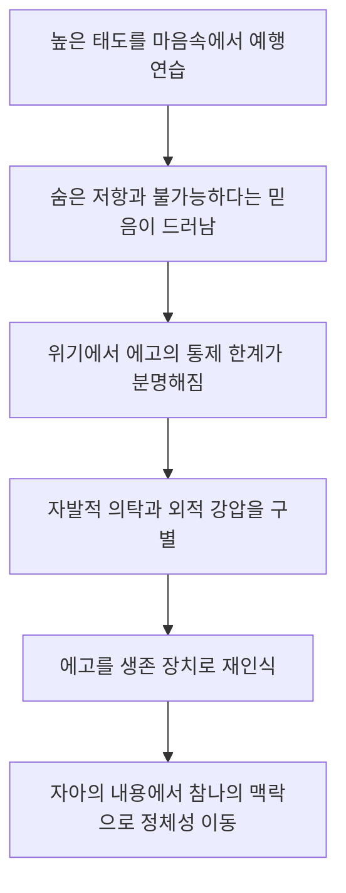
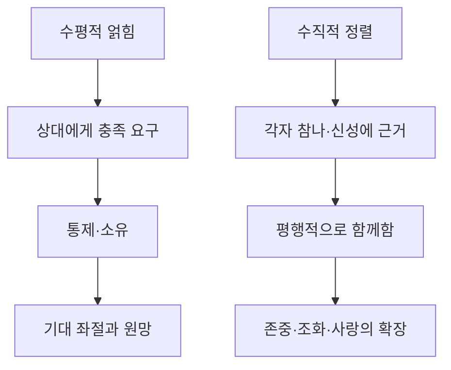

# 『현대인의 의식 지도』 제14장 「영적 경로」
## 「들어가며」·「기본 경로—종교」 전체 해설

### 1/6. 핵심 명제

> 영적 경로의 가치는 그 경로에 관한 지식을 얼마나 많이 쌓았는가가 아니라, 진실이 개인의 존재 방식으로 얼마나 변형되었는가에 달려 있습니다.

호킨스 박사님께서는 종교를 가장 오래되고 검증된 기본 경로로 인정하십니다. 종교는 신에 관한 지식, 믿음, 윤리적 토대, 공동체, 경전, 성직자의 안내를 제공하기 때문입니다.

그러나 여기에는 결정적인 구분이 있습니다.

- 신에 관해 아는 것과 신적 성질을 드러내며 사는 것은 다릅니다.
- 사랑을 설명하는 것과 사랑 자체가 되는 것은 다릅니다.
- 종교적 직함을 얻는 것과 영적으로 성숙하는 것은 다릅니다.
- 교리를 지키는 것과 진실에 충실한 것은 다릅니다.

따라서 이 부분은 종교나 신학의 가치를 낮추는 내용이 아닙니다. 종교라는 경로가 본래의 목적을 잃고 지식·직함·제도·교리 자체를 숭배하는 방향으로 바뀌는 것을 분별하는 내용입니다.

---

### 2/6. 앞 장들과의 구조적 연결

제14장은 앞선 여러 장에서 마련한 토대 위에서 시작됩니다.

| 앞선 장 | 마련된 토대 | 제14장으로의 연결 |
|---|---|---|
| 제10장 「경험적 요소 대 개념적 요소」 | 무엇에 관해 아는 것과 직접 확인하는 것을 구분 | 영적 지식과 존재의 변형을 구분 |
| 제11장 「신념, 신뢰 그리고 신뢰도」 | 참다운 권위와 가짜 권위를 분별 | 어떤 경로와 스승을 신뢰할 것인가 |
| 제12장 「가설로서의 신」 | 개념적 신에서 경험적 신성으로 이동 | 신을 관념이 아니라 실재로 탐색 |
| 제13장 「의심, 회의론 그리고 불신」 | 정신만으로 진실을 확정할 수 없는 한계를 해소 | 의심을 넘어 실제 경로를 선택 |
| 제14장 「영적 경로」 | 확인된 진실을 삶의 방향으로 받아들임 | 어떤 길이 신에게로 이어지는가 |

제13장까지의 중심 물음이 “영적 진실을 어떻게 확신할 수 있는가?”였다면, 제14장부터는 “확인된 진실을 따라 어떤 길로 나아가는가?”로 초점이 이동합니다.

---

### 3/6. 전체 전개 지도

1. **신에게 이르는 길은 다양하다.**  
   종교, 요가, 명상, 헌신, 자기탐구 등 여러 전통적 경로가 존재합니다.

2. **경로의 다양성이 모든 경로의 동등성을 뜻하지는 않는다.**  
   이름이나 역사보다 실제 진실 수준과 온전성이 중요합니다.

3. **의식 측정은 경로를 분별하는 나침반이 된다.**  
   구도자는 전통의 명성이나 외적 권위에만 의존하지 않고 가르침의 진실성을 확인할 수 있습니다.

4. **종교는 가장 보편적인 기본 경로다.**  
   믿음, 이성, 논리, 경전, 윤리, 공동체와 영적 교육을 제공합니다.

5. **학문은 믿음을 강화하지만 인식의 변형을 자동으로 일으키지는 않는다.**  
   개념을 정교하게 이해해도 그것이 곧 주관적 각성은 아닙니다.

6. **에고는 지식을 새로운 정체성으로 이용할 수 있다.**  
   ‘나는 많이 안다’, ‘나는 높은 직함을 가졌다’는 특별함이 영적 에고를 강화할 수 있습니다.

7. **수단이 목적을 대신할 수 있다.**  
   신을 향해야 할 충성이 교단·직함·교리·기관을 향한 충성으로 바뀝니다.

8. **참다운 진전은 진실이 존재 방식이 되는 데서 드러난다.**  
   겸손, 사랑, 정직, 헌신, 봉사의 성질이 지식과 결합될 때 종교는 본래 기능을 완성합니다.

---

### 4/6. 「들어가며」 해설

#### ① ‘만 갈래의 길’이 뜻하는 것

신에게 이르는 길이 많다는 말은 문화와 성향에 따라 형식이 달라질 수 있다는 뜻입니다. 어떤 사람은 믿음과 기도를 통해, 어떤 사람은 명상과 자기탐구를 통해, 또 다른 사람은 봉사와 사랑을 통해 신성에 가까워집니다.

그러나 이는 모든 영적 주장이 자동으로 진실하다는 상대주의가 아닙니다. 호킨스 박사님께서는 경로의 외형적 다양성과 그 안에 담긴 진실 수준을 분명히 구분하십니다.

#### ② 진정성 있는 정보가 주는 변화

과거의 구도자는 다음과 같은 외적 근거에 크게 의존해야 했습니다.

- 오랜 역사
- 다수의 신자
- 경전의 권위
- 종교기관의 명성
- 스승에 관한 전승

의식 연구가 등장하면서 가르침·스승·기관·경로의 진실성을 독립적으로 확인할 수 있는 기준이 마련되었습니다. 이 정보는 기존 종교를 대체하는 것이 아니라, 그 종교 안에 담긴 참된 핵심을 더욱 확실하게 식별하도록 돕습니다.

#### ③ ‘의식이 자신의 진실을 드러낸다’는 의미

이는 개인의 정신이 자기 생각을 진실이라고 선언한다는 뜻이 아닙니다. 호킨스 박사님의 체계에서 의식은 개인적 의견보다 근원적인 보편적 장이며, 진실과 거짓에 서로 다르게 반응합니다.

따라서 의식 측정은 의식 바깥에서 만들어 낸 임의적 기준이 아니라, 진실에 대한 의식 자체의 내재적 반응을 읽어 내는 방식입니다. 눈이 빛을 통해 사물을 보듯, 의식은 자신의 고유한 성질을 통해 진실을 드러냅니다.

---

### 5/6. 「기본 경로—종교」 해설

#### ① 종교와 신학의 본래 가치

종교적 교육은 다음 요소를 체계화합니다.

- 신과 인간의 관계
- 믿음과 구원의 의미
- 선과 악의 구분
- 삶과 죽음의 맥락
- 경전과 전통의 해석
- 공동체의 윤리적 질서

그러므로 종교와 신학은 인간 정신이 영적 진실에 접근할 수 있도록 언어와 개념의 지도를 제공합니다. 성직자는 이를 다음 세대와 공동체에 전달한다는 점에서 중요한 사회적 역할을 수행합니다.

문제는 지도가 아니라, 지도를 목적지와 동일시하는 데서 발생합니다.

#### ② 지적 이해가 곧 주관적 각성은 아니다

신학 지식은 신에 관한 설명을 정교하게 만들 수 있지만, 설명 자체가 곧 신성의 직접적인 인식은 아닙니다.

예를 들어 사랑의 종류와 역사를 완벽하게 설명하더라도, 실제 관계에서 조건 없이 사랑하는 존재가 되었다는 뜻은 아닙니다. 겸손을 논리적으로 설명하면서도 자신의 학식에 우월감을 느낄 수 있습니다.

이것이 ‘대해 아는 것’과 ‘되어 가는 것’의 차이입니다.

| 구분 | ‘대해 아는 것’ | ‘되어 가는 것’ |
|---|---|---|
| 중심 | 정보와 설명 | 존재의 변형 |
| 기능 | 분석·분류·논증 | 사랑·겸손·헌신으로 드러남 |
| 확인 | 말과 지식 | 삶 전체의 성질 |
| 위험 | 지식과 자아의 동일시 | 개인적 공로로 주장하지 않는 겸손 |
| 관계 | 진실을 대상으로 삼음 | 진실과 정렬함 |

#### ③ 네 가지 한계

**첫째, 구획화입니다.**

지식이 전문 분야별로 완전히 분리되면 종교적 이해가 삶 전체로 스며들지 못합니다. 신학은 교실과 설교 안에만 있고, 직업·관계·감정·행동은 별개의 체계로 움직일 수 있습니다.

즉 머리로는 용서를 설명하면서 실제 관계에서는 원망을 유지하는 식입니다. 정보는 축적되었지만 통합되지는 않은 상태입니다.

**둘째, 영적 에고입니다.**

영적 에고는 지식을 존재의 증거로 바꿉니다.

- 많이 알기 때문에 더 영적이라고 여깁니다.
- 어려운 용어를 사용하면서 특별함을 느낍니다.
- 가르침을 이해한 것을 이미 그 상태에 도달한 것으로 착각합니다.
- 영적 지식을 자기 중요성을 강화하는 재료로 사용합니다.

그러므로 영적 에고의 핵심 오류는 ‘진실을 안다’는 생각을 ‘내가 진실한 존재다’라는 자기평가로 바꾸는 데 있습니다.

**셋째, 역할과 정체성의 혼동입니다.**

사제·목사·교수·신학자라는 역할은 교육과 공동체 유지에 큰 공헌을 합니다. 그러나 그 역할이 개인의 본질적 정체성이 되면, 진실보다 자기 역할을 보호하려는 성향이 생길 수 있습니다.

역할은 봉사를 위한 기능이지만, 에고는 그것을 특별함과 권위의 근거로 이용할 수 있습니다.

**넷째, 교회 정치와 직함의 매혹입니다.**

외적 계급이 내적 진화의 단계처럼 느껴지는 것이 함정입니다. 직함이 높아지는 것은 조직 안에서의 책임과 권한이 커지는 것이지, 자동으로 의식 수준이 높아진다는 뜻은 아닙니다.

호킨스 박사님께서 “대성당 주임 사제보다 성당 문지기가 더 도움이 될 수 있다”고 하신 까닭도 여기에 있습니다. 문지기라는 낮은 직책 자체가 특별하다는 뜻이 아니라, 드러나지 않는 자리에서 봉사하면서 자기 중요성을 키울 기회가 줄어드는 구조를 가리킵니다.

#### ④ 종교가 신을 대신하는 역전

종교는 본래 신에게 향하도록 돕는 수단입니다. 그러나 에고가 개입하면 충성의 대상이 다음과 같이 바뀝니다.

> 신과 진실 → 특정 해석 → 교리 → 교단 → 직함과 조직

이때 사람은 신의 무한성을 경배하는 대신 “우리 교리만 옳다”, “우리 조직만 정통이다”라는 위치성을 지키게 됩니다. 종교를 통해 에고를 초월하는 것이 아니라, 종교를 이용하여 집단적 에고를 강화하는 역전이 일어나는 것입니다.

---

### 6/6. 의식 수준과 타 저서 연결

#### 의식 수준의 구조

| 의식 수준 | 이 대목에서의 의미 |
|---:|---|
| 175 자부심 | 직함·학식·정통성으로 특별함을 얻으려는 영적 에고의 작동 양식 |
| 200 | 진실과 거짓, 온전성과 비온전성을 가르는 기본 경계 |
| 400대 | 이성·논리·분석·개념화의 영역 |
| 440~470 | 신학의 측정 범위. 정교하고 가치 있는 고차원적 지적 체계 |
| 500 사랑 | 사랑을 분석하는 데서 사랑이 존재 방식이 되는 질적 전환 |
| 540 무조건적 사랑 | 개인적 선호와 조건을 넘어서는 사랑 |

신학이 440~470으로 측정된다는 것은 신학이 낮거나 거짓이라는 뜻이 아닙니다. 오히려 매우 높은 지적 진실성을 가질 수 있다는 뜻입니다. 다만 500은 400대보다 지식을 조금 더 많이 쌓은 단계가 아니라, 개념적 이해에서 경험적 주관성으로 넘어가는 패러다임 전환입니다.

또한 이 수치는 한 사람의 고정된 등급이 아닙니다. 같은 사람도 신학을 연구할 때는 400대의 이성을 활용하면서, 직함을 방어할 때는 자부심의 양식으로 움직이고, 누군가를 진심으로 사랑할 때는 500의 성질과 정렬할 수 있습니다.

#### 타 저서와의 연결

- **『나의 눈』**  
  평범한 정신은 대상에 ‘관해서’ 알지만, 참나의 앎에서는 아는 자와 알려지는 대상의 분리가 사라진다고 설명합니다. 이번 대목의 ‘대해 앎’과 ‘됨’의 차이를 가장 직접적으로 뒷받침합니다.

- **『신의 현존의 발견』**  
  500에서 주지화로부터 경험적 주관성으로 전환된다고 밝힙니다. 또한 진실에 대한 묘사를 숭배하는 것과 진실을 직접 깨닫는 길을 구분합니다.

- **『의식 수준을 넘어서』**  
  영적 에고가 호칭·지위·명성·특별함에 끌리는 구조를 설명합니다. 문제는 직함 자체가 아니라 그것에 부여된 자기 중요성입니다.

- **『호모 스피리투스』**  
  400대의 구도자는 상세한 설명을 요구하지만, 어느 시점부터 지성이 최종 권위가 되면 장벽으로 바뀐다고 설명합니다. 지적 정보가 주관적 앎으로 변형되어야 한다는 점에서 이번 대목과 일치합니다.

- **『진실 대 거짓』**  
  시대·종교·스승·가르침을 의식 수준으로 확인함으로써, 제14장 첫머리에서 말하는 ‘진정성 있는 정보’의 기반을 제공합니다.

### 전체 통합

종교는 지도이자 학교이며 공동체이고, 신을 향한 믿음을 보존하는 강력한 기본 경로입니다. 그러나 지도에 관한 박식함이 목적지에 도착했다는 뜻은 아닙니다.

이 대목의 중심 기준은 단순합니다.

> 진실에 관한 지식이 에고의 소유물이 되었는가, 아니면 사랑·겸손·헌신이라는 존재 방식으로 변형되었는가?

종교가 신을 가리킬 때 종교는 경로가 됩니다. 반대로 종교가 자기 자신을 가리키기 시작하면 수단이 목적을 대신합니다. 따라서 참다운 영적 진화는 학위·직함·교리의 양이 아니라, 진실이 삶 전체에 통합되어 그 사람의 존재 방식으로 드러나는 데서 확인됩니다.

---

# 『현대인의 의식 지도』 제14장 「영적 경로」||「들어가며」·「기본 경로 - 종교」·「종파주의와 파벌적 종교성」

## 핵심 뜻

이 발췌문의 중심은 다음 한 문장으로 압축할 수 있습니다.

> 종교는 신을 가리킬 때 영적 경로가 되지만, 종교 자체가 숭배 대상이 되면 오히려 신을 가리는 장벽이 됩니다.

호킨스 박사님께서는 종교적 지식과 제도 종교의 가치를 충분히 인정하십니다. 종교는 오랜 세월 동안 신에 관한 지식을 보존하고, 윤리와 도덕을 지지하며, 인간의 탄생부터 죽음까지 삶 전체에 영적인 맥락을 제공해 왔습니다.

그러나 종교를 많이 공부하거나 높은 직함을 얻는 것만으로 의식이 자동으로 변형되는 것은 아닙니다. 결정적인 차이는 신에 관해 많이 아는 것과 신적 진리가 자신의 존재 방식이 되는 것 사이에 있습니다.

---

## 제13장에서 제14장으로 이어지는 흐름

앞선 제13장에서는 의심·회의론·불신 때문에 인간이 진실을 인식하지 못하는 구조를 다루었습니다. 제14장은 그 문제를 넘어, 진실한 영적 경로를 어떻게 알아보고 그 안에서 안정적으로 나아갈 수 있는지를 설명합니다.

| 전개 단계 | 핵심 내용 |
|---|---|
| 경로의 다양성 | 신으로 향하는 길은 문화·성향·전통에 따라 다양함 |
| 진실의 공통 기준 | 경로가 다르더라도 진실 수준은 확인할 수 있음 |
| 종교의 기본 기능 | 지식·믿음·윤리·공동체·의례를 제공함 |
| 종교의 내적 위험 | 지식, 직함, 권력, 교리적 우월감이 영적 에고를 강화할 수 있음 |
| 종파를 넘어선 기능 | 성직자의 봉사와 종교 공동체의 장은 인간의 전 생애를 지지함 |
| 믿음의 완성 방향 | 믿음이 소망을 낳고, 궁극적으로 사랑이라는 존재 방식으로 이어짐 |

---

## 1. 「들어가며」―수많은 길과 하나의 진실 기준

### 만 갈래의 길은 상대주의를 뜻하지 않습니다

“신으로 가는 길은 만 갈래”라는 표현은 모든 가르침이 똑같이 진실하다는 뜻이 아닙니다. 인간마다 문화, 종교적 배경, 기질, 지적 성향, 카르마적 조건이 다르므로 출발점과 형식이 다양하다는 뜻입니다.

경로는 여러 가지지만, 그 경로가 향하는 진실성과 온전성은 공통된 기준으로 확인할 수 있다는 것이 호킨스 박사님의 설명입니다. 따라서 여기에는 두 원리가 함께 존재합니다.

- 형식은 다양할 수 있습니다.
- 진실 자체는 상대적이지 않습니다.

기도, 명상, 헌신, 봉사, 신학 연구처럼 외형이 다른 경로들도 실제로 신성에 정렬되어 있는 정도에 따라 그 가치가 달라집니다.

### 의식 측정은 ‘경로를 대신하는 것’이 아니라 ‘방향을 확인하는 것’입니다

과거의 구도자는 오래된 전통, 추종자 수, 스승의 명성, 기적 이야기, 기관의 규모와 권위에 크게 의존해야 했습니다. 그러나 이런 외적 요소들은 진실성을 보장하지 못합니다.

의식 측정이 제공하는 것은 일종의 지도와 나침반입니다. 그것은 경로를 실제로 살아가는 일을 대신하지 않지만 다음과 같은 혼란을 줄여 줍니다.

- 오래되었다는 이유만으로 참되다고 믿는 오류
- 유명하다는 이유로 높은 스승이라고 판단하는 오류
- 종교적 외양을 영적 본질로 착각하는 오류
- 강렬한 체험을 높은 의식 상태와 혼동하는 오류
- 특정 교파에 속했다는 사실을 영적 성숙과 동일시하는 오류

따라서 본문에서 말하는 “편안함, 편리함, 확실성”은 영적 노력이 필요 없어진다는 뜻이 아닙니다. 잘못된 길을 헤매는 데 소모되는 불필요한 의심과 혼란을 줄일 수 있다는 뜻입니다.

### “의식이 그 자체의 진실을 드러낸다”는 의미

호킨스 박사님의 관점에서 의식 측정 방법은 인간의 정신이 임의로 만들어 낸 이론이 아닙니다. 인류의 집단의식이 일정한 진화 단계에 도달하면서, 의식이 생명체의 반응을 통해 진실과 거짓의 차이를 드러낼 수 있게 된 것입니다.

즉, 의식이 외부의 다른 무엇에 의해 증명되는 것이 아니라, 의식 자체에 내재된 분별 능력을 통해 자기 본성을 드러낸다는 뜻입니다. 이것은 의식이 의식을 알아보는 자기 인식적 과정입니다.

---

## 2. 「기본 경로 - 종교」―지식과 존재 변화의 차이

### 종교적 교육의 본래 가치

종교는 역사적으로 다음과 같은 기능을 맡아 왔습니다.

- 신과 인간의 관계에 관한 지식 보존
- 경전과 위대한 스승들의 가르침 전달
- 윤리와 도덕의 교육
- 기도·예배·성례전·의례의 제공
- 인간의 삶과 죽음에 영적 의미 부여
- 공동체와 세대 간 신앙의 연결

신학은 의식 수준 440~470으로 측정됩니다. 이는 신학이 이성과 논리, 추상적 사고, 개념적 정교함이 발달한 높은 지적 영역에 속한다는 의미입니다.

그러나 400대의 지성은 여전히 개념과 형상의 영역입니다. 비선형적인 영적 실재를 언어와 논리로 설명할 수는 있지만, 설명하는 것과 그 실재를 주관적으로 아는 것은 서로 다릅니다.

### ‘대해 아는 것’과 ‘되어 가는 것’

본문의 핵심 구분은 다음과 같습니다.

| 구분 | ‘대해 아는 것’ | ‘되어 가는 것’ |
|---|---|---|
| 중심 | 개념과 정보 | 의식과 존재 방식 |
| 저장 위치 | 기억과 지성 | 인격과 삶 전체 |
| 사랑의 예 | 사랑에 관한 논문을 씀 | 조건 없이 사랑하는 존재가 됨 |
| 종교의 예 | 경전과 교리를 정확히 설명함 | 가르침의 본질이 삶에서 드러남 |
| 에고의 반응 | “나는 많이 안다” | 개인적 공로를 내세우지 않음 |
| 결과 | 박식함과 전문성 | 내면의 변형과 현존의 변화 |

사랑의 정의를 완벽하게 설명할 수 있으면서도 실제 관계에서는 냉혹할 수 있습니다. 반대로 학문적 언어는 부족해도 자비롭고 정직하며 타인을 조건 없이 받아들이는 사람이 있을 수 있습니다.

호킨스 박사님께서 말씀하시는 영적 성숙은 후자에 가깝습니다. 지식이 무가치한 것이 아니라, 지식이 존재의 변형으로 이어져야 한다는 것입니다.

### 학문적 경로에서 생길 수 있는 네 가지 한계

| 한계 | 작동 방식 | 더 깊은 의미 |
|---|---|---|
| 구획화 | 신학 지식이 직업·강의·연구 영역에만 머묾 | 머리로 아는 진실이 감정과 인간관계에 스며들지 않음 |
| 영적 에고 | 지식을 영적 성숙의 증거로 간주함 | “나는 안다”는 정체성이 신에 대한 개방성을 막음 |
| 역할 동일시 | 사제·목사·교수라는 역할을 자신의 본질로 여김 | 소명보다 직업적 권위와 소속이 앞서게 됨 |
| 직함과 권력 | 종교적 위계가 자기도취의 보상이 됨 | 신을 섬기는 자리가 에고가 인정받는 자리로 변함 |

여기서 학문과 성직 자체가 문제가 되는 것은 아닙니다. 박사님께서는 종교적 소명이 타인을 교육하고 사회를 지지하는 커다란 장점을 분명히 인정하십니다. 문제는 지식과 직함이 신성을 향한 수단으로 머물지 않고 개인적 정체성과 우월감의 근거가 되는 경우입니다.

### 왜 주임 사제보다 성당 문지기가 도움이 된다고 하시는가

성당 문지기는 교회 정치, 권력 경쟁, 명예, 의사 결정권에서 멀리 떨어져 있습니다. 그의 역할은 단순하고 익명적이며 봉사 중심입니다. 그는 사람들의 찬사를 받지 않으면서도 신성한 장 안에 머뭅니다.

반면 높은 직위에는 행정, 명성, 영향력, 인정, 권력이라는 에고의 보상이 따라올 수 있습니다. 그래서 문지기는 다음을 상징합니다.

- 드러나지 않는 봉사
- 지위가 없는 겸손
- 신성한 현존 가까이에 조용히 머무름
- 개인적 공로를 주장하지 않는 소명
- 외적 권위보다 내적 정렬을 중시하는 태도

이는 모든 문지기가 모든 성직자보다 영적으로 높다는 문자적 비교가 아닙니다. 직함이 높을수록 영적 성숙도 높을 것이라는 일반적 착각을 깨뜨리는 상징적 역설입니다.

---

## 3. 신이 아니라 종교를 숭배하게 되는 과정

종교는 본래 자신을 넘어 신을 가리키는 표지입니다. 그러나 에고는 그 표지를 붙잡아 새로운 정체성으로 만들 수 있습니다.

그 과정은 대체로 다음과 같이 진행됩니다.

1. 신적 진리를 배우기 위해 종교에 들어갑니다.
2. 종교의 교리와 전통에 익숙해집니다.
3. 그 종교를 ‘나의 종교’라고 강하게 동일시합니다.
4. 소속된 종교의 우월성이 자신의 우월감이 됩니다.
5. 신보다 교리·기관·집단의 보존이 더 중요해집니다.
6. 마침내 가르침의 본질과 반대되는 행위까지 종교를 위해 정당화합니다.

이것이 관련 저서에서 말하는 ‘종교주의’입니다. 종교주의는 깊은 신앙과 같은 것이 아닙니다.

| 진정한 종교적 헌신 | 종교주의 |
|---|---|
| 종교를 통해 신을 향함 | 종교 자체를 절대화함 |
| 교리를 신적 진리의 안내로 사용함 | 교리의 문구를 충성 시험으로 사용함 |
| 사랑·자비·용서로 열매가 나타남 | 배척·우월감·적대감이 나타남 |
| 다른 전통에서도 신성을 알아봄 | 다른 전통의 존재를 위협으로 느낌 |
| 형식이 본질을 섬김 | 형식이 본질을 대신함 |

이는 ‘지도와 실제 영역의 혼동’이 종교 안에서 일어난 경우입니다. 경전·교리·의례는 신적 실재를 가리키는 지도인데, 에고는 지도를 소유하는 것을 목적지에 도달한 것과 동일시합니다.

---

## 4. 「종파주의와 파벌적 종교성」―제도 종교의 보편적 기능

### 박사님께서는 제도 종교 자체를 폐기하지 않으십니다

종교가 종파주의로 변질될 가능성을 설명한 뒤, 호킨스 박사님께서는 곧바로 공식 종교와 성직자의 보편적 가치를 밝히십니다. 이는 매우 중요한 균형입니다.

성직자는 인간의 생애 전체를 영적인 맥락 안에 위치시킵니다.

- 탄생과 세례
- 성장과 견진
- 혼인
- 질병과 임종
- 장례와 매장
- 전쟁터와 군대에서의 영적 돌봄

이러한 봉사는 교리 논쟁보다 더 깊은 층위에서 작용합니다. 사람의 삶과 죽음을 신성한 질서 안에서 받아들이게 해주기 때문입니다. 성직자의 본래 역할은 특정 파벌의 이익을 지키는 것이 아니라, 인간 존재 전체를 신성에 연결하는 것입니다.

### 믿음은 ‘친숙함’을 통해 동화됩니다

믿음은 언제나 논리적 증명을 거쳐 생기는 것이 아닙니다. 가정과 문화 속에서 다음과 같은 경험이 반복되면서 자연스럽게 내면에 자리 잡습니다.

- 부모와 함께 예배나 미사에 참석함
- 종교적 절기와 축일을 기념함
- 기도하는 모습을 접함
- 정직과 책임을 신앙의 일부로 배움
- 종교 공동체에서 친교와 돌봄을 경험함
- 성당·교회·사찰·모스크의 신성한 분위기에 친숙해짐

본문에서 믿음이 “비교적 크게 노력을 하지 않고 얻어진다”는 것은 궁극적 영적 각성이 저절로 완성된다는 뜻이 아닙니다. 믿음의 씨앗과 신성을 향한 기본 방향이 가정과 문화의 장을 통해 자연스럽게 형성된다는 뜻입니다.

여기서 자연법은 인간 안에 신성과 도덕적 질서를 알아볼 수 있는 선천적 가능성이 내재한다는 의미입니다. 전통은 이 가능성을 새로 만들어 내기보다 깨어나도록 돕습니다.

### 성당과 모스크가 700대로 측정되는 까닭

본문은 신의 주권에 헌정된 대형 고딕 성당과 거대한 모스크가 700대로 측정된다고 말합니다. 이는 건축물이 지적 의식을 가진다는 뜻이 아닙니다.

그 수치는 다음 요소들이 결합된 신성한 장을 가리킵니다.

- 건축의 근본 목적이 신께 봉헌되어 있음
- 오랜 세월 기도와 숭배가 축적되어 있음
- 공간 전체가 세속적 용도보다 신성을 향하도록 구성됨
- 수많은 사람의 헌신과 경외가 하나의 장을 형성함
- 아름다움과 장엄함이 개인적 사고를 넘어 더 큰 맥락을 열어 줌

따라서 높게 측정되는 것은 돌이나 규모 자체가 아니라 그 공간이 담고 있는 헌정의 목적과 축적된 영적 장입니다.

---

## 5. 집단 의지와 파벌적 집단의 차이

호킨스 박사님께서 말씀하시는 집단 의지는 단순한 군중심리와 다릅니다.

| 영적으로 정렬된 집단의 장 | 파벌적 집단의 장 |
|---|---|
| 기도·헌신·숭배로 결속됨 | 적대 대상과 집단 정체성으로 결속됨 |
| 개인을 신성에 연결함 | 개인을 집단 에고에 종속시킴 |
| 책임·정직·청렴·윤리를 강화함 | 충성·복종·우월감을 강화함 |
| 신 앞에서 개인적 에고가 낮아짐 | 집단의 이름으로 개인적 에고가 팽창함 |
| 사회 전체에 안정적 영향을 줌 | 사회를 ‘우리와 그들’로 분열시킴 |

집단 의지의 힘은 인원이 많아서 생기는 것이 아니라, 다수의 의도가 신성·진실·사랑이라는 동일한 방향으로 정렬될 때 생깁니다. 그래서 기도와 예배는 개인적 위안을 넘어 사회의 윤리적 기반을 지지하는 장 효과를 가집니다.

### 성경에 손을 얹고 하는 취임선서의 의미

본문에서 성경은 특정 교파의 우월성을 나타내는 상징이 아닙니다. 공직자의 권력이 개인의 소유물이 아니며, 인간이 만든 국가 권력보다 높은 진실과 도덕적 질서에 책임을 진다는 선언입니다.

그 행위의 핵심은 다음과 같습니다.

> 나의 권위는 내가 만들어 낸 절대 권력이 아니며, 나 역시 더 높은 진실과 도덕적 질서 아래에 있습니다.

따라서 취임선서는 종교적 장식이 아니라 권력에 대한 초월적 제한을 상징합니다. 개인적 야망이나 국가 자체가 최고의 권위가 아니라는 뜻입니다.

---

## 6. ‘믿음·소망·사랑’의 삼각 구조

본문은 믿음을 이 삼각 구조의 주춧돌이라고 말합니다.

### 믿음

믿음은 감각과 이성으로 당장 확인되지 않더라도 신적 실재와 영혼의 영속성을 신뢰하는 능력입니다. 믿음이 없으면 인간은 현재의 조건과 육체적 생존만을 실재의 전부로 여기기 쉽습니다.

### 소망

소망은 믿음이 시간 속에서 지속되는 형태입니다. 현재 상황이 불완전하더라도 삶이 더 큰 신적 질서 안에 있다는 확신을 유지합니다.

여기서 소망은 개인이 원하는 결과를 기대하는 것과 다릅니다.

- 기대는 특정 사건이 원하는 방식으로 일어나기를 요구합니다.
- 소망은 결과가 보이지 않더라도 신적 선과 의미를 신뢰합니다.

그래서 본문은 믿음이 “덧없는 기대”를 초월한다고 설명합니다.

### 사랑

사랑은 믿음과 소망이 완성되어 존재 방식이 된 상태입니다. 사랑은 단지 교리를 믿거나 미래의 구원을 기다리는 것을 넘어, 신적 성질이 현재의 삶을 통해 드러나는 것입니다.

호킨스 박사님의 전체 의식 지도에서 사랑은 500, 무조건적 사랑은 540으로 제시됩니다. 무조건적 사랑은 특정 대상을 좋아하는 감정이 아니라 세상과 관계하는 존재 방식입니다. 그러므로 사랑에 관한 지식과 사랑이 되는 것의 차이가 이 대목 전체를 관통합니다.

---

## 의식 수준의 올바른 해석

| 대상 | 측정 수준 | 의미 |
|---|---:|---|
| 신학 | 440~470 | 고도의 이성·논리·개념적 정교함 |
| 사랑 | 500 | 가슴과 배려 중심으로 패러다임이 이동함 |
| 무조건적 사랑 | 540 | 사랑이 대상별 감정을 넘어 존재 방식이 됨 |
| 신의 주권에 헌정된 성당·모스크 | 700대 | 축적된 헌신과 신성한 목적이 형성한 높은 장 |

이 수치들은 사람을 고정된 등급으로 분류하기 위한 것이 아닙니다. 무엇을 측정하느냐에 따라 가르침, 사람, 역할, 건물, 기관의 수치는 서로 다를 수 있습니다.

가령 성당이 700대로 측정된다고 해서 그 안에 들어온 모든 사람이 700대가 되는 것은 아닙니다. 신학이 440~470이라고 해서 모든 신학자의 개인적 의식이 그 수준이라는 뜻도 아닙니다. 수치는 각 대상이 현실을 반영하고 신성에 정렬된 방식과 그 장의 성질을 나타냅니다.

---

## 전체 통합 해설

이 발췌문에는 네 가지 변환이 담겨 있습니다.

- 종교적 지식은 존재의 변화로 이어져야 합니다.
- 종교적 직함은 권력이 아니라 봉사가 되어야 합니다.
- 종교 공동체는 파벌이 아니라 신성한 장이 되어야 합니다.
- 믿음은 교리에 대한 동의에 머물지 않고 소망과 사랑으로 펼쳐져야 합니다.

호킨스 박사님께서는 종교와 영성을 서로 적대적인 것으로 보지 않으십니다. 종교는 영적 진실을 보존하고 전달하는 기본 경로입니다. 다만 종교가 자신을 절대화하면, 자신이 가리키려던 신을 가리게 됩니다.

그러므로 이 대목의 궁극적인 기준은 외적 소속이나 지식의 양이 아닙니다. 종교를 통해 사람이 얼마나 유명해졌는가도 아닙니다. 그 가르침이 실제로 사랑·정직·책임·겸손·봉사라는 존재 방식으로 변형되었는지가 핵심입니다.

종교가 신성에 투명할 때 종교는 길이 됩니다. 종교가 자기 자신을 숭배하게 만들 때 종교는 벽이 됩니다. 그리고 그 둘을 가르는 지점이 바로 ‘대해 아는 것’에서 ‘그것이 되어 가는 것’으로의 전환입니다.

---

# 『현대인의 의식 지도』 제14장 「영적 경로」||「미덕(의식 수준 210에서 385)」·「겸손, 학습능력」

## 핵심 뜻

이 두 소제목을 하나로 연결하면 다음과 같습니다.

> 영적 진화의 가까운 출발점은 어려운 형이상학이나 신학 지식이 아니라, 타인을 존중하고 책임 있게 살아가는 인격이다. 그리고 그 인격이 더 높은 진실을 받아들이려면 자신의 한계를 인정하는 합리적 겸손이 필요하다.

「미덕」은 진실을 받아들일 수 있는 사람의 성격적 토대를 설명하고, 「겸손, 학습능력」은 그 사람이 참다운 권위와 가르침으로부터 배울 수 있게 해 주는 정신의 자세를 설명합니다. 따라서 두 소제목은 각각 별개의 도덕론과 교육론이 아니라, 영적 성장의 두 연속 단계입니다.

| 단계 | 중심 작용 | 결과 |
|---|---|---|
| 좋은 본보기와 문화 | 긍정적 특성과 동일시 | 성격의 기초 형성 |
| 미덕의 내면화 | 정직·책임·자기 통제 | 안정된 인격 |
| 합리적 겸손 | 자신의 오류 가능성 인정 | 배울 수 있는 정신 |
| 참다운 권위와 정렬 | 진실한 특성을 연구하고 닮아감 | 진실의 흡수와 통합 |
| 인격의 성숙 | 자기중심성 감소, 타자에 대한 배려 확대 | 사랑 500의 토대 |

## 1. 지적 이해보다 먼저 필요한 것

호킨스 박사님께서는 영적 진화를 위해 반드시 ‘진리의 변증법’을 이해해야 하는 것은 아니라고 하십니다. 이는 지성이 불필요하다는 뜻이 아니라, 지성만으로는 영적 성숙이 보장되지 않는다는 뜻입니다.

어떤 사람은 신학과 철학을 대단히 잘 설명하면서도 정직하지 않거나 무례하고, 책임을 회피할 수 있습니다. 반대로 복잡한 영적 개념을 설명하지 못하더라도 공정하고 친절하며 신뢰할 만한 사람일 수 있습니다. 호킨스 박사님의 관점에서는 후자의 성격이 영적 진화의 실제 토대에 더 가깝습니다.

영적 진실은 단지 머릿속에 저장되는 정보가 아니라 존재방식에 통합되어야 하기 때문입니다.

- 정직은 진실과 정렬되는 기본 능력입니다.
- 공정함은 자기 이익 때문에 사실을 왜곡하지 않는 태도입니다.
- 예절은 타인의 존재와 감정을 존중하는 외적 표현입니다.
- 책임감은 자기 행동의 원인을 남에게 떠넘기지 않는 성숙함입니다.
- 선함은 타인을 이용할 대상이 아니라 소중한 존재로 대하는 방향성입니다.

따라서 미덕은 종교에 들어가기 전에 갖추어야 하는 세속적 장식이 아니라, 영적 진실이 자리 잡을 수 있게 해 주는 그릇입니다.

## 2. 미덕은 어떻게 인격이 되는가

본문은 미덕의 형성 과정을 어린 시절부터 설명합니다.

**좋은 본보기 → 사회적 인정과 보상 → 동일시 → 내면화 → 인격**

어린아이는 처음부터 정직이나 책임이라는 추상적 원리를 이해하지 못합니다. 대신 부모와 존경하는 어른의 행동을 보고 그대로 받아들입니다. 부모가 약속을 지키고, 타인을 공손히 대하고, 실수를 인정하고, 어려운 사람을 돕는 모습을 보이면 아이는 그런 행동을 ‘사람이 살아가는 정상적인 방식’으로 흡수합니다.

초기에는 칭찬과 인정 같은 외적 보상이 중요합니다. 그러나 성숙하면서 보상의 중심이 안으로 이동합니다.

- 처음에는 칭찬받기 위해 정직합니다.
- 다음에는 신뢰를 잃지 않기 위해 정직합니다.
- 나중에는 정직하지 않은 상태 자체가 자신의 내적 질서와 맞지 않기 때문에 정직합니다.

제14장 후반부에서 “각각의 공식 단계는 그 자체가 하나의 보답”이 된다고 하신 까닭이 여기에 있습니다. 미덕이 충분히 내면화되면 더 이상 억지로 지켜야 하는 규칙처럼 느껴지지 않습니다. 마음의 평온, 자긍심, 신뢰받는 관계와 삶의 안정이 미덕 자체에서 나오기 때문입니다.

## 3. 가정·문화·기관이 가진 영적 기능

부모뿐 아니라 종교, 봉사단체, 청소년단체, 자선기관도 성격 형성에 중요한 역할을 합니다. 이 기관들의 가치는 단순히 도덕적 명령을 전달하는 데 있지 않습니다. 여러 사람이 함께 정직·봉사·책임·협력을 정상적인 가치로 확인함으로써, 개인보다 더 큰 긍정적 장을 유지한다는 데 있습니다.

개인은 그 장에 참여하면서 다음을 자연스럽게 배웁니다.

- 자신의 욕구를 잠시 미루는 법
- 공동의 목적을 위해 협력하는 법
- 맡은 역할을 끝까지 책임지는 법
- 도움을 주고받는 법
- 개인적 이익보다 원칙을 우선하는 법

선한 카르마와 좋은 운으로 진실한 가정과 문화를 만난다는 설명은 환경이 모든 것을 결정한다는 뜻은 아닙니다. 좋은 환경은 축적된 영적 자산을 쉽게 물려받을 수 있는 기회입니다. 그러나 본문이 뒤이어 개인적 노력, 자기 통제, 인내심을 강조하듯이, 물려받은 자산을 실제 인격으로 만드는 과정에는 개인의 선택이 필요합니다.

## 4. 의식 수준 210에서 385까지의 의미

『의식 수준을 넘어서』의 긍정적 성격 특성표를 함께 보면, 이 범위는 단순히 “착한 정도”를 나타내지 않습니다. 자기 통제에서 시작하여 대인관계의 배려, 사회적 신뢰, 윤리적 균형, 마침내 지혜로 발전하는 흐름입니다.

| 범위 | 대표적 특성 | 의식의 변화 |
|---:|---|---|
| 200 | 정직, 근면 | 진실성과 책임의 기본 문턱 |
| 210 | 끈질김, 부지런함, 느긋함 | 충동에 끌려가지 않고 지속할 수 있음 |
| 220~225 | 친절, 도움이 됨, 사려 깊음, 온건함 | 타인의 필요와 감정을 고려하기 시작함 |
| 240~245 | 열린 마음, 지각 있음, 공손함, 유연함, 지지함 | 자기 입장 밖의 맥락을 받아들임 |
| 250~270 | 의지할 만함, 안정됨, 인도적임, 보호적임, 겸손 | 신뢰와 성숙한 관계가 형성됨 |
| 275~305 | 우호적임, 책임 있음, 배려함, 윤리적임, 균형 잡힘 | 개인적 선의가 안정된 사회적 인격으로 발전함 |
| 335~365 | 즐거움, 유머, 건강함, 공정함, 충실함 | 긍정적 존재방식이 삶 전반을 지배함 |
| 385 | 지혜 | 개별 규칙을 넘어 전체 맥락과 본질을 분간함 |

관련 표 전체에는 정직과 근면 200, 행복 395, 합리성 405도 포함됩니다. 따라서 ‘210에서 385’라는 제목은 모든 미덕을 기계적으로 그 범위 안에 가둔다는 뜻보다, 일상적 성격의 성숙이 주로 펼쳐지는 영역을 가리킨다고 볼 수 있습니다.

또한 이 수치들은 사람을 고정된 등급으로 분류하기 위한 것이 아닙니다. 한 사람 안에서도 어떤 상황에서는 책임감이 우세하고, 다른 상황에서는 두려움이나 자존심이 앞설 수 있습니다. 수치는 그 순간 우세하게 작동하는 인식방식과 끌개장의 성질을 보여 줍니다.

### 210에서 385로의 질적 이동

이 범위에는 하나의 분명한 방향이 있습니다.

- 낮은 쪽에서는 자신의 충동을 조절하고 맡은 일을 지속하는 능력이 두드러집니다.
- 중간 영역에서는 타인의 입장을 존중하고 신뢰받는 관계를 형성합니다.
- 높은 쪽에서는 개별 행동규칙을 넘어 전체 상황에 맞는 공정성과 지혜가 나타납니다.

특히 겸손 270은 높은 마음으로 제시되는 275와 매우 가까이 있습니다. 이는 의미 있는 배열입니다. 자신의 관점만 옳다고 고집하는 낮은 정신에서 벗어나려면 먼저 자신이 모든 것을 알지는 못한다는 겸손이 필요하기 때문입니다. 지혜 385는 다시 이성 400의 문턱에 가까워, 성숙한 미덕이 결국 넓은 맥락을 이해하는 능력으로 발전함을 보여 줍니다.

## 5. 미덕은 서로 연결된 하나의 장이다

미덕은 각각 따로 떨어진 기술이 아닙니다. 하나의 긍정적 특성이 자리 잡으면 다른 특성도 함께 강화됩니다.

예를 들어 정직해지면 변명과 방어가 줄어듭니다. 방어가 줄면 타인의 말을 더 차분히 들을 수 있습니다. 경청할 수 있으면 공정성과 배려가 커집니다. 책임감이 높아지면 자신을 믿을 수 있게 되고, 그 결과 외부의 인정에 덜 의존하게 됩니다.

따라서 긍정적 특성은 다음과 같은 자기 확산적 흐름을 만듭니다.

**정직 → 책임 → 신뢰 → 협력 → 안정 → 만족 → 더 큰 선의**

호킨스 박사님께서 미덕을 행복·성공·건강과 연결하신 것은 단순히 “착하게 살면 상을 받는다”는 뜻이 아닙니다. 긍정적 끌개장과 정렬된 사람은 갈등과 방어에 에너지를 덜 소비하고, 타인의 신뢰와 협력을 불러오며, 자신의 내면에서도 분열이 줄어듭니다. 삶의 여러 영역이 함께 개선되는 것은 이 전체적인 장 효과의 결과입니다.

## 6. ‘기본적 품위’의 깊은 뜻

기본적 품위는 세련된 예절이나 사회적 체면만을 뜻하지 않습니다. 그것은 자신과 타인을 함부로 다루지 않는 가장 기본적인 존중입니다.

이 존중에서 긍정적 자긍심이 나옵니다. 여기서 자긍심은 자신이 남보다 뛰어나다는 나르시시즘적 우월감이 아닙니다. 자신이 믿을 만하고, 책임을 다하며, 남을 해치지 않는 사람이라는 내적 확신입니다.

‘세상의 소금’이라는 표현도 같은 의미입니다. 이런 사람들은 화려하게 주목받지 않더라도 사회를 실제로 유지합니다. 약속을 지키고, 감정을 남에게 떠넘기지 않으며, 어려울 때 힘이 되어 주고, 타인의 것을 빼앗지 않습니다. 이들의 신뢰성이 가정·직장·공동체의 보이지 않는 기반을 이룹니다.

윤리적 타협도 진실을 적당히 희석한다는 뜻이 아닙니다. 여기서 ‘온건한 타협’은 원칙을 버리는 상대주의가 아니라, 타인의 감정과 상황을 존중하면서 원칙을 가장 합리적으로 적용하는 성숙한 조정 능력입니다.

## 7. 두 문화의 충돌과 의식 수준 200

본문이 말하는 두 문화는 특정 민족이나 국가를 단순하게 양분한 것이 아닙니다. 모든 사회와 기관 내부에 함께 존재하는 두 가지 의식의 방향입니다.

| 200 이하에서 우세한 양상 | 200 이상에서 우세한 양상 |
|---|---|
| 충동, 자기 이익, 책임 회피 | 자기 통제, 책임, 원칙 |
| 기만과 강제력 | 정직과 신뢰 |
| 약탈과 착취 | 교환과 협력 |
| 타인을 수단으로 취급 | 타인의 권리와 감정을 존중 |
| 단기적 이득 | 장기적 공동 이익 |
| 비난과 합리화 | 오류 인정과 교정 |

호킨스 박사님의 연구에서 사회 문제의 약 92퍼센트가 200 이하의 의식 양상으로부터 발생한다는 설명은, 사람들을 경멸하라는 뜻이 아닙니다. 사회적 손실이 균등하게 발생하지 않으며, 비진실성과 책임 회피가 범죄·갈등·불신·보호 비용을 집중적으로 만들어 낸다는 뜻입니다.

그러므로 사람에 대한 선의와 파괴적 행동에 대한 무제한적 허용은 구분되어야 합니다. 개인의 영적 가치를 존중하는 것과, 그 사람이 타인을 해치는 행동까지 방치하는 것은 같은 일이 아닙니다. 진정한 선의에는 보호와 합리적 경계도 포함됩니다.

미국 전통에 관한 설명도 국명 자체보다 그 토대가 된 원리를 보아야 합니다. 호킨스 박사님께서 강조하시는 것은 정직·개인적 책임·봉사·자율적 협력 같은 가치가 제도와 문화 속에서 유지될 때 문명이 번영한다는 점입니다.

## 8. 인격에서 사랑으로

인격은 일시적으로 선한 행동을 몇 번 하는 것이 아니라, 미덕들이 서로 결합하여 안정된 존재방식이 된 상태입니다.

**선한 의지 → 자기 통제 → 신뢰성 → 인격 → 사랑**

사랑 500은 단순한 호감이나 감상적 애정이 아닙니다. 자기중심적 이해관계를 넘어 타인의 행복과 생명 자체의 가치를 자연스럽게 중시하는 의식의 맥락입니다. 따라서 210에서 385까지의 미덕은 사랑을 억지로 만들어 내는 기술이 아니라, 사랑이 자연스럽게 나타날 수 있도록 자기중심적 장애를 줄이는 기초 자산입니다.

무조건적 사랑 540은 사랑의 대상과 조건을 가리지 않는 더욱 완성된 상태입니다. 세계 인구의 0.4퍼센트만이 이 수준에 도달한다는 설명은 그 상태의 희귀성을 나타내지만, 동시에 인간에게 실제로 가능한 목표임을 밝힙니다. 여기서 ‘비교적 도달 가능하다’는 말은 흔하다는 뜻이 아니라, 600 이상의 깨달음과 비교할 때 인간적 삶 안에서 접근 가능한 영적 상태라는 의미입니다.

## 9. 겸손은 왜 학습능력인가

호킨스 박사님께서 말씀하시는 겸손은 자신을 무가치하게 여기거나 무조건 순종하는 태도가 아닙니다. 핵심은 다음과 같습니다.

> “내 정신은 모든 것을 알지 못하며, 내가 확신하는 것도 틀릴 수 있다. 진실은 내 동의를 받아야만 진실이 되는 것이 아니다.”

이 태도가 생기면 정신은 처음으로 수정될 수 있습니다. 에고가 자신의 현재 관점을 최종 판결로 여기고 있는 동안에는 새로운 정보가 들어와도 자기 입장을 방어하는 재료로만 사용합니다. 겸손은 그 방어를 낮추어 정신이 진실한 지식을 받아들이게 합니다.

본문의 세 동사는 이 과정을 정확히 보여 줍니다.

- **흡수한다**: 진실한 정보가 정신 안으로 들어옵니다.
- **통합한다**: 새 정보가 기존의 세계관과 삶의 태도를 재구성합니다.
- **파악한다**: 단순히 기억하는 데서 벗어나 그 진실의 의미를 알아봅니다.

따라서 학습능력은 지능이나 기억력만이 아닙니다. 더 높은 진실이 자신의 기존 입장을 바꾸도록 허용할 수 있는 능력입니다.

## 10. 참다운 권위와 가짜 권위

본문은 겸손을 강조하면서도 아무 권위나 받아들이라고 하지 않습니다. 오히려 참다운 권위와 가짜 권위를 본질적으로 구분합니다.

| 참다운 권위 | 가짜 권위 |
|---|---|
| 진실성과 입증된 능력에서 나옴 | 직함·명성·인기에서 나옴 |
| 유용하고 도움이 됨 | 추종과 환호를 요구함 |
| 보호하고 힘을 북돋움 | 통제하고 의존하게 만듦 |
| 본질이 외관을 뒷받침함 | 외관이 본질의 결핍을 가림 |
| 존중이 자연스럽게 생김 | 지위와 선전으로 존중을 강요함 |

사회적 합의와 대중적 인기도 구분해야 합니다. 본문이 긍정적으로 말하는 사회적 합의는 여러 문화와 시대를 통과하며 오랫동안 확인된 진실의 축적입니다. 반면 부정적으로 말하는 여론은 일시적인 인기, 명성, 미디어의 환호입니다.

전능·전지·편재하는 신의 실재가 서로 다른 고대 문화들에서 반복적으로 나타난다는 사실은, 호킨스 박사님의 관점에서 신성에 대한 인식이 특정 지역의 유행이 아니라 인간 의식에 깊이 내재된 보편적 앎임을 보여 줍니다. 그러나 오래되었거나 종교적 외관을 갖추었다는 사실만으로 모든 지도자와 교리가 참다운 권위를 얻는 것은 아닙니다. 권위의 근원은 언제나 외관이 아니라 본질입니다.

## 11. 참다운 권위를 ‘연구하고 모방한다’는 뜻

이는 맹목적으로 복종하거나 인격을 흉내 내라는 뜻이 아닙니다. 온전한 스승과 뛰어난 인물에게서 결과를 만들어 내는 내적 특성을 발견하고 그것과 동일시한다는 뜻입니다.

질투와 경쟁심으로 권위를 바라보면 에고는 이렇게 반응합니다.

- “왜 저 사람이 나보다 위에 있는가?”
- “저 사람의 결점을 찾아야 한다.”
- “저 권위를 무너뜨려야 내가 높아진다.”

겸손한 정신은 같은 대상을 전혀 다르게 봅니다.

- 그 사람을 진실하게 만든 특성은 무엇인가?
- 그 사람의 정직성·인내·헌신은 어떻게 작동하는가?
- 외적인 지위가 아니라 어떤 본질을 닮아야 하는가?

본문 처음에는 어린아이가 부모와 문화를 무의식적으로 동일시한다고 설명하고, 마지막에는 성인이 참다운 권위를 연구하고 모방한다고 설명합니다. 구조적으로 보면 매우 아름다운 연결입니다.

**어린 시절에는 주어진 본보기를 흡수하고, 성숙한 뒤에는 자신이 닮아갈 본보기를 의식적으로 선택합니다.**

## 종합 해설

「미덕」과 「겸손, 학습능력」은 영적 경로가 현실의 일상적 인격과 분리되어 있지 않다는 사실을 보여 줍니다.

미덕은 에고의 충동과 자기중심성을 다스려 진실이 자리 잡을 수 있는 성격적 토대를 만듭니다. 겸손은 자신의 현재 이해를 절대화하지 않음으로써 정신을 배울 수 있는 상태로 엽니다. 참다운 권위는 그 열린 정신에 신뢰할 수 있는 방향과 본보기를 제공합니다. 이 세 요소가 결합하면 도덕은 외부에서 강요된 의무가 아니라 점점 더 기쁨과 만족을 주는 생활방식으로 변합니다.

결국 호킨스 박사님의 중심 가르침은 명료합니다.

> 영적 진화는 특별한 지식을 많이 소유하는 데서 시작되는 것이 아니라, 정직하고 책임 있고 친절하며 배울 수 있는 사람이 되어 가는 데서 시작됩니다. 이러한 기본적 품위가 충분히 성숙하면, 그것은 인격을 거쳐 사랑의 의식으로 확장됩니다.

---

# 『현대인의 의식 지도』 제14장 「영적 경로」||「마음으로 그려 보기」·「위기와 재앙」·「강압」·「내려놓음과 생존」

## 핵심 뜻

이 네 소제목은 단순한 상상법에서 시작하여 에고의 가장 깊은 생존 본능까지 내려갑니다.

마음으로 높은 태도를 미리 그려 보는 것은 원하는 결과를 끌어오는 요령이라기보다, 위기 속에서도 진실·평화·신에 대한 의탁을 선택할 수 있도록 내면에 새로운 반응 양식을 형성하는 방법입니다. 이 과정이 깊어지면 결국 다음과 같은 근본적인 오인이 드러납니다.

> “내가 통제하고 있기 때문에 살아 있다. 그러므로 내가 내 생명의 근원이다.”

호킨스 박사님께서는 이것이 에고의 가장 오래되고 강력한 믿음이라고 설명하십니다. 영적 경로의 핵심은 에고의 기능을 파괴하는 것이 아니라, 에고가 생명의 근원이라는 잘못된 동일시를 내려놓고 참나가 삶의 실제 근원임을 발견하는 데 있습니다.

## 전개 지도

## 1. 마음으로 그려 보기

### ‘진짜처럼 해 보기’의 의미

여기서 ‘진짜처럼 해 보기’는 자신을 속이거나 감정을 가장하라는 뜻이 아닙니다. 아직 자연스럽게 나타나지 않는 높은 태도에 미리 형태를 부여하는 학습 방식입니다.

예를 들어 평정, 용서, 품위, 용기와 같은 성품이 충분히 자리 잡지 않았더라도, 그러한 태도로 대응하는 모습을 마음속에서 반복적으로 그려 볼 수 있습니다. 그러면 정신은 높은 반응 양식을 낯선 것으로만 여기지 않고, 실제로 선택할 수 있는 가능성으로 받아들이기 시작합니다.

이 대목이 바로 앞의 「겸손, 학습능력」과 연결되는 이유도 여기에 있습니다. 겸손한 정신은 자신이 이미 완성되었다고 주장하지 않고, 더 높은 본보기를 받아들여 동화할 수 있습니다.

### 저항이 나타나는 이유

높은 모습을 그리는 순간 “나는 그렇게 할 수 없다”는 생각이 나타날 수 있습니다. 이것은 이미지 기법이 실패했다는 뜻이 아닙니다. 오히려 평소에는 숨어 있던 제한적 신념이 의식 위로 드러난 것입니다.

마음속 예행연습은 두 가지 기능을 동시에 수행합니다.

- 높은 반응의 내적 모형을 형성합니다.
- 그 반응을 가로막던 부정적 프로그램을 드러냅니다.

그러므로 저항은 방해물인 동시에 무엇이 아직 에고에 붙들려 있는지를 보여 주는 표지입니다.

### “마음에 품은 것은 밖으로 드러난다”

호킨스 박사님의 맥락에서 이 말은 단순한 소원 성취론이 아닙니다. 마음속에 지속적으로 품은 것은 주의, 지각, 판단, 행동, 신체 반응을 조직하는 에너지 패턴이 됩니다. 사람은 자신이 마음에 품은 세계관에 따라 상황을 해석하고, 그 해석에 맞는 선택을 하게 됩니다.

의식 수준이 높을수록 마음속 이미지가 강력해지는 까닭은 욕망이 강해져서가 아닙니다. 내적 분열과 모순이 줄어들고 의도·가치·행동이 진실한 방향으로 일치하기 때문입니다.

따라서 두 종류의 이미지가 구별됩니다.

| 이미지의 방향 | 중심 동기 | 결과 |
|---|---|---|
| 이기적 획득 장면 | 결핍, 경쟁, 통제 | 에고의 위치성을 강화 |
| 가장 높은 해법 | 진실, 선의, 전체의 유익 | 높은 에너지 장과 정렬 |

높은 목표란 반드시 거창한 외적 성취를 뜻하지 않습니다. 어떤 상황에서든 가장 진실하고 사랑이 많으며 품위 있는 대응이 무엇인지를 내면에 새기는 것을 뜻합니다.

## 2. 위기와 재앙

### 통제가 무너질 때 드러나는 평화

평상시 에고는 계획하고 대비하고 통제함으로써 안전을 확보한다고 믿습니다. 그러나 재앙처럼 인간의 힘으로 어찌할 수 없는 상황에서는 이 믿음이 더 이상 유지되지 않습니다.

호킨스 박사님께서는 극한의 위기에서 일부 생존자가 오히려 의식 수준 600의 심원한 평화를 경험했다고 설명하십니다. 위험이 사라졌기 때문에 평화로워진 것이 아닙니다. 위험을 통제하려는 내적 투쟁이 완전히 멈추면서, 외부 조건과 무관한 평화의 장이 드러난 것입니다.

기도는 이때 의식의 중심을 이동시킵니다.

- 에고의 관점: “내가 상황을 통제해야만 살아남는다.”
- 의탁의 관점: “결과와 생명을 더 큰 신성에 맡긴다.”

따라서 기도는 생존을 보장받기 위한 거래라기보다, 생명의 통치권이 개인적 자아에게 있다는 믿음을 내려놓는 행위입니다.

### 본문의 ‘체념’은 절망이 아닙니다

여기서 말하는 체념은 의식 지도의 낮은 수준에 해당하는 무기력이나 냉담과 다릅니다. 그것은 이미 일어난 사실과 싸우는 저항을 중단하고, 바꿀 수 없는 현실을 그대로 수용하는 태도입니다.

상황에 대한 대응 능력을 포기하는 것이 아니라, 현실이 달라야 한다는 에고의 요구를 놓는 것입니다. 외부 활동은 계속될 수 있지만 그 활동을 지배하던 공포와 집착이 줄어듭니다.

### ‘머리 위의 총’ 이미지가 뜻하는 것

이 이미지는 실제 위험을 재현하라는 권유가 아니라, 애착의 상대적 성질을 극명하게 드러내는 내적 비유입니다. 평소에는 절대로 버릴 수 없다고 생각했던 욕망도 생명과 맞바꾸어야 한다면 내려놓을 수 있다는 사실을 보여 줍니다.

이 기법은 다음과 같은 인식의 전환을 일으킵니다.

> “나는 이것을 절대로 내려놓을 수 없다”  
> → “필요하다면 내려놓을 능력은 있다”  
> → “이제 남은 것은 기꺼이 그렇게 할 의향이다.”

문제가 능력의 부재에서 자발성의 문제로 바뀌는 것입니다. 에고가 주장하던 ‘불가능’이 사실은 ‘원하지 않음’이었음이 드러납니다.

## 3. 강압

「강압」은 앞의 의탁을 외부 권력에 굴복하는 행위로 오해하지 않도록 경계를 세우는 소제목입니다. 겉으로 보면 두 경우 모두 무언가를 포기하는 것처럼 보이지만, 내적 본질은 정반대입니다.

| 구분 | 자발적 의탁 | 강압 |
|---|---|---|
| 출발점 | 내면의 자유로운 의지 | 외부의 위협과 공포 |
| 향하는 곳 | 신성, 진실, 참나 | 권력자나 조직의 요구 |
| 변화 | 에고의 집착이 약해짐 | 기존 믿음이 강제로 교체됨 |
| 내적 결과 | 자유, 평화, 확장 | 복종, 의존, 통제 |
| 작동 원리 | 힘과 진실 | 위력과 협박 |

극도의 위협은 인간의 생존 본능을 자극하여 행동, 소속, 교리적 입장을 바꿀 수 있습니다. 그러나 외적 전향이 곧 내적 영적 변화인 것은 아닙니다. 생존하기 위해 강요된 믿음을 표방하는 것과, 스스로 진실을 알아보고 신에게 의탁하는 것은 전혀 다른 과정입니다.

이 구분은 앞에서 다룬 참다운 권위와 가짜 권위의 차이에도 이어집니다. 참다운 권위는 진실을 가리키며 사람의 분별력과 자유를 성장시킵니다. 가짜 권위는 공포를 이용하여 자신에게 복종시키려 합니다.

## 4. 내려놓음과 생존

### 에고는 어떻게 생겨났는가

호킨스 박사님께서는 에고를 먼저 도덕적 결함이 아니라 진화 과정에서 형성된 생존 메커니즘으로 설명하십니다.

식물은 햇빛을 에너지로 바꿀 수 있지만 동물은 외부 환경에서 먹이와 자원을 찾아야 합니다. 그러려면 다음과 같은 기능이 필요해집니다.

1. 외부 환경을 탐지합니다.
2. 생명에 이로운 것과 해로운 것을 분별합니다.
3. 이로운 것에는 접근하고 해로운 것은 피합니다.
4. 자원을 얻고 영역을 보호하며 상황을 통제합니다.
5. 경험을 기억하고 다음 행동을 예측합니다.

이 탐지·분별·접근·회피·획득·통제의 총체가 원초적 에고의 기초가 됩니다. 인간에게 전뇌가 발달하면서 이 체계는 언어, 추론, 계획, 기억, 사회적 전략까지 갖춘 복잡한 에고/정신/감정 체계로 발전했습니다.

### 생존 장치가 생명의 근원으로 오인되다

생존을 위해 에고가 꼭 필요했기 때문에 에고는 다음과 같이 추론하게 됩니다.

> “내가 찾고, 판단하고, 통제했기 때문에 살아남았다.  
> 그러므로 내가 생명을 유지하며, 내가 곧 생명의 근원이다.”

본문에서 에고/정신/감정이 생명의 “내부적이고 독립적이며 자율적인 원천”이 되었다는 표현은, 에고가 실제로 생명을 창조했다는 뜻이 아닙니다. 인간이 에고를 생명의 원천이라고 동일시하게 되었다는 뜻입니다.

전구가 빛을 표현한다고 해서 전기의 원천인 것은 아닌 것과 같습니다. 개인적 자아는 생명이 표현되는 하나의 기구이지만 생명 자체의 궁극적 근원은 아닙니다.

### 에고의 나르시시즘적 핵심

여기서 나르시시즘은 단순히 잘난 체하거나 자신을 좋아하는 성격만을 뜻하지 않습니다. 더 근원적으로 다음과 같은 소유권 주장입니다.

- 내가 생각의 저자다.
- 내가 행동의 원인이다.
- 내가 삶을 통제한다.
- 내가 나의 존재를 지속시킨다.
- 그러므로 통제권을 잃으면 나는 소멸한다.

에고는 자신의 통제력을 신성의 속성과 동일시합니다. 자신을 삶의 작인, 통치자, 원천으로 간주하는 것입니다. 그래서 통제권을 내주는 일이 에고에게는 단순한 양보가 아니라 죽음처럼 느껴집니다.

이 때문에 깊은 영적 변화 앞에서 막대한 저항이 일어나는 것은 자연스럽습니다. 건드려진 것이 하나의 의견이나 습관이 아니라 “내가 나를 살아 있게 한다”는 원초적 믿음이기 때문입니다.

## 5. 자아와 참나의 관계

| 구분 | 에고/자아 | 참나 |
|---|---|---|
| 차원 | 선형적 | 비선형적 |
| 성격 | 제한된 내용 | 무한한 맥락 |
| 구성 | 생각, 기억, 감정, 욕망, 역할 | 의식, 존재, 생명, 신성의 현존 |
| 기본 주장 | “내가 행하고 통제한다” | 모든 생명과 행동이 나타나는 근원 |
| 기능 | 삶을 처리하는 도구 | 삶이 가능하게 되는 기층 |
| 변화의 의미 | 독립적 통치권이라는 주장이 녹음 | 언제나 현존했던 근원으로 인식됨 |

에고와 참나는 서로 대등하게 싸우는 두 실체가 아닙니다. 자아는 참나 안에서 나타나는 제한된 표현 형태입니다. 파도가 바다와 별개의 물질이 아니듯, 자아도 참나와 분리된 독립적 생명의 원천이 아닙니다.

따라서 자아가 참나에 녹는다는 것은 일상적 기능이나 개성이 없어지는 것을 뜻하지 않습니다. 사고, 계획, 판단, 신체 관리와 같은 기능은 계속됩니다. 다만 그것을 수행하는 독립적 ‘나’가 모든 것의 저자라는 소유권 주장이 약해집니다. 에고는 통치자에서 도구로 재맥락화됩니다.

## 6. 의식수준의 의미

본문에 나오는 수치는 사람의 고정된 등급을 뜻하지 않습니다. 현실을 경험하고 해석하는 지배적 맥락을 나타냅니다.

- 의식 수준 600의 평화는 기분이 잠시 편안해지는 상태가 아니라, 저항과 분리감이 크게 사라지면서 외부 조건에 좌우되지 않는 심원한 평화가 드러나는 장입니다.
- 일반인의 생애 변화가 약 5점이라는 것은 에고의 기본 세계관이 매우 안정적이고 쉽게 바뀌지 않는다는 뜻입니다.
- 영적으로 헌신하는 사람에게 수백 점의 변화가 가능하다는 것은 행동 몇 가지가 더해진다는 의미가 아니라, 정체성의 중심이 자아의 내용에서 참나의 맥락으로 크게 이동할 수 있다는 뜻입니다.

호킨스 박사님의 의식 척도는 로그 척도이므로 작은 수치 변화도 단순한 산술적 차이보다 훨씬 큰 의미를 가집니다. 그러나 그 수치는 우열 경쟁을 위한 점수가 아니라, 에고에 대한 충성과 진실에 대한 충성 중 어느 쪽이 의식을 지배하는지를 보여 주는 지표입니다.

## 전체 통합 해설

이 대목은 제14장의 중요한 전환점입니다. 앞부분의 미덕과 겸손은 높은 성품을 배우는 단계였습니다. 「마음으로 그려 보기」부터는 배운 가치를 위기에서도 선택할 수 있도록 내면화하는 과정으로 들어갑니다.

마음속 예행연습은 높은 반응의 가능성을 열고, 위기는 에고의 통제력이 절대적이지 않음을 드러냅니다. 자발적 의탁은 두려움을 녹이지만, 외부 강압은 생존 본능을 악용하므로 둘을 정확히 구별해야 합니다. 그다음 에고의 진화적 기원을 이해하면, 통제에 대한 집착이 악해서 생긴 것이 아니라 오랫동안 생존을 담당했던 장치의 원초적 믿음에서 비롯되었음을 알게 됩니다.

마침내 발견되는 것은 다음과 같습니다.

> 에고는 생명을 운영하는 제한적 메커니즘이지 생명을 창조하는 근원이 아닙니다.  
> 에고가 통치권이라는 환상을 내려놓을 때 소멸하는 것은 생명이 아니라, 생명과 분리되어 있다는 오인입니다.

그래서 이 부분의 역설은 명확합니다. 에고는 살아남기 위해 통제를 움켜쥐지만, 자신이 생명의 근원이 아님을 받아들일 때 비로소 참나라는 실제 생명의 근원이 드러납니다.

---

# 『현대인의 의식 지도』 제14장 「영적 경로」||「세속의 일시성」

이 소주제는 죽음에 관한 교리적 설명보다 더 근본적인 문제를 다룹니다. **에고가 왜 삶에 집착하며, 죽음의 두려움이 어떻게 수많은 다른 두려움과 애착을 만들어 내는가**를 밝히는 대목입니다.

장 전체의 흐름에서 보면, 앞의 「내려놓음과 생존」이 에고가 자신을 생명의 원천이라고 오인하는 구조를 설명했다면, 「세속의 일시성」은 그 오인이 죽음 앞에서 어떻게 드러나는지를 보여 줍니다. 이어지는 「깨달음과 계시」에서는 제한된 자아의 지배가 약해진 자리에 참나의 앎이 드러난다고 설명합니다. fileciteturn1file0

---

## 1. 핵심 뜻

이 발췌문의 중심 명제는 다음과 같습니다.

> 죽음의 두려움은 삶/생명 자체가 사라지는 데 대한 두려움이라기보다, 에고가 자신과 동일시해 온 **육체·경험·관계·익숙한 세계가 끝나는 데 대한 두려움**입니다.

호킨스 박사님께서 보시는 에고는 단순한 허영심이나 이기심이 아닙니다. 생물학적 생존 과정에서 형성된 자기보존 장치이면서, 동시에 다음과 같은 근본적 오인을 품고 있는 구조입니다.

- 나는 이 육체다.
- 내가 경험하고 있으므로 내가 존재한다.
- 경험이 끝나면 나도 끝난다.
- 익숙한 삶을 잃으면 존재 자체를 잃는다.

따라서 죽음은 에고에게 단순한 변화가 아니라 **자기 존재의 전면적 소멸**처럼 보입니다. 에고는 자신을 삶의 근원으로 여기기 때문에 자신이 사라진 뒤에도 삶/생명이 지속될 수 있다는 사실을 받아들이기 어렵습니다.

---

## 2. “모든 두려움의 기저에는 죽음의 공포가 있다”

박사님께서 말씀하시는 죽음의 공포는 임종 장면을 직접 떠올릴 때만 나타나는 감정이 아닙니다. 일상에서 나타나는 여러 두려움도 깊이 들어가 보면 결국 다음과 같은 상실의 가능성과 연결됩니다.

- 건강과 신체 기능의 상실
- 재산과 안전의 상실
- 관계와 소속의 상실
- 사회적 지위와 정체성의 상실
- 미래를 경험할 가능성의 상실
- 자신이 통제할 수 있다는 감각의 상실

에고에게 ‘잃는다’는 것은 단순히 소유물이 줄어드는 일이 아닙니다. 자신을 구성한다고 믿었던 일부가 사라지는 것입니다. 그래서 에고는 작은 손실도 축소된 죽음처럼 경험할 수 있습니다.

예컨대 직업을 잃는 두려움에는 생계 문제뿐 아니라 “그 직업이 없는 나는 누구인가?”라는 정체성의 문제가 숨어 있을 수 있습니다. 관계의 종료에 대한 두려움에도 상대를 잃는 슬픔과 함께, 그 관계 속에서 유지되던 ‘나’가 사라진다는 공포가 포함됩니다.

따라서 죽음의 두려움이 약해진다는 것은 단지 임종을 침착하게 받아들인다는 뜻이 아닙니다. **상실·변화·불확실성을 존재의 파괴로 해석하는 에고의 습관 전체가 약해진다는 뜻**입니다.

---

## 3. 동물적 본능과 에고의 나르시시즘

박사님께서는 육체적 죽음에 대한 공포를 두 요소의 결합으로 설명하십니다.

### 동물적 생존 본능

육체는 위험을 피하고 생명을 보존하도록 설계되어 있습니다. 이것은 잘못된 기능이 아니라 생물학적으로 필요한 기능입니다. 위험 앞에서 몸이 긴장하고 도망치거나 방어하려는 반응은 생존을 위한 자연스러운 장치입니다.

### 에고의 나르시시즘

문제는 생존 본능 위에 에고가 “나의 개별적 경험은 계속되어야 한다”는 요구를 덧붙이는 데 있습니다. 에고는 단순히 육체가 생존하기를 바라는 데 그치지 않고, 자신이 선호하는 방식으로 삶이 계속되기를 요구합니다.

따라서 박사님께서 말씀하시는 나르시시즘은 외모에 도취하거나 남보다 우월해지려는 성향만을 뜻하지 않습니다. 더욱 근본적으로는 **개별적 ‘나’가 특별하고 중심적이며 계속 존속해야 한다는 자기중심적 전제**를 가리킵니다.

죽음은 이 전제를 받아들이지 않습니다. 육체의 죽음 앞에서는 재산, 명예, 주장, 승패, 사회적 역할이 모두 힘을 잃습니다. 그렇기 때문에 죽음에 대한 성찰은 에고의 나르시시즘을 직접 드러내는 강력한 재맥락화가 됩니다.

---

## 4. 죽음은 ‘경험하기의 종결’처럼 보인다

에고에게 존재한다는 것은 곧 경험한다는 뜻입니다.

- 보고,
- 듣고,
- 느끼고,
- 생각하고,
- 기억하고,
- 관계를 맺는 것

이 모든 경험이 계속되는 동안 에고는 자신이 살아 있다고 확신합니다. 반대로 경험의 중단은 자기 존재의 중단처럼 느껴집니다.

그러나 박사님의 설명에서 중요한 구분은 **경험의 내용과 경험을 가능하게 하는 의식 자체는 동일하지 않다**는 점입니다.

육체와 정신은 경험의 특정한 형식을 제공합니다. 눈은 시각을, 귀는 청각을, 두뇌는 기억과 사고를 제공합니다. 하지만 그것들을 알고 있는 의식의 기층은 개별 내용과 동일하지 않습니다.

에고는 특정한 경험 양식이 끝나는 것을 존재 전체의 종결로 해석합니다. 박사님께서는 이것을 선형적 관점의 한계로 보십니다. 선형적 관점은 삶을 출생에서 시작하여 죽음에서 끝나는 시간적 선분으로 봅니다. 비선형적 맥락에서는 육체적 생애가 삶/생명 전체가 아니라, 삶/생명이 특정한 형태로 표현된 한 구간입니다.

---

## 5. 죽음을 재맥락화하는 종교와 영적 교육

이 발췌문에서 종교와 영적 교육의 중요한 역할은 죽음을 없애 주는 데 있지 않습니다. 죽음에 부여된 의미를 바꾸어 줍니다.

에고의 관점에서는 다음과 같습니다.

> 육체가 끝난다 → 경험이 끝난다 → 내가 소멸한다.

영적 관점에서는 다음과 같이 바뀝니다.

> 육체적 삶의 양식이 끝난다 → 존재의 양식이 달라진다 → 삶/생명은 다른 형태로 지속된다.

이것이 재맥락화입니다. 사건의 외형은 그대로지만, 그것을 포괄하는 의미의 장이 달라집니다.

박사님께서는 죽음을 육체적 존재에서 영적 존재로의 이행으로 설명하십니다. 이는 육체의 죽음을 부정하거나 가볍게 여긴다는 뜻이 아닙니다. 육체적 죽음이 실제로 일어나지만, 그것을 **삶/생명의 소멸과 동일시하지 않는 것**입니다.

---

## 6. 두통 비유가 말하는 것

두통 비유는 이 발췌문에서 가장 이해하기 어려우면서도 중요한 부분입니다.

지금 두통이 있다면, 지난번 두통과 이번 두통 사이에 몇 년이 흘렀는지는 현재의 두통을 해결하는 데 직접적인 의미가 없습니다. 지금 다루어야 할 것은 현재 나타난 고통입니다.

박사님께서는 이 논리를 죽음의 순간에 적용하십니다.

사람은 흔히 이렇게 생각합니다.

- “조금만 더 살았으면.”
- “손자가 성장하는 모습을 봐야 하는데.”
- “아직 못 한 일이 너무 많은데.”
- “몇 년만 더 주어진다면 준비할 수 있을 텐데.”

그러나 죽음이 현재의 현실로 다가온 순간에는 이미 살아온 기간이 30년인지 90년인지가 본질적 문제는 아닙니다. 남은 핵심은 **지금 붙잡고 있는 애착과 미완결된 요구를 어떻게 바라보는가**입니다.

이 비유는 삶의 길이가 무가치하다는 뜻이 아닙니다. 오래 사는 것이 나쁘다거나 관계에 관심을 가져서는 안 된다는 뜻도 아닙니다. 죽음 앞에서 에고가 “시간이 조금만 더 있으면 완전해질 수 있다”고 주장하는 방식이 근본 해답은 아니라는 뜻입니다.

이어지는 문맥을 보면, 발췌문의 “정말로 가치 있는 것은 경험하는 시간의 길이”라는 문장은 시간의 양을 절대적 가치로 세운다기보다, **에고가 삶의 가치를 시간의 길이로 계산하고 있다는 사실을 성찰하게 하는 문장**으로 읽는 것이 자연스럽습니다. 두통 비유가 분명히 보여 주듯, 박사님께서 강조하시는 것은 과거에 축적된 시간보다 현재 남아 있는 애착의 해소입니다.

---

## 7. 삶이 ‘고향’이 되는 과정

삶에 대한 애착은 생존 본능만으로 이루어지지 않습니다. 인간은 오랫동안 반복해 온 경험을 통해 육체적 삶을 정서적 고향으로 만듭니다.

- 익숙한 얼굴
- 가족과 친구
- 자주 가던 장소
- 좋아하는 음식과 음악
- 매일 반복되는 생활
- 자신의 역할과 이름
- 미래에 대한 기대

이것들이 모여 “내가 사는 세계”가 됩니다. 인간은 이 세계가 객관적으로 영원하기 때문에 붙드는 것이 아니라, **친숙하기 때문에 안전하다고 느끼며 붙듭니다.**

죽음의 두려움에는 고통에 대한 두려움도 있지만, 더 깊게는 익숙한 세계를 떠나 알 수 없는 상태로 들어간다는 두려움이 있습니다.

박사님께서는 이것을 정서적 애착의 문제로 보십니다. 삶의 즐거움 자체가 잘못된 것이 아니라, 그 즐거움과 친숙함이 없으면 자신도 존재할 수 없다고 믿는 동일시가 두려움을 만듭니다.

따라서 삶의 기쁨을 누리는 것과 삶에 매달리는 것은 다릅니다.

- 기쁨을 누리는 것은 삶을 감사히 받아들이는 것입니다.
- 매달림은 그 기쁨이 계속되지 않으면 존재 자체가 위협받는다고 느끼는 것입니다.

---

## 8. “삶/생명은 파괴되지 않고 형태를 바꾼다”

이 부분은 박사님의 의식 연구 체계 안에서 핵심적인 형이상학적 명제입니다.

박사님께서는 삶/생명을 육체가 생산하는 부산물로 보지 않으십니다. 오히려 육체가 삶/생명을 일정 기간 표현하는 형상이라고 설명하십니다. 따라서 육체가 사라져도 삶/생명의 근원은 사라지지 않습니다.

이를 물질과 에너지의 보존 원칙에 비유하십니다.

- 얼음이 녹아 물이 되어도 물의 본질이 사라진 것은 아닙니다.
- 물이 증기가 되어 눈에 보이지 않아도 존재가 소멸한 것은 아닙니다.
- 형태와 상태가 달라졌을 뿐입니다.

마찬가지로 육체적 죽음은 삶/생명이 ‘없음’이 되는 것이 아니라, 육체라는 형태를 더 이상 취하지 않는 상태로의 변화입니다. 박사님의 체계에서 이 명제는 의식 수준 1000으로 제시됩니다. fileciteturn0file12

여기서 주의할 점은, 이것이 현재의 육체적 삶을 중요하지 않게 여긴다는 뜻은 아니라는 것입니다. 오히려 육체적 삶은 영적 진화의 교훈을 배우는 중요한 조건입니다. 다만 한 번의 육체적 생애가 존재 전체의 시작과 끝은 아니라는 뜻입니다.

---

## 9. 육체가 사라진 뒤에도 지속되는 ‘나’

발췌문에서는 육체가 소멸한 뒤에도 ‘나’의 상태가 지속된다고 설명합니다. 그러나 여기서 말하는 ‘나’에는 층위가 있습니다.

### 육체적 자아

이름, 외모, 직업, 가족관계, 기억, 사회적 역할과 결합된 자아입니다. 육체적 삶에 의존하는 정체성입니다.

### 지속되는 개별적 의식

육체를 떠난 뒤에도 천상계나 다른 영역을 경험하거나 환생을 선택하는 주체입니다. 아직 개별성이 남아 있다는 점에서 궁극적인 참나와 완전히 같지는 않습니다.

### 참나

개별적 경험과 형상을 가능하게 하는 비선형적 의식의 근원입니다. 육체나 성격에 한정되지 않습니다.

따라서 이 발췌문은 육체가 죽은 뒤에 현재의 성격과 일상적 자아가 아무 변화 없이 영원히 유지된다고 단순하게 말하는 것이 아닙니다. 육체와 결합된 정체성은 깨지지만, 삶/생명의 연속성과 의식의 주관적 중심은 지속된다는 설명입니다.

완전한 깨달음에서는 궁극적으로 개별적인 ‘누군가’조차 참나 안에서 초월됩니다. 그러나 죽음에 대한 두려움을 다루는 이 단계에서는 우선 “육체가 사라지면 절대적 무가 된다”는 에고의 공포를 해소하는 것이 중요합니다.

---

## 10. “육화는 하나의 에피소드다”

육화가 하나의 에피소드라는 표현은 현재 삶을 하찮게 만들지 않습니다. 오히려 현재 생애의 위치를 더 큰 맥락에 놓습니다.

한 편의 긴 이야기에서 한 장이 중요하듯이, 육체적 생애도 영적 진화에서 중요한 역할을 합니다. 이 생애에서 경험한 사랑, 선택, 책임, 고통, 이해, 용서는 의식의 진화와 연결됩니다.

그러나 한 장이 책 전체는 아닙니다. 마찬가지로 육체적 삶은 삶/생명 전체가 아니라 삶/생명의 한 표현입니다.

이 관점에서는 죽음이 절대적 패배가 아니라 한 에피소드의 종결이 됩니다. 삶의 경험에서 얻은 본질적 교훈은 육체와 함께 폐기되는 것이 아니라 영적 진화에 통합됩니다.

---

## 11. 임사 체험이 두려움을 줄이는 이유

박사님께서는 육체를 벗어난 체험이나 임사 체험을 한 사람들이 죽음을 더 잘 받아들일 수 있다고 설명하십니다.

그 이유는 단순히 특별한 장면을 보았기 때문만이 아닙니다. 그 체험은 다음과 같은 에고의 전제를 흔들기 때문입니다.

> “육체가 의식을 생산한다. 그러므로 육체가 멈추면 의식도 끝난다.”

육체와 분리된 상태에서도 주관적 인식이 지속되었다고 경험한 사람에게는 육체와 의식의 동일시가 이전만큼 확실하지 않게 됩니다. 죽음은 완전한 무로 들어가는 일이 아니라 존재 양식의 변화로 이해됩니다.

다만 박사님의 전체 가르침에서 체험의 강렬함 자체가 곧 궁극적 깨달음을 의미하는 것은 아닙니다. 임사 체험은 죽음에 대한 관점을 바꿀 수 있지만, 참나의 완전한 깨우침과는 구분됩니다.

---

## 12. 헌신·희망·믿음이 두려움을 변화시키는 방식

발췌문의 마지막은 죽음에 대한 두려움을 억누르라고 말하지 않습니다. 두려움을 더 큰 장으로 옮겨 놓습니다.

### 헌신

개별적 자아의 생존보다 진실과 신성을 더 우선하는 방향입니다. “내가 원하는 방식으로 계속 존재해야 한다”는 요구가 약해집니다.

### 희망

미지의 상태를 무조건 공허와 파괴로 해석하지 않는 태도입니다. 아직 알지 못하는 것이 반드시 나쁜 것은 아니라는 가능성을 받아들입니다.

### 믿음

육체적 감각으로 확인할 수 없는 삶/생명의 연속성을 신뢰하는 힘입니다. 여기서 믿음은 아무 근거 없는 낙관이라기보다, 영적 가르침과 내면의 확인을 통해 점차 강화되는 정렬입니다.

이 세 요소가 자리 잡으면 죽음에 대한 정서적 방향이 달라집니다.

- 공포는 기대와 평화로,
- 소멸의 이미지는 이행의 이미지로,
- 미지에 대한 거부는 신성한 세계로의 이끌림으로 바뀝니다.

죽음이라는 사건이 변하는 것이 아니라, 죽음을 경험하고 해석하는 의식의 장이 변하는 것입니다.

---

## 13. 의식 수준의 관점

죽음에 대한 인식은 하나의 고정된 수준이 아니라 의식이 현실을 해석하는 방식에 따라 달라집니다.

### 낮은 의식의 장

죽음은 박탈, 처벌, 파괴, 절대적 상실로 해석됩니다. 육체와 개인적 자아의 소멸이 곧 존재 전체의 소멸로 보입니다.

### 용기와 수용의 장

죽음의 불가피성을 인정하기 시작합니다. 두려움이 완전히 사라지지는 않지만 현실을 부정하지 않고 대면할 수 있습니다.

### 사랑과 믿음의 장

삶을 소유물이 아니라 선물로 경험합니다. 관계를 붙잡아야 할 대상으로 보기보다 감사의 대상으로 봅니다.

### 평화의 장

삶과 죽음의 대립이 약해집니다. 형상이 나타나고 사라지는 과정 모두가 동일한 신성 안에서 일어나는 것으로 인식됩니다.

따라서 의식 수준은 “죽음을 무서워하는 낮은 사람”과 “무서워하지 않는 높은 사람”을 나누는 고정 등급이 아닙니다. **죽음을 소멸로 해석하는가, 변화로 해석하는가, 혹은 삶과 죽음 모두를 포괄하는 의식의 장에서 보는가 하는 인식 방식의 차이**입니다.

---

## 14. 앞뒤 소주제와의 연결

### 앞: 「내려놓음과 생존」

앞 소주제에서는 에고가 자신을 생명의 원천이라고 믿기 때문에 통제권을 놓지 못한다고 설명합니다. 에고에게 통제권의 상실은 죽음처럼 느껴집니다.

### 현재: 「세속의 일시성」

이 소주제에서는 그 죽음의 공포를 직접 다룹니다. 육체적 삶은 일시적이지만 삶/생명 자체는 육체에 한정되지 않는다는 재맥락화를 제공합니다.

### 뒤: 「깨달음과 계시」

죽음과 상실에 대한 에고의 저항이 약해지면 비선형적 앎이 드러날 여지가 생깁니다. 그 변화는 자아가 무언가를 잃는 것으로 경험되기보다, 더 큰 참나가 나타나는 것으로 경험됩니다.

전체 전개는 다음과 같습니다.

> 에고는 자신을 생명의 근원으로 오인한다  
> → 그래서 통제권과 육체적 삶에 매달린다  
> → 죽음을 절대적 소멸로 두려워한다  
> → 삶/생명의 지속성을 받아들이며 죽음을 재맥락화한다  
> → 제한된 자아의 지배가 약해진다  
> → 참나의 앎과 평화가 드러난다

---

## 전체 통합 해설

「세속의 일시성」은 죽음을 미리 상상하여 삶을 우울하게 바라보라는 가르침이 아닙니다. 오히려 죽음이라는 가장 근본적인 두려움을 통해 **에고가 무엇에 의존하여 자신을 유지하는지**를 밝히는 해설입니다.

에고는 육체, 경험, 관계, 기억, 미래가 계속되어야 자신이 존재할 수 있다고 믿습니다. 그 때문에 삶의 즐거움도 순수한 감사로 누리지 못하고, 잃어서는 안 될 소유물로 바꾸어 놓습니다. 죽음의 두려움은 이런 동일시가 최종적으로 드러나는 지점입니다.

박사님께서는 육체적 삶의 유한성을 부정하지 않으십니다. 오히려 그것을 온전히 인정하면서도, 유한한 육체와 무한한 삶/생명을 구분하십니다. 육체적 생애는 시작되고 끝나지만, 삶/생명의 근원은 육체가 만든 것이 아니므로 육체와 함께 파괴되지 않습니다.

따라서 죽음에 대한 깊은 재맥락화는 삶을 무가치하게 만드는 것이 아니라 더욱 자유롭게 합니다. 삶을 영원히 붙잡아야 할 대상으로 보는 대신, 한시적으로 주어진 소중한 표현으로 받아들이게 하기 때문입니다. 관계는 소유가 아니라 감사가 되고, 시간은 축적해야 할 양이 아니라 현재 드러나는 삶의 장이 됩니다.

마침내 죽음은 ‘나의 완전한 소멸’이 아니라, 익숙한 형상과 존재 양식을 벗어나는 이행으로 이해됩니다. 이러한 인식이 깊어질수록 에고가 붙잡고 있던 생존 중심의 통제는 약해지고, 그 자리에 삶/생명의 지속성에 대한 믿음과 신성한 평화가 들어옵니다.

---

# 『현대인의 의식 지도』 제14장 「영적 경로」||「고전적 경로」·「교육: 선교」·「교육: 개종」·「‘삼투’ 작용」·「사랑과 헌신의 길」

## 1. 전체 핵심

이 발췌문에서 호킨스 박사님께서는 서로 다른 종교의 외형 아래에 하나의 공통된 영적 구조가 존재한다고 설명하십니다.

진실은 먼저 정보와 가르침으로 알려지고, 헌신과 기도를 통해 삶의 중심으로 선택되며, 봉사와 미덕을 통해 행동으로 표현됩니다. 이어서 스승과 영적 집단의 장에 노출되면서 그 원리가 내면에 깊이 스며들고, 마침내 사랑이 일시적인 감정이 아니라 존재 방식이 됩니다.

전체 흐름은 다음과 같습니다.

| 국면 | 대표적인 형식 | 의식에서 일어나는 변화 |
|---|---|---|
| 진실을 접함 | 정보·경전·스승 | 거짓과 혼란에서 진실로 방향을 돌림 |
| 진실과 정렬함 | 숭배·기도·헌신 | 에고의 욕망보다 신성과 진실을 우선함 |
| 내면에 통합함 | 명상·사색 | 개념적으로 아는 것에서 주관적으로 이해하는 것으로 이동 |
| 삶으로 나타냄 | 봉사·미덕 | 자기 이득 중심에서 생명과 타자의 이익 중심으로 이동 |
| 장의 도움을 받음 | 영적 단체·회복 집단 | 개인적 노력에 집단의 높은 에너지 장이 더해짐 |
| 의식이 전환됨 | 개종·깨달음의 순간 | 이전의 세계관과 정체성이 재맥락화됨 |
| 사랑으로 존재함 | 무조건적 사랑·헌신 | 결핍과 소유에서 벗어나 참나와 신성의 사랑을 드러냄 |

그러므로 고전적 경로의 목적은 영적 지식을 많이 축적하는 데 있지 않습니다. 에고 중심의 결핍·통제·판단이 약화되고, 참나와 신성에 대한 정렬이 사람의 인식과 행동 전체를 지배하게 되는 것이 목적입니다.

---

## 2. 제14장 안에서 이 대목이 차지하는 위치

이 부분은 제14장의 결론이면서 제15장으로 넘어가는 다리입니다.

앞의 「깨달음과 계시」에서는 자아가 참나 안으로 녹아들면서 비선형적 앎이 드러나는 원리를 설명했습니다. 그러나 그것만으로는 독자에게 “그러한 변화는 어떤 경로를 통해 이루어지는가?”라는 의문이 남습니다.

「고전적 경로」는 그 답을 제시합니다. 모든 전통에는 정보, 헌신, 기도, 명상, 봉사, 미덕, 스승과 공동체라는 공통 요소가 있다는 것입니다. 뒤이어 제15장에서는 그중에서도 기도·명상·사색이 개념적 지식을 주관적 실재로 전환하는 과정을 자세히 다룹니다.

즉 장의 전개는 다음과 같습니다.

> 자아와 참나의 원리 → 전통적 경로의 공통 구조 → 기도와 사색을 통한 내면화

---

## 3. 고전적 경로의 여덟 가지 공통 요소

### 1) 꼭 필요한 정보의 습득

영적 정보는 방향을 알려 주는 지도입니다. 사람은 무엇이 에고이고 무엇이 참나인지, 애착과 사랑이 어떻게 다른지, 어떤 가르침과 스승이 온전한지를 어느 정도 알아야 합니다.

그러나 정보 자체가 종착점은 아닙니다. 프로젝트 자료에서 호킨스 박사님께서는 영적 진실에 ‘관하여’ 아는 것과 진실을 직접 아는 것, 그리고 그것으로 존재하는 것은 서로 다르다고 거듭 설명하십니다.

따라서 필요한 정보란 지식을 과시하기 위한 자료가 아니라, 잘못된 방향을 피하고 의식을 올바른 곳에 정렬하기 위한 정보입니다.

### 2) 영적 수행과 숭배

여기에는 예배, 성례, 찬송, 진언, 경전 봉독, 명상과 같은 전통적 형식이 포함됩니다. 반복되는 형식은 산만한 정신을 다시 중심으로 데려오고, 삶의 우선순위를 신성과 진실에 맞춥니다.

이는 신의 환심을 사기 위한 행동이 아닙니다. 『신의 현존의 발견』에서 호킨스 박사님께서는 참된 예배를 실재에 대한 인정과 감사로 설명하십니다.

### 3) 헌신과 사랑

헌신은 영적 진실을 여러 관심사 중 하나로 두는 것이 아니라, 삶의 가장 높은 우선순위로 선택하는 것입니다. 헌신이 깊어질수록 “내가 무엇을 얻을 수 있는가?”보다 “무엇이 진실과 생명에 봉사하는가?”가 중요해집니다.

사랑은 그 헌신에 에너지를 공급합니다. 지식이 방향을 알려 준다면 사랑은 그 방향으로 계속 나아가게 하는 힘입니다.

### 4) 이타적 봉사

봉사는 단순한 사회적 선행만을 뜻하지 않습니다. 행위의 동기가 자기 과시와 보상에서 벗어나 생명에 대한 존중으로 바뀌는 것이 핵심입니다.

『나의 눈』에서는 아주 평범한 일도 신에게 바쳐질 때 카르마 요가가 된다고 설명됩니다. 감자 껍질을 벗기거나 뒤집힌 벌레를 바로 세워 주는 일조차 의도에 따라 사랑의 행위가 될 수 있습니다.

따라서 영적 가치는 행위의 규모보다 그 행위를 둘러싼 의도와 맥락에 달려 있습니다.

### 5) 기도·명상·사색

세 가지는 서로 다른 기능을 가집니다.

- 기도는 개인의 의지를 신성한 의지에 정렬합니다.
- 명상은 정신의 소음과 동일시를 가라앉힙니다.
- 사색은 이미 접한 정보를 더 큰 맥락 안에서 연결하고 재맥락화합니다.

기도가 관계와 의탁의 길이라면, 명상은 고요와 관찰의 길이고, 사색은 의미와 본질을 깨닫는 길입니다.

### 6) 영적 단체와 스승들과의 유대

스승은 정보만 전달하는 사람이 아니라 영적 가능성이 실제로 구현될 수 있음을 보여 주는 존재입니다. 영적 집단 역시 토론의 장소에 그치지 않고, 구성원들이 공유하는 정직·겸손·희망·사랑의 장을 형성합니다.

개인이 혼자서는 접근하기 어려운 인식도 높은 장 안에서는 자연스럽게 이해될 수 있습니다. 이것이 뒤에 나오는 ‘삼투’ 작용의 토대입니다.

### 7) 신성 숭배

두 번째 요소가 예배·기도·명상 같은 형식을 가리킨다면, 이 요소는 궁극적으로 무엇을 최고의 가치로 삼는지를 가리킵니다.

에고는 생존, 통제, 쾌락, 인정과 소유를 최고의 가치로 삼습니다. 신성 숭배는 삶의 중심을 그러한 제한된 가치에서 진실·사랑·생명·신성으로 옮깁니다.

### 8) 미덕의 구현과 악·죄·오류의 회피

이는 두려움과 자기비난에 빠지는 것을 뜻하지 않습니다. 에고의 부정적 성향을 계속 선택하면 그에 상응하는 의식의 장이 강화되므로, 생명을 해치는 선택을 중단하고 정직·용기·책임·자비와 정렬하는 것입니다.

죄와 오류를 거부한다는 것은 사람의 존재 자체를 정죄하는 것이 아니라, 진실과 생명에서 멀어지게 하는 행동과 동일시하지 않는다는 뜻입니다.

---

## 4. 네 가지 고전 요가

네 가지 요가는 서로 경쟁하는 별개의 길이 아니라, 인간 의식의 서로 다른 측면을 다루는 상호보완적 경로입니다.

| 요가 | 중심 영역 | 핵심 작용 | 프로젝트 자료의 측정 수준 |
|---|---|---|---:|
| 라자 요가 | 주의와 정신 | 명상과 집중을 통해 정신의 동요를 가라앉힘 | 935 |
| 즈나나 요가 | 지혜와 식별 | 자아와 참나, 선형과 비선형을 성찰함 | 975 |
| 바크티 요가 | 가슴과 헌신 | 신성에 대한 사랑으로 분리감을 녹임 | 935 |
| 카르마 요가 | 행동과 봉사 | 행위와 결과를 신에게 바치고 사적 이득을 내려놓음 | 915 |

이 수치는 각 고전적 가르침의 온전한 원형을 가리키는 것이지, 그 이름을 사용하는 모든 단체나 개인의 수준을 자동으로 뜻하지는 않습니다.

네 길이 다루는 장애도 서로 다릅니다.

- 라자 요가는 정신의 산만함을 다룹니다.
- 즈나나 요가는 무지와 잘못된 동일시를 다룹니다.
- 바크티 요가는 분리감과 가슴의 폐쇄를 다룹니다.
- 카르마 요가는 행위에 붙는 소유권과 보상 욕구를 다룹니다.

대부분의 사람은 한 길에 더 끌리더라도 실제로는 네 요소를 함께 사용합니다. 명상하는 사람에게도 사랑과 봉사가 필요하고, 봉사하는 사람에게도 지혜와 내적 고요가 필요하기 때문입니다.

---

## 5. 교육으로서의 선교

### 말로 전하는 가르침과 삶으로 보여 주는 가르침

이 대목에서 선교는 교리를 확장하거나 조직의 구성원을 늘리는 것보다 훨씬 넓은 의미를 가집니다. 구원의 소식을 알리는 말도 선교이지만, 고통받는 사람에게 음식·치료·피난처를 제공하는 봉사는 그 소식이 실제로 무엇을 뜻하는지를 직접 보여 줍니다.

봉사가 단지 사람을 개종시키기 위한 수단으로 사용되는 것이 아닙니다. 봉사 자체가 사랑의 가르침이 외부로 표현된 형태입니다.

의료 선교와 재난구호가 중요한 까닭은 도움받는 사람이 어느 진영이나 종교에 속하는지를 묻지 않기 때문입니다. 전쟁의 원인이 무엇이었든 부상자의 생명 자체를 소중하게 여깁니다. 바로 이 비분별적 보살핌이 무조건적 사랑의 한 표현입니다.

### 비종교적 단체까지 포함하는 이유

호킨스 박사님께서는 적십자·구세군뿐 아니라 USO, 스카우트, 소방관, 응급구조 인력, 자원봉사자까지 함께 언급하십니다. 이는 영적 사랑이 반드시 종교적 명칭을 달고 나타나는 것은 아니라는 뜻입니다.

판별 기준은 외형적 소속보다 다음과 같은 성질입니다.

- 타인의 생명을 보호하는가
- 개인적 보상을 넘어서는가
- 위험 속에서도 용기와 책임을 나타내는가
- 상대의 신분과 소속을 넘어 보살피는가

이런 봉사는 카르마 요가이면서 동시에 바크티 요가의 외적 표현입니다. 사랑이 가슴에만 머물지 않고 손과 행동을 통해 나타난 것입니다.

---

## 6. 교육으로서의 개종

### 개종은 소속 변경보다 의식의 재맥락화다

여기서 개종은 단순히 종교 명칭을 바꾸는 일이 아닙니다. 지금까지 자신과 세계를 해석하던 기본 맥락이 무너지고, 진실과 신성의 현존을 중심으로 삶 전체가 다시 배열되는 사건입니다.

그 진행은 대체로 다음과 같습니다.

1. 기존의 통제 방식과 세계관이 위기 앞에서 한계를 드러냅니다.
2. 개인적 의지만으로는 해결할 수 없다는 사실이 인정됩니다.
3. 신성의 현존이나 더 높은 진실이 부인하기 어려운 방식으로 드러납니다.
4. 삶의 핵심 의도와 정체성이 달라집니다.
5. 이전의 진실하지 못한 생활양식이 자연스럽게 힘을 잃습니다.

개종이 ‘자율적이고 자동적’이라는 말은 사람이 아무 선택도 하지 않는다는 뜻이 아닙니다. 의식의 변화가 에고의 계획과 강제로 제조되는 것이 아니라, 내면의 동의와 은총, 그리고 더 큰 장의 작용으로 일어난다는 뜻입니다.

### 위기가 개종을 촉발하는 이유

평상시에는 에고가 “내가 통제하고 있다”는 믿음을 유지할 수 있습니다. 그러나 죽음, 질병, 상실, 중독, 절망과 같은 위기는 그 믿음을 무너뜨립니다. 에고의 해법이 소진되면 더 큰 힘에 마음을 여는 공간이 생깁니다.

『파워 대 포스』와 『치유와 회복』에 나오는 빌 W.의 경우가 대표적입니다. 절망의 극점에서 무한한 현존과 빛을 경험했고, 그 경험은 575로 측정됩니다. 이후 그가 받은 도움을 다른 사람에게 전하려는 봉헌이 12단계 운동으로 확장되었습니다.

따라서 개종은 한 번의 체험으로 끝나지 않습니다.

> 위기 → 현존의 인식 → 삶의 전환 → 타인에 대한 봉사 → 집단의 장 형성

이 순환을 통해 개인적 변화가 수백만 명에게 전달되는 힘으로 확대됩니다.

---

## 7. ‘삼투’ 작용

### 삼투 작용이 뜻하는 것

‘삼투’는 교리나 정보가 기계적으로 옮겨진다는 뜻이 아닙니다. 높은 의식의 장에 꾸준히 노출될 때, 그 장의 태도와 맥락이 말보다 깊은 수준에서 서서히 스며드는 현상을 가리킵니다.

12단계 집단에서는 다음 요소들이 함께 작용합니다.

- 회복한 사람의 이야기가 절망의 전제를 무너뜨립니다.
- 판단받지 않는 환경이 방어와 수치심을 낮춥니다.
- 다른 사람의 변화가 자신에게도 가능한 미래를 보여 줍니다.
- 정직·겸손·책임·봉사의 집단적 장이 개인의 지각을 재맥락화합니다.
- 자신의 문제를 숨기지 않고 공유하면서 분리감이 약해집니다.

『파워 대 포스』에서는 높은 에너지 장에 자신을 노출시키는 것만으로도 내적 태도가 변하기 시작한다고 설명합니다. 회복 집단의 “몸이라도 모임에 데려오라”는 표현이 바로 이 원리를 나타냅니다.

### 강압이나 선전과의 차이

| 방식 | 작용의 근원 | 개인의 자유 | 주된 결과 |
|---|---|---|---|
| 강압 | 두려움·위협·압력 | 축소됨 | 외적 순응 |
| 말로 전하는 선교 | 정보·영감 | 존중됨 | 관심과 이해 |
| 봉사로 전하는 선교 | 사랑·자애·모범 | 존중됨 | 신뢰와 감화 |
| 삼투 작용 | 집단의 장과 지속적 노출 | 보존됨 | 점진적 재맥락화 |
| 자율적 개종 | 위기·내적 동의·은총 | 내면에서 행사됨 | 의식의 갑작스러운 도약 |

강압은 상대를 바꾸려고 밀어붙이지만, 삼투 작용은 진정성 자체가 끌어당깁니다. 그래서 온전한 영적 집단은 자극적인 홍보보다 실제로 변화된 구성원들의 삶을 통해 성장합니다.

이것이 “성공의 토대는 탐욕이 아니라 진정성”이라는 결론으로 이어집니다. 이익 자체를 부정하는 말이 아니라, 장기적으로 사람들을 결속하고 협력을 가능하게 하는 근본 자산은 정직·신뢰·책임이라는 뜻입니다.

---

## 8. 사랑과 헌신의 길

### 의식 수준의 전개

아래의 수치는 사람을 고정적으로 등급화하는 표가 아니라, 사랑이 의식을 지배하는 정도와 현실을 인식하는 맥락의 차이를 나타냅니다.

| 의식 수준 | 사랑의 성격 |
|---:|---|
| 500 | 사랑이 지배적 세계관으로 출현하지만 선호와 조건이 일부 남아 있음 |
| 500~539 | 지속적 사랑·관용·양육·지지, 아직 대상에 따른 편애가 존재할 수 있음 |
| 540 | 무조건적 사랑·기쁨·치유의 장이 시작됨 |
| 500대 후반·570 부근 | 성자적 사랑, 깊은 연민과 방사되는 현존, 장 효과의 강화 |
| 600 | 평화와 빛 비춤, 선형적·이원적 지각이 크게 소멸함 |

따라서 540과 570은 서로 다른 종류의 사랑이 아닙니다. 540에서 무조건성이 본격적으로 시작되고, 570은 그 무조건성이 더욱 깊고 안정적으로 펼쳐진 500대 후반의 성자적 범위를 나타냅니다.

### 사랑은 감정의 강도가 아니라 맥락의 변화다

500에서 일어나는 가장 큰 변화는 사랑이라는 감정이 하나 더 생기는 것이 아닙니다. 자아·타자·생명 전체를 바라보는 맥락이 달라지는 것입니다.

낮은 수준에서는 사람을 다음과 같이 바라봅니다.

> “당신은 나를 만족시키고 안전하게 해 주는 사람이다.”

사랑의 수준에서는 다음과 같이 바뀝니다.

> “당신의 존재에는 그 자체로 가치와 신성이 있다.”

따라서 사랑은 특정 대상에게 보내는 감정의 양이 아니라, 세계 안에서 존재하고 관계 맺는 방식이 됩니다.

---

## 9. 사랑과 감정적 얽힘의 구분

| 구분 | 감정적 얽힘 | 영적 사랑 |
|---|---|---|
| 근원 | 결핍과 욕망 | 내적 충만과 참나 |
| 상대의 의미 | 나를 채워 줄 특별한 대상 | 고유한 가치와 신성을 가진 존재 |
| 조건 | 반응·소유·충족을 요구함 | 보답을 요구하지 않음 |
| 안정성 | 상황에 따라 급변함 | 비교적 한결같고 안정적임 |
| 관계 방식 | 통제·소유·의존 | 존중·조화·자유 |
| 기대가 좌절될 때 | 분노·질투·원망으로 반전 | 분별과 거리는 가능하나 증오로 반전되지 않음 |
| 확장성 | 배타적이며 특별함에 집중 | 개인에서 인류와 모든 생명으로 확대됨 |

감정적 얽힘은 “나는 당신 없이는 완전하지 않다”는 숨은 믿음을 품습니다. 그래서 상대가 기대에 맞지 않으면 사랑이라고 불렀던 감정이 분노와 증오로 바뀝니다. 이것은 사랑이 증오로 변한 것이 아니라, 애초에 애착과 소유욕이 사랑이라는 이름을 사용했던 것입니다.

반면 진정한 사랑은 외부 대상에게서 자신의 근원을 구하지 않으므로 상대를 통제할 이유가 없습니다.

---

## 10. 무조건적 사랑을 가리는 네 가지 장애

### 애착

애착은 상대가 가까이 있고 원하는 방식으로 반응해야만 자신이 온전할 수 있다는 믿음입니다. 사랑을 관계의 상태가 아니라 소유물로 만듭니다.

### 원망

원망은 과거의 사건을 현재에도 계속 붙잡아 두고, 사랑을 보류할 정당성을 유지합니다. 에고는 원망을 통해 자신이 옳고 상대가 그르다는 위치성을 지킵니다.

### 특별함

특별함은 특정 대상이나 자기 자신에게 과장된 가치를 부여하고 나머지를 배제합니다. 영적 사랑은 개인적 친밀함을 없애지는 않지만, 그 친밀함을 타인의 가치 부정에 이용하지 않습니다.

### 타인에 대한 판단

판단은 한 사람의 존재 전체를 그의 행동·과거·성격과 동일시합니다. 사랑은 행동의 결과를 분별하면서도 존재의 본질까지 정죄하지 않습니다.

무조건적 사랑이 분별력이나 경계를 없앤다는 뜻은 아닙니다. 호킨스 박사님의 강의식 비유로 말하면, 위험한 동물을 미워하지 않으면서도 그 동물의 우리 안으로 들어가지 않을 수 있습니다. 행동의 위험성을 정확히 보면서 존재에 대한 증오를 품지 않는 것입니다.

---

## 11. 수평적 얽힘과 평행적·수직적 관계

여기서 ‘수직적’이라는 말은 한 사람이 다른 사람보다 우월하다는 뜻이 아닙니다. 각자가 자신의 생명과 사랑의 근원을 상대방에게서 빼앗아 오려 하지 않고, 참나·진실·신성과 직접 정렬한다는 뜻입니다.

‘평행적’이라는 말은 두 사람이 서로 융합하거나 소유하지 않은 채 나란히 함께한다는 뜻입니다. 친밀함은 유지되지만 상대의 자유와 고유성을 침해하지 않습니다.

호킨스 박사님의 에너지 체계에서 두 방식은 다음처럼 구분됩니다.

- 태양신경총은 획득·야망·통제·지배적 공격성과 관련됩니다.
- 가슴은 배려·감사·조화·사랑과 관련되며 500대 의식으로 이어집니다.

수평적 얽힘은 상대를 통해 자신의 결핍을 채우려는 태양신경총의 관계이고, 평행적·수직적 관계는 각자가 가슴과 신성에 정렬한 상태에서 함께하는 관계입니다.

---

## 12. 모크샤와 신비적 합일

호킨스 박사님께서는 힌두교의 모크샤와 기독교의 신비적 합일을 같은 내적 구조의 서로 다른 표현으로 연결하십니다.

- 모크샤는 결핍·갈망·애착·분리된 자아라는 속박에서 해방되는 것입니다.
- 신비적 합일은 개인적 자아가 신성한 사랑의 참나 안으로 녹아드는 것입니다.

여기서 자아가 녹아든다는 말은 기능적 인격이나 일상적 능력이 사라진다는 뜻이 아닙니다. 분리된 개인이 생명과 사랑의 독립적 근원이라는 믿음이 사라지는 것입니다.

더 작은 정체성이 파괴되는 것이 아니라, 더 큰 맥락 안에서 자신의 실제 위치를 발견합니다.

> 자아는 참나와 별개인 근원이 아니라 참나의 제한된 표현이었다는 사실이 드러납니다.

---

## 13. 개인적 사랑에서 모든 생명에 대한 사랑으로

영적 사랑은 개인적 관계를 부정하지 않고 그 경계를 확장합니다.

> 연인과 가족 → 동료와 공동체 → 국가와 국민 → 전 인류 → 모든 생명과 창조 → 창조주

동료 선원, 군인, 같은 팀의 구성원 사이에서 나타나는 플라토닉한 사랑을 언급하는 이유도 여기에 있습니다. 사랑의 근원은 성적 매력이나 소유욕이 아니라, 함께 생명을 지키고 서로를 위해 자신을 내어 주는 헌신일 수 있습니다.

불교에서 모든 중생의 깨달음과 구원을 기원하는 자비도 동일한 확장을 보여 줍니다. 사랑이 일부 대상에게만 머무르지 않고 모든 생명을 포괄하게 되면 ‘나와 타자’, ‘사랑할 만한 존재와 사랑할 수 없는 존재’라는 이원적 구분도 점차 힘을 잃습니다.

---

## 14. 선형적 사랑에서 비선형적 사랑으로

선형적 관계는 교환과 인과의 구조를 가집니다.

> “당신이 나에게 이것을 해 주면 나도 당신을 사랑하겠다.”

비선형적 사랑은 거래가 아니라 장이며 존재의 성질입니다. 사랑은 특정 대상이 만들어 주는 감정이 아니라 참나와 신성에서 흘러나오는 것이므로, 외부 조건에 의해 완전히 끊어지지 않습니다.

이 때문에 사랑의 높은 에너지 장은 ‘기적’의 촉매가 됩니다. 여기서 기적은 개인적 의지가 초자연적으로 결과를 만들어 낸다는 뜻이 아닙니다. 이전의 제한된 맥락에서는 불가능해 보이던 일이 더 큰 장 안에서 재배열되고 현실화되는 것입니다.

절대적 진실과 생명에 대한 헌신이 깊어질수록 다음과 같은 이동이 일어납니다.

- 획득에서 봉헌으로
- 통제에서 의탁으로
- 소유에서 존중으로
- 감정적 사랑에서 사랑임으로
- 선형적 자아에서 비선형적 참나로
- 분리된 존재에서 창조 전체의 신성에 대한 인식으로

---

## 15. 프로젝트 자료와의 연결

| 프로젝트 자료 | 이번 발췌문과 연결되는 핵심 |
|---|---|
| 『나의 눈』 | 가슴의 길과 지혜의 길은 배타적이지 않으며 결국 하나가 됨. 모든 행위를 신에게 바치는 카르마 요가 |
| 『신의 현존의 발견』 | 고전 요가의 측정 수준, 헌신이 평범한 행위를 예배와 사랑의 행위로 재맥락화하는 원리 |
| 『의식 수준을 넘어서』 | 500의 사랑과 540의 무조건적 사랑, 열애·소유욕과 진정한 사랑의 구분, 성숙한 영적 집단의 장 |
| 『파워 대 포스』 | AA의 형성 과정, 높은 끌개장에 노출되는 ‘삼투’ 작용, 정직·겸손·책임·봉사의 힘 |
| 『치유와 회복』 | 빌 W.의 575 체험, 판단하지 않는 회복 집단, 애착과 사랑의 감별 |
| 강의 자료 | 높은 장을 품은 사람들과의 유대가 주는 비언어적 영향, 사랑과 분별력·경계가 양립한다는 설명 |

---

## 전체 통합 해설

이 발췌문에서 고전적 경로는 여러 종교의 관습을 나열한 목록이 아닙니다. 인간 의식이 개념적 지식에서 주관적 깨달음으로 이동하는 완전한 구조입니다.

선교·개종·삼투 작용은 진실이 전달되는 세 가지 방식을 보여 줍니다. 선교에서는 진실이 말과 봉사로 외부에 표현되고, 개종에서는 그 진실이 개인의 의식 안에서 갑작스러운 전환을 일으키며, 삼투 작용에서는 집단의 높은 장이 말보다 깊은 수준에서 서서히 스며듭니다.

그리고 이 모든 경로의 중심이자 완성은 사랑입니다. 사랑은 에고가 다른 사람에게서 충족과 안전을 얻어내려는 감정이 아닙니다. 참나와 신성에 정렬됨으로써 결핍에서 자유로워지고, 그 충만함이 타자와 모든 생명을 향해 자연스럽게 확장되는 존재 방식입니다.

따라서 고전적 영적 경로의 가장 깊은 이동은 다음 한 문장으로 압축할 수 있습니다.

> 다른 존재에게서 사랑을 얻으려는 자아로부터, 신성의 사랑이 모든 존재를 향해 흘러가도록 하는 참나로의 전환입니다.
