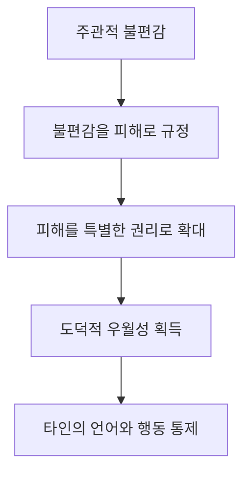
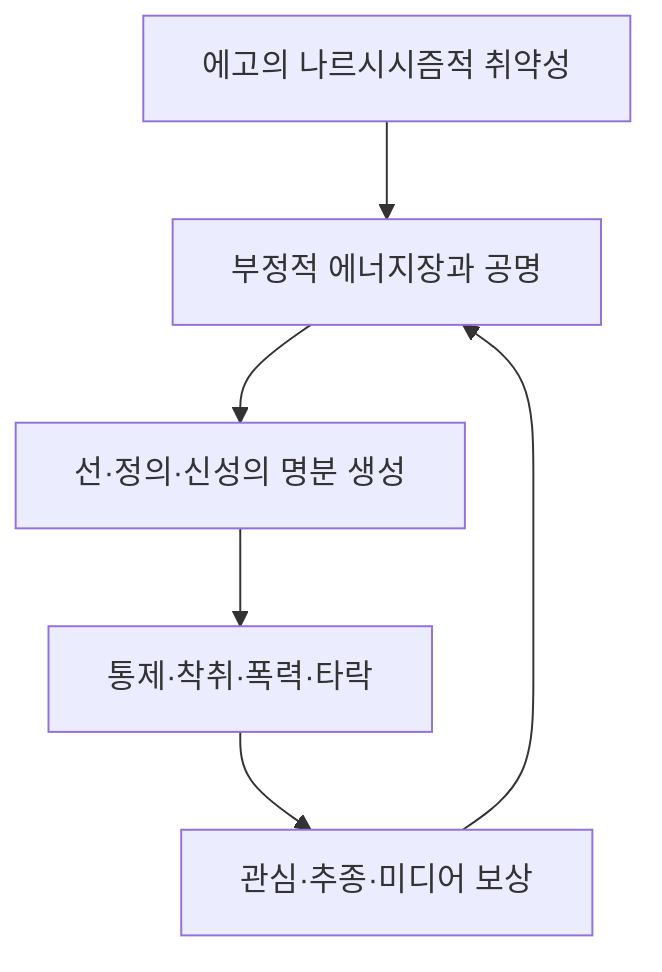
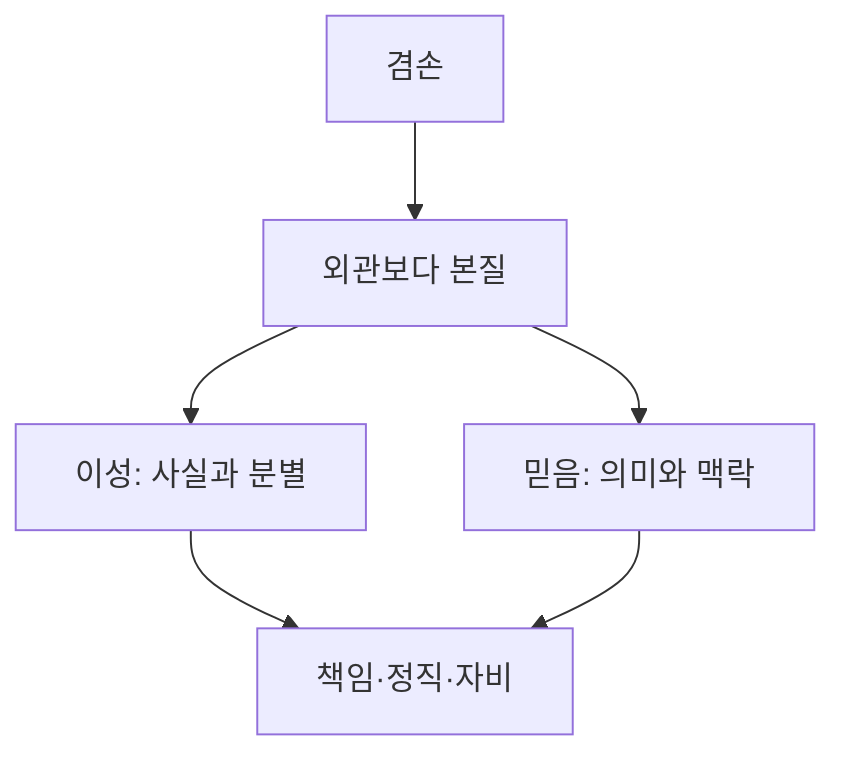

# 『현대인의 의식 지도』 제17장 「도덕, 이성 그리고 믿음」||「들어가며」·「신성을 대체한 나르시시즘」·「실재를 대체한 감정」

## 핵심 뜻

이 발췌문의 중심 문제는 단순히 종교와 세속주의의 대립이 아닙니다. 호킨스 박사님께서는 인간과 사회가 무엇을 최종적인 판단 기준으로 삼는지를 묻고 계십니다.

본래의 질서는 다음과 같습니다.

| 영역 | 본래 역할 |
|---|---|
| 신성과 계시 | 삶과 진실의 궁극적 맥락을 밝힘 |
| 이성 | 사실·논리·인과·현실성을 판별함 |
| 도덕 | 진실을 책임 있는 행동과 관계로 구현함 |
| 감정 | 현실에 대한 주관적 반응과 신호로 기능함 |

그러나 이 질서가 뒤집히면 신성의 자리를 나르시시즘이 차지하고, 이성은 감정을 정당화하는 수사학으로 변하며, 도덕은 자기 집단의 우월성을 주장하는 수단이 됩니다. 마침내 “내가 불쾌하다”는 주관적 반응이 “그러므로 이것은 객관적으로 잘못되었다”라는 판결로 둔갑합니다.

따라서 세 소제목은 하나의 연속된 흐름입니다.

> 이성과 믿음의 통합 상실 → 신성보다 에고를 우선함 → 감정을 실재보다 우선함

---

## 1. 들어가며: 이성과 믿음은 왜 서로를 필요로 하는가

### 『신학대전』 730의 의미

호킨스 박사님께서 성 토마스 아퀴나스의 『신학대전』을 의식 수준 730으로 제시하신 까닭은, 이 저작이 단순히 논리적으로 정교한 신학 서적이기 때문만은 아닙니다. 이 책에는 이성의 엄밀성과 계시의 높은 맥락이 함께 들어 있기 때문입니다.

이성과 믿음은 동일한 일을 하는 두 능력이 아닙니다.

- 이성은 정의, 구분, 논증, 사실, 인과관계를 다룹니다.
- 믿음은 삶의 궁극적 의미와 신성한 실재에 대한 신뢰를 제공합니다.
- 계시는 영적 진리가 단순한 개념이 아니라 주관적으로 깨달아지는 통로입니다.
- 신학은 그 깨달음을 다른 사람이 이해할 수 있도록 개념과 언어로 표현합니다.

그러므로 신학은 영적 진리의 ‘내용’을 제공하고, 계시는 그 내용이 무엇을 뜻하는지를 밝혀 주는 ‘맥락’을 제공합니다.

### 선형적 내용과 비선형적 맥락

예를 들어 이성은 어떤 행동이 어떤 결과를 일으키는지 설명할 수 있습니다. 그러나 인간이 왜 선을 선택해야 하는지, 삶이 왜 신성한지, 사랑과 자비가 왜 존재의 본질에 가까운지는 이성적 계산만으로 완전히 도출하기 어렵습니다.

반대로 계시적 이해가 있더라도 이를 개념적으로 분별하고 정확히 표현할 이성이 부족하면, 그 이해는 개인적 감동이나 모호한 신비주의로 왜곡될 수 있습니다.

| 한쪽만 작동할 때 | 생길 수 있는 한계 |
|---|---|
| 이성만 있을 때 | 지적 분석은 가능하지만 궁극적 의미를 놓칠 수 있음 |
| 믿음만 주장할 때 | 맹신·주관적 확신·교리 왜곡과 구별하기 어려움 |
| 이성과 믿음이 결합할 때 | 영적 진리를 이해하고 분별하며 명료하게 표현할 수 있음 |

따라서 “이성만으로 충분하지 않다”는 말은 이성을 낮추는 주장이 아닙니다. 오히려 이성을 본래의 높은 위치에 놓되, 이성이 다룰 수 있는 영역과 그 한계를 정확히 아는 것이 참다운 이성이라는 뜻입니다.

### 오늘날의 위기는 믿음뿐 아니라 이성의 위기다

과거에는 종교적 믿음이 주로 공격받았다면, 현대에는 사실을 판별하는 이성 자체가 훼손되었다고 박사님께서는 진단하십니다. 검증된 사실과 단순한 주장, 논증과 선동, 진실과 표현의 자유가 서로 다른 범주임에도 동일한 것으로 취급된다는 것입니다.

발췌문에 등장하는 의식 수준 170의 판결은 이 문제를 상징합니다. 표현할 자유가 있다는 사실과 그 표현이 진실이라는 것은 별개의 문제입니다. 그러나 두 가지를 혼동하면 다음과 같은 역전이 일어납니다.

- 누구나 주장할 수 있다.
- 따라서 모든 주장은 동등하게 존중받아야 한다.
- 그러므로 입증된 사실도 하나의 의견일 뿐이다.
- 결국 거짓도 진실과 같은 지위를 요구한다.

170은 지적 능력이 없다는 뜻이 아닙니다. 논리처럼 보이는 정교한 논변을 만들 수 있지만, 그 지성이 진실보다 이익·허영·이념에 종속되어 있다는 뜻입니다. 호킨스 박사님의 체계에서 200은 바로 이러한 차이를 가르는 온전성의 경계입니다.

---

## 2. 신성을 대체한 나르시시즘

### ‘대체’란 무엇인가

신성은 개인과 집단을 넘어서는 기준입니다. 인간은 신성 앞에서 자신의 욕망과 판단이 절대적이지 않음을 인정합니다. 반면 나르시시즘은 자기 감정과 욕구를 최종 기준으로 삼습니다.

신성이 중심일 때 인간은 다음과 같이 묻습니다.

> 무엇이 진실한가? 무엇이 선한가? 전체에 무엇이 이로운가?

나르시시즘이 중심일 때 질문은 다음처럼 바뀝니다.

> 이것이 나를 불편하게 하는가? 내 집단의 요구를 인정하는가? 내가 도덕적으로 우월해 보이는가?

겉으로는 인권·배려·관용·현대화처럼 고상한 언어를 사용할 수 있습니다. 그러나 그 내적 동기가 진실과 공동선이 아니라 특별함, 인정 욕구, 지배력이라면 중심에는 신성이 아니라 에고가 놓여 있습니다.

### 종교의 세속화가 의미하는 것

호킨스 박사님께서 비판하시는 것은 종교가 새로운 시대의 언어를 사용하는 것 자체가 아닙니다. 종교가 사회적 인정을 얻기 위해 자신의 핵심 교리와 신성의 우선권을 정치 이데올로기에 내어주는 현상입니다.

교회의 외형과 종교적 명칭은 그대로 남아 있더라도,

- 계시보다 시대의 유행이 우선되고,
- 신성보다 사회적 평판이 우선되며,
- 교리보다 특정 집단의 감정이 우선된다면,

그 종교의 중심축은 이미 바뀐 것입니다. 형식은 종교이지만 실제 권위는 집단적 에고가 행사하게 됩니다.

### B.C./A.D. 표기 사례가 말하는 것

이 사례에서 핵심은 표기법 자체보다 명칭을 바꾸어도 그 명칭이 가리키는 역사적 기준은 달라지지 않는다는 점입니다. ‘2008년’을 다른 이름으로 부르더라도 그 연대 계산의 기준은 그대로 남아 있습니다.

박사님께서는 이를 통해 외관을 바꾸는 언어적 조치가 본질을 바꾼 것처럼 취급되는 현상을 지적하십니다. 이는 앞 장들에서 반복된 ‘본질과 외관’, ‘실재와 지각’의 구분과 연결됩니다.

### ‘민감함’이 통제 수단으로 바뀌는 과정

진실한 배려는 타인의 처지를 이해하면서도 사실, 책임, 비례, 공동의 안전을 함께 고려합니다. 그러나 나르시시즘적 감수성은 특정한 불편감을 절대화하여 다른 모든 사람에게 복종을 요구합니다.

이때 ‘민감하다’와 ‘무신경하다’는 말은 사물을 설명하는 형용사가 아니라 상대를 칭찬하거나 처벌하는 언어가 됩니다. 상대가 사실을 제시하더라도 “당신은 무신경하다”라고 규정하는 순간 논의가 끝나 버립니다. 감정적 비난이 현실 검증을 대신하기 때문입니다.

### 진실한 배려와 나르시시즘적 감수성의 차이

| 진실한 배려 | 나르시시즘적 감수성 |
|---|---|
| 사실과 전체 맥락을 고려함 | 특정 감정만을 절대화함 |
| 자신과 타인에게 동일한 기준을 적용함 | 자기 집단에만 예외적 기준을 요구함 |
| 비례와 현실성을 존중함 | 작은 불편도 절대적 피해로 확대함 |
| 책임을 함께 받아들임 | 책임을 외부에 전가함 |
| 협력을 이끌어 냄 | 죄책감과 비난으로 통제함 |

그러므로 박사님의 비판은 친절이나 배려 자체를 겨냥한 것이 아닙니다. 배려의 언어를 빌려 에고의 요구를 사회 전체에 강요하는 역전을 밝히는 것입니다.

### 반동 형성

반동 형성은 자신의 내면에 있는 성향을 인정하지 못하고, 그와 정반대되는 태도를 과장되게 내세우는 방어 기제입니다.

가령 실제로는 타인의 감정과 처지에 무관심하면서도 자신을 ‘가장 배려 깊은 사람’으로 내세울 수 있습니다. 이 경우 배려는 자연스러운 친절이 아니라 자신의 숨은 무신경함을 가리는 도덕적 가면이 됩니다.

그 결과는 역설적입니다.

- 타인의 감정을 보호한다고 주장하면서 다른 사람들의 감정은 무시합니다.
- 관용을 주장하면서 자신과 다른 견해에는 관용을 허용하지 않습니다.
- 자유를 주장하면서 타인의 표현을 통제합니다.
- 평화를 주장하면서 위협과 강압을 정당화합니다.

‘양의 탈’이라는 호킨스 박사님의 설명과 직접 연결되는 구조입니다. 외관은 선하지만 그 동력은 통제와 자기 이익입니다.

### 다수와 소수의 문제를 넘어

본문의 1퍼센트와 99퍼센트 사례는 다수가 진실을 결정한다는 뜻이 아닙니다. 진실은 투표수로 정해지지 않습니다. 박사님께서는 특정 소수의 감정만 중요하고 나머지 사람들의 부담과 안전은 중요하지 않은 것처럼 취급되는 비대칭을 드러내십니다.

핵심 기준은 인원수가 아니라 다음과 같습니다.

- 사실에 부합하는가
- 전체 상황에 비례하는가
- 사회의 생존과 기능을 보존하는가
- 누구에게나 동일하게 적용할 수 있는가
- 에고의 이득보다 진실을 우선하는가

---

## 3. 실재를 대체한 감정

### 감정과 실재를 혼동하는 방식

감정은 어떤 일을 경험하는 주관적 방식이지, 그 사건의 객관적 성질을 자동으로 증명하지는 않습니다.

- 두렵다고 해서 반드시 위험한 것은 아닙니다.
- 불쾌하다고 해서 반드시 부당한 것은 아닙니다.
- 화가 난다고 해서 공격할 권리가 생기지는 않습니다.
- 모욕감을 느꼈다고 해서 상대가 실제로 모욕할 의도를 가졌다고 단정할 수는 없습니다.
- 확신이 강하다고 해서 그 믿음이 진실해지는 것도 아닙니다.

의식 수준 200 이하에서는 이 구분이 흐려집니다. 에고는 “내가 이렇게 느낀다”를 “실재가 실제로 이렇다”로 바꿉니다. 감정이 증거이자 판결이 되고, 이성은 이미 내려진 감정적 결론을 합리화하는 변호사가 됩니다.

### 성숙이란 감정을 제거하는 것이 아니다

호킨스 박사님께서 말씀하시는 성숙은 감정을 억압하거나 냉정한 사람이 되는 것이 아닙니다. 감정을 인정하되 감정과 사실을 구별하고, 자신의 반응에 책임지는 능력입니다.

어린아이의 정신에서는 다음 세 가지가 거의 하나입니다.

> 내가 원하는 것 = 좋은 것 = 마땅히 주어져야 하는 것

성숙한 정신에서는 세 가지가 분리됩니다.

> 내가 원하는 것 / 실제로 가능한 것 / 전체에 이로운 것

이 구분이 생기면 기분이 나쁘더라도 진실을 받아들일 수 있고, 기분이 좋더라도 해로운 선택을 거절할 수 있습니다. 감정이 사라지는 것이 아니라 현실과 조화를 이루도록 재배치됩니다.

### 의식 수준에 따른 변화

| 의식 수준 | 감정·이성·진실의 관계 |
|---|---|
| 200 이하 | 감정과 이익이 사실 판단을 지배하며 반대 증거를 합리화함 |
| 200 | 온전성과 용기가 등장하여 불편하더라도 사실을 인정하기 시작함 |
| 300대 | 책임감·협력·현실성·기능성이 강화됨 |
| 400대 | 논리·정의·증거·인과관계가 감정보다 우선함 |
| 500대 | 사랑이 이성을 배척하지 않고 더 넓은 맥락 안에 포함함 |
| 600 이상 | 주체와 객체의 분리를 넘어선 비선형적 실재가 직접적으로 깨달아짐 |
| 『신학대전』 730 | 높은 계시적 맥락과 정교한 이성이 통합된 장을 나타냄 |

여기서 의식 수준은 사람에게 붙는 영구적인 신분표가 아닙니다. 현실을 해석할 때 어느 원리가 지배적인지를 나타냅니다. 같은 사람도 어떤 문제에서는 사실과 책임을 따르면서, 다른 문제에서는 욕망이나 분노에 휘둘릴 수 있습니다.

### 400대의 이성과 500대의 사랑

400대에서는 감정보다 논리와 진실이 우선합니다. 그러나 이것이 최종 단계는 아닙니다. 이성은 사실을 정확히 분류하지만, 전체 존재의 신성함과 사랑을 그 자체로 만들어 내지는 못합니다.

500대의 사랑은 흔히 말하는 감상적 기분과 다릅니다. 박사님의 가르침에서 사랑은 특정 대상에 대한 일시적 감정이 아니라 존재를 포괄하는 방식입니다. 그러므로 높은 사랑은 이성을 파괴하지 않습니다. 오히려 이성을 더 넓고 자비로운 맥락 안에 위치시킵니다.

이것이 아퀴나스의 통합과도 연결됩니다.

- 이성은 믿음을 미신에서 보호합니다.
- 믿음은 이성을 환원주의에서 보호합니다.
- 사랑은 이성과 믿음이 삶 속에서 하나가 되게 합니다.

### 감정이 ‘권리’로 변하는 과정

본문에서 문제 삼는 것은 권리 자체가 아니라, 충족되지 않은 욕망이 자동으로 권리로 격상되는 과정입니다.

1. 에고가 어떤 욕구를 품습니다.
2. 욕구가 좌절되면 불쾌감과 분노가 생깁니다.
3. 에고는 그 감정을 피해의 증거로 해석합니다.
4. 피해자라는 위치를 도덕적 우월성으로 바꿉니다.
5. 자신의 요구를 권리라고 선언합니다.
6. 그 권리를 내세워 타인의 자유와 안전을 침해합니다.
7. 폭력조차 고귀한 목적을 위한 행동으로 합리화합니다.

이렇게 되면 도덕은 충동을 제한하는 기준이 아니라 충동에 면허를 부여하는 수단으로 변합니다. 폭력적인 행동도 “우리의 감정이 상했다”, “우리는 억압받았다”, “우리의 목적은 정의롭다”는 말로 정당화될 수 있습니다.

### 나르시시즘은 특정 이념의 전유물이 아니다

본문에는 여러 정치적·종교적 사례가 등장하지만, 박사님께서 밝히시는 에고의 구조는 특정 집단에만 한정되지 않습니다. 나르시시즘은 필요에 따라 종교, 무신론, 민족, 인종, 성별, 정치 이념, 정의, 자유, 평화 등 어느 명분의 옷도 입을 수 있습니다.

내용은 계속 바뀌지만 구조는 같습니다.

> 특별한 위치성 → 도덕적 우월성 → 반대자 비인간화 → 통제와 폭력의 합리화

그래서 나르시시즘은 인종주의를 비난하면서 또 다른 형태의 인종적 적대감을 만들고, 성차별을 비난하면서 반대 성별에 대한 증오를 정당화하며, 종교적 독단을 비난하면서 세속적 독단을 만들 수 있습니다. 에고는 명분의 내용보다 그 명분이 제공하는 특별함과 권력에 매료됩니다.

---

## 4. 핵심 개념 구분

### 믿음과 맹신

이 발췌문에서 믿음은 근거 없이 무엇이든 믿는 태도가 아닙니다. 계시와 영적 진리에 대한 신뢰이며, 이성과 모순되는 것이 아니라 이성이 보지 못하는 더 큰 맥락을 열어 줍니다.

강렬한 감정, 개인적 환상, 특별한 존재라는 확신을 계시와 동일시해서는 안 됩니다. 참다운 계시는 겸손, 보편성, 사랑, 책임을 강화합니다. 에고의 특별함과 지배 욕구를 강화한다면 계시가 아니라 나르시시즘의 개입을 의심해야 합니다.

### 이성과 합리화

이성은 결론을 사실과 논리에서 도출합니다. 합리화는 먼저 원하는 결론을 정한 뒤 그 결론을 그럴듯하게 꾸밀 근거를 모읍니다.

| 이성 | 합리화 |
|---|---|
| 증거가 결론을 결정함 | 욕망이 결론을 결정함 |
| 반대 증거를 검토함 | 반대 증거를 무시함 |
| 오류를 수정할 수 있음 | 자기 이미지를 지키려 함 |
| 진실을 목적으로 함 | 이득과 정당화를 목적으로 함 |

### 도덕성과 도덕적 우월성

참다운 도덕성은 자기 책임, 정직, 청렴, 의무, 친절, 배려로 나타납니다. 자신이 얼마나 도덕적인지 과시할 필요가 없습니다.

도덕적 우월성은 도덕을 에고의 장식으로 사용합니다. 타자를 비난함으로써 자신이 더 선하고 특별하다는 느낌을 얻습니다. 전자는 자신을 바로잡지만, 후자는 세상을 바로잡겠다는 명분으로 타자를 통제합니다.

### 감정과 감정의 절대화

감정은 인간성의 자연스러운 일부이며 중요한 정보입니다. 그러나 감정은 조사를 시작하게 하는 신호이지, 조사의 최종 결론은 아닙니다.

박사님께서 경계하시는 것은 감정 자체가 아니라 다음과 같은 절대화입니다.

> “내 감정은 틀릴 수 없으며, 타인은 그 감정을 충족시킬 의무가 있다.”

이 명제가 받아들여지면 감정은 개인 내면의 상태를 넘어 사회적 통치 권력이 됩니다.

---

## 5. 책 전체 흐름에서의 위치

이 발췌문은 앞 장들의 핵심 개념을 사회·도덕 영역에서 종합합니다.

- ‘선형적 내용과 비선형적 맥락’의 구분은 이성과 계시의 관계로 이어집니다.
- ‘낮은 정신과 높은 정신’의 구분은 감정적 수사와 진실한 이성의 차이로 나타납니다.
- 의식 수준 200의 경계는 감정보다 온전성과 현실 검증을 선택하는 전환점이 됩니다.
- 참다운 권위와 거짓 권위의 구분은 도덕성과 도덕적 우월성의 차이로 구체화됩니다.
- ‘양의 탈’이라는 주제는 배려·관용·정의의 외관을 쓴 나르시시즘으로 확장됩니다.

또한 「신성을 대체한 나르시시즘」은 다음 제18장 「나르시시즘: 에고 숭배」를 예고합니다. 제17장이 신성·이성·도덕의 질서가 무너지는 과정을 보여 준다면, 제18장은 그 빈자리를 차지한 에고가 어떻게 도덕적 권위를 갈망하는지 본격적으로 해부합니다.

장 후반부의 「참다운 도덕성」과 「이성과 믿음: 화해」에서 제시되는 귀결도 이미 이 발췌문 안에 암시되어 있습니다. 해법의 중심은 새로운 이념이 아니라 겸손입니다. 겸손은 자신의 감정과 견해를 우주의 최종 기준으로 삼지 않으며, 신성과 진실이 자신보다 우선함을 인정하게 합니다.

## 통합적 결론

이 발췌문 전체를 관통하는 질문은 하나입니다.

> 삶에서 최종적인 권위를 갖는 것은 신성과 진실인가, 아니면 에고의 감정인가?

질서가 온전할 때 계시는 궁극적 맥락을 열고, 이성은 내용을 분별하며, 도덕은 이를 책임 있는 삶으로 구현하고, 감정은 그 질서와 조화를 이룹니다.

반대로 질서가 뒤집히면 에고의 불편감이 절대적 권위를 얻고, 이성은 그 감정을 변호하는 수사학이 되며, 도덕은 타자를 통제하기 위한 우월성으로 변합니다. 신성을 없앤 자리에 객관적 자유가 생기는 것이 아니라, 수많은 에고가 각자의 감정을 절대화하며 경쟁하는 세계가 생기는 것입니다.

호킨스 박사님께서 밝히시는 참다운 통합은 다음과 같이 압축할 수 있습니다.

> **믿음은 이성에 의미를 주고, 이성은 믿음에 명료함을 주며, 겸손은 두 능력이 나르시시즘에 이용되지 않도록 지켜 줍니다.**

---

# 『현대인의 의식 지도』 제17장 「도덕, 이성 그리고 믿음」||「전통적 지침」·「안전장치와 방어」

## 전체 핵심

이 두 소제목은 제17장의 결론에 해당합니다. 호킨스 박사님께서 밝히시는 중심 내용은 다음과 같습니다.

영적 위험은 대개 노골적으로 악한 모습으로 다가오지 않습니다. 오히려 선·정의·해방·종교·신의 뜻이라는 이름을 빌려 거짓을 진실로 뒤바꿀 때 가장 위험해집니다. 루시퍼적 에너지는 이러한 뒤바꿈을 정당화하는 논리와 권위를 제공하고, 사탄적 에너지는 그 허위의 정당성을 이용하여 사랑·순수·생명을 파괴합니다.

이에 대한 보호는 공포나 증오가 아니라 분별입니다. 에고가 외관과 본질을 스스로 구별하지 못한다는 사실을 겸손하게 인정하고, 가르침·지도자·운동이 내세우는 이름이 아니라 그것의 실제 진실 수준을 확인해야 한다는 것이 결론입니다.

---

## 1. 제17장 전체에서 이 부분이 차지하는 위치

제17장은 성 토마스 아퀴나스가 제시한 ‘이성과 믿음의 통합’에서 출발했습니다. 이성은 내용을 분석하지만 계시는 그 내용이 놓인 비선형적 맥락을 밝혀 줍니다. 둘 중 하나만으로는 온전한 영적 이해에 도달하기 어렵습니다.

이후 논의는 다음과 같이 전개됩니다.

1. 신성을 나르시시즘이 대체합니다.
2. 객관적 실재를 주관적 감정이 대체합니다.
3. 감정과 욕망이 도덕적 명분을 차지하면서 진실과 거짓이 뒤바뀝니다.
4. 전통 종교가 이를 루시퍼적·사탄적 에너지라고 불러 왔음을 설명합니다.
5. 의식 연구가 외관을 넘어 본질을 확인하는 보호 장치로 제시됩니다.

따라서 「전통적 지침」은 갑자기 악마론을 꺼내는 대목이 아닙니다. 앞에서 분석한 나르시시즘, 감정의 절대화, 이성의 훼손이 궁극적으로 어떤 에너지장과 연결되는지를 밝히는 부분입니다. 「안전장치와 방어」는 그 위험에서 벗어날 분별 수단을 제시하며 장 전체를 마무리합니다.

---

## 2. 루시퍼적 에너지와 사탄적 에너지

호킨스 박사님의 체계에서는 두 에너지가 서로 밀접하게 연결되지만 기능은 다릅니다.

| 구분 | 루시퍼적 에너지 | 사탄적 에너지 |
|---|---|---|
| 중심 충동 | 힘과 통제력을 자기 것으로 차지하려는 오만 | 순수·사랑·생명을 파괴하려는 충동 |
| 주된 방식 | 진실 왜곡, 선악 역전, 합리화, 신적 권위 참칭 | 잔혹성, 성적 착취, 사디즘, 폭력, 전쟁, 파괴 |
| 사용하는 가면 | 선, 정의, 해방, 진보, 종교, 신의 뜻 | 루시퍼적으로 정당화된 처벌과 폭력 |
| 작동 순서 | 파괴를 정당화하는 명분을 만듦 | 그 명분을 이용하여 파괴를 현실화함 |
| 에고의 착오 | “힘의 근원은 나다.” | “내가 원하는 파괴는 정당하다.” |

간단히 말하면 루시퍼적 에너지가 파괴를 허가하는 ‘머리’라면, 사탄적 에너지는 그것을 집행하는 ‘손’입니다. 프로젝트의 『진실 대 거짓』에서도 호킨스 박사님께서는 루시퍼적 진실 왜곡이 먼저 문을 열고, 그 뒤로 사탄적 잔혹성이 들어온다고 설명하십니다.

### 여기서 ‘힘’은 Power가 아닙니다

본문에서 루시퍼적 에너지가 추구하는 ‘힘’은 호킨스 박사님께서 말씀하시는 참된 힘, 곧 **Power**가 아니라 강제력인 **Force**에 가깝습니다.

- Power는 진실과 신성에서 자연스럽게 흘러나옵니다.
- Force는 타인을 지배하고 조종함으로써 자신을 유지해야 합니다.
- Power는 자기 소유라고 주장할 필요가 없습니다.
- Force는 끊임없이 “내 권위”, “내 추종자”, “내 영향력”을 확인하려 합니다.

『신의 현존의 발견』에서 묘사된 ‘루시퍼의 유혹’도 바로 타인에 대한 힘을 자기 것으로 주장하라는 유혹입니다. 호킨스 박사님께서는 모든 Power의 근원이 궁극적 실재이므로, 에고가 그것을 소유한다고 주장하는 순간 이미 진실이 왜곡된다고 밝히십니다.

---

## 3. 부정적 에너지장과 인간 에고의 결합

호킨스 박사님께서는 악을 단순한 심리적 비유로 축소하지 않으시지만, 반대로 외부의 악마가 사람을 일방적으로 조종하는 이야기로만 설명하지도 않으십니다. 부정적 에너지장과 인간 에고의 취약성이 서로 공명한다고 보십니다.

핵심 취약성은 나르시시즘입니다. 에고는 자신을 특별한 존재, 진실의 소유자, 남을 심판할 자격이 있는 존재로 느끼고 싶어 합니다. 부정적 장은 바로 이 욕망을 이용합니다.

그 결과 처음에는 작은 자기만족에 불과했던 것이 다음과 같이 커집니다.

- 자신이 옳다는 확신
- 자신만이 진실을 안다는 우월감
- 타인을 교정하고 통제할 권리가 있다는 믿음
- 저항하는 사람을 악으로 규정하는 태도
- 폭력과 착취까지 정당화하는 단계

미디어와 추종자는 이 구조를 더욱 강화합니다. 관심과 찬양이 커질수록 지도자는 자신의 지위가 신성의 은총이나 가르침의 장에서 나온 것이 아니라, 자기 개인의 위대함에서 나온 것이라고 오인하기 쉬워집니다.

---

## 4. 왜 여러 종교의 추락 사례가 함께 등장하는가

본문에 기독교, 이슬람, 가톨릭교회, 타락한 구루가 차례로 등장하는 이유는 특정 종교만을 지목하기 위해서가 아닙니다. 호킨스 박사님께서는 어느 종교·기관·지도자도 에고의 유혹에서 자동으로 면제되지 않는다는 원칙을 보여 주십니다.

### 기독교의 하락

니케아 공의회 당시 900 이상이었던 기독교가 이후 400대로 내려갔다는 것은 기독교 전체가 거짓이 되었다는 뜻이 아닙니다. 400대는 여전히 이성·학문·진실의 영역입니다. 다만 초기의 고도로 신성한 계시적 장이 점차 교리·신학·제도라는 지성적 수준으로 내려왔다는 뜻입니다.

요한묵시록이 빠진 신약성경이 800으로 측정되고, 요한묵시록이 70으로 측정된다는 사례는 하나의 저수준 내용이 전체 종교의 정서와 세계관에 큰 영향을 줄 수 있음을 보여 줍니다. 신성한 전승이라는 외형이 개별 내용의 진실 수준을 자동으로 보증하지는 않습니다.

### 무함마드의 700에서 130으로의 하락

무함마드가 『쿠란』을 구술할 당시 700이었으나 이후 130으로 내려갔다는 설명은 의식 수준이 사람에게 영구히 부착된 계급이 아님을 극명하게 보여 줍니다.

여기서 결정적인 변화는 다음과 같습니다.

- 신의 전령이라는 역할에서 세속적 통치자의 역할로 이동함
- 계시의 전달에서 전쟁을 통한 권력 획득으로 이동함
- 신에 대한 숭배가 전령 개인에 대한 숭배로 바뀜
- Power의 근원을 신성이 아니라 지도자 개인에게 돌림

따라서 이 사례의 중심은 종교적 명칭이 아니라 **신성과의 정렬이 세속적 권력으로 대체되는 과정**입니다.

### 가톨릭교회와 타락한 구루

가톨릭 성직자의 성범죄와 타락한 구루의 사례는 성직·교단·높은 가르침·수많은 추종자가 지도자의 남아 있는 에고를 제거해 주지 않는다는 사실을 보여 줍니다.

특히 타락한 구루들은 처음부터 전부 거짓이었던 사람들이 아니라, 실제로 500대 중반에서 700대까지 도달했던 인물들로 묘사됩니다. 문제는 그들이 받은 영적 영향력과 사회적 권위를 에고가 자기 소유로 주장하기 시작한 데 있습니다.

진행 과정은 대체로 이렇습니다.

> 높은 가르침과의 정렬 → 영향력 증가 → 영향력을 ‘나의 힘’으로 오인 → 지위·돈·성적 매력·추종자에 도취 → 통제와 착취

바로 여기에서 루시퍼적 유혹이 사탄적 결과로 넘어갑니다.

---

## 5. 영적 고양은 유혹의 부재를 뜻하지 않는다

성 아우구스티누스, 붓다, 예수 그리스도의 사례는 영적 위대함에도 불구하고 어려움과 유혹이 나타날 수 있음을 보여 줍니다. 다만 유혹을 경험하는 것과 유혹에 자신을 동일시하는 것은 전혀 다릅니다.

- 붓다께서 마라의 공격을 받으신 것은 영적 실패가 아닙니다.
- 예수 그리스도께서 겟세마네에서 극심한 고통을 겪으신 것도 추락을 뜻하지 않습니다.
- 유혹이 나타나는 것 자체보다 그것을 자기 의지로 받아들이고 행동으로 옮기는지가 중요합니다.

높은 의식 수준에 이르면 유혹이 단순히 사라지는 것이 아니라 더욱 미묘해질 수 있습니다. 낮은 단계에서는 돈과 감각적 쾌락이 유혹이라면, 높은 단계에서는 “나는 특별히 선택받았다”, “나는 일반적 도덕을 초월했다”, “내가 하는 일은 모두 신의 뜻이다”라는 영적 오만이 훨씬 위험해집니다.

죄책감과 영적 오만도 겉으로는 정반대지만 모두 에고를 중심에 놓습니다.

- 죄책감은 “나는 특별히 나쁘다”에 집착합니다.
- 영적 오만은 “나는 특별히 높다”에 집착합니다.

두 경우 모두 관심의 중심이 신성과 진실이 아니라 ‘나’에게 머뭅니다.

---

## 6. 현대 미디어는 부정적 장을 어떻게 증폭시키는가

미디어는 부정적 에너지를 처음 만들어 낸다기보다 이미 존재하는 성향을 증폭하고 연결합니다. 본문에서 인터넷 블로깅과 증오 사이트가 언급된 이유도 모든 블로그나 인터넷이 악하다는 뜻이 아닙니다. 증오가 정보를 수집하고 유통하며 동조자를 모으는 데 적합한 네트워크 구조가 생겼다는 뜻입니다.

미디어 증폭에는 세 가지 효과가 있습니다.

1. **반복 효과**  
   같은 주장을 계속 접하면 친숙함이 진실처럼 느껴집니다.

2. **사회적 확인 효과**  
   많은 사람이 동조한다는 사실이 그 주장의 진실성을 보증하는 것처럼 보입니다.

3. **나르시시즘적 보상**  
   주목, 조회, 명성, 추종자의 찬양이 분노와 증오를 계속 표출하도록 보상합니다.

이 때문에 부정적 경향은 자기 강화적입니다. 증오를 표출할수록 관심을 받고, 관심을 받을수록 자신의 증오가 중요하고 정의롭다고 확신하게 됩니다.

---

## 7. 증오의 인과관계가 역전되어 있다는 뜻

이 대목에서 가장 중요한 통찰은 “사건이 증오를 만들었다”는 통상적 설명을 뒤집는 데 있습니다.

| 표면적으로 보이는 순서 | 호킨스 박사님께서 밝히시는 순서 |
|---|---|
| 불쾌한 사건이 발생함 | 증오에 매료된 성향이 먼저 존재함 |
| 사건 때문에 증오하게 됨 | 증오가 자신을 표현할 사건을 선택함 |
| 증오는 어쩔 수 없는 반응임 | 사건은 증오를 정당화하는 변명거리가 됨 |
| 책임은 전적으로 외부 대상에게 있음 | 증오에 대한 집착은 내부의 선택과 보상에 연결됨 |
| 사건이 해결되면 증오도 사라질 것임 | 증오의 장이 남아 있으면 새로운 표적을 찾을 수 있음 |

이는 외부 사건이 아무 의미가 없다는 뜻이 아닙니다. 사건은 분명 위험하거나 부당할 수 있습니다. 다만 그 사건을 인식하고 대응하는 데 증오가 반드시 필요한 것은 아닙니다.

### 2차 세계대전의 사례가 중요한 이유

호킨스 박사님께서는 적군과 실제로 싸우면서도 상대를 증오하지 않았던 군인들을 제시하십니다. 카미카제 조종사는 두려운 위협이었지만, 그렇다고 그 개인의 존재 자체를 증오해야 했던 것은 아닙니다. 상대의 용기와 인간성을 인정하면서도 공격을 막을 수 있었습니다.

여기서 다음 구별이 생깁니다.

- 위험 인식은 증오가 아닙니다.
- 방어는 사디즘이 아닙니다.
- 반대는 상대 존재의 악마화가 아닙니다.
- 연민은 현실 부정이나 무방비 상태가 아닙니다.
- 사랑은 파괴적 행동을 허용하는 감상주의가 아닙니다.

본문에서 의식 수준 200 이상인 사람들의 80퍼센트가 현대 이슬람을 위협적인 것으로 보았다는 2007년 측정도 같은 맥락입니다. 의식 수준이 높다는 것은 모든 위험을 선량하게만 해석한다는 뜻이 아닙니다. 오히려 감정적 부정이나 정치적 명분에 가려지지 않고 위험의 본질을 더 정확히 인식할 수 있다는 뜻입니다. 위험을 명확히 보면서도 증오에는 빠지지 않는 것이 분별입니다.

---

## 8. “증오하는 사람은 증오심 자체를 사랑한다”는 의미

여기서 ‘사랑한다’는 말은 진정한 사랑을 뜻하지 않습니다. 증오가 주는 흥분·확실성·우월감·정체성에 중독적으로 애착한다는 뜻입니다.

증오는 에고에게 여러 보상을 제공합니다.

- 자신은 옳고 상대는 악하다는 단순한 세계관
- 자신이 도덕적으로 우월하다는 만족
- 개인적 불만을 정의로운 분노로 포장할 기회
- 집단적 소속감과 동료의 인정
- 언론과 대중의 관심
- 피해자라는 지위를 이용한 도덕적 면책

이 때문에 증오의 표적은 표면적 대상일 뿐입니다. 더 근원적인 애착은 ‘증오하고 있는 나’가 느끼는 에너지와 중요성입니다. 전쟁은 증오를 품은 집단이 자신의 적개심을 애국·정의·희생이라는 이름으로 표현할 수 있는 거대한 무대가 됩니다.

특히 피해자 역할은 루시퍼적 역전과 결합하기 쉽습니다. 자신을 피해자로 규정하면 상대에게 가하는 잔혹함까지 정의로운 응징으로 바꿔 부를 수 있기 때문입니다.

---

## 9. ‘안전장치와 방어’에서 조종사 비유가 뜻하는 것

의식 수준 170의 조종사 비유는 영적 가르침의 선택이 단순한 취향 문제가 아니라는 뜻입니다. 170은 진실과 온전성의 임계점인 200에 미치지 못합니다. 겉으로 지식이 많고 매력적이며 카리스마가 있어도, 그 방향을 맡길 만한 진실성이 없다는 뜻입니다.

비행기에서는 조종사의 매력이나 언변보다 항공 능력과 신뢰성이 중요합니다. 마찬가지로 영적 경로에서는 다음과 같은 외관이 본질을 보증하지 않습니다.

- 거대한 교단
- 오래된 전통
- 화려한 의식
- 많은 추종자
- 신비한 체험
- 지도자의 카리스마
- 신성한 용어와 복장

호킨스 박사님께서 영적 안전을 육체적 생존보다 중요하게 보시는 이유는 잘못된 비행이 육체를 위험하게 한다면, 거짓 가르침은 영혼의 방향과 카르마적 귀결 자체에 영향을 주기 때문입니다.

---

## 10. 여기서 말하는 ‘무지’의 정확한 의미

무지는 단순히 지식이 부족하거나 교육을 받지 못했다는 뜻이 아닙니다. 지능이 낮거나 도덕적으로 악하다는 뜻도 아닙니다.

호킨스 박사님께서 말씀하시는 무지는 **인간 정신이 자신의 구조만으로는 외관과 본질을 확실하게 구별하지 못하는 선천적 한계**입니다.

정신은 보이는 것에 이름을 붙이고, 의미를 투사하고, 감정과 기억에 따라 해석합니다. 그러므로 다음과 같은 오류가 발생합니다.

- 좋은 이름을 가진 것을 실제로 선하다고 봅니다.
- 널리 믿는 것을 진실이라고 생각합니다.
- 감동적인 것을 영적으로 높다고 오인합니다.
- 논리적으로 세련된 합리화를 진실과 혼동합니다.
- 권위자가 말한 것을 본질 확인 없이 받아들입니다.

오히려 지능이 높을수록 이미 품고 있는 증오나 욕망을 더 정교하게 합리화할 수도 있습니다. 본문에서 저명한 교수와 미디어 인물이 언급되는 이유도 지식과 진실성이 자동으로 같은 것은 아니기 때문입니다.

---

## 11. 의식 측정이 제공하는 보호의 의미

의식 측정의 역할은 외관의 설득력을 통과하여 대상의 본질적 진실 수준을 확인하는 데 있습니다. 여기에는 개인적 호감, 종교적 소속, 학식, 사회적 명성이 기준이 되지 않습니다.

본문에서 순진한 어린아이도 가짜를 가짜로 드러낼 수 있다고 한 것은 어린아이의 직감이 언제나 옳다는 뜻이 아닙니다. 정해진 조건 아래에서 나타나는 비개인적 생리 반응은 피검자의 지식이나 의견에 의존하지 않는다는 뜻입니다.

“영적 속임수가 이제 불가능하다”는 표현도 세상에서 거짓말이 사라졌다는 의미가 아닙니다. 더 정확히 말하면 다음과 같습니다.

> 가짜가 더 이상 영원히 확인 불가능한 상태로 남아 있을 필요가 없어졌다는 뜻입니다.

사람들은 여전히 외관에 속을 수 있습니다. 그러나 호킨스 박사님의 설명에 따르면 이제는 본질을 확인할 방법이 있으므로, 거짓이 원칙적으로 검증을 피할 수는 없습니다.

의식 연구의 보호 기능은 “나는 절대로 속지 않는다”는 자신감에서 나오지 않습니다. 오히려 “인간 정신인 나는 외관에 속을 수 있다”는 겸손에서 시작됩니다. 그러므로 진정한 보호 장치는 의심과 편집증이 아니라 겸손과 비개인적 확인입니다.

---

## 12. 본문의 의식 수준을 한눈에 연결하면

| 본문의 측정 대상 | 의식 수준 | 이 대목에서 보여 주는 의미 |
|---|---:|---|
| 니케아 공의회 당시 기독교 | 900 이상 | 고도로 신성한 계시의 장 |
| 요한묵시록 제외 신약성경 | 800 | 매우 높은 영적 진실 |
| 『쿠란』 구술 당시 무함마드 | 700 | 높은 영적 상태도 이후 선택에 따라 달라질 수 있음 |
| 이후 기독교 | 400대 | 거짓은 아니지만 계시적 신성에서 이성·교리 중심으로 하락 |
| 샤리아 | 190 | 200 직하의 설득력 있는 비진실성 |
| 비유 속 조종사 | 170 | 영적 방향을 맡기기에는 온전성의 임계점에 미달 |
| 추락 이후 무함마드 | 130 | 계시에서 세속적 권력 욕망으로의 이동 |
| 사이드 쿠틉 | 75 | 심각하게 수축된 부정적 장 |
| 요한묵시록·이슬람 묵시 예언 | 70 | 공포와 파괴적 종말론의 장 |
| 이슬람 승리주의 | 50 | 지배와 파괴 쪽으로 크게 하락한 장 |
| 지하드·와하비즘 | 30 | 극도로 파괴적인 강제력 |
| 와하비즘 창시자 | 20 | 의식 척도의 최저부에 가까운 장 |

여기서 수치는 사람의 영원한 계급을 표시하지 않습니다. 특정 인물의 특정 시기, 특정 교리, 문헌, 운동이 현실을 해석하고 생명에 영향을 미치는 방식의 진실 수준을 나타냅니다. 무함마드의 700에서 130으로의 변화와 타락한 구루의 사례가 바로 의식 수준을 고정된 신분으로 이해해서는 안 된다는 사실을 보여 줍니다.

또한 400대로 내려갔다는 것과 200 아래로 추락했다는 것은 의미가 다릅니다. 400대는 여전히 진실과 이성의 영역이지만, 200 아래에서는 힘이 강제력과 왜곡으로 바뀌며 점차 파괴성이 강해집니다.

---

## 13. 이 대목에서 가장 깊은 의미

### 첫째, 가장 위험한 악은 선을 가장합니다

노골적인 폭력은 알아보기 쉽습니다. 진정으로 위험한 것은 폭력에 선·정의·신성의 이름을 붙여 주는 논리입니다. 그래서 호킨스 박사님께서는 사탄적 파괴보다 먼저 루시퍼적 진실 왜곡을 경고하십니다.

### 둘째, 영적 높이는 자동적인 면책이 아닙니다

과거에 높은 수준이었던 지도자나 종교가 현재도 반드시 같은 수준을 유지하는 것은 아닙니다. 영적 진화는 살아 있는 정렬이며, 과거의 명성이나 체험을 소유물처럼 보관하는 일이 아닙니다.

### 셋째, 위협을 분별하는 것과 증오하는 것은 다릅니다

진실은 위험을 축소하지 않습니다. 동시에 위험한 사람을 증오함으로써 자신도 동일한 부정적 장에 들어가지 않습니다. 분별은 명확하지만 적개심을 필요로 하지 않습니다.

### 넷째, 이 가르침은 타인을 낙인찍는 도구가 아닙니다

루시퍼적·사탄적이라는 말을 이용하여 자신이 싫어하는 사람을 마음대로 악으로 규정한다면, 자신이 진실의 독점자이자 심판자라고 주장하는 동일한 루시퍼적 구조에 빠지게 됩니다. 이 대목의 초점은 ‘악한 사람을 찾아내라’가 아니라, **진실을 왜곡하고 통제를 정당화하려는 에고의 성향을 분별하라**는 데 있습니다.

---

## 종합 해설

「전통적 지침」은 인류의 여러 종교가 오랫동안 악이라고 불러 온 것을 호킨스 박사님의 의식 연구 언어로 다시 설명합니다. 악은 단순히 무서운 초자연적 존재가 아니라, 거짓을 진실로 뒤바꾸고 그 거짓을 이용하여 사랑과 생명을 파괴하는 두 개의 결합된 에너지장입니다.

루시퍼적 장은 에고에게 “너는 특별하며 힘의 주인이다”라고 속삭입니다. 사탄적 장은 그 오만이 만들어 낸 명분을 이용하여 착취와 폭력을 실행합니다. 이 과정은 종교·정치·학계·미디어·영적 공동체 어디에서든 나타날 수 있으며, 특히 많은 사람에게 영향력을 행사하는 지도자의 남아 있는 에고를 통해 크게 증폭됩니다.

「안전장치와 방어」는 그 해법을 의식 연구에서 찾습니다. 인간 정신은 본질적으로 순진하며 외관에 쉽게 속습니다. 그러므로 안전은 개인의 영리함이나 강한 확신에서 나오지 않습니다. 믿음은 신성과의 정렬을 제공하고, 이성은 합리화와 인과관계의 역전을 밝혀내며, 의식 연구는 외관을 넘어 진실 수준을 확인합니다.

결국 제17장의 결론은 다음과 같습니다.

> 진실한 영적 분별은 신성을 향한 믿음, 감정에 압도되지 않는 이성, 에고의 한계를 인정하는 겸손이 하나로 결합될 때 가능해집니다. 가장 확실한 보호는 악을 증오하는 것이 아니라, 거짓이 선의 이름을 차지하는 순간을 알아보는 것입니다.

---

# 『현대인의 의식 지도』 제17장 「도덕, 이성 그리고 믿음」||「참다운 도덕성」·「이성과 믿음: 화해」

## 핵심 뜻

이 발췌문의 중심은 다음과 같습니다.

> 참다운 도덕성은 자신이 옳다는 사실을 과시하는 태도가 아니라, 겸손하게 본질을 알아보고 그에 합당한 책임을 지는 삶의 방식이다. 이성은 사실과 논리를 분별하고, 믿음은 그 사실의 의미와 영적 맥락을 밝혀 준다.

따라서 두 소제목은 분리된 논의가 아닙니다. 「참다운 도덕성」은 이성과 믿음이 한 인간의 성품과 삶 속에서 통합되었을 때 나타나는 결과이며, 「이성과 믿음: 화해」는 그러한 통합이 인식 차원에서 어떻게 가능한지를 설명합니다.

---

## 1. 장 전체에서 이 대목이 차지하는 위치

앞선 내용에서 호킨스 박사님께서는 이념과 이상주의가 에고의 욕구와 결합하면 ‘도덕적 우월성’으로 변질될 수 있음을 설명하셨습니다. 이 경우 도덕은 선을 위한 기준이 아니라 다음과 같은 심리적 무기가 됩니다.

- 자신을 특별하고 선한 존재로 높이는 수단
- 상대를 열등하거나 악한 사람으로 규정하는 수단
- 개인적·집단적 이익을 정당화하는 명분
- 분노와 공격성을 합법적으로 보이게 만드는 외관

「참다운 도덕성」은 바로 이것과 대조됩니다. 호킨스 박사님께서는 거창한 명분을 내세우는 사람보다 정직하고 책임감 있으며 조용히 타자를 돕는 사람이 도덕성의 본질에 더 가깝다고 보십니다.

## 2. 참다운 도덕성의 뿌리는 왜 겸손인가

여기서 겸손은 자신을 무가치하게 여기거나 능력을 숨기는 태도가 아닙니다. 에고가 만들어 낸 과장과 특별함을 걷어 내고, 자신과 상황을 실제 모습대로 보는 정확성에 가깝습니다.

| 겸손이 뜻하는 것 | 겸손이 뜻하지 않는 것 |
|---|---|
| 자신의 능력과 한계를 사실대로 인정함 | 자신을 비하함 |
| 타자의 가치와 필요를 함께 고려함 | 무조건 양보함 |
| 결과에 대한 자신의 책임을 받아들임 | 모든 잘못을 자신에게 돌림 |
| 진실을 개인적 체면보다 우선함 | 판단력이나 결단력을 포기함 |

“겸손을 통해 본질이 외관과 사회적으로 구성된 지각을 대체한다”는 문장은, 사람과 사건을 명성·이미지·집단적 평판으로 판단하지 않고 실제 동기와 성격, 결과를 본다는 뜻입니다.

겉으로는 정의롭고 자비로운 구호라도 그 밑에 증오, 통제욕, 이익 추구가 깔려 있을 수 있습니다. 반대로 화려한 구호가 없어도 정직, 의무, 배려, 책임감이 지속해서 나타난다면 그 사람의 성품 자체가 도덕성을 드러냅니다.

## 3. 도덕적 우월성과 참다운 도덕성

| 구분 | 도덕적 우월성 | 참다운 도덕성 |
|---|---|---|
| 중심 관심 | 내가 얼마나 옳은가 | 무엇이 참되고 선한가 |
| 타자와의 관계 | 상대를 낮춰 자신을 높임 | 상대의 복지와 존엄을 배려함 |
| 주된 동기 | 인정, 특별함, 통제, 에고의 이득 | 정직, 의무, 책임, 신에 대한 충실성 |
| 표현 방식 | 구호, 비난, 과시, 명분 | 친절, 신뢰성, 도움, 일관된 성품 |
| 보상 | 외부의 찬사와 지지 | 내면의 평화와 현실에 근거한 자존감 |
| 최종 방향 | 오만과 분열 | 겸손, 감사, 자비 |

참다운 도덕성은 자신이 도덕적이라는 사실을 끊임없이 알릴 필요가 없습니다. 도덕 자체가 목적이기 때문입니다. 선행을 통해 특별한 사람이 되려는 것이 아니라, 그것이 옳고 타자에게 유익하기 때문에 행합니다.

이 점에서 도덕성은 하나의 ‘입장’이라기보다 존재 방식입니다.

## 4. 내면적 행복과 ‘현실에 근거한 자존감’

호킨스 박사님께서는 참다운 도덕성의 결과가 내면적이라고 말씀하십니다. 여기서 행복과 자존감은 선한 행동을 하고 대가로 받는 보상이 아닙니다. 자신의 양심, 말, 행동, 영적 지향이 서로 어긋나지 않을 때 자연스럽게 나타나는 내적 일치입니다.

‘현실에 근거한 자존감’은 다음과 같이 이해할 수 있습니다.

- 타인의 칭찬에 따라 오르내리지 않습니다.
- 자신이 남보다 우월하다는 비교에 의존하지 않습니다.
- 실제로 책임을 다했다는 내적 확인에서 나옵니다.
- 잘못을 인정한다고 해서 무너지지 않습니다.
- 개선이 필요하다는 사실과 자신의 본질적 가치를 함께 받아들입니다.

반면 부풀려진 자존감은 실제 성품보다 자신에 관한 이미지에 의존합니다. 그래서 비판이나 실패를 견디기 어렵고, 자신을 지키기 위해 타자를 잘못된 존재로 만들어야 합니다.

## 5. 도덕성이 요구하는 힘

참다운 도덕성은 단순히 마음씨가 부드러운 상태가 아닙니다. 호킨스 박사님께서는 결단력, 자기 단련, 겸손, 불굴의 용기를 함께 제시하십니다.

이는 선한 의도만으로는 충분하지 않다는 뜻입니다. 감정이 흔들리고 손해가 예상되며 주변이 다른 방향으로 움직일 때에도 영적 원칙을 삶 전반에 적용하려면 내적 힘이 필요합니다.

따라서 자비와 용기는 반대되는 특성이 아닙니다.

- 자비는 타자의 본질적 가치를 알아봅니다.
- 용기는 거짓이나 해로운 행동에 동조하지 않습니다.
- 겸손은 개인적 분노를 진실로 오인하지 않게 합니다.
- 자기 단련은 순간의 감정보다 원칙을 우선하게 합니다.

참다운 도덕성이 조용하다고 해서 수동적인 것은 아닙니다. 필요한 경우 단호할 수 있지만, 그 단호함의 동기는 상대를 낮추는 쾌감이 아니라 책임입니다.

## 6. “삶이라는 선물을 가지고 무엇을 했는가”

신에게 설명할 수 있어야 한다는 인식은 공포에 기초한 감시 개념보다 훨씬 깊습니다. 삶이 개인의 소유물이라기보다 맡겨진 선물이라는 관점입니다.

이 관점에서는 다음과 같은 변화가 생깁니다.

- 능력은 특권만이 아니라 사용 책임을 동반합니다.
- 시간은 에고의 허영에 낭비할 수 없는 귀중한 자산이 됩니다.
- 아무도 보지 않는 행동도 중요해집니다.
- 사소해 보이는 선택도 성품과 영적 방향을 형성합니다.

마태오 복음의 “머리카락까지 다 세어 두셨다”는 말씀은 신의 앎에서 어떤 존재도 잊히거나 하찮게 취급되지 않는다는 뜻을 담고 있습니다. 호킨스 박사님께서 이 말씀을 의식 수준 1000으로 제시하신 것은 신성한 알아차림과 보살핌이 창조의 가장 세밀한 부분까지 미친다는 진실성을 가리킵니다.

## 7. 겸손에서 창조의 성스러움으로

참다운 도덕성의 최종 결과가 단순히 ‘착한 사람이 되는 것’에 머물지 않는다는 점이 중요합니다.

에고는 세상을 평가하여 우월한 것과 열등한 것, 자신에게 유리한 것과 불리한 것으로 나눕니다. 그러나 겸손·감사·자비가 깊어지면 판단과 이용의 시선이 약해지고, 존재 자체의 아름다움과 내재적 성스러움이 드러납니다.

즉 인식의 중심이 다음과 같이 이동합니다.

> “나는 얼마나 도덕적인가”  
> → “나는 맡겨진 책임에 얼마나 충실한가”  
> → “모든 생명과 창조에는 신성한 가치가 있다.”

참다운 도덕성은 타자를 심판하는 높은 자리를 제공하는 것이 아니라, 창조 앞에서 경외와 감사의 자리로 사람을 이끕니다.

“그 길은 곧고 좁다”는 말도 억압적이고 즐거움 없는 삶을 뜻하지 않습니다. 진실이라는 한 방향에서 벗어나게 만드는 에고의 수많은 유혹과 우회로를 피하라는 뜻입니다. 특히 도덕적 특별함과 허영은 영적인 것처럼 보이면서도 시간을 소모시키기 때문에 더욱 세심한 분별이 필요합니다.

---

# 8. 이성이 다루는 영역: 선형적 내용

호킨스 박사님의 체계에서 이성은 의식 수준 400대의 고도로 유익한 능력입니다. 이성은 다음 요소를 다룹니다.

- 명확한 정의
- 사실과 자료
- 전제와 결론
- 범주와 분류
- 논리적 일관성
- 검증 가능한 관계

이성의 장점은 개인이 원하는 결론에 맞춰 규칙을 바꿀 수 없다는 점입니다. 동일한 전제와 논리적 규칙을 바르게 적용하면 결론도 그에 맞게 나와야 합니다.

따라서 이성은 에고의 자의성을 제한합니다. “내가 그렇게 느낀다”거나 “우리 집단이 그렇게 믿는다”는 사실만으로 어떤 명제가 참이 되지는 않습니다.

## 9. ‘적합도’는 무엇인가

이 문맥의 ‘적합도’는 통계학적 적합도보다 ‘논리적 범주가 서로 맞는가’라는 뜻에 가깝습니다. 비교하거나 추론하는 대상들이 동일한 추상화 수준에 있어야 한다는 것입니다.

예를 들면 다음과 같습니다.

- 한 개인의 행동을 근거로 전체 집단의 본질을 단정하면 개별 사례와 집단 범주를 혼동합니다.
- 어떤 주장이 불쾌하다는 이유로 그 주장이 사실이 아니라고 하면 감정과 사실을 혼동합니다.
- 어떤 사람이 강제로 관철할 능력이 있다는 이유로 그 행동이 정당하다고 하면 물리적 능력과 도덕적 정당성을 혼동합니다.

새를 ‘깃털이 달린 포유류’라고 부를 수 없다는 사례도 같은 뜻입니다. 새와 포유류는 상위 분류 안에서 구별되는 서로 다른 범주입니다. 눈에 보이는 특징 하나를 붙인다고 분류의 본질을 바꿀 수는 없습니다.

## 10. 이성이 수사학으로 쇠퇴하는 과정

호킨스 박사님께서 이 문맥에서 말씀하시는 ‘수사학’은 모든 웅변이나 표현 기법을 뜻하지 않습니다. 개인적·집단적 이득을 위해 정의와 범주, 논리적 원칙을 의도적으로 비트는 설득 방식을 가리킵니다.

그 과정은 대체로 다음과 같습니다.

1. 먼저 원하는 결론이나 이익이 정해집니다.
2. 그 결론에 불리한 사실과 맥락은 제외됩니다.
3. 서로 다른 범주를 동일한 것처럼 묶습니다.
4. 감정적 표현으로 논리의 빈자리를 채웁니다.
5. 주장의 진실성보다 청중을 움직이는 효과가 우선됩니다.

이때 언어는 진실을 밝히는 수단이 아니라 반응을 조종하는 수단이 됩니다. 그래서 의식 수준 400대의 이성이 180의 수사학으로 내려갑니다.

여기서 지성의 결핍은 단순한 지능지수의 부족을 뜻하지 않습니다. 진실보다 에고의 이익을 우선함으로써 논리적 온전성을 유지하지 못하는 상태를 가리킵니다.

## 11. 이성의 위대함과 한계

호킨스 박사님께서는 이성을 부정하지 않으십니다. 오히려 이성은 사실 확인과 현실 검증에 꼭 필요한 고차원적 능력입니다. 다만 이성이 모든 진실을 포괄한다고 보지는 않으십니다.

이성이 잘 답하는 것은 다음과 같습니다.

- 무엇이 일어났는가
- 어떤 요소들이 존재하는가
- 어떤 논리적 관계가 있는가
- 전제에서 어떤 결론이 나오는가

그러나 완전한 의미를 알려면 다음 요소까지 보아야 합니다.

- 어떤 의도에서 비롯되었는가
- 어떤 상황과 시기에 일어났는가
- 전체 안에서 어떤 역할을 하는가
- 존재의 본질과 어떤 관계가 있는가
- 영적으로 어떤 중요성을 갖는가

따라서 사실은 의미의 재료이지만, 사실의 집합 자체가 완전한 의미는 아닙니다.

## 12. 내용·맥락·본질의 구분

| 층위 | 설명 | 간단한 예 |
|---|---|---|
| 내용 | 관찰 가능한 말, 행동, 사건, 자료 | 누군가 사과했다 |
| 맥락 | 의도, 동기, 상황, 시기, 관계 | 진심 어린 책임 인정인지 이미지 관리인지 |
| 본질 | 그 사건이 실제로 나타내는 내재적 성격 | 겸손인지 조종인지 |

겉으로 동일한 행동도 맥락과 본질에 따라 의미가 달라질 수 있습니다. 그렇다고 맥락이 “사람마다 진실이 다르다”는 상대주의를 뜻하는 것은 아닙니다. 오히려 맥락은 누락된 조건을 더 정확히 포함하여 진실을 온전하게 식별하기 위한 것입니다.

맥락은 사실을 지우지 않고, 사실이 전체 안에서 무엇을 뜻하는지를 밝혀 줍니다.

## 13. 의식 수준 200에서 달라지는 ‘힘’의 의미

본문의 “might make right”는 영문 원문상 **“might makes right”**, 즉 “강한 자가 곧 옳다” 또는 “힘이 곧 정의를 만든다”는 뜻입니다. 바로 다음 문장에서는 200 이상에서 힘이 절제와 책임을 뜻한다고 밝힙니다. [영문 원문 대조](https://dokumen.pub/reality-spirituality-and-modern-man-9781933391892.html)

따라서 핵심 대비는 다음과 같습니다.

| 200 이하의 해석 | 200 이상의 해석 |
|---|---|
| 힘이 있으면 원하는 일을 할 권리가 있다 | 힘이 클수록 더 큰 책임이 생긴다 |
| 승리한 쪽이 옳다 | 옳음은 힘과 별개로 진실과 원칙에 달려 있다 |
| 능력은 지배의 근거다 | 능력은 절제와 봉사의 의무를 동반한다 |
| 제약은 약함이다 | 스스로 힘을 제한할 수 있는 것이 온전성이다 |

권력, 지식, 재산, 영향력은 그 자체로 도덕적 우월성을 주지 않습니다. 오히려 그 힘이 커질수록 타자에게 끼칠 수 있는 영향도 커지므로 더욱 엄격한 자기 제한과 책임이 요구됩니다.

여기서 200 이하와 이상은 사람에게 붙이는 영구적인 등급표가 아닙니다. 힘과 책임, 진실과 이익을 해석하는 의식의 지배적 방식이 어떻게 달라지는지를 보여 주는 경계입니다.

## 14. ‘안다’는 것은 정보가 많다는 뜻이 아니다

호킨스 박사님께서 말씀하시는 참된 앎은 단순한 자료 축적이나 기억이 아닙니다.

- 사실을 정확하게 파악하고
- 적절한 맥락을 식별하며
- 외관과 본질을 구분하고
- 동기와 의도를 알아차리며
- 전체적 의미를 이해하는 능력입니다.

의식 수준이 낮아질수록 외관, 감정, 구호, 집단적 지각이 본질을 대신하기 쉽습니다. 의식 수준이 높아질수록 개인적 선호에서 물러나 더 넓은 맥락을 받아들일 수 있습니다.

의식 수준 측정이 중요하다는 설명도 여기에서 나옵니다. 표면적인 말이나 이미지가 아니라, 그것과 결부된 끌개장의 내재적 진실성을 확인하기 때문입니다.

---

# 15. 이성과 믿음은 어떻게 화해하는가

이성과 믿음의 화해는 둘 사이에서 절반씩 양보하는 타협이 아닙니다. 서로 다른 기능이 조화를 이루는 것입니다.

| 이성의 역할 | 믿음의 역할 |
|---|---|
| 사실과 거짓을 논리적으로 구별함 | 사실의 영적 의미와 중요성을 밝힘 |
| 정의와 범주의 안정성을 지킴 | 더 넓은 비선형적 맥락을 열어 줌 |
| 맹목성과 모순을 걸러 냄 | 이성이 환원주의에 갇히지 않게 함 |
| 선형적 내용을 정리함 | 내용이 가리키는 본질을 알아보게 함 |

믿음은 이성을 폐기하는 것이 아니며, 이성도 믿음을 불필요하게 만드는 것이 아닙니다. 믿음은 이성을 밝혀 주고, 이성은 믿음이 감정적 열광이나 왜곡된 교리로 빠지지 않도록 분별력을 제공합니다.

성 토마스 아퀴나스의 관점처럼, 참다운 이성과 참다운 믿음은 모두 진실을 향하기 때문에 본질적으로 충돌하지 않습니다. 충돌이 나타난다면 이성이 수사학으로 왜곡되었거나, 믿음이 에고의 신념 체계로 변질된 경우입니다.

## 16. 두 소제목의 최종 통합

「참다운 도덕성」은 「이성과 믿음: 화해」의 인격적 결실입니다.

이성이 사실을 분별하고 믿음이 그 사실의 의미를 밝혀 줄 때, 사람은 도덕적 우월성을 주장하기보다 자신에게 주어진 책임을 받아들이게 됩니다. 그 책임이 성품으로 굳어지면 정직, 청렴, 배려, 용기, 감사와 자비로 나타납니다.

따라서 이 발췌문의 가장 압축된 결론은 다음과 같습니다.

> 거짓된 도덕은 타자를 낮추어 자신을 높이지만, 참다운 도덕은 자신을 낮추어 본질을 본다.  
> 이성은 무엇이 사실인지를 밝히고, 믿음은 그 사실이 무엇을 의미하는지를 비춘다.  
> 둘이 통합된 자리에서 힘은 권리가 아니라 책임이 되고, 삶은 허영을 위한 무대가 아니라 신께 받은 귀중한 선물이 된다.

---

# 『현대인의 의식 지도』 제17장 「도덕, 이성 그리고 믿음」||「영적 비전」·「도덕성과 창조」·「믿음과 이성의 통합」

## 핵심 뜻

이 대목에서 호킨스 박사님께서는 이성, 믿음, 도덕성, 자유의지, 성격, 영적 비전을 하나의 연속된 과정으로 설명하십니다.

> 이성은 사실과 관계를 분별하고, 믿음과 기도는 그 사실이 놓인 더 큰 맥락을 밝혀 줍니다. 넓어진 맥락에서 이루어지는 선택은 반복을 통해 성격이 되고, 성숙한 성격은 마침내 사물의 본질을 직관하는 영적 비전으로 발전합니다.

따라서 영적 비전은 이성을 버리고 얻는 신비한 능력이 아닙니다. 이성이 믿음에 의해 밝아지고, 도덕적 선택이 삶 속에서 누적되어 지혜로 통합된 결과입니다.

## 전체 전개

| 단계 | 일어나는 변화 | 결과 |
|---|---|---|
| 이성 | 사실·논리·관계를 정확히 분별함 | 선형적 내용의 확보 |
| 믿음과 기도 | 사실을 더 큰 영적 맥락 안에 놓음 | 의미와 중요성의 발견 |
| 영적 인식 | 사건의 본질과 영적 기회를 알아봄 | 공감·음미·이해의 심화 |
| 도덕적 선택 | 타인의 생명과 고통을 고려함 | 선천적 도덕성이 의식적 선택으로 발전 |
| 반복된 선택 | 같은 선택의 가능성이 점점 커짐 | 습관과 성격의 형성 |
| 지혜 | 정보·의미·경험이 하나로 통합됨 | 영적 직관과 영적 비전 |
| 재맥락화 | 삶을 피해의 연속이 아니라 진화의 장으로 봄 | 삶의 수혜자라는 인식 |

---

## 1. 영적 비전

### 이성이 필요로 하는 ‘빛비춤’

여기서 “이성은 깨달음이 필요하다”는 말은 이성이 무가치하거나 불완전하다는 뜻이 아닙니다. 또한 이 대목의 ‘깨달음’은 곧바로 의식 수준 600에서 말하는 완전한 깨달음을 가리키기보다, 이성으로 파악한 내용이 더 큰 맥락 안에서 의미를 얻는 ‘빛비춤’에 가깝습니다.

이성은 다음과 같은 질문을 다룹니다.

- 무슨 일이 일어났는가?
- 어떤 원리로 작동하는가?
- 어떤 진술이 논리적으로 타당한가?
- 사실과 거짓을 어떻게 분별하는가?

반면 믿음과 기도를 통해 드러나는 맥락은 다음을 묻게 합니다.

- 이 일은 전체 삶 안에서 어떤 의미를 갖는가?
- 여기서 의식이 선택할 수 있는 것은 무엇인가?
- 이 사건은 사랑·책임·용서·지혜와 어떤 관계가 있는가?
- 겉으로 보이는 손실 너머에 어떤 영적 가능성이 있는가?

믿음과 기도는 사실에 임의의 의미를 덧붙이는 것이 아닙니다. 좁은 관점 때문에 보이지 않던, 이미 그 상황 안에 내재한 의미와 중요성을 드러내는 영적 에너지입니다.

### ‘아는 것’과 ‘음미하는 것’의 차이

어떤 사람이 고통을 겪고 있다는 사실을 이성적으로 아는 것과, 그 고통이 무엇을 의미하는지 깊이 공감하는 것은 다릅니다. 전자는 정보이고 후자는 주관적 이해입니다.

마찬가지로 음악의 구조와 화성을 분석할 수 있다고 해서 그 음악의 아름다움을 온전히 음미하는 것은 아닙니다. 분석은 내용을 밝히지만, 음미는 그 내용과 의식이 직접 만날 때 일어납니다. 호킨스 박사님께서는 영적 진실도 이와 같다고 보십니다.

### “세상은 지금 있는 그대로 완벽하다”

이 문장은 이 대목에서 가장 중요한 동시에 가장 오해하기 쉬운 진술입니다. 여기서 ‘완벽하다’는 말은 다음을 뜻하지 않습니다.

- 세상에 고통이나 잘못이 없다는 뜻
- 모든 행위가 도덕적으로 옳다는 뜻
- 불의와 피해를 바로잡을 필요가 없다는 뜻
- 현재 상태를 무조건 이상화하라는 뜻
- 고통받는 사람에게 책임을 돌리라는 뜻

호킨스 박사님께서 말씀하시는 완벽함은 세상이 영적 진화를 위한 선택사항을 최대한으로 제공한다는 의미의 완벽함입니다. 세상에는 사랑과 증오, 정직과 기만, 용기와 두려움, 책임과 회피가 함께 존재하기 때문에 의식은 매 순간 어느 쪽에 동의할지를 선택할 수 있습니다.

선택 가능성이 없다면 미덕도 성립할 수 없습니다. 속일 수 없는 상황에서 속이지 않은 것과, 속여서 이득을 얻을 수 있는데도 정직을 선택한 것은 영적으로 같지 않습니다. 세상의 불완전해 보이는 조건들이 바로 의식의 성향을 드러내고 변화시킬 기회를 마련합니다.

그러므로 ‘완벽함’은 세상의 모든 현상을 좋다고 평가하는 말이 아니라, 세상이 의식 진화의 장으로서 목적에 정확히 부합한다는 말입니다.

### 각 순간이 완벽하다는 의미

각 순간은 그때까지 축적된 조건, 선택, 성향, 카르마적 가능성이 정확히 드러난 상태입니다. 반쯤 핀 장미가 완전히 핀 장미에 비해 실패한 장미가 아니듯이, 각각의 순간은 그 단계의 본질을 온전히 표현합니다.

그러나 이것은 변화가 필요 없다는 뜻도 아닙니다. 꽃봉오리가 그 순간에는 완전하면서도 계속 피어나듯이, 인간과 세상도 현재 모습을 정확히 드러내면서 동시에 진화합니다. 완전함과 변화는 서로 반대가 아닙니다.

---

## 2. 도덕성과 창조

### 도덕성은 외부에서 억지로 부과된 규칙만이 아니다

호킨스 박사님께서는 도덕성의 뿌리가 종교적 교리나 사회적 교육보다 더 깊은 곳에 있다고 설명하십니다. 지각 능력이 있는 생명체는 고통과 혜택을 구분하며, 사회적 동물은 자기 행동이 다른 개체에게 미치는 영향까지 알아차립니다.

그 과정은 대략 다음과 같습니다.

1. 생명체가 고통과 혜택을 구분합니다.
2. 효과가 있는 행동과 실패하는 행동을 학습합니다.
3. 집단은 협력을 돕는 행동을 받아들이고 집단을 해치는 행동을 제재합니다.
4. 그 정보가 신경망과 행동양식에 내재화됩니다.
5. 포유류의 미러링 능력을 통해 타자의 감정과 의도를 알아차립니다.
6. 단순한 생존 반응이 공감과 도덕적 선택의 토대가 됩니다.

따라서 도덕성은 삶을 억압하기 위해 만들어진 인위적 장애물이 아니라, 생명이 공동체 안에서 지속되고 진화하도록 창조 안에 심어진 방향성입니다.

### 원숭이 실험이 보여 주는 것

원숭이가 많은 먹이를 얻는 대신 옆 원숭이에게 고통을 주어야 한다는 사실을 알아차리자, 더 많은 먹이를 포기했다는 사례는 중요한 의미를 갖습니다.

여기에는 두 개의 충동이 맞섭니다.

- 더 많은 먹이를 얻으려는 자기 이익
- 타자의 고통을 피하려는 공감

원숭이는 자기 이익을 완전히 버린 것이 아니라, 타자의 고통을 줄이기 위해 만족의 양을 제한했습니다. 이것이 도덕성의 원형입니다. 도덕성은 욕망이 전혀 없는 상태가 아니라, 욕망이 전체 생명의 맥락 안에서 적절한 한도를 갖게 되는 상태입니다.

이 사례가 인간에게 더욱 강한 의미를 갖는 이유는 인간에게 이성, 언어, 장기적 판단 능력이 있는데도 자기 이익을 위해 선천적 공감 능력을 억누를 수 있기 때문입니다. 생물학적 도덕 감각은 씨앗으로 주어져 있지만, 그것이 성숙한 인격으로 발전하는가는 이후의 선택에 달려 있습니다.

### 자유는 무제한적 욕망과 다르다

호킨스 박사님께서는 자유와 도덕성을 서로 대립시키지 않으십니다. 오히려 도덕성이 자유를 지속 가능하게 만드는 조건이라고 보십니다.

욕망을 만족시킬 자유는 존재하지만, 그 자유는 다음과 같은 더 큰 맥락 안에 놓입니다.

- 타자의 생명과 자유
- 공동체의 생존
- 행위에 따르는 책임
- 장기적인 결과
- 의식과 카르마에 미치는 영향

무제한적인 욕망은 일시적으로 자유처럼 보이지만, 결국 신뢰와 질서와 공동체를 파괴하여 모두의 자유를 축소합니다. 그러므로 도덕적 한도는 자유의 반대가 아니라 자유가 자기 파괴로 변하지 않게 하는 구조입니다.

### 도덕적 감각과 성숙한 도덕성의 차이

태생적인 공감 능력이 있다고 해서 모든 선택이 자동으로 온전해지는 것은 아닙니다. 선천적 도덕 감각은 타자의 고통을 알아차리게 하지만, 성숙한 도덕성은 그 알아차림을 다음과 같이 통합합니다.

- 즉각적인 만족을 미룰 수 있는 능력
- 결과를 미리 헤아리는 이성
- 타인을 배려하는 공감
- 자신에게 불리해도 진실을 선택하는 온전성
- 선택에 대한 책임
- 더 큰 영적 목적을 향한 의도

이 복합적인 요소가 안정된 행동양식이 될 때 그것을 ‘성격’ 또는 ‘인격’이라고 부릅니다.

---

## 3. 믿음과 이성의 통합

### 두 개의 진리가 아니라 두 개의 범위

성 토마스 아퀴나스의 관점에서 이성과 계시는 서로 경쟁하는 별개의 진리가 아닙니다. 이성은 진실의 구조를 밝히고, 믿음은 그 구조가 놓인 궁극적인 의미와 목적을 밝힙니다.

| 이성 | 믿음 |
|---|---|
| 사실을 검토함 | 사실의 영적 중요성을 밝힘 |
| 논리적 모순을 걸러냄 | 의미와 목적을 드러냄 |
| 내용을 정교하게 함 | 맥락을 확장함 |
| 잘못된 해석을 교정함 | 삶의 방향을 정렬함 |
| ‘무엇인가’를 밝힘 | ‘무엇을 위한 것인가’를 밝힘 |

따라서 믿음이 이성을 대신하는 것도 아니고, 이성이 믿음을 폐기하는 것도 아닙니다. 믿음이 없는 이성은 의미를 놓칠 수 있고, 이성이 배제된 믿음은 분별력을 잃을 수 있습니다. 양자가 통합될 때 사실과 의미, 분별과 공감이 함께 작동합니다.

### 끌개장은 어떻게 작동하는가

호킨스 박사님께서는 의식을 고립된 생각들의 집합이 아니라, 서로 영향을 주고받는 에너지 끌개장들의 계층으로 설명하십니다. 개인의 작은 성향은 더 큰 집단적·영적 장에 동승하며, 동시에 반복되는 개인의 선택도 그에 상응하는 패턴을 강화합니다.

이를 일상적인 언어로 바꾸면 다음과 같습니다.

| 요소 | 역할 |
|---|---|
| 과거의 카르마적 성향 | 처음부터 더 쉽게 끌리는 선택지를 만듦 |
| 현재의 의도 | 무엇에 주의를 줄지 결정함 |
| 자유의지 | 떠오른 선택에 동의하거나 거부함 |
| 반복 | 같은 선택이 다시 나타날 가능성을 높임 |
| 습관 | 반복된 선택이 자동화된 상태 |
| 성격 | 여러 습관과 가치가 통합된 비교적 안정된 양식 |
| 영적 장과의 정렬 | 전체 선택의 방향과 가능성을 바꿈 |

이 설명에 따르면 인간은 완전히 결정되어 있지도 않고, 과거의 성향에서 완전히 자유롭지도 않습니다. 과거의 선택은 현재의 확률을 만들지만, 현재의 동의와 거부는 미래의 확률을 다시 바꿉니다.

### 자유의지와 결정론의 화해

자유의지는 아무런 조건도 없는 진공 상태에서 선택하는 힘이 아닙니다. 인간은 이미 형성된 성향, 기억, 욕망, 사회적 영향, 카르마적 패턴 안에서 선택합니다. 그러나 그 패턴이 떠올랐다는 사실과 그것에 동의한다는 것은 별개의 일입니다.

예를 들어 분노가 자동으로 떠오를 수는 있지만, 분노를 정당화하고 확대할 것인지, 더 큰 맥락에서 다시 볼 것인지는 새로운 선택입니다. 처음에는 익숙한 반응의 힘이 강하지만, 다른 선택을 반복할수록 새로운 경로의 가능성이 커집니다.

호킨스 박사님께서 양자 제논 효과와 점화 효과를 언급하시는 까닭도 이 구조를 설명하기 위해서입니다. 주의가 반복적으로 머무는 선택은 안정되고, 선택되지 않은 경로는 상대적으로 약해집니다. 이것은 생각만으로 외부 현실을 마술적으로 조종한다는 뜻이 아니라, 주의와 선택의 반복이 의식의 확률 구조를 바꾼다는 의미입니다.

---

## 4. 지식이 지혜와 영적 비전으로 발전하는 과정

호킨스 박사님께서는 단순히 많은 정보를 보유하는 것을 지혜라고 부르지 않으십니다.

- **정보**는 개별 사실을 압니다.
- **이해**는 사실들 사이의 관계를 압니다.
- **맥락적 이해**는 그 관계의 의미와 중요성을 압니다.
- **지혜**는 정보·경험·가치·결과를 하나의 전체로 통합합니다.
- **영적 비전**은 그 통합된 본질을 직관적으로 알아봅니다.

따라서 영적 비전은 미래를 보는 초능력이나 시각적 환상을 가리키지 않습니다. 무엇이 생명을 지지하는지, 무엇이 겉보기에는 매력적이지만 본질적으로 온전하지 않은지, 어떤 사건이 더 큰 영적 맥락에서 무엇을 의미하는지를 직관적으로 분별하는 능력입니다.

본문의 ‘에테르적 불신(佛身)’에서 ‘불신’은 ‘믿지 않음’이라는 뜻이 아니라 한자 그대로 불교적 영체 또는 붓다체를 가리킵니다. ‘제3의 눈이 열린다’는 표현도 물리적인 눈이 하나 더 생긴다는 뜻이 아니라 영적 시각과 본질적 앎이 활성화된다는 전통적 표현입니다.

프로젝트의 『호모 스피리투스』에서도 제3의 눈은 영적 시각과 앎, 식별력과 연결됩니다. 가슴의 사랑과 제3의 눈의 식별력이 함께 작동할 때, 순진함에 빠지지 않으면서도 냉정한 판단으로 굳어지지 않는 균형이 이루어집니다.

---

## 5. 의식 수준에 따른 인식의 변화

의식 수준은 사람에게 붙는 고정 등급이 아니라, 현실을 해석하고 선택하는 지배적 방식으로 이해해야 합니다.

| 의식 범위 | 이 대목과 연결되는 인식 |
|---|---|
| 200 이하 | 욕망·두려움·자부심이 판단을 지배하기 쉬움. 도덕적 한도를 억압으로 보고, “세상은 완벽하다”는 말을 현실 부정으로 들을 수 있음 |
| 200 이상 | 책임과 온전성이 출현함. 자유에는 책임과 한도가 포함된다는 사실을 알아봄 |
| 300대 | 협력·수용·이해가 확대되고 도덕적 선택이 안정된 생활양식으로 발전함 |
| 400대 | 이성·논리·지식이 발달하여 사실과 거짓을 정교하게 분별함. 그러나 의미의 전체성은 이성만으로 완성되지 않음 |
| 500대 | 사랑과 공감이 우세해지며 내용보다 맥락과 본질이 중요해짐 |
| 540 이상 | 조건 없는 사랑과 음미가 출현하여 세상이 영적 진화를 위한 완전한 장이라는 사실이 자명해짐 |
| 600대 | 주관과 대상의 분리가 약해지고 실재가 직접적인 앎으로 드러남 |

낮은 수준에서 “세상은 완벽하다”는 말이 거짓처럼 들리는 것은 지능이 부족해서가 아니라, ‘완벽함’을 고통이나 결함이 전혀 없는 이상적 상태로 정의하기 때문입니다. 높은 수준에서는 완벽함의 의미가 ‘영적 진화를 위한 모든 선택 가능성이 정확히 갖추어진 상태’로 재맥락화됩니다.

---

## 6. 도덕성이 성격이 되는 과정

도덕성은 개별적인 착한 행동 몇 가지가 아니라, 지각과 판단과 행동이 하나로 통합된 양식입니다.

처음에는 “이것이 온전한가?”를 의식적으로 숙고해야 합니다. 그러나 온전한 선택을 반복하면 그 선택은 점차 자연스러워집니다. 반대로 이기적 선택을 반복하면 같은 상황에서 이기적 해석이 더 빨리 떠오릅니다.

따라서 성격은 운명처럼 고정된 실체가 아니라 축적된 동의의 역사입니다. 성격이 다시 지각을 결정하고, 지각이 다음 선택을 불러오므로 순환이 형성됩니다.

> 선택 → 반복 → 습관 → 성격 → 지각 방식 → 다음 선택

영적 의도는 이 순환의 전체 맥락을 바꿉니다. “내가 무엇을 얻을 것인가?”가 중심이었던 삶이 “이 상황에서 무엇이 온전한가?”를 중심으로 재편됩니다. 그 결과 생활방식뿐 아니라 가치, 목표, 사건을 해석하는 기준도 달라집니다.

---

## 7. “삶의 희생자가 아니라 수혜자가 된다”는 의미

이 문장은 피해나 고통을 부인하거나, 고통받은 사람이 사건을 만들어 냈다고 비난하는 뜻이 아닙니다. 핵심은 사건과 의식의 관계가 달라진다는 데 있습니다.

희생자라는 위치에서는 외부 사건이 자신의 내적 상태를 완전히 결정한다고 여깁니다. 반면 영적 재맥락화에서는 외부 사건이 힘들고 부당할 수 있다는 사실을 인정하면서도, 그 사건에 대한 자신의 궁극적 응답까지 외부에 넘겨주지는 않습니다.

그때 시련은 단순히 빼앗아 가는 사건으로만 남지 않고 다음과 같은 가능성을 제공할 수 있습니다.

- 감춰져 있던 두려움을 드러냄
- 우선순위와 가치관을 정돈함
- 타인의 고통에 대한 공감을 넓힘
- 집착과 자부심을 약화함
- 용기·인내·용서·분별력을 성장시킴
- 삶과 신성에 대한 의존을 깊게 함

이런 의미에서 인간은 사건의 수동적인 피해 위치에 갇히지 않고, 모든 경험으로부터 영적 가치를 얻는 수혜자가 됩니다.

## 전체 통합

이 세 소제목은 결국 하나의 원리를 설명합니다.

이성은 사실을 정확히 보게 하지만, 믿음과 기도는 그 사실의 의미를 밝힙니다. 의미가 드러나면 타자의 생명과 고통이 자신의 욕망보다 더 큰 맥락 안에서 인식됩니다. 그 인식에 따라 온전한 선택을 반복하면 신경계와 의식의 끌개장에 새로운 경향이 형성되고, 그것이 습관과 성격으로 굳어집니다. 성숙한 성격 안에서 정보는 지혜로 통합되고, 지혜가 본질을 직접 알아보는 영적 비전으로 발전합니다.

따라서 영적 비전은 갑자기 얻는 별개의 능력이 아니라 다음 전체 과정의 완성입니다.

> **이성의 정확성 + 믿음의 빛비춤 + 공감의 도덕성 + 반복된 온전한 선택 = 지혜와 영적 비전**

이때 인간은 세상을 자신을 방해하는 적대적 장소로만 보지 않습니다. 세상은 매 순간 의식이 진실을 선택하고, 성격을 형성하며, 신성을 알아보도록 마련된 완전한 영적 기회의 장으로 드러납니다.
