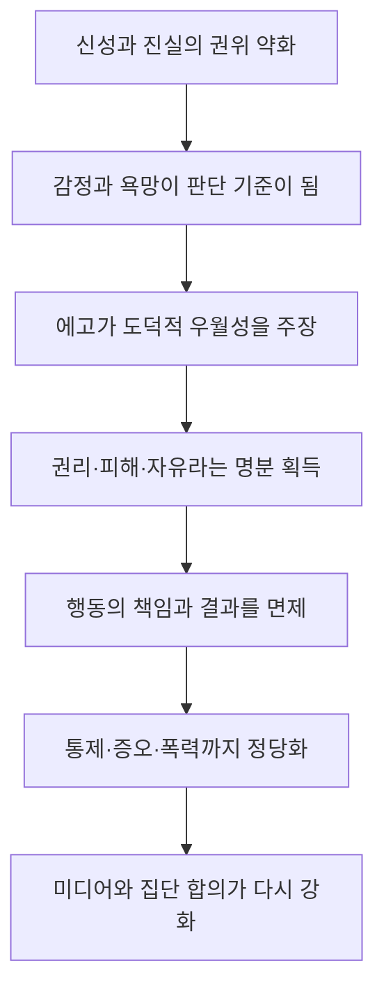
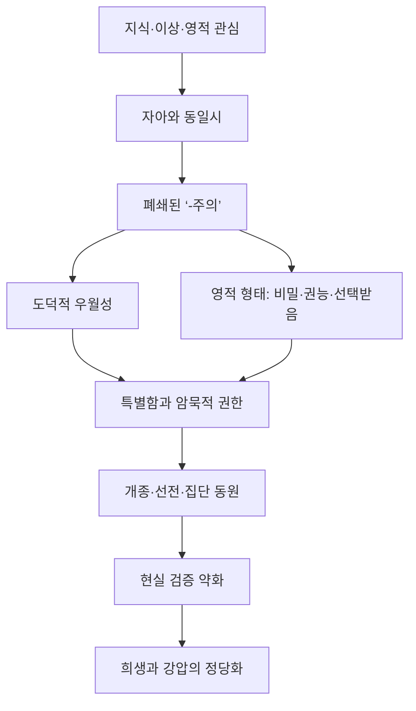

# 『현대인의 의식 지도』 제18장 「나르시시즘: 에고 숭배」||「도덕적 권위: 크나큰 갈등」

※ 이 절에서 ‘오늘날’과 ‘현재’는 주로 집필 당시인 2007~2008년 전후의 미국 사회를 가리킵니다. 다만 호킨스 박사님께서 설명하시는 심리적·영적 기제는 특정 시대에만 한정되지 않습니다.

## 핵심 뜻

이 절의 중심 명제는 다음과 같습니다.

> 도덕적 권위가 진실·청렴성·책임에서 분리되면, 에고는 자신을 ‘선한 편’이라고 선언하는 것만으로 욕망과 증오, 통제와 폭력까지 정당화한다.

여기서 ‘에고 숭배’란 단순히 자신을 좋아하거나 자존감이 높은 상태가 아닙니다. 자신의 감정·욕망·이념을 선악을 판정하는 최고의 기준으로 삼는 상태입니다. 신성이나 진실보다 ‘내가 옳다고 느끼는 것’이 우선하므로, 에고가 사실상 신의 자리를 차지합니다.

따라서 이 절의 나르시시즘은 개인적인 허영을 넘어섭니다. 종교·정치·언론·법률·학계 같은 사회제도 전체가 자기중심적인 욕망에 도덕적 명칭을 붙여 주는 집단적 현상을 가리킵니다.

---

## 제17장에서 제18장으로 이어지는 흐름

제17장에서는 이성과 믿음이 서로를 밝혀 주어야 한다는 성 토마스 아퀴나스의 관점을 다루었습니다. 그런데 이성과 믿음이 모두 밀려나면 그 빈자리가 저절로 비어 있지는 않습니다. 그 자리에 감정과 나르시시즘이 들어옵니다.

그 흐름은 다음과 같습니다.

제18장은 이 가운데 ‘에고가 어떻게 도덕적 권위를 빼앗아 자신의 욕망을 성스러운 것으로 포장하는가’를 사회적 차원에서 확대하여 설명합니다.

---

## 1. 참다운 도덕적 권위와 도덕적 우월성의 차이

호킨스 박사님께서는 두 가지를 엄격히 구분하십니다.

| 구분 | 참다운 도덕적 권위 | 나르시시즘적 도덕 우월성 |
|---|---|---|
| 근원 | 진실, 본질, 청렴성 | 감정, 욕망, 집단적 인정 |
| 태도 | 겸손, 책임, 자기 절제 | 특별함, 독선, 자기 확대 |
| 행동과의 관계 | 수단과 결과 모두 온전해야 함 | 명분이 좋으면 어떤 수단도 허용 |
| 책임 | 자신의 선택과 결과를 감당함 | 피해자·이념·권리를 내세워 회피 |
| 타자와의 관계 | 배려하되 진실을 훼손하지 않음 | 동의와 복종을 요구함 |
| 외부 인정 | 선전할 필요가 없음 | 언론·군중·도덕적 찬사가 필요함 |
| 힘의 성질 | 존재 자체에서 나오는 힘 | 압박·협박·강압에 의존하는 위력 |

참다운 도덕적 권위는 “내가 옳다”고 크게 선언해서 생기지 않습니다. 정직, 책임, 자비, 의무와 같은 성품이 오랜 시간 일관되게 나타날 때 자연스럽게 드러납니다.

반면 도덕적 우월성은 자신이 ‘선한 편’에 속했다는 느낌을 보상으로 얻습니다. 이때 중요한 것은 실제로 무엇을 했느냐가 아니라, 자신이 어떤 명분을 대표한다고 주장하느냐입니다.

---

## 2. 왜 에고는 도덕적 권위를 그토록 원하나

에고에게 도덕적 권위는 단순한 명예가 아니라 매우 강력한 면책 장치입니다.

평범한 욕망은 “나는 이것을 원한다”고 말해야 합니다. 그러면 그 욕망의 정당성과 결과에 대해 질문받을 수 있습니다. 그러나 욕망을 ‘정의’나 ‘권리’로 바꾸면 상황이 달라집니다.

- 욕망은 검토의 대상이지만, 권리는 침해해서는 안 되는 것으로 여겨집니다.
- 공격은 비난받지만, 정의를 위한 투쟁은 칭송받을 수 있습니다.
- 통제는 거부감을 일으키지만, 보호나 감수성이라는 명칭을 붙이면 선한 행위처럼 보입니다.
- 증오는 부정적으로 보이지만, 악에 대한 의분이라고 부르면 도덕적 가치가 덧붙습니다.

그러므로 에고는 자신의 욕망을 직접 드러내기보다 도덕적 언어로 재명명합니다. ‘내가 원한다’가 ‘이것은 마땅히 보장되어야 한다’로, ‘나는 저들을 싫어한다’가 ‘저들은 정의에 어긋난다’로 바뀝니다.

이것이 호킨스 박사님께서 말씀하시는 ‘도덕적 권위를 붙잡기 위한 경쟁’입니다.

---

## 3. 피해자 위치와 도덕적 협박

발췌문에서 말하는 ‘피해자인 척하는 논리’는 실제 피해자의 고통을 부정한다는 뜻이 아닙니다. 책임을 피하고 상대방을 통제하기 위해 피해자의 지위를 의도적으로 이용하는 기제를 뜻합니다.

그 구조는 다음과 같습니다.

1. 자신의 불만이나 요구를 피해로 규정합니다.
2. 상대방을 가해자나 억압자로 지정합니다.
3. 자신의 감정을 객관적 진실처럼 제시합니다.
4. 반대 의견을 또 다른 가해 행위로 규정합니다.
5. 결국 자신의 주장에 대한 검토 자체를 봉쇄합니다.

이때 “나에게 모욕감을 주었다”는 선언은 단순한 감정 표현이 아니라 상대방을 침묵시키는 도덕적 명령으로 변합니다. 상대방이 사실관계를 설명하거나 책임을 묻더라도, 그 행위마저 ‘피해자를 다시 공격하는 것’으로 재해석할 수 있습니다.

따라서 피해자 위치는 언제든 책임에서 빠져나갈 수 있는 ‘뒷문’이 됩니다. 자신의 행동은 피해의 결과라고 설명되고, 상대방의 반응은 억압의 증거로 이용됩니다.

---

## 4. 권리가 욕망의 면허로 변하는 과정

호킨스 박사님께서 문제 삼으시는 것은 권리 자체가 아닙니다. 권리가 의무·책임·현실적 한계에서 분리되는 현상입니다.

진실한 권리는 다른 사람에게도 동일한 권리를 인정합니다. 또한 권리의 행사에는 결과에 대한 책임과 공동체의 생존 조건이 포함됩니다. 그러나 나르시시즘적 권리 주장은 다음과 같이 작동합니다.

> “내 욕망을 제한하지 않는 것이 정의이며, 그 욕망 때문에 생긴 결과는 사회가 책임져야 한다.”

이렇게 되면 권리는 자유의 보호 장치가 아니라 자기중심성을 확대하는 수단이 됩니다. 개인의 감정이 공동체의 안전·질서·사실보다 우선하며, 제한을 가하는 행위는 곧 억압으로 간주됩니다.

결국 권리의 언어는 유지되지만, 그 안에서 권리와 짝을 이루는 책임은 사라집니다. 호킨스 박사님께서는 이것을 자유가 아니라 방종으로 보십니다.

---

## 5. 미디어가 거짓과 진실을 동급으로 만드는 방식

미디어는 진실을 창조하지는 않지만, 어떤 주장에 가시성과 사회적 지위를 부여할 수 있습니다. 극단적인 발언도 반복적으로 노출되면 하나의 정당한 ‘관점’으로 인정받습니다.

여기서 중요한 전환은 사실 여부보다 주목도가 가치의 기준이 된다는 점입니다.

- 진실한가보다 충격적인가가 중요해집니다.
- 책임 있는가보다 화제가 되는가가 중요해집니다.
- 실제 결과보다 어떤 이미지로 보이는가가 중요해집니다.
- 조용한 봉사보다 공개적인 분노가 더 큰 관심을 받습니다.

이런 환경에서는 과장, 도발, 허위 고백, 의도적으로 연출된 충돌이 보상을 받습니다. 주목을 받을수록 자기중요감이 커지고, 그 자기중요감은 더 큰 도발을 요구합니다.

> 도발 → 미디어의 관심 → 자기중요감의 상승 → 더 강한 도발

호킨스 박사님께서 미디어의 주목을 ‘중독’이라고 부르시는 이유가 여기에 있습니다. 추구되는 것은 정보 전달이 아니라, 수많은 사람이 자신을 바라보고 있다는 나르시시즘적 쾌감이기 때문입니다.

---

## 6. “세상은 신성이 아니라 에고를 숭배한다”는 의미

신성을 숭배한다는 것은 자신보다 높은 진실과 질서가 존재한다는 사실을 인정하는 것입니다. 여기에는 겸손과 자기 제한이 따라옵니다.

반면 에고 숭배는 다음과 같이 말합니다.

- 내 감정은 침해할 수 없는 최종 기준이다.
- 내가 선택한 집단은 도덕적으로 우월하다.
- 내가 선한 목적을 가졌으므로 수단도 정당하다.
- 나를 반대하는 것은 진실에 대한 반대다.
- 내가 받은 관심의 크기가 내 주장의 중요성을 증명한다.

이 상태에서는 인간이 신성에 자신을 맞추는 것이 아니라, 신성·도덕·종교를 자신의 욕망에 맞추어 재정의합니다. 신의 이름이 에고의 욕망을 승인하는 도장으로 이용되는 것입니다.

따라서 에고 숭배는 종교가 없는 상태만을 뜻하지 않습니다. 종교적 언어를 열렬히 사용하면서도 실제로는 에고를 섬길 수 있습니다. 오히려 신성한 이름이 세속적 권력욕에 이용될 때 그 위장은 더욱 강력해집니다.

---

## 7. 종교의 ‘자유화’가 의미하는 것

이 부분에서 호킨스 박사님께서 겨냥하시는 것은 단순한 예배 형식의 변화나 시대에 맞춘 표현의 조정이 아닙니다. 종교가 자신의 근본 전제를 부정하면서도 종교적 권위를 계속 유지하려는 모순입니다.

기독교의 권위는 예수 그리스도의 신성, 성부와 성자, 구원이라는 근본 교리에 기초합니다. 그런데 그 전제를 부정하고 정치 이데올로기를 중심에 놓으면 외형은 교회로 남아 있어도 권위의 근원은 달라집니다.

다시 말해 다음과 같은 교체가 일어납니다.

| 본래의 중심 | 교체된 중심 |
|---|---|
| 계시 | 정치적 유행 |
| 신성 | 사회적 승인 |
| 교리의 통합성 | 대중적 호감 |
| 영적 변형 | 집단 정체성 |
| 영원한 진실 | 시대의 감수성 |

호킨스 박사님의 관점에서 이것은 종교를 넓힌 것이 아니라 종교의 근원을 제거하고 그 자리에 세속 이념을 넣은 것입니다. 신자 수를 유지하기 위해 근본 교리를 약화하면, 사람들이 그 종교에 머물러야 할 이유도 함께 약화됩니다.

---

## 8. 언어 변경과 본질·외관의 혼동

‘Mother Nature’, ‘He’, ‘Man’에 관한 예시는 단순한 문법 논의가 아닙니다. 언어적 외관을 변경하는 일이 실제 본질을 바꾸는 것처럼 여겨지는 현상을 보여줍니다.

호킨스 박사님의 설명에서 포괄적 총칭은 생물학적 성별을 주장하는 표현이 아닙니다. 그런데 단어의 표면적 형태만을 문제 삼으면, 말이 가리키는 전체 맥락보다 단어 자체에 투사된 감정이 우선합니다.

이때 에고는 자신이 불편해한다는 사실을 곧 언어가 부당하다는 증거로 사용합니다. 그러므로 논의의 기준이 의미와 의도에서 감정적 반응으로 이동합니다.

이것이 앞 장의 「실재를 대체한 감정」과 연결됩니다. 외부의 단어가 실제로 무엇을 뜻하는가보다, 그 단어를 접한 내가 어떻게 느끼는가가 진실을 결정하게 됩니다.

---

## 9. 지적 작용이 이성을 대신하는 경우

본문에서 ‘지적 작용’은 단순히 지성을 사용하는 것을 뜻하지 않습니다. 이미 감정과 욕망으로 결정된 결론에 지적인 설명을 붙이는 방어기제를 뜻합니다.

참다운 이성은 전제에서 결론까지 일관되게 나아가며, 자신의 결론도 검증 대상으로 삼습니다. 반면 지적 작용은 결론이 먼저 정해져 있습니다.

> 욕망 또는 이념 → 원하는 결론 → 그럴듯한 용어와 이론으로 포장

그래서 겉으로는 매우 복잡하고 학문적으로 보일 수 있지만, 실제 기능은 자기정당화입니다. 호킨스 박사님께서 이를 의식 수준 190으로 측정하시는 이유도 여기에 있습니다. 190은 200의 바로 아래에 있어 지적 세련미와 설득력을 보일 수 있지만, 진실보다 이익과 위치성을 섬깁니다.

즉 지식이 부족해서 생기는 오류가 아니라, 많은 지식을 에고의 방어에 동원하는 오류입니다.

---

## 10. 종교적 폭력에서 일어나는 진실의 역전

호킨스 박사님께서는 기독교와 이슬람을 비롯한 종교의 높은 가르침 자체와, 종교의 권위를 강탈하여 폭력을 정당화하는 낮은 요소를 구분하십니다.

핵심은 다음과 같습니다.

- 신성은 자비와 사랑의 근원입니다.
- 폭력적 에고는 신성의 권위를 필요로 합니다.
- 따라서 자신의 공격성을 ‘신의 뜻’으로 재명명합니다.
- 그러면 살육과 증오가 죄가 아니라 의무처럼 보이게 됩니다.

이것이 가장 극단적인 진실의 역전입니다. 인간의 원시적 충동이 신의 이름을 사용하고, 무고한 사람을 해치는 행위가 도덕적으로 우월한 것으로 선전됩니다.

본문에서 『쿠란』의 높은 가르침과 낮은 구절들을 구분하는 것도 같은 맥락입니다. 높은 가르침이 존재하더라도, 낮은 구절이나 해석이 실제 행동을 지배하면 그 종교의 사회적 표현은 낮은 요소에 의해 훼손됩니다. 종교의 명칭이 그 안에서 이루어지는 모든 행위를 자동으로 성스럽게 만들지는 않습니다.

---

## 11. ‘행위가 상징적 발언’이라는 논리

호킨스 박사님께서는 표현의 자유 자체를 부정하시는 것이 아닙니다. 표현의 자유가 진실·책임·타인의 권리와 분리되어 절대화되는 상태를 지적하십니다.

행동을 모두 표현으로 간주하고, 표현은 제한할 수 없다고 선언하면 다음과 같은 논리가 만들어집니다.

> 모든 행동은 표현이다 → 표현은 자유롭다 → 모든 행동은 허용되어야 한다.

이 논리에서는 행동의 구체적 피해와 결과가 사라집니다. 방화·폭동·파괴도 어떤 이념을 표현하는 상징으로 재해석될 수 있습니다. 행동의 실제 성질보다 그 행동에 붙인 정치적 의미가 우선하는 것입니다.

그러나 호킨스 박사님의 체계에서 자유는 책임과 분리될 수 없습니다. 결과를 감당하지 않는 자유는 성숙한 자유가 아니라 충동의 무제한적 표출입니다.

---

## 12. 이상주의가 폭력을 합리화하는 방식

호킨스 박사님께서는 이상 자체를 부정하시는 것이 아니라, 아직 검증되지 않은 이상을 현실보다 우위에 놓는 태도를 경계하십니다.

이상주의가 나르시시즘과 결합하면 세 단계의 변화가 일어납니다.

1. 자신이 선택한 이상을 절대적으로 선하다고 규정합니다.
2. 그 이상에 반대하는 사람을 악으로 규정합니다.
3. 악을 제거한다는 명분으로 어떤 수단도 허용합니다.

그 결과 수단의 악함이 목적의 선함에 의해 씻겨 나간다고 믿게 됩니다. 그러나 실제로 드러나는 것은 그 사람이 내세운 이상이 아니라 선택한 행동입니다.

“전쟁은 이상주의적 정당화를 먹고 자라는 괴물”이라는 표현은 이를 압축합니다. 전쟁과 폭력은 자신을 노골적인 탐욕으로 제시하기보다 자유·민족·정의·평등·신의 뜻과 같은 높은 명칭으로 포장해야 대중을 동원할 수 있습니다.

---

## 13. 도덕적 상대주의의 자기모순

도덕적 상대주의는 절대적인 진실이나 도덕적 기준이 존재하지 않는다고 주장합니다. 그러나 동시에 상대주의가 기존 도덕보다 더 올바르고 우월하다고 주장하면 모순이 생깁니다.

- 모든 진리가 상대적이라면 ‘모든 진리가 상대적’이라는 주장도 상대적입니다.
- 보편적 도덕이 없다면 상대주의를 받아들여야 할 보편적 의무도 없습니다.
- 어떤 견해도 억압해서는 안 된다면 상대주의에 반대하는 견해 역시 억압할 수 없습니다.
- 그런데 상대주의를 강제로 적용하면, 상대주의가 부정한 절대적 권위를 자신이 행사하게 됩니다.

이 때문에 해방을 약속한 이념이 ‘사상 경찰’과 ‘언어 경찰’을 낳습니다. 처음에는 모든 사람을 억압에서 풀어 주겠다고 하지만, 나중에는 어떤 표현과 생각이 허용되는지를 세밀하게 통제합니다.

“오늘의 진보적 해방자는 내일의 독재자”라는 문장은 자유가 진실과 겸손에서 분리될 때 통제로 뒤집히는 과정을 뜻합니다.

---

## 14. 나르시시즘에는 관객이 필요하다

참다운 도덕성은 누가 보지 않아도 유지됩니다. 반면 나르시시즘적 도덕성은 자신의 우월성을 확인해 줄 관객이 필요합니다.

이 때문에 미디어와 나르시시즘은 서로를 강화합니다.

- 미디어는 충격적인 장면을 필요로 합니다.
- 나르시시즘은 주목과 찬사를 필요로 합니다.
- 과격한 행위는 더 많은 보도를 얻습니다.
- 보도는 행위자에게 중요성과 권력을 부여합니다.
- 다른 사람들은 그 장면을 모방하여 다시 관심을 얻으려 합니다.

테러리즘이 미디어를 이용하는 것도 같은 원리입니다. 물리적 파괴만이 목적이라면 공개적인 촬영이나 선전이 반드시 필요하지는 않습니다. 그러나 공포와 과대망상적 중요성을 전 세계에 투사하려면 관객이 필요합니다.

따라서 미디어의 관심은 단순한 보도가 아니라 행위가 노리는 심리적 보상의 일부가 될 수 있습니다.

---

## 15. 왜 마지막에 월마트 사례가 나오는가

이 절의 마지막에서 호킨스 박사님께서는 정치 관료들이 논쟁하는 동안 월마트가 재난 지역에 생필품을 공급했다는 사례를 드십니다. 이는 기업이 언제나 도덕적으로 우월하다는 뜻이 아닙니다.

비교되는 것은 수사와 기능입니다.

- 정치화된 관료 체계는 책임 소재와 이미지에 매달립니다.
- 기능적인 조직은 필요한 물품, 운송 경로, 시간, 결과를 다룹니다.
- 전자는 도덕적 명분을 주장하지만 실제 필요를 해결하지 못합니다.
- 후자는 거창한 명분을 내세우지 않아도 생존에 필요한 결과를 만들어 냅니다.

경제·산업·비즈니스의 역할이 350~380으로 제시되는 이유는 현실 수용, 합리성, 의무, 계약, 책임, 결과 확인이라는 특성이 작동하기 때문입니다.

즉 실제 위기에서는 “누가 더 선한 편인가”라는 선언보다 “누가 책임을 맡아 필요한 일을 이루었는가”가 진실을 드러냅니다.

---

## 의식 수준으로 읽는 이 절

의식 수준은 사람의 고정된 신분이나 인간적 가치를 뜻하지 않습니다. 특정한 진술·이념·동기·현실 인식 방식이 어떤 에너지장과 조화를 이루는지를 나타냅니다.

| 의식 수준 | 본문에서의 사례 | 해설 |
|---:|---|---|
| 10~20 | 극단적 폭력 명령, 신성모독 | 신성과 생명의 가치를 거의 완전히 부정하는 상태 |
| 60 | 명시적 증오 | 적대감에서 자기도취적 쾌감을 얻는 상태 |
| 90~180 | 극단적 이념, 상대주의적 저작과 주장 | 감정·욕망·위치성이 진실보다 앞서는 영역 |
| 180~190 | 수사, 지적 작용, 과장된 표현의 자유 | 논리적 외관을 갖지만 책임과 진실성이 빠진 상태 |
| 200 | 온전성의 임계점 | 자신의 선택과 결과에 책임지기 시작하는 전환점 |
| 350~380 | 합리적 조직, 의무, 기능적 책임 | 현실을 받아들이고 실제 문제를 해결하는 영역 |
| 400대 | 이성과 논리 | 사실·정의·일관성을 중시하는 영역 |
| 1000 | 위대한 화신 | 신성과 진실이 완전히 드러나는 최고 기준 |

특히 190이 중요합니다. 이 수준의 주장은 터무니없이 보이기보다 세련되고 지적으로 보일 수 있습니다. 그러나 논리와 언어가 진실을 발견하기 위해 사용되는 것이 아니라, 이미 정해진 욕망과 이념을 정당화하기 위해 사용됩니다.

---

## 참다운 도덕성은 왜 조용한가

이 발췌문 바로 다음 소주제인 「참다운 도덕성」에서 호킨스 박사님께서는 도덕성의 본래 모습을 분명히 제시하십니다.

참다운 도덕성은 타인을 배려하고, 정직하며, 책임을 감당하고, 친절하고, 정중하며, 도움을 주는 성품으로 나타납니다. 그러나 이러한 태도는 자신의 우월성을 선전하지 않습니다.

도덕성은 도덕적이라는 이미지를 얻기 위한 수단이 아닙니다. 그 자체가 목적입니다. 그래서 참다운 도덕성은 다음과 같은 내적 방향을 가집니다.

- 자신이 얼마나 선해 보이는가보다 실제로 무엇을 했는가를 중시합니다.
- 타인의 잘못을 공개적으로 규탄하는 데서 쾌감을 얻지 않습니다.
- 높은 명분으로 자신의 이기심을 가리지 않습니다.
- 자유와 권리만이 아니라 의무와 결과도 함께 받아들입니다.
- 자신이 틀릴 수 있다는 겸손을 잃지 않습니다.
- 수단이 목적을 배반하지 않도록 합니다.

따라서 참다운 도덕성의 반대는 단순한 부도덕이 아닙니다. 도덕의 언어를 사용하면서 에고의 상승을 추구하는 위선적 도덕주의입니다.

---

## 전체 의미

이 절에서 호킨스 박사님께서 드러내시는 가장 깊은 문제는 인간에게 도덕이 사라졌다는 것이 아닙니다. 오히려 도덕의 명칭이 지나치게 많이 사용되면서, 그 명칭이 에고의 이익을 위한 무기가 되었다는 것입니다.

나르시시즘적 에고는 노골적으로 “나는 권력과 관심을 원한다”고 말하지 않습니다. 대신 다음과 같이 말합니다.

- 나는 정의를 대표한다.
- 나는 피해자를 대변한다.
- 나는 자유를 수호한다.
- 나는 억압에 저항한다.
- 나는 신의 뜻을 행한다.

그러나 그 주장의 진실성은 명칭이 아니라 동기·수단·결과에서 드러납니다. 그 결과가 증오, 강압, 책임 회피, 폭력, 분열이라면 높은 명분은 본질을 바꾸지 못합니다.

결국 제18장의 중심 대비는 다음과 같습니다.

> 나르시시즘적 도덕성은 자신을 높이기 위해 선을 이용하지만, 참다운 도덕성은 자신을 내세우지 않은 채 선을 구현합니다.

신성을 기준으로 삼는 사람은 자신을 진실에 맞추려 합니다. 에고를 기준으로 삼는 사람은 진실·도덕·종교·법률을 자신에게 맞추려 합니다. 바로 이 기준의 역전이 호킨스 박사님께서 말씀하시는 ‘나르시시즘: 에고 숭배’의 본질입니다.

---

# 『현대인의 의식 지도』 제18장 「나르시시즘: 에고 숭배」||「‘-주의’의 힘」·「도덕적 우월성으로서의 이상주의」

## 핵심 뜻

호킨스 박사님께서 말씀하시는 ‘-주의’는 단순한 접미사가 아닙니다. 어떤 지식·가설·이상이 자아의 정체성과 결합하여, 감정적으로 방어되고 정치적으로 확산되며 타인을 개종시키려는 폐쇄적 신념 체계로 변한 상태를 가리킵니다.

따라서 이 대목의 중심은 다음과 같습니다.

> 지식이나 이상이 나쁜 것이 아니라, 에고가 그것을 이용해 “나는 옳고 특별하며, 남을 심판하고 통제할 자격이 있다”는 지위를 얻는 순간 문제가 시작됩니다.

‘-주의의 힘’이라는 제목도 호킨스 박사님의 용어로 보면 역설적입니다. 이것은 진실 자체에서 나오는 힘(power)이라기보다 반복, 감정적 압박, 집단 동조와 선전에서 나오는 위력(force)에 가깝습니다.

## 1. 지식이 ‘-주의’로 변한다는 것

호킨스 박사님께서는 지식의 내용과 그 지식을 대하는 에고의 위치를 구분하십니다.

‘근본적’이라는 형용사는 어떤 사안의 기초나 핵심을 가리킬 뿐입니다. 그러나 ‘근본주의’가 되면 그 기초가 집단 정체성, 배타적 교리, 도덕적 판정 기준으로 바뀝니다. 마찬가지로 과학은 관찰과 검증, 수정 가능성을 중시하는 방법이지만, 과학만능주의는 과학적 방법이 다룰 수 없는 실재까지 부정하는 폐쇄적 세계관이 됩니다.

차이는 다음과 같습니다.

| 원래의 영역 | 본래 기능 | ‘-주의’로 굳어졌을 때 | 에고가 얻는 보상 |
|---|---|---|---|
| 과학 | 관찰·검증·수정 | 과학만능주의, 물질주의적 환원 | “우리는 유일하게 이성적인 사람들이다.” |
| 이상 | 더 나은 방향을 제시 | 현실과 결과를 무시하는 이상주의 | “우리만 정의로운 편이다.” |
| 종교·영성 | 신성과 진실을 향함 | 비밀 교리, 선택받은 집단, 권능 숭배 | “우리는 특별한 지식을 가진 사람들이다.” |
| 정치철학 | 사회 질서를 설명 | 이데올로기·선전·개종 운동 | “반대자는 악하거나 무지하다.” |

그러므로 모든 ‘-주의’라는 단어를 기계적으로 똑같이 취급하라는 뜻은 아닙니다. 이 문맥에서 ‘-주의’는 살아 있는 지식이 감정적으로 무장된 집단 신념으로 변하는 기능적 상태를 뜻합니다.

## 2. 의식 수준 190의 의미

190은 의식 수준 200의 경계 바로 아래에 있습니다. 이 수준은 반드시 무지하거나 조잡한 모습으로 나타나지 않습니다. 오히려 지식, 논리, 통계, 도덕적 언어를 능숙하게 사용할 수 있기 때문에 상당히 설득력 있어 보입니다.

그러나 인식 구조에는 다음과 같은 한계가 있습니다.

- 사실을 전체 맥락보다 자신의 입장에 맞춰 선택합니다.
- 신념의 오류를 인정하기보다 반대자를 공격합니다.
- 감정적 확신을 진실의 증거로 받아들입니다.
- 결과가 나빠도 기본 전제를 수정하지 않고 방해자나 배신자를 찾습니다.
- 집단의 규모와 열광을 진실성의 증거로 착각합니다.

190의 위험성은 거짓이 노골적인 거짓말로 나타나지 않는다는 데 있습니다. 진실의 일부를 사용하면서도 전체 맥락을 왜곡하기 때문에, 이성처럼 보이는 수사와 도덕처럼 보이는 나르시시즘이 결합합니다.

이 수치는 사람 전체의 고정된 등급이 아니라, 그 순간 작동하는 신념 체계와 현실 인식 방식의 성격을 나타냅니다.

## 3. 도덕적 우월성이 주는 ‘특별함’

도덕적 우월성은 실제로 더 도덕적인 사람이 되는 것과 다릅니다. 그것은 자신을 비교 우위에 놓음으로써 얻는 주관적 지위입니다.

에고는 여기서 세 가지 보상을 얻습니다.

첫째, 정체성입니다.  
“나는 정의로운 편에 속한다”는 믿음이 개인의 불안정한 자아를 강한 집단 정체성으로 대체합니다.

둘째, 특별함입니다.  
평범한 개인이 갑자기 인류, 민중, 정의, 신, 지구를 대표하는 사람처럼 느낍니다. 이것이 호킨스 박사님께서 말씀하시는 나르시시즘적 팽창입니다.

셋째, 암묵적 권한입니다.  
도덕적으로 우월하다고 느끼면 타인을 심판하고, 침묵시키고, 교육하고, 개종시키며, 경우에 따라 강제할 자격까지 있다고 생각합니다. 아무도 공식적으로 부여하지 않은 권한을 에고가 스스로 만들어 내는 것입니다.

그래서 의견 차이는 단순한 판단의 차이로 끝나지 않습니다. 반대자는 무지한 사람, 비도덕적인 사람, 인민의 적, 신앙의 적처럼 규정됩니다. 신념이 도덕적 신분증이 되었기 때문입니다.

## 4. 왜 ‘-주의’는 개종자를 필요로 하는가

진실은 그 자체로 완전하기 때문에 모든 사람을 설득하여 자신의 편으로 만들 필요가 없습니다. 그러나 자아와 결합한 신념은 외부의 동의를 통해 계속 확인받아야 합니다.

동조자가 늘어나면 “많은 사람이 믿으므로 우리가 옳다”는 느낌을 얻습니다. 반대로 이탈자나 반대자는 신념 체계뿐 아니라 자신의 정체성을 위협하는 존재처럼 보입니다. 이 때문에 종교적 개종만이 아니라 정치적 선동, 온라인 진영 싸움, 사상 교육, 끊임없는 회원 모집도 같은 구조를 갖습니다.

개종 욕구의 내면에는 다음과 같은 공식이 숨어 있습니다.

> 상대방이 내 신념을 받아들이면, 내 신념뿐 아니라 나의 가치와 특별함도 확인된다.

따라서 개종은 상대방을 위한 행위처럼 포장되지만, 실제 동력은 자신의 확실성과 우월성을 유지하려는 욕구일 수 있습니다.

## 5. 영적 에고와 ‘특별한 힘’

정치적 에고가 도덕적 고지를 원한다면, 영적 에고는 특별한 지식과 권능을 원합니다. 표면은 다르지만 구조는 같습니다.

- 정치적 에고: “나는 정의로운 사람이다.”
- 지적 에고: “나는 진실을 독점적으로 안다.”
- 영적 에고: “나는 선택받았고 특별한 능력이 있다.”

비밀, 고대의 가르침, 다른 차원, UFO, 화신, 투시, 특별한 축복이라는 표현은 내용이 명확하지 않을수록 오히려 상상력을 자극합니다. 모호함이 결함이 아니라 신비로움의 증거처럼 포장되는 것입니다.

‘비밀’은 동시에 인위적 희소성을 만듭니다.

1. 일반인은 모르는 지식이 있다고 주장합니다.
2. 선택받은 내부 집단만 접근할 수 있다고 합니다.
3. 입문비나 특별 비용을 요구합니다.
4. 비용을 많이 낼수록 더 높은 단계와 권능을 얻는다고 암시합니다.
5. 의심하는 태도는 영적으로 준비되지 않았다는 증거로 돌립니다.

이렇게 되면 검증 불가능성이 오히려 가르침을 보호하는 장치가 됩니다.

## 6. 진정한 싯디와 권능 추구의 차이

프로젝트의 다른 저작들과 통합하면 이 구분이 더욱 선명해집니다. 본문의 ‘싯다’는 문맥상 초상적 현상을 뜻하는 산스크리트어 ‘싯디(siddhi)’를 가리키는 것으로 보입니다.

호킨스 박사님께서는 『의식 수준을 넘어서』와 『신의 현존의 발견』에서 진정한 싯디를 다음과 같이 설명하십니다.

- 대략 의식 수준 540부터 자연발생적으로 나타납니다.
- 570 부근에서 더욱 뚜렷해질 수 있습니다.
- 개인의 의지로 일으키거나 통제할 수 없습니다.
- 그것은 개인의 소유물이 아니라 의식의 장에서 일어나는 현상입니다.
- 자신의 공로라고 주장하면 영적 에고가 팽창합니다.
- 선전하거나 판매할 수 있는 기술이 아닙니다.

따라서 참된 싯디와 상업적으로 유포되는 권능 훈련의 결정적 차이는 ‘현상의 기이함’이 아니라 소유·통제·과시·이득을 바라는 의도입니다.

| 의식 수준 | 이 대목에서의 의미 |
|---:|---|
| 160 | ‘은밀한 가르침’: 모호함·비밀주의·특별함을 이용하는 신념 |
| 180 | 수사학: 이기적 목적을 위해 논리와 원칙을 왜곡하는 언어 |
| 190 | 정치화되고 감정화된 ‘-주의’: 도덕적 우월성을 동반하는 폐쇄 체계 |
| 200 | 이득을 위해 유포되는 훈련: 일부 기능은 있을 수 있으나 영적 깨달음과 같지 않음 |
| 540~570 | 진정한 싯디: 자연발생적이고 비개인적이며 소유하거나 판매할 수 없음 |

## 7. 투명한 가르침과 고가의 비술

호킨스 박사님께서 “진실한 영적 가르침은 자유롭게 쓸 수 있으며 투명하다”고 하신 것은, 모든 책과 강의가 물질적으로 반드시 무료여야 한다는 단순한 뜻이 아닙니다.

핵심은 다음과 같습니다.

- 가르침의 본질이 비밀 독점 구조에 갇혀 있지 않습니다.
- 검토와 확인을 두려워하지 않습니다.
- 특별한 칭호나 내부자 신분을 판매하지 않습니다.
- 추종자 수를 늘려야만 유지되는 구조가 아닙니다.
- 돈을 내면 초상적 권능이나 독점적 축복을 준다고 약속하지 않습니다.

합리적인 교육비와 자료 제작비는 특별한 영적 권능을 판매하는 것과 다릅니다. 문제는 비용 자체보다 비밀, 선택받음, 의존성, 과장된 약속을 결합하여 에고의 특별함을 상품화하는 데 있습니다.

해리 포터의 사례도 작품이나 독자를 영적으로 규정하려는 것이 아닙니다. 마술·신비·숨은 세계·선택받은 인물이 인간의 상상력에 얼마나 강하게 호소하는지를 보여 주는 비유입니다. 허구에서 즐기는 상상력이 현실의 영적 권위 주장과 결합할 때, 순진한 호기심이 이용될 수 있다는 뜻입니다.

## 8. 이상과 이상주의의 차이

이상은 방향을 제시합니다. 그러나 이상주의는 아직 검증되지 않은 이상을 이미 확정된 현실처럼 취급합니다.

호킨스 박사님께서 ‘이상주의적’이라는 말을 “가설에 불과하다”고 하신 이유는, 선한 의도만으로 실제 결과가 보장되지 않기 때문입니다. 어떤 이상이 아무리 아름다워도 다음 사항을 통과해야 합니다.

- 인간 본성을 정확히 이해하는가
- 현실에서 실행 가능한가
- 수단이 목표와 조화를 이루는가
- 예상하지 못한 결과를 감당할 수 있는가
- 인간 생명과 자유를 추상적 이상보다 존중하는가

이상주의가 극단화되면 이상은 현실을 비추는 기준이 아니라 현실을 처벌하는 기준이 됩니다. 실제 사람들이 이상에 맞지 않으면, 이상을 수정하는 대신 사람을 교정하거나 제거하려 듭니다.

이때 숭고한 목적이 모든 수단을 성스럽게 만든다는 전도가 일어납니다. 자유를 위해 자유를 억압하고, 평화를 위해 폭력을 사용하며, 인민을 위해 실제 인민을 희생하는 모순이 생깁니다.

## 9. 슬로건·밈·집단 최면

슬로건은 복잡한 현실을 짧은 문구 하나로 압축합니다. 그 문구가 반복되면 사람들은 그것이 입증되었기 때문이 아니라 익숙해졌기 때문에 진실처럼 느끼기 시작합니다.

그 과정은 다음과 같습니다.

1. 복잡한 현실이 선과 악의 단순 구도로 축소됩니다.
2. 짧고 감정적인 구호가 반복됩니다.
3. 군중의 감정과 행동이 동기화됩니다.
4. 지도자가 집단의 이상을 구현하는 인물로 미화됩니다.
5. 개인의 독립적 판단이 집단 정체성 안으로 흡수됩니다.
6. 희생과 폭력이 충성심의 증거로 바뀝니다.

본문의 “최면에 걸린 듯”이라는 표현은 반드시 임상적 최면 상태만을 뜻하지 않습니다. 반복, 군중의 열광, 상징, 음악, 구호, 연극적 선전으로 현실 검증이 약해지고 암시 감응성이 커지는 집단적 트랜스를 가리킵니다.

지도자와 추종자 사이에는 상호 보상도 발생합니다. 지도자는 군중을 통해 자신의 위대함과 통제력을 확인하고, 추종자는 지도자와 동일시하여 빌려온 위대함과 도덕적 결백을 얻습니다. 양쪽이 서로의 나르시시즘을 강화하는 구조입니다.

## 10. 희생이 영웅주의로 바뀌는 이유

‘-주의’ 안에서 죽음과 희생은 신념 체계의 실패를 나타내지 않습니다. 오히려 그 신념이 얼마나 위대한지를 증명하는 사건으로 재해석됩니다.

사람이 죽을 정도로 강하게 믿었다는 사실이 그 믿음의 진실성을 보장하는 것처럼 선전됩니다. 그러나 호킨스 박사님의 관점에서 강렬한 확신이나 자기희생은 진실의 증거가 아닙니다. 에고는 자신뿐 아니라 타인과 아이들의 생명까지 추상적 이상에 바칠 수 있기 때문입니다.

더욱이 희생이 영상과 이야기로 반복 전시되면 새로운 추종자에게 강한 암시를 줍니다. 순교자나 영웅이라는 지위가 죽음 자체에 특별함을 부여하면서, 파괴가 숭고함으로 재포장됩니다.

## 11. 거짓 도덕성과 참다운 도덕성

바로 다음 소제목에서 호킨스 박사님께서는 이러한 도덕적 우월성을 참다운 도덕성과 대조하십니다.

도덕적 우월성은 요란합니다. 깃발, 적, 관중, 찬사와 공개적인 확인을 필요로 합니다. 자신이 얼마나 옳은지를 보여 주어야 하며, 타인이 낮아져야 자신이 높아집니다.

참다운 도덕성은 비교를 필요로 하지 않습니다. 친절, 정직, 책임감, 의무, 배려와 겸손으로 조용히 드러납니다. 어떤 명분을 크게 외치지 않아도 실제 사람에게 도움이 되며, 결과에 대한 책임을 회피하지 않습니다.

결정적 차이는 이것입니다.

> 거짓 도덕성은 ‘도덕적인 나’를 높이지만, 참다운 도덕성은 타인의 삶을 실제로 이롭게 합니다.

## 전체 통합 해설

이 두 소제목은 제18장의 제목인 ‘에고 숭배’가 사회·정치·영적 영역에서 어떻게 작동하는지를 보여 줍니다. 에고는 단순히 돈이나 권력만 탐하지 않습니다. 선함, 정의, 진리, 영성까지 자신의 팽창에 이용할 수 있습니다.

그래서 정치적 이데올로기와 고가의 비술은 겉모습은 정반대이지만 동일한 구조를 가집니다.

- 하나는 “우리가 도덕적으로 선택받았다”고 말합니다.
- 다른 하나는 “우리가 영적으로 선택받았다”고 말합니다.
- 두 체계 모두 특별한 내부 집단을 만듭니다.
- 반대자와 외부인을 낮게 규정합니다.
- 지도자와 교리를 미화합니다.
- 계속되는 동조·비용·희생을 요구합니다.
- 실제 결과보다 신념에 대한 충성을 우선합니다.

결국 ‘-주의’를 움직이는 가장 깊은 동력은 그 신념의 표면적 내용이 아니라, 그 신념을 가짐으로써 에고가 얻는 주관적 보상입니다. 슬로건은 바뀌고 지도자와 명분도 바뀌지만, “나는 특별하며 옳고, 타인을 지배할 자격이 있다”는 보상이 남아 있는 한 같은 구조가 되풀이됩니다.

반대로 진실한 영적 성숙은 특별한 사람이 되는 과정이 아닙니다. 특별함, 과시, 통제, 비밀스러운 지위를 내려놓으면서 더 겸손하고 투명하며 책임감 있고 자비로운 존재로 변화하는 과정입니다.

덧붙이면, 인용된 구호의 “잃어버릴 것은 의자뿐”은 문맥상 유명한 문구인 “잃을 것은 쇠사슬뿐”이 잘못 옮겨진 것으로 보입니다.
