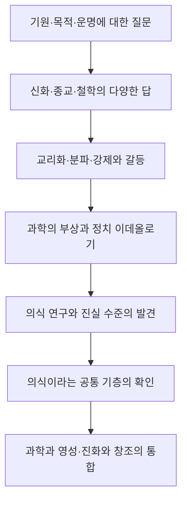

# 『진실 대 거짓』 제1장 「역사적 전망」

# 『진실 대 거짓』 제1장 「역사적 전망」

## 핵심 뜻

이 장에서 호킨스 박사님께서는 인류의 종교사·정치사·과학사를 하나의 흐름으로 재해석하십니다. 인류에게 답이 부족했던 것이 아니라, 수많은 답 가운데 진실과 거짓을 확실히 식별할 수단이 없었다는 것입니다.

그 결과 영적 계시가 교리와 조직의 권위로 변질되고, 종교의 권위가 무너지자 정치 이데올로기와 과학적 유물론이 그 자리를 차지했습니다. 겉으로는 사상이 바뀌었지만, 두려움과 강제로 타인을 통제하는 ‘낮은 힘’의 구조는 반복되었습니다.

호킨스 박사님께서 제시하시는 해법은 새로운 신념 체계가 아닙니다. 모든 경험과 앎의 공통 기층인 ‘의식의 장’을 발견하고, 내용이 아니라 그 내용을 둘러싼 전체적 장에서 진실을 확인하는 것입니다.

## 1. 인류에게 답이 없었던 것이 아니다

인류는 언제나 다음 세 가지를 물었습니다.

- 우리는 누구인가?
- 우리는 어디에서 왔는가?
- 육체의 죽음 뒤에는 어떻게 되는가?

문제는 답의 결핍보다 답의 과잉이었습니다. 신화, 우주론, 종교, 철학은 저마다 설명을 내놓았지만, 어떤 설명이 본질적 진실이고 어떤 설명이 문화적 상상이나 오역인지 가려낼 공통 기준이 없었습니다.

호킨스 박사님께서는 여기서 위대한 현인과 화신들의 원래 가르침을, 후대의 종교 조직이 만들어 낸 교리 및 권력 구조와 구별하십니다. 박사님께서 지적하시는 것은 영적 계시 자체가 아니라, 계시가 에고와 집단적 이해관계에 포획되는 과정입니다.

본래의 가르침은 사랑, 평화, 자비를 가리켰지만, 추종자들은 그것을 분파의 우월성, 박해, 전쟁의 근거로 바꾸기도 했습니다. 이는 진실의 내용이 없어서가 아니라, 그 진실을 받아들이는 의식의 장이 달라졌기 때문입니다.

## 2. 종교가 물러난 자리를 정치 이데올로기가 차지했다

종교 조직이 강압과 스캔들로 신뢰를 잃자 과학과 세속주의가 부상했습니다. 그러나 종교적 독단이 사라진 자리를 정치적 독단이 차지하면서 동일한 구조가 재현되었습니다.

내용은 달라졌습니다.

- 과거에는 이단과 불신자가 적으로 규정되었습니다.
- 근대에는 계급의 적, 민족의 적, 정치적 반동이 적으로 규정되었습니다.

하지만 그 저변의 장은 동일했습니다. 자신만이 옳다고 선언하고, 두려움과 증오를 이용하며, 반대자를 제거함으로써 체제를 유지하려는 장입니다. 따라서 종교에서 정치로의 이동이 자동으로 의식의 상승을 뜻하지는 않습니다. 신념의 이름만 바뀌었을 뿐, 작동 에너지가 여전히 낮은 힘일 수 있기 때문입니다.

## 3. 힘과 낮은 힘의 근본적 차이

| 구분 | 힘(power) | 낮은 힘(force) |
|---|---|---|
| 근원 | 진실·온전성에 내재함 | 강제·압박·조작에 의존함 |
| 대립자 | 대립자가 필요하지 않음 | 적과 반대 세력이 필요함 |
| 작용 | 끌어당기고 신뢰를 일으킴 | 저항과 반작용을 일으킴 |
| 지속성 | 스스로 유지됨 | 계속 에너지를 투입해야 함 |
| 대표적 양상 | 정직, 책임, 자발적 협력 | 두려움, 선전, 억압, 위협 |

낮은 힘은 내재적 권위가 부족하기 때문에 끊임없이 반대자를 억눌러야 합니다. 반면 진실과 온전성에서 나오는 힘은 상대를 파괴해서 자신을 입증할 필요가 없습니다.

“거짓은 진실의 반대가 아니라 진실의 부재”라는 말도 같은 원리입니다. 어둠이 빛과 대등한 독립적 실체가 아니듯, 거짓도 진실과 맞먹는 실재성을 갖지 않습니다. 거짓이 영향력을 행사하려면 믿음, 선전, 두려움, 강제에서 에너지를 빌려야 합니다.

이것은 거짓이 현실에서 피해를 일으키지 않는다는 뜻이 아닙니다. 거짓에는 고유한 힘이 없기 때문에, 그 결핍을 낮은 힘으로 보충한다는 뜻입니다.

## 4. 의식 수준 200의 역사적 의미

호킨스 박사님의 의식 지도에서 200은 단순한 숫자가 아니라, 낮은 힘에서 힘으로 넘어가는 임계점입니다.

- 200 이하에서는 이득, 생존, 지배, 비난, 외부에 대한 책임 전가가 우세합니다.
- 200부터는 용기, 정직, 책임, 온전성, 현실을 직면하는 능력이 출현합니다.
- 400대에서는 이성·논리·과학이 크게 발달합니다.
- 500 이상에서는 사랑과 전체적 맥락이 지성의 한계를 포괄합니다.
- 600 이상에서는 주체와 대상의 분리가 약화되며 비이원적 앎이 드러납니다.

따라서 인류의 집단적 수준이 190에서 205로 상승했다는 설명에서 중요한 것은 15점의 산술적 증가가 아닙니다. 척도 자체가 로그 척도인 데다가, 무엇보다 200이라는 임계선을 넘어섰다는 점이 핵심입니다.

박사님께서는 그 결과 사회의 성공 기준이 ‘얼마나 이득을 얻었는가’에서 ‘얼마나 온전한가’로 이동했다고 설명하십니다. 온전치 못한 기업과 지도자의 스캔들이 드러난 것도 부정이 갑자기 생겼기 때문만은 아닙니다. 과거에는 묵인되던 부정이 높아진 집단적 장 안에서는 더 이상 용납되지 않게 된 것입니다.

본문의 ‘현재 207’은 이 장이 집필된 당시를 기준으로 한 측정값입니다.

의식 수준은 사람의 영구적인 신분이나 고정된 등급을 뜻하지 않습니다. 무엇을 중요하게 여기고, 현실을 어떻게 해석하며, 어떤 에너지에 의존하는지를 나타내는 지배적 양식입니다.

## 5. 진실은 ‘내용’만으로 결정되지 않는다

이 장의 가장 중요한 인식론적 전환은 진실을 다음과 같이 본다는 점입니다.

> 진실은 고립된 내용의 성질이 아니라, 특정한 장 안에 놓인 내용의 성질이다.

‘내용’은 진술, 사실, 수치, 사건처럼 초점이 맞춰진 부분입니다. ‘장’ 또는 ‘맥락’은 그 내용이 놓인 전체 상황, 의도, 관계, 전제, 의식 수준을 포함합니다.

예를 들어 “기업의 이익이 증가했다”는 문장은 회계상 사실일 수 있습니다. 그러나 그 이익이 속임수, 착취, 장부 조작에서 나왔다면, 그 수치는 사실이어도 ‘성공’이라는 전체 해석은 진실하지 않습니다. 내용은 정확하지만 그것이 놓인 장을 누락했기 때문입니다.

이것은 상대주의를 뜻하지 않습니다. 오히려 맥락을 포함함으로써 진실의 조건을 더욱 엄격하게 만드는 것입니다. 각자의 관점에 따라 모두가 옳다는 것이 아니라, 내용이 전체적 실상과 얼마나 일치하는지를 살펴야 한다는 뜻입니다.

『호모 스피리투스』에서는 이 관계가 더욱 선명하게 설명됩니다. 에고와 사적인 ‘나’는 내용이고, 의식·앎·참나는 그 모든 내용이 나타나는 맥락입니다. 내용은 계속 바뀌지만, 그것을 알고 있는 의식의 현존은 지속됩니다.

## 6. 분리된 것은 세계가 아니라 마음의 범주다

본문에 나오는 긴 대립 목록은 실제로 서로 단절된 여러 우주가 있다는 뜻이 아닙니다.

- 물질과 비물질
- 주관과 객관
- 과학과 종교
- 선형과 비선형
- 형상과 비형상
- 진실과 거짓

이러한 구분은 세계 자체의 절대적 분할이라기보다 마음이 세계를 묘사하기 위해 만든 사고 범주입니다.

호킨스 박사님의 용어로 설명하면 다음과 같습니다.

- 레스 코기탄스: 생각, 개념, 명칭, 해석으로 구성된 마음의 세계
- 레스 엑스테르나: 마음이 해석하기 전에 있는 그대로 존재하는 세계

마음은 자신이 만든 설명을 있는 그대로의 실상과 혼동합니다. 지도와 실제 영토를 동일시하는 것과 같습니다. 과학과 종교, 주관과 객관의 갈등도 상당 부분 서로 다른 관찰 지점을 별개의 실상으로 오인한 데서 생깁니다.

그렇다고 학문적·기능적 구분을 없애야 한다는 뜻은 아닙니다. 몸과 마음, 물질과 정신을 연구상 구별할 수는 있습니다. 다만 그 구분된 범주들이 서로 독립적으로 존재하는 궁극적 실체라고 믿는 것이 이원성의 오류입니다.

## 7. 왜 공통 기층이 ‘의식’인가

호킨스 박사님께서는 모든 영역을 포괄하는 공통 기층이 의식이라고 밝히십니다. 의식은 일상적으로 말하는 깨어 있는 상태나 생각의 흐름만을 뜻하지 않습니다. 생각, 감각, 객관적 관찰, 주관적 경험이 알려질 수 있게 하는 선행 조건입니다.

객관적 과학도 의식 밖에서 이루어질 수 없습니다. 관찰 결과를 인지하고, 수치를 읽고, 의미를 이해하는 앎이 전제되기 때문입니다. 뇌 사진은 관찰 가능한 내용이지만, 그 사진을 알고 경험하는 능력은 의식의 성질입니다.

따라서 “의식은 의식 자체를 통해서만 연구할 수 있다”는 설명은 단순한 순환논리가 아닙니다. 앎의 바깥으로 나가 앎을 조사할 수는 없다는 뜻입니다. 모든 조사와 검증은 이미 의식 안에서 일어납니다.

여기서 ‘주관’은 개인적 취향이나 의견을 뜻하지 않습니다. 무엇인가를 경험하고 있다는 환원 불가능한 현존을 뜻합니다. 그노시스, 즉 영지는 이 주관성이 가장 높은 수준에서 자기 근원을 직접 아는 상태입니다. 개념에 관해 아는 것이 아니라, 앎과 존재가 하나임을 각성하는 것입니다.

## 8. 하나의 에너지와 다양한 이름표

중력, 빛, 전기, 열, 소리, 생명, 감정, 생각 등이 열거된 이유는 그것들이 모두 동일한 물리량이라는 뜻이 아닙니다. 호킨스 박사님의 패러다임에서는 그것들이 하나의 보편적 근원에서 나온 서로 다른 주파수 범위와 표현이라는 뜻입니다.

따라서 과학과 영성도 서로를 부정하는 두 개의 세계가 아닙니다.

- 과학은 주로 측정 가능한 선형적 형상과 관계를 연구합니다.
- 영성은 형상이 나타날 수 있게 하는 비선형적 근원과 주관적 앎을 다룹니다.

과학이 틀렸기 때문에 영성이 필요한 것이 아니며, 영성이 비과학적이어서 과학과 충돌하는 것도 아닙니다. 각각이 공통 기층의 서로 다른 범위를 바라봅니다. 문제가 생기는 것은 한 범위에 유효한 방법을 전체 실상에 적용하려 할 때입니다.

## 9. ‘원인’과 ‘근원’의 차이

| 개념 | 의미 |
|---|---|
| 원인(cause) | 시간 속에서 ‘이것이 저것을 일으켰다’고 설명하는 국소적·선형적 관계 |
| 근원(Source) | 사건과 형상이 나타날 수 있는 잠재성, 장, 존재의 기층 |
| 진화(Evolution) | 창조가 시간 속에서 연속적으로 관찰되는 모습 |
| 창조(Creation) | 나타나지 않은 잠재성이 나타난 현실성이 되는 과정 |

원인이라는 개념은 일상과 과학에서 유용하지만, 존재 자체가 왜 있으며 잠재성이 어떻게 현실이 되는지까지 설명하지는 못합니다. 원인은 사건과 사건 사이를 설명하지만, 근원은 그 모든 사건이 일어날 수 있게 하는 전체적 장을 가리킵니다.

호킨스 박사님의 전개를 간단히 나타내면 다음과 같습니다.

**나타나지 않은 잠재성 → 비선형적 의식의 장 → 선형적 형상 → 시간 속에서 연속적으로 관찰되는 진화**

따라서 진화와 창조는 대립하지 않습니다.

- 창조는 진화의 본질입니다.
- 진화는 창조가 시간 속에서 보이는 방식입니다.

창조를 먼 과거에 한 번 일어난 사건으로 본다면 진화와 충돌합니다. 그러나 창조를 잠재성이 끊임없이 현실성으로 나타나는 현재진행형 과정으로 보면, 진화는 바로 그 창조의 가시적 전개가 됩니다.

“진화는 창조다”라는 명제는 생물학적 진화를 부정하는 말이 아닙니다. 오히려 생물학이 관찰한 형상의 연속적 전개를 더 큰 비선형적 맥락 안에 놓는 말입니다.

## 10. 다른 저서와의 연결

- 『의식혁명』은 200을 힘과 낮은 힘이 갈리는 결정적 경계로 제시하며, 개인과 사회를 지배하는 끌개장의 차이를 설명합니다.
- 『나의 눈』은 형상 없는 잠재성이 의식의 장을 거쳐 형상으로 나타나는 과정을 설명하며, 진화를 지속되는 창조로 재맥락화합니다.
- 『호모 스피리투스』는 내용과 맥락의 관계를 확장하여, 사적인 자기는 내용이고 참나와 의식은 맥락임을 밝힙니다.
- 『의식 수준을 넘어서』는 마음이 자신의 지각과 있는 그대로의 세계를 구별하지 못한다는 한계를 설명하고, 200에서 낮은 힘으로부터 힘으로의 전환이 일어난다고 밝힙니다.
- 『현대인의 의식수준』은 과학과 종교의 충돌, 원인과 근원의 혼동, 진화론과 창조론의 인위적 대립을 이 장의 패러다임으로 더욱 상세하게 해소합니다.

## 전체 통합 해설

이 장은 인류의 오래된 질문에 또 하나의 우주론을 덧붙이려는 것이 아닙니다. 오히려 그동안 인류가 왜 수많은 우주론과 신념 체계 사이에서 갈등해 왔는지를 밝힙니다. 근본 원인은 마음이 진실과 거짓을 스스로 확실히 구별하지 못하면서도, 자신의 지각과 개념을 실상 자체라고 믿는 데 있습니다.

종교와 정치의 갈등, 과학과 영성의 분리, 주관과 객관의 대립은 모두 이원적 마음이 만들어 낸 분할의 다른 표현입니다. 이를 더 큰 맥락에서 보면, 표면적으로 대립하는 영역들은 하나의 의식 장 안에서 나타나는 서로 다른 관찰 지점과 주파수 범위가 됩니다.

따라서 이 장의 결론은 다음과 같이 집약됩니다.

- 거짓은 진실과 맞먹는 실체가 아니라 진실의 부재입니다.
- 낮은 힘은 내재적 힘의 결핍을 강제로 보충합니다.
- 분리는 실상의 성질이라기보다 마음의 묘사 방식입니다.
- 의식은 객관과 주관, 형상과 비형상을 포괄하는 공통 기층입니다.
- 진화는 창조가 시간 속에서 연속적으로 드러나는 모습입니다.

결국 ‘역사적 전망’은 사건의 연대표가 아니라 인류 의식의 전개도입니다. 인류는 신화에서 종교로, 종교에서 이성과 과학으로, 다시 이성과 과학을 포괄하는 의식의 패러다임으로 이동해 왔습니다. 그 최종적인 통합에서는 과학과 영성, 진화와 창조가 서로 경쟁하지 않습니다. 모두가 하나의 근원에서 나온 실상의 서로 다른 표현으로 이해됩니다.

---
