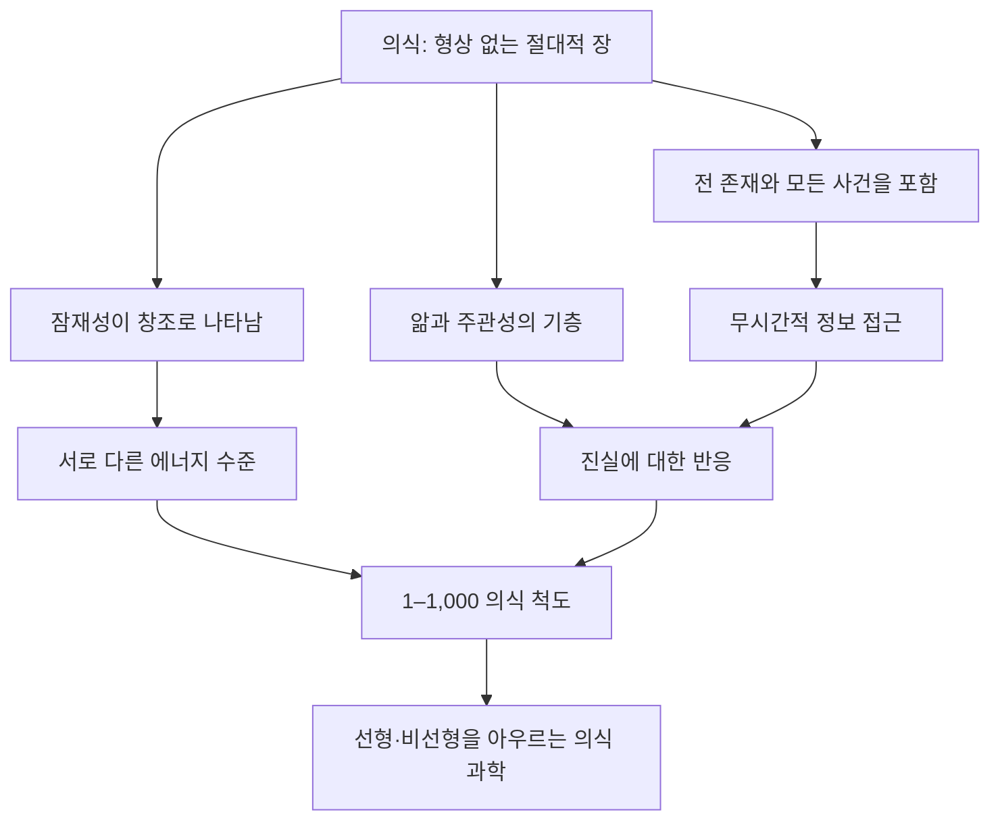

# 『진실 대 거짓』 제2장 「진실의 과학」

# 『진실 대 거짓』 제2장 「진실의 과학」

## 핵심 뜻

이 장에서 호킨스 박사님께서는 과학을 부정하시는 것이 아니라, 과학이 다루는 선형적 진실과 절대적 진실의 차이를 밝히십니다.

고전 과학은 관찰·논리·반복·검증을 통해 대상에 ‘관한’ 지식을 얻습니다. 그러나 모든 관찰과 검증 결과는 결국 의식 안에서 인식되고 해석됩니다. 따라서 진실의 궁극적 기반을 찾으려면 관찰 대상만 연구해서는 부족하고, 대상을 알고 있는 의식 자체를 연구해야 합니다.

이 대목의 중심 명제는 다음과 같습니다.

> 마음은 실상을 직접 아는 것이 아니라 실상에 관해 자신이 만든 표상과 개념을 압니다. 절대적 진실은 표상을 더 정교하게 만드는 것만으로는 도달할 수 없으며, ‘있음’에 의한 직접적인 앎에서 드러납니다.

---

## 전개 지도

1. 과학은 검증 가능한 가설과 확증된 정보로 이루어집니다.
2. 그러나 ‘진실’ 자체에 대해서는 보편적 합의가 이루어지지 않았습니다.
3. 모든 진술은 내용뿐 아니라 맥락과 적용 범위에 의존합니다.
4. 마음은 세계 자체와 세계에 대한 정신적 표상을 구별하지 못합니다.
5. 논리와 인과율은 유용하지만 이원적 구조 때문에 절대적 진실에는 이르지 못합니다.
6. 그러므로 연구의 중심이 객관적 대상에서 의식과 주관성의 본질로 이동해야 합니다.
7. 진실을 인식하는 범위는 개인의 의식 수준과 성숙도에 따라 달라집니다.
8. 이를 통해 진실의 상대적 수준을 확인하는 ‘의식 과학’이 요청됩니다.

---

## 1. 과학적 진실과 절대적 진실

호킨스 박사님께서 제시하시는 고전 과학의 요건은 분명합니다.

- 이해할 수 있어야 합니다.
- 논리적으로 조직되어야 합니다.
- 반복할 수 있어야 합니다.
- 시험 가능한 가설이어야 합니다.
- 경험적으로 확증할 수 있어야 합니다.

이 기준은 물질세계의 규칙을 발견하고 예측하는 데 매우 강력합니다. 다만 이러한 과학적 진술은 대부분 특정 조건 안에서 성립하는 상대적 진실입니다.

예를 들어 “물은 100℃에서 끓는다.”는 말은 일상적으로는 참이지만, 정확하게는 기압·순도·고도 등의 조건이 명시되어야 합니다. 조건이 빠진 진술은 유용할 수는 있어도 절대적 진술은 아닙니다.

따라서 호킨스 박사님께서 말씀하시는 문제는 과학의 정확성이 아니라 그 적용 범위입니다. 제한된 조건 안에서의 정확성과 어떤 조건에도 좌우되지 않는 절대적 진실은 서로 다른 차원에 속합니다.

---

## 2. 진실은 내용만으로 결정되지 않는다

이 대목에서 강조되는 것은 진술의 ‘내용’만 검사해서는 충분하지 않다는 점입니다. 같은 문장도 어디에서, 어떤 범위로, 어떤 의도에서 말했느냐에 따라 타당성이 달라집니다.

이 책의 뒤에서 더욱 구체화되는 구조를 함께 연결하면 다음과 같습니다.

| 구성 요소 | 확인되는 것 | 빠졌을 때 생기는 한계 |
|---|---|---|
| 내용 | 실제로 무엇을 말하는가 | 문장만 고립되어 절대화됩니다. |
| 맥락 | 어떤 조건과 전체 관계 안에서 말하는가 | 부분적 진실이 전체 진실처럼 보입니다. |
| 관찰 지점 | 누가 어느 위치에서 보고 있는가 | 관찰자의 제한이 숨겨집니다. |
| 의도 | 무엇을 위해 진술하는가 | 같은 사실도 왜곡된 방향으로 배열될 수 있습니다. |
| 패러다임 | 무엇을 실재라고 전제하는가 | 전제 밖의 현상이 처음부터 배제됩니다. |

따라서 검증 가능한 진실은 단순한 사실 하나가 아니라, 사실·맥락·관찰 지점·의도·패러다임이 함께 이루는 전체입니다.

### ‘발견적 가치’의 의미

어떤 정의가 발견적 가치를 갖는다는 것은 그것이 최종적 진실이라는 뜻이 아니라, 일정한 범위에서 탐구를 진전시키는 유용한 도구라는 뜻입니다.

뉴턴 역학은 일상적인 물체의 운동을 설명하는 데 매우 정확합니다. 그렇다고 해서 뉴턴적 패러다임이 존재 전체를 설명하는 절대적 틀이라는 뜻은 아닙니다. 제한된 진실은 거짓이 아니라, 적용 범위가 정해진 부분적 진실입니다.

---

## 3. 레스 코기탄스와 레스 엑스테르나

호킨스 박사님께서는 데카르트의 구분을 이용하여 마음의 근본적 한계를 설명하십니다.

| 구분 | 이 장에서의 의미 |
|---|---|
| 레스 코기탄스 | 세계에 관한 생각·지각·영상·개념·정신 작용 |
| 레스 엑스테르나 | 마음의 표상과 독립된, 있는 그대로의 세계 |

사람이 세계를 안다고 할 때 실제로 마음에 들어오는 것은 세계 자체가 아니라 감각기관과 정신 작용을 거쳐 선택되고 편집된 표상입니다.

**있는 그대로의 세계 → 선택된 지각 → 정신적 개념 → 언어적 진술 → 판단**

사진은 피사체에 관한 정보를 담고 있지만 피사체 자체는 아닙니다. 지도 역시 영토를 나타내지만 영토 그 자체는 아닙니다. 이와 마찬가지로 마음속의 세계는 실상의 정신적 지도이지 실상 자체가 아닙니다.

이것은 외부 세계가 존재하지 않는다는 뜻이 아닙니다. 마음이 자신이 만든 세계의 표상과 세계 자체를 자동으로 동일시한다는 뜻입니다.

---

## 4. 마음의 이원성과 우회적 동어반복

마음은 대상을 이해하기 위해 지속적으로 나눕니다.

- 주체와 대상
- 원인과 결과
- 참과 거짓
- 내부와 외부
- 나와 세계

이 구분은 일상생활과 과학적 계산에는 필요합니다. 그러나 마음은 자신이 먼저 만든 구분을 이용해, 그 구분 이전의 실상을 설명하려고 합니다.

가령 다음과 같은 논리가 있습니다.

1. 측정되는 것만 객관적이라고 정의합니다.
2. 객관적인 것만 실재한다고 전제합니다.
3. 측정되지 않는 주관적 현상은 실재하지 않는다고 결론 내립니다.

이 경우 결론은 이미 최초의 정의에 포함되어 있습니다. 측정 가능성으로 실재를 규정한 뒤, 측정되지 않는 것은 실재하지 않는다고 말한 것이므로 마음이 자신의 전제를 자신의 증명으로 되돌려 사용한 것입니다.

호킨스 박사님께서 말씀하시는 ‘우회적 동어반복’은 바로 이러한 구조입니다. 마음은 자신이 만든 패러다임 안에서는 매우 논리적일 수 있지만, 그 패러다임 자체의 타당성은 같은 논리만으로 확증할 수 없습니다.

---

## 5. 인과율이 460으로 측정된다는 의미

“인과율 자체는 불과 460으로 측정된다.”는 문장은 인과율이 거짓이라는 뜻이 아닙니다. 의식 지도에서 460은 고도로 발달한 이성·과학·추상적 사고의 영역입니다.

다만 절대적 진실과 비교하면 인과율은 다음과 같은 제한을 갖습니다.

| 인과율의 관점 | 비선형적 맥락의 관점 |
|---|---|
| A가 B를 일으킵니다. | 전체 장 안에서 잠재성이 결과로 나타납니다. |
| 원인과 결과가 분리되어 있습니다. | 각 요소가 전체 맥락과 상호 연결되어 있습니다. |
| 시간적 순서를 중심으로 봅니다. | 시간 이전의 조건·의미·에너지 패턴을 포함합니다. |
| 국소적인 사건을 예측합니다. | 사건이 나타날 수 있게 한 근원과 장을 봅니다. |
| 선형적 계산에 강합니다. | 창조·의식·의미·생명처럼 비선형적인 현상을 포괄합니다. |

인과율은 “무엇이 무엇 다음에 일어났는가”를 잘 설명합니다. 그러나 “그 사건이 가능하도록 한 전체 조건과 근원은 무엇인가”까지는 충분히 설명하지 못합니다.

그러므로 460은 인과율의 높은 유용성과 동시에 그 경계를 표시합니다. 낮아서 쓸모없다는 뜻이 아니라, 선형적 영역에서는 권위가 있지만 존재 전체를 포괄하는 최종적 패러다임은 아니라는 뜻입니다.

---

## 6. “객관적인 것만이 실재한다”는 주관적 전제

객관주의자는 자신이 주관성을 배제했다고 생각할 수 있습니다. 그러나 객관적 사실을 읽고 이해하고 결론을 내리는 모든 과정은 의식 안에서 일어납니다.

측정기기의 숫자도 의식되지 않으면 지식이 될 수 없습니다. 데이터는 그 자체로 “나는 이런 뜻이다.”라고 말하지 않습니다. 데이터를 선택하고 관계를 설정하며 의미를 부여하는 것은 관찰자의 정신입니다.

따라서 “객관적인 것만 실재한다.”는 명제 역시 물리적으로 측정된 사물이 아니라, 한 사람이 의식 안에서 받아들인 철학적 전제입니다.

여기서 말하는 주관성은 개인적 취향과 구별해야 합니다.

| 개인적 주관성 | 순수 주관성 |
|---|---|
| 선호·감정·기억·의견 | 모든 경험이 나타나는 앎 자체 |
| 사람마다 내용이 달라집니다. | 내용이 달라져도 앎의 현존은 변하지 않습니다. |
| 에고의 위치성과 결합할 수 있습니다. | 개인적 위치성 이전의 의식입니다. |
| “나는 이것을 좋아한다.” | “경험이 있다는 사실을 알고 있다.” |

호킨스 박사님께서 절대적 진실의 기반으로 말씀하시는 것은 개인적 의견이 아니라 순수 주관성입니다. 생각·감정·감각이 변해도 그것들이 나타나고 있음을 아는 의식 자체는 모든 경험의 변하지 않는 기층입니다.

---

## 7. ‘대해 아는 것’과 ‘있음으로 아는 것’

고양이의 사례는 이 장에서 가장 중요한 비유입니다.

인간은 고양이의 해부학, 습성, 유전자, 행동을 상세히 연구할 수 있습니다. 그러나 그것은 어디까지나 고양이에 ‘관한’ 지식입니다. 고양이로 존재한다는 것이 무엇인지는 고양이 자신만이 고양이로 있음에 의해 압니다.

두 종류의 앎은 다음과 같이 구별됩니다.

- **관찰에 의한 앎:** 대상과 거리를 두고 정보를 얻습니다.
- **동일성에 의한 앎:** 그것으로 있음에 의해 직접 압니다.

과학은 관찰에 의한 앎을 정교하게 만듭니다. 영적 각성은 동일성에 의한 앎을 드러냅니다.

자신이 존재한다는 사실은 추론을 통해서만 아는 것이 아닙니다. “나는 있다.”는 앎은 생각보다 먼저 현존합니다. 생각이 잠잠해져도 있음과 앎 자체는 사라지지 않습니다. 이런 의미에서 호킨스 박사님의 설명은 “나는 생각한다.”보다 “나는 있다.”를 더욱 근원적인 기반으로 삼습니다.

---

## 8. 신학적 견해가 다양해지는 이유

신성에 관한 개념과 신학적 체계는 대개 신성에 ‘관한’ 설명입니다. 설명은 문화·언어·시대·의식 수준을 거치므로 다양한 형태를 띠게 됩니다.

신에 관한 생각과 신의 실상은 사진과 피사체처럼 동일하지 않습니다. 그래서 같은 신성을 가리키더라도 서로 다른 문화에서는 현존, 참나, 절대, 불성, 신성, 하나임 등의 언어로 표현될 수 있습니다.

호킨스 박사님께서 말씀하시는 자기 각성은 개인적 성격을 깊이 분석하는 심리적 통찰을 뜻하지 않습니다. 주체와 대상의 분리가 사라지면서, 주관성의 본질인 참나가 진실과 실상의 기층으로서 스스로 드러나는 상태를 뜻합니다.

그러므로 높은 수준의 영적 진실은 더 많은 신학 지식을 축적하는 것만으로 완성되지 않습니다. 개념적으로 ‘아는 것’에서 동일성으로 ‘아는 것’으로 패러다임이 이동해야 합니다.

---

## 9. 의식 수준과 진실 인식 능력

안테나 비유의 요점은 각 의식 수준이 서로 다른 현실 인식의 대역폭을 갖는다는 것입니다. 안테나는 존재하는 모든 전파를 한꺼번에 수신하는 것이 아니라 자신이 동조할 수 있는 범위만 받아들입니다.

마찬가지로 사람은 단순히 정보를 부족하게 가진 것이 아니라, 자신의 의식 수준에서 의미 있다고 인식할 수 있는 범위 안에서 정보를 해석합니다.

| 의식 영역 | 진실을 이해하는 대표적 방식 |
|---|---|
| 200 미만 | 사실이 사적 이득·두려움·욕망·위치성에 의해 쉽게 재구성됩니다. |
| 200 이상 | 정직성·책임·공정성 때문에 진실 자체가 가치를 갖기 시작합니다. |
| 400대 | 논리·과학·철학·인과율·추상적 지식이 고도로 발달합니다. |
| 500대 | 내용보다 전체 맥락·의미·사랑·포괄성이 더욱 분명해집니다. |
| 600 이상 | 주체와 대상의 분리가 현저하게 초월되며 진실이 자명한 실상으로 드러납니다. |

이 수치는 사람의 인간적 가치를 정하는 고정 등급이 아닙니다. 현실을 선택하고 배열하고 해석하는 의식 양식의 차이를 나타냅니다.

높은 수준은 낮은 수준의 유효한 사실을 무효화하는 것이 아니라 더 넓은 맥락 안에 포함합니다. 이성은 사랑의 수준에서 사라지는 것이 아니라, 사랑과 지혜라는 더 큰 맥락 안에서 알맞은 위치를 얻습니다.

---

## 10. 뇌의 성숙을 함께 언급한 이유

호킨스 박사님께서는 의식 수준과 함께 뇌, 특히 전전두피질의 성숙을 언급하십니다. 여기에는 두 차원이 함께 제시되어 있습니다.

1. **의식의 수용 범위:** 어떤 수준의 진실과 의미에 동조할 수 있는가
2. **신경학적 처리 능력:** 충동을 조절하고 결과를 예측하며 전체 상황을 판단할 수 있는가

박사님의 체계에서 뇌는 의식의 근원이기보다 의식이 물질세계에서 정보를 처리하는 도구에 가깝습니다. 같은 의식적 잠재성이 있더라도 뇌의 도구적 성숙이 충분하지 않으면 판단과 표현에는 제한이 생길 수 있습니다.

법원이 청소년의 형사책임을 판단할 때 발달 단계와 판단 능력을 고려한다는 사례는, 책임이 단순히 행동의 외형만으로 결정되지 않고 행위자의 인식 능력과 성숙도까지 포함한다는 점을 보여주기 위해 제시된 것입니다.

---

## 11. 같은 사실에 동의해도 해석은 달라진다

호킨스 박사님께서는 불일치가 세 층에서 발생한다고 설명하십니다.

1. 무엇이 일어났는가에 관한 사실의 불일치
2. 무엇을 진실이라고 부를 것인가에 관한 정의의 불일치
3. 그 사실이 무엇을 의미하는가에 관한 해석의 불일치

가령 어떤 사람이 잃어버린 지갑을 돌려주었다는 사실에는 모두 동의할 수 있습니다. 그러나 그 행동의 의미는 처벌을 피하려는 계산, 사회 규칙의 준수, 정직성, 타인을 향한 배려 등으로 서로 다르게 이해될 수 있습니다. 외형적 내용이 같더라도 의도와 맥락에 따라 의미가 달라지는 것입니다.

해석학은 바로 사실이 전체 맥락에서 무엇을 의미하는지를 다룹니다. 의식 수준이 달라지면 중요하게 보는 범위와 추상화 수준이 달라지므로, 사실에 합의한 뒤에도 의미를 둘러싼 불화가 남습니다.

### 진실의 수준은 상대주의가 아닙니다

“각 의식 수준이 저마다 진실의 정의를 낳는다.”는 말은 모든 의견이 똑같이 참이라는 뜻이 아닙니다.

- 상대주의는 서로 다른 의견에 동등한 타당성을 부여합니다.
- 의식 연구는 각 진술이 실상과 일치하는 정도가 서로 다르다고 봅니다.
- 낮은 진실은 특정 조건 안에서 부분적으로 맞을 수 있습니다.
- 높은 진실은 더 넓은 맥락을 포함하면서 제한과 왜곡을 줄입니다.
- 절대적 진실은 명제로 만들어진 설명이 아니라 실상과의 동일성입니다.

따라서 진실의 수준은 진실을 약화시키는 개념이 아니라, 부분적 정확성과 전체적 실상을 구별하기 위한 체계입니다.

---

## 프로젝트 전체에서의 위치

| 관련 저서 | 이 장과 이어지는 핵심 |
|---|---|
| 『파워 대 포스』 | 의식의 로그 척도와 200이라는 온전성의 경계 |
| 『나의 눈』 | 지각의 세계와 순수한 목격자·주관성의 구별 |
| 『호모 스피리투스』 | 선형적 마음과 비선형적 실상, 원인과 근원의 차이 |
| 『의식 수준을 넘어서』 | 의식 수준에 따라 달라지는 세계관과 진실 인식 |
| 『신의 현존의 발견』 | 신성에 관해 아는 것에서 참나의 동일성으로 아는 것으로의 이동 |
| 『현대인의 의식수준』 | 내용보다 맥락과 패러다임이 의미를 결정한다는 설명 |

이 제2장은 이 모든 가르침을 ‘진실의 과학’이라는 하나의 연구 틀로 묶는 철학적 토대입니다.

---

## 오해하지 말아야 할 핵심 구분

| 본문의 표현 | 뜻하는 것 | 뜻하지 않는 것 |
|---|---|---|
| 지성은 절대적 진실에 도달하지 못한다 | 지성은 자신의 이원적 구조를 넘어설 수 없습니다. | 지성이 무가치하거나 필요 없다는 뜻이 아닙니다. |
| 인과율은 460이다 | 선형적 세계에서 고도로 정확하지만 범위가 제한됩니다. | 인과율이 거짓이라는 뜻이 아닙니다. |
| 주관성이 진실의 기층이다 | 모든 경험을 가능하게 하는 순수한 앎이 근원입니다. | 개인적 느낌이 모두 진실이라는 뜻이 아닙니다. |
| 진실에는 수준이 있다 | 실상과 일치하는 범위와 포괄성에 차이가 있습니다. | 모든 진실이 임의적이라는 뜻이 아닙니다. |
| 의식 수준에 따라 이해가 달라진다 | 현실을 인식하고 해석하는 대역폭이 다릅니다. | 사람의 존엄성과 가치를 서열화한다는 뜻이 아닙니다. |
| 있음으로 안다 | 동일성에 의한 직접적 앎입니다. | 개념적 지식을 부정한다는 뜻이 아닙니다. |

## 전체 통합 해설

고전 과학은 “이 진술을 반복하여 확인할 수 있는가”를 묻습니다. 호킨스 박사님의 진실의 과학은 여기서 한 걸음 더 나아가 “그 진술은 어떤 맥락에서, 어느 관찰 지점과 의도에 의해, 어떤 의식 수준에서 진실로 인식되는가”를 함께 묻습니다.

마음은 있는 그대로의 세계보다 세계에 관한 자신의 표상을 압니다. 그러므로 마음이 아무리 정교해져도 표상과 실상 사이의 간격은 남습니다. 절대적 진실은 정신적 지도를 완벽하게 만드는 데서 오는 것이 아니라, 아는 자와 알려지는 것의 분리가 사라지고 존재가 자신을 직접 아는 데서 드러납니다.

따라서 이 장의 결론은 객관성을 버리고 개인적 주관으로 돌아가자는 것이 아닙니다. 객관성과 개인적 주관을 모두 포함하고 가능하게 하는 더 근원적인 의식의 장을 연구 대상으로 삼자는 것입니다. 바로 이 논리적 귀결로 다음 대목의 「의식 과학의 본질적 원리에 대한 요약」이 이어집니다.

## 『진실 대 거짓』 제2장 「진실의 과학」||「의식 과학의 본질적 원리에 대한 요약」

# 『진실 대 거짓』 제2장 「진실의 과학」||「의식 과학의 본질적 원리에 대한 요약」

이 대목은 단순한 중간 정리가 아니라, 호킨스 박사님의 의식 연구 전체를 떠받치는 열두 개의 기본 명제를 압축한 부분입니다. 핵심은 다음 한 문장으로 정리할 수 있습니다.

> 의식은 인간의 뇌에서 생겨나는 현상이 아니라 우주·생명·경험·앎이 출현하는 근원적 장이며, 그 장이 진실과 거짓에 다르게 반응하기 때문에 의식의 상대적 힘을 확인할 수 있다.

## 1. 이 열두 명제가 필요한 이유

앞부분에서 호킨스 박사님은 전통적인 철학과 과학이 진실에 관한 최종적 합의에 도달하지 못한 까닭을 설명하십니다. 인간의 마음은 언제나 다음과 같이 나눕니다.

- 아는 사람과 알려지는 대상
- 관찰자와 관찰되는 세계
- 주관적인 것과 객관적인 것
- 원인과 결과
- 진실과 진실에 관한 설명

그런데 마음은 실제 세계 자체가 아니라, 세계를 선별하고 해석하여 만들어 낸 자신의 정신적 표상만을 압니다. 사진이 피사체 자체가 아니듯이, 생각도 실상 자체가 아닙니다.

그러므로 “어떤 진술이 참인가?”만 조사해서는 충분하지 않습니다. 그보다 먼저 “무엇이 앎을 가능하게 하는가?”를 밝혀야 합니다. 여기서 탐구의 중심이 생각의 내용에서 의식이라는 기층으로 이동합니다.

## 2. 열두 항목의 역할

| 항목 | 기본 원리 | 의식 과학에서의 역할 |
|---:|---|---|
| 1 | 의식은 전 존재의 형상 없는 기층이다 | 존재론적 출발점 |
| 2 | 모든 사건이 의식의 장에 등록된다 | 정보 보존의 원리 |
| 3 | 등록된 정보는 무시간적으로 접속 가능하다 | 의식 연구의 가능성 |
| 4 | 의식은 경험하고 아는 능력 자체이다 | 인식론적 기초 |
| 5 | 의식은 인류보다 근원적이며 절대이다 | 절대와 상대의 구분 |
| 6 | 의식의 장 안에서 창조가 계속 일어난다 | 우주 출현의 원리 |
| 7 | 하나의 장 안에 여러 에너지 수준이 존재한다 | 의식 위계의 근거 |
| 8 | 의식은 존재에 대한 원초적 주관적 앎이다 | 신성과 내재성의 연결 |
| 9 | 의식은 현실을 반영하고 진실에 반응한다 | 측정 가능성의 핵심 |
| 10 | 생명은 소멸하지 않고 형상을 바꾼다 | 생명 연속성의 원리 |
| 11 | 에너지 차이를 1–1,000 척도로 나타낼 수 있다 | 의식 지도의 구성 |
| 12 | 선형과 비선형의 상대적 힘을 조사할 수 있다 | 의식 과학의 범위 |

## 3. 의식은 우주 안에 있는 어떤 것이 아니다 — 1번과 5번

일반적인 관점에서는 우주가 먼저 존재하고, 그 안에서 생명과 뇌가 출현한 다음, 뇌에서 의식이 생겨났다고 봅니다. 호킨스 박사님의 설명은 그 순서를 근본적으로 뒤집습니다.

> 의식 → 창조와 생명 → 마음과 뇌 → 개별적 경험

의식은 우주 안에 들어 있는 하나의 현상이 아니라, 우주와 모든 현상이 그 안에서 나타나는 근원적 장입니다. 따라서 “의식은 어디에 있는가?”라는 질문 자체가 공간적 사고에서 나온 것입니다. 의식은 특정 장소에 퍼져 있는 물질이나 유체가 아니라, 공간과 장소가 성립하기 위한 더 근원적인 조건입니다.

“인류와는 독립적으로 존재하지만 인류 내부에 포함되어 있다”는 표현도 이 뜻입니다. 인간이 의식을 소유하는 것이 아니라, 인간의 개별적 앎이 보편적 의식의 국소적 표현입니다.

여기서 절대와 상대는 다음과 같이 구분됩니다.

- **절대**: 다른 어떤 것에 의존하지 않는 존재의 궁극적 기층
- **상대적 존재**: 시간·장소·조건·관계 안에서 나타나는 모든 형상
- **개별 의식**: 절대적 의식이 특정 생명체를 통해 표현되는 국소적 양상

절대와 현상 세계가 서로 분리된 두 실체라는 뜻도 아닙니다. 파도와 바다가 별개가 아니듯이, 모든 상대적 형상은 절대의 장 안에서 나타납니다.

## 4. 모든 사건의 ‘등록’과 무시간적 접속 — 2번과 3번

의식의 장이 전 존재를 포함한다면, 어떤 사건도 그 장 밖에서 일어날 수 없습니다. 따라서 행동뿐 아니라 생각, 의도, 선택, 감정처럼 눈에 보이지 않는 사건도 에너지 패턴으로 등록됩니다.

여기서 ‘등록’은 우주의 어느 곳에 거대한 문서 보관소가 있다는 뜻이 아닙니다. 사건이 일어난 순간, 그것이 전체 장의 한 부분으로 영구히 포함된다는 뜻입니다. 일어난 사건은 나중에 없었던 사건으로 바뀔 수 없습니다.

또한 다음 두 가지는 구별해야 합니다.

- 거짓된 생각의 **내용**은 거짓일 수 있습니다.
- 그러나 “그러한 거짓된 생각이 일어났다”는 **사건 자체**는 실제로 일어난 사실입니다.

“무시간적으로 접속 가능하다”는 말은 과거가 현재로부터 완전히 소멸하지 않는다는 뜻입니다. 사건의 형상은 지나갔어도 그 정보적·에너지적 패턴은 의식의 전체 장에 남습니다.

다만 정보가 장에 존재한다는 것과, 개인이 그것을 정확하게 확인할 수 있다는 것은 별개의 문제입니다. 질문의 정확성, 의도, 시험자의 상태, 선입견과 같은 조건에 따라 인간 수준에서의 판독은 영향을 받을 수 있습니다. 장의 정보는 완전하지만 인간의 수신은 언제나 그만큼 완전한 것은 아닙니다.

## 5. 의식과 마음은 다르다 — 4번과 8번

의식은 생각이나 감정의 내용이 아니라, 생각과 감정을 알아차릴 수 있게 하는 능력입니다.

예를 들어 생각은 계속 바뀌지만, “생각이 바뀌고 있다”는 것을 아는 능력은 그대로 남아 있습니다. 감정이 분노에서 슬픔으로, 다시 평온으로 바뀌어도 그 변화를 목격하는 앎은 계속 현존합니다.

따라서 다음과 같이 구별할 수 있습니다.

| 개념 | 의미 |
|---|---|
| 뇌 | 의식과 마음의 정보를 물질적 차원에서 처리하는 기관 |
| 마음 | 생각·기억·이미지·해석·지각의 흐름 |
| 의식 | 마음과 경험을 알 수 있게 하는 비개인적 기층 |
| 주관성 | ‘내가 존재한다’는 직접적이고 원초적인 앎 |
| 절대 | 의식과 존재의 궁극적 근원 |

호킨스 박사님이 말씀하시는 주관성은 개인적 의견이나 기분을 뜻하지 않습니다. “나는 이것을 좋아한다”는 취향보다 앞선, “나는 존재하며 내가 존재한다는 것을 안다”는 환원 불가능한 앎입니다.

이 원초적인 ‘있음’의 앎은 논리로 증명한 뒤에 생기는 것이 아닙니다. 모든 논리와 증명은 이미 의식이 현존한다는 조건 아래에서만 가능합니다. 그러므로 의식은 지식의 한 항목이 아니라 모든 지식이 성립하는 조건입니다.

## 6. 창조는 과거의 사건이 아니라 현재의 펼쳐짐이다 — 6번과 7번

호킨스 박사님께서 말씀하시는 창조는 아주 먼 과거에 한 번 일어난 사건이 아닙니다. 형상 없는 잠재성이 끊임없이 형상으로 나타나는 현재진행형의 과정입니다.

이를 다음과 같이 볼 수 있습니다.

> 나타나지 않은 잠재성 → 에너지 패턴 → 조건의 성숙 → 형상으로 출현

이 관점에서 창조와 진화는 대립하지 않습니다.

- **창조**는 형상 없는 잠재성이 나타나는 근원적 과정입니다.
- **진화**는 그 창조가 시간의 연속 안에서 관찰되는 모습입니다.

따라서 진화는 창조의 부정이 아니라, 창조가 현상 세계에서 펼쳐지는 방식입니다. 선형적 관찰은 생명 형상이 순차적으로 변화하는 과정을 보지만, 비선형적 관점은 그 변화가 가능하게 된 패턴과 잠재성의 근원을 봅니다.

7번의 ‘진동 주파수’ 역시 단순히 헤르츠로 측정하는 물리적 파동만을 뜻하지 않습니다. 호킨스 박사님의 체계에서는 일정한 의미·의도·진실성·세계관을 조직하는 끌개장의 상대적 힘을 가리킵니다. 높은 의식 수준의 힘은 타인을 억누르는 위력이 아니라, 더 넓은 맥락을 포괄하고 생명을 지지하며 질서를 형성하는 힘입니다.

## 7. 의식은 아무것도 하지 않으면서 모든 가능성의 맥락이 된다 — 9번

9번은 열두 항목 가운데 방법론적으로 가장 중요한 연결점입니다. 의식이 단순히 모든 것을 포함하기만 하고 아무런 반응도 나타내지 않는다면, 의식 수준을 확인할 방법이 없기 때문입니다.

호킨스 박사님은 의식을 거울과 중력에 비유하십니다.

- 거울은 비추는 대상을 선택하거나 수정하지 않습니다.
- 중력은 개인적 의도를 갖지 않지만 모든 물체가 움직이는 조건을 제공합니다.
- 의식도 현실을 판단하거나 편집하지 않고 그대로 반영합니다.

따라서 의식의 ‘전지함’은 인간처럼 정보를 수집하고 생각하여 결론을 내린다는 뜻이 아닙니다. 존재하는 모든 것이 이미 의식의 장 안에 있으므로, 의식에는 알려지지 않은 외부가 없다는 뜻입니다.

마찬가지로 ‘전능함’도 어떤 인격적 존재가 수시로 현상을 조작한다는 뜻이 아닙니다. 무한한 잠재성이 현실성이 될 수 있도록 하는 근원적 힘을 가리킵니다.

이 때문에 의식은 직접적인 원인이라기보다 **무한한 맥락**입니다. 선형적 원인은 시간 속에서 “A가 B를 일으켰다”고 설명하지만, 의식이라는 근원은 A와 B와 그 관계 전체가 출현할 수 있게 하는 장입니다.

## 8. 생명의 보존 법칙 — 10번

이 명제는 육체적 형상과 생명 자체를 구분합니다.

- 육체는 시작되고 성장하며 쇠퇴하고 죽습니다.
- 그러나 생명의 본질적 에너지는 육체적 형상과 동일하지 않습니다.
- 따라서 육체의 죽음은 생명 자체의 소멸이 아니라 표현 영역과 형상의 변화입니다.

호킨스 박사님께서 “생명은 파괴될 수 없다”고 하시는 것은 육체가 죽지 않는다는 뜻이 아닙니다. 생명과 육체를 동일시하는 관점에서 벗어나, 생명을 의식의 연속적인 에너지 원리로 보신 것입니다.

에너지와 물질이 사라지지 않고 형태를 바꾸듯이, 생명도 물질적·에테르적·영적 영역 사이에서 표현 형식을 바꾼다는 설명입니다. 그러므로 죽음은 존재의 절대적 단절이라기보다 한 주파수 범위에서 다른 범위로의 이행이 됩니다.

## 9. 1에서 1,000까지의 로그 척도 — 11번

의식 척도는 사람의 가치를 매기는 선형적 점수표가 아닙니다. 특정한 의식 수준에서 작용하는 에너지 장의 상대적 힘을 나타냅니다.

중요한 특징은 다음과 같습니다.

- **1**: 생명 자체가 현존하는 최소 수준
- **200**: 거짓과 진실, 위력과 힘이 갈라지는 임계점
- **500대**: 사랑과 비선형적 이해가 중심이 되는 범위
- **600대 이상**: 이원적 지각이 현저히 초월되는 범위
- **1,000**: 인간 형상으로 표현된 가장 높은 의식 수준
- **무한**: 의식의 전체 장 자체에는 상한이 없음

따라서 1,000은 절대적 의식이 1,000에서 끝난다는 뜻이 아닙니다. 인간 조건 안에서 나타나고 확인된 최고 범위가 1,000이라는 뜻입니다.

또한 로그 척도이므로 400이 200보다 단순히 두 배 강하다는 식으로 계산할 수 없습니다. 수치가 조금만 올라가도 그 배후에 있는 힘은 크게 증가합니다. 이 때문에 높은 의식 수준의 소수가 낮은 수준의 광범위한 부정성을 상쇄할 수 있다고 설명됩니다.

의식 수준은 한 사람에게 붙는 영구적인 신분이 아니라, 현실을 인식하고 의미를 부여하며 반응하는 지배적 맥락을 나타냅니다.

## 10. 선형과 비선형을 잇는 과학 — 12번

호킨스 박사님의 의식 과학은 전통 과학을 폐기하는 것이 아니라, 전통 과학이 다룰 수 있는 영역과 다루기 어려운 영역을 구분하고 연결합니다.

| 선형적 영역 | 비선형적 영역 |
|---|---|
| 형상·물질·시간·장소 | 맥락·의미·의도·의식 |
| 연속적인 원인과 결과 | 잠재성의 비국소적 출현 |
| 수량과 외부 관찰 | 주관적 앎과 에너지 장 |
| 사건이 어떻게 일어났는가 | 사건을 가능하게 한 근원은 무엇인가 |
| 내용의 분석 | 맥락과 상대적 힘의 확인 |

전통 과학은 형상과 내용에 관해서는 강력하지만, 관찰과 경험을 가능하게 하는 주관성 자체를 연구 대상에서 제외해 왔습니다. 의식 과학은 바로 그 배제된 기층을 연구 대상으로 삼습니다.

이로써 주관적인 것과 객관적인 것이 다시 연결됩니다. 진실에 대한 반응은 생명체 내부에서 나타나므로 주관성과 관계되지만, 그 반응이 개인의 의견과 무관하게 반복적으로 관찰될 수 있으므로 확인 가능한 자료가 됩니다.

## 11. “이상의 진술은 의식 수준 1,000으로 측정된다”는 뜻

이 말은 열두 문장이 절대의 무한성을 언어로 완전히 담았다는 뜻이 아닙니다. 언어는 언제나 형상이며 제한되어 있습니다. 의식 수준 1,000이라는 측정은 문장의 배후에 있는 전체적 맥락이 인간이 인식할 수 있는 최고 수준의 진실과 정렬되어 있다는 뜻입니다.

따라서 다음 세 가지를 함께 보아야 합니다.

1. 진술의 내용은 의식 과학의 최고 원리를 표현합니다.
2. 그 진실의 근원인 절대적 의식 자체는 숫자와 언어를 초월합니다.
3. 1,000은 무한한 의식의 한계가 아니라 인간 조건에서의 인식 및 표현 범위입니다.

낮은 의식 수준에서는 이 진술들이 낯선 형이상학적 주장처럼 보일 수 있습니다. 이성의 400대에서는 통일장·비선형 동역학·정보장이라는 개념적 체계로 이해됩니다. 500대 이상에서는 분리보다 하나임과 의미가 더 분명해지고, 600대 이상에서는 의식이 하나의 대상이 아니라 모든 경험의 자명한 기층으로 인식됩니다.

## 12. 마지막의 ‘박사 학위 논문’과 ‘영가설’이 뜻하는 것

호킨스 박사님은 열두 명제를 맹목적으로 받아들여야 할 교리로 제시하지 않으십니다. 우선 연구 가설로 명료하게 선언한 뒤, 이후의 논의를 통해 다음 작업을 수행하겠다는 뜻입니다.

- 각 명제의 의미를 상세히 설명한다.
- 명제들 사이의 논리적 관계를 확장한다.
- 반복되는 의식 연구 결과를 제시한다.
- 우연이나 개인적 암시만으로 설명된다는 영가설을 검정할 자료를 마련한다.
- 관련 연구와 참고문헌을 통해 이론적 체계를 구축한다.

즉 이 절은 결론을 간단히 요약한 동시에, 『진실 대 거짓』 전체가 앞으로 입증하고 확장할 연구 과제를 먼저 제시한 논문 개요와 같습니다.

## 전체 통합 해설

이 열두 명제가 보여 주는 가장 큰 전환은 의식을 인간이 ‘가지고 있는 것’에서 존재 전체를 가능하게 하는 근원으로 재맥락화하는 데 있습니다.

의식이 전 존재의 기층이라면 모든 사건은 그 장에 포함되고, 포함된 정보는 시간에 의해 소멸하지 않습니다. 의식은 동시에 경험과 앎의 근원이므로 존재와 진실에 반응할 수 있습니다. 이 차등적 반응으로 인해 에너지 장들의 상대적 힘을 확인할 수 있으며, 그것을 1에서 1,000까지의 로그 척도로 표현한 것이 의식 지도입니다.

그러므로 의식 지도는 열두 명제 가운데 고립된 하나의 발명이 아닙니다. 다음과 같은 전체 논리의 최종 산물입니다.

> 의식은 전부를 포함한다 → 모든 사건은 등록된다 → 의식은 존재와 진실을 안다 → 진실과 거짓은 서로 다른 힘을 갖는다 → 그 차이를 확인할 수 있다 → 의식의 과학적 척도가 성립한다.

결국 호킨스 박사님의 ‘진실의 과학’은 진실을 인간의 의견이나 시대적 합의에서 찾지 않습니다. 진실은 의식의 장 안에서 그 자체의 힘을 가지며, 인간은 진실을 만들어 내는 존재가 아니라 그 진실에 정렬되거나 그것을 왜곡하여 지각하는 존재입니다. 이 대목은 바로 그 전체 체계의 가장 압축된 원형입니다.

---
