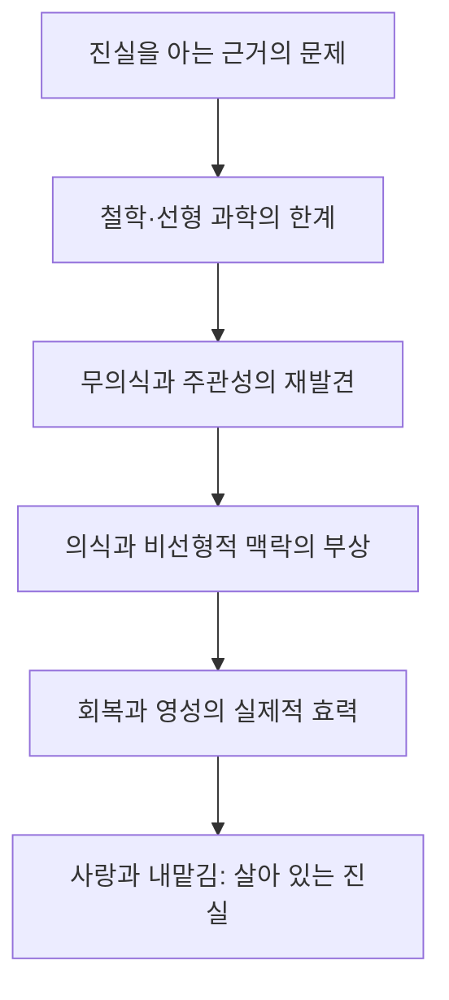

# 『진실 대 거짓』 제3장 「수수께끼로서의 진실: 도전과 투쟁」

# 『진실 대 거짓』 제3장 「수수께끼로서의 진실: 도전과 투쟁」

## 1. 이 장의 핵심

이 장에서 호킨스 박사님께서 밝히시는 중심 명제는 다음과 같습니다.

> 진실을 탐구하는 모든 철학과 과학은 이미 ‘아는 능력’을 사용하고 있다. 따라서 그 아는 능력의 기층인 의식을 이해하지 못하면, 진실에 관한 탐구는 마음이 만든 개념 안에서 순환할 수밖에 없다.

뇌과학은 경험이 일어날 때의 뇌 작용을 설명할 수 있고, 철학은 앎의 조건을 개념적으로 논할 수 있습니다. 그러나 두 접근 모두 다음의 근본 문제를 남깁니다.

- 뇌의 변화를 알아차리는 것은 무엇인가?
- 철학적 개념이 옳다고 판단하는 능력은 어디에서 오는가?
- 생각·감정·감각이 나타났다가 사라지는 것을 알고 있는 바탕은 무엇인가?

호킨스 박사님의 답은 ‘의식 자체’입니다. 의식은 우리가 관찰하는 수많은 대상 가운데 하나가 아니라, 모든 관찰·경험·앎이 가능하게 되는 선험적 기층입니다.

따라서 이 장은 단순한 지성사가 아닙니다. 철학, 과학, 심리학, 정신의학, 종교, 12단계 회복 프로그램, 사랑과 용서를 차례로 살펴보면서, 인류가 어떻게 ‘마음에 의한 앎’에서 ‘의식에 의한 앎’으로 접근해 왔는지를 보여주는 장입니다.

## 2. 장 전체의 전개 지도

겉으로는 서로 다른 주제가 이어지는 것처럼 보이지만, 모두 한 가지 물음에 답합니다.

> 진실은 생각으로만 정의되는 것인가, 아니면 삶과 존재를 실제로 변형시키는 힘으로도 확인되는가?

호킨스 박사님께서는 후자를 포함해야 완전한 진실의 과학이 된다고 보십니다.

---

## 3. 왜 의식의 본성이 먼저 밝혀져야 하는가

### 기계적 환원주의의 한계

뇌 화학의 기계적 환원주의는 정신적 경험을 신경전달물질, 신경회로, 전기적 활동으로 설명합니다. 이러한 설명은 매우 유용하지만, 호킨스 박사님께서 보시기에 경험의 물질적 상관관계를 설명할 뿐 ‘경험하고 있음’ 자체를 설명하지는 못합니다.

예를 들어 두려움을 느낄 때 특정한 뇌 영역이 활성화된다는 사실은 확인할 수 있습니다. 그러나 다음은 여전히 남습니다.

- 그 두려움을 주관적으로 경험하는 것은 무엇인가?
- 뇌 영상을 보고 그 의미를 아는 능력은 어디에서 오는가?
- 동일한 사건을 사람마다 다르게 경험하는 이유는 무엇인가?

그러므로 박사님께서는 뇌의 작용을 부정하시는 것이 아니라, 뇌 화학을 인간 경험 전체의 최종 원인으로 보는 축소된 맥락을 넘어가십니다.

### 철학적 주지화의 한계

철학은 훨씬 높은 수준에서 ‘앎’을 탐구하지만, 마음이 마음 자체를 조사한다는 어려움에 부딪힙니다. 하나의 개념을 다른 개념으로 설명하고, 그 개념을 다시 또 다른 개념으로 정당화하면 끝없는 순환이 일어납니다.

이것이 장 첫머리에 나오는 인식론적 질문들의 의미입니다. 마음은 “우리는 어떻게 아는가?”라고 묻지만, 그 질문을 제기하고 이해하는 능력 자체는 이미 의식에 의존하고 있습니다.

의식은 추론을 거쳐 만들어지는 결론이 아닙니다. 생각이 있든 없든, 생각이 있다는 사실을 알아차리게 해주는 바탕입니다. 이런 의미에서 의식은 모든 논증보다 앞서 있습니다.

---

## 4. 뉴턴적 과학에서 양자역학으로

### 뉴턴적 패러다임의 위대한 성취

뉴턴적 패러다임은 형상, 구조, 시간적 순서, 원인과 결과를 정확하게 다룹니다. 선형적 조건이 동일하다면 결과도 어느 정도 예측할 수 있습니다. 이 때문에 과학은 기술, 의학, 산업, 교통 등에서 눈에 보이는 성과를 제공했고, 사회는 보이지 않는 종교적 권위보다 검증 가능한 과학에 더 큰 신뢰를 두게 되었습니다.

호킨스 박사님께서는 이러한 과학의 효용을 부정하지 않으십니다. 문제는 뉴턴적 과학이 잘 다루는 영역을 실재 전체와 동일시할 때 생깁니다.

측정할 수 없는 주관적 경험을 실체 없는 것으로 취급하면, 기쁨·의미·사랑·고통·아름다움처럼 인간에게 가장 중요한 현실이 설명에서 제외됩니다.

### 양자역학이 열어 놓은 문

양자역학과 하이젠베르크 불확정성 원리는 단순한 기계적 결정론으로는 실상을 완전히 묘사할 수 없음을 보여주었습니다. 관찰 조건, 확률, 잠재성, 관찰자의 개입이 더 이상 무시될 수 없게 된 것입니다.

다만 양자역학 자체는 460으로 측정됩니다. 즉 양자역학이 곧바로 영적 실상을 증명한다는 뜻은 아닙니다. 양자역학은 여전히 고도의 수학과 지성에 의한 과학이지만, 뉴턴적 객관주의가 실재를 독점할 수 없다는 사실을 밝혀 준 교량입니다.

정리하면 다음과 같습니다.

- 뉴턴적 과학은 나타난 형상의 규칙을 설명합니다.
- 양자역학은 형상 이전의 잠재성과 관찰 조건을 드러냅니다.
- 의식 연구는 잠재성이 현실성으로 나타나는 전체적 장과 앎의 기층을 다룹니다.

---

## 5. 『서양의 위대한 책들』 표의 의미

이 표는 단순히 사상가들의 우열을 정하려는 목록이 아닙니다. 인류 최고의 지성들이 수천 년 동안 진실을 찾기 위해 얼마나 엄청난 노력을 기울였는지를 보여주는 역사적 증거입니다.

그럼에도 방대한 지식의 축적은 진실에 관한 보편적 합의를 만들어내지 못했습니다. 마음은 더 많은 자료와 더 정교한 논리를 생산했지만, 진실을 판단하는 최종 근거까지 스스로 제공하지는 못했습니다.

### 측정값을 읽는 방법

표의 측정값은 한 인간의 영원한 가치나 고정된 등급이라기보다, 그 저작과 사상 체계가 표현하는 의식의 장을 가리키는 것으로 읽어야 합니다.

특히 다음과 같은 구분이 중요합니다.

- 뉴턴이라는 인물과 저작은 499이지만, 일반적인 뉴턴적 패러다임은 460입니다.
- 프로이트의 저작은 499이지만, 정신분석의 개별 주장들이 모두 499라는 뜻은 아닙니다.
- 소크라테스는 저술가로서가 아니라 그분의 의식과 가르침 자체가 540으로 제시됩니다.
- 단테·플로티누스·아우구스티누스가 500을 넘는 것은 지성만이 아니라 영적 맥락을 포함하기 때문입니다.

『위대한 책들』 전체는 450이지만 마르크스를 제외하면 465로 올라갑니다. 이는 호킨스 박사님의 체계에서 하나의 영향력이 전체 장의 성질을 바꿀 수 있으며, 영향력은 단순한 산술평균으로 작동하지 않는다는 점을 보여줍니다.

가장 중요한 점은 높은 지능과 높은 의식 수준이 동일하지 않다는 것입니다. 지능은 복잡한 내용을 처리하는 능력이고, 의식 수준은 그 내용을 바라보는 맥락·의도·정직성·생명 지향성의 수준입니다.

---

## 6. 프로이트에서 융으로: 주관성의 귀환

### 프로이트의 공헌

프로이트는 인간이 자신이 의식적으로 생각하는 것보다 훨씬 더 깊은 무의식의 영향을 받는다는 사실을 밝혔습니다. 이로써 인간 경험은 외부 사건의 단순한 반영이 아니라, 내면의 기억·욕망·갈등·해석을 통해 형성된다는 점이 드러났습니다.

프로이트의 중요성은 객관적 사건만을 보던 탐구에 ‘그 사건이 한 사람에게 어떻게 경험되는가’를 다시 포함시킨 데 있습니다. 하지만 프로이트의 저작은 499로 측정됩니다. 인간의 내면을 깊이 탐구했지만 여전히 마음과 심리적 역동의 범위 안에 머물렀다는 뜻입니다.

### 융의 패러다임 도약

융은 개인적 무의식을 넘어 집단적 무의식, 원형, 인간 영의 의미를 포함했습니다. 이 때문에 융의 저작은 520으로 측정됩니다.

이는 단순히 프로이트보다 지적으로 한 단계 더 뛰어나다는 뜻이 아닙니다. 인간을 욕망과 심리 기제의 집합으로 보는 맥락에서, 의미·상징·영혼·전체성을 지닌 존재로 보는 맥락으로 전환되었다는 뜻입니다.

### “지도는 영토가 아니다”

이 문장은 이 장 전체를 압축합니다.

- 지도는 개념·이론·단어·진단·설명입니다.
- 영토는 직접 존재하고 경험되는 실상입니다.

‘사랑’이라는 단어를 분석하는 것과 실제 사랑임은 다릅니다. 음식의 화학 성분을 아는 것과 맛을 경험하는 것도 다릅니다. 어떤 사람에게 붙은 정신의학적 진단명 역시 그 사람의 존재 전체는 아닙니다.

마음은 자신이 만든 지도를 실상 자체라고 믿는 경향이 있습니다. 호킨스 박사님께서 말씀하시는 의식의 과학은 지도의 정교함을 높이는 데 그치지 않고, 지도와 영토를 구별할 수 있는 앎의 기층을 밝히려는 것입니다.

---

## 7. 데이비드 봄과 의식 연구의 ‘유리 천장’

데이비드 봄의 함축된 질서와 나타난 질서는 보이지 않는 잠재적 기층에서 가시적 현실이 펼쳐진다는 관점을 제공합니다. 호킨스 박사님께서는 이를 선형적 형상과 비선형적 장을 연결하는 발전된 맥락으로 보시며, 봄의 연구를 505로 제시하십니다.

그러나 ‘과학과 의식’을 연구하는 학회와 학술지는 대체로 410∼450으로 측정됩니다. 연구 주제가 의식이라고 해서 연구자의 앎이 자동으로 500을 넘는 것은 아니기 때문입니다.

여기에는 결정적인 구분이 있습니다.

| 의식에 관해 아는 것 | 의식으로 말미암아 아는 것 |
|---|---|
| 의식을 연구 대상으로 삼음 | 의식이 모든 대상 경험의 기층임을 알아봄 |
| 이론·수학·뇌 모델을 이용함 | 환원할 수 없는 주관성을 직접 인정함 |
| 설명과 표상을 축적함 | 앎의 근원과 동일성을 발견함 |
| 400대의 지성적 접근 | 500 이상에서 열리는 맥락 |

의식을 아무리 정교하게 객관화해도, 객관화하는 주체의 본성을 제외한다면 연구는 ‘의식에 관한 지도’에 머물게 됩니다. 이것이 박사님께서 말씀하시는 지성의 유리 천장입니다.

---

## 8. 정신의학·정신요법·영성의 관계

이 부분에서 호킨스 박사님께서는 정신약리학의 이로움도 분명히 인정하십니다. 약물은 정신병, 우울, 불안 등으로 생기는 심각한 괴로움을 완화했고, 과거에는 값비싼 장기 치료를 받을 수 없었던 많은 사람에게 도움을 제공했습니다.

문제는 인간 전체를 뇌 화학으로만 설명할 때입니다. 그러면 사람의 고유한 삶, 의미, 관계, 성장 과정과 주관적 경험이 부차적인 것으로 밀려납니다.

비의료인 심리 치료자들은 이 공백을 채우면서 다음을 되살렸습니다.

- 공감받는 관계
- 감정에 대한 이해
- 삶의 연속성과 개인적 의미
- 인간 심령의 영적 차원
- 몸·마음·영을 함께 바라보는 치유

따라서 박사님의 관점은 약물과 영성 중 하나를 택하는 구도가 아닙니다. 뇌 화학은 인간 경험의 한 층이며, 그 층을 주관성·의식·의미라는 더 큰 맥락에 포함해야 한다는 것입니다.

---

## 9. 12단계 회복 프로그램이 중요한 이유

12단계 회복 프로그램은 이 장에서 가장 강력한 실제 사례입니다. 박사님께서는 익명의 알코올중독자회를 540으로 측정하십니다.

그 힘은 특별한 지식이나 복잡한 이론에 있지 않습니다.

- 자신의 상태에 대한 철저한 정직성
- 작은 자아의 한계를 인정하는 겸손
- 자신보다 더 큰 힘을 받아들이는 태도
- 타인을 판단하지 않는 지지
- 대가를 요구하지 않는 봉사
- 부·명망·정치적 영향력의 거절
- 외부 논쟁에 가담하지 않는 내적 규율

12단계 운동이 상업화와 권력 추구를 거절한 것은 부차적인 운영 원칙이 아닙니다. 그것이 기반으로 삼은 영적 진실의 장이 오염되지 않게 보호하는 핵심 조건입니다.

중독자가 자신의 무력함을 정직하게 인정하는 순간, 표면적으로는 약해진 것처럼 보이지만 실제로는 처음으로 진실과 정렬됩니다. 거짓된 자기 통제의 환상이 내려가면서 더 큰 힘을 받아들일 수 있게 됩니다.

『치유와 회복』의 관련 설명까지 함께 보면, 12단계 프로그램의 힘은 개별 기법보다 집단의 무조건적 사랑과 비난 없는 수용에서 나옵니다. 사람은 자신의 행동만으로 규정되지 않고, 존재 자체로 받아들여집니다. 바로 이 장이 회복을 가능하게 합니다.

---

## 10. 지식의 독점과 종교적 권위

역사적으로 지식은 언제나 널리 공개되어 있지 않았습니다. 소수의 교육받은 계층과 종교 기관이 지식을 보존했으며, 이는 문명을 유지하는 데 필요하기도 했습니다.

교회의 권위와 정경화 역시 처음에는 분열을 막고 가르침의 일관성을 유지하려는 기능을 가졌습니다. 그러나 지식의 독점이 타인을 통제하는 수단으로 변하면, 진실의 본질보다 교리적 세부와 권위의 유지가 앞서게 됩니다.

호킨스 박사님께서 강조하시는 것은 중심과 주변의 구분입니다.

- 높은 진실은 사람들을 통합합니다.
- 논쟁적인 마음은 사소한 차이를 확대합니다.
- 본질은 문화가 달라도 반복해서 발견됩니다.
- 교리적 형상은 시대와 문화에 따라 달라질 수 있습니다.

서로 교류하지 않은 문화와 시대에서 동일한 영적 진실이 독립적으로 발견되었다는 사실은 일종의 반복적 확증으로 제시됩니다. 과학에서 동일한 조건 아래 결과가 되풀이되는 것이 중요하듯, 영적 진실도 서로 다른 문화권의 현인들에게서 본질적으로 동일하게 드러났다는 것입니다.

---

## 11. 499와 500 사이의 결정적 경계

이 장에서 가장 중요한 숫자는 499와 500입니다. 단 한 점의 차이처럼 보이지만, 로그 척도에서 이는 양적 증가가 아니라 패러다임의 전환입니다.

| 499까지의 선형적 영역 | 500부터 열리는 새로운 맥락 |
|---|---|
| 이성·논리·상징 | 사랑·의미·가치 |
| 대상과 내용 중심 | 주관성과 전체적 맥락 중심 |
| 분석을 통해 부분을 이해함 | 전체 속에서 부분의 의미를 알아봄 |
| ‘무엇에 관해 아는 것’ | 존재와의 일치를 통해 아는 것 |
| 자기 이익이 중심이 되기 쉬움 | 타인의 행복과 생명에 대한 배려 |
| 객관적 묘사를 실재로 여김 | 경험을 가능하게 하는 의식을 알아봄 |

500에서 이성이 사라지는 것은 아닙니다. 이성은 사랑이라는 더 큰 맥락의 인도를 받게 됩니다. 400대의 이성은 내용의 정확성을 제공하고, 500대의 사랑은 그 지식이 어떤 목적과 방향을 위해 사용될지를 결정합니다.

또한 500에서 비선형적 맥락이 우세해지기 시작하지만, 선형적 동일시가 본격적으로 초월되는 수준은 600 이상입니다. 따라서 500은 비선형적 실상으로 들어가는 입구이고, 600은 그 실상이 지배적으로 드러나는 더 깊은 전환으로 이해할 수 있습니다.

---

## 12. 높은 의식 수준이 인류를 상쇄한다는 의미

박사님께서는 이 책이 쓰인 시점의 측정 결과로 인류 전체의 의식 수준을 207로 제시하시고, 600 이상으로 측정되는 익명의 현인들이 여섯 명 존재한다고 밝히십니다.

이 설명은 의식의 힘이 사람 수에 비례하지 않는다는 원리에 근거합니다. 의식 척도는 로그적으로 상승하므로, 극소수의 높은 의식장이 다수의 부정적 장을 상쇄할 수 있습니다.

따라서 현인들의 중요성은 유명세나 사회적 활동량에 있지 않습니다. 그분들의 존재 자체가 집단의식에 영향을 미칩니다. 이는 사랑이 어떤 행동 하나가 아니라 ‘사람이 되어 있는 상태’라는 뒤의 설명과도 연결됩니다.

의식 수준 역시 인간의 사회적 서열이나 고정된 신분을 가리키지 않습니다. 현실을 받아들이고 해석하는 방식, 그리고 그 존재에서 방사되는 장의 성질을 나타냅니다.

---

## 13. 사랑은 감정이 아니라 더 높은 앎의 방식이다

이 장의 마지막 부분에서 사랑이 등장하는 것은 갑작스러운 윤리적 결론이 아닙니다. 사랑은 진실을 인식하는 더 높은 능력으로 제시됩니다.

### 사랑의 발달

처음의 사랑은 이원적입니다.

- 내가 누군가를 사랑한다.
- 내가 어떤 대상을 사랑한다.
- 사랑하는 주체와 사랑받는 대상이 분리되어 있다.

사랑이 진화하면 특정 대상을 향한 감정에서 벗어나 사랑임이라는 존재 방식이 됩니다. 사랑할 대상이 있어야만 작동하는 감정이 아니라, 모든 생명과 관계를 맺는 기본 상태가 되는 것입니다.

그에 따라 중심도 바뀝니다.

- 얻는 것에서 주는 것으로
- 소유에서 보살핌으로
- 특별한 대상에서 생명 전체로
- 부분적 내용에서 전체적 장으로
- 일시적 만족에서 내재적 행복으로

사랑은 단지 마음을 따뜻하게 만드는 감정이 아닙니다. 대상을 자기 이익의 관점으로 왜곡하지 않고, 그 존재의 본질과 전체적 맥락을 알아보게 하는 앎의 능력입니다.

### 사랑이 치유를 가져오는 과정

분개와 비난을 붙들고 있을 때에는 자기 안의 죄책감과 자기혐오가 타인에게 투사됩니다. 타인을 계속 유죄로 만들어야 자기 내면의 고통을 보지 않아도 되기 때문입니다.

용서가 일어나면 이 투사 구조가 약해집니다. 타인을 정당하다고 선언하는 것이 아니라, 타인을 심판하는 이야기에 자신의 생명 에너지를 계속 공급하지 않게 되는 것입니다. 그 결과 부정적 감정이 줄고, 지각과 뇌의 정보 처리 방식도 달라집니다.

따라서 용서는 다음을 뜻하지 않습니다.

- 해로운 행동을 옳다고 인정하는 것
- 필요한 보호나 분별을 포기하는 것
- 사건의 기억을 억지로 지우는 것
- 다시 같은 관계에 들어가야 한다는 것

용서는 과거의 사건이 현재의 의식을 계속 지배하도록 허용하지 않는 것입니다.

---

## 14. 450의 용서와 550의 용서

장 마지막의 두 측정값은 499와 500의 차이를 일상적인 언어로 압축합니다.

### “용서하고 잊으려는 자발성” — 450

이 단계에서는 이성과 의지를 통해 분개를 그만 붙들기로 결정합니다. 사건을 계속 재생하고 보복하려는 마음이 아무런 이로움도 주지 않는다는 점을 이해합니다.

이는 건전하고 높은 이성의 수준입니다. 그러나 여전히 ‘내가 용서한다’는 행위의 주체가 남아 있습니다.

### “용서하고 신께 내맡기려는 자발성” — 550

여기서는 타인에 대한 심판권, 결과를 통제하려는 욕망, 정의를 내가 완성해야 한다는 부담까지 신께 맡깁니다. 용서가 개인적 결단을 넘어 사랑과 신뢰의 장 안에서 이루어집니다.

차이는 다음과 같습니다.

- 450에서는 마음이 원한을 놓습니다.
- 550에서는 마음과 함께 사건의 소유권과 심판권도 신께 맡깁니다.
- 450은 높은 이성의 용서입니다.
- 550은 사랑과 신뢰에서 나오는 용서입니다.

---

## 15. 에고가 오히려 영적 도약대가 되는 역설

에고는 처음에는 자기 이익만을 추구합니다. 그런데 어느 순간 이타심, 정직성, 겸손, 용서가 자기 자신에게도 훨씬 큰 평안과 행복을 준다는 사실을 발견합니다.

이때 에고의 사리 추구가 역설적으로 자기 초월의 입구가 됩니다.

1. 에고는 자기중심적 행동이 고통을 반복한다는 것을 배웁니다.
2. 정직과 이타심이 더 큰 이로움을 준다는 사실을 받아들입니다.
3. 겸손을 약함이 아니라 현실을 정확히 보는 힘으로 이해합니다.
4. 자신보다 큰 힘을 신뢰할 가능성이 열립니다.
5. 사랑은 감정에서 존재 방식으로 발전합니다.

그러므로 박사님께서는 에고를 단순히 파괴해야 할 적으로만 보지 않으십니다. 에고가 자기 한계를 정직하게 인정하면, 바로 그 한계의 발견이 에고를 넘어서는 발판이 됩니다.

---

## 16. 다른 프로젝트 저서들과의 연결

| 관련 저서 | 제3장과 직접 연결되는 내용 |
|---|---|
| 『의식 수준을 넘어서』 | 500에서 선형적 내용보다 비선형적 맥락이 우세해지고, 사랑이 감정에서 생활 양식으로 발전한다는 설명 |
| 『호모 스피리투스』 | 의식은 생각이나 지각의 내용이 아니라 앎·목격·관찰을 가능하게 하는 원초적 기층이라는 설명 |
| 『치유와 회복』 | 중독 회복은 자신의 상태에 관한 철저한 정직성에서 시작되며, 12단계 집단의 540 장이 무조건적 사랑과 치유를 제공한다는 설명 |
| 『나의 눈』 | 마음이 만들어낸 내용과 그것을 비추는 의식의 차이, 주관성이 실상의 환원 불가능한 기층이라는 설명 |
| 『의식 혁명』 | 진실과 거짓의 차이가 단순한 지적 의견이 아니라 생명을 지지하거나 약화시키는 비선형적 힘의 차이라는 설명 |

이 자료들을 함께 놓고 보면 제3장의 흐름이 더욱 선명해집니다. ‘의식에 관한 이론’을 세우는 것이 목적이 아니라, 모든 이론과 경험이 나타나는 기층이 의식임을 밝히는 것이 목적입니다.

## 17. 전체 통합 정리

「수수께끼로서의 진실: 도전과 투쟁」에서 말하는 수수께끼는 진실이 본래 모호해서 생기는 것이 아닙니다. 진실을 찾는 도구인 마음이 자기 한계를 알아보지 못하기 때문에 생깁니다.

인류의 위대한 철학과 과학은 선형적 세계를 거의 완전하게 설명하는 499까지 도달했습니다. 그러나 마음은 실상을 설명하는 지도를 만들 수 있을 뿐, 그 지도를 보고 경험하고 이해하는 의식의 근원까지 스스로 만들어낼 수는 없습니다.

프로이트는 주관성과 무의식을 되살렸고, 융은 영과 전체성을 포함했으며, 양자역학과 데이비드 봄은 보이는 형상 뒤의 잠재성과 맥락을 가리켰습니다. 정신요법과 영적 치유는 인간이 뇌 화학 이상의 존재임을 다시 확인했고, 12단계 회복 프로그램은 정직성·겸손·무조건적 사랑이 실제 삶을 변형시키는 힘임을 보여주었습니다.

이 모든 흐름은 499와 500의 경계로 모입니다. 499까지 진실은 정확하게 생각하는 문제이지만, 500부터 진실은 사랑과 정렬되어 존재하는 문제가 됩니다. 사랑은 이성의 반대가 아니라 이성을 더 큰 맥락 안에 놓는 힘이며, 대상을 분석하는 능력을 넘어 그 본질과 전체성을 알아보게 하는 높은 앎입니다.

따라서 이 장의 최종 결론은 다음과 같습니다.

> 진실의 최종 근거는 더 많은 정보나 더 복잡한 논리가 아니라, 모든 앎을 가능하게 하는 의식 자체이다. 그리고 의식이 자기중심적 내용의 제한을 넘어설 때, 진실은 사랑·정직성·겸손·용서·내맡김이라는 살아 있는 힘으로 드러난다.

---
