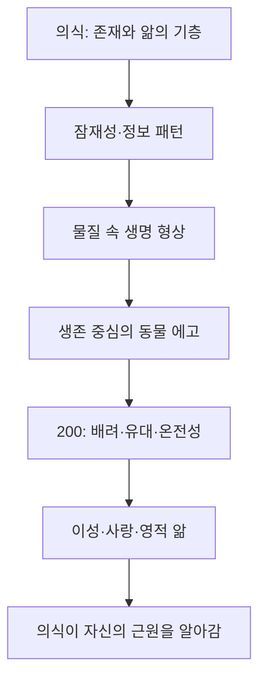

# 『진실 대 거짓』 제4장 「의식의 진화」

# 『진실 대 거짓』 제4장 「의식의 진화」

## 이 장의 핵심

호킨스 박사님께서는 이 장에서 일반적인 진화관의 방향을 뒤집으십니다. 통상적인 관점은 물질이 복잡해지면서 생명과 마음과 의식이 생겨났다고 보지만, 박사님께서는 **의식이 먼저이며, 물질·생명·마음은 의식에 내재한 잠재성이 형상으로 펼쳐진 결과**라고 설명하십니다.

따라서 인간의 마음도 의식의 근원이 아니라 의식 안에 나타나는 하나의 기능입니다. 동물적 생존 에고, 인간의 이성, 사랑과 영적 앎은 서로 단절된 현상이 아니라, 의식이 자신의 더 높은 잠재성을 차례로 드러내는 하나의 진화 과정입니다.

## 1. 마음은 의식의 근원이 아니라 의식의 산물입니다

이 장의 첫 번째 전환은 인간을 ‘생각하는 존재’로만 규정해 온 지적 전통을 넘어서는 것입니다.

마음은 사고하고, 비교하고, 기억하고, 추론하고, 상징을 조작할 수 있습니다. 그러나 마음이 작동하고 있다는 사실을 **알고 있는 능력**은 마음 그 자체가 아닙니다. 생각은 알려지는 대상이고, 의식은 그 생각을 알아차리는 기층입니다.

이 차이가 두 명제의 측정치에 나타납니다.

| 명제 | 측정 수준 | 의미 |
|---|---:|---|
| “나는 생각한다, 고로 나는 존재한다.” | 400 | 존재를 사고로부터 추론합니다. 마음이 근원처럼 간주됩니다. |
| “나는 존재한다, 고로 나는 생각한다.” | 480 | 존재와 의식이 먼저이고, 생각은 그에 뒤따르는 기능임을 인정합니다. |

잠들었거나 생각이 잠시 멎어도 존재 자체가 없어지는 것은 아닙니다. 또한 사람은 생각을 관찰하고 “이 생각은 틀렸다”고 알아차릴 수도 있습니다. 생각을 관찰하고 교정할 수 있다면, 관찰자는 생각보다 선행합니다.

주지화가 410으로 측정된다는 말은 지성이 가치 없다는 뜻이 아닙니다. 지성은 과학·철학·논리·문명의 발전에 필수적이지만, **자신이 의존하는 의식의 근원을 자신의 개념만으로 포착할 수는 없다**는 뜻입니다. 도구가 자신을 가능하게 하는 근원 전체를 측정할 수 없는 것과 같습니다.

### 마음의 ‘순진한 추정성’

마음은 거의 모든 생각에 다음과 같은 무언의 전제를 붙입니다.

> “내가 그렇게 생각하므로 이것은 사실일 것이다.”

이 때문에 의견은 자신도 모르게 사실로 승격됩니다. 사람마다 자신의 세계관을 당연한 현실로 여기고 다른 세계관을 오류로 봅니다. 박사님께서 말씀하시는 마음의 순진함은 악의가 아니라, **마음이 자신이 만든 지각과 해석을 실상 자체로 오인하는 구조적 한계**입니다.

## 2. 생명과 생명 형상은 동일하지 않습니다

마음이 의식의 산물이라면 다음 질문은 의식 자체의 본질입니다. 박사님께서는 의식을 생명에 부가된 기능이 아니라, **생명 자체의 본질적 성질이자 표현**으로 설명하십니다.

여기서 가장 중요한 구분은 생명과 생명 형상의 구분입니다.

| 생명 | 생명 형상 |
|---|---|
| 비선형적이며 근원적으로 형상 없음 | 육체·세포·유기체처럼 관찰 가능함 |
| 의식과 존재의 연속성 | 출생·성장·쇠퇴·죽음의 변화가 있음 |
| 파괴되지 않고 표현을 바꿈 | 특정 형태는 해체되고 다른 형태로 전환됨 |
| 근원 | 생명이 나타나는 일시적 매개체 |

따라서 “생명은 파괴될 수 없고 형상만 바꾼다”는 측정 수준 1,000의 진술은 육체가 영구히 보존된다는 뜻이 아닙니다. **죽음은 특정 육체 형상의 종결이지 생명 원리와 주관성 자체의 소멸이 아니라는 뜻**입니다.

보통 사람에게 죽음이 최종적인 것으로 보이는 까닭은 생명을 육체와 동일시하기 때문입니다. 몸이 사라지는 것을 보고 생명도 사라졌다고 결론짓는 것입니다. 박사님의 관점에서는 몸이 생명을 만들어 내는 것이 아니라, 생명이 몸을 통해 일정 기간 자신을 표현합니다.

『나의 눈』에서도 같은 원리가 더욱 간결하게 제시됩니다. 생명은 생명 아닌 것이 될 수 없으며, 오직 형상과 표현만 바꿀 수 있다는 것입니다.

## 3. 마음으로는 인간의 궁극적 질문에 답할 수 없습니다

인류는 오랫동안 다음을 물어 왔습니다.

- 우리는 누구인가?
- 어디에서 왔는가?
- 육체의 죽음 뒤에는 어떻게 되는가?
- 존재의 근원은 무엇인가?

마음은 물질을 세밀하게 분석하고 우주의 구조를 수학적으로 기술할 수 있습니다. 그러나 마음은 의식 안에서 발생하는 기능이므로, 의식의 근원까지 마음의 개념 안에 완전히 가둘 수는 없습니다.

이는 눈이 모든 외부 대상을 볼 수 있지만, 별도의 반사면 없이는 자신을 직접 볼 수 없는 것과 비슷합니다. 인간의 궁극적 질문은 마음이 더 많은 정보를 축적한다고 저절로 풀리는 문제가 아니라, **마음을 가능하게 하는 의식의 본성을 탐구할 때 비로소 밝혀지는 문제**입니다.

## 4. 나타나지 않은 잠재성에서 나타난 세계로

이 장에 인용된 당시의 우주 구성 비율은 가시적 물질 4퍼센트, 암흑 물질 23퍼센트, 암흑 에너지 73퍼센트입니다. 박사님께서는 이를 보이지 않는 잠재성과 보이는 현실의 관계를 설명하는 비유로 사용하십니다.

- 보이지 않는 영역: 아직 형상으로 드러나지 않은 잠재성
- 보이는 영역: 잠재성이 조건을 만나 관찰 가능한 형상으로 나타난 상태

핵심은 보이지 않는 것이 ‘아무것도 없음’을 뜻하지 않는다는 점입니다. 라디오 전파나 디지털 정보처럼 눈에 보이지 않으면서도 정교한 패턴과 지시 정보를 포함할 수 있습니다. 수신 장치가 적절한 조건을 갖추면, 보이지 않던 정보가 소리·영상·형상으로 펼쳐집니다.

박사님의 진화관도 이와 같습니다.

> 의식의 장에 잠재성과 정보 패턴이 먼저 존재하고, 물질적 조건이 갖추어질 때 생명 형상으로 출현합니다.

따라서 진화는 무질서한 물질에서 지성이 우연히 제조되는 과정이 아니라, **의식에 내재한 지성이 점차 복잡한 형상으로 표현되는 과정**입니다.

## 5. 잠재성·패턴·의도는 어떻게 연결되는가

루퍼트 셸드레이크의 형태 발생장은 형상과 기능의 원형적 패턴이 물질 형상보다 먼저 의식의 장 안에 존재한다는 설명에 사용됩니다.

여기서 원기(Anlage)는 완성된 생명체가 미리 존재한다는 뜻이 아니라, 어떤 형상으로 발달할 수 있는 **패턴화된 가능성 또는 정보의 씨앗**을 뜻합니다.

과정은 다음과 같습니다.

1. 의식의 장 안에 잠재적 패턴이 존재합니다.
2. 물질적·환경적 조건이 유리해집니다.
3. 의도가 잠재성을 활성화합니다.
4. 잠재성이 관찰 가능한 현실로 출현합니다.

의도는 모든 것을 무에서 창조하는 개인적 원인이 아닙니다. 이미 존재하는 잠재성이 현실로 나타나도록 돕는 활성화 요소입니다. 박사님의 용어로 말하면, 개인의 의지는 제일 원인이 아니라 **잠재성과 정렬되는 방아쇠**에 가깝습니다.

### 지성과 주관성의 차이

바이러스와 박테리아에 관한 설명에서는 ‘지성’과 ‘의식’을 구분해야 합니다.

- 지성: 정보가 조직되고 복제되며 특정 기능을 수행하도록 하는 질서
- 의식: 경험하고 알아차리는 주관적 능력

바이러스의 DNA에는 놀라운 정보와 복제 구조가 있지만, 바이러스 자체에는 주관적 경험이 없다고 설명됩니다. 반면 박테리아는 최소한의 주관성이 출현한 최초의 유기체로서 수준 1로 측정됩니다.

따라서 “바이러스에 지성이 있다”는 표현은 바이러스가 생각하거나 판단한다는 뜻이 아니라, **바이러스 구조에 의식장의 정보적 질서가 반영되어 있다는 뜻**입니다.

## 6. 최초의 에고는 생존 장치였습니다

초기 생명에게 가장 중요한 일은 생존에 필요한 에너지를 얻는 것이었습니다. 자가 번식, 자기 이익, 에너지 획득, 위험 회피는 생존을 위한 선험적 조건이었습니다.

이 단계의 자기중심성은 도덕적 결함이 아닙니다. 아직 타자의 입장을 고려할 수 있는 의식 능력이 발달하지 않은 상태에서 작동하는 생존 구조입니다.

- 식물은 광합성을 통해 에너지를 얻습니다.
- 미생물은 환경의 분자를 흡수합니다.
- 포식자는 다른 생명체를 음식으로 섭취합니다.
- 동물은 먹이·적·영역·짝을 구분합니다.

이 과정에서 지각, 욕망, 두려움, 공격성, 경쟁, 위장, 영토 방어 같은 에고의 기본 기능이 발달합니다. 인간 에고는 별도로 창조된 악한 실체가 아니라, **동물계에서 오랜 시간 생존을 담당했던 기능들이 인간 심령 안에 계속 남아 있는 것**입니다.

## 7. 동물계 표를 읽는 올바른 방법

이 표에는 종 전체, 개별 동물, 그리고 특정 행동이 함께 들어 있습니다. 이 세 가지를 구분해야 합니다.

| 측정 대상 | 예 | 의미 |
|---|---|---|
| 종 또는 집단의 평균 | 고릴라 275, 침팬지 305 | 해당 집단에서 일반적으로 지배적인 의식 수준 |
| 예외적인 개체 | 앵무새 알렉스 401, 고릴라 코코 405 | 훈련·관계·학습을 통해 높은 잠재성이 발현된 개체 |
| 특정 행동의 수준 | 고양이의 가르랑거림 500, 개의 꼬리 흔들기 500 | 동물 전체가 아니라 그 순간 표현되는 사랑·기쁨의 질 |

따라서 집고양이의 평균이 245이고 가르랑거림이 500인 것은 모순이 아닙니다. 하나의 생명체가 평소에는 특정 수준에서 기능하면서도 어떤 행동에서는 훨씬 높은 에너지 성질을 표현할 수 있기 때문입니다.

놀이가 평소 기능보다 약 10점 높고, 사람에게 입양된 동물이 5∼10점 상승한다는 설명도 같은 원리입니다. 사랑과 관심이 있는 관계 안에서 동물에게 내재한 높은 잠재성이 활성화됩니다. 장기간 인간과 교류한 동물의 추론 능력이 400대에 도달할 수 있다는 것도, 의식수준이 고정된 생물학적 등급이 아니라 **관계와 환경에 따라 잠재성이 표현되는 정도**임을 보여 줍니다.

고양이의 가르랑거림, 명금류의 노래, 개의 꼬리 흔들기가 500으로 측정되는 이유는 그 행동이 계산이나 이득을 위한 것이 아니라, 존재의 기쁨과 애정이 비교적 순수하게 방사되는 순간이기 때문입니다. 이러한 사랑의 에너지 때문에 반려동물이 사람에게 안정감과 치유 효과를 줄 수 있다고 설명됩니다.

## 8. 200은 양적 상승이 아니라 질적 전환입니다

의식수준 200은 동물계와 인간계 모두에서 결정적인 분수령입니다.

| 200 이하 | 200 이상 |
|---|---|
| 생존과 자기 이익이 중심 | 타자의 생명과 권리를 인정함 |
| 다른 존재를 수단으로 봄 | 다른 존재도 고유한 가치를 지닌다고 봄 |
| 힘으로 빼앗고 지배함 | 온전성·책임·협력에 의지함 |
| 충동과 감정이 판단을 지배함 | 자제와 배려가 출현함 |
| 자기중심적 지각 | 상호성과 공동선을 인식함 |

동물계에서는 200 부근에서 다른 생명체를 잡아먹지 않고도 생존하는 온건한 초식동물이 출현합니다. 이들은 배설물을 통해 토양을 비옥하게 하고 씨앗을 퍼뜨려 다른 생명을 부양합니다. 생존 방식이 단순한 소비에서 생태계에 대한 기여로 바뀌는 것입니다.

그러나 더 중요한 변화는 새끼 보호와 모성 본능입니다. 생명체가 처음으로 자신의 생존을 넘어 다른 생명의 생존을 돌보기 시작합니다.

> 알 보호 → 새끼 보호 → 모성 유대 → 가족적 애착 → 무리와 사회 형성

이것이 나중에 사랑으로 성장할 잠재성의 전주곡입니다.

다만 집단 유대가 생겼다고 곧바로 보편적 사랑이 나타나는 것은 아닙니다. 가족과 무리를 보호하는 능력은 동시에 ‘우리와 그들’의 구분, 집단 충성, 지배 서열, 짝짓기 경쟁, 영토 분쟁도 낳습니다. 개인적 에고가 집단적 에고로 확대된 단계입니다. 사랑의 범위는 가족과 부족을 넘어 모든 생명에 대한 배려로 확장되어야 합니다.

## 9. 인간 에고를 연민으로 이해해야 하는 이유

이 장의 가장 중요한 영적 해설은 에고에 관한 부분입니다.

에고가 장구한 동물 진화에서 물려받은 생존 장치라면, 에고를 가지고 있다는 사실 자체로 자신을 악하다고 규탄할 이유는 없습니다. 탐욕, 두려움, 분노, 질투, 경쟁심은 참나의 본질이 아니라 생존을 위해 형성된 낡은 프로그램입니다.

에고를 증오하면 다음과 같은 순환이 생깁니다.

1. 동물적 충동을 악하다고 규탄합니다.
2. 강한 죄책감과 자기혐오가 생깁니다.
3. 충동을 억압하고 부정합니다.
4. 억압된 내용을 타인과 세상에 투사합니다.
5. 외부에서 가해자와 악을 끊임없이 찾아냅니다.
6. 비난과 분노가 다시 에고에 에너지를 공급합니다.

이것이 바로 **에고를 공격하기 위해 에고를 사용하는 역설**입니다. 마음 안에 ‘죄지은 에고’와 ‘그 에고를 심판하는 우월한 에고’가 만들어질 뿐, 이원적 구조 자체는 그대로 남습니다.

박사님께서 말씀하시는 비도덕주의적 수용은 잘못된 행동을 허용하거나 책임을 없애는 태도가 아닙니다. 에고의 기원을 정확히 보고 불필요한 증오와 자기혐오를 덧붙이지 않는 것입니다. 이해가 깊어지면 에고와의 동일시가 느슨해지고, 행동의 교정과 책임도 죄책감이 아니라 온전성에서 이루어질 수 있습니다.

『호모 스피리투스』와 『신의 현존의 발견』에서는 이를 다음과 같이 더욱 분명히 설명하십니다.

- 에고는 악마적이기보다 원시적입니다.
- 에고의 결함은 개인만의 특별한 타락이 아니라 인간이 물려받은 구조입니다.
- 자기비판·수치심·두려움은 에고를 강화합니다.
- 수용·친숙함·연민 어린 이해는 에고의 지배력을 약화합니다.

## 10. 죄책감은 임시 제동장치이지 높은 영적 에너지가 아닙니다

박사님께서는 죄책감과 회개가 발달 초기에는 일정한 유용성을 가질 수 있다고 인정하십니다. 충동을 통제하지 못하는 단계에서는 “이 행동은 해서는 안 된다”는 죄책감이 원시적 에고를 제어하는 제동장치가 될 수 있습니다.

그러나 죄책감에 계속 머무르면 의식은 오히려 낮은 위치성에 고정됩니다.

- 죄책감·자기혐오·후회·낙담은 의식 지도의 아래쪽에 있습니다.
- 수용·용서·사랑·기쁨은 위쪽에 있습니다.
- 전자는 과거의 자기를 계속 실재화하고, 후자는 오류를 더 큰 맥락에서 해소합니다.

따라서 성숙한 영적 방향은 “나는 나쁘다”에 머무르는 것이 아니라, 오류를 인정하고 필요한 책임을 지면서 그 오류를 자신의 영원한 정체성으로 삼지 않는 것입니다.

## 11. 죽음 뒤에도 동일한 ‘나’가 지속된다는 의미

임사 체험, 유체 이탈, 전생 회상, 꿈의 공통점으로 제시되는 것은 자기 정체감의 연속성입니다. 환경·몸·시간대가 달라져도 경험의 중심에는 항상 동일한 ‘나’가 있습니다.

꿈속에서는 다른 세계와 다른 육체를 경험하면서도 자신이 사라졌다고 느끼지 않습니다. 박사님께서는 이 점을 통해 육체가 자기 정체성의 근원이 아니라, **불변하는 주관성이 특정 육체와 상태를 통해 경험한다**고 설명하십니다.

동물 영의 지속, 인간 영이 태아에 들어가는 시점, 곤충이 육체적 전환을 인지하지 못한다는 설명은 모두 같은 중심 원리를 세부적으로 전개한 것입니다.

> 형상은 바뀌지만 생명과 주관성의 연속성은 끊어지지 않습니다.

고대 『리그베다』의 설명 역시 생명체의 상호 섭취를 단순한 희생으로만 보지 않고, 낮은 형상이 높은 생명 형상에 봉사하며 전체 진화에 참여하는 카르마적 과정으로 재맥락화합니다.

## 12. 인류 전체의 진화와 위대한 스승들의 출현

이 장은 생물 종의 진화뿐 아니라 인류의 집단적 의식 변화를 추적합니다.

| 시기·대상 | 측정 수준 | 의미 |
|---|---:|---|
| 네안데르탈인 | 75 | 원시적 생존 의식 |
| 호모 에렉투스 | 80 | 초기 인간적 기능 |
| 붓다 탄생 무렵의 인류 평균 | 90 미만 | 집단 의식은 여전히 낮았음 |
| 예수 그리스도 탄생 무렵 | 100 | 생존·두려움 중심의 집단장 |
| 1980년대 후반 | 205 | 인류 평균이 처음으로 200을 넘어섬 |
| 2003년 11월 | 207 | 이 장 집필 당시의 집단적 수준 |

반면 『베다』는 900대 후반, 크리슈나·붓다·예수 그리스도는 1,000으로 측정됩니다. 이는 인류 평균과 개별 스승의 수준이 전혀 다른 측정 대상임을 보여 줍니다.

인류 평균이 100이던 시대에도 1,000의 스승이 출현할 수 있습니다. 높은 수준의 존재는 집단 평균의 산물이 아니라, 의식의 궁극적 잠재성이 예외적으로 완전히 현실화된 경우입니다. 박사님의 척도는 로그값이므로, 극소수의 매우 높은 의식장이 다수의 낮은 의식장을 크게 상쇄합니다.

또한 본문의 207은 영구히 고정된 수치가 아니라 집필 당시의 측정치입니다. 후속 『신의 현존의 발견』에서는 세계적 사건과 대중매체의 영향으로 당시 인류의 집단 수준이 206으로 내려갔다고 기록하십니다. 의식수준은 고정된 신분이 아니라 지배적인 정렬 상태이므로 집단도 상승하거나 하강할 수 있습니다.

## 13. 지질시대 표가 보여 주는 것

지질시대 표의 핵심은 개별 종의 우열이 아니라, 지구 생명 전체에서 주관성·지능·관계 능력이 장구한 시간 동안 꾸준히 상승했다는 것입니다.

- 박테리아와 원생동물: 최소한의 주관성과 반응
- 해양 무척추동물과 어류: 감각과 운동 능력
- 양서류·파충류: 육상 적응과 복잡한 생존 체계
- 포유류: 유대·양육·감정의 발달
- 인간: 추론·자기 인식·영적 앎의 가능성

지질시대 표의 212는 특정 시대의 인간 평균과 동일한 수치가 아니라, 그 시대 지구상 생명 전체의 진화된 장을 측정한 것입니다. 그러므로 본문에 나오는 인류 집단 수준 207과 측정 대상이 다릅니다.

이 표를 통해 박사님께서 밝히시는 결론은 다음과 같습니다.

> 진화는 의식에 우연히 일어난 사건이 아니라, 의식 자체에 내재한 상향적 성향의 표현입니다.

진화의 방향은 단순히 더 강한 육체나 더 영리한 두뇌를 만드는 데 있지 않습니다. 주관성, 앎, 타자에 대한 배려, 사랑, 진실 인식, 그리고 마침내 자신의 신성한 근원을 알아가는 능력이 점차 현실화되는 데 있습니다.

## 의식수준으로 본 장 전체의 구조

| 수준 | 본문에서의 의미 |
|---:|---|
| 1 | 박테리아에서 최초의 주관성 출현 |
| 200 | 자기중심적 생존에서 온전성·배려로 넘어가는 임계점 |
| 400 | 이성과 추론의 영역이지만 여전히 선형적 개념에 한정됨 |
| 410 | 지성을 인간의 궁극적 능력으로 보는 주지화 |
| 480 | 존재가 사고보다 선행한다는 인식 |
| 500 이상 | 선형적 인과율을 넘어 장·맥락·사랑을 이해하는 패러다임 |
| 600 | 관련 강연에서 측정된 ‘의식의 진화 그 자체’ |
| 1,000 | 생명의 불멸성, 신성과 완전히 정렬된 진술 및 화신의 수준 |

## 오해하기 쉬운 부분

| 오해 | 이 장의 실제 뜻 |
|---|---|
| 마음은 쓸모없다 | 마음은 매우 유용하지만 의식의 근원은 아닙니다. |
| 생명은 죽지 않으므로 몸도 죽지 않는다 | 육체 형상은 해체되지만 생명 원리와 주관성은 형상을 바꿉니다. |
| 에고를 연민으로 보라는 것은 잘못을 허용하라는 뜻이다 | 규탄과 자기혐오 없이 기원을 이해해야 에고와의 동일시가 약해진다는 뜻입니다. |
| 동물의 수준은 영원히 고정되어 있다 | 집단 평균·개별 동물·특정 행동의 수준은 서로 다르고 관계에 따라 변할 수 있습니다. |
| 고양이 전체가 500이다 | 고양이의 평균이 아니라 가르랑거리는 사랑의 표현이 500입니다. |
| 진화는 오직 경쟁과 적자생존이다 | 생존 경쟁은 초기 단계이며, 이후에는 양육·유대·협력·사랑이 더 높은 진화를 이끕니다. |
| 의식수준은 생명체의 고정된 서열이다 | 현실을 인식하고 반응하는 지배적인 방식과 에너지장의 차이입니다. |

## 최종 통합

이 장의 흐름은 다음 세 문장으로 집약됩니다.

1. **마음은 의식을 만들어 내지 않습니다. 의식이 마음을 가능하게 합니다.**
2. **생명은 물질 형상에 갇힌 것이 아니라, 형상을 통해 자신을 표현합니다.**
3. **에고는 제거해야 할 악한 실체가 아니라, 이해와 연민 속에서 초월되어야 할 오래된 생존 구조입니다.**

의식의 진화는 박테리아에서 인간으로 이어지는 생물학적 복잡성의 증가만을 뜻하지 않습니다. 그것은 생존만을 아는 주관성이 타자의 존재를 인정하고, 돌보고, 사랑하고, 마침내 자신의 근원이 의식과 신성에 있음을 알아가는 거대한 전개입니다.

그래서 이 장에서 진화의 궁극적 방향은 ‘더 강한 개체’가 되는 것이 아니라, **더 넓은 맥락을 받아들이고 더 많은 생명을 포괄하며, 의식이 자신의 신성한 근원을 점차 온전히 드러내는 것**입니다.

---
