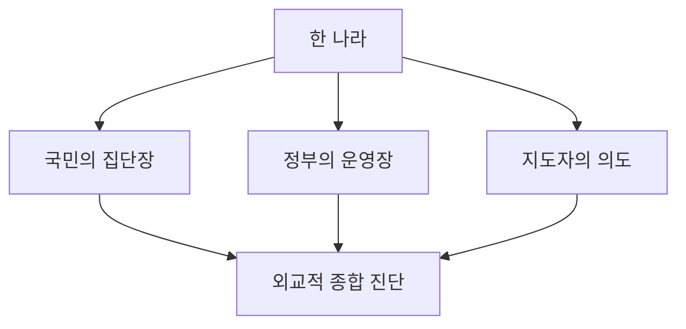
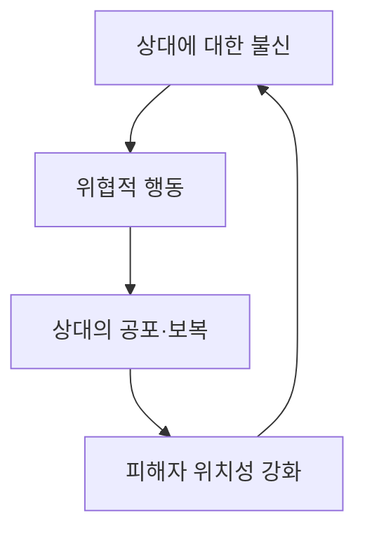

# 『진실 대 거짓』 제14장 「국가와 정치」

# 『진실 대 거짓』 제14장 「국가와 정치」

## 핵심 해설

제14장은 정치 제도나 국가를 단순히 우열로 나누는 장이 아닙니다. 호킨스 박사님께서는 국가와 정치 역시 그것을 지배하는 **의식의 장**에 따라 전혀 다른 원리로 움직인다고 설명하십니다.

가장 중요한 문제는 다음과 같습니다.

> 자신의 가치·도덕성·평화관을 상대 국가와 지도자도 공유할 것이라고 가정하면, 외교는 현실 검증에 실패한다.

온전한 사회에서는 법, 정직성, 책임, 국민의 동의가 실제적인 힘(power)이 됩니다. 반면 200 이하의 정치적 장에서는 사익, 위협, 기만, 보복, 선전과 낮은 힘(force)이 지배적인 동기가 될 수 있습니다. 따라서 두 체제를 똑같은 말과 규칙으로 상대하는 ‘만능 외교’는 실패하기 쉽다는 것이 이 장의 중심 주장입니다.

부록에서 제14장 전체는 **645**로 측정됩니다. 이는 본문에 등장하는 국가나 인물들의 평균치가 아니라, 국가와 정치라는 세속적 내용을 진실과 거짓의 보다 높은 맥락에서 조망하는 **장 전체의 진실 수준**입니다.

---

## 장의 전개 구조

| 전개 | 핵심 내용 |
|---|---|
| 문명의 정치적 진화 | 군주제·신정·독재의 실패를 거쳐 법과 합리성에 기초한 제도가 출현함 |
| 정치제도 측정 | 제도의 명칭보다 권력의 분산, 책임성, 동의 여부가 중요함 |
| 국가·정부·지도자 구분 | 한 국가 안에서도 국민, 정부, 통치자의 의식수준이 다를 수 있음 |
| 국제 외교의 실패 | 상대도 우리와 같은 가치와 동기를 가졌다고 가정하는 순진성이 오판을 낳음 |
| 위험한 지도자 진단 | 과대성, 기만, 지도자 숭배, 양심의 부재가 하나의 반복적 유형을 이룸 |
| 실용적 해결 | 정확한 진단과 현실 검증을 토대로 상대의 실제 동기에 맞는 외교가 필요함 |

---

## 1. 정치제도는 의식의 외적 표현이다

본문의 주요 정치제도 측정치는 다음과 같습니다.

| 정치제도 | 측정치 |
|---|---:|
| 과두제 | 415 |
| 민주제·공화제 | 410 |
| 이로쿼이족 정치 구조 | 399 |
| 연합 | 345 |
| 사회주의 | 305 |
| 군주제·부족제 | 200 |
| 신정 | 175 |
| 공산주의 | 160 |
| 봉건제 | 145~200 |
| 독재 | 135 |
| 파시즘 | 125 |

이 표를 “어떤 명칭의 제도가 무조건 좋다”는 식으로만 읽어서는 안 됩니다. 호킨스 박사님께서는 곧바로 **제도와 그것을 운영하는 사람을 구분**하십니다.

군주제는 200으로 측정되지만, 실제 온전성은 군주의 수준에 따라 달라질 수 있습니다. 부족제도 마찬가지입니다. 반대로 헌법상 민주국가라 해도 실제 운영이 부패와 사익에 지배된다면, 그 명칭만 민주주의일 뿐 작동 원리는 독재와 비슷할 수 있습니다.

따라서 정치제도는 ‘내용’이고, 실제로 그 제도를 움직이는 의식의 장이 ‘맥락’입니다. 정치 체제의 진실은 간판이 아니라 다음 요소에서 드러납니다.

- 권력이 분산되어 있는가
- 지도자가 법에 책임지는가
- 국민의 동의가 필요한가
- 진실과 사실이 정책의 기초가 되는가
- 국민의 생명과 복지를 중요하게 여기는가

민주제의 높은 측정치는 단순한 다수결보다는 **권력 제한, 책임성, 법치, 자유로운 동의**에서 나옵니다.

---

## 2. 권력에 동일시될 때 에고가 팽창한다

본문은 나폴레옹을 450에서 175로, 히틀러를 430에서 40으로 하락한 사례로 제시합니다. 이것은 사람이 평생 하나의 고정된 의식수준에 묶여 있지 않다는 점을 보여 줍니다.

두 사람의 결정적 변화는 단순히 권력을 많이 가졌다는 데 있지 않습니다. 권력과 자기 자신을 동일시하면서, 더 이상 자신이 누구에게도 책임질 필요가 없다고 여긴 순간에 일어납니다.

호킨스 박사님의 표현으로 보면 다음과 같은 변화입니다.

1. 처음에는 능력과 건설적 이상이 존재합니다.
2. 성공하면서 에고가 그 성과를 자기 개인의 위대함으로 전유합니다.
3. 지도자라는 역할과 ‘나’를 동일시합니다.
4. 외부의 법·도덕·종교적 권위보다 자신을 위에 둡니다.
5. 마침내 개인의 욕망이 국가의 운명으로 둔갑합니다.

본문에서 “에고가 스스로를 신으로 선포한다”는 말은 종교적 선언만을 뜻하지 않습니다. **자기 판단을 최종적 진실로 삼고 아무에게도 책임지지 않는 상태**를 뜻합니다.

그래서 권력 분립은 단순한 행정 기법이 아닙니다. 그것은 지도자의 에고가 국가 전체를 삼키지 못하도록 막는 집단적 현실 검증 장치입니다.

---

## 3. 의식수준 200은 정치적 작동 원리의 경계다

이 장에서 200은 사람의 가치를 판정하는 숫자가 아니라, 정치와 사회가 작동하는 지배 원리가 달라지는 임계점입니다.

| 범위 | 지배적인 정치 원리 |
|---|---|
| 200 이하 | 사익, 강압, 선전, 보복, 비밀주의, 개인 권력 |
| 200 이상 | 정직성, 책임, 합법성, 국민 복지, 자유로운 동의 |
| 300대 | 실용성, 협력, 교육·상업·과학기술의 발달 |
| 400대 | 이성, 법치, 헌정 원리, 윤리적 책임 |

200 이하의 정권에서 ‘평화’나 ‘민주주의’라는 말은 반드시 그 사전적 의미로 사용되지 않습니다. 평화 협상이 시간을 벌거나 상대를 안심시키는 전술이 될 수도 있고, 민주주의가 정권의 정당성을 꾸미는 외피가 될 수도 있습니다.

여기서 진실과 거짓의 구별은 말의 표면이 아니라 다음을 보는 것입니다.

- 그 말을 한 의도
- 실제 행동
- 과거의 반복 패턴
- 약속을 어겼을 때 느끼는 책임
- 국민의 생명을 취급하는 방식

즉, 외교적 수사를 사실로 받아들이는 것이 아니라 **말과 행동이 정렬되어 있는가**를 보아야 합니다.

---

## 4. 국가는 하나의 단일한 의식체가 아니다

제14장에서 특히 중요한 구분은 한 나라를 통째로 하나의 수치로 단정하지 않는다는 점입니다. 실제 외교에서는 적어도 다음 네 요소를 따로 보아야 합니다.

1. 국민
2. 정부의 실제 운영
3. 국가 지도자
4. 외교 대표자

본문은 쿠바 주민과 카스트로 정권의 측정치가 서로 다르다는 사례를 듭니다. 이는 통치자의 수준을 국민 전체의 수준으로 간주해서는 안 된다는 뜻입니다. 반대로 비교적 온전한 국민도 낮은 수준의 통치 구조에 지배될 수 있습니다.

대한민국은 본문의 국가 표에서 **400**으로 제시됩니다. 다만 이는 책이 집필된 당시의 집단적 장에 대한 측정치입니다. 현재의 모든 국민, 정부 기관, 지도자에게 일괄적으로 적용되는 영구적 수치가 아닙니다. 지도자들의 전후기 측정치가 달라지는 사례처럼 국가의 장도 변화할 수 있습니다.

---

## 5. ‘미국의 위험천만한 순진성’이 뜻하는 것

호킨스 박사님께서는 미국을 421로 높게 측정하면서도 그 그늘을 강하게 지적하십니다. 그 그늘은 악의가 아니라 **자기 가치의 보편성을 당연시하는 순진성**입니다.

미국 사회에서 공정함, 정직, 약자 보호가 중요한 가치라고 해서 상대 정권도 그것을 미덕으로 받아들일 것이라고 생각합니다. 그러나 낮은 힘에 의해 움직이는 상대는 양보와 유화책을 연민이 아니라 두려움과 취약성으로 해석할 수 있습니다.

권투의 ‘퀸스베리 규칙’ 비유가 이를 잘 보여 줍니다. 규칙은 양쪽 모두가 규칙의 권위를 인정할 때만 작동합니다. 한쪽만 규칙을 지키고 다른 쪽은 처음부터 이기는 것 외에는 아무 기준도 없다면, 규칙 준수만으로는 자신을 보호할 수 없습니다.

이것은 정직이나 친절이 잘못이라는 뜻이 아닙니다. 오히려 다음을 구분하라는 뜻입니다.

- **온전성:** 진실을 보고 생명을 지킬 수 있는 힘
- **순진성:** 상대도 나와 같을 것이라고 가정하는 현실 검증의 결핍
- **감상주의:** 귀결보다 선하게 보이는 이미지를 우선하는 태도
- **부정:** 명백한 위험을 인정하지 않음으로써 불안을 피하려는 에고의 방어

참된 온전성은 선한 이미지를 유지하는 것이 아니라, 사실을 사실대로 인식하고 그에 책임 있게 대응하는 능력입니다.

---

## 6. 외교학은 상대의 실제 맥락을 진단해야 한다

호킨스 박사님께서 요청하시는 ‘외교학’은 정치적 수사나 협상술만을 뜻하지 않습니다. 상대의 의식수준, 동기, 능력, 내부 권력구조와 현실 조건을 종합적으로 파악하는 진단학에 가깝습니다.

예를 들어 100대 초반의 사회에서는 추상적인 민주주의보다 식량, 물, 운송, 치안과 생존 수단이 훨씬 절박합니다. 300대 사회에는 교육, 상업, 보건, 과학기술과 상호 이익을 제시하는 접근이 효과적입니다. 400대 사회와는 법, 합리성, 윤리, 책무를 바탕으로 협상할 수 있습니다.

따라서 동일한 외교 공식을 모든 나라에 적용해서는 안 됩니다. 상대 사회가 실제로 중요하게 여기는 것이 무엇인지 이해하지 못한 채 자신의 가치를 수출하면, 원조조차 감사가 아니라 간섭이나 위협으로 지각될 수 있습니다.

네빌 챔벌린의 사례가 암시하는 것도 이것입니다. 고결한 의도만으로는 충분하지 않습니다. 현실 검증력과 상대의 실제 의도를 읽는 능력이 결여되면, 선의가 오히려 파괴적인 세력에 시간을 제공할 수 있습니다.

---

## 7. 위험한 정치 지도자의 핵심 유형

본문의 긴 목록은 단순히 성격이 나쁜 지도자를 묘사한 것이 아닙니다. 여러 특성이 결합된 하나의 반복적 정치 병리를 보여 줍니다. 그 특성들의 집합은 **80**으로 측정됩니다.

| 영역 | 핵심 특성 |
|---|---|
| 진실과 현실 | 거짓말의 일상화, 사실 무시, 피해망상, 실패에서 배우지 못함 |
| 도덕과 책임 | 죄책감·연민·책임감의 부재, 국민의 생명을 수단으로 취급함 |
| 에고와 권력 | 과대한 칭호, 지도자 숭배, 자신을 법 위에 둠, 아첨을 요구함 |
| 정치적 행동 | 선전, 협박, 분쟁 조성, 협약 파기, 종교와 애국심의 도구화 |
| 대인관계 | 약자 경멸, 충성한 부하 제거, 모든 타인을 자기처럼 기만적이라고 판단함 |

핵심은 어느 한 가지 거친 말이나 허영심만으로 위험한 지도자라고 판정하는 것이 아닙니다. **진실 무시, 생명 경시, 과대성, 책임 부재, 기만과 폭력의 도구화가 하나의 체계로 결합되는가**를 보아야 합니다.

‘악성 메시아적 자기애’는 지도자가 자신을 국가의 구원자와 동일시하여, 자신에게 반대하는 사람을 곧 국가와 진리에 반대하는 적으로 취급하는 상태입니다. 그 결과 지도자의 개인적 에고가 애국심·종교·민족적 사명으로 위장됩니다.

---

## 8. 피해자와 가해자 모델에 대한 정확한 이해

본문은 피해자와 가해자를 단순히 둘로 나누는 정치적 서사를 경계합니다. 이것은 실제 피해자의 고통이 거짓이라는 뜻이 아닙니다.

호킨스 박사님의 요점은, 집단이나 정권이 ‘무고한 피해자’라는 위치를 이용하여 다음 행동을 정당화할 수 있다는 것입니다.

- 자신의 공격성과 책임을 부정함
- 상대를 절대적 악으로 규정함
- 내부 결속을 위해 위협을 지속적으로 조성함
- 보복과 폭력을 도덕적 행위로 꾸밈
- 비판을 피해자에 대한 공격으로 몰아감

반대편의 순진한 동조자도 ‘약자를 돕는다’는 자기 이미지에 매료되어 실제 동기와 귀결을 보지 못할 수 있습니다. 이것이 에고가 도덕적 우월성을 통해 진실을 가리는 방식입니다.

---

## 오해하기 쉬운 부분

첫째, 이 장은 모든 저수준 국가의 국민이 동일하다고 말하지 않습니다. 오히려 국민·정부·지도자를 반드시 분리해서 진단하라고 강조합니다.

둘째, 높은 측정치를 가진 국가가 오류를 범하지 않는다는 뜻도 아닙니다. 미국의 순진성에 대한 긴 비판은 높은 집단적 수준에도 고유한 그늘과 현실 검증의 약점이 존재함을 보여 줍니다.

셋째, 강경함이나 물리적 힘이 자동으로 진실이라는 뜻이 아닙니다. 호킨스 박사님께서 구분하시는 것은 **온전성에서 나오는 힘(power)**과 공포·기만·폭력에 의존하는 **낮은 힘(force)**입니다. 온전한 힘은 생명을 보호하고 책임을 지지만, 낮은 힘은 지배와 파괴를 통해 자신을 유지합니다.

넷째, 본문의 국가별 수치는 책이 집필된 시기의 측정 결과입니다. 당시 수치를 오늘의 정치 상황에 그대로 옮겨서는 안 됩니다.

---

## 더 깊은 의미

제14장은 제13장의 ‘진실과 자유’를 제15장의 ‘진실과 전쟁’으로 연결하는 다리입니다. 개인의 지각 오류가 정치권력과 결합하면 그것은 더 이상 개인적 착각으로 끝나지 않고, 선전·억압·전쟁이라는 집단적 귀결을 낳습니다.

이 장의 결론인 ‘진실의 검’은 폭력을 뜻하지 않습니다. 그것은 다음 능력을 가리킵니다.

- 거짓을 거짓이라고 식별하는 분별
- 선한 의도와 실제 능력을 구분하는 현실 검증
- 상대가 내 가치관을 공유한다고 투사하지 않는 정직성
- 위험을 인정하면서도 증오와 동일시하지 않는 온전성
- 생명을 보호할 책임을 회피하지 않는 용기

“진실의 검과 정렬하지 않으면 결국 강철 검과 맞닥뜨린다”는 결론은, 거짓과 위험을 초기에 정확히 식별하지 않으면 나중에는 물리적 충돌로 그 대가를 치르게 된다는 뜻입니다.

따라서 제14장의 핵심은 이렇습니다.

> 평화는 위험을 보지 않는 데서 오는 것이 아니라, 진실을 정확히 보고 낮은 힘에 휘말리지 않으면서도 생명을 보호할 수 있는 온전한 힘에서 나옵니다.

# 『진실 대 거짓』 제14장 「국가와 정치」

## 식별된 소제목 목차

### 14.1 국가와 정치의 전체 윤곽

정치제도와 국가가 그 배후의 의식 수준에 따라 어떻게 달라지는지 살펴보는 제14장의 기본 구조

### 14.2 정치제도의 의식수준

과두제·민주제·공화제·사회주의·군주제·신정·공산주의·독재·파시즘 등의 측정치와 정치제도의 작동 원리

### 14.3 역사적 사회와 정치 지도자의 변화

고대 사회와 정치사의 주요 인물들, 그리고 권력과 에고의 동일시로 의식수준이 상승하거나 하락하는 과정

### 14.4 현대의 정치 지도자와 국제기구

현대 지도자·정권·정치조직·국제기구의 측정치를 통해 드러나는 의도, 온전성 및 현실 검증력의 차이

### 14.5 세계의 국가와 지역별 의식수준

국민·국가·정부·지도자를 구분하면서 세계 각 지역의 우세한 집단적 의식장을 해석하는 방법

### 14.6 미국의 위험천만한 순진성

자신의 정직성·공정성·인도주의를 상대도 공유한다고 투사할 때 발생하는 외교적 현실 검증의 실패

### 14.7 외교학과 국제관계학의 육성

국가마다 서로 다른 의식수준·동기·문화·생존 조건을 고려하는 새로운 외교적 진단의 필요성

### 14.8 세계 의식수준의 지리적 분포

서반구·동반구·아프리카·중동의 의식장 분포와 지역별 정치·사회 조건의 차이

### 14.9 국제관계의 진단과 실용적 해결

선의만으로 외교 문제를 해결하려 하지 않고, 상대의 실제 의도와 능력 및 현실 조건을 함께 진단하는 방법

### 14.10 위험한 정치 지도자의 특징

진실 무시, 생명 경시, 과대성, 기만, 지도자 숭배, 책임감 결여가 결합된 정치 지도자의 반복적 유형

### 14.11 피해자–가해자 위치성과 정치적 조작

피해자 위치를 이용하여 공격성·복수·폭력을 정당화하고, 정치적 동조자들의 순진성을 끌어들이는 작동 원리

### 14.12 정치제도와 의식장의 관계

정치제도의 명칭보다 그것을 운영하는 사람들의 의식수준과 권력의 책임성·분산성이 더 중요하다는 의미

### 14.13 국가·정부·국민·지도자의 구분

하나의 국가 측정치를 그 나라의 모든 국민이나 정부기관 및 지도자에게 일괄 적용해서는 안 되는 이유

### 14.14 힘과 위력의 정치적 구분

법치·정직성·책임성에 기반한 힘과 강압·위협·기만·폭력에 의존하는 위력의 차이

### 14.15 제14장 통합 해설―진실의 검과 현실 검증

선한 의도만으로는 평화를 지킬 수 없으며, 거짓과 위험을 정확히 식별하는 현실 검증력이 생명과 자유를 보호한다는 제14장의 결론

# 『진실 대 거짓』 제14장 「국가와 정치」||「14.1 국가와 정치의 전체 윤곽」

※ 「14.1 국가와 정치의 전체 윤곽」은 원문에 인쇄된 소제목이 아니라, 제14장 첫머리와 전체 전개를 묶어 분석하기 위해 설정한 항목입니다.

## 핵심 해설

제14장의 중심 문제는 “어느 정치제도가 가장 우수한가?”가 아닙니다. 호킨스 박사님께서는 정치제도·정부·외교도 결국 그것을 움직이는 **의식의 장이 외부로 표현된 것**이라고 보십니다.

따라서 민주주의, 평화, 자유, 협력과 같은 훌륭한 명칭만으로는 실제 온전성을 판단할 수 없습니다. 그 말이 어떤 의도에서 사용되는지, 실제 행동과 일치하는지, 지도자가 법과 국민에게 책임지는지, 상대가 약속을 지킬 내적 능력을 갖추었는지를 보아야 합니다.

제14장의 전체 논지는 다음 한 문장으로 압축할 수 있습니다.

> 국제관계의 실패는 선의가 부족해서만이 아니라, 서로 다른 의식수준과 실제 동기를 구별하지 못하는 현실 검증의 결핍에서 발생합니다.

---

## 1. 정치사는 집단의식이 학습해 온 역사입니다

호킨스 박사님께서는 장의 첫 문장을 **의식의 진화**에서 시작하십니다. 정치사를 왕조·전쟁·제도의 연대기로만 보지 않고, 인류가 시행착오를 통해 더 온전한 사회 운영 원리를 발견해 온 과정으로 보시는 것입니다.

군주제, 신정, 내전과 유혈극은 단순한 과거의 불행이 아니었습니다. 그것들은 권력이 한 사람이나 한 집단에 집중될 때 어떤 귀결이 일어나는지를 인류에게 가르쳐 준 역사적 경험이었습니다. 그 경험에서 다음과 같은 통찰이 농축되었습니다.

- 권력은 분산되어야 합니다.
- 통치자도 법에 책임져야 합니다.
- 국민의 동의 없이 권력을 행사해서는 안 됩니다.
- 개인의 기본권은 통치자가 베푸는 호의가 아닙니다.
- 정부는 국민의 생명과 복지에 책임을 져야 합니다.

호킨스 박사님께서는 이렇게 축적된 최고의 지적 통찰을 **400대 중반**으로 측정하십니다. 여기서 400대는 정치적 열정이 아니라 이성·논리·법·원칙에 따라 사회를 구성하는 의식장을 가리킵니다.

정치제도는 어느 날 갑자기 발명된 것이 아니라, 인류가 낮은 힘의 파괴적 귀결을 겪으면서 얻은 집단적 학습의 결정체인 셈입니다.

---

## 2. 미국 건국에서 ‘지적 통찰’과 ‘영성의 천재’가 결합했다는 뜻

호킨스 박사님께서는 미국 건국에서 400대의 지적 통찰이 “종교적 영감보다는 영성의 천재”와 결합했다고 설명하십니다.

여기서 영성은 특정 종교가 국가를 통치한다는 뜻이 아닙니다. 오히려 신정과 반대되는 의미입니다. 인간의 권리가 정부보다 더 근원적인 신성에서 나온다는 인식이 헌법적 제도와 결합했다는 뜻입니다.

이 구분은 중요합니다.

| 구분 | 의미 |
|---|---|
| 신정 | 특정 종교 권위가 정치권력을 행사함 |
| 세속적 합리주의 | 법·논리·제도에 따라 국가를 운영함 |
| 영적 원리가 반영된 헌정 | 인간의 존엄과 권리가 국가의 임의적 허가보다 근원적이라고 봄 |

따라서 호킨스 박사님께서 높이 평가하시는 것은 단순한 미국이라는 국가 명칭이 아니라, **양도할 수 없는 권리·법치·권력 분립·정부의 책무**라는 건국 원리입니다.

국가가 그 원리에서 벗어난다면 국가의 이름이나 과거의 측정치가 현재의 행위를 자동으로 정당화해 주지는 않습니다. 원리와 실제 운영은 계속 구분되어야 합니다.

---

## 3. 인류는 국내 문제에서는 진보했지만 국제관계에서는 미성숙합니다

장 첫머리의 가장 중요한 전환은 과학과 국제관계의 대조입니다.

호킨스 박사님께서는 서구 문명이 과학과 과학기술을 받아들여 다음과 같은 놀라운 성과를 거두었다고 설명하십니다.

- 주요 질병의 극복
- 수명 연장
- 교육의 확대
- 과학기술과 생활환경의 발전
- 합리적 제도와 법치의 정착

이러한 분야에서는 관찰하고, 자료를 모으고, 원인을 진단하고, 결과를 검증하는 방법이 적용되었습니다. 그러나 국제관계에서는 여전히 선입견·감정·이념·정치적 편의가 크게 작용합니다.

그래서 호킨스 박사님께서는 국제관계를 인류 문명의 **아킬레스건**이라고 부르십니다. 한 국가 내부에서는 법과 증거에 따라 문제를 처리하면서도, 국가 간 관계에서는 다음과 같은 낡은 방식이 반복되기 때문입니다.

- 상대의 말을 실제 의도와 동일시함
- 자신의 도덕관을 상대에게 투사함
- 여론과 감정적 압력에 따라 대응함
- 정치적 이미지와 당장의 편의를 우선함
- 국가마다 다른 조건에 하나의 외교 공식을 적용함

즉, 인간은 자연을 다루는 과학에서는 크게 진보했지만, **서로 다른 집단의식과 정치적 동기를 식별하는 능력에서는 충분히 진보하지 못했다**는 것입니다.

---

## 4. 외교의 근본적 오류는 ‘동일성의 투사’입니다

온전한 사람은 대체로 정직, 공정, 약속, 연민, 생명의 가치를 중요하게 여깁니다. 문제는 자신이 그러한 가치를 중요하게 여기기 때문에 상대도 당연히 같은 방식으로 생각할 것이라고 가정하는 데서 발생합니다.

그러나 호킨스 박사님의 의식 지도에서는 수준에 따라 단어의 실제 의미와 사용 목적이 달라질 수 있습니다.

예를 들어 ‘평화’라는 동일한 말도 다음처럼 다른 맥락에서 사용될 수 있습니다.

| 의식의 맥락 | ‘평화’의 실제 의미 |
|---|---|
| 온전한 맥락 | 생명 보호, 갈등 해소, 상호 존중 |
| 정치적 편의 | 국내외 이미지를 관리하는 구호 |
| 기만적 맥락 | 시간을 벌거나 상대의 경계심을 낮추는 전술 |
| 강압적 맥락 | 상대의 저항 중단만을 요구하는 일방적 복종 |

따라서 상대의 말이 나와 같은 사전적·도덕적 의미를 갖는다고 추정해서는 안 됩니다. 말의 진실성은 실제 행동, 반복되는 선택, 약속에 대한 책무, 생명을 대하는 태도에서 확인해야 합니다.

이것은 모든 인간의 존엄성이 같다는 영적 원리와도 충돌하지 않습니다. **근원적 존엄의 평등**과 **현실을 인식하고 행동하는 수준의 동일성**은 서로 다른 문제입니다.

---

## 5. ‘내용’만 보고 ‘맥락’을 놓치는 것이 정치적 순진성입니다

제14장은 호킨스 박사님의 핵심 구분인 **내용과 맥락**을 국가와 정치에 적용합니다.

- 내용: 민주주의라는 명칭, 평화 선언, 조약, 선거, 원조, 외교적 수사
- 맥락: 실제 의도, 의식수준, 책임성, 권력구조, 행동의 귀결

예를 들어 헌법에 민주주의라고 쓰여 있다고 해서 실제 운영까지 민주적이라는 보장은 없습니다. 형식적으로 선거를 시행하면서도 권력자가 언론·사법·군대를 통제한다면, 민주주의라는 내용이 독재적 맥락을 감추는 외피가 될 수 있습니다.

반대로 정치제도의 명칭이 완전하지 않더라도 온전한 지도자가 책임 있게 운영한다면 실제 귀결이 더 나을 수도 있습니다. 그래서 호킨스 박사님께서는 제도 자체의 측정치와 실제 통치자의 수준을 별도로 제시하십니다.

제14장에서 중요한 질문은 “무엇이라고 불리는가?”가 아니라 다음과 같습니다.

> 그것은 실제로 어떤 원리에 의해 움직이고 있으며, 생명에 어떤 귀결을 가져오는가?

---

## 6. 외교에 필요한 것은 협상 기술보다 정확한 진단입니다

호킨스 박사님께서는 당시의 외교를 지도·나침반·GPS 없이 떠나는 원시적 탐험에 비유하십니다. 검증 가능한 자료와 진단 체계가 부족하면 외교는 다음과 같은 임시방편에 의존하게 됩니다.

- 감정주의
- 군중과 여론의 압력
- 정치적 편의
- 비밀 거래
- 끝없는 수사
- 추상적인 주지화
- 모든 국가에 동일하게 적용하는 만능 처방

박사님께서 요청하시는 ‘외교학’은 외교적 표현을 더 세련되게 만드는 학문이 아닙니다. 상대의 실제 상태를 구분하는 **진단학**에 가깝습니다.

진단해야 할 대상도 국가 하나가 아닙니다.

1. 국민의 집단적 의식장
2. 정부의 실제 운영 수준
3. 통치자와 핵심 지도부
4. 외교 대표자의 의도와 능력
5. 정치제도와 권력분립의 정도
6. 생존·경제·교육·문화 같은 현실 조건

한 나라 안에서도 이 요소들의 수준은 크게 다를 수 있습니다. 그러므로 국가의 측정치를 국민 개개인에게 일괄 적용해서는 안 됩니다.

---

## 7. 제14장 전체의 전개

제14장은 첫머리에서 제기한 ‘외교적 현실 검증의 결핍’을 다음 순서로 구체화합니다.

| 전개 | 역할 |
|---|---|
| 정치제도의 측정 | 제도마다 지배적인 원리가 다름을 보여 줌 |
| 역사적 사회와 지도자 | 권력이 에고를 팽창시키고 온전성을 떨어뜨릴 수 있음을 보여 줌 |
| 현대 국가와 지역 | 국가별 집단의식의 차이가 실제 외교 조건이 됨을 설명함 |
| 미국의 순진성 | 자신의 가치관을 상대에게 투사하는 오류를 분석함 |
| 외교학의 필요성 | 직감과 수사를 넘어선 진단 체계를 제안함 |
| 지역별 분포 | 같은 외교 처방이 모든 지역에 맞지 않음을 보여 줌 |
| 실용적 해결 | 국민·정부·지도자·대표자를 구분하여 진단함 |
| 위험한 정치 지도자 | 진실 부재·과대성·기만이 결합된 반복적 유형을 제시함 |
| 결론 | 평화는 위험을 부정하는 데서가 아니라 진실을 식별하는 데서 나옴 |

따라서 앞부분의 여러 측정표는 단순한 순위표가 아닙니다. 장의 마지막에 제시될 **외교적 감별과 현실 검증**을 위한 자료 역할을 합니다.

---

## 8. 제14장 전체 측정치 645의 의미

부록에서 제14장 「국가와 정치」는 **645**로 측정됩니다.

이 수치는 장에 나오는 국가·정권·지도자들의 평균이 아닙니다. 또한 특정 정치적 의견 하나의 수치도 아닙니다. 국가와 정치를 진실과 거짓의 원리에서 식별하고, 집단적 재난을 예방하려는 **장 전체의 진실 수준**을 가리킵니다.

따라서 본문 속 개별 국가의 측정치와 제14장 전체의 645는 측정 대상이 다릅니다.

- 국가 측정치: 특정 시기의 우세한 집단적 장
- 지도자 측정치: 해당 인물 또는 생애의 특정 시기
- 정치제도 측정치: 그 제도에 내재한 기본 원리
- 장 전체 645: 이 주제를 설명하는 가르침 전체의 수준

---

## 더 깊은 의미

제14장은 정치적 선의보다 **진실과 정렬된 분별**을 우선합니다. 선의는 중요하지만, 선의만으로 상대의 의도와 능력을 정확히 알 수는 없습니다. 오히려 선의가 현실 검증 없이 작동하면 에고의 자기 이미지, 감상주의, 부정으로 변할 수 있습니다.

호킨스 박사님께서 말씀하시는 참된 평화는 위험을 보지 않는 수동성이 아닙니다. 거짓을 알아보면서도 증오에 빠지지 않고, 온전성에 기초하여 생명을 보호할 수 있는 힘입니다.

따라서 14.1의 결론은 다음과 같습니다.

> 문명은 진실·이성·책무를 제도로 구현하면서 진화해 왔지만, 국제관계는 아직 상대의 실제 의식장과 동기를 정확히 구별하는 수준에 이르지 못했습니다. 제14장은 이 결함을 보완하기 위한 정치적 현실 검증의 원리를 제시합니다.

# 『진실 대 거짓』 제14장 「국가와 정치」||「14.2 정치제도의 의식수준」

※ 「14.2 정치제도의 의식수준」은 분석을 위해 설정한 항목이며, 원문의 실제 소제목은 「정치제도」입니다.

## 핵심 해설

호킨스 박사님께서는 정치제도를 단순히 통치 기술이나 헌법상의 명칭으로 보지 않으십니다. 각각의 제도에는 권력·책임·자유·법·국민을 바라보는 기본적인 의식의 원리가 담겨 있으며, 그 원리가 측정치에 반영됩니다.

원문에 제시된 측정치는 다음과 같습니다.

| 정치제도 | 측정치 |
|---|---:|
| 과두제 | 415 |
| 민주제·공화제 | 410 |
| 이로쿼이족 정치 구조 | 399 |
| 연합 | 345 |
| 사회주의 | 305 |
| 군주제 | 200 |
| 부족제 | 200 |
| 신정 | 175 |
| 공산주의 | 160 |
| 봉건제 | 145~200 |
| 독재 | 135 |
| 파시즘 | 125 |

이 표의 전체 흐름은 분명합니다.

> 정치제도의 수준이 높을수록 권력은 개인의 에고에서 분리되어 법·원칙·책무·검증된 지혜에 맡겨지고, 수준이 낮아질수록 권력은 지도자·집단·이데올로기의 에고와 결합하여 강압과 억압에 의존합니다.

---

## 1. 측정 대상은 ‘체제 명칭’이 아니라 그 제도의 기본 원리입니다

민주국가라고 자칭한다고 해서 실제 정부가 자동으로 410이 되는 것은 아닙니다. 표의 측정치는 그 명칭을 사용하는 모든 현실 국가의 평균이 아니라, 해당 정치제도가 본래 구현하려는 기본적인 조직 원리를 가리킵니다.

예를 들어 민주제·공화제의 410은 다음과 같은 원리에 연결됩니다.

- 개인 권력보다 법이 우위에 있음
- 권력이 분산되고 견제됨
- 국민의 동의를 통해 정부가 정당성을 얻음
- 지도자도 법과 국민에게 책임을 짐
- 감정적 충동보다 이성적 절차로 결정함
- 인간의 기본권을 국가의 임의적 시혜로 보지 않음

그러나 민주주의라는 이름 아래 선거·언론·사법부가 통제되고 지도자가 법 위에 군림한다면, 실제 작동 원리는 민주제보다 독재에 가까워집니다.

따라서 정치제도의 이름은 **내용**이고, 그것을 실제로 움직이는 의도·책임성·의식수준은 **맥락**입니다. 정치적 현실 검증에서는 두 가지를 반드시 구분해야 합니다.

---

## 2. 과두제 415의 정확한 의미

표에서 가장 오해하기 쉬운 항목이 과두제 415입니다. 오늘날 일반적으로 ‘과두제’라고 하면 소수의 권력자나 부유층이 권력을 독점하는 체제를 떠올리기 때문입니다.

그러나 호킨스 박사님께서 이 장 후반에서 설명하시는 과두제는 그러한 부패한 소수 지배를 뜻하지 않습니다. 박사님께서는 이를 **정치인보다 정치가들이 모인 비당파적 자문회의**로 설명하십니다.

본문의 구분은 다음과 같습니다.

| 구분 | 측정치 | 작동 원리 |
|---|---:|---|
| 정치인 | 180 | 선거, 당파, 지위, 개인적·정치적 이익에 영향을 받음 |
| 정치가 | 430 | 경험, 지혜, 객관성, 장기적 국익, 온전성에 따라 판단함 |

415로 측정되는 과두제는 검증된 지혜와 전문성을 가진 원로·정치가·전문가들이 개인적·정치적·재정적 이익을 넘어 국가에 조언하는 구조입니다. 여기서 중요한 것은 ‘소수’라는 숫자가 아니라 **그 소수가 어떤 자질과 의도로 선발되었는가**입니다.

호킨스 박사님께서는 민주주의를 폐지하고 소수 지배로 바꾸자고 말씀하시는 것이 아닙니다. 민주적 정부 구조에 정치적 이해관계에서 자유로운 고도의 자문회의를 더하자고 제안하십니다.

따라서 415의 의미는 다음과 같습니다.

> 대중의 동의에 기초한 민주적 정당성에, 경험과 온전성이 검증된 정치가들의 지혜를 결합하는 것.

---

## 3. 민주제·공화제 410

410은 이성의 영역입니다. 민주제·공화제가 높게 측정되는 이유는 단순히 국민이 투표하기 때문이 아니라, 오랜 역사적 시행착오를 통해 발견된 합리적인 정치 원리를 제도화하기 때문입니다.

민주제는 통치 권력이 국민의 동의에서 나온다는 원리를 강조하고, 공화제는 권력이 헌법과 법률의 제한을 받아야 한다는 원리를 강조합니다. 원문이 두 제도를 함께 묶는 것은 두 제도가 모두 개인 통치자의 변덕보다 **법·권리·절차·책임성**을 우위에 두기 때문입니다.

민주제의 강점은 다음과 같습니다.

- 권력의 평화로운 교체
- 지도자의 책무
- 공개적인 토론과 정보 검증
- 권력 분립과 상호 견제
- 개인의 자유와 기본권 보호
- 정책 실패를 수정할 수 있는 제도적 통로

그러나 호킨스 박사님께서는 민주주의에 아무런 약점이 없다고 말씀하시지는 않습니다. 유권자의 의식수준, 선전, 감정주의, 당파성, 단기적 사익이 정치에 반영될 수 있기 때문입니다.

이 때문에 과두적 지혜의 415와 민주제의 410 사이에는 다음과 같은 차이가 있습니다.

- 민주제는 국민의 동의와 권력의 정당성을 보장합니다.
- 과두적 자문은 전문성·경험·장기적 판단을 보완합니다.

두 원리는 경쟁 관계라기보다 상호 보완 관계입니다.

---

## 4. 이로쿼이족 정치 구조 399

호킨스 박사님께서는 이로쿼이족의 정치 구조가 현대 민주주의의 410에 매우 가까운 399라는 점에 특별히 주목하십니다. 또한 그 구조의 여러 요소가 미국 헌법에 편입되었다고 설명하십니다.

이 항목이 보여 주는 것은 높은 정치 원리가 특정 시대나 서구 문명만의 전유물이 아니라는 점입니다. 부족사회 안에서도 다음과 같은 요소가 존재하면 높은 수준의 정치 구조가 출현할 수 있습니다.

- 여러 집단의 연합
- 공동 협의
- 권력의 분산
- 원로들의 지혜
- 전체 공동체의 생존을 고려하는 결정
- 개인 통치자보다 전통적 원칙을 중시하는 운영

따라서 ‘부족사회’라는 외형만 보고 원시적이라고 단정해서는 안 됩니다. 동일한 부족적 형식 안에서도 권력자의 수준과 협의 구조에 따라 실제 온전성은 크게 달라질 수 있습니다.

399는 이로쿼이족의 모든 구성원을 하나의 수치로 평가한 것이 아니라, 여기서 특정하여 측정된 **정치 구조의 조직 원리**입니다.

---

## 5. 연합 345와 사회주의 305

원문은 연합과 사회주의의 측정 이유를 별도로 상세히 설명하지 않습니다. 따라서 표에서 직접 확인할 수 있는 범위 안에서 해석해야 합니다.

### 연합 345

연합은 서로 다른 집단이나 지역이 완전히 하나로 흡수되지 않으면서 공동의 목적을 위해 협력하는 구조입니다. 345라는 측정치는 강압적 통치보다 협력적이고 건설적이지만, 400대의 보편적 법·헌정 원리에는 아직 미치지 않는 수준임을 보여 줍니다.

연합의 장점은 다양성을 보존하면서 힘을 합칠 수 있다는 것이지만, 공동 권위와 책임 구조가 약하면 개별 집단의 이해관계가 전체보다 앞설 가능성이 있습니다.

### 사회주의 305

사회주의가 305로 측정된다는 것은 그것이 공산주의 160과 동일하게 취급되지 않는다는 뜻입니다. 305는 기본적으로 건설적 의도와 협력 가능성이 있는 300대에 해당합니다.

표의 문맥에서 사회주의는 공동 복지와 사회적 책임을 지향하는 조직 원리를 포함하지만, 민주제·공화제의 410처럼 개인의 자유, 법치, 권력 제한을 충분히 보장하는지는 별도의 문제로 남습니다.

사회주의와 공산주의의 차이는 단순한 명칭 차이가 아닙니다.

- 사회주의 305: 공동 복지를 위한 제도적·경제적 협력의 가능성
- 공산주의 160: 정치와 사회 전체를 하나의 이데올로기에 복속시키는 강압적 구조

다만 호킨스 박사님께서는 현실의 특정 국가를 판단할 때 제도 명칭만 보지 않고 실제 운영 방식과 지도자의 수준을 따로 측정하십니다.

---

## 6. 군주제와 부족제 200—온전성의 경계

호킨스 박사님의 의식 지도에서 200은 진실과 거짓, 힘과 위력이 갈라지는 기본적인 경계입니다. 군주제와 부족제가 정확히 200이라는 것은 이 제도들이 자동으로 온전하지 못한 체제라는 뜻이 아닙니다.

원문은 군주제에 관해 분명히 설명합니다.

> 군주제 자체가 본원적으로 온전성을 벗어난 것은 아니며, 실제 수준은 집권한 군주의 의식수준에 따라 달라집니다.

군주제가 개인의 자질에 크게 의존하는 이유는 권력을 견제하는 제도적 장치가 상대적으로 약하기 때문입니다.

- 온전한 군주가 다스리면 책임·질서·보호가 중심이 될 수 있습니다.
- 자기애적인 군주가 다스리면 국가 전체가 군주의 욕망을 위해 이용될 수 있습니다.

부족제도 마찬가지입니다. 호킨스 박사님께서는 집권자나 원로회의가 온전하다면 부족 정부도 대단히 온전할 수 있다고 설명하십니다.

따라서 200은 “나쁜 제도”라는 판정이 아니라 다음과 같은 불안정한 경계를 나타냅니다.

> 제도 자체의 자동적인 보호 장치보다는 통치자의 개인적 온전성에 크게 의존하는 구조.

---

## 7. 봉건제 145~200이 범위로 측정되는 이유

봉건제만 단일 수치가 아니라 145~200의 범위로 제시됩니다. 이는 봉건적 관계가 구현되는 방식에 따라 온전성의 경계 안팎을 크게 오갈 수 있음을 나타냅니다.

봉건적 통치가 상호 의무와 보호를 중심으로 작동한다면 200에 가까워질 수 있습니다. 반대로 영주가 신분과 무력을 이용하여 주민을 착취한다면 145 수준으로 내려갈 수 있습니다.

봉건제의 문제는 권리와 법이 보편적으로 적용되기보다 개인적인 충성 관계에 의존한다는 데 있습니다.

- 법보다 신분이 우선할 수 있음
- 권력이 개인에게 집중됨
- 주민의 권리가 통치자의 선의에 좌우됨
- 책임보다 복종이 강조될 수 있음

따라서 봉건제는 통치자의 품성에 따라 어느 정도 질서를 제공할 수도 있지만, 온전성을 안정적으로 유지할 제도적 기반은 약합니다.

---

## 8. 신정 175—영성과 종교적 권력의 구분

신정이 175로 측정된다고 해서 종교나 영적 진실이 175라는 뜻은 아닙니다. 측정 대상은 **종교적 권위가 정치권력과 결합한 통치제도**입니다.

영적 진실은 인간의 존엄·책임·자비를 일깨울 수 있지만, 신정에서는 특정 종교의 해석을 맡은 사람들이 국가의 법과 강제력까지 장악하게 됩니다. 그 결과 다음과 같은 문제가 발생할 수 있습니다.

- 특정 교리의 해석이 법적 강제력을 가짐
- 통치자의 정치적 판단이 신의 뜻으로 포장됨
- 통치자에 대한 반대가 신성에 대한 반대로 취급됨
- 종교적 진실과 제도적 권력의 이해관계가 혼합됨
- 믿음과 양심의 자유가 제한됨

호킨스 박사님께서 미국 헌법 제정자들이 신정을 거부했다고 설명하시는 이유도 이것입니다. 신성을 인정하는 것과 특정 종교조직에 정치권력을 부여하는 것은 전혀 다른 문제입니다.

- 영적 원리: 인간의 권리와 존엄이 정부보다 근원적이라고 봄
- 신정: 특정 종교 권위가 정부의 강제력을 행사함

신정의 175는 영성의 한계가 아니라, **종교와 정치권력이 융합될 때 에고가 신성의 권위를 전유하는 위험**을 나타냅니다.

---

## 9. 공산주의 160·독재 135·파시즘 125

이 세 제도는 모두 200 아래에 있으며, 권력이 법과 책임보다 강압에 의존하는 체제로 나타납니다.

### 공산주의 160

공산주의는 사회 전체를 하나의 이데올로기적 설명에 맞추려는 경향을 지닙니다. 당과 국가가 진실의 최종 판정자가 되면 실제 사실보다 이념의 정당성을 우선하게 됩니다.

이 구조에서는 개인의 권리보다 집단적 목표가 앞서고, 이념에 대한 반대가 단순한 의견 차이가 아니라 국가와 인민에 대한 적대 행위로 취급될 수 있습니다. 이로 인해 현실 검증이 약화되고 권력 집중이 정당화됩니다.

### 독재 135

독재에서는 권력이 제도나 법이 아니라 지도자의 개인적 의지와 결합합니다. 호킨스 박사님께서는 독재가 시간이 지나면서 다음과 같은 특징을 드러낸다고 설명하십니다.

- 과대한 악성 메시아적 자기애
- 지도자와 국가의 동일시
- 비판과 반대를 배신으로 취급함
- 국민에 대한 억압과 생명 경시
- 선전과 공포를 통한 권력 유지

독재자의 에고는 “내가 국가를 대표한다”에서 더 나아가 “나에게 반대하는 것이 곧 국가와 진실에 반대하는 것”이라는 위치성을 형성합니다.

### 파시즘 125

파시즘은 표에서 가장 낮게 측정됩니다. 국가·민족·지도자를 하나의 절대적 집단 에고로 결합하고, 개인을 그 목적에 종속시키기 때문입니다.

여기서는 힘과 위력의 차이가 극명해집니다.

- 힘은 진실·법·책임성에서 나옵니다.
- 위력은 공포·선전·강압·폭력에 의존합니다.

파시즘은 외형상 단결과 강함을 내세우지만, 실제로는 끊임없이 적을 만들고 공포를 유지해야만 존속할 수 있습니다. 따라서 그것은 내재적인 힘이라기보다 지속적인 강제가 필요한 취약한 구조입니다.

---

## 10. 극좌와 극우가 함께 낮아지는 이유

호킨스 박사님께서는 이 표가 극좌와 극우의 정치 이데올로기가 모두 낮은 온전성으로 추락하는 경향을 보여 준다고 말씀하십니다.

문제는 좌우라는 방향 자체가 아니라 **극단화가 일어날 때의 공통된 에고 구조**입니다.

1. 하나의 이념을 전체 진실로 절대화합니다.
2. 복잡한 현실을 선과 악의 이분법으로 축소합니다.
3. 반대자를 단순한 경쟁자가 아니라 제거해야 할 적으로 봅니다.
4. 목적이 옳다는 이유로 기만과 강압을 정당화합니다.
5. 실패가 드러나도 이념을 수정하기보다 외부의 적을 탓합니다.
6. 지도자나 집단이 현실 검증의 최종 권위를 독점합니다.

극좌와 극우는 표면적인 구호는 다르지만, 에고가 하나의 위치성과 동일시되고 그 위치성을 지키기 위해 진실을 거부한다는 점에서는 동일한 구조를 보일 수 있습니다.

---

## 11. 이 표를 읽는 가장 중요한 기준

정치제도의 측정치를 단순한 순위표로 읽으면 원문의 핵심을 놓치게 됩니다. 실제 정치 구조를 판단하려면 최소한 세 층위를 구분해야 합니다.

| 층위 | 판단 대상 |
|---|---|
| 제도의 기본 원리 | 해당 정치제도 자체의 측정치 |
| 실제 정부 운영 | 법치·권력분립·강압·책무가 실제로 작동하는 방식 |
| 지도자의 의식장 | 권력을 사용하는 개인의 의도·온전성·현실 검증력 |

예를 들어 민주주의라는 헌법을 가진 국가도 독재적으로 운영될 수 있고, 군주제도 온전한 군주 아래에서는 책임 있게 운영될 수 있습니다. 제도는 일정한 가능성과 한계를 제공하지만, 실제 귀결은 그것을 움직이는 의식장에 달려 있습니다.

## 더 깊은 의미

정치제도 표의 진정한 축은 ‘민주주의 대 독재’라는 명칭상의 대립보다 더 깊습니다. 그것은 **권력이 개인의 에고로부터 얼마나 분리되어 있는가**를 보여 줍니다.

- 400대에서는 권력이 법·이성·원칙·검증된 지혜에 맡겨집니다.
- 300대에서는 협력과 건설성이 나타나지만 보편적 원리의 안정성은 상대적으로 약합니다.
- 200에서는 통치자의 개인적 온전성에 따라 방향이 갈릴 수 있습니다.
- 200 아래에서는 이념·지도자·집단 에고가 권력을 전유하고 강압이 증가합니다.

따라서 14.2의 결론은 다음과 같습니다.

> 온전한 정치제도는 누가 더 많은 권력을 가지느냐보다, 권력을 개인적 에고에서 분리하여 진실·법·책무·지혜에 종속시킬 수 있느냐에 의해 결정됩니다. 민주제의 정당성에 검증된 정치가의 지혜가 결합될 때, 정치적 힘은 사익을 위한 위력이 아니라 공동선을 보호하는 힘으로 기능합니다.

# 『진실 대 거짓』 제14장 「국가와 정치」||「14.3 역사 속의 사회들·정치사 주요 인물」

※ 「14.3」은 분석을 위한 구분입니다. 원문의 실제 항목은 「역사 속의 사회들」과 「정치사 주요 인물」이며, 그 아래에 「최근」·「현대」의 측정표가 이어집니다. 여기서 ‘최근’과 ‘현대’는 책이 집필된 2000년대 중반의 시점을 가리킵니다.

## 핵심 해설

14.2가 정치제도 자체의 기본 원리를 측정했다면, 14.3은 그 제도를 실제로 움직이는 **집단의식과 지도자의 의식수준**을 역사 속에서 보여 줍니다.

호킨스 박사님께서 이 부분에서 특별히 강조하시는 것은 다음 세 가지입니다.

1. 문명의 기술적·지적 성취와 온전성은 동일하지 않습니다.
2. 지도자의 의식수준은 평생 고정되어 있지 않습니다.
3. 높은 능력으로 출발한 사람도 자신을 제한할 권위를 제거하고 세속적 권력과 동일시하면 급격히 추락할 수 있습니다.

따라서 이 부분의 중심 주제는 역사적 인물들의 단순한 순위가 아닙니다.

> 권력을 얻은 뒤에도 자신보다 높은 진실·법·책무 앞에 책임을 질 수 있는가?

이것이 지도자의 진정한 현실 검증력을 가르는 기준입니다.

---

## 1. 서로 다른 측정 대상을 구분해야 합니다

이 표에는 사회·개인·제도·문서·조직·역사적 사건이 함께 들어 있습니다. 따라서 모든 항목을 같은 종류의 대상으로 읽어서는 안 됩니다.

| 측정 대상 | 측정치가 가리키는 것 |
|---|---|
| 역사적 사회 | 그 사회를 지배한 집단적 의식장과 생활 원리 |
| 정치 지도자 | 특정 인물의 생애 중 측정된 시기의 우세한 의식장 |
| 대헌장 같은 문서 | 그 문서에 담긴 기본 원리 |
| KGB·게슈타포·유엔 같은 조직 | 조직의 지배적 의도와 실제 작동 방식 |
| 나치주의 같은 이데올로기 | 그 신념 체계 자체의 의식장 |
| 화살표가 있는 인물 | 생애 초기에서 후기로 의식수준이 변화한 방향 |

역사적 사회의 측정치는 그 사회에 속한 모든 개인의 수준을 뜻하지 않으며, 지도자의 측정치 역시 그 사람의 영구적 신분을 나타내지 않습니다.

---

## 2. 역사 속 사회들의 측정치

원문에는 다음과 같이 제시되어 있습니다.

| 역사적 사회 | 측정치 | 역사적 사회 | 측정치 |
|---|---:|---|---:|
| 호모 사피엔스 이달투 | 70~80 | 아나사지족 | 85 |
| 고대 그리스 | 255 | 아즈텍족 | 65 |
| 고대 로마 | 202 | 아틀란티스 | 290 |
| 고대 이집트 | 205 | 잉카족 | 65 |
| 네안데르탈인 | 75 | 직립원인·자바원인 | 70 |
| 부시맨 | 110 | 크로마뇽인 | 80 |
| 사람 사냥꾼족 | 95 | 평원 인디언 | 210 |
| 식인종 | 95 |  |  |

### 문명의 외형과 의식수준은 다릅니다

고대 로마와 이집트는 거대한 건축물과 국가조직을 발전시켰지만 각각 202와 205로 측정됩니다. 고대 그리스는 255로 더 높지만, 현대 민주제·공화제의 기본 원리인 410과는 큰 차이가 있습니다.

이것은 문화적 세련됨·군사력·영토·건축술이 곧 온전성을 의미하지 않는다는 뜻입니다. 문명이 뛰어난 기술과 지식을 갖추었더라도 다음과 같은 요소가 우세하면 의식장은 제한될 수 있습니다.

- 생존을 위한 폭력
- 정복과 약탈
- 노예제와 강압
- 통치자의 자의적 권력
- 개인보다 집단과 지배계층을 우선하는 구조

반대로 평원 인디언의 정치·사회적 장은 210으로 측정됩니다. 따라서 산업화 여부나 서구적 외형만으로 집단의식의 온전성을 판단해서는 안 됩니다.

원문은 각 사회의 측정 이유를 개별적으로 설명하지 않으므로, 특정 관습 하나를 임의로 원인이라고 확정해서도 안 됩니다. 특히 아틀란티스 290은 표에만 제시되며, 이 부분에서는 별도의 역사적 설명이 제공되지 않습니다.

---

## 3. 정치사 주요 인물 표의 전체 분포

표에는 매우 높은 수준부터 극히 낮은 수준까지 넓은 범위의 인물과 조직이 나옵니다.

높은 쪽의 주요 사례는 다음과 같습니다.

| 인물·원리 | 측정치 |
|---|---:|
| 윈스턴 처칠 | 510 |
| 미하일 고르바초프 | 500 |
| 윌리엄 월러스 | 490 |
| 파이살 왕 | 480 |
| 그레고리 교황·레오 교황 | 각각 475 |
| 대헌장 | 460 |
| 몽고메리 장군 | 450 |
| 유스티니아누스 황제 | 435 |
| 무샤라프 장군 | 425 |
| 웰링턴 공작 | 420 |
| 아미드 카르자이 | 415 |

낮은 쪽에는 칼리굴라 30, 게슈타포·히믈러·폴 포트 35, 콩키스타도르·오사마 빈 라덴 40, 몬테주마 45, KGB와 팔레스타인 해방기구 55, 사담 후세인·탈레반·알카에다 65 등이 제시됩니다.

하지만 원문은 이들 각각의 생애를 상세히 분석하지 않습니다. 따라서 표만 보고 모든 인물의 구체적인 동기나 심리 상태까지 단정하기보다는, 장 전체가 직접 해설하는 **권력과 의식수준의 변화**에 초점을 맞추는 것이 정확합니다.

---

## 4. 같은 수치라고 해서 동일한 인물 유형은 아닙니다

줄리어스 시저와 칭기즈 칸은 모두 140으로 측정됩니다. 그러나 같은 수치라는 이유만으로 두 사람의 성격·동기·역사적 역할이 전부 같다고 볼 수는 없습니다.

측정치가 같다는 것은 그 측정 대상에서 우세한 의식장의 전반적 힘이 비슷하다는 뜻이지, 모든 심리적 내용이 동일하다는 뜻이 아닙니다.

예를 들어 의식수준 140과 관련하여 다른 자료에 나오는 ‘현실 검증력의 빈틈없는 상실’을 두 인물의 모든 행동에 그대로 대입해서는 안 됩니다. 시저와 칭기즈 칸의 140은 이 표의 정치사적 맥락에서 확인해야 하며, 원문은 두 인물에 대한 별도의 심리적 해설을 제공하지 않습니다.

이는 의식수준을 사람의 고정된 유형표로 사용하지 말아야 하는 이유이기도 합니다.

---

## 5. 화살표는 의식수준이 고정되어 있지 않음을 보여 줍니다

원문에서 화살표 사이의 두 수치는 각각 생애 초기와 후기의 측정치입니다.

| 인물 | 초기 | 후기 | 변화 |
|---|---:|---:|---|
| 콘스탄틴 황제 | 410 | 385 | 하락 |
| 피터 대제 | 385 | 190 | 200 아래로 하락 |
| 나폴레옹 | 450 | 175 | 큰 폭의 하락 |
| 블라디미르 레닌 | 405 | 80 | 큰 폭의 하락 |
| 아돌프 히틀러 | 430 | 40 | 큰 폭의 하락 |
| 헤르만 괴링 | 350 | 150 | 하락 |
| 야세르 아라파트 | 440 | 65 | 큰 폭의 하락 |
| 피델 카스트로 | 445 | 180 | 200 아래로 하락 |
| 오마르 카다피 | 160 | 190 | 상승 |

이 표는 사람의 의식수준이 태어날 때부터 정해진 영구적 등급이 아님을 분명히 보여 줍니다. 선택·의도·동일시·권력 사용 방식에 따라 우세한 의식장이 변화할 수 있습니다.

카다피의 160→190은 변화가 언제나 하락 방향으로만 일어나는 것은 아니라는 점도 보여 줍니다. 다만 후기도 여전히 온전성의 경계인 200 아래입니다.

---

## 6. 높은 출발점이 이후의 온전성을 보장하지 않습니다

호킨스 박사님께서는 특히 나폴레옹과 히틀러를 설명하십니다.

- 나폴레옹: 450→175
- 히틀러: 430→40

두 사람은 초기에는 400대의 건설적인 생각과 능력을 가지고 출발했고, 사회에 일정한 유산도 남겼습니다. 그러나 뒤에는 과대성이 세속적 권력과 결합하면서 의식수준이 급격히 떨어졌고, 삶도 재앙적으로 끝났다고 설명하십니다.

여기서 초기 측정치가 높다는 것은 그들의 생애 전체나 이후 행동을 정당화한다는 뜻이 아닙니다. 오히려 정반대의 교훈을 줍니다.

> 높은 지성과 뛰어난 조직 능력도 에고의 유혹으로부터 지도자를 자동으로 보호하지는 못합니다.

400대의 지적 능력이 있더라도, 지도자가 진실보다 자신의 야심을 우위에 놓기 시작하면 그 능력은 온전성을 위해 사용되지 않고 에고의 과대성을 실현하는 도구로 바뀔 수 있습니다.

---

## 7. 나폴레옹의 자기 대관식이 의미하는 것

호킨스 박사님께서는 나폴레옹이 추락한 시점을, 황제의 관을 자신의 손으로 직접 쓰기로 결정한 때로 확인하십니다.

중요한 것은 왕관을 쓰는 동작 자체가 아닙니다. 그 행위가 나타내는 **의식의 맥락**입니다.

전통적으로 황제는 교황에게 관을 받았습니다. 이는 황제의 정치적 권세도 자신보다 높은 영적·도덕적 권위 아래에 있다는 상징이었습니다. 그러나 나폴레옹은 자신이 직접 관을 씀으로써 다음과 같은 위치성을 선택했습니다.

- 나를 임명할 더 높은 권위는 없다.
- 내 권력의 근원은 나 자신이다.
- 나는 판단받는 사람이 아니라 최종 판단자다.
- 정치적 성공이 나의 절대적 정당성을 입증한다.

이때 에고는 더 이상 권력을 맡아 사용하는 봉사자가 아니라, 권력의 근원 자체로 자신을 간주하기 시작합니다. 자기 대관식은 그 내적 전환이 외적으로 드러난 순간입니다.

---

## 8. 히틀러의 추락과 ‘유일한 지도자’

히틀러에게 그 전환점은 군대와 정부의 모든 분야를 동시에 지배하는 유일한 지도자가 된 때였습니다.

권력분립과 외부의 책무가 사라지면 지도자의 지각을 수정할 통로도 사라집니다.

1. 지도자가 국가와 자신을 동일시합니다.
2. 자신의 의지가 국가의 의지라고 믿습니다.
3. 비판은 정책에 대한 반대가 아니라 국가에 대한 배신으로 해석됩니다.
4. 불리한 사실은 보고되지 않거나 제거됩니다.
5. 현실이 지도자의 환상에 맞도록 강제로 왜곡됩니다.
6. 과대성이 현실 검증을 대체합니다.

따라서 독재자의 현실 검증 상실은 개인의 머릿속에서만 발생하는 문제가 아닙니다. 군대·관료제·언론·사법제도 전체가 지도자의 에고를 반영하도록 재구성되면서, 국가 전체가 집단적으로 현실에서 분리됩니다.

---

## 9. 에고의 ‘자기 신격화’

호킨스 박사님께서는 네로가 자신을 신으로 선포한 사례도 언급하십니다. 나폴레옹과 히틀러의 경우에도 형식은 달랐지만, 내적 구조는 에고가 자신을 최고 권위로 선언하는 것이었습니다.

이것은 단순히 지도자가 자신감이 강해지는 상태가 아닙니다.

| 책임 있는 권위 | 자기 신격화된 권력 |
|---|---|
| 자신보다 높은 법과 원리에 책임을 짐 | 자신의 의지를 최고 법으로 삼음 |
| 잘못된 정보를 수정할 수 있음 | 자신에게 불리한 사실을 제거함 |
| 국가와 자신의 역할을 구분함 | 자신과 국가를 동일시함 |
| 권력을 맡은 책임자로 행동함 | 권력을 자신의 존재 증명으로 사용함 |
| 실패에서 배움 | 실패를 적과 배신자의 탓으로 돌림 |

박사님께서 말씀하시는 에고의 숨겨진 야심은 처음부터 노골적으로 드러나지 않을 수 있습니다. 지도자가 성공하고 찬양과 복종을 받으면서 외부의 제약이 사라질 때, 억압되어 있던 과대성이 표면으로 나옵니다.

그러므로 세속적 권력은 완전히 새로운 에고를 만드는 것이라기보다, 이미 잠재해 있던 동일시와 야심을 확대하여 드러내는 조건이 될 수 있습니다.

---

## 10. 종교적 통제와 ‘더 높은 권위에 대한 책무’는 다릅니다

앞 절에서 신정은 175로 측정되었습니다. 그런데 여기서는 과거의 군주들이 교황이나 종교적 수장에게 책임을 졌다는 사실을 하나의 제한 장치로 언급합니다. 두 설명은 모순되지 않습니다.

- **신정**은 종교조직이 국가의 정치권력과 강제력을 직접 장악하는 체제입니다.
- **더 높은 권위에 대한 책무**는 통치자가 자신을 최종적이고 절대적인 권위로 만들지 못하도록 제한하는 원리입니다.

호킨스 박사님께서 높이 평가하시는 것은 종교조직의 정치적 지배가 아니라, 통치자도 자신보다 높은 진실·도덕·법 앞에 책임을 져야 한다는 원리입니다. 현대 헌정제도에서는 이 역할을 헌법·법치·권력분립·독립된 사법부가 담당합니다.

---

## 11. 아라파트의 변화와 평화 가능성

원문은 아라파트를 440→65로 제시하며, 세속적 권력으로 인한 심각한 추락의 사례로 듭니다. 이어 후임 압바스 230과 샤론 205가 오랜 폭력적 분쟁 속에서 평화에 대한 희망을 되살린다고 설명합니다.

여기서 중요한 점은 두 사람이 매우 높은 400대나 500대일 필요까지는 없었다는 사실입니다. 두 지도자가 모두 200을 넘는다는 것만으로도 최소한 다음과 같은 가능성이 열립니다.

- 사실을 어느 정도 인정함
- 상대의 존재를 현실적으로 받아들임
- 협상과 약속에 책임을 짐
- 폭력만이 유일한 수단이라는 위치성에서 벗어남
- 상호 이익을 고려할 수 있음

즉, 정치적 평화의 출발점은 완전한 성인이 되는 것이 아니라 **온전성의 기본 경계를 넘어서는 것**입니다.

다만 이것은 책이 집필될 당시의 인물과 정세에 대한 설명이므로, 오늘날의 상황에 그대로 연장되는 예측으로 읽어서는 안 됩니다.

---

## 오해하기 쉬운 부분

### 높은 초기 측정치는 이후 행위에 대한 면제가 아닙니다

나폴레옹과 히틀러의 초기 400대는 생애 전체의 평가가 아닙니다. 오히려 높은 출발점에서도 얼마나 크게 추락할 수 있는지를 보여 주기 위해 제시됩니다.

### 역사적 사회의 수치는 구성원 개인의 가치가 아닙니다

고대 민족이나 초기 인류에 대한 낮은 측정치는 생물학적·인종적 가치의 차이를 뜻하지 않습니다. 측정 대상은 당시 집단에 우세했던 생존 방식과 의식장입니다.

### 유명세와 역사적 영향력은 의식수준이 아닙니다

역사에 큰 영향을 끼친 사람이라고 해서 높은 것은 아닙니다. 영향력은 규모이고, 의식수준은 그 영향력을 움직이는 진실성과 의도의 맥락입니다.

### 권력이 모든 사람을 자동으로 타락시키는 것은 아닙니다

원문은 세속적 권력에 의해 많은 지도자가 추락한다고 설명하지만, 권력을 맡았다는 사실 자체를 추락의 필연적 원인으로 보지는 않습니다. 결정적인 문제는 권력을 진실과 공동선을 위한 책임으로 사용하는가, 아니면 에고의 과대성과 동일시하는가입니다.

---

## 더 깊은 의미

14.2에서는 온전한 정치제도가 권력을 법·원칙·책무에 종속시킨다는 점이 밝혀졌습니다. 14.3은 왜 그러한 제도적 제한이 필요한지를 인간의 역사로 보여 줍니다.

지도자가 자신을 국가의 봉사자로 인식할 때 정치적 권위는 진실에 기초한 힘으로 기능할 수 있습니다. 그러나 자신을 국가·역사·민족의 화신으로 여기기 시작하면, 권위는 에고가 행사하는 위력으로 변합니다.

이 부분에서 현실 검증은 단순히 사실관계를 정확히 아는 능력이 아닙니다. 그것은 다음을 인정할 수 있는 능력입니다.

- 나는 틀릴 수 있다.
- 내 지각은 진실 전체가 아니다.
- 권력은 나의 개인적 소유물이 아니다.
- 지도자도 법과 진실 앞에 책임을 져야 한다.
- 국가의 이익과 나의 야심은 동일하지 않다.

따라서 14.3의 결론은 다음과 같습니다.

> 역사적 재앙은 낮은 능력에서만 발생하지 않습니다. 높은 지성과 건설적 능력을 지닌 지도자라도 세속적 권력을 자신의 존재와 동일시하고, 자신을 제한할 모든 책무를 제거하면 에고의 과대성에 사로잡힐 수 있습니다. 온전한 정치의 핵심은 뛰어난 지도자를 찾는 데만 있지 않고, 누구도 자신을 진실보다 높은 최종 권위로 만들 수 없게 하는 데 있습니다.

# 『진실 대 거짓』 제14장 「국가와 정치」||「14.4 세계의 나라와 지역들(요즘)」

※ 「14.4」는 분석을 위한 구분이며, 원문의 실제 소제목은 「세계의 나라와 지역들(요즘)」입니다. 여기서 ‘요즘’은 책이 집필된 2004~2005년 무렵을 가리킵니다. 따라서 이 측정치를 2026년 현재의 국가 상태로 그대로 연장해서는 안 됩니다.

## 핵심 해설

14.3이 지도자의 의식수준이 권력 사용에 따라 어떻게 변하는지를 보여 주었다면, 14.4는 그 범위를 국가와 지역의 집단적 의식장으로 넓힙니다.

그러나 이 표의 목적은 국가의 우열을 정하거나 국민을 집단적으로 평가하는 데 있지 않습니다. 호킨스 박사님께서는 표를 제시하신 직후, 이것이 아직 ‘미가공 데이터’이며 실제 외교에 적용하려면 다음을 각각 구분해야 한다고 말씀하십니다.

- 주민 전체의 의식장
- 국가의 헌정·사회 구조
- 현실의 정부 운영
- 집권 지도자
- 관료와 정부 부처
- 외교 대표자

14.4의 진정한 주제는 국가별 순위보다 다음과 같습니다.

> 서로 다른 의식장에서 ‘진실·평화·책임·협정’이라는 말이 실제로 같은 의미로 사용되는가?

400대의 사회에서는 법·이성·윤리·책무가 실제 운영 원리로 기능할 가능성이 높습니다. 반면 200 이하에서는 같은 말을 사용하더라도 그것이 사적 권력과 정권 유지를 위한 선전이나 협상 수단일 수 있습니다. 외교의 실패는 이러한 맥락의 차이를 보지 못하고, 상대도 자신과 같은 가치와 동기로 움직인다고 가정할 때 발생합니다.

---

## 1. 원문에 제시된 나라와 지역의 측정치

### 400대

| 나라·지역 | 측정치 |
|---|---:|
| 미국 | 421 |
| 캐나다 | 415 |
| 오스트레일리아 | 410 |
| 네덜란드 | 405 |
| 싱가포르 | 405 |
| 하와이 | 405 |
| 대한민국 | 400 |
| 독일 | 400 |
| 스위스 | 400 |
| 홍콩 | 400 |

### 300대

| 나라·지역 | 측정치 |
|---|---:|
| 이탈리아 | 380 |
| 중앙아메리카 | 355 |
| 유럽 | 355 |
| 인도 | 355 |
| 일본 | 355 |
| 스칸디나비아 | 350 |
| 이집트 | 350 |
| 프랑스 | 305 |
| 그리스 | 300 |
| 멕시코 | 300 |
| 볼리비아 | 300 |
| 브라질 | 300 |
| 중국·중화인민공화국 | 300 |

중국에 대해서는 전체 국가와 정부를 다시 나누어 제시합니다.

| 중국의 세부 측정 대상 | 측정치 |
|---|---:|
| 대통령 | 320 |
| 정부 | 150→190 |

정부의 화살표는 150에서 190으로 상승한 변화를 나타내지만, 변화의 정확한 시기는 이 부분에 별도로 제시되지 않습니다.

### 200대

| 나라·지역 | 측정치 |
|---|---:|
| 대만 | 295 |
| 아르헨티나 | 285 |
| 아이슬란드 | 255 |
| 푸에르토리코 | 250 |
| 터키 | 245 |
| 인도네시아 | 215 |
| 네팔 | 205 |
| 뉴기니 | 202 |
| 러시아 | 200 |
| 만주 | 200 |
| 티베트 | 200 |

### 100대 후반

| 나라·지역 | 측정치 |
|---|---:|
| 남아프리카 | 190 |
| 이스라엘 | 190 |
| 쿠웨이트 | 190 |
| 이란 | 190 |
| 발칸반도 | 185 |
| 요르단 | 185 |
| 팔레스타인 | 185 |
| 보스니아 | 180 |
| 쿠바 | 180 |
| 아랍에미리트 | 180 |
| 북한 | 175 |
| 사우디아라비아 | 175 |
| 시실리 | 175 |
| 중동 | 170 |
| 예멘 | 160 |
| 버마 | 155 |
| 시리아 | 155 |
| 투르크메니스탄 | 150 |

### 100대 초반과 100 이하

| 나라·지역 | 측정치 |
|---|---:|
| 베트남 | 140 |
| 우크라이나 | 140 |
| 파키스탄 | 140 |
| 레바논 | 130 |
| 이라크 | 120 |
| 알제리 | 90 |
| 리비아 | 90 |
| 오만 | 90 |
| 르완다 | 70 |
| 수단 | 70 |
| 콩고 | 70 |
| 나이지리아 | 55 |
| 아이티 | 55 |
| 앙골라 | 50 |
| 우간다 | 40 |

‘유럽·중동·중앙아메리카’ 같은 광역 지역과 개별 국가가 함께 들어 있다는 점도 중요합니다. 지역 전체의 측정치는 그 안에 포함된 모든 나라의 측정치가 같다는 뜻이 아니라, 해당 지역에서 우세한 전체적 의식장을 가리킵니다.

---

## 2. 국가의 측정치는 국민 개개인의 수준이 아닙니다

호킨스 박사님께서 이 자료를 ‘미가공 데이터’라고 하신 이유는 하나의 국가 안에도 서로 다른 의식장이 공존하기 때문입니다.

가령 다음과 같은 조합이 가능합니다.

| 층위 | 서로 달라질 수 있는 상태 |
|---|---|
| 국민·문화 | 비교적 온전하고 건설적일 수 있음 |
| 헌법·국가 원리 | 법치와 권리 보호에 정렬될 수 있음 |
| 현실의 정부 | 부패하거나 강압적으로 운영될 수 있음 |
| 지도자 | 국가 전체보다 훨씬 높거나 낮을 수 있음 |
| 관료·외교관 | 소속 정부와 다른 수준에서 행동할 수 있음 |

중국이 전체적으로 300, 대통령이 320, 정부가 150에서 190으로 제시된 것은 이러한 차이를 직접 보여 줍니다. 국가의 문화적·사회적 잠재성과 현실의 정부 운영이 동일하지 않을 수 있다는 뜻입니다.

따라서 대한민국 400도 다음과 같이 읽어야 합니다.

- 집필 당시 대한민국의 전체 국가·사회적 조직 원리가 400으로 측정되었다는 뜻입니다.
- 모든 국민과 정치인이 400이라는 뜻은 아닙니다.
- 모든 정책이 언제나 합리적이고 온전했다는 뜻도 아닙니다.
- 2026년의 현재 측정치를 나타내지도 않습니다.
- 다른 나라 국민보다 인간적 가치가 높다는 의미가 아닙니다.

측정되는 것은 민족의 본질이 아니라 특정 시점에 사회를 지배한 우세한 의식장입니다.

---

## 3. 400대 국가를 움직이는 원리

호킨스 박사님께서는 400대의 나라와 사회가 다음 원리에 따라 운영된다고 설명하십니다.

- 합리성
- 윤리와 도덕
- 정부의 책무
- 국민 복지에 대한 책임
- 법치
- 헌법과 정부 구성 원리

400대의 핵심은 지능이나 기술 발전만이 아니라, 권력이 개인의 자의적 의지보다 법과 검증 가능한 원리에 종속되어 있다는 것입니다.

이러한 사회에서는 지도자가 “내가 원한다”는 것만으로 국가의 결정이 되지 않습니다. 법원·의회·언론·선거·헌법 같은 독립된 장치가 권력자의 지각을 수정하고 제한할 수 있습니다.

그 결과 다른 국가도 논리와 사실, 상호 책무를 바탕으로 그 국가에 접근할 수 있습니다. 협정은 단순한 말이 아니라 지켜야 할 약속으로 간주되고, 잘못된 사실이 드러나면 정책을 수정할 가능성이 열려 있습니다.

그렇다고 400대 국가가 완전무결하다는 뜻은 아닙니다. 여기서 400은 모든 구성원의 완전성이 아니라 사회를 조직하는 우세한 원리가 이성과 법이라는 의미입니다.

---

## 4. 200 이하에서는 같은 말의 의미가 달라질 수 있습니다

호킨스 박사님의 의식 지도에서 200은 온전성과 비온전성이 갈라지는 기본 경계입니다. 200 이하의 국가에 400대 사회의 외교 원리를 그대로 투사하면 실패할 수 있다고 박사님께서는 경고하십니다.

그 이유는 단순히 상대가 덜 합리적이기 때문이 아니라, 의사결정의 중심 원리가 다를 수 있기 때문입니다.

| 400대의 맥락 | 200 이하에서 나타날 수 있는 맥락 |
|---|---|
| 법과 원칙 | 집권자의 사적 권력 |
| 국민에 대한 책무 | 정권과 집단의 자기 이익 |
| 사실에 따른 수정 | 체면과 선전의 유지 |
| 협정의 지속성 | 상황에 따른 전술적 이용 |
| 평화라는 실제 목표 | 평화라는 정치적 구호 |
| 비판을 통한 교정 | 비판을 적대와 배신으로 간주 |
| 존경받고자 함 | 숭배받고자 함 |

여기서 핵심은 내용과 맥락의 차이입니다.

두 국가가 모두 ‘평화’를 말하더라도, 한쪽에서는 평화가 국민의 안전과 공동선을 뜻하고 다른 쪽에서는 시간을 벌거나 국제적 이미지를 관리하는 수단일 수 있습니다. 발언의 내용은 같지만, 그것을 움직이는 의도와 의식장은 전혀 다릅니다.

따라서 박사님께서 말씀하시는 현실 검증은 상대의 말을 문자 그대로 받아들이는 것이 아니라, 실제 행동·동기·권력 구조와 발언이 일치하는지를 보는 능력입니다.

---

## 5. ‘평화 추구’가 선전으로 바뀌는 구조

원문에서는 200 이하의 일부 정권이 전쟁과 분쟁을 단순한 실패가 아니라 권력 유지에 유용한 조건으로 사용할 수 있다고 설명합니다.

평화가 실제로 이루어지면 다음과 같은 변화가 생길 수 있습니다.

- 외부의 적을 이용한 국민 결집이 어려워짐
- 군사조직과 군수산업의 영향력이 약화됨
- 집권 세력이 내세워 온 존재 이유가 사라짐
- 국민의 관심이 외부의 적에서 정부의 책임으로 이동함
- 공포에 기반한 권력 구조가 느슨해짐

따라서 분쟁이 정권에 이익이 되는 구조에서는 ‘평화’를 공개적으로 말하면서도 실제로는 긴장과 적대감을 유지할 수 있습니다. 도발과 보복이 반복되면 양편 모두 자신을 무고한 피해자로 제시하면서 상대의 폭력을 권력 유지에 이용하게 됩니다.

이것이 호킨스 박사님께서 말씀하시는 피해자·가해자 위치성의 정치적 확대입니다. 실제 목적은 평화가 아니라, 피해자라는 도덕적 이미지를 이용하여 자기편의 강압을 정당화하는 데 있을 수 있습니다.

---

## 6. 과대망상적 지도자의 현실 검증 상실

200 이하의 정치 구조가 특히 위험해지는 것은 지도자의 과대성이 국가의 운영 원리가 될 때입니다. 원문은 자기애적·메시아적 자만심을 35~60으로 측정합니다.

박사님께서 말씀하시는 과대망상증은 단순한 허영이나 자신감이 아닙니다. 지도자가 다음과 같이 현실을 처리하는 구조입니다.

1. 자신을 국가와 동일시합니다.
2. 자신에 대한 비판을 국가에 대한 공격으로 해석합니다.
3. 국민의 존경이 아니라 숭배를 요구합니다.
4. 불리한 사실을 인정하지 않고 선전으로 덮습니다.
5. 실패를 자신의 판단이 아니라 배신자와 외부의 적 탓으로 돌립니다.
6. 경고를 받아들이지 않으므로 경험에서 배우지 못합니다.
7. 귀결을 예측하지 못하면서도 자신의 판단을 절대화합니다.

사진·동상·과대한 칭호가 곳곳에 전시되는 것은 단순한 장식이 아닙니다. 지도자가 제도적 직책을 넘어 국가의 구원자이자 최고 권위로 숭배받고자 한다는 외적 징후가 됩니다.

호킨스 박사님께서는 온전한 지도자는 존경으로 만족하지만, 과대한 지도자는 숭배를 요구한다고 구분하십니다.

---

## 7. 현실 검증력의 차이

이 부분에서 현실 검증은 단순히 정보를 많이 아는 능력이 아닙니다. 국가와 지도자가 다음 사실을 받아들일 수 있는가의 문제입니다.

- 정책은 실패할 수 있습니다.
- 지도자도 틀릴 수 있습니다.
- 사실은 정권의 이미지보다 우선합니다.
- 반대 의견이 반드시 적대 행위는 아닙니다.
- 국민의 이익과 집권자의 이익은 다를 수 있습니다.
- 협정에는 자신도 구속됩니다.
- 행동에는 장기적인 귀결이 따릅니다.

400대의 국가에서는 이러한 현실 검증을 지도자 개인의 덕성에만 맡기지 않고 제도화합니다. 반면 모든 교정 장치가 제거된 독재 체제에서는 지도자의 왜곡된 지각이 국가 전체의 공식적 현실로 강요될 수 있습니다.

그러므로 국가의 현실 검증력은 지도자의 지능보다, 잘못된 판단을 발견하고 수정할 통로가 살아 있느냐에 달려 있습니다.

---

## 8. 프리덤 하우스 보고서가 제시된 이유

원문은 의식 측정표에 이어 프리덤 하우스의 2005년판 보고서를 소개합니다. 당시 보고서에서는 세계 192개국 가운데 다음과 같이 분류했다고 서술합니다.

- 자유국: 46퍼센트
- 비자유국: 26퍼센트
- 나머지: 부분적 자유국
- 2004년에 상승한 국가: 26개국
- 퇴보한 국가: 11개국

원문이 인용한 당시의 ‘가장 억압이 심한 8개국’은 버마·쿠바·리비아·북한·사우디아라비아·수단·시리아·투르크메니스탄입니다.

이 보고서는 의식 측정치의 근거라기보다, 측정표와 당시의 제도적 자유도 사이에 나타나는 현실적 상관성을 보여 주는 보조 자료입니다. 또한 국가의 상태가 고정되어 있지 않고 상승하거나 퇴보할 수 있음을 보여 줍니다.

---

## 오해하기 쉬운 부분

### 국가의 측정치는 민족적 본성이 아닙니다

특정 나라가 낮게 측정되었다고 해서 그 국민 개개인이 낮다는 뜻이 아닙니다. 억압적 정부의 주민이 오히려 정부보다 높은 의식장에서 살아갈 수도 있습니다.

### 낮은 수치는 영구적인 운명이 아닙니다

국가와 정부의 의식장은 지도자·제도·문화적 선택에 따라 달라질 수 있습니다. 중국 정부의 150→190도 이러한 변화 가능성을 보여 줍니다.

### 400대라고 모든 외교정책이 옳은 것은 아닙니다

400대는 이성과 법이 우세한 조직 원리를 나타낼 뿐, 오류가 없다는 보증이 아닙니다. 오히려 오류를 인정하고 수정할 수 있는 구조가 있다는 데 의미가 있습니다.

### 200 이하의 모든 나라가 똑같다는 뜻도 아닙니다

원문 자체가 주민·정부·지도자·부처를 다시 세분하여 측정해야 한다고 밝힙니다. 단일 국가 수치만으로 특정 개인이나 모든 정책을 단정해서는 안 됩니다.

### 이 표는 현재의 국제정세표가 아닙니다

‘요즘’이라는 표현은 책의 집필 시점에 한정됩니다. 이후 지도자·정부·전쟁·헌정 질서가 달라졌으므로 현재 상태를 판단하려면 별도의 측정과 문맥 확인이 필요합니다.

---

## 더 깊은 의미

14.2부터 14.4까지의 흐름을 연결하면 정치 현실을 구성하는 세 층위가 드러납니다.

| 절 | 중심 측정 대상 | 핵심 의미 |
|---|---|---|
| 14.2 | 정치제도 | 권력을 제한하고 책임지게 하는 기본 구조 |
| 14.3 | 정치 지도자 | 권력과 동일시할 때 일어나는 상승과 추락 |
| 14.4 | 국가·지역의 집단의식 | 사회 전체의 운영 원리와 외교적 현실 |

좋은 제도만으로 모든 문제가 해결되는 것도 아니고, 높은 지도자 한 사람만으로 국가 전체가 자동으로 변하는 것도 아닙니다. 정치적 현실은 제도·정부·지도자·국민·관료의 여러 의식장이 결합하여 나타납니다.

14.4에서 가장 중요한 것은 국가의 숫자가 아니라 외교의 근본적인 맥락 오류입니다. 사람은 자신에게 진실·평화·약속이 중요하면 상대에게도 당연히 중요할 것이라고 가정합니다. 그러나 상대가 사적 권력·체면·복수·정권 생존을 중심으로 움직인다면, 그 선한 가정이 오히려 기만에 이용될 수 있습니다.

따라서 호킨스 박사님께서 말씀하시는 온전한 외교는 선의의 포기가 아니라 선의와 현실 검증의 결합입니다.

> 진실한 평화를 이루려면 상대가 사용하는 말만 들어서는 안 됩니다. 그 말이 나오는 의식의 맥락, 실제 의도, 권력 구조와 행동의 귀결을 함께 보아야 합니다. 힘은 진실과 책무에서 나오지만, 위력은 평화와 정의의 언어까지도 자기 이익을 위한 가면으로 사용할 수 있습니다.

# 『진실 대 거짓』 제14장 「국가와 정치」||「14.5 미국의 위험천만한 순진성」

※ 「14.5」는 분석을 위한 번호이며, 원문의 실제 소제목은 「미국의 위험천만한 순진성」입니다. 이 부분은 책이 집필된 2004~2005년 무렵의 국제정세와 미국의 외교정책을 배경으로 합니다.

## 핵심 해설

호킨스 박사님께서 여기서 비판하시는 것은 미국의 민주주의·자유·정직·공정함 자체가 아닙니다. 오히려 미국이 그러한 가치를 중요하게 여기기 때문에, 다른 나라와 지도자도 본질적으로 같은 가치와 동기로 움직일 것이라고 추정하는 데서 생기는 **현실 검증의 오류**입니다.

미국은 421로 측정되고, 그 헌정 원리도 매우 높게 측정됩니다. 그러나 높은 전체적 의식장이 모든 외교적 판단의 정확성을 자동으로 보장하지는 않습니다. 선의가 분별력과 결합하지 않으면 순진성이 되고, 자신의 가치관을 상대에게 투사하면 상대의 실제 의도와 행동 양식을 보지 못하게 됩니다.

이 절의 핵심은 다음과 같습니다.

> 평화와 온전성을 지키려면 자신이 온전한 것만으로는 충분하지 않습니다. 상대가 어떤 의식의 맥락과 실제 규칙에 따라 움직이는지를 정확히 알아야 합니다.

---

## 1. ‘위험천만한 순진성’이란 무엇인가

여기서 순진성은 착하고 선량하다는 뜻이 아닙니다. 자신에게 자연스러운 가치와 동기가 모든 사람에게도 보편적으로 적용된다고 믿는 **투사적 지각**을 뜻합니다.

미국은 다음과 같은 가정을 하기 쉽다고 박사님께서는 설명하십니다.

- 누구나 자유를 진정으로 원할 것이다.
- 민주주의를 제공하면 감사할 것이다.
- 평화는 모든 정부의 실제 목표일 것이다.
- 협정은 서로 지키기 위해 체결하는 것이다.
- 정직과 공정함은 누구에게나 미덕으로 인정될 것이다.
- 절제와 양보를 보이면 상대도 선의로 반응할 것이다.
- 좋은 국제적 이미지를 가지면 다른 나라의 호의를 얻을 것이다.

그러나 200 이하의 권력 구조에서는 동일한 말과 행동이 전혀 다른 맥락으로 해석될 수 있습니다.

| 미국이 의도하는 것 | 상대가 해석할 수 있는 것 |
|---|---|
| 절제 | 대응 능력의 부족 |
| 양보 | 두려움이나 취약성 |
| 협상 제안 | 더 많은 것을 얻을 기회 |
| 정직한 정보 공개 | 이용할 수 있는 약점 |
| 평화 제안 | 시간을 벌기 위한 국면 |
| 국제기구에 대한 존중 | 독자적으로 행동할 결단력의 부족 |
| 민주주의 지원 | 외부 문화의 강요 |

오류는 가치 자체에 있는 것이 아니라, 그 가치가 상대에게도 같은 의미를 가진다고 전제하는 데 있습니다.

---

## 2. ‘퀸스베리 규칙’의 비유

퀸스베리 규칙은 권투에서 공정한 경기를 가능하게 하는 공식 규칙입니다. 호킨스 박사님께서는 이를 국제관계의 비유로 사용하십니다.

규칙은 양편이 모두 그것을 인정할 때만 유효합니다. 한쪽은 반칙을 하지 않는데 다른 쪽은 승리를 위해 어떤 수단이든 사용할 수 있다고 믿는다면, 공정한 쪽의 규칙 준수만으로는 공정한 관계가 만들어지지 않습니다.

박사님께서 말씀하시는 차이는 다음과 같습니다.

- 온전한 사회에서는 약자에 대한 연민이 일어납니다.
- 포식적 권력 구조에서는 약함이 경멸과 공격을 불러올 수 있습니다.
- 온전한 사회에서는 양보가 관계 회복의 표시가 됩니다.
- 포식적 구조에서는 양보가 더 밀어붙여도 된다는 신호로 읽힐 수 있습니다.

따라서 국제외교에서 상대가 실제로 인정하는 규칙을 파악하지 않고, 자신이 따르는 규칙만으로 상대의 행동을 예측하는 것은 현실 검증의 실패가 됩니다.

원문은 ‘기습당하는 것과 허를 찔리는 것’을 180으로 측정합니다. 이것은 공격받은 피해자의 인간적 가치를 측정한 것이 아니라, 반복되는 경고를 보지 못하고 대비하지 않는 **부정과 무방비의 의식 양식**을 가리킵니다.

---

## 3. 반복되는 ‘성촉절 패턴’

호킨스 박사님께서는 진주만 공격, 피그스만 침공, 한국전쟁 당시 중공군의 개입, 케네디 대통령의 무개차 이동, 9·11 테러 등을 하나의 반복되는 패턴으로 묶으십니다.

각 사건의 구체적인 역사적 원인이 전부 같다는 뜻은 아닙니다. 박사님께서 지적하시는 공통 구조는 다음과 같습니다.

1. 불편한 정보와 경고가 나타납니다.
2. 이상주의적 기대나 기존 이미지와 맞지 않기 때문에 충분히 받아들여지지 않습니다.
3. 상대도 합리적 한계 안에서 행동할 것이라고 추정합니다.
4. 방어 준비가 과도하거나 공격적으로 보일까 염려합니다.
5. 실제 위협이 드러났을 때 비로소 상대의 의도를 인정합니다.
6. 실패 원인을 자신의 현실 검증 결여보다 공격자에게만 투사합니다.
7. 시간이 지나면 동일한 판단 방식이 다시 반복됩니다.

박사님께서는 이를 영화 「성촉절」처럼 같은 날을 되풀이하는 패턴에 비유하십니다. 경험은 반복되지만, 경험에서 작동 원리를 배우지 못하기 때문에 결과도 되풀이된다는 뜻입니다.

---

## 4. ‘성자 이미지’와 실제 임무의 혼동

원문에서는 미국이 세계에 ‘성자와 같은 대중매체 이미지’를 보여 주는 일에 지나치게 몰두한다고 설명합니다. 여기서 문제는 좋은 평판을 추구하는 것 자체가 아니라, 이미지가 실제 책무보다 중요해지는 것입니다.

국가의 일차적 책무는 국민의 생명과 안전을 지키는 것입니다. 그런데 다음과 같은 전환이 일어날 수 있습니다.

- 실제 위협을 제거하는 것보다 평화적으로 보이는 것이 중요해집니다.
- 효과적인 방어보다 국제적 칭찬을 우선합니다.
- 상대의 행동보다 미국에 대한 상대의 발언에 민감해집니다.
- 전략적 결과보다 대중매체에 나타날 장면을 먼저 고려합니다.
- 미움을 받지 않으려는 욕구가 필요한 결단을 방해합니다.

이는 박사님의 ‘내용과 맥락’ 구분으로 이해할 수 있습니다. 평화·민주주의·국제협력이라는 내용은 온전해 보일 수 있습니다. 그러나 그것을 추구하는 내적 맥락이 진실과 책임이 아니라, 비난받지 않고 좋은 사람으로 보이려는 욕구라면 판단은 현실에서 멀어질 수 있습니다.

온전한 힘은 사랑받는 이미지에 의존하지 않습니다. 사실을 인정하고, 필요한 경계를 세우며, 행동의 귀결에 책임지는 데서 나옵니다.

---

## 5. 호킨스 박사님의 어린 시절 일화

박사님께서는 자신의 어린 시절을 국제관계의 축소 모형으로 제시하십니다.

엄격한 기독교적 교육을 받은 소년은 싸움을 피하고 다른 쪽 뺨을 돌려야 한다고 배웠습니다. 그러나 괴롭힘을 참는 것은 공격을 끝내지 못하고 오히려 더 쉽게 공격할 수 있는 대상으로 보이게 했습니다.

이후 권투를 배우면서 자기방어 능력과 자신감이 생겼고, 괴롭힘도 줄어들었습니다. 하지만 거리의 불량배와 마주쳤을 때는 또 다른 사실을 알게 됩니다. 권투 교실의 규칙을 모르는 상대가 아니라, 애초에 그 규칙을 따를 의사가 없고 어떤 수단으로든 이기려는 상대가 존재한다는 사실입니다.

이 일화의 요점은 폭력을 찬양하는 것이 아닙니다.

- 평화를 사랑하는 것과 자신을 방어할 능력이 없는 것은 다릅니다.
- 증오를 내려놓는 것과 위험을 부정하는 것은 다릅니다.
- 도덕적 절제와 전술적 무방비는 다릅니다.
- 규칙을 존중하는 것과 상대도 규칙을 존중한다고 가정하는 것은 다릅니다.

자기방어 능력이 생긴 뒤 실제 괴롭힘이 줄었다는 대목도 중요합니다. 확실한 방어 능력은 반드시 충돌을 증가시키는 것이 아니라, 공격의 유인을 줄이는 억제력으로 기능할 수 있습니다.

---

## 6. 의식수준에 따른 접근 방식의 차이

이 절에서 호킨스 박사님께서는 모든 나라에 동일한 방식으로 민주주의와 외교를 적용해서는 안 된다고 말씀하십니다.

| 우세한 범위 | 원문에서 묘사되는 운영 원리 | 현실적인 접근 |
|---|---|---|
| 200 이상 | 성실성, 정직, 온전성, 주민 복지에 대한 관심 | 협정·상호 책무·합리적 대화 |
| 300대 | 실행 능력, 열정, 야심, 단결, 공평한 보상, 성공적 생존 | 교육·상업·과학기술·보건 발전의 기회 |
| 200 이하의 정부 | 정권 유지, 사적 이익, 권력, 선전적 민주주의 | 말보다 실제 운영·행동·의도 확인 |
| 100대 초반 이하 | 식량·물·운송·안전 등 기본 생존의 위기 | 먼저 생존 기반과 사회 하부구조 파악 |

300대의 사회는 도움의 가치와 장기적인 발전의 이익을 알아볼 수 있으므로, 교육·과학기술·상업·보건에 대한 지원에 합리적으로 반응할 수 있습니다.

반면 기본 생존이 위협받는 사회에서는 추상적인 헌정 원리보다 다음과 같은 것이 훨씬 절박할 수 있습니다.

- 먹을 것과 깨끗한 물
- 우물과 물 펌프
- 가축과 운송 수단
- 치안과 신체적 안전
- 기본 교육과 하부구조
- 부족·지역 세력 사이의 현실적 권력관계

민주주의를 말로 선포한다고 이러한 생존 조건과 권력 구조가 자동으로 바뀌지는 않습니다. 사회의 실제 운영 원리가 바뀌지 않은 상태에서는 민주적 제도가 외형으로만 존재하는 **유사 민주주의**가 나타날 수 있습니다.

---

## 7. 민주주의라는 ‘내용’과 실제 운영의 ‘맥락’

호킨스 박사님께서는 민주주의를 높게 평가하시지만, 민주주의라는 이름이나 형식을 절대화하지는 않으십니다.

선거·의회·헌법이라는 외형을 도입해도 현실의 정부가 다음과 같이 운영될 수 있습니다.

- 정실과 뇌물
- 부족·종파·가문 중심의 권력
- 언론과 반대 세력에 대한 강압
- 선거 결과의 조작
- 공적 자원의 사유화
- 민주주의라는 언어를 이용한 국제 원조 획득

이 경우 민주주의라는 내용은 존재하지만, 그것을 움직이는 맥락은 이전의 권력 구조와 같습니다. 정치적 명칭만 바뀌었을 뿐, 의도와 운영 원리는 변하지 않은 것입니다.

따라서 미국이 민주주의를 어디에나 적용할 수 있는 ‘만능 해결책’으로 내세우면, 그 사회의 생존 조건과 문화적 맥락을 무시하게 됩니다. 상대 사회는 이를 자유의 제공이 아니라 외부 문화의 전도나 간섭으로 경험할 수도 있습니다.

---

## 8. 아프가니스탄의 양귀비 밭 사례

원문은 아프가니스탄의 양귀비 산업을 현실적 중증도 분류의 사례로 제시합니다. 양귀비는 마약 문제인 동시에 지역 주민의 생계, 부족장의 권력, 무기와 정치적 협조를 연결하는 경제 기반이었습니다.

미국이 양귀비 밭을 그대로 두는 선택을 하면 다음과 같은 상충하는 귀결이 생깁니다.

- 부족장들의 협조를 얻을 수 있습니다.
- 지역 경제의 즉각적인 붕괴를 피할 수 있습니다.
- 미국이 주민 전체의 생계를 책임져야 하는 부담을 줄일 수 있습니다.
- 반대로 헤로인이 유입되는 다른 사회에는 막대한 비용과 피해가 발생합니다.
- ‘마약과의 전쟁’이라는 미국의 공식적 입장과도 모순됩니다.

이 사례의 핵심은 어느 한 선택을 단순히 선하거나 악하다고 부르는 데 있지 않습니다. 하나의 정책이 여러 체계에서 서로 다른 귀결을 만들어 내므로, 전체 맥락을 계산해야 한다는 것입니다.

도덕적 구호만으로는 현실의 복잡한 권력·생존·경제 구조를 처리할 수 없습니다. 그렇다고 현실적 편의를 위해 장기적인 피해를 보지 않아도 된다는 뜻도 아닙니다. 외교에는 모든 선택이 만들어 내는 파문을 함께 보는 능력이 필요합니다.

---

## 9. 의식 연구의 외교적 적용

호킨스 박사님께서는 의식 연구가 과거의 한 중대한 세계 분쟁에 실제로 적용되었으며, 다음 요소들을 측정했다고 말씀하십니다.

- 관련된 모든 주요 요인
- 각 행위자의 실제 의도
- 조건이 달라질 때 우세해질 의도
- 탄도미사일 전쟁을 막는 데 필요한 적확한 조처

그 결과 문제를 신속하게 해결하고 미사일 전쟁을 예방할 수 있었다고 설명하십니다.

다만 이 대목에서는 해당 사건의 명칭이나 세부 측정 과정이 제시되지 않습니다. 따라서 이 발췌문만으로 그 사건을 특정하거나 구체적 절차를 재구성할 수는 없습니다. 이 사례가 담당하는 역할은, 의식 연구를 단순한 이론이 아니라 상대의 숨은 의도와 가능한 귀결을 판별하는 외교적 도구로 제안하는 데 있습니다.

---

## 오해하기 쉬운 부분

### 미국의 가치가 잘못되었다는 뜻이 아닙니다

박사님께서는 미국의 헌정 원리와 전체적 의식장을 높게 평가하십니다. 이 절은 그러한 가치의 포기가 아니라, 그 가치를 지키기 위해 현실 검증을 보완해야 한다는 설명입니다.

### 200 이하의 모든 개인이 동일하다는 뜻이 아닙니다

여기서 측정되는 것은 주로 정부나 사회의 우세한 운영 원리입니다. 주민·정부·지도자·외교관의 수준은 서로 크게 다를 수 있습니다. 낮게 측정된 정부 안에도 온전한 개인과 집단이 존재할 수 있습니다.

### 강경함이나 공격성을 무조건 권하는 것이 아닙니다

박사님께서 강조하시는 것은 포식적 위력을 모방하라는 것이 아니라, 선의와 방어 능력, 평화와 현실 검증을 결합하라는 것입니다. 무방비는 사랑과 같지 않으며, 확고한 경계는 증오와 같지 않습니다.

### 다른 문화를 이해한다는 것은 그 가치에 동의한다는 뜻이 아닙니다

상대의 가치와 동기를 이해해야 한다는 결론은 도덕적 상대주의가 아닙니다. 상대가 실제로 무엇을 원하며 어떤 기준으로 행동하는지 알아야 온전한 대응이 가능하다는 뜻입니다.

---

## 더 깊은 의미

14.4에서는 국가마다 우세한 의식장이 다르므로 ‘평화·민주주의·책임’이라는 같은 말도 서로 다른 의미로 사용될 수 있음을 보여 주었습니다. 14.5는 그 차이를 인식하지 못할 때 높은 의도를 가진 국가조차 반복적으로 실패할 수 있음을 설명합니다.

이 절에서 현실 검증은 단순한 정보 수집이 아닙니다. 다음과 같은 지각의 교정입니다.

- 나에게 중요한 가치가 상대에게도 중요하다고 가정하지 않는 것
- 상대의 말보다 지속적인 행동과 실제 귀결을 보는 것
- 선의와 신뢰를 자동으로 동일시하지 않는 것
- 평화에 대한 헌신과 방어 능력을 함께 갖추는 것
- 제도의 외형과 실제 운영 원리를 구분하는 것
- 모든 사회를 하나의 정치적 처방으로 변화시킬 수 있다고 생각하지 않는 것

호킨스 박사님의 관점에서 온전성의 힘은 순진함이 아닙니다. 진실은 사랑과 평화를 지향하지만, 동시에 거짓과 기만을 알아보는 분별력을 포함합니다.

> 선의만 있고 현실 검증이 없으면 순진성이 되며, 현실 인식만 있고 온전성이 없으면 권력정치가 됩니다. 참된 외교에는 온전한 의도, 정확한 진단, 확고한 경계가 함께 필요합니다.

# 『진실 대 거짓』 제14장 「국가와 정치」||「외교학과 국제 관계학의 육성」

※ 「14.6」은 분석을 위한 번호이며, 원문의 실제 소제목은 「외교학과 국제 관계학의 육성」입니다.

## 핵심 해설

이 절에서 호킨스 박사님께서는 외교를 단순한 협상 기술이나 국제적 예절이 아니라, 인류의 생존을 좌우하는 **현실 검증의 과학**으로 발전시켜야 한다고 말씀하십니다.

14.5가 미국의 순진성이라는 국가적 지각 오류를 진단했다면, 14.6은 그 오류를 반복하지 않기 위한 제도적 해법을 제시합니다.

> 국가의 선의와 이상만으로는 평화를 지킬 수 없습니다. 상대의 실제 의도와 의식장, 지도자의 병리, 선택이 불러올 귀결을 사실에 근거하여 판별할 수 있어야 합니다.

특히 핵무기가 존재하는 시대에는 한 번의 중대한 오판이 수백만 명의 생명과 문명 전체를 위험에 빠뜨릴 수 있으므로, 외교를 감상주의·수사·이념에 맡겨서는 안 된다는 것이 이 절의 중심입니다.

## 1. 외교적 오판은 국가 규모의 현실 검증 실패입니다

호킨스 박사님께서는 네빌 챔벌린이 히틀러를 오판한 일과 미국 전쟁성 장관 스팀슨이 진주만 공격 이전의 정보 보고를 무시한 일을 대표적 사례로 제시하십니다.

두 사례에서 문제는 단순한 정보 부족이 아닙니다. 정보나 경고가 있어도 자신의 신념과 기대에 맞지 않는다는 이유로 그 의미를 받아들이지 못한 것입니다.

외교적 오판은 대체로 다음과 같은 구조를 갖습니다.

1. 상대의 실제 행동과 의도를 보여 주는 경고가 나타납니다.
2. 그 사실이 기존의 평화적 기대나 정치적 이미지와 충돌합니다.
3. 상대도 결국 합리성과 자기보존 원리에 따라 행동할 것이라고 추정합니다.
4. 불편한 정보는 과장되었거나 비현실적인 것으로 처리됩니다.
5. 상대의 행동이 현실화된 뒤에야 판단 오류가 드러납니다.

여기서 현실 검증은 상대가 한 말을 이해하는 지적 능력만을 뜻하지 않습니다. 상대의 말과 실제 의도, 행동의 반복적 유형, 권력 구조와 예상되는 귀결이 일치하는지를 알아보는 능력입니다.

특히 메시아적 과대망상 지도자는 일반적인 합리적 행위자와 동일하게 계산할 수 없습니다. 자신의 오류를 인정하지 않고, 경고에서 배우지 않으며, 개인적 과대성을 국가의 운명과 동일시할 수 있기 때문입니다. 그러므로 정상적인 상호 이익이나 평화 의지를 당연한 전제로 삼으면 오히려 중대한 판단 착오가 생길 수 있습니다.

## 2. 외교를 ‘사실에 기초한 과학’으로 만들어야 하는 이유

호킨스 박사님께서 말씀하시는 사실에 기초한 외교학은 단순히 국제정세에 관한 정보를 많이 수집하는 학문이 아닙니다.

바로 앞 절에서 의식 연구를 실제 국제 분쟁에 적용하여 다음 요소들을 측정했다고 설명하셨습니다.

- 관련 행위자들의 실제 의도
- 조건이 달라졌을 때 우세해질 의도
- 가능한 행동이 초래할 귀결
- 분쟁 확대를 막는 데 적확한 조처

따라서 이 절의 ‘과학’은 외교적 선언의 표면적 내용을 넘어, 그 선언을 움직이는 **맥락과 의식장**까지 진단하는 학문을 뜻합니다.

| 표면적으로 드러나는 내용 | 확인해야 할 실제 맥락 |
|---|---|
| 평화 선언 | 평화가 실제 목표인지 전술적 수단인지 |
| 협정 체결 | 협정을 지킬 의사와 능력이 있는지 |
| 민주주의 표방 | 실제 권력이 법과 국민에게 책임지는지 |
| 국제협력 요청 | 공동선을 추구하는지 사적 이익을 추구하는지 |
| 양보와 타협 | 관계 회복인지 시간을 벌기 위한 전략인지 |
| 지도자의 자신감 | 현실적 능력인지 과대망상적 자기확대인지 |

외교가 과학이 되려면 말의 아름다움보다 실제 의도와 귀결이 우선되어야 합니다. 이것이 박사님께서 강조하시는 내용과 맥락의 구분을 국제관계에 적용한 것입니다.

## 3. 국제연맹·유엔·국제형사재판소의 측정치

호킨스 박사님께서는 국제기구들이 이상적인 목적에도 불구하고 실제 분쟁을 해결하는 데는 무력했다고 평가하십니다.

| 대상 | 원문의 측정치 | 이 절에서의 의미 |
|---|---:|---|
| 국제연맹 | 185 | 이상주의적 목적은 있었지만 실제 전쟁을 막지 못함 |
| 유엔 전체 | 190 | 인도주의적 구호에는 성과가 있으나 정치적 해결 능력은 부족함 |
| 유엔 정무위원회 | 180 | 실질적 해결보다 정치적 수사와 절차가 우세함 |
| 국제형사재판소 | 195 | 국제적 명분에도 불구하고 200의 온전성 경계를 넘지 못함 |
| 수사 | 185 | 말이 행동과 해결책을 대신하는 양식 |
| 감상주의 | 190 | 현실보다 도덕적으로 좋아 보이는 이미지를 우선함 |
| 궤변 | 195 | 논리를 진실 발견이 아니라 위치성 방어에 사용함 |

이 수치들이 모두 200 바로 아래에 있다는 점이 중요합니다. 수치상으로는 200에 가까워 보여도, 박사님의 의식 지도에서 200은 단순한 양적 경계가 아니라 **위력에서 힘으로 전환되는 질적 임계점**입니다.

따라서 185~195의 기관은 다음과 같은 외관을 가질 수 있습니다.

- 지적이고 세련된 언어
- 도덕적이고 인도주의적인 명분
- 복잡한 규칙과 절차
- 국제적 권위와 상징성
- 끊임없는 회의와 선언

그러나 이러한 외형이 진실에 대한 정렬, 책임감, 실행 능력을 보장하지는 않습니다. 그 때문에 매우 고상한 명분을 내세우면서도 실제 위협을 억제하거나 분쟁을 해결하지 못할 수 있습니다.

## 4. 유엔의 인도주의적 기능과 정치적 기능은 구분해야 합니다

호킨스 박사님께서는 유엔의 모든 활동이 무가치하다고 말씀하시는 것이 아닙니다. 원문은 유엔이 인도주의적 구호 조직으로서는 성공적이었다고 명시합니다.

따라서 다음 두 기능을 구분해야 합니다.

- 재난·기아·질병 등의 피해자에게 구호를 제공하는 기능
- 적대 국가와 지도자를 억제하고 국제 분쟁을 해결하는 정치적 기능

첫 번째 기능은 실제적인 도움을 제공할 수 있습니다. 그러나 두 번째 기능에서는 선언·결의·위원회 활동이 실제 해결책과 집행을 대신하는 경향이 있다는 것이 박사님의 진단입니다.

이는 동일한 조직이라도 측정 대상과 기능에 따라 평가가 달라질 수 있음을 보여 줍니다. 유엔 전체의 190이라는 수치는 모든 직원과 모든 구호활동이 190이라는 뜻이 아닙니다. 원문이 측정하는 것은 당시 국제정치 기관으로서 나타낸 전체적 운영 수준입니다.

## 5. 감상주의는 연민과 다릅니다

호킨스 박사님께서 제거해야 한다고 말씀하시는 감상주의는 따뜻한 마음이나 연민을 뜻하지 않습니다.

| 연민 | 감상주의 |
|---|---|
| 상대의 고통과 현실을 함께 봄 | 고통스러운 현실을 보지 않으려 함 |
| 실제로 도움이 되는 결과를 중시함 | 자신이 선하게 보이는 것을 중시함 |
| 필요하면 확고한 경계를 세움 | 경계를 세우는 것을 냉혹함으로 오해함 |
| 장기적 귀결까지 고려함 | 당장의 감정적 안도에 끌림 |
| 사실에 따라 접근법을 수정함 | 이상적인 이미지를 유지하려 함 |

감상주의는 평화롭게 보이는 결정을 선택하지만, 그 결정이 실제로 더 큰 전쟁을 불러올 가능성을 보지 못할 수 있습니다. 따라서 감상주의는 사랑이 지나친 것이 아니라, 사랑이 현실 검증과 분리된 상태입니다.

참된 연민은 공격자와 피해자를 구별하고, 피해를 예방하며, 선택의 장기적 귀결까지 책임지는 힘을 포함합니다.

## 6. 수사와 궤변이 해결책을 대신하는 방식

수사는 말 자체의 화려함과 도덕적 인상을 통해 실제 행동이 이루어진 듯한 느낌을 만듭니다. 궤변은 모순되거나 무력한 결정을 그럴듯한 논리로 정당화합니다.

두 가지가 결합하면 다음과 같은 현상이 생깁니다.

- 해결되지 않은 문제가 ‘논의 중인 문제’로 바뀝니다.
- 실행하지 않은 것이 ‘신중한 검토’로 표현됩니다.
- 책임자가 없는 상태가 ‘다자간 합의 과정’으로 포장됩니다.
- 실패한 정책도 고상한 의도를 내세워 유지됩니다.
- 선언과 결의가 실제 변화의 대용품이 됩니다.

박사님께서 유엔을 “궁극의 위원회”라고 표현하신 이유도 여기에 있습니다. 위원회 자체가 잘못이라는 뜻이 아니라, 책임과 결단을 분산시켜 실질적인 조처를 끝없이 미루는 구조가 될 수 있다는 뜻입니다.

활동은 계속되지만 귀결은 달라지지 않습니다. 이것이 박사님께서 말씀하시는 외관과 본질의 불일치입니다.

## 7. ‘외교학의 육성’이 실제로 뜻하는 것

이 절과 앞뒤 문맥을 연결하면, 호킨스 박사님께서 제안하시는 외교학은 적어도 다음 요소를 포함합니다.

- 주민·정부·지도자의 의식장을 서로 구분하는 진단
- 공개적 발언과 실제 의도의 구별
- 이념보다 반복되는 행동 유형을 중시하는 현실 검증
- 지도자의 자기애·과대망상·책임 능력에 대한 평가
- 각 선택이 만들어 낼 단기적·장기적 귀결의 검토
- 새로운 경고와 사실에 따라 기존 판단을 수정하는 능력
- 선의와 방어 능력, 평화와 확고한 경계를 함께 유지하는 접근

이는 외교관 개인의 직관에만 의존하는 방식과 다릅니다. 한 지도자의 지혜나 성품이 아니라, 국가 전체가 오판을 발견하고 교정할 수 있는 객관적 학문과 제도를 갖추어야 한다는 뜻입니다.

## 오해하기 쉬운 부분

### 외교와 국제기구가 필요 없다는 뜻이 아닙니다

오히려 정반대입니다. 외교가 인류의 생존에 너무 중요하기 때문에 감상주의와 정치적 수사에 머물러서는 안 된다는 주장입니다.

### 강압적인 외교를 권하는 것도 아닙니다

박사님께서 요구하시는 것은 상대의 위력을 모방하는 것이 아니라, 온전한 의도에 현실 검증과 실행 능력을 결합하는 것입니다. 평화를 원한다는 것과 위험을 부정하는 것은 서로 다릅니다.

### 유엔 관계자 모두를 190으로 평가한 것이 아닙니다

측정 대상은 당시 유엔이라는 조직의 전체적 정치 기능입니다. 개별 인물·기구·구호활동은 각각 다르게 측정될 수 있습니다.

### 세련된 논리가 곧 이성은 아닙니다

궤변은 지적 능력이 부족해서 생기는 것이 아닙니다. 높은 지능이 에고의 위치성을 방어하는 데 이용될 때도 나타납니다. 박사님의 용어에서 진정한 이성은 사실과 진실에 개방되어 있지만, 궤변은 이미 정해진 결론을 방어하기 위해 논리를 사용합니다.

### 기관별 수치는 현재의 자동 측정치가 아닙니다

이 수치들은 책이 집필된 2004~2005년 무렵의 문맥에서 제시된 것입니다. 이후의 모든 활동과 현재 상태를 그대로 나타내는 수치로 확대해서는 안 됩니다.

## 더 깊은 의미

14.5와 14.6의 연결은 다음과 같습니다.

- 14.5는 자신의 가치와 동기를 상대에게 투사하는 국가적 순진성을 설명합니다.
- 14.6은 그 순진성을 교정할 사실 기반의 외교학이 필요하다고 결론짓습니다.
- 뒤이어 나오는 세 개의 의식수준 지도는 이러한 외교적 진단을 지역별로 적용합니다.
- 그다음의 「실용적 해결」과 진단표에서는 관계와 정치 지도자의 성격을 판별하는 구조로 발전합니다.

따라서 14.6은 제14장의 전환점입니다. 앞부분이 국가와 지도자의 의식장을 진단했다면, 여기부터는 그 진단을 국제관계의 실제 결정에 어떻게 사용할 것인지로 넘어갑니다.

호킨스 박사님께서 보시는 외교의 가장 큰 위험은 악의적인 상대만이 아닙니다. 선한 의도를 지닌 쪽이 자신의 선의를 진실 그 자체로 착각하여 현실을 잘못 읽는 것도 커다란 위험입니다.

> 평화를 지키는 것은 평화라는 말을 얼마나 많이 하느냐에 달려 있지 않습니다. 상대의 실제 의도와 행동의 귀결을 얼마나 정확히 보면서도 온전성을 잃지 않느냐에 달려 있습니다.

# 『진실 대 거짓』 제14장 「국가와 정치」||「지도 1. 우세한 의식 수준의 분포: 서반구」

※ 「14.7」은 분석을 위한 번호이며, 원문의 실제 소제목은 「지도 1. 우세한 의식 수준의 분포: 서반구」입니다.

## 핵심 해설

이 지도에서 가장 중요한 발견은 서반구가 비교적 높게 측정된다는 사실 자체보다, 하나의 나라를 하나의 의식수준으로 단순화해서는 안 된다는 점입니다.

호킨스 박사님께서는 쿠바를 사례로 들어 다음 세 대상을 반드시 구분해야 한다고 말씀하십니다.

- 국민 또는 주민
- 현실에서 작동하는 정부·정권
- 통치자 또는 국가 지도자

국민이 비교적 온전하게 측정되어도 그보다 낮은 정권의 지배를 받을 수 있으며, 지도자 개인의 의식장도 정부와 국민의 의식장과 크게 다를 수 있습니다.

> 외교에서 “그 나라는 어떤가?”라고만 물어서는 부족합니다. 그 나라의 주민, 정부, 지도자 가운데 정확히 무엇을 보고 있는지를 먼저 구분해야 합니다.

## 1. ‘우세한 의식 수준의 분포’가 뜻하는 것

여기서 ‘우세한’ 의식수준은 모든 국민의 수준이 같다는 뜻이 아닙니다. 일정한 사회에서 집단적 판단과 제도 운영, 인간관계와 생존 방식을 지배하는 전체적 끌개장을 뜻합니다.

의식수준 200은 호킨스 박사님의 의식 지도에서 중요한 질적 임계점입니다.

- 200 이상에서는 진실성, 책임, 협력, 법의 존중, 타인의 권리에 대한 배려가 나타나기 시작합니다.
- 200 이하에서는 두려움·적대감·자부심·보복·사적 권력과 같은 위력의 원리가 우세해질 수 있습니다.

따라서 서반구가 “전체적으로 온전한 분위기에서 돌아간다”는 표현은 모든 정부와 정책이 완전하다는 뜻이 아닙니다. 지역 전체의 운영에서 대체로 법, 상호성, 합리적 거래와 협정이 작동할 만큼 200 이상의 장이 우세하다는 의미입니다.

같은 장의 앞선 국가·지역 표에는 서반구의 주요 항목들이 다음과 같이 제시되어 있습니다.

| 표에 기재된 대상 | 측정 수준 |
|---|---:|
| 미국 | 421 |
| 캐나다 | 415 |
| 중앙아메리카 | 355 |
| 멕시코·볼리비아·브라질 | 각각 300 |
| 아르헨티나 | 285 |
| 푸에르토리코 | 250 |
| 쿠바 | 180 |
| 아이티 | 55 |

첨부 원문에서는 지도 그림의 개별 표기가 텍스트로 풀려 있지 않으므로, 위 표는 같은 장에 앞서 제시된 국가·지역 측정치만 정리한 것입니다.

## 2. 서반구의 전체적 안정성과 그 의미

서반구의 많은 나라가 200 이상으로 측정된다는 것은 이들 사회에 갈등이나 부패가 없다는 뜻이 아닙니다. 갈등을 처리하는 주된 방식이 무엇인가를 가리킵니다.

200 이상의 장이 충분히 우세한 사회에서는 대체로 다음과 같은 방식이 기능할 수 있습니다.

- 계약과 협정에 대한 상호 책무
- 법적 절차를 통한 갈등 조정
- 국민 복지에 대한 정부의 책임
- 사실과 논리에 기초한 협상
- 권력의 평화적 이전
- 장기적 이익을 위한 협력

이러한 기반이 있기 때문에 외교에서도 상대가 약속을 지키리라는 일정한 기대를 세울 수 있습니다. 그러나 이 지역적 분위기만 보고 모든 개별 국가를 동일하게 판단하면, 아이티와 쿠바 같은 중요한 차이를 놓치게 됩니다.

## 3. 아이티의 55가 나타내는 것

호킨스 박사님께서는 아이티를 서반구의 뚜렷한 예외로 제시하십니다. 원문에서 아이티는 55로 측정됩니다.

55는 의식 지도의 50대, 즉 무기력과 생존 능력의 고갈이 우세한 범위에 속합니다. 이는 아이티 국민의 인간적 가치를 평가하는 수치가 아니라, 집필 당시 국가 전체를 지배하던 사회적·역사적 장을 나타냅니다.

박사님께서는 그 배경으로 다음을 드십니다.

- 뒤발리에 부자의 파괴적인 통치
- 억압적 경찰력과 잔학 행위
- 피의 희생 의례로 대표되는 부두교 습속
- 빈곤과 취약한 사회구조
- 외부 원조가 만들어 낸 의도하지 않은 결과

원문에서 부두교 50은 특정 습속과 의례의 측정치입니다. 아이티 국민 개개인이나 부두교와 관련된 모든 사람을 일률적으로 50으로 규정하는 것은 아닙니다.

### 원조가 오히려 빈곤을 악화시켰다는 의미

호킨스 박사님께서는 과거의 경제원조가 출산율을 증가시키는 효과를 통해 오히려 빈곤을 악화시켰다고 설명하십니다.

이 대목은 도움을 주어서는 안 된다는 뜻이 아닙니다. 선한 의도와 실제 귀결을 분리하여 살펴야 한다는 뜻입니다.

| 원조의 내용 | 고려해야 할 맥락 |
|---|---|
| 식량과 자금 제공 | 정부의 전달 능력과 부패 구조 |
| 당장의 생존 개선 | 장기적인 인구·생산·고용 변화 |
| 외부에서 공급되는 자원 | 지역사회의 자립 기반 |
| 인도주의적 선의 | 실제로 나타나는 전체적 귀결 |

도움이라는 내용이 온전해도, 그것이 투입되는 사회의 맥락과 순환 구조를 바꾸지 못하면 기대와 다른 결과가 생길 수 있습니다. 이는 호킨스 박사님께서 강조하시는 ‘내용과 맥락’의 차이가 국가원조에 적용된 사례입니다.

## 4. 쿠바: 국민 255와 정권 185

이 절의 중심 사례는 쿠바입니다.

| 명시적으로 측정된 대상 | 수준 | 의미 |
|---|---:|---|
| 쿠바 주민 | 약 255 | 200을 넘어선 비교적 온전한 집단장 |
| 피델 카스트로 정권 | 185 | 200 이하의 자부심·대립·위력 중심 운영 |
| 앞선 표의 ‘쿠바’ 항목 | 180 | 세부 측정 대상이 별도로 명시되지 않은 종합 표기 |

쿠바 주민의 255는 250대의 중립성에 가까운 장입니다. 이는 강한 적대적 양극화에서 어느 정도 벗어나 현실에 적응하고 살아갈 수 있는 집단적 능력을 나타냅니다.

반면 카스트로 정권의 185는 200 이하입니다. 이 범위에서는 국가적 자부심과 이념, 대립 구도, 선전과 통제가 진실성이나 국민에 대한 책무보다 우세해질 수 있습니다.

따라서 정부가 하는 말과 국민 전체의 실제 가치관을 동일시해서는 안 됩니다. 정부의 대외적 적대성이 주민 모두의 의도라고 추정해서도 안 되며, 반대로 주민이 200 이상이라는 이유로 정부도 합리적으로 행동할 것이라고 기대해서도 안 됩니다.

## 5. 더 높은 주민이 더 낮은 정권의 지배를 받을 수 있는 이유

의식수준이 높다는 것은 군사력·경찰력·조직 통제력이 더 강하다는 뜻이 아닙니다.

호킨스 박사님의 ‘힘과 위력’ 구분에 따르면, 200 이상의 힘은 진실성과 자발적 협력을 통해 작동합니다. 그러나 200 이하의 정권도 다음 수단을 장악하면 현실적으로 국민을 지배할 수 있습니다.

- 군대와 경찰
- 정보와 언론
- 재산과 식량의 분배
- 감시와 처벌
- 정치조직과 관료제
- 공포와 선전

따라서 255의 주민이 185의 정권 아래 존재하는 것은 모순이 아닙니다. 의식의 진실성과 물리적인 통제력은 서로 다른 차원이기 때문입니다.

낮게 측정되는 독재자가 커다란 파괴력을 발휘할 수 있다는 점도 같은 원리입니다. 낮은 의식수준은 무력함을 뜻하지 않습니다. 오히려 현대의 무기와 국가기구를 장악하면, 낮은 의식장의 지도자가 매우 광범위한 피해를 일으킬 수 있습니다.

## 6. 독재자와 포식적 의식장의 비교

원문은 폭군 이반, 레닌, 히틀러, 스탈린, 폴 포트 같은 지도자들의 낮은 수준을 코모도왕도마뱀이나 연쇄살인자의 수준과 비교합니다.

이 비교는 인간의 본질적 가치가 동물보다 낮다는 뜻이 아닙니다. 그들의 정치적 행동을 지배한 의식장이 다음과 같은 포식적 생존 양식에 가까웠다는 뜻입니다.

- 타인을 목적이 아닌 이용 대상으로 봄
- 인간 생명보다 자신의 생존과 권력을 우선함
- 죄책감과 책무의 부재
- 폭력과 기만을 정상적 수단으로 사용함
- 국민을 독립된 존재가 아니라 권력의 자원으로 취급함

이러한 지도자는 자신이 국민과 국가를 대표한다고 주장하지만, 실제로는 국민보다 훨씬 낮은 의식장에서 작동할 수 있습니다. 그러므로 지도자의 선언을 곧바로 국민 전체의 의지로 해석하는 것은 현실 검증의 오류가 됩니다.

## 7. 외교에서 구분해야 할 세 가지 대상

14.7이 외교학에 제공하는 가장 실용적인 원리는 다음 구분입니다.

| 측정 대상 | 확인되는 것 | 외교에서 생기는 오류 |
|---|---|---|
| 국민·주민 | 문화적 가치, 생활 태도, 협력 가능성 | 정부의 적대성을 국민 전체의 의도로 간주함 |
| 정부·정권 | 제도의 실제 운영 원리와 책무성 | 민주주의·공화국 같은 명칭만 믿음 |
| 통치자·지도자 | 개인적 의도, 병리, 결단 방식 | 정상적 합리성과 자기보존 능력을 당연시함 |

한 나라의 이름만 측정해서는 이 세 층의 차이를 놓칠 수 있습니다. 외교적 판단은 “쿠바는 180이다”라는 단일 문장에 머무르지 않고, 주민은 어떠한지, 정권은 어떠한지, 지도자의 실제 의도는 무엇인지를 따로 확인해야 합니다.

## 오해하기 쉬운 부분

### 서반구가 본질적으로 우월하다는 뜻이 아닙니다

원문은 집필 당시 우세한 사회적 운영장을 비교합니다. 민족이나 지역의 본질적 우열을 말하는 것이 아닙니다. 의식수준은 선택과 역사적 조건에 따라 변화할 수 있습니다.

### 국가 측정치가 모든 국민에게 적용되는 것은 아닙니다

아이티 55나 쿠바 180은 국민 개개인의 고정된 수준이 아닙니다. 특히 쿠바의 경우 주민 255와 정권 185가 명시적으로 구분됩니다.

### 경제적 빈곤과 낮은 의식수준이 완전히 같은 것은 아닙니다

경제적 조건은 집단장과 상호작용하지만, 부유함 자체가 온전성을 보장하지 않고 빈곤 자체가 인간의 가치를 낮추지도 않습니다. 박사님께서 측정하시는 것은 돈의 양보다 현실을 인식하고 사회를 운영하는 우세한 방식입니다.

### 이 수치는 현재 상태를 자동으로 나타내지 않습니다

지도와 수치들은 『진실 대 거짓』이 집필된 2004~2005년 무렵의 문맥에 속합니다. 현재의 국가 상태나 정권에 그대로 적용해서는 안 됩니다.

## 더 깊은 의미

14.6에서 호킨스 박사님께서는 외교를 사실에 기초한 과학으로 발전시켜야 한다고 말씀하셨습니다. 14.7은 그러한 외교학에서 가장 먼저 해야 할 일이 측정 대상을 정확히 정하는 것임을 보여 줍니다.

“나라”라는 말에는 서로 다른 세 현실이 겹쳐 있습니다.

쿠바 사례는 주민과 정권이 크게 어긋날 수 있음을 보여 주고, 아이티 사례는 선한 외부 지원도 그 사회의 전체적 맥락과 귀결을 고려하지 않으면 효과를 내지 못할 수 있음을 보여 줍니다.

따라서 이 지도의 핵심은 국가들을 한 줄로 서열화하는 데 있지 않습니다. 한 국가 안에 공존하는 서로 다른 의식장을 분리하여 보고, 누구와 무엇을 상대하고 있는지를 정확히 진단하는 데 있습니다.

> 국민과 정부와 지도자를 하나로 보는 순간 외교는 투사와 선입견에 빠집니다. 세 대상을 구분할 때 비로소 선의가 현실 검증과 결합할 수 있습니다.

# 『진실 대 거짓』 제14장 「국가와 정치」||「지도 2. 의식 수준의 분포: 동반구」

※ 「14.8」은 분석 번호이며, 원문의 실제 소제목은 「지도 2. 의식 수준의 분포: 동반구」입니다.

## 핵심 해설

이 지도는 동반구 전체가 낮다는 단순한 평가가 아닙니다. 서로 크게 다른 의식장들이 가까이 맞닿아 있기 때문에, 지역적 충돌이 광범위한 분쟁으로 번질 잠재성이 크다는 진단입니다.

호킨스 박사님께서는 동반구 안에서도 다음 지역을 분명히 구별하십니다.

- 서구 문화의 합리성을 반영하는 오스트레일리아
- 전체적으로 안정되어 보이는 북유럽·인도·러시아·중국
- 가장 불길한 위험이 나타나는 아프리카, 특히 북아프리카와 중동

따라서 “거의 확실한 대화재 밑에 깔린 불씨”라는 표현은 전쟁이 반드시 일어난다는 예언이라기보다, 작은 사건도 기존의 적대감과 집단적 위치성을 자극하여 큰 분쟁으로 확산될 수 있는 구조가 이미 형성되어 있다는 뜻입니다.

## 1. 동반구는 하나의 동일한 의식장이 아닙니다

동반구라는 지리적 범주 안에는 400대의 합리적 사회부터 200 이하의 정권과 생존 위기에 놓인 지역까지 매우 넓은 범위가 공존합니다.

같은 장의 선행 표에는 이 절에서 언급된 지역들이 다음과 같이 제시되어 있습니다.

| 대상 | 같은 장의 측정치 | 이 절에서의 의미 |
|---|---:|---|
| 오스트레일리아 | 410 | 지리적으로는 동반구지만 서구의 합리적·법적 문화를 반영함 |
| 스칸디나비아 | 350 | 북유럽의 비교적 안정된 사회적 운영장 |
| 인도 | 355 | 이성과 사회적 기능이 작동하는 300대의 장 |
| 러시아 | 200 | 힘과 위력의 경계에 놓인 불안정한 균형 |
| 중국: 중화인민공화국 | 300 | 국가 전체의 기능적·경제적 운영 수준 |
| 중국 대통령 | 320 | 지도자라는 별도 측정 대상 |
| 중국 정부 | 150→190 | 정권 운영 원리는 국가 전체 수치와 다를 수 있음 |
| 중동 | 170 | 적대성·자부심·분열이 우세할 위험이 큰 지역장 |

이 표가 보여 주는 것은 민족이나 지리 자체가 의식수준을 결정하지 않는다는 사실입니다. 오스트레일리아는 동반구에 있지만 서구 문화의 합리성을 반영하며, 중국도 국가·정부·지도자를 따로 측정하면 서로 크게 다른 수치가 나옵니다.

## 2. 오스트레일리아가 보여 주는 ‘지리와 의식장의 차이’

호킨스 박사님께서는 오스트레일리아를 “서구 문화의 합리성을 반영한다”고 설명하십니다.

여기서 서구 문화는 단순한 민족적·지리적 명칭이 아니라 다음과 같은 운영 원리를 가리킵니다.

- 법과 제헌 원리
- 사실과 논리에 따른 판단
- 정부의 국민에 대한 책무
- 계약과 협정의 신뢰성
- 교육·과학·상업의 기능적 발달
- 권력의 제도적 제한

오스트레일리아의 410은 이러한 합리적 질서가 사회 전체의 우세한 맥락으로 기능한다는 의미입니다. 따라서 이 지도는 ‘서반구 대 동반구’라는 고정된 문명 구분이 아니라, 어느 지역에서 어떤 의식장이 실제로 작동하는지를 살피는 지도입니다.

## 3. ‘전체적으로 조용하다’는 표현의 정확한 의미

북유럽·인도·러시아·중국을 두고 “지금 조용한 듯하다”고 한 것은 모두 같은 수준이거나 완전히 안정되어 있다는 뜻이 아닙니다.

여기서 ‘조용함’은 다음과 구별해야 합니다.

| 전체적으로 조용한 상태 | 온전성이 확립된 상태 |
|---|---|
| 현재 큰 충돌이 표면화되지 않음 | 진실성·책무·합리성이 운영 원리로 정착됨 |
| 억제된 갈등이 존재할 수 있음 | 갈등을 법과 이성으로 처리할 수 있음 |
| 권력의 통제로 질서가 유지될 수도 있음 | 자발적 협력으로 질서가 유지됨 |
| 조건이 달라지면 갈등이 나타날 수 있음 | 외부 충격에도 제도가 비교적 안정적으로 작동함 |

특히 러시아의 200은 온전성과 위력의 경계입니다. 중국도 국가 전체는 300으로 측정되지만 정부는 150에서 190으로 변화했다고 제시됩니다. 그러므로 겉으로 보이는 안정만으로 그 사회의 정부·주민·지도자·대외적 의도를 동일하게 판단할 수 없습니다.

원문의 “전체적으로”라는 단서는 바로 이러한 내부 차이를 염두에 둔 표현입니다.

## 4. 중국은 14.7의 세 가지 구분을 다시 보여 줍니다

14.7에서는 쿠바를 통해 국민·정부·통치자를 따로 보아야 한다는 원리가 제시되었습니다. 14.8에서는 중국이 같은 원리를 더 복합적으로 보여 줍니다.

- 국가 전체의 기능적 수준: 300
- 대통령: 320
- 정부의 운영장: 150에서 190
- 현재의 외관: 전체적으로 조용함

경제·행정·기술 면에서는 높은 기능성을 나타내면서도, 정권의 정치적 운영 원리는 그보다 낮게 측정될 수 있습니다. 이는 능력과 온전성이 서로 같지 않기 때문입니다.

높은 조직 능력이나 경제적 성공은 “무엇을 얼마나 효과적으로 할 수 있는가”를 보여 주지만, 온전성은 “그 능력이 어떤 의도와 원리에 정렬되어 있는가”를 보여 줍니다. 따라서 외교에서는 상대국의 능력이 높다는 사실만으로 그 의도까지 온전하다고 추정해서는 안 됩니다.

## 5. ‘대화재 밑의 불씨’가 나타내는 구조

불씨는 아직 전면적인 분쟁으로 드러나지 않았지만, 조건이 갖추어지면 빠르게 활성화될 수 있는 잠재적 적대성을 뜻합니다.

그러한 구조는 대체로 다음 요소가 겹칠 때 형성됩니다.

1. 집단들이 서로 다른 의식장과 가치체계에서 작동합니다.
2. 동일한 말도 서로 다른 의미로 사용됩니다.
3. 역사적 원한과 피해자·가해자 위치성이 유지됩니다.
4. 지도자와 정권이 갈등을 권력 유지에 이용합니다.
5. 주변 국가들의 경쟁과 개입이 기존 대립을 확대합니다.
6. 선의로 이루어진 외부 개입조차 적대 행위로 지각될 수 있습니다.

즉 불씨는 단순히 사람들이 화가 나 있다는 의미가 아닙니다. 갈등을 이성·책무·상호성으로 교정할 수 있는 공통 맥락이 약하다는 뜻입니다. 이런 지역에서는 한쪽이 평화·협력·지원이라고 부르는 행동을 다른 쪽이 굴욕·간섭·침략으로 받아들일 수 있습니다.

## 6. 왜 북아프리카와 중동이 가장 불길하게 보이는가

14.8에서는 북아프리카와 중동을 위험 지역으로 지목하지만, 구체적인 이유와 국가별 수치는 다음 절인 14.9의 「지도 3」에서 설명됩니다.

이 절이 담당하는 역할은 먼저 세계적 규모에서 위험이 집중된 장소를 찾아내는 것입니다.

- 지도 1은 서반구의 전체적 온전성과 예외 지역을 보여 줍니다.
- 지도 2는 동반구의 커다란 지역별 편차와 위험 집중 지점을 보여 줍니다.
- 지도 3은 북아프리카와 중동을 확대하여 국가별 차이를 살핍니다.

따라서 14.8은 독립적인 결론이라기보다, 세계적 개관에서 구체적인 분쟁 지역의 진단으로 이동하는 전환 구간입니다.

## 오해하기 쉬운 부분

### 동반구 전체가 서반구보다 열등하다는 뜻이 아닙니다

오스트레일리아 410, 인도 355, 일본 355, 대한민국 400, 싱가포르 405 등의 수치만 보아도 그러한 해석은 성립하지 않습니다. 박사님께서는 지리적 본질이 아니라 당시 우세한 사회적 운영장을 측정하십니다.

### ‘조용하다’는 것이 평화롭고 온전하다는 뜻은 아닙니다

갈등이 표면화되지 않은 상태, 권력으로 억제된 상태, 실제로 온전성이 정착된 상태는 서로 다릅니다. 외관상의 질서만으로 그 기초를 판단해서는 안 됩니다.

### 국가의 수치는 모든 주민에게 적용되지 않습니다

한 국가 안에서도 주민·정부·지도자·관료제·군사조직의 의식장은 크게 다를 수 있습니다. 중국의 세부 수치가 이를 직접 보여 줍니다.

### 이 지도는 현재 세계의 측정치가 아닙니다

원문은 2004~2005년 무렵의 국제정세를 반영합니다. 이후의 정권 변화와 사회적 변화를 고려하지 않고 현재에 그대로 적용해서는 안 됩니다.

## 더 깊은 의미

14.8의 핵심은 외교가 자신의 가치체계를 전 세계에 투사해서는 안 된다는 것입니다.

300~400대의 사회에서는 사실·논리·상호 이익·장기적 발전을 제시하는 접근이 통할 수 있습니다. 그러나 200 이하의 정권이 사적 권력, 체면, 보복, 적대적 경쟁을 중심으로 움직인다면 같은 제안도 전혀 다르게 해석될 수 있습니다.

그러므로 진정한 외교적 현실 검증은 단순히 “어느 나라가 몇 점인가”를 아는 데 있지 않습니다. 다음을 분리하여 보는 데 있습니다.

- 겉으로 조용한가, 실제로 안정되어 있는가
- 국가 전체의 기능성과 정권의 온전성이 일치하는가
- 주민의 집단장과 지도자의 의도가 같은가
- 상대가 사용하는 평화·협력·민주주의라는 말이 우리와 같은 맥락을 갖는가
- 현재의 작은 갈등이 더 큰 적대적 장을 활성화할 가능성이 있는가

> 14.8은 동반구를 낮게 평가하는 지도가 아니라, 서로 다른 의식장들이 가까이 공존할 때 생기는 잠재적 확산 위험을 보여 주는 지도입니다. 외교는 지리적 선입견이 아니라 각 지역·정부·지도자의 실제 작동 원리를 구별하는 데서 시작되어야 합니다.

# 『진실 대 거짓』 제14장 「국가와 정치」||「지도 3. 의식 수준의 분포: 아프리카와 중동」

※ 「14.9」는 분석 번호이며, 원문의 실제 소제목은 「지도 3. 의식 수준의 분포: 아프리카와 중동」입니다.

## 핵심 해설

14.9에서 호킨스 박사님께서는 국제적 위험이 단순히 의식수준이 가장 낮은 지역에서 발생하는 것은 아니라고 설명하십니다.

의식수준 100 이하의 지역은 질병·기아·문맹·내부분열로 심각한 고통을 겪지만, 대규모 국제분쟁을 일으킬 자원과 조직력이 부족할 수 있습니다. 반면 180~195에 있는 국가들은 200 이하의 적대적이고 자기중심적인 동기를 유지하면서도, 그것을 국제적 위력으로 바꿀 돈·무기·조직·자원을 가지고 있습니다.

따라서 국제적 위험은 측정치 하나만으로 결정되지 않습니다.

> 위험성은 낮은 의식장에 자원·조직력·경쟁 관계가 결합할 때 크게 증폭됩니다.

## 1. 지도 3의 측정치

| 국가·지역 | 지도 3의 측정 수준 |
|---|---:|
| 이집트 | 300 |
| 터키 | 245 |
| 이란 | 190 |
| 이스라엘 | 190 |
| 쿠웨이트 | 190 |
| 요르단 | 185 |
| 팔레스타인 | 185 |
| 아랍에미리트 | 180 |
| 사우디아라비아 | 175 |
| 시리아 | 160 |
| 예멘 | 160 |
| 레바논 | 130 |
| 이라크 | 120 |
| 오만 | 90 |

통합 원문 안에는 일부 수치의 표기 차이가 있습니다. 같은 장 앞부분의 종합표에는 이집트가 350, 시리아가 155로 기재되어 있지만, 14.9의 지도 3에는 각각 300과 160으로 나옵니다. 그 원인은 자료에서 확인되지 않으므로, 여기서는 분석 대상인 지도 3의 수치를 우선합니다.

또한 제목은 ‘아프리카와 중동’이지만, 표에 직접 기재된 아프리카 국가는 이집트입니다. 사하라 이남의 100 이하 지역은 뒤따르는 본문에서 하나의 유형으로 설명됩니다.

## 2. 가장 낮은 지역과 가장 위험한 지역은 같지 않습니다

호킨스 박사님께서는 두 종류의 취약성을 구분하십니다.

### 100 이하: 생존 기반 자체의 붕괴

이 범위의 지역에서는 다음과 같은 문제가 우세합니다.

- 만연한 질병과 영양실조
- 기아와 높은 영아사망률
- 짧은 기대수명
- 문맹과 취약한 사회 기반
- 파벌과 부족 간의 분열
- 내부 세력에 의한 주민 착취

이런 지역은 주민에게는 극심하게 위험하지만, 국제전쟁을 확대할 경제력·군사력·조직력이 부족할 수 있습니다. 그러므로 “세계 평화를 위협할 힘이 부족하다”는 설명은 그곳의 고통이 가볍다는 뜻이 아닙니다. 고통의 규모와 대외적 위협 능력은 서로 다른 문제입니다.

### 180~195: 동력을 갖춘 비온전성

이 범위는 200이라는 진실성과 온전성의 임계점 바로 아래에 있습니다. 여기에서는 다음 성향이 국가적 행동을 지배할 수 있습니다.

- 국가적 자부심과 체면
- 경쟁과 보복
- 적대적 선전과 피해자 위치성
- 사리사욕과 권력 유지
- 비밀주의와 기만
- 상대의 약함을 이용하려는 태도

그런데 이 국가들은 생존 자체가 무너진 지역과 달리 돈·석유·무기·정부조직·국제적 영향력을 보유할 수 있습니다. 그래서 부정적 의도가 실제 국제분쟁으로 전환될 가능성이 커집니다.

## 3. 왜 180~195의 경쟁국들이 ‘불길한 짝’이 되는가

비슷한 수준의 경쟁국들이 맞서는 경우, 양측의 지각 구조가 서로를 강화할 수 있습니다.

한쪽의 군비 증강은 다른 쪽에서 방어가 아니라 침략 준비로 지각됩니다. 한쪽의 양보는 화해가 아니라 약함으로 받아들여질 수 있고, 상대의 반응은 다시 보복을 정당화하는 증거가 됩니다. 이렇게 양측이 모두 자신을 피해자이자 정의로운 방어자로 규정하면, 적대성은 스스로를 계속 재생산합니다.

지도에 나타난 이스라엘 190과 팔레스타인 185 같은 근접한 수치는 양측의 책임이나 행동이 완전히 같다는 뜻이 아닙니다. 박사님께서 밝히시는 것은 역사적·법적 평가가 아니라, 서로의 적대적 반응을 활성화할 수 있는 의식장의 결합입니다.

같은 수준이라는 것이 같은 도덕적 책임, 같은 정치적 지위, 같은 행위를 뜻하지는 않습니다.

## 4. 자원은 의식장의 내용을 증폭합니다

돈과 조직력은 그 자체로 선하거나 악한 것이 아닙니다. 그것들은 지배적인 의도에 따라 사용됩니다.

- 200 이상의 장에서는 자원이 교육·상업·보건·법질서·상호 번영에 투입될 수 있습니다.
- 200 이하에서는 자원이 군비·선전·권력 유지·대리세력·보복에 투입될 수 있습니다.
- 100 이하에서는 자원을 생산하고 조직적으로 운용할 기반 자체가 약할 수 있습니다.

그러므로 낮은 측정치가 언제나 더 큰 국제적 위험을 의미하지는 않습니다. 90의 빈곤 지역보다 190의 부유하고 조직된 정권이 세계정세에는 더 큰 위협이 될 수 있습니다.

이것은 박사님의 ‘힘과 위력’ 구분이 국제관계에 적용된 사례입니다. 자원과 무기는 진실에서 나오는 힘이 아니라, 어떤 의도가 사용하느냐에 따라 건설적으로도 파괴적으로도 작동할 수 있는 위력입니다.

## 5. 왜 선의의 개입이 증오를 키울 수 있는가

호킨스 박사님께서는 외부 개입자에게 특별한 주의를 요구하십니다. 개입하는 쪽의 의도가 선하더라도, 현지의 의식장에서는 그것이 다음과 같이 해석될 수 있기 때문입니다.

| 개입자의 의도 | 현지에서 가능한 지각 |
|---|---|
| 평화 중재 | 적대 세력의 편을 드는 행위 |
| 인도주의적 지원 | 지배와 영향력 확대 |
| 민주적 제도 권고 | 문화적 침략 |
| 양측의 타협 요구 | 굴욕이나 약함의 강요 |
| 군사적 억제 | 전쟁 준비 또는 선제 위협 |

박사님께서 부탁받지 않은 길거리 부부싸움에 끼어드는 경우를 비유로 드신 까닭도 여기에 있습니다. 개입자는 자신을 중재자로 생각하지만, 갈등 당사자들은 개입자를 새로운 적으로 규정할 수 있습니다. 그러면 선의의 노력이 기존의 증오에 새로운 대상을 제공하게 됩니다.

이는 선의가 무의미하다는 뜻이 아닙니다. 선의라는 ‘내용’만으로는 충분하지 않고, 그것이 들어가는 집단적 ‘맥락’을 먼저 이해해야 한다는 뜻입니다.

## 6. 이집트 300과 터키 245가 보여 주는 내부 차이

지도 3의 모든 국가가 200 이하인 것은 아닙니다.

이집트 300과 터키 245는 최소한 이 지도에서 200의 임계점을 넘어섭니다. 이는 이들 사회가 완전하거나 분쟁에서 자유롭다는 뜻이 아니라, 실용적 협력·상호 이익·합리적 교섭에 반응할 수 있는 기반이 상대적으로 더 크다는 뜻입니다.

그러나 앞 절에서 확인했듯이 국가 전체의 측정치만으로 충분하지는 않습니다. 실제 외교에서는 다음을 다시 분리해야 합니다.

- 주민의 집단적 의식장
- 현실의 정부 운영
- 통치자 개인의 의도
- 군부·관료·외교 대표자의 수준

따라서 ‘이집트 300’이나 ‘터키 245’는 국가 구성원 전부의 고정된 수준도 아니며, 모든 정책의 온전성을 자동으로 보증하는 수치도 아닙니다.

## 오해하기 쉬운 부분

### 특정 민족이나 종교의 본질을 평가하는 지도가 아닙니다

호킨스 박사님께서는 인종이나 민족의 타고난 가치를 측정하시는 것이 아닙니다. 집필 당시 각 국가와 지역에서 우세하게 작동하던 정치적·사회적 의식장을 다루십니다.

### 낮은 수치일수록 언제나 더 공격적이라는 뜻이 아닙니다

100 이하에서는 오히려 무기력과 생존 기반의 붕괴가 우세할 수 있습니다. 국제적 공격성은 의식수준뿐 아니라 자원, 조직력, 지도자의 의도와 주변 경쟁 관계가 함께 결정합니다.

### 비슷한 측정치가 동등한 책임을 뜻하지 않습니다

두 경쟁 세력이 비슷하게 측정된다는 것은 서로의 위치성과 적대성을 활성화하기 쉽다는 뜻입니다. 역사적 행위나 책임을 똑같다고 판정한 것이 아닙니다.

### 지도 수치를 현재에 그대로 적용할 수 없습니다

이 지도는 『진실 대 거짓』이 집필된 2004~2005년 무렵의 국제정세를 반영합니다. 이후의 정권·전쟁·사회 변화까지 자동으로 나타내는 현재 측정치가 아닙니다.

## 더 깊은 의미

14.9는 국가를 수치에 따라 단순히 배열하는 절이 아닙니다. 외교적 위험을 판단하려면 적어도 세 요소를 함께 보아야 한다는 설명입니다.

> 우세한 의식장 × 그것을 실행할 자원과 조직력 × 경쟁 상대와의 상호작용

100 이하의 지역에서는 주된 문제가 인간적 생존과 내부 붕괴입니다. 180~195의 자원 보유 국가에서는 자부심·적대감·보복이 실제 국제 위력으로 전환될 수 있습니다. 200 이상의 사회에는 합리적 협력의 가능성이 더 커지지만, 정부와 지도자까지 따로 살펴야 합니다.

이 절이 바로 다음의 「실용적 해결」과 「관계에 대한 기본적 진단표」로 이어지는 이유도 여기에 있습니다. 지도는 위험 지역을 지목하는 데서 끝나지 않습니다. 상대가 실제로 어떤 동기와 지각 구조에서 움직이는지 진단하고, 그 상대가 이해할 수 있는 수준에서 외교를 시작해야 한다는 결론으로 나아갑니다.

> 14.9의 중심은 “어느 나라가 가장 낮은가”가 아니라, “어떤 의식장이 어떤 자원과 결합하여 실제 분쟁을 확대하는가”를 분별하는 데 있습니다.

# 『진실 대 거짓』 제14장 「국가와 정치」||「실용적 해결」

※ 「14.10」은 분석 번호이며, 원문의 실제 소제목은 「실용적 해결」입니다. 이 아래에 「관계에 대한 기본적 진단표」와 「국제 관계에 대한 진단표」가 이어집니다.

※ 첨부된 통합원문에는 두 도표의 제목만 남아 있고 표 내부 항목은 보존되어 있지 않습니다. 따라서 표의 내용을 임의로 복원하지 않고, 이어지는 본문에서 확인되는 도표의 목적과 원리를 해설하겠습니다.

## 핵심 해설

14.10에서 호킨스 박사님께서 제시하시는 실용적 해결은 새로운 외교 이론이나 협상 기술이 아닙니다. 관계를 맺기 전에 상대가 실제로 어떤 의식장과 동기에서 움직이는지를 정확히 진단하라는 것입니다.

외교적 실패의 근본 원인은 정보가 부족해서만이 아닙니다. 자신의 가치관과 도덕 기준을 상대도 당연히 공유한다고 추정하는 데서 더 큰 문제가 발생합니다.

따라서 실용적 해결의 핵심은 다음과 같습니다.

> 선의만으로 상대하지 말고, 누구와 어떤 의식장을 상대하고 있는지를 먼저 분별해야 합니다.

## 1. 지도에서 관계 진단으로의 전환

14.7부터 14.9까지의 세 지도는 국가와 지역의 의식수준 분포를 보여 주었습니다. 그러나 지도만으로는 실제 외교정책을 결정할 수 없습니다.

14.10에서는 질문의 초점이 달라집니다.

- 앞 절: 어느 지역에 어떤 의식장이 우세한가
- 이번 절: 그 의식장을 가진 상대와 어떻게 현실적으로 관계를 맺을 것인가

같은 제안도 상대의 맥락에 따라 전혀 다르게 받아들여질 수 있습니다. 온전성과 상호성이 작동하는 관계에서는 양보가 신뢰 형성으로 이해될 수 있지만, 적대적이고 포식적인 관계에서는 약점이나 이용 기회로 지각될 수 있습니다.

그러므로 행동의 외형만 볼 것이 아니라, 그것을 해석하는 상대의 맥락까지 고려해야 합니다. 이것이 호킨스 박사님의 ‘내용과 맥락’ 구분이 외교에 적용된 모습입니다.

## 2. 관계 진단표의 일반적 용도

호킨스 박사님께서는 기본적 관계 진단표가 외교뿐 아니라 광고·지역사회 복지·사업·관료적 사안 등 모든 관계 상황에 적용될 수 있다고 말씀하십니다.

도표가 명료하게 해 주는 것은 크게 두 가지입니다.

### 현실적인 기대치

상대가 실제로 중요하게 여기는 가치와 동기를 알아야 무엇을 기대할 수 있는지가 분명해집니다.

온전성·책무·상호성이 우세한 상대에게는 사실과 약속, 장기적 신뢰를 기대할 수 있습니다. 반대로 사리사욕과 위력이 우세한 상대에게 똑같은 기준을 기대하면, 그 기대 자체가 현실과 어긋날 수 있습니다.

### 효과적인 의사소통 양식

의사소통은 정확한 말을 전달하는 것만으로 성립하지 않습니다. 상대가 그 말을 어떤 의미로 받아들이는지가 중요합니다.

예를 들어 ‘협력’, ‘평화’, ‘공정함’이라는 같은 단어도 서로 다른 의식장에서는 다음과 같이 달리 이해될 수 있습니다.

- 상호 번영을 위한 원리
- 체면을 보존하기 위한 수사
- 시간을 벌기 위한 전술
- 상대방을 통제하기 위한 명분

따라서 효과적인 의사소통이란 상대에게 아첨하거나 조종하는 것이 아니라, 상대가 실제로 작동하는 현실의 수준을 오판하지 않는 것입니다.

## 3. 국제관계에서 분리해야 할 네 대상

14.7에서는 국민·정부·통치자를 구별해야 한다고 설명했습니다. 14.10에서는 외교의 실제 접촉 구조에 맞추어 네 요소로 더 세분합니다.

| 진단 대상 | 확인해야 하는 현실 |
|---|---|
| 주민 | 사회에 널리 퍼진 생활 가치와 집단적 의식장 |
| 국가 지도자 | 개인적 의도, 현실 검증력, 권력 사용 방식 |
| 현실의 정부 운영 | 헌법이나 국가 명칭이 아니라 제도가 실제로 작동하는 방식 |
| 외교 대표자 | 협상 현장에서 말하고 약속하는 사람의 의도와 권한 |

이 네 요소 사이에는 폭넓은 격차가 있을 수 있습니다.

주민은 비교적 온전해도 정권은 억압적일 수 있고, 정부 관료제의 기능성은 높아도 지도자의 의도는 낮을 수 있습니다. 외교 대표자가 합리적으로 말한다고 해서 그 말이 지도자의 실제 목적이나 정부의 실행 의지를 그대로 반영한다고 단정할 수도 없습니다.

그러므로 한 나라를 하나의 인격처럼 취급해서는 안 됩니다. “그 나라는 무엇을 원하는가?”라는 단일 질문보다, 주민·지도자·정부·대표자가 각각 무엇을 원하고 실제로 무엇을 할 수 있는지를 구별해야 합니다.

## 4. ‘순진성’의 정확한 의미

이 절에서 순진성이란 경험이 부족하거나 마음이 착하다는 뜻이 아닙니다. 호킨스 박사님께서는 다음과 같은 투사적 전제를 순진성이라고 규정하십니다.

> 모든 사람은 기본적으로 나와 비슷한 가치·동기·기준·도덕성을 가지고 있을 것이라는 추정

온전한 사람은 대개 자신에게 중요한 정직성·책무·약속·인명 존중이 상대에게도 중요할 것이라고 생각합니다. 그러나 상대가 전혀 다른 의식장에서 작동한다면, 그러한 기대는 상대의 실제 모습이 아니라 자신의 내적 기준을 상대에게 투사한 것이 됩니다.

여기서 구별해야 할 것은 인간의 동등한 가치와 작동 동기의 동일성입니다.

| 올바른 구분 | 순진한 동일시 |
|---|---|
| 인간의 본질적 가치는 동등함 | 모든 사람이 같은 동기를 가짐 |
| 누구에게나 존중을 적용함 | 누구나 약속을 같은 의미로 받아들임 |
| 선의를 유지하면서 현실을 분별함 | 선의가 있으면 상대도 선의로 반응한다고 기대함 |
| 주민과 정권을 구별함 | 지도자의 행동을 국민 전체의 의지로 간주함 |

따라서 분별은 연민의 부재가 아닙니다. 오히려 선의가 실제로 생명을 보호하려면 현실 검증과 결합되어야 한다는 뜻입니다.

## 5. 의식수준과 현실 검증

14.10에는 새로운 측정 수치가 제시되지 않습니다. 이 절은 앞에서 확인한 수치를 어떻게 실용적으로 사용할 것인지를 설명합니다.

의식수준은 사람이나 국가에 붙이는 단순한 등급표가 아니라, 다음과 같은 차이를 가리킵니다.

- 사실을 얼마나 중요하게 여기는가
- 약속을 구속력 있는 것으로 받아들이는가
- 타인의 생명과 권리를 고려하는가
- 상호 이익을 추구하는가, 일방적 이득만 추구하는가
- 힘에 반응하는가, 위력과 협박에 반응하는가
- 자신의 행동이 초래할 귀결을 현실적으로 인식하는가

그러므로 국가의 단일 측정치만으로는 충분하지 않습니다. 어느 구성 요소가 어떤 의식장에서 실제 결정을 내리고 집행하는지를 함께 확인해야 합니다.

## 6. 왜 잘못된 진단이 대참사로 이어지는가

호킨스 박사님께서는 모든 사람이 비슷한 도덕성을 공유한다는 추정이 지난 세기의 막대한 인명 손실에 기여했다고 말씀하십니다.

그 논리는 다음과 같습니다.

1. 온전한 쪽이 상대도 약속과 인명을 존중할 것이라고 추정합니다.
2. 상대의 거짓말과 적대적 의도를 일시적 오해로 해석합니다.
3. 반복되는 위반에도 자신의 기준으로 상대를 합리화합니다.
4. 대응이 늦어지는 동안 상대는 자원과 권력을 확대합니다.
5. 마침내 훨씬 큰 희생을 치러야 하는 상황이 형성됩니다.

따라서 외교에서 현실 검증의 결여는 단순한 판단 착오에 머물지 않습니다. 상대의 실제 의도를 알아볼 기회를 잃게 만들고, 작은 위험이 대규모 파괴력으로 성장하도록 방치할 수 있습니다.

## 오해하기 쉬운 부분

### 낮은 의식장의 상대와 대화하지 말라는 뜻은 아닙니다

이 절의 목적은 관계 단절이 아니라 정확한 관계 설정입니다. 기대 수준, 검증 방식, 약속의 신뢰도와 의사소통 방식을 상대의 실제 작동 원리에 맞추어야 한다는 뜻입니다.

### 상대를 악인으로 단정하라는 뜻도 아닙니다

국민·정부·지도자·외교 대표자를 따로 보라는 원칙 자체가 획일적 낙인을 방지합니다. 특정 지도자의 의도를 국민 전체에 투사해서도 안 되고, 주민의 온전성을 정권의 온전성으로 확대해서도 안 됩니다.

### 선의를 버리라는 뜻이 아닙니다

호킨스 박사님께서 경계하시는 것은 선의가 아니라, 현실 검증이 빠진 선의입니다. 진정한 선의는 자신이 착하다고 느끼는 데서 끝나지 않고 실제 귀결까지 고려합니다.

## 더 깊은 의미

14.10은 제14장의 지도와 측정치를 실제 외교 판단으로 전환하는 방법론적 중심부입니다.

의식수준 측정의 목적은 국가들을 줄 세우는 것이 아니라, 서로 다른 의식장 사이에서 생기는 기대와 의사소통의 불일치를 알아보는 데 있습니다. 외교의 첫 단계는 상대에게 자신의 가치관을 투사하는 것이 아니라, 실제 상대가 누구인지 분명히 확인하는 것입니다.

이 절 다음에 「위험한 정치 지도자의 특징」이 이어지는 까닭도 여기에 있습니다. 14.10이 진단의 원리를 제시한다면, 다음 절은 그 네 구성 요소 가운데 특히 파괴력이 큰 ‘지도자’를 구체적으로 식별하는 기준을 제시합니다. 그리고 제15장 「진실과 전쟁」에서는 잘못된 진단이 어떻게 전쟁으로 발전하는지가 해명됩니다.

> 14.10의 실용적 해결은 선의와 분별을 결합하는 것입니다. 모든 사람의 본질적 가치를 존중하되, 그들의 실제 동기와 의식장까지 같다고 추정해서는 안 됩니다. 외교적 평화는 좋은 의도만이 아니라 정확한 현실 진단 위에서 가능해집니다.

# 『진실 대 거짓』 제14장 「국가와 정치」||「위험한 정치 지도자의 특징」

※ 「14.11」은 분석 번호이며, 원문의 실제 소제목은 「위험한 정치 지도자의 특징」입니다. 이 절은 제14장의 마지막 부분으로, 특징 목록 뒤의 「해설」까지 포함합니다.

## 핵심 해설

호킨스 박사님께서 묘사하시는 위험한 정치 지도자는 단순히 성격이 거칠거나 독선적인 지도자가 아닙니다. 진실·양심·인간 생명·책무가 권력 행사를 제한하지 못하는 정치적 포식자입니다.

이 지도자의 위험성은 세 요소가 결합하면서 커집니다.

- 사실과 약속을 필요에 따라 바꾸는 비온전성
- 사람과 국가 자원을 희생시킬 수 있는 강제적 위력
- 웅변·애국심·종교·피해자역을 이용하여 자신을 정당화하는 능력

따라서 이 절은 지도자 개인만을 묘사하지 않습니다. 그런 지도자를 알아보지 못하고 변호하거나, 자신의 선의를 상대에게 투사하여 그에게 시간을 벌어 주는 사회적 환경까지 함께 해설합니다.

## 1. 의식 수준 80의 정확한 측정 대상

호킨스 박사님께서는 열거된 특징들이 **집단적으로 의식 수준 80으로 측정된다**고 밝히십니다.

이는 다음과 같이 이해해야 합니다.

- 목록의 각 단어가 모두 따로 80이라는 뜻이 아닙니다.
- 한두 가지 특성을 보인다고 그 사람 전체가 자동으로 80이라는 뜻도 아닙니다.
- 언변, 허영심, 무신론, 부의 추구 같은 단일 특징만으로 위험한 지도자를 판정하는 것도 아닙니다.
- 진실·양심·연민·책무가 모두 배제되고, 기만과 지배가 정상적인 운영 원리가 된 **특성들의 전체적 결합**이 80으로 측정된다는 뜻입니다.

이 장은 200을 온전성의 임계점으로 삼습니다. 80의 정치장은 진실에서 나오는 참된 힘이 아니라 공포·기만·협박·폭력이라는 위력에 의존합니다.

## 2. 특징 목록을 관통하는 여섯 가지 구조

| 영역 | 핵심 특징 | 정치적 작동 방식 |
|---|---|---|
| 진실과 현실 검증 | 상습적 거짓말, 사실 무시, 식언, 허위 비난 | 말은 현실을 밝히는 수단이 아니라 상황을 조작하는 도구가 됩니다. |
| 인간 생명의 가치 | 연민 부재, 민간인·군인·가족의 희생 묵과 | 국민을 보호할 존재가 아니라 소모 가능한 자원으로 취급합니다. |
| 권력과 포식성 | 어떤 대가를 치르더라도 승리, 약점 조롱, 무제한적 지배 | 협상과 관계를 상호 이익이 아니라 상대를 꺾고 이용하는 게임으로 봅니다. |
| 에고의 팽창 | 자기애, 과대망상, 허영, 질투, 복수심, 피해망상 | 개인적 체면과 권력 유지가 국가와 국민의 생명보다 중요해집니다. |
| 가면과 선전 | 웅변, 과장된 칭호, 거짓 독실함, 피해자 행세 | 애국심·종교·정의·민중 같은 고결한 내용을 지배의 명분으로 전용합니다. |
| 공범 체계 | 범죄자를 심복으로 사용, 아첨 장려, 부패 조성, 변증자 이용 | 지도자의 비온전성이 관료제·언론·추종 집단을 통해 하나의 체제로 확장됩니다. |

핵심은 개별 성격이 아니라 이 모든 특성을 지배하는 공통 맥락입니다.

> 사람과 말과 제도는 모두 지도자의 권력을 위해 사용할 수 있는 수단이며, 그것을 제한할 진실이나 양심의 기준은 존재하지 않습니다.

## 3. 영리하지만 현실 검증력은 손상될 수 있습니다

원문은 이런 지도자를 “지성적이라기보다는 영리한” 존재로 묘사합니다.

두 능력은 서로 다릅니다.

- **영리함**은 상대의 약점을 찾아내고 사람을 조종하며 단기적 이득을 얻는 능력입니다.
- **현실 검증력**은 사실과 귀결을 받아들이고, 자신의 행동이 초래할 장기적 결과까지 인식하는 능력입니다.

위험한 지도자는 권력을 획득하는 데는 매우 능숙할 수 있습니다. 그러나 타인도 자신처럼 거짓말한다고 추정하고, 정직성을 약함으로 보며, 논리와 사실에 의해 자신의 행동을 교정하지 않습니다. 그래서 의심과 과잉 반응이 커지고, 마침내 자신이 일으킨 역효과를 통제하지 못하게 됩니다.

이는 지능이나 정치적 기술이 높다고 해서 의식수준과 온전성도 높다는 뜻은 아니라는 중요한 구분입니다.

## 4. 같은 말이 전혀 다른 맥락에서 사용됩니다

위험한 지도자는 평화·종교·애국심·민중·해방·정직성과 같은 말을 사용할 수 있습니다. 그러나 그 말이 일반인이 이해하는 의미로 사용된다고 추정해서는 안 됩니다.

| 말의 내용 | 온전한 맥락 | 포식적 맥락 |
|---|---|---|
| 평화 | 상호 안전과 생명 보호 | 재정비하거나 상대를 방심시키는 시간 |
| 협상 | 지속 가능한 합의 | 상대의 약점과 양보 한도 탐색 |
| 종교 | 신성에 대한 정렬 | 권력을 정당화하고 추종자를 동원하는 도구 |
| 애국심 | 공동체에 대한 책임 | 지도자에 대한 무조건적 복종 |
| 피해 호소 | 실제 고통의 전달 | 폭력과 보복을 정당화하는 수단 |

이것이 박사님의 ‘내용과 맥락’ 구분이 정치에 적용되는 지점입니다. 말의 표면만 들으면 고결해 보이지만, 실제 행동과 귀결을 보면 그 말을 지배하는 의도가 드러납니다.

## 5. 왜 온전한 사람들이 이런 지도자를 오판하는가

온전한 사람은 대체로 자신에게 있는 양심과 인간적 한계가 상대에게도 있을 것이라고 추정합니다.

- 상대도 인명 손실을 두려워할 것이라고 생각합니다.
- 공개적으로 한 약속에는 어느 정도 구속력이 있다고 봅니다.
- 거짓이 밝혀지면 부끄러움이나 죄책감을 느낄 것이라고 기대합니다.
- 양보를 하면 상대도 상호적으로 양보할 것이라고 믿습니다.

그러나 포식적 지도자는 오히려 이러한 온전성을 이용합니다. 상대가 인명 손실을 걱정한다는 사실은 협박 수단이 되고, 공정성을 지키려는 태도는 행동을 지연시킬 기회가 되며, 자신의 거짓을 합리화해 주는 지식인과 언론인은 유용한 변증자가 됩니다.

그러므로 박사님께서 말씀하시는 ‘낮은 힘을 존중해야 한다’는 것은 그것을 도덕적으로 높이 평가하라는 뜻이 아닙니다. 그것이 현실에서 실제로 작동하는 파괴적 위력임을 인정하고 가볍게 보지 말라는 뜻입니다.

## 6. ‘피해자역’과 변증자에 관한 해설

이 절에서 말하는 피해자역은 실제로 폭력과 억압을 당한 사람의 고통 자체를 가리키지 않습니다. 박사님께서 겨냥하시는 것은 명백한 위험을 외면하면서 무구함과 도덕적 우월성을 내세우는 정치적 역할입니다.

그 역할은 다음과 같이 작동합니다.

1. 공격자의 의도와 행동보다 대응하는 쪽의 태도만 문제 삼습니다.
2. 위험을 정확히 말하는 행위를 증오나 편견으로 규정합니다.
3. 공격자를 해방자·민중의 영웅·피해자로 재포장합니다.
4. 그 결과 공격자는 정당성과 활동 시간을 얻습니다.
5. 더 큰 인명 손실이 발생한 뒤에도 책임을 외부로 돌립니다.

따라서 박사님께서 변증자를 위험하게 보시는 까닭은 단순히 의견이 잘못되었기 때문이 아닙니다. 변증자의 수사가 포식자의 의도를 가리고 사회의 현실 검증을 마비시키기 때문입니다.

## 7. 200 이하의 정권을 ‘신뢰할 수 없다’는 의미

호킨스 박사님께서는 200 이하의 국가·지도자·정권은 진실과 자유에 정렬되어 있지 않으므로 본원적으로 신뢰할 수 없다고 말씀하십니다.

이는 외교나 대화를 전면적으로 거부하라는 뜻이 아닙니다. 다음을 당연한 전제로 삼아서는 안 된다는 의미입니다.

- 말과 실제 의도가 일치한다.
- 조약이 도덕적 의무로 받아들여진다.
- 인도주의적 비용이 행동을 제한한다.
- 양보가 상호적 선의로 돌아온다.
- 거짓이 밝혀지면 정책이 교정된다.

따라서 이런 상대와의 합의에는 말보다 행동의 검증, 명확한 조건, 위반 시의 귀결, 실행을 보장할 현실적 장치가 필요합니다. 이것이 14.10의 관계 진단이 14.11에서 구체적인 정치적 분별로 발전한 것입니다.

## 8. ‘진실의 검’이 뜻하는 것

제14장은 “진실의 검”과 “강철 검”을 대비하며 끝납니다.

진실의 검은 폭력이나 적대감을 뜻하지 않습니다. 현실을 감상적으로 미화하지 않고 정확한 이름으로 부르는 분별력입니다.

- 거짓을 선의의 오해로 미화하지 않습니다.
- 포식성을 문화적 차이로 합리화하지 않습니다.
- 피해자 행세와 실제 피해를 구별합니다.
- 평화라는 말과 평화를 낳는 행동을 구별합니다.
- 국민·정권·지도자·외교 대표자를 따로 판단합니다.

진실을 통해 위험을 일찍 알아보고 한계를 설정하지 못하면, 나중에는 실제 무력으로 대응해야 하는 상황이 형성될 수 있습니다. 이것이 바로 다음 제15장 「진실과 전쟁」으로 이어지는 연결점입니다.

## 오해하기 쉬운 부분

이 목록은 정치인을 판정하는 단순 체크리스트가 아닙니다. 언변이 뛰어나거나 허영심이 있고, 종교적이지 않거나 부를 추구한다는 한두 가지 사실만으로 위험한 정치 지도자라고 결론 내릴 수 없습니다. 판단의 기준은 진실·생명·책무를 대하는 전체적 태도와 반복되는 행동의 귀결입니다.

또한 지도자의 측정치를 국민 전체에 적용해서도 안 됩니다. 앞 절에서 확인했듯 주민, 정권, 지도자, 외교 대표자는 서로 다른 의식장에서 작동할 수 있습니다.

## 더 깊은 의미

14.11은 제14장 전체의 결론입니다. 정치적 재앙은 위험한 지도자가 존재한다는 사실만으로 발생하지 않습니다. 그 지도자를 정상적인 도덕 기준으로 해석하고, 웅변과 명분에 현혹되며, 명백한 행동보다 자신의 희망을 믿는 집단적 순진성이 결합할 때 현실화됩니다.

> 호킨스 박사님께서 요구하시는 것은 증오가 아니라 분별입니다. 모든 인간의 본질적 가치를 존중하되, 모든 지도자가 진실·생명·약속을 같은 의미로 받아들인다고 추정해서는 안 됩니다. 평화를 지키는 첫 수단은 위험을 미화하지 않고 있는 그대로 알아보는 진실입니다.

맞습니다. **제14장 분석 목차는 14.15까지 있습니다.** 제가 원문의 마지막 소제목과 기존에 확정한 분석 목차를 혼동하여, 14.11이 끝이라고 잘못 말씀드렸습니다.

후반부의 확정 목차는 다음과 같습니다.

- 14.9 국제관계의 진단과 실용적 해결
- 14.10 위험한 정치 지도자의 특징
- 14.11 피해자–가해자 위치성과 정치적 조작
- 14.12 정치제도와 의식장의 관계
- 14.13 국가·정부·국민·지도자의 구분
- 14.14 힘과 위력의 정치적 구분
- 14.15 제14장 통합 해설―진실의 검과 현실 검증

따라서 번호도 한 칸씩 잘못 배정했습니다.

- 제가 14.10으로 해설한 「실용적 해결」은 실제 분석 목차상 **14.9**
- 제가 14.11로 해설한 「위험한 정치 지도자의 특징」은 실제로 **14.10**
- 그 답변에는 뒤의 14.11·14.14·14.15 내용까지 일부 섞여 들어갔습니다.

그러므로 제14장은 아직 끝나지 않았으며, 다음에 제대로 이어갈 항목은 **14.11 「피해자–가해자 위치성과 정치적 조작」**입니다.

# 『진실 대 거짓』 제14장 「국가와 정치」||「피해자–가해자 위치성과 정치적 조작」

※ 14.11은 원문의 독립 소제목이 아니라, 「위험한 정치 지도자의 특징」 뒤에 이어지는 「해설」을 주제별로 나눈 분석 항목입니다. 이번 범위는 ‘피해자역·순진성·변증자’가 결합하여 현실 검증을 마비시키는 구조입니다.

## 핵심 해설

호킨스 박사님께서 비판하시는 ‘피해자–가해자 모델’은 객관적으로 피해를 본 사람과 폭력을 행사한 사람이 존재하지 않는다는 뜻이 아닙니다.

박사님께서 문제 삼으시는 것은 사건을 다음과 같은 고정된 이원성으로 해석하는 에고의 위치성입니다.

> “우리 쪽은 전적으로 무구한 선이고, 모든 원인과 악은 저쪽 가해자에게만 있다.”

이 위치성에 들어가면 사실을 살펴보는 대신 ‘누가 도덕적으로 무구한가’라는 이미지 경쟁이 시작됩니다. 공격자는 피해자 행세로 폭력을 정당화하고, 다른 쪽은 자신의 취약성과 선량함을 과시하면서 현실적인 책임을 회피하며, 제삼의 변증자는 그 구도를 도덕적 언어로 보호합니다.

따라서 14.11의 중심은 피해자와 가해자의 위치를 뒤집는 데 있지 않습니다. 피해자라는 정체성과 도덕적 무구함이 정치적으로 어떻게 이용되어 사실·책무·현실 검증을 가리는지를 밝히는 데 있습니다.

## 1. 실제 피해와 ‘피해자역’의 차이

먼저 다음 두 층위를 분명히 구별해야 합니다.

| 구분 | 의미 |
|---|---|
| 실제 피해 | 공격·기만·고문·살상·협약 위반처럼 확인 가능한 행위와 귀결 |
| 피해자역 | “나는 아무 책임도 없고 모든 원인은 외부에 있다”는 에고의 위치성과 정체성 |
| 가해 행위 | 타인의 생명과 권리를 침해하는 구체적 행동 |
| 가해자 고정관념 | 상대를 절대적인 악의 화신으로 만들고 모든 복잡한 맥락을 제거하는 지각 |

박사님께서는 첫 번째 층위를 부정하지 않으십니다. 오히려 위험한 지도자의 거짓말·폭력·기만·인명 경시를 정확히 식별해야 한다고 강조하십니다.

그러나 실제 피해가 있다는 사실과 자신을 완전히 무구한 피해자로 규정하는 위치성은 같지 않습니다. 피해를 입은 쪽도 위험 신호를 부정했거나, 포식자의 의도를 자신의 기준으로 미화했거나, 도덕적 이미지 때문에 필요한 대응을 회피했을 수 있습니다. 이것을 살펴보는 일은 공격자의 책임을 없애는 것이 아니라, 재앙이 형성된 전체 관계를 현실적으로 이해하는 것입니다.

## 2. 공격자도 피해자역을 이용합니다

원문의 위험한 지도자 목록에는 “폭력을 정당화하려고 피해자 행세를 한다”는 특성이 들어 있습니다.

포식적 지도자는 자신을 다음과 같이 표현할 수 있습니다.

- 우리 민족은 모욕당했다.
- 외부 세력이 우리를 포위하고 있다.
- 우리가 먼저 공격한 것이 아니라 방어한 것이다.
- 모든 희생은 적의 행동 때문에 불가피했다.
- 지도자에 대한 비판은 공동체 전체에 대한 공격이다.

이때 피해자 서사는 연민을 요청하는 단순한 호소가 아닙니다. 자신의 공격성을 도덕적으로 정당화하고, 내부의 불만을 외부의 적에게 돌리며, 국민의 희생을 요구하기 위한 정치적 도구가 됩니다.

따라서 피해자역은 약한 쪽만의 위치가 아닙니다. 강력한 정권도 자신을 피해자로 묘사하면서 보복·억압·전쟁을 정당화할 수 있습니다.

## 3. 순진성은 선의가 아니라 투사적 오판입니다

박사님께서 말씀하시는 순진성은 친절하거나 사람을 믿는 성품 자체가 아닙니다. 자신의 온전한 가치관을 상대에게 그대로 투사하는 현실 검증의 오류입니다.

온전한 사람은 흔히 다음과 같이 추정합니다.

- 상대도 인간 생명의 손실을 꺼릴 것이다.
- 상대도 약속과 협약을 구속력 있게 받아들일 것이다.
- 공정하게 대하면 상대도 공정하게 응답할 것이다.
- 거짓이 밝혀지면 수치심을 느끼고 행동을 교정할 것이다.
- 양보는 상호적인 양보로 돌아올 것이다.

그러나 포식적 의식장에서는 이런 태도가 전혀 다르게 해석될 수 있습니다.

| 온전한 쪽의 의도 | 포식적 맥락에서의 해석 |
|---|---|
| 공정성을 지킴 | 이용할 수 있는 제약 |
| 인명 손실을 염려함 | 협박에 사용할 약점 |
| 양보함 | 더 요구해도 된다는 신호 |
| 대화를 지속함 | 시간을 벌 기회 |
| 상대의 체면을 배려함 | 상대가 두려워한다는 증거 |
| 자신의 잘못을 성찰함 | 책임을 전가할 통로 |

이것이 “온전성이 약점으로 잡힌다”는 말의 정확한 의미입니다. 온전성이 실제로 약하다는 뜻이 아니라, 현실 검증 없이 적용된 온전성이 위력에 의해 이용될 수 있다는 뜻입니다.

## 4. 정치적 조작을 이루는 세 역할

14.11의 관계 구조는 세 역할로 정리할 수 있습니다.

| 역할 | 사용하는 수단 | 일어나는 결과 |
|---|---|---|
| 포식적 지도자 | 공포, 기만, 협박, 피해자 행세 | 폭력과 지배를 정당화함 |
| 무구함을 내세우는 행위자 | 취약성, 도덕적 우월감, 책임 부정 | 위험을 키운 자신의 참여를 보지 못함 |
| 변증자 | 감상적 수사, 이념, 선량한 이미지 | 포식자의 의도와 반복되는 사실을 가림 |

여기서 가장 중요한 인물이 변증자입니다. 변증자는 반드시 공격자를 공개적으로 지지하지는 않습니다. 오히려 평화·공정성·연민·인권 같은 고결한 말을 사용할 수 있습니다.

문제는 그런 말을 어떤 맥락에서 사용하는가입니다. 명백한 위험을 평가하는 일을 편견이나 악의로 몰고, 반복되는 기만을 단순한 오해로 해석하며, 포식자를 해방자나 억압받은 영웅으로 재포장한다면 고결한 언어가 현실을 은폐하는 수단이 됩니다.

## 5. 변증자가 노골적인 공격자보다 위험할 수 있는 이유

노골적인 공격자는 적어도 자신의 적대감을 어느 정도 드러냅니다. 반면 변증자는 선량함과 도덕적 우월성의 외양을 갖기 때문에 사회의 현실 검증력을 내부에서 약화시킵니다.

그 과정은 다음과 같습니다.

1. 공격자의 반복되는 말과 행동에서 위험 신호가 나타납니다.
2. 변증자는 그것을 오해·빈곤·차별·문화 차이만으로 설명합니다.
3. 위험을 지적하는 쪽이 냉혹하거나 편견에 사로잡힌 사람으로 규정됩니다.
4. 사회는 자신의 선량한 이미지를 지키기 위해 필요한 판단과 대비를 미룹니다.
5. 포식자는 그 시간과 자유를 이용하여 위력을 확대합니다.
6. 결국 훨씬 큰 인명 손실과 파괴가 발생합니다.

박사님께서 변증자를 매우 위험하게 보시는 까닭은 단순히 판단이 틀렸기 때문이 아닙니다. 공격에 맞설 사회의 지각 능력 자체를 흐리기 때문입니다.

공격자가 외부에서 위력을 행사한다면, 변증자는 내부에서 현실 검증을 무력화합니다.

## 6. ‘유혹적 취약성’이 뜻하는 것

원문은 피해자 쪽도 “무구함으로 분장한 유혹적 취약성”을 이용할 수 있다고 설명합니다. 상당히 오해하기 쉬운 표현입니다.

이것은 피해를 당한 사람이 폭력을 원했거나, 피해에 대한 책임이 있다는 뜻이 아닙니다. 박사님께서 지적하시는 것은 취약성을 하나의 도덕적 지위로 이용하는 에고의 게임입니다.

- 나는 선량하므로 대비할 필요가 없다.
- 나는 공격하지 않으므로 상대도 공격하지 않을 것이다.
- 내가 약하게 보이면 상대가 연민을 느낄 것이다.
- 현실적인 방어는 나의 도덕적 이미지를 더럽힌다.
- 위험을 말하는 것 자체가 갈등을 일으킨다.

이런 태도는 실제로 평화를 만드는 힘이 아니라, 포식자에게 위험 부담이 적은 기회를 제공할 수 있습니다. 취약성 자체가 죄라는 뜻이 아니라, 취약성을 고결함의 증거로 미화하면서 귀결을 외면하는 것이 비온전하다는 의미입니다.

## 7. 의식 수준 80과 200의 적용 범위

원문에서 의식 수준 80으로 측정된 것은 피해자역이나 변증자라는 단일 특성이 아닙니다. 「위험한 정치 지도자의 특징」에 열거된 전체 특성의 집단적 결합입니다.

그 결합은 다음과 같은 장을 가리킵니다.

- 양심과 연민의 부재
- 진실과 사실에 대한 무관심
- 기만과 폭력을 정상적인 수단으로 간주함
- 인간을 목적이 아니라 소모 가능한 도구로 취급함
- 모든 관계를 지배·승리·복수의 관점으로 해석함

또한 박사님께서는 200 이하의 국가·지도자·정권이 진실과 자유에 정렬되어 있지 않으므로 본원적으로 신뢰하기 어렵다고 말씀하십니다. 이것은 그 나라 주민 전부가 동일한 수준이라는 뜻이 아닙니다. 앞 절에서 구분했듯 국민·현실의 정부 운영·지도자·외교 대표자는 서로 다르게 측정될 수 있습니다.

따라서 14.11의 요점은 수치로 사람을 낙인찍는 데 있지 않습니다. 상대의 실제 동기가 상호성·책무·진실에 의해 제어되는지를 확인하지 않은 채 자신의 기준을 투사해서는 안 된다는 것입니다.

## 8. ‘낮은 힘을 존중한다’는 의미

박사님께서는 온전한 사람들이 비온전성의 특성을 한탄하는 데 머물지 말고, 그것을 타인을 지배하는 현실로서 “존중”해야 한다고 말씀하십니다.

여기서 존중은 도덕적으로 높이 평가하거나 정당화한다는 뜻이 아닙니다. 실제로 작동하는 위력을 가볍게 보지 않고 계산에 넣는다는 뜻입니다.

- 거짓말을 단순한 말실수로 보지 않습니다.
- 반복되는 협약 위반을 우연으로 합리화하지 않습니다.
- 인명 경시를 문화적 차이로 미화하지 않습니다.
- 상대가 자신과 같은 양심의 한계를 가질 것이라고 추정하지 않습니다.
- 말의 표면보다 행동의 반복과 실제 귀결을 봅니다.

진정한 연민은 현실을 부정하지 않습니다. 위험을 정확히 식별하고 무고한 생명을 보호할 경계를 세우는 것까지 포함합니다.

## 오해하기 쉬운 부분

이 대목은 실제 피해자의 고통을 부정하거나, 공격자의 책임을 피해자에게 돌리는 설명이 아닙니다. 객관적 가해 행위와 에고의 피해자 위치성을 구별하는 설명입니다.

또한 모든 평화 노력·양보·대화·연민을 순진성으로 규정하지 않습니다. 그것들이 현실 검증, 상호성, 실행의 보장과 결합되어 있다면 온전한 외교 수단이 될 수 있습니다. 박사님께서 경계하시는 것은 상대의 실제 의도를 보지 않으면서 선량한 이미지만 유지하려는 감상적 태도입니다.

원문이 당시 미국의 특정 정치 세력과 학계 일부를 변증자의 사례로 언급한다고 해서, 모든 진보 성향의 사람이나 모든 학자를 하나로 평가한다는 뜻으로 확대해서도 안 됩니다. 이 절에서 식별해야 할 것은 집단 명칭 자체가 아니라, 명백한 위험의 평가를 막고 포식자의 의도를 미화하는 기능적 역할입니다.

## 더 깊은 의미

14.11에서 정치적 갈등은 군사력이나 제도만의 문제가 아닙니다. 현실을 어떤 이야기로 해석하느냐를 둘러싼 의식장의 대립이기도 합니다.

포식자는 피해자 서사를 이용하여 공격을 정당화합니다. 순진한 쪽은 자신의 선량함을 상대에게 투사합니다. 변증자는 고결한 언어로 위험을 은폐합니다. 이 셋이 결합하면 사회는 사실을 보면서도 그것이 뜻하는 바를 인정하지 못하게 됩니다.

따라서 피해자–가해자 이원성을 넘어선다는 것은 양쪽이 똑같다고 선언하는 것이 아닙니다. 확인 가능한 행동과 책임은 정확히 분별하되, 무구한 자기상과 도덕적 우월감 때문에 전체 관계의 현실을 왜곡하지 않는 것입니다.

> 14.11의 핵심은 ‘피해자가 사실은 가해자다’가 아닙니다. 피해자라는 위치성과 선량함의 이미지가 진실을 대신하면, 포식적 위력이 그 순진성을 이용한다는 것입니다. 평화를 보호하려면 연민이 현실 검증과 결합되어야 합니다.

# 『진실 대 거짓』 제14장 「국가와 정치」||「정치제도와 의식장의 관계」

※ 14.12는 분석 목차의 번호이며, 직접적인 원문 소제목은 「정치제도」입니다. 이 항목에서는 정치제도별 측정치가 무엇을 뜻하며, 제도와 지도자·정부·국민의 의식수준을 왜 구분해야 하는지를 해설합니다.

## 핵심 해설

호킨스 박사님께서 정치제도를 측정하신 것은 어느 제도의 명칭이 더 고상해 보이는지를 평가하려는 것이 아닙니다. 정치제도는 권력·책임·진실·인간 생명·법을 어떤 맥락에서 다루는지를 조직하는 하나의 의식장입니다.

제도가 달라지면 사회에서 정상적인 것으로 받아들여지는 행동도 달라집니다.

- 지도자가 법과 제도의 제한을 받는가
- 국민의 동의와 권리를 존중하는가
- 사실과 이성을 통해 정책을 교정할 수 있는가
- 권력이 분산되어 있는가
- 실패에 대한 책무를 지는가
- 비판과 반대가 허용되는가
- 개인의 권력욕과 집단의 자원을 구분하는가

높게 측정되는 정치제도일수록 개인적 에고를 법·이성·책무로 제한하고, 낮게 측정되는 제도일수록 개인이나 이념의 위치성이 국가 전체를 장악하기 쉽습니다.

## 1. 정치제도의 측정치

| 정치제도 | 측정치 | 원문이 강조하는 의미 |
|---|---:|---|
| 과두제 | 415 | 표에서 가장 높지만, 이 절에서는 적용 조건을 상세히 설명하지 않습니다. |
| 민주제·공화제 | 410 | 오랜 지적 진화, 합리성, 공정성에 기초합니다. |
| 이로쿼이족 정치 구조 | 399 | 현대 민주주의에 가까우며 일부 요소가 미국 헌법에 편입되었습니다. |
| 연합 | 345 | 200을 넘는 온전성의 범위에 있습니다. |
| 사회주의 | 305 | 공산주의와 동일시되지 않으며, 측정치상 온전성의 임계점을 넘습니다. |
| 군주제 | 200 | 본원적으로 비온전하지 않으며, 군주의 수준에 따라 실제 표현이 달라집니다. |
| 부족제 | 200 | 통치자에 따라 대단히 온전하게 운영될 가능성도 있습니다. |
| 봉건제 | 145~200 | 운영 방식과 실제 권력관계에 따라 임계점 아래와 경계선 사이에서 달라집니다. |
| 신정 | 175 | 종교적 권위와 정치권력이 결합하면서 온전성의 임계점 아래로 내려갑니다. |
| 공산주의 | 160 | 이념이 사실과 개인의 자유보다 우위에 놓이는 장입니다. |
| 독재 | 135 | 지도자의 개인적 의지가 국가의 법과 제도를 흡수하기 쉽습니다. |
| 파시즘 | 125 | 집단적 위력·복종·지배가 극대화되는 정치장입니다. |

이 수치는 해당 제도가 현실에서 갖는 모든 변형을 하나로 뭉뚱그린 것이 아닙니다. 정치제도의 기본 조직 원리와 그 원리가 형성하는 의식장을 측정한 것으로 보아야 합니다.

## 2. 정치제도는 외형이 아니라 ‘맥락’입니다

정치제도의 외형적 내용에는 선거·의회·헌법·국가원수·정당·관료제가 포함됩니다. 그러나 호킨스 박사님의 측정이 겨냥하는 것은 그 외형을 지배하는 맥락입니다.

| 외형적 내용 | 그것을 지배하는 맥락 |
|---|---|
| 선거가 있음 | 국민의 자유로운 선택인가, 조작된 승인 의식인가 |
| 헌법이 있음 | 실제로 지도자를 제한하는가, 장식에 불과한가 |
| 의회가 있음 | 사실과 이성을 토론하는가, 정권의 결정을 추인하는가 |
| 종교를 내세움 | 신성에 정렬되는가, 정치권력을 정당화하는 도구인가 |
| 평등을 주장함 | 인간의 권리를 보호하는가, 획일적 복종을 강요하는가 |
| 국가 안보를 강조함 | 국민을 보호하는가, 내부 억압의 명분으로 이용하는가 |

따라서 어느 국가가 스스로를 민주공화국이라고 부른다는 사실만으로 그 현실의 정부 운영이 410을 나타내는 것은 아닙니다. 명칭은 내용이고, 실제 권력의 동기와 작동 방식이 맥락입니다.

## 3. 민주제·공화제가 410인 까닭

호킨스 박사님께서는 민주주의의 철학적 기초가 오랜 세월 동안 지적 세계에서 진화했고, 여러 세대에 걸친 뛰어난 정신들의 사색을 흡수했다고 설명하십니다.

민주제의 높은 측정치는 단순히 다수결에서 나오지 않습니다. 그 배후에 있는 다음 원리에서 나옵니다.

- 통치권은 개인의 소유물이 아닙니다.
- 지도자도 법의 제한을 받습니다.
- 권력 행사는 국민에 대한 책무를 동반합니다.
- 상충하는 이해관계는 폭력보다 이성과 절차로 조정됩니다.
- 정부의 정당성은 피지배자의 동의를 요구합니다.
- 오류를 인정하고 평화롭게 교정할 통로가 마련됩니다.

이는 지도자의 선량함을 무조건 신뢰하는 제도가 아닙니다. 오히려 인간 에고의 권력욕과 자기중심성을 예상하고 그것을 분산·제한·교정하도록 설계된 제도입니다.

그러므로 민주제의 힘은 특정 지도자의 인품에만 의존하지 않는다는 데 있습니다. 지도자가 바뀌더라도 법과 제헌 원리, 권력분립과 책무가 계속 작동할 수 있습니다.

## 4. 높은 제도는 완벽함을 보장하지 않습니다

민주제·공화제가 410이라는 것은 다음을 뜻하지 않습니다.

- 모든 민주국가가 실제로 410이라는 뜻
- 모든 유권자의 판단이 410이라는 뜻
- 선거로 선택된 모든 정책이 410이라는 뜻
- 민주적 절차를 거치면 결과가 언제나 진실이라는 뜻
- 제도가 선전·감정주의·집단적 위치성에 침식되지 않는다는 뜻

제도가 제공하는 것은 온전한 통치가 가능하도록 하는 기본적인 장과 자기교정의 구조입니다. 그 가능성을 현실화하는 정도는 지도자·국민·관료·언론·사법기관이 그 제도의 원리에 얼마나 정렬되는가에 따라 달라집니다.

따라서 높은 정치제도는 결과의 자동 보증서가 아니라, 온전성이 작동할 수 있는 비교적 강한 구조적 기반입니다.

## 5. 군주제와 부족제가 200인 의미

군주제와 부족제는 모두 온전성의 임계점인 200으로 측정됩니다. 호킨스 박사님께서는 특히 군주제가 본원적으로 비온전한 제도는 아니며, 집권한 군주의 수준에 따라 실제 표현이 달라진다고 밝히십니다. 부족제도 누가 다스리느냐에 따라 대단히 온전할 수 있습니다.

이는 정치제도와 지도자의 관계를 보여 주는 중요한 사례입니다.

민주공화제에서는 제도가 지도자의 개인적 위치성을 제한하려 합니다. 반면 군주제나 부족제에서는 통치자의 인품과 의식수준이 제도 전체에 훨씬 직접적으로 투사됩니다. 온전한 군주는 제도를 온전하게 운영할 수 있지만, 비온전한 군주는 같은 제도를 개인적 권력의 도구로 빠르게 바꿀 수 있습니다.

따라서 200은 이상적인 완성의 수준이라기보다, 제도가 온전성과 비온전성 중 어느 방향으로 기울 것인지를 가르는 경계로 이해해야 합니다.

## 6. 신정·독재·파시즘에서 일어나는 일

신정이 175로 측정된다는 것은 영적 진실 자체가 낮다는 뜻이 아닙니다. 신성에 관한 가르침과 그것을 독점적으로 해석하는 정치조직은 서로 다릅니다.

신정에서는 다음과 같은 결합이 일어나기 쉽습니다.

- 정치 지도자의 명령이 신의 뜻으로 제시됩니다.
- 정책 비판이 신성에 대한 모독으로 바뀝니다.
- 종교가 에고와 권력을 제한하는 대신 정당화하는 도구가 됩니다.
- 통치자의 위치성을 교정할 외부 기준이 사라집니다.

독재에서는 이러한 문제가 더욱 직접적으로 나타납니다. 지도자 개인의 에고와 국가가 융합하고, 지도자에 대한 충성이 국민·법·진실에 대한 책무보다 우선합니다. 호킨스 박사님께서 독재와 악성 메시아적 자기애를 연결하시는 이유가 여기에 있습니다.

지도자는 자신을 국가의 구원자와 동일시하고, 반대자를 국가의 적으로 규정하며, 자신의 개인적 실패를 외부의 배신과 음모 탓으로 돌립니다. 제도는 그 병리를 제한하지 못하고 관료제·군대·선전조직을 통해 확대합니다.

## 7. 극좌와 극우가 함께 낮아지는 까닭

호킨스 박사님께서는 극좌와 극우의 정치 이데올로기가 모두 낮은 온전성으로 추락하는 경향을 지적하십니다. 두 위치의 주장 내용은 다르지만, 극단화되었을 때의 작동 원리는 비슷해집니다.

- 이념이 확인 가능한 사실보다 중요해집니다.
- 목적을 위해 기만과 강제가 정당화됩니다.
- 개인은 독립된 인간이 아니라 집단의 도구가 됩니다.
- 반대 의견은 오류가 아니라 도덕적 악이나 배신으로 취급됩니다.
- 권력이 중앙에 집중되고 자기교정 능력이 사라집니다.
- 실패의 원인은 이념이 아니라 언제나 외부의 적에게 돌려집니다.

따라서 측정 대상은 좌우라는 명칭 자체가 아니라, 위치성이 절대화되어 진실·자유·책무를 압도하는 정치적 맥락입니다.

표에서 사회주의가 305이고 공산주의가 160인 것도 두 개념을 단순히 동일시해서는 안 된다는 점을 보여 줍니다. 이 절에서는 차이의 세부 근거를 길게 설명하지 않지만, 적어도 사회적 공동책임의 원리와 강제적 이념국가를 별도의 의식장으로 측정하고 있음은 분명합니다.

## 8. 제도는 개인의 에고를 증폭하거나 제한합니다

정치제도는 중립적인 그릇이 아닙니다. 어떤 동기를 보상하고 어떤 행동을 억제할 것인지를 결정합니다.

- 온전한 제도는 진실성·책무·능력·공공 봉사를 보상합니다.
- 비온전한 제도는 충성 경쟁·아첨·기만·공포 조성을 보상합니다.
- 온전한 제도는 오류를 드러내고 교정할 수 있게 합니다.
- 비온전한 제도는 오류를 숨기고 보고자를 처벌합니다.
- 온전한 제도는 지도자의 에고를 제한합니다.
- 비온전한 제도는 지도자의 에고를 국가의 위력으로 확대합니다.

이것이 정치제도를 의식장으로 보아야 하는 이유입니다. 제도는 개인의 의식수준을 기계적으로 결정하지는 않지만, 특정한 태도와 행동을 선택하고 강화하며 사회 전체에 반복시키는 끌개장으로 작용합니다.

## 핵심 개념 구분

| 측정 대상 | 의미 |
|---|---|
| 정치제도의 측정치 | 민주제·군주제·독재처럼 통치 원리 자체가 나타내는 온전성 |
| 국가·사회 전체의 측정치 | 역사·문화·제도·국민의 지배적 의식장을 포괄한 수준 |
| 현실의 정부 운영 | 현재 관료제와 정권이 실제로 작동하는 수준 |
| 지도자의 측정치 | 특정 통치자의 동기·온전성·현실 검증 수준 |
| 국민의 측정치 | 주민 전체에 우세한 의식장 |
| 개별 정책의 측정치 | 특정 결정이나 방침의 의도와 진실성 |

이 수치들은 일치할 수도 있지만 상당한 격차를 보일 수도 있습니다. 민주적 헌법을 가진 나라의 정부 운영이 그 헌법보다 낮을 수 있고, 낮은 정권 아래 사는 국민이 정권보다 높을 수도 있습니다. 따라서 정치제도의 수치를 국민 전체에 적용하거나 지도자의 수준을 국가 전체의 고정된 수준으로 확대해서는 안 됩니다.

## 오해하기 쉬운 부분

과두제 415는 일상적으로 말하는 부패한 소수 권력집단이 모두 415라는 뜻이 아닙니다. 제14장의 이 절에서는 과두제가 어떤 조건에서 415로 측정되는지를 상세히 규정하지 않으므로, 현실의 모든 소수 지배 체제에 그 수치를 자동 적용해서는 안 됩니다.

또한 낮게 측정되는 정치체제 아래 산다는 이유로 주민 개개인의 인간적 가치까지 낮다고 보는 것도 박사님의 의식수준 개념과 맞지 않습니다. 측정치는 사람의 본질적 가치를 정하는 신분표가 아니라, 특정 제도와 동기가 진실과 온전성에 얼마나 정렬되어 있는지를 나타냅니다.

## 더 깊은 의미

14.12는 정치적 자유가 좋은 지도자를 우연히 만나는 데만 달려 있지 않음을 보여 줍니다. 중요한 것은 지도자의 에고가 국가 전체를 장악하지 못하도록 제한하고, 진실과 책무가 실제로 작동하게 만드는 제도적 의식장입니다.

높은 정치제도는 인간이 언제나 현명하다고 전제하지 않습니다. 오히려 인간의 위치성·권력욕·자기기만을 인정하기 때문에 법, 권력분립, 자유로운 비판, 책임 있는 교정 장치를 마련합니다. 반대로 낮은 제도는 지도자나 이념이 오류를 범할 가능성을 인정하지 않으며, 그 결과 에고의 위치성을 국가의 절대적 현실로 만듭니다.

> 정치제도의 진실성은 그 제도가 내세우는 고결한 명칭이 아니라, 권력을 진실과 책무 아래 두는가, 아니면 진실을 권력 아래 두는가에 의해 드러납니다.

# 『진실 대 거짓』 제14장 「국가와 정치」||「국가·정부·국민·지도자의 구분」

※ 14.13은 원문의 독립 소제목이 아니라, 「세계의 나라와 지역들」·「지도 1」·「실용적 해결」에 흩어진 논지를 하나로 묶은 분석 항목입니다. 원문에서 가장 직접적인 문장은 다음 요지입니다.

> 한 나라의 주민, 국가 지도자, 현실의 정부 운영, 외교 대표자들 사이에는 흔히 폭넓은 격차가 있다.

## 핵심 해설

호킨스 박사님께서는 국가를 하나의 단일한 의식 주체처럼 취급해서는 안 된다고 설명하십니다.

일상적으로 “어느 나라가 무엇을 원한다”, “그 나라는 위험하다”, “그 국민은 이렇다”라고 말하지만, 실제로는 서로 다른 층위가 한 국가명 아래 포개져 있습니다.

| 층위 | 박사님의 문맥에서 뜻하는 것 |
|---|---|
| 정치제도 | 민주제·군주제·독재처럼 권력을 조직하는 기본 원리 |
| 국가·사회 전체 | 역사·문화·가치·제도 등이 형성하는 우세한 집단적 의식장 |
| 국민·주민 | 그 사회 구성원들에게 집단적으로 우세한 의식수준 |
| 현실의 정부 운영 | 현재 정권·관료제·기관이 실제로 작동하는 동기와 방식 |
| 지도자·통치자 | 특정 개인의 의도·현실 검증력·온전성 |
| 외교 대표자 | 협상 현장에서 실제로 발언하고 약속하며 행동하는 인물과 그 권한 |

이 층위들은 서로 영향을 주지만 반드시 같은 수준을 나타내지는 않습니다. 국민이 정부보다 높을 수도 있고, 온전한 제도를 가진 나라의 현실 정부가 그 제도보다 낮게 작동할 수도 있으며, 한 지도자의 개인적 위치성이 국가 전체를 훼손할 수도 있습니다.

## 1. ‘국가의 측정치’는 국민의 평균점수가 아닙니다

원문의 「세계의 나라와 지역들」과 의식수준 분포 지도는 각 국가나 지역에 우세한 전체적 의식장을 제시합니다.

여기서 국가의 측정치는 모든 시민의 수준을 더한 뒤 나눈 산술적 평균이 아닙니다. 그 사회에서 우세하게 작용하는 전체적인 맥락을 가리킵니다.

그 맥락에는 다음과 같은 요소들이 함께 작용합니다.

- 사회가 진실과 거짓을 다루는 방식
- 법과 제헌 원리가 실제로 갖는 힘
- 책임과 책무에 대한 문화적 기준
- 교육·상업·과학·종교의 발달 정도
- 인간 생명과 자유에 부여하는 가치
- 갈등을 이성으로 해결하는지, 위력으로 해결하는지
- 역사적으로 축적된 집단적 태도와 가치

따라서 국가 전체가 300이나 400대로 측정되어도 그 국민 모두가 그 수준이라는 뜻은 아닙니다. 반대로 국가 전체의 측정치가 낮다고 해서 그 안에 더 높은 의식수준의 국민이 없다는 뜻도 아닙니다.

국가의 측정치는 개개인의 인간적 가치를 판정하는 수치가 아니라, 그 사회 전체를 지배하는 우세한 장을 가리킵니다.

## 2. 국민과 정권은 동일하지 않습니다

원문에서 가장 명확한 사례는 집필 당시의 쿠바입니다.

- 쿠바라는 국가 항목: 180
- 카스트로 정권: 185
- 쿠바 주민: 약 255
- 피델 카스트로 개인: 생애 초기 445에서 후기 180으로 하락

여기서 네 수치는 서로 비슷한 대상을 중복 측정한 것이 아닙니다.

쿠바 주민이 약 255로 측정된다는 것은, 국민 전체가 당시 정권과 같은 의식장에 완전히 동화되어 있지 않았음을 나타냅니다. 정권이 185로 운영된다고 해서 주민 전부가 185인 것은 아닙니다. 국민은 정권보다 높은 온전성을 보유하면서도, 정치적 위력 때문에 그것을 정부 운영에 충분히 표현하지 못할 수 있습니다.

이 구분은 억압적 정권 아래 사는 국민을 정권의 행위와 동일시하지 않게 해 줍니다. 정권이 전쟁·기만·탄압을 선택했더라도 그 선택이 국민 전체의 의도라고 자동적으로 단정할 수 없습니다.

## 3. 정치제도와 현실의 정부 운영도 다릅니다

14.12에서 살펴본 정치제도의 측정치는 제도의 기본 원리를 가리킵니다. 그러나 공식적인 제도와 현실에서의 정부 운영은 일치하지 않을 수 있습니다.

예컨대 민주제·공화제의 기본 원리는 410으로 측정되지만, 어느 국가가 헌법상 민주국가라고 해서 그 정부가 자동으로 410에서 운영되는 것은 아닙니다.

원문은 다음과 같은 경우를 지적합니다.

- 공식적으로는 민주제이지만 운영상으로는 부패한 정부
- 선거는 존재하지만 실제 권력 교체가 허용되지 않는 정부
- 평화와 자유를 말하지만 사적 권력과 이득을 추구하는 정권
- 법을 내세우면서 지도자와 집권 세력은 법 위에 있는 체제
- 국민을 대표한다고 주장하지만 국민에 대한 책무가 없는 관료제

따라서 정부를 평가할 때는 명칭보다 실제 작동 방식을 보아야 합니다.

| 공식적 내용 | 확인해야 할 현실의 맥락 |
|---|---|
| 민주주의를 표방함 | 권력의 평화로운 교체가 실제로 가능한가 |
| 헌법이 존재함 | 헌법이 지도자와 정권을 실제로 제한하는가 |
| 국민을 대표함 | 국민 복지에 대한 책무를 지는가 |
| 평화를 주장함 | 평화가 목적 자체인가, 선전과 시간 벌기의 수단인가 |
| 법치를 강조함 | 법이 모두에게 적용되는가 |
| 외교 협약을 체결함 | 협약을 구속력 있는 약속으로 받아들이는가 |

호킨스 박사님의 용어로 말하면, 정치제도의 명칭은 내용이고, 현실의 정부 운영을 지배하는 동기와 의도가 맥락입니다.

## 4. 한 지도자의 의식수준은 국가 전체와 같지 않습니다

지도자의 측정치는 특정 인물의 의도·온전성·현실 검증력·권력 사용 방식을 가리킵니다. 이것을 곧바로 국민이나 국가 전체의 측정치로 확대해서는 안 됩니다.

그러나 지도자는 국가 권력을 사용할 수 있기 때문에, 한 개인의 위치성이 사회에 미치는 영향은 일반 시민보다 훨씬 큽니다. 특히 독재체제에서는 제도적 제한이 약하므로 지도자의 개인적 에고가 정부 전체의 운영 원리가 되기 쉽습니다.

반대로 민주공화제에서는 다음과 같은 장치들이 지도자의 위치성을 제한합니다.

- 헌법
- 권력분립
- 사법적 통제
- 자유로운 비판
- 선거와 임기
- 관료제의 절차
- 공적 책무

따라서 동일한 수준의 지도자라도 어떤 제도 안에서 권력을 행사하느냐에 따라 현실에 끼치는 귀결이 달라질 수 있습니다. 낮은 지도자가 온전한 제도에 의해 제한될 수도 있고, 제한 없는 권력 아래에서는 개인적 과대성이 국가의 위력으로 증폭될 수도 있습니다.

## 5. 지도자의 수준은 고정되어 있지 않습니다

제14장의 인물표에는 화살표로 생애 초기와 후기의 측정치가 구분된 지도자들이 등장합니다.

- 나폴레옹: 450에서 175로 하락
- 히틀러: 430에서 40으로 하락
- 레닌: 405에서 80으로 하락
- 아라파트: 440에서 65로 하락
- 피델 카스트로: 445에서 180으로 하락

호킨스 박사님께서는 이 하락을 세속적 권력의 유혹과 과대망상적 자기애에 굴복한 결과로 해설하십니다. 처음에는 건설적인 이상이나 지적 능력을 지녔더라도, 자신을 법·도덕·영적 책무보다 위에 놓는 순간 지도자의 전체 맥락이 달라질 수 있다는 것입니다.

따라서 의식수준은 사람에게 영구적으로 붙는 신분표가 아닙니다. 그 사람이 어느 의도와 위치성에 정렬되는가에 따라 변할 수 있으며, 권력이 에고를 드러내는 결정적인 시험이 될 수 있습니다.

## 6. 외교 대표자도 별도로 보아야 합니다

원문은 국민·정부·지도자뿐 아니라 외교 대표자도 구분해야 한다고 밝힙니다.

외교 대표자는 협상 현장에서 실제로 말을 하고 약속을 체결하지만, 반드시 다음 모두를 동일하게 대표하지는 않습니다.

- 국민의 가치와 의도
- 국가 전체의 장기적 이익
- 현재 정권의 은밀한 목적
- 지도자 개인의 실제 의도
- 협약을 실행할 정부 기관의 능력

대표자가 개인적으로 온전해도 본국 지도자가 협약을 지킬 의사가 없을 수 있습니다. 반대로 정부 전체가 비교적 온전해도 특정 대표자가 자신의 야심이나 이념 때문에 상황을 왜곡할 수 있습니다.

그러므로 외교에서는 대표자의 말만 듣는 것으로 충분하지 않습니다. 그 발언이 어느 권력 구조에서 나왔으며, 누가 실제 결정을 내리고, 정부가 그 약속을 실행할 능력과 의지를 갖고 있는지를 함께 보아야 합니다.

## 7. 중국의 사례가 보여 주는 다층적 구조

제14장의 표에는 집필 당시 중국이 다음처럼 따로 기재되어 있습니다.

- 중화인민공화국 전체: 300
- 대통령: 320
- 정부: 150에서 190으로 상승

이 수치는 국가 전체·지도자·현실 정부가 서로 다른 의식장을 나타낼 수 있다는 점을 보여 줍니다. 국가 전체에는 오랜 문화적 유산, 국민의 능력, 경제적 발전, 교육과 사회적 활력이 포함될 수 있지만, 정부 운영은 그보다 낮은 정치적 원리에 의해 통제될 수 있습니다.

따라서 “중국이 300이다”와 “중국 정부가 190이다”는 모순되는 진술이 아닙니다. 두 문장에서 ‘중국’이라는 말이 서로 다른 층위를 가리키기 때문입니다.

마찬가지로 어느 국가의 지도자가 높거나 낮다고 해서 국가·정부·국민의 측정치도 자동으로 같아지는 것은 아닙니다.

## 8. 이 구분이 외교에서 중요한 이유

국제관계에서 가장 위험한 오류는 국가명 하나만 보고 상대 전체가 동일한 동기와 가치관을 지녔다고 추정하는 것입니다.

예를 들어 다음과 같은 질문들은 서로 다른 답을 가질 수 있습니다.

- 그 나라 국민은 평화를 원하는가?
- 현재 정부는 평화로부터 이득을 얻는가?
- 지도자는 분쟁을 권력 유지에 이용하고 있는가?
- 군부와 관료제는 지도자의 명령을 어느 정도 따르는가?
- 외교 대표자는 실제 협상 권한을 갖고 있는가?
- 체결된 협약을 실행할 제도적 기반이 있는가?

국민은 평화를 원하지만 지도자는 분쟁을 통해 권력을 유지할 수 있습니다. 지도자가 합의를 원해도 정부 기관이 부패하거나 분열되어 실행하지 못할 수 있습니다. 외교 대표자가 합리적으로 보여도 실제 결정권이 없을 수 있습니다.

따라서 호킨스 박사님께서 말씀하시는 현실 검증은 상대방의 표면적 발언을 믿거나 불신하는 단순한 문제가 아닙니다. 국가를 구성하는 각 층위의 실제 동기와 작동 능력을 따로 식별하는 일입니다.

## 핵심 개념 구분

| 혼동하기 쉬운 표현 | 정확한 구분 |
|---|---|
| “그 나라가 300이다” | 국가·사회 전체에 우세한 의식장이 300이라는 의미 |
| “정부가 190이다” | 현실의 정권 운영과 관료적 기능이 190이라는 의미 |
| “지도자가 180이다” | 특정 통치자 개인의 지배적 의도와 위치성이 180이라는 의미 |
| “국민이 255이다” | 주민에게 집단적으로 우세한 장이 255라는 의미 |
| “정치제도가 410이다” | 민주제라는 조직 원리 자체가 410이라는 의미 |
| “외교 대표자가 합의했다” | 국가·정부·지도자 모두가 같은 의도로 약속했다는 뜻은 아님 |

## 오해하기 쉬운 부분

이 구분은 국민과 정부가 언제나 완전히 분리되어 있다는 뜻은 아닙니다. 국민은 정권을 지지하거나 거부할 수 있고, 정부는 교육·선전·법·경제를 통해 국민의 의식장에 영향을 줍니다. 지도자의 위치성도 제도를 변형할 수 있습니다. 서로 다르지만 상호작용하는 층위입니다.

또한 국민이 정부보다 높다는 사실만으로 정권이 곧 변화한다고 단정할 수도 없습니다. 정부는 군대·경찰·관료제·언론 통제와 같은 위력을 가지고 있기 때문에, 주민의 우세한 의식장이 정치적으로 표현되지 못할 수 있습니다.

무엇보다 제14장의 국가·정권·인물 측정치는 저서가 집필된 당시의 맥락에 해당합니다. 이를 현재의 국가나 지도자에게 그대로 적용해서는 안 됩니다. 박사님께서도 지도자와 정부의 수준이 변할 수 있음을 화살표 표기로 직접 보여 주십니다.

## 더 깊은 의미

14.13은 정치에서 ‘국가’라는 하나의 이름이 얼마나 많은 현실을 가리고 있는지를 보여 줍니다.

국가명은 단일한 내용이지만, 그 배후에는 정치제도·문화·국민·정부·지도자·외교 대표자라는 서로 다른 맥락 장이 있습니다. 이 층위를 구분하지 않으면 정권의 행위를 국민 전체의 성격으로 오해하거나, 국민의 선의를 지도자의 의도로 투사하거나, 온전한 헌법을 현실 정부의 온전성으로 착각하게 됩니다.

이 구분은 14.11의 순진성 문제와도 이어집니다. 순진성은 단지 상대를 좋게 보는 태도가 아니라, 자신과 상대의 동기 및 가치가 같다고 추정하고 복합적인 현실을 하나의 이미지로 압축하는 지각의 오류입니다.

> 14.13의 핵심은 국가를 하나의 사람처럼 보지 않는 것입니다. 국민이 원하는 것, 정부가 실제로 하는 것, 지도자가 추구하는 것, 외교 대표자가 말하는 것은 서로 다를 수 있습니다. 현실적인 국제관계는 이 층위들을 분리하여 본 뒤, 실제로 작동하는 의도와 권력의 위치를 정확히 식별하는 데서 시작합니다.

# 『진실 대 거짓』 제14장 「국가와 정치」||「힘과 위력의 정치적 구분」

※ 14.14는 원문의 독립 소제목이 아니라, 제14장 전체에 흐르는 정치적 작동 원리를 묶은 분석 항목입니다. 여기서 힘(Power)은 진실·온전성·법·책무에서 나오고, 위력(Force)은 강압·위협·기만·폭력과 사적 권력에 의존합니다.

## 핵심 해설

호킨스 박사님께서 구분하시는 힘과 위력의 차이는 온건한 정치와 강경한 정치의 차이가 아닙니다. 두 정치가 무엇을 근원으로 삼고, 사람을 어떻게 움직이며, 오류에 어떻게 대응하는가의 차이입니다.

- 힘은 진실과 온전성에 정렬되어 있기 때문에 사람들의 자발적 협력과 신뢰를 불러옵니다.
- 위력은 그 자체로 정당성이 부족하기 때문에 공포·선전·기만·감시·폭력을 계속 투입해야 합니다.
- 힘은 지도자 개인보다 큰 법과 원리에 의존합니다.
- 위력은 지도자의 개인적 욕망을 국가의 권력으로 확대합니다.
- 힘은 사실을 통해 스스로를 교정합니다.
- 위력은 불리한 사실을 억압하고 실패를 외부의 적에게 돌립니다.

따라서 위력은 겉으로는 더 크고 즉각적으로 보일 수 있지만, 실제로는 끊임없이 에너지를 소비해야만 유지되는 불안정한 정치 방식입니다. 반면 힘은 조용해 보여도 법·신뢰·정당성·책무라는 지속적인 기반을 갖습니다.

## 1. 힘은 진실과 책무에서 나옵니다

원문에서 400대로 측정되는 국가들은 합리성, 윤리, 도덕, 법의 지배, 제헌 원리, 국민 복지에 대한 정부의 책임감을 바탕으로 운영됩니다.

이 구조에서 지도자는 권력의 소유자가 아니라 맡은 권한에 대해 답해야 하는 사람입니다. 지도자의 명령도 사실·법·헌법·공적 책무보다 위에 놓이지 않습니다.

힘의 정치가 작동하는 까닭은 국민이 언제나 선하거나 현명하기 때문이 아닙니다. 오히려 인간의 에고가 오류를 범하고 권력을 남용할 가능성을 인정하기 때문에 다음과 같은 교정 구조를 마련합니다.

- 권력의 분산
- 법에 의한 제한
- 자유로운 비판과 사실 확인
- 공적 결정에 대한 책임
- 지도자의 평화로운 교체
- 실패한 정책의 수정

힘은 지도자 개인의 완전성에 모든 것을 걸지 않습니다. 온전한 원리가 지도자를 제한하고, 지도자가 바뀌어도 제도가 계속 작동하도록 합니다.

## 2. 위력은 사적 욕망을 국가 권력으로 확대합니다

원문은 200 이하로 측정되는 정부가 사리사욕·사적 권력·책임감의 결여를 중심으로 운영될 수 있다고 설명합니다. 여기서는 통치가 국민에 대한 봉사가 아니라 지배자의 이익을 실현하는 수단이 됩니다.

위력의 정치에서는 다음과 같은 역전이 일어납니다.

| 온전한 정치의 기준 | 위력의 정치에서 일어나는 역전 |
|---|---|
| 진실이 권력을 제한함 | 권력이 진실을 결정함 |
| 지도자가 법에 책임짐 | 지도자가 자신을 법 위에 둠 |
| 국민의 생명을 보호함 | 국민을 권력 유지를 위한 자원으로 취급함 |
| 평화를 실제 목적으로 삼음 | 평화를 선전·시간 벌기·기만의 구호로 이용함 |
| 비판을 교정 정보로 받아들임 | 비판을 배신이나 적대 행위로 규정함 |
| 협약을 구속력 있는 약속으로 봄 | 유리할 때만 지키는 전술로 봄 |
| 실패 원인을 사실에서 찾음 | 외부의 적·배신자·희생양에게 투사함 |

위력은 사람을 설득하지 못하므로 복종시켜야 합니다. 복종이 약해지면 더 강한 선전과 감시가 필요하고, 그래도 부족하면 협박과 폭력이 동원됩니다. 그 때문에 위력은 스스로를 유지할수록 더욱 많은 위력을 필요로 합니다.

## 3. 위력이 강해 보이는 까닭

위력은 결과가 즉시 눈에 보입니다. 명령하면 사람들이 움직이고, 반대자를 제거하면 침묵이 생기며, 대규모 군사력과 과장된 지도자 이미지는 압도적인 인상을 줍니다.

그러나 이것은 힘이 아니라 저항을 억누른 결과입니다.

- 침묵은 동의가 아닙니다.
- 복종은 충성이 아닙니다.
- 선전의 반복은 진실의 증거가 아닙니다.
- 공포로 유지되는 질서는 안정이 아닙니다.
- 지도자 숭배는 실제 존경이 아닙니다.

위력은 반대자가 사라지면 자신이 강해졌다고 생각하지만, 동시에 현실을 알려 줄 통로도 제거합니다. 부하들은 사실보다 지도자가 듣고 싶어 하는 말을 보고하고, 정책 실패는 은폐되며, 지도자는 점차 자신의 선전을 사실로 믿게 됩니다.

이것이 과대망상적 지도자가 현실 검증력을 잃는 정치적 과정입니다. 위력은 외부의 반대뿐 아니라 내부의 진실까지 억압하기 때문에, 성공하는 듯 보이는 동안 이미 스스로의 판단 능력을 훼손합니다.

## 4. 「위험한 정치 지도자의 특징」과 위력

제14장의 「위험한 정치 지도자의 특징」 표는 위력 중심 지도자의 여러 특성을 집단적으로 의식수준 80으로 제시합니다. 이 수치는 표에 열거된 각각의 특성이나 사람을 따로 80으로 판정한다는 뜻이 아니라, 그 특성들이 결합하여 이루는 전체적 정치 패턴을 가리킵니다.

그 패턴은 크게 다섯 갈래로 묶을 수 있습니다.

| 영역 | 위력 중심 지도자의 작동 방식 |
|---|---|
| 진실 | 거짓말·허위 비난·선전·협약 파기를 정상적인 수단으로 사용함 |
| 인간 생명 | 국민과 군인을 권력 목적을 위해 소모할 수 있는 것으로 봄 |
| 책임 | 잘못을 인정하지 않고 실패를 타인에게 돌림 |
| 권력 | 자신을 법 위에 놓고, 한도 없는 통제를 추구함 |
| 이미지 | 과대한 칭호·연극적 과시·종교적 외양으로 내면의 취약성을 가림 |

여기서 중요한 것은 악한 행동의 목록만이 아닙니다. 그 모든 행동을 가능하게 만드는 공통 맥락은 “진실보다 내가 원하는 결과가 중요하다”는 위치성입니다.

진실·생명·법·협약은 그 자체로 존중해야 할 원리가 아니라, 권력을 얻고 유지하는 데 유용한 동안만 사용하는 도구가 됩니다.

## 5. 힘은 나약함이나 무저항이 아닙니다

호킨스 박사님께서는 자신의 어린 시절 권투 경험을 예로 들어, 온전성과 무방비 상태를 혼동해서는 안 된다고 설명하십니다.

이 일화의 뜻은 폭력이 좋은 해결책이라는 것이 아닙니다. 상대방도 정직·공정·자제라는 동일한 규칙을 따를 것이라고 추정하여, 필요한 방어 능력까지 포기하는 것이 순진성이라는 뜻입니다.

힘과 위력은 단순히 물리적 수단의 유무로 나뉘지 않습니다.

- 국민을 지키기 위해 법과 책무 아래 행사되는 방어력은 힘에 봉사할 수 있습니다.
- 지도자의 자존심·정복욕·사익을 위해 사용되는 군사력은 위력의 도구가 됩니다.
- 단호한 대응이 언제나 위력인 것은 아닙니다.
- 친절하고 평화로운 말을 한다고 언제나 힘에 정렬된 것도 아닙니다.

무기를 가졌는가보다 중요한 것은 무엇을 보호하며, 누구에게 책임을 지고, 어느 한도 안에서 사용하는가입니다. 힘은 필요한 행동을 회피하지 않지만 증오나 복수에서 행동하지 않습니다. 생명·진실·자유를 보호하기 위해 위력을 제한합니다.

## 6. 순진성은 힘을 위력 앞에서 무력하게 만듭니다

위력 중심의 지도자는 상대방의 온전성을 자신에게 유리한 제약 조건으로 이용합니다. 그는 상대방이 인명 손실을 걱정하고, 약속을 지키며, 평판과 공정성을 중시한다는 사실을 압니다. 반면 자신은 그러한 기준에 구속되지 않습니다.

따라서 온전한 국가가 상대도 같은 가치와 동기를 가졌다고 투사하면 다음과 같은 비대칭이 생깁니다.

- 온전한 쪽은 협약을 약속으로 받아들이지만, 상대는 전술로 이용합니다.
- 온전한 쪽은 민간인 피해를 피하지만, 상대는 그것을 방패로 이용할 수 있습니다.
- 온전한 쪽은 사실을 말하지만, 상대는 사실과 허위를 필요에 따라 바꿉니다.
- 온전한 쪽은 양보를 선의로 여기지만, 상대는 두려움의 표시로 해석할 수 있습니다.

그러므로 현실 검증력이 없는 선의는 힘이 아닙니다. 진실을 보지 않으려는 감상성은 위력의 작동을 돕게 될 수 있습니다. 힘은 상대를 증오하지 않으면서도 상대의 실제 동기와 작동 원리를 정확히 식별합니다.

## 7. 힘과 위력은 정치 성향의 좌우로 구분되지 않습니다

힘과 위력의 차이는 좌파와 우파, 평화파와 강경파 같은 표면적 분류와 일치하지 않습니다.

극좌와 극우가 모두 낮아질 수 있는 까닭은 주장하는 내용이 같아서가 아니라, 이념이 절대화될 때 작동 방식이 같아지기 때문입니다.

- 이념이 사실보다 중요해집니다.
- 목적이 수단을 정당화합니다.
- 반대자는 대화의 상대가 아니라 제거해야 할 적이 됩니다.
- 인간 생명보다 집단의 승리가 우선합니다.
- 실패를 인정할 자기교정 통로가 사라집니다.

반대로 어느 정치적 입장이든 진실·법·책무·생명의 가치에 정렬되고 사실에 따라 자신을 교정할 수 있다면 힘의 방향에 놓일 수 있습니다.

## 8. 힘은 제도보다 깊지만 제도를 통해 표현됩니다

14.12에서 정치제도의 측정치를 살펴보았고, 14.13에서는 국가·국민·정부·지도자를 구분했습니다. 14.14의 힘과 위력은 그 모든 층위가 실제로 어떤 원리에서 작동하는지를 판별하는 기준입니다.

민주제라는 높은 제도도 현실의 정부가 기만과 사익으로 운영하면 위력의 도구가 될 수 있습니다. 반대로 군대·경찰·행정권과 같은 강한 수단도 법과 공적 책무 아래에서 생명을 보호한다면 힘에 봉사할 수 있습니다.

따라서 외형만으로는 판별할 수 없습니다.

| 외형 | 힘의 맥락 | 위력의 맥락 |
|---|---|---|
| 법 | 지도자까지 제한함 | 반대자를 억압하는 데만 적용함 |
| 선거 | 권력의 교체와 책무를 보장함 | 정권을 승인하는 연출로 이용함 |
| 군사력 | 생명과 자유를 방어함 | 정복·공포·지도자 숭배에 이용함 |
| 종교 | 권력의 에고를 제한함 | 통치자를 신성화함 |
| 평화협상 | 실제 분쟁 해결을 추구함 | 시간 벌기와 이미지 관리에 이용함 |
| 애국심 | 공동체에 대한 봉사로 나타남 | 지도자에 대한 무조건적 복종으로 바뀜 |

## ‘진실의 검’이 뜻하는 것

장 말미에서 호킨스 박사님께서는 진실의 검과 강철 검을 대조하십니다. 진실의 검은 공격적 수사가 아니라, 현실을 왜곡 없이 식별하고 그것을 정확한 이름으로 부르는 분별력을 뜻합니다.

정치가 진실의 검을 사용한다는 것은 다음과 같은 의미입니다.

- 위험한 동기를 선의로 미화하지 않습니다.
- 정권의 행위와 국민 전체를 혼동하지 않습니다.
- 평화라는 말과 실제 평화 의도를 구분합니다.
- 온전한 제도와 그 제도를 가장한 외형을 구분합니다.
- 상대가 어떤 규칙에 따라 행동하는지를 현실적으로 파악합니다.

이 단계에서 진실을 직시하고 적절히 대응하면 물리적 충돌을 예방할 가능성이 커집니다. 반대로 현실을 부정하고 위력을 힘으로 오인하면, 나중에는 실제 폭력과 전쟁이라는 훨씬 큰 대가를 치르게 됩니다.

## 더 깊은 의미

14.14의 핵심은 힘이 위력보다 덜 강하다는 통념을 뒤집는 데 있습니다.

위력은 공포를 일으키지만 존경을 얻지 못하고, 복종을 만들지만 신뢰를 만들지 못하며, 반대자를 침묵시키지만 진실을 없애지는 못합니다. 그 때문에 위력은 계속해서 더 큰 통제와 기만을 요구하다가 자신의 현실 검증력까지 파괴합니다.

반면 힘은 진실·온전성·법·책무에 정렬되기 때문에 외부의 강압을 적게 필요로 합니다. 사람들은 강요받아서가 아니라 그 원리의 정당성을 알아보기 때문에 협력합니다. 힘은 현실을 정확히 볼 수 있으므로 오류를 수정하고, 지도자의 에고를 제한하며, 국가가 한 개인의 몰락과 함께 무너지지 않도록 합니다.

> 정치적 힘은 상대를 지배하는 능력이 아니라, 진실과 책무에 정렬된 채 현실을 정확히 식별하고 생명과 자유를 보호할 수 있는 능력입니다. 위력은 그 힘이 결여된 자리가 공포·기만·강압으로 채워진 상태입니다.

# 『진실 대 거짓』 제14장 「국가와 정치」||「제14장 통합 해설―진실의 검과 현실 검증」

※ 14.15는 원문의 독립 소제목이 아니라, 제14장의 모든 논지를 통합하는 최종 분석 항목입니다. 책 말미의 장별 측정표에서 제14장 전체는 645로 제시됩니다.

## 핵심 해설

제14장의 최종 결론은 다음과 같습니다.

> 평화를 위협하는 것은 공격적 위력만이 아니라, 그 위력을 거짓 없이 식별하지 못하는 순진성과 부정입니다.

호킨스 박사님께서 말씀하시는 ‘진실의 검’은 상대를 공격하는 무기나 정치적 독설이 아닙니다. 국가·정부·지도자·정치적 구호의 외형을 뚫고, 실제로 작동하는 의도·가치·의식장·귀결을 정확히 식별하는 현실 검증력입니다.

국제관계에서 이 검이 먼저 사용되면 위험을 조기에 알아보고 적절한 대응을 할 수 있습니다. 그러나 평화라는 이미지와 선한 의도에 집착하여 거짓을 직시하지 않으면, 나중에는 실제 폭력이라는 ‘강철 검’과 맞닥뜨리게 됩니다.

따라서 제14장이 말하는 참된 평화는 갈등을 보지 않는 상태가 아니라, 진실에 기초하여 갈등이 파괴적으로 확대되지 않도록 하는 상태입니다.

## 제14장의 전체 전개

| 원문의 전개 | 밝히는 내용 | 최종 결론에서의 역할 |
|---|---|---|
| 정치제도 | 정치체제마다 지배 원리와 온전성의 수준이 다름 | 제도 명칭만으로 현실 정부를 판단할 수 없음 |
| 역사 속 사회와 지도자 | 지도자는 권력에 의해 상승하거나 하락할 수 있음 | 지도자의 초기 이상과 현재 의도를 구분해야 함 |
| 세계의 국가와 지역 | 사회마다 우세한 집단적 의식장이 다름 | 모든 나라가 같은 가치와 동기로 움직이지 않음 |
| 미국의 위험천만한 순진성 | 자신의 공정성과 선의를 상대에게 투사함 | 선한 의도와 현실 검증력은 별개의 능력임 |
| 외교학과 국제관계학 | 외교가 수사와 정치적 편의에 의존함 | 사실에 기초한 진단 체계가 필요함 |
| 의식수준 분포 지도 | 국가·정권·주민·자원·적대성이 결합함 | 위험은 국가명 하나가 아니라 전체적 장에서 생김 |
| 실용적 해결 | 상대의 수준과 현실 조건에 맞게 접근해야 함 | 하나의 보편적 처방은 실패할 수 있음 |
| 위험한 정치 지도자 | 거짓·과대성·무책임·생명 경시의 패턴 | 말보다 실제 의도와 성격 구조를 식별해야 함 |
| 마지막 해설 | 순진성이 위력의 활동 공간을 열어 줌 | 진실의 검이 강철 검을 예방함 |

## 1. 문명은 발전했지만 국제관계는 뒤처져 있습니다

제14장은 인류 문명이 과학·기술·교육·보건·법과 정치제도에서는 놀라운 발전을 이루었다는 사실에서 시작합니다. 그러나 호킨스 박사님께서는 국제관계가 여전히 문명의 ‘아킬레스건’으로 남아 있다고 보십니다.

그 까닭은 단순히 국가 간의 이해관계가 복잡해서가 아닙니다. 외교에는 상대방의 실제 의도와 진실성을 객관적으로 판별할 만한 믿을 만한 학문이 결여되어 있기 때문입니다.

그 결과 외교는 흔히 다음에 좌우됩니다.

- 공개적으로 발표된 구호
- 외교적 수사와 비밀 거래
- 대중의 감정적 압력
- 정치적 편의
- 상대방도 우리와 같은 가치를 지닐 것이라는 추정
- 상대를 자극하지 않으려는 이미지 관리

이러한 방식은 상대가 정직·법·책무·생명의 가치를 공유할 때는 어느 정도 작동할 수 있습니다. 그러나 상대가 전혀 다른 동기와 규칙으로 행동한다면, 외교적 예의와 양보가 본래 의도와 정반대의 결과를 낳을 수 있습니다.

## 2. 동일한 정치적 언어도 의식장에 따라 뜻이 달라집니다

제14장의 측정치들은 단순한 국가 순위표가 아닙니다. 서로 다른 의식수준에서는 같은 말도 전혀 다른 맥락으로 사용된다는 사실을 보여 줍니다.

| 정치적 언어 | 온전한 맥락 | 온전성이 결여된 맥락 |
|---|---|---|
| 평화 | 생명 보호와 분쟁의 실제 종식 | 시간 벌기·선전·권력 유지 |
| 민주주의 | 권력 제한과 국민에 대한 책무 | 정권의 정당성을 연출하는 외형 |
| 법 | 지도자와 정부까지 제한하는 원리 | 반대자를 억압하는 선택적 도구 |
| 협약 | 지켜야 할 구속력 있는 약속 | 유리한 동안만 이용하는 전술 |
| 종교 | 에고와 권력을 제한하는 영적 원리 | 지도자를 신성화하고 폭력을 정당화하는 수단 |
| 애국심 | 공동체와 국민을 위한 봉사 | 통치자에 대한 무조건적 충성과 희생 요구 |
| 양보 | 분쟁을 해결하려는 상호적 조정 | 상대가 겁을 먹었다는 표시로 해석될 수 있음 |

말은 내용이고, 그 말을 사용하는 실제 의도와 의식장이 맥락입니다. 현실 검증력이란 내용만 듣지 않고 그 내용이 나온 맥락을 식별하는 능력입니다.

“평화를 원한다”는 문장이 진실인지 판단하려면, 그 정권이 평화로부터 실제로 이득을 얻는지, 분쟁이 종식되면 권력 기반을 잃는지, 과거의 협약을 어떻게 다루었는지까지 보아야 합니다.

## 3. 순진성은 선함이 아니라 투사의 오류입니다

호킨스 박사님께서 제14장에서 비판하시는 순진성은 악의가 없다는 뜻의 무구함과 다릅니다.

| 개념 | 뜻 |
|---|---|
| 무구함 | 악의가 없고 타인을 해치려는 의도가 없는 상태 |
| 온전성 | 진실·책무·생명의 가치에 정렬된 상태 |
| 순진성 | 타인도 자신과 같은 가치·양심·동기를 가졌다고 추정하는 지각의 오류 |
| 부정 | 위협적인 사실을 받아들이지 않고 의식에서 배제하는 방어 |
| 현실 검증력 | 바라는 모습과 실제로 존재하는 조건을 구분하는 능력 |

순진한 쪽은 자신이 약속을 중시하기 때문에 상대방도 약속을 중시할 것이라고 생각합니다. 자신이 민간인의 생명을 염려하기 때문에 상대방도 그러하리라 추정합니다. 자신이 평화를 실제 목적으로 삼기 때문에 상대방이 사용하는 ‘평화’라는 말도 같은 뜻이라고 믿습니다.

그러나 이것은 사랑이나 연민이 아니라 자신의 내면을 상대방에게 투사한 것입니다. 상대를 실제 모습대로 본 것이 아니라, 자신과 비슷한 사람으로 재구성하여 본 것입니다.

제14장에서 현실 검증력의 결여가 위험한 까닭은 선한 사람을 악하게 만들기 때문이 아닙니다. 위력의 실제 작동을 알아보지 못하게 만들어, 결과적으로 무고한 생명을 보호할 시기를 놓치게 하기 때문입니다.

## 4. 정치적 현실 검증은 다섯 가지를 분리하여 보는 능력입니다

제14장 전체를 종합하면 정치에서 현실을 검증한다는 것은 다음을 분리해 보는 일입니다.

### 발언과 의도

지도자가 무엇을 말하는가와 실제로 무엇을 얻으려 하는가는 다를 수 있습니다. 웅변·지성·종교적 표현은 온전성의 증거가 아닙니다.

### 의도와 귀결

평화를 바란다는 선한 의도만으로 평화가 실현되는 것은 아닙니다. 상대의 동기와 능력을 오판하면 선의가 오히려 위험을 확대할 수 있습니다.

### 제도와 운영

헌법상 민주제라는 사실과 현실의 정부가 법·책무·공정성에 따라 운영된다는 사실은 동일하지 않습니다.

### 국가와 그 구성 층위

국가 전체의 의식장, 주민, 현실 정부, 지도자, 외교 대표자는 서로 다른 수준과 의도를 나타낼 수 있습니다.

### 지적 능력과 온전성

영리함·전략적 능력·웅변·조직력은 진실성과 별개입니다. 높은 능력이 낮은 의도에 봉사하면 위험은 오히려 커질 수 있습니다.

따라서 현실 검증은 단순히 사실 몇 가지를 확인하는 기능이 아닙니다. 사실·의도·맥락·능력·예상되는 귀결을 하나의 전체적 장으로 읽는 능력입니다.

## 5. 위험한 지도자의 핵심은 ‘진실에 대한 무책임’입니다

「위험한 정치 지도자의 특징」에 열거된 전체 패턴은 집단적으로 의식수준 80으로 제시됩니다. 이는 각 표현이나 모든 지도자를 각각 80으로 판정한다는 뜻이 아닙니다. 그 특징들이 결합하여 이루는 전체적인 정치적 성격 구조를 가리킵니다.

그 핵심은 네 가지로 압축할 수 있습니다.

1. 진실에 대한 책임이 없습니다.  
   거짓말·허위 비난·협약 파기를 정상적인 정치 수단으로 사용합니다.

2. 인간 생명에 내재적 가치를 부여하지 않습니다.  
   국민·군인·여성과 아이들을 권력 목적을 위한 소모품으로 취급할 수 있습니다.

3. 자신의 오류로부터 배우지 못합니다.  
   잘못을 인정하지 않고 실패를 부하·국민·외부의 적에게 투사합니다.

4. 자신을 법과 책무보다 위에 둡니다.  
   과대한 칭호·지도자 숭배·종교적 외양을 통해 자신의 사적 욕망을 국가적 사명으로 포장합니다.

이런 지도자가 위험한 것은 단순히 성격이 거칠기 때문이 아닙니다. 현실로부터 들어오는 교정 정보를 차단하기 때문에 갈수록 더 큰 오판을 하게 됩니다.

거짓말을 반복하는 정치체제에서는 부하들도 사실보다 지도자가 듣고 싶어 하는 내용을 보고합니다. 그 결과 지도자는 자신의 선전을 스스로 믿게 되고, 실패가 명백해질수록 더 큰 위력과 희생양을 요구하게 됩니다.

## 6. 피해자·가해자 구도를 넘어선다는 의미

제14장 말미에서 호킨스 박사님께서는 일방적인 피해자·가해자 모델도 재검토하십니다. 이 부분은 공격을 당한 쪽과 공격자의 도덕적 책임이 같다는 뜻이 아닙니다.

공격자는 악의적 의도와 행동에 대해 책임을 집니다. 그러나 국민을 보호할 의무가 있는 쪽도 다음에 대해 책임을 집니다.

- 명백한 경고를 외면한 부정
- 상대방의 동기를 자신과 같다고 추정한 순진성
- 평판과 이미지 때문에 필요한 보호를 미룬 선택
- 반복되는 위험 패턴으로부터 배우지 못한 무책임
- 취약성을 방치하여 공격을 쉬운 선택으로 만든 오판

호킨스 박사님의 비선형적 관점에서는 한 사건이 단일한 원인에 의해서만 생기는 것이 아니라, 전체적인 조건과 장이 사건의 출현을 가능하게 합니다.

따라서 공격자의 악의가 일차적 책임이라고 해도, 순진성과 부정이 그 악의가 현실화될 수 있는 조건을 제공할 수 있습니다. 이것은 피공격자를 비난하려는 것이 아니라, 다시 같은 참사가 일어나지 않도록 전체적인 작동 조건을 밝히려는 설명입니다.

## 7. 진실의 검은 강함과 공격성을 구분합니다

제14장에서 강함은 공격성과 동일하지 않습니다.

- 공격성은 정복·보복·사익·과대성에서 나옵니다.
- 강함은 생명·자유·진실을 보호할 책임에서 나옵니다.
- 수동성은 행동하지 않음 자체를 도덕적 우월성으로 삼습니다.
- 평화는 위험을 정확히 인식한 뒤, 가능한 한 파괴가 적은 방식으로 그것을 제한합니다.

호킨스 박사님의 어린 시절 권투 일화도 같은 구분을 보여 줍니다. 정해진 규칙을 지키는 경기에서는 공정성이 작동하지만, 상대가 그 규칙을 인정하지 않는 상황에서 일방적으로 같은 규칙을 기대하면 자신을 보호할 수 없습니다.

그렇다고 상대의 규칙을 그대로 모방해야 한다는 뜻은 아닙니다. 중요한 것은 자신은 온전성을 유지하면서도 상대가 실제로 어느 규칙에 따라 행동하는지를 알아야 한다는 것입니다.

진실의 검은 증오 없이 위험을 위험이라고 부르고, 거짓을 선의로 미화하지 않으며, 필요한 한계를 분명히 설정하는 분별력입니다.

## 8. ‘진실의 검’과 ‘강철 검’의 관계

제14장의 마지막 문장은 장 전체의 논리를 압축합니다.

> “진실의 검이 평화와 자유를 향한 길이다.”

두 검의 관계는 다음과 같습니다.

| 진실의 검 | 강철 검 |
|---|---|
| 사실과 거짓을 식별함 | 물리적 충돌과 강제력 |
| 위험의 초기 단계에서 사용됨 | 위험이 이미 현실화된 뒤 사용됨 |
| 의도와 동기를 정확히 명명함 | 행동으로 확대된 위력을 억제함 |
| 오판과 부정을 교정함 | 오판이 축적된 결과를 처리함 |
| 적절히 사용하면 충돌을 예방함 | 사용될수록 생명과 자원의 손실이 커짐 |

그러므로 호킨스 박사님께서는 전쟁이나 폭력을 찬양하시는 것이 아닙니다. 오히려 진실을 조기에 직시하지 않으면 결국 훨씬 파괴적인 물리적 대응이 필요해진다고 경고하십니다.

진실을 말하는 것이 거칠게 보인다는 이유로 회피하면, 당장의 불편은 줄어들 수 있습니다. 그러나 거짓과 위험은 사라지지 않고 계속 힘을 얻습니다. 진실의 검을 피한 대가로 강철 검을 만나게 된다는 말은 바로 이 시간적 관계를 뜻합니다.

## 9. 실용적 해결은 상대의 실제 수준에 맞추는 것입니다

제14장의 해결책은 모든 국가에 하나의 정치제도나 가치관을 강요하는 것이 아닙니다. 상대 사회가 실제로 어느 발달 조건에 놓여 있는지를 먼저 진단하고, 그 수준에서 의미 있는 방식으로 접근하는 것입니다.

| 우세한 조건 | 원문에서 강조되는 접근 |
|---|---|
| 기본 생존이 위협받는 사회 | 식량·물·교통·안전·기초 하부구조를 먼저 고려함 |
| 200 이상 | 정직성·책무·주민 복지에 호소할 가능성이 생김 |
| 300대 | 교육·상업·과학·기술·보건과 실용적 발전에 호소할 수 있음 |
| 400대 | 논리·법·윤리·도덕·제헌 원리에 의한 소통이 가능함 |
| 200 이하의 정권 | 선의의 선언보다 실제 이익·권력 구조·기만 가능성을 함께 계산해야 함 |

낮은 측정치의 국가에 높은 측정치의 국민이 있을 수 있고, 높은 문화를 가진 사회에 낮은 정권이 들어설 수도 있습니다. 그러므로 국가 측정치를 국민 개개인의 가치에 대한 판정으로 사용해서는 안 됩니다.

외교의 대상도 “그 나라” 하나가 아니라 주민·지도자·정부 운영·외교 대표자·현실의 권력구조로 나누어 진단해야 합니다.

## 10. 제14장 전체가 645로 측정된다는 의미

제14장 전체의 측정치 645는 장에 등장하는 모든 정치적 주장·국가·지도자가 645라는 뜻이 아닙니다. 제14장이 정치의 내용들을 더 높은 맥락에서 재해석하는 전체적 진실 수준을 가리킵니다.

정치적 내용의 차원에서는 국가·정당·이념·전쟁·외교가 서로 충돌합니다. 그러나 제14장이 제시하는 더 큰 맥락에서는 모든 정치적 문제의 밑바닥에 다음 질문이 놓여 있습니다.

- 진실을 실제로 식별할 수 있는가?
- 선언된 의도와 실제 의도를 구분할 수 있는가?
- 생명을 보호할 책임을 이미지보다 우선할 수 있는가?
- 에고의 과대성과 집단적 감정에 휩쓸리지 않을 수 있는가?
- 자신의 선의를 상대방에게 투사하지 않을 수 있는가?
- 사실에 따라 자신의 판단을 교정할 수 있는가?

따라서 645라는 측정치는 특정 정치 진영의 우월성을 뜻하지 않습니다. 정치 전체를 진실·의식·책무·생명의 가치라는 더 높은 맥락에서 바라보는 재맥락화를 가리킵니다.

## 오해하기 쉬운 부분

제14장은 모든 외교가 무용하다고 말하지 않습니다. 상대방의 실제 동기와 작동 조건에 기초하지 않은 외교가 실패한다고 말합니다.

선한 의도가 쓸모없다는 뜻도 아닙니다. 선한 의도는 온전성의 출발점이지만, 그것이 지혜·능력·현실 검증력과 결합되어야 실제로 생명을 보호할 수 있다는 뜻입니다.

낮은 의식수준의 국민이나 사회를 본질적으로 열등한 인간으로 규정하는 것도 아닙니다. 측정치는 특정 시대의 우세한 집단적 장과 정치 운영 원리를 가리키며, 주민·정부·지도자는 서로 다를 수 있습니다.

또한 제14장의 국가 및 지도자 측정치는 저서 집필 당시의 문맥입니다. 현재의 국가나 정부에 그대로 옮겨 적용할 수 있는 고정된 신분표가 아닙니다.

마지막으로, 현실 검증은 냉소나 무조건적 불신이 아닙니다. 냉소는 상대를 보기도 전에 악하다고 결론짓는 또 다른 위치성입니다. 현실 검증은 선의도 악의도 미리 투사하지 않고, 실제의 의도와 귀결을 있는 그대로 확인하는 능력입니다.

## 더 깊은 의미

제14장에서 국제정치는 개인적 에고의 문제가 집단적 규모로 확대된 장입니다.

개인적 에고가 자신의 동기를 부정하고 잘못을 타인에게 투사하듯이, 국가와 정권도 실패를 외부의 적에게 돌릴 수 있습니다. 에고가 자신의 특별함과 우월성을 과장하듯이, 지도자도 자신을 민족의 구세주로 신성화할 수 있습니다. 개인이 불편한 진실을 외면하듯이, 한 사회도 평화로운 자기 이미지를 보존하기 위해 명백한 위험을 부정할 수 있습니다.

그러므로 정치에서의 진실의 검은 영적 분별력의 집단적 적용입니다. 그것은 상대방을 증오하는 능력이 아니라, 증오에 휘말리지 않으면서도 증오가 실제로 작동하고 있음을 알아보는 능력입니다. 사랑을 감상성과 혼동하지 않고, 평화를 수동성과 혼동하지 않으며, 강함을 공격성과 혼동하지 않는 능력입니다.

제14장은 제15장 「진실과 전쟁」으로 넘어가기 위한 진단적 토대를 마련합니다. 제14장이 국가·정부·지도자·의식장·순진성의 구조를 밝힌다면, 제15장은 그러한 현실 검증의 실패가 어떻게 전쟁이라는 귀결로 나타나는지를 보여 주게 됩니다.

> 제14장의 최종 결론은 평화를 원한다는 것만으로는 평화를 지킬 수 없다는 것입니다. 평화와 자유를 실제로 보호하는 것은 선의와 더불어 거짓을 식별하고, 위험을 정확히 명명하며, 사실에 따라 책임 있게 행동할 수 있는 현실 검증력입니다.

---
