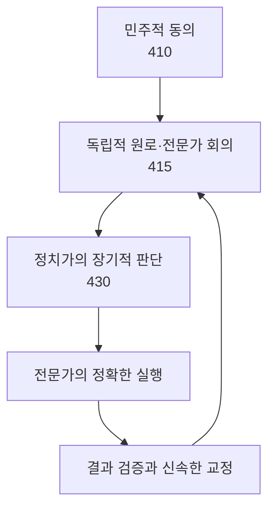

# 『진실 대 거짓』 제15장 「진실과 전쟁」

# 『진실 대 거짓』 제15장 「진실과 전쟁」

원문 범위는 3736~4368행입니다. 제15장은 제14장보다 분량이 두 배 이상이며, 원문 표제와 주요 논지 전환을 함께 반영하면 15.1~15.30으로 구분됩니다.

## 핵심 해설

호킨스 박사님께서는 전쟁을 단순한 국가 간 충돌이 아니라, 거짓·무지·부정·선전·현실 검증력의 결여가 사회적 규모로 폭발한 결과로 설명하십니다. 따라서 평화를 원한다면 전쟁이 일어난 뒤 비난하는 데 머무르지 않고, 병리적인 지도자·그릇된 이데올로기·정보기관의 무능·수동적 이상주의 같은 임계요인을 조기에 식별해야 합니다.

장의 후반부에서는 전쟁이라는 극한 상황도 개인적 의지를 신께 내맡기고, 용기·책임·연민·용서를 선택할 수 있는 영적 기회가 될 수 있음을 밝히십니다.

## 식별된 소제목 목차

### 15.1 전쟁이라는 사회적 질병과 ‘올바른 진단’

전염병의 원인균을 발견해야 치료할 수 있듯이, 전쟁을 예방하려면 그 배후의 의식적·병리적 원인을 먼저 정확하게 식별해야 한다는 서론입니다.

### 15.2 평화는 진실의 자연스러운 상태이고 전쟁은 거짓의 귀결이다

평화와 전쟁의 근본적 차이를 진실과 거짓의 지배라는 관점에서 규정하고, 인간 마음의 구조적 무구함이 선전과 궤변에 이용되는 과정을 설명합니다.

### 15.3 제2차 세계대전의 진단적 측정치

연합국과 추축국의 지도자·정부·군대·정보기관·간첩·주요 작전을 측정하여 전쟁의 전체적 의식 지도를 제시합니다.

### 15.4 병사들의 온전성과 병리적 지도자의 배신

일선의 군인들은 지도자보다 높게 측정되는 경우가 많으며, 악성 지도자는 자신의 팽창된 에고를 위해 충성스러운 군대와 국민까지 희생시킨다는 점을 밝힙니다.

### 15.5 임계요인 분석―전쟁을 조기에 멈출 수 있는 지점

전쟁도 복잡계이므로, 추진력을 얻기 전의 정확한 임계점을 식별하면 최소한의 비용으로 전체 전쟁을 예방할 수 있다는 원리입니다.

### 15.6 의도·능력·현실 검증력의 조합―챔벌린과 히틀러

선한 의도만으로는 충분하지 않으며, 의도·능력·현실 검증력이 어떤 조합을 이루느냐에 따라 지도자의 실제 결과가 완전히 달라짐을 설명합니다.

### 15.7 수동성이 공격성을 불러들이는 포식자·먹이 역학

병리적인 공격자는 상대의 수동성과 부정을 평화의 몸짓이 아니라 약함으로 해석하며, 그 결과 공격성이 더욱 활성화될 수 있음을 설명합니다.

### 15.8 악성 메시아적 자기애의 진단

양심 부재, 권력욕, 자기 확대, 메시아적 과대성, 타인에 대한 경멸이 결합된 극단적 지도자 병리를 규정합니다.

### 15.9 지도자 우상화·선전·숙청·신성모독

악성 메시아적 자기애가 지도자 숭배, 대중 세뇌, 군사적 연극, 반대자 숙청, 자국민 학살과 잔혹행위로 외부화되는 과정을 보여 줍니다.

### 15.10 주요 전쟁들의 대비 측정치

한국전쟁·베트남전쟁·냉전·걸프전·제1차 세계대전·나폴레옹전쟁의 주요 위치성을 비교하고, 정보 실패와 권력의 타락이라는 반복적 유형을 찾습니다.

### 15.11 이라크 전쟁 초기의 위치성과 의도

이라크 전쟁 초기의 미국 정부·군·의회·대중매체·유엔·중동 국가·테러 세력 등을 200의 임계점을 기준으로 대비합니다.

### 15.12 이라크 전쟁 후기와 언론 보도의 측정치

전쟁 후기의 정부기관·정당·국제기구·민간군사기업과 각 언론사의 보도를 측정하여, 동일한 사건도 위치성과 맥락에 따라 다르게 해석됨을 보여 줍니다.

### 15.13 9·11은 범죄인가, 전쟁 행위인가

빈 라덴의 선전포고, 펜타곤 공격, 백악관 공격 시도라는 전체 맥락을 통해 9·11을 단순 범죄가 아닌 전쟁 행위로 정의하는 박사님의 논리를 설명합니다.

### 15.14 이라크전 결정과 정보 실패의 맥락

당시에 접근 가능했던 정보, 우라늄 보고 논란, 정보기관 사이의 단절, 후세인의 유엔 결의 거부와 범아랍적 극단주의의 확산을 연결합니다.

### 15.15 가해자·피해자 역전과 이원적 에고의 투사

에고가 가해자를 피해자로, 피해자를 가해자로 뒤바꾸어 지각하는 기제와, 전쟁을 미워하는 것만으로는 평화가 생기지 않는 이유를 밝힙니다.

### 15.16 이라크전 후기 추가 측정치와 9·11 전야의 ‘장’

정치적 평화주의·언론·포로 처우·국가 방위·관료적 장벽 등을 측정하여 9·11 이전의 부정과 대비 부족이 형성한 전체적 분위기를 진단합니다.

### 15.17 9·11 조사위원회와 ‘위치성’의 변동성

청문회·증언·최종 보고서의 측정치를 제시하고, 특정 시기의 ‘위치’를 사람이나 국가 전체의 고정된 수준과 구분합니다.

### 15.18 이라크 전쟁의 장기적 역사·지정학적 맥락화

호킨스 박사님께서 초기 이슬람·오스만제국·와하비파로 이어지는 세 차례의 지하드와 중동의 석유·핵무기·권력구조를 이라크전의 장기적 맥락으로 연결하신 부분입니다.

### 15.19 급진적 이데올로기의 모집과 확산

폭력적 이데올로기가 종교와 정의의 외관을 이용해 개종자를 모집하고, 변증자와 지식인의 순진성을 통해 사회적으로 확산되는 과정을 설명합니다.

### 15.20 ‘지도자 증오’ 신드롬과 허수아비 이미지

억압된 권력욕·질투·죄책감·자기혐오가 지도자에게 투사되어, 실제 인물과 전혀 다른 악한 허수아비 이미지를 만들어 내는 과정을 분석합니다.

### 15.21 9·11 이후의 잔혹행위와 상황적 사디즘

밀그램과 짐바르도의 연구를 통해 평범한 사람에게도 권위·역할·환경이 결합하면 가학적 행동이 활성화될 수 있음을 설명합니다.

### 15.22 종교적 권위가 폭력을 무제한화하는 방식

폭력에 ‘신의 뜻’이라는 권위를 부여하면 이성·윤리·도덕의 제약이 제거되어 가장 위험한 형태의 공격성이 나타난다는 진단입니다.

### 15.23 테러 조직들의 공통 측정 범위와 끌개장

세계 각지의 테러 조직들을 측정하고, 이념과 지역은 달라도 에고 중심성·우월주의·증오·파괴라는 공통된 낮은 끌개장에 정렬되어 있음을 밝힙니다.

### 15.24 ‘테러리스트와 자유의 투사’라는 궤변

행동의 외관만 볼 것이 아니라 의도·맥락·대상·목적을 확인해야 하며, 자유의 투사와 테러리스트를 상대주의적으로 동일시해서는 안 된다는 설명입니다.

### 15.25 타나토스―살해 충동과 집단적 광기

프로이트의 죽음 본능, 군중의 살해 열기, 집단 속에서 감소하는 죄책감 등을 통해 테러와 전쟁의 원시적 에너지원을 추적합니다.

### 15.26 문화적·경제적 장과 현실적인 접근

200이라는 임계점, 빈곤, 정치·종교 구조, 서구 대중매체의 이미지가 극단주의에 미치는 영향을 연결하고, 상대가 실제로 있는 의식의 자리에서 접근해야 한다고 설명합니다.

### 15.27 민간군사기업과 규율된 전문성

민간군사기업의 높은 효율성과 낮은 사상률을 통해, 정치적 격정이 아니라 이성·규율·전문성에 기반한 개입의 가능성을 검토합니다.

### 15.28 정치인의 지식과 미국 정보기관의 반복적 실패

정치인의 주요 정책 분야 지식이 낮게 측정되는 문제와 미국 정보기관이 190 수준에서 되풀이해 현실을 오판한 철학적·조직적 원인을 분석합니다.

### 15.29 현자 자문회의·전문가 활용·핵위협 진단·영성과 전쟁

정치에서 벗어난 정치가와 전문가의 자문, 민간 전문성, 의도와 능력의 동시 측정에 이어, 수동성과 영성을 혼동하지 않는 윤리적 용기의 필요성을 설명합니다.

### 15.30 전쟁의 영적 의미와 최종 결론

극한 상황에서 책임을 다하면서 개인적 의지를 신께 내맡기는 선택, 전쟁을 용서·연민·카르마적 성장의 기회로 전환하는 길, 그리고 일곱 가지 국가적 권고를 종합합니다.

다음 상세 해설은 **15.1 「전쟁이라는 사회적 질병과 ‘올바른 진단’」**부터 시작하면 됩니다.

가능합니다. 오히려 제15장은 분량이 길기 때문에 두 문서로 나누는 편이 좋습니다.

- 현재 문서: **15.1~15.15**
- 새 문서: **15.16~15.30**

문서 제목은 다음처럼 구분하면 됩니다.

1. **『진실 대 거짓』 제15장 「진실과 전쟁」 상 — 15.1~15.15**
2. **『진실 대 거짓』 제15장 「진실과 전쟁」 하 — 15.16~15.30**

원문 파일 자체를 잘라낼 필요는 없습니다. 같은 원문을 참조하되 해설 진행만 둘로 나누고, 번호와 목차는 기존의 **15.1~15.30을 그대로 유지**하면 됩니다.

따라서 여기서는 **15.1부터 15.15까지만** 진행하겠습니다. 다른 문서에서 “『진실 대 거짓』 제15장 후반부 15.16”이라고 입력하시면 **15.16부터 이어서** 해설하겠습니다.

# 『진실 대 거짓』 제15장 「진실과 전쟁」||「15.1 전쟁이라는 사회적 질병과 ‘올바른 진단’」

## 핵심 해설

호킨스 박사님께서는 전쟁을 우발적인 국제 분쟁이 아니라, **숨은 병리적 요소가 사회 전체에서 극단적으로 발현된 결과**로 규정하십니다.

인류는 전쟁이 초래하는 죽음과 파괴를 충분히 경험했지만, 정작 전쟁을 발생시키는 근본 원인은 정확히 진단하지 못했습니다. 그 때문에 수많은 예방책도 전쟁의 ‘증상’에 대응했을 뿐, 그 증상을 만들어 내는 원인을 제거하지 못했다는 것입니다.

이 도입부의 중심 명제는 간단합니다.

> 질병의 원인을 잘못 이해하면 치료법도 잘못되듯이, 전쟁의 원인을 정확히 식별하지 못하면 평화를 위한 노력도 실패한다.

호킨스 박사님께서는 의식 연구를 사회적 병리를 식별하는 일종의 ‘현미경’으로 제시하십니다. 이를 통해 관련 국가·정부·지도력·활성화된 요소들의 위치성을 각각 확인하면, 전쟁이 실제로 일어나기 전에 위험의 구성을 알아볼 수 있다는 설명입니다.

---

## 1. 전쟁을 ‘사회적 질병’으로 보는 이유

박사님께서는 먼저 전쟁이 역사적으로 가장 많은 인명을 앗아 간 원인이라고 지적하십니다. 역병·기아·자연재해보다도 전쟁으로 인한 죽음이 더 많았다는 것입니다.

그런데 여기서 중요한 것은 단순한 사망자 수가 아닙니다. 전쟁은 자연재해와 달리 인간의 의도·지각·지도력·집단적 정렬에 의해 일어납니다. 그러므로 전쟁은 불가피한 자연현상이 아니라, **인간 의식의 병리적 요소들이 상호작용하여 만들어 내는 사회적 현상**입니다.

질병에는 눈앞에 보이는 증상과 그 증상을 일으키는 원인이 있습니다.

| 의학적 질병 | 전쟁이라는 사회적 질병 |
|---|---|
| 발열·통증·염증 | 침략·폭격·학살·대량 파괴 |
| 숨은 병원균 | 거짓·병리적 의도·현실 검증력의 결여 |
| 인체 내부의 감염 과정 | 국가·정부·지도력 사이의 상호작용 |
| 현미경을 통한 원인 확인 | 의식 연구를 통한 위치성의 식별 |
| 원인에 맞는 치료 | 임계요인의 조기 발견과 개입 |

따라서 전쟁터에서 벌어지는 폭력은 질병 자체의 최초 원인이 아니라, 이미 상당히 진행된 병리의 외부 증상입니다. 전쟁은 총성이 울리는 순간 갑자기 생기는 것이 아니라, 그보다 훨씬 앞서 의식의 수준에서 준비됩니다.

---

## 2. 잘못된 진단은 잘못된 치료를 낳는다

박사님께서는 과거 사람들이 전염병의 원인을 독기·점성술적 영향·‘나쁜 공기’ 등에서 찾았던 사례를 드십니다. 원인을 잘못 이해했기 때문에 거머리와 사혈 같은 치료법이 사용되었지만, 실제 병원균에는 영향을 주지 못했습니다.

현미경과 세균학이 발달하면서 비로소 보이지 않던 박테리아가 발견되었고, 페니실린을 비롯한 항생제가 등장하면서 질병을 원인 수준에서 치료할 수 있게 되었습니다.

이 비유가 가리키는 것은 다음과 같습니다.

- 고통이 크다는 사실을 아는 것만으로는 충분하지 않습니다.
- 전쟁을 혐오하거나 비난하는 것만으로도 충분하지 않습니다.
- 평화를 선의로 원한다고 해서 전쟁의 작동 원리를 아는 것은 아닙니다.
- 실제 원인이 아닌 것을 원인으로 간주하면 예방책도 무력해집니다.
- 치료하려면 먼저 병리적 요소를 정확히 식별해야 합니다.

따라서 박사님께서 말씀하시는 ‘올바른 진단’은 전쟁에 대해 도덕적 구호를 외치는 것이 아니라, **실제로 어느 요소가 전쟁을 발생시키고 있는지를 현실적으로 확인하는 것**입니다.

---

## 3. 의식 연구는 사회적 병리를 보는 ‘현미경’이다

세균은 현미경이 발명되기 전에도 존재했지만 사람의 눈에는 보이지 않았습니다. 이와 마찬가지로 박사님께서는 전쟁을 일으키는 의식의 병리적 요소들도 항상 존재했으나, 그것을 객관적으로 식별할 수 있는 방법이 없었다고 설명하십니다.

박사님의 체계에서 의식의 장은 시간과 공간을 넘어 모든 사건·의도·생각을 등록합니다. 의식 측정은 그 장에 접근하여 겉으로 드러난 주장과 그 배후의 실제 위치성을 구분하는 방법입니다.

예를 들어 어떤 지도자가 평화를 말한다고 해서 그 사람의 실제 의도까지 평화적인 것은 아닐 수 있습니다. 반대로 의도가 선하더라도 현실 검증력과 능력이 결여되어 있다면, 결과적으로 위험한 세력을 돕게 될 수도 있습니다.

그러므로 진단에서는 외적인 명분만이 아니라 다음 요소를 함께 확인해야 합니다.

1. **관련 국가의 위치성**  
   그 국가가 전체적으로 어떤 가치와 목적에 정렬되어 있는가.

2. **정부의 위치성**  
   국가 전체와 별도로, 당시 정부가 실제로 어떤 방향으로 움직이는가.

3. **지도력**  
   지도자의 의도·온전성·현실 검증력·실행 능력이 어떻게 구성되어 있는가.

4. **활성화된 요소들**  
   잠재해 있던 공격성이나 이데올로기적 병리가 실제 행동력을 얻어 작동하기 시작했는가.

전쟁은 이 가운데 한 요소만으로 설명되지 않습니다. 여러 요소가 상호작용하여 하나의 전쟁 촉발 장을 형성합니다.

---

## 4. 전쟁은 낮은 의식장의 ‘사회적 극단 표현’이다

박사님께서는 전쟁을 “낮은 힘에 의한 행위의 사회적으로 극단적인 시위”라고 표현하십니다. 여기서 ‘낮은 힘’은 군사력이 약하다는 뜻이 아닙니다. 물리적으로는 매우 강력한 국가라도 그 힘을 거짓·위협·지배·증오·파괴를 위해 사용한다면 낮은 의식장에 정렬될 수 있습니다.

낮은 의식장의 특징은 대체로 다음과 같습니다.

- 목적을 이루기 위해 거짓과 선전을 이용합니다.
- 타인을 독립된 존재가 아니라 이용하거나 제거할 대상으로 봅니다.
- 강제력과 공포를 통해 복종을 얻으려 합니다.
- 자신의 공격성을 정당화하기 위해 피해자와 가해자를 뒤바꿉니다.
- 현실보다 이데올로기와 과대망상을 우선합니다.

개인에게서 나타나는 이러한 병리가 정부와 군대와 대중을 장악하면, 사적인 공격성이 사회적 규모의 전쟁으로 확대됩니다. 따라서 전쟁은 개인적 에고의 병리가 국가적 장으로 팽창한 결과라고 볼 수 있습니다.

다만 15.1 도입부에서는 이 낮은 위치성에 특정 수치를 부여하지 않습니다. 구체적인 지도자와 국가의 측정치는 이후 절에서 제시되므로, 여기서는 임의의 의식수준을 덧붙이지 않는 것이 정확합니다.

---

## 5. ‘예측할 수 있다’는 말의 의미

박사님께서는 상황을 구성하는 요소들을 측정하면 전쟁 발발을 사전에 예측할 수 있다고 말씀하십니다.

이것은 미래가 이미 결정되어 있다는 운명론이 아닙니다. 특정한 병리적 요소들이 결합하면 어떤 결과가 나타날 가능성이 급격히 커지는지를 식별할 수 있다는 뜻입니다.

감염 초기에 병원균을 발견하면 병이 전신으로 퍼지기 전에 치료할 수 있듯이, 전쟁 역시 추진력을 얻기 전에 위험요인을 발견하면 훨씬 적은 비용으로 막을 수 있습니다. 반대로 위험이 명백한데도 부정하거나, 선한 의도만 믿고 현실 검증을 회피하면 병리적 세력은 더욱 강해집니다.

따라서 예측의 목적은 공포를 조성하는 것이 아니라 **조기에 진실을 인식하여 파괴가 현실화되는 것을 예방하는 것**입니다.

---

## 핵심 개념 구분

### 진단과 비난

비난은 “누가 나쁜가”에 머무르기 쉽지만, 진단은 “어떤 병리적 요소가 어떻게 작동하고 있는가”를 밝힙니다. 박사님께서 요구하시는 것은 감정적 규탄보다 정확한 인식입니다.

### 증상과 원인

전투·폭격·학살은 전쟁의 가시적인 증상입니다. 그 원인은 훨씬 앞선 단계의 거짓, 선전, 병리적 지도력, 집단적 무지와 현실 검증력의 결여에 있습니다.

### 선한 의도와 올바른 진단

평화를 바라는 선한 의도가 언제나 올바른 판단을 보장하지는 않습니다. 의도가 선해도 현실을 정확히 보지 못하면, 병리적 공격자에게 시간과 기회를 제공할 수 있습니다.

### 군사적 강함과 의식의 힘

무기가 강력하다고 해서 박사님께서 말씀하시는 참된 힘이 있는 것은 아닙니다. 거짓과 강제에 의존하는 군사력은 외형적으로 강해 보여도 낮은 위치성의 표현일 수 있습니다.

---

## 오해하기 쉬운 부분

전쟁을 질병에 비유했다고 해서 특정 민족이나 국민 전체를 병원균으로 취급한다는 뜻은 아닙니다. 진단 대상은 사람의 존재 가치가 아니라, 전쟁을 촉발하는 **의도·이데올로기·지도력·행동 양식과 그 위치성**입니다.

또한 전쟁을 예측할 수 있다는 말은 전쟁이 필연적이라는 뜻이 아닙니다. 오히려 올바른 진단을 통해 임계요인을 조기에 발견하면 전쟁을 예방할 수 있다는 의미입니다.

마지막으로, 이 도입부는 전쟁을 정당화하려는 설명이 아닙니다. 박사님의 관심은 전쟁이 시작된 뒤 어느 편을 감정적으로 비난하는 데 있지 않고, **전쟁을 만들어 내는 거짓의 구조를 조기에 드러내어 대량 파괴를 막는 데** 있습니다.

---

## 더 깊은 의미

제15장이 전쟁사나 군사 전략이 아니라 ‘진단’에서 시작하는 것은 중요합니다. 호킨스 박사님께서 보시기에 전쟁의 근본 문제는 무기의 문제가 아니라 **진실을 식별하는 능력의 문제**이기 때문입니다.

잘못된 인과관계와 허위의 명분을 진실로 믿으면, 사회는 병리적인 지도자를 구원자로 오인하고 공격성을 평화로 오인하며 수동성을 도덕성으로 오인할 수 있습니다. 이렇게 거짓이 집단적 지각을 장악한 최종 결과가 전쟁입니다.

따라서 이 절에서 말하는 평화의 첫 조건은 감상적인 선의가 아니라 현실에 대한 정확한 인식입니다. 진실은 단순한 철학적 관념이 아니라, 문명의 생존을 가능하게 하는 실제적인 진단 능력입니다. 제15장의 나머지 부분은 바로 이 진단 원리를 역사적 전쟁·지도자·정부·정보기관에 적용하여 구체적으로 보여 주는 전개입니다.

# 『진실 대 거짓』 제15장 「진실과 전쟁」||「15.2 평화는 진실의 자연스러운 상태이고 전쟁은 거짓의 귀결이다」

## 핵심 해설

호킨스 박사님께서는 평화와 전쟁을 단순히 두 가지 국제정세로 보지 않으십니다. 그것들은 각각 **진실과 거짓이 집단적으로 낳는 결과**입니다.

- 현실과 의도가 진실하게 인식되면 평화가 자연스럽게 유지됩니다.
- 현실이 선전·궤변·과대망상으로 왜곡되면 전쟁으로 기울어집니다.
- 전쟁의 가장 깊은 토대는 인간의 악의만이 아니라, **진실과 거짓을 스스로 식별하지 못하는 마음의 무지**입니다.

따라서 전쟁은 총성이 울리면서 시작되는 것이 아닙니다. 그보다 먼저 사람들의 지각이 거짓으로 프로그램되고, 과대망상적인 지도자가 참된 지도자로 오인되며, 공격성이 정의나 구원이라는 이름으로 포장되는 단계에서 이미 시작됩니다.

---

## 1. “평화는 자연스러운 상태”라는 말의 정확한 의미

여기서 ‘자연스럽다’는 말은 인류가 역사적으로 대부분 평화롭게 살았다는 뜻이 아닙니다. 원문은 오히려 정반대로, 인간 문명의 역사에서 평화가 지배한 시대는 7퍼센트이고 전쟁이 지배한 시대는 93퍼센트였다고 밝힙니다. 박사님께서는 이 진술이 ‘진실’로 측정된다고 덧붙이십니다.

그러므로 다음 두 가지를 구분해야 합니다.

- **자연스러운 상태**: 진실이 지배할 때 별도의 강압 없이 나타나는 결과
- **역사적으로 흔한 상태**: 실제 인류 역사에서 반복적으로 나타난 상태

평화는 진실에 정렬된 사회의 자연스러운 결과이지만, 인간 사회는 오랫동안 진실보다 무지·두려움·욕망·집단적 환상에 지배되어 왔습니다. 그래서 구조적으로는 자연스러운 평화가 역사적으로는 드물었던 것입니다.

진실이 지배한다는 것은 모든 사람이 같은 의견을 갖는다는 뜻이 아닙니다. 서로 다른 이해관계가 있더라도 다음이 가능하다는 뜻입니다.

- 실제 상황을 있는 그대로 인정합니다.
- 상대방의 의도와 능력을 현실적으로 판단합니다.
- 지도자의 말과 실제 행동을 구분합니다.
- 오류가 드러나면 입장을 수정할 수 있습니다.
- 공동의 현실을 선전이나 이념보다 우선합니다.

이러한 조건에서는 갈등이 생겨도 갈등을 전쟁으로 확대할 필요가 없습니다. 반면 공동의 현실이 무너지면 합리적인 조정의 기반도 함께 무너집니다.

---

## 2. 전쟁은 왜 ‘거짓의 귀결’인가

이 절에서 말하는 거짓은 단순히 어떤 지도자가 사실과 다른 말을 한 번 했다는 정도가 아닙니다. 그것은 현실 전체를 왜곡하는 집단적 위치성입니다.

전쟁에 앞서 흔히 다음과 같은 왜곡이 일어납니다.

1. 자신의 공격적 의도를 정의로운 사명으로 포장합니다.
2. 상대방을 인간이 아니라 제거해야 할 악으로 규정합니다.
3. 침략을 방어나 해방이라고 부릅니다.
4. 지도자의 개인적 과대망상을 국가의 운명으로 제시합니다.
5. 반대 정보는 배신이나 적의 선전으로 몰아냅니다.
6. 선택적으로 편집된 정보가 반복되면서 집단의 현실이 됩니다.

이렇게 되면 전쟁은 대중에게 단순한 폭력으로 보이지 않습니다. 오히려 정의·생존·명예·신의 뜻을 위한 불가피한 행동처럼 지각됩니다.

거짓의 가장 위험한 기능은 악한 행동을 선한 행동처럼 보이게 하는 것입니다. 사람들은 자신이 거짓을 선택하고 있다고 생각하지 않습니다. 거짓으로 구성된 지각 안에서 자신이 선과 정의를 선택하고 있다고 믿습니다.

따라서 박사님께서 말씀하시는 전쟁의 인과적 흐름은 다음과 같습니다.

> 마음의 무지 → 거짓에 의한 프로그램화 → 현실의 왜곡 → 지도자와 적에 대한 오인 → 집단적 정당화 → 낮은 힘의 사용 → 전쟁과 파괴

전쟁은 이 연쇄의 마지막 외부 표현입니다.

---

## 3. “전쟁의 기초는 무지이다”

여기서 무지는 지식이나 학력이 부족하다는 뜻이 아닙니다. 박사님의 용어에서 무지는 **마음이 자신의 한계를 알지 못하는 상태**에 가깝습니다.

인간의 마음은 어떤 주장이 다음 조건을 갖추면 그것을 진실로 받아들이기 쉽습니다.

- 논리적으로 그럴듯해 보입니다.
- 강한 감정을 일으킵니다.
- 권위 있는 인물이 반복해서 말합니다.
- 자신이 이미 믿고 있는 신념과 일치합니다.
- 집단의 대다수가 동의하는 것처럼 보입니다.
- 두려움이나 자부심을 자극합니다.

그러나 그럴듯함·감정적 확신·집단적 동의는 진실의 증명이 아닙니다. 마음은 자신이 받아들인 정보가 진실인지, 단지 진실처럼 보이는 프로그램인지 스스로 판정할 수 없습니다.

그러므로 박사님께서 말씀하시는 무지는 단순한 정보 부족보다 훨씬 근본적입니다. 그것은 마음이 자신의 정신 작용을 실상 자체로 오인하는 구조적 한계입니다.

---

## 4. 참된 지도자와 과대망상적인 지도자의 혼동

이 절에서 가장 중요한 정치적 귀결은 사람들이 **참된 지도자와 과대망상적인 지도자를 구별하지 못한다**는 것입니다.

두 지도자 모두 외적으로는 다음과 같은 모습을 보일 수 있습니다.

- 확신에 찬 언어를 사용합니다.
- 국가의 미래와 위대한 사명을 말합니다.
- 대중에게 희망과 결속을 약속합니다.
- 자신만이 위기를 해결할 수 있다고 주장합니다.
- 희생과 충성을 요구합니다.

그러나 내적 방향은 완전히 다를 수 있습니다.

| 참된 지도력 | 과대망상적 지도력 |
|---|---|
| 현실을 있는 그대로 파악함 | 자기 환상을 현실보다 우선함 |
| 공동체에 봉사함 | 공동체를 자기 확대에 이용함 |
| 오류를 인정하고 수정함 | 오류를 적과 배신자에게 투사함 |
| 국민의 생명을 목적으로 존중함 | 국민을 자신의 영광을 위한 수단으로 사용함 |
| 책임을 받아들임 | 실패를 외부에 전가함 |

문제는 외형적 카리스마나 언어만으로 이 차이를 식별하기 어렵다는 데 있습니다. 오히려 과대망상적인 지도자는 강렬한 확신과 극적인 수사를 사용하기 때문에 참된 지도자보다 더 강력해 보일 수 있습니다.

따라서 전쟁의 출발점에는 단지 악성 지도자의 존재만 있는 것이 아닙니다. 그를 구원자·영웅·역사적 사명자로 오인하는 집단적 지각도 함께 있습니다.

---

## 5. 인간의 ‘무구함’과 거짓 프로그램

호킨스 박사님께서 말씀하시는 인간의 무구함은 순수하거나 도덕적으로 흠이 없다는 뜻이 아닙니다. 그것은 **진실을 식별하는 내장된 장치가 없는 인식상의 무방비 상태**를 뜻합니다.

사람의 마음은 자신에게 들어오는 정보를 일일이 독립적으로 검증하지 못합니다. 특히 어릴 때부터 반복적으로 주입된 종교적·정치적·민족적 신념은 현실 그 자체처럼 느껴집니다.

원문은 이러한 프로그램화의 수단으로 세 가지를 지적합니다.

### 설득력 있는 수사

감정과 상징을 자극하여 어떤 주장을 진실처럼 느끼게 만듭니다. 주장에 실제 근거가 있는가보다 얼마나 장엄하고 감동적으로 들리는가가 우선됩니다.

### 궤변

논리적 외관을 갖추고 있지만 전제나 맥락이 왜곡되어 있습니다. 부분적으로 옳은 사실을 이용해 전체적으로 그릇된 결론을 유도할 수도 있습니다.

### 선전

일정한 정보만 반복적으로 노출하고 불리한 정보는 제거함으로써 집단의 지각을 조직합니다. 반복된 주장은 익숙해지고, 익숙함은 진실성으로 오인됩니다.

이 세 가지가 결합하면 사람들은 거짓에 강요당하고 있다고 느끼지 않습니다. 오히려 자신이 자발적으로 판단하여 진실을 선택했다고 확신하게 됩니다. 이것이 거짓 프로그램의 가장 강력한 특성입니다.

---

## 6. 거짓이 먼저 지각을 지배한다

전쟁의 직접적 도구는 무기이지만, 무기를 움직이는 것은 인간의 지각입니다. 사람을 죽여야 할 적으로 규정하지 않은 상태에서는 대규모 파괴를 지속하기 어렵습니다.

따라서 선전은 먼저 상대의 인간성을 지웁니다.

- 상대는 본질적으로 악하다고 규정됩니다.
- 상대와의 대화는 무의미하다고 선언됩니다.
- 상대의 모든 행동은 악의 증거로 해석됩니다.
- 자기편의 공격은 방어로, 상대의 방어는 공격으로 해석됩니다.
- 개인적 책임은 집단 전체에 확대됩니다.

이 단계에 이르면 사람들은 실제 상대를 보고 반응하는 것이 아닙니다. 마음속에 구성된 적의 이미지를 외부 현실에 투사하고, 그 투사된 이미지를 공격합니다.

그러므로 전쟁은 먼저 마음 안에서 일어나고, 그다음 물리적 세계에서 표현됩니다. 거짓은 무기를 만들기 전에 **무기를 사용하는 것이 정당하다는 지각**을 만듭니다.

---

## 7. 거짓 프로그램의 대가

호킨스 박사님께서는 전쟁의 결과를 전투 중의 죽음과 파괴에 한정하지 않으십니다.

| 범위 | 원문이 제시하는 결과 |
|---|---|
| 직접적 참사 | 고뇌, 죽음, 대량 파괴 |
| 사회적 후유증 | 부채, 슬픔, 죄책감, 수감자, 증오 |
| 장기적 손상 | 지속되는 스트레스, 고통스러운 기억, 격렬한 고통, 정신적 외상 |

전쟁이 끝났다고 해서 거짓의 결과가 끝나는 것은 아닙니다. 사회는 장기간 부채와 파괴를 떠안고, 개인은 상실·죄책감·증오·외상을 짊어집니다. 적대감은 다음 세대로 전해져 새로운 충돌을 준비할 수도 있습니다.

이것은 전쟁이 순간적인 군사 사건이 아니라, 인간 의식과 사회 전체를 오랫동안 손상시키는 연쇄적 현상임을 뜻합니다.

---

## 핵심 개념 구분

### 평화와 수동성

평화는 현실을 보지 않거나 위험을 부정하는 상태가 아닙니다. 거짓과 병리적 의도를 정확히 식별하는 것이 오히려 평화를 보존하는 전제입니다. 위험을 외면하는 수동성은 이후 절에서 설명되듯 공격자에게 기회를 줄 수도 있습니다.

### 진실과 이념적 확신

어떤 집단이 자신을 진실의 편이라고 강하게 확신한다고 해서 진실에 정렬된 것은 아닙니다. 진실은 확신의 강도가 아니라 실제 의도·맥락·현실 검증력·결과와의 일치에 달려 있습니다.

### 무지와 낮은 지능

무지는 지능이 낮다는 뜻이 아닙니다. 매우 지적인 사람도 전제 자체가 거짓이면 뛰어난 논리를 사용하여 거짓을 더욱 정교하게 정당화할 수 있습니다.

### 무구함과 책임의 부재

마음이 구조적으로 잘 속는다는 설명은 인간을 비난하기 위한 것이 아니지만, 모든 책임을 없애는 설명도 아닙니다. 자신의 마음이 쉽게 프로그램될 수 있음을 아는 것이 진실을 더 신중하게 식별해야 하는 이유가 됩니다.

### 거짓의 귀결과 참전자의 가치

전쟁이 거짓의 귀결이라는 말은 전쟁에 참여한 모든 개인의 의도와 온전성이 동일하다는 뜻이 아닙니다. 다음 절의 측정치에서도 병사·군대·지도자·정부·작전의 위치성이 서로 다르게 제시됩니다.

---

## 의식수준에 관한 주의

15.2에서는 평화와 전쟁 자체에 별도의 의식수준 수치를 부여하지 않습니다. 본문이 직접 밝히는 것은 다음 두 가지입니다.

- 인류 역사에서 평화 7퍼센트, 전쟁 93퍼센트라는 진술
- 그 진술이 ‘진실’로 측정된다는 점

따라서 이 절만을 근거로 평화나 전쟁에 임의의 수치를 지정해서는 안 됩니다. 구체적인 인물·정부·군대·행동의 측정치는 15.3부터 개별적으로 제시됩니다.

---

## 더 깊은 의미

이 절에서 호킨스 박사님께서 제시하시는 평화의 첫 조건은 선의나 감상적인 전쟁 혐오가 아니라 **진실을 식별하는 능력**입니다.

거짓을 진실로 믿는 한 사람은 평화를 원하면서도 전쟁의 조건을 강화할 수 있습니다. 반대로 현실의 위험을 정확히 식별하는 행동은 외형적으로 단호해 보여도 더 큰 전쟁을 예방할 수 있습니다. 그러므로 평화의 핵심은 행동의 부드러운 외관이 아니라, 그 행동이 진실과 현실에 얼마나 정렬되어 있는가에 있습니다.

제15장 전체에서 이 기본 전제는 이후 모든 분석의 기준이 됩니다.

> 전쟁을 예방하려면 먼저 거짓이 지도자·정부·언론·대중의 지각을 어떻게 장악하는지를 식별해야 합니다.

15.3에서는 이 원리를 제2차 세계대전의 지도자·정부·군대·정보기관·작전에 적용하여, 같은 전쟁 안에서도 각 위치성과 온전성이 어떻게 달랐는지를 구체적인 측정치로 보여 주십니다.

# 『진실 대 거짓』 제15장 「진실과 전쟁」||「15.3 진단적 측정치―제2차 세계대전」

## 핵심 해설

호킨스 박사님께서는 제2차 세계대전을 단순히 ‘연합국 대 추축국’이라는 두 진영으로 나누어 평가하지 않으십니다. 전쟁을 구성하는 각각의 요소를 분리하여 측정하십니다.

> 국가 전체 ≠ 정부 ≠ 지도자 ≠ 군대 ≠ 병사 ≠ 군사작전 ≠ 포로 처우 ≠ 정보기관

같은 나라에 속해 있어도 지도자와 병사의 위치성은 크게 다를 수 있고, 동일한 군사행동처럼 보여도 그 의도와 맥락에 따라 측정치는 전혀 달라질 수 있습니다.

이 측정표의 가장 중요한 결론은 다음과 같습니다.

1. 전쟁을 국가나 진영 하나의 수치로 뭉뚱그려서는 안 됩니다.
2. 병사들은 그들을 전쟁으로 내몬 지도자보다 훨씬 높게 측정될 수 있습니다.
3. 의도·능력·행동·결과는 각각 별도로 식별해야 합니다.
4. 의식수준은 사람에게 붙는 영구적인 신분이 아니라 특정 시기의 위치성을 나타냅니다.
5. 외적인 명칭보다 실제 의도와 맥락이 결정적입니다.

---

## 1. ‘진단적 측정치’란 무엇인가

박사님께서는 전쟁을 예방하려면 “누가 우리 편인가”가 아니라, 전쟁을 구성하는 각 요소가 실제로 어디에 위치하는지를 확인해야 한다고 말씀하십니다.

본문에서 제시하는 첫 번째 임계 기준은 의식수준 **200**입니다.

- 전 세계 인구의 약 78퍼센트는 200 이하로 측정됩니다.
- 미국 인구의 51퍼센트는 200 이상으로 측정됩니다.
- 당시 미국의 전체적 의식수준은 421로 제시됩니다.

여기서 200은 사람의 존엄성을 나누는 선이 아닙니다. 박사님의 의식 지도에서 200은 대체로 **온전성·책임·용기·진실성과 정렬되기 시작하는 임계점**입니다.

- 200 이하에서는 거짓·강제·두려움·증오·자기중심성이 행동의 주된 동력이 되기 쉽습니다.
- 200 이상에서는 현실 검증력·책임·합리성·타인의 권리에 대한 존중이 작동하기 시작합니다.

미국 인구 중 51퍼센트가 200 이상인데 국가 전체가 421이라는 것은 산술평균을 뜻하지 않습니다. 박사님의 체계에서 의식의 장은 비선형적이므로, 높은 수준의 소수가 전체 장에 미치는 영향이 단순한 인원수보다 훨씬 큽니다.

---

## 2. 제2차 세계대전의 주요 측정치

### 200 이상의 위치

| 대상 | 측정치 | 대상 | 측정치 |
|---|---:|---|---:|
| 윈스턴 처칠 | 510 | 루스벨트 대통령 | 499 |
| 트루먼 대통령 | 495 | 아이젠하워 장군 | 455 |
| 맥아더 장군 | 425 | 미국 정부 | 395 |
| 주일 미국대사관 | 300 | 노르망디 침공 | 365 |
| 오펜하이머 초기 | 435 | 하이젠베르크 | 465 |
| 베르너 폰 브라운 | 400 | 로스앨러모스 | 400 |
| 미군 | 315 | 독일군 | 205 |
| 독일 공군 | 345 | 롬멜 장군 | 203 |
| 카미카제 조종사 | 390 | 히로히토 천황 | 200 |
| 도조 히데키 | 205 | 야마모토 장군 | 205 |
| 미군 포로 처우 | 255 | 미국의 일본인 억류 | 235 |
| 중증도 분류 | 390 | 진주만의 미군 | 250 |
| 영국 정보부 MI6 | 210 | KGB 정보부 | 210 |
| 양심적 참전 반대자 | 210 | 레니 리펜슈탈 | 450 |
| 제82공수사단 | 465 | 제101공수사단 | 465 |
| 터스키기 비행대 | 465 | 나바호 암호 해독자들 | 375 |
| 미국 정보부 후기 | 295 | 슈타우펜베르크 대령 | 440 |

### 200 이하의 위치

| 대상 | 측정치 | 대상 | 측정치 |
|---|---:|---|---:|
| 아돌프 히틀러 | 45 | 요세프 스탈린 | 90 |
| 무솔리니 | 50 | 하인리히 히믈러 | 40 |
| 제3제국 | 70 | 네빌 챔벌린 | 185 |
| 주미 일본대사관 | 55 | 일본 정부 | 130 |
| 오펜하이머 후기 | 70 | 로스앨러모스 이중간첩 | 70 |
| 국제연맹 | 185 | 반전론자 | 145 |
| 스팀슨 전쟁성 장관의 위치 | 180 | 진주만 공격 | 45 |
| 요세프 괴벨스 | 60 | 나치의 포로 처우 | 70 |
| 일본의 포로 처우 | 40 | 나치의 유럽 침공 | 40 |
| 강제수용소 | 30 | 런던 공습 | 30 |
| 요세프 멩겔레 | 15 | 캠브리지 5인 | 95 |
| 로젠버그 부부 | 40 | 클라우스 푹스 | 115 |
| 해럴드 필비 | 110 | 윌리엄 조이스 | 100 |
| 반역자들 | 30 | 호호경 | 50 |
| 진주만 공격 이전 미국 정보부 | 190 | ‘도쿄 로즈’ | 85 |

이 표는 모든 항목을 동일한 종류로 측정한 것이 아닙니다. 사람, 기관, 정책, 군사행동, 처우 방식, 특정 시기의 위치가 함께 제시되어 있습니다. 따라서 수치를 해석할 때는 반드시 **무엇을 측정한 수치인지** 확인해야 합니다.

---

## 3. 같은 국가 안에서도 위치성은 하나가 아니다

### 독일의 경우

| 대상 | 측정치 |
|---|---:|
| 히틀러 | 45 |
| 제3제국 | 70 |
| 나치의 유럽 침공 | 40 |
| 강제수용소 | 30 |
| 독일군 | 205 |
| 독일 공군 | 345 |
| 롬멜 장군 | 203 |
| 하이젠베르크 | 465 |
| 슈타우펜베르크 대령 | 440 |

히틀러와 제3제국의 위치가 극도로 낮다고 해서 모든 독일인·군인·과학자가 같은 위치였던 것은 아닙니다. 독일군은 205, 독일 공군은 345로 측정되고, 히틀러 암살 계획에 참여한 슈타우펜베르크 대령은 440으로 제시됩니다.

이것은 국적이나 군복이 그 사람의 실제 위치성을 결정하지 않는다는 뜻입니다. 지도자의 의도, 정권의 성격, 병사의 의무감, 개인의 양심적 선택은 각각 다릅니다.

### 일본의 경우

| 대상 | 측정치 |
|---|---:|
| 일본 정부 | 130 |
| 주미 일본대사관 | 55 |
| 진주만 공격 | 45 |
| 일본의 포로 처우 | 40 |
| 히로히토 천황 | 200 |
| 도조 히데키 | 205 |
| 야마모토 장군 | 205 |
| 카미카제 조종사 | 390 |

가장 눈에 띄는 것은 카미카제 조종사가 390으로 측정된다는 점입니다. 이것은 자살 공격이라는 전술 자체가 390이라는 뜻이 아닙니다. 표의 측정 대상은 **그 조종사들의 위치성**입니다.

박사님께서는 병사들이 충성·용기·의무감·자기희생으로 행동할 수 있는 반면, 그들을 죽음으로 보내는 정부와 지도자의 의도는 훨씬 낮을 수 있다고 설명하십니다. 따라서 병사의 주관적 의도와 그 병사를 이용한 정치적 목적을 분리해야 합니다.

### 미국의 경우

| 대상 | 측정치 |
|---|---:|
| 미국 정부 | 395 |
| 미군 | 315 |
| 노르망디 침공 | 365 |
| 미군 포로 처우 | 255 |
| 미국의 일본인 억류 | 235 |
| 진주만의 미군 | 250 |
| 진주만 이전 정보부 | 190 |
| 후기 정보부 | 295 |
| 제82·제101공수사단 | 각각 465 |

미국 역시 모든 요소가 같은 수준으로 측정되지 않습니다. 정부는 395, 미군은 315이지만 진주만 공격 이전 정보활동은 190에 머뭅니다.

미국의 일본인 억류가 235로 제시된 것도 미국 정부의 전체 측정치 395와는 구분됩니다. 이 절에서는 개별 측정의 세부 근거를 모두 설명하지 않으므로, 235라는 수치를 다른 모든 법적·역사적 판단으로 확대해서는 안 됩니다.

---

## 4. 군사행동의 외형보다 의도와 맥락이 중요하다

다음 두 항목은 외형적으로 모두 다른 나라의 영토에 군대가 들어간 사건입니다.

- 노르망디 침공: 365
- 나치의 유럽 침공: 40

하지만 박사님께서는 행동의 물리적 외관만으로 둘을 동일시하지 않으십니다. 하나는 침략·지배를 저지하기 위한 작전이고, 다른 하나는 전체주의적 정복을 위한 공격이기 때문입니다.

마찬가지로 다음 세 가지는 모두 전쟁과 관련되지만 측정 대상이 다릅니다.

- 진주만을 방어하던 미군: 250
- 진주만 공격이라는 군사행동: 45
- 공격을 미리 식별하지 못한 미국 정보부: 190

따라서 박사님의 진실과 거짓에 대한 판별은 “누가 먼저 총을 쏘았는가”라는 외형만이 아니라 다음을 함께 봅니다.

- 행동의 의도
- 전체적 맥락
- 대상과 목적
- 현실적 필요성
- 책임과 온전성
- 민간인·포로·병사에 대한 태도

---

## 5. 병사들이 지도자보다 높게 측정되는 이유

박사님께서 이 표에서 특별히 주목하시는 것은 군대와 전사들이 그 지도자들보다 훨씬 높게 측정되는 경우가 많다는 사실입니다.

| 지도자·정권 | 측정치 | 휘하 병력·군인 | 측정치 |
|---|---:|---|---:|
| 히틀러 | 45 | 독일군 | 205 |
| 제3제국 | 70 | 독일 공군 | 345 |
| 일본 정부 | 130 | 카미카제 조종사 | 390 |

병사에게는 실제로 다음과 같은 동기가 존재할 수 있습니다.

- 조국과 가족을 지키려는 마음
- 동료에 대한 충실성
- 맡은 임무에 대한 책임감
- 위험 속에서도 자신의 자리를 지키는 용기
- 자신보다 공동체를 앞세우는 자기희생

반면 온전치 못한 지도자는 병사의 이러한 덕목을 자신의 에고 확대에 이용합니다. 박사님께서는 그런 병사들을 문자 그대로 지도자의 ‘총알받이’라고 표현하십니다.

히틀러와 스탈린 같은 지도자들은 자신의 군대가 불필요하게 희생되는 것을 개의치 않았으며, 유능한 장군이나 살아 돌아온 승전 부대조차 자신의 권력을 위협한다고 여겨 제거하거나 수용소로 보냈습니다. 이는 그들이 적국뿐 아니라 자국민과 자기 군대에도 충실하지 않았다는 사실을 드러냅니다.

그러므로 병사가 온전하게 측정된다는 것은 그 전쟁을 일으킨 지도자의 목적까지 정당화한다는 뜻이 아닙니다. 오히려 **병사의 온전한 자질이 온전치 못한 지도력에 의해 이용될 수 있다는 비극**을 보여 줍니다.

---

## 6. 같은 사람도 시기에 따라 달라질 수 있다

표에는 로버트 오펜하이머가 두 번 등장합니다.

- 초기 오펜하이머: 435
- 후기 오펜하이머: 70

미국 정보부 역시 시기에 따라 달라집니다.

- 진주만 공격 이전: 190
- 후기: 295

이것은 의식수준이 사람에게 영구적으로 부착된 고정 등급이 아니라는 사실을 분명히 보여 줍니다. 사람이 무엇과 정렬하고 어떤 선택을 하느냐에 따라 특정 시기의 위치성이 달라질 수 있습니다.

다만 이 절은 오펜하이머의 변화 원인을 자세히 설명하지 않습니다. 그러므로 표에 없는 심리적 이유를 추정하여 덧붙이기보다, **초기와 후기의 위치가 다르게 측정되었다는 사실**까지만 확인하는 것이 정확합니다.

---

## 7. 겉으로 비슷한 ‘반전’도 같지 않다

표에는 다음과 같은 흥미로운 대비도 있습니다.

- 양심적 참전 반대자: 210
- 반전론자: 145

두 사람 모두 외적으로는 전쟁에 반대할 수 있습니다. 그러나 박사님께서는 ‘전쟁에 반대한다’는 구호만으로 실제 위치성을 판정하지 않으십니다.

양심적 참전 반대는 개인이 자기 양심에 따라 살상을 거부하면서도 그 선택의 책임을 받아들이는 위치일 수 있습니다. 반면 반전론은 현실의 침략성과 위험을 부정하고, 도덕적 우월감이나 감상적 평화주의로 공격자에게 유리한 조건을 제공할 수도 있습니다.

따라서 외적인 구호가 같더라도 다음은 다를 수 있습니다.

- 양심과 책임에서 나온 반대
- 두려움과 회피에서 나온 반대
- 현실을 정확히 본 반대
- 공격자의 의도를 부정하는 반대

이 절에서 측정하는 것은 ‘찬전인가 반전인가’라는 정치적 표지가 아니라, 그 입장의 실제 의도와 현실 검증력입니다.

---

## 핵심 개념 구분

### 군인과 전쟁 목적

군인의 용기·충실성·희생정신이 높게 측정되어도, 그 군인을 이용한 지도자의 목적까지 높다는 뜻은 아닙니다.

### 국가와 정부

국민·국가의 전체적 장과 특정 시기의 정부는 다릅니다. 정부 안에서도 지도자·외교기관·정보기관·군부는 서로 다른 위치를 가질 수 있습니다.

### 개인과 특정 시기의 위치

측정치는 한 인간의 절대적 가치를 판정하는 것이 아니라, 특정 시기와 맥락에서 그 사람이 정렬한 위치를 나타낼 수 있습니다.

### 능력과 온전성

능력이 높다고 의도가 선한 것은 아니며, 의도가 고결하다고 현실적 능력이 충분한 것도 아닙니다. 이 구분은 이후 네빌 챔벌린과 히틀러의 대비에서 더욱 분명해집니다.

### 200 이상과 완전무결함

200 이상은 온전성이 시작되는 임계점을 넘었다는 의미이지, 그 대상의 모든 판단과 행동이 오류가 없다는 뜻은 아닙니다. 203·205·210과 400대·500대 사이에도 큰 차이가 있습니다.

---

## 오해하기 쉬운 부분

이 표는 어느 민족 전체를 선하거나 악하다고 규정하는 표가 아닙니다. 오히려 그와 정반대로, 동일한 나라 안에서도 지도자·정부·병사·과학자·저항자·군사행동이 전혀 다르게 측정될 수 있음을 보여 줍니다.

카미카제 조종사 390이라는 수치도 자살 공격을 일반적으로 높이 평가한다는 뜻이 아닙니다. 측정 대상은 조종사들의 충실성·용기·자기희생을 포함한 개인적 위치이며, 그들을 그 상황으로 내몬 일본 정부는 130, 진주만 공격은 45로 별도로 측정됩니다.

또한 표에 수치가 있다는 사실만으로 각 항목의 역사적 세부 사유까지 모두 설명된 것은 아닙니다. 레니 리펜슈탈 450이나 오펜하이머 후기 70처럼 본문에서 이유를 자세히 밝히지 않은 수치는 임의로 해석하지 않는 것이 정확합니다.

---

## 더 깊은 의미

15.3의 본질은 어느 진영이 ‘좋은 편’이었다는 단순한 결론이 아닙니다. 핵심은 **현실은 집단적 명칭보다 훨씬 세밀하게 분화되어 있다**는 것입니다.

인간의 마음은 대상을 한 덩어리로 판단하려는 경향이 있습니다.

- 독일인이므로 모두 나치라고 봅니다.
- 군인이므로 모두 호전적이라고 봅니다.
- 반전론자이므로 모두 평화적이라고 봅니다.
- 고위 지도자이므로 국민을 아낄 것이라고 봅니다.

그러나 측정표는 이러한 지각의 단순화를 무너뜨립니다. 독일의 독재자는 45이지만 독일 과학자는 465일 수 있고, 일본 정부는 130이지만 그 정부에 이용된 조종사는 390일 수 있습니다. 반전을 말하는 사람도 145일 수 있고 양심에 따라 참전을 거부한 사람은 210일 수 있습니다.

따라서 전쟁을 진단하려면 명칭이나 소속을 보지 말고, 각각의 요소가 실제로 무엇과 정렬되어 있는지를 보아야 합니다. 이것이 호킨스 박사님께서 말씀하시는 진실의 식별입니다.

> 전쟁의 선악은 군복이나 국기만으로 판정되지 않습니다. 지도자의 의도, 정부의 위치, 병사의 충실성, 작전의 목적, 포로와 민간인을 대하는 방식까지 각각 분리해서 보아야 전모가 드러납니다.

# 『진실 대 거짓』 제15장 「진실과 전쟁」||「15.4 임계 요인 분석―의도·능력·현실 검증력」

## 핵심 해설

15.4의 핵심은 전쟁이 어느 날 갑자기 피할 수 없는 상태로 발생하는 것이 아니라, 그전에 여러 차례 **작은 개입으로 전체 흐름을 바꿀 수 있는 임계점**이 나타난다는 것입니다.

그 임계점을 알아보려면 지도자의 외교적 언어만 보아서는 안 됩니다. 최소한 다음 요소들을 분리해서 진단해야 합니다.

- 실제 의도는 무엇인가
- 그 의도를 실행할 능력은 어느 정도인가
- 상대방의 의도를 정확히 파악할 현실 검증력이 있는가
- 경고와 정보가 들어왔을 때 사실에 맞게 입장을 수정하는가
- 지도자의 병리적 성격이 국가권력과 결합했는가

호킨스 박사님께서 제시하시는 가장 위험한 조합은 **악의적 의도와 높은 능력의 결합**입니다. 반대로 좋은 의도라도 능력과 현실 검증력이 결여되면 악의적인 상대를 제지하지 못하고, 오히려 더 큰 참사를 허용할 수 있습니다.

---

## 1. 임계 요인 분석이란 무엇인가

‘임계 요인 분석’은 복잡한 전체를 전부 힘으로 밀어붙이는 것이 아니라, **전체 결과를 좌우하는 결정적 지점**을 찾아내는 것입니다.

호킨스 박사님께서는 이를 거대한 시계 장치나 기관차에 비유하십니다. 거대한 기계를 정면에서 밀어 멈추기는 어렵지만, 정확한 스위치나 핵심 부품을 찾으면 작은 힘으로도 전체 작동을 멈출 수 있습니다.

전쟁도 마찬가지입니다.

> 거짓된 지도력의 출현 → 선전과 군비 확장 → 주변국의 부정과 오판 → 첫 침략에 대한 미온적 대응 → 공격자의 자신감 상승 → 전면전

전면전이 시작된 뒤에는 엄청난 희생을 치러야 하지만, 앞 단계에서는 비교적 적은 비용으로 흐름을 바꿀 수 있습니다. 더욱 중요한 것은 하나의 기회를 놓쳤다고 해서 모든 가능성이 즉시 사라지는 것은 아니라는 점입니다. 사건이 전개되는 매 순간마다 새로운 임계점이 나타납니다.

따라서 전쟁 예방은 막연히 평화를 기원하는 것이 아니라, **시간의 흐름 속에서 개입 가능한 지점을 계속 식별하는 진단 작업**입니다.

---

## 2. 제2차 세계대전을 멈출 수 있었던 초기 임계점

호킨스 박사님께서는 히틀러가 라인란트·수데테란트·체코슬로바키아로 세력을 확장하기 시작했을 때, 아직 최소한의 위험과 비용으로 전체 전쟁을 중단시킬 수 있었다고 설명하십니다. 이 초기 시점에서 히틀러의 의도는 100으로 측정됩니다.

중요한 것은 그가 이미 전면전을 수행할 수 있는 절대적 힘을 완성했느냐가 아닙니다. 초기 행동에서 다음의 패턴이 이미 드러났다는 점입니다.

- 약속을 다음 침략을 위한 시간 확보 수단으로 이용합니다.
- 상대방이 물러날 때마다 요구를 확대합니다.
- 양보를 평화의 기회가 아니라 상대의 약함으로 해석합니다.
- 자신의 성공을 역사적 사명과 개인적 위대함의 증거로 받아들입니다.
- 제어받지 않을수록 과대성이 강화됩니다.

그러므로 결정적 오류는 미래를 전혀 알 수 없었다는 데 있지 않습니다. 이미 드러난 행동 패턴을 외교적 수사와 평화에 대한 희망보다 낮게 평가했다는 데 있습니다.

---

## 3. 의도와 능력은 서로 다른 축이다

호킨스 박사님께서는 지도자와 국가를 진단할 때 의도와 능력을 반드시 분리하십니다.

| 구조 | 원문에서 든 사례 | 의미 |
|---|---|---|
| 좋은 의도＋결함 있는 능력 | 당시 유엔 | 목적은 선해도 현실에서 성과를 내지 못함 |
| 악의적 의도＋낮은 능력 | 당시 북한 | 위험하지만 실행 범위가 제한됨 |
| 악의적 의도＋높은 능력 | 냉전기의 러시아 | 의도한 손상을 효과적으로 실행할 수 있음 |
| 악의적 의도＋높은 능력＋악성 메시아적 전체주의 | 스탈린·히틀러 | 국가 전체가 지도자의 병리적 에고를 실행하는 도구가 됨 |

여기서 능력이 높게 측정된다는 것은 도덕적으로 높거나 전체 의식수준이 높다는 뜻이 아닙니다. 그것은 계획·조직·설득·전략·실행 능력이 뛰어나다는 뜻입니다.

따라서 낮은 의도를 가진 사람이 높은 지적·행정적 능력을 갖추면, 그 능력은 진실을 위한 힘이 아니라 **거짓을 대규모로 실행하는 효율성**이 됩니다.

---

## 4. 네빌 챔벌린과 히틀러의 역전된 구조

이 절의 핵심 대조는 다음과 같습니다.

| 측정 대상 | 네빌 챔벌린 | 히틀러 |
|---|---:|---:|
| 표에 제시된 위치 | 185 | 45 |
| 의도 | 500 | 90 |
| 능력 | 140 | 450 |
| 초기 침략 시점의 의도 | — | 100 |

챔벌린은 평화를 원했습니다. 그의 의도는 500으로 고결하게 측정됩니다. 그러나 부정, 순진성, 상대방에 대한 투사 때문에 능력은 140으로 측정됩니다.

반대로 히틀러의 의도는 90으로 극히 낮았지만, 그 의도를 실행하는 능력은 450이었습니다. 그는 선전·정치적 위협·군사조직·대중 동원·상대의 약점 이용에 탁월했습니다.

두 사람 사이에는 위험한 비대칭이 형성되었습니다.

> 고결한 의도＋낮은 현실 검증력  
> 대  
> 악의적 의도＋높은 실행 능력

좋은 의도가 악한 의도를 자동으로 무력화하지는 않습니다. 현실에서 선한 의도가 효과를 가지려면, 상대의 실제 성격과 의도를 식별하고 필요한 행동을 취할 수 있는 능력이 함께 있어야 합니다.

---

## 5. 챔벌린의 ‘현실 검증력 결핍’ 140

현실 검증력은 단순히 머리가 좋거나 국제정세에 관한 정보를 많이 아는 능력이 아닙니다. 자신의 희망·두려움·도덕적 이상과 독립하여, **상대가 실제로 보여 주는 행동을 사실대로 받아들이는 능력**입니다.

챔벌린의 오류는 대략 다음과 같이 작동합니다.

1. 자신은 진심으로 평화를 원합니다.
2. 상대도 합리적인 평화와 상호 이익을 원할 것이라고 가정합니다.
3. 히틀러의 약속을 자신의 도덕적 기준으로 해석합니다.
4. 약속과 실제 행동이 충돌해도 행동보다 약속을 우선합니다.
5. 위험을 인정하면 기존 외교정책의 실패도 인정해야 하므로 부정이 강화됩니다.
6. 평화를 지키려는 의지가 결과적으로 공격자의 준비 시간을 늘려 줍니다.

여기서 140은 모든 종류의 현실 검증력 손상에 일률적으로 붙는 보편적 수치가 아닙니다. 이 문맥에서는 챔벌린의 부정·순진성 및 철저한 현실 검증력 결핍으로 나타난 **외교적 능력의 수준**을 가리킵니다.

따라서 챔벌린의 의도 500과 능력 140은 모순이 아닙니다. 서로 다른 측면을 측정한 것입니다. 또한 표의 챔벌린 185 역시 의도만을 측정한 수치가 아니라 당시 그가 취한 전체적 위치와 관련됩니다.

---

## 6. 부정은 정보가 없는 상태가 아니다

호킨스 박사님의 용어에서 부정은 단순한 무지가 아닙니다. 이미 이용 가능한 정보가 있는데도, 그 정보가 자신의 신념과 충돌하기 때문에 받아들이지 못하는 상태입니다. 이 절에서 부정은 190으로 측정됩니다.

제2차 세계대전 전후의 실패는 정보 자체의 완전한 부재보다 다음에서 일어났습니다.

- 스팀슨 전쟁성 장관이 정보부 보고를 받아들이지 않았습니다.
- 챔벌린과 평화주의자들은 공격자의 의도를 과소평가했습니다.
- 진주만 공격 이전 미국의 군사 정보활동은 190에 머물렀습니다.
- 진행 중이던 암호 해독이 중단되었습니다.
- 제3제국과 스탈린의 과대망상적 성격을 진단하지 못했습니다.
- 독일 공군과 롬멜 장군 등의 실제 능력을 제대로 평가하지 못했습니다.
- 측정 수준 185의 국제연맹은 침략을 억제할 실효적 힘이 없었습니다.
- 원자핵 연구시설에 침투한 이중간첩들을 적발하지 못했습니다.

따라서 “기습당했다”는 말이 항상 상대가 완벽하게 비밀을 유지했다는 뜻은 아닙니다. 경고가 존재했지만 그것을 통합하고 믿고 행동하는 현실 검증력이 부족했을 수도 있습니다. 본문에서 ‘기습당함’과 ‘허를 찔림’은 180으로 측정됩니다.

---

## 7. 정보 능력과 도덕적 명분도 구분해야 한다

당시 러시아·독일·일본·벨기에는 210에서 215로 측정되는 효율적인 정보기관을 보유했지만, 미국 정보부는 일본 암호를 해독하기 전까지 190으로 측정됩니다.

이것은 정보기관이 어느 진영에 속했는가보다 실제 기능을 얼마나 제대로 수행했는가를 보여 줍니다. 도덕적으로 온전한 국가라고 해서 정보 능력이 자동으로 뛰어난 것은 아니며, 온전치 못한 정권도 고도로 유능한 정보조직을 보유할 수 있습니다.

바로 이 때문에 선한 목적에는 현실적 능력이 필요합니다. 진실과 정렬된 의도가 무능함·순진성·자기만족에 머물면, 높은 능력을 지닌 거짓에 실제 세계를 내어 줄 수 있습니다.

---

## 8. 평화와 평화주의의 차이

본문에서는 평화주의가 195로 측정됩니다. 이것은 모든 평화 추구가 낮다는 뜻이 아닙니다. 15.2에서 평화는 진실이 지배할 때의 자연스러운 상태라고 명시되었습니다.

| 진실에 기초한 평화 | 부정에 기초한 평화주의 |
|---|---|
| 상대의 실제 의도를 봄 | 상대도 자신과 같다고 가정함 |
| 위험을 조기에 식별함 | 위험을 인정하면 평화가 깨진다고 생각함 |
| 필요한 방어력을 유지함 | 단호함 자체를 공격성으로 오인함 |
| 사실에 따라 정책을 수정함 | 이상에 맞지 않는 정보를 배제함 |
| 침략의 확대를 미리 막음 | 양보가 상대를 선하게 만들 것이라 기대함 |

그러므로 호킨스 박사님께서 문제 삼으시는 것은 평화 그 자체가 아니라, 현실을 부정함으로써 평화를 얻을 수 있다고 믿는 감상적 위치입니다.

평화는 위험을 못 본 척하는 상태가 아닙니다. 오히려 진실한 평화는 공격자의 의도와 능력을 정확히 진단함으로써 가능해집니다.

---

## 9. “수동성은 공격성을 초대한다”의 의미

이 표현은 공격당한 쪽에 도덕적 책임을 돌린다는 뜻이 아닙니다. 공격의 책임은 공격자에게 있습니다. 여기서 설명하는 것은 포식적 성격이 상대의 수동성을 어떻게 해석하는가입니다.

온전한 사람은 상대방의 양보를 선의와 평화 의지로 이해할 수 있습니다. 그러나 원시적이고 공격적인 위치에서는 양보를 다음과 같이 해석합니다.

- 상대는 두려워하고 있다.
- 더 압박해도 저항하지 않을 것이다.
- 지금이 세력을 확대할 기회다.
- 나의 위협과 공격이 효과를 거두고 있다.
- 내가 우월하다는 사실이 증명되었다.

이런 상대에게 계속된 양보는 화해의 언어가 아니라 성공 신호가 됩니다. 따라서 똑같은 외교적 행동도 상대의 의식 위치와 성격구조에 따라 전혀 다른 결과를 낳을 수 있습니다.

---

## 10. 강함과 공격성은 다르다

이 절 마지막에서 호킨스 박사님께서는 불안정한 ‘마초적’ 공격성과 참된 강함을 구분하십니다.

불안한 사람은 자신의 약함을 감추기 위해 타인을 모욕하고 지배하려 합니다. 여성이나 약한 사람을 깎아내리는 것도 실제 자신감의 표현이 아니라 위협감과 열등감의 보상입니다.

반면 참된 강함은 자신을 과시할 필요가 없습니다.

- 약한 사람을 공격하지 않고 보호합니다.
- 타인의 가치가 자신의 가치를 위협한다고 느끼지 않습니다.
- 거드름과 모욕으로 우월성을 증명하려 하지 않습니다.
- 단호할 수 있지만 잔혹하거나 모욕적이지 않습니다.

이 구분은 국제관계에도 그대로 적용됩니다. 방어력과 단호함은 그 자체로 공격성이 아닙니다. 공격성은 타인을 지배하고 파괴하려는 의도이고, 강함은 생명과 온전성을 보호할 실제 능력입니다.

---

## 의식수준 수치의 정확한 구분

이 절에서는 동일 인물이나 현상에 여러 수치가 제시되므로 측정 대상을 혼동하지 않아야 합니다.

- 챔벌린의 위치: 185
- 챔벌린의 의도: 500
- 챔벌린의 능력: 140
- 평화주의: 195
- 히틀러의 위치: 45
- 히틀러의 의도: 90
- 초기 침략 시점의 히틀러의 의도: 100
- 히틀러의 능력: 450
- 부정: 190
- 진주만 이전 미국 정보부: 190
- 기습당함·허를 찔림: 180

히틀러의 의도가 90과 100으로 달리 제시되는 것도 오류라고 단정할 수 없습니다. 본문은 하나는 챔벌린과의 일반적 대비에서, 다른 하나는 초기 침략 시점이라는 특정 맥락에서 제시합니다. 원문은 그 차이의 세부 이유까지 설명하지 않으므로, 두 측정의 시간과 대상 맥락이 다르다는 정도로 이해하는 것이 정확합니다.

---

## 더 깊은 의미

15.4에서 호킨스 박사님께서 보여 주시는 것은 **선함만으로는 충분하지 않다**는 사실입니다. 선한 의도가 실제 세계에서 생명을 보호하려면 진실·현실 검증력·식별력·능력과 결합해야 합니다.

가장 비극적인 구조는 선한 사람이 악한 사람보다 덜 영리해서가 아닙니다. 선한 사람이 상대도 자신과 비슷한 양심과 합리성을 지녔다고 투사하여, 명백한 병리를 정상적인 협상 대상으로 오인하는 것입니다.

따라서 진실에 기초한 평화는 다음의 결합입니다.

> 고결한 의도＋정확한 진단＋현실 검증력＋효과적인 능력＋적절한 시점의 개입

전쟁을 예방하는 결정적 힘은 막연한 낙관도 공포도 아닙니다. **상대가 실제로 무엇을 원하며, 그것을 실행할 능력이 어느 정도이고, 지금 어느 임계점에서 행동해야 하는지를 사실대로 아는 것**입니다. 이것이 15.4에서 제시되는 ‘진실의 과학’의 국제정치적 적용입니다.

# 『진실 대 거짓』 제15장 「진실과 전쟁」||「15.5 악성 메시아적 자기애」

## 핵심 해설

15.5는 앞 절에서 제시된 **‘악의적 의도＋높은 능력＋전체주의적 권력’**의 내면에서 실제로 무엇이 작동하는지를 설명합니다. 호킨스 박사님께서는 그것을 **악성 메시아적 자기애**라고 부르시며, 이 복합적 병리를 의식수준 30으로 제시하십니다.

이것은 단순히 지도자가 허영심이 강하거나 자신을 지나치게 높이 평가한다는 뜻이 아닙니다. 자신의 에고를 국가·민족·역사·신적 사명과 동일시하고, 자신에게 복종하지 않는 모든 사람과 가치를 제거 대상으로 보는 극단적 병리입니다.

그 결과 국가는 더 이상 국민을 위한 질서가 아니라 지도자의 팽창한 에고를 실행하는 도구가 됩니다. 군대와 국민, 심지어 가족과 측근까지도 지도자 개인의 위대함을 증명하기 위한 소모품으로 취급됩니다.

---

## 1. ‘악성·메시아적·자기애’의 정확한 뜻

### 악성

여기서 ‘악성’은 단순히 성격이 거칠거나 이기적이라는 뜻이 아닙니다. 타인의 생명과 권리를 소중히 여기는 능력이 결여되고, 그 파괴성이 실제 사회와 국가 전체로 확장된다는 뜻입니다.

본문은 그 구성 요소로 다음을 제시합니다.

- 이성의 결핍
- 양심의 부재
- 타인과 동일시하거나 타인을 소중히 여기는 능력의 결여
- 인간적·도덕적·윤리적 가치의 경시
- 여성에 대한 경멸
- 권력욕
- 자기도취와 자기 확대
- 메시아적 과대성에 이른 에고 팽창

따라서 이것은 한 가지 성격 결함이 아니라, 여러 낮은 병리가 하나의 권력 지향적 구조로 결합한 상태입니다.

### 메시아적

‘메시아적’이라는 말은 반드시 종교 지도자라는 뜻이 아닙니다. 지도자가 자신을 다음과 같이 지각한다는 뜻입니다.

- 자신만이 국가를 구원할 수 있다.
- 자신은 역사가 선택한 특별한 인물이다.
- 자신의 의지는 곧 국민과 국가의 의지다.
- 자신을 반대하는 것은 국가와 진리를 반대하는 것이다.
- 일반적인 법과 도덕은 자신에게 적용되지 않는다.

이 단계에서 지도자는 단순히 권력을 소유하는 사람이 아니라, 스스로를 국가와 역사의 화신으로 여깁니다.

### 자기애

자기애의 핵심은 모든 현실을 자기중심적으로 재편하는 데 있습니다. 국민의 번영이나 국가의 생존도 그 자체로 중요한 것이 아니라, 지도자의 위대함을 반영할 때만 가치가 있습니다.

그래서 승리는 지도자의 천재성을 입증하는 것으로 받아들이지만, 패배는 국민·군대·측근의 배신과 무능 때문이라고 돌립니다. 현실은 있는 그대로 받아들여지지 않고, 팽창된 자아상을 유지하도록 왜곡됩니다.

---

## 2. 왜 보통 사람은 이 병리를 알아보지 못하는가

호킨스 박사님께서는 이 병리가 정상적인 사람의 마음과 너무 멀리 떨어져 있기 때문에, 오히려 일반 대중이 그 실재를 믿기 어렵다고 설명하십니다.

보통 사람은 자신에게 양심과 애정이 있으므로 다른 사람도 근본적으로 자신과 비슷하다고 가정합니다.

- 지도자도 국민을 아낄 것이라고 생각합니다.
- 잔혹한 발언은 정치적 과장일 뿐이라고 여깁니다.
- 협정을 맺으면 약속을 지킬 것이라고 기대합니다.
- 아무리 권력욕이 강해도 자기 국민을 대량으로 희생시키지는 않을 것이라고 생각합니다.
- 지도자의 애국적 언어를 실제 애국심으로 받아들입니다.

그러나 악성 메시아적 자기애에서는 이러한 전제가 성립하지 않습니다. 사랑·온전성·평화·진실을 공유 가치로 받아들이는 것이 아니라, 자신의 절대적 지배를 제한하는 장애물로 지각할 수 있기 때문입니다.

이 때문에 정상적인 사람의 선의가 역설적으로 현실 검증을 방해합니다. 자신의 양심을 상대방에게 투사하여, 양심이 결여된 사람까지 정상적인 협상 상대로 오인하게 됩니다.

---

## 3. 측정 수준 30의 의미

본문에서 악성 메시아적 자기애는 **측정 수준 30의 복합적 병리**로 제시됩니다.

여기서 30은 단순히 어떤 지도자의 지적 능력이나 행정 능력이 낮다는 뜻이 아닙니다. 오히려 앞 절에서 보았듯이, 극히 낮은 의도와 높은 실행 능력은 동시에 존재할 수 있습니다.

예를 들어 히틀러의 경우 앞 절에서는 다음과 같이 서로 다른 측면이 구분되었습니다.

- 전체적 위치: 45
- 의도: 90
- 실행 능력: 450

따라서 높은 지능·웅변력·조직력·전략적 능력이 높은 온전성을 의미하지는 않습니다. 낮은 의도에 높은 능력이 결합하면, 지성과 조직력은 진실을 섬기는 힘이 아니라 **병리적 에고를 대규모로 현실화하는 효율성**이 됩니다.

또한 30이라는 수치는 모든 자기중심적 사람에게 붙이는 수치가 아닙니다. 본문에서 말하는 특정한 복합 병리, 즉 양심 결여·권력욕·메시아적 과대성·타인에 대한 극단적 경시가 결합한 상태의 측정치입니다.

---

## 4. 두 가지 발생 형태

호킨스 박사님께서는 악성 메시아적 자기애가 두 가지 형태로 나타난다고 설명하십니다.

| 형태 | 발생 양상 | 특징 |
|---|---|---|
| 조기 발생형 | 어린 시절부터 나타남 | 불량행동·공격성·양심 결여가 비교적 일찍 드러남 |
| 권력 획득 후 발생형 | 오랫동안 정상적으로 보이다가 성인기에 권력을 얻은 뒤 발현 | 권력과 아첨이 잠복한 과대성을 활성화함 |

두 번째 형태가 특히 식별하기 어렵습니다. 권력을 얻기 전에는 사회적으로 기능하고 비교적 정상적인 인물처럼 보일 수 있기 때문입니다.

그러나 절대적 권력을 획득하면 더 이상 현실을 교정해 줄 장치가 사라집니다.

- 측근들은 사실보다 지도자가 듣고 싶어 하는 말을 보고합니다.
- 성공은 지도자가 특별한 존재라는 확신을 강화합니다.
- 반대자는 제거되므로 현실 검증력이 더욱 손상됩니다.
- 비판과 실패는 적대 세력의 음모로 해석됩니다.
- 지도자의 개인적 욕망이 국가적 사명으로 포장됩니다.

따라서 권력은 언제나 새로운 병리를 만들어 낸다기보다, 이미 잠재되어 있던 과대성을 드러내고 증폭시키는 환경이 될 수 있습니다.

---

## 5. 개인의 병리가 집단 숭배로 확대되는 과정

본문은 악성 메시아적 자기애가 대중적 지도자 숭배로 발전하는 과정을 구체적으로 묘사합니다.

### ① 지도자 이미지의 반복적 전시

거리의 대형 광고판, 초상화, 동상, 구호를 통해 지도자의 모습이 일상생활 전체를 지배합니다. 지도자는 한 사람의 공직자가 아니라 국가의 상징으로 재구성됩니다.

### ② 학교와 청년 조직을 통한 주입

학교와 특별 청년단에서 지도자 중심의 세계관이 반복 교육됩니다. 아직 현실을 독립적으로 판단하기 어려운 아이들에게 지도자를 위해 희생하는 것이 최고의 영예라고 가르칩니다.

### ③ 지도자의 신성화

지도자는 점차 국가수반의 지위를 넘어 구원자·예언자·민족의 아버지와 같은 위치에 놓입니다. 특별한 경례와 의식이 만들어지고, 지도자에 대한 충성이 국가와 신성에 대한 충성으로 대체됩니다.

### ④ 연출된 대중적 환호

군사행진, 집단행사, 군중의 환호가 치밀하게 연출됩니다. 지도자는 이러한 장면을 자신의 위대함에 대한 객관적 증거로 받아들이며, 대중 역시 주변 사람들의 열광을 보면서 집단적 최면에 더욱 깊이 들어갑니다.

### ⑤ 자기희생의 요구

마지막에는 국민과 군대가 지도자를 위해 죽는 것이 영광으로 제시됩니다. 이때 국가는 지도자의 에고를 보호하기 위해 국민의 생명을 소비하는 체제로 바뀝니다.

선전은 단지 사람들에게 거짓 정보를 주는 데서 끝나지 않습니다. 지도자의 개인적 과대성을 집단적 실상처럼 받아들이도록 전체 사회의 지각을 다시 프로그램합니다.

---

## 6. 민주적 권력 분립의 의미

호킨스 박사님께서는 성인이 된 뒤 권력 획득을 계기로 발현되는 두 번째 형태가 민주주의 체제에서는 완전히 전개되기 어렵다고 설명하십니다. 민주적 질서에서는 권력이 여러 기관으로 분할되기 때문입니다.

- 국가수반
- 의회
- 사법부
- 군부
- 외교기관
- 기타 독립적인 국가기관

이 설명의 핵심은 민주주의에 속한 사람은 자기애에 빠지지 않는다는 뜻이 아닙니다. **한 사람의 병리가 국가 전체의 의지가 되지 못하도록 구조적으로 제한한다**는 뜻입니다.

반대로 독재정권·절대군주제·신정처럼 권력의 독립적 견제 장치가 약한 체제에서는 지도자의 주관적 환상과 국가 현실 사이의 경계가 사라질 수 있습니다.

호킨스 박사님께서 네로·나폴레옹·히틀러·사담 후세인 등을 사례로 드시는 이유도 특정 정치 이념만을 지목하려는 것이 아니라, **한 인간의 에고와 국가권력이 합쳐질 때 발생하는 공통 구조**를 보여 주기 위해서입니다.

본문은 이러한 현상이 국가 지도자에게만 한정되지 않는다고 덧붙입니다. 기업의 최고경영자도 회사의 자금과 자산을 자기 소유처럼 여기고 자신에게 특별한 자격이 있다고 느낄 때, 이와 유사한 현실감 상실을 보일 수 있습니다.

---

## 7. 국민을 사랑한다는 지도자가 국민을 파괴하는 이유

악성 메시아적 지도자는 겉으로는 끊임없이 민족과 조국을 말하지만, 실제로는 국민을 독립된 생명으로 존중하지 않습니다. 국민은 지도자의 위대함을 반영하고 복종하는 동안에만 가치가 있습니다.

그 때문에 다음과 같은 역설이 발생합니다.

- 지도자는 자신에게 환호하는 국민을 사랑한다고 말합니다.
- 그러나 국민이 전쟁에서 패하거나 자신의 명예를 손상시키면 국민을 경멸합니다.
- 유능한 장군과 측근도 지도자보다 명성을 얻으면 경쟁자로 지각됩니다.
- 자국민의 대량 희생도 지도자의 과대성을 유지하는 데 필요하면 정당화됩니다.
- 국가가 파괴되어도 지도자의 자아상이 보존되는 것이 더 중요해집니다.

본문에서 히틀러가 패전한 독일 국민은 죽어 마땅하다고 보았다는 사례, 히틀러와 스탈린이 유능한 장군들을 적대했다는 사례, 후세인이 자국민을 경멸하고 학살했다는 사례가 제시되는 이유가 여기에 있습니다.

따라서 지도자의 국민 사랑은 실제 사랑이 아니라 **자기애적 소유와 동일시**일 수 있습니다. “국민은 나의 것”이라는 말은 “국민은 독립적인 존엄성을 가진 존재”라는 말과 전혀 다릅니다.

---

## 8. 신성모독과 잔혹 행위가 공개적으로 연출되는 이유

본문은 아름다운 장소와 예배 장소의 파괴, 무고한 사람과 민간인에 대한 학살, 잔혹 행위의 공개적 전시도 이 병리의 특징으로 설명합니다.

이러한 폭력은 단순한 군사적 필요를 넘어섭니다. 공개적이고 연극적인 잔혹성은 다음과 같은 기능을 수행합니다.

- 지도자와 정권에 제한이 없음을 과시합니다.
- 반대자에게 극도의 공포를 심습니다.
- 인간의 존엄성과 신성한 가치를 공개적으로 모욕합니다.
- 추종자들이 폭력에 참여하게 하여 정권과 심리적으로 결박합니다.
- 선과 악의 기준을 뒤집어 잔혹성을 충성과 용기로 포장합니다.

즉, 파괴의 대상은 물리적 건물이나 개인만이 아닙니다. 그들이 나타내는 **아름다움·신성·존엄성·평화라는 가치 자체**가 공격받습니다.

호킨스 박사님께서 “정상인과 정반대”라고 표현하시는 의미도 여기에 있습니다. 정상적인 사람에게 사랑·평화·온전성은 보호할 가치이지만, 악성 메시아적 자기애에서는 자신의 절대적 지배를 제한하는 적대적 가치로 지각될 수 있습니다.

---

## 핵심 개념 구분

### 자기확신과 메시아적 과대성

자기확신은 현실과 조언을 받아들일 수 있습니다. 메시아적 과대성은 자신을 특별한 예외로 만들고 반대 의견을 배신으로 해석합니다.

### 강력한 지도력과 절대적 지도자 숭배

강력한 지도자는 공동체의 목적을 위해 권한을 사용합니다. 악성 메시아적 지도자는 공동체를 자기 에고의 확대 수단으로 사용합니다.

### 높은 능력과 높은 온전성

조직력·웅변력·군사적 전략·대중 동원 능력이 높아도 의도와 온전성은 극도로 낮을 수 있습니다. 능력은 그 자체로 선도 악도 아니며, 무엇을 섬기느냐에 따라 결과가 달라집니다.

### 연민과 방임

병리를 이해함으로써 연민을 가질 수 있다는 것은 그 행동을 허용하거나 위험을 부정한다는 뜻이 아닙니다. 오히려 정확히 이해해야 조기에 식별하고 제한할 수 있습니다.

---

## 오해하기 쉬운 부분

악성 메시아적 자기애는 허영심이 있거나 자신감이 강한 사람을 모두 가리키는 표현이 아닙니다. 본문이 다루는 것은 양심 결여·타인의 가치 부정·권력욕·과대성·집단적 폭력이 결합한 극단적 구조입니다.

지도자 숭배를 받는 모든 인물이 동일하다는 뜻도 아닙니다. 핵심은 상징이나 대중적 인기 자체가 아니라, 지도자의 의지가 법·도덕·국가·신성보다 높은 위치에 놓이는가입니다.

또한 박사님께서 병리의 구조를 설명하시는 목적은 단순히 지도자를 비난하는 데 있지 않습니다. 병을 정확히 진단해야 예방할 수 있듯이, 전쟁을 반복해서 일으키는 지도력의 구조를 정확히 식별하려는 것입니다.

---

## 더 깊은 의미

15.4에서는 고결한 의도만으로는 평화를 지킬 수 없으며, 현실 검증력과 능력이 함께 필요하다는 사실이 설명되었습니다. 15.5는 그 이유를 한 단계 더 깊이 보여 줍니다.

선한 사람은 악성 메시아적 지도자를 자신과 같은 인간적 기준으로 해석합니다. 그러나 그 지도자는 협상·양보·국민·군대·법·종교까지도 자신의 과대성을 강화하는 도구로 사용할 수 있습니다. 이 차이를 알아보지 못하면 선의는 부정과 순진성으로 변하고, 양보는 공격자에게 성공의 신호가 됩니다.

따라서 전쟁 예방의 핵심은 전쟁이 시작된 뒤 군사력을 동원하는 데만 있지 않습니다. 그보다 앞서 다음 구조를 식별하는 데 있습니다.

> 병리적 에고 → 권력 집중 → 현실 교정 장치 제거 → 지도자 숭배 → 집단적 지각 왜곡 → 국민과 군대의 도구화 → 대규모 파괴

15.5의 결론은 명확합니다. 전쟁을 일으키는 지도자의 병리를 단순한 정치적 의견 차이나 평범한 야심으로 오인해서는 안 됩니다. **한 사람의 팽창한 에고가 국가 전체의 현실이 되지 못하도록 조기에 식별하고 제한하는 것**이 진실에 기초한 평화의 필수 조건입니다.

# 『진실 대 거짓』 제15장 「진실과 전쟁」||「15.6 전쟁들의 대비 — 측정치」

## 핵심 해설

15.6에서 호킨스 박사님께서는 한국전쟁·베트남전쟁·냉전·걸프전·제1차 세계대전·워털루 전투를 측정치로 비교하십니다.

이 표의 핵심은 어느 전쟁을 하나의 숫자로 평가하는 데 있지 않습니다. 한 전쟁 안에서도 다음 요소들이 서로 다른 수준에서 작동한다는 사실을 보여 주는 데 있습니다.

- 국가와 지도자가 취한 위치
- 군대와 정보기관의 위치
- 언론과 반전 세력의 위치
- 주민과 정치집단의 집단적 장
- 전쟁으로 발생한 정신적·신체적 후유증의 사실성

따라서 한쪽의 전체적 위치가 높아도 그 국가의 정보기관이나 언론은 200 이하일 수 있고, 온전치 못한 지도자가 지휘하는 군대 안에서도 개별 군인이나 지휘관은 200 이상일 수 있습니다.

이 절에서 반복적으로 드러나는 가장 중요한 취약점은 **미국 정보활동의 측정 수준 190**입니다. 호킨스 박사님께서는 전쟁이 달라져도 현실을 정확히 식별하고 경고를 통합하는 정보 기능에 일관된 결함이 있었다고 지적하십니다.

---

## 1. 측정표를 읽는 기준

표에는 서로 성격이 다른 측정 대상이 함께 들어 있습니다.

| 측정 대상 | 의미 |
|---|---|
| 국가·지도자의 ‘위치’ | 그 전쟁의 특정 시점에서 취한 의도와 맥락의 온전성 |
| 군대·기관·언론 | 해당 조직이 실제로 작동한 집단적 위치 |
| 주민·정치집단 | 그 집단을 지배한 전체적 의식의 장 |
| ‘사실인가?’에 대한 예·아니요 | 의식수준이 아니라 해당 현상의 사실성 확인 |
| 초기·후기 측정치 | 동일한 대상도 시간에 따라 위치가 달라질 수 있음을 나타냄 |

그러므로 높은 수치는 군사적 승리나 기술적 능력을 뜻하지 않으며, 낮은 수치도 단순한 무능력을 뜻하지 않습니다. 앞 절에서 보았듯이 **온전성·의도·실행 능력은 서로 다른 측정 축**입니다.

---

## 2. 한국전쟁

| 측정 대상 | 수준 |
|---|---:|
| 남한 | 300 |
| 미국의 위치 | 300 |
| 공산정권 | 90 |
| 북한 | 80 |
| 미국 정보부 | 190 |

남한과 미국의 위치는 모두 300으로, 임계 수준 200을 상당히 넘어섭니다. 반면 공산정권은 90, 북한은 80으로 제시됩니다. 호킨스 박사님의 관점에서 이것은 단순한 국가 간 대립이 아니라, **200 이상의 위치와 강제·지배 중심의 낮은 위치 사이의 현격한 비대칭**을 보여 줍니다.

그러나 미국 정보부는 190입니다. 이것은 전체 명분이나 국가의 위치가 300이라 해도, 그 명분을 현실에서 지키기 위한 정보 기능이 자동으로 온전해지는 것은 아니라는 뜻입니다.

즉, 다음 두 가지가 동시에 존재할 수 있습니다.

> 비교적 온전한 국가적 위치  
> ＋  
> 현실의 위험을 정확히 파악하지 못하는 결함 있는 정보 능력

선한 의도가 실제 결과를 보장하지 않는다는 앞 절의 원리가 여기서 다시 확인됩니다.

---

## 3. 베트남전쟁

| 측정 대상 | 수준 |
|---|---:|
| 미국의 위치―초기 | 405 |
| 미국의 위치―후기 | 350 |
| 미군 | 335 |
| 전쟁 반대자 | 201 |
| 베트남 주민 | 70 |
| 베트콩 | 40 |
| 미국 대중매체 | 185 |
| 미국 내 공산주의자 | 130 |
| 미국 정보부 | 190 |
| 외상 후 스트레스 장애는 사실인가? | 예 |

### 미국의 위치가 405에서 350으로 낮아진 의미

미국의 위치는 초기 405에서 후기 350으로 내려갑니다. 둘 다 200 이상이지만, 전쟁이 진행되는 동안 처음의 합리성과 온전성이 어느 정도 약화되었음을 나타냅니다.

다만 원문은 하락의 구체적 원인을 하나로 단정하지 않습니다. 따라서 특정 정책이나 사건 하나가 하락의 전부였다고 확대해서는 안 됩니다. 확인할 수 있는 것은 **전쟁의 진행에 따라 동일 국가의 위치도 변화했다**는 사실입니다.

### 반전 입장도 하나의 수준이 아니다

전쟁 반대자는 201이지만 미국 내 공산주의자는 130, 대중매체는 185입니다. 이것은 전쟁에 반대한다는 외형적 내용만으로 그 입장의 온전성을 판단할 수 없음을 보여 줍니다.

- 전쟁 반대자라는 일반적 위치: 201
- 이념적 공산주의자의 위치: 130
- 전쟁을 보도하고 해석한 대중매체: 185

겉으로는 모두 미국의 전쟁 수행을 비판하거나 반대할 수 있지만, 그 동기·맥락·진실과의 정렬은 서로 다릅니다. 어떤 주장에 찬성하는가 반대하는가보다, **그 위치가 무엇에서 비롯되는가**가 중요합니다.

### 베트남 주민 70의 해석

베트남 주민 70은 주민 개개인의 인간적 가치나 전쟁에 대한 책임을 뜻하지 않습니다. 집단 측정치는 당시 그 주민 집단을 에워싼 지배적 의식의 장을 나타냅니다.

따라서 이 수치는 민간인의 희생을 정당화하지 않으며, 개별 주민이 모두 동일한 수준이었다는 뜻도 아닙니다.

### 외상 후 스트레스 장애

호킨스 박사님께서는 외상 후 스트레스 장애가 실제인지를 ‘예’로 확인하십니다. 여기서 ‘예’는 의식수준이 아니라 전쟁 참가자에게 나타난 정신적 외상이 실제 현상이라는 사실성 판정입니다.

이는 전쟁 후유증을 개인의 나약함이나 꾸며 낸 증상으로 돌리지 않고, 전쟁이 남긴 실재하는 손상으로 인정한다는 의미입니다.

---

## 4. 냉전

| 측정 대상 | 수준 |
|---|---:|
| 미국의 위치 | 400 |
| 서독 | 310 |
| 케네디 대통령의 위치 | 430 |
| 닉슨 대통령의 위치 | 400 |
| 미국 대중매체 | 215 |
| 미국 정보부 활동 | 195 |
| CIA | 185 |
| FBI | 185 |
| 러시아의 위치 | 75 |
| 동독 | 165 |
| 흐루시초프 | 80 |
| 브레즈네프 | 90 |
| KGB | 40 |
| 미국 내 공산주의자 | 130 |

냉전에서는 미국의 위치 400과 러시아의 위치 75가 크게 대조됩니다. 서독 310과 동독 165의 대조도 같은 구조를 나타냅니다.

그러나 미국 측 역시 하나의 동일한 수준으로 움직이지 않습니다.

- 국가의 위치: 400
- 케네디 대통령: 430
- 닉슨 대통령: 400
- 대중매체: 215
- 정보부 활동: 195
- CIA·FBI: 각각 185

국가와 대통령의 위치는 400대지만, 위험을 탐지하고 현실을 검증해야 하는 정보기관들은 200 아래에 있습니다. 따라서 높은 국가적 명분이 낮은 기관적 기능에 의해 방해받을 수 있습니다.

반대로 KGB의 40은 그것이 기술적으로 무능했다는 뜻이 아닙니다. 낮은 의도와 높은 실행 능력이 동시에 존재할 수 있으므로, KGB는 온전성에서는 극히 낮으면서도 첩보·침투·공작에서는 유능할 수 있습니다.

베트남전쟁 당시 미국 대중매체는 185였지만 냉전에서는 215입니다. 이것 역시 언론이라는 제도 전체에 영구적인 단일 수치가 붙는 것이 아니라, **특정 시대와 사안을 다루는 위치에 따라 측정치가 달라진다**는 사실을 보여 줍니다.

---

## 5. 걸프전

| 측정 대상 | 수준 |
|---|---:|
| 부시 대통령의 위치 | 400 |
| 미군 | 310 |
| 사담 후세인의 위치 | 95 |
| 쿠웨이트 | 195 |
| 미국 정보부 | 190 |
| 걸프전 신드롬은 사실인가? | 예 |

부시 대통령의 위치는 400, 미군은 310으로 제시되는 반면 사담 후세인의 위치는 95입니다. 이것은 앞 절에서 설명한 악성 메시아적 지도자와 그에 대응하는 국가적 위치의 비대칭을 다시 보여 줍니다.

주목할 점은 침공을 당한 쿠웨이트가 195라는 사실입니다. 피해를 본 국가라는 사실이 그 국가의 전체 위치를 자동으로 200 이상으로 만들지는 않습니다. 마찬가지로 한쪽 지도자가 95라고 해서 그와 대립하는 모든 세력이 저절로 높은 수준이 되는 것도 아닙니다.

다시 미국 정보부는 190입니다. 전쟁의 명분과 군대가 각각 400과 310이어도, 핵심적인 현실 검증 기관은 임계 수준 아래에 머뭅니다.

걸프전 신드롬은 ‘예’로 확인됩니다. 호킨스 박사님께서는 참전 군인들이 호소한 후유증이 단순한 상상이나 조작이 아니라 실제 현상임을 인정하십니다. 다만 이 절에서는 그 의학적 발생 기전까지 설명하지는 않습니다.

---

## 6. 제1차 세계대전과 워털루 전투

### 제1차 세계대전

| 측정 대상 | 수준 |
|---|---:|
| 우드로 윌슨 대통령 | 400 |
| 붉은 남작―폰 리히트호펜 | 385 |
| 카이저 빌헬름 | 165 |
| 미국 정보부 | 190 |
| 포탄 쇼크는 사실인가? | 예 |

우드로 윌슨 대통령은 400, 카이저 빌헬름은 165로 대조됩니다. 그러나 독일군의 유명한 조종사였던 붉은 남작은 385입니다.

이 측정은 개인의 위치가 그가 속한 국가 지도자의 수준과 반드시 같지는 않다는 사실을 보여 줍니다. 온전치 못한 지도부 아래에서도 군인 개인은 용기·책임·직무 수행의 위치에서 200 이상일 수 있습니다. 다만 원문은 붉은 남작이 385로 측정된 구체적 이유까지는 설명하지 않습니다.

‘포탄 쇼크’ 역시 실제인가라는 질문에 ‘예’가 제시됩니다. 베트남전쟁의 외상 후 스트레스 장애, 걸프전의 신드롬과 더불어, 서로 다른 시대의 전쟁 후유증이 실제였음을 확인하는 항목입니다.

### 워털루 전투

| 측정 대상 | 수준 |
|---|---:|
| 웰링턴 공작 | 420 |
| 나폴레옹 | 75 |

워털루에서는 웰링턴 공작 420과 나폴레옹 75가 대조됩니다. 여기서 나폴레옹의 75는 그의 전 생애에 붙은 고정된 수치가 아니라, 후기의 과대성과 워털루에 이른 위치를 나타냅니다.

---

## 7. 미국 정보활동에서 반복되는 190

호킨스 박사님께서는 여러 전쟁을 비교한 직후, 미국 정보활동에 일관된 결함이 있었다는 점을 특별히 강조하십니다.

| 전쟁·시기 | 측정치 |
|---|---:|
| 한국전쟁 미국 정보부 | 190 |
| 베트남전쟁 미국 정보부 | 190 |
| 냉전기 미국 정보부 활동 | 195 |
| 냉전기 CIA | 185 |
| 냉전기 FBI | 185 |
| 걸프전 미국 정보부 | 190 |
| 제1차 세계대전 미국 정보부 | 190 |

여기서 정보 능력은 단순히 자료를 수집하거나 암호를 해독하는 기술이 아닙니다. 수집된 사실을 기존의 기대·이념·두려움과 분리하여 받아들이고, 실제 위험을 정확하게 판정하여 행동으로 연결하는 **현실 검증력**까지 포함합니다.

190에서는 조직이 지적으로 정교하고 많은 정보를 보유하더라도 다음 문제가 생길 수 있습니다.

- 기존 정책과 충돌하는 경고를 축소합니다.
- 사실보다 정치적·관료적 편의를 우선합니다.
- 상대방도 자신과 비슷하게 합리적일 것이라고 투사합니다.
- 개별 정보들을 전체적인 위험 신호로 통합하지 못합니다.
- 불편한 현실을 인정하는 대신 부정이나 합리화로 들어갑니다.

따라서 이 반복되는 190은 전쟁에서 가장 위험한 취약점이 단순한 정보 부족이 아니라, **이미 존재하는 정보를 사실대로 받아들이지 못하는 의식의 위치**일 수 있음을 보여 줍니다.

---

## 8. 권력뿐 아니라 명성도 사람을 타락시킬 수 있다

호킨스 박사님께서는 표 뒤에서 히틀러와 나폴레옹을 다시 언급하십니다. 두 사람 모두 치세 초기의 건설적 시기에는 400대 중반으로 측정되었지만, 나중에는 매우 낮은 수준으로 떨어졌다고 설명하십니다.

그 하락을 드러내는 핵심 증상은 과대성입니다.

- 초기의 성공을 자신의 특별함에 대한 증거로 받아들입니다.
- 명성과 찬양이 현실 검증을 대신합니다.
- 경험 많은 장군들의 조언을 무시합니다.
- 반대 의견을 유익한 교정이 아니라 자신의 위대함에 대한 도전으로 받아들입니다.
- 지도자의 주관적 확신이 객관적 현실보다 중요해집니다.
- 결국 처음의 능력과 성공이 오히려 패배의 조건으로 변합니다.

이것은 앞 절의 히틀러 측정치와 모순되지 않습니다.

| 측정 맥락 | 수준 |
|---|---:|
| 초기의 건설적 시기 | 400대 중반 |
| 후기의 전체적 위치 | 45 |
| 후기의 의도 | 90 |
| 실행 능력 | 450 |

시점과 측정 대상이 다르기 때문입니다. 초기의 건설적인 위치가 후기의 범죄적 의도와 행위를 정당화하는 것도 아니며, 후기의 낮은 위치가 높은 조직·전략 능력의 존재를 부정하는 것도 아닙니다.

바로 이 분리가 중요합니다. 높은 능력을 가졌던 사람이 명성과 권력에 의해 현실 교정 능력을 잃으면, 그 능력은 더욱 파괴적인 에고를 실행하는 수단이 될 수 있습니다. 호킨스 박사님께서는 헤르만 괴링도 명성으로 인해 이와 비슷한 영향을 받았다고 덧붙이십니다.

---

## 핵심 개념 구분

| 혼동하기 쉬운 항목 | 정확한 구분 |
|---|---|
| 국가의 높은 위치 | 그 국가의 모든 기관과 행위가 높다는 뜻은 아님 |
| 낮은 의식수준 | 지능이나 전략적 능력이 낮다는 뜻은 아님 |
| 전쟁 반대 | 그 자체로 높은 온전성을 보장하지 않음 |
| 피해를 본 위치 | 자동으로 200 이상이 되는 것은 아님 |
| 집단 측정치 | 구성원 전원이 똑같다는 뜻이 아님 |
| 초기 측정치 | 대상의 영구적이고 변하지 않는 본질이 아님 |
| ‘사실인가?―예’ | 의식수준이 아니라 현상의 사실성 판정 |

특히 베트남 주민 70과 같은 집단 측정치는 인간의 존엄성이나 생명의 가치를 재는 수치가 아닙니다. 전쟁 당시 그 집단을 지배한 전체적 의식의 장을 나타내는 것으로 이해해야 합니다.

---

## 더 깊은 의미

15.6은 전쟁을 선과 악이라는 단순한 두 진영으로 나누는 대신, 복합계 안의 각 요소를 따로 진단해야 한다고 가르칩니다.

예를 들어 한 국가 안에서도 다음과 같은 분리가 가능합니다.

> 국가의 위치 400  
> 지도자의 위치 430  
> 군대의 위치 310  
> 대중매체의 위치 215  
> 정보기관의 위치 185~195

이 구조에서 국가의 명분이 비교적 온전하더라도, 정보기관이 현실을 제대로 검증하지 못하면 위험을 조기에 식별하지 못합니다. 반대로 국가 지도자의 위치가 극히 낮아도 정보기관과 군사조직의 실행 능력이 높다면 대규모 손상을 일으킬 수 있습니다.

따라서 15.6의 핵심 결론은 다음과 같습니다.

> 전쟁의 진실을 알려면 국가의 명분만이 아니라 지도자·군대·정보기관·언론·정치집단·주민의 집단장·전쟁 후유증을 서로 다른 측정 대상으로 구분해야 합니다.

15.5가 한 지도자의 병리적 에고가 국가권력과 결합하는 위험을 설명했다면, 15.6은 그 지도자에 맞서는 쪽도 자동으로 완전해지는 것은 아니라고 보완합니다. 진실에 기초한 평화를 위해서는 고결한 의도뿐 아니라, 특히 **현실 검증력과 정보 기능이 임계 수준 200을 넘어설 필요가 있다**는 것이 이 절의 중심 의미입니다.

# 『진실 대 거짓』 제15장 「진실과 전쟁」||「15.7 측정치: 이라크 전쟁(초기)」

## 핵심 해설

15.7에서 호킨스 박사님께서는 이라크전쟁 초기의 지도자·국가기관·국제기구·언론·평화운동·테러조직을 각각 측정하여, **겉으로 내세우는 명칭과 실제로 작동하는 의도·맥락은 전혀 다를 수 있다**는 사실을 보여 주십니다.

가장 중요한 대비는 다음과 같습니다.

- 예방전쟁이라는 개념: 360
- 반전 평화 수호 활동: 305
- 평화 시위: 170
- 정치적 구호로서의 ‘평화’: 130

따라서 이 표는 “전쟁은 높고 평화는 낮다”는 뜻이 아닙니다. 같은 ‘평화’라는 말을 사용하더라도 그것이 진정한 평화의 수호인지, 감정적인 집단 대립인지, 정치적으로 이용되는 구호인지에 따라 측정치는 달라집니다.

반대로 ‘예방전쟁’이라는 명칭도 그 자체로 온전성을 보장하지 않습니다. 이 절에서 360으로 측정되는 것은 **이미 형성되고 있는 더 큰 파괴를 조기에 막는다는 개념과 지혜**입니다. 침략욕이나 지배욕을 예방이라는 말로 포장한 전쟁까지 자동으로 360이 되는 것은 아닙니다.

---

## 이라크전쟁 초기의 측정치

### 측정 수준 200 이상

| 측정 대상 | 수준 |
|---|---:|
| 부시 대통령의 위치 | 460 |
| 파월 국무장관의 위치 | 460 |
| 미국 국방장관의 위치 | 460 |
| 미군의 의도 | 450 |
| 미국 국무부의 의도 | 450 |
| 미국 의회 | 450 |
| 토니 블레어 영국 수상의 위치 | 440 |
| 미국 국민 | 431 |
| 예방전쟁 | 360 |
| 미국 대중매체 | 320 |
| 반전 평화 수호 활동 | 305 |

### 측정 수준 200 이하

| 측정 대상 | 수준 |
|---|---:|
| 유엔안전보장이사회 | 190 |
| 미국 정보부 | 190 |
| 이란의 위치 | 180 |
| 이스라엘의 위치 | 180 |
| 팔레스타인의 위치 | 180 |
| 평화 시위 | 170 |
| 터키의 위치 | 165 |
| 조셉 윌슨 대사의 “부시는 거짓말했다”는 성명 | 160 |
| 이라크 대중매체의 위치 | 140 |
| 이라크 국민의 위치 | 140 |
| 유엔안보리의 미국에 대한 의도 | 135 |
| 시리아 정권의 위치 | 130 |
| 정치적 구호로서의 ‘평화’ | 130 |
| 중동의 집단적 위치 | 110 |
| 사담 후세인의 초기 위치 | 65 |
| 이라크 군부 지도자들 | 65 |
| 탈레반 | 65 |
| 알카에다 | 65 |
| 지하드 | 50 |
| 이슬람 테러리스트 | 50 |
| 빈 라덴 | 40 |

이 표에서 ‘위치’, ‘의도’, 집단의 전체적 장은 서로 다른 측정 대상입니다. 예컨대 부시 대통령의 ‘위치’가 460이라는 것과 미군의 ‘의도’가 450이라는 것은 같은 종류의 측정이 아닙니다.

---

## 1. ‘초기’라는 시간적 한정

소제목에는 분명히 ‘이라크전쟁 초기’라고 명시되어 있습니다. 따라서 이 수치들은 이라크전쟁의 전 과정이나 각 인물의 생애 전체를 한꺼번에 평가한 것이 아닙니다.

호킨스 박사님의 측정에서는 동일한 대상도 다음에 따라 달라질 수 있습니다.

- 측정한 시점
- 측정한 측면
- 당시의 의도
- 상황이 변화하면서 취한 새로운 위치
- 실제 행동과 결과

그러므로 부시 대통령의 위치 460이나 미국 국민 431을 전쟁의 모든 후속 과정에 영구적으로 적용해서는 안 됩니다. 바로 다음 절에서 ‘후기’ 측정치를 따로 제시하는 것도 시간에 따라 상황과 위치가 달라질 수 있기 때문입니다.

---

## 2. 미국 지도부와 기관의 400대 측정치

부시 대통령·파월 국무장관·국방장관은 460, 미군과 국무부의 의도는 450, 의회도 450으로 제시됩니다. 호킨스 박사님의 의식 지도에서 400대는 대체로 이성과 합리성의 영역입니다.

이 측정치가 뜻하는 것은 전쟁 초기 미국 측의 기본 위치와 의도가 영토 정복이나 개인적 복수보다는, 당시 인식된 위험을 예방하고 국제적 위협을 억제하려는 방향에 있었다는 것입니다.

그러나 여기서 세 가지를 구별해야 합니다.

| 구분 | 의미 |
|---|---|
| 위치 | 특정 상황을 바라보고 대응하는 전체적 입장 |
| 의도 | 실제로 무엇을 이루려 하는가 |
| 능력 | 의도를 현실에서 정확히 수행할 수 있는가 |

미군과 국무부의 의도가 450이라는 것은 그 의도가 비교적 온전했다는 뜻이지, 모든 정보와 판단이 정확했고 실행 과정에 오류가 전혀 없었다는 뜻은 아닙니다. 실제로 같은 표에서 미국 정보부는 다시 190으로 측정됩니다.

따라서 다음과 같은 조합이 동시에 성립합니다.

> 비교적 온전한 지도부의 위치와 군의 의도  
> ＋  
> 임계 수준 아래에 있는 정보 기능

이는 앞 절에서 반복된 “좋은 의도와 현실 검증 능력은 별개”라는 원리를 다시 보여 줍니다.

---

## 3. 예방전쟁 360과 중증도 분류의 원리

호킨스 박사님께서는 예방전쟁의 개념을 360으로 측정하십니다. 이것은 전쟁을 선호한다는 뜻이 아니라, 이미 위험한 방향으로 움직이는 복잡계에 **파괴가 걷잡을 수 없게 되기 전에 개입하는 지혜**를 뜻합니다.

앞부분에서 박사님께서는 전쟁이 갑자기 아무 원인 없이 폭발하는 것이 아니라, 여러 임계점이 연속적으로 나타나다가 어느 순간 자체 추진력을 갖게 된다고 설명하셨습니다. 초기의 임계점에서는 비교적 적은 비용으로 멈출 수 있지만, 개입이 늦어질수록 필요한 희생과 비용은 급격히 커집니다.

여기서 중증도 분류와 예방전쟁은 같은 구조를 갖습니다.

- 모든 위험을 동시에 완벽히 제거할 수는 없습니다.
- 아무것도 하지 않는 것 역시 하나의 선택이며 결과를 낳습니다.
- 즉각적인 불편이나 제한을 피하면 훨씬 큰 희생이 뒤따를 수 있습니다.
- 전체 결과를 고려하여 더 작은 손상으로 더 큰 파괴를 막아야 할 때가 있습니다.

호킨스 박사님께서 “360 이하의 마음에는 예방전쟁의 개념과 지혜가 이해되지 않는다”고 하신 이유는, 낮은 위치에서는 행동의 외형만 보고 전체 맥락을 놓치기 쉽기 때문입니다. 누가 물리적으로 먼저 공격했는지만 보면서, 이미 진행되고 있던 위협·의도·준비·향후 예상되는 희생을 통합하지 못할 수 있습니다.

다만 ‘예방’이라는 말을 붙인 모든 군사행동이 온전하다는 뜻은 아닙니다. 명칭이 아니라 실제 의도와 전체 맥락이 측정 대상입니다.

---

## 4. 세 가지 ‘평화’가 서로 다른 이유

이 절의 가장 중요한 개념적 구분은 세 종류의 평화입니다.

| 형태 | 수준 | 중심 의미 |
|---|---:|---|
| 반전 평화 수호 활동 | 305 | 진정한 평화와 생명의 보호를 지향하는 건설적 참여 |
| 평화 시위 | 170 | 감정적 반대·집단적 위치성·대립이 섞일 수 있는 활동 |
| 정치적 구호로서의 ‘평화’ | 130 | 평화라는 말을 정치적 영향력이나 선전의 도구로 사용 |

반전 평화 수호 활동이 305라는 사실은, 호킨스 박사님께서 전쟁에 반대하는 사람을 일괄적으로 200 이하로 보신 것이 아님을 분명히 합니다. 전쟁에 반대하더라도 그 동기가 사랑·책임·생명 존중에 기초한다면 200 이상일 수 있습니다.

반면 평화 시위가 분노·비난·자기 정당화·집단적 적대감에 지배되면, 외형상 평화를 말하더라도 그 에너지 장은 평화와 일치하지 않을 수 있습니다. 정치적 구호로서의 평화는 한 단계 더 나아가, 평화라는 도덕적 이미지를 상대를 공격하거나 정치적 우월성을 획득하는 도구로 이용하는 경우입니다.

따라서 핵심은 단어가 아니라 맥락입니다.

> ‘평화’라는 말을 하는가가 아니라,  
> 그 말을 통해 실제로 무엇을 지지하고 무엇을 이루려 하는가가 중요합니다.

---

## 5. 유엔안보리 190과 미국에 대한 의도 135

유엔안전보장이사회는 190이지만, 미국에 대해 품고 있던 의도는 135로 더 낮게 제시됩니다. 여기서도 기관의 전체적 위치와 특정 대상에 대한 의도가 구분됩니다.

유엔이 평화를 목적으로 창설된 기관이라고 해서, 특정 시점의 모든 판단과 의도가 자동으로 200 이상이 되는 것은 아닙니다. 기관의 공식 명칭과 선언된 목적보다 실제로 작동하는 이해관계와 의도가 중요하기 때문입니다.

호킨스 박사님께서는 당시 대중에게 알려지지 않았던 요소도 측정치에 포함되었다고 설명하시면서, 뒤에 드러난 ‘석유-식량 계획’의 이익과 유엔 회원국들의 이해관계를 예로 드십니다. 박사님의 설명에서는 공개적인 외교 명분 뒤에 있던 경제적·정치적 동기까지 의식의 전체 장에 등록되어 있었습니다.

그렇다고 유엔의 모든 회원국이나 관계자가 똑같은 의도를 가졌다는 뜻은 아닙니다. 190과 135는 이라크전쟁 초기 해당 기관과 특정 의도의 집단적 위치입니다.

---

## 6. 대립하는 국가들이 같은 180으로 측정된 의미

이란·이스라엘·팔레스타인의 위치가 모두 180으로 제시된 점도 주목할 필요가 있습니다. 정치적으로 서로 적대하는 진영이라고 해서 의식의 위치까지 반드시 정반대인 것은 아닙니다.

표면적인 주장과 이해관계는 달라도 다음과 같은 동일한 구조에 지배될 수 있습니다.

- 집단적 자부심
- 피해자와 가해자라는 고정된 위치
- 역사적 원한
- 자기 진영의 완전한 정당화
- 상대방의 악마화
- 보복과 방어의 순환

따라서 호킨스 박사님의 측정은 “어느 편에 속하는가”보다 “어떤 의식의 위치에서 그 편을 지지하는가”를 봅니다.

터키 165, 시리아 정권 130, 중동 110 역시 당시 이라크전쟁과 관련하여 취한 집단적 위치를 나타냅니다. 국가나 지역 주민 개개인의 인간적 가치, 영구적인 수준 또는 문화 전체의 본질을 측정한 것으로 해석해서는 안 됩니다.

특히 이라크 국민 140은 국민이 전쟁에 책임이 있다거나 개개인이 모두 140이라는 뜻이 아닙니다. 전쟁과 독재 아래 놓인 당시 주민 집단의 지배적 의식장을 가리키는 측정치입니다.

---

## 7. 미국 대중매체 320과 ‘왜곡된 대중매체’

표에서는 미국 대중매체가 320으로 측정되지만, 이어지는 본문에서는 왜곡된 대중매체와 감정적인 토론이 사람들에게 영향을 끼쳤다고 설명합니다. 두 진술은 측정 범위가 다르기 때문에 함께 성립할 수 있습니다.

- 320은 당시 미국 대중매체의 전체적인 집단 위치입니다.
- 왜곡된 대중매체는 그 안의 특정 보도·논평·선전적 전달을 가리킵니다.
- 전체 측정치가 200 이상이라고 해서 모든 언론사와 보도가 진실하다는 뜻은 아닙니다.

또한 이전 절에서 베트남전쟁 당시 미국 대중매체는 185, 냉전 시기에는 215였습니다. 이라크전쟁 초기에는 320입니다. 이는 ‘대중매체’라는 제도에 고정된 수치가 있는 것이 아니라, **시대와 사안을 다루는 실제 위치에 따라 달라진다**는 것을 보여 줍니다.

---

## 8. 다시 나타나는 미국 정보부의 190

미국 정보부는 이라크전쟁 초기에도 190입니다. 한국전쟁·베트남전쟁·걸프전 등에서 반복되었던 것과 동일한 수준입니다.

호킨스 박사님께서 말씀하시는 정보 기능의 결함은 단순히 자료가 부족하다는 뜻이 아닙니다. 많은 자료를 갖고 있으면서도 다음과 같은 이유로 현실을 정확히 파악하지 못할 수 있습니다.

- 기존 정책과 충돌하는 정보를 축소합니다.
- 서로 떨어진 경고들을 하나의 위험 패턴으로 통합하지 못합니다.
- 불편한 사실보다 조직이 기대하는 해석을 선택합니다.
- 정보의 진실성보다 관료적·정치적 편의를 우선합니다.
- 상대방도 자신과 비슷한 합리성으로 행동할 것이라고 투사합니다.

따라서 지도부의 위치와 의도가 400대라 하더라도, 정보를 수집·검증·통합하는 기관이 190이면 실제 판단과 실행에는 중대한 빈틈이 생길 수 있습니다.

이 점은 이라크전쟁을 단순히 “높은 쪽과 낮은 쪽의 대결”로 볼 수 없게 합니다. 미국 측 내부에도 460에서 190까지 큰 격차가 존재합니다.

---

## 9. 마음은 어떻게 외부 정보에 프로그램되는가

호킨스 박사님께서는 인간의 마음을 컴퓨터의 하드웨어에 비유하십니다. 하드웨어는 입력된 소프트웨어가 진실인지 거짓인지 스스로 판별하지 못하고, 입력된 프로그램에 따라 작동합니다.

인간의 마음도 비슷합니다.

1. 대중매체·교육·정치 구호에서 전제를 받아들입니다.
2. 반복된 전제를 사실로 여기기 시작합니다.
3. 지성은 그 전제를 검증하기보다 합리화하는 데 사용됩니다.
4. 감정과 집단 정체성이 더해지면 반대 정보는 배척됩니다.
5. 결국 자신이 프로그램되었다는 사실조차 알아차리지 못합니다.

여기서 ‘마음의 무구함’은 사람이 도덕적으로 순수하다는 뜻만이 아닙니다. 박사님의 용어로는 **마음 자체에 진실과 거짓을 자동으로 판별하는 장치가 없다는 구조적 한계**를 뜻합니다.

지성이 높아도 거짓 전제가 입력되면, 그 지성은 오류를 매우 정교하게 설명하고 방어할 수 있습니다. 그래서 진실의 식별은 단순한 정보량이나 논리적 능력만으로 보장되지 않습니다.

---

## 핵심 개념 구분

| 혼동하기 쉬운 항목 | 정확한 의미 |
|---|---|
| 지도자의 위치 | 그 사람의 생애 전체에 붙은 영구적 수치가 아님 |
| 미군·국무부의 의도 | 모든 실행과 결과가 완전했다는 뜻이 아님 |
| 예방전쟁 360 | ‘예방’이라 불리는 모든 전쟁이 360이라는 뜻이 아님 |
| 정치적 구호로서의 평화 130 | 평화 자체가 130이라는 뜻이 아님 |
| 평화 시위 170 | 모든 반전 활동과 모든 참가자가 170이라는 뜻이 아님 |
| 미국 대중매체 320 | 모든 보도와 논평이 진실하다는 뜻이 아님 |
| 국가·주민의 집단 측정치 | 개인의 존엄성이나 인간적 가치를 재는 수치가 아님 |
| 초기 측정치 | 전쟁 전체와 후기 상황까지 포괄하는 최종 측정치가 아님 |
| 높은 의도 | 높은 정보력·능력·성공을 자동으로 보장하지 않음 |

---

## 오해하기 쉬운 부분

15.7은 전쟁을 무조건 긍정하거나 평화운동을 부정하는 절이 아닙니다. 반전 평화 수호 활동이 305로 측정된다는 사실이 이를 분명하게 보여 줍니다.

이 절이 구분하는 것은 전쟁 찬성과 반대라는 외형적 진영이 아니라, 그 입장의 근원이 다음 중 어느 쪽인가입니다.

- 진실과 현실을 직시하는 책임감
- 생명과 평화를 실제로 보호하려는 의도
- 두려움과 부정
- 분노와 집단적 위치성
- 정치적 이익과 선전
- 과대성과 지배욕

따라서 같은 정책을 지지해도 동기와 맥락이 다를 수 있고, 같은 정책에 반대해도 전혀 다른 의식의 위치에서 반대할 수 있습니다.

---

## 더 깊은 의미

15.5가 전쟁을 일으키는 지도자의 병리를 설명하고, 15.6이 여러 전쟁을 비교했다면, 15.7은 그 원리를 당시 진행 중이던 이라크전쟁 초기 상황에 적용합니다.

이 절의 중심 명제는 다음과 같습니다.

> 평화의 진실성은 ‘평화’라는 단어로 판단할 수 없고,  
> 전쟁의 진실성도 ‘누가 먼저 군사행동을 했는가’만으로 판단할 수 없습니다.

진정한 식별을 위해서는 지도자의 위치, 기관의 의도, 현실 검증력, 정보 능력, 숨겨진 이해관계, 개입하지 않았을 때의 장기적 결과까지 함께 보아야 합니다.

호킨스 박사님께서 보시는 참된 평화는 위험을 보지 않으려는 수동성이 아닙니다. 위협이 걷잡을 수 없는 파괴력을 얻기 전에 진실하게 진단하고, 가장 적은 손상으로 그것을 제한하는 적극적인 책임입니다. 그러나 그러한 조기 개입 역시 진실·온전성·현실 검증력에 기초할 때만 예방으로 기능하며, 낮은 의도가 같은 이름을 빌리면 전혀 다른 결과를 낳습니다.

결국 15.7의 핵심은 **내용보다 맥락, 구호보다 의도, 선의보다 현실 검증력**입니다. 같은 ‘평화’와 ‘예방’이라는 말도 무엇을 실제로 섬기는가에 따라 완전히 다른 의식의 위치를 나타냅니다.

# 『진실 대 거짓』 제15장 「진실과 전쟁」||「15.8 그 밖의 측정치: 이라크 전쟁(후기)」

## 핵심 해설

15.8에서 호킨스 박사님께서는 이라크전쟁 후기의 정부기관·정치적 위치·국제기구·민간기업·언론 보도를 따로 측정하십니다. 이를 통해 전쟁의 진실을 식별하려면 단순히 ‘전쟁에 찬성했는가, 반대했는가’를 볼 것이 아니라 다음을 구분해야 한다고 설명하십니다.

- 사건을 무엇으로 정의했는가
- 지도부가 어떤 의도로 대응했는가
- 그 결정에 공급된 정보가 얼마나 정확했는가
- 언론이 어떤 부분을 선택하고 강조했는가
- 드러난 가해자와 피해자를 올바르게 식별했는가
- 전쟁의 표면적 대상과 그 배후의 이념적 장을 구별했는가

이 절의 중심에는 다시 미국 정보부의 190이 놓여 있습니다. 국방부와 정부 지도부의 위치가 400대여도, 판단에 필요한 정보를 공급하는 현실 검증 기능이 190이라면 온전한 의도가 정확한 실행으로 이어지지 못할 수 있습니다.

---

## 이라크전쟁 후기의 측정치

### 정부·정치·국제기구·기업

| 측정 대상 | 수준 |
|---|---:|
| 미국 국방부 | 455 |
| 보수주의자의 위치 | 455 |
| 펜타곤 | 455 |
| 미국 법무장관 | 455 |
| 공화당원의 위치 | 450 |
| 중증도 분류 | 390 |
| 영국의 위치 | 355 |
| 민간군사기업(PMC) | 345 |
| 민주당원의 위치 | 310 |
| 핼리버튼 | 275 |
| 프랑스의 위치 | 210 |
| 유엔 조사관 | 204 |
| 유엔 지도부 | 195 |
| 유엔안전보장이사회 | 190 |
| 미국 정보부 | 190 |
| 극좌의 위치 | 180 |

### 이라크전쟁에 관한 대중매체 보도

| 매체·프로그램 | 수준 |
|---|---:|
| 오레일리 팩터 | 460 |
| 폭스 뉴스 | 420 |
| CNN 뉴스 | 290 |
| CBS 뉴스 | 255 |
| NBC 뉴스 | 255 |
| 《보스턴 글로브》 | 195 |
| 《뉴욕 타임스》 | 190 |

이 수치는 해당 기관이나 집단의 영구적인 수준이 아니라, 이라크전쟁 후기라는 특정 시기와 사안에 관하여 취한 위치 또는 보도의 수준입니다.

---

## 1. 후기에는 ‘전쟁 자체’보다 전쟁을 해석하는 위치가 전면에 나타난다

15.7의 초기 측정에서는 부시 대통령·미군·이라크·중동 국가·테러조직 등 전쟁을 직접 구성하는 주체들이 중심이었습니다. 15.8의 후기 측정에서는 초점이 달라집니다.

- 미국 내부의 정치적 위치
- 국방기관과 정보기관의 차이
- 유엔 지도부와 조사관의 차이
- 유럽 동맹국의 위치
- 민간기업과 민간군사기업
- 언론 보도의 진실성
- 9.11과 이라크전쟁을 규정하는 방식

즉, 군사행동이 시작된 뒤에는 물리적 전투 못지않게 그것을 해석하고 상징화하는 전쟁이 벌어집니다. 호킨스 박사님께서는 이러한 해석의 장에서 진실과 거짓의 식별이 다시 필요하다고 보십니다.

---

## 2. 같은 미국 안에서도 455와 190이 공존한다

가장 선명한 대비는 다음과 같습니다.

| 기능 | 수준 |
|---|---:|
| 미국 국방부 | 455 |
| 펜타곤 | 455 |
| 미국 정보부 | 190 |

국방부와 펜타곤은 455이지만 미국 정보부는 계속해서 190입니다. 이것은 국가 전체를 하나의 단일한 의식수준으로 취급할 수 없다는 사실을 보여 줍니다.

- 국방부의 위치는 무엇을 지키고 어떤 책임을 수행하려 했는가와 관련됩니다.
- 정보부의 위치는 현실을 얼마나 정확하게 파악하고 위험을 식별했는가와 관련됩니다.
- 정책 결정은 지도부의 의도뿐 아니라 정보기관이 제공한 자료에 의존합니다.
- 그러므로 온전한 의도라도 잘못된 정보가 입력되면 판단과 실행에 중대한 오류가 생길 수 있습니다.

여기서 190은 지능이나 기술이 부족하다는 뜻이 아닙니다. 방대한 정보를 수집하면서도 그것을 편견·정치적 압력·관료주의·기존 가정에서 분리하여 올바르게 통합하지 못하는 현실 검증력의 결함을 뜻합니다.

호킨스 박사님께서 여러 전쟁에 걸쳐 미국 정보부의 190을 반복해서 제시하시는 이유도 바로 여기에 있습니다. 문제는 정보의 양보다 진실을 받아들이는 기관적 위치입니다.

---

## 3. 정치적 반대와 극단적 위치는 동일하지 않다

보수주의자의 위치는 455, 공화당원의 위치는 450으로 제시되지만 민주당원의 위치도 310입니다. 반면 극좌의 위치는 180입니다.

이 차이는 이라크전쟁에 반대한다고 해서 모두 200 이하가 되는 것이 아님을 보여 줍니다.

- 민주당원의 위치 310은 합리적 검토와 정치적 이견이 온전성 안에서도 가능하다는 뜻입니다.
- 극좌의 위치 180은 사실 검토보다 이념적 적대감·비난·반미 위치성이 우세한 경우를 가리킵니다.
- 따라서 정부 정책에 대한 반대와 정부 자체에 대한 증오는 전혀 다른 위치입니다.

호킨스 박사님의 측정은 단순한 정당별 서열이 아닙니다. 특정 시기의 특정 문제를 어떤 맥락과 의도에서 바라보았는가에 관한 측정입니다.

---

## 4. 유엔 조사관 204와 유엔 지도부 195의 차이

유엔과 관련된 측정치도 하나로 같지 않습니다.

| 유엔 관련 대상 | 수준 |
|---|---:|
| 유엔 조사관 | 204 |
| 유엔 지도부 | 195 |
| 유엔안전보장이사회 | 190 |

유엔 조사관은 간신히 임계 수준을 넘지만, 지도부와 안전보장이사회는 200 아래입니다. 이는 현장에서 사실을 조사하는 기능과 정치적 이해관계를 조정하는 기관의 위치가 다를 수 있음을 나타냅니다.

본문에서 호킨스 박사님께서는 유엔 관계자들과 ‘석유 식량 계획’을 둘러싼 경제적 이해관계를 언급하십니다. 박사님의 설명에서는 유엔의 공식적 명칭이나 평화라는 명분보다, 실제 판단을 움직이는 숨은 동기와 이해관계가 측정에 반영됩니다.

따라서 ‘국제기구가 결정했다’는 사실만으로 그 결정이 자동으로 온전해지는 것은 아닙니다. 반대로 유엔 조사관 204가 보여 주듯이, 제도 전체가 200 아래여도 그 안의 특정 조사 기능은 임계 수준을 넘을 수 있습니다.

---

## 5. 중증도 분류 390의 의미

중증도 분류는 390으로 측정됩니다. 여기서 말하는 중증도 분류는 의료 현장에서 환자의 긴급성을 판정하는 일에 한정되지 않습니다. 제한된 자원과 시간 속에서 다음을 식별하는 원리입니다.

- 어떤 위험이 가장 긴급한가
- 개입하지 않을 경우 피해가 얼마나 커지는가
- 지금의 작은 개입이 미래의 대규모 파괴를 막을 수 있는가
- 눈앞의 감정적 요구와 장기적 생존 가운데 무엇을 우선할 것인가

15.7의 예방전쟁 360과 구조적으로 이어지지만 동일한 측정 대상은 아닙니다. 예방전쟁은 조기에 군사적으로 개입한다는 개념이고, 중증도 분류는 여러 위험 가운데 가장 위급한 것을 먼저 다루는 보다 일반적인 판단 원리입니다.

이 원리는 즉각 눈에 보이는 피해만이 아니라 개입하지 않았을 때 발생할 결과까지 포함해야 이해할 수 있습니다.

---

## 6. 대중매체는 하나의 동일한 장이 아니다

이라크전쟁 보도는 매체에 따라 190에서 460까지 큰 차이를 보입니다.

- 오레일리 팩터: 460
- 폭스 뉴스: 420
- CNN: 290
- CBS·NBC: 255
- 《보스턴 글로브》: 195
- 《뉴욕 타임스》: 190

따라서 ‘미국 언론’이라는 이름만으로 전체 보도를 판단할 수 없습니다. 매체마다 무엇을 선택하고, 무엇을 생략하며, 사건을 어떤 맥락 속에 배치했는지가 달랐습니다.

특히 호킨스 박사님께서는 《뉴욕 타임스》를 다음과 같이 구분하십니다.

| 측정 대상과 시점 | 수준 |
|---|---:|
| 2000년 신문 전체 | 250 |
| 2004년경 신문 전체 | 195 |
| 이라크전쟁에 관한 보도 | 190 |

같은 신문도 시점과 측정 대상에 따라 수치가 달라집니다. 신문 전체의 수준과 특정 사건에 관한 보도의 수준도 같지 않습니다.

언론의 오류는 반드시 모든 사실을 만들어 내는 방식으로만 일어나지 않습니다. 사실 가운데 무엇을 반복하고 무엇을 뒤로 밀어내는가만으로도 전체 맥락은 바뀔 수 있습니다.

---

## 7. 9.11을 ‘범죄’와 ‘전쟁 행위’ 중 무엇으로 정의하는가

호킨스 박사님께서는 9.11 공격을 단순한 범죄 행위가 아니라 공식적인 전쟁 행위로 규정하십니다. 그 근거로 본문은 다음을 제시합니다.

- 빈 라덴이 앞서 대미 선전포고를 했습니다.
- 민간 시설뿐 아니라 미국 국방의 중심인 펜타곤이 공격당했습니다.
- 추락한 다른 비행기의 목표는 백악관이었다고 설명됩니다.
- 공격의 선언·의도·표적이 국가에 대한 군사적 공격의 성격을 가졌습니다.

본문에서 이것이 ‘진실’로 측정된다는 말은 9.11의 의식수준이 ‘진실’이라는 뜻이 아닙니다. “9.11은 전쟁 행위였다”라는 진술의 사실성이 참으로 판정되었다는 뜻입니다.

사건을 무엇으로 정의하는가는 이후의 모든 대응을 결정합니다.

| 사건의 정의 | 뒤따르는 처리 |
|---|---|
| 일반 범죄 | 수사·체포·형사재판 |
| 전쟁 행위 | 국방·군사 대응·전쟁법 |
| 전투원 | 군사적 구금과 전쟁법상의 분류 |
| 비전투원·범죄자·파괴분자 | 서로 다른 법적 지위와 절차 |

초기에 사건을 명료하게 정의하지 못하면 포로·범죄자·전투원·비전투원·파괴분자를 어떻게 구분해야 하는지까지 혼란스러워집니다. 이것은 박사님께서 강조하시는 “맥락이 내용을 결정한다”는 원리의 실제 사례입니다.

---

## 8. 쌍둥이 빌딩의 영상과 전략적 맥락의 상실

불타는 쌍둥이 빌딩의 영상은 민간인의 고통을 극적으로 보여 주었기 때문에 대중의 관심을 압도했습니다. 그러나 호킨스 박사님께서는 그 영상의 반복이 펜타곤 공격과 백악관 공격 시도라는 전략적 의미를 가렸다고 설명하십니다.

이것은 민간인의 죽음을 가볍게 본다는 뜻이 아닙니다. 오히려 두 층위를 구분하는 것입니다.

- 인간적 내용: 무고한 민간인들의 죽음과 고통
- 국가적 맥락: 정부·국방·통치 중심부를 겨냥한 전쟁 행위

감정적으로 가장 충격적인 장면이 반드시 사건 전체를 가장 정확하게 설명하는 장면은 아닙니다. 마음은 극적인 이미지에 붙잡히기 쉽고, 그러면 사건의 배후 의도와 전체 구조를 놓칠 수 있습니다.

---

## 9. 결정의 온전성과 정보의 정확성은 별개다

본문에서 대통령의 결정은 선행한 공격과 국가를 방어한다는 취임 선서의 맥락에서 설명됩니다. 당시 미국 정부는 미국·영국·러시아에서 접근 가능한 정보를 근거로 행동했다고 서술됩니다.

그러나 동시에 미국 정보부는 190입니다. 따라서 이 절은 다음 두 가지를 함께 말합니다.

> 정부의 대응 의도와 위치는 온전할 수 있다.  
> 그러나 그 판단에 입력된 정보에는 중대한 결함이 있을 수 있다.

높은 의도는 전지함을 뜻하지 않습니다. 400대의 위치에 있다고 해서 모든 정보가 정확하고, 모든 예측이 맞으며, 모든 실행 결과가 완전하다는 뜻도 아닙니다.

호킨스 박사님께서는 조셉 윌슨 대사의 니제르 우라늄 보고와 이른바 ‘16단어’ 논란을 사례로 들어, 잘못된 정보와 뒤늦게 보도된 정정이 대중의 지각을 어떻게 형성했는지를 설명하십니다. 이 부분의 요점은 특정 정치인의 편을 드는 데 있지 않고, 최초의 극적인 주장은 널리 각인되지만 나중의 정정은 대중의 지각을 되돌리기 어렵다는 데 있습니다.

---

## 10. 전쟁의 표면적 대상과 실제 배후의 장

호킨스 박사님께서는 이라크라는 국가 자체와 전쟁을 일으킨 더 넓은 위협의 장을 구분하십니다.

| 층위 | 본문에서의 의미 |
|---|---|
| 군사행동의 직접 대상 | 사담 후세인 정권과 이라크 |
| 직접적 기폭제 | 유엔 결의안에 대한 반복적인 거부 |
| 더 넓은 위협 | 알카에다로 표출된 폭력적·급진적 이념 |
| 위협을 키운 조건 | 정보기관의 190, 대비 부족과 부정 |
| 장기적 문제 | 국가 경계를 넘어 확산되는 정치화된 호전적 이데올로기 |

이 구분에 따르면 이라크는 전쟁의 가시적 내용이지만, 전쟁의 근원 전체는 아닙니다. 박사님께서는 진짜 위험을 특정 민족이나 일반 시민이 아니라 국가 경계를 넘어 확산되는 폭력적인 정치·종교 이데올로기에서 찾으십니다.

따라서 이 대목을 이슬람 신앙이나 모든 무슬림에 대한 측정으로 확대해서는 안 됩니다. 본문에서 문제 삼는 대상은 폭력과 테러를 정당화하며 정치화된 급진적 이념입니다.

---

## 11. 뒤늦은 깨달음은 비난보다 지혜로 이어져야 한다

전쟁이 끝나거나 시간이 지난 뒤에는 당시 알 수 없었던 정보가 드러납니다. 그러면 과거의 결정을 현재의 정보로 판단하기 쉬워집니다.

호킨스 박사님께서는 뒤늦게 얻은 지식을 후회와 비난에만 사용하는 대신, 다음의 위험을 더 일찍 식별할 수 있는 지혜로 전환해야 한다고 설명하십니다.

인간 의식의 진화가 평탄하지 않다는 말도 이 맥락입니다.

1. 위험을 부정합니다.
2. 사건이 발생한 뒤 가해자를 비난합니다.
3. 처음의 대비 부족과 현실 검증 실패는 잊습니다.
4. 같은 구조가 다음 시대에 반복됩니다.

이를 넘어서는 길은 진실에 계속 깨어 있는 것입니다. 200을 넘는다는 것은 모든 실수가 사라진다는 뜻이 아니라, 적어도 사실·책임·교정 가능성을 받아들이는 온전성이 지배하기 시작한다는 뜻입니다.

---

## 12. 가해자와 피해자의 뒤바뀜

15.8 후반부의 가장 깊은 주제는 가해자와 피해자를 뒤바꾸는 에고의 투사입니다.

본문은 다음 측정치를 제시합니다.

| 측정 대상 | 수준 |
|---|---:|
| 미국의 대응 태도 | 460 |
| 9.11 공격 자체 | 35 |
| 공격 가해자 | 50~70 |

여기서 미국의 대응 태도 460은 미국의 모든 행위와 모든 사람을 포괄하는 수치가 아닙니다. 9.11에 대응하여 국가를 방어하려는 당시의 위치를 가리킵니다. 마찬가지로 공격 자체 35와 가해자 50~70은 서로 다른 측정 대상입니다.

호킨스 박사님께서는 낮은 위치의 마음이 실제 가해자를 피해자로 이상화하고, 그 공격에 대응하는 쪽을 오히려 가해자로 묘사할 수 있다고 설명하십니다. 이는 사실에 따른 도덕적 식별이라기보다 억눌린 분노와 권위에 대한 증오가 외부 대상에 투사된 결과입니다.

그 과정은 다음과 같습니다.

1. 내부의 적개심을 인정하지 못합니다.
2. 그 적개심을 외부의 국가나 지도자에게 투사합니다.
3. 외부 대상을 절대적 악으로 상징화합니다.
4. 그 대상에 대한 증오를 평화·정의·도덕성으로 재명명합니다.
5. 실제 가해자의 폭력은 축소되고 대응하는 쪽만 비난받습니다.

이것이 박사님께서 말씀하시는 에고의 이원적 지각입니다. 마음은 먼저 선과 악이라는 대립적 이미지를 만든 뒤, 사실을 그 이미지에 맞추어 선택합니다.

---

## 13. 전쟁을 미워하는 것과 평화를 선택하는 것은 다르다

호킨스 박사님께서는 전쟁에 대한 증오가 평화를 가져오지 않는다고 설명하십니다. 이것은 전쟁에 반대하지 말라는 뜻이 아닙니다.

15.7에서 이미 다음 차이가 제시되었습니다.

- 반전 평화 수호 활동: 305
- 평화 시위: 170
- 정치적 구호로서의 평화: 130

따라서 전쟁에 반대하면서도 평화·생명·책임을 직접 선택할 수 있습니다. 반면 전쟁을 미워한다는 명분으로 상대방을 악마화하고 공격하면, 사용하는 에너지는 자신이 반대하는 폭력과 같은 장에 머물 수 있습니다.

박사님의 핵심은 다음과 같습니다.

> 미덕은 반대되는 것을 증오함으로써 생기는 것이 아니라,  
> 미덕 자체를 선택함으로써 실현됩니다.

평화는 전쟁에 대한 증오가 아니라 평화의 원리를 선택하는 것입니다. 순수성도 죄에 대한 증오가 아니라 순수성을 직접 선택하는 데서 생깁니다. 에고는 반대 대상을 공격하면서 자신이 선하다고 느끼지만, 참된 힘은 공격 대상이 없어도 스스로 존재합니다.

---

## 핵심 개념 구분

| 혼동하기 쉬운 항목 | 정확한 의미 |
|---|---|
| 이라크전쟁 후기 측정치 | 대상의 영구적 수준이 아니라 특정 시기의 위치 |
| 미국 국방부 455 | 국방부의 모든 행동과 구성원이 455라는 뜻이 아님 |
| 미국 정보부 190 | 지능·기술 부족보다 현실 검증과 정보 통합의 결함 |
| 민주당원 310과 극좌 180 | 정책 반대와 이념적 적대감은 서로 다른 위치 |
| 유엔 조사관 204 | 유엔 전체가 204라는 뜻이 아님 |
| ‘전쟁 행위’가 진실 | 의식수준이 아니라 진술의 사실성 판정 |
| 대응 태도 460 | 대응의 모든 결과가 완전했다는 뜻이 아님 |
| 9.11 공격 35 | 희생자나 사건에 연루된 모든 사람의 수준이 아님 |
| 호전적 이념 | 이슬람 신앙이나 모든 무슬림 전체와 같지 않음 |
| 전쟁 반대 | 전쟁에 대한 증오나 가해자 이상화와 같지 않음 |
| 높은 의도 | 정확한 정보·완전한 실행·성공을 자동 보장하지 않음 |

---

## 더 깊은 의미

15.8은 전쟁에서 가장 먼저 무너질 수 있는 것이 군사력이 아니라 **사건을 올바르게 명명하고 맥락화하는 능력**이라고 보여 줍니다.

9.11을 범죄로 볼 것인가 전쟁 행위로 볼 것인가, 이라크를 전쟁의 전부로 볼 것인가 더 광범위한 이념적 장의 한 표현으로 볼 것인가, 정부의 의도와 정보기관의 능력을 하나로 볼 것인가 분리할 것인가에 따라 같은 사실도 전혀 다르게 해석됩니다.

이 절의 구조는 다음과 같이 요약됩니다.

> 온전한 의도  
> ＋ 결함 있는 정보  
> ＋ 감정적인 언론 보도  
> ＋ 가해자·피해자 투사의 뒤바뀜  
> ＝ 대중적 혼란과 현실 검증의 손상

따라서 진실한 대응에는 선한 의도만으로 충분하지 않습니다. 정확한 정보, 올바른 정의, 전체 맥락, 감정적 이미지로부터의 거리, 가해자와 피해자를 식별하는 능력이 함께 필요합니다.

15.8의 마지막 결론은 평화를 실현하려면 전쟁을 증오하는 데 머물지 말고, 진실·책임·분별·평화 자체를 직접 선택해야 한다는 것입니다. 이어지는 15.9에서는 이러한 전체 상황을 더 세밀하게 드러내기 위해 ‘이라크 전쟁 시기(후기)에 대한 추가 측정치’가 제시됩니다.

# 『진실 대 거짓』 제15장 「진실과 전쟁」||「15.9 이라크 전쟁 시기(후기)에 대한 추가 측정치」

## 핵심 해설

15.9는 이라크전쟁을 둘러싼 여러 집단을 단순히 ‘찬전’과 ‘반전’으로 나누지 않습니다. 정치적 입장, 감정적 반응, 군사적 의도, 포로 처우, 사회적 약자의 위치, 정보기관의 현실 검증력을 각각 분리하여 측정합니다.

이 절에서 드러나는 핵심은 두 가지입니다.

첫째, 겉으로는 모두 전쟁에 반대하는 입장처럼 보여도 그 근원은 서로 다를 수 있습니다. 진실과 평화를 지향하는 반대도 있고, 두려움·부정·분노·정치적 위치성에서 나오는 반대도 있습니다.

둘째, 전쟁은 한 명의 지도자나 테러조직만으로 발생하지 않습니다. 직접적인 가해 의도와 더불어 선전, 정보 실패, 현실 부정, 방위체계의 허점이 하나의 전체적 장을 형성할 때 파괴적 사건이 출현할 가능성이 커집니다.

---

## 15.9의 측정치

### 정치적·사회적 위치

| 측정 대상 | 수준 |
|---|---:|
| 자유주의자의 위치 | 205 |
| 전쟁 반대자의 위치 | 185 |
| 할리우드 좌파 엘리트 | 130 |
| 2003년 아카데미 시상식에서 부시 대통령을 향한 공개적 감정 분출 | 65 |
| 평화주의―정치적 | 95 |

### 이라크 정권·군사조직·테러조직

| 측정 대상 | 수준 |
|---|---:|
| 사담 후세인의 위치―후기 | 45 |
| 이라크 집권당의 군사적 의도 | 45 |
| 이라크 대중매체의 보도 | 45 |
| 이라크군 | 95 |
| 탈레반 | 65 |
| 알카에다 | 65 |
| 이슬람 테러리스트 | 50 |

### 포로 처우와 사회적 위치

| 측정 대상 | 수준 |
|---|---:|
| 이라크의 포로 처우 | 65 |
| 이라크의 미국인 포로 처우 | 155 |
| 미국의 이라크인 포로 처우―아부 그라이브 | 165 |
| 이라크에서 여성의 위치 | 95 |
| 이라크에서 어린이의 위치 | 75 |
| 이라크에서 개의 위치 | 40 |
| 비교: 미국에서 개의 위치 | 450 |

### 현실 검증 기능

| 측정 대상 | 수준 |
|---|---:|
| 미국 정보부 | 190 |

이 측정치들은 특정 시기와 사안에 관한 집단적 위치입니다. 해당 집단의 모든 구성원이나 인물의 생애 전체에 붙는 고정된 수치가 아닙니다.

---

## 1. ‘전쟁 반대’라는 같은 외형 안의 차이

가장 먼저 눈에 띄는 것은 다음의 큰 차이입니다.

- 자유주의자의 위치: 205
- 전쟁 반대자의 위치: 185
- 정치적 평화주의: 95
- 공개적 감정 분출: 65

자유주의자의 위치 205는 임계 수준을 근소하게 넘습니다. 이는 정치적 자유주의 전체를 절대적으로 높게 평가한다는 뜻이 아니라, 당시 이라크전쟁에 관한 자유주의적 위치 안에서 최소한의 온전성이 우세했다는 의미입니다.

전쟁 반대자의 위치 185는 전쟁에 반대한다는 결론 자체만으로 진실성이 보장되지 않는다는 것을 보여 줍니다. 반대의 근원이 정확한 현실 인식인지, 특정 지도자에 대한 적대감인지, 위험을 인정하지 않으려는 부정인지에 따라 의식의 위치가 달라집니다.

정치적 평화주의 95는 평화 자체에 대한 측정치가 아닙니다. 모든 무력 사용을 맥락과 관계없이 동일시하고, 실제 공격자와 방어자를 구분하지 않는 정치적 이념으로서의 평화주의를 가리킵니다.

앞서 제시된 측정치와 함께 보면 차이가 더욱 분명합니다.

| 평화·반전 관련 대상 | 수준 |
|---|---:|
| 반전 평화 수호 활동 | 305 |
| 자유주의자의 위치 | 205 |
| 전쟁 반대자의 위치 | 185 |
| 평화 시위 | 170 |
| 정치적 구호로서의 평화 | 130 |
| 정치적 평화주의 | 95 |

따라서 호킨스 박사님께서는 전쟁 찬반이라는 결론보다 그 입장을 만들어 내는 의도와 맥락을 측정하십니다. 참된 평화를 직접 선택하는 것과 전쟁·정부·지도자를 미워하는 것은 동일하지 않습니다.

---

## 2. 공개적 감정 분출 65의 의미

2003년 아카데미 시상식에서 부시 대통령을 향해 나타난 공개적 감정 분출은 65로 측정됩니다.

이 수치는 아카데미 시상식 전체나 영화인 전부를 가리키지 않습니다. 원문이 특정하는 것은 그 자리에서 나타난 감정적 행위입니다. 정책에 대한 합리적인 비판이 아니라, 공개적인 적개심과 집단적 감정 방출이 측정 대상입니다.

여기서 중요한 차이는 다음과 같습니다.

- 정책의 사실관계를 검토하고 반대하는 것
- 전쟁의 피해를 줄이려는 것
- 지도자를 증오의 상징으로 만들고 감정을 쏟아내는 것

외형상으로는 모두 정부를 비판하는 행동이지만, 의식의 근원은 전혀 다를 수 있습니다. 호킨스 박사님의 설명에서 감정적 공격은 평화를 주장하더라도 평화의 에너지를 나타내지 않습니다.

---

## 3. 사담 후세인의 위치가 초기 65에서 후기 45로 내려간 의미

앞 절에서 사담 후세인의 초기 위치는 65였지만, 15.9의 후기 위치는 45입니다.

이는 측정치가 한 사람에게 영구적으로 붙어 있는 고정 등급이 아님을 보여 줍니다. 전쟁이 진행되고 권력이 위협받는 상황에서 그가 취한 위치와 의도가 더욱 파괴적인 방향으로 내려갔다는 뜻입니다.

다음 세 대상이 모두 45라는 점도 중요합니다.

- 사담 후세인의 후기 위치
- 이라크 집권당의 군사적 의도
- 이라크 대중매체의 보도

호킨스 박사님의 측정에서는 지도자의 의도, 집권당의 군사적 목적, 대중에게 정보를 전달하는 매체가 같은 장에 정렬되어 있었습니다. 이라크 대중매체의 보도 45는 모든 기자 개인의 수준이 아니라, 당시 정권 아래에서 수행된 보도 기능과 선전적 위치를 가리킵니다.

즉, 대중매체는 현실을 독립적으로 전달하기보다 집권 권력의 의도에 맞추어 대중의 지각을 프로그램하는 기능을 했다고 해석할 수 있습니다.

---

## 4. 정권의 의도와 군대 전체는 같지 않다

이라크 집권당의 군사적 의도는 45이지만 이라크군은 95입니다. 둘 다 200 아래이지만 동일한 위치는 아닙니다.

이 차이는 정치 지도부와 전투에 동원된 군인 전체를 하나로 취급해서는 안 된다는 뜻입니다.

- 집권당은 전쟁의 방향과 의도를 결정합니다.
- 군대는 명령체계, 강제 동원, 생존, 집단 충성 등 복합적인 조건에서 움직입니다.
- 개별 군인이 집권당 지도부와 같은 의도나 이해를 가진다고 단정할 수 없습니다.

따라서 95와 45의 차이는 책임이 구조적으로 분화되어 있음을 보여 줍니다. 전쟁을 명령하고 이용하는 위치와 그 안에서 움직이는 조직 전체의 위치는 구별됩니다.

---

## 5. 포로 처우는 양쪽 모두 200 아래였다

포로 처우와 관련된 모든 측정치는 임계 수준 아래입니다.

| 포로 처우 | 수준 |
|---|---:|
| 이라크의 포로 처우 | 65 |
| 이라크의 미국인 포로 처우 | 155 |
| 미국의 이라크인 포로 처우―아부 그라이브 | 165 |

아부 그라이브에서 미국이 이라크인 포로에게 한 처우가 165로 측정된 사실은, 미국 측의 전체적인 방어 의도나 정부기관의 높은 측정치가 개별 행위의 온전성을 보장하지 않는다는 것을 보여 줍니다.

한 국가의 전체적 위치가 200 이상이라도 그 안에서 다음과 같은 일이 일어날 수 있습니다.

- 개인이나 소집단이 낮은 충동에 빠집니다.
- 전쟁 스트레스와 분노가 억제를 무너뜨립니다.
- 권력관계가 잔인성을 표출할 기회를 만듭니다.
- 조직의 감독과 책임체계가 실패합니다.

165가 65보다 높다고 해서 아부 그라이브의 행위가 정당화되는 것은 아닙니다. 두 수치는 모두 온전성의 임계선 아래에 있으며, 숫자의 차이는 비온전성의 정도와 작동 양상이 다르다는 뜻입니다.

이 표는 전쟁을 ‘완전히 선한 진영과 완전히 악한 진영’의 단순한 대립으로 만들지 않습니다. 전체적인 의도와 개별적인 행위는 별도로 측정되어야 합니다.

---

## 6. 여성·어린이·개의 ‘위치’가 뜻하는 것

이라크에서 여성 95, 어린이 75, 개 40이라는 측정치는 여성·어린이·개의 의식수준을 측정한 것이 아닙니다. 이라크 사회 안에서 그들이 부여받은 위치, 대우, 보호와 가치의 정도를 가리킵니다.

특히 개의 위치를 미국의 450과 비교한 것은 동일한 동물도 문화가 어떤 의미와 대우를 부여하느냐에 따라 사회적 위치가 크게 달라질 수 있음을 보여 줍니다.

이 측정치들이 함께 제시된 이유는 한 사회의 실제 가치관이 힘없는 존재를 어떻게 대하는가에서 드러나기 때문입니다.

- 권력을 가진 사람만 존중되는가
- 여성과 어린이의 생명과 권리가 보호되는가
- 약한 존재에 대한 잔인성이 용인되는가
- 생명을 유용성과 지배의 관점으로만 보는가

호킨스 박사님의 체계에서 온전성은 정치적 구호만이 아니라, 실제 생활에서 생명을 어떤 가치로 대하는가를 포함합니다.

---

## 7. 모두 200 아래라고 해서 같은 종류의 비온전성은 아니다

미국 정보부 190과 사담 후세인의 후기 위치 45는 모두 임계 수준 아래이지만, 그 성격은 크게 다릅니다.

- 45는 극도로 파괴적인 의도와 생명에 대한 무관심에 가깝습니다.
- 190은 직접적인 파괴 의도라기보다 현실 검증의 결함, 부정, 오판, 정보 통합 실패에 가깝습니다.

따라서 의식수준은 단순히 ‘좋은 사람과 나쁜 사람’을 나누는 표가 아닙니다. 어떤 방식으로 진실에서 벗어나는지를 드러냅니다.

사담 후세인 정권은 직접적인 파괴력으로 전쟁을 일으키지만, 정보기관의 190은 위험을 제때 식별하지 못함으로써 그러한 파괴력이 활동할 공간을 간접적으로 허용할 수 있습니다.

직접적인 공격 의도와 방어체계의 무능은 도덕적으로 동일하지 않지만, 실제 사건이 출현하는 전체 장에서는 둘 다 중요한 요소가 됩니다.

---

## 8. 미국 정보부 190이 다시 포함된 이유

미국 정보부의 190은 한국전쟁·베트남전쟁·냉전·걸프전·이라크전쟁의 초기와 후기에 걸쳐 반복됩니다.

15.9에서 이 수치가 다시 등장하는 것은 이라크 정권의 파괴적 의도만으로는 전쟁 전체를 설명할 수 없기 때문입니다. 위험한 세력이 존재하더라도 정확한 정보와 현실 검증이 작동한다면 공격을 예방하거나 피해를 줄일 수 있습니다.

그러나 정보기관이 190에 머무르면 다음과 같은 문제가 반복됩니다.

- 이미 존재하는 경고를 심각하게 받아들이지 않습니다.
- 기관 사이에서 정보가 단절됩니다.
- 기존 정책과 충돌하는 자료를 배제합니다.
- 상대방도 합리적으로 행동할 것이라고 추정합니다.
- 불편한 현실보다 안전하다는 기존 믿음을 유지합니다.

정보기관의 실패는 공격자의 책임을 없애지 않습니다. 다만 공격을 가능하게 한 환경적 조건을 밝힙니다. 이 구분이 15.9 후반부의 ‘전체적 장’ 설명으로 이어집니다.

---

## 9. ‘악당 한 명’을 찾는 것과 전체 장을 보는 것

측정표 뒤에서 호킨스 박사님께서는 에고의 이원적 본성이 9.11의 원인을 하나의 ‘악당’에게 집중시킨다고 설명하십니다.

가해자를 식별하는 것은 필요합니다. 그러나 직접적인 가해자만 지목하면 사건이 어떻게 가능해졌는지는 설명되지 않습니다.

호킨스 박사님께서는 두 층위를 구분하십니다.

| 층위 | 확인하는 것 |
|---|---|
| 직접적 내용 | 누가 공격을 계획하고 실행했는가 |
| 전체적 맥락 | 어떤 집단적 분위기와 허점이 공격을 가능하게 했는가 |

9.11의 직접적 책임은 공격을 계획하고 실행한 세력에게 있습니다. 동시에 공격이 실제로 출현할 수 있었던 배경에는 정보기관의 실패, 방위체계의 관료주의, 위험을 인정하지 않으려는 부정과 순진성이 있었습니다.

이를 호킨스 박사님의 용어로 말하면, 사건은 단일한 선형적 원인이 밀어낸 결과라기보다 여러 요소가 정렬된 전체적 장에서 출현한 현상입니다.

---

## 10. ‘간접적이고 비의도적인 촉진’의 정확한 뜻

원문은 전체적 분위기가 9.11 같은 사건의 출현을 “간접적이고 비의도적으로 촉진한다”고 설명합니다.

이 말은 미국 사회나 희생자들이 공격을 원했거나 책임졌다는 뜻이 아닙니다. 다음과 같은 구조를 가리킵니다.

1. 실제 위협이 존재합니다.
2. 위협을 식별해야 할 기관이 경고를 축소합니다.
3. 사회는 불편한 현실보다 기존의 안전감을 선택합니다.
4. 법적·관료적 장벽 때문에 정보가 통합되지 않습니다.
5. 공격 세력은 그 허점을 이용합니다.
6. 사건이 일어난 뒤에는 오직 가해자만 비난하고, 사전의 현실 검증 실패는 잊힙니다.

직접적인 가해 책임과 예방 실패의 책임은 서로 다릅니다. 그러나 다음 사건을 막으려면 양쪽 모두 정확히 보아야 합니다.

---

## 11. 진주만 전야와 9.11 전야의 공통점

호킨스 박사님께서는 9.11 전야의 분위기를 1941년 진주만 공격 전야와 비교하십니다. 두 상황의 공통점은 군사력이 약했다는 데 있지 않습니다. 강한 군사력을 보유하고도 위협의 본질을 알아보지 못한 현실 검증의 실패에 있습니다.

그 분위기를 일반 심리학의 언어로 표현하면 ‘순진성과 부정’이지만, 박사님께서는 그것만으로는 충분하지 않다고 말씀하십니다. 실제 사건을 가능하게 한 구체적인 기관·정책·언론·조사 기능의 위치를 별도로 측정해야 하기 때문입니다.

따라서 15.9는 9.11의 원인을 감정적으로 비난하는 데서 멈추지 않고, 공격 전에 어떤 집단적 장이 형성되어 있었는지를 진단하는 다음 절로 넘어가는 연결부입니다.

---

## 핵심 개념 구분

| 혼동하기 쉬운 항목 | 정확한 의미 |
|---|---|
| 자유주의자의 위치 205 | 모든 자유주의자와 자유주의 전체의 영구적 수준이 아님 |
| 전쟁 반대자 185 | 모든 반전 활동이 185라는 뜻이 아님 |
| 정치적 평화주의 95 | 평화 자체나 영적 비폭력 원리가 95라는 뜻이 아님 |
| 할리우드 좌파 엘리트 130 | 모든 영화인과 예술가를 포함하지 않음 |
| 공개적 감정 분출 65 | 정책 비판이 아니라 특정한 집단적 감정 행위의 측정 |
| 사담 후세인 후기 45 | 초기 65에서 상황적 위치가 달라진 것 |
| 이라크군 95 | 군인 개개인이 모두 95라는 뜻이 아님 |
| 포로 처우의 측정치 | 국가 전체의 수준과 별도로 실제 행위를 측정한 것 |
| 여성·어린이·개의 위치 | 그 존재들의 의식수준이 아니라 사회가 부여한 위치와 대우 |
| 미국 정보부 190 | 공격 세력과 같은 의도라는 뜻이 아니라 현실 검증 기능의 결함 |
| 전체적 장 | 직접적인 가해 책임을 없애는 개념이 아님 |

---

## 더 깊은 의미

15.9는 전쟁의 병리를 세 층위에서 동시에 보여 줍니다.

첫 번째는 **파괴적 의도**입니다. 사담 후세인의 후기 위치, 집권당의 군사적 의도, 정권의 보도 기능이 모두 45로 측정됩니다.

두 번째는 **낮은 의식이 실제 행위로 나타나는 방식**입니다. 포로 처우와 약한 존재의 사회적 위치를 통해, 이념이 인간과 생명을 실제로 어떻게 대하는지가 드러납니다.

세 번째는 **파괴를 제때 식별하지 못하는 현실 검증의 실패**입니다. 미국 정보부의 반복되는 190은 온전한 의도와 강한 군사력만으로는 국가를 보호할 수 없다는 사실을 보여 줍니다.

따라서 이 절의 구조는 다음과 같이 정리할 수 있습니다.

> 파괴적인 의도  
> ＋ 선전과 감정적 프로그램화  
> ＋ 생명 가치의 저하  
> ＋ 정보기관의 현실 검증 실패  
> ＝ 전쟁과 테러가 출현하기 쉬운 전체적 장

15.9의 중심은 “누가 악한가”만을 판단하는 데 있지 않습니다. 직접적인 가해자를 정확히 식별하는 동시에, 그 가해력이 활동할 수 있도록 방치한 집단적 부정과 제도적 허점까지 진단하는 데 있습니다.

그런 의미에서 이 절은 전쟁을 도덕적 구호로 설명하는 단계에서 벗어나, **의도·행위·정보·사회적 가치·전체적 분위기가 어떻게 결합하여 역사적 사건을 출현시키는가**를 보여 주는 부분입니다. 이어지는 15.10에서는 이 전체적 분위기를 구성했던 구체적인 기관과 정책이 ‘9.11 측정치’로 제시됩니다.

# 『진실 대 거짓』 제15장 「진실과 전쟁」||「15.10 9.11 측정치」

## 핵심 해설

15.10의 ‘9.11 측정치’는 9.11 공격 자체를 다시 측정한 표가 아닙니다. 공격이 일어나기 전 미국의 방위·정보 체계와 사회적 분위기, 그리고 공격 뒤에 나온 대응과 비판의 위치를 측정한 표입니다.

앞 절에서 9.11 공격 자체는 35, 가해자는 50~70으로 제시되었습니다. 이번 절은 한 단계 더 깊이 들어가 다음을 묻습니다.

> 공격자의 파괴적 의도가 실제 사건으로 출현할 수 있도록  
> 어떤 제도적 제약, 정보 단절, 현실 부정과 사회적 분위기가 형성되어 있었는가?

호킨스 박사님께서는 직접적인 가해 책임과 공격을 막지 못한 환경적 조건을 구분하십니다. 9.11의 직접적 책임은 공격자에게 있지만, 다음 사건을 방지하려면 공격자의 의도만이 아니라 방위체계의 현실 검증력까지 살펴보아야 한다는 것입니다.

---

## 15.10의 측정치

| 측정 대상 | 수준 | 이 절에서의 역할 |
|---|---:|---|
| 미국 국가 방위―관료적 측면 | 190 | 공격 이전의 방위체계와 관료적 대응 능력 |
| 르노·고랠릭 결정―‘장벽’ | 190 | 정보기관과 수사기관 사이의 정보 단절 |
| 처치·파이크 위원회 청문회 | 180~190 | 정보기관을 제약한 과거의 정치·제도적 분위기 |
| 클린턴 행정부의 위치 | 180~190 | 9.11 이전 안보·정보 문제에 대한 상황적 위치 |
| 토리첼리 원칙 | 160 | 정보수집 능력을 제한한 정책적 원칙 |
| 애국자법 | 375 | 공격 이후 방위·정보 능력을 보완하려는 대응 |
| 미국 10대 일간지 논설면 | 185~190 | 당시 사건을 해석하는 지배적 언론의 위치 |
| 9.11 청문회 증언에 대한 비판자 | 170 | 사실 규명보다 비난에 기울어진 비판 |
| 비교: 건설적 비판 | 210 | 사실 확인과 교정을 지향하는 비판 |

10대 일간지 논설면 측정에서는 《월 스트리트 저널》과 《크리스천 사이언스 모니터》가 제외되어 있습니다. 그러나 이 표에는 두 신문의 별도 측정치가 제시되어 있지 않으므로, 제외되었다는 사실만 확인할 수 있습니다.

---

## 1. ‘9.11 측정치’와 ‘9.11 공격의 측정치’는 다릅니다

가장 먼저 구분해야 할 사항입니다.

| 측정 대상 | 수준 |
|---|---:|
| 9.11 공격 자체 | 35 |
| 공격 가해자 | 50~70 |
| 미국의 대응 태도 | 460 |
| 9.11 이전의 관료적 국가 방위 | 190 |

공격 자체 35는 파괴 행위의 성격을 가리킵니다. 반면 관료적 국가 방위 190은 그 공격을 식별하고 방지해야 했던 체계의 기능을 가리킵니다.

따라서 190이 35보다 높다고 해서 방위체계가 온전했다는 뜻은 아닙니다. 190 역시 현실 검증의 임계선인 200 아래이므로, 공격자의 명백한 위험성을 정확히 알아보고 통합적으로 대응하는 데 결함이 있었다는 뜻입니다.

직접적인 가해 의도와 예방 실패는 도덕적으로 동일하지 않습니다. 그러나 하나의 사건이 출현한 전체적 장을 이해하려면 두 층위가 모두 검토되어야 합니다.

---

## 2. 미국 국가 방위 190은 ‘미국 군대 전체’의 측정치가 아닙니다

표에는 단순히 ‘미국 국가 방위’가 아니라 ‘미국 국가 방위―관료적’이라고 명시되어 있습니다. 핵심 측정 대상은 군인의 용기나 군사력, 국방부 전체의 가치가 아니라 방위체계가 관료적으로 작동한 방식입니다.

호킨스 박사님께서 지적하시는 관료적 결함은 다음과 연결됩니다.

- 위험 정보가 여러 기관에 흩어져 있었습니다.
- 기관 사이에 정보 공유와 통합이 부족했습니다.
- 이미 들어온 경고가 전체적인 위협으로 재구성되지 못했습니다.
- 규칙과 권한의 경계가 실제 방위 목적보다 우선했습니다.
- 어느 기관도 전체 상황을 책임지고 판단하지 못했습니다.

정보가 전혀 없었던 것이 아니라, 존재하던 정보들이 하나의 의미 있는 전체로 통합되지 못한 것입니다.

이것이 190의 중요한 특성입니다. 완전한 무지라기보다 사실을 일부 보면서도 그 의미와 심각성을 끝까지 인정하지 못하는 현실 검증의 손상입니다.

---

## 3. 르노·고랠릭의 ‘장벽’ 190

본문에서 ‘장벽’은 수사·정보 기관 사이에 생긴 제도적 분리와 정보 공유의 제약을 가리킵니다. 각 기관이 자기 구획 안에서만 움직이면 개별 정보는 있어도 전체 그림은 만들어지지 않습니다.

예를 들어 다음과 같은 구조가 됩니다.

1. 한 기관은 수상한 인물을 알고 있습니다.
2. 다른 기관은 비행 훈련이나 자금 흐름을 알고 있습니다.
3. 또 다른 기관은 해외 테러조직의 의도를 알고 있습니다.
4. 그러나 정보가 하나의 장에서 종합되지 않습니다.
5. 각각은 단편적인 이상 징후로 남고, 공격 계획 전체가 드러나지 않습니다.

따라서 ‘장벽’의 문제는 단순한 행정 비효율이 아닙니다. 마음이 사실을 부분화하는 것과 동일한 구조가 국가기관 차원에서 나타난 것입니다.

호킨스 박사님의 용어로 말하면, 개별적인 ‘내용’은 있었지만 그것을 포괄하는 ‘맥락’이 형성되지 못했습니다. 맥락이 없으면 각 정보의 참된 의미도 보이지 않습니다.

---

## 4. 처치·파이크 청문회와 토리첼리 원칙

처치·파이크 위원회 청문회는 180~190, 토리첼리 원칙은 160으로 측정됩니다. 호킨스 박사님께서는 이것들이 정보기관의 능력을 제한한 과거 정책과 문화의 일부였다고 설명하십니다.

여기서 핵심은 정책의 표면적인 명분과 실제로 발생한 결과가 다를 수 있다는 것입니다.

정보기관의 권한 남용을 막으려는 의도가 표면적으로 선해 보이더라도, 현실의 위협을 고려하지 않은 채 정보수집 능력을 지나치게 약화시키면 다음과 같은 예기치 않은 결과가 일어날 수 있습니다.

- 위험한 세력 내부의 정보를 얻기 어려워집니다.
- 기관이 책임을 두려워하여 소극적으로 움직입니다.
- 정보수집보다 규정 준수와 자기방어가 우선됩니다.
- 적대 세력은 제도적 공백을 이용합니다.

따라서 박사님께서 문제 삼으시는 것은 책임 있는 감독 자체가 아닙니다. 보호해야 할 가치와 실제 위협 사이의 균형을 잃어 국가의 현실 검증 기능을 손상시키는 위치입니다.

특히 토리첼리 원칙 160은 이러한 제약이 단순한 실수보다 더 강한 위치성과 비현실성에 지배되었음을 보여 줍니다.

---

## 5. 클린턴 행정부의 위치 180~190

이 수치는 클린턴 대통령이라는 개인의 전체 수준이나 해당 행정부가 수행한 모든 정책의 측정치가 아닙니다. 9.11 이전의 안보·정보 문제와 관련하여 그 행정부가 취했던 ‘위치’를 가리킵니다.

호킨스 박사님의 체계에서 위치는 상황적입니다.

- 특정 문제에 대한 태도
- 당시 이용 가능한 정보의 처리 방식
- 위험을 인정하려는 의지
- 정치적·사회적 압력에 대한 반응

따라서 한 인물이나 정부가 어떤 분야에서는 온전하게 기능하면서도, 다른 특정 사안에서는 200 아래의 위치를 취할 수 있습니다.

또한 이 표는 9.11 이전의 대비 부족을 한 행정부만의 문제로 축소하지 않습니다. 처치·파이크 청문회, 토리첼리 원칙, 정보기관의 장벽, 언론 분위기 등 수십 년간 축적된 여러 요소가 함께 제시됩니다. 특정 지도자 한 사람보다 장기간 형성된 제도적 문화가 측정 대상입니다.

---

## 6. 언론 논설면 185~190의 의미

미국 10대 일간지의 논설면은 두 신문을 제외하고 185~190으로 측정됩니다. 이것은 기자 개인의 의식수준이나 모든 기사와 사실 보도의 정확성을 의미하지 않습니다.

측정 대상은 당시 주요 언론의 논설면에서 지배적이었던 사건 해석의 위치입니다. 논설면은 단순한 사실 전달을 넘어 다음과 같은 기능을 합니다.

- 어떤 사건을 중요하다고 선택합니다.
- 사건에 어떤 의미를 부여할지 결정합니다.
- 무엇을 가해와 방어로 규정할지 정합니다.
- 대중이 위험을 심각하게 받아들일지 축소할지에 영향을 줍니다.

언론의 논조가 200 아래에 있으면 실제 위협보다 정치적 위치성, 감정, 선입견이 해석을 지배할 수 있습니다. 그러면 대중도 사실 자체보다 이미 설정된 서사를 통해 사건을 보게 됩니다.

이것은 언론이 공격을 의도했다는 뜻이 아닙니다. 위험을 정확히 명명하고 경고하는 기능을 제대로 수행하지 못함으로써 집단적 부정의 분위기에 간접적으로 참여할 수 있다는 뜻입니다.

---

## 7. 애국자법 375가 표에 함께 들어간 이유

애국자법은 9.11 이전의 조건이 아니라 공격 이후에 나온 대응입니다. 따라서 이 표에는 사건 이전의 취약성과 사건 이후의 교정책이 함께 들어 있습니다.

애국자법이 375로 측정되었다는 것은, 이 절의 문맥에서는 분절된 정보와 방위 능력을 보완하여 실제 위협에 대응하려는 위치가 200 이상이었다는 의미입니다. 이것은 앞서 제시된 장벽 190, 관료적 방위 190, 토리첼리 원칙 160과 대조됩니다.

그러나 375라는 수치를 다음처럼 확대해서는 안 됩니다.

- 애국자법 아래 이루어진 모든 집행이 375라는 뜻은 아닙니다.
- 모든 관계자와 기관이 375라는 뜻도 아닙니다.
- 이후 발생할 수 있는 개별적인 권한 남용까지 승인한다는 뜻도 아닙니다.

법안이라는 측정 대상과 구체적인 적용 행위는 별도로 보아야 합니다. 높은 전체적 의도가 모든 세부 실행의 온전성을 자동으로 보장하지는 않습니다.

---

## 8. 비판자 170과 건설적 비판 210

이 비교는 ‘비판하면 의식수준이 낮다’는 의미가 아닙니다. 오히려 호킨스 박사님께서는 비판을 두 종류로 명확히 나누십니다.

| 비판의 형태 | 수준 | 중심 동력 |
|---|---:|---|
| 9.11 청문회 증언에 대한 비판자 | 170 | 비난·당파성·적대적 위치성 |
| 건설적 비판 | 210 | 사실 확인·교정·책임 있는 개선 |

170의 비판은 이미 정해진 정치적 결론을 입증하기 위해 증언을 선택적으로 사용하는 위치에 가깝습니다. 목적이 진실 규명보다 상대방을 공격하고 책임을 투사하는 데 놓입니다.

반면 건설적 비판 210은 임계선을 근소하게 넘습니다. 높은 이상이나 완전한 지혜를 뜻하지는 않지만, 최소한 사실을 받아들이고 오류를 교정하려는 온전성이 작동하기 시작했다는 뜻입니다.

따라서 비판의 진실성은 목소리의 크기나 반대 여부가 아니라 다음에 의해 결정됩니다.

- 사실을 받아들일 준비가 되어 있는가
- 자신이 틀렸을 가능성을 허용하는가
- 책임자를 공격하는 데서 끝나는가
- 다음 사건을 막을 실제적인 교정책을 찾는가

---

## 9. “진실은 평화를 가져오고 거짓은 전쟁을 편든다”

호킨스 박사님께서는 이 표를 통해 다음 원리를 강조하십니다.

> 진실은 200 이상이며 평화를 가져오고,  
> 거짓은 200 이하이며 전쟁을 편드는 방향으로 작용합니다.

여기서 ‘거짓이 전쟁을 편든다’는 것은 200 아래의 모든 사람이 의도적으로 전쟁을 원한다는 뜻이 아닙니다. 오히려 현실을 제대로 보지 못하는 것이 결과적으로 전쟁 가능성을 높인다는 뜻입니다.

그 작동 과정은 다음과 같습니다.

1. 실제 위협을 감정적 이유로 부정합니다.
2. 불편한 정보가 기존 신념과 충돌하므로 축소합니다.
3. 적대 세력도 자신과 비슷하게 합리적으로 행동할 것이라고 투사합니다.
4. 경고를 과장이나 편견으로 간주합니다.
5. 정보기관의 능력을 약화시킵니다.
6. 공격이 일어난 뒤에야 위험의 실체를 인정합니다.

반대로 진실은 공격적인 태도를 뜻하지 않습니다. 위협을 있는 그대로 식별하고, 가해자와 피해자를 구분하며, 적절한 방위와 예방 조치를 마련하는 것이 평화를 보존할 수 있다는 뜻입니다.

그러므로 박사님의 관점에서 평화는 무조건적인 무대응이 아닙니다. 현실 검증력과 책임 있는 보호 능력을 포함합니다.

---

## 10. 스팀슨과 진주만의 사례

호킨스 박사님께서는 9.11 이전의 분위기를 진주만 공격 전야와 비교하십니다. 당시 전쟁성 장관 스팀슨은 다음과 같은 신사적 관념에 붙들려 긴박한 정보 보고를 가볍게 다루었다고 설명됩니다.

문제는 예의나 도덕성이 아닙니다. 자신이 따르는 신사적 규칙을 공격 의도를 가진 상대방에게도 투사한 것이 문제입니다.

- 자신은 약속과 규칙을 지킵니다.
- 그러므로 상대방도 비슷하게 행동할 것이라고 가정합니다.
- 상대방의 실제 의도보다 자신이 가진 인간관을 신뢰합니다.
- 명백한 경고가 있어도 그것을 심각하게 받아들이지 않습니다.

이것이 박사님께서 말씀하시는 순진성과 부정의 결합입니다. 선한 사람은 자신의 선의를 타인에게 투사하기 쉽지만, 그 투사가 현실 검증을 대신하면 선의가 오히려 생명을 위험하게 할 수 있습니다.

---

## 11. 빈 라덴의 선전포고가 무시된 의미

본문은 스팀슨이 일본의 위협을 무시한 것과 빈 라덴이 1998년에 한 대미 선전포고가 무시된 것을 같은 구조로 봅니다.

핵심은 정보가 존재했느냐의 문제가 아닙니다. 정보가 어느 정도 존재했음에도 그것이 지닌 현실적 의미를 받아들이지 않았다는 데 있습니다.

마음은 받아들이기 힘든 사실 앞에서 흔히 다음과 같이 반응합니다.

- 말뿐일 것이라고 여깁니다.
- 실제 행동으로 이어지지 않을 것이라고 추정합니다.
- 상대방도 자기 생존을 위해 극단적인 행동은 피할 것이라고 믿습니다.
- 경고를 진지하게 받아들이는 사람을 과도하게 불안한 사람으로 봅니다.

그러나 악성 메시아적 자기애에 지배된 집단은 보통 사람이 전제로 삼는 합리적 자기보존의 규칙을 따르지 않을 수 있습니다. 따라서 공격자의 실제 의도를 그 자신의 언어와 행동에서 읽어야지, 관찰자 자신의 정상적 사고방식을 투사해서는 안 됩니다.

북한의 핵 위협은 가볍게 취급되지 않았다는 본문의 비교도 같은 의미입니다. 위협 자체뿐 아니라 그것을 현실로 받아들이는 방어자의 위치가 결과를 바꾼다는 것입니다.

---

## 핵심 개념 구분

| 혼동하기 쉬운 항목 | 정확한 의미 |
|---|---|
| 9.11 측정치 | 공격 자체가 아니라 전후의 제도·정책·언론·비판의 위치 |
| 관료적 국가 방위 190 | 미군이나 국방부 전체의 수준이 아님 |
| 정보기관의 실패 | 정보가 전혀 없었다기보다 정보의 통합과 의미 판단이 실패한 것 |
| 장벽 190 | 기관별 정보가 하나의 전체적 맥락으로 결합되지 못한 상태 |
| 클린턴 행정부 180~190 | 행정부 전체의 영구적 수준이 아니라 특정 사안의 상황적 위치 |
| 언론 논설면 185~190 | 기자 전부나 모든 기사에 대한 측정이 아님 |
| 애국자법 375 | 모든 집행과 세부 적용이 자동으로 375라는 뜻이 아님 |
| 비판자 170 | 모든 비판이 낮다는 뜻이 아님 |
| 건설적 비판 210 | 사실 확인과 교정을 지향하는 비판 |
| 전체적 장 | 직접적인 가해 책임을 분산하거나 없애는 개념이 아님 |
| 평화를 가져오는 진실 | 무조건적 무대응이 아니라 현실 인식과 책임 있는 예방을 포함함 |

---

## 더 깊은 의미

15.10의 본질은 국가도 하나의 거대한 마음처럼 작동한다는 데 있습니다.

개인의 마음이 불편한 사실을 억압하고, 서로 모순되는 정보를 구획화하며, 자신의 선의를 상대방에게 투사하듯이 국가기관도 같은 오류에 빠질 수 있습니다. 기관마다 정보가 있었지만 그것들이 하나의 전체로 연결되지 못하면 국가는 눈을 뜨고도 보지 못하는 상태가 됩니다.

9.11이 출현한 전체적 구조는 다음과 같이 정리할 수 있습니다.

> 공격자의 파괴적 의도  
> ＋ 관료적 국가 방위 190  
> ＋ 기관 사이의 장벽 190  
> ＋ 정보수집을 제한한 정책 160~190  
> ＋ 위협을 축소한 정치·언론의 분위기  
> ＝ 명백한 경고가 실제 방위 행동으로 연결되지 못한 전체적 장

그러나 이것은 공격자와 방어자의 책임을 동일하게 만드는 공식이 아닙니다. 공격자는 파괴를 의도했고, 방위체계는 그 의도를 제때 식별하고 차단하지 못했습니다. 두 책임은 종류가 다릅니다.

호킨스 박사님께서 이 절을 통해 강조하시는 최종 교훈은 단순합니다.

> 평화를 지키려면 평화를 말하는 것만으로는 부족합니다.  
> 사실을 사실대로 보고, 위험을 정확히 명명하며, 흩어진 정보를 전체적 맥락 속에서 통합할 수 있어야 합니다.

200을 넘어서는 온전성은 아무런 실수도 하지 않는 완전무결함이 아니라, 불편하더라도 진실을 받아들이고 오류를 교정할 수 있는 능력입니다. 이어지는 15.11에서는 공격 이후 진실을 규명하기 위해 진행된 **2004년 9.11 조사위원회 청문회와 최종 보고서의 측정치**가 제시됩니다.

# 『진실 대 거짓』 제15장 「진실과 전쟁」||「15.11 9.11 조사 위원회 청문회들에 대한 측정치」

## 핵심 해설

15.11은 9.11 이전의 **현실 검증 실패**와, 참사 이후 시작된 **제도적 자기교정**을 대조합니다.

앞 절에서 공격 이전의 미국 국가 방위와 정보 공유 체계는 대체로 160~190에 머물렀습니다. 그러나 공격 이후 열린 조사위원회 청문회와 최종 보고서는 모두 255로 측정됩니다.

호킨스 박사님께서 보여 주시는 변화는 다음과 같습니다.

> 공격 이전: 경고의 분절·부정·관료적 경직성  
>   
> 공격 이후: 사실 청취·정보 통합·책임 규명·제도 개선

이것은 미국이라는 국가의 고정된 의식수준이 갑자기 변했다는 뜻이 아닙니다. 특정한 사건에 대응하는 사회와 기관의 **상황적 위치**가 달라졌다는 의미입니다.

---

## 15.11의 측정치

| 측정 대상 | 수준 |
|---|---:|
| 정부 관료의 증언 | 255 |
| 리처드 클라크의 증언 | 200 |
| 9.11 청문회 증언에 대한 비판자 | 170 |
| 청문회들의 전체적 측정 수준 | 255 |
| 조사위원회 지도자들의 측정 수준 | 255 |
| 9.11 위원회 최종 보고서 | 255 |
| 상원에 제출된 C. 두엘퍼의 조사 보고서 | 305 |

두엘퍼 보고서는 2004년 10월 6일에 제출된 후속 조사 보고서입니다. 따라서 2004년 4~6월의 청문회 자체나 9.11 위원회 최종 보고서와 동일한 문서는 아닙니다.

---

## 1. 공격 이전의 190에서 조사 과정의 255로

15.10과 15.11을 연결하면 중요한 변화가 드러납니다.

| 단계 | 대표 측정치 | 작동 양상 |
|---|---:|---|
| 공격 이전의 관료적 국가 방위 | 190 | 정보 분절과 현실 부정 |
| 기관 사이의 ‘장벽’ | 190 | 정보 공유와 통합의 결여 |
| 토리첼리 원칙 | 160 | 정보수집 능력의 제약 |
| 공격 이후의 청문회 | 255 | 사실을 듣고 종합하려는 태도 |
| 조사위원회 최종 보고서 | 255 | 조사 결과의 제도적 정리 |
| 후속 두엘퍼 보고서 | 305 | 더 적극적인 조사와 사실 확인 |

공격 이전에는 정보가 전혀 없었던 것이 아니라, 흩어진 정보의 의미를 하나의 전체적 맥락으로 통합하지 못했습니다. 반면 조사위원회는 여러 기관의 증언과 과거 결정을 한자리에 모아 무엇이 잘못되었는지를 재구성했습니다.

이는 현실 검증력이 회복되는 과정입니다. 자신을 방어하기 위해 불편한 정보를 밀어내는 대신, 실패를 인정하고 사실을 다시 살펴보기 시작한 것입니다.

---

## 2. 255가 세 차례 반복되는 의미

다음 세 항목이 모두 255로 측정됩니다.

- 조사위원회 지도자들
- 청문회 전체
- 최종 보고서

이는 조사 과정의 **지도력·절차·결과물**이 대체로 같은 장에 정렬되어 있었다는 뜻입니다.

255는 200을 상당히 넘어섰지만 높은 지적·영적 진실의 수준을 뜻하지는 않습니다. 이 문맥에서는 당파적 공격이나 자기방어보다 다음과 같은 기능이 우세해졌다는 의미입니다.

- 서로 다른 증언을 들을 수 있음
- 불편한 사실을 곧바로 배척하지 않음
- 기존 결론을 수정할 여지를 남김
- 과거의 오류를 실용적으로 교정하려 함
- 제도적 생존을 위해 유연하게 적응함

바로 뒤의 본문에서 호킨스 박사님께서 생존을 위해서는 “유연성과 적응술”이 필요하다고 말씀하신 것도 255의 성격을 설명해 줍니다.

다만 세 항목이 모두 255라는 것이 청문회에서 나온 모든 말과 최종 보고서의 모든 문장이 동일하게 255라는 뜻은 아닙니다. 각각의 **전체적인 위치와 기능**이 측정된 것입니다.

---

## 3. 정부 관료의 증언 255

‘정부 관료의 증언’은 여러 관계자가 청문회에서 제공한 증언의 전체적인 성격을 가리킵니다.

공격 이전의 관료적 국가 방위는 190이었지만, 사건 이후 관료들이 조사위원회 앞에서 제공한 증언은 255였습니다. 동일한 정부기관이라도 기능과 상황에 따라 위치가 달라질 수 있다는 사례입니다.

공격 이전에는 기관이 자신의 구획과 규정에 갇혀 전체 위험을 보지 못했습니다. 공격 이후의 증언에서는 최소한 다음과 같은 교정 작용이 가능해졌습니다.

- 자신이 알고 있었던 정보가 무엇이었는지 공개합니다.
- 다른 기관의 정보와 대조합니다.
- 어느 단계에서 경고가 끊겼는지 확인합니다.
- 제도상의 결함을 공동으로 재구성합니다.
- 향후 방위체계를 수정할 자료를 제공합니다.

그러므로 255는 관료들이 처음부터 오류가 없었다는 뜻이 아니라, **이미 일어난 실패를 사실에 근거하여 검토할 수 있는 위치로 이동했다**는 뜻입니다.

---

## 4. 리처드 클라크의 증언 200

리처드 클라크의 증언은 정확히 200으로 측정됩니다. 이것은 리처드 클라크라는 인물 전체의 의식수준이 아니라, 해당 청문회에서 나온 그의 증언을 대상으로 한 측정치입니다.

호킨스 박사님의 체계에서 200은 진실과 온전성이 시작되는 임계선입니다. 따라서 이 증언을 거짓으로 분류해서는 안 됩니다. 다만 정부 관료 증언 전체와 청문회 전체의 255에 비하면, 더 높은 유연성이나 포괄적 맥락화까지 나아간 것으로 측정되지는 않았습니다.

정확히 확인할 수 있는 것은 여기까지입니다. 원문은 클라크의 증언이 왜 200이었는지 구체적인 이유를 설명하지 않습니다. 그러므로 특정 발언이나 동기를 임의로 지목해서는 안 됩니다.

또한 200이라는 수치는 다음을 뜻하지 않습니다.

- 클라크라는 인물 전체가 200이라는 뜻
- 그의 증언 전부가 완전히 정확하거나 완전히 부정확하다는 뜻
- 다른 증언자보다 도덕적으로 열등하다는 뜻

측정 대상은 오직 그 상황에서 제출된 **증언의 위치**입니다.

---

## 5. 비판자 170과 건설적 비판 210

9.11 청문회 증언에 대한 비판자는 170으로 측정됩니다. 앞 절에서는 이와 대조되는 건설적 비판이 210으로 제시되었습니다.

| 비판의 유형 | 수준 | 중심 기능 |
|---|---:|---|
| 청문회 증언에 대한 비판자 | 170 | 당파적 공격과 기존 입장 방어 |
| 건설적 비판 | 210 | 사실 확인과 오류 교정 |

따라서 이 표는 비판 자체가 낮다고 말하는 것이 아닙니다. 비판이 무엇을 목적으로 작동하는지가 중요합니다.

170의 비판은 사실을 더 정확히 밝히기보다, 청문회 증언을 이용하여 상대 진영에 책임을 투사하거나 이미 정해 놓은 정치적 결론을 강화하는 방향으로 기울 수 있습니다. 반면 210의 건설적 비판은 자신이 틀렸을 가능성도 받아들이면서 실제 결함을 찾아 수정합니다.

두 위치의 차이는 ‘찬성인가 반대인가’가 아니라 다음에 있습니다.

> 비판이 진실을 발견하기 위한 것인가,  
> 아니면 자신의 위치성을 방어하기 위한 것인가?

---

## 6. 청문회 전체 255는 산술평균이 아닙니다

리처드 클라크의 증언은 200이고 비판자는 170인데, 청문회 전체는 255입니다. 이를 숫자의 평균으로 계산해서는 안 됩니다.

호킨스 박사님의 측정치는 개별 항목을 더하고 나누어 구하는 점수가 아닙니다. 청문회 전체가 수행한 기능과 그것이 정렬된 의식의 장을 별도로 측정한 것입니다.

청문회 안에는 서로 다른 수준의 증언·질문·비판이 존재할 수 있습니다. 그러나 전체 과정은 그것들을 공개적으로 검토하고 하나의 보고서로 통합하는 기능을 수행했습니다. 바로 그 전체적 과정이 255로 측정된 것입니다.

따라서 낮은 위치의 발언이 일부 포함되었다고 해서 전체 과정도 반드시 같은 수준이 되는 것은 아닙니다. 반대로 전체 과정이 255라고 해서 그 안의 모든 발언이 자동으로 255가 되는 것도 아닙니다.

---

## 7. 최종 보고서 255

9.11 위원회 최종 보고서는 청문회 전체와 동일하게 255로 측정됩니다. 이는 조사 과정에서 확보된 온전성이 최종 결과물에도 유지되었다는 뜻입니다.

최종 보고서의 기능은 단순히 책임자를 지목하는 데 있지 않습니다.

- 흩어진 사실을 시간 순서로 재구성합니다.
- 여러 기관의 행동과 실패를 하나의 맥락에 놓습니다.
- 개인의 잘못과 제도적 결함을 구분합니다.
- 유사한 공격을 막기 위한 교정의 근거를 제공합니다.

그렇다고 255가 보고서의 무오류성을 뜻하지는 않습니다. 모든 세부 결론이 최종적이며 더 이상 수정될 수 없다는 의미도 아닙니다. 보고서 전체가 비난과 은폐보다 사실 규명과 제도 개선에 정렬되어 있었다는 의미입니다.

---

## 8. 두엘퍼 조사 보고서 305

상원에 제출된 C. 두엘퍼의 조사 보고서는 305로, 이 표에서 가장 높게 측정됩니다.

이 보고서는 9.11 위원회 최종 보고서와 별개의 후속 조사 결과입니다. 시간적으로도 청문회와 최종 보고서 이후인 2004년 10월 6일에 제출되었습니다.

305는 단순히 사실을 수동적으로 받아들이는 위치를 넘어, 자료를 적극적으로 조사하고 결과를 생산적으로 활용하려는 의지가 강화된 위치로 이해할 수 있습니다. 즉 255의 유연한 사실 수용에서 한 단계 더 나아가, 조사와 교정 작업을 실제로 완수하려는 방향입니다.

앞부분에서 호킨스 박사님께서는 전쟁이 끝난 뒤 시간이 흐르면 더 많은 정보가 드러나며, 뒤늦은 깨달음이 비난보다 지혜를 가져다줄 수 있다고 말씀하셨습니다. 두엘퍼 보고서 305는 그러한 후속 조사 과정의 위치를 보여 줍니다.

다만 원문은 이 보고서가 정확히 어떤 이유로 305였는지 세부적으로 설명하지 않습니다. 따라서 255와의 차이는 분명하지만, 특정 결론 하나를 임의로 305의 근거라고 단정할 수는 없습니다.

---

## 9. ‘위치’는 성격이나 국가 자체가 아닙니다

측정표 직후 호킨스 박사님께서 가장 강조하시는 구분입니다.

| 구분 | 의미 |
|---|---|
| 위치 | 특정 상황과 사안에 대해 취한 태도와 현실 인식 |
| 성격 | 한 개인에게 비교적 지속적으로 나타나는 특성 |
| 국가 자체 | 전체 사회와 문화가 이루는 훨씬 광범위한 장 |

위치는 상황적이므로 다음 요인에 따라 달라질 수 있습니다.

- 당파적 영향
- 극심한 스트레스
- 당시의 사회적 태도
- 이용할 수 있는 정보
- 사건 이후 새롭게 드러난 사실
- 변화에 적응하려는 의지

그러므로 공격 이전의 관료적 방위체계가 190이고, 공격 이후의 조사위원회가 255인 것은 모순이 아닙니다. 같은 사회가 다른 상황에서 다른 위치를 나타낸 것입니다.

마찬가지로 조사위원회 지도자 255도 그 인물들의 모든 행동과 일생 전체에 붙는 고정 수치가 아닙니다. 조사위원회를 이끌던 당시의 위치와 기능을 가리킵니다.

---

## 10. “때가 되면 떨쳐 일어난다”는 의미

호킨스 박사님께서는 사회를 고정된 기계가 아니라 **유기적으로 진화하는 과정**으로 설명하십니다. 사회는 끊임없이 변하는 조건의 영향을 받으며, 생존하기 위해 유연성과 적응 능력을 발휘해야 합니다.

9.11 이전에는 현실 부정과 관료적 경직성이 우세했지만, 참사가 일어난 뒤에는 그동안 드러나지 않았던 사회의 강점도 활성화되었습니다.

- 공개 청문회를 엽니다.
- 정부 관계자들의 증언을 듣습니다.
- 기관의 실패를 조사합니다.
- 정보를 통합하여 보고서를 작성합니다.
- 새로운 방위체계를 마련할 근거를 만듭니다.

이것이 “숨은 강점을 발견한다”는 의미입니다. 위기가 사람이나 사회를 자동으로 더 높은 위치로 올려 주는 것은 아닙니다. 그러나 위기 앞에서 사실을 인정하고 책임 있게 대응하면 잠재해 있던 온전성이 나타날 수 있습니다.

그렇게 하지 못하면 남는 것은 뒤늦은 후회와 재건입니다. 따라서 결정적인 차이는 실패의 유무가 아니라, 실패가 드러났을 때 현실을 받아들이고 교정할 수 있는가에 있습니다.

---

## 핵심 개념 구분

| 혼동하기 쉬운 항목 | 정확한 의미 |
|---|---|
| 정부 관료의 증언 255 | 모든 관료와 모든 발언이 255라는 뜻이 아님 |
| 리처드 클라크의 증언 200 | 인물 전체의 수준이 아니며, 거짓이라는 뜻도 아님 |
| 비판자 170 | 모든 비판과 모든 비판자가 170이라는 뜻이 아님 |
| 건설적 비판 210 | 사실 확인과 실제 교정을 목적으로 하는 비판 |
| 청문회 전체 255 | 개별 측정치의 산술평균이 아님 |
| 지도자 255 | 조사위원회를 이끌던 상황적 기능의 측정 |
| 최종 보고서 255 | 보고서의 모든 문장이 오류가 없다는 뜻이 아님 |
| 두엘퍼 보고서 305 | 9.11 위원회 최종 보고서와 별개의 후속 보고서 |
| 위치 | 특정 사안과 상황에서 나타난 현실 인식과 태도 |
| 국가의 수준 | 특정 기관이나 청문회의 상황적 위치와 동일하지 않음 |

---

## 더 깊은 의미

15.10이 **현실 검증의 붕괴**를 보여 주었다면, 15.11은 **현실 검증의 회복 가능성**을 보여 줍니다.

공격 이전에는 정보가 기관별로 분리되고, 위협을 인정하지 않으려는 위치가 작동했습니다. 공격 이후에는 여러 증언을 공개적으로 듣고 과거의 실패를 재구성하는 조사 과정이 시작되었습니다.

그 흐름은 다음과 같습니다.

> 관료적 방위체계 190  
> → 공격과 충격  
> → 청문회와 조사위원회 255  
> → 최종 보고서 255  
> → 후속 조사 보고서 305

호킨스 박사님의 가르침에서 온전성은 처음부터 아무런 실수도 하지 않는 완전무결함만을 뜻하지 않습니다. 이미 일어난 오류를 감추지 않고, 불편한 사실을 받아들이며, 그 사실에 따라 자신과 제도를 수정할 수 있는 능력도 온전성에 속합니다.

따라서 15.11의 중심 교훈은 다음과 같습니다.

> 사회의 진실성은 실패가 전혀 없었다는 데서 드러나는 것이 아니라,  
> 실패가 드러났을 때 비난과 은폐를 넘어 사실을 조사하고 스스로를 교정할 수 있는가에서 드러납니다.

15.11은 의식수준이 고정된 낙인이 아니라, 사회와 기관이 위기 속에서 취하는 **가변적인 위치와 진화 가능성**을 보여 주는 절입니다.

# 『진실 대 거짓』 제15장 「진실과 전쟁」||「15.12 이라크 전쟁에 관한 맥락화」

## 핵심 해설

15.12에서 호킨스 박사님께서 강조하시는 것은 **이라크 전쟁이라는 눈앞의 사건만 보아서는 그 전쟁의 의미를 이해할 수 없다**는 점입니다.

이라크 침공, 전투, 사상자, 정치인의 발언은 모두 사건의 ‘내용’입니다. 그러나 그 내용이 출현한 배경에는 다음과 같은 훨씬 넓은 ‘맥락’이 있었다고 설명하십니다.

- 장기간 지속된 폭력적 종교 이데올로기
- 와하비즘과 급진적 지하드 운동의 확산
- 석유를 통한 재정적 권력
- 핵무기와 핵물질에 대한 접근 가능성
- 중동의 지정학적 구조
- 유럽과 유엔의 대응 능력
- 미국 내부의 정치적·언론적 위치성
- 지도자를 악마화하는 집단적 투사

호킨스 박사님께서는 이 전체를 하나의 상호 작용하는 장으로 보십니다. 이 관점에서 이라크 전쟁은 사담 후세인 한 사람이나 어느 한 정부의 결정만으로 생긴 고립된 사건이 아니라, 오랫동안 누적된 세계적 조건이 특정 시점에 응축되어 나타난 사건입니다.

---

## 1. ‘내용’과 ‘맥락’의 구분

| 구분 | 이 절에서의 의미 |
|---|---|
| 내용 | 이라크 침공, 전투, 정치적 논쟁, 개별 지도자와 사건 |
| 맥락 | 급진적 이데올로기, 석유·핵·지정학·국제기구·집단심리가 이루는 전체적 장 |
| 증상 | 테러, 전쟁, 특정 지도자의 출현 |
| 저변의 병리 | 폭력을 신성화하고 세계 지배를 추구하는 이데올로기적 장 |

내용만 보면 전쟁은 특정 정치 지도자의 의지로 시작된 것처럼 보입니다. 그러나 맥락을 보면 지도자의 결정조차 이미 형성되어 있던 국제적 조건에 대한 반응으로 나타납니다.

이는 책임을 없애는 설명이 아닙니다. 개인과 정부는 자신의 결정에 책임이 있지만, 전쟁을 예방하려면 책임자만 비난하는 데서 그치지 않고 **그런 결정이 출현하게 만든 장 전체의 구조**를 진단해야 한다는 뜻입니다.

---

## 2. 세 차례의 지하드라는 역사적 맥락

호킨스 박사님께서는 이 절에서 급진적 지하드의 역사를 세 시기로 나누십니다.

1. 초기 이슬람의 군사적 확장
2. 오스만제국에 의한 두 번째 확장
3. 와하비즘에서 출발하여 호메이니·탈레반·알카에다로 이어지는 현대의 급진적 운동

이 구분의 목적은 이라크 전쟁을 2001년 9.11이나 2003년 이라크 침공에서 갑자기 시작된 충돌로 보지 않게 하는 데 있습니다. 호킨스 박사님께서는 이를 수 세기 동안 반복적으로 나타난 **폭력적 종교 이데올로기와 서구 문명 사이의 충돌**로 재맥락화하십니다.

본문은 마호메트의 수준이 700에서 135로 하락했다는 측정치도 제시하지만, 그 원인과 세부 논증은 제18장으로 넘깁니다. 따라서 15.12에서는 이 수치를 이슬람 전체나 모든 무슬림에게 적용해서는 안 됩니다. 이 절에서 실제로 진단의 중심이 되는 것은 폭력과 살인을 신성화하는 **와하비즘 계열의 극단주의적 변형**입니다.

---

## 3. 이라크와 아프가니스탄이 전략적 표적이 된 이유

호킨스 박사님께서는 미국의 전략을 단순한 보복이나 영토 획득으로 설명하지 않으십니다. 본문이 제시하는 배경은 다음과 같습니다.

- 급진적 세력이 중동의 막대한 석유 자원을 장악할 위험
- 석유 수입이 테러와 정권 전복 활동의 재정 기반이 될 가능성
- 알카에다가 파키스탄 핵 과학자나 러시아 공급망을 통해 핵물질을 얻을 위험
- 파키스탄의 핵 능력이 이스라엘 공격에 이용될 가능성
- 급진적 세력이 중동 각국 정부에 침투하여 연쇄적으로 정권을 전복할 가능성
- 유럽의 정치적 대응력이 약화될 가능성
- 유엔이 이러한 진행을 저지하기에는 지나치게 무력하고 부패해 있던 상황

이라크에 서구적 권력 기반을 세우면 급진적 세력의 지리적 연결을 끊고 중동 전체의 합병을 저지할 수 있다는 것이 본문의 전략적 판단입니다.

따라서 호킨스 박사님께서는 이라크 개입을 **더 큰 다국적 격변을 막기 위한 선제적 ‘중증도 분류’ 결정**으로 해석하십니다. 중증도 분류란 모든 문제를 동시에 해결할 수 없을 때 가장 치명적인 위험부터 먼저 처리하는 판단입니다.

이것은 전쟁 중 발생한 모든 행위가 온전했다는 뜻이 아닙니다. 전쟁을 시작한 전체적 전략과 개별 작전·정책·잔학 행위는 각각 따로 판단하고 측정해야 합니다.

---

## 4. ‘전체적 세계 맥락화’ 465의 정확한 대상

본문에서 465로 측정되는 것은 다음 대상입니다.

> 이라크 전쟁을 둘러싼 전체적 세계 맥락화

따라서 465를 이라크 전쟁 자체의 측정치로 옮겨서는 안 됩니다.

| 465가 가리키는 것 | 465가 자동으로 적용되지 않는 것 |
|---|---|
| 역사·이데올로기·석유·핵·지정학을 통합한 전체적 이해 | 전쟁에서 일어난 모든 군사 행동 |
| 단기 사건을 장기적 세계 전략 안에서 보는 관점 | 모든 미국 정부 관계자 |
| 여러 위험 요소의 상호 작용을 파악하는 맥락 | 모든 정책과 정보 판단 |
| 더 큰 격변을 예방하려는 전략적 해석 | 전쟁 중 발생한 실수와 권한 남용 |

호킨스 박사님의 의식 지도에서 465는 이성과 포괄적 이해의 영역에 속합니다. 즉 하나의 사건을 정치적 구호나 감정적 반응으로 보지 않고, 수많은 원인과 조건이 결합된 전체로 이해하는 능력을 가리킵니다.

---

## 5. 개인은 ‘히드라의 머리’, 이데올로기는 몸체

호킨스 박사님께서는 빈 라덴, 호메이니, 사담 후세인을 ‘히드라의 여러 머리’에 비유하십니다.

이 비유의 핵심은 특정 지도자를 제거하더라도 그 지도자를 출현시킨 이데올로기적 장이 남아 있으면 다른 지도자가 다시 나타난다는 것입니다.

구조는 다음과 같습니다.

> 폭력적 이데올로기  
> → 자금과 조직망  
> → 비밀 모집과 세뇌  
> → 악성 메시아적 지도자의 출현  
> → 테러와 전쟁  
> → 지도자 제거 이후에도 새로운 지도자 출현

따라서 테러와 전쟁은 질병 자체라기보다 겉으로 드러난 증상입니다. 근본 원인은 살인을 종교적 의무로 바꾸고 이성적·도덕적 제약을 제거하는 이데올로기입니다.

본문에서 ‘질병’이라는 표현은 특정 민족이나 종교인 전체를 가리키는 것이 아니라, 사람의 이성과 양심을 무력화하고 폭력을 신성화하는 **집단적 이데올로기의 작동 방식**을 가리킵니다.

---

## 6. 미국 10%·유럽 15%·아랍 국가 35%의 의미

본문은 급진적 극단주의 이데올로기에 모집되는 비율을 다음과 같이 제시합니다.

| 지역 | 본문이 제시한 모집률 |
|---|---:|
| 미국 | 10% |
| 유럽 | 15% |
| 아랍 국가 | 35% |

이 수치들은 의식수준 측정치가 아닙니다. 또한 각 지역의 전체 무슬림 가운데 그 비율이 테러리스트라는 뜻도 아닙니다.

본문의 표현대로라면, 급진적 모집과 훈련의 대상이 된 개종자 집단 가운데 해당 이데올로기에 정렬되는 비율을 가리킵니다. 호킨스 박사님께서 주목하시는 것은 숫자의 크기보다, 종교적 권위가 살인을 승인하는 순간 정상적인 합리성과 도덕적 제약이 우회된다는 점입니다.

---

## 7. 변증자 185의 역할

급진적 폭력 이데올로기를 축소하거나 정당화하는 변증자는 185로 측정됩니다. 여기서 변증자는 모든 학자나 권익 활동가를 뜻하지 않습니다.

측정 대상은 다음과 같은 위치입니다.

- 명백한 폭력적 의도를 보면서도 정치적 이유로 부정함
- 공격자의 선언보다 자신이 선호하는 해석을 우선함
- 가해 이데올로기를 피해자 서사만으로 덮음
- 현실적 위험을 지적하는 행위 자체를 편견으로 몰아감
- 사실을 검토하기보다 자신이 속한 진영의 도덕적 이미지를 보호함

185는 사실보다 자부심과 위치성이 현실 인식을 지배하는 영역입니다. 선의를 표방할 수는 있지만, 그 선의가 현실 검증을 대체하면 결과적으로 위험한 세력을 보호할 수 있다는 것이 호킨스 박사님의 설명입니다.

---

## 8. ‘지도자 증오 신드롬’

15.12 후반부는 이라크 전쟁의 외적 맥락에서 미국 내부의 심리적 맥락으로 이동합니다.

호킨스 박사님께서는 부시 대통령에 대한 극단적인 증오를 단순한 정치적 반대가 아니라, 권위 인물에게 무의식의 부정성을 투사하는 심리적 현상으로 진단하십니다.

그 과정은 다음과 같습니다.

1. 개인이나 집단 안에 억압된 분노·질투·자기혐오가 존재합니다.
2. 그 감정을 자기 안의 것으로 인정하지 않습니다.
3. 권력을 가진 지도자가 외부의 표적이 됩니다.
4. 지도자를 절대적인 악인으로 묘사하는 허수아비 이미지가 만들어집니다.
5. 자신이 만든 이미지를 실제 인물이라고 믿습니다.
6. 그 이미지에 대한 증오가 다시 자신의 왜곡된 지각을 정당화합니다.

이것이 세계가 ‘로르샤흐 카드’와 같다는 비유의 의미입니다. 동일한 지도자를 보더라도 관찰자의 의식 상태에 따라 완전히 다른 이미지가 투사될 수 있습니다.

---

## 9. ‘부시의 이미지’ 130과 ‘부시 대통령직’ 460

본문의 가장 중요한 구분 가운데 하나입니다.

| 측정 대상 | 수준 |
|---|---:|
| 비판자들이 만든 ‘악한 부시’의 혼성적 이미지 | 130 |
| 부시 대통령직 | 460 |
| 부시·미국을 증오하는 혼성 집단 | 135 |
| 미국을 제외한 유엔 회원국 정부 수반들의 집단적 수준 | 190 |
| 유엔 | 185~195 |
| 『정신병원 속으로』 | 455 |
| 이슬람 메시아적 승리주의 | 50 |

130은 실제 부시 대통령이나 대통령직의 측정치가 아닙니다. 증오하는 집단이 마음속에서 구성한 허수아비 표적의 수준입니다.

반면 460은 부시라는 개인의 모든 측면이 아니라 **그의 대통령직이 수행한 전체적 기능과 위치**에 대한 측정입니다. 따라서 모든 정책, 발언, 군사작전이 각각 460이라는 뜻도 아닙니다.

특히 증오 집단이 135이고 그들이 만든 악한 이미지가 130이라는 사실은, 지각된 대상이 실제 대상보다 관찰자 자신의 의식 상태를 반영한다는 원리를 보여 줍니다.

> 증오가 악한 대상을 발견한 것이 아니라,  
> 증오가 자신의 수준과 유사한 악한 이미지를 만들어 냅니다.

---

## 10. 이것은 모든 비판을 부정하는 설명이 아닙니다

앞 절에서 이미 다음과 같은 구분이 제시되었습니다.

| 비판의 형태 | 수준 |
|---|---:|
| 당파적이고 적대적인 비판 | 170 |
| 건설적 비판 | 210 |

따라서 지도자 증오 신드롬은 부시 대통령이나 미국 정부에 대한 모든 비판이 거짓이라는 뜻이 아닙니다.

건설적 비판은 사실을 확인하고, 구체적인 오류를 지적하며, 수정 가능한 해결책을 찾습니다. 반면 130~170의 비판은 지도자의 실제 행동보다 ‘악한 인물’이라는 전체 이미지를 먼저 만들고, 모든 사실을 그 이미지에 맞추어 해석합니다.

둘의 차이는 지지와 반대가 아니라 **현실 검증력과 교정 가능성**입니다.

---

## 핵심 개념·오해 방지

| 혼동하기 쉬운 내용 | 정확한 의미 |
|---|---|
| 전체적 맥락 465 | 이라크 전쟁 자체가 아니라 전쟁을 둘러싼 세계적 맥락화 |
| 이라크 전쟁의 맥락화 | 전쟁 중 모든 행위를 승인한다는 뜻이 아님 |
| 급진적 종교 이데올로기 | 이슬람 전체나 모든 무슬림과 동일하지 않음 |
| 모집률 10%·15%·35% | 의식수준도 아니고 전체 무슬림 인구의 비율도 아님 |
| 변증자 185 | 모든 학자와 인권 활동가가 아니라 폭력적 의도를 부정하는 위치 |
| 부시 대통령직 460 | 부시 개인이나 모든 정책의 고정 측정치가 아님 |
| 악한 부시 이미지 130 | 실제 대통령이 아니라 적대적 지각이 구성한 허수아비 이미지 |
| 증오 집단 135 | 모든 반대자나 비판자를 가리키지 않음 |
| 장의 설명 | 가해자와 정책 결정자의 책임을 없애는 설명이 아님 |
| 2004년의 지정학적 전망 | 이 절에서 호킨스 박사님께서 제시하신 당시의 분석이며, 개별 전망의 외부 검증은 이 발췌의 범위가 아님 |

---

## 더 깊은 의미

15.12는 전쟁을 둘러싼 두 종류의 지각 왜곡을 동시에 보여 줍니다.

첫째는 **맥락의 축소**입니다. 전쟁을 어느 한 지도자, 한 번의 침공, 하나의 경제적 동기로만 설명하면 전체적 장을 놓치게 됩니다.

둘째는 **투사에 의한 허수아비 만들기**입니다. 자신의 증오와 두려움을 지도자에게 투사하면 실제 정책과 의도를 검토하기 전에 이미 악한 인물상이 완성됩니다.

호킨스 박사님의 관점에서 두 오류는 모두 현실 검증의 실패입니다.

> 전자는 전체를 보지 못하고 한 부분만 봅니다.  
> 후자는 실제 대상을 보지 못하고 자신이 투사한 이미지를 봅니다.

따라서 이 절에서 제시하는 참된 맥락화란 단순히 많은 정보를 모으는 것이 아닙니다. 감정적 위치성과 당파적 이미지를 내려놓고, 역사·이데올로기·재정·군사력·국제기구·집단심리를 하나의 장 안에서 통합해 보는 것입니다.

15.12의 중심 결론은 다음과 같습니다.

> 전쟁은 눈앞의 사건에서 갑자기 시작되는 것이 아니라, 오랫동안 누적된 거짓과 현실 부정이 임계점에 도달하면서 출현합니다.  
>   
> 그러므로 평화를 지키려면 전쟁이 일어난 뒤 가시적인 지도자만 비난할 것이 아니라, 그 지도자와 전쟁을 출현시킨 전체적 장을 정확히 진단해야 합니다.

이어지는 15.13에서는 이러한 전쟁의 실제 진행 과정에서 드러난 **공개 참수, 포로 고문, 상황적 사디즘, 종교적 권위로 정당화된 폭력**이 해설됩니다.

# 『진실 대 거짓』 제15장 「진실과 전쟁」||「15.13 9.11 뒤의 청문회 전개」

## 핵심 해설

15.13에서 호킨스 박사님께서는 전쟁의 잔학 행위를 단순히 몇몇 특별히 악한 개인의 성격으로만 설명하지 않으십니다. 전쟁·감옥·집단 갈등이라는 환경에서 **권위, 역할, 분노, 비인간화가 결합하면 평상시에 억제되어 있던 포식적 행동 양식이 활성화될 수 있다**고 설명하십니다.

이 절은 크게 두 층위를 연결합니다.

- 일반인에게도 잠재된 **상황적 사디즘**
- 그 잠재성을 종교적 의무로 승인하는 **폭력적 이데올로기**

전자는 잔학 행위를 실행할 수 있는 인간의 취약성을 설명하고, 후자는 그 행동을 옳은 일이라고 믿게 만드는 권위와 명분을 설명합니다. 두 요소가 결합하면 개인의 양심과 현실 검증력이 함께 무력화될 수 있습니다.

제목에는 ‘청문회 전개’라고 되어 있지만, 실제 본문은 청문회 절차 자체보다 이라크 전쟁 이후 드러난 공개 참수, 포로 고문, 아부 그라이브 사건, 권위에 대한 복종, 폭력을 신성화하는 이데올로기를 다룹니다.

---

## 1. 전쟁 뒤에 표면화된 두 사건

호킨스 박사님께서는 이라크 전쟁 뒤에 표면화된 두 사건을 먼저 제시하십니다.

1. 미국과 다른 나라의 민간인에 대한 공개 참수
2. 군사 감옥에서의 포로 고문 노출

두 사건 모두 잔혹하지만, 본문에서 분석되는 구조는 서로 다릅니다.

| 사건 | 본문에서 강조되는 성격 |
|---|---|
| 민간인 공개 참수 | 공포를 확산하기 위해 의도적으로 전시된 잔학 행위 |
| 군사 감옥의 포로 고문 | 전쟁 환경과 권위·역할·분노 속에서 활성화된 상황적 사디즘 |

공개 참수는 10으로 측정됩니다. 이는 희생자나 특정 민족의 수준이 아니라, **민간인을 잔혹하게 살해하고 그것을 공개적으로 전시한 행위 자체**의 측정치입니다.

반면 이 대목에서는 포로 고문이나 아부 그라이브 사건 전체에 별도의 수치가 제시되지 않습니다. 따라서 공개 참수의 10을 포로 고문이나 모든 관련자에게 옮겨 적용해서는 안 됩니다.

---

## 2. 공개 참수 10의 의미

민간인을 공개적으로 참수하는 행위는 단지 사람 한 명을 살해하는 데 그치지 않습니다. 그 장면을 의도적으로 공개함으로써 더 넓은 집단에 공포와 무력감을 퍼뜨리는 것이 목적입니다.

이 행위에는 다음 요소가 결합되어 있습니다.

- 무방비 상태의 민간인을 대상으로 삼음
- 희생자의 인간성을 완전히 무시함
- 고통과 죽음을 선전 수단으로 이용함
- 보는 사람들에게 심리적 충격을 가함
- 잔혹성을 집단의 힘으로 과시함

따라서 10은 단순한 분노나 충동적 폭력보다 훨씬 아래에 있는 위치를 나타냅니다. 타인의 생명을 제거할 뿐 아니라, 그 죽음을 의도적으로 연출하여 집단적 공포를 생산하기 때문입니다.

호킨스 박사님의 관점에서 이것은 힘의 과시처럼 보이지만 실제로는 극단적인 무력성의 표현입니다. 참된 위력은 생명을 보호하지만, 낮은 위치의 힘은 파괴와 공포에 의존해야만 자신을 유지할 수 있습니다.

---

## 3. 포로 고문과 ‘상황적 사디즘’

본문의 중심 개념은 **상황적 사디즘**입니다.

이는 어떤 사람이 평생 지속적으로 잔혹성을 즐기는 성격이라는 뜻이 아닙니다. 평소에는 보통 사람으로 생활하던 사람도 특정한 환경과 역할 안에서는 가학적인 행동을 할 수 있다는 뜻입니다.

| 구분 | 의미 |
|---|---|
| 지속적인 가학적 성향 | 타인의 고통을 즐기는 비교적 지속적인 성격 양상 |
| 상황적 사디즘 | 권위·역할·집단 분위기·분노·감금 환경에 의해 일시적으로 활성화되는 잔혹성 |
| 정당한 강제력 | 생명 보호와 질서 유지를 위해 제한적으로 행사되는 통제 |
| 잔학 행위 | 필요성과 한계를 넘어 상대의 고통 자체가 수단이나 목적이 된 행동 |

전쟁에서는 동료의 생명이 포로가 가진 정보에 달려 있다고 느낄 수 있습니다. 그때 두려움과 격분이 결합하면, 고문을 ‘필요한 일’이라고 정당화하기 쉬워집니다.

그러나 원인을 설명하는 것과 행위를 정당화하는 것은 다릅니다. 호킨스 박사님께서는 인간이 어떤 조건에서 잔혹해지는지를 설명하고 계실 뿐, 그 잔혹성에 대한 개인적·제도적 책임을 없애시는 것이 아닙니다.

---

## 4. 권위라는 ‘임계 요소’

밀그램과 짐바르도의 연구는 이 절에서 하나의 공통 원리를 설명하는 근거로 사용됩니다.

> 평범한 사람도 권위가 행동을 승인하고, 특정 역할과 환경이 주어지면 자신의 개인적 양심을 뒤로 미룰 수 있습니다.

여기서 권위는 행동의 방향을 바꾸는 ‘임계 요소’로 작동합니다. 사람은 다음과 같이 책임을 외부로 넘기기 시작합니다.

- “윗사람의 지시를 따랐을 뿐이다.”
- “내 역할상 해야 하는 일이다.”
- “집단 전체가 이렇게 행동한다.”
- “상대방은 위험한 존재이므로 예외다.”
- “더 큰 목적을 위해 불가피하다.”

이때 개인은 자신의 행동을 직접 선택한 주체라는 사실을 잊고, 명령을 수행하는 도구처럼 자신을 지각합니다. 양심의 판단이 권위의 판단으로 대체되는 것입니다.

호킨스 박사님께서 문제 삼으시는 것은 권위 자체가 아닙니다. 온전한 권위는 책임과 한계를 명확히 합니다. 위험한 것은 개인의 현실 검증력과 도덕적 책임을 정지시키는 권위입니다.

---

## 5. 역할과 환경이 행동을 ‘개봉’한다

본문은 포식자와 먹이의 행동 양식이 역할과 환경에 의해 ‘개봉된다’고 표현합니다. 이는 잠복해 있던 행동 가능성이 특정 조건에서 활성화된다는 뜻입니다.

그 구조는 다음과 같습니다.

> 감금과 전쟁 환경  
> → 간수와 수감자라는 절대적으로 불균형한 역할  
> → 권위의 승인 또는 감독의 부재  
> → 피해자의 비인간화  
> → 개인적 책임감 약화  
> → 포식적 행동 양식의 활성화

수감자는 무력하고, 간수는 상대의 신체와 생활을 전적으로 통제합니다. 여기에 익명성, 집단 압력, 보복 감정, 감독 부재가 더해지면 상대를 한 인간이 아니라 마음대로 다룰 수 있는 대상으로 보기 쉬워집니다.

호킨스 박사님의 용어로 말하면 환경이 없던 악을 새로 만들어 낸다기보다, 인간의 동물적 생존 뇌에 잠재해 있던 낮은 끌개 장이 우세해질 조건을 제공합니다.

그렇다고 모든 인간이 반드시 잔혹해진다는 뜻은 아닙니다. 온전성, 양심, 책임감, 영적 원칙에 대한 정렬은 같은 환경에서도 행동을 억제할 수 있습니다.

---

## 6. 약자 괴롭힘과 전쟁 잔학 행위의 공통 구조

호킨스 박사님께서는 약자를 괴롭히는 현상도 같은 포식자–먹이 구조의 일상적 사례로 드십니다.

약자를 괴롭히는 사람은 상대가 반격하기 어렵다는 사실을 알고 있습니다. 따라서 행위의 중심에는 실제 용기나 위력이 아니라 **힘의 불균형을 이용하는 비겁함**이 있습니다.

| 일상적 형태 | 극단적 형태 | 공통 구조 |
|---|---|---|
| 약자 괴롭힘 | 포로 고문 | 반격할 수 없는 상대를 통제함 |
| 집단 따돌림 | 집단적 학살 | 피해자를 인간 공동체 밖으로 밀어냄 |
| 권력 남용 | 감옥의 잔학 행위 | 역할과 지위를 개인적 공격성에 이용함 |
| 공개적 모욕 | 공개 참수 영상 | 피해자의 고통을 구경거리와 과시 수단으로 삼음 |

이 연결의 목적은 일상의 괴롭힘과 전쟁 범죄가 동일한 정도라는 말이 아닙니다. 규모와 결과는 현격히 다르지만, **우월한 위치에서 무력한 상대를 먹잇감처럼 취급하는 기본 행동 양식**은 구조적으로 같다는 의미입니다.

---

## 7. 아부 그라이브 사건과 제도적 책임

호킨스 박사님께서는 밀그램과 짐바르도의 연구를 통해 상황적 사디즘이 예측 가능한 현상임이 이미 알려졌다고 보십니다. 그렇다면 군사 감옥의 관리자는 이러한 위험에 대비해야 합니다.

필요한 것은 단순히 ‘좋은 사람’을 간수로 선발하는 것만이 아닙니다.

- 포로를 지속적으로 관찰하고 보호하는 감독체계
- 간수들의 행동을 감시하는 독립적 통제
- 명령의 적법성과 한계를 확인하는 절차
- 역할이 개인의 양심을 대체하지 못하게 하는 교육
- 학대가 발생했을 때 즉시 보고할 수 있는 구조

본문에 따르면 이러한 관리가 심각하게 등한시되면서 아부 그라이브 사건이 발생했습니다. 즉 몇몇 병사의 성격만으로 끝낼 문제가 아니라, 인간의 예측 가능한 취약성을 고려하지 않은 **감독과 제도의 실패**도 함께 보아야 합니다.

호킨스 박사님께서는 언론이 이 사건을 반복적으로 부각했다고 지적하시지만, 언론 보도의 편향성과 실제 학대의 책임은 별개의 대상입니다. 보도가 과도할 수 있다는 판단이 실제 잔학 행위를 없던 일로 만드는 것은 아닙니다.

---

## 8. ‘감기인 척하는 폐렴’이라는 비유

호킨스 박사님께서는 심각한 질병을 단순한 감기라고 가장해서는 치료할 수 없다고 말씀하십니다. 이 비유는 현실을 정치적으로 축소하거나 완곡하게 부르는 태도를 지적합니다.

폭력적 이데올로기가 실제로 민간인 학살과 세계적 공격을 선언하고 있는데도 이를 단순한 불만, 빈곤, 문화 차이, 정치적 항의 정도로만 해석하면 위험의 실체를 놓치게 됩니다.

여기서 중요한 것은 특정 종교 전체에 적대적인 이름을 붙이는 것이 아닙니다. 정확한 진단의 대상은 다음과 같습니다.

- 민간인 살해를 의무로 선포하는 가르침
- 폭력을 신의 뜻으로 승인하는 이데올로기
- 전투원과 민간인의 구분을 제거하는 교리
- 모든 외부인을 제거 대상으로 만드는 우월주의
- 명백한 공격 선언을 단순한 수사로 축소하는 현실 부정

거짓된 맥락화는 불편한 사실을 제거함으로써 평화로운 이미지를 유지하려 합니다. 그러나 현실 검증력을 잃은 선의는 실제 위험을 막지 못합니다.

---

## 9. 종교적 권위가 폭력을 승인할 때

호킨스 박사님께서는 폭력을 신의 뜻으로 선언하는 위치성을 가장 위험한 형태 가운데 하나로 보십니다.

일반적인 범죄자는 자신의 행동이 법과 도덕에 어긋난다는 사실을 어느 정도 알고 있을 수 있습니다. 그러나 폭력이 종교적 의무로 바뀌면 가해자는 자신을 범죄자가 아니라 신의 명령을 수행하는 사람으로 지각합니다.

그 결과 다음과 같은 억제 장치가 무력화됩니다.

- 개인적 양심
- 죄책감
- 세속법
- 민간인 보호 원칙
- 타협과 협상
- 피해자에 대한 공감
- 자신의 신념이 틀릴 가능성

이것이 상황적 사디즘과 폭력적 이데올로기가 만나는 지점입니다. 인간 안의 포식적 충동이 이데올로기에서 허가를 받고, 종교적 권위에서 절대적인 정당성을 얻습니다.

그러나 이는 종교나 신앙 자체를 폭력의 원인으로 보는 설명이 아닙니다. 진단 대상은 신성을 이용하여 살인을 승인하는 **종교의 왜곡과 악용**입니다.

---

## 10. 빈 라덴의 파트와 40

빈 라덴의 해당 파트와는 40으로 측정됩니다. 측정 대상은 모든 이슬람 법률 의견이 아니라, 모든 불신자를 살해하는 것이 종교적 의무라고 선언한 **그 특정 문서와 의도**입니다.

이 선언의 핵심적 왜곡은 전투원과 민간인의 구분을 없앤다는 데 있습니다. 여성과 아이를 포함한 모든 외부인이 제거 대상으로 규정되며, ‘무고한 사람’이라는 범주 자체가 사라집니다.

이렇게 되면 피해자의 실제 행동은 중요하지 않게 됩니다. 어느 집단에 속한다고 분류되었다는 이유만으로 유죄가 결정되기 때문입니다.

> 실제 행동에 근거한 판단  
> → 집단 정체성에 근거한 일괄적 유죄 판결  
> → 인간성의 박탈  
> → 무차별적 폭력의 승인

호킨스 박사님께서는 이것을 종교적 파문과 유사한 구조로 설명하십니다. 먼저 어떤 사람을 신에게서 버림받은 존재로 규정한 다음, 그 사람에게 가하는 폭력을 정당화하는 방식입니다.

---

## 11. 미국 정보부 190과 경고의 무시

본문에서는 빈 라덴의 선전포고가 무시된 이유를 당시 미국 정보부가 190에서 작동했다는 사실과 연결합니다.

190은 일정한 지성과 정보수집 능력이 있어도, 위치성과 기존 패러다임 때문에 불편한 현실을 충분히 받아들이지 못하는 영역입니다.

정보가 없었던 것이 아니라, 그 정보가 뜻하는 바를 실제 위협으로 인정하지 못했습니다.

- 선언을 실제 작전 의도로 받아들이지 않음
- 기존의 정치·군사적 범주로만 판단함
- 종교적 확신이 가진 동원력을 과소평가함
- 흩어진 경고를 하나의 전체적 맥락으로 통합하지 못함
- 상대가 자기희생까지 감수할 가능성을 현실적으로 이해하지 못함

따라서 190은 정보량의 부족만을 뜻하지 않습니다. 이미 존재하는 정보를 올바른 맥락에서 해석하고 그에 따라 행동하는 **현실 검증력의 제한**을 나타냅니다.

---

## 12. 측정치의 정확한 대상

| 측정 대상 | 수준 | 정확한 범위 |
|---|---:|---|
| 미국과 다른 나라 민간인의 공개 참수 | 10 | 잔혹성을 공개적으로 전시한 특정 행위 |
| 무하마드 이븐 압둘 와하브의 폭력적 가르침 | 20 | 폭력을 정당화한 가르침 |
| 사이드 쿠틉 | 20 | 본문에서 지목한 해당 인물과 그 왜곡된 가르침의 문맥 |
| 빈 라덴의 해당 파트와 | 40 | 모든 불신자 살해를 의무로 선언한 특정 문서 |
| 당시 미국 정보부의 작동 위치 | 190 | 경고를 해석하고 대응하던 제도적 위치 |
| 하마스·탈레반·알카에다 | 35~45 | 본문에서 측정한 단체의 집단적 의도와 끌개 장 |
| 포로 고문·아부 그라이브 사건 | 별도 수치 없음 | 공개 참수의 10을 자동 적용할 수 없음 |
| 상황적 사디즘 | 별도 수치 없음 | 권위·역할·환경에 의해 활성화되는 행동 양식 |

35~45는 해당 집단에 속한 모든 개인의 인간적 가치를 평가한 수치가 아닙니다. 호킨스 박사님께서는 무차별적 살해를 목표로 하는 **집단의 지배적 의도와 장**을 측정하고 계십니다.

---

## 핵심 개념·오해 방지

| 혼동하기 쉬운 내용 | 정확한 의미 |
|---|---|
| 상황적 사디즘 | 잔혹한 고정 성격만이 아니라 특정 조건에서 활성화되는 가학성 |
| 원인 설명 | 고문과 잔학 행위를 용서하거나 정당화한다는 뜻이 아님 |
| 권위의 위험 | 모든 권위가 악하다는 뜻이 아니라 양심을 정지시키는 권위가 위험하다는 뜻 |
| 인간 일반의 취약성 | 모든 사람이 반드시 가해자가 된다는 뜻이 아님 |
| 포식자–먹이 시나리오 | 인간을 동물로 환원하는 설명이 아니라 원시적 행동 양식의 활성화를 가리킴 |
| 공개 참수 10 | 희생자나 민족이 아니라 공개 참수 행위의 측정 |
| 파트와 40 | 모든 파트와가 아니라 빈 라덴의 특정 선언 |
| 미국 정보부 190 | 모든 직원의 개인적 의식수준이 아니라 당시 제도적 작동 위치 |
| 폭력적 종교 이데올로기 | 이슬람 전체나 모든 무슬림을 뜻하지 않음 |
| 단체 35~45 | 구성원 개개인의 고정된 인간 등급이 아니라 집단적 의도와 끌개 장 |

---

## 더 깊은 의미

15.13의 가장 깊은 의미는 잔학 행위가 단 하나의 원인에서 나오지 않는다는 데 있습니다.

개인의 억압된 공격성만으로도 충분하지 않고, 이데올로기만으로도 모든 사람이 곧바로 잔혹해지는 것은 아닙니다. 다음 조건들이 함께 정렬될 때 파괴적인 행동 양식이 힘을 얻습니다.

> 잠재된 포식적 충동  
> + 절대적인 권위  
> + 간수·전투원이라는 역할  
> + 피해자의 비인간화  
> + 집단적 승인  
> + 감독과 책임의 부재  
> + 폭력을 신성한 의무로 만드는 이데올로기  
> = 잔학 행위의 현실화

호킨스 박사님의 장 이론에서 사건은 단순한 선형적 원인 하나가 만들어 낸 결과가 아닙니다. 여러 조건이 하나의 장을 형성하고, 그 장이 이미 잠재해 있던 행동 양식을 선택하여 표면화합니다.

따라서 잔학 행위를 막으려면 가해자를 처벌하는 것만으로는 충분하지 않습니다. 권위가 어떻게 사용되는지, 피해자가 어떻게 비인간화되는지, 감독체계가 작동하는지, 어떤 이데올로기가 폭력을 승인하는지까지 전체 맥락을 보아야 합니다.

15.13의 중심 결론은 다음과 같습니다.

> 인간의 잔혹성은 특별한 괴물에게만 존재하는 것이 아니라, 권위와 역할과 환경이 양심을 대신할 때 평범한 사람에게서도 활성화될 수 있습니다.  
>   
> 여기에 폭력을 신의 뜻으로 승인하는 이데올로기가 결합하면, 개인은 잔학 행위를 악이 아니라 의무로 지각하게 됩니다.

이어지는 15.14 「테러 조직」에서는 이러한 폭력적 끌개 장에 정렬된 세계 각지의 테러 조직과 그 집단적 측정치가 표로 제시됩니다.

# 『진실 대 거짓』 제15장 「진실과 전쟁」||「15.14 테러 조직」

## 핵심 해설

15.14에서 호킨스 박사님께서 제시하시는 핵심은 테러 조직의 이름이나 정치적 구호가 아니라, 그 밑에서 작동하는 **공통된 의도와 끌개 장**입니다.

표에 열거된 단체들은 이슬람 극단주의뿐 아니라 분리주의, 민족주의, 혁명적 좌파, 인종적·종교적 우월주의, 사이비 종교 등 서로 다른 명분을 내세웁니다. 그러나 의식의 관점에서 보면 다음과 같은 동일한 구조를 공유합니다.

> 극단적인 에고 중심성  
> → 집단적 우월감과 피해의식  
> → 동료 집단의 승인  
> → 상대의 비인간화  
> → 폭력을 정의·해방·신의 뜻으로 미화  
> → 무고한 생명을 파괴함으로써 힘을 과시

따라서 이 절의 주제는 특정 종교나 민족이 아니라, **어떤 명분이든 살인과 공포를 정당화하는 순간 나타나는 의식의 퇴행**입니다.

---

## 1. 테러 조직들의 측정치

본문의 첫 번째 표는 주요 단체들을 다음과 같이 측정합니다.

| 수준 | 본문에 제시된 주요 단체 |
|---:|---|
| 40~85 | 전 세계 인종적·민족적·종교적·정치적 우월주의 단체 |
| 65 | 전 세계 알카에다, 팔레스타인 해방 기구 |
| 70 | 라쉬카르 에 타이바, 타우히드 웨 지하드, 헤즈볼라 |
| 75 | 라쉬카르 이 장비, 아스바트 알 안사르, 알 아크사 순교여단, 우즈베키스탄 이슬람 운동, 하마스, 자이시 에 모하메드, 팔레스타인 이슬람 지하드 |
| 80 | 모로 이슬람 해방 전선, 콜롬비아 민족해방군, 살라피스트 선교 전투 그룹, 타밀일람 해방 호랑이, 자마 이슬라미야, ETA, 카흐 카하네 차이 |
| 85 | 리얼 IRA, 모로코 이슬람 전투 그룹, 아부 사이야프, 얼스터 방위 연합, 체첸 분리주의자, 쿠르드 노동당, 팔루자 반군, 호프스테드 네트워크 |
| 90 | 코트디부아르 혁명가, 콜롬비아 무장 혁명군, 콜롬비아 연합 자위대 |

이어지는 두 개의 긴 명단에는 옴진리교, 크메르루주, 붉은 여단, 빛나는 길, 필리핀 공산당, 각종 민족주의·분리주의·혁명 조직이 함께 들어갑니다. 호킨스 박사님께서는 이 단체들의 집단적 평균을 대체로 **75~80**이라고 제시하십니다.

이 구성이 중요한 이유는 테러리즘이 하나의 종교나 정치 성향에만 속하지 않는다는 것을 보여 주기 때문입니다. 표면적 내용은 달라도, 사람을 집단 정체성으로 분류하고 폭력을 통해 목적을 달성하려는 맥락은 유사합니다.

---

## 2. 조직의 측정치와 구성원의 인간적 가치는 다릅니다

이 표의 수치는 각 구성원 개인의 영구적인 의식수준이나 인간적 가치를 정한 것이 아닙니다. 측정 대상은 주로 다음 요소가 결합된 **조직의 지배적 위치와 집단적 의도**입니다.

- 조직이 추구하는 궁극적 목적
- 목적을 달성하기 위해 허용하는 수단
- 무고한 민간인을 대하는 태도
- 폭력을 정당화하는 이데올로기
- 조직 안에서 반복적으로 강화되는 집단적 장
- 협상·교정·자기반성의 가능성

어떤 사람은 기만이나 강요, 빈곤, 복수심, 소속 욕구 때문에 조직에 들어갈 수 있습니다. 개인의 동기와 상태는 서로 다를 수 있지만, 조직에 계속 정렬되면 그 조직의 집단적 장이 개인의 지각과 행동을 지배하게 됩니다.

따라서 이 표는 사람의 신분표가 아니라, **사람을 특정한 행동 방향으로 끌어당기는 조직적 장의 진단표**에 가깝습니다.

---

## 3. 테러리즘의 심리적 핵심: 에고와 집단적 승리주의

호킨스 박사님께서는 모든 테러 조직의 공통 기반을 극단적 에고 중심성과 자기애에서 찾으십니다. 개인의 팽창된 에고가 동료 집단의 동의를 받으면, 사적인 증오가 집단적 정의로 변장합니다.

그 과정은 다음과 같습니다.

1. 개인에게 억압된 분노·열등감·복수욕이 존재합니다.
2. 집단은 그 감정을 정당한 분노라고 승인합니다.
3. 집단 구성원은 자신이 특별한 역사적 사명을 가졌다고 믿습니다.
4. 상대 집단 전체를 악·이단·억압자로 규정합니다.
5. 폭력이 범죄가 아니라 해방이나 의무로 재해석됩니다.
6. 파괴가 승리로, 공포가 힘으로, 살인이 희생으로 미화됩니다.

본문에서 말하는 ‘승리주의’란 실제로 무엇을 건설했는가보다, 적을 쓰러뜨리고 굴복시켰다는 감각을 통해 에고가 팽창하는 상태입니다. 이때 목표는 참된 자유보다 적의 파괴가 되기 쉽습니다.

---

## 4. 참된 위력과 파괴적인 힘의 모방

호킨스 박사님께서는 테러리즘의 밑바닥에 **참된 위력에 대한 시샘과 증오**가 있다고 설명하십니다.

참된 위력은 사람들의 자발적 동의와 신뢰를 얻고, 생명을 지지하며, 질서와 번영을 만들어 냅니다. 반면 낮은 힘은 그러한 것을 창조할 능력이 없기 때문에 공포·위협·파괴를 통해 위력처럼 보이려고 합니다.

| 참된 위력 | 파괴적인 힘 |
|---|---|
| 생명을 보호함 | 생명을 위협함 |
| 자발적 동의를 얻음 | 공포로 복종시킴 |
| 질서와 번영을 창조함 | 파괴를 힘의 증거로 내세움 |
| 책임을 짐 | 책임을 적과 명분에 전가함 |
| 진실에 의해 유지됨 | 선전과 적대감이 계속 필요함 |

테러리즘은 건물과 사람을 파괴할 수 있으므로 순간적으로 강해 보입니다. 그러나 스스로 생명과 질서를 창조하지 못한다는 점에서 참된 위력이 아니라, **위력을 흉내 내는 강제력**입니다.

---

## 5. ‘사탄적’ 끌개 장과 ‘루시퍼적’ 끌개 장

이 절에서 호킨스 박사님께서는 전통적인 영적 언어를 사용하여 테러리즘의 두 구성 요소를 구분하십니다.

| 끌개 장 | 이 절에서의 의미 |
|---|---|
| 사탄적 | 사랑과 생명의 부정, 잔혹성과 파괴를 직접 즐기는 성향 |
| 루시퍼적 | 자부심과 지적 왜곡을 통해 거짓을 진실로 꾸미고, 에고가 신성의 자리를 차지하는 성향 |

첫 번째는 실제로 죽이고 파괴하려는 충동입니다. 두 번째는 그 충동을 정의·혁명·민족·종교·신의 명령이라는 말로 정당화합니다.

두 장이 결합하면 단순한 범죄보다 더 위험한 구조가 생깁니다.

> 파괴하려는 욕구  
> + 파괴를 거룩한 의무로 바꾸는 이데올로기  
> = 죄책감 없이 반복되는 집단적 잔학 행위

에고는 자신의 욕망을 신성의 명령이라고 주장함으로써 신성을 대신합니다. 그래서 실제로는 자기애적 의지가 작동하면서도, 행위자는 자신을 더 높은 권위의 도구라고 믿게 됩니다.

---

## 6. 가해자도 거짓의 장에 사로잡힙니다

호킨스 박사님께서 가해자를 “망상의 피해자”라고 표현하시는 것은 책임이 없다는 뜻이 아닙니다. 거짓된 신념에 사로잡혀 진실과 거짓을 식별하지 못하고, 자신의 행동이 가져올 영적·카르마적 결과조차 보지 못한다는 뜻입니다.

모집자는 젊은 사람의 다음과 같은 취약성을 이용합니다.

- 소속되고 싶은 욕구
- 특별한 존재가 되고 싶은 욕구
- 모욕과 실패에 대한 복수심
- 억압된 공격성
- 영웅적 죽음에 대한 환상
- 절대적인 답을 원하는 마음
- 권위자에게 책임을 넘기려는 경향

이러한 욕구가 집단의 선전과 결합하면, 행위자는 자신의 증오를 신념이라고 생각하고 자신의 파괴성을 헌신이라고 생각합니다. 거짓의 가장 위험한 특성은 자신을 거짓으로 드러내지 않고, **선·정의·신앙의 모습으로 제시한다는 점**입니다.

---

## 7. 폭력이 중독성을 갖는다는 의미

본문은 야만적 행동이 반복될수록 줄어들기보다 오히려 더 강해질 수 있다고 설명합니다. 폭력에서 오는 흥분, 집단의 환호, 우월감과 복수의 만족이 하나의 강화회로를 만들기 때문입니다.

처음에는 특정한 정치적 목적을 위해 폭력을 사용했다고 주장하더라도, 나중에는 폭력 자체가 조직의 정체성과 존재 이유가 될 수 있습니다. 그러면 평화가 오히려 위협이 됩니다.

평화가 정착되면 다음과 같은 것들이 사라지기 때문입니다.

- 영웅적 전사라는 정체성
- 적에 대한 도덕적 우월감
- 조직 지도자의 권력
- 자금과 무기 지원
- 억압된 공격성을 방출할 구실
- 집단을 결속시키는 공통의 증오

따라서 일부 테러 조직은 평화 협상을 말하면서도 실제로는 평화를 무너뜨릴 사건을 계속 만들어 냅니다. 투쟁이 끝나면 조직의 심리적·정치적 기반도 사라지기 때문입니다.

---

## 8. “누군가의 테러리스트는 다른 누군가의 자유의 투사” 190

호킨스 박사님께서는 이 유명한 문장을 190으로 측정하십니다. 그 이유는 이 문장이 모든 판단을 관점의 차이로 축소하여 **의도와 실제 행동의 차이를 지워 버리기 때문**입니다.

본문의 측정치는 다음과 같습니다.

| 측정 대상 | 수준 |
|---|---:|
| “누군가의 테러리스트는 다른 누군가의 자유의 투사”라는 밈 | 190 |
| 자유의 투사 | 240 |
| 테러리스트 | 40~80 |
| 패트릭 헨리 | 445 |
| 빈 라덴 | 40 |
| “오늘의 자유 투사가 내일의 테러리스트 폭군”이라는 수정된 진술 | 495 |

두 사람 모두 자신을 자유를 위해 싸우는 사람이라고 부를 수 있습니다. 그러나 이름이 같다고 의도와 행동까지 같아지는 것은 아닙니다.

본문의 논리에 따르면 구분 기준은 다음과 같습니다.

- 무고한 민간인을 의도적인 공격 대상으로 삼는가
- 공포 자체를 정치적 수단으로 이용하는가
- 사람들의 자유를 확대하는가, 새로운 지배를 세우는가
- 수단과 목적에 도덕적 한계가 있는가
- 권력을 얻은 뒤에도 다른 사람의 권리와 생명을 존중하는가

‘자유의 투사’라는 정신적 개념과 실제로 일어난 살해·납치·폭탄 공격이라는 외적 현실을 혼동해서는 안 된다는 것이 핵심입니다. 이름은 마음이 붙이지만, 행위와 결과는 검증 가능한 현실에 속합니다.

---

## 9. 자유의 투사가 폭군으로 추락하는 과정

호킨스 박사님께서는 처음부터 모든 혁명 지도자가 낮은 수준에서 출발하는 것은 아니라고 설명하십니다. 히틀러, 아라파트, 카스트로, 나폴레옹처럼 생애 초기에 400대로 측정되었던 지도자도 권력과 통제의 유혹에 빠지면서 나중에는 100 이하로 떨어질 수 있습니다.

그 변화는 대체로 다음과 같이 진행됩니다.

> 실제 불의에 대한 저항  
> → 대중의 지지와 명성  
> → 자신을 역사적 구원자로 지각  
> → 비판을 배신으로 간주  
> → 권력의 집중  
> → 반대자의 비인간화  
> → 자신이 쓰러뜨렸던 억압보다 더 심한 억압

그래서 “오늘의 자유 투사가 내일의 테러리스트 폭군”이라는 진술이 495로 측정됩니다. 이는 모든 자유운동이 반드시 타락한다는 뜻이 아니라, **온전성보다 지도자의 에고에 권력이 집중되면 해방운동도 지배체제로 변할 수 있다는 경고**입니다.

---

## 10. 타나토스와 군중의 살해열

호킨스 박사님께서는 테러리즘의 더 깊은 심리적 기반을 프로이트의 ‘타나토스’, 즉 죽음 본능과 연결하십니다. 정상적인 상태에서는 생명 본능인 에로스가 타나토스를 압도하지만, 특정 환경에서는 억압된 살해 충동이 집단적으로 활성화될 수 있습니다.

본문은 로마 콜로세움의 군중, 공개 처형, 린치 폭도, 동물 싸움, 혁명기의 처형 구경꾼 등을 사례로 듭니다. 공통점은 개인이 혼자서는 느낄 죄책감이 군중 속에서 희석된다는 것입니다.

- “모두가 보고 있다.”
- “집단 전체가 찬성한다.”
- “권위자가 허락했다.”
- “상대는 죽어 마땅하다.”
- “나는 직접 책임자가 아니다.”

이러한 집단적 허가가 주어지면 억제되어 있던 원시적 충동이 개봉됩니다. 폭력은 만족되어 사라지지 않고, 오히려 흥분과 전염을 통해 더 많은 폭력을 요구할 수 있습니다.

---

## 11. 부정과 투사를 멈춰야 초월할 수 있습니다

이 절에서 정신치료와 영적 작업이 만나는 지점은 인간 안의 공격성을 정직하게 인정하는 것입니다.

자신에게는 증오·복수심·가학적 충동이 전혀 없다고 부정하면, 그것은 외부의 적에게 투사됩니다. 그러면 자신은 완전히 선하고 상대는 완전히 악하다는 이원적 세계가 만들어집니다.

호킨스 박사님께서 말씀하시는 인정은 충동에 따라 행동하라는 뜻이 아닙니다. 충동을 의식의 빛으로 가져와 그것이 에고 안에 존재한다는 사실을 보는 것입니다.

> 부정된 충동은 외부의 적으로 투사되고,  
> 인정된 충동은 책임 있게 관찰되고 내려놓아질 수 있습니다.

따라서 테러리즘을 단지 특별히 악한 사람들의 문제로 외재화하면 그 심리적 뿌리를 놓칩니다. 약자 괴롭힘, 집단적 조롱, 상대의 고통을 즐기는 마음에도 정도는 다르지만 같은 원시적 패턴이 잠재할 수 있습니다.

---

## 12. 빈곤·권력·문화적 적대감이 만드는 모집의 장

본문 후반부에서 호킨스 박사님께서는 테러리즘의 확산을 개인의 심리만이 아니라 사회 전체의 장과 연결하십니다.

- 가난한 주민들에게 조직이 돈과 지위를 제공함
- 자살 공격자의 가족에게 경제적 보상을 제공함
- 석유에서 발생한 막대한 부가 일반 주민에게 충분히 돌아가지 않음
- 서구에 대한 선망과 적대감이 동시에 자라남
- 서구 대중매체의 성적·상업적 이미지가 퇴폐의 증거로 받아들여짐
- 정치·종교 지도자가 문화적 모욕감을 모집 수단으로 이용함

호킨스 박사님께서는 노르웨이의 석유 수익이 주민 복지로 돌아가는 사례와 아랍 국가의 권력 집중을 대비하십니다. 자원이 많다는 사실만으로 사회가 안정되는 것이 아니라, **자원이 어떤 의도와 구조를 통해 사용되는가**가 중요하다는 뜻입니다.

또한 서구가 자신을 진보한 모범이라고 생각하더라도, 다른 문화의 눈에는 성적 자극과 물질주의를 수출하는 사회로 보일 수 있습니다. 이러한 문화적 맥락을 이해하지 못하면, 서구가 제공할 수 있는 교육·과학·제도적 장점까지 함께 거부될 수 있습니다.

---

## 13. 200 이하의 사회를 어떻게 이해할 것인가

본문은 당시 측정에서 미국 인구의 51퍼센트가 200 이상인 반면, 세계 전체에서는 22퍼센트만 200 이상이라고 제시합니다. 중동은 전체적으로 200 이하로 측정됩니다.

이것은 중동 주민 개개인이 모두 같은 수준이라는 뜻이 아닙니다. 통치구조, 집단적 신념, 경제적 조건, 지배적 문화와 이데올로기가 결합된 **전체적인 장의 측정**입니다.

200 이하에서는 이성적 논증이 전혀 존재하지 않는다는 뜻도 아닙니다. 지성을 사용할 수 있어도, 결정적인 순간에는 이성보다 두려움·분노·집단적 자존심·즉각적인 자기 이익이 우세하기 쉽다는 뜻입니다.

그래서 호킨스 박사님께서는 모든 교육과 치료는 “내가 있는 자리”가 아니라 “상대가 있는 자리”에서 시작해야 한다고 말씀하십니다. 상대가 실제로 지각할 수 있는 동기와 맥락에서 출발하여 점차 더 높은 이해로 이끌어야 한다는 원리입니다.

---

## 14. 민간군사기업 345와 반군 160 이하

「테러 조직」 대목의 마지막에서는 민간군사기업이 345로, 반군 전투원이 160 이하로 측정됩니다.

호킨스 박사님께서 강조하시는 차이는 단순히 민간과 국가군의 차이가 아니라, **전투를 지배하는 의도의 차이**입니다.

| 민간군사기업에 대한 본문의 평가 | 이데올로기적 반군 |
|---|---|
| 전문 기술과 계약에 따라 움직임 | 증오와 복수에 동원됨 |
| 규율과 합리적 억제를 중시함 | 감정적·집단적 흥분에 좌우됨 |
| 목표 달성에 필요한 범위로 무력을 제한함 | 민간인을 보복과 공포의 대상으로 삼기 쉬움 |
| 자신과 민간인의 손실을 줄이려 함 | 희생과 죽음을 영웅화할 수 있음 |

시에라리온의 이그제큐티브 아웃컴스와 발칸반도의 MPRI가 사례로 제시됩니다. 본문의 345는 모든 민간군사기업과 모든 개별 작전을 무조건 승인하는 수치가 아니라, 이 절에서 박사님께서 측정하신 **규율 잡힌 전문적 기능과 의도**를 가리킵니다.

---

## 15. 15.13과 15.14의 측정치가 달라 보이는 이유

바로 앞의 15.13에서는 하마스·탈레반·알카에다가 35~45 사이로 측정된다고 서술됩니다. 그런데 15.14 표에서는 다음과 같이 나옵니다.

| 대상 | 15.13 서술 | 15.14 표 |
|---|---:|---:|
| 하마스 | 35~45의 집단에 포함 | 75 |
| 알카에다 | 35~45의 집단에 포함 | 65 |
| 탈레반 | 35~45의 집단에 포함 | 15.14 표에는 없으며, 앞의 다른 표에서는 65 |

원문은 이 차이의 이유를 직접 설명하지 않습니다. 따라서 수치들을 하나로 합쳐 단정해서는 안 됩니다.

가능한 해석은 35~45가 무차별 살해를 승인하는 **가장 깊은 의도와 원시적 끌개 장**을, 65·75가 조직 전체의 복합적인 작동 수준을 측정했을 수 있다는 것입니다. 그러나 이것은 구조상 가능한 해석일 뿐, 본문에 명시된 설명은 아닙니다.

그러므로 가장 정확한 독법은 각 수치의 측정 문맥을 그대로 보존하는 것입니다.

---

## 핵심 개념·오해 방지

| 혼동하기 쉬운 내용 | 정확한 의미 |
|---|---|
| 테러 조직의 측정치 | 구성원 전원의 고정된 인간 등급이 아니라 조직의 지배적 의도와 장 |
| 테러리즘 | 특정 종교만의 현상이 아니라 여러 정치·종교·민족적 명분에서 나타나는 구조 |
| 집단적 승리주의 | 실제 자유보다 적의 파괴를 승리로 느끼는 에고 팽창 |
| 가해자도 망상의 피해자 | 책임이 없다는 뜻이 아니라 거짓을 진실로 믿어 스스로 예속된다는 뜻 |
| 폭력의 중독성 | 모든 사람이 폭력을 좋아한다는 뜻이 아니라 반복과 집단 승인이 충동을 강화할 수 있다는 뜻 |
| 자유의 투사와 테러리스트 | 명칭이 아니라 의도·맥락·수단·민간인에 대한 태도로 구분 |
| 타나토스 | 인간이 반드시 살해한다는 결정론이 아니라 억제·초월되어야 할 원시적 잠재성 |
| 중동 200 이하 | 모든 주민의 개인적 수준이 아니라 본문 당시의 집단적 문화·정치적 장 |
| 민간군사기업 345 | 모든 기업과 행위를 포괄적으로 승인하는 것이 아니라 본문이 측정한 전문적 기능의 위치 |
| 서로 다른 측정치 | 자동으로 평균 내지 않고 각각의 측정 대상과 문맥을 보존해야 함 |

---

## 더 깊은 의미

15.14의 가장 깊은 주제는 **거짓이 언어를 뒤집는 방식**입니다.

- 살인은 신성한 의무로 바뀝니다.
- 지배욕은 자유투쟁으로 바뀝니다.
- 공포를 조성하는 행위는 용기로 바뀝니다.
- 무고한 희생은 불가피한 대가로 바뀝니다.
- 에고의 자기 확대는 역사적 사명으로 바뀝니다.
- 파괴 능력은 참된 위력으로 오인됩니다.

따라서 진실과 거짓의 식별은 누가 더 감동적인 구호를 외치는가로 결정되지 않습니다. **그 의도와 행동이 실제로 생명을 지지하는가, 아니면 생명을 도구로 삼고 파괴하는가**를 보아야 합니다.

15.14의 중심 결론은 다음과 같습니다.

> 테러리즘의 외적 명분은 종교·민족·혁명·해방으로 서로 다를 수 있지만, 그 내적 구조는 에고의 우월감, 집단적 승인, 비인간화, 폭력의 신성화라는 동일한 끌개 장을 공유합니다.  
>  
> 진실은 생명을 지지하고 보호하지만, 거짓은 파괴를 정의로 바꾸고 죽음을 승리로 오인하게 합니다.

이어지는 15.15 「정치인의 지식」에서는 국제관계·고용·의료·유가·세금 등에 관한 정치인들의 지식수준과, 정치적 판단에 외부 전문가의 조언이 필요한 이유가 다루어집니다.

# 『진실 대 거짓』 제15장 「진실과 전쟁」||「15.15 정치인의 지식」

## 핵심 해설

15.15에서 호킨스 박사님께서는 전쟁과 국제적 위기가 반복되는 원인을 정치인의 악의나 지능 부족으로 단순화하지 않으십니다. 더 근본적인 문제는 **정치인이 실제로 결정해야 하는 분야의 복잡성에 비해, 정치권이 보유한 지식의 진실 수준이 지나치게 낮다는 것**입니다.

정치인은 국제관계·고용·의료·유가·세금처럼 전문성이 필요한 문제를 결정하지만, 그 판단은 검증 가능한 사실보다 다음 요소에 좌우되기 쉽습니다.

> 현재의 여론  
> + 정당과 이해집단의 압력  
> + 대중에게 반복적으로 선전된 위치성  
> + 선거에 유리한 단순한 설명  
> = 현실의 복잡성과 어긋나는 정책 판단

따라서 호킨스 박사님의 결론은 정치인의 선의를 기대하는 것만으로는 부족하며, **정치 과정 밖에서 사실을 검증할 수 있는 독립적인 전문가와 자문기구가 필요하다**는 것입니다.

---

## 1. 정치인의 분야별 지식수준

| 입법 관련 분야 | 정치인의 지식수준 |
|---|---:|
| 국제 관계 | 200 |
| 직업·고용 | 190 |
| 의료 문제 | 180 |
| 아웃소싱 | 165 |
| 유가와 물가 | 180 |
| 세금 | 200 |

여기서 측정된 것은 국제관계나 의료 자체의 수준이 아닙니다. 또한 모든 정치인 개인의 의식수준도 아닙니다.

정확한 측정 대상은 **미국과 세계 정치인들이 해당 분야에 관하여 집단적으로 보유하고 있는 지식의 수준**입니다.

---

## 2. 200이라는 수치도 높은 전문성을 뜻하지 않습니다

국제관계와 세금이 200으로 가장 높지만, 호킨스 박사님의 척도에서 200은 진실과 거짓을 가르는 임계점입니다. 따라서 200은 해당 분야를 충분히 통달했다는 뜻이 아니라, **사실에 기초한 현실 검증이 겨우 가능해지는 경계선**에 가깝습니다.

| 범위 | 이 표에서의 의미 |
|---|---|
| 200 | 검증 가능한 사실을 받아들일 수 있는 임계점에 도달하지만 높은 전문성은 아님 |
| 190 | 사실보다 여론·정치적 이해·위치성이 우세해질 가능성이 큼 |
| 180 | 감정적 호소와 선전된 해석이 현실 판단을 상당히 흐릴 수 있음 |
| 165 | 복잡한 현실이 단순한 정치 구호와 이분법으로 대체되기 쉬움 |

이 수치는 백분율이 아니며, “정치인이 국제관계의 200퍼센트를 안다”는 식으로 읽을 수 없습니다. 또한 여섯 수치를 평균 내어 정치인의 개인적 의식수준을 산출해서도 안 됩니다.

---

## 3. 국제관계와 세금—200

국제관계와 세금에 관한 정치인의 지식은 200으로 측정됩니다. 이 두 분야가 표에서 가장 높지만 여전히 임계점에 머뭅니다.

국제관계에서는 상대 국가의 실제 의도, 군사적 능력, 문화적 맥락, 집단적 이데올로기를 정확히 식별해야 합니다. 그러나 정치적 판단이 국내 여론이나 이상주의적 자기 이미지에 붙잡히면, 상대가 실제로 어떻게 움직이는가보다 **상대가 어떻게 움직여야 한다고 생각하는가**를 현실로 착각하게 됩니다.

세금 역시 경제 전체에 미치는 장기적 결과보다, 당장의 증세·감세 구호와 유권자의 반응을 중심으로 다루어지기 쉽습니다.

따라서 200은 완전한 오류를 뜻하지는 않지만, 복잡한 국가적 결정을 맡기에는 충분히 높은 지식수준도 아닙니다.

---

## 4. 직업과 고용—190

직업과 고용에 관한 지식은 190입니다. 고용 문제는 임금·생산성·교육·기술·기업 활동·세계 경제가 상호작용하는 복합적인 현상입니다.

그러나 정치 과정에서는 이러한 전체 맥락보다 다음과 같은 단순화가 앞서기 쉽습니다.

- 어느 정당이 일자리를 만들었는가
- 어느 집단이 일자리를 빼앗았는가
- 어떤 한 가지 정책이 모든 문제를 해결할 수 있는가
- 당장의 고용 수치가 누구에게 정치적으로 유리한가

190이라는 측정치는 지식이 전혀 없다는 뜻이 아닙니다. 정보와 통계가 존재해도, 그것을 해석하는 맥락이 정치적 위치성에 지배될 수 있다는 뜻입니다.

---

## 5. 의료 문제와 유가·물가—180

의료와 물가에 관한 지식은 모두 180으로 측정됩니다.

두 분야에는 공통점이 있습니다. 국민의 일상생활에 직접적인 영향을 주기 때문에 감정적 반응이 강하고, 정치적으로도 매우 쉽게 이용됩니다.

의료 문제에는 의학적 전문성뿐 아니라 보험·병원 운영·의약품·법적 책임·재정 구조가 함께 관련됩니다. 유가와 물가 역시 국제 공급망, 생산량, 수요, 통화, 운송비, 지정학적 상황 등이 결합되어 나타납니다.

그러나 정치적 담론은 이러한 복합적 맥락을 한 사람이나 한 정책의 책임으로 단순화하기 쉽습니다. 180은 바로 이처럼 **복잡한 사실보다 감정적으로 설득력 있는 설명이 더 큰 영향력을 얻는 상태**를 가리킵니다.

---

## 6. 아웃소싱—165

아웃소싱에 관한 지식은 여섯 분야 중 가장 낮은 165입니다.

아웃소싱은 국내 고용, 생산비용, 소비자 가격, 국제 분업, 기업 경쟁력 등이 얽힌 현상입니다. 한 측면에서는 일자리 감소로 보이지만, 다른 측면에서는 생산비용 절감이나 산업구조 변화와 연결됩니다.

165에서는 이 전체적 관계를 살피기보다 다음과 같은 이원적 구도가 지배하기 쉽습니다.

> 국내 대 해외  
> 노동자 대 기업  
> 애국 대 배신  
> 피해자 대 가해자

따라서 아웃소싱에 대한 정치적 판단은 검증 가능한 전체 결과보다 특정 집단의 감정과 정치적 구호에 좌우되기 쉽다는 것이 이 수치의 의미입니다.

---

## 7. 사실·여론·선전된 위치성의 차이

이 절의 가장 중요한 구분은 다음 세 가지입니다.

| 구분 | 의미 |
|---|---|
| 검증 가능한 사실 | 개인이나 정당의 선호와 관계없이 확인할 수 있는 현실 |
| 현재 여론 | 특정 시점에 대중이 믿거나 원하는 것 |
| 선전된 위치성 | 미리 정해진 결론을 반복적으로 홍보하여 사실처럼 받아들이게 만든 관점 |

여론이 항상 거짓이라는 뜻은 아닙니다. 그러나 많은 사람이 믿는다는 사실만으로 그 믿음의 내용이 참이 되는 것은 아닙니다.

‘위치성’은 호킨스 박사님의 용어에서 단순한 견해보다 더 깊은 의미를 갖습니다. 에고가 특정 결론에 고정되어, 현실을 있는 그대로 알아보려 하기보다 자신의 결론을 지지하는 정보만 선택하는 상태입니다.

정치적 위치성이 지식을 지배하면 조사 순서가 뒤집힙니다.

> 사실을 조사한 뒤 결론을 내리는 것  
> → 먼저 정치적 결론을 정한 뒤 그것을 뒷받침할 자료를 고르는 것

후자의 경우에는 많은 통계와 전문가의 말이 동원되더라도, 그것은 진실 탐구가 아니라 위치성을 방어하는 도구가 됩니다.

---

## 8. 왜 정치 과정 밖의 전문가가 필요한가

호킨스 박사님께서 말씀하시는 ‘외적인 자문 위원회’는 외국의 자문기구라는 뜻이 아니라, **정당·선거·여론 경쟁으로부터 독립된 전문 자문기구**를 뜻합니다.

정치인과 전문가는 수행하는 기능이 서로 다릅니다.

| 정치 과정의 기능 | 전문 자문의 기능 |
|---|---|
| 국민의 요구를 대표함 | 실제 사실과 조건을 확인함 |
| 가치의 우선순위를 결정함 | 정책의 작동원리와 결과를 분석함 |
| 여러 이해관계를 조정함 | 기술적 가능성과 한계를 밝힘 |
| 최종 결정을 내리고 책임짐 | 정치적으로 불편하더라도 사실을 보고함 |

전문가가 정치적 결정을 대신한다는 뜻은 아닙니다. 정치인은 여전히 최종 결정을 내리고 그 결과에 책임져야 합니다. 다만 그 결정의 **정보적 토대**만큼은 정치적 필요에 따라 변형되어서는 안 된다는 뜻입니다.

---

## 9. 미해결 문제가 계속되는 이유

호킨스 박사님께서는 표의 낮은 측정치가 “과다한 미해결 쟁점”을 설명한다고 하십니다.

문제가 해결되지 않는 이유는 반드시 법률이나 정책이 부족해서가 아닙니다. 현실을 충분히 이해하지 못한 상태에서 계속 새로운 법과 정책을 만들어 내면, 문제의 원인이 아니라 표면적 증상만 건드리게 됩니다.

> 낮은 수준의 현실 이해  
> → 잘못된 진단  
> → 여론에 맞춘 정책  
> → 예상하지 못한 부작용  
> → 책임 공방  
> → 또 다른 정치적 처방

정확한 진단이 없으면 정책이 많아져도 해결은 멀어질 수 있습니다. 이것은 제15장 서두에서 호킨스 박사님께서 전쟁을 질병에 비유하며, 올바른 진단 없이는 치료할 수 없다고 설명하신 원리와 이어집니다.

---

## 핵심 개념·오해 방지

| 혼동하기 쉬운 내용 | 정확한 의미 |
|---|---|
| 표의 측정치 | 정치인 개인의 고정된 의식수준이 아니라 분야별 집단적 지식수준 |
| 국제관계·세금 200 | 높은 전문성이 아니라 진실의 임계점에 겨우 도달한 수준 |
| 200 이하의 지식 | 정보가 전혀 없다는 뜻이 아니라 위치성이 사실 판단을 지배할 수 있다는 뜻 |
| 여론 | 반드시 거짓은 아니지만 진실을 검증하는 기준도 아님 |
| 선전된 위치성 | 반복적으로 홍보된 정치적 견해이지 검증된 지식이 아님 |
| 전문가 자문 | 전문가에게 통치권을 넘긴다는 뜻이 아니라 사실 판단의 토대를 독립시키는 것 |
| 정치인의 한계 | 모든 정치인이 무능하거나 악의적이라는 뜻이 아니라 정치 과정 자체가 전문적 진실을 왜곡하기 쉽다는 뜻 |

---

## 더 깊은 의미

15.15는 전쟁의 원인을 외부의 적에게만 돌리지 않습니다. 공격적인 세력의 거짓된 의도와 더불어, 그것을 정확하게 식별하고 대응해야 할 정치권의 지식 부족도 재앙의 조건이 됩니다.

구조적으로 보면 앞의 15.14에서는 테러 조직의 낮은 끌개 장을 다루었고, 15.15에서는 그러한 위협을 판단하는 정치권 내부의 인식 한계를 다룹니다.

> 외부 세력의 파괴적 의도  
> + 정치인의 불충분한 전문지식  
> + 여론과 선전된 위치성  
> + 현실과 어긋난 정책 결정  
> = 예방할 수 있었던 위기의 현실화

따라서 이 절의 중심 결론은 다음과 같습니다.

> 민주적 정당성만으로 전문적 진실이 자동으로 확보되는 것은 아닙니다. 정치인은 국민을 대표하지만, 복잡한 현실에 관한 사실은 독립적인 전문가와 검증체계를 통해 공급받아야 합니다.  
>   
> 정치가 여론을 진실로 오인하고 위치성을 지식으로 오인할 때, 국가는 문제를 해결하기보다 같은 실패를 되풀이하게 됩니다.

이어지는 15.16 「미국 정보기관(측정 수준 190)의 지속적 문제」에서는 이 일반 원리가 정보기관의 반복적인 현실 판단 실패에서 어떻게 나타났는지를 구체적으로 다룹니다.

## 『진실 대 거짓』 제15장 「진실과 전쟁」|| 2

# 『진실 대 거짓』 제15장 「진실과 전쟁」||「15.16 이라크 전쟁 시기(후기)에 대한 추가 측정치」

## 핵심 해설

이 절의 핵심은 전쟁을 단순히 ‘어느 편이 옳은가’라는 하나의 정치적 판단으로 다루어서는 안 된다는 것입니다. 호킨스 박사님께서는 정치적 입장, 군사적 의도, 선전, 포로 처우, 취약한 존재의 사회적 지위, 정보기관의 기능을 각각 분리하여 측정하십니다.

그 결과 하나의 국가나 진영 안에도 서로 다른 의식수준의 위치들이 동시에 존재한다는 사실이 드러납니다. 미국의 전체적 대응이나 정부의 위치가 높게 측정되더라도, 아부 그라이브에서의 포로 처우는 165, 미국 정보부는 190으로 측정됩니다. 반대로 ‘평화’, ‘인권’, ‘전쟁 반대’라는 말을 사용한다고 해서 그 위치가 자동으로 200 이상이 되는 것도 아닙니다.

따라서 이 표가 보여 주는 원리는 다음과 같습니다.

> 전쟁에서 진실을 판단하는 기준은 국적·진영·구호가 아니라, 구체적인 의도와 행위, 현실 검증력, 그리고 그것이 생명을 지지하는가 파괴하는가에 있다.

---

## 1. 측정치를 읽는 기본 원칙

이 표에는 서로 다른 종류의 측정 대상이 함께 들어 있습니다.

- 사람의 특정 시기 위치
- 정치적·이념적 입장
- 군대와 조직
- 군사적 의도
- 대중매체의 보도
- 포로를 다루는 방식
- 여성·어린이·동물에게 부여된 사회적 지위
- 정보기관의 기능 수준

그러므로 이 수치들을 모두 ‘그 사람의 인간적 가치’로 읽어서는 안 됩니다. 특히 ‘위치’는 특정한 역사적 상황에서 취한 태도와 선택을 뜻합니다.

또한 200은 호킨스 박사님의 의식 척도에서 결정적인 임계점입니다.

- 200 이상: 온전성, 책임, 현실 수용, 생명 지지
- 200 이하: 자기 이익, 부정, 왜곡, 투사, 현실 검증력의 결함

그러나 190과 45가 모두 200 이하라고 해서 동일한 상태는 아닙니다. 190은 지적 합리화·부정·순진성·무능력으로 나타날 수 있고, 45는 노골적인 파괴 의도와 잔혹성으로 나타날 수 있습니다.

---

## 2. 정치적 위치와 감정적 반응

| 측정 대상 | 수준 |
|---|---:|
| 자유주의자의 위치 | 205 |
| 전쟁 반대자의 위치 | 185 |
| 할리우드 좌파 엘리트 | 130 |
| 2003년 아카데미 시상식에서 대통령을 향한 공개적 감정 분출 | 65 |
| 정치적 평화주의 | 95 |

### 자유주의자의 위치 205

이 수치는 자유주의라는 명칭 전체나 모든 자유주의자를 일괄적으로 가리키는 것이 아닙니다. 당시 이라크 전쟁의 문맥에서 호킨스 박사님께서 측정 대상으로 삼으신 일반적 위치입니다.

205는 가까스로 200을 넘어선 수준입니다. 따라서 타인의 권리, 공정함, 사회적 관심이라는 온전한 요소가 있지만, 현실을 판단하는 능력이나 실용적 지혜가 충분히 높다는 뜻까지는 아닙니다.

### 전쟁 반대자의 위치 185

전쟁을 반대한다는 내용 자체와 그 반대가 나오는 의식의 맥락은 다릅니다. 전쟁 반대가 다음과 같은 위치에서 나올 수도 있습니다.

- 생명에 대한 진정한 관심
- 특정 정치 지도자에 대한 증오
- 자신을 도덕적으로 우월하게 보려는 에고
- 가해자와 피해자의 역할을 뒤바꾸는 투사
- 실제 위험을 직시하지 않으려는 부정

원문의 185는 전쟁 반대라는 말의 표면적 내용보다, 당시 그것을 지배했던 집단적 위치와 동기를 가리킵니다.

### 정치적 평화주의 95

여기서 평화와 평화주의를 구분해야 합니다.

- 평화는 진실과 온전성이 지배할 때 나타나는 자연스러운 상태입니다.
- 정치적 평화주의는 ‘어떤 상황에서도 대응하지 않는 것이 도덕적으로 우월하다’는 위치성이 될 수 있습니다.

후자는 공격성의 실재를 부정하고, 자신의 도덕적 이미지를 현실보다 앞세울 수 있습니다. 그래서 평화를 말하면서도 실제로는 공격적인 세력이 활동할 공간을 넓혀 줄 수 있습니다.

### 공개적 감정 분출 65

호킨스 박사님께서는 의견의 내용뿐 아니라 그것을 표현하는 에너지와 의도도 구분하십니다. 공개적 모욕, 증오, 조롱, 집단적 환호를 통한 비방은 평화나 정의를 주장하더라도 그 주장과 전혀 다른 의식의 장을 표현할 수 있습니다.

즉, ‘무엇을 말했는가’보다 ‘어떤 의식 상태에서 말했는가’가 측정치를 결정합니다. 이것이 내용과 맥락의 차이입니다.

---

## 3. 군사적 의도·조직·선전의 측정치

| 측정 대상 | 수준 |
|---|---:|
| 사담 후세인의 위치—후기 | 45 |
| 이라크 집권당의 군사적 의도 | 45 |
| 이라크 대중매체의 보도 | 45 |
| 이슬람 테러리스트 | 50 |
| 탈레반 | 65 |
| 알카에다 | 65 |
| 이라크군 | 95 |
| 미국 정보부 | 190 |

### 의도가 가장 핵심적인 이유

호킨스 박사님의 분석에서는 외형적 행동만큼 의도가 중요합니다. 같은 군사 행동이라도 그 의도가 방어, 보호, 정복, 증오, 보복 중 무엇인가에 따라 전혀 다른 맥락을 갖습니다.

이라크 집권당의 군사적 의도와 대중매체 보도가 모두 45로 측정된 것은 군사 행동과 선전이 하나의 동일한 장에서 작동하고 있음을 나타냅니다. 대중매체의 보도는 단순한 정보 전달이 아니라, 집단의 감정과 지각을 조직하는 전쟁 수행의 일부가 됩니다.

### 이라크군 95와 지도부 45

군대의 측정치가 지도부의 의도보다 높다는 점도 중요합니다. 군인은 국가의 명령, 생존, 동료에 대한 충성, 의무감 등 복합적인 동기에서 행동할 수 있습니다. 따라서 지도부의 파괴적 의도가 군인 개개인의 동기와 항상 동일한 것은 아닙니다.

이것은 앞서 제2차 세계대전 측정치에서도 나타난 원리입니다. 때로 병사와 장군은 자신들을 전쟁으로 몰고 간 지도자보다 훨씬 높게 측정됩니다.

### 미국 정보부 190

미국 정보부의 190은 직접적인 파괴 의도라기보다는 다음과 같은 기능적 결함을 가리킵니다.

- 부정과 순진성
- 현실적 위협을 낮게 평가하는 태도
- 기관 사이의 단절
- 경고를 통합하지 못하는 능력 부족
- 정치적 이상주의가 현실 검증을 가리는 현상

190은 겉으로는 합리적이고 지적으로 보일 수 있기 때문에 오히려 위험합니다. 노골적인 공격자는 쉽게 알아볼 수 있지만, 제도화된 부정과 무능력은 평상시에는 정상적인 관료주의처럼 보이기 때문입니다.

---

## 4. 포로 처우와 취약한 존재의 지위

| 측정 대상 | 수준 |
|---|---:|
| 이라크의 포로 처우 | 65 |
| 이라크의 미국인 포로 처우 | 155 |
| 미국의 이라크인 포로 처우—아부 그라이브 | 165 |
| 이라크에서 여성의 위치 | 95 |
| 이라크에서 어린이의 위치 | 75 |
| 이라크에서 개의 위치 | 40 |
| 비교: 미국에서 개의 위치 | 450 |

### 자기편의 잘못도 그대로 드러낸다

아부 그라이브에서의 미국 측 포로 처우가 165로 측정되었다는 것은 이 표가 ‘미국 편은 모두 온전하고 상대편은 모두 온전하지 않다’는 식의 진영 논리가 아님을 보여 줍니다.

국가의 전체적 위치가 높게 측정되더라도, 그 국가의 특정 기관이나 특정 행위는 200 이하일 수 있습니다. 진실은 자기편의 행위라고 해서 그 온전하지 못한 부분을 감추지 않습니다.

165가 다른 낮은 수치보다 상대적으로 높다고 해서 그 행위가 정당화되는 것도 아닙니다. 165 역시 200 이하이며, 폭력적 상황에서 권력·분노·집단 동조가 인간의 행동을 어떻게 왜곡하는지를 나타냅니다.

### 여성·어린이·개의 ‘위치’

여기서 측정된 것은 여성, 어린이, 개 자체의 의식수준이 아닙니다. 해당 사회에서 이들에게 부여된 지위와 대우입니다.

사회가 자신을 방어하기 어려운 존재를 어떻게 다루는가는 그 사회의 저변에 있는 의식의 장을 드러냅니다. 권력이 없는 존재를 보호하는 문화는 생명의 내재적 가치를 인정합니다. 반대로 약한 존재를 소유물이나 소모품처럼 다룬다면, 그 문화는 지배와 힘의 논리에 놓여 있음을 보여 줍니다.

미국에서 개의 위치가 450으로 제시된 것도 개의 의식이 450이라는 뜻이 아니라, 미국 사회가 반려동물에게 부여하는 관심·보호·의학적 돌봄의 문화적 수준을 말합니다.

---

## 5. 하나의 국가 안에 여러 의식수준이 동시에 존재한다

이 절에서 특히 중요한 원리는 전체와 부분을 구분하는 것입니다.

한 국가 안에는 다음이 동시에 존재할 수 있습니다.

- 국가의 전체적 위치
- 정부의 의도
- 대통령의 특정 결정
- 군대의 집단적 의도
- 정보기관의 능력
- 개별 부대의 행위
- 포로를 대하는 방식
- 대중매체의 보도
- 시민 집단의 감정적 반응

이 각각은 서로 다른 수준으로 측정될 수 있습니다. 따라서 어느 하나의 수치로 국가·정당·군대·국민 전체를 고정해서 규정해서는 안 됩니다.

호킨스 박사님의 맥락과 내용의 원리로 표현하면, ‘미국’이나 ‘이라크’는 너무 큰 내용 범주입니다. 진실한 분석을 위해서는 어느 시기, 어느 기관, 어떤 의도, 어떤 행동을 측정하는지 정확히 특정해야 합니다.

---

## 6. ‘악당 한 사람’에서 전체적 장으로

표가 끝난 뒤 호킨스 박사님께서는 에고가 세계적 사건을 가해자와 피해자라는 이원적 구도로 단순화한다고 설명하십니다. 에고는 모든 사건에 대해 하나의 악당과 하나의 원인을 찾으려 합니다.

그러나 9.11 같은 사건의 출현에는 직접 가해자 외에도 다음과 같은 전체적 조건이 결합합니다.

- 공격 세력의 파괴적 의도
- 호전적 이데올로기와 선전
- 정보기관의 기능 결함
- 위험을 인정하지 않는 부정
- 제도와 기관 사이의 단절
- 현실보다 도덕적 이미지를 중시하는 정치적 위치
- 왜곡된 대중매체와 집단적 감정

호킨스 박사님의 관점에서 이것들은 하나의 ‘분위기’ 또는 전체적 장을 형성합니다. 사건은 한 원인에 의해 기계적으로 만들어지는 것이 아니라, 여러 조건이 축적된 장에서 나타납니다.

그렇다고 직접 가해자의 책임과 주변 조건을 동일하게 본다는 뜻은 아닙니다. 군사적 의도 45와 정보기관의 기능 190이 구별되어 있는 것처럼, 직접적인 파괴 의도와 그것을 막지 못한 순진성·부정은 서로 다른 종류의 책임을 갖습니다.

---

## 핵심 개념 구분

| 개념 | 의미 |
|---|---|
| 평화 | 진실과 온전성의 자연스러운 귀결 |
| 정치적 평화주의 | 현실의 공격성을 부정할 수도 있는 이념적 위치 |
| 사람 | 여러 시기와 상황에서 서로 다른 위치를 취할 수 있는 존재 |
| 위치 | 특정 상황에서 취한 태도·의도·지각 |
| 직접 가해 | 파괴를 의도하고 실행하는 것 |
| 허용적 조건 | 부정·순진성·무능력으로 공격을 막지 못하는 것 |
| 내용 | 전쟁, 평화, 인권, 애국심 같은 명칭과 주장 |
| 맥락 | 그 주장의 실제 의도, 동기, 기능, 귀결 |
| 전체적 측정치 | 국가나 집단이 당시 나타내는 지배적 장 |
| 개별 행위의 측정치 | 포로 학대처럼 전체적 장과 다르게 나타날 수 있는 특정 행동 |

---

## 오해하기 쉬운 부분

첫째, 자유주의자 205나 전쟁 반대자 185는 모든 개인에게 적용되는 정치적 낙인이 아닙니다. 당시 이라크 전쟁을 둘러싼 집단적 위치를 측정한 것입니다.

둘째, 전쟁 반대가 언제나 185라는 뜻이 아닙니다. 그 반대가 생명에 대한 사랑에서 나오는지, 증오와 투사에서 나오는지에 따라 맥락은 달라집니다.

셋째, 미국의 전체적 위치가 높다는 측정은 미국 측의 모든 행위를 정당화하지 않습니다. 아부 그라이브 포로 처우가 165로 측정된 것이 그 사실을 명확히 보여 줍니다.

넷째, 사건을 ‘전체적 장의 귀결’로 설명하는 것은 직접 가해자의 책임을 흐리는 것이 아닙니다. 오히려 파괴적 의도와 그것을 허용한 제도적 실패를 각각 정확히 진단하기 위한 것입니다.

다섯째, 200보다 약간 높은 205는 완전한 지혜를 뜻하지 않습니다. 온전성의 문턱을 넘어섰지만 현실 판단과 식별력에서는 여전히 한계가 있을 수 있습니다.

---

## 더 깊은 의미

15.16에서 드러나는 가장 중요한 사실은 전쟁이 파괴적인 지도자만으로 발생하지 않는다는 것입니다. 파괴적 의도는 그것을 알아보지 못하는 순진성, 부정, 제도적 무능력과 결합할 때 역사적 사건으로 현실화됩니다.

이 때문에 노골적으로 낮은 45나 65만큼이나 185~190의 위치도 중요합니다. 185~190은 겉으로는 교양 있고 도덕적이며 합리적으로 보일 수 있지만, 결정적인 순간에 진실을 직시하지 못해 파괴적 힘이 활동할 공간을 제공할 수 있습니다.

평화를 위해 필요한 것은 좋은 의도만이 아닙니다.

- 실제 상황을 정확히 보는 현실 검증력
- 위협과 선전을 식별하는 능력
- 자기편의 잘못도 인정하는 정직성
- 의도와 능력을 함께 갖춘 지도력
- 생명을 보호하려는 온전한 책임감

따라서 15.16은 이라크 전쟁에 관한 추가 표에 그치지 않습니다. 이 절은 전쟁을 개별 인물의 선악 이야기에서 벗어나, 여러 의도와 위치가 상호작용하는 전체적 의식의 장으로 바라보게 하는 전환점입니다. 이어지는 15.17의 9.11 측정치는 바로 이 ‘사건을 가능하게 한 분위기’를 구체적인 제도와 정치적 위치로 분석합니다.

# 『진실 대 거짓』 제15장 「진실과 전쟁」||「15.17 9·11 측정치」

## 핵심 해설

이 절에서 호킨스 박사님께서는 9·11 공격의 직접 가해자만을 분석하지 않으십니다. 공격이 현실화되기 전에 미국 사회와 국가 방위 체계 안에 형성되어 있던 전체적 ‘분위기’를 진단하십니다.

직전 대목에서 9·11 공격 자체는 35, 가해자들은 50~70으로 측정되었습니다. 이들은 파괴를 의도하고 실행한 직접 가해 영역입니다. 반면 15.17에 나오는 160~190의 측정치는 공격을 의도한 위치가 아니라, 공격을 제대로 알아보고 막지 못하게 한 순진성·부정·관료적 분절·현실 검증력 부족의 영역입니다.

따라서 이 절의 구조는 다음과 같습니다.

> 낮은 파괴적 의도와 200 이하의 방어적 무능력이 결합할 때, 전쟁의 잠재성이 현실로 나타난다.  
> 사건이 일어난 뒤에는 200 이상의 진실성·책임성·현실 수용을 통해 사회가 다시 교정되기 시작한다.

---

## 1. 9·11 이전의 전체적 분위기

| 측정 대상 | 수준 |
|---|---:|
| 미국 국가 방위—관료적 측면 | 190 |
| 르노·고랠릭 결정—‘장벽’ | 190 |
| 처치·파이크 위원회 청문회 | 180~190 |
| 클린턴 행정부의 위치 | 180~190 |
| 토리첼리 원리 | 160 |
| 미국 10대 일간지 논설면—두 신문 제외 | 185~190 |
| 9·11 청문회 증언에 대한 비판자 | 170 |
| 비교: 건설적 비판 | 210 |
| 애국자법 | 375 |

### ‘분위기’란 무엇인가

여기서 분위기는 막연한 사회적 기분이 아닙니다. 호킨스 박사님의 용어로는 여러 기관·정책·태도·이념적 위치가 결합하여 형성한 전체적 장입니다.

이 장에는 다음과 같은 요소가 들어 있었습니다.

- 정보기관 사이의 소통을 가로막는 제도적 장벽
- 정보기관의 활동을 과도하게 제약한 정치적 위치
- 경고를 충분히 통합하지 못하는 관료주의
- 실제 위협을 직시하지 않으려는 부정
- 명백한 적대적 의도를 평상시의 외교적 언어로 해석하는 순진성
- 사건이 발생한 뒤에도 사실 확인보다 당파적 비난에 기울어지는 태도

이 중 어느 하나가 9·11의 단일한 ‘원인’이라는 뜻은 아닙니다. 여러 조건이 결합하여 공격의 잠재성이 현실화될 수 있는 가까운 장을 형성했다는 뜻입니다.

---

## 2. 미국 국가 방위의 관료적 위치 190

190은 직접적인 악의나 파괴 의도를 가리키지 않습니다. 이 문맥에서는 국가 방위의 목적은 정당하더라도 실제 기능이 다음과 같은 한계에 갇혀 있었다는 뜻입니다.

- 정보를 수집하고도 의미를 알아보지 못함
- 기관별 정보가 하나의 전체적 그림으로 통합되지 않음
- 책임 소재와 절차가 실제 임무보다 앞섬
- 불편한 경고를 과장이나 예외로 처리함
- 위협의 의도를 자신의 정상적 사고방식으로 해석함

조직 안에 많은 전문가와 정보가 있어도 그 정보들을 하나의 현실로 통합하는 능력이 없다면, 전체 기관의 현실 검증력은 낮을 수 있습니다. 따라서 190은 단순한 무지라기보다, 지성과 정보가 있으면서도 결정적인 진실을 알아보지 못하는 상태에 가깝습니다.

이것은 앞서 나온 미국 정보부의 반복적인 190과 연결됩니다. 진주만, 한국전쟁, 베트남전쟁, 걸프전에서도 같은 수치가 반복된다는 점에서, 호킨스 박사님께서는 이를 일시적인 개인의 실수가 아니라 제도화된 패턴으로 보십니다.

---

## 3. ‘장벽’과 정보의 분절

### 르노·고랠릭 결정 190

원문에서 ‘장벽’이라고 부른 것은 정보 수집 기관과 법 집행 기관 사이에서 정보가 자유롭게 통합되지 못하게 한 제도적 분리를 가리킵니다.

각 기관이 부분적으로는 정보를 보유하고 있어도 그 정보가 서로 연결되지 않으면 전체 패턴은 보이지 않습니다. 이것은 퍼즐 조각이 여러 방에 나뉘어 있어 아무도 완성된 그림을 보지 못하는 것과 같습니다.

호킨스 박사님의 관점에서 진실은 단편적인 내용만으로 파악되지 않습니다. 내용이 더 큰 맥락 안에 놓일 때 비로소 그 의미가 드러납니다. 장벽은 정보의 양을 줄였을 뿐 아니라, 정보가 의미로 전환되는 것을 방해했습니다.

### 처치·파이크 위원회 180~190, 토리첼리 원리 160

이 측정치들은 정보기관을 감시하거나 제한하려는 제도적 위치가 실제 국가 방위 능력을 약화시킨 측면을 가리킵니다.

여기서 중요한 것은 정책을 내세운 사람들의 주관적 선의가 아닙니다. 호킨스 박사님께서는 언제나 의도와 능력을 구분하십니다.

- 선한 의도와 높은 능력
- 선한 의도와 결함 있는 능력
- 파괴적 의도와 낮은 능력
- 파괴적 의도와 높은 능력

국가 권력의 남용을 막겠다는 의도가 선해 보이더라도, 실제 결과가 현실적인 위협의 탐지 능력을 무너뜨린다면 그 위치의 기능은 200 이하일 수 있습니다. 좋은 의도가 현실 검증력과 실행 능력을 대신해 주지는 못합니다.

---

## 4. 클린턴 행정부의 ‘위치’ 180~190

원문은 클린턴 대통령 개인이나 행정부 전체의 영구적 수준이라고 하지 않고, 명확히 ‘클린턴 행정부의 위치’라고 표현합니다.

호킨스 박사님께서는 이어서 위치와 성격, 국가 자체를 구분하십니다.

- 성격은 비교적 지속적인 개인적 특성입니다.
- 위치는 특정 상황에서 취한 판단·태도·정책 방향입니다.
- 위치는 당파적 압력, 사회적 분위기, 스트레스, 시대적 조건에 따라 변할 수 있습니다.

따라서 180~190은 클린턴 행정부 전체에 대한 고정적 판정이 아니라, 9·11 이전 국가 안보와 테러 위협을 다루었던 특정한 정치적 위치를 가리킵니다.

핵심적인 결함은 적대 세력의 의도를 충분히 사실로 받아들이지 못한 것입니다. 호킨스 박사님께서는 이를 진주만 이전에 전쟁성 장관 스팀슨이 긴박한 정보 보고를 외면한 태도와 비교하십니다. 빈 라덴이 1998년에 대미 선전포고를 했는데도 그것이 실제 전쟁 의지로 충분히 받아들여지지 않았다는 것입니다.

---

## 5. 논설면 185~190: 지성이 부정을 강화할 때

원문은 미국 언론 전체를 측정한 것이 아니라, 《월 스트리트 저널》과 《크리스천 사이언스 모니터》를 제외한 미국 10대 일간지의 ‘논설면’을 특정합니다.

논설은 사실을 단순히 전달하지 않고 사실의 의미를 해석합니다. 따라서 논설의 위치가 200 이하라면 다음과 같은 현상이 일어날 수 있습니다.

- 사실보다 정치적 관점이 먼저 결정됨
- 현실의 위협이 이념적 서사에 맞게 축소됨
- 공격자의 의도보다 자국 정부에 대한 불신에 초점이 맞춰짐
- 불편한 정보가 편견이나 과장으로 처리됨
- 방어 조치 자체가 공격성으로 재해석됨

호킨스 박사님의 ‘내용과 맥락’이라는 구분으로 보면, 동일한 사실도 어떤 위치에서 해석하느냐에 따라 전혀 다른 의미를 띱니다. 지적 능력이 높아도 출발점이 부정이나 당파적 위치성이면, 지성은 진실을 밝히는 대신 이미 선택한 결론을 정교하게 합리화할 수 있습니다.

---

## 6. 비판 170과 건설적 비판 210

이 대조는 15.17에서 가장 실용적인 구분입니다.

| 비판의 형태 | 작동 방식 |
|---|---|
| 비판자 170 | 책임 전가, 당파적 공격, 잘못한 인물 찾기, 도덕적 우월감 |
| 건설적 비판 210 | 사실 확인, 오류 인정, 책임 수용, 재발 방지를 위한 교정 |

두 경우 모두 표면적으로는 정부의 실패를 지적합니다. 그러나 그 의도와 기능은 정반대입니다.

170의 비판은 이미 일어난 사건을 이용하여 상대 진영을 공격합니다. 이때 관심은 진실보다 ‘누구 탓인가’에 놓입니다. 에고는 하나의 악당을 찾아 비난을 집중시키고, 그렇게 함으로써 자신은 옳은 편에 있다고 느낍니다.

210의 건설적 비판은 막연한 비난에 머물지 않습니다. 무엇이 실제로 실패했는지 확인하고, 제도와 판단을 교정하여 같은 일이 되풀이되지 않도록 합니다. 비판의 말투가 부드러운가 거친가보다, 그 비판이 진실과 교정에 봉사하는가가 결정적입니다.

---

## 7. 애국자법 375: 부정에서 적극적 대응으로

애국자법은 9·11 이전의 분위기를 만든 요소가 아니라, 사건 뒤에 나타난 교정적 대응으로 같은 표 안에 대비되어 있습니다.

375는 다음과 같은 방향을 나타냅니다.

- 위험의 실재를 인정함
- 국가 방위의 책임을 받아들임
- 기관 사이의 분절을 줄이려 함
- 추상적 이상보다 실제 생명 보호를 우선함
- 예방적 조치를 실행할 의지와 능력을 갖춤

이 수치가 법의 모든 세부 조항이나 모든 집행이 완전하다는 뜻은 아닙니다. 원문에서 측정된 것은 9·11이라는 현실적 위협에 대응하려는 법의 전체적 위치와 기능입니다.

즉, 190의 관료적 방위가 위협을 인정하면서도 효과적으로 대응하지 못한 위치라면, 375는 위협을 직시하고 책임 있게 조치하려는 위치입니다.

---

## 8. 9·11 조사위원회 청문회 측정치

| 측정 대상 | 수준 |
|---|---:|
| 정부 관료의 증언 | 255 |
| 리처드 클라크의 증언 | 200 |
| 청문회 증언에 대한 비판자 | 170 |
| 청문회 전체 | 255 |
| 조사위원회 지도자들 | 255 |
| 9·11 위원회 최종 보고서 | 255 |
| C. 두엘퍼 조사 보고서 | 305 |

이 두 번째 표는 사건 이전의 160~190과 사건 이후의 200~305를 대비시킵니다. 공격 이전에는 부정과 분절이 우세했지만, 공격 뒤에는 사실을 인정하고 제도를 검토하려는 자가 교정 기능이 작동하기 시작했습니다.

### 255의 의미

255는 완전한 지혜나 최종적 진실을 뜻하지 않습니다. 그러나 200을 넘어섰기 때문에 최소한 다음과 같은 온전성이 작동합니다.

- 사실을 공개적으로 검토할 수 있음
- 실패를 인정할 수 있음
- 여러 증언을 함께 비교할 수 있음
- 당파적 감정에서 어느 정도 거리를 둘 수 있음
- 책임을 회피하기보다 제도를 수정하려 함

정부 관료의 증언, 위원회 지도자들, 청문회 전체, 최종 보고서가 모두 255라는 것은 조사 과정의 지배적 기능이 비난보다 사실 규명과 교정에 있었다는 뜻입니다.

### 리처드 클라크의 증언 200

200은 온전성과 비온전성의 정확한 임계점입니다. 따라서 이 증언은 거짓으로 기울지는 않지만, 더 높은 수준의 폭넓은 맥락이나 충분한 비개인성까지 보여 주는 것도 아닙니다.

이는 어떤 증언이 기본적으로 사실성을 갖는 것과, 사건 전체를 균형 있게 맥락화하는 것은 서로 다르다는 점을 보여 줍니다.

### 두엘퍼 보고서 305

305는 단순히 사실을 방어하거나 중립적으로 제시하는 것을 넘어, 실제 상황을 조사하고 결과를 책임 있게 제출하려는 적극성과 성실성을 나타냅니다. 이 보고서는 9·11 위원회 최종 보고서 255보다 높지만, 이것이 모든 결론이 절대적이라는 뜻은 아닙니다. 조사 작업의 전체적 의도와 수행 수준이 더 적극적이고 건설적이었다는 뜻입니다.

---

## 9. 진주만과 9·11의 공통 패턴

호킨스 박사님께서는 9·11 전야의 분위기가 진주만 공격 전야와 흡사하다고 보십니다.

공통적인 구조는 다음과 같습니다.

1. 공격자는 자신의 의도를 이미 드러냅니다.
2. 방어하는 쪽은 그 의도를 실제 행동 계획으로 받아들이지 않습니다.
3. 정보는 존재하지만 여러 기관에 분산되어 있습니다.
4. 순진성과 부정이 정보의 의미를 축소합니다.
5. 공격이 현실화된 뒤에야 흩어진 정보들이 하나의 그림으로 연결됩니다.
6. 그 뒤에는 직접 가해자뿐 아니라 국내의 특정 인물에게 모든 책임을 집중하려는 비난이 나타납니다.

이것이 호킨스 박사님께서 말씀하시는 ‘기습당함’의 내적 구조입니다. 기습은 단순히 정보가 전혀 없었던 상태가 아니라, 이용 가능한 정보를 진실로 받아들이지 못한 상태입니다.

---

## 핵심 개념 구분

| 개념 | 의미 |
|---|---|
| 직접 가해 | 파괴를 의도하고 실제로 공격한 것 |
| 허용적 조건 | 부정·순진성·제도적 무능력으로 공격을 막지 못한 것 |
| 단일 원인 | 한 사람이나 하나의 정책이 사건 전체를 만들었다는 선형적 설명 |
| 전체적 장 | 여러 의도·정책·기관·태도가 결합하여 잠재성의 출현을 허용한 분위기 |
| 위치 | 특정 상황에서 취한 판단과 태도 |
| 성격 | 비교적 지속적인 개인적 특성 |
| 비난 | 과거의 실패를 이용하여 상대를 공격하는 것 |
| 건설적 비판 | 사실을 밝히고 재발을 막기 위해 교정하는 것 |
| 좋은 의도 | 주관적으로 선하다고 생각하는 목적 |
| 현실적 능력 | 위협을 정확히 식별하고 실제로 대응하는 능력 |

---

## 오해하기 쉬운 부분

첫째, 전체적 분위기를 설명한다고 해서 직접 가해자의 책임이 약화되는 것은 아닙니다. 공격 자체 35와 공격을 막지 못한 제도적 위치 160~190은 의도와 책임의 종류가 전혀 다릅니다.

둘째, 9·11 이전 미국의 여러 위치가 200 이하였다는 것이 미국 국가 전체나 국민 전체를 200 이하로 측정한 것은 아닙니다. 원문은 국가 방위의 관료적 측면, 특정 결정, 특정 행정부의 상황적 위치를 각각 한정하여 측정합니다.

셋째, 190은 지적 능력이 없다는 뜻이 아닙니다. 오히려 상당한 정보와 전문성을 갖고도 부정·순진성·기관 분절로 인해 전체적 의미를 알아보지 못하는 상태일 수 있습니다.

넷째, 애국자법 375는 그것과 관련된 모든 개인·조항·집행을 일괄적으로 375라고 한 것이 아닙니다. 당시 테러 위협에 대응하려는 법의 전체적 위치를 가리킵니다.

다섯째, 청문회가 255로 측정되었다고 해서 조사 결과가 절대적이거나 완전했다는 뜻은 아닙니다. 그 과정이 기본적으로 온전하고 교정적인 기능을 수행했다는 뜻입니다.

---

## 더 깊은 의미

15.17이 말하는 전쟁 예방의 핵심은 단순히 평화를 원하거나 선한 의도를 갖는 데 있지 않습니다. 평화를 지키려면 현실을 사실 그대로 볼 수 있어야 합니다.

파괴적 세력은 자신의 의도를 비교적 명백히 드러내지만, 순진한 마음은 그 의도를 자신과 비슷한 정상적 동기로 해석합니다. 그 결과 명백한 경고도 과장·수사·일시적 분노로 축소됩니다. 호킨스 박사님께서 말씀하시는 현실 검증력의 손상이 바로 이러한 것입니다.

따라서 “진실은 평화를 가져오고 거짓은 전쟁을 편든다”는 말씀은 단순한 도덕적 구호가 아닙니다. 진실은 위험의 실재를 인정하고, 의도와 능력을 정확히 식별하고, 불편한 정보도 전체적 맥락에 통합하게 합니다. 반대로 거짓은 공격성의 부정, 좋은 의도에 대한 자기만족, 관료적 회피, 당파적 왜곡의 형태로 전쟁의 조건을 형성합니다.

15.17 전체는 9·11을 통하여 하나의 전환을 보여 줍니다.

> 사건 이전에는 160~190의 부정과 분절이 지배했지만, 사건 이후에는 200~375의 사실 인정·책임·조사·교정이 작동하기 시작했습니다.

호킨스 박사님께서 강조하시는 미국 사회의 강점도 바로 이 자가 교정 능력입니다. 일시적으로 현실 검증력이 손상될 수는 있지만, 진실을 공개적으로 조사하고 실패를 인정하며 제도를 다시 세우는 힘이 남아 있다면 사회의 전체적 장은 다시 온전성 쪽으로 이동할 수 있습니다.

# 『진실 대 거짓』 제15장 「진실과 전쟁」||「15.18 이라크 전쟁에 관한 맥락화」

## 핵심 해설

15.18에서 호킨스 박사님께서는 이라크 전쟁이라는 개별 사건의 찬반을 논하시는 것이 아니라, 그 전쟁이 출현한 더 큰 역사적·지정학적·의식적 장을 밝히십니다.

이 절의 핵심은 ‘내용과 맥락’의 구분입니다.

- 내용: 이라크 전쟁, 사담 후세인, 부시 대통령, 대량살상무기, 전쟁 반대 운동
- 맥락: 수 세기에 걸친 호전적 이데올로기의 확산, 석유와 핵무기의 전략적 위험, 국제기구의 기능 한계, 9·11 이전의 부정과 순진성, 지도자에게 모든 악을 투사하는 집단심리

내용만 보면 전쟁은 한 지도자가 시작한 하나의 사건으로 보입니다. 그러나 맥락을 확장하면, 이라크 전쟁은 이미 진행 중이던 여러 역사적 잠재성이 한 시점에서 출현한 것으로 보입니다.

15.18은 크게 두 부분으로 구성됩니다.

1. 이라크 전쟁이 출현한 장기적 세계 맥락  
2. 복잡한 세계적 장을 한 지도자의 악으로 축소하는 ‘지도자 증오 신드롬’

---

## 1. 이라크 전쟁은 고립된 사건이 아니다

호킨스 박사님께서는 “역사적 맥락 속에 위치시키지 않는다면 내용, 즉 이라크 전쟁을 이해하는 것은 불가능하다”고 말씀하십니다.

직전 15.17에서는 9·11을 가능하게 한 미국 내부의 순진성·부정·정보기관의 분절을 살펴보았습니다. 15.18에서는 시야를 더욱 넓혀, 9·11과 이라크 전쟁을 수 세기에 걸친 호전적 이데올로기와 서구 문명의 충돌 속에 배치합니다.

따라서 질문도 달라집니다.

> “누가 전쟁을 일으켰는가?”에서  
> “어떤 장기적 조건들이 전쟁의 출현을 가능하게 했는가?”로 이동합니다.

호킨스 박사님의 비선형적 관점에서는 개별 지도자도 전체적 장의 유일한 원인이 아닙니다. 지도자·정책·전쟁은 이미 축적된 역사적 장이 일정한 임계점에 도달했을 때 나타난 표현입니다.

---

## 2. 세 차례의 지하드라는 역사적 틀

원문은 호전적 이슬람 운동의 역사를 세 차례의 지하드로 맥락화합니다.

### 최초의 지하드

호킨스 박사님께서는 마호메트의 초기 계시 시기와 후기에 나타난 군사적 행위를 구분하십니다.

- 『코란』의 초기 구술 시기: 700
- 3년 뒤의 후기 위치: 135

박사님께서는 이 급격한 변화를 측두엽 간질의 결과로 설명하시며, 자세한 논의는 제18장으로 넘기십니다. 이 구분의 핵심은 하나의 종교적 전통 안에서도 최초의 영적 진실과 후기의 호전적 행동이 동일한 수준에 있지 않다는 것입니다.

따라서 이 절은 이슬람 전체를 하나의 수치로 고정하는 것이 아니라, 초기의 높은 영적 계시와 이후의 군사적·정치적 변형을 구별합니다.

### 두 번째 지하드

원문에서는 오스만제국의 유럽 진출을 두 번째 지하드로 보고, 1529년 비엔나에서의 패배를 그 확장의 중대한 저지점으로 제시합니다.

### 세 번째 지하드

세 번째 지하드는 사우디아라비아의 와하비즘 출현에서 시작하여, 아야톨라 호메이니·탈레반·알카에다 등으로 이어지는 현대의 호전적 운동을 가리킵니다.

호킨스 박사님께서 문제 삼으시는 것은 무슬림 개개인이나 이슬람 신앙 전체가 아니라, 종교의 권위를 이용하여 다음을 정당화하는 왜곡된 이데올로기입니다.

- 증오와 폭력의 신성화
- 무고한 사람을 불신자로 규정하는 행위
- 살인과 테러를 종교적 의무로 만드는 교리
- 민주적 정부를 전복하고 신정적 권력을 확장하려는 계획

원문 자체도 이를 “이슬람의 왜곡”이라고 표현합니다. 따라서 ‘이슬람’과 ‘폭력적 이슬람주의’를 자동으로 동일시해서는 안 됩니다.

---

## 3. 사담 후세인은 원인이 아니라 ‘히드라의 한 머리’다

호킨스 박사님께서는 빈 라덴·호메이니·사담 후세인 같은 지도자들을 “히드라의 수많은 머리 가운데 하나”라고 비유하십니다.

이는 지도자들의 직접 책임을 없앤다는 뜻이 아닙니다. 다만 한 지도자를 제거해도 그 지도자를 출현시킨 이데올로기적 장이 남아 있다면, 다른 지도자가 다시 출현한다는 뜻입니다.

이 구분은 다음과 같습니다.

| 구분 | 의미 |
|---|---|
| 개별 지도자 | 전체적 장을 특정한 시대와 장소에서 표현하는 인물 |
| 호전적 이데올로기 | 여러 지도자를 계속 출현시키는 지속적인 끌개장 |
| 테러 사건 | 장의 존재를 드러내는 가시적 증상 |
| 역사적 장 | 정치·종교·재정·군사·선전·집단감정이 결합한 전체 |

대중매체는 폭탄 테러나 특정 지도자처럼 눈에 보이는 사건에 집중합니다. 그러나 박사님께서는 그런 사건들이 질병 자체가 아니라 표면에 나타난 증상이라고 보십니다.

따라서 사담 후세인이라는 개인만을 전쟁의 모든 원인으로 지목하는 것도, 반대로 그 개인을 제거하면 문제가 모두 해결된다고 보는 것도 선형적 축소입니다.

---

## 4. 이라크와 아프가니스탄이 전략적 표적이 된 이유

원문에서 제시되는 미국의 장기 전략은 다음 위험들을 한꺼번에 고려합니다.

- 호전적 세력이 세계 석유 공급의 상당 부분을 장악할 가능성
- 석유 수익이 군사력과 테러 조직의 재정 기반으로 전환될 가능성
- 알카에다가 파키스탄이나 러시아의 공급망을 통해 핵물질을 획득할 가능성
- 핵 능력을 이용하여 이스라엘을 공격할 가능성
- 여러 중동 정부가 연속적으로 전복될 가능성
- 유럽의 인구·정치적 변화로 서구의 공동 대응이 약화될 가능성
- 유엔과 안전보장이사회가 부패와 이해관계로 효과적인 대응을 하지 못할 가능성

이러한 맥락에서 이라크 내의 서구적 권력 기반은 호전적 세력의 지리적 연속성을 분단하고, 주변 국가로의 확장을 차단하기 위한 전략적 거점으로 설명됩니다.

호킨스 박사님께서는 이를 ‘중증도 분류’에 비유하십니다. 당장의 전쟁이 선하거나 바람직하다는 뜻이 아니라, 제한된 개입과 훨씬 광범위한 장기적 격변 가운데 어느 쪽의 피해가 더 큰지를 판단하는 전략적 선택이라는 뜻입니다.

---

## 5. ‘전체적 세계 맥락화’ 465의 정확한 의미

이 절에서 465로 측정된 것은 이라크 전쟁 자체가 아닙니다.

> 465로 측정된 대상은 전쟁을 수 세기에 걸친 역사·에너지·핵무기·국제정치·이데올로기의 전체적 장 안에서 파악하는 ‘세계적 맥락화’입니다.

이는 매우 중요한 구분입니다.

| 측정 대상이 아닌 것 | 실제 측정 대상 |
|---|---|
| 전쟁의 모든 군사 행동 | 전쟁이 출현한 장기적 맥락에 대한 이해 |
| 미국 측의 모든 판단 | 전체적 전략을 파악하는 이성적 관점 |
| 모든 정보 보고와 주장 | 여러 정보를 하나의 큰 그림으로 통합하는 능력 |
| 포로 학대 등의 개별 행위 | 더 큰 다국적 격변을 예방하려는 전략적 구도 |

465는 이성의 영역에서 넓은 맥락을 통합할 수 있는 능력을 나타냅니다. 즉각적인 감정이나 정치적 구호를 넘어, 여러 세기에 걸친 원인·의도·잠재적 결과를 한꺼번에 고려합니다.

그렇다고 이 맥락화의 모든 세부 판단이 절대적으로 완전하다는 뜻은 아닙니다. 또한 전쟁 과정에서 일어난 모든 행위가 높은 수준이라는 뜻도 아닙니다. 앞 절에서 아부 그라이브의 포로 처우는 165로 따로 측정되었습니다. 전체적 전략과 개별 행위는 반드시 분리하여 보아야 합니다.

---

## 6. 개종자 모집률의 의미

원문은 테러 이데올로기에 동조하도록 모집되는 이슬람 개종자의 비율을 다음과 같이 제시합니다.

| 지역 | 원문이 제시한 비율 |
|---|---:|
| 미국 | 10% |
| 유럽 | 15% |
| 아랍 국가들 | 35% |

이 수치들은 의식수준 측정치가 아닙니다. 또한 해당 지역의 무슬림 전체를 가리키는 비율도 아닙니다. 원문이 2004년 무렵의 맥락에서 제시한, 개종자 가운데 호전적 극단주의 이데올로기와 정렬되는 비율입니다.

호킨스 박사님께서 위험성을 강조하시는 이유는 이 이데올로기가 이성적 제약 자체를 거부하기 때문입니다. 살인을 종교적으로 허용된 의무라고 믿게 되면, 일반적인 도덕적 설득이나 이해관계의 조정이 작동하기 어렵습니다.

---

## 7. 변증자 185: 지성이 식별력을 잃을 때

원문에서는 호전적 이데올로기의 변증자가 185로 측정됩니다. 특히 일부 학자나 권익 활동가가 폭력적 운동을 억압받는 집단의 저항으로만 해석하면서 그 실제 의도를 보지 못하는 현상을 지적합니다.

여기서 변증자는 단순히 다른 문화를 이해하려는 사람이 아닙니다. 명백한 파괴적 의도를 다음과 같은 방식으로 가리는 위치를 뜻합니다.

- 폭력적 이념을 단순한 사회적 불만으로 축소함
- 가해자의 명시적 의도를 믿지 않음
- 종교의 자유와 종교를 이용한 폭력 선동을 구분하지 못함
- 공격자의 책임보다 방어 측의 대응만 비난함
- 외형상의 피해자 이미지를 실제 의도보다 앞세움

185는 지적 능력의 부재라기보다 현실 검증력과 식별력의 손상을 나타냅니다. 지성은 존재하지만, 미리 선택된 이념적 결론을 방어하는 데 사용됩니다.

---

# ‘지도자 증오’ 신드롬

## 8. 복잡한 세계를 한 명의 악당으로 축소하기

15.18의 후반부에서는 전쟁의 세계적 맥락에서 집단심리의 맥락으로 이동합니다.

에고는 복잡한 전체적 장보다 하나의 가해자를 선호합니다. 한 명의 악당을 설정하면 세계를 선과 악, 가해자와 피해자의 단순한 이야기로 바꿀 수 있기 때문입니다.

지도자 증오는 대체로 다음과 같이 작동합니다.

1. 권위에 대한 두려움·질투·억눌린 적대감이 내면에 존재합니다.
2. 마음은 그것을 자신의 것으로 인정하지 않고 외부로 투사합니다.
3. 특정 지도자가 모든 악을 체현하는 허수아비 표적이 됩니다.
4. 실제 사실과 무관한 여러 악의 이미지가 한 인물에게 합쳐집니다.
5. 그 왜곡된 이미지가 다시 증오를 정당화합니다.

그 결과 증오는 지각을 왜곡하고, 왜곡된 지각은 다시 증오의 근거가 되는 순환을 만듭니다.

> 증오 → 투사 → 왜곡된 지도자상 → 거짓된 확신 → 증오의 강화

---

## 9. 실제 지도자와 투사된 지도자상의 구분

원문에서 ‘부시를 증오하는 집단’이 묘사한 부시는 히틀러·스탈린·사담 후세인 같은 파시스트이자, 반역자·전쟁 도발자·독재자·악성 메시아적 자기애자로 그려집니다.

호킨스 박사님께서는 이런 여러 혐의를 합성한 ‘악한 허수아비 표적’을 실제 인물이나 대통령직과 구분하여 측정하십니다.

| 측정 대상 | 수준 |
|---|---:|
| 합성된 ‘악한 부시’의 허수아비상 | 130 |
| 부시·미국을 증오하는 혼성 집단 | 135 |
| 부시 대통령직 | 460 |
| 미국을 제외한 유엔 회원국 정부 수반들의 집단 | 190 |
| 유엔 | 185~195 |
| 『정신병원 속으로』의 분석 | 455 |
| 이슬람 메시아적 승리주의 | 50 |
| 전체적 세계 맥락화 | 465 |

130의 허수아비상과 그것을 만들어 낸 집단의 135가 거의 같은 수준이라는 점이 핵심입니다. 호킨스 박사님의 해석으로는, 그 집단이 본 것은 실제 지도자의 실상이라기보다 자신들의 의식 내용을 외부에 투사한 이미지입니다.

이는 “비판하는 사람은 언제나 자신을 투사한다”는 뜻이 아닙니다. 원문은 실제 통치자가 히틀러나 스탈린과 같은 폭군이라면 검증 가능한 사실을 통해 그것이 신속하게 드러난다고 분명히 말합니다.

구분의 기준은 지도자를 좋아하느냐 싫어하느냐가 아니라, 묘사된 이미지가 사실과 일치하느냐입니다.

---

## 10. 부시 대통령직 460은 무엇을 가리키는가

460은 조지 W. 부시라는 개인의 모든 생애나 모든 발언을 측정한 수치가 아닙니다. 원문은 정확히 ‘부시 대통령직’을 측정합니다.

이 수치는 다음과 같은 대통령직의 전체적 위치를 가리킵니다.

- 국가와 시민을 보호해야 한다는 책임
- 대통령으로서의 선서를 이행하려는 의도
- 현실적 위협을 인정하고 대응하려는 태도
- 의회의 표결을 거쳐 승인된 국가적 결정
- 더 큰 장기적 위험을 예방하려는 전략적 책무

따라서 460은 전쟁의 모든 세부 수행이나 모든 행정 결정에 대한 일괄적 승인도 아닙니다. 대통령직이 당시 세계적 위험을 대하는 전체적 의도와 책임의 맥락을 가리킵니다.

---

## 11. 세계가 로르샤흐 카드처럼 보이는 이유

호킨스 박사님께서는 세계를 로르샤흐 잉크 얼룩에 비유하십니다.

세계의 사건은 매우 복잡하지만, 사람은 세계를 있는 그대로 보지 않고 자신의 위치성·감정·억압·기대에 따라 해석합니다. 그래서 동일한 ‘미국’이나 ‘부시’라는 대상이 어떤 사람에게는 책임과 질서의 상징으로, 다른 사람에게는 모든 악의 상징으로 보일 수 있습니다.

이때 지각은 중립적인 카메라가 아닙니다.

- 마음은 사실을 선택합니다.
- 선택한 사실에 의미를 부여합니다.
- 자신의 정서와 맞지 않는 사실을 제외합니다.
- 그렇게 만들어진 해석을 외부의 실상이라고 믿습니다.

이것이 호킨스 박사님께서 반복해서 설명하시는 지각의 본질적 결함입니다. 지각은 실상을 직접 보여 주지 않고, 관찰자의 의식 상태가 편집한 이미지를 보여 줍니다.

---

## 12. 지도자 증오와 건설적 비판의 차이

직전 절에서 건설적 비판은 210으로 측정되었습니다. 따라서 15.18은 정책 비판 자체를 지도자 증오라고 규정하지 않습니다.

| 건설적 비판 | 지도자 증오 |
|---|---|
| 특정한 결정과 사실을 검토함 | 지도자 전체를 악으로 규정함 |
| 새로운 증거에 따라 판단을 수정함 | 결론이 먼저 정해져 있음 |
| 오류 교정과 재발 방지가 목적임 | 비난과 도덕적 우월감이 목적이 됨 |
| 동기와 결과를 구분함 | 확인되지 않은 악한 동기를 단정함 |
| 자기편의 잘못도 인정함 | 반대편의 모든 행동을 악으로 해석함 |

지도자 증오의 특징은 지도자가 실제로 무엇을 했는지를 조사하기 전에 그를 악인으로 규정한다는 것입니다. 그 뒤의 정보는 사실 확인이 아니라 이미 정해진 이미지를 강화하는 재료로 사용됩니다.

---

## 오해하기 쉬운 부분

첫째, 이 절은 이슬람 전체나 무슬림 개개인을 테러리즘과 동일시하지 않습니다. 분석 대상은 종교를 이용하여 폭력과 살인을 정당화하는 호전적 이데올로기입니다.

둘째, 465는 이라크 전쟁 자체의 측정치가 아닙니다. 역사적·지정학적 조건을 하나의 전체로 통합한 ‘세계적 맥락화’의 측정치입니다.

셋째, 부시 대통령직 460은 부시 대통령의 모든 개인적 특성이나 모든 정책이 460이라는 뜻이 아닙니다. 당시 대통령직이 표현한 전체적 의도와 책임의 위치입니다.

넷째, 부시·미국 증오 집단 135는 모든 전쟁 반대자나 모든 정부 비판자를 가리키지 않습니다. 실제 사실보다 증오와 투사에 지배된 특정 혼성 집단을 측정한 것입니다.

다섯째, 지도자 증오가 투사라는 설명은 실제 폭군의 존재를 부정하지 않습니다. 호킨스 박사님께서는 검증 가능한 행적이 실제로 폭정을 입증하는 경우와, 내면의 증오로 만들어 낸 허수아비상을 구분하십니다.

여섯째, 이 절의 국가·정세·모집률은 저서가 집필된 2004년 무렵의 상황을 대상으로 합니다. 그것을 모든 시대와 개인에게 변함없이 적용되는 수치로 확대해서는 안 됩니다.

---

## 더 깊은 의미

15.18의 가장 깊은 주제는 전쟁 자체보다 ‘진실을 볼 수 있는 능력’입니다.

200 이하의 마음은 복잡한 현실을 견디기 어려워합니다. 그래서 하나의 악당, 하나의 음모, 하나의 피해자 집단이라는 단순한 이야기를 만듭니다. 반면 400대의 이성은 여러 역사적·경제적·종교적·군사적 조건을 동시에 고려하며, 개별 사건을 전체적 장 안에 배치합니다.

따라서 15.18에는 두 종류의 축소가 함께 진단됩니다.

- 사담 후세인이나 빈 라덴 한 사람을 전체 문제의 유일한 원인으로 보는 축소
- 부시 대통령 한 사람을 전쟁과 세계적 혼란의 유일한 원인으로 보는 축소

두 경우 모두 전체적 장을 한 명의 악당으로 대체한다는 점에서 같은 에고의 구조입니다.

호킨스 박사님께서 요구하시는 것은 어느 진영에 감정적으로 소속되는 것이 아니라, 내용에서 맥락으로 의식을 확장하는 것입니다. 전쟁·지도자·종교·국가라는 표면적 명칭을 넘어 실제 의도, 기능, 역사적 조건과 예상 가능한 귀결을 보아야 합니다.

15.18의 결론은 다음과 같이 압축할 수 있습니다.

> 지도자는 전체적 장의 표현이지 그 장의 유일한 원인이 아닙니다.  
> 증오에 사로잡힌 지각은 실제 지도자가 아니라 자기 내면에서 투사한 허수아비상을 봅니다.  
> 진실은 한 사람을 악마화하는 데 있지 않고, 사건을 출현시킨 전체적 맥락을 식별하는 데 있습니다.

# 『진실 대 거짓』 제15장 「진실과 전쟁」||「15.19 9·11 뒤의 청문회 전개」

## 핵심 해설

15.19의 실제 중심은 청문회 절차가 아닙니다. 9·11과 이라크 전쟁 이후 표면화된 두 사건을 출발점으로 삼아, 인간의 잠재적 잔혹성이 어떻게 개방되고, 집단 이데올로기가 그것을 어떻게 정당화하며, 사회가 이에 어떻게 대응해야 하는지를 밝히는 절입니다.

원문이 처음 제시하는 사건은 다음 둘입니다.

1. 민간인을 공개적으로 참수한 행위: 10  
2. 군사 감옥에서 일어난 포로 학대의 노출

두 사건 모두 잔혹하지만 발생 구조는 다릅니다.

- 공개 참수는 공포를 확산하려는 의도적·이데올로기적 폭력입니다.
- 포로 학대는 권위·역할·환경이 인간 안의 잠재적 사디즘을 개방한 상황적 폭력입니다.

호킨스 박사님께서는 이 구분에서 출발하여 테러리즘을 단순한 정치적 불만이나 전술이 아니라, 극단적 에고 중심성·자기애·집단적 망상·원시적 살해 충동이 결합된 끌개장으로 설명하십니다.

---

## 1. 공개 참수 10과 포로 학대는 같은 방식으로 생기지 않는다

공개 참수는 단순히 상대를 죽이는 데서 끝나지 않습니다. 살해 장면을 공개하여 공포·무력감·충격을 전파하는 것 자체가 목적에 포함됩니다. 그래서 원문은 이를 10으로 측정합니다.

여기에는 다음 요소가 결합되어 있습니다.

- 무고한 사람을 인간으로 보지 않는 극단적 비인간화
- 고통을 선전 수단으로 사용하는 의도
- 관람자에게 공포를 주려는 계산
- 잔혹성을 종교적·정치적 사명으로 포장하는 거짓
- 생명 파괴 자체를 승리의 증거로 제시하는 자기애

반면 군사 감옥의 포로 학대는, 평범한 사람 안에 잠재되어 있던 공격성이 특정한 환경에서 해제된 경우로 설명됩니다. 이것을 이해한다고 해서 행위자의 책임이 사라지는 것은 아닙니다. 호킨스 박사님께서 밝히시는 것은 책임의 면제가 아니라, 재발을 막기 위해 반드시 알아야 할 발생 원리입니다.

---

## 2. 상황적 사디즘: 역할과 권위가 양심을 밀어낼 때

호킨스 박사님께서는 밀그램과 짐바르도의 연구를 통해, 잔혹성이 반드시 처음부터 잔인한 사람에게서만 나오는 것은 아니라고 설명하십니다.

평범한 사람도 다음 조건이 결합되면 자신의 양심적 판단을 뒤로 미룰 수 있습니다.

- 권위자가 행위를 승인함
- 자신을 개인이 아니라 ‘간수’나 ‘심문자’라는 역할과 동일시함
- 상대가 이름을 가진 인간이 아니라 ‘수감자’나 ‘적’으로만 보임
- 집단 구성원들이 같은 행동을 묵인함
- 감독과 책임 구조가 약화됨
- 필요한 정보를 얻는다는 목적이 수단을 정당화함

이때 동물 뇌의 ‘포식자―먹이’ 회로가 개방됩니다. 힘의 차이가 큰 환경에서 약자는 보호해야 할 존재가 아니라 마음대로 다룰 수 있는 먹이처럼 지각됩니다.

따라서 원문에서 아부 그라이브 사건의 핵심 원인은 단지 몇몇 개인의 성격만이 아닙니다. 인간의 예측 가능한 약점을 알고도 이를 통제할 교육·감독·감시 체계를 마련하지 않은 제도적 태만도 사건이 출현할 수 있었던 장에 포함됩니다.

호킨스 박사님께서 언론의 반복 보도를 지적하신 것도 실제 학대를 사소하게 만들기 위해서가 아닙니다. 다음 두 가지를 분리해서 보아야 한다는 뜻입니다.

- 실제로 일어난 잘못과 책임
- 그 사건을 반복적으로 확대하여 정치적 상징으로 이용하는 행위

내용과 그것을 둘러싼 보도·해석의 맥락은 동일하지 않습니다.

---

## 3. ‘신의 이름으로’ 행해지는 폭력이 가장 위험한 이유

일반적인 폭력에는 적어도 외부적 제약이 작동할 여지가 있습니다.

- 처벌에 대한 두려움
- 사회적 비난
- 양심과 죄책감
- 상대의 보복 가능성
- 협상과 이해관계의 조정

그러나 폭력이 신의 명령으로 규정되면 이러한 제약이 역전됩니다. 살인을 거부하는 양심이 오히려 신앙 부족으로 해석되고, 잔혹성이 충성의 증거가 됩니다. 이때 이데올로기는 외부의 교정 정보를 모두 차단하는 폐쇄 구조가 됩니다.

원문은 이러한 폭력적 교리의 계보를 다음과 같이 측정합니다.

| 측정 대상 | 수준 |
|---|---:|
| 무하마드 이븐 압둘 와하브의 폭력적 가르침 | 20 |
| 사이드 쿠틉이 전파한 『코란』의 왜곡 | 20 |
| 빈 라덴의 파트와 | 40 |
| 이를 미리 식별하지 못한 미국 정보기관 | 190 |

빈 라덴의 선언은 여자와 아이를 포함한 모든 불신자의 살해를 종교적 의무로 규정했습니다. 이 구조에서는 ‘무고한 민간인’이라는 범주 자체가 제거됩니다. 동조자조차 그 이데올로기의 눈에는 다른 불신자와 다르지 않다는 것이 원문의 지적입니다.

이것이 호킨스 박사님께서 말씀하시는 현실 검증력의 중대한 손상입니다. 공격자의 명시적 의도를 자신의 합리적 사고방식으로 순화하여 해석하면, 분명한 경고조차 과장된 수사로 오인하게 됩니다.

---

## 4. 테러 조직의 측정치

원문이 인용한 2003~2004년 국제 테러 조직 목록의 주요 측정치는 다음과 같이 묶을 수 있습니다.

| 수준 | 원문에 수록된 조직 |
|---:|---|
| 65 | 전 세계 알카에다, 팔레스타인 해방 기구 |
| 70 | 라쉬카르 에 타이바, 타우히드 웨 지하드, 헤즈볼라 |
| 75 | 라쉬카르 이 장비, 아스바트 알 안사르, 알 아크사 순교여단, 우즈베키스탄 이슬람 운동, 팔레스타인 이슬람 지하드, 하마스, 자이시 에 모하메드 |
| 80 | 모로 이슬람 해방 전선, 카흐·카하네 차이, 콜롬비아 민족해방군, 살라피스트 선교 전투 그룹, 타밀일람 해방 호랑이, 자마 이슬라미야, ETA |
| 85 | 리얼 IRA, 체첸 분리주의자, 모로코 이슬람 전투 그룹, 아부 사이야프, 쿠르드 노동당, 팔루자 반군, 호프스테드 네트워크 |
| 90 | 코트디부아르 혁명가, FARC, 콜롬비아 연합 자위대 |
| 40~85 | 세계 각지의 인종적·민족적·종교적·정치적 우월주의 단체 |

그 밖에 당시와 이전의 국제 테러 목록에 수록된 단체들은 집단적으로 평균 75~80으로 측정됩니다.

### 35~45와 조직별 수치가 다른 이유

표 직전의 본문에서는 하마스·탈레반·알카에다가 35~45로 측정된다고 서술하지만, 뒤의 조직표에서는 알카에다 65, 하마스 75로 제시됩니다. 원문은 이 차이를 별도로 설명하지 않습니다.

따라서 다음처럼 구분하여 읽는 것이 안전합니다.

- 35~45: 이 단체들이 표현하는 가장 어두운 살해 의도와 원시적 잠재성에 관한 문맥
- 65·75 등: 당시 조직 전체를 대상으로 한 표의 측정치

이는 문맥에 따른 측정 대상의 차이로 해석할 수 있지만, 원문이 직접 확정해 주지는 않습니다. 어느 한 수치로 다른 수치를 지워서는 안 됩니다.

---

## 5. 테러리즘의 내적 구조

호킨스 박사님께서는 테러리즘의 내적 구조를 네 층으로 설명하십니다.

### 극단적 에고 중심성과 자기애

테러 집단은 자신과 자신의 대의만이 절대적으로 중요하다고 봅니다. 타인의 생명은 그 대의를 위한 수단으로 축소됩니다. 집단 내부의 동의가 거짓된 확신을 강화하여, 자기들의 폭력을 신성한 승리로 경험하게 합니다.

### 참된 힘에 대한 시기

참된 힘은 생명을 지지하고, 협력을 낳으며, 강제를 계속 가하지 않아도 존속합니다. 반면 테러리즘은 그러한 힘을 갖지 못했기 때문에 공포·파괴·위협이라는 위력으로 힘을 모방합니다.

| 참된 힘 | 테러리즘의 위력 |
|---|---|
| 생명을 지지함 | 생명을 파괴함 |
| 자발적 협력을 일으킴 | 공포로 복종을 강요함 |
| 진실에 의존함 | 선전과 왜곡에 의존함 |
| 지속적인 강제가 필요 없음 | 위협과 폭력을 계속 확대해야 함 |
| 공동의 번영을 가능하게 함 | 파괴를 승리로 오인함 |

### 사랑의 부정과 진실의 왜곡

원문에서 ‘사탄적’이라는 말은 사랑과 생명의 전면적 부정을 가리키며, ‘루시퍼적’이라는 말은 자부심을 통해 진실을 뒤집고 에고가 신의 권위를 차지하는 것을 가리킵니다.

두 끌개장이 결합하면 다음과 같은 전도가 일어납니다.

- 살해가 봉사가 됨
- 증오가 신앙이 됨
- 무고한 사람이 악인이 됨
- 잔혹성이 충성의 증거가 됨
- 에고의 욕망이 신의 명령으로 포장됨

가해자 자신도 이러한 망상의 노예가 된다는 설명은 책임을 없애는 말이 아닙니다. 그는 진실과 거짓을 구분하지 못함으로써 자기 자신까지 파괴하는 장에 사로잡혀 있다는 뜻입니다.

### 폭력의 중독성

폭력은 공포·지배감·집단적 흥분을 가져오며, 반복될수록 더 강한 자극을 요구할 수 있습니다. 이 상태에서는 평화가 목표가 아니라 적이 됩니다. 평화가 오면 집단의 정체성·권력·폭력의 배출구가 사라지기 때문입니다.

---

## 6. “한쪽의 테러리스트는 다른 쪽의 자유의 투사”가 190인 이유

이 표현은 겉보기에는 관점의 다양성을 인정하는 말처럼 보입니다. 그러나 호킨스 박사님께서는 그것을 맥락을 지우는 상대주의적 궤변으로 보십니다.

| 측정 대상 | 수준 |
|---|---:|
| “한쪽의 테러리스트는 다른 쪽의 자유의 투사” | 190 |
| 자유의 투사 | 240 |
| 테러리스트 | 40~80 |
| 패트릭 헨리 | 445 |
| 빈 라덴 | 40 |

자유의 투사와 테러리스트는 둘 다 기존 질서에 맞서 싸울 수 있습니다. 그러나 외형의 유사성이 본질의 동일성을 뜻하지는 않습니다.

구분의 핵심은 의도와 맥락입니다.

- 누구의 자유를 위한 것인가
- 무고한 민간인을 의도적으로 공격하는가
- 생명과 권리를 보호하려는가
- 공포와 지배를 목적으로 하는가
- 수단이 목적과 일치하는가
- 승리 뒤에 자유로운 질서를 세우려 하는가, 새로운 독재를 세우려 하는가

같은 행위도 맥락에 따라 기능이 달라질 수 있습니다. 원문에서 애국자법이 전시 상황에서는 온전하지만 평화 시기에는 그렇지 않을 수 있다고 한 것도 같은 원리입니다.

---

## 7. 의식수준은 생애 동안 고정되지 않는다

원문은 히틀러·아라파트·카스트로·나폴레옹 등이 초기에는 400대로 측정되는 이상과 지도력을 나타냈지만, 이후 권력과 통제의 유혹에 빠져 100 이하로 내려갔다고 설명합니다.

그래서 다음 문장이 495로 측정됩니다.

> 오늘의 자유의 투사가 내일의 테러리스트 폭군이 될 수 있다.

이는 모든 자유운동이 결국 폭정으로 변한다는 뜻이 아닙니다. 처음의 높은 이상이 이후의 모든 행위를 자동으로 정당화해 주지는 않는다는 뜻입니다.

- 처음의 의도
- 현재의 위치
- 실제로 사용하는 수단
- 권력을 얻은 뒤의 행동

이것들은 각각 다시 식별되어야 합니다. 의식수준은 한 사람에게 영구적으로 붙는 신분표가 아니라, 특정 시기의 의도·선택·행동이 어느 끌개장과 정렬되는지를 나타냅니다.

---

## 8. 타나토스와 집단적 살해열

호킨스 박사님께서는 테러리즘의 가장 깊은 심리적 뿌리를 프로이트의 ‘타나토스’, 즉 죽음 본능과 연결하십니다.

이 원시적 충동은 다음 환경에서 쉽게 강화됩니다.

- 집단 속에서 개인적 책임이 분산될 때
- 다른 사람들이 폭력에 환호할 때
- 상대가 인간이 아닌 적·배신자·먹이로 보일 때
- 익명성이 죄책감을 약화할 때
- 피와 고통이 흥분의 자극이 될 때
- 폭력이 영웅적 행위로 칭송될 때

호킨스 박사님께서 검투 경기·공개 처형·린치 폭도·동물 싸움 등을 함께 언급하신 이유도, 살해의 쾌감이 특정 민족이나 정치 집단에만 있는 것이 아니라 인간 에고의 원시적 밑바닥에 잠재한다는 점을 보여 주기 위해서입니다.

그러나 원문은 정상적인 사람에게서는 생명 본능인 에로스가 타나토스를 압도한다고 분명히 밝힙니다. 원시적 충동의 존재를 인정하는 것과 그 충동에 따르는 것은 전혀 다릅니다.

억압된 공격성을 자신의 것으로 인정하지 않으면, 마음은 그것을 외부의 적에게 투사합니다. 반대로 그 가능성을 정직하게 인정하면 그것을 관찰하고 초월할 수 있습니다. 이것이 심리치료와 영적 작업에서 부정의 중단이 필요한 이유입니다.

---

## 9. 문화적 장과 200의 임계점

원문은 집필 당시의 중동 전체가 200 이하로 측정된다고 서술하며, 다음 비율을 제시합니다.

| 대상 | 200 이상으로 측정되는 인구 |
|---|---:|
| 미국 | 51% |
| 전 세계 | 22% |
| 중동·아랍권 | 전 세계 평균보다 더 낮은 소집단 |

이 수치는 사람의 본질적 가치나 영혼의 가치를 평가하는 것이 아닙니다. 특정 문화적 장에서 현실을 해석하고 의사결정을 내리는 지배적 동기가 얼마나 온전성·이성·상호 이익과 정렬되는지를 나타냅니다.

200 이하의 장에서는 다음이 우세할 수 있습니다.

- 단기적 자기 이익
- 집단 충성과 복수
- 정서적 선동
- 권위에 대한 맹목적 복종
- 타 집단의 비인간화
- 윤리와 상호 이익에 대한 불신

따라서 “상대가 있는 자리에서 시작한다”는 원리가 중요해집니다. 이는 상대를 멸시하라는 뜻이 아니라, 자신이 이성적으로 설명했으니 상대도 당연히 이성적으로 반응할 것이라고 가정하지 말라는 뜻입니다.

실제 동기가 두려움·명예·집단 충성·경제적 보상이라면, 그 조건을 먼저 이해하고 거기서부터 점차 더 높은 상호 이익의 맥락으로 이끌어야 합니다.

---

## 10. 빈곤·석유 부·극단주의 모집의 결합

원문은 아랍권 일반 주민의 빈곤과 석유 부의 집중을 극단주의 모집을 쉽게 만드는 장의 한 요소로 설명합니다.

- 석유가 막대한 부를 생산함
- 그 부가 일반 주민에게 충분히 분배되지 않음
- 주민의 좌절과 빈곤이 커짐
- 극단주의 조직이 정체성·명예·경제적 보상을 제공함
- 자살 공격자의 가족에게까지 보상이 제공됨
- 서구의 석유 구매가 역설적으로 이 체제를 재정적으로 지탱함

노르웨이의 사례는 석유 자체가 문제의 원인이 아님을 보여 주기 위해 제시됩니다. 같은 석유 자원도 온전한 제도와 분배 구조 안에서는 주민 전체의 안정과 번영에 기여할 수 있습니다.

따라서 테러리즘은 빈곤 하나로 설명되지도 않고, 종교 하나로 설명되지도 않습니다. 경제적 박탈·권위주의·집단적 원한·폭력적 교리·개인의 공격적 성향이 하나의 장에서 서로 강화합니다.

---

## 11. 서구가 ‘가르치는 기능’을 잃는 방식

호킨스 박사님께서는 서구 문화가 이성·법·상호 이익·개인의 자유라는 앞선 성취를 가지고 있으면서도, 대중매체를 통해서는 전혀 다른 모습을 수출한다고 지적하십니다.

- 성적 자극의 과도한 이용
- 육체의 상품화
- 소비와 쾌락의 강조
- 신앙과 도덕의 부재처럼 보이는 이미지
- 부유하지만 내적으로 타락한 사회라는 인상

보수적인 이슬람 문화의 관점에서는 이러한 이미지가 서구화에 대한 거부감을 강화합니다. 서구의 번영은 선망되지만, 그 문화는 존경할 만한 모범으로 받아들여지지 않는 모순이 생깁니다.

여기서 ‘가르치는 기능’이란 설교나 문화적 강요가 아닙니다. 온전성·책임·자유·상호 이익이 실제로 더 나은 삶을 가져온다는 것을 사회의 모습 자체로 보여 주는 기능입니다. 높은 맥락에 있는 쪽은 자신의 우월성을 주장하는 것이 아니라, 상대가 이해할 수 있는 방식으로 진실의 유익을 표현할 책임이 있습니다.

---

## 12. 쌍둥이 빌딩과 타조의 꼬리 비유

호킨스 박사님께서는 파괴된 세계무역센터의 두 탑을, 머리를 모래에 묻은 타조의 밖으로 드러난 두 꼬리 깃털에 비유하십니다.

뜻은 명확합니다.

- 공격은 갑자기 무에서 생긴 것이 아닙니다.
- 공격자의 의도는 이미 여러 방식으로 드러나 있었습니다.
- 그러나 부정과 순진성이 그것을 보지 못하게 했습니다.
- 결국 보이지 않으려 했던 위험이 대규모 사건으로 가시화되었습니다.

15.19의 중심 명제도 여기서 다시 제시됩니다.

> 진실은 생명을 지지하고 방어합니다.  
> 거짓과 환상은 전쟁과 죽음의 조건을 만듭니다.

진실은 평화로운 생각만을 뜻하지 않습니다. 실제 위험을 위험으로 알아보고, 생명을 보호하기 위해 적절한 조치를 취하는 현실 검증력까지 포함합니다.

---

## 13. 민간군사기업 345의 의미

절의 마지막에서 호킨스 박사님께서는 민간군사기업을 345로 측정합니다. 당시 전 세계에서 60개 이상이 활동하고 있었으며, 원문은 시에라리온의 이그제큐티브 아웃컴사와 발칸반도의 MPRI를 사례로 제시합니다.

원문에서 345가 가리키는 것은 다음과 같은 기능입니다.

- 이데올로기적 증오보다 전문 기술에 따라 행동함
- 지휘와 규율이 유지됨
- 필요한 목표에 역량을 집중함
- 민간인과 전투원의 불필요한 희생을 줄임
- 감정적 복수와 보복 학살을 억제함
- 대규모 전쟁으로 번지기 전에 분쟁을 제한함

반군 전투원은 160 또는 그 이하로 측정됩니다. 차이는 무기를 사용하느냐에만 있지 않습니다. 무력이 어떤 의도·규율·맥락 안에서 사용되는지가 결정적입니다.

민간군사기업 345는 모든 시대의 모든 민간군사기업을 자동으로 345라고 판정한 수치가 아닙니다. 원문이 제시한 당시의 전문적·규율화된 기능과 사례를 대상으로 이해해야 합니다.

---

## 핵심 개념 구분

| 개념 | 의미 |
|---|---|
| 의도적 테러 | 무고한 사람의 고통과 공포를 목적과 선전 수단으로 사용하는 폭력 |
| 상황적 사디즘 | 권위·역할·환경·감독 부재가 잠재적 공격성을 개방한 상태 |
| 설명 | 잔혹성이 출현한 원리와 조건을 밝히는 것 |
| 책임 면제 | 행위의 잘못과 책임을 없애는 것 |
| 참된 힘 | 생명·진실·협력·온전성을 지지하는 힘 |
| 위력 | 공포·강제·파괴로 타인을 지배하려는 에고의 수단 |
| 자유의 투사 | 자유와 권리를 지키려는 온전한 의도에 정렬된 사람 |
| 테러리스트 | 민간인의 공포와 파괴를 의도적 수단으로 삼는 사람 |
| 억압 | 자신의 원시적 충동이 존재하지 않는다고 밀어내는 것 |
| 초월 | 충동을 정직하게 인정하고 동일시하지 않음으로써 그 지배에서 벗어나는 것 |
| 문화적 장 | 개인을 넘어 경제·정치·종교·교육·집단감정이 결합한 전체적 환경 |

---

## 오해하기 쉬운 부분

첫째, 상황적 사디즘을 설명하는 것은 포로 학대를 정당화하는 것이 아닙니다. 오히려 인간의 예측 가능한 약점을 인정하고 감독 체계를 마련해야 한다는 뜻입니다.

둘째, 이 절에서 분석되는 것은 폭력적 극단주의와 그것을 정당화하는 교리입니다. 이 내용을 무슬림 개인 전체의 신앙이나 인간적 가치를 일괄적으로 규정하는 데 사용해서는 안 됩니다.

셋째, 조직별 측정치는 저서가 인용한 2003~2004년 무렵의 조직과 활동을 대상으로 합니다. 단체의 시대별 변화나 각 구성원 모두를 동일한 수치로 고정한 것이 아닙니다.

넷째, 200 이하라는 표현은 인간의 영적 본질이나 생명의 가치를 부정하는 등급표가 아닙니다. 특정한 문화·태도·의도가 진실과 온전성에 얼마나 정렬되어 있는지를 나타냅니다.

다섯째, 자유의 투사와 테러리스트의 구분은 어느 진영에 속했는가가 아니라 의도·수단·표적·결과라는 전체적 맥락에 달려 있습니다.

여섯째, 민간군사기업 345는 모든 민간 무력 조직에 대한 포괄적 보증이 아닙니다. 원문이 평가한 것은 당시 제시된 사례의 전문성·규율·피해 억제 기능입니다.

---

## 더 깊은 의미

15.19는 테러리즘의 뿌리를 외부의 적에게서만 찾지 않습니다. 이 절에는 네 층의 장이 함께 제시됩니다.

1. 개인 안의 억압된 공격성과 죽음 본능  
2. 역할·권위·환경이 그 충동을 개방하는 제도적 장  
3. 살해를 신성한 의무로 전도하는 이데올로기적 장  
4. 빈곤·권위주의·부의 집중·문화적 적대가 결합한 사회적 장  

이 가운데 어느 하나만 보면 문제를 축소하게 됩니다.

테러리즘을 빈곤만으로 설명하면 의도와 교리를 놓치고, 종교만으로 설명하면 경제·정치적 조건과 인간 에고의 보편적 잠재성을 놓칩니다. 몇몇 악인만의 문제로 보면 평범한 사람도 특정 환경에서 잔혹해질 수 있다는 사실을 보지 못합니다.

호킨스 박사님께서 요구하시는 진실은 감상적 평화주의도, 증오에 찬 악마화도 아닙니다. 자기 안의 원시적 잠재성을 정직하게 인정하면서도, 외부의 파괴적 의도를 실제 모습 그대로 식별하는 능력입니다.

> 자기 안의 공격성을 부정하면 투사가 일어나고,  
> 외부의 공격성을 부정하면 기습을 허용하며,  
> 의도와 맥락을 무시하면 자유와 테러를 구분하지 못합니다.

따라서 15.19의 결론은, 평화를 지키려면 먼저 진실을 볼 수 있어야 한다는 것입니다. 진실은 생명을 보호할 힘과 파괴를 일삼는 위력을 구분하고, 인간의 약점을 인정하여 제도를 보완하며, 상대가 실제로 기능하는 수준에서 현실적인 대응을 시작하게 합니다.

# 『진실 대 거짓』 제15장 「진실과 전쟁」||「15.20 정치인의 지식」

## 핵심 해설

15.20은 전쟁·경제·의료 같은 중대한 문제들이 왜 오랫동안 해결되지 않는지를 정치인의 선악보다 ‘의사결정권과 실제 지식 사이의 간격’에서 설명합니다.

호킨스 박사님께서 측정하신 것은 정치인 개인의 지능이나 인간적 가치가 아닙니다. 미국과 세계의 정치인들이 입법 활동과 관련된 주요 분야에 관해 보유한 집단적 지식의 수준입니다.

측정 결과는 모든 항목이 200 이하였습니다.

| 입법 관련 분야 | 정치인의 지식수준 |
|---|---:|
| 국제 관계 | 200 |
| 직업·고용 | 190 |
| 의료 문제 | 180 |
| 아웃소싱 | 165 |
| 유가와 물가 | 180 |
| 세금 | 200 |

이 표가 밝히는 핵심은 다음과 같습니다.

> 정치인이 정책을 결정할 권한을 얻었다고 해서, 그 정책 분야의 진실을 충분히 이해하게 되는 것은 아닙니다.

따라서 호킨스 박사님께서는 정치적 이해관계로부터 독립된 자문위원회와 전문가들이 검증 가능한 정보를 공급해야 한다고 결론지으십니다.

---

## 1. 이 수치들이 측정하는 것

표의 제목은 ‘정치인의 의식수준’이 아니라 ‘정치인의 지식’입니다. 그러므로 각각의 수치는 다음을 가리킵니다.

- 국제 관계 자체가 200이라는 뜻이 아닙니다.
- 의료나 세금 제도의 가치가 180 또는 200이라는 뜻도 아닙니다.
- 해당 분야에 관하여 정치권이 가지고 있는 지식의 정확성·충분성·맥락화 수준을 측정한 것입니다.
- 모든 정치인이 똑같은 수준이라는 개인별 판정도 아닙니다.

여기서 ‘지식’은 단편적인 사실을 얼마나 많이 기억하느냐만을 뜻하지 않습니다. 호킨스 박사님의 문맥에서는 현실의 여러 원인과 귀결을 올바른 맥락 안에서 파악하고, 진실과 선전 및 위치성을 구분할 수 있는 능력까지 포함합니다.

어떤 정치인이 의료 관련 통계를 많이 알고 있더라도, 그 자료를 당파적 결론을 정당화하는 데만 사용한다면 전체적인 현실 이해는 낮을 수 있습니다. 정보의 양과 진실을 식별하는 능력은 같지 않습니다.

---

## 2. 200이라는 임계점에서 표를 읽는 법

호킨스 박사님의 의식 척도에서 200은 온전성과 비온전성을 가르는 임계점입니다. 따라서 국제 관계와 세금의 200은 이 목록에서는 가장 높지만, 전문적 통찰이나 고도의 이성에 도달했다는 뜻은 아닙니다. 겨우 임계선에 도달한 수준입니다.

나머지 항목은 모두 200 아래에 있습니다.

### 국제 관계·세금: 200

이 두 분야에 관한 정치인의 지식은 임계점에 걸쳐 있습니다. 어느 정도 현실적 책임과 사실을 받아들일 가능성은 있지만, 이것만으로 복잡한 국제질서나 조세 체계를 충분히 이해한다고 할 수는 없습니다.

특히 국제 관계는 역사·문화·군사·경제·종교·집단심리가 함께 작용하는 영역입니다. 단편적인 정치 구호만으로는 전체적 장을 이해할 수 없습니다.

### 직업·고용: 190

고용 문제에 관한 지식은 임계점 아래입니다. 고용은 경기·기술 변화·생산성·임금·교육·무역·기업 비용 등이 복합적으로 작용하지만, 정치 과정에서는 흔히 하나의 원인과 하나의 책임자만을 지목하는 이야기로 축소됩니다.

원문은 190의 구체적인 원인을 따로 분석하지 않습니다. 다만 이 수치가 검증 가능한 사실보다 정치적 위치성이 더 강하게 개입하는 수준임은 분명합니다.

### 의료 문제·유가와 물가: 180

의료와 물가는 시민의 생활에 직접 영향을 미치므로 감정적 반응과 정치적 압력이 매우 강한 분야입니다. 그러나 생활과 밀접하다는 것과 원인을 정확히 이해한다는 것은 다릅니다.

복잡한 원인 구조가 선거용 주장으로 단순화되면 다음과 같은 일이 생깁니다.

- 눈에 잘 띄는 한 가지 원인만 강조됨
- 장기적 귀결보다 즉각적인 인기가 우선됨
- 반대편에 책임을 돌리는 설명이 채택됨
- 불편한 사실은 정치적 손실을 막기 위해 제외됨

다만 원문은 의료와 유가·물가가 각각 왜 정확히 180인지 세부 원인을 제시하지 않습니다. 따라서 특정 정책이나 정치세력과 수치를 임의로 연결해서는 안 됩니다.

### 아웃소싱: 165

아웃소싱은 표에서 가장 낮습니다. 따라서 제시된 분야 가운데 정치권의 현실 이해가 가장 취약하고, 선전된 위치성의 영향을 가장 크게 받는 영역으로 읽을 수 있습니다.

하지만 원문은 165가 나온 이유를 상세하게 설명하지 않습니다. 그러므로 해외 이전, 자유무역, 기업 정책 중 어느 하나가 옳거나 그르다는 판정으로 확대할 수는 없습니다. 측정 대상은 아웃소싱 현상 자체가 아니라 그것에 관한 정치인의 지식입니다.

---

## 3. 정치인이 사실보다 여론과 위치성에 좌우되는 과정

호킨스 박사님께서는 정치인이 주로 다음 두 가지에 좌우된다고 말씀하십니다.

1. 현재의 여론  
2. 선전된 위치성  

‘현재의 여론’은 그 시점에 대중에게 인기 있거나 감정적으로 호응받는 의견입니다. 여론은 시민의 요구를 알려 주는 중요한 자료이지만, 사실의 진위를 자동으로 보증하지는 않습니다.

‘선전된 위치성’은 이미 결론이 정해진 정치적 주장입니다.

- 우리 편은 옳고 상대편은 틀렸다는 전제
- 특정 집단이 모든 문제의 원인이라는 구호
- 사실을 조사하기 전에 정해 놓은 찬성·반대
- 선거와 지지율에 유리하도록 반복되는 설명
- 자기 입장을 약화하는 정보의 선택적 제외

위치성은 진실을 발견하기 위해 정보를 사용하는 것이 아니라, 이미 선택한 결론을 방어하기 위해 정보를 골라냅니다. 지각이 사실을 있는 그대로 받아들이지 않고 정치적 목표에 맞게 편집하는 것입니다.

그 결과 정책 과정은 다음과 같이 변질됩니다.

- 현실의 복잡한 구조가 정치 구호로 축소됨
- 정책의 실제 귀결보다 대중적 인상이 중요해짐
- 새로운 증거가 나와도 기존 입장을 수정하기 어려워짐
- 문제 해결보다 상대편에 책임을 돌리는 데 힘이 사용됨
- 정권이 바뀔 때마다 정책이 반대 방향으로 흔들림
- 문제는 해결되지 않은 채 같은 논쟁이 반복됨

호킨스 박사님께서 “과다한 미해결 쟁점”이 설명된다고 하신 것은 바로 이 구조를 가리킵니다.

---

## 4. 선거에서 선택되었다는 것과 전문성은 다르다

정치인은 선거와 정당 체계를 통해 의사결정의 정당성을 얻습니다. 그러나 그 과정은 의료·경제·고용·국제 관계에 관한 전문성을 검증하는 시험이 아닙니다.

| 구분 | 기능 |
|---|---|
| 선거와 정치 과정 | 누가 공적 결정을 내릴 권한을 가질지 결정함 |
| 전문 지식 | 현실의 작동 원인과 예상되는 귀결을 밝힘 |
| 여론 | 시민의 요구·불안·선호를 드러냄 |
| 검증 가능한 정보 | 어떤 주장이 실제 사실과 일치하는지 확인함 |
| 정책 판단 | 사실·가치·현실적 제약을 종합하여 선택함 |

문제는 정치적 권한이 전문 지식까지 자동으로 포함한다고 여길 때 발생합니다. 권한과 지식이 분리되어 있는데도 이를 인정하지 않으면, 충분히 알지 못하는 사람이 복잡한 제도를 설계하게 됩니다.

---

## 5. 외부 자문위원회와 전문가가 필요한 이유

원문의 ‘외적인 자문위원회’는 외국 기관이라는 뜻이 아니라, 정치 과정의 당파적 압력에서 상대적으로 벗어난 독립적 자문 구조를 뜻합니다.

전문가의 역할은 정치인을 대신하여 통치하는 것이 아니라, 정치적 위치성이 사실을 가리지 못하도록 현실적 근거를 제공하는 데 있습니다.

그들이 제공해야 하는 정보에는 다음과 같은 성질이 필요합니다.

- 검증 가능할 것
- 정치적 구호와 구분될 것
- 단기 효과와 장기 귀결을 함께 다룰 것
- 부분적 이익뿐 아니라 전체적 영향을 고려할 것
- 반대되는 증거도 제외하지 않을 것
- 전문 분야의 실제 경험에 근거할 것

이 권고의 중심은 ‘전문가는 항상 옳다’는 것이 아닙니다. 정치적 인기와 사실 판단을 같은 과정에 맡기지 말고, 서로 다른 기능을 제도적으로 보완하라는 뜻입니다.

---

## 오해하기 쉬운 부분

첫째, 이 표는 모든 정치인이 무지하다는 선언이 아닙니다. 미국과 세계 정치권의 집단적 지식 수준을 주요 정책 분야별로 측정한 것입니다.

둘째, 숫자는 백분율이나 시험 점수가 아닙니다. 세금 지식 200을 ‘세금에 관해 200점’ 또는 ‘완전히 정확한 지식’으로 이해해서는 안 됩니다.

셋째, 국제 관계와 세금의 200도 고도의 전문성을 뜻하지 않습니다. 200은 호킨스 박사님의 척도에서 임계점이지, 충분히 발달한 이성과 전문적 통찰의 수준은 아닙니다.

넷째, 이 절은 여론을 무시하라고 가르치지 않습니다. 여론은 시민이 무엇을 원하고 두려워하는지 알려 주지만, 복잡한 현실의 원인과 해결책을 결정하는 전문 지식을 대신할 수 없다는 뜻입니다.

다섯째, 전문가에게 모든 정치적 권력을 넘기자는 주장도 아닙니다. 정치적 결정에 필요한 사실적 토대를 독립적인 전문 지식으로 보완하라는 권고입니다.

여섯째, 표만으로 특정 정당·국가·정책을 옳거나 그르다고 판정할 수 없습니다. 원문은 정당별·국가별 차이를 제시하지 않습니다.

---

## 더 깊은 의미

15.20은 전쟁의 원인을 전장의 폭력에만 두지 않습니다. 전쟁이 일어나기 훨씬 전부터 국가의 의사결정 과정에서 진실이 여론·선전·위치성에 밀려날 수 있음을 보여 줍니다.

정치 과정은 대중을 설득하고 지지를 확보하는 데 능숙한 사람을 선택합니다. 그러나 국가의 생존을 좌우하는 문제는 인기보다 정확한 현실 검증을 요구합니다. 이 두 기능 사이의 간격을 방치하면, 중요한 결정이 사실이 아니라 당시의 감정과 정치적 이미지에 의해 내려질 수 있습니다.

따라서 15.20의 중심은 정치인에 대한 비난이 아니라 제도적 보완입니다.

> 정치적 권한은 전문 지식을 자동으로 낳지 않습니다.  
> 여론은 사실을 대신할 수 없고, 위치성은 전체적 맥락을 볼 수 없습니다.  
> 그러므로 공적 결정에는 정치 과정 밖에서 검증된 지식이 지속적으로 공급되어야 합니다.

이 짧은 표는 제15장 전체의 주제를 정치제도에 적용합니다. 전쟁을 막는 첫 단계는 선한 의도를 선언하는 것이 아니라, 결정을 내리는 체계가 실제 진실을 받아들일 수 있도록 만드는 것입니다.

# 『진실 대 거짓』 제15장 「진실과 전쟁」||「15.21 미국 정보기관(측정 수준 190)의 지속적 문제」

## 핵심 해설

15.21에서 호킨스 박사님께서는 미국 정보기관의 반복된 실패를 단순한 정보 부족이나 몇몇 담당자의 실수로 보지 않으십니다. 더 근본적인 원인은 현실을 있는 그대로 보지 못하게 만드는 이데올로기·정치적 위치성·국가적 자기 이미지가 정보 수집과 판단 체계에 스며든 데 있습니다.

정보기관의 핵심 임무는 공격이 일어난 뒤 범인을 비난하는 것이 아니라, 공격의 의도와 능력을 미리 알아내어 생명을 보호하는 것입니다. 따라서 정확한 정보는 단순한 지식이 아니라 국가가 현실을 검증하는 감각기관과 같습니다.

> 공격자의 악의만 확인하는 것으로는 생명이 보호되지 않습니다.  
> 공격이 가능하도록 만든 취약성을 식별하고 예방하는 것까지가 책임 있는 방어입니다.

이 절의 중심 명제는 선한 의도·군사력·도덕적 이미지가 정확한 현실 진단을 대신할 수 없다는 것입니다.

---

## 1. 정보기관은 국가의 ‘현실 검증 기능’이다

호킨스 박사님께서는 상황을 정확히 진단하지 않고 행동하는 것을 정형외과 의사가 엑스레이도 찍지 않은 채 수술하는 것에 비유하십니다.

국가 차원에서 정보기관은 다음을 식별해야 합니다.

- 상대가 실제로 무엇을 의도하는가
- 그 의도를 실행할 능력이 있는가
- 공개적으로 하는 말과 실제 목적이 일치하는가
- 어느 지역과 제도에 이미 침투했는가
- 언제, 어떤 방식으로 공격할 가능성이 있는가
- 어떤 예방 조치가 가장 적은 피해로 위험을 차단하는가

정보가 없으면 군사력은 사건이 일어난 뒤에야 움직입니다. 반면 정확한 정보가 있으면 공격의 준비 단계에서 차단할 수 있습니다. 이것이 호킨스 박사님께서 예방을 보복보다 앞에 두시는 이유입니다.

정보기관이 현실 검증 기능을 제대로 수행하지 못하면 국가의 지각 자체가 손상됩니다. 사실이 존재해도 보지 못하고, 위험 신호가 있어도 자기 이미지와 맞지 않으면 제외하며, 파국이 발생한 뒤에야 상대의 악의를 인정하게 됩니다.

---

## 2. 정보기관 190이 뜻하는 것

원문에서 측정 수준 190은 모든 정보요원 개인의 의식수준이나 능력을 일괄적으로 판정한 수치가 아닙니다. 미국 정보기관의 당시 집단적 정책·운영·판단 체계가 기능하는 수준을 가리킵니다.

200이라는 임계점 아래에서는 검증 가능한 현실보다 다음 요소들이 판단을 더 강하게 지배할 수 있습니다.

- 정치적 위치성
- 조직의 자기보호
- 국가의 이상화된 자기 이미지
- 불편한 현실에 대한 부정
- 여론과 국제적 평판
- 실제 성과보다 도덕적으로 보이려는 욕구

따라서 190은 정보가 전혀 없다는 뜻이 아닙니다. 많은 자료를 수집하고도 그것을 정확하게 해석하고 행동으로 연결하지 못할 수 있다는 뜻입니다.

원문은 당시 프랑스 정보기관을 295로 측정합니다. 이는 정보기관이라는 기능 자체가 낮다는 뜻이 아님을 보여 줍니다. 동일한 기능도 전문성·현실성·규율·정치적 독립성이 강화되면 200 이상의 장에서 수행될 수 있습니다. 다만 이 수치는 저서 집필 당시의 측정이며, 현재의 각 기관을 자동으로 평가하는 기준으로 확장할 수는 없습니다.

---

## 3. 공격자의 책임과 방어자의 책임

호킨스 박사님께서는 공격을 당한 뒤 악한 적을 비난하는 모습을, 열쇠를 꽂아 둔 채 자동차 문을 잠그지 않고서 차 도둑만 비난하는 것에 비유하십니다.

이 비유는 공격자의 책임을 줄이려는 것이 아닙니다. 두 종류의 책임을 구분하는 것입니다.

| 구분 | 의미 |
|---|---|
| 공격자의 도덕적 책임 | 의도적으로 생명과 안전을 침해한 책임 |
| 방어기관의 공적 책임 | 예측 가능한 위험을 식별하고 시민을 보호할 책임 |

차를 훔친 책임은 도둑에게 있지만, 도난 위험이 높은 곳에서 반복해서 문을 열어 놓는다면 관리자의 현실 판단도 재검토되어야 합니다.

호킨스 박사님께서 진주만·9.11·폭탄 공격·이라크 반군 등을 함께 제시하신 이유는 사건의 정치적 성격이 모두 같아서가 아닙니다. 서로 다른 시대와 상황에서도 미국이 반복적으로 ‘뜻밖의 공격’을 경험했다는 공통 유형을 지적하기 위해서입니다.

반복되는 기습은 개별 정보 하나를 놓친 문제가 아니라, 위험을 인식하고 학습하는 체계에 지속적인 결함이 있음을 가리킵니다.

---

## 4. 보복 군사력과 선한 의도만으로는 부족하다

과거의 미국은 막대한 산업 능력과 군사력을 토대로, 공격을 받더라도 압도적으로 보복할 수 있다는 전제에 의존했습니다. 여기에 자신은 선한 목적을 가진 국가라는 믿음도 결합했습니다.

그러나 호킨스 박사님께서는 핵무기와 비대칭적 테러의 시대에는 이 두 가지가 충분하지 않다고 설명하십니다.

- 공격자가 자신의 생존을 중요하게 여기지 않을 수 있음
- 죽음을 영광으로 받아들이는 이념이 존재할 수 있음
- 소수의 침투 세력이 대규모 피해를 일으킬 수 있음
- 공격 뒤의 보복으로는 이미 희생된 생명을 되돌릴 수 없음
- 핵·방사능 공격은 사후 처리 자체가 재난이 됨

상대도 자신과 마찬가지로 손실을 두려워할 것이라는 전제가 성립하지 않는다면, 보복에 의한 억제력은 약해집니다. 그러므로 국가의 생존은 공격 이후의 완력보다 공격 이전의 정확한 정보에 더 크게 의존하게 됩니다.

선한 의도 역시 현실적 능력이 동반되지 않으면 보호 기능을 하지 못합니다. 호킨스 박사님의 용어로 말하면, 의도는 중요하지만 의도만으로 귀결이 결정되는 것은 아닙니다. 의도는 현실 검증·전문성·책임 있는 행동과 결합되어야 생명을 지지하는 힘이 됩니다.

---

## 5. 지속적 실패를 만드는 아홉 가지 요소

호킨스 박사님께서는 정보 실패의 원인을 단순히 ‘심리적 부정’이라고만 부르는 것은 불충분하다고 말씀하십니다. 그 배후에는 여러 위치성이 서로 결합한 하나의 연립 구조가 있습니다.

### ① 잘난 척하는 유사 독실함

“우리는 그런 비열한 일들을 넘어선 문명국이다”라는 태도입니다. 정보 활동을 도덕적으로 낮은 일로 여기면서, 그 일을 하지 않는 자신의 고상함을 자랑합니다.

그러나 시민을 보호해야 하는 기관이 보호 업무 자체를 저급한 것으로 여긴다면, 그것은 참된 도덕성이 아니라 책임 회피가 됩니다. 여기서 유사 독실함은 실제 생명을 보호하는 것보다 자신이 순수하게 보이는 것을 앞세우는 태도입니다.

### ② 책임 있는 권위에 대한 거부

호킨스 박사님께서 비판하시는 것은 자유 자체가 아니라, 권위와 억압을 무조건 동일시하는 ‘오도된 자유주의’입니다.

책임 있는 권위는 다음과 같은 기능을 수행합니다.

- 위험 정보를 종합함
- 명확한 결정을 내림
- 기관 사이의 책임을 조정함
- 실패에 책임을 물음
- 시민 보호를 우선함

권위의 남용을 경계하는 것과 필요한 지휘체계를 무력화하는 것은 다릅니다. 권위가 없으면 자유가 보호되는 것이 아니라, 조직의 책임 소재가 사라질 수 있습니다.

### ③ 정보 활동을 ‘더러운 일’로만 보는 태도

상대가 속임수·침투·위장·협약 파기를 정상적인 수단으로 사용하고 있는데도, 자신이 따르는 경기 규칙을 상대도 따를 것이라고 가정하는 오류입니다.

원문의 ‘퀸스베리 규칙’은 규칙을 지키는 권투 경기의 관습을 뜻합니다. 문제는 규칙 자체가 아니라, 그 규칙을 전혀 인정하지 않는 상대와의 상황에까지 똑같이 적용하는 것입니다.

이는 온전성을 포기하라는 말이 아닙니다. 온전성을 유지하되, 상대의 실제 행동 원리까지 정확히 파악해야 한다는 뜻입니다.

### ④ ‘성자 같은 국가 이미지’에 대한 집착

국가가 실제로 시민을 보호하는 것보다 국제사회에서 도덕적으로 보이는 것을 더 중요하게 여기는 태도입니다.

이때 정책의 기준이 다음과 같이 바뀝니다.

- 실제로 안전한가 → 선하게 보이는가
- 위험을 줄였는가 → 비난을 피했는가
- 사실을 정직하게 밝혔는가 → 고상한 명분을 제시했는가

호킨스 박사님께서는 이러한 이미지가 도덕성의 증거가 아니라 국가적 에고의 자기 이상화가 될 수 있다고 보십니다.

### ⑤ 팽창된 자만심과 현실 검증력의 결여

자신의 공정성과 윤리 기준이 보편적이므로 상대도 결국 그것을 존중할 것이라고 믿는 태도입니다. 이것은 자신의 규범을 상대에게 투사하는 오류입니다.

현실 검증력이 있다는 것은 상대를 자신의 희망에 따라 해석하지 않고, 다음을 실제 증거로 판단하는 것입니다.

- 상대가 지금까지 어떻게 행동했는가
- 약속을 반복해서 지켰는가
- 공개적 발언과 비밀 행동이 일치하는가
- 상대가 무엇을 미덕으로 보는가
- 어떤 행동이 그 문화적 장에서 보상받는가

자기 기준을 보편적 현실로 착각하면, 상대의 속임수가 이해되지 않으므로 공격은 언제나 ‘뜻밖의 사건’으로 나타납니다.

### ⑥ 국가의 이익보다 사적 정치권력을 우선함

일부 정치인이 다수의 안전보다 특정 이데올로기나 정치적 지지 기반을 이용하여 사적인 영향력을 추구하는 문제입니다.

이 경우 정보의 진실성보다 다음이 우선될 수 있습니다.

- 어느 정보가 자기 진영에 유리한가
- 어떤 결론이 지지층을 결집시키는가
- 어느 기관을 통제하면 권력이 커지는가
- 어떤 위협을 인정하거나 부정해야 정치적으로 이익인가

정보가 진실을 발견하는 수단이 아니라 정치적 위치성을 방어하는 재료로 사용되면, 국가의 감각기관이 당파적 필터에 갇히게 됩니다.

### ⑦ 강함을 공격성과 혼동함

호킨스 박사님께서는 방어 능력을 강화하는 것과 타국을 공격하려는 의도를 구분하십니다. 원문에서는 미사일 방어를 대표적 사례로 제시합니다.

| 강함 | 공격성 |
|---|---|
| 생명과 질서를 보호함 | 타인을 지배하거나 파괴하려 함 |
| 공격을 억제함 | 공격을 개시하거나 확대함 |
| 책임 있는 대비 | 적대적 충동 |
| 사용할 필요를 줄이는 능력 | 사용하려는 욕망 |

방어 능력까지 공격성으로 간주하면, 실제 공격 세력만 자유로워지는 역설이 생길 수 있습니다. 참된 강함은 무력을 좋아하는 것이 아니라, 공격의 유인을 줄이고 생명을 보호할 수 있는 실질적 능력입니다.

### ⑧ 관료조직에서 굳어진 무능함

‘피터의 원리’는 조직 구성원이 자신의 능력으로 감당할 수 없는 자리까지 승진하여 결국 무능한 위치에 머무르게 되는 현상을 가리킵니다.

정보기관에서 이것이 굳어지면 다음과 같은 문제가 생깁니다.

- 실패해도 책임자가 교체되지 않음
- 성과보다 연공·정치적 관계가 중요해짐
- 현장 정보가 상층부에서 왜곡됨
- 과거의 실패가 조직 학습으로 이어지지 않음
- 부처 간 경쟁 때문에 정보가 공유되지 않음
- 잘못된 전제가 제도적 관행으로 고착됨

문제는 한 번의 판단 오류가 아니라, 오류를 교정하지 못하는 조직구조입니다.

### ⑨ 선하게 보이면 세계가 사랑해 줄 것이라는 환상

국가가 부모나 교사에게 칭찬받으려는 아이처럼 행동하면서, 자신의 선한 이미지를 세계가 인정해 주기를 기대하는 태도입니다.

그러나 국제사회는 개인의 도덕교육과 같은 방식으로 움직이지 않습니다. 힘·이익·두려움·선망·역사적 원한·집단적 위치성이 함께 작용합니다. 한 국가가 자신을 우월하게 선한 존재로 제시하면, 그것이 존경보다 위선·자만·위협으로 지각될 수도 있습니다.

호킨스 박사님께서는 이러한 심리를 ‘범생이 증오’에 비유하십니다. 자신이 선하다고 강조할수록 모두가 사랑해 줄 것이라는 기대가 오히려 반감과 조소를 낳을 수 있다는 뜻입니다.

---

## 6. 정보의 양보다 정보를 받아들이는 맥락이 중요하다

이 절에서 중요한 것은 ‘정보 수집’과 ‘정보 식별’의 차이입니다.

| 정보 수집 | 정보 식별 |
|---|---|
| 첩보·자료·신호를 모음 | 자료의 진실성과 중요성을 판별함 |
| 개별 사실을 확보함 | 사실들을 전체 맥락 안에서 연결함 |
| 가능한 위험을 보고함 | 실제 의도·능력·시기를 판단함 |
| 기관의 기술적 기능 | 현실 검증과 의사결정의 기능 |

자료가 많아도 상층부의 이데올로기가 결론을 미리 정해 놓으면 중요한 신호가 제거될 수 있습니다. 조직은 보고 싶은 것만 받아들이고, 불편한 정보는 과장·오류·정치적 방해로 취급합니다.

그러므로 반복되는 정보 실패의 핵심은 “아무도 몰랐다”가 아니라 “알 수 있는 단서가 있어도 받아들일 수 없는 맥락이 형성되어 있었다”는 데 있습니다.

---

## 7. 정직성과 선전의 차이

절의 마지막에서 호킨스 박사님께서는 정직성이 강점이라고 강조하십니다. 이는 국가가 모든 비밀을 공개해야 한다는 뜻이 아니라, 실제 목적과 대외적 명분 사이에 위선적 간격을 만들지 말라는 뜻입니다.

원문에서 박사님께서는 미국이 이라크에 간 실제 목적은 미국의 생존과 국가적 이익이었는데, 이를 이라크의 민주주의와 해방이라는 명분으로 포장했다고 진술하십니다. 세계가 그 간격을 알아차렸기 때문에 미국의 도덕적 이미지가 강화되기는커녕 반미 감정에 연료를 제공했다는 설명입니다.

여기서 핵심은 이라크 민주주의에 가치가 없다는 말이 아닙니다. 실제 동기를 그대로 말하지 않고 더 고상한 명분으로 포장하면, 그 명분 자체까지 신뢰를 잃게 된다는 뜻입니다.

| 정직한 국가적 설명 | 선전된 자기 이미지 |
|---|---|
| 우리의 안전과 생존을 위해 행동한다 | 오직 타인을 구하기 위해 행동한다 |
| 위험과 이해관계를 명확히 밝힌다 | 이해관계를 감추고 도덕적 명분만 강조한다 |
| 책임과 비용을 인정한다 | 자신을 순수한 구원자로 묘사한다 |
| 현실적인 목적과 수단을 연결한다 | 실제 목적과 공식 설명이 분리된다 |

참된 온전성은 아무런 자기 이익도 없는 것처럼 보이는 데 있지 않습니다. 자기 이익을 정직하게 인정하면서도 그것을 책임 있고 윤리적으로 다루는 데 있습니다.

---

## 핵심 개념 구분

| 개념 | 이 절에서의 의미 |
|---|---|
| 정확한 정보 | 상대의 의도·능력·행동을 실제 증거에 따라 파악한 정보 |
| 현실 검증력 | 자신의 이상이나 희망이 아니라 실제 상황에 맞추어 판단하는 능력 |
| 심리적 부정 | 불편한 위험이 존재해도 자기 이미지와 맞지 않아 받아들이지 않는 것 |
| 위치성 | 사실보다 이미 정해 놓은 정치적·도덕적 결론을 우선하는 태도 |
| 책임 있는 권위 | 시민 보호를 위해 정보를 종합하고 결정하며 결과에 책임지는 기능 |
| 유사 독실함 | 생명 보호보다 자신이 고결하게 보이는 것을 우선하는 태도 |
| 강함 | 공격을 억제하고 생명과 질서를 보호할 수 있는 실질적 능력 |
| 공격성 | 타인을 지배·위협·파괴하려는 의도 |
| 정직성 | 실제 목적과 공적 설명 사이의 간격을 줄이는 온전성 |
| 예방 | 공격 이후의 보복보다 먼저 위험을 찾아 차단하는 것 |

---

## 오해하기 쉬운 부분

첫째, 이 절은 정보기관의 모든 비밀 작전이 자동으로 정당하다고 말하지 않습니다. 정보 수집의 필요성과 개별 작전의 온전성은 별도로 식별해야 합니다.

둘째, 공격을 예방하지 못한 책임을 말한다고 해서 가해자의 책임이 줄어드는 것은 아닙니다. 가해자의 범죄 책임과 국가의 시민 보호 책임을 동시에 보는 것입니다.

셋째, 상대가 규칙을 지키지 않는다고 해서 자신도 모든 윤리 기준을 버려야 한다는 뜻이 아닙니다. 상대의 실제 행동을 정확히 파악하면서도 자신의 온전성을 유지해야 한다는 설명입니다.

넷째, 방어력을 갖추는 것이 곧 공격적 군사주의를 뜻하지 않습니다. 원문은 방어 능력과 공격 의도를 명확히 구분합니다.

다섯째, 미국 정보기관 190은 모든 시대의 모든 기관과 구성원에게 붙는 고정 수치가 아닙니다. 이 저서가 분석한 당시의 집단적 정책과 운영 체계를 대상으로 합니다.

여섯째, 원문에 제시된 국가·전쟁·사망자 수·국제관계는 저서 집필 당시의 역사적 문맥에 속합니다. 이를 현재 상황에 별도의 확인 없이 그대로 적용해서는 안 됩니다.

---

## 더 깊은 의미

15.21은 정보 실패를 기술적인 문제가 아니라 의식과 맥락의 문제로 설명합니다.

정보기관은 외부의 적을 관찰하지만, 그 정보를 해석하는 마음은 국가 자신의 에고와 위치성에 영향을 받습니다. 국가는 자신이 선하고 공정하다는 이미지를 지키기 위해, 그 이미지에 맞지 않는 상대의 악의와 행동 원리를 축소할 수 있습니다. 그 결과 도덕적으로 보이려는 욕망이 오히려 생명 보호라는 도덕적 책임을 약화시킵니다.

이것은 호킨스 박사님의 ‘내용과 맥락’ 구분을 국가 차원에 적용한 것입니다.

- 내용: 공격, 테러, 첩보, 군사력, 정보 보고
- 맥락: 그 정보를 무엇을 위해 수집하며, 어떤 위치성으로 해석하는가

정보의 내용이 아무리 풍부해도 맥락이 부정·자만·정치적 자기 이익으로 오염되어 있으면 진실은 식별되지 않습니다. 반대로 정직성·책임·전문성·현실 검증력이 맥락을 지배하면, 적은 정보에서도 핵심 위험을 알아볼 수 있습니다.

따라서 15.21의 결론은 정보기관을 무조건 확대하라는 단순한 주장이 아닙니다. 국가의 현실 검증 기능을 가로막는 철학적·이데올로기적·정치적 기반부터 재검토해야 한다는 것입니다.

> 선한 자기 이미지는 생명을 보호하지 못합니다.  
> 정확한 진단과 예방적 책임이 선한 의도를 실제 힘으로 바꿉니다.  
> 진실을 보지 못하게 하는 것은 정보의 부재만이 아니라, 진실을 받아들일 수 없는 위치성입니다.

# 『진실 대 거짓』 제15장 「진실과 전쟁」||「15.22 권고」

## 핵심 해설

15.22에서 호킨스 박사님께서는 앞의 두 절에서 진단한 문제에 제도적 해결책을 제시하십니다.

- 15.20: 정치인의 전문 지식이 주요 분야에서 165~200에 머무름
- 15.21: 미국 정보기관의 정책과 운영이 190으로 측정되며 반복적인 현실 판단 실패를 보임
- 15.22: 민주적 정치제도에 당파정치를 넘어선 원로·정치가·전문가의 지혜를 결합해야 함

핵심은 민주주의를 폐기하고 소수가 지배해야 한다는 것이 아닙니다. 민주주의가 제공하는 동의와 정당성은 보존하되, 선거 과정만으로는 확보되지 않는 전문성·장기적 안목·현실 검증력·온전성을 별도의 제도로 보충하자는 권고입니다.

> 선거는 공적 권한을 부여하지만 지혜와 전문성을 자동으로 부여하지는 않습니다.  
> 그러므로 민주적 권한과 검증된 지혜가 서로 다른 기능을 맡으면서 결합되어야 합니다.

---

## 1. 민주주의 410과 과두제 415

원문에서 민주주의는 410, 과두제는 415로 측정됩니다. 두 제도 모두 400대의 비교적 높은 범위에 있지만, 호킨스 박사님께서는 의식 척도가 로그 척도이므로 5점의 차이도 단순한 산술적 차이가 아니라고 설명하십니다.

민주주의 410의 강점은 다음과 같습니다.

- 피지배자의 동의에 기초함
- 권력을 평화적으로 교체할 수 있음
- 시민의 자유와 권리를 인정함
- 통치자가 공적 책임을 지도록 함
- 독재적 힘을 제도적으로 제한함

그러나 민주주의에는 구조적 한계도 있습니다. 선거에서 이기기 위해서는 여론·정당·후원 세력·언론 이미지·단기적인 인기의 영향을 받을 수밖에 없습니다. 그 결과 국가의 장기적 생존에 필요한 불편한 사실보다 당장의 정치적 이익이 앞설 수 있습니다.

따라서 박사님께서 제안하시는 것은 다음과 같은 결합입니다.

| 제도적 요소 | 주된 기능 |
|---|---|
| 민주주의 410 | 시민의 동의, 자유, 책임성, 통치의 정당성 |
| 과두적 자문회의 415 | 장기적 지혜, 전문성, 균형 잡힌 판단 |
| 정치가 430 | 국가 전체에 봉사하는 온전한 지도력 |
| 전문 실행 조직 | 핵심 문제의 정확한 진단과 효율적 수행 |
| 진실 식별 능력 | 선전·위치성과 검증 가능한 사실의 구별 |

상위 요소가 민주주의를 없애는 것이 아니라 민주주의의 취약한 부분을 보완하는 구조입니다.

---

## 2. 여기서 ‘과두제’는 부패한 소수 지배가 아니다

‘과두제’라고 하면 일반적으로 소수의 부유층이나 권력집단이 자기 이익을 위해 국가를 지배하는 모습을 떠올리기 쉽습니다. 그러나 호킨스 박사님께서는 이 절에서 이 용어를 전혀 다른 의미로 사용하십니다.

박사님께서 말씀하시는 과두회의는 다음과 같은 사람들의 합류입니다.

- 오랜 경험을 통해 능력이 증명된 사람
- 자기 전문 분야에서 최고 수준에 도달한 사람
- 정치적·재정적 사익을 넘어선 사람
- 감정적 선동보다 사실을 중시하는 사람
- 당파가 아니라 국가 전체를 고려하는 사람
- 균형감·품위·선의·성숙함을 갖춘 사람
- 권력을 얻기보다 지혜를 제공하는 데서 충족감을 느끼는 사람

따라서 이 과두제는 ‘권력 있는 소수’가 아니라 ‘지혜가 검증된 소수의 원로회의’에 가깝습니다. 단순히 학위가 높거나 유명한 사람들의 모임도 아닙니다. 전문성과 함께 온전성, 경험, 동기까지 검증되어야 합니다.

---

## 3. 정치인 180과 정치가 430의 차이

원문은 정치인을 180, 정치가를 430으로 구분합니다. 이것은 특정 공직자 모두에게 고정적으로 붙이는 수치가 아니라 서로 다른 정치적 기능과 태도의 유형을 가리킵니다.

### 정치인: 180

정치인은 주로 정치 과정 안에서 움직입니다.

- 선거에서 이기려 함
- 지지율과 여론에 반응함
- 정당의 입장을 대변함
- 다음 선거와 권력 유지에 관심을 둠
- 정보를 당파적 위치성에 따라 선택할 수 있음
- 단기적인 정치적 귀결을 우선할 수 있음

문제는 정치에 참여한다는 사실 자체가 아니라, 모든 사실과 정책을 권력 획득의 관점에서 해석하는 위치성입니다.

### 정치가: 430

정치가는 정치적 이해관계를 넘어 국가 전체와 장기적 귀결을 봅니다.

- 인기보다 현실을 우선함
- 당장의 손실이 있어도 필요한 사실을 말함
- 자신의 당파뿐 아니라 국가 전체를 고려함
- 축적된 경험으로 복잡한 상황의 핵심을 식별함
- 개인적 명예·재산·권력에 대한 욕구를 넘어섬
- 후대에 미칠 귀결까지 생각함

호킨스 박사님께서 묘사하시는 정치가는 단순히 머리가 좋은 사람이 아닙니다. 지성과 인격, 경험과 동기, 전문성과 온전성이 통합된 사람입니다.

특히 원문에서 이들은 ‘궁핍하지 않은’ 사람으로 표현됩니다. 이는 반드시 재산이 많다는 뜻이 아니라, 에고의 결핍을 정치권력으로 채울 필요가 없다는 뜻입니다. 지위·칭찬·승리로 자기 존재를 증명하려 하지 않으므로, 봉사는 얻기 위한 수단이 아니라 이미 충족된 존재에서 자연스럽게 나오는 표현이 됩니다.

---

## 4. 원로회의가 필요한 이유

호킨스 박사님께서는 부족사회의 원로회의, 세계의 종교·영적 전통, 장인 조합과 전문직을 예로 드십니다.

이러한 구조의 공통점은 중요한 판단을 순간적인 다수의 감정에만 맡기지 않았다는 것입니다. 오랜 경험을 쌓고 공동체의 흥망을 직접 목격한 이들이 축적된 지혜를 전수했습니다.

원로가 제공하는 것은 단순한 정보가 아닙니다.

- 과거에 무엇이 실패했는지에 대한 기억
- 눈앞의 이익 뒤에 숨어 있는 장기적 위험
- 반복적으로 나타나는 인간 심리와 정치적 유형
- 위기 상황에서 우선해야 할 가치
- 이론과 실제 결과 사이의 차이
- 현재 세대가 미처 보지 못하는 역사적 맥락

지식은 책에서 얻을 수 있지만 지혜는 지식·경험·실패·인격이 통합되어야 출현합니다. 국가의 생존을 좌우하는 결정에는 이 축적된 지혜가 필요하다는 뜻입니다.

---

## 5. 스위스 사례가 가리키는 것

원문은 스위스를 질서·사회적 안정·국방 훈련·엄격한 시민권·전쟁 회피가 결합된 사례로 제시합니다. 이 사례에서 박사님께서 강조하시는 중심은 특정 제도 하나가 아니라 다음과 같은 사회적 풍토입니다.

- 자유와 책임의 결합
- 시민권과 공적 의무의 결합
- 평화와 방어 능력의 결합
- 젊은 열정과 성숙한 지혜의 균형
- 정치적 이상보다 실제 작동 결과를 중시하는 태도

스위스가 평화를 유지한 이유를 단순한 수동성으로 보지 않으십니다. 평화를 원하면서도 국방 능력과 시민의 책임을 함께 갖춘 현실적 구조가 있었다는 예로 드십니다.

다만 이 사례가 원문에 언급된 과거의 모든 스위스 제도를 다른 나라가 그대로 채택해야 한다는 뜻은 아닙니다. 원문이 강조하는 것은 국가 운영에서 성숙함·규율·경험·책임이 지배적인 풍토를 이루어야 한다는 원리입니다.

---

## 6. 기존 대통령 자문위원회가 충분하지 않은 이유

겉으로 보면 대통령 자문위원회나 내각이 이미 과두적 원로회의의 기능을 수행하는 듯합니다. 그러나 호킨스 박사님께서는 그렇지 않다고 지적하십니다.

핵심 문제는 임명 기준입니다.

- 전문성보다 정당 관계가 앞설 수 있음
- 대통령에 대한 충성도가 독립적 판단보다 중요해질 수 있음
- 해당 분야의 경험이 부족한 정치적 피임명자가 임명될 수 있음
- 정권 교체와 함께 전문 지식의 연속성이 끊어질 수 있음
- 불편한 조언보다 정치적으로 유리한 조언이 채택될 수 있음

직함이 ‘전문가’나 ‘자문위원’이라고 해서 과두회의의 조건이 충족되는 것은 아닙니다. 선발 과정 자체가 당파적 위치성에서 자유로워야 하며, 구성원의 실적·지혜·동기·온전성이 이미 증명되어 있어야 합니다.

박사님께서 요구하시는 과두회의는 정권을 정당화하는 장식물이 아니라, 필요할 경우 정치권이 듣고 싶어 하지 않는 사실까지 말할 수 있는 독립적 현실 검증 기관입니다.

---

## 7. 여론은 정치적 자료이지 진실의 판정 기준이 아니다

원문은 세계 인구의 78퍼센트, 미국 인구의 49퍼센트가 200 아래로 측정되며 인터넷 정보의 50퍼센트가 허위라고 제시합니다. 또한 유엔과 당시 《타임》이 선정한 지도자·혁명가 집단을 170~195로 측정합니다.

이 수치들은 저서 집필 당시의 측정 문맥에 속합니다. 이 절에서 수치들이 수행하는 기능은 분명합니다.

> 다수의 동의, 유명세, 국제적 지위, 반복되는 정보가 그 내용의 진실성을 자동으로 보증하지는 않습니다.

여론은 시민이 무엇을 원하고 두려워하는지를 보여 줍니다. 따라서 민주주의에서 반드시 존중되어야 합니다. 그러나 다음과 같은 전문적 사실까지 다수결로 정할 수는 없습니다.

- 적대 세력이 실제로 어떤 능력을 보유했는가
- 핵·군사 위협이 어느 정도인가
- 의료 정책이 어떤 장기적 결과를 낳는가
- 복잡한 경제정책이 실제로 어떻게 작동하는가
- 어느 정보가 진실이고 어느 정보가 기만인가

호킨스 박사님께서 뇌 수술과 항공기 조종의 비유를 드신 이유가 여기에 있습니다. 외과의의 수술법이나 조종사의 위기 대응을 환자·승객의 표결로 결정하지 않듯이, 고도의 전문적 판단은 검증된 능력을 가진 이에게 맡겨야 합니다.

민주주의가 결정하는 것은 누가 공적 권한을 위임받는가입니다. 민주주의가 모든 기술적 사실을 다수결로 만들어 내는 것은 아닙니다.

---

## 8. 가장 앞선 정보체계는 도덕적 책임이다

호킨스 박사님께서는 미국이 가능한 한 가장 앞선 정보 수집 체계를 갖추는 것을 단순한 국익의 문제가 아니라 도덕적 책임으로 보십니다.

큰 힘을 가진 국가가 현실을 잘못 판단하면 피해 역시 커집니다.

- 존재하지 않는 위협을 실제라고 오판할 수 있음
- 실제 위험을 이상주의적으로 축소할 수 있음
- 예방할 수 있었던 공격을 놓칠 수 있음
- 불필요한 군사력을 사용할 수 있음
- 잘못된 정보로 다른 나라와 시민에게 막대한 피해를 줄 수 있음

따라서 힘이 클수록 더 정확하게 알아야 합니다. 정확한 정보는 군사력을 더 많이 사용하기 위한 수단이 아니라, 불필요한 완력의 사용을 줄이고 생명을 보호하기 위한 수단입니다.

박사님께서 이를 ‘청지기역’이라고 표현하시는 것도 이 때문입니다. 힘의 소유자는 그 힘을 자기 뜻대로 사용하는 주인이 아니라, 전체의 복지를 위해 책임 있게 관리해야 하는 사람입니다.

---

## 9. 성공한 기업을 정부와 비교하는 이유

원문은 크게 성공한 기업들이 대부분의 정부기관보다 높은 수준에서 기능한다고 설명합니다. 그 이유는 기업이 본질적으로 선해서가 아니라 현실의 귀결이 신속하게 드러나는 구조를 갖기 때문입니다.

성공적인 기업에서는 보통 다음과 같은 교정이 일어납니다.

- 잘못된 이론이 성과를 내지 못하면 폐기됨
- 무능한 지도자가 계속 실패하면 교체됨
- 비용과 결과가 비교적 분명하게 측정됨
- 고객과 시장의 반응이 빠르게 나타남
- 반복되는 실패를 장기간 감추기 어려움
- 실제 능력을 가진 전문가가 핵심 업무를 담당함

반면 정부조직에서는 실패하더라도 책임 소재가 여러 기관에 분산되고, 정치적 보호와 관료적 절차 때문에 교정이 지연될 수 있습니다. 진주만·9.11·대사관과 군함에 대한 공격·한국전쟁·이라크 반군 등에 반복해서 ‘놀랐다’는 원문의 사례는, 실패 후에도 조직의 기본 전제가 충분히 교정되지 않았다는 뜻입니다.

원문에서 “민간 기업은 훨씬 낮은 비용으로 거의 모든 정부 부서를 능가할 수 있다”는 진술 자체는 450으로 측정됩니다. 여기서 측정 대상은 모든 개별 기업이 항상 온전하다는 주장이 아니라, 전문성·성과 책임·신속한 오류 교정이 결합된 운영 원리입니다.

---

## 10. 민간 전문기업과 ‘임계요소 분석’

원문은 민간군사기업이 일부 국제 작전에서 유엔군보다 훨씬 적은 비용·시간·병력·인명 손실로 임무를 수행한 사례를 듭니다. 박사님께서 여기서 강조하시는 것은 용병제 자체가 아니라 전문적 실행 능력입니다.

진짜 전문가는 복잡한 문제를 전부 똑같이 취급하지 않습니다. 전체 결과를 좌우하는 몇 가지 임계요소를 찾아냅니다.

예를 들어 다음을 식별합니다.

- 적의 실제 지휘 중심은 어디인가
- 어느 보급로가 전체 작전을 지탱하는가
- 어느 지역을 안정시키면 연쇄적으로 질서가 회복되는가
- 무엇이 주민의 협력을 결정하는가
- 어떤 조치가 가장 적은 손실로 가장 큰 변화를 만드는가

비전문적 조직은 수많은 활동을 벌이고도 핵심을 놓칠 수 있습니다. 전문가는 전체 맥락 속에서 결정적인 요소를 찾아 자원을 집중합니다. 이것이 호킨스 박사님께서 말씀하시는 ‘임계요소 분석’의 실용적 의미입니다.

이 대목은 국가의 모든 기능을 민간에 넘기라는 포괄적 권고가 아닙니다. 중대한 작전에서 정부 내부에 충분한 전문성이 없다면, 이미 능력이 입증된 외부 전문가를 정치적 체면 때문에 배제해서는 안 된다는 뜻입니다.

---

## 11. 15.22가 제안하는 오류 교정 구조

이 절의 모든 권고는 결국 국가의 현실 검증과 오류 교정 능력을 강화하는 방향으로 모입니다.

여기에서 어느 하나만으로는 충분하지 않습니다.

- 민주적 동의가 없으면 지혜가 국민 위에 군림할 수 있음
- 지혜가 없으면 민주주의가 여론과 선전에 흔들릴 수 있음
- 전문적 실행이 없으면 올바른 정책도 현실에서 실패할 수 있음
- 결과 검증이 없으면 실패한 제도가 자기보호에 빠질 수 있음
- 온전성이 없으면 전문 지식도 사적 이익의 도구가 될 수 있음

따라서 박사님께서 제안하시는 것은 단순한 인사 교체가 아니라, 동의·지혜·전문성·책임·진실 식별이 상호 보완하는 제도입니다.

---

## 12. “이제부터 비밀은 없다”는 의미

절의 마지막에서 호킨스 박사님께서는 인간 의식 연구의 발전으로 진실과 거짓뿐 아니라 진실의 수준도 신속하게 확인할 수 있게 되었으며, “이제부터 비밀은 없다”고 말씀하십니다.

이 말은 모든 정부 기밀이나 개인적 사생활을 공개해야 한다는 뜻이 아닙니다. 박사님의 의식 연구 체계에서는 모든 사건·의도·진술이 의식의 장에 등록되므로, 거짓이 외형과 선전 뒤에 영원히 숨을 수 없다는 뜻입니다.

확인할 수 있는 것은 단순한 사실 여부만이 아닙니다.

- 표면적 명분과 실제 의도가 일치하는가
- 어떤 정책이 실제로 생명을 지지하는가
- 지도자의 선언과 내적 동기가 일치하는가
- 한 정보가 어느 정도로 온전한가
- 어떤 행동이 장기적으로 어떤 귀결을 낳는가

중요한 것은 이 기법에 ‘내장된 안전장치’가 있다는 설명입니다. 박사님께서는 의식 측정이 온전한 사람과 온전한 목적에만 유효하다고 말씀하십니다. 사적 이익·조작·공격·탐욕을 위해 사용하려 하면 신뢰할 만한 결과가 나오지 않는다는 것입니다.

따라서 진실 식별 능력은 새로운 정치권력이 아니라 온전성에 종속된 봉사 수단입니다.

---

## 핵심 개념 구분

| 개념 | 이 절에서의 의미 |
|---|---|
| 민주주의 410 | 시민의 동의와 자유를 기초로 공적 권한을 부여하는 제도 |
| 과두제 415 | 사익을 넘어선 소수의 검증된 원로·전문가가 지혜를 제공하는 구조 |
| 정치인 180 | 여론·당파·권력 유지의 영향을 강하게 받는 정치적 유형 |
| 정치가 430 | 장기적 안목과 온전성으로 국가 전체에 봉사하는 지도자 유형 |
| 여론 | 시민의 요구와 감정을 나타내지만 사실을 자동으로 판정하지는 못하는 자료 |
| 전문성 | 복잡한 현실에서 임계요소를 찾아 정확하게 실행하는 능력 |
| 온전성 | 개인적 이익보다 진실과 전체의 복지를 우선하는 동기 |
| 청지기역 | 큰 힘을 전체의 생명과 안전을 위해 책임 있게 관리하는 역할 |
| 임계요소 분석 | 전체 결과를 좌우하는 결정적 조건을 식별하는 전문적 진단 |
| 비밀이 없음 | 의도와 진실이 의식의 장에서 궁극적으로 식별 가능하다는 원리 |

---

## 오해하기 쉬운 부분

첫째, 민주주의보다 과두제가 5점 높다는 이유로 민주주의를 폐기하자는 말씀이 아닙니다. 원문은 민주주의에 과두적 자문 수준을 ‘더하라’고 명시합니다.

둘째, 여기서 과두제는 부유층·재벌·정당 엘리트의 소수 지배가 아닙니다. 개인적·정치적·재정적 이익을 넘어선 원로와 전문가의 회의입니다.

셋째, 정치인 180과 정치가 430은 모든 공직자를 획일적으로 판정하는 수치가 아닙니다. 서로 다른 동기와 정치적 기능의 유형을 구분한 것입니다.

넷째, 여론을 무시하라는 뜻이 아닙니다. 시민의 동의가 필요한 정치적 가치판단과, 사실 확인이 필요한 전문적 판단의 기능을 구분하라는 뜻입니다.

다섯째, 고령 자체가 자동으로 지혜를 보장하지 않습니다. 박사님께서 요구하시는 것은 나이뿐 아니라 경험·성과·균형·온전성·사익을 넘어선 동기가 검증된 사람입니다.

여섯째, 민간기업이 언제나 정부보다 도덕적으로 우월하다는 설명이 아닙니다. 이 절에서는 성공한 기업의 전문성·성과 책임·신속한 오류 교정 구조를 본보기로 제시합니다.

일곱째, 가장 앞선 정보기관을 갖추라는 권고가 모든 정보작전을 정당화하는 것은 아닙니다. 정보력은 온전한 청지기역과 생명 보호라는 목적에 종속되어야 합니다.

여덟째, “비밀이 없다”는 말은 모든 사생활을 침해해도 된다는 뜻이 아닙니다. 거짓된 명분과 실제 의도의 불일치가 진실 식별 앞에서 궁극적으로 숨겨질 수 없다는 의미입니다.

---

## 더 깊은 의미

15.22는 정치 문제를 단순히 “좋은 사람을 뽑으면 된다”는 수준에서 다루지 않습니다. 개인의 선의만이 아니라, 국가가 진실을 받아들이고 오류를 교정할 수 있도록 제도적 맥락을 바꾸어야 한다는 설명입니다.

정치인이 아무리 선의를 가져도 다음 구조 안에 놓이면 판단이 왜곡될 수 있습니다.

- 선거를 앞둔 단기적 압력
- 당파적 임명제도
- 인기 없는 사실을 말하기 어려운 환경
- 실패해도 책임지지 않는 관료구조
- 전문성보다 정치적 충성도를 보상하는 체계
- 실제 결과보다 명분을 중시하는 국가적 자기 이미지

따라서 더 높은 맥락은 개인의 선의를 기대하는 데 그치지 않고, 지혜로운 판단이 지속적으로 유입되고 오류가 신속히 제거되는 장을 조성합니다.

호킨스 박사님의 관점에서 참된 정치가는 무엇을 얻기 위해 국가에 봉사하지 않습니다. 이미 내적으로 충족되어 있기 때문에 자신의 지혜와 능력을 전체에 제공할 수 있습니다. 여기서 정치적 봉사는 에고의 결핍을 채우는 수단이 아니라 ‘존재함’에서 자연스럽게 흘러나오는 표현이 됩니다.

결국 15.22의 권고는 네 문장으로 요약할 수 있습니다.

> 민주주의는 통치의 정당성을 제공합니다.  
> 원로와 정치가는 장기적 지혜를 제공합니다.  
> 전문가는 현실적 실행 능력을 제공합니다.  
> 온전한 진실 식별은 이 모든 기능이 위치성과 거짓에 장악되지 않도록 보호합니다.

전쟁을 막는 데 필요한 것은 평화를 주장하는 명분만이 아닙니다. 실제 위험을 정확히 보고, 지혜롭게 판단하며, 전문적으로 행동하고, 실패를 즉시 교정할 수 있는 국가적 현실 검증 능력입니다.

# 『진실 대 거짓』 제15장 「진실과 전쟁」||「15.23 임계요소, 끌개장 분석의 현재적 적용」

## 핵심 해설

15.23에서 호킨스 박사님께서는 15.22에서 제안하신 진실 식별 능력이 국제 안보에 어떻게 적용되는지를 하나의 표로 보여 주십니다.

핵 프로그램의 위험성을 판단할 때 중요한 것은 단순히 “핵무기를 보유했는가”가 아닙니다. 박사님께서는 복잡한 군사·외교 정보를 다음 두 임계요소로 압축하십니다.

- 의도: 핵 능력을 무엇을 위해 사용하려 하는가
- 능력: 그 의도를 현실에서 실행할 수 있는 실질적 역량이 어느 정도인가

따라서 이 절의 핵심은 다음과 같습니다.

> 같은 핵 기술을 보유했더라도 그것을 지배하는 의식의 장과 실제 실행 능력이 다르면, 국제 안보에서 갖는 의미도 전혀 달라집니다.

---

## 국제적 핵 프로그램 측정치

원문에 제시된 기준 시점은 **2004년 12월**입니다.

| 측정 대상 | 의도 | 능력 |
|---|---:|---:|
| 미국 | 460 | 460 |
| 인도 | 200 | 200 |
| 이란 | 170~190 | 160 |
| 파키스탄 | 155 | 140 |
| 북한 | 140 | 80 |
| 냉전기의 러시아 | 120 | 275 |
| 당시의 러시아 | 200 | 200 |
| 중국 | 165 | 170 |
| 이집트 | 200 | 140 |
| 이슬람 전사들 | 60 | 60 |

이어 호킨스 박사님께서는 “이슬람 전사들은 핵 공격을 계획하고 있는가?”라는 별도의 질문에 **‘예’**라고 답하십니다.

---

## 1. 임계요소 분석이란 무엇인가

국제 핵 문제에는 수많은 정보가 얽혀 있습니다.

- 핵물질과 시설
- 과학자와 기술 수준
- 미사일과 운반 수단
- 군사 교리
- 지도자의 공개 발언
- 비밀조직과 동맹 관계
- 국내 정치와 국제적 협상
- 선전과 실제 목적

이 모든 정보를 같은 비중으로 다루면 자료는 많아져도 핵심을 놓칠 수 있습니다. 임계요소 분석은 전체 결과를 결정하는 소수의 핵심 조건을 찾아냅니다.

이 표에서는 그것이 바로 의도와 능력입니다.

| 의도 | 능력 | 구조적 의미 |
|---|---|---|
| 온전함 | 강함 | 강력한 능력이 비교적 합리적이고 책임 있는 목적에 의해 통제됨 |
| 온전하지 않음 | 강함 | 낮은 동기가 큰 파괴 능력을 지배하는 가장 위험한 불균형 |
| 온전하지 않음 | 약함 | 현재의 실행력은 제한되어도 위험한 목적은 존재할 수 있음 |
| 온전함 | 약함 | 목적은 비교적 책임 있지만 현실적 영향력은 제한됨 |

박사님께서는 핵무기의 수량만을 위험의 척도로 삼지 않으십니다. 무기를 지배하는 의식의 맥락과 실제 실행력을 함께 보십니다.

---

## 2. ‘의도’는 공개적으로 내세우는 명분이 아니다

여기서 의도는 정부가 공식 성명으로 발표하는 정책 목표와 동일하지 않습니다.

국가는 거의 언제나 자신의 핵 프로그램을 다음과 같이 설명할 수 있습니다.

- 국가 안보
- 방어와 억지
- 평화 유지
- 과학기술 발전
- 전략적 균형
- 국민 보호

그러나 공개적 명분은 표면적 내용입니다. 호킨스 박사님께서 측정하시는 것은 그 명분 아래에서 실제로 작용하는 동기와 끌개장입니다.

예를 들어 같은 책의 앞부분에서 박사님께서는 이란 핵 프로그램의 의도 170~190 가운데 상단인 190을 자부심·위신, 즉 “핵 보유국 집단에 들어가려는 것”과 연결하십니다. 이는 공식적인 정책 설명과 별개로, 프로그램을 실제로 추동하는 중심 동기가 무엇인지 식별하는 것입니다.

따라서 높은 의도 측정치는 욕망이 강하거나 핵을 사용하려는 의지가 강하다는 뜻이 아닙니다. **의도의 온전성과 진실 수준이 높다**는 뜻입니다. 반대로 낮은 측정치는 곧바로 공격이 임박했다는 뜻이 아니라, 프로그램의 동기가 온전성의 임계점인 200 아래에 있다는 뜻입니다.

---

## 3. 끌개장이란 무엇인가

끌개장은 단순한 여론이나 일시적인 정책 선호가 아닙니다. 호킨스 박사님의 용어로는 수많은 생각·감정·결정·행동을 일정한 방향으로 조직하는 비선형적 에너지 패턴입니다.

핵 프로그램에 적용하면 다음과 같이 구분할 수 있습니다.

| 표면적 내용 | 지배하는 맥락 |
|---|---|
| 핵무기와 핵시설 | 그것을 운용하는 의도 |
| 공식 외교 성명 | 실제 동기 |
| 무기 수량 | 실제 사용 능력 |
| 평화·방어라는 명분 | 프로그램이 정렬된 끌개장 |
| 국가의 이름 | 특정 시점의 정책과 조직 상태 |

끌개장은 국가의 영구적인 본질이 아닙니다. 이 표에서 냉전기의 러시아와 2004년의 러시아가 서로 다르게 측정되는 것이 이를 분명히 보여 줍니다.

- 냉전기의 러시아: 의도 120, 능력 275
- 2004년의 러시아: 의도 200, 능력 200

같은 나라라도 정치체제·지도력·집단적 동기와 국제적 위치가 바뀌면 핵 프로그램을 지배하는 장도 달라질 수 있습니다.

---

## 4. 국가별 측정치의 의미

### 미국: 의도 460, 능력 460

의도와 능력이 모두 460으로 일치합니다. 의도 460은 의식 척도의 이성 영역에 해당하며, 핵 프로그램이 합리적 판단과 국가 안보라는 맥락에서 운용된다고 박사님께서 보셨음을 뜻합니다.

능력 460은 기술적·조직적·전략적 실행력이 매우 높다는 뜻입니다. 다만 이것이 미국의 모든 외교정책이나 군사행동이 전부 460이라는 뜻은 아닙니다. 측정 대상은 **2004년 당시 미국 핵 프로그램의 의도와 능력**입니다.

또한 핵무기 자체를 영적으로 높게 평가하신다는 뜻도 아닙니다. 파괴 수단의 성질과 그것을 관리하는 의도는 별개의 측정 대상입니다.

### 인도: 의도 200, 능력 200

의도와 능력이 모두 온전성의 임계점에 놓여 있습니다. 두 요소가 균형을 이루지만 미국처럼 이성 영역에까지 올라가 있지는 않습니다.

이 수치만으로 인도가 핵 공격을 계획했다고 해석할 수는 없습니다. 표는 인도의 핵 프로그램이 적어도 200이라는 경계에서 운용되고 있었다는 것만을 나타냅니다.

### 이란: 의도 170~190, 능력 160

의도와 능력이 모두 200 아래입니다. 같은 책에서 박사님께서는 의도의 상단인 190을 자부심과 국가적 위신에 연결하십니다.

의도가 하나의 수치가 아니라 170~190의 범위로 제시된 것은 프로그램 안에 여러 동기나 변동성이 존재함을 나타내는 것으로 읽을 수 있습니다. 다만 원문은 그 범위의 세부 구성까지 설명하지 않습니다.

능력 160은 당시의 실제 실행력이 의도보다 다소 낮았다는 뜻입니다. 이것만으로 핵 공격 계획이나 구체적인 사용 시기를 확정할 수는 없습니다.

### 파키스탄: 의도 155, 능력 140

의도와 능력이 모두 200 아래이며 의도가 능력보다 약간 높습니다. 이는 실제 역량보다 핵 프로그램을 추동하는 낮은 힘의 동기가 앞서 있음을 나타냅니다.

그러나 원문은 그 구체적 동기가 두려움인지, 경쟁심인지, 국가적 위신인지 따로 규정하지 않습니다. 따라서 수치만으로 특정 동기를 만들어 붙여서는 안 됩니다.

### 북한: 의도 140, 능력 80

의도와 능력 사이의 차이가 큽니다. 2004년 12월을 기준으로 박사님께서는 북한의 핵 프로그램을 지배하는 의도는 140, 실제 능력은 80으로 측정하셨습니다.

이는 당시에는 의도에 비해 현실적 실행 능력이 훨씬 제한되어 있었다는 뜻입니다. 그렇다고 무해하다는 뜻은 아닙니다. 낮은 능력은 현재의 한계를 나타낼 뿐이며, 의도의 성질을 바꾸지는 않습니다.

무엇보다 이 수치는 **2004년의 측정치**이지 오늘날 북한의 핵 능력에 대한 진술이 아닙니다.

### 냉전기의 러시아: 의도 120, 능력 275

이 표에서 가장 주목할 만한 불균형입니다. 의도는 120으로 매우 낮지만 능력은 275로 훨씬 높습니다.

즉, 온전하지 않은 동기가 상당한 현실적 능력을 통제하는 구조입니다. 박사님의 분석에서 위험한 것은 무기의 존재만이 아니라, 낮은 끌개장이 강력한 조직과 기술을 지배하는 상황입니다.

이 측정치는 냉전기의 핵 대치가 왜 극도로 위험했는지를 의도와 능력의 불균형으로 보여 줍니다.

### 2004년의 러시아: 의도 200, 능력 200

원문의 ‘현재의 러시아’는 **책이 집필된 2004년 당시의 러시아**를 뜻합니다. 오늘날의 러시아를 가리키지 않습니다.

냉전기의 120/275에서 200/200으로 바뀐 것은 국가가 고정된 의식수준을 갖는 것이 아님을 보여 줍니다. 핵 프로그램을 지배하는 정치적·집단적 맥락이 달라지면 의도와 능력의 관계도 바뀝니다.

### 중국: 의도 165, 능력 170

두 요소가 거의 비슷하지만 모두 200 아래입니다. 이는 능력과 의도가 비슷한 정도로 발달했지만, 프로그램을 지배하는 맥락은 온전성의 임계점을 넘지 못했다고 박사님께서 보셨다는 뜻입니다.

그러나 중국이 핵 공격을 계획하고 있다는 별도의 진술은 없습니다. 200 이하라는 사실과 구체적인 공격 계획은 구분해야 합니다.

### 이집트: 의도 200, 능력 140

의도는 온전성의 경계인 200에 있지만 실제 능력은 그보다 낮습니다. 이는 프로그램의 방향과 현실적 실행력 사이에 차이가 있음을 보여 줍니다.

표는 이집트에 관해 구체적인 공격 의도나 위협 시기를 제시하지 않습니다. 따라서 측정치 이상의 세부 결론을 덧붙일 수 없습니다.

### 이슬람 전사들: 의도 60, 능력 60

의도와 능력 모두 표에서 가장 낮습니다. 여기서 60은 집단이 영적으로 겸손하거나 위협이 없다는 의미가 아닙니다. 의도와 조직 능력이 극히 낮은 의식의 장에 정렬되어 있다는 뜻입니다.

이어지는 별도의 질문에서는 핵 공격을 계획하고 있다는 결과가 제시됩니다. 이것은 매우 중요한 구분을 보여 줍니다.

- 계획의 존재: 예
- 당시의 실행 능력: 60

즉, 실행력이 낮다고 해서 위험한 계획이 존재하지 않는 것은 아닙니다. 반대로 계획이 존재한다는 사실만으로 곧바로 실행 가능성·시기·방법까지 확인된 것도 아닙니다.

또한 원문의 ‘이슬람 전사들’은 핵 공격을 추구하는 특정 무장 세력을 가리킵니다. 이를 이슬람교나 무슬림 전체에 적용해서는 안 됩니다.

---

## 5. “핵 공격을 계획하고 있는가?—예”의 정확한 의미

이 문장은 수치 측정과 참·거짓 식별을 함께 사용하는 사례입니다.

- 의도와 능력은 수준으로 측정함
- 계획의 존재 여부는 예·아니요로 확인함

여기서 ‘예’가 밝혀 주는 것은 오직 **계획이 존재한다는 것**입니다. 다음 사항까지 자동으로 뜻하지는 않습니다.

- 공격이 임박했다
- 성공 가능성이 높다
- 핵물질을 이미 확보했다
- 구체적인 목표와 시기가 확정되었다
- 능력 60이 공격 확률 60퍼센트다

계획 여부와 실행 능력을 따로 확인해야 하는 이유가 여기에 있습니다. 위험한 의도를 무시해서도 안 되지만, 낮은 능력을 과장하여 즉각적인 현실로 단정해서도 안 됩니다.

---

## 핵심 개념 구분

| 개념 | 이 절에서의 의미 |
|---|---|
| 임계요소 | 복잡한 전체 결과를 좌우하는 결정적 조건 |
| 의도 | 공개적 명분 아래에서 실제로 프로그램을 추동하는 동기와 정렬 |
| 능력 | 의도를 현실의 행동으로 옮길 수 있는 실질적 역량 |
| 끌개장 | 여러 생각·선택·행동을 일정한 방향으로 조직하는 지배적 의식의 장 |
| 핵 프로그램 | 측정 대상이며, 국가 전체나 국민 전체와 동일하지 않음 |
| 200 | 온전성과 비온전성을 가르는 임계점 |
| ‘예’라는 응답 | 계획의 존재 여부에 대한 판별이며 실행 확률이나 시기를 뜻하지 않음 |
| 2004년 12월 | 모든 측정치를 해석해야 하는 역사적 기준 시점 |

---

## 오해하기 쉬운 부분

첫째, 수치는 국가나 국민의 인간적 가치를 평가한 것이 아닙니다. 특정 시점의 핵 프로그램에 나타난 의도와 능력이 측정 대상입니다.

둘째, 능력 수치는 도덕성을 나타내지 않습니다. 능력 460은 매우 강한 실행력을 뜻하며, 능력이 강하다는 이유만으로 그 사용 목적까지 온전한 것은 아닙니다. 의도를 별도로 측정해야 합니다.

셋째, 의도 수치가 낮다고 곧바로 핵 공격이 임박한 것은 아닙니다. 실제 공격 계획의 존재는 별도의 질문으로 확인됩니다.

넷째, 이 척도는 로그 척도이므로 수치를 평균 내어 종합 위험 점수를 만들거나 단순히 더하고 빼서는 안 됩니다. 60은 60퍼센트, 140은 140퍼센트라는 뜻도 아닙니다.

다섯째, 표에 포함되지 않은 국가가 안전하거나 핵 프로그램이 없다는 뜻은 아닙니다. 원문은 모든 나라를 망라한 목록이라고 밝히지 않습니다.

여섯째, ‘현재의 러시아’는 2026년의 러시아가 아니라 2004년 12월 당시의 러시아입니다. 같은 주의가 북한·중국·이란 등 모든 측정 대상에 적용됩니다.

---

## 더 깊은 의미

15.23은 호킨스 박사님의 ‘내용과 맥락’ 구분을 핵 문제에 직접 적용한 사례입니다.

- 내용: 핵무기, 핵시설, 미사일, 군사조직
- 맥락: 그것을 지배하는 의도와 끌개장
- 현실화 조건: 실제 실행 능력

표면적 내용만 보면 모든 핵 프로그램이 동일해 보입니다. 그러나 맥락을 보면 같은 기술도 방어·위신·지배·공격 등 서로 다른 방향으로 조직될 수 있습니다. 호킨스 박사님께서는 공개 성명과 정치적 선전을 넘어, 행동을 실제로 조직하는 중심 동기를 찾아야 한다고 말씀하십니다.

또한 냉전기의 러시아와 2004년의 러시아를 구분하신 것은 중요한 의미가 있습니다. 국가와 집단도 고정된 실체가 아니라, 그 시대를 지배하는 의도·지도력·정치적 장에 따라 달라집니다. 그러므로 과거의 이미지나 국가 이름만으로 현재의 위험을 판단하는 것도 현실 검증의 오류가 됩니다.

15.22가 “정확한 정보와 검증된 전문가가 필요하다”는 제도적 권고였다면, 15.23은 전문가가 무엇을 식별해야 하는지를 보여 주는 실제 사례입니다.

> 핵심은 누가 핵을 가지고 있는가만이 아닙니다.  
> 왜 가지고 있으며, 그 목적이 어느 의식의 장에 정렬되어 있고, 실제로 무엇을 실행할 수 있는가를 함께 보아야 합니다.

# 『진실 대 거짓』 제15장 「진실과 전쟁」||「15.24 영성과 전쟁」

## 핵심 해설

15.24에서 호킨스 박사님께서는 전쟁을 영성과 정반대되는 별개의 영역으로 보지 않으십니다. 전쟁이 어떻게 발생하는지를 진실과 거짓의 관점에서 밝히고, 이미 전쟁이 닥친 상황에서 영적인 사람이 무엇을 선택할 수 있는지를 설명하십니다.

이 절의 논지는 세 단계로 압축됩니다.

1. 전쟁은 거짓 선전과 진실의 부재·무시·부정에서 발생합니다.
2. 영성을 수동성으로 오해하면 오히려 공격성을 키울 수 있습니다.
3. 피할 수 없는 전쟁에서도 용기·책임·사랑·의지의 내맡김·용서를 선택함으로써 그 상황을 영적 기회로 바꿀 수 있습니다.

따라서 이 절에서 영성이란 아무 행동도 하지 않는 태도가 아닙니다. 현실을 정확히 보고, 가능한 가장 윤리적인 행동을 하되, 증오와 사적인 의지를 신께 내맡기는 것입니다.

---

## 1. 전쟁의 근본 원인은 진실의 실패다

호킨스 박사님께서는 전쟁을 단순한 군사력 충돌로만 설명하지 않으십니다. 전쟁 이전에는 대개 다음과 같은 진실의 붕괴가 먼저 일어납니다.

- 거짓 선전이 반복됨
- 상대의 실제 의도와 능력을 잘못 판단함
- 위험을 알고도 정치적 이유로 무시함
- 이상적인 자기 이미지에 맞지 않는 사실을 부정함
- 집단의 두려움·증오·자부심이 현실 검증을 대신함
- 지도자의 병적 의도를 평범한 정치적 갈등으로 오인함

전쟁은 총성이 울릴 때 비로소 시작되는 것이 아닙니다. 거짓이 집단적 지각을 장악하여 위험을 위험으로 보지 못하게 할 때 이미 그 조건이 형성됩니다.

15.23에서 핵 프로그램을 ‘의도’와 ‘능력’으로 나누어 분석하신 이유도 여기에 있습니다. 실제 의도와 능력을 정확히 알 수 있다면, 위험을 과장하여 불필요한 전쟁을 일으키는 오류와 실제 위험을 축소하여 침략을 불러들이는 오류를 모두 줄일 수 있습니다.

---

## 2. 전쟁은 순수한 선과 악 중 하나를 고르는 상황이 아니다

전쟁이 일단 발생하면 선택지는 이미 심각하게 제한되어 있습니다. 이때 사람은 완전하게 선한 선택과 완전하게 악한 선택 사이에서 고르는 것이 아니라, 피해를 최소화하기 위해 불완전한 선택지 가운데 하나를 택해야 할 수 있습니다.

호킨스 박사님께서는 이것을 의료 현장의 중증도 분류에 비유하십니다. 제한된 시간과 자원 속에서는 모든 사람에게 이상적인 처치를 제공할 수 없으므로, 가장 많은 생명을 보호할 수 있는 현실적 우선순위를 결정해야 합니다.

전쟁에서도 마찬가지입니다.

- 싸우면 인명 피해가 발생함
- 싸우지 않으면 침략자가 더 많은 생명을 해칠 수 있음
- 즉시 저항하면 단기적인 희생이 생김
- 저항을 미루면 훨씬 큰 전쟁이 일어날 수 있음

따라서 ‘전쟁은 나쁘므로 어떤 경우에도 싸우지 않는다’는 명제만으로는 현실의 윤리적 의무가 완성되지 않습니다. 아무 행동도 하지 않은 결과까지 함께 보아야 하기 때문입니다.

이상주의가 원리로서는 도덕적으로 보일 수 있지만, 실행할 수 없는 가설에 머문다면 실제 생명을 보호하지 못할 수 있습니다. 호킨스 박사님께서 요구하시는 것은 이상을 버리는 것이 아니라, 제한된 현실에서 그 이상을 가능한 한 온전하게 구현하는 것입니다.

---

## 3. 수동성 145와 영적 비반응성은 다르다

원문에서 수동성은 **145**로 측정됩니다. 이 수치는 조용함·명상·내적 평정·감정적 비반응성을 가리키지 않습니다.

여기서 수동성이란 다음과 같은 태도입니다.

- 명백한 공격을 보면서도 대응하지 않음
- 생명을 보호할 능력과 책임이 있는데도 행동을 피함
- 자신의 도덕적 이미지가 손상될까 두려워 결정을 미룸
- 현실의 귀결보다 ‘나는 폭력에 관여하지 않았다’는 자기 이미지를 우선함
- 공격자가 스스로 멈추기를 바라며 위험을 축소함

이러한 수동성은 공격자에게 저항이 없다는 신호를 보냅니다. 공격의 비용이 낮아지므로 오히려 침략을 부추길 수 있습니다. 호킨스 박사님께서 수동성을 도덕적 우월성이 아니라 약함이라고 하시는 이유입니다.

수동적 방관으로 대량의 희생을 예방하지 못했다면, 겉으로 직접 공격하지 않았다는 사실만으로 책임에서 완전히 벗어나는 것은 아닙니다. 행동의 도덕성은 행동 여부뿐 아니라 예상할 수 있었던 귀결과 맡은 책임까지 포함하기 때문입니다.

---

## 4. 수동성과 조직적 비폭력 저항은 동일하지 않다

호킨스 박사님께서는 동시에 마하트마 간디의 수동적 저항이 긍정적인 결과를 낳은 사례를 인정하십니다. 이는 앞의 설명과 모순되지 않습니다.

간디의 비폭력 저항은 무기력한 방관이 아니었습니다.

- 분명한 목표가 있었음
- 대중을 조직했음
- 경제적·정치적 압력을 행사했음
- 위험과 고통을 의식적으로 감수했음
- 상대의 도덕적·정치적 정당성을 약화했음
- 갈등을 해결하도록 현실적인 압력을 만들어 냈음

그러므로 외형적으로 폭력을 사용하지 않았다는 사실만으로 그 위치성의 수준이 결정되는 것은 아닙니다. 호킨스 박사님께서는 **의도와 동기**, 그리고 전체 상황이 귀결과 측정 수준을 결정하는 주요 요소라고 설명하십니다.

| 수동성 | 조직적 비폭력 저항 |
|---|---|
| 위험을 회피함 | 위험을 의식적으로 감수함 |
| 공격자가 계속하도록 방치함 | 공격의 정치적·사회적 비용을 높임 |
| 자기 이미지를 보호함 | 공동체를 보호하려는 목적을 가짐 |
| 실질적 압력이 없음 | 조직된 실질적 압력이 있음 |
| 결과를 운에 맡김 | 현실적 변화를 적극적으로 추구함 |

비폭력 저항의 성공 여부도 상대의 성격과 문화적·경제적·정치적 조건에 달려 있습니다. 여론과 도덕적 정당성을 중시하는 상대에게는 강력할 수 있지만, 무제한의 폭력을 사용하는 전체주의적 공격자에게는 같은 방식이 통하지 않을 수 있습니다.

그래서 어떤 방식이 언제나 영적이라고 외형만으로 정할 수 없습니다. 전체 맥락과 실제 귀결을 보아야 합니다.

---

## 5. 구경꾼의 이상주의와 참여자의 책임

호킨스 박사님께서는 갈등을 밖에서 바라보는 사람과 그 안에서 실제 결정을 내려야 하는 사람을 구분하십니다.

평화 행진이나 항의는 사회의 양심을 일깨우고 정책에 압력을 가할 수 있습니다. 그러나 그것이 끝난 뒤에도 다음 문제는 남습니다.

- 공격을 지금 어떻게 막을 것인가
- 어느 생명을 우선 보호할 것인가
- 군인과 시민을 어떻게 대피시킬 것인가
- 협상과 무력 대응의 경계를 어디에 둘 것인가
- 행동하지 않을 경우 어떤 결과가 발생하는가

이 실제 문제를 떠맡는 사람을 원문은 빈틈없지만 윤리적인 실용적 현실주의자이자 실행가라고 부르며, 그 위치를 **465**로 측정합니다.

465는 냉소적 현실주의가 아닙니다. 도덕을 버리고 성과만 추구한다는 뜻도 아닙니다. 감정적 구호나 이념적 이미지에 매이지 않고, 사실·책임·귀결을 이성적으로 검토하여 실행 가능한 결정을 내리는 위치입니다.

실행가는 행동하지 않을 수도 없고, 모든 사람을 만족시킬 수도 없습니다. 어떤 결정을 내리든 나중에 정치적 공격을 받기 쉽습니다. 이것이 관찰자에게는 보이지 않는 참여자의 도덕적 부담입니다.

---

## 6. 공격받는 사람의 영적 의무

호킨스 박사님께서는 총탄과 폭탄이 쏟아지는 공격 앞에서 방어자가 무엇을 해야 하는지를 묻습니다.

이 상황에서 단순히 싸움을 거부한다면 자신의 생명뿐 아니라 동료와 보호해야 할 사람들의 생명까지 위험하게 만들 수 있습니다. 따라서 주어진 선택지 안에서 가능한 가장 윤리적인 행동은 다음과 같이 나타납니다.

> 필요한 방어 임무를 수행하면서 기도하고, 동료와 맡은 임무에 충실하는 것.

여기서 중요한 것은 싸움 그 자체가 영적이라는 뜻이 아닙니다. 피할 수 없는 상황에서 생명 보호의 책임을 다하되, 증오·잔혹성·복수심에 자신의 내면을 내주지 않는 것이 영적인 선택이라는 뜻입니다.

외적으로는 공격을 저지하면서 내적으로는 미움과 하나가 되지 않을 수 있습니다. 이것이 ‘힘’과 공격적인 ‘위력’의 차이입니다.

- 공격성은 상대를 파괴하고 지배하려 함
- 영적 강함은 생명을 지키고 필요한 한계를 세움
- 공격성은 증오에서 행동함
- 영적 용기는 책임과 사랑에서 행동함
- 공격성은 불필요한 고통을 확대함
- 윤리적 방어는 필요한 범위를 넘지 않음

---

## 7. 같은 행동도 내적 맥락에 따라 달라진다

이 절에서 가장 중요한 부분은 외형적으로 같은 방어 행동도 그것을 지배하는 의도와 맥락에 따라 서로 다른 수준으로 측정된다는 설명입니다.

| 측정 대상 | 측정 수준 | 의미 |
|---|---:|---|
| 수동성 | 145 | 현실을 회피하여 공격성을 조장할 수 있는 약한 위치성 |
| 윤리적인 실용적 현실주의자·실행가 | 465 | 사실과 귀결에 근거하여 책임 있게 행동하는 이성적 위치 |
| 싸우면서 기도하고 동료와 임무에 충실하는 해결책 | 485 | 제한된 상황에서 가능한 가장 윤리적인 행동 |
| 윤리적 책임이 동료와 조국에 대한 사랑과 결합된 위치 | 510 | 의무 수행이 사랑의 장에 의해 지배되는 상태 |
| 필요한 기능을 수행하면서 사적인 의지를 신께 전적으로 내맡기는 선택 | 595 | 개인적 의지와 결과 집착을 놓는 매우 높은 영적 위치 |
| 깨달음으로 들어가는 문턱 | 600 이상 | 개인적 행위자라는 동일시가 초월되는 경계 |
| 카르마라는 실상 | 999 | 카르마 개념 자체의 진실성에 대한 측정 |

이 수치들은 어떤 군인 전체의 영구적인 의식수준을 정한 것이 아닙니다. 각각의 측정 대상은 특정한 해결책·동기·위치성입니다.

### 485: 윤리적 책임

방어가 필요하다는 현실을 받아들이되, 가능한 가장 윤리적으로 행동하는 위치입니다. 행동의 필요성과 도덕적 한계를 함께 인정합니다.

### 510: 사랑

같은 책임 수행이 동료와 조국에 대한 사랑에서 이루어질 때 510으로 상승합니다. 이때 중심 동기는 적에 대한 증오가 아니라 자신이 보호해야 할 사람들에 대한 사랑입니다.

### 595: 사적인 의지를 신께 내맡김

행동해야 할 기능은 그대로 수행하지만 다음을 놓습니다.

- 살고 죽는 결과에 대한 집착
- 개인적 두려움
- 적을 미워하려는 충동
- 영웅이 되려는 욕망
- 자신의 뜻대로 결과를 통제하려는 의지

이는 신께서 특정 폭력 행위를 명령하신다고 생각하는 것이 아닙니다. 자신의 공포·증오·자기보존의 집착과 결과에 대한 개인적 요구를 신께 맡기고, 주어진 순간에 가장 윤리적인 기능만을 수행하는 것입니다.

따라서 595는 행동의 외형보다 행위자라는 에고의 의지를 내려놓는 내적 선택을 가리킵니다.

---

## 8. 전쟁이 영적 기회가 된다는 역설

호킨스 박사님께서는 전쟁이 갑작스럽고 큰 영적 발전의 계기가 될 수 있다고 말씀하십니다. 그러나 이것은 전쟁이 선하거나 필요하다는 뜻이 아닙니다.

전쟁은 여전히 거짓과 무지의 참혹한 귀결입니다. 다만 이미 피할 수 없는 재난에 들어선 사람에게는 평상시에 좀처럼 드러나지 않던 근본적인 선택이 나타납니다.

평소 에고는 다음을 당연하게 여깁니다.

- 내가 내 생명의 주인이다
- 내가 모든 결과를 통제해야 한다
- 육체가 사라지면 나도 완전히 사라진다
- 나를 지키는 것은 내 의지와 능력뿐이다

그러나 죽음이 현실적으로 다가오면 에고의 통제 능력이 한계에 도달합니다. 그 순간 자신의 생명과 존재를 신께 완전히 맡길 가능성이 열립니다.

호킨스 박사님께서는 이 전적인 내맡김이 일어날 때 두려움과 공포가 갑자기 사라지고, 그 자리를 심원하고 무시간적인 평화와 멎어 있음의 편재가 대신할 수 있다고 설명하십니다.

이는 전쟁에서만 일어나는 현상이 아닙니다. 원문에 제시된 토네이도 사례처럼, 죽음에 가까운 재난에서도 에고의 통제가 갑자기 놓이면 동일한 평화가 드러날 수 있습니다.

중요한 것은 재난이 평화를 만들어 낸 것이 아니라는 점입니다. 평화는 이미 현존하지만, 에고의 두려움과 통제 의지가 그것을 가리고 있었습니다. 극한 상황에서 그 장막이 순간적으로 사라진 것입니다.

---

## 9. 카르마 999의 의미

원문에서는 카르마라는 실상이 **999**로 측정됩니다. 이는 전쟁이나 어떤 개인의 운명이 999라는 뜻이 아니라, 카르마의 실재성에 관한 진술의 측정치입니다.

호킨스 박사님께서는 카르마를 태어날 때 이미 현존하는 육체적·정신적·영적인 요소 전체를 가리키는 약칭으로 설명하십니다. 여기에는 의식수준도 포함됩니다.

카르마는 두 차원으로 작용합니다.

- 개별적 카르마: 개인이 가지고 태어난 성향·조건·의식의 정렬
- 집단적 카르마: 인류와 문화·국가·시대가 공유하는 조건과 가능성

모든 사람은 인간으로 태어난 이상 인류의 집단적 조건에도 참여합니다. 전쟁은 그 집단적 조건에서 나타날 수 있는 가능성 가운데 하나입니다. 원문은 인간 역사의 93퍼센트를 전쟁이 차지했고, 평화가 우세했던 기간은 7퍼센트였다고 설명합니다.

그러나 카르마는 숙명론이 아닙니다. “전쟁이 카르마이므로 어쩔 수 없다”는 뜻도 아닙니다. 오히려 주어진 조건 속에서도 영적 의지를 발휘하여 무엇과 정렬할 것인지 선택할 수 있기 때문에, 용기·책임·사랑·용서·의지의 내맡김이 영적 기회가 됩니다.

카르마는 선택이 일어나는 조건을 설명하지만 선택 자체를 없애지는 않습니다.

---

## 10. 전쟁이 제공하는 가장 분명한 두 가지 기회

호킨스 박사님께서는 전쟁이 제공하는 가장 명백한 영적 기회를 두 가지로 제시하십니다.

### 용서

용서는 공격을 허용하거나 피해를 부정하는 것이 아닙니다. 필요한 방어와 책임 추궁은 계속할 수 있습니다. 용서가 놓아 버리는 것은 증오와 복수심입니다.

### 사적인 의지의 내맡김

자신이 원하는 결과, 생존에 대한 집착, 상대를 파괴하고 싶은 욕망을 신께 맡깁니다. 그 뒤에도 현실에서 요구되는 윤리적 기능은 수행합니다.

이 두 선택의 기초에는 인간 조건에 대한 연민이 있습니다. 에고는 본질적으로 제한되어 있으며, 자신의 지각이 만들어 낸 세계를 실상이라고 믿습니다. 그래서 사람은 실제로 악을 선택한다고 생각하기보다, 자신이 선이라고 믿는 것을 선택하면서 파괴적인 일을 저지를 수 있습니다.

원문에서 “저들은 저들이 하는 일을 알지 못합니다”라는 말씀을 객관적 사실이라고 한 이유가 여기에 있습니다. 행위의 피해가 존재하지 않는다는 뜻이 아니라, 행위자가 자신의 행동을 지배하는 에고의 무지와 장기적 귀결을 온전히 알지 못한다는 뜻입니다.

이를 알게 되면 다음 변화가 가능해집니다.

- 공격자를 무조건적인 악의 화신으로 보는 데서 벗어남
- 필요한 방어는 하되 증오와 동일시하지 않음
- 인간의 맹목성에 연민을 가짐
- 자신 역시 같은 에고의 조건을 공유한다는 사실을 이해함
- 전쟁을 새로운 증오의 씨앗이 아니라 용서의 계기로 바꿈

용서는 보호와 양립할 수 있습니다. 연민은 경계를 없애는 것이 아니라, 경계를 세우는 동안에도 증오에 지배되지 않는 것입니다.

---

## 11. 세계 인구 78퍼센트와 위대한 화신들의 역할

원문은 집필 당시 세계 인구의 **78퍼센트가 200 이하로 측정된다**고 설명합니다. 이 수치는 인간의 가치나 존엄성을 평가한 것이 아니라, 대다수의 인간 지각이 온전성의 임계점 아래에서 작동한다는 당시의 측정 진술입니다.

200 이하에서는 두려움·욕망·분노·자부심 등이 현실을 왜곡하기 쉽습니다. 그래서 사람은 자신이 선을 추구한다고 믿으면서도 거짓 선전, 집단 증오, 복수, 정복에 이끌릴 수 있습니다.

호킨스 박사님께서는 바로 이 때문에 위대한 화신들과 영적 스승들이 길을 밝혀 주셨다고 설명하십니다. 인간에게는 에고의 유산만 있는 것이 아니라, 영적 구원을 선택할 가능성도 함께 주어져 있습니다.

소크라테스의 명제인 “인간은 자신이 선이라고 믿는 것만을 선택한다”는 설명도 같은 구조를 보여 줍니다. 문제는 인간이 선을 전혀 원하지 않는다는 데 있지 않고, 왜곡된 지각 때문에 파괴적인 것을 선이라고 오인한다는 데 있습니다.

이러한 이해가 생기면 증오가 연민으로 바뀝니다. 상대의 행동을 용인하지 않으면서도, 그 행동의 근원이 에고의 맹목적 무지임을 볼 수 있기 때문입니다.

---

## 12. 무엇을 위해 기도해야 하는가

이 절의 마지막에서 호킨스 박사님께서는 전쟁을 없애 달라거나 한쪽이 승리하게 해 달라는 기도보다 더 근본적인 기도를 제시하십니다.

그것은 인류 전체가 전쟁을 **상호 용서와 연민을 향한 귀중한 기회로 알아보게 해 달라**는 기도입니다.

여기서 평화는 단순히 총격이 멈춘 상태만을 뜻하지 않습니다.

| 외적 평화 | 영적 평화 |
|---|---|
| 전투가 일시적으로 멈춤 | 증오와 사적인 의지가 내면에서 놓임 |
| 협정과 억지력으로 유지될 수 있음 | 용서와 연민에서 나옴 |
| 갈등의 원인이 남아 있을 수 있음 | 갈등을 반복시키는 내적 끌개장이 해소됨 |
| 조건이 변하면 다시 무너질 수 있음 | 외적 조건을 넘어 현존하는 평화 |

외적 전쟁이 끝나도 증오와 복수심이 남아 있다면 다음 전쟁의 씨앗도 남습니다. 진정한 평화는 상대를 파괴한 뒤 얻는 것이 아니라, 인간의 무지에 대한 연민과 상호 용서를 통해 전쟁을 반복시키는 의식의 장을 해소할 때 가능해집니다.

---

## 핵심 개념 구분

| 개념 | 이 절에서의 의미 |
|---|---|
| 영성 | 현실에서 물러나는 태도가 아니라 진실·용기·책임·사랑에 정렬하는 것 |
| 수동성 145 | 보호할 책임을 회피하여 공격성이 커지도록 방치하는 위치성 |
| 비폭력 저항 | 조직과 압력을 통해 실제 변화를 추구하는 적극적 행동 |
| 실용적 현실주의 465 | 이상을 버리는 냉소가 아니라 사실과 귀결을 직시하는 윤리적 이성 |
| 윤리적 방어 485 | 제한된 선택지 안에서 가능한 가장 윤리적으로 책임을 수행하는 것 |
| 사랑 510 | 적에 대한 증오가 아니라 동료와 공동체에 대한 사랑으로 행동하는 맥락 |
| 전적 내맡김 595 | 기능은 수행하되 두려움·증오·결과 집착과 사적인 의지를 신께 맡기는 것 |
| 용서 | 잘못을 허용하는 것이 아니라 증오와 복수심에서 벗어나는 것 |
| 카르마 999 | 개인적·집단적으로 물려받은 삶의 전체 조건과 의식의 정렬 |
| 평화 | 단순한 전투 중단을 넘어 용서와 연민 속에서 드러나는 영적 현존 |

---

## 오해하기 쉬운 부분

첫째, 이 절은 전쟁을 미화하지 않습니다. 전쟁은 처음부터 거짓과 진실 부정의 귀결로 규정됩니다. 다만 이미 피할 수 없는 상황에서도 영적 선택이 가능하다고 설명하는 것입니다.

둘째, 모든 평화주의와 비폭력 행동을 145로 측정한 것이 아닙니다. 공격을 사실상 돕는 무기력한 수동성과 적극적이고 조직적인 비폭력 저항은 구분됩니다.

셋째, 싸운다는 이유만으로 485·510·595가 되는 것이 아닙니다. 수치는 외적 행동이 아니라 그 행동을 지배하는 윤리적 책임·사랑·의지의 내맡김이라는 구체적인 위치성에 해당합니다.

넷째, 용서는 공격자를 제지하지 말라는 뜻이 아닙니다. 생명을 보호하기 위한 강한 대응과 내면에서 증오를 놓는 일은 동시에 가능합니다.

다섯째, 신께 의지를 맡긴다는 것은 판단과 책임을 포기한다는 뜻이 아닙니다. 필요한 기능은 충실히 수행하되, 개인적 공포·복수심·자기과시·결과에 대한 집착을 내려놓는 것입니다.

여섯째, 전쟁이 영적 기회라는 말은 전쟁을 일부러 만들어야 한다는 뜻이 아닙니다. 이미 발생한 재난이 에고를 초월하는 계기가 될 수 있다는 설명입니다.

일곱째, 카르마는 피해를 당한 사람을 탓하거나 모든 사건을 예정된 운명으로 받아들이라는 뜻이 아닙니다. 주어진 조건 속에서 무엇과 정렬할지를 선택할 수 있다는 것이 이 절의 핵심입니다.

---

## 더 깊은 의미

15.24의 가장 깊은 가르침은 외적 행동과 내적 맥락을 분리해 보는 데 있습니다.

전쟁이라는 동일한 외적 상황에서도 사람은 서로 다른 장에서 행동할 수 있습니다.

- 두려움 때문에 도피할 수 있음
- 증오 때문에 잔혹해질 수 있음
- 의무감으로 생명을 보호할 수 있음
- 사랑 때문에 동료를 지킬 수 있음
- 사적인 의지를 신께 맡기고 필요한 기능만 수행할 수 있음

따라서 영적 선택은 반드시 특정한 외적 형식으로만 나타나지 않습니다. 때로는 물러나는 것이 온전할 수 있고, 때로는 단호하게 저항하는 것이 온전할 수 있습니다. 그것을 결정하는 것은 외형적 구호가 아니라 의도·맥락·책임·실제 귀결입니다.

호킨스 박사님께서 말씀하시는 참된 영성은 현실을 피하는 순결한 자기 이미지가 아닙니다. 참혹한 현실 한가운데서도 진실을 보고, 생명을 보호하며, 증오에 물들지 않고, 결과와 사적인 의지를 신께 맡기는 것입니다.

그렇게 할 때 전쟁은 거짓이 만들어 낸 파괴적 사건으로 끝나지 않고, 인간의 맹목성을 용서하고 전 인류를 연민하며 에고를 초월하는 기회로 전환될 수 있습니다. 이것이 호킨스 박사님께서 말씀하시는 진정한 평화에 이르는 길입니다.

# 『진실 대 거짓』 제15장 「진실과 전쟁」||「15.25 결론」

## 핵심 해설

15.25는 제15장 전체의 분석을 **국가가 실제로 채택할 수 있는 일곱 가지 제도적 권고**로 압축한 결론입니다.

15.24가 전쟁에 직면한 개인의 내적 선택—용서·연민·윤리적 책임·사적인 의지의 내맡김—을 다루었다면, 15.25는 국가 차원에서 전쟁을 예방하려면 무엇을 바꾸어야 하는지를 설명합니다.

핵심 명제는 다음과 같습니다.

> 전쟁은 군사력 부족만으로 발생하는 것이 아니라, 진실을 식별하지 못하고 위험한 지도자와 이데올로기를 조기에 알아보지 못하며, 정확한 정보를 실제 정책으로 전환하지 못하기 때문에 발생한다.

따라서 박사님께서 제시하시는 해결책은 단순한 군비 증강이 아닙니다. **지혜로운 자문, 병적 지도력의 조기 식별, 이데올로기의 현실 검증, 전문적 실행력, 정확한 정보, 사실에 기반한 외교, 교역을 통한 협력**을 하나의 체계로 결합하는 것입니다.

---

## 일곱 가지 결론의 전체 구조

| 권고 | 방지하려는 실패 | 작동 원리 |
|---|---|---|
| 과두적 자문회의 | 당파성·대중영합·단기 판단 | 지혜롭고 검증된 정치가가 정책을 안내함 |
| 위험한 지도자의 조기 식별 | 병적 과대성이 권력을 장악하는 것 | 악성 메시아적 자기애를 권력 확대 전에 발견함 |
| 위험한 이데올로기의 조기 발견 | 거짓이 집단적 전염 현상으로 발전하는 것 | 선전과 집단적 환상이 고착되기 전에 진실을 검증함 |
| 전문 민간 역량 활용 | 관료적 무능·책임 부재 | 검증된 전문가가 중대한 작전을 수행하게 함 |
| 정교한 정보 수집 | 의도·능력의 오판과 기습 | 의식 측정과 임계요소 분석으로 결정적 사실을 알아냄 |
| 사실에 근거한 외교 | 순진한 기대·투사·불필요한 적대 | 상대의 실제 의도와 역량에 맞추어 관계를 조정함 |
| 교역을 통한 협력 | 고립·불신·적대의 고착 | 공동 이익과 상호의존성을 만들어 갈등의 유인을 낮춤 |

이 권고들은 서로 독립된 항목이 아닙니다. 정확한 정보가 있어야 지혜로운 자문이 가능하고, 올바른 판단이 있어야 전문가가 적절한 작전을 수행하며, 그 결과가 외교와 교역을 통한 전쟁 예방으로 이어집니다.

---

## 1. 현행 정치제도에 과두적 자문회의를 더한다

여기서 박사님께서 말씀하시는 ‘과두적 자문회의’는 소수의 부유한 권력자가 국가를 독점하는 통상적인 의미의 과두정치가 아닙니다. 기존 민주적 정치제도를 폐지하자는 것도 아닙니다.

본문은 명확히 **현행 정치제도에 더하여** 정책과 의사결정을 안내하는 자문기구를 구성하라고 권고합니다.

그 구성원은 다음과 같은 사람들입니다.

- 오랜 경험을 통해 판단력이 검증된 사람
- 당파적 이해관계를 넘어선 사람
- 개인적·정치적·재정적 이득을 추구하지 않는 사람
- 전문성과 지혜를 함께 갖춘 사람
- 국가 전체의 장기적 생존을 볼 수 있는 사람
- 정치적 인기보다 사실과 귀결을 중시하는 사람

앞선 본문에서 정치제도 가운데 과두제는 **415**, 민주제·공화제는 **410**으로 측정됩니다. 이 5점은 5퍼센트의 차이가 아니라 로그 척도에서 상당한 힘의 차이를 뜻합니다.

또한 본문은 ‘정치인’이라는 역할 양식을 **180**, ‘정치가’를 **430**으로 대비합니다.

- 정치인은 재선·당파·인기·권력이라는 단기적 내용에 붙잡히기 쉽습니다.
- 정치가는 당장의 정치적 손익을 넘어 국가 전체의 장기적 맥락을 봅니다.

그러므로 이 자문회의의 목적은 민주주의를 약화시키는 것이 아니라, 민주주의가 대중영합과 당파적 감정에 휘둘리는 약점을 **지혜의 기능으로 보완하는 것**입니다.

---

## 2. 악성 메시아적 자기애를 조기에 식별한다

박사님께서는 세계를 전쟁으로 끌고 간 지도자들에게 반복해서 나타나는 병리적 구조를 ‘악성 메시아적 자기애’라고 부르시며, 이를 **30**으로 측정하십니다.

그 특징은 단순한 허영심이나 자신감이 아닙니다.

- 자신을 민족이나 인류를 구원할 특별한 인물로 여김
- 자신의 뜻을 국가·민족·신의 뜻과 동일시함
- 양심과 현실 검증력이 약화됨
- 타인을 독립된 생명으로 존중하지 못함
- 비판을 배신이나 반역으로 간주함
- 권력이 커질수록 과대성이 더욱 팽창함
- 국민과 군대를 자신의 영광을 위한 도구로 이용함
- 선전·우상화·대중집회를 통해 집단을 세뇌함

결론의 ‘위험한 지도자에게 펀치를 날린다’는 표현은 이들을 개인적으로 폭행하라는 뜻으로 읽어서는 안 됩니다. 문맥상 의미는 **그들이 충분한 권력을 확보하여 세계를 위태롭게 만들기 전에 정치적·외교적·제도적으로 그 영향력을 차단하라**는 것입니다.

제15장에서 반복된 역사적 실패는 병적 지도자가 자신의 본성을 숨겨서만 발생한 것이 아닙니다. 그의 병리가 공개적으로 드러났는데도 정상적인 사람들이 “그도 결국 우리와 비슷하게 생각할 것”이라고 추정했기 때문에 발생했습니다.

따라서 이 권고의 핵심은 상대에게 선의를 투사하지 말고, 실제 행동 양식과 의도, 현실 검증력, 권력 사용 방식을 보라는 것입니다.

---

## 3. 위험한 이데올로기가 집단적 전염 현상이 되기 전에 발견한다

병적인 지도자 한 사람만 제거한다고 문제가 끝나는 것은 아닙니다. 그를 떠받치는 집단적 이데올로기가 이미 사회에 퍼져 있다면 다른 지도자가 같은 역할을 이어받을 수 있기 때문입니다.

이데올로기는 다음과 같은 과정을 거쳐 세력을 확장합니다.

1. 단순하고 감정적인 구호가 반복됩니다.
2. 집단의 두려움·분노·불만과 결합합니다.
3. 복잡한 현실을 하나의 적이나 희생양 탓으로 돌립니다.
4. 반대 정보는 배신이나 선전으로 규정됩니다.
5. 집단 내부에서는 반복되는 거짓이 자명한 진실처럼 받아들여집니다.
6. 마침내 폭력과 전쟁이 도덕적 의무로 미화됩니다.

박사님께서 이를 ‘전염병’에 비유하시는 까닭은, 거짓된 이데올로기가 개인의 논리적 판단을 넘어 **집단적 끌개장**으로 작동하기 때문입니다. 일단 집단의 정체성과 결합하면 사실을 제시하는 것만으로는 쉽게 해소되지 않습니다.

그러므로 조기 식별이 중요합니다. 이는 불편한 사상이나 모든 반대 의견을 억압하라는 뜻이 아니라, 해당 이데올로기의 실제 의도와 예상되는 귀결을 진실 검증의 대상으로 삼으라는 뜻입니다.

---

## 4. 중대한 작전에는 검증된 민간 전문가의 역량을 활용한다

네 번째 권고는 정부가 모든 중요한 업무를 자체 관료조직만으로 수행하려 하지 말고, 이미 높은 성공률을 입증한 민간 분야의 전문 기술을 계약하여 활용하라는 것입니다.

박사님께서 여기서 강조하시는 것은 단순한 민영화가 아니라 **능력이 검증된 전문가에게 실제 권한과 책임을 맡기는 것**입니다.

성공적인 민간 조직에서는 일반적으로 다음과 같은 원리가 작동합니다.

- 실패한 전략이 신속히 교정됨
- 무능한 지도자가 계속 자리를 지키기 어려움
- 비용과 결과가 구체적으로 평가됨
- 전문성이 없는 정치적 임명이 제한됨
- 문제의 임계요소를 찾아 자원을 집중함
- 성과와 책임의 소재가 비교적 분명함

본문에서 “민간 기업은 더 낮은 비용으로 거의 모든 정부 부서를 능가할 수 있다”는 진술은 **450**으로 측정됩니다.

그러나 이것은 국가의 윤리적 책임까지 민간 조직에 넘기라는 의미가 아닙니다. 무엇을 해야 하는지, 어떤 한계를 지켜야 하는지, 그 결과를 누가 책임질지는 여전히 국가가 결정해야 합니다. 민간 전문가는 **수단과 실행 능력**을 제공하는 것이지 국가의 도덕적 판단을 대신하는 것이 아닙니다.

---

## 5. 의식 측정을 활용한 정확하고 정교한 정보 능력을 발전시킨다

다섯 번째 권고는 제15장 전체의 중심축입니다. 박사님께서는 과거의 전쟁들이 정보가 전혀 없어서 발생했다기보다, 다음과 같은 이유로 발생했다고 보십니다.

- 정보가 정치적 선입견과 맞지 않아 거부됨
- 위험을 인정하기 싫어 부정함
- 상대의 공개적 명분을 실제 의도로 오인함
- 의도는 알아도 실행 능력을 구별하지 못함
- 수많은 정보 가운데 결정적 임계요소를 찾지 못함
- 경고를 전달한 전문가보다 정치적 편의를 우선함

의식 측정은 이 문제를 해결하기 위해 다음을 서로 분리해 확인하는 수단으로 제시됩니다.

- 진술의 진실성
- 지도자나 프로그램의 실제 의도
- 의도를 실행할 현실적 능력
- 의사결정을 좌우하는 숨은 임계요소
- 특정 정책이 가져올 가능성 높은 귀결

15.23에서 핵 프로그램을 ‘의도’와 ‘능력’으로 분리해 측정한 것이 그 실제 사례였습니다. 위험한 의도가 있더라도 실행 능력이 낮을 수 있고, 높은 능력이 있더라도 공격 의도가 없을 수 있습니다. 이 두 가지를 혼동하면 실제 위험은 놓치고 불필요한 위험은 과장하게 됩니다.

박사님께서는 이러한 정보 체계가 과거에 존재했다면 지난 세기의 전쟁과 수천만 명의 죽음을 예방할 수 있었을 것이라고 결론지으십니다. 이는 의식 측정을 단순한 개인적 호기심이나 영적 서열 판정이 아니라, **생명을 보호하기 위한 현실 검증 수단**으로 사용해야 한다는 뜻입니다.

아울러 앞선 본문은 이 기법이 온전한 사람과 온전한 목적을 위해서만 작동한다는 내장된 안전장치를 갖는다고 설명합니다. 그러므로 그것은 권력자의 사적 이익이나 상대를 조종하기 위한 도구로 제시되지 않습니다.

---

## 6. 정확한 정보에 기반한 국제 외교술을 발전시킨다

정보를 수집하는 것만으로 전쟁은 예방되지 않습니다. 그 정보를 실제 관계와 정책으로 전환하는 외교 능력이 필요합니다.

정확한 정보가 없는 외교는 두 방향으로 실패할 수 있습니다.

- 상대가 실제보다 선하다고 믿어 위험을 방치함
- 상대가 실제보다 위험하다고 믿어 불필요한 적대를 키움

박사님께서 말씀하시는 외교는 단순히 상대에게 친절하게 대하거나 갈등을 미루는 것이 아닙니다. 상대의 실제 의도·능력·문화·지도력·집단적 끌개장을 정확히 파악하고, 그 현실에 맞는 관계를 설계하는 것입니다.

따라서 진실에 기반한 외교에는 두 요소가 동시에 필요합니다.

- 위험을 위험으로 인정하는 현실성
- 가능한 전쟁을 협력으로 전환하려는 온전한 의도

이는 강경함과 유화책 가운데 하나를 고정적으로 선택하는 방식이 아닙니다. 진실한 정보에 따라 필요한 곳에서는 한계를 세우고, 협력이 가능한 곳에서는 관계를 확대하는 **맥락적인 판단**입니다.

---

## 7. 교역을 동맹과 협력의 수단으로 더 크게 활용한다

마지막 권고는 다른 나라와의 교역을 확대하여 공동 이익을 만들라는 것입니다.

군사적 억지력은 상대가 공격할 때 치러야 할 비용을 높입니다. 교역은 반대로 **평화를 유지할 때 얻는 이익**을 높입니다. 두 나라의 생존과 번영이 서로 연결될수록 전쟁은 양측 모두에게 더 큰 손실이 됩니다.

교역은 다음과 같은 기능을 합니다.

- 지속적인 대화 통로를 만듦
- 서로의 현실과 필요를 알게 함
- 공동 이해관계를 형성함
- 고립된 적대적 이미지가 굳어지는 것을 막음
- 전쟁보다 협력이 더 실용적인 선택이 되게 함
- 군사적 대립을 경제적 상호의존으로 재맥락화함

본문은 당시 대중국 관계를 성공 사례로 들면서, 불과 10년 전까지 잠재적으로 심각한 위협으로 보이던 중국과의 관계가 교역을 통해 달라졌다고 설명합니다.

다만 이는 책이 집필된 **2000년대 초반의 역사적 평가**입니다. 2026년 현재의 중국이나 국제정세에 대한 판단으로 그대로 옮겨서는 안 됩니다. 이 사례에서 취해야 할 원리는 특정 국가에 대한 영구적 평가가 아니라, **교역이 적대적 관계를 협력 관계로 바꾸는 수단이 될 수 있다는 점**입니다.

또한 교역이 언제나 평화를 보장한다는 뜻도 아닙니다. 지도자의 의도와 이데올로기가 극단적으로 낮다면 경제적 이익조차 침략을 막지 못할 수 있습니다. 따라서 교역은 정확한 정보·현실적인 외교·적절한 방어와 함께 사용되어야 합니다.

---

## 측정치의 정확한 맥락

| 측정 대상 | 수준 | 이 결론에서의 의미 |
|---|---:|---|
| 민주제·공화제 | 410 | 온전하고 이성적인 정치제도이지만 대중영합과 당파성에 취약할 수 있음 |
| 과두제 | 415 | 박사님께서 정의하신 지혜롭고 검증된 소수 정치가의 지도 기능 |
| 정치가 | 430 | 개인적 이득을 넘어 국가 전체의 장기적 이익을 보는 역할 양식 |
| 정치인 | 180 | 당파·인기·권력·재선에 지배되는 역할 양식 |
| 악성 메시아적 자기애 | 30 | 권력·과대성·양심 결여·메시아적 자기상을 결합한 병리적 구조 |
| 민간 기업의 우월한 수행 능력에 관한 진술 | 450 | 전문성·책임·효율을 중대한 작전에 활용하라는 근거 |

이 측정치들은 모든 민주주의자, 정치인, 기업인 또는 지도자의 인간적 가치를 고정적으로 평가한 것이 아닙니다. 본문이 구분한 특정 제도·역할 양식·병리·진술의 측정치입니다.

---

## 오해하기 쉬운 부분

첫째, 과두적 자문회의는 민주주의를 없애자는 주장이 아닙니다. 선거정치가 놓치기 쉬운 장기적 지혜와 전문성을 기존 제도에 보충하자는 권고입니다.

둘째, 위험한 지도자를 조기에 차단하라는 말은 반대 정치인을 함부로 정신병자로 낙인찍으라는 뜻이 아닙니다. 반복적으로 확인되는 병리적 특징과 실제 행동을 정확히 식별해야 합니다.

셋째, 위험한 이데올로기를 찾아낸다는 것은 모든 급진적 생각이나 비주류 견해를 억압한다는 뜻이 아닙니다. 그 이데올로기의 진실성·의도·실제 귀결을 검증하라는 것입니다.

넷째, 민간 전문가를 활용하라는 권고는 국가의 책임까지 사유화하라는 뜻이 아닙니다. 국가는 윤리적 기준과 최종 책임을 유지하면서 검증된 실행 능력을 활용해야 합니다.

다섯째, 의식 측정은 상대를 비난하거나 서열화하는 수단으로 제시되지 않습니다. 진실·의도·능력·임계요소를 알아내어 생명을 보호하기 위한 정보 수단입니다.

여섯째, 외교는 위험을 부정하는 친절함이 아니며, 교역도 무조건적인 신뢰가 아닙니다. 두 가지 모두 정확한 현실 검증을 토대로 할 때 전쟁 예방 수단이 됩니다.

---

## 더 깊은 의미

15.25는 호킨스 박사님의 ‘내용과 맥락’ 구분을 국가 운영 전체에 적용한 결론입니다.

- 전쟁·무기·군대는 외적 **내용**입니다.
- 지도자의 실제 의도, 이데올로기, 정보의 진실성, 국가의 판단 수준은 그것을 지배하는 **맥락**입니다.
- 전문성·외교·교역은 그 맥락을 현실적 결과로 전환하는 **실행 수단**입니다.

무기만 제거해도 병적 의도와 거짓된 이데올로기가 남아 있다면 전쟁은 다른 형태로 되돌아옵니다. 반대로 충분한 힘을 갖고 있더라도 지혜·정보·외교가 없다면 그 힘은 잘못 사용될 수 있습니다.

그래서 박사님께서 말씀하시는 국가의 참된 힘은 군사적 완력만이 아닙니다.

> 진실을 알아보는 능력, 지혜로운 사람에게 귀 기울이는 겸손, 위험을 조기에 발견하는 현실성, 전문가에게 맡기는 분별력, 사실에 근거하여 외교하는 성숙함, 공동 이익을 만들어 내는 협력 능력이 국가의 더 깊은 힘입니다.

15.24와 15.25를 함께 보면 제15장의 최종 결론이 완성됩니다.

- 개인의 내면에서는 증오를 용서와 연민으로 바꾸어야 합니다.
- 국가의 외적 제도에서는 무지와 무능을 진실·지혜·전문성으로 바꾸어야 합니다.

내면의 영성만 있고 현실적 분별이 없으면 수동성으로 기울 수 있으며, 외적 능력만 있고 영적 맥락이 없으면 힘이 지배와 파괴의 도구가 될 수 있습니다. 박사님께서는 이 두 차원을 결합할 때 비로소 전쟁을 예방하고 생명을 보호하는 온전한 국가 운영이 가능하다고 결론지으십니다.

**15.26은 없습니다.**

원문을 다시 확인하면 제15장은 다음 순서로 끝납니다.

1. 「영성과 전쟁」
2. 「결론」의 일곱 가지 권고
3. 제4부 「높은 의식과 진실」
4. 제16장 「종교와 진실」

따라서 현재 진행 번호에서는 **15.25가 마지막**입니다. 앞서 제15장을 30개 항목으로 나눌 수 있다고 안내한 것은 잘못된 분할이었습니다. 15.26부터 15.30까지 계속하면 원문에 없는 내용을 만들어 내게 됩니다.

다음으로 이어지는 내용은 **16.1 제16장 「종교와 진실」의 서론**입니다.

---
